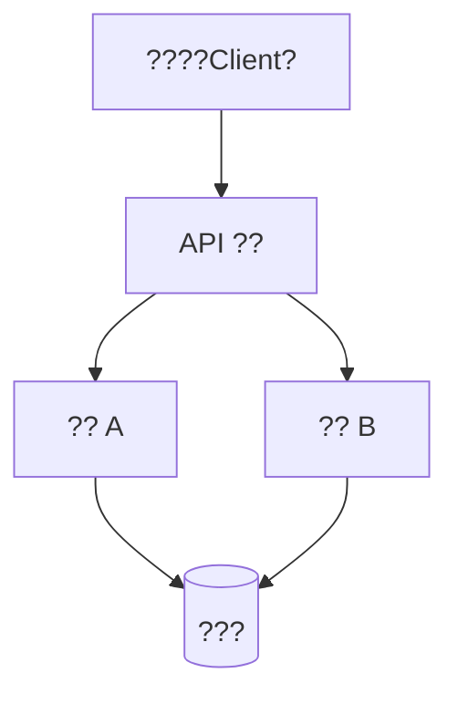

# image2mermaid

## Purpose

Turn document images into useful Obsidian Markdown representations.

The goal is not to avoid images; the goal is to preserve their semantic value in
a readable form.

## Non-negotiable rules

1. Do not skip conversion because the image is "too much work".
2. Do not output a bare statement such as "?????????? Mermaid".
3. Do not delete a semantically important image without replacing its meaning.
4. If a diagram is too complex for exact Mermaid, create a faithful simplified
   Mermaid diagram plus a short prose note about omitted visual detail.
5. If the image is not Mermaid-suitable, still return a useful Markdown action:
   table, local image link, prose description, or decorative removal.
6. Never leave broken `` references.

## Inputs

- Image path, URL, or already visible image
- Optional surrounding text, caption, page number, and document language
- Optional desired output language, default Simplified Chinese

## Workflow

### Step 1 ? Prepare the image

If the image is a file on disk, run:

```bash
python scripts/prepare_image.py <image_path>
```

For very large files, inspect metadata first:

```bash
python scripts/prepare_image.py <image_path> --no-base64
```

The script prints JSON metadata and, when safe, base64 image data.

### Step 2 ? Classify the image

Classify into exactly one primary category:

| Category | Use when | Required action |
|---|---|---|
| `mermaid` | Flowchart, architecture diagram, dependency graph, sequence diagram, class diagram, ER diagram, state machine, mind map, tree, lifecycle, pipeline | Produce Mermaid |
| `table` | Table screenshot, chart with legible values, matrix, comparison grid | Produce Markdown table |
| `keep` | Screenshot/photo/formula/chart where visual detail matters and cannot be faithfully converted | Keep relative image link with Chinese caption |
| `describe` | Visual information is useful but can be explained compactly | Produce concise Chinese prose |
| `decorative` | Logo, icon, spacer, background, purely decorative illustration | Remove reference cleanly |

### Step 3 ? Convert diagrams to Mermaid

For `mermaid`, produce a fenced Mermaid block.

Diagram selection:

| Image type | Preferred Mermaid |
|---|---|
| Flowchart, decision tree, pipeline | `flowchart TD` or `flowchart LR` |
| Architecture, component, dependency graph | `graph TD` or `graph LR` |
| Sequence / interaction | `sequenceDiagram` |
| UML class | `classDiagram` |
| Entity relationship | `erDiagram` |
| State machine | `stateDiagram-v2` |
| Timeline / project plan | `gantt` |
| Mind map / concept map | `mindmap` |
| Git branching | `gitGraph` |
| User journey | `journey` |

Mermaid requirements:

1. Include every clearly visible important node.
2. Include every important edge or relationship.
3. Translate labels to Chinese when the surrounding document is Chinese, while
   preserving important original technical terms in parentheses when helpful.
4. Use simple syntax if complex Mermaid syntax is risky.
5. Avoid Mermaid features that are likely unsupported by Obsidian.
6. If text is unclear, add a Mermaid comment beginning with `%%`.

Example:

````markdown

````

### Step 4 ? Handle non-Mermaid images

For `table`, output a Markdown table and preserve notes or units.

For `keep`, output:

```markdown

```

For `describe`, output a compact Chinese paragraph or callout:

```markdown
> [!NOTE] ????
> ??????
```

For `decorative`, remove the image reference and ensure surrounding prose still
reads naturally.

### Step 5 ? Return structured result

When this skill is used as part of another workflow, return a structured object
or equivalent Markdown note containing:

```json
{
  "action": "mermaid",
  "confidence": "high",
  "reason": "??????????",
  "markdown": "```mermaid\nflowchart TD\n    A --> B\n```"
}
```

Allowed `action` values:

- `mermaid`
- `table`
- `keep`
- `describe`
- `decorative`

## Quality rules

- Mermaid must be syntactically plausible and renderable.
- Prefer a simple valid diagram over a complex invalid diagram.
- Preserve meaning before visual styling.
- Do not hallucinate labels not visible in the image unless marked as inferred
  from surrounding context.
- Do not remove figure references unless the image is decorative or the sentence
  has been rewritten to preserve meaning.
- Translation must be consistent with the surrounding document glossary.
