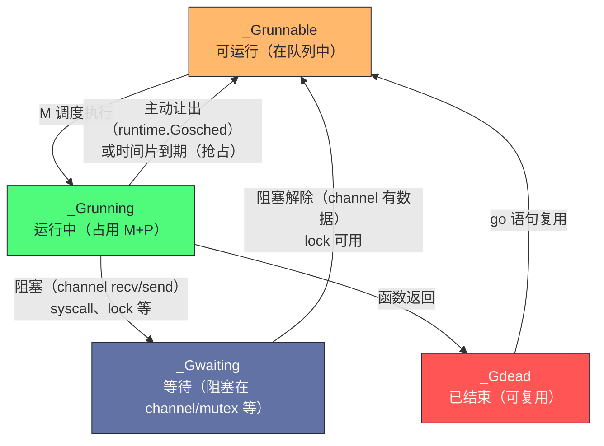

# Goroutine 与 GMP 调度器

**摘要：**

Goroutine 是 Go 并发模型的核心抽象——它是一种由 Go 运行时管理的轻量级"用户态线程"，创建代价极低（初始栈 2-8KB，创建耗时约 1μs），可以轻松启动数百万个并发任务。支撑 Goroutine 高效运行的是 Go 运行时的 **GMP 调度器**（G=Goroutine，M=Machine/OS线程，P=Processor/逻辑处理器）。本文从"为什么不直接用 OS 线程"的第一性原理出发，完整推导 GMP 三元组的设计动机，深入剖析工作窃取（Work Stealing）算法如何实现负载均衡，以及 Go 调度器经历的两次重大演进：从协作式调度（Go 1.13 及之前）到基于信号的异步抢占式调度（Go 1.14+）——这次演进彻底解决了"计算密集型 Goroutine 饥饿其他 Goroutine"的顽固问题。文章最后回到一个设计认知：GMP 模型是"用抽象隔离复杂性"的典范——P 这个抽象让"并行度控制"、"本地无锁队列"、"资源亲和性"三个问题用一个概念解决，是 Go 调度器设计的核心智慧。

---

## 第 1 章 为什么不直接用 OS 线程

### 1.1 OS 线程的代价

理解 Goroutine 存在的意义，必须先理解 OS 线程的局限性。OS 线程是操作系统提供的并发原语，它成熟、稳定，但在高并发场景下有四个不可接受的代价。

**代价一：创建与销毁的开销大**。创建一个 OS 线程需要调用 `clone()`（Linux）或 `CreateThread()`（Windows）系统调用，内核需要分配线程控制块、初始化信号掩码、设置线程本地存储……这个过程约需 **10-100μs**，对于需要处理数千个并发请求的服务，如果每个请求都创建一个线程，仅创建/销毁的开销就无法接受。销毁线程同样需要系统调用，开销类似。

**代价二：内存占用高**。每个 OS 线程都需要一个固定大小的**内核栈**（Linux 默认 8MB）和一个**用户栈**（glibc 默认 8MB，通过 `ulimit -s` 配置）。一个进程同时存在 1000 个线程，仅栈就占用 16GB 内存——这在现代服务器上是灾难性的。即使配置较小的栈（如 1MB），1000 个线程仍需 1GB，而 Go 的 1000 个 Goroutine 只需约 2-8MB（初始栈 2-8KB × 1000）。

**代价三：上下文切换开销**。OS 线程切换需要：保存当前线程的寄存器状态、切换地址空间（如果跨进程）、更新 CPU 缓存（cache flush）、系统调用陷入内核……每次切换约需 **1-10μs**。对于每秒数百万次切换的高并发场景，这是显著的性能损耗。线程切换的"cache flush"尤其昂贵——切换后新线程的栈和数据不在 cache 中，需要从内存重新加载，导致大量 cache miss。

**代价四：调度不可控**。OS 的线程调度由内核决定，应用程序无法感知，也无法优化。内核的调度器是通用的——它不知道哪些线程在等待 I/O、哪些可以立即运行、哪些有优先级要求。Go 运行时能用更少的 OS 线程，高效地服务更多的 Goroutine——因为 Go 了解自己应用的特点（哪些 Goroutine 在等待 I/O，哪些可以立即运行），而 OS 内核不知道。这个"应用层调度比内核调度更懂应用"是用户态调度的根本优势。

### 1.2 协程：用户态调度的思路

**协程（Coroutine）**是比线程更轻量的并发抽象，其核心思想是：**将调度从内核态移到用户态**。多个协程共享同一个或少数几个 OS 线程，协程之间的切换完全在用户态完成，不需要系统调用，不需要内核介入。

用户态切换的代价只有：保存/恢复少量寄存器（Go 的协程切换约保存 10 个寄存器，耗时约 **200ns**，是 OS 线程切换的 1/10 到 1/50）。这个巨大的差距源于"用户态切换不需要系统调用"——没有内核陷入、没有 cache flush、没有地址空间切换，只是保存和恢复几个寄存器。

**协程 vs 线程的核心区别**：
- OS 线程由内核调度，被动（内核可以随时抢占）；
- 协程由用户态运行时调度，主动（需要协程主动让出，或运行时在某些点介入）。

这个"主动 vs 被动"的区别是协程设计的核心张力——纯协作式协程（如 Python 的 asyncio）需要协程主动让出，一个不配合的协程会阻塞所有其他协程；Go 的 Goroutine 通过 Go 1.14 的异步抢占解决了这个问题，既有协作让出点，也有强制抢占机制。

Go 的 Goroutine 是协程的工程化实现，但比传统协程更复杂——它结合了**多线程**（可以真正并行利用多核 CPU）和**协作/抢占**（既有协作让出点，也有抢占机制）的优点。传统协程（如 Python asyncio、JavaScript async/await）通常是单线程的，无法利用多核；Go 的 Goroutine 可以在多个 OS 线程上并行运行，是"M:N 调度"（M 个 Goroutine 映射到 N 个 OS 线程）。

---

## 第 2 章 GMP 模型：三元组的设计动机

### 2.1 最简单的模型：GM（为什么不够）

在 Go 1.0（2009年）到 Go 1.1（2013年）之间，Go 的调度器是一个简单的 **GM 模型**：全局只有一个运行队列（Global Run Queue），所有的 M（OS 线程）都从这个队列取 G（Goroutine）来运行。

```
GM 模型：
+------------------+
| Global Run Queue |  ← 所有可运行的 Goroutine 在这里排队
+------------------+
       ↑↓ （每次取/放都需要加锁）
  M1   M2   M3   M4   ← OS 线程，直接从全局队列取 G
```

**GM 模型的问题**：

**问题一：全局队列锁竞争**。每个 M 需要频繁地从全局队列取 G 或将 G 放回队列，这需要对全局队列加锁。在多核 CPU 上，多个 M 同时争夺这把锁，锁竞争成为性能瓶颈——CPU 核数越多，竞争越激烈，可扩展性极差（性能随核数增加的提升趋于平缓甚至下降）。这是"共享资源在多核下的经典瓶颈"——任何全局共享的队列都会在多核下成为锁竞争热点。

**问题二：G 的本地性差**。M 在执行 G 时，会将 G 用到的数据加载到 CPU cache 中。执行完后，G 被放回全局队列；下次 G 被另一个 M 取到运行时，需要重新加载 cache——G 与 M 之间没有亲和性，cache locality 差。这个"cache locality 差"的问题在多核 CPU 上尤其严重——每个核有自己的 L1/L2 cache，G 在核间迁移会导致大量 cache miss。

**问题三：系统调用阻塞整个线程**。当 G 进行系统调用（如文件 I/O）时，执行它的 M 会被 OS 阻塞。此时需要创建新的 M 来接管其他 G 的工作，M 的数量随系统调用次数增加，可能创建大量 OS 线程。GM 模型没有"P 移交"机制，系统调用阻塞会导致 M 数量失控。

### 2.2 引入 P：本地队列与无锁分配

Go 1.1 引入了 **P（Processor，逻辑处理器）**，彻底解决了全局锁竞争问题。P 是 GMP 模型中最关键的抽象——它不是 CPU 核，也不是 OS 线程，而是一个"逻辑处理器"概念，承载了本地队列和线程本地资源。

```
GMP 模型：
+---+   +---+   +---+   +---+    ← P（逻辑处理器，数量 = GOMAXPROCS）
| P |   | P |   | P |   | P |    每个 P 有自己的本地 Run Queue（无锁）
+---+   +---+   +---+   +---+
  |       |       |       |
  M1      M2      M3      M4     ← M（OS 线程）与 P 绑定
  
+---------------------------+
|      Global Run Queue     |   ← 全局队列（有锁，但很少用到）
+---------------------------+
```

**P 的核心作用**：

1. **本地 Run Queue（无锁）**：每个 P 维护一个包含最多 256 个 G 的循环队列，M 从绑定的 P 的本地队列取 G，不需要加锁（因为每个 P 同时只有一个 M 在使用它）——这是 P 解决全局锁竞争的核心机制；

2. **资源隔离**：P 持有执行 G 所需的所有本地资源——`mcache`（见[[08 Go 内存分配器——mcache、mcentral 与 mheap]]）、内存分配缓冲、GC 工作队列等。M 切换时（如系统调用），只需换一个 P 绑定，本地资源跟着 P 走，不需要复制——这是 P 解决 cache locality 的核心机制；

3. **GOMAXPROCS 限制并行度**：P 的数量由 `GOMAXPROCS` 环境变量控制（默认等于 CPU 核数），这是真正并行执行的 G 数量的上限——最多只有 `GOMAXPROCS` 个 G 同时在不同 CPU 核上运行——这是 P 控制并行度的核心机制。

P 这个抽象的精妙之处在于"一个概念解决三个问题"——本地队列解决锁竞争，资源持有解决 cache locality，数量控制解决并行度。如果没有 P，这三个问题需要三个独立的机制解决；有了 P，一个概念统一了它们。这是"用抽象隔离复杂性"的典范——P 把"并行度控制"、"本地无锁队列"、"资源亲和性"三个复杂性打包到一个概念中，让调度器的其他部分可以基于 P 这个简单抽象工作。

### 2.3 G、M、P 三者的关系

用一句话描述：**G 在 P 的 Run Queue 中等待，M 绑定到 P 后从其 Run Queue 取 G 执行**。

```go
// runtime/runtime2.go（概念性）
type g struct {
    stack         stack    // goroutine 的栈（可增长）
    sched         gobuf    // 调度上下文（保存寄存器、栈指针，用于切换）
    status        uint32   // 当前状态（running/runnable/waiting/dead...）
    m             *m       // 当前在哪个 M 上运行（如果在运行）
    // ...
}

type m struct {
    g0            *g       // 调度专用的 g（所有调度代码在 g0 的栈上运行）
    curg          *g       // 当前正在运行的 goroutine
    p             puintptr // 当前绑定的 P
    // ...
}

type p struct {
    runq          [256]guintptr  // 本地 Run Queue（环形缓冲区）
    runqhead      uint32         // 队列头指针
    runqtail      uint32         // 队列尾指针
    mcache        *mcache        // 内存分配缓存
    // ...
}
```

`g0` 是每个 M 上的一个特殊 Goroutine——它是"调度专用 Goroutine"，所有调度代码（schedule、findRunnable、gogo 等）都在 g0 的栈上运行。用户 Goroutine（curg）运行时使用自己的栈，调度切换时先切到 g0 的栈，再从 g0 切到下一个用户 Goroutine。这个"g0 作为调度中介"的设计让调度代码不需要依赖用户 Goroutine 的栈状态，避免了"在用户栈上调度用户栈"的递归问题。

**关键状态转换**：



G 的状态转换是调度器的核心逻辑——_Grunnable 到 _Grunning 是"被调度执行"，_Grunning 到 _Grunnable 是"被抢占或主动让出"，_Grunning 到 _Gwaiting 是"阻塞"，_Gwaiting 到 _Grunnable 是"阻塞解除"。这个状态机让调度器可以精确管理每个 G 的生命周期。

### 2.5 G/M/P 数据结构的详细字段

理解 G/M/P 的详细字段有助于深入理解调度器的实现：

**g 结构体的关键字段**：
- `stack`：Goroutine 的栈（可增长，初始 2KB，最大 1GB）；
- `sched`：调度上下文（gobuf），保存寄存器和栈指针，用于切换；
- `status`：G 的状态（_Grunnable/_Grunning/_Gwaiting/_Gdead 等）；
- `m`：当前绑定的 M（如果正在运行）；
- `atomicstatus`：原子状态，用于无锁读取；
- `goid`：Goroutine ID（用于调试和 trace）；
- `waitsince`：等待开始时间（用于 sysmon 检测长时间阻塞）；
- `waitreason`：等待原因（如 "chan receive"、"select"）。

**m 结构体的关键字段**：
- `g0`：调度专用 Goroutine（所有调度代码在 g0 栈上运行）；
- `curg`：当前运行的用户 Goroutine；
- `p`：当前绑定的 P；
- `spinning`：是否处于自旋状态（正在寻找工作）；
- `nextp`：下一个要绑定的 P（用于 P 移交）；
- `park`：M 的休眠/唤醒信号量；
- `lockedg`：锁定的 G（用于 LockOSThread）。

**p 结构体的关键字段**：
- `runq`：本地 Run Queue（256 元素的环形缓冲区）；
- `runqhead/runqtail`：队列头尾指针；
- `mcache`：内存分配缓存（P 本地，无锁分配）；
- `status`：P 的状态（_Pidle/_Prunning/_Psyscall/_Pgcstop 等）；
- `m`：当前绑定的 M；
- `deferpool`：defer 复用池（P 本地，减少 defer 分配）；
- `goidcache`：Goroutine ID 缓存（批量分配 goid，减少全局锁）。

这些字段展示了 GMP 模型的实现细节——每个结构体都承载了多个职责，通过精心设计的字段协作实现高效调度。理解这些字段有助于在阅读 `runtime/proc.go` 源码时快速定位逻辑，以及在调试 Goroutine 问题时理解 `runtime.Stack` 和 `pprof goroutine` 的输出。这个"G/M/P 数据结构详解"是深入理解 GMP 调度器的基础。

---

## 第 3 章 工作窃取：负载均衡的精妙设计

### 3.1 为什么需要工作窃取

在 GMP 模型中，G 被优先放入当前 P 的本地队列（无锁，高效）。但这可能导致**负载不均衡**：某些 P 的队列满了（G 过多），而另一些 P 的队列为空（M 空闲）。

工作窃取（Work Stealing）算法解决这个问题：当一个 M 发现其绑定的 P 的本地队列为空时，它不会立刻休眠，而是**尝试从其他 P 的本地队列"偷"一半的 G 来运行**。

工作窃取是分布式负载均衡的经典算法——它不需要中央协调（不像 GM 模型的全局队列），每个 P 自主决定是否窃取、从谁窃取。这个"去中心化"的特性让工作窃取在多核环境下扩展性极好——核数越多，可窃取的来源越多，均衡效果越好。

### 3.2 调度循环的完整流程

M 的主调度循环（`schedule()` 函数）执行以下查找顺序：

```
M 的调度循环（优先级从高到低）：

1. 每执行 61 次本地调度，检查一次全局队列（防止全局队列饥饿）

2. 从当前 P 的本地队列取 G（无锁，O(1)）

3. 本地队列为空时：
   a. 从全局队列取一批 G（有锁）
   b. 从网络轮询器（netpoll）取已就绪的 G（I/O 完成的 G）
   c. 工作窃取：随机选择一个受害者 P，从其本地队列偷走一半的 G

4. 如果所有来源都为空：
   a. 将当前 M 与 P 解绑，P 进入空闲列表
   b. M 进入休眠（等待被唤醒）
```

步骤 1 的"每 61 次检查全局队列"是一个防饥饿机制——如果没有这个检查，全局队列中的 G 可能长期不被调度（所有 M 都只从本地队列取）。61 这个数字是经验值——足够频繁以防止全局队列饥饿，又足够稀疏以避免全局队列锁竞争。

**工作窃取的细节**：

```go
// runtime/proc.go（概念性）
func stealWork(now int64, p *p) (gp *g, inheritTime bool) {
    // 尝试 4 次，每次随机选一个受害者 P
    for i := 0; i < 4; i++ {
        victim := randomP()  // 随机受害者
        if victim == p {
            continue
        }
        
        // 从受害者 P 的本地队列偷走一半
        n := len(victim.runq) / 2
        if n == 0 {
            continue
        }
        
        // 将偷来的 G 放入当前 P 的本地队列（第一个直接返回执行）
        gp = runqsteal(p, victim, n)
        if gp != nil {
            return gp, false
        }
    }
    return nil, false
}
```

**为什么偷"一半"而不是"全部"**？偷全部会让受害者 P 立即变空，需要再次窃取；偷一半是在"减少受害者的工作量"和"让受害者保持活跃"之间的平衡——实践中一半策略的负载均衡效果最好。这个"偷一半"的策略是工作窃取算法的经典设计，在 Java 的 ForkJoinPool、Rust 的 Rayon 等并行框架中也被采用。

### 3.3 系统调用时的 P 移交

当 G 执行系统调用（如 `read()`、`write()`）时，执行该 G 的 M 会被 OS 阻塞。此时如果 P 仍绑定在这个 M 上，P 本地队列中的其他 G 就无法运行——这是浪费。

Go 的解法：系统调用前，M **主动解绑 P**，让 P 转移给其他 M（如果有空闲 M，唤醒它；否则创建新的 M）：

```
系统调用期间的 P 转移：

正常状态：G1 在 M1 上运行，M1 绑定 P1
                     M1(running G1)
                         |
                         P1 (runq: G2, G3, G4)

G1 进入系统调用：
1. M1 保存状态，解绑 P1
2. P1 被转移给空闲 M2（或新创建 M2）
3. M1 陷入系统调用阻塞
   M1(blocked G1)     M2 绑定 P1，继续运行 G2, G3, G4
   
系统调用返回：
4. M1 苏醒，G1 重新变为 _Grunnable
5. M1 尝试获取一个空闲的 P；如果没有，G1 被放入全局队列，M1 进入休眠
```

这个机制确保了即使有 G 在做长时间的系统调用，其他 G 也不会因此饥饿——P 会及时被转移给其他 M。这是 GMP 模型处理 I/O 密集型负载的关键——I/O 阻塞不会浪费 P 的计算能力，P 会立即被复用去运行其他 G。

P 移交的代价是"可能创建大量 M"——如果 1000 个 G 同时阻塞在系统调用，可能创建 1000 个 M（每个阻塞的 M 持有一个 G）。Go 通过 `runtime.GOMAXPROCS` 限制 P 的数量（而非 M 的数量），M 的数量可以超过 P（默认上限 10000）。这个"P 有限，M 可多"的设计让 Go 既能控制并行度（P 数量），又能处理大量 I/O 阻塞（M 数量可增长）。

---

## 第 4 章 调度时机：协作式 vs 抢占式

### 4.1 协作式调度：Go 1.13 及之前

早期 Go 调度器是**协作式**的——Goroutine 只在特定的"调度点"才会主动让出 CPU。这些调度点包括：
- 函数调用时（编译器在函数序言处插入栈增长检测，顺便检查是否需要切换）；
- 系统调用前后；
- `runtime.Gosched()` 显式让出；
- channel 操作（阻塞时）；
- GC STW 时（强制暂停所有 G）。

**协作式调度的致命缺陷**：如果一个 Goroutine 执行的是**没有函数调用的紧密循环**（如纯计算），它永远不会经过调度点，就永远不会被调度器打断——它会独占 M 和 P，导致同一个 P 上的其他 G 饥饿，甚至阻止 GC 的 STW：

```go
// 这段代码在 Go 1.13 及之前会导致其他 Goroutine 饥饿
func spin() {
    for {
        // 死循环，没有函数调用，没有 channel，没有系统调用
        // 调度器无法打断它！
    }
}

go spin()
go func() {
    fmt.Println("我永远不会被执行（在同一个 P 上）")
}()
```

Go 1.14 之前，`GOMAXPROCS=1` 时，上面的代码会让第二个 Goroutine 永远无法运行。即使 `GOMAXPROCS>1`，第二个 Goroutine 也会被推迟到另一个 P 上运行，与 spin 共存但受影响。这个"紧密循环阻塞调度"的问题是协作式调度的根本缺陷——它依赖"协程主动让出"，但无法强制不配合的协程让出。

### 4.2 基于信号的异步抢占：Go 1.14

Go 1.14 引入了**基于信号的异步抢占**（Signal-based Asynchronous Preemption），彻底解决了协作式调度的饥饿问题。这是 Go 调度器历史上最重要的改进——它让 Go 真正具备了"抢占式调度"能力，任何 Goroutine 都无法无限期占用 CPU。

**实现机制**：

```
Go 运行时有一个后台线程 sysmon（System Monitor），持续运行（不依赖 P）。
sysmon 每 10ms 检查一次所有 P 的状态：
  - 如果某个 P 绑定的 G 已经运行了超过 10ms（retake 阈值）
  - sysmon 向运行该 G 的 M 发送 SIGURG 信号（Unix）
  - M 的信号处理函数被触发（asyncPreempt）
  - 信号处理函数将 G 标记为"应被抢占"
  - 当 G 执行到下一条安全点指令时，真正发生切换
```

**为什么用 SIGURG 而不是 SIGINT 或其他信号**？SIGURG（紧急数据信号）在 Go 程序正常运行中从不使用，不会与用户代码的信号处理冲突。SIGINT 被 Ctrl+C 使用，SIGTERM 被 kill 使用，SIGSEGV/SIGBUS 被内存错误使用——这些信号都有既定用途，不能用于抢占。SIGURG 是一个"几乎没用过"的信号，借用它不会产生冲突。

**安全点（Safe Point）**：抢占不能在任意指令处发生——如果在一条指令的中间打断（如在修改 map 或 slice header 的中途），会导致数据结构处于不一致状态。Go 编译器为每个指令标注是否是安全点，抢占只在安全点发生。这个"安全点"机制让异步抢占不会破坏数据结构完整性——信号处理函数只是"标记"抢占意图，真正的切换在下一个安全点发生。

**抢占后发生了什么**：

```
G 被抢占后的状态转换：

运行中 G（_Grunning）
   ↓ 收到 SIGURG，asyncPreempt 执行
G 保存当前执行上下文（寄存器、栈指针）
   ↓
G 状态变为 _Grunnable，放回 P 的本地队列（或全局队列）
   ↓
M 重新调度，从队列取下一个 G 运行
   ↓
被抢占的 G 在之后某个时间点再次被调度，从中断点继续执行
```

**效果**：Go 1.14 之后，即使是纯计算的 Goroutine（无函数调用的死循环），也会被定期抢占，其他 G 得以公平地获得 CPU 时间。GC 的 STW 也因此更加可靠（不再需要等待某个"顽固"的 G 主动让出）。这个改进让 Go 真正适合"计算密集型 + 低延迟"的场景——之前 Go 在这类场景下可能因为协作式调度而出现延迟抖动。

### 4.3 异步抢占的边界与限制

异步抢占虽然强大，但也有一些边界和限制需要注意：

**不支持抢占的场景**：某些场景下异步抢占无法生效——如 CGO 调用期间（C 代码不受 Go 运行时控制）、runtime 关键区段（持有调度器锁）、汇编代码段。在这些场景下，Goroutine 仍然可能"卡住"，但 Go 运行时会在退出这些区段时尽快处理抢占请求。

**信号开销**：每次抢占都需要发送信号和处理信号，有约 1-10μs 的开销。对于"频繁抢占"的场景（如大量短时间 Goroutine），信号开销累积可观。但 sysmon 的 10ms 检查间隔保证了抢占不会过于频繁——只有运行超过 10ms 的 G 才会被抢占。

**与用户信号处理的冲突**：如果用户代码注册了 SIGURG 的 handler，可能与调度器冲突。Go 运行时通过"信号前置处理"避免这个冲突——所有信号先经过 Go 运行时的处理，再决定是否转发给用户 handler。这个机制让 Go 运行时能"截获"SIGURG 用于抢占，同时不影响用户对其他信号的处理。

**GC 与抢占的协作**：GC 的 STW 需要所有 Goroutine 到达安全点——异步抢占让 GC 能更快地"暂停所有 G"，因为即使紧密循环的 G 也能被信号抢占。这个"GC 与抢占协作"是 Go 1.14 后 GC STW 更稳定的原因——之前 GC 可能因为"顽固 G"而延长 STW，现在异步抢占让所有 G 都能被及时暂停。

这些"异步抢占的边界"是 Go 调度器的已知限制——理解它们有助于在"抢占不生效"的场景诊断问题（如 CGO 期间的延迟），以及在"信号冲突"场景正确处理（如避免注册 SIGURG handler）。这个"异步抢占边界"是 Go 调度器的进阶知识，理解它才能在生产中正确诊断调度相关的延迟问题。

---

## 第 5 章 sysmon：调度器的守护线程

### 5.1 sysmon 是什么

`sysmon`（System Monitor）是 Go 运行时的一个特殊 OS 线程，它**不绑定任何 P**（不消耗 GOMAXPROCS 配额），持续在后台运行，执行各种维护任务。sysmon 是 Go 调度器的"守护者"——它监控整个运行时的健康状态，及时干预异常情况。

```go
// runtime/proc.go（概念性）
func sysmon() {
    for {
        // 根据当前负载动态调整休眠时间（20μs 到 10ms 之间）
        sleep := delay()
        
        // 1. 抢占运行超过 10ms 的 Goroutine
        retake(now)
        
        // 2. 释放空闲超过 5 分钟的 OS 线程（归还系统资源）
        
        // 3. 将阻塞在系统调用中超时的 P 强制移交
        
        // 4. 触发网络轮询（检查是否有 I/O 已就绪）
        
        // 5. 如果超过 2 分钟没有 GC，强制触发一次 GC
        
        // 6. 处理 timer（定时器到期的 G 放回运行队列）
        
        usleep(sleep)
    }
}
```

sysmon 的休眠时间是动态调整的——空闲时休眠 10ms（减少 CPU 开销），繁忙时缩短到 20μs（及时响应）。这个"动态休眠"让 sysmon 在"及时性"和"低开销"之间平衡。

### 5.2 sysmon 的 retake：抢占与 P 移交

`retake` 函数负责两件事：

**事情一（抢占长时间运行的 G）**：如上节所述，向运行超过 10ms 的 G 的 M 发送 SIGURG。

**事情二（移交阻塞在系统调用的 P）**：

```
retake 检查每个 P 的状态：

如果 P 状态是 _Psyscall（某个 M 正在系统调用中）：
  且该 P 没有其他可运行的 G（本地队列为空），
  且距离最后一次系统调用已经超过阈值（通常是 20μs）：
    → sysmon 将该 P 的状态改为 _Pidle，移交给其他 M
    → 这确保了系统调用中的 M 不会长期"占着茅坑不拉屎"
```

这就是为什么 Go 能够在有大量 I/O 密集型 Goroutine 的同时，也高效地运行计算密集型 Goroutine——sysmon 确保阻塞的系统调用不会长时间霸占 P。sysmon 是 Go 调度器的"主动干预机制"——没有 sysmon，Go 调度器只能被动响应（等 G 主动让出或阻塞）；有了 sysmon，Go 调度器可以主动干预（抢占长运行 G、移交阻塞 P）。

### 5.3 sysmon 的其他职责

除了抢占和 P 移交，sysmon 还承担其他维护职责：

**网络轮询检查**：sysmon 定期检查 netpoller 是否有就绪的网络事件——如果有，唤醒对应的 Goroutine。这个"网络轮询检查"让 I/O 密集型 Goroutine 能及时被唤醒，而不需要等待下次调度。

**GC 触发检查**：sysmon 检查是否需要触发 GC——如果距离上次 GC 超过 2 分钟（forcegcperiod），sysmon 触发强制 GC。这个"强制 GC"防止堆中存在长期不清理的"僵尸"对象。

**栈收缩检查**：sysmon 检查是否有 Goroutine 的栈可以收缩——如果某个 G 的栈使用量远小于栈容量，sysmon 触发栈收缩。这个"栈收缩"避免了"曾经需要大栈但现在不需要"的 Goroutine 长期占用大内存。

**延迟清理检查**：sysmon 检查是否有延迟清理的任务（如 timer 的清理）——如果有，执行清理。这个"延迟清理"让运行时能及时回收不再需要的资源。

这些"sysmon 的其他职责"让 sysmon 成为 Go 运行时的"万能守护者"——不仅负责调度器的抢占和 P 移交，还负责网络轮询、GC 触发、栈收缩、延迟清理等多种维护任务。理解 sysmon 的完整职责有助于理解"Go 运行时为什么需要一个独立的后台线程"——很多维护任务需要"不依赖 P"的执行环境，sysmon 是唯一满足这个条件的线程。这个"sysmon 的完整职责"是 Go 运行时维护机制的核心知识。

---

## 第 6 章 Goroutine 的创建、切换与复用

### 6.1 go 语句的底层：newproc

`go func()` 语法在编译后等价于调用 `runtime.newproc`：

```go
// runtime/proc.go（简化）
func newproc(fn *funcval) {
    // 1. 从 P 的 gFree 列表取一个已结束的 G 复用（避免频繁分配）
    //    如果没有空闲 G，创建新的 G（分配 2-8KB 初始栈）
    gp := gfget(p)
    if gp == nil {
        gp = malg(_StackMin)  // 分配最小栈（2KB）
    }
    
    // 2. 初始化 G 的栈，设置函数入口
    gp.startpc = fn.fn
    
    // 3. 将 G 放入当前 P 的本地队列（或全局队列）
    runqput(p, gp, true)
    
    // 4. 如果有空闲的 P，唤醒一个 M 来运行（避免 G 在队列中等待）
    wakep()
}
```

**G 的复用机制**：Goroutine 结束后（函数返回），G 的结构体不会立即释放，而是放入 P 的 `gFree` 列表（本地）或全局 `sched.gFree` 列表（全局），等待下次 `go` 语句复用——这避免了频繁的内存分配和 GC 压力。这个"G 复用"机制让高频创建 Goroutine 的场景（如每请求一个 Goroutine 的 HTTP 服务）不会产生大量 GC 压力——G 的结构体被反复复用，只有栈空间需要重新初始化。

### 6.2 goroutine 切换的开销

Goroutine 切换（`goswitch`）只需要保存和恢复少量寄存器（SP、PC 以及平台相关的几个 callee-saved 寄存器），整个过程在用户态完成，约耗时 **200-400ns**——比 OS 线程切换（约 1-10μs）快约 5-50 倍。

切换发生在什么时候：
- G 进入阻塞状态（channel 操作、mutex 等）；
- G 调用 `runtime.Gosched()` 主动让出；
- G 被 sysmon 抢占（Go 1.14+）；
- G 进行系统调用（实际上是 M 被阻塞，Go 会切换到 `g0` 调度栈）。

这个"200-400ns 的切换开销"是 Goroutine 高并发的基石——一个每秒切换 100 万次 Goroutine 的程序，切换总开销只有 0.2-0.4 秒，而 OS 线程做同样切换需要 1-10 秒。这个差距让 Go 能支持百万级并发，而线程模型只能支持千级。

### 6.3 GOMAXPROCS 的设置建议

```go
import "runtime"

// 默认：等于 CPU 核数（Go 1.5 之后）
n := runtime.GOMAXPROCS(0)  // 0 表示只查询不设置，返回当前值

// 设置为 CPU 核数的 2 倍（I/O 密集型服务）
runtime.GOMAXPROCS(runtime.NumCPU() * 2)

// 在容器环境中，需要读取 cgroup 限制，而不是宿主机 CPU 数
// 推荐使用 uber-go/automaxprocs 库：
// import _ "go.uber.org/automaxprocs"
// 它会自动读取 cgroup cpu.quota，正确设置 GOMAXPROCS
```

> [!warning] 生产避坑：容器中的 GOMAXPROCS 误配置
> 在 Kubernetes 容器中，`runtime.NumCPU()` 返回的是**宿主机**的 CPU 核数（如 96 核），而不是容器的 CPU limit（如 2 核）。如果不做任何处理，Go 程序会创建 96 个 P，导致大量的 OS 线程被创建（超出容器 CPU 配额），程序被 throttled（CPU 被节流），实际性能反而下降。**正确做法**：使用 `go.uber.org/automaxprocs` 包，它会读取 `/sys/fs/cgroup/cpu/cpu.cfs_quota_us` 和 `cpu.cfs_period_us`，正确计算并设置 `GOMAXPROCS`。这个坑在 Go 容器化部署中极其常见——很多 Go 服务在 Kubernetes 上的性能问题都源于 GOMAXPROCS 误配置。

### 6.3 Goroutine 栈的管理

Goroutine 的栈管理是 Go 支持百万级并发的关键——理解栈管理有助于理解"为什么 Goroutine 比 OS 线程轻量"：

**栈的初始大小**：Go 1.4+ Goroutine 的初始栈大小为 2KB（早期 Go 1.0 是 8KB 的分段栈）。2KB 的初始大小让"创建 100 万 Goroutine"只需约 2GB 内存（100 万 × 2KB），而 100 万 OS 线程需要约 8TB（100 万 × 8MB 默认栈）——这是 Goroutine 比 OS 线程轻量的核心原因。

**栈的按需增长**：Goroutine 的栈可以按需增长（最大 1GB）。当栈空间不足时，运行时分配一个更大的栈（通常是当前的 2 倍），将旧栈的内容拷贝到新栈，并调整所有指向旧栈的指针。这个"栈拷贝"过程需要暂停该 Goroutine（但不需要 STW，只影响单个 Goroutine）。

**栈的收缩**：GC 时如果检测到 Goroutine 的栈使用量远小于栈容量，会收缩栈（通常是当前的一半），释放内存。栈收缩避免了"曾经需要大栈但现在不需要"的 Goroutine 长期占用大内存。

**栈拷贝的指针调整**：栈拷贝需要调整所有指向旧栈的指针——运行时通过"栈帧中的指针位图"知道哪些是指针，然后调整这些指针。这个"指针调整"是栈拷贝的复杂部分，也是 Go 1.3 从分段栈改为连续栈的原因——连续栈的拷贝比分段栈的链表管理更简单。

这个"栈管理"是 Goroutine 轻量性的基础——2KB 初始栈 + 按需增长让 Goroutine 既能"轻量创建"又能"按需扩展"。理解栈管理有助于理解"为什么 Goroutine 可以创建百万级"——2KB 初始栈是关键，OS 线程的 8MB 初始栈让百万级线程不现实。这个"栈管理"是 Go 并发模型的核心机制之一。

---

## 第 7 章 GMP 设计的认知启示

### 7.1 用抽象隔离复杂性

GMP 模型是"用抽象隔离复杂性"的典范——P 这个抽象让"并行度控制"、"本地无锁队列"、"资源亲和性"三个问题用一个概念解决。如果没有 P，这三个问题需要三个独立的机制解决（并行度用一个计数器、本地队列用线程本地存储、资源亲和性用显式绑定）；有了 P，一个概念统一了它们。这个"一个抽象解决多个问题"的设计是 Go 调度器的核心智慧——P 不是 CPU 核，也不是 OS 线程，而是一个"逻辑处理器"概念，它恰好能同时承载这三个职责。

### 7.2 M:N 调度的权衡

GMP 是"M:N 调度"——M 个 Goroutine 映射到 N 个 OS 线程。这个模型与"1:1 调度"（每个 Goroutine 一个线程，如 Java）和"N:1 调度"（所有 Goroutine 一个线程，如 Python asyncio）相比，各有优劣：

- **1:1 调度**：简单（OS 调度器负责），但并发数受线程开销限制（千级）；
- **N:1 调度**：高并发（百万级），但无法利用多核（单线程）；
- **M:N 调度**：高并发 + 多核利用，但实现复杂（需要用户态调度器）。

Go 选择 M:N 调度是因为它同时需要"高并发"和"多核利用"——这是 Go 的设计目标决定的。M:N 调度的复杂性（GMP 模型、工作窃取、抢占、P 移交）是 Go 运行时最复杂的部分，但这个复杂性换来了"百万级并发 + 多核并行"的能力，是 Go 并发模型的根基。

### 7.3 调度器的演进哲学

Go 调度器的演进（GM → GMP → 异步抢占）体现了"渐进优化"的哲学——先解决最紧迫的问题（GM 的全局锁竞争用 P 解决），再解决次紧迫的问题（协作式调度的饥饿用异步抢占解决）。这个"先解决最痛的，再解决次痛的"的演进策略让 Go 调度器在每个阶段都"够用"，而不是"一次性做到完美"。这种渐进优化是 Go 运行时各个子系统的共同演进模式——GC、调度器、内存分配器都是逐步演进的，每一步都解决当时最紧迫的问题。

### 7.4 与其他语言并发模型的对比

GMP 模型与其他语言的并发模型有显著差异，理解这些差异有助于理解 Go 并发模型的设计取向：

| 语言 | 并发模型 | 调度方式 | 并发级别 | 多核支持 |
| --- | --- | --- | --- | --- |
| Go | Goroutine + GMP | M:N 用户态调度 | 百万级 | 原生多核 |
| Java | Thread + Fork/Join | 1:1 OS 调度 | 千级 | 原生多核 |
| Python | asyncio | N:1 单线程 | 万级 | 单核（GIL） |
| Erlang | Process + VM 调度 | M:N VM 调度 | 千万级 | 原生多核 |
| Rust | async + tokio | M:N 用户态调度 | 百万级 | 原生多核 |

**与 Java 的对比**：Java 用 OS 线程（1:1 调度），并发数受线程开销限制（千级）。Go 用 Goroutine（M:N 调度），并发数可达百万级。这个差异让 Go 在"高并发服务"场景（如微服务、API 网关）比 Java 更轻量。但 Java 的 1:1 调度更简单（OS 调度器负责），不需要用户态调度器的复杂性。

**与 Python asyncio 的对比**：Python asyncio 用单线程协程（N:1 调度），并发数虽高但无法利用多核（GIL 限制）。Go 的 GMP 用多 P 原生支持多核，每个 P 独立调度，无 GIL 限制。这个差异让 Go 在"计算密集 + 高并发"场景比 Python asyncio 更有优势。

**与 Erlang 的对比**：Erlang 的 Process 比 Goroutine 更轻量（约 300 字节），并发数可达千万级。但 Erlang 的 Process 间通信用消息传递（无共享内存），而 Go 的 Goroutine 间通信用 Channel（基于共享内存的 CSP 模型）。这个差异反映了两种并发哲学——Erlang 的"无共享"更安全但效率较低，Go 的"Channel + 共享内存"更灵活但需要程序员小心数据竞争。

**与 Rust async 的对比**：Rust 的 async + tokio 与 Go 的 Goroutine + GMP 类似（都是 M:N 调度），但 Rust 的 async 是"零成本抽象"（编译期生成状态机，无运行时开销），而 Go 的 Goroutine 有运行时开销（栈管理、调度器）。这个差异让 Rust 在"极致性能"场景更有优势，但 Go 在"开发效率"场景更有优势（Goroutine 的语法比 async/await 更简洁）。

这个"与其他语言对比"展示了 Go 并发模型的定位——比 Java 轻量，比 Python 多核，比 Erlang 灵活，比 Rust 简洁。Go 并发模型在"高并发 + 多核 + 开发效率"三个维度取得了良好平衡，这是 Go 在云原生场景受欢迎的原因。理解这个对比有助于在技术选型时选择合适的语言——不同并发模型有不同的适用场景。

### 7.5 高频面试题

**Q1：GMP 模型中 G、M、P 分别是什么？为什么需要 P 这个抽象？**

G 是 Goroutine，存储执行栈和调度上下文；M 是 OS 线程，实际执行 G 的载体；P 是逻辑处理器，持有本地 Run Queue 和 mcache 等资源。P 的引入解决了 GM 模型的全局队列锁竞争问题——没有 P 时所有 G 在全局队列中，每次调度都需要全局锁；有了 P 后每个 P 有本地队列，大多数调度无需全局锁。P 还统一了"并行度控制"（GOMAXPROCS=P 数量）、"本地无锁队列"（P 的 runq）、"资源亲和性"（P 的 mcache）三个职责，是"一个抽象解决多个问题"的典范。

**Q2：Goroutine 和 OS 线程的区别是什么？为什么 Goroutine 更轻量？**

Goroutine 初始栈 2KB（OS 线程默认 8MB），创建开销约 2μs（OS 线程约 10-100μs），切换开销约 200ns（OS 线程约 1-2μs）。Goroutine 由 Go 运行时在用户态调度（M:N），OS 线程由内核调度（1:1）。百万级 Goroutine 只需约 2GB 内存（100 万 × 2KB），百万级 OS 线程需要约 8TB（100 万 × 8MB）。Goroutine 的栈可以按需增长（最大 1GB），OS 线程的栈在创建时固定。这些差异让 Goroutine 适合高并发场景（如微服务、API 网关），OS 线程适合计算密集场景。

**Q3：工作窃取算法是如何工作的？为什么"偷一半"而不是"偷一个"？**

当 P 的本地队列为空时，M 随机选择一个其他 P，偷走其本地队列一半的 G。"偷一半"的原因：偷太少（如偷一个）时，受害者仍有较多 G，窃取者很快又会耗尽，需要频繁窃取（开销大）；偷太多（如偷全部）时，受害者变成空闲，需要反过来窃取（反复横跳）。偷一半在"减少窃取频率"和"保持负载均衡"之间取得平衡——窃取者获得足够工作量，受害者仍保持活跃。这个策略源自 Blumofe 和 Leiserson 的 Cilk 工作窃取算法，是分布式负载均衡的经典设计。

**Q4：系统调用时 P 如何移交？为什么不能让 P 一直绑定阻塞的 M？**

G 进入系统调用时，M 解绑 P（P 状态变为 _Psyscall），P 被移交给其他 M 继续运行其他 G。如果 P 一直绑定阻塞的 M，同一 P 上的其他 G 会因为 M 阻塞而无法运行——一个阻塞系统调用会波及整个 P 的所有 G。sysmon 会检测长时间阻塞在系统调用的 P（超过 20μs），强制移交——防止"占着茅坑不拉屎"。系统调用返回时，M 尝试重新获取一个 P（优先获取原来的 P），如果没有空闲 P 则将 G 放入全局队列，M 进入休眠。

**Q5：GOMAXPROCS 设成多少合适？容器中为什么需要 automaxprocs？**

GOMAXPROCS 设为 CPU 核数（`runtime.NumCPU()`）是默认值，适合裸机部署。容器中 `runtime.NumCPU()` 返回宿主机核数（如 96 核），而非容器 CPU limit（如 2 核）——这会导致 Go 创建 96 个 P，产生大量 OS 线程超出容器 CPU 配额，被 cgroup throttled 后性能反而下降。`go.uber.org/automaxprocs` 读取 cgroup 的 `cpu.cfs_quota_us` 和 `cpu.cfs_period_us`，正确计算并设置 GOMAXPROCS。生产环境的 Go 服务在 Kubernetes 上部署时，automaxprocs 几乎是必选项。

**Q6：Go 1.14 的异步抢占解决了什么问题？SIGURG 信号是如何工作的？**

Go 1.14 之前是协作式调度——Goroutine 只在函数调用、channel 操作等"安全点"让出 CPU。紧密循环（无函数调用的死循环）永远不到达安全点，会独占 P 导致其他 G 饥饿，甚至阻止 GC STW。Go 1.14 引入基于信号的异步抢占：sysmon 检测运行超过 10ms 的 G，向其 M 发送 SIGURG 信号；M 的信号处理函数将 G 标记为"应被抢占"；G 在下一个安全点真正切换。选择 SIGURG 是因为它在 Go 程序中几乎不使用，不会与用户信号处理冲突。

**Q7：Goroutine 的栈是如何管理的？栈增长时会发生什么？**

Goroutine 初始栈 2KB，按需增长到最大 1GB。栈空间不足时，运行时分配一个更大的栈（通常是当前的 2 倍），将旧栈内容拷贝到新栈，并调整所有指向旧栈的指针（通过栈帧中的指针位图识别）。这个"栈拷贝"过程需要暂停该 Goroutine（但不影响其他 G）。GC 时如果检测到栈使用量远小于容量，会收缩栈（通常减半）释放内存。Go 1.3 从分段栈改为连续栈，因为连续栈的拷贝比分段栈的链表管理更简单，且避免了分段栈的"栈分裂"开销。

**Q8：如何诊断 Goroutine 泄漏？**

Goroutine 泄漏指 Goroutine 因阻塞（channel、mutex、select 等）而永远无法退出，持续占用内存。诊断方法：`runtime.NumGoroutine()` 监控 Goroutine 数量是否持续增长；`pprof goroutine` 查看所有 Goroutine 的栈和阻塞原因（如 `chan receive`、`select`）；`runtime.Stack` 打印所有 Goroutine 栈；`go tool trace` 查看执行时间线，发现"永远不结束"的 Goroutine。常见泄漏模式：channel 收发不匹配（发送方退出但接收方仍等待）、context 未传递导致 Goroutine 无法取消、WaitGroup 的 Done 遗漏导致 Wait 永久阻塞。

**Q9：sysmon 线程的作用是什么？为什么它不需要 P？**

sysmon 是 Go 运行时的后台守护线程，不绑定任何 P（不消耗 GOMAXPROCS 配额），持续运行执行维护任务。它的职责包括：检测运行超过 10ms 的 G 并发送 SIGURG 抢占；检测长时间阻塞在系统调用的 P 并强制移交；检查 netpoller 是否有就绪事件并唤醒对应 G；触发强制 GC（距上次 GC 超过 2 分钟）；检查栈是否可以收缩。sysmon 不需要 P 是因为这些维护任务不需要在 Go 调度框架内执行——它们是"元调度"任务，需要独立于 P 的执行环境。sysmon 的休眠时间动态调整（空闲 10ms，繁忙 20μs），在及时性和低开销之间平衡。

**Q10：Go 调度器的演进历程是什么？每个版本解决了什么问题？**

Go 1.0 的 GM 模型有全局队列锁竞争瓶颈；Go 1.1 引入 P 解决锁竞争，GMP 模型成型；Go 1.3 从分段栈改为连续栈，减少栈管理开销；Go 1.4 Goroutine 初始栈从 8KB 降到 2KB，更轻量；Go 1.5 实现 concurrent GC，减少 STW；Go 1.8 优化 GC 写屏障，STW 降到 sub-ms；Go 1.14 引入基于信号的异步抢占，解决紧密循环阻塞调度的问题。每次演进都遵循"先解决最痛的问题"的渐进优化策略——不追求一次性完美，而是在每个版本解决当时最紧迫的问题。

**Q11：自旋线程（spinning）是什么？为什么需要自旋？**

自旋线程是处于"寻找工作"状态的 M——它没有绑定 P，但在忙等（busy wait）尝试获取工作或窃取 G。自旋的存在避免了"有 G 可运行但没有 M 执行"的延迟——当新 G 被创建时，如果有自旋 M，可以立即被调度执行，无需唤醒休眠 M（唤醒有约 1-5μs 开销）。Go 限制自旋 M 的数量不超过 GOMAXPROCS 的一半（`sched.nmspinning`），避免过多自旋浪费 CPU。当自旋 M 找不到工作时，会转为休眠状态，等待被唤醒。这个"自旋 + 休眠"的机制在"调度延迟"和"CPU 开销"之间取得平衡。

**Q12：runnext 机制是什么？为什么只缓存一个 G？**

P 的 runnext 字段缓存"最近创建的 G"，调度时优先执行 runnext 而非本地队列头。这个设计利用了"局部性"——最近创建的 G 通常与当前 G 有数据依赖（如当前 G 创建子 G 处理请求），优先执行能命中缓存。只缓存一个的原因：runnext 是"投机优化"，缓存太多会破坏 FIFO 顺序导致饥饿；缓存一个既能获得局部性收益，又不会显著影响公平性。如果 runnext 的 G 被偷走（窃取者会跳过 runnext），当前 P 会重新从本地队列调度。

---

## 总结

本篇完整推导了 GMP 调度器的设计演进：

**从 GM 到 GMP**：全局队列锁竞争是 GM 模型的致命瓶颈，引入 P（逻辑处理器）及其本地无锁 Run Queue 是解决方案的核心——P 成为"资源隔离单元"，不仅持有本地队列，还持有 mcache 等线程本地状态，M 切换时只需换绑一个 P。P 这个抽象让"并行度控制"、"本地无锁队列"、"资源亲和性"三个问题用一个概念解决，是 Go 调度器的核心智慧。

**工作窃取**：当 P 的本地队列为空时，M 随机选择其他 P 偷走一半 G——这是无需中央协调的分布式负载均衡算法，在实践中达到了优秀的负载均衡效果。"偷一半"的策略在"减少受害者工作量"和"让受害者保持活跃"之间平衡，是工作窃取算法的经典设计。

**从协作式到抢占式**：Go 1.13 的协作式调度在计算密集型 Goroutine 面前束手无策；Go 1.14 通过 sysmon 定期发送 SIGURG 信号、异步中断长期运行的 G，实现了真正的抢占式调度——任何 Goroutine 都无法无限期占用 CPU。这个改进让 Go 真正适合"计算密集型 + 低延迟"的场景。

**系统调用时的 P 移交**：G 进入系统调用时，M 解绑 P，P 被转移给其他 M 继续运行其他 G——确保系统调用阻塞不会波及到同一 P 上的其他 G。sysmon 还会强制移交长时间阻塞在系统调用的 P，防止"占着茅坑不拉屎"。

**Goroutine 复用**：结束的 G 进入 gFree 列表等待复用，避免频繁分配。Goroutine 切换仅约 200-400ns，是 OS 线程切换的 1/5 到 1/50。这个低开销切换是 Go 支持百万级并发的基石。

GMP 模型是"用抽象隔离复杂性"的典范——P 这个抽象让"并行度控制"、"本地无锁队列"、"资源亲和性"三个问题用一个概念解决。M:N 调度的复杂性（GMP、工作窃取、抢占、P 移交）是 Go 运行时最复杂的部分，但这个复杂性换来了"百万级并发 + 多核并行"的能力，是 Go 并发模型的根基。

GMP 调度器的三个设计认知值得铭记：**P 抽象的多职责统一**让并行度控制、本地队列、资源亲和性用一个概念解决，是"一个抽象解决多个问题"的典范；**工作窃取的分布式负载均衡**无需中央协调就能实现优秀均衡，是"分布式算法"的典范；**异步抢占的信号机制**让任何 Goroutine 都无法无限期占用 CPU，是"公平性保障"的典范。这三个认知共同构成了 GMP 调度器的设计哲学——用 P 抽象（多职责统一）、工作窃取（分布式均衡）、异步抢占（公平性保障）三个维度，实现高并发、多核利用、低延迟的调度器。

理解 GMP 调度器的底层机制，不仅能帮助开发者写出并发高效的代码（避免 Goroutine 泄漏、合理设置 GOMAXPROCS、理解系统调用的影响），还能帮助开发者在生产部署中做出正确配置（容器中的 GOMAXPROCS、自旋线程的调优、抢占对延迟的影响）。GMP 调度器是 Go 运行时的核心组件，也是区分"会用 Go"和"精通 Go"的分水岭——前者只知道"go 关键字启动 Goroutine"，后者理解 G/M/P 三元组、工作窃取、抢占式调度、P 移交的底层协同。

GMP 调度器的设计还体现了 Go"工程实用主义"的哲学——Go 没有追求"理论最优"的调度器（如 Erlang 的 VM 级调度），而是选择了"工程够用且简单"的 M:N 调度。这个选择让 Go 的调度器实现比 Erlang 简单（不需要 VM），但比 Java 灵活（用户态调度）。代价是"某些场景不如 Erlang 优"——如"千万级并发"场景，Erlang 的 Process 比 Goroutine 更轻量。但 Go 认为"工程够用"比"理论最优"更重要，这是 Go 工程哲学的体现。

同时，GMP 调度器的"简单接口 + 精巧底层"设计让开发者可以按需深入——日常使用只需 `go func()` 的基本语法，性能优化时再深入 GMP 模型、工作窃取、抢占、GOMAXPROCS 调优。这种"按需深入"的分层设计，让并发编程既适合初学者快速上手（go 关键字 + channel），也适合资深开发者深度优化（理解调度器底层机制才能写出高并发、低延迟的代码）。理解 GMP 调度器的底层机制，是从"会用 Go"走向"精通 Go"的必经之路，也是写出高并发、多核利用、低延迟 Go 代码的基础。

最后，GMP 调度器的设计还体现了 Go"持续演进"的工程态度——从 Go 1.0 的 GM 模型，到 Go 1.1 的 GMP 模型，到 Go 1.4 的连续栈，到 Go 1.14 的异步抢占，到未来的 NUMA 感知调度。Go 团队持续在"不破坏兼容性"的前提下优化调度器，让 Go 调度器在不同场景（高并发、计算密集、低延迟）都能良好工作。这种"持续演进"让 Go 调度器在不同版本上性能持续提升，开发者无需修改代码就能享受优化收益。理解调度器的版本演进，有助于开发者在升级 Go 版本时评估调度性能收益，以及在新版本上利用最新的调度优化特性。

下一篇深入 Channel 的底层结构与阻塞唤醒机制：[[02 Channel 的底层结构与阻塞唤醒机制]]。

---

## 参考资料

1. Dmitry Vyukov,《Scalable Go Scheduler Design》——Go 1.1 GMP 设计文档，解释了为什么从 GM 演进到 GMP。
2. Austin Clements,《Proposal: Non-cooperative goroutine preemption》——Go 1.14 异步抢占的设计提案。
3. Go 运行时源码：`runtime/proc.go`、`runtime/runtime2.go`——调度器的完整实现。
4. Go Blog,《The Go scheduler》: https://go.dev/blog/scheduler——Go 官方博客对调度器的介绍。
5. Robert H. Halstead,《Implementation of Multilisp: Lisp on a Multiprocessor》——工作窃取算法的早期论文。
6. `go.uber.org/automaxprocs` 文档——容器环境 GOMAXPROCS 自动配置工具。
7. Go 1.14 Release Notes——异步抢占式调度的引入说明与性能影响。
8. `runtime/proc.go` 源码——调度器核心逻辑，展示 schedule/findRunnable/gogo 的实现。
9. `runtime/runtime2.go` 源码——G/M/P 结构体定义，展示调度器的数据结构。
10. `runtime/stack.go` 源码——栈管理逻辑，展示栈增长、收缩、拷贝的实现。
11. `runtime/preempt.go` 源码——异步抢占实现，展示 SIGURG 信号的处理。
12. `runtime/sys_linux_amd64.s` 源码——系统调用处理，展示 P 移交的底层机制。
13. `runtime/netpoll.go` 源码——网络轮询器，展示 netpoller 与调度器的协作。
14. `runtime.GOMAXPROCS` 包文档——P 数量控制，展示 GOMAXPROCS 对调度的影响。
15. `runtime.Gosched` 包文档——主动让出 CPU，展示协作式调度的触发。
16. `runtime.LockOSThread` 包文档——线程锁定，展示 CGO 与调度器的交互。
17. `runtime.NumGoroutine` 包文档——Goroutine 数量统计，展示并发监控指标。
18. `runtime.Stack` 包文档——Goroutine 栈获取，展示调试与诊断方法。
19. `runtime/pprof` 包文档——Goroutine profile，展示 Goroutine 泄漏诊断。
20. `runtime/trace` 包文档——执行追踪，展示调度行为的可视化分析。
---

> [!note] 思考题
> 1. GMP 模型中，当一个 Goroutine 执行系统调用（如文件 IO）时，绑定的 M（线程）会阻塞。此时调度器会创建新的 M 来运行 P 上的其他 Goroutine。如果同时有 1000 个 Goroutine 在执行阻塞系统调用，是否会创建 1000 个 OS 线程？`runtime.GOMAXPROCS` 限制的是 P 的数量还是 M 的数量？M 的数量上限是什么？
> 2. Goroutine 的栈初始大小为 2KB（Go 1.4+），会按需增长到 1GB。栈增长时需要将栈上所有指针重定向到新地址——这就是"栈拷贝"（stack copying）。在栈拷贝期间，goroutine 是否需要暂停？如果一个 goroutine 的栈频繁在 grow 和 shrink 之间震荡，会导致什么性能问题？
> 3. GMP 调度器的抢占机制在 Go 1.14 从"协作式"升级为"基于信号的异步抢占"。在 Go 1.14 之前，一个没有函数调用的纯计算 `for` 循环会导致什么问题？信号抢占的实现依赖 `SIGURG` 信号——如果用户代码也注册了 `SIGURG` 的 handler，是否会与调度器冲突？
> 4. P 这个抽象同时承载了"并行度控制"、"本地无锁队列"、"资源亲和性"三个职责。如果 Go 未来需要支持"NUMA 感知调度"（让 P 绑定到特定 NUMA 节点，提升内存访问局部性），现有的 P 抽象是否足够？需要做哪些扩展？请从"P 的亲和性"和"工作窃取的跨 NUMA 代价"两个角度分析。
> 5. Go 1.14 引入基于信号的异步抢占，使用 SIGURG 信号强制长时间运行的 Goroutine 暂停。这个机制解决了"紧密循环不到达安全点"的问题，但也引入了信号处理的开销。请分析：为什么 Go 选择 SIGURG 而非其他信号？如果用户代码也注册了 SIGURG 的 handler，是否会与调度器冲突？Go 运行时如何避免这个冲突？
> 6. Go 的 GMP 调度器与 Erlang 的 VM 调度器都是 M:N 调度，但设计取向不同——Go 的 Goroutine 用共享内存 + Channel，Erlang 的 Process 用纯消息传递。请分析：这两种并发模型在"数据竞争风险"和"通信效率"上各有什么优劣？为什么 Go 选择"共享内存 + Channel"而非 Erlang 的"纯消息传递"？这个选择如何影响 Go 的并发编程实践？
