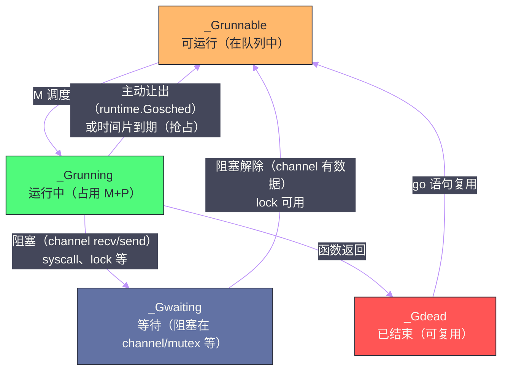

# Goroutine 与 GMP 调度器

## 摘要

Goroutine 是 Go 并发模型的核心抽象——它是一种由 Go 运行时管理的轻量级"用户态线程"，创建代价极低（初始栈 2-8KB，创建耗时约 1μs），可以轻松启动数百万个并发任务。支撑 Goroutine 高效运行的是 Go 运行时的 **GMP 调度器**（G=Goroutine，M=Machine/OS线程，P=Processor/逻辑处理器）。本文从"为什么不直接用 OS 线程"的第一性原理出发，完整推导 GMP 三元组的设计动机，深入剖析工作窃取（Work Stealing）算法如何实现负载均衡，以及 Go 调度器经历的两次重大演进：从协作式调度（Go 1.13 及之前）到基于信号的异步抢占式调度（Go 1.14+）——这次演进彻底解决了"计算密集型 Goroutine 饥饿其他 Goroutine"的顽固问题。

---

## 第 1 章 为什么不直接用 OS 线程

### 1.1 OS 线程的代价

理解 Goroutine 存在的意义，必须先理解 OS 线程的局限性。

**代价一：创建与销毁的开销大**。创建一个 OS 线程需要调用 `clone()`（Linux）或 `CreateThread()`（Windows）系统调用，内核需要分配线程控制块、初始化信号掩码、设置线程本地存储……这个过程约需 **10-100μs**，对于需要处理数千个并发请求的服务，如果每个请求都创建一个线程，仅创建/销毁的开销就无法接受。

**代价二：内存占用高**。每个 OS 线程都需要一个固定大小的**内核栈**（Linux 默认 8MB）和一个**用户栈**（glibc 默认 8MB，通过 `ulimit -s` 配置）。一个进程同时存在 1000 个线程，仅栈就占用 16GB 内存——这在现代服务器上是灾难性的。

**代价三：上下文切换开销**。OS 线程切换需要：保存当前线程的寄存器状态、切换地址空间（如果跨进程）、更新 CPU 缓存（cache flush）、系统调用陷入内核……每次切换约需 **1-10μs**。对于每秒数百万次切换的高并发场景，这是显著的性能损耗。

**代价四：调度不可控**。OS 的线程调度由内核决定，应用程序无法感知，也无法优化。Go 运行时能用更少的 OS 线程，高效地服务更多的 Goroutine——因为 Go 了解自己应用的特点（哪些 Goroutine 在等待 I/O，哪些可以立即运行），而 OS 内核不知道。

### 1.2 协程：用户态调度的思路

**协程（Coroutine）**是比线程更轻量的并发抽象，其核心思想是：**将调度从内核态移到用户态**。多个协程共享同一个或少数几个 OS 线程，协程之间的切换完全在用户态完成，不需要系统调用，不需要内核介入。

用户态切换的代价只有：保存/恢复少量寄存器（Go 的协程切换约保存 10 个寄存器，耗时约 **200ns**，是 OS 线程切换的 1/10 到 1/50）。

**协程 vs 线程的核心区别**：
- OS 线程由内核调度，被动（内核可以随时抢占）；
- 协程由用户态运行时调度，主动（需要协程主动让出，或运行时在某些点介入）。

Go 的 Goroutine 是协程的工程化实现，但比传统协程更复杂——它结合了**多线程**（可以真正并行利用多核 CPU）和**协作/抢占**（既有协作让出点，也有抢占机制）的优点。

---

## 第 2 章 GMP 模型：三元组的设计动机

### 2.1 最简单的模型：GM（为什么不够）

在 Go 1.0（2009年）到 Go 1.1（2013年）之间，Go 的调度器是一个简单的 **GM 模型**：全局只有一个运行队列（Global Run Queue），所有的 M（OS 线程）都从这个队列取 G（Goroutine）来运行。

```
GM 模型：
+------------------+
| Global Run Queue |  ← 所有可运行的 Goroutine 在这里排队
+------------------+
       ↑↓ （每次取/放都需要加锁）
  M1   M2   M3   M4   ← OS 线程，直接从全局队列取 G
```

**GM 模型的问题**：

**问题一：全局队列锁竞争**。每个 M 需要频繁地从全局队列取 G 或将 G 放回队列，这需要对全局队列加锁。在多核 CPU 上，多个 M 同时争夺这把锁，锁竞争成为性能瓶颈——CPU 核数越多，竞争越激烈，可扩展性极差（性能随核数增加的提升趋于平缓甚至下降）。

**问题二：G 的本地性差**。M 在执行 G 时，会将 G 用到的数据加载到 CPU cache 中。执行完后，G 被放回全局队列；下次 G 被另一个 M 取到运行时，需要重新加载 cache——G 与 M 之间没有亲和性，cache locality 差。

**问题三：系统调用阻塞整个线程**。当 G 进行系统调用（如文件 I/O）时，执行它的 M 会被 OS 阻塞。此时需要创建新的 M 来接管其他 G 的工作，M 的数量随系统调用次数增加，可能创建大量 OS 线程。

### 2.2 引入 P：本地队列与无锁分配

Go 1.1 引入了 **P（Processor，逻辑处理器）**，彻底解决了全局锁竞争问题。P 是 GMP 模型中最关键的抽象：

```
GMP 模型：
+---+   +---+   +---+   +---+    ← P（逻辑处理器，数量 = GOMAXPROCS）
| P |   | P |   | P |   | P |    每个 P 有自己的本地 Run Queue（无锁）
+---+   +---+   +---+   +---+
  |       |       |       |
  M1      M2      M3      M4     ← M（OS 线程）与 P 绑定
  
+---------------------------+
|      Global Run Queue     |   ← 全局队列（有锁，但很少用到）
+---------------------------+
```

**P 的核心作用**：

1. **本地 Run Queue（无锁）**：每个 P 维护一个包含最多 256 个 G 的循环队列，M 从绑定的 P 的本地队列取 G，不需要加锁（因为每个 P 同时只有一个 M 在使用它）；

2. **资源隔离**：P 持有执行 G 所需的所有本地资源——`mcache`（见[[08 Go 内存分配器——mcache、mcentral 与 mheap]]）、内存分配缓冲、GC 工作队列等。M 切换时（如系统调用），只需换一个 P 绑定，本地资源跟着 P 走，不需要复制；

3. **GOMAXPROCS 限制并行度**：P 的数量由 `GOMAXPROCS` 环境变量控制（默认等于 CPU 核数），这是真正并行执行的 G 数量的上限——最多只有 `GOMAXPROCS` 个 G 同时在不同 CPU 核上运行。

### 2.3 G、M、P 三者的关系

用一句话描述：**G 在 P 的 Run Queue 中等待，M 绑定到 P 后从其 Run Queue 取 G 执行**。

```go
// runtime/runtime2.go（概念性）
type g struct {
    stack         stack    // goroutine 的栈（可增长）
    sched         gobuf    // 调度上下文（保存寄存器、栈指针，用于切换）
    status        uint32   // 当前状态（running/runnable/waiting/dead...）
    m             *m       // 当前在哪个 M 上运行（如果在运行）
    // ...
}

type m struct {
    g0            *g       // 调度专用的 g（所有调度代码在 g0 的栈上运行）
    curg          *g       // 当前正在运行的 goroutine
    p             puintptr // 当前绑定的 P
    // ...
}

type p struct {
    runq          [256]guintptr  // 本地 Run Queue（环形缓冲区）
    runqhead      uint32         // 队列头指针
    runqtail      uint32         // 队列尾指针
    mcache        *mcache        // 内存分配缓存
    // ...
}
```

**关键状态转换**：



---

## 第 3 章 工作窃取：负载均衡的精妙设计

### 3.1 为什么需要工作窃取

在 GMP 模型中，G 被优先放入当前 P 的本地队列（无锁，高效）。但这可能导致**负载不均衡**：某些 P 的队列满了（G 过多），而另一些 P 的队列为空（M 空闲）。

工作窃取（Work Stealing）算法解决这个问题：当一个 M 发现其绑定的 P 的本地队列为空时，它不会立刻休眠，而是**尝试从其他 P 的本地队列"偷"一半的 G 来运行**。

### 3.2 调度循环的完整流程

M 的主调度循环（`schedule()` 函数）执行以下查找顺序：

```
M 的调度循环（优先级从高到低）：

1. 每执行 61 次本地调度，检查一次全局队列（防止全局队列饥饿）

2. 从当前 P 的本地队列取 G（无锁，O(1)）

3. 本地队列为空时：
   a. 从全局队列取一批 G（有锁）
   b. 从网络轮询器（netpoll）取已就绪的 G（I/O 完成的 G）
   c. 工作窃取：随机选择一个受害者 P，从其本地队列偷走一半的 G

4. 如果所有来源都为空：
   a. 将当前 M 与 P 解绑，P 进入空闲列表
   b. M 进入休眠（等待被唤醒）
```

**工作窃取的细节**：

```go
// runtime/proc.go（概念性）
func stealWork(now int64, p *p) (gp *g, inheritTime bool) {
    // 尝试 4 次，每次随机选一个受害者 P
    for i := 0; i < 4; i++ {
        victim := randomP()  // 随机受害者
        if victim == p {
            continue
        }
        
        // 从受害者 P 的本地队列偷走一半
        n := len(victim.runq) / 2
        if n == 0 {
            continue
        }
        
        // 将偷来的 G 放入当前 P 的本地队列（第一个直接返回执行）
        gp = runqsteal(p, victim, n)
        if gp != nil {
            return gp, false
        }
    }
    return nil, false
}
```

**为什么偷"一半"而不是"全部"**？偷全部会让受害者 P 立即变空，需要再次窃取；偷一半是在"减少受害者的工作量"和"让受害者保持活跃"之间的平衡——实践中一半策略的负载均衡效果最好。

### 3.3 系统调用时的 P 移交

当 G 执行系统调用（如 `read()`、`write()`）时，执行该 G 的 M 会被 OS 阻塞。此时如果 P 仍绑定在这个 M 上，P 本地队列中的其他 G 就无法运行——这是浪费。

Go 的解法：系统调用前，M **主动解绑 P**，让 P 转移给其他 M（如果有空闲 M，唤醒它；否则创建新的 M）：

```
系统调用期间的 P 转移：

正常状态：G1 在 M1 上运行，M1 绑定 P1
                     M1(running G1)
                         |
                         P1 (runq: G2, G3, G4)

G1 进入系统调用：
1. M1 保存状态，解绑 P1
2. P1 被转移给空闲 M2（或新创建 M2）
3. M1 陷入系统调用阻塞
   M1(blocked G1)     M2 绑定 P1，继续运行 G2, G3, G4
   
系统调用返回：
4. M1 苏醒，G1 重新变为 _Grunnable
5. M1 尝试获取一个空闲的 P；如果没有，G1 被放入全局队列，M1 进入休眠
```

这个机制确保了即使有 G 在做长时间的系统调用，其他 G 也不会因此饥饿——P 会及时被转移给其他 M。

---

## 第 4 章 调度时机：协作式 vs 抢占式

### 4.1 协作式调度：Go 1.13 及之前

早期 Go 调度器是**协作式**的——Goroutine 只在特定的"调度点"才会主动让出 CPU。这些调度点包括：
- 函数调用时（编译器在函数序言处插入栈增长检测，顺便检查是否需要切换）；
- 系统调用前后；
- `runtime.Gosched()` 显式让出；
- channel 操作（阻塞时）；
- GC STW 时（强制暂停所有 G）。

**协作式调度的致命缺陷**：如果一个 Goroutine 执行的是**没有函数调用的紧密循环**（如纯计算），它永远不会经过调度点，就永远不会被调度器打断——它会独占 M 和 P，导致同一个 P 上的其他 G 饥饿，甚至阻止 GC 的 STW：

```go
// 这段代码在 Go 1.13 及之前会导致其他 Goroutine 饥饿
func spin() {
    for {
        // 死循环，没有函数调用，没有 channel，没有系统调用
        // 调度器无法打断它！
    }
}

go spin()
go func() {
    fmt.Println("我永远不会被执行（在同一个 P 上）")
}()
```

Go 1.14 之前，`GOMAXPROCS=1` 时，上面的代码会让第二个 Goroutine 永远无法运行。即使 `GOMAXPROCS>1`，第二个 Goroutine 也会被推迟到另一个 P 上运行，与 spin 共存但受影响。

### 4.2 基于信号的异步抢占：Go 1.14

Go 1.14 引入了**基于信号的异步抢占**（Signal-based Asynchronous Preemption），彻底解决了协作式调度的饥饿问题。

**实现机制**：

```
Go 运行时有一个后台线程 sysmon（System Monitor），持续运行（不依赖 P）。
sysmon 每 10ms 检查一次所有 P 的状态：
  - 如果某个 P 绑定的 G 已经运行了超过 10ms（retake 阈值）
  - sysmon 向运行该 G 的 M 发送 SIGURG 信号（Unix）
  - M 的信号处理函数被触发（asyncPreempt）
  - 信号处理函数将 G 标记为"应被抢占"
  - 当 G 执行到下一条安全点指令时，真正发生切换
```

**为什么用 SIGURG 而不是 SIGINT 或其他信号**？SIGURG（紧急数据信号）在 Go 程序正常运行中从不使用，不会与用户代码的信号处理冲突。

**安全点（Safe Point）**：抢占不能在任意指令处发生——如果在一条指令的中间打断（如在修改 map 或 slice header 的中途），会导致数据结构处于不一致状态。Go 编译器为每个指令标注是否是安全点，抢占只在安全点发生。

**抢占后发生了什么**：

```
G 被抢占后的状态转换：

运行中 G（_Grunning）
   ↓ 收到 SIGURG，asyncPreempt 执行
G 保存当前执行上下文（寄存器、栈指针）
   ↓
G 状态变为 _Grunnable，放回 P 的本地队列（或全局队列）
   ↓
M 重新调度，从队列取下一个 G 运行
   ↓
被抢占的 G 在之后某个时间点再次被调度，从中断点继续执行
```

**效果**：Go 1.14 之后，即使是纯计算的 Goroutine（无函数调用的死循环），也会被定期抢占，其他 G 得以公平地获得 CPU 时间。GC 的 STW 也因此更加可靠（不再需要等待某个"顽固"的 G 主动让出）。

---

## 第 5 章 sysmon：调度器的守护线程

### 5.1 sysmon 是什么

`sysmon`（System Monitor）是 Go 运行时的一个特殊 OS 线程，它**不绑定任何 P**（不消耗 GOMAXPROCS 配额），持续在后台运行，执行各种维护任务：

```go
// runtime/proc.go（概念性）
func sysmon() {
    for {
        // 根据当前负载动态调整休眠时间（20μs 到 10ms 之间）
        sleep := delay()
        
        // 1. 抢占运行超过 10ms 的 Goroutine
        retake(now)
        
        // 2. 释放空闲超过 5 分钟的 OS 线程（归还系统资源）
        
        // 3. 将阻塞在系统调用中超时的 P 强制移交
        
        // 4. 触发网络轮询（检查是否有 I/O 已就绪）
        
        // 5. 如果超过 2 分钟没有 GC，强制触发一次 GC
        
        // 6. 处理 timer（定时器到期的 G 放回运行队列）
        
        usleep(sleep)
    }
}
```

### 5.2 sysmon 的 retake：抢占与 P 移交

`retake` 函数负责两件事：

**事情一（抢占长时间运行的 G）**：如上节所述，向运行超过 10ms 的 G 的 M 发送 SIGURG。

**事情二（移交阻塞在系统调用的 P）**：

```
retake 检查每个 P 的状态：

如果 P 状态是 _Psyscall（某个 M 正在系统调用中）：
  且该 P 没有其他可运行的 G（本地队列为空），
  且距离最后一次系统调用已经超过阈值（通常是 20μs）：
    → sysmon 将该 P 的状态改为 _Pidle，移交给其他 M
    → 这确保了系统调用中的 M 不会长期"占着茅坑不拉屎"
```

这就是为什么 Go 能够在有大量 I/O 密集型 Goroutine 的同时，也高效地运行计算密集型 Goroutine——sysmon 确保阻塞的系统调用不会长时间霸占 P。

---

## 第 6 章 Goroutine 的创建、切换与复用

### 6.1 go 语句的底层：newproc

`go func()` 语法在编译后等价于调用 `runtime.newproc`：

```go
// runtime/proc.go（简化）
func newproc(fn *funcval) {
    // 1. 从 P 的 gFree 列表取一个已结束的 G 复用（避免频繁分配）
    //    如果没有空闲 G，创建新的 G（分配 2-8KB 初始栈）
    gp := gfget(p)
    if gp == nil {
        gp = malg(_StackMin)  // 分配最小栈（2KB）
    }
    
    // 2. 初始化 G 的栈，设置函数入口
    gp.startpc = fn.fn
    
    // 3. 将 G 放入当前 P 的本地队列（或全局队列）
    runqput(p, gp, true)
    
    // 4. 如果有空闲的 P，唤醒一个 M 来运行（避免 G 在队列中等待）
    wakep()
}
```

**G 的复用机制**：Goroutine 结束后（函数返回），G 的结构体不会立即释放，而是放入 P 的 `gFree` 列表（本地）或全局 `sched.gFree` 列表（全局），等待下次 `go` 语句复用——这避免了频繁的内存分配和 GC 压力。

### 6.2 goroutine 切换的开销

Goroutine 切换（`goswitch`）只需要保存和恢复少量寄存器（SP、PC 以及平台相关的几个 callee-saved 寄存器），整个过程在用户态完成，约耗时 **200-400ns**——比 OS 线程切换（约 1-10μs）快约 5-50 倍。

切换发生在什么时候：
- G 进入阻塞状态（channel 操作、mutex 等）；
- G 调用 `runtime.Gosched()` 主动让出；
- G 被 sysmon 抢占（Go 1.14+）；
- G 进行系统调用（实际上是 M 被阻塞，Go 会切换到 `g0` 调度栈）。

### 6.3 GOMAXPROCS 的设置建议

```go
import "runtime"

// 默认：等于 CPU 核数（Go 1.5 之后）
n := runtime.GOMAXPROCS(0)  // 0 表示只查询不设置，返回当前值

// 设置为 CPU 核数的 2 倍（I/O 密集型服务）
runtime.GOMAXPROCS(runtime.NumCPU() * 2)

// 在容器环境中，需要读取 cgroup 限制，而不是宿主机 CPU 数
// 推荐使用 uber-go/automaxprocs 库：
// import _ "go.uber.org/automaxprocs"
// 它会自动读取 cgroup cpu.quota，正确设置 GOMAXPROCS
```

> [!warning] 生产避坑：容器中的 GOMAXPROCS 误配置
> 在 Kubernetes 容器中，`runtime.NumCPU()` 返回的是**宿主机**的 CPU 核数（如 96 核），而不是容器的 CPU limit（如 2 核）。如果不做任何处理，Go 程序会创建 96 个 P，导致大量的 OS 线程被创建（超出容器 CPU 配额），程序被 throttled（CPU 被节流），实际性能反而下降。**正确做法**：使用 `go.uber.org/automaxprocs` 包，它会读取 `/sys/fs/cgroup/cpu/cpu.cfs_quota_us` 和 `cpu.cfs_period_us`，正确计算并设置 `GOMAXPROCS`。

---

## 总结

本篇完整推导了 GMP 调度器的设计演进：

**从 GM 到 GMP**：全局队列锁竞争是 GM 模型的致命瓶颈，引入 P（逻辑处理器）及其本地无锁 Run Queue 是解决方案的核心——P 成为"资源隔离单元"，不仅持有本地队列，还持有 mcache 等线程本地状态，M 切换时只需换绑一个 P。

**工作窃取**：当 P 的本地队列为空时，M 随机选择其他 P 偷走一半 G——这是无需中央协调的分布式负载均衡算法，在实践中达到了优秀的负载均衡效果。

**从协作式到抢占式**：Go 1.13 的协作式调度在计算密集型 Goroutine 面前束手无策；Go 1.14 通过 sysmon 定期发送 SIGURG 信号、异步中断长期运行的 G，实现了真正的抢占式调度——任何 Goroutine 都无法无限期占用 CPU。

**系统调用时的 P 移交**：G 进入系统调用时，M 解绑 P，P 被转移给其他 M 继续运行其他 G——确保系统调用阻塞不会波及到同一 P 上的其他 G。

**Goroutine 复用**：结束的 G 进入 gFree 列表等待复用，避免频繁分配。Goroutine 切换仅约 200-400ns，是 OS 线程切换的 1/5 到 1/50。

下一篇深入 Channel 的底层结构与阻塞唤醒机制：[[02 Channel 的底层结构与阻塞唤醒机制]]。

---

> [!note] 参考资料
> - Dmitry Vyukov,《Scalable Go Scheduler Design》（Go 1.1 GMP 设计文档）
> - Austin Clements,《Proposal: Non-cooperative goroutine preemption》（Go 1.14 抢占提案）
> - Go 运行时源码：`runtime/proc.go`、`runtime/runtime2.go`
> - Go Blog,《The Go scheduler》: https://go.dev/blog/scheduler

---

> [!note] 思考题
> 1. GMP 模型中，当一个 Goroutine 执行系统调用（如文件 IO）时，绑定的 M（线程）会阻塞。此时调度器会创建新的 M 来运行 P 上的其他 Goroutine。如果同时有 1000 个 Goroutine 在执行阻塞系统调用，是否会创建 1000 个 OS 线程？`runtime.GOMAXPROCS` 限制的是 P 的数量还是 M 的数量？M 的数量上限是什么？
> 2. Goroutine 的栈初始大小为 2KB（Go 1.4+），会按需增长到 1GB。栈增长时需要将栈上所有指针重定向到新地址——这就是'栈拷贝'（stack copying）。在栈拷贝期间，goroutine 是否需要暂停？如果一个 goroutine 的栈频繁在 grow 和 shrink 之间震荡，会导致什么性能问题？
> 3. GMP 调度器的抢占机制在 Go 1.14 从'协作式'升级为'基于信号的异步抢占'。在 Go 1.14 之前，一个没有函数调用的纯计算 `for` 循环会导致什么问题？信号抢占的实现依赖 `SIGURG` 信号——如果用户代码也注册了 `SIGURG` 的 handler，是否会与调度器冲突？
