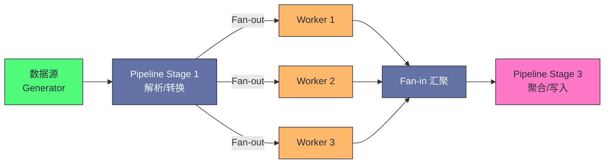

# Go 并发模式——Pipeline、Fan-out Fan-in 与 Worker Pool

**摘要：**

Go 的并发原语（Goroutine + Channel + context）是构建高并发系统的积木，但如何将这些积木组合成正确、高效、可维护的并发程序，需要遵循经过实践验证的**并发模式（Concurrency Patterns）**。本文聚焦三种最重要的 Go 并发模式：**Pipeline**（流水线，将数据处理分解为多个串联阶段）、**Fan-out / Fan-in**（扇出/扇入，将单一任务流分发到多个并发 Worker，再汇聚结果）、以及 **Worker Pool**（工作池，控制最大并发度，防止资源耗尽）。这三种模式不是孤立的——它们通常组合使用，构成完整的数据处理流水线。本文对每种模式都从"为什么需要它"出发，给出完整的、带取消支持的生产级实现，并分析每种模式的适用边界和常见陷阱。文章最后回到一个设计认知：这三种模式都体现了"用并发结构表达数据流"的工程哲学——Pipeline 表达"串行数据流"，Fan-out/Fan-in 表达"并行数据流"，Worker Pool 表达"受控并发数据流"。理解这些模式的核心不是记住代码模板，而是理解"数据如何在并发 Goroutine 之间流动"。

---

## 第 1 章 Pipeline：流水线模式

### 1.1 什么是 Pipeline，解决什么问题

**Pipeline（流水线）**是一种将数据处理分解为多个**串联阶段**（Stage）的并发模式，每个阶段从输入 channel 读取数据，处理后写入输出 channel，下一个阶段再从这个输出 channel 读取。

不用 Pipeline 时，数据处理通常是串行的：

```go
// 串行处理：每个步骤必须等上一步全部完成
data := readAllFiles(paths)    // 先全部读完
parsed := parseAll(data)       // 再全部解析
results := processAll(parsed)  // 再全部处理
writeAll(results)              // 再全部写入
```

这种串行方式的问题：**各阶段之间没有重叠**——读文件时解析器空闲，解析时处理器空闲。如果数据量大，每个阶段都需要等待上一阶段完全完成才能开始，总时间是各阶段时间之和。这是"批处理"模式——每个阶段处理完整批数据后，才传递给下一阶段，阶段间无并行。

Pipeline 的思路是：每个阶段独立运行，只要第一阶段产出了一个数据，第二阶段就可以立即开始处理它，不需要等第一阶段处理完所有数据——**各阶段流水线式重叠执行**，整体吞吐量大幅提升：

```
串行方式（耗时 = T1 + T2 + T3）：
阶段1: [读读读读读]
阶段2:             [解解解解解]
阶段3:                         [处处处处处]

Pipeline 方式（耗时 ≈ max(T1, T2, T3) + 启动延迟）：
阶段1: [读读读读读]
阶段2:   [解解解解解]   ← 第1个数据读完就开始解析
阶段3:     [处处处处处] ← 第1个数据解析完就开始处理
```

这个"流水线重叠"是 Pipeline 性能提升的核心——各阶段并行执行，总时间从"各阶段之和"降到"最慢阶段 + 启动延迟"。这与 CPU 的指令流水线（Instruction Pipeline）原理相同——将处理分解为多个阶段，让阶段重叠执行，提升吞吐量。

### 1.2 Pipeline 的基本实现

每个 Pipeline 阶段是一个函数，接收一个 `<-chan T`（输入），返回一个 `<-chan T`（输出）：

```go
// 阶段一：生成数字序列
func generate(ctx context.Context, nums ...int) <-chan int {
    out := make(chan int, len(nums))
    go func() {
        defer close(out)
        for _, n := range nums {
            select {
            case <-ctx.Done():
                return
            case out <- n:
            }
        }
    }()
    return out
}

// 阶段二：对数字求平方
func square(ctx context.Context, in <-chan int) <-chan int {
    out := make(chan int)
    go func() {
        defer close(out)
        for n := range in {
            select {
            case <-ctx.Done():
                return
            case out <- n * n:
            }
        }
    }()
    return out
}

// 阶段三：过滤偶数
func filterEven(ctx context.Context, in <-chan int) <-chan int {
    out := make(chan int)
    go func() {
        defer close(out)
        for n := range in {
            if n%2 == 0 {
                select {
                case <-ctx.Done():
                    return
                case out <- n:
                }
            }
        }
    }()
    return out
}

// 组合 Pipeline：生成 → 平方 → 过滤
func main() {
    ctx, cancel := context.WithCancel(context.Background())
    defer cancel()
    
    c := generate(ctx, 1, 2, 3, 4, 5)
    sq := square(ctx, c)
    filtered := filterEven(ctx, sq)
    
    for v := range filtered {
        fmt.Println(v)  // 4, 16
    }
}
```

每个阶段函数的签名是 `func(ctx, <-chan T) <-chan U`——接收输入 channel，返回输出 channel。这个统一的签名让阶段可以任意组合——一个阶段的输出是下一个阶段的输入，像水管一样串联。这个"统一签名的可组合性"是 Pipeline 模式的核心——只要签名一致，阶段可以任意组合、替换、重用。

### 1.3 Pipeline 的关键设计原则

**原则一：每个阶段函数由 goroutine 驱动，输出 channel 在 goroutine 返回时关闭**

```go
func stage(ctx context.Context, in <-chan T) <-chan U {
    out := make(chan U)
    go func() {
        defer close(out)  // goroutine 退出时关闭输出 channel，通知下游
        for v := range in {  // 当 in 被关闭时，range 自动退出
            select {
            case <-ctx.Done():
                return  // 取消信号，退出
            case out <- process(v):
            }
        }
    }()
    return out
}
```

`defer close(out)` 是关键——它向下游发出"本阶段已完成，不会再有数据"的信号，让下游的 `for range` 能够正常退出，避免 Goroutine 泄漏。这个"close 通知完成"是 Channel 的核心用法——close 不只是关闭 channel，更是"广播完成信号"给所有接收者。

**原则二：context 传播取消信号**

每个阶段都接收 `context.Context`，在 `select` 中同时监听 `ctx.Done()` 和 channel 操作。当上游取消或超时时，所有阶段的 goroutine 都能及时退出。这个"ctx 贯穿所有阶段"是生产级 Pipeline 的必备——没有 ctx 的 Pipeline 在取消时会泄漏 Goroutine（上游阻塞在发送，下游已退出）。

**原则三：合理使用缓冲 channel 控制背压**

无缓冲 channel 实现严格的背压（backpressure）：下游处理慢时，上游会被阻塞，不会产生无限积压。有缓冲 channel 提供一定的缓冲，让上下游速度不匹配时有一定的缓冲空间。根据具体场景选择：
- 各阶段速度均匀：无缓冲或小缓冲；
- 某阶段有突发性（bursty）：适当增大缓冲；
- 不能让上游无限快（防止 OOM）：保持小缓冲，依靠背压自然限速。

"背压"是 Pipeline 设计的关键概念——下游处理慢时，必须通过某种机制"压住"上游，防止上游无限生产导致内存耗尽。Channel 的"发送阻塞"天然实现了背压——下游不接收，上游就阻塞，不会无限积压。这个"用 Channel 阻塞实现背压"是 Go 并发设计的优雅之处——不需要额外的流量控制机制，Channel 本身就是背压工具。

---

## 第 2 章 Fan-out / Fan-in：扇出扇入模式

### 2.1 什么是 Fan-out / Fan-in

**Fan-out（扇出）**：将一个输入 channel 的任务分发给多个并发 Worker，让多个 Goroutine 同时处理——适合处理耗时较长（如 I/O 密集型、CPU 密集型）的任务，通过并行来缩短总时间。

**Fan-in（扇入）**：将多个输入 channel 的结果合并到一个输出 channel——适合汇聚多个并发 Worker 的结果。

Fan-out 和 Fan-in 通常搭配使用，构成"并发处理 + 结果汇聚"的完整模式：

```
单一任务流 →  Fan-out（分发）  → Worker1
                               → Worker2   →  Fan-in（汇聚）  → 单一结果流
                               → Worker3
```

Fan-out/Fan-in 解决的是"单一数据流的并行处理"问题——Pipeline 是串行流水线（每个阶段一个 Goroutine），Fan-out/Fan-in 是并行流水线（某个阶段多个 Goroutine 并行）。这个"串行 + 并行"的组合让 Pipeline 的瓶颈阶段可以通过 Fan-out 加速——如果某个阶段是瓶颈，启动多个 Worker 并行处理该阶段，提升整体吞吐量。

### 2.2 Fan-out 实现

```go
// fanOut 将 in 中的任务分发给 n 个并发 Worker，每个 Worker 应用 process 函数
func fanOut[T, U any](
    ctx context.Context,
    in <-chan T,
    n int,
    process func(context.Context, T) U,
) []<-chan U {
    outputs := make([]<-chan U, n)
    for i := 0; i < n; i++ {
        outputs[i] = workerStage(ctx, in, process)
    }
    return outputs
}

// workerStage 是 Fan-out 中的单个 Worker
func workerStage[T, U any](
    ctx context.Context,
    in <-chan T,  // 注意：多个 Worker 共享同一个输入 channel
    process func(context.Context, T) U,
) <-chan U {
    out := make(chan U)
    go func() {
        defer close(out)
        for v := range in {
            select {
            case <-ctx.Done():
                return
            case out <- process(ctx, v):
            }
        }
    }()
    return out
}
```

**多个 Worker 共享同一个输入 channel**：这是 Fan-out 的精髓——多个 Goroutine 从同一个 channel 接收，channel 本身保证了互斥（每个任务只被一个 Worker 取到）。Go 的 channel 是"竞争安全"的，多个 Goroutine 并发 `range` 同一个 channel 完全合法，运行时会保证每个数据只被一个 Goroutine 接收。

这个"共享输入 channel 实现任务分发"是 Fan-out 的核心技巧——不需要中央调度器，channel 的"竞争接收"天然实现了任务分发。每个 Worker 从 channel 取任务是互斥的（channel 保证），但处理任务是并行的（各 Worker 独立执行）。这个"互斥取 + 并行处理"的模式让 Fan-out 既正确（无重复处理）又高效（并行执行）。

### 2.3 Fan-in 实现

```go
// fanIn 将多个输入 channel 的数据合并到一个输出 channel
func fanIn[T any](ctx context.Context, channels ...<-chan T) <-chan T {
    merged := make(chan T)
    var wg sync.WaitGroup
    
    // 为每个输入 channel 启动一个 goroutine 转发数据
    forward := func(ch <-chan T) {
        defer wg.Done()
        for v := range ch {
            select {
            case <-ctx.Done():
                return
            case merged <- v:
            }
        }
    }
    
    wg.Add(len(channels))
    for _, ch := range channels {
        go forward(ch)
    }
    
    // 等所有输入 channel 都关闭后，关闭输出 channel
    go func() {
        wg.Wait()
        close(merged)
    }()
    
    return merged
}
```

Fan-in 的关键设计是"WaitGroup 保证只关闭一次输出 channel"——每个输入 channel 的转发 Goroutine 完成后 `wg.Done()`，所有转发 Goroutine 完成后（即所有输入 channel 都关闭了），主 Goroutine `close(merged)`。这个"WaitGroup 统一关闭"避免了"多个 Goroutine 同时 close 导致 panic"的陷阱。

### 2.4 完整的 Fan-out / Fan-in 示例：并发图片处理

```go
// 场景：批量处理图片（读取 → 并发压缩 → 汇聚 → 保存）

type ImageJob struct {
    Path string
    Data []byte
}

type ImageResult struct {
    Path       string
    Compressed []byte
    Err        error
}

// 阶段一：读取文件（生成任务）
func loadImages(ctx context.Context, paths []string) <-chan ImageJob {
    out := make(chan ImageJob)
    go func() {
        defer close(out)
        for _, p := range paths {
            data, err := os.ReadFile(p)
            if err != nil {
                continue  // 读取失败跳过
            }
            select {
            case <-ctx.Done():
                return
            case out <- ImageJob{Path: p, Data: data}:
            }
        }
    }()
    return out
}

// 阶段二（Worker）：压缩图片（CPU 密集型，Fan-out）
func compressImage(ctx context.Context, job ImageJob) ImageResult {
    compressed, err := compress(job.Data)  // 假设这是耗时操作
    return ImageResult{Path: job.Path, Compressed: compressed, Err: err}
}

// 阶段三：保存结果
func saveResults(ctx context.Context, results <-chan ImageResult) {
    for r := range results {
        if r.Err != nil {
            log.Printf("failed to compress %s: %v", r.Path, r.Err)
            continue
        }
        os.WriteFile(r.Path+".compressed", r.Compressed, 0644)
    }
}

func processImages(paths []string) {
    ctx, cancel := context.WithTimeout(context.Background(), 60*time.Second)
    defer cancel()
    
    // 阶段一：加载图片
    jobs := loadImages(ctx, paths)
    
    // 阶段二：Fan-out 到 N 个并发 Worker（N = CPU 核数）
    n := runtime.NumCPU()
    workerOutputs := fanOut(ctx, jobs, n, compressImage)
    
    // 阶段三：Fan-in 汇聚结果
    results := fanIn(ctx, workerOutputs...)
    
    // 阶段四：保存
    saveResults(ctx, results)
}
```

**为什么 Fan-out 的数量选 CPU 核数**？对于 CPU 密集型任务（如图片压缩），Worker 数超过 CPU 核数不会提升吞吐（反而因为上下文切换开销略有下降）；对于 I/O 密集型任务（如网络请求），Worker 数可以远大于 CPU 核数（Goroutine 阻塞等待 I/O 时不占 CPU）。这个"CPU 密集型 = CPU 核数，I/O 密集型 = CPU 核数 × 倍数"是 Worker 数量选择的通用原则。

---

## 第 3 章 Worker Pool：控制并发度

### 3.1 为什么需要 Worker Pool

Fan-out 模式中，如果任务数量非常大（如 10 万个），直接启动 10 万个 Worker Goroutine 是不合理的：
- 每个 Goroutine 需要初始栈内存（约 2-8KB），10 万个就是 200MB-800MB；
- 过多的 Goroutine 导致调度器压力增大；
- 如果任务涉及下游资源（数据库连接、HTTP 连接），并发数过高会压垮下游。

**Worker Pool（工作池）** 的思想：预先创建固定数量的 Worker Goroutine，任务提交到任务队列，Worker 从队列取任务执行——**并发度上限是固定的，不随任务数量增加**：

```
任务生产者 → [任务队列 Channel] → Worker1
                                → Worker2
                                → Worker3  (固定 3 个 Worker)
                                ...
```

Worker Pool 与 Fan-out 的区别：Fan-out 是"每个任务一个 Goroutine"（Goroutine 数 = 任务数），Worker Pool 是"固定 Goroutine 数，任务排队"（Goroutine 数 = Worker 数）。Worker Pool 适合"任务数远大于合理并发数"的场景——如 10 万个 URL 爬取，合理并发数是 100（防止压垮下游），用 Worker Pool 固定 100 个 Worker，10 万个任务排队执行。

### 3.2 基础 Worker Pool 实现

```go
type Task func()

// WorkerPool 创建并管理一个固定大小的 Worker 池
type WorkerPool struct {
    tasks   chan Task
    wg      sync.WaitGroup
    ctx     context.Context
    cancel  context.CancelFunc
}

func NewWorkerPool(ctx context.Context, workerCount int, queueSize int) *WorkerPool {
    poolCtx, cancel := context.WithCancel(ctx)
    p := &WorkerPool{
        tasks:  make(chan Task, queueSize),
        ctx:    poolCtx,
        cancel: cancel,
    }
    
    // 启动固定数量的 Worker
    for i := 0; i < workerCount; i++ {
        p.wg.Add(1)
        go p.worker()
    }
    
    return p
}

func (p *WorkerPool) worker() {
    defer p.wg.Done()
    for {
        select {
        case task, ok := <-p.tasks:
            if !ok {
                return  // tasks channel 已关闭，退出
            }
            task()  // 执行任务
        case <-p.ctx.Done():
            return  // 上下文取消，退出
        }
    }
}

// Submit 提交任务（如果队列满，会阻塞直到有空位或 ctx 取消）
func (p *WorkerPool) Submit(ctx context.Context, task Task) error {
    select {
    case p.tasks <- task:
        return nil
    case <-ctx.Done():
        return ctx.Err()
    case <-p.ctx.Done():
        return p.ctx.Err()
    }
}

// Shutdown 关闭 Worker Pool，等待所有任务完成
func (p *WorkerPool) Shutdown() {
    close(p.tasks)  // 关闭任务队列，Worker 处理完剩余任务后退出
    p.wg.Wait()     // 等待所有 Worker 退出
}

// ForceShutdown 强制停止（不等待任务完成）
func (p *WorkerPool) ForceShutdown() {
    p.cancel()  // 取消 ctx，Worker 的 select 会触发 ctx.Done()
    p.wg.Wait()
}
```

Worker Pool 的"Shutdown vs ForceShutdown"区分是生产级设计——Shutdown 是"优雅关闭"（等待队列中的任务完成），ForceShutdown 是"强制关闭"（立即停止，不等待任务）。这个"优雅 vs 强制"的区分在服务关闭场景中很重要——收到 SIGTERM 时用 Shutdown（让任务完成），收到 SIGKILL 时用 ForceShutdown（立即停止）。

### 3.3 带结果收集的 Worker Pool

实际生产中，任务通常需要返回结果：

```go
type Job[T, R any] struct {
    Input  T
    Result chan<- Result[R]
}

type Result[R any] struct {
    Value R
    Err   error
}

// 带泛型的有结果 Worker Pool
func ProcessAll[T, R any](
    ctx context.Context,
    inputs []T,
    workerCount int,
    process func(context.Context, T) (R, error),
) ([]R, error) {
    jobs := make(chan T, len(inputs))
    results := make(chan Result[R], len(inputs))
    
    // 启动 Workers
    var wg sync.WaitGroup
    for i := 0; i < workerCount; i++ {
        wg.Add(1)
        go func() {
            defer wg.Done()
            for input := range jobs {
                v, err := process(ctx, input)
                select {
                case results <- Result[R]{Value: v, Err: err}:
                case <-ctx.Done():
                    return
                }
            }
        }()
    }
    
    // 提交所有任务
    for _, input := range inputs {
        select {
        case jobs <- input:
        case <-ctx.Done():
            close(jobs)
            return nil, ctx.Err()
        }
    }
    close(jobs)
    
    // 等待所有 Worker 完成，关闭结果 channel
    go func() {
        wg.Wait()
        close(results)
    }()
    
    // 收集结果
    var collected []R
    for r := range results {
        if r.Err != nil {
            return collected, r.Err  // 遇到错误立即返回（或根据需求收集所有错误）
        }
        collected = append(collected, r.Value)
    }
    return collected, nil
}
```

### 3.4 信号量：最轻量的并发度控制

对于简单的"限制最大并发数"需求，不必建完整的 Worker Pool，用**有缓冲 channel 作为信号量**更简洁：

```go
// semaphore 是一个有缓冲 channel，容量 = 最大并发数
type Semaphore chan struct{}

func NewSemaphore(n int) Semaphore {
    return make(Semaphore, n)
}

func (s Semaphore) Acquire(ctx context.Context) error {
    select {
    case s <- struct{}{}:
        return nil
    case <-ctx.Done():
        return ctx.Err()
    }
}

func (s Semaphore) Release() {
    <-s
}

// 使用信号量限制并发：最多 10 个 Goroutine 同时执行
sem := NewSemaphore(10)
var wg sync.WaitGroup

for _, url := range urls {
    wg.Add(1)
    go func(u string) {
        defer wg.Done()
        if err := sem.Acquire(ctx); err != nil {
            return
        }
        defer sem.Release()
        fetchURL(ctx, u)
    }(url)
}

wg.Wait()
```

**信号量 vs Worker Pool 的选择**：
- 信号量：每个任务仍然创建一个独立的 Goroutine，只是并发数有上限。适合任务数量不算太多（千级以下）或任务本身时间差异很大的场景；
- Worker Pool：固定数量的 Goroutine 复用，更适合大量任务（万级以上）、Goroutine 创建成本敏感的场景。

信号量的"有缓冲 channel 作为并发计数器"是 Go 的经典技巧——channel 的容量就是并发上限，发送占槽位（Acquire），接收释放槽位（Release）。这个"用 channel 实现信号量"的设计展示了 Go 并发原语的灵活性——channel 不只是数据通道，还可以作为计数信号量、互斥锁、事件广播等多种同步原语。

---

## 第 4 章 模式组合：完整的并发数据处理系统

### 4.1 三种模式的组合架构

三种模式通常不是孤立使用的，而是层层嵌套、相互组合：



这个组合架构是"Pipeline + Fan-out/Fan-in"的典型结构——Pipeline 提供串行流水线，Fan-out/Fan-in 在瓶颈阶段提供并行加速。这种"串行为骨架，并行为加速"的组合是高并发数据处理系统的常见架构——如 MapReduce（Map 是 Fan-out，Reduce 是 Fan-in，整体是 Pipeline）、流处理系统（Kafka Streams、Flink）都采用类似结构。

### 4.2 生产级完整示例：批量 URL 爬取与处理

```go
// 场景：批量爬取 URL，解析 HTML，提取标题，存入数据库
// Pipeline：读取 URL → Fan-out 并发抓取 → Fan-in 汇聚 → 解析 → 批量写入 DB

type URLTask struct {
    URL string
}

type FetchResult struct {
    URL  string
    HTML string
    Err  error
}

type ParsedResult struct {
    URL   string
    Title string
}

// 阶段一：生成 URL 任务流
func generateURLs(ctx context.Context, urls []string) <-chan URLTask {
    out := make(chan URLTask, 100)
    go func() {
        defer close(out)
        for _, u := range urls {
            select {
            case out <- URLTask{URL: u}:
            case <-ctx.Done():
                return
            }
        }
    }()
    return out
}

// 阶段二（Worker）：抓取 HTML（I/O 密集型）
func fetchHTML(ctx context.Context, task URLTask) FetchResult {
    req, _ := http.NewRequestWithContext(ctx, "GET", task.URL, nil)
    resp, err := http.DefaultClient.Do(req)
    if err != nil {
        return FetchResult{URL: task.URL, Err: err}
    }
    defer resp.Body.Close()
    body, _ := io.ReadAll(resp.Body)
    return FetchResult{URL: task.URL, HTML: string(body)}
}

// 阶段三：解析 HTML，提取标题
func parseTitle(ctx context.Context, in <-chan FetchResult) <-chan ParsedResult {
    out := make(chan ParsedResult, 50)
    go func() {
        defer close(out)
        for r := range in {
            if r.Err != nil {
                log.Printf("fetch error: %s: %v", r.URL, r.Err)
                continue
            }
            title := extractTitle(r.HTML)
            select {
            case out <- ParsedResult{URL: r.URL, Title: title}:
            case <-ctx.Done():
                return
            }
        }
    }()
    return out
}

// 阶段四：批量写入数据库（批量写比单条写高效得多）
func batchWrite(ctx context.Context, in <-chan ParsedResult, batchSize int) error {
    batch := make([]ParsedResult, 0, batchSize)
    for {
        select {
        case r, ok := <-in:
            if !ok {
                // channel 关闭，写入剩余数据
                if len(batch) > 0 {
                    return writeToDB(ctx, batch)
                }
                return nil
            }
            batch = append(batch, r)
            if len(batch) >= batchSize {
                if err := writeToDB(ctx, batch); err != nil {
                    return err
                }
                batch = batch[:0]
            }
        case <-ctx.Done():
            return ctx.Err()
        }
    }
}

// 整合：完整的并发爬取 Pipeline
func crawlAndProcess(ctx context.Context, urls []string) error {
    ctx, cancel := context.WithTimeout(ctx, 5*time.Minute)
    defer cancel()
    
    // 阶段一：生成任务
    tasks := generateURLs(ctx, urls)
    
    // 阶段二：Fan-out（I/O 密集，Worker 数 = CPU×4）
    workerCount := runtime.NumCPU() * 4
    fetchOutputs := fanOut(ctx, tasks, workerCount, fetchHTML)
    
    // 阶段三：Fan-in 汇聚
    fetched := fanIn(ctx, fetchOutputs...)
    
    // 阶段四：Pipeline 解析
    parsed := parseTitle(ctx, fetched)
    
    // 阶段五：批量写入 DB
    return batchWrite(ctx, parsed, 100)
}
```

这个完整示例展示了"Pipeline + Fan-out/Fan-in + 批量写入"的组合——每个阶段都有明确职责，通过 channel 连接，ctx 贯穿全程。这种"分阶段 + 并行 + 批量"的架构是高并发数据处理系统的典型设计——分阶段让职责清晰，并行让吞吐量高，批量让 I/O 高效。

---

## 第 5 章 并发模式的常见陷阱

### 5.1 陷阱一：Goroutine 泄漏——channel 未关闭导致 Goroutine 永久阻塞

```go
// 错误：下游提前退出，上游 Goroutine 永久阻塞
func badPipeline(ctx context.Context) {
    out := make(chan int)
    go func() {
        // 上游 Goroutine 尝试发送，但没人接收
        for i := 0; i < 100; i++ {
            out <- i  // 如果下游已退出，这里永久阻塞 → Goroutine 泄漏
        }
        close(out)
    }()
    
    // 只取前 5 个就退出
    for i := 0; i < 5; i++ {
        fmt.Println(<-out)
    }
    // 这里退出后，上游 Goroutine 永远阻塞在 out <- i
}

// 正确：用 ctx 通知上游退出
func goodPipeline(ctx context.Context) {
    ctx, cancel := context.WithCancel(ctx)
    defer cancel()  // 函数退出时取消 ctx，上游 Goroutine 会感知到并退出
    
    out := make(chan int)
    go func() {
        defer close(out)
        for i := 0; i < 100; i++ {
            select {
            case out <- i:
            case <-ctx.Done():
                return  // ctx 取消，退出 Goroutine
            }
        }
    }()
    
    for i := 0; i < 5; i++ {
        fmt.Println(<-out)
    }
    // defer cancel() 执行，上游 Goroutine 通过 ctx.Done() 退出
}
```

Goroutine 泄漏是 Go 并发编程最常见的陷阱——下游退出后，上游 Goroutine 阻塞在发送（无人接收）或接收（无人发送），永远无法退出。这个泄漏的 Goroutine 会持续占用内存（栈 + 引用的变量），长期运行的服务会因泄漏积累而 OOM。解决方案是"ctx 贯穿所有 Goroutine"——下游退出时取消 ctx，上游通过 `select <-ctx.Done()` 感知并退出。

### 5.2 陷阱二：关闭多次 channel 导致 panic

```go
// 错误：多个 Goroutine 可能都尝试 close(out)
func badFanIn(channels ...<-chan int) <-chan int {
    out := make(chan int)
    for _, ch := range channels {
        go func(c <-chan int) {
            for v := range c {
                out <- v
            }
            close(out)  // 危险！多个 Goroutine 都会执行到这里
        }(ch)
    }
    return out
}

// 正确：用 sync.WaitGroup 确保只关闭一次
func goodFanIn(channels ...<-chan int) <-chan int {
    out := make(chan int)
    var wg sync.WaitGroup
    for _, ch := range channels {
        wg.Add(1)
        go func(c <-chan int) {
            defer wg.Done()
            for v := range c {
                out <- v
            }
        }(ch)
    }
    go func() {
        wg.Wait()
        close(out)  // 所有输入 channel 都关闭后，统一关闭输出 channel
    }()
    return out
}
```

"close 已关闭的 channel 会 panic"是 Go 的硬性约束——必须保证 close 只调用一次。WaitGroup 是"统一关闭"的标准模式——所有转发 Goroutine 完成后（`wg.Wait()` 返回），主 Goroutine 统一 close 输出 channel。这个"WaitGroup 保证单次 close"是 Fan-in 的标准实现模式。

### 5.3 陷阱三：任务队列无限积压——缺乏背压

```go
// 危险：无限缓冲，任务可能积压到 OOM
func badSubmit(tasks []Task) {
    ch := make(chan Task, 1000000)  // 巨大的缓冲
    // 如果 Worker 处理速度 < 提交速度，会持续积压直到 OOM
    for _, t := range tasks {
        ch <- t
    }
}

// 正确：有限缓冲 + 背压（或用 ctx 实现提交超时）
func goodSubmit(ctx context.Context, pool *WorkerPool, tasks []Task) error {
    for _, t := range tasks {
        task := t
        // Submit 在队列满时阻塞，实现自然背压
        if err := pool.Submit(ctx, func() { task.Execute() }); err != nil {
            return fmt.Errorf("submit canceled: %w", err)
        }
    }
    return nil
}
```

**背压（Backpressure）**是分布式系统和并发程序设计中的重要概念：当下游处理速度跟不上上游生产速度时，下游应该向上游施加压力（阻塞上游），而不是无限积压。有限缓冲的 channel 是 Go 中实现背压的天然机制。

这个"背压"概念在流处理系统中尤为重要——Kafka、Reactive Streams 等系统都有背压机制。Go 的 channel 天然支持背压（发送阻塞），这是 Go 并发设计的优势——不需要额外的背压框架，channel 本身就是背压工具。但要注意"大缓冲 = 无背压"——缓冲太大时，上游可以持续生产直到缓冲满，失去了背压的保护。

---

## 第 6 章 并发模式的设计认知

### 6.1 用并发结构表达数据流

这三种模式都体现了"用并发结构表达数据流"的工程哲学——Pipeline 表达"串行数据流"（数据依次通过各阶段），Fan-out/Fan-in 表达"并行数据流"（数据分发到多个 Worker 再汇聚），Worker Pool 表达"受控并发数据流"（数据排队，固定 Worker 处理）。这些模式不是"算法"，而是"数据流结构"——用 channel 和 Goroutine 的组合表达数据如何在并发单元之间流动。

这个"用结构表达数据流"是 Go 并发编程的核心思维——不是"如何用锁保护共享状态"，而是"数据如何流动"。这个思维转变是从"共享内存并发"到"CSP 并发"的关键——共享内存并发关注"状态保护"，CSP 并发关注"数据流动"。

### 6.2 模式组合优于单一模式

三种模式不是互斥的，而是组合使用的——Pipeline 提供骨架，Fan-out/Fan-in 在瓶颈阶段加速，Worker Pool 控制并发度。这个"模式组合"是 Go 并发编程的实践智慧——真实系统通常不是单一模式，而是多种模式的组合。理解每种模式的适用场景和组合方式，比记住单一模式的代码模板更重要。

### 6.3 取消传播是生产级必需

所有模式的生产级实现都必须支持 context 取消——没有 ctx 的模式在取消时会泄漏 Goroutine。这个"ctx 贯穿所有模式"是 Go 1.7 之后并发编程的标准——context 不只是"超时控制"，更是"Goroutine 生命周期管理"的基础。任何不处理 ctx 的并发模式都是"玩具实现"，不能用于生产。

---

## 总结

本篇系统梳理了 Go 并发编程中最重要的三种模式及其组合用法：

**Pipeline（流水线）**：将数据处理分解为多个串联阶段，每个阶段由独立 Goroutine 驱动，通过 channel 连接。各阶段并行执行，使得总吞吐量接近瓶颈阶段的吞吐量（而非各阶段的总和）。关键设计：每个阶段函数返回 output channel，`defer close(out)` 通知下游，`ctx.Done()` 处理取消。这个"串行流水线"是数据处理的基础结构。

**Fan-out / Fan-in**：多个 Worker Goroutine 共享同一个输入 channel（Fan-out，Channel 保证互斥分发），多个 Worker 的输出通过 `sync.WaitGroup` 汇聚到单一输出 channel（Fan-in）。Worker 数量：CPU 密集型取 NumCPU，I/O 密集型可取 NumCPU × 倍数。这个"并行加速瓶颈阶段"是提升 Pipeline 吞吐量的关键手段。

**Worker Pool**：固定数量的 Worker Goroutine 从任务队列 channel 取任务，控制最大并发度。有限缓冲的任务队列实现背压，防止 OOM。信号量（有缓冲 channel）是 Worker Pool 的轻量替代，适合任务数量适中的场景。这个"受控并发"是处理大量任务的正确方式——不无限创建 Goroutine，而是固定并发度。

**三大陷阱**：Goroutine 泄漏（下游退出但上游无人接收，用 ctx 取消解决）；多次关闭 channel（用 WaitGroup 保证单次关闭）；无限积压（保持有限缓冲，依靠背压限速）。这些陷阱的根源都是"未正确处理取消和背压"——生产级并发模式必须处理这两个问题。

这三种模式都体现了"用并发结构表达数据流"的工程哲学——Pipeline 表达"串行数据流"，Fan-out/Fan-in 表达"并行数据流"，Worker Pool 表达"受控并发数据流"。理解这些模式的核心不是记住代码模板，而是理解"数据如何在并发 Goroutine 之间流动"。

下一篇深入并发陷阱的诊断与调试工具：[[07 并发陷阱与调试——Goroutine 泄漏、死锁与 Race Detector]]。

---

## 参考资料

1. Go Blog,《Go Concurrency Patterns: Pipelines and cancellation》: https://go.dev/blog/pipelines——Go 官方博客对 Pipeline 模式的讲解。
2. Sameer Ajmani,《Advanced Go Concurrency Patterns》, Google I/O 2013——Go 并发模式的高级用法。
3. Katherine Cox-Buday,《Concurrency in Go》, O'Reilly 2017——Go 并发编程的系统性讲解。
4. Go Blog,《Go Concurrency Patterns: Context》: https://go.dev/blog/context——context 与并发模式的结合。
5. Reactive Streams 规范——背压概念的标准定义。

---

> [!note] 思考题
> 1. 在 Pipeline 模式中，每个 stage 是一个独立的 goroutine，通过 channel 连接。如果 Pipeline 有 5 个 stage，每个 stage 的处理速度不同（stage 3 最慢），整个 Pipeline 的吞吐量由最慢的 stage 决定。你有哪些方式提升 stage 3 的吞吐量？增加 channel 的缓冲区大小能解决这个问题吗？
> 2. Fan-out 模式中，多个 Worker 共享同一个输入 channel。如果某个 Worker 处理任务时 panic 了，会发生什么？其他 Worker 还能继续从输入 channel 取任务吗？如何让 Worker Pool 在某个 Worker panic 时仍然健壮（不丢失任务，不阻塞其他 Worker）？
> 3. Worker Pool 的任务队列是有缓冲 channel。如果任务生产速度远大于 Worker 消费速度，队列会满，Submit 会阻塞。这种"背压"是好事还是坏事？在什么场景下背压是必需的，什么场景下需要避免背压（如不能阻塞客户端请求）？
> 4. Pipeline + Fan-out/Fan-in 的组合架构中，如果 Fan-in 阶段汇聚后的数据顺序与 Fan-out 前的顺序不同（因为各 Worker 处理速度不同），这是问题吗？在什么场景下顺序重要（如有序日志处理），什么场景下顺序不重要（如独立 URL 爬取）？如果需要保持顺序，应该如何修改 Fan-out/Fan-in 的实现？
