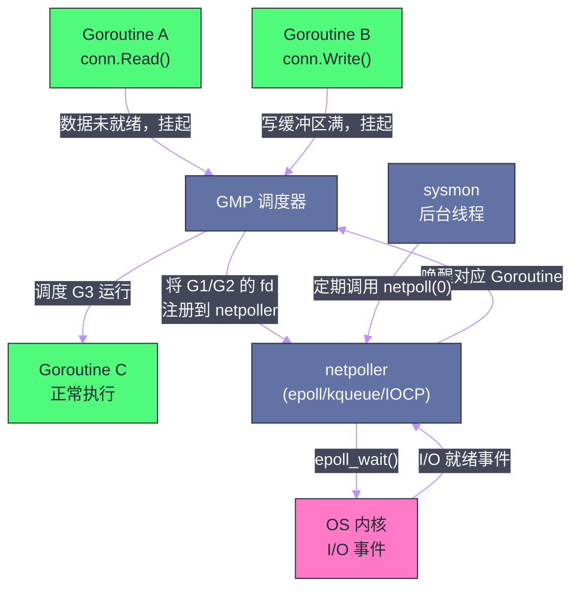

# Go 网络编程——netpoller 与 Goroutine-per-Connection

## 摘要

Go 的网络编程以其"同步的代码写法、异步的底层执行"著称——开发者可以用最直觉的阻塞式 API（`conn.Read()`、`conn.Write()`）编写网络代码，却能获得接近 epoll/kqueue 事件驱动模型的并发性能。这背后的秘密是 **netpoller**：Go 运行时将底层的异步 I/O（epoll/kqueue/IOCP）封装在调度器中，当 Goroutine 等待 I/O 时，运行时将其挂起并切换到其他 Goroutine，I/O 就绪时再将其唤醒——对上层代码完全透明。本文深入 netpoller 的工作机制、**Goroutine-per-Connection** 模式的优势与成本分析、`net/http` 标准库服务端的请求处理流程，以及高并发网络服务的性能调优实践，从而理解为什么 Go 能在保持代码简洁的同时实现极高的网络并发能力。

---

## 第 1 章 传统网络编程模型的困境

### 1.1 阻塞 I/O 模型：简单但不可扩展

最直觉的网络服务器写法是**一个连接一个线程（Thread-per-Connection）**：

```c
// C 语言的阻塞 I/O 服务器（伪代码）
while (true) {
    int conn_fd = accept(server_fd, ...);
    // 为每个连接创建一个线程
    pthread_create(&thread, NULL, handle_connection, &conn_fd);
}

void* handle_connection(void* arg) {
    int fd = *(int*)arg;
    char buf[4096];
    while (true) {
        int n = read(fd, buf, sizeof(buf));  // 阻塞：等待数据
        if (n <= 0) break;
        process(buf, n);
        write(fd, response, response_len);  // 阻塞：等待写完
    }
}
```

这种模型极其简单，逻辑清晰——每个连接的处理代码就是一个线性的函数，没有回调地狱。但**无法扩展**：

- **OS 线程代价高昂**：每个线程需要 1-8MB 的栈空间，1000 个并发连接就需要 1-8GB 内存；
- **上下文切换开销**：OS 线程切换需要约 1-10µs，1000 个线程频繁切换会消耗大量 CPU；
- **实际并发上限**：典型服务器操作系统的线程数上限约为 1 万~10 万，远低于现代服务所需的并发连接数。

### 1.2 异步 I/O 模型：高效但复杂

为了解决 Thread-per-Connection 的扩展性问题，Linux 引入了 **epoll**（2002 年，Linux 2.5.44），macOS/BSD 提供了 **kqueue**，Windows 提供了 **IOCP**。这些机制允许单个线程同时监听数万个连接的 I/O 事件，实现真正的事件驱动：

```c
// epoll 事件驱动服务器（伪代码）
int epfd = epoll_create(1);
// 将所有连接 fd 注册到 epfd
struct epoll_event ev = {.events = EPOLLIN, .data.fd = conn_fd};
epoll_ctl(epfd, EPOLL_CTL_ADD, conn_fd, &ev);

while (true) {
    // 等待任意一个 fd 就绪（可以是数万个 fd 中的任何一个）
    int n = epoll_wait(epfd, events, MAX_EVENTS, -1);
    for (int i = 0; i < n; i++) {
        int fd = events[i].data.fd;
        // 处理这个 fd 的事件
        handle_event(fd);
    }
}
```

epoll 模型可以用单线程处理数万并发连接，但代价是**代码极其复杂**：
- 不能阻塞（一旦阻塞整个 event loop 就卡死了）；
- 读写可能只完成一部分（需要处理 `EAGAIN`）；
- 状态机管理（一个请求分多个事件处理，需要显式维护状态）；
- 回调地狱（Node.js 早期的噩梦）。

**Go 的解法**是两全其美：用 Goroutine 替代线程（轻量，2KB 起步，可有数百万个），在运行时层把 epoll/kqueue 封装成透明的挂起/唤醒机制——开发者仍然写阻塞式代码，运行时在底层做异步 I/O。

---

## 第 2 章 netpoller：Go 运行时的 I/O 事件引擎

### 2.1 netpoller 的整体架构

**netpoller** 是 Go 运行时内嵌的网络轮询器，它将平台特定的异步 I/O 机制（Linux 的 epoll、macOS/BSD 的 kqueue、Windows 的 IOCP）抽象为统一的 Go 内部接口：



### 2.2 netpoller 的核心操作流程

**当 Goroutine 发起网络 I/O 时**（以 `conn.Read()` 为例）：

1. **尝试非阻塞读**：运行时将 TCP socket 设置为非阻塞模式（`O_NONBLOCK`）。`Read()` 首先尝试非阻塞读（`syscall.Read`），如果数据已经在内核缓冲区，直接读取返回——这是零代价的快速路径；

2. **数据未就绪，注册并挂起**：如果内核返回 `EAGAIN`（数据未就绪），运行时将当前 fd 注册到 epoll（`epoll_ctl(EPOLL_CTL_ADD, fd, EPOLLIN)`），然后调用 `gopark()` 将当前 Goroutine 挂起（状态设为 `_Gwaiting`），并释放对应的 P；

3. **调度器切换**：P 重新寻找可运行的 Goroutine，继续执行其他工作；

4. **I/O 就绪，唤醒**：当内核中该 fd 的数据就绪时，epoll_wait 返回。netpoller 找到等待这个 fd 的 Goroutine，调用 `goready()` 将其状态改为 `_Grunnable`，加入运行队列；

5. **Goroutine 继续执行**：被唤醒的 Goroutine 再次执行 `syscall.Read`，此时数据已就绪，读取成功返回。

对上层代码来说，`conn.Read()` 就是一个普通的阻塞调用，完全感知不到底层的挂起和唤醒——这就是 Go 网络编程"同步代码风格"的秘密。

### 2.3 netpoller 的触发时机

netpoller 在三个时机被调用（`runtime.netpoll` 函数）：

- **调度循环（schedule 函数）**：每次调度器找不到可运行 Goroutine 时，会调用 `netpoll(0)`（非阻塞，立即返回就绪的 Goroutine）；
- **sysmon 后台线程**：`sysmon` 每隔约 10ms 调用 `netpoll(0)` 检查是否有 I/O 就绪；
- **findRunnable 阻塞**：当所有 P 都找不到任务时，调度器会调用 `netpoll(-1)`（阻塞直到有 I/O 事件），而不是让 M 空转。

> [!info] 核心概念：netpoller 与 GMP 的协作
> netpoller 不是独立的线程，它是 GMP 调度循环的一部分。当 Goroutine 因 I/O 挂起时，它对应的 P 立即被释放给其他 M 使用——这是 Go 网络服务能以极少的 OS 线程（M）处理大量并发连接的根本原因。一个只有 4 个 P 的 Go 程序，可以同时挂起等待 100 万个连接的 I/O，只需要 4 个 OS 线程在运行。

### 2.4 epoll 与 netpoller 的对应关系

```go
// Go 运行时内部（runtime/netpoll_epoll.go，简化）

var epfd int32 = -1  // epoll fd

// 初始化：创建 epoll 实例
func netpollinit() {
    epfd = epollcreate1(_EPOLL_CLOEXEC)
    // ...
}

// 注册 fd 到 epoll（当 Goroutine 因 I/O 挂起时调用）
func netpollopen(fd uintptr, pd *pollDesc) int32 {
    var ev epollevent
    ev.events = _EPOLLIN | _EPOLLOUT | _EPOLLRDHUP | _EPOLLET  // 边缘触发
    *(**pollDesc)(unsafe.Pointer(&ev.data)) = pd
    return -epollctl(epfd, _EPOLL_CTL_ADD, int32(fd), &ev)
}

// 等待 I/O 事件，返回就绪的 Goroutine 列表
func netpoll(delay int64) gList {
    // delay: -1 = 无限等待；0 = 立即返回；>0 = 最长等待 delay 纳秒
    var tp int32
    if delay < 0 {
        tp = -1
    } else if delay == 0 {
        tp = 0
    } else {
        tp = int32(delay/1e6)
        // ...
    }
    
    var events [128]epollevent
    n := epollwait(epfd, &events[0], 128, tp)
    
    var toRun gList
    for i := int32(0); i < n; i++ {
        ev := &events[i]
        pd := *(**pollDesc)(unsafe.Pointer(&ev.data))
        // 根据事件类型唤醒等待读或等待写的 Goroutine
        if ev.events&(_EPOLLIN|_EPOLLRDHUP|_EPOLLHUP|_EPOLLERR) != 0 {
            netpollready(&toRun, pd, 'r')
        }
        if ev.events&(_EPOLLOUT|_EPOLLHUP|_EPOLLERR) != 0 {
            netpollready(&toRun, pd, 'w')
        }
    }
    return toRun
}
```

---

## 第 3 章 Goroutine-per-Connection：Go 的并发网络编程模型

### 3.1 模式描述

**Goroutine-per-Connection** 是 Go 网络编程的标准模式：为每个客户端连接启动一个独立的 Goroutine，该 Goroutine 负责处理这个连接的全部生命周期（读请求、处理、写响应、循环直到连接关闭）：

```go
func main() {
    ln, _ := net.Listen("tcp", ":8080")
    
    for {
        conn, err := ln.Accept()
        if err != nil {
            log.Fatal(err)
        }
        go handleConn(conn)  // 每个连接一个 Goroutine
    }
}

func handleConn(conn net.Conn) {
    defer conn.Close()
    
    buf := make([]byte, 4096)
    for {
        n, err := conn.Read(buf)  // 阻塞等待，但实际是 netpoller 挂起
        if err != nil {
            return  // 连接关闭，Goroutine 退出
        }
        
        response := process(buf[:n])
        conn.Write(response)
    }
}
```

这个模式的代码直觉性极强——每个连接的处理逻辑是一个线性函数，没有状态机，没有回调，完全同步的编程风格。

### 3.2 为什么 Goroutine-per-Connection 在 Go 中可行

在 Java/C++ 中，Thread-per-Connection 不可扩展，因为 OS 线程代价太高。Go 的 Goroutine 解决了这个代价问题：

| 指标 | OS 线程（Java/C++）| Go Goroutine |
| --- | --- | --- |
| 初始栈大小 | 1-8 MB | 2-8 KB（可增长）|
| 创建时间 | ~10µs | ~0.3µs（约 30 倍快）|
| 上下文切换 | ~1-10µs（OS 调度）| ~100-300ns（用户空间调度）|
| 可并发数量 | 数千~数万 | 数百万 |
| I/O 等待时 | 占用 OS 线程 | P 被释放，OS 线程服务其他 Goroutine |

以 100 万个并发 TCP 连接为例：
- Java Thread-per-Connection：100 万个线程，约需 1TB 内存（不可行）；
- Go Goroutine-per-Connection：100 万个 Goroutine，约需 2-8GB 内存（可行，且大多数时间 Goroutine 都在挂起等待 I/O）。

### 3.3 实际并发下的内存分析

每个 Goroutine 的实际内存占用：
- **栈**：初始 2KB（Go 1.4 后），按需增长（最大默认 1GB）；
- **等待 I/O 时**：Goroutine 被挂起，栈仍然占用内存，但 CPU 不被占用；
- **pollDesc**：netpoller 中每个注册的 fd 对应一个 `pollDesc` 结构（约 136 字节）。

对于一个 10 万并发连接的服务：
- 10 万个 Goroutine × (2KB 栈 + 少量元数据) ≈ 200-400MB——完全可接受。

---

## 第 4 章 net/http 标准库的请求处理流程

### 4.1 HTTP Server 的启动与监听

```go
// net/http/server.go（简化）
func (srv *Server) ListenAndServe() error {
    ln, _ := net.Listen("tcp", srv.Addr)
    return srv.Serve(ln)
}

func (srv *Server) Serve(l net.Listener) error {
    for {
        rw, err := l.Accept()  // 阻塞等待新连接（netpoller 挂起）
        if err != nil { ... }
        
        c := srv.newConn(rw)
        go c.serve(connCtx)  // 每个连接一个 Goroutine
    }
}
```

### 4.2 单个连接的处理流程

```go
// 每个连接的 Goroutine 执行这个函数
func (c *conn) serve(ctx context.Context) {
    defer c.close()
    
    for {
        // 读取并解析 HTTP 请求
        w, err := c.readRequest()  // 内部调用 conn.Read()，等待数据
        if err != nil { return }
        
        // 调用用户注册的 Handler（mux.ServeHTTP）
        serverHandler{c.server}.ServeHTTP(w, w.req)
        
        // 完成响应
        w.finishRequest()
        
        // 检查是否需要继续（Keep-Alive）
        if !w.shouldReuseConnection() {
            return
        }
        // 继续循环，处理下一个请求（HTTP keep-alive）
    }
}
```

**关键点：一个连接的 Goroutine 同时处理多个 HTTP 请求（HTTP keep-alive）**。HTTP/1.1 默认 keep-alive，一个 TCP 连接上会串行地发送多个请求/响应对。这意味着一个连接的 Goroutine 是**长期存活**的，而不是处理完一个请求就退出。

### 4.3 Handler 的并发模型

`net/http` 的每个连接有独立的 Goroutine，但**同一连接上的请求是串行处理的**（HTTP/1.1 的 pipeline 在实践中不常用）。不同连接上的请求并发处理：

```
连接 1 的 Goroutine: 请求1 → 响应1 → 请求2 → 响应2 → ...
连接 2 的 Goroutine: 请求3 → 响应3 → ...
连接 3 的 Goroutine: 请求4 → 响应4 → ...
（并发运行）
```

这意味着 `http.Handler` 的实现必须是并发安全的——同一个 Handler 可能被多个 Goroutine 同时调用（来自不同连接的请求）。

### 4.4 HTTP/2 的多路复用

HTTP/2 的情况不同：一个 TCP 连接上可以同时有多个 Stream（请求）并发进行。Go 的 `net/http` 对 HTTP/2 的处理是：**每个 HTTP/2 Stream 有自己的 Goroutine**（而不是每个连接一个）：

```
HTTP/2 连接的 Goroutine（负责帧的读写）
    ├── Stream 1 的 Goroutine（处理请求 1）
    ├── Stream 2 的 Goroutine（处理请求 2）
    └── Stream 3 的 Goroutine（处理请求 3）
```

---

## 第 5 章 高并发网络服务的性能优化

### 5.1 减少系统调用：writev 与批量写

单次 `conn.Write()` 对应一个 `write` 系统调用，频繁的小数据写入会产生大量系统调用开销。`net.Bufio` 和 `bufio.Writer` 通过在用户态缓冲数据，合并多次写入为单次系统调用：

```go
// 低效：每个 Write 都是一次系统调用
conn.Write(httpHeader)
conn.Write(httpBody)

// 高效：通过 bufio 缓冲，合并为一次 Write（一次系统调用）
bw := bufio.NewWriter(conn)
bw.Write(httpHeader)
bw.Write(httpBody)
bw.Flush()  // 一次性写入
```

`net/http` 内部使用 `bufio.ReadWriter` 包装 `net.Conn`，正是为了减少系统调用次数。

### 5.2 连接池：客户端复用 TCP 连接

Go 的 `http.Client` 内置了 TCP 连接池（`http.Transport`）。每次 HTTP 请求不需要重新建立 TCP 连接（TCP 握手约 1-3 个 RTT，加上 TLS 握手约 2-4 个 RTT）：

```go
// http.DefaultTransport 的关键参数
transport := &http.Transport{
    MaxIdleConns:        100,              // 全局最大空闲连接数
    MaxIdleConnsPerHost: 10,               // 每个 Host 最大空闲连接数（默认 2，通常需要调大）
    IdleConnTimeout:     90 * time.Second, // 空闲连接超时
    
    // TCP 连接参数
    DialContext: (&net.Dialer{
        Timeout:   30 * time.Second,
        KeepAlive: 30 * time.Second,
    }).DialContext,
}

client := &http.Client{
    Transport: transport,
    Timeout:   10 * time.Second,
}
```

**常见误区**：使用 `http.DefaultClient` 而不自定义 `Transport`，导致 `MaxIdleConnsPerHost` 使用默认值 2——在高并发下，每次请求都可能需要新建连接，TLS 握手开销极大。生产代码应始终自定义 `Transport` 并根据实际并发度调整 `MaxIdleConnsPerHost`。

### 5.3 超时设置：防止连接泄漏

`net/http` 服务端和客户端都需要设置合理的超时，否则慢客户端/慢下游会造成 Goroutine 堆积：

```go
// 服务端超时配置
server := &http.Server{
    Addr:         ":8080",
    ReadTimeout:  5 * time.Second,   // 读取完整请求（含 body）的超时
    WriteTimeout: 10 * time.Second,  // 写完整响应的超时
    IdleTimeout:  120 * time.Second, // Keep-alive 连接的空闲超时
    
    // 更细粒度：ReadHeaderTimeout 只限制读 header 的时间（防 Slowloris 攻击）
    ReadHeaderTimeout: 2 * time.Second,
}

// 客户端超时配置
client := &http.Client{
    Timeout: 30 * time.Second,  // 整个请求（含响应体读取）的超时
}
```

**`ReadTimeout` 与 `WriteTimeout` 的区别**：
- `ReadTimeout`：从连接建立到完整请求（含 body）读取完毕的时间；
- `WriteTimeout`：从请求读取完毕到响应完全写出的时间；
- 两者都是从上一个请求完成时开始计时（对于 keep-alive 连接）。

不设置超时的后果：一个恶意客户端以极慢的速度发送请求（Slowloris 攻击），会占用一个 Goroutine 直到连接关闭——10 万个这样的连接就能让服务 OOM。

### 5.4 SO_REUSEPORT：多核 Accept 负载均衡

默认情况下，`net.Listen` 创建一个监听 socket，所有 Goroutine 的 `Accept` 都竞争同一个 socket——在极高 QPS 下，Accept 本身会成为瓶颈（需要 mutex 保护）。Linux 4.6+ 的 `SO_REUSEPORT` 允许多个 socket 绑定同一个端口，内核在连接到来时负载均衡地选择一个 socket：

```go
import "golang.org/x/sys/unix"

// 使用 SO_REUSEPORT 创建多个监听 socket
lc := net.ListenConfig{
    Control: func(network, address string, c syscall.RawConn) error {
        return c.Control(func(fd uintptr) {
            syscall.SetsockoptInt(int(fd), syscall.SOL_SOCKET, unix.SO_REUSEPORT, 1)
        })
    },
}

// 为每个 CPU 核心创建一个监听 socket
for i := 0; i < runtime.NumCPU(); i++ {
    ln, _ := lc.Listen(ctx, "tcp", ":8080")
    go http.Serve(ln, handler)
}
```

这个技术在 NGINX、HAProxy 等高性能网络服务中广泛使用。对于 Go 服务，通常只有在 Accept 确实成为瓶颈时才需要（如每秒数十万新连接）。

### 5.5 conn.SetDeadline vs context.WithTimeout

处理网络 I/O 时有两种超时控制方式：

```go
// 方式一：conn.SetDeadline（连接级超时）
conn.SetDeadline(time.Now().Add(5 * time.Second))
conn.Read(buf)   // 超时时返回 net.Error（IsTimeout() == true）
conn.Write(data)

// 方式二：context（请求级超时，http.Client 使用此方式）
ctx, cancel := context.WithTimeout(context.Background(), 5*time.Second)
defer cancel()
req, _ := http.NewRequestWithContext(ctx, "GET", url, nil)
resp, err := client.Do(req)
```

对于直接操作 `net.Conn` 的低层代码，`SetDeadline` 更直接；对于使用 `net/http` 的代码，通过 `context` 控制超时更符合 Go 的惯用法，且可以沿请求链路传播。

---

## 总结

本篇完整呈现了 Go 网络编程"同步写法、异步执行"背后的机制：

**netpoller 的工作原理**：socket 以非阻塞模式创建，I/O 未就绪时调用 `gopark()` 挂起 Goroutine（释放 P），将 fd 注册到 epoll/kqueue；I/O 就绪时 `netpoll()` 返回就绪的 Goroutine，调度器将其状态改为 Runnable 并调度执行。整个过程对上层代码完全透明，上层代码写的是阻塞 API。

**Goroutine-per-Connection 可行的根本原因**：Goroutine 比 OS 线程轻量约 3 个数量级（初始栈 2KB vs 1MB+，创建耗时 0.3µs vs 10µs），I/O 等待时不占用 OS 线程（P 被释放）——4 个 P 可以服务数百万并发连接。

**`net/http` 的并发模型**：每个 TCP 连接一个 Goroutine（串行处理该连接上的多个 HTTP/1.1 请求）；HTTP/2 每个 Stream 一个 Goroutine。Handler 实现必须并发安全。

**关键性能参数**：`http.Transport` 的 `MaxIdleConnsPerHost`（默认 2，生产需调大）、服务端四个超时（ReadHeaderTimeout/ReadTimeout/WriteTimeout/IdleTimeout）、`bufio` 缓冲减少系统调用——这三点是 Go HTTP 服务调优最常见的切入点。

至此，Go 并发编程系列全部完成。下一个系列进入 Go 工程实践：[[Go工程实践 01 Go 项目结构]]。

---

> [!note] 参考资料
> - Go 源码：`runtime/netpoll.go`、`runtime/netpoll_epoll.go`、`net/http/server.go`
> - Cloudflare Blog,《The sad state of Linux socket balancing》
> - Go Blog,《The Go net/http package》
> - Russ Cox,《Go's network poller》

---

> [!note] 思考题
> 1. Go 的 netpoller 使用 epoll（Linux）/kqueue（macOS）在底层实现非阻塞 IO，但对用户暴露的是同步阻塞 API（`conn.Read()` 会阻塞当前 goroutine）。这种'以同步编程模型暴露异步 IO'的方式，与 Java NIO 的 Selector 模式相比，开发效率和运行时性能各有什么优劣？在 C10K 场景下，Goroutine-per-Connection 模型是否会遇到瓶颈？瓶颈在哪里？
> 2. 当一个 goroutine 调用 `conn.Read()` 但数据未到达时，Go 运行时会将这个 goroutine 挂起并将 fd 注册到 epoll。数据到达后，epoll 通知 netpoller，netpoller 唤醒对应的 goroutine。在这个过程中，goroutine 从挂起到被唤醒的延迟由哪些因素决定？这个延迟与直接使用 epoll 的 C 程序相比会大多少？
> 3. `net.Conn` 的 `SetDeadline`/`SetReadDeadline`/`SetWriteDeadline` 是通过什么机制实现超时的？是内核层面的 socket timeout，还是 Go 运行时层面的 timer？如果设置了 `ReadDeadline` 后数据在 deadline 前到达但 goroutine 还未被调度到 CPU 执行，会发生超时错误吗？
