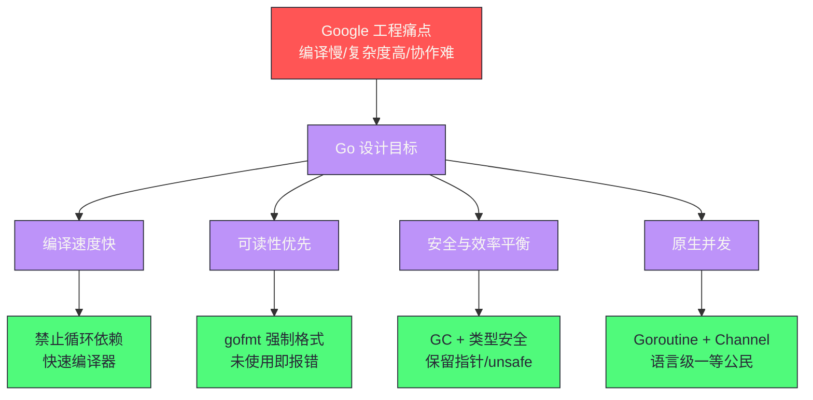
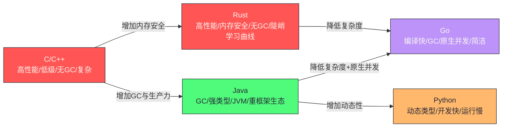

# Go 语言设计哲学——简单背后的取舍

**摘要：**

Go 语言诞生于 2009 年，是 Google 针对大规模软件工程问题而专门设计的系统级编程语言。它不是一门追求新奇特性的语言，而是一门极度克制的语言——没有类继承、没有泛型（直到 1.18）、没有运算符重载、没有异常（只有 error）、没有隐式类型转换。这种刻意的"缺失"背后是深思熟虑的权衡：Go 用最小化的语言复杂度，换取了极高的可读性、快速的编译速度和清晰的工程协作体验。本文从 Go 的诞生背景出发，深入分析 Go 的三大设计支柱——"少即是多"的语法哲学、组合优于继承的类型系统、以及以 CSP 为基础的并发模型——逐一分析每个设计选择背后的权衡逻辑，并与 Java、Rust、C++ 进行定位对比，帮助读者建立对 Go 设计哲学的完整认知框架。文章最后回到一个根本问题：一门语言的价值，究竟在于它允许工程师做什么，还是在于它阻止工程师做什么。

---

## 第 1 章 Go 的诞生：一门语言是如何被"逼出来"的

### 1.1 Google 的 C++ 编译痛点

理解 Go 为什么长这个样子，必须从它的诞生背景说起。2007 年，Rob Pike、Ken Thompson、Robert Griesemer 三位 Google 工程师在等待一个大型 C++ 项目的编译结果时，开始讨论当时系统编程语言的种种不满。这次讨论直接催生了 Go 的设计——一个看似偶然的等待时刻，背后却凝聚着三位设计者对系统编程语言长达数十年的不满与思考。

Google 内部的 C++ 代码库规模极其庞大——数百万行代码，成千上万个源文件相互依赖。C++ 的编译速度慢到令人发指：一次完整编译动辄几十分钟甚至数小时。究其根源，C++ 的 `#include` 机制每次都要重新处理头文件，大量的模板展开更会导致编译单元急剧膨胀。这不只是"等待"的问题——编译速度慢意味着"修改-验证"的循环被拉长，开发体验极差，工程效率大打折扣。在一个以迭代速度为核心竞争力的互联网公司里，这种等待是实实在在的成本：每天数十次编译，每次等待数十分钟，数千名工程师的时间在等待中蒸发。

除了编译速度，C++ 的另一个问题是**复杂性爆炸**。C++ 每个版本都在已有特性的基础上叠加新特性（模板元编程、多重继承、虚继承、运算符重载、异常……），导致语言本身极度复杂。在一个大型团队中，不同工程师使用的 C++ "子集"可能差异显著——有人大量使用模板元编程，有人完全回避它；有人用异常，有人明令禁止；有人用 `boost`，有人视其为洪水猛兽。这种碎片化让代码审查和团队协作变得困难，新人加入团队后需要先学习"我们这个项目用的是 C++ 的哪个子集"，而不是直接学习 C++ 本身。

Rob Pike 后来在 2012 年的演讲《Go at Google: Language Design in the Service of Software Engineering》中明确指出：Go 的设计动机不是"创造一门更好的语言"，而是"解决 Google 内部的软件工程问题"。这个定位决定了 Go 的所有设计决策都围绕一个核心——**让大型团队中的普通工程师能够高效协作**，而不是让少数高手能够写出极致精巧的代码。

> [!info] 核心概念：Go 是"工程语言"而非"研究语言"
> Go 从第一天起就不是为了推进编程语言理论的前沿，而是为了解决一个极其具体的工程问题：在数千人协作的代码库中，如何让代码保持可读、可维护、可快速编译。这个定位决定了 Go 宁可牺牲表达力也要保持简单，宁可拒绝"优雅"的特性也要保证工具链的可靠性。理解这一点，才能理解 Go 为什么"不支持 X"——大多数情况下不是设计者不知道那个特性，而是它与工程效率目标存在冲突。

正是在这个背景下，三位工程师开始思考：**能否设计一门语言，同时具备 C/C++ 的运行效率，又能像 Python 一样快速开发，还能支持现代的并发需求——但语言本身保持极度简单？** 这个问题的答案，就是 Go。

### 1.2 三位设计者的背景如何塑造了 Go

了解设计者的背景，有助于理解 Go 的设计偏好——一门语言的气质，往往是设计者气质的投射。

**Ken Thompson** 是 Unix 和 C 语言的创造者，是"简单哲学"（KISS—Keep It Simple, Stupid）最坚定的信徒。他在 1969 年用汇编语言写出 Unix 的第一版，后来与 Dennis Ritchie 一起用 C 语言重写 Unix——C 语言本身就是"极简主义"的典范：少量关键字、清晰的语义、接近硬件但不过度抽象。Thompson 认为，语言越简单、正交性越强，程序员就越能写出清晰、可预测的代码。Go 的 25 个关键字和刻意回避复杂特性的选择，与 Thompson 一贯的极简信念一脉相承。

**Rob Pike** 是 Unix 团队的早期成员，后来主导了 Plan 9 操作系统的开发，并在 Limbo 语言中实践了 CSP 并发模型（Communicating Sequential Processes）。Plan 9 是对 Unix 哲学的彻底贯彻——用文件系统统一所有接口，用简单的组合规则构建复杂系统。Limbo 语言则是 Pike 对 CSP 并发模型的工程化尝试，它的 Channel 概念直接被 Go 继承。Pike 对 C++ 的复杂性深恶痛绝，曾多次公开表达对"特性堆砌型"语言的批评——他认为一门语言的价值不在于它有多少特性，而在于它用多少特性解决了多少问题。Go 的并发原语（Goroutine + Channel）和"少即是多"的语法哲学，都能看到 Pike 的思想印记。

**Robert Griesemer** 主导过 V8 JavaScript 引擎和 Strongtalk 编译器的设计，有丰富的编译器和类型系统设计经验，为 Go 的类型系统和编译器效率提供了重要保障。Strongtalk 是 Smalltalk 的一个变种，引入了可选的静态类型系统——这种"动态语言中引入静态类型"的经验，可能影响了 Go 在接口设计上的取舍：既保留灵活性（隐式实现），又保证类型安全（编译期检查）。Griesemer 对编译器性能的执着，也是 Go 编译速度极快的关键原因之一。

三位设计者的共同信念是：**语言的价值不在于它能做什么，而在于它排除了什么**。一门好的语言应该能让一个普通水平的工程师写出清晰易懂的代码，而不是让高手可以用晦涩的特性写出别人看不懂的"魔法"。这个信念在 Go 的设计中体现得淋漓尽致——Go 刻意没有类继承、没有运算符重载、没有宏、没有异常，这些"缺失"不是技术上的局限，而是设计上的选择。

### 1.3 Go 的设计目标：工程效率优先

Go 的设计目标非常具体，官方文档和 Rob Pike 的演讲中明确陈述了几个核心目标：

- **编译速度快**：所有 Go 代码应该能在几秒内完成编译。这不是锦上添花，而是设计的硬性约束——Go 禁止循环依赖，`import` 只允许导入真正使用到的包，编译器的设计从第一天起就以"快"为首要指标。编译速度快的深层意义在于缩短"修改-验证"循环，这是工程师日常体验的核心；
- **可读性胜过可写性**：代码被阅读的次数远多于被编写的次数。Go 强制用 `gofmt` 格式化代码，消灭了风格争论；强制要求 `import` 和声明的变量都必须被使用，消灭了"僵尸代码"；一套代码风格全社区统一，意味着阅读任何 Go 项目的代码都不会有风格适应成本；
- **安全与效率的平衡**：Go 有垃圾回收（不需要手动管理内存）、类型安全（没有指针算术，除非用 `unsafe` 包）、接口的隐式实现（减少耦合），同时保留了足够的底层能力（指针、`unsafe` 包、CGo）——它不是"安全的脚本语言"，而是"带安全网的系统语言"；
- **原生并发支持**：Goroutine 和 Channel 是语言层面的一等公民，不是库（不像 Java 的 `Thread`，不像 Python 的 `asyncio`）。并发是 Go 的"默认能力"，而不是需要额外引入框架才能获得的"高级特性"。

这四个目标相互牵制、共同塑造了 Go 的所有设计决策。理解这个背景，才能理解 Go 为什么"不支持 X 特性"——大多数情况下，不是设计者不知道那个特性，而是它与上述目标之间存在不可调和的冲突。譬如，运算符重载能让代码更"优雅"，但它会让代码的阅读成本急剧上升（`a + b` 到底是数值相加还是矩阵相加还是字符串拼接？），这与"可读性优先"的目标冲突；宏能提供极强的元编程能力，但它让代码的语义变得不可预测（一段代码的实际行为可能被宏完全改写），这与"简单可预测"的目标冲突。

Go 团队的选择是：**宁可让语言少做一些事，也要保证它做的事都清晰可预测**。这是一种克制的工程美学，与当下"特性越多越好"的语言演进趋势形成鲜明对比。



---

## 第 2 章 "少即是多"：Go 语法的极简哲学

### 2.1 关键字只有 25 个

Go 只有 25 个关键字：

```
break        default      func         interface    select
case         defer        go           map          struct
chan         else         goto         package      switch
const        fallthrough  if           range        type
continue     for          import       return       var
```

对比一下：Java 有 50+ 个关键字，C++ 有 80+ 个，C# 有 77 个。25 个关键字意味着一个开发者可以在几天内记住 Go 的所有语法结构，而不需要花数周时间学习各种语法糖和特殊形式。这不是数字游戏——关键字数量直接关系到语言的认知负荷。一个工程师在阅读代码时，每遇到一个不熟悉的语法结构都需要停下来思考其语义，而 Go 的 25 个关键字把这种"停顿"的概率压到了最低。

这不是偷懒，而是有意为之。更少的语法结构意味着：
- **更容易学习**：新人上手快，降低团队扩张的培训成本——在人员流动频繁的互联网行业，这一点尤其重要；
- **更容易阅读陌生代码**：阅读他人代码时不会遇到"这个语法我不认识"的窘境——所有 Go 代码用的都是同一套基本结构，区别只在于组合方式；
- **工具链更简单**：语法简单的语言，IDE 的代码分析、重构工具的实现难度大幅降低——这也是 `gopls`（Go 语言服务器）比 `clangd` 更稳定的原因之一。工具链的可靠性又反过来影响开发体验，形成一个正循环。

Go 的"少即是多"（Less is more）不是空洞的口号，而是有具体的设计方法论支撑：每引入一个新特性，都要回答"它解决了什么问题""它的代价是什么""有没有更简单的方式解决同样的问题"。只有当问题的严重性超过特性的复杂性时，特性才会被引入。这种"默认拒绝"的姿态，让 Go 在过去十多年里保持了惊人的语法稳定性——从 1.0 到 1.17，Go 的语法几乎没有实质性的变化，直到 1.18 才引入泛型这个"迟到十年"的特性。

### 2.2 强制统一的代码风格：gofmt

`gofmt` 是 Go 官方提供的代码格式化工具，它的使用在 Go 社区几乎是强制性的（绝大多数 CI 流水线都会检查 `gofmt` 合规性）。Go 是主流编程语言中第一个把"代码格式"从"个人选择"变为"语言规范"的语言——在 Go 之前，几乎所有语言都把代码风格留给团队自行约定，于是诞生了无数的风格指南、lint 规则和 Code Review 争论。

`gofmt` 的存在消灭了 Go 社区中最常见的一类争论——代码风格争论：花括号是否另起一行？缩进用 Tab 还是空格？运算符两侧是否加空格？在其他语言的团队中，这些问题可能需要数小时的 Code Review 争论，甚至需要专门制定团队规范文档。在 Go 中，这些问题根本不存在——`gofmt` 统一决定，没有选项，没有配置，就是"Go 的方式"。

```bash
# 格式化当前目录下所有 Go 文件
gofmt -w .

# 检查是否符合格式（不修改文件，用于 CI）
gofmt -l .
```

`gofmt` 的哲学是：**代码格式不应该由程序员决定，而应该由工具决定**。这减少了认知摩擦，让开发者把注意力集中在逻辑上，而不是格式上。Rob Pike 有一句名言："Gofmt's style is no one's favorite, yet gofmt is everyone's favorite"——gofmt 的风格不是任何人的最爱，但 gofmt 这个工具本身是所有人的最爱。这句话精准地概括了"工具强制统一"的价值：没有人喜欢被规定怎么写代码，但所有人都喜欢阅读风格统一的代码。

`gofmt` 的成功催生了一个更广泛的生态——`goimports`（自动管理 import）、`golangci-lint`（聚合多种 linter）、`gofumpt`（更严格的格式化）——这些工具都遵循同一个理念：**把可以自动化的东西交给工具，把人的注意力留给真正需要思考的问题**。这个理念后来被其他语言社区吸收，譬如 Rust 的 `rustfmt`、Prettier 对 JavaScript/TypeScript 的格式化，都能看到 gofmt 的影响。

### 2.3 强制"零容忍"：声明未使用则编译失败

Go 编译器对两类"冗余"有强制检查：

**未使用的 import**：

```go
import (
    "fmt"
    "os"  // 如果下面的代码没有用到 os，则编译失败
)

func main() {
    fmt.Println("hello")
    // 没有使用 os 包
}
// 编译错误：imported and not used: "os"
```

**未使用的局部变量**：

```go
func main() {
    x := 42  // 如果 x 从未被读取，则编译失败
    fmt.Println("done")
}
// 编译错误：x declared and not used
```

这两条规则在初学者眼中是"严苛的限制"，但在大型项目中是"宝贵的纪律"。未使用的 import 是代码腐烂的信号——可能意味着某个功能被注释掉了，但相关的引用却留了下来；未使用的变量可能是逻辑错误（本来打算用 x，却写成了用 y）。编译器的强制检查让这些问题在编译期就被发现，而不是在代码 review 时被人工发现，也不是作为无害的"噪声"悄悄留在代码库中。

值得注意的是，Go 对"未使用"的检查有精细的区分：**局部变量**必须被使用，但**包级变量**和**函数参数**可以不使用。这个区分是有道理的——包级变量可能是公开 API 的一部分（即使暂时没被调用也不能删除），函数参数可能为了满足接口签名而存在（即使当前实现没用到）。Go 的"零容忍"不是一刀切，而是针对"最可能是代码腐烂信号"的场景做精确打击。

> [!note] 设计哲学
> Go 的强制编译检查体现了一个设计信念：**让机器强制执行最佳实践，比依赖人工 review 更可靠**。一个规范只有在被工具强制执行时，才能真正在整个团队中落地。依赖人工 review 的规范，最终都会在 deadline 压力下被妥协——而编译器不会妥协。

### 2.4 没有"隐式"：所有转换必须显式

Go 没有任何隐式类型转换。即使是在其他语言中完全合法的"安全提升"（如 `int` 自动转为 `int64`），在 Go 中也必须显式写出：

```go
var a int = 10
var b int64 = int64(a)  // 必须显式转换
var c float64 = float64(a)  // 必须显式转换

// 以下在 Java/C++ 中合法，但在 Go 中编译失败：
var d int64 = a  // 编译错误：cannot use a (type int) as type int64
```

这条规则让每一个类型转换都"可见"——阅读代码的人不需要了解语言的隐式转换规则，代码的意图完全由代码本身表达，没有隐藏的"魔法"。在 C++ 中，隐式转换可能导致难以察觉的精度丢失（`double` 静默截断为 `int`）或意外的构造函数调用（单参数构造函数的隐式转换），这些是 C++ bug 的常见来源。Go 用"所有转换显式"的规则，从语言层面消灭了这类问题。

显式转换的代价是代码稍显冗长——`int64(a)` 比 `a` 多了几个字符。但这个代价是值得的：在涉及数值计算的代码中，类型转换的"可见性"直接关系到正确性。一个 `int32` 到 `int16` 的截断，如果隐式发生，可能让一个本应溢出检查的逻辑静默失效；如果显式写出，至少在 Code Review 时会引起注意。

Go 对"隐式"的排斥不止于类型转换——没有隐式的构造函数调用、没有隐式的析构、没有隐式的运算符重载、没有隐式的接口实现声明（接口是隐式"满足"的，但这是另一回事，后文详述）。这种"所有行为都显式"的设计，让 Go 代码的语义高度可预测——你看到的代码做什么，它就做什么，没有隐藏的副作用。

---

## 第 3 章 组合优于继承：Go 的类型系统哲学

### 3.1 为什么 Go 没有类继承

Go 没有 `class`，没有 `extends`，没有类继承体系。这是 Go 与 Java、C++、Python 最显著的语言设计差异之一，也是 Go 设计团队中争议最多、思考最深的决策之一。在面向对象编程统治了软件工程教育二十多年的背景下，放弃类继承几乎是一种"离经叛道"的选择。

**类继承有什么问题？** 表面上看，继承是代码复用的手段——子类可以直接使用父类的方法和字段，不需要重复编写。但在大型项目中，类继承体系会带来几个深层问题：

**问题一：脆基类问题（Fragile Base Class）**。当一个基类被大量子类继承时，对基类的任何修改都可能破坏某个子类的行为，即使这个修改看起来完全"安全"。在大型 C++/Java 代码库中，深度继承树（5 层、8 层甚至更多）让每次修改都需要跑全量测试才能放心——因为影响面实在太难人工分析。脆基类问题的根源在于继承创造的"强耦合"：子类的正确性不仅取决于自己的代码，还取决于父类的实现细节，而父类的实现细节本应是封装的、可变的。

**问题二：is-a 语义的错误建模**。继承语义是"is-a"（是一种），但很多"代码复用"场景并不是 is-a 关系，而是 has-a（有一个）或 can-do（能做某事）关系。用继承强行表达这些关系，导致类层次结构不反映真实的概念关系。譬如"汽车"和"引擎"是 has-a 关系（汽车有一个引擎），但为了复用引擎的启动逻辑，有人可能让汽车继承引擎——这在语义上是荒谬的，但在"代码复用"的诱惑下并不罕见。

**问题三：菱形继承问题**。多继承会导致"菱形继承"（Diamond Problem）——当 D 同时继承 B 和 C，而 B 和 C 都继承自 A，那么 D 中应该有几份 A 的数据？C++ 需要虚继承（`virtual`）来解决，Java 直接禁止类的多继承（只允许多实现接口），都是以复杂度为代价的补丁。菱形继承的本质是"单根继承树"无法自然表达"一个概念同时属于多个分类"的现实——譬如"水陆两栖车"既是车又是船，强行塞进单继承树必然扭曲。

Go 的选择是：**彻底放弃类继承，代之以结构体嵌入（Embedding）和接口（Interface）**。这个选择不是对面向对象的否定，而是对面向对象的重新理解——Go 认为，多态的价值在于"行为契约"（接口），而不在于"实现复用"（继承）；代码复用应该通过组合（has-a）来实现，而不是通过继承（is-a）来实现。

### 3.2 结构体嵌入：组合式的代码复用

Go 用"嵌入"（Embedding）而非继承来实现代码复用。嵌入的语义是"has-a"，而非"is-a"：

```go
// 基础类型
type Animal struct {
    Name string
    Age  int
}

func (a Animal) Breathe() string {
    return a.Name + " is breathing"
}

func (a Animal) Describe() string {
    return fmt.Sprintf("%s, age %d", a.Name, a.Age)
}

// Dog 通过嵌入 Animal 来"复用"其字段和方法
type Dog struct {
    Animal          // 嵌入：不是继承，是"has-a"
    Breed  string
}

func (d Dog) Bark() string {
    return d.Name + " says: Woof!"  // 可以直接访问 Animal 的字段
}

// 使用
dog := Dog{
    Animal: Animal{Name: "Rex", Age: 3},
    Breed:  "Labrador",
}

fmt.Println(dog.Breathe())   // "Rex is breathing"（通过 Animal 的方法）
fmt.Println(dog.Bark())      // "Rex says: Woof!"（Dog 自己的方法）
fmt.Println(dog.Name)        // "Rex"（直接访问嵌入字段）
fmt.Println(dog.Animal.Name) // "Rex"（也可以显式访问）
```

**嵌入和继承的本质区别**：在 Go 中，`Dog` 嵌入了 `Animal`，但 `Dog` 不"是"一个 `Animal`——`Dog` 类型的值不能赋给 `Animal` 类型的变量（除非通过 `dog.Animal` 显式访问嵌入的 `Animal` 部分）。而 Java 中，子类实例可以赋给父类变量（多态）。这个区别看似细微，实则深刻：嵌入是"包含"关系，继承是"归属"关系，两者在类型系统中的语义完全不同。

嵌入还有一个继承不具备的特性：**方法提升是静态的，不是动态的**。在 Java 中，子类调用父类的方法时，如果父类方法调用了另一个可被覆盖的方法，实际执行的是子类的版本——这是"动态分发"，也是脆基类问题的根源之一。在 Go 中，嵌入的方法中调用的"自身方法"始终指向嵌入类型的实现，不会"穿透"到外层类型——这消除了动态分发带来的不可预测性，但也意味着嵌入无法实现"模板方法"模式（需要显式接口 + 显式调用才能实现）。

Go 的这个设计决定使得类型关系更加明确：**类型的行为完全由它实现的接口决定，而不是由它的继承树决定**。一个类型"能做什么"取决于它有哪些方法，而不是它"继承自谁"——这让类型之间的关系网是扁平的、可组合的，而不是深度的、耦合的。

### 3.3 接口的隐式实现：鸭子类型的类型安全版本

Go 的接口是隐式实现的——一个类型不需要声明"我实现了某接口"，只需要实现接口要求的所有方法，就自动满足该接口。这与 Java/C# 的显式声明（`implements InterfaceName`）完全不同。

```go
// 定义接口
type Stringer interface {
    String() string
}

// User 没有声明 "implements Stringer"
type User struct {
    Name  string
    Email string
}

// 只要实现了 String() string 方法，User 就自动满足 Stringer 接口
func (u User) String() string {
    return fmt.Sprintf("User{%s, %s}", u.Name, u.Email)
}

// 接受 Stringer 接口的函数
func printInfo(s Stringer) {
    fmt.Println(s.String())
}

// User 可以传给 printInfo，不需要任何声明
user := User{Name: "Alice", Email: "alice@example.com"}
printInfo(user)  // 合法，因为 User 满足 Stringer
```

**为什么隐式实现更好？** 它解耦了"接口的定义者"和"接口的实现者"。在 Java 中，`UserService` 必须在定义时声明 `implements Repository`——这要求 `UserService` 的作者在写代码时就知道 `Repository` 这个接口的存在。如果 `Repository` 接口是第三方库提供的，或者是在 `UserService` 写完之后才设计出来的，就只能修改 `UserService` 去添加 `implements` 声明。这种"实现者必须知道接口"的耦合，在大型项目中会演变为"所有类型都必须提前知道自己要满足哪些接口"的负担。

Go 的隐式接口让"接口"可以被事后定义：即使 `UserService` 已经写好了，只要它有符合要求的方法，任何在后来定义的接口都可以把它"纳入麾下"，而不需要修改 `UserService` 本身。这是 Go 实现 OCP（Open-Closed Principle）的方式——对扩展开放（可以定义新接口），对修改关闭（不需要修改现有类型）。这个特性在测试场景下尤其有用：你可以为任何类型定义一个 mock 接口，只要 mock 实现了相同的方法签名，就能替换真实实现——不需要修改被测代码。

隐式接口的代价是"接口发现的困难"——阅读一段代码时，你无法从一个类型的定义中直接看出它满足哪些接口（因为类型定义里没有 `implements` 声明）。Go 社区对此的应对是约定：**接口应该在使用方定义，而不是在实现方定义**——一个函数需要什么行为，就在函数旁边定义一个最小接口，而不是让所有实现者都去实现一个庞大的"全能接口"。这种"消费者定义接口"的模式，让接口保持小而专注，也隐式地遵循了接口隔离原则（ISP）。

> [!info] 核心概念：鸭子类型 vs 结构化子类型
> Python 的鸭子类型（"如果它走路像鸭子、叫声像鸭子，那它就是鸭子"）是运行时的——只有在运行时调用方法时才知道是否满足"接口"。Go 的接口是编译期检查的结构化子类型（Structural Subtyping）——编译器会在赋值时检查类型是否满足接口，提供类型安全保证，同时又保留了鸭子类型的灵活性。Go 的接口设计可以看作"鸭子类型的安全版本"——既有鸭子类型的解耦优势，又有静态类型的编译期保障。

隐式接口也有它的边界——当接口方法很多时，"隐式满足"可能变成"意外满足"：一个类型恰好实现了某接口的所有方法，但语义上并不符合该接口的契约（譬如 `String()` 方法在某个类型里是"转换为字符串"，在另一个类型里是"序列化为 JSON"，两者签名相同但语义不同）。Go 没有对接口语义的机器可检机制，只能靠文档和约定来约束——这是隐式接口的固有局限，也是 Go 社区强调"接口要小、语义要清晰"的原因。

---

## 第 4 章 CSP 并发模型：Don't communicate by sharing memory

### 4.1 为什么传统多线程并发如此困难

在 Java、C++ 的并发编程中，最主流的并发模型是**共享内存 + 锁**：多个线程共享同一块内存区域，通过 `synchronized`、Mutex、`ReentrantLock` 等锁机制来协调对共享状态的访问。这个模型在单核时代是足够的，但在多核时代暴露出深层的工程困难。

这个模型的根本问题在于：**锁的正确使用极其困难**。困难不在于"锁"本身的概念复杂，而在于"锁"的正确性依赖于对整个程序并发交互的全局理解——而人脑并不擅长推理多个线程交错执行的所有可能顺序。

- **死锁（Deadlock）**：线程 A 持有锁 1 等待锁 2，线程 B 持有锁 2 等待锁 1，双方都无法继续；
- **活锁（Livelock）**：线程不断让出资源但没有任何进展；
- **竞态条件（Race Condition）**：两个线程同时读写共享数据，结果取决于线程调度顺序，产生不可重现的 bug——这类 bug 在测试环境中可能永远不出现，在生产环境中却随机爆发，是最难排查的 bug 类型之一；
- **锁粒度困境**：锁粒度太粗（如锁整个对象）导致并发度低；锁粒度太细（每个字段一把锁）又极易导致死锁——没有"正确的"锁粒度，只有"特定场景下较好的"锁粒度；
- **优先级反转**：低优先级线程持有高优先级线程需要的锁，导致高优先级线程被阻塞——这个看似边缘的问题，曾经导致 NASA 的火星探路者任务在火星表面反复重启。

这些问题不是新问题——Java 并发包（`java.util.concurrent`）用了十几年时间积累了大量工具来应对这些问题，但工具的复杂性本身也成了一道门槛：`ConcurrentHashMap`、`CopyOnWriteArrayList`、`Phaser`、`StampedLock`、`CompletableFuture`……每一个都有复杂的使用规则和潜在陷阱。一个 Java 工程师要写出正确的并发代码，需要投入大量时间学习这些工具的语义和边界——而这个学习成本，在 Go 的设计者看来，是可以用更好的语言设计来避免的。

### 4.2 CSP 模型：通过通信来共享内存

Go 的并发哲学来自 Tony Hoare 1978 年提出的 **CSP（Communicating Sequential Processes，通信顺序进程）** 理论。CSP 的核心思想是：**不要通过共享内存来通信，而要通过通信来共享内存（Don't communicate by sharing memory; share memory by communicating）**。

这句 Go 社区的核心格言，把并发的思路从"多个线程竞争访问共享数据"翻转为"独立的进程通过消息传递来协作"。翻转的不只是技术实现，更是思维方式——在共享内存模型中，数据是"静止的"，线程是"流动的"（线程来来去去访问同一块数据）；在 CSP 模型中，数据是"流动的"（通过 Channel 在 Goroutine 之间传递），线程是"静止的"（每个 Goroutine 拥有自己的数据，不与他人共享）。

在 Go 中，这个模型的实现是：
- **Goroutine**：轻量级并发执行单元（类比 CSP 中的"进程"），初始栈只有 2KB（线程通常需要 1-8MB），可以轻松创建数十万个；
- **Channel**：Goroutine 之间传递数据的管道（类比 CSP 中的"通道"），数据的所有权通过发送/接收转移，避免了并发访问。

```go
// 典型的 CSP 模式：生产者-消费者，通过 Channel 传递数据
func producer(ch chan<- int) {
    for i := 0; i < 5; i++ {
        ch <- i  // 将数据所有权转移给接收方
    }
    close(ch)  // 关闭 Channel，通知消费者没有更多数据
}

func consumer(ch <-chan int, done chan<- struct{}) {
    for v := range ch {  // range 自动检测 Channel 关闭
        fmt.Println("received:", v)
    }
    done <- struct{}{}
}

func main() {
    ch   := make(chan int, 5)   // 有缓冲 Channel
    done := make(chan struct{})
    
    go producer(ch)
    go consumer(ch, done)
    
    <-done  // 等待消费者完成
}
```

在这个模式中，`v` 的所有权从 `producer` 通过 Channel 转移到 `consumer`，两者不共享任何内存——`producer` 发送后不再读写这个值，`consumer` 接收后才开始处理。这从根本上消除了竞态条件的可能性（在正确使用 Channel 的前提下）。"在正确使用 Channel 的前提下"这个限定是必要的——CSP 不是银弹，如果工程师绕过 Channel 直接共享指针，竞态条件依然会出现；Go 也提供了 `sync.Mutex` 等传统同步原语，用于"确实需要共享内存"的场景。Go 的设计不是"禁止共享内存"，而是"让通信成为默认的协作方式，共享内存成为需要审慎使用的备选"。

> [!info] 核心概念：CSP 不是 Actor 模型
> CSP 和 Actor 模型都是"消息传递"并发模型，但有关键区别：Actor 模型（Erlang/Akka）中每个 Actor 有一个信箱（mailbox），消息是异步的、有明确接收方的；CSP 模型中 Channel 是独立的实体，发送和接收可以同步（无缓冲 Channel）或异步（有缓冲 Channel），且 Channel 不"属于"任何 Goroutine。CSP 更像"管道"，Actor 更像"信箱"。Go 选择 CSP 而非 Actor，部分原因是 Channel 可以在 Goroutine 之间自由传递（作为一等公民），而 Actor 的信箱是绑定的——Channel 的灵活性更适合 Go"组合优于继承"的整体风格。

### 4.3 Goroutine vs 操作系统线程

Goroutine 是 Go 并发模型的核心，它与操作系统线程（Thread）的区别是理解 Go 并发能力的基础：

| 维度 | OS 线程 | Goroutine |
| --- | --- | --- |
| **初始栈大小** | 1-8 MB（固定）| 2 KB（动态伸缩，最大 1GB）|
| **创建开销** | 约 1ms（需要系统调用）| 约 0.3μs（用户态，无系统调用）|
| **切换开销** | 约 1-10μs（内核态切换）| 约 0.1μs（用户态切换）|
| **调度方式** | OS 内核调度（抢占式）| Go 运行时调度（GMP 模型）|
| **并发规模** | 数千（受内存限制）| 数十万到百万级 |
| **创建语法** | `new Thread(...)` 或线程池 | `go func()` |

这组数据说明了一个关键问题：**Go 的并发模型允许"一个连接一个 Goroutine"这种最直觉的并发写法成为可行的生产方案**。

在 Java 的传统模型（一个请求一个线程）中，受限于线程的内存开销和创建成本，一台服务器通常最多能支撑几千个并发连接。这是为什么 Java 生态需要 Netty 这样的框架——通过 Reactor 模型（事件驱动 + 少量线程）来支撑高并发，但代价是代码的回调式写法极为复杂，"回调地狱"成为 Java 高并发编程的标志性痛点。Java 21 引入虚拟线程（Virtual Thread / Project Loom）正是为了解决这个问题——让"一个请求一个线程"的同步写法重新可行，这本质上是 Java 在向 Go 的 Goroutine 模型靠拢。

Go 的 Goroutine 足够轻量，使得"每个请求启动一个 Goroutine，用同步式写法处理全流程"在生产环境中完全可行。代码逻辑清晰如同单线程，并发性能却可以媲美 Netty 的异步模型。这种"用同步写法获得异步性能"的能力，是 Go 在网络服务领域迅速普及的核心原因之一——它把高并发编程的门槛从"需要掌握 Reactor 模型和回调技巧"降低到了"会写顺序逻辑就行"。

但 Goroutine 的轻量不是没有代价——数十万 Goroutine 意味着 Go 运行时需要自己承担调度责任（GMP 模型），这个调度器的复杂度本身就是 Go 运行时的一大块代码。Goroutine 的调度、抢占、栈伸缩都是 Go 运行时在用户态实现的，这增加了运行时的复杂性，也带来了一些传统线程没有的问题（譬如 Goroutine 泄漏不会像线程泄漏那样被操作系统感知）。Go 的选择是"把并发调度的复杂性吸收进运行时，让应用层代码保持简单"——这是"基础设施替应用隐藏复杂性"这一认知命题的典型体现。

---

## 第 5 章 Go 的定位对比：在语言光谱中找到 Go

### 5.1 四维坐标系：性能、安全、生产力、并发

不同语言在"高性能 vs 开发效率"的光谱上占据不同位置，Go 的设计目标是在这个光谱上找到一个不同于现有语言的新平衡点：



Go 在这个坐标系中的位置是独特的：它比 C/C++/Rust 更易用（有 GC、语法简单），比 Java 更轻量（无 JVM、启动快、部署简单），比 Python 更安全（静态类型、编译期检查）。这个"中间位置"看似"什么都不极致"，实则精准地击中了云原生基础设施的需求——这类系统需要"性能足够好、部署足够简单、并发足够强、维护成本足够低"，而 Go 恰好在每个维度都"足够好"，没有明显的短板。

### 5.2 Go vs Java：简洁 vs 生态

| 维度 | Go | Java |
| --- | --- | --- |
| **运行时** | 原生二进制（含 Go runtime）| JVM（需要 JRE）|
| **启动时间** | 毫秒级 | 秒级（JVM 冷启动）|
| **内存占用** | 低（10-50MB 典型）| 高（JVM 最小 50MB+）|
| **GC 停顿** | 低延迟（亚毫秒级）| CMS/G1/ZGC 调优复杂 |
| **并发模型** | Goroutine + Channel（语言原生）| Thread + 锁（库级别）|
| **类型系统** | 接口隐式实现，无继承 | 显式继承，泛型（Java 5+）|
| **部署** | 单一二进制，无依赖 | JAR + JRE，依赖管理复杂 |
| **生态** | 相对年轻，云原生领域成熟 | 极成熟，企业级框架丰富 |

Go 在**云原生基础设施**领域几乎统治级的地位（Kubernetes、Docker、ETCD、Prometheus、Terraform、Consul 全部用 Go 编写）证明了它对"部署简单、启动快、内存省、并发强"这类需求的完美适配。Java 在企业级业务系统（Spring 生态、大数据处理 Spark/Flink）领域优势依然无可撼动——Spring 的依赖注入、ORM、事务管理等企业级能力，是 Go 生态至今未能对标的。

两者的差异本质上是"定位差异"：Java 是"企业级应用语言"，它的复杂性是为了应对企业级应用的复杂性（事务、安全、持久化、分布式）；Go 是"基础设施语言"，它的简洁是为了让基础设施代码保持可读可维护。在一个微服务架构中，用 Java 写业务服务、用 Go 写基础设施（API 网关、服务网格、监控代理），是当下业界常见的组合。

### 5.3 Go vs Rust：不同的取舍

Go 和 Rust 都是 2010 年代兴起的系统级语言，常被放在一起对比，但两者的设计目标截然不同：

- **Rust** 的目标是：**在不牺牲性能的前提下，通过编译期的所有权系统实现内存安全**。代价是极陡峭的学习曲线（生命周期标注、借用检查器）和较低的开发速度——Rust 程序员需要与编译器"搏斗"才能让代码通过编译，这种搏斗换来的是"编译通过即内存安全"的强保证；
- **Go** 的目标是：**在可接受的性能范围内，最大化开发效率和代码可维护性**。代价是有垃圾回收（存在 GC 停顿）、无法精确控制内存布局——Go 程序员不需要与编译器搏斗，但需要接受运行时的不确定性（GC 何时触发、停顿多久）。

简单说：Rust 适合"正确性和性能都不能妥协"的场景（操作系统内核、嵌入式、WebAssembly、数据库引擎）；Go 适合"需要快速交付可维护代码，性能满足要求即可"的场景（微服务、API 服务、CLI 工具、基础设施）。两者不是竞争关系，而是互补关系——在同一个系统里，用 Rust 写性能关键的内核，用 Go 写外围的服务和管理工具，是合理的组合。

Rust 的所有权系统把内存安全的责任交给编译器（编译期保证），Go 的垃圾回收把内存安全的责任交给运行时（运行期保证）。这两种方式的权衡是经典的"编译期 vs 运行期"之争——编译期保证更强但更难用，运行期保证更易用但有运行时开销。没有高下之分，只有场景之分。

### 5.4 Go vs Python：静态类型的价值

Python 和 Go 都以"开发效率高"著称，但类型系统的差异决定了它们的适用规模完全不同。

Python 的动态类型在小项目中是优势（少写代码，快速原型），但在大型项目中是噩梦——一个方法的参数类型从 `dict` 悄悄变成了 `OrderedDict`，所有调用方可能悄然崩溃，而这种错误只有在运行时才能发现。Go 的静态类型在编译期捕获这类错误。Python 社区后来引入的类型注解（Type Hints，PEP 484）和 `mypy` 检查器，本质上是在向静态类型靠拢——但类型注解是"可选的"，无法强制全项目使用，因此只能缓解而非解决问题。

Python 的另一个限制是 GIL（全局解释器锁）——Python 线程无法真正利用多核 CPU，CPU 密集型并发只能靠多进程（进程间通信开销大）。Go 的 Goroutine 天然跨多核，CPU 密集型并发不需要任何特殊处理。这个差异在数据科学和机器学习领域被 Python 的 C 扩展生态（NumPy/TensorFlow 用 C/CUDA 绕过 GIL）部分弥补，但在通用后端服务领域，Go 的并发优势是实质性的。

Python 和 Go 的选择本质上是"原型速度 vs 维护成本"的权衡——Python 适合"快速验证想法"的阶段，Go 适合"长期维护生产系统"的阶段。很多团队的实践是"用 Python 做原型和数据处理，用 Go 重写需要长期维护的服务"——这种分工恰好利用了两者的优势。

---

## 第 6 章 Go 的权衡与争议：被刻意排除的特性

### 6.1 为什么 Go 长期没有泛型（直到 1.18）

泛型（Generics）是 Go 社区争论时间最长的特性，从 2009 年诞生起就一直是讨论热点，直到 2022 年 Go 1.18 才正式引入。这十多年的"等待"在编程语言史上是罕见的——大多数语言在诞生之初就决定了是否支持泛型，而 Go 用了十年来回答这个问题。

Go 团队对泛型迟迟不动手的原因不是技术上无法实现，而是**设计上的审慎**：泛型一旦引入，就会影响所有相关的设计（类型约束的语法、标准库的改造、工具链的升级），而且一旦确定下来就很难撤回。Go 团队宁可等到设计足够成熟，也不愿意急于引入一个半成品特性。在 2009 到 2022 年间，Go 团队发布了多个泛型设计草案（Type Functions、Contracts、Type Parameters），每一个都经过社区反馈和反复修订，最终才确定了 1.18 的方案。

最终 Go 1.18 的泛型方案采用了**类型参数（Type Parameters）+ 类型约束（Type Constraints）**的设计，语法相对简洁，与 Go 的整体风格保持一致：

```go
// 1.18 之前：必须为每种类型写重复代码，或用 interface{} 失去类型安全
func MaxInt(a, b int) int     { if a > b { return a }; return b }
func MaxFloat64(a, b float64) float64 { if a > b { return a }; return b }

// 1.18 之后：泛型函数
func Max[T int | float64 | string](a, b T) T {
    if a > b {
        return a
    }
    return b
}

// 使用（类型参数通常可以自动推断）
fmt.Println(Max(3, 5))           // int
fmt.Println(Max(3.14, 2.71))     // float64
fmt.Println(Max("hello", "world")) // string
```

Go 泛型的设计有几个刻意的选择：类型约束用接口（interface）表达，而不是引入新的约束语法；类型参数用方括号 `[T]` 而不是尖括号 `<T>`（避免与比较运算符冲突）；泛型的实现采用 GCShape Stenciling（按 GCShape 分组生成代码），而不是全单态化（代码膨胀）也不是全字典传递（性能损失）。这些选择都体现了 Go"在表达力和简单性之间找平衡点"的一贯风格。

泛型的引入也带来了新的争议——"什么时候该用泛型，什么时候该用 interface"。Go 团队的建议是"保守使用泛型"——大多数场景下，interface 已经足够，泛型主要用于"类型安全的容器"（譬如 `sync.Map` 的泛型版本）和"避免重复代码"的简单工具函数。过度使用泛型会让代码变得难以阅读，这与 Go"可读性优先"的目标冲突。

### 6.2 为什么没有异常（Exception）

Go 用 `error` 值来处理可预期的错误，用 `panic`/`recover` 处理真正意外的程序崩溃——这与 Java/C++ 的异常（Exception）机制有本质区别。

Java 的受检异常（Checked Exception）要求调用者要么处理要么在签名中声明，初衷是好的（强制处理错误），但实践中导致了大量"吞异常"（`catch (Exception e) {}`）和异常签名污染（方法签名充满 `throws` 声明）。异常的"非本地跳转"（函数可能从任何地方抛出，中断正常的控制流）让代码的控制流变得难以追踪——一个函数调用可能正常返回，也可能抛出异常跳到调用栈上层的某个 catch 块，这种"隐式控制流"是大型代码库可维护性的敌人。

Go 的 `error` 是普通的返回值，调用方必须显式处理：

```go
// Go 的错误处理：错误是返回值，控制流清晰可见
file, err := os.Open("data.txt")
if err != nil {
    return fmt.Errorf("open file: %w", err)  // 包装错误，保留上下文
}
defer file.Close()
```

Go 的方式让每个可能失败的操作都在调用方直观可见——代码的控制流从上到下，没有隐藏的"抛出"点。代价是大量重复的 `if err != nil` 检查，这是 Go 社区至今仍在讨论的语法改进点（Go 2 的提案中有多个关于错误处理的优化方向，但都被拒绝了——Go 团队认为"显式冗余"优于"隐式简洁"）。

Go 错误处理的深层哲学是"错误是值（errors are values）"——错误不是特殊的控制流机制，而是普通的返回值，可以像任何值一样被存储、传递、组合、检查。这个设计让错误处理具有极大的灵活性（你可以写一个函数批量处理错误，可以用 `errors.Is`/`errors.As` 做链式解包），代价是"模板代码"的冗余。Go 团队认为这个代价是值得的——"显式的冗余"比"隐式的简洁"更可维护，因为前者让错误处理点在代码中清晰可见，后者让错误处理点隐藏在语法糖背后。

> [!warning] 生产避坑：panic 不是异常
> Go 的 `panic`/`recover` 在语法上类似 Java 的 `throw`/`catch`，但语义完全不同。`panic` 是"程序出现了不应继续执行的严重错误"（譬如 nil 指针解引用、数组越界），不是"可预期的错误处理机制"。用 `panic` 来做流程控制（譬如"找不到记录就 panic"）是 Go 中的反模式——它破坏了 Go 错误处理的显式性，让控制流变得不可预测。`panic` 应该只用于"真正不该发生的情况"，而可预期的错误（文件不存在、网络超时、权限不足）应该用 `error` 返回。

### 6.3 被排除的其他特性

除了泛型和异常，Go 还刻意排除了一系列"主流语言都有"的特性，每一个排除都有明确的理由：

| 被排除的特性 | 排除理由 | 代价 |
| --- | --- | --- |
| **运算符重载** | `a + b` 的语义应始终是数值相加，不应被自定义 | 数学库（矩阵、向量）写法冗长 |
| **宏（Macro）** | 宏让代码语义不可预测，与"可读性优先"冲突 | 无法做编译期元编程 |
| **隐式构造** | 构造应显式，避免隐藏的副作用 | 初始化代码稍冗长 |
| **默认参数** | 默认参数让函数行为依赖"未写出"的值，降低可读性 | 函数调用稍冗长 |
| **方法重载** | 同名不同签的方法让"调用哪个"依赖类型推断，降低可读性 | 需要不同方法名 |
| **三元运算符** | `?:` 嵌套时可读性差，Go 用 `if-else` 显式表达 | 条件赋值稍冗长 |

这些排除的共同逻辑是：**任何让代码语义"不可一眼看穿"的特性都被拒绝**。Go 宁可让代码稍显冗长，也要保证"阅读代码时不需要在脑子里运行类型推断或宏展开"。这个选择在"代码被阅读次数远多于被编写次数"的前提下是合理的——多写几个字符的成本是一次性的，阅读时少思考一层的收益是长期的。

---

## 第 7 章 Go 设计哲学的认知框架

### 7.1 三个层次的统一

Go 语言的设计哲学可以用三个层次来概括，它们不是独立的，而是统一于一个核心目标：

**语法层面**："少即是多"——25 个关键字、强制 `gofmt`、零容忍未使用声明、所有类型转换显式。这些约束的目的只有一个：让代码对所有人都清晰可读，消除"个人风格"和"团队风格"之间的摩擦。

**类型系统层面**：组合优于继承——结构体嵌入替代类继承，隐式接口替代显式声明。这让 Go 的代码依赖关系更加扁平和清晰，避免了深度类层次结构带来的脆基类问题，也为事后设计接口（而不是强迫类型提前知道自己要实现哪些接口）提供了可能。

**并发层面**：CSP 模型——Goroutine 的轻量（2KB 初始栈）和 Channel 的通信语义共同实现了"通过通信来共享内存"的设计原则，让高并发代码可以用同步式的、清晰的逻辑来编写，而不需要回调地狱或复杂的锁管理。

这三个层面的设计选择统一于一个核心目标：**让普通工程师在大型团队中能够高效协作、快速交付、低成本维护**。Go 从来不是追求语言表达能力极限的语言，它追求的是工程效率的极限。这种定位解释了它为什么成为云原生基础设施的首选——在 Kubernetes、Docker、ETCD 这些需要高并发、快速启动、简单部署的系统中，Go 的每一个设计决策都恰好是正确的答案。

### 7.2 简单的代价

Go 的"简单"不是免费的——它用"表达力"换"可读性"，用"灵活性"换"可预测性"。这些代价在具体的工程场景中会显现出来：

- **缺少泛型时（1.18 之前）**，社区用 `interface{}` 和类型断言绕过限制，既损失类型安全又增加运行时开销——这是"简单"的十年代价；
- **没有异常时**，`if err != nil` 的重复让代码显得冗长，部分场景下错误处理的"模板代码"比业务逻辑还多——这是"显式"的代价；
- **没有继承时**，某些"天然 is-a"的关系（譬如"圆形是一种形状"）用嵌入表达略显别扭，需要用接口来补充多态能力——这是"组合"的代价；
- **没有运算符重载时**，数学库的写法（`a.Add(b)` 而非 `a + b`）让数值计算代码不够自然——这是"可读性优先"在数学领域的代价。

Go 的设计者承认这些代价，但认为它们在 Go 的目标场景（大型团队协作的基础设施和服务开发）中是值得的。在"一个人写的科研代码"中，Python 的灵活性可能更重要；在"正确性至关重要的系统内核"中，Rust 的严格性可能更重要；在"业务逻辑复杂的企业应用"中，Java 的表达力可能更重要。Go 的"简单"是为特定场景优化的，不是普适的最优解。

### 7.3 演进而非革命

Go 的设计哲学中还有一个容易被忽略的维度：**演进而非革命**。Go 的版本演进极其保守——1.x 版本保持了向后兼容性承诺（Go 1 兼容性承诺），1.0 的代码在 1.22 上依然能编译运行。这种保守让 Go 生态的升级成本极低，但也让一些"早就该改"的设计缺陷迟迟得不到修正（譬如 `context` 的接口设计、`error` 的语法冗余）。

Go 团队的选择是"宁可慢，也要稳"——他们宁愿让社区等待一个成熟的方案，也不愿意急于引入一个可能后悔的特性。这种"演进优先"的姿态，与 Rust 的"快速迭代 + edition 机制"形成对比。两者的选择各有道理——Go 的保守让它在生产环境中更可靠，Rust 的迭代让它在语言设计上更前沿。对于"基础设施语言"而言，保守是优点；对于"系统语言"而言，迭代是优点——这又回到了"定位决定取舍"的根本逻辑。

由此可见，Go 的设计哲学不是"简单就是好"，而是"在特定场景下，简单是值得的代价"。理解这个"特定场景"和"值得的代价"，才能避免把 Go 的设计选择当作教条照搬到不合适的场景中。语言是工具，工具的选择应该由问题决定，而不是由信仰决定——这是评估任何编程语言时应该持有的基本态度。

下一篇深入 Go 的类型系统：[[02 类型系统——值类型、引用类型与 struct 组合]]。

---

## 参考资料

1. Rob Pike,《Go at Google: Language Design in the Service of Software Engineering》, 2012——Go 设计者亲自阐述 Go 的设计动机与目标，理解 Go 哲学的第一手资料。
2. Go FAQ: https://go.dev/doc/faq——官方对常见设计问题的回答，包括"为什么没有 X"的系列解释。
3. Tony Hoare,《Communicating Sequential Processes》, 1978——CSP 理论的原始论文，Go 并发模型的理论基础。
4. The Go Blog: https://go.dev/blog/——官方博客，涵盖泛型、错误处理、并发等主题的设计讨论。
5. Robert Griesemer, Type Parameters Proposal, 2020——Go 泛型设计的提案文档，记录了泛型引入的权衡过程。
6. Go Proverbs: https://go-proverbs.github.io/——Rob Pike 总结的 Go 编程格言，浓缩了 Go 的设计哲学。

---

> [!note] 思考题
> 1. Go 选择不支持泛型长达十年（直到 Go 1.18），其核心理由是"简单性优先于表达力"。但缺少泛型导致了大量 `interface{}` 的使用和运行时类型断言。现在 Go 1.18+ 有了泛型，社区中是否出现了"过度使用泛型"的反模式？你如何判断一个场景应该用泛型还是 interface？
> 2. Go 没有继承，只有组合（struct embedding）。在 Java 或 C++ 中，继承可以表达"is-a"关系和多态。Go 通过 interface 实现多态，通过 struct embedding 实现代码复用。但 embedding 不是继承——被嵌入的方法中 `this` 指向嵌入的 struct 而非外层 struct。这个差异在什么场景下会导致意外行为？
> 3. Go 的错误处理采用显式返回值 `(result, error)` 而非 try/catch 异常机制。批评者认为这导致了大量重复的 `if err != nil` 模板代码。Go 团队多次拒绝了 `try` 和 `check` 等语法糖提案。从语言设计的角度分析，显式错误返回值相比异常机制，在可维护性、性能和并发安全性方面的优势和劣势分别是什么？
> 4. Go 的"少即是多"哲学在云原生基础设施领域获得了巨大成功，但在数值计算、游戏引擎、GUI 框架等领域却鲜有采用。请分析"少即是多"哲学在不同应用领域的适用性边界——什么样的项目最适合 Go 的设计哲学，什么样的项目最不适合？
