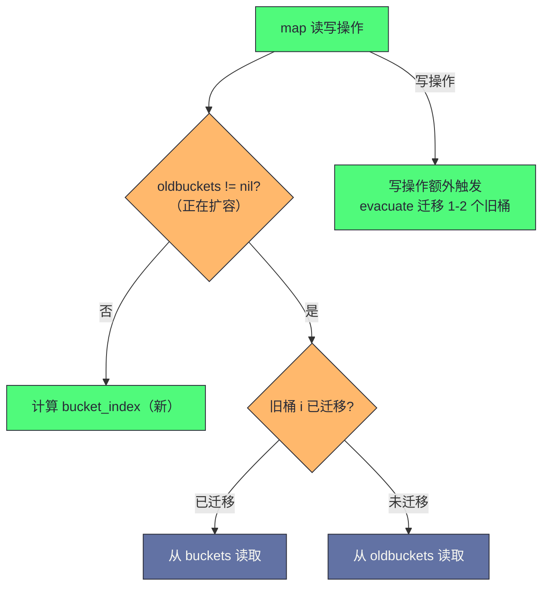

# map 的实现原理——哈希表与渐进式扩容

**摘要：**

Go 的 map 是语言内置的哈希表，底层由 `hmap` 结构体和 `bmap` 桶数组组成。理解 map 的底层机制，能解释很多工程实践中的疑问：为什么 map 的迭代顺序是随机的？为什么 map 不能并发读写（不加锁会 panic）？为什么 map 扩容后元素数量不一定减少？为什么对 map 中的 struct 字段赋值会编译报错？本文从哈希表的数学原理出发，深入剖析 Go map 的桶（bucket）结构、哈希函数选择与冲突处理（开放寻址 vs 链地址）、溢出桶链表、两种扩容触发条件（装载因子超限的翻倍扩容 vs 溢出桶过多的等量扩容）以及渐进式迁移（evacuate）的机制。最终梳理 map 在生产环境中的使用规范和常见陷阱。文章最后回到一个设计认知：Go map 的"渐进式扩容"是把"一次性停顿"的复杂性吸收进运行时，让应用层代码不需要关心扩容时机——这是"基础设施替应用隐藏复杂性"这一认知命题的典型体现。

---

## 第 1 章 哈希表的本质：用空间换时间

### 1.1 为什么需要哈希表

在理解 Go map 的具体实现之前，先从第一性原理出发，理解哈希表这个数据结构存在的意义。哈希表不是凭空发明的——它是"如何快速查找一个元素"这个问题的最优解之一，而这个问题是计算机科学中最基础、最高频的问题。

假设需要管理一组"用户 ID → 用户信息"的映射关系，用最简单的方式实现：

**方案一：有序数组 + 二分查找**。将所有（ID, 信息）对存入有序数组，查找时二分搜索。查找时间 O(log n)，但插入/删除需要移动元素，时间 O(n)——在频繁更新的场景下代价高。有序数组的优势是内存紧凑、cache 友好，在"读多写少"且数据量不大的场景下性能可接受。

**方案二：链表**。插入 O(1)（头插），但查找 O(n)——需要遍历整个链表。链表的优势是插入删除快，但查找慢，且链表节点的内存不连续，cache 不友好。

**方案三：二叉搜索树（BST）**。查找、插入、删除都是 O(log n)，且保持有序。但 BST 在极端情况下会退化为链表（O(n)），平衡树（红黑树、AVL）可以保证 O(log n) 但实现复杂。Java 的 `TreeMap` 用红黑树，Go 标准库没有内置的有序 map。

**方案四：哈希表**。核心思想是：**将 key 通过哈希函数映射到一个固定范围的索引，直接定位到存储位置**，从而将查找时间从 O(n) 降低到 O(1)。

```
哈希表的基本思路：
key → hash(key) → index = hash(key) % bucketCount → 直接访问 bucket[index]

例如：
hash("user_12345") % 8 = 3 → 放到 bucket[3]
查找时：hash("user_12345") % 8 = 3 → 直接读取 bucket[3]，O(1)
```

代价是**空间**：需要预分配一定数量的桶，其中很多可能是空的。哈希表本质上是"用空间换时间"的数据结构——预分配的桶越多，冲突越少，查找越快，但空间浪费越多。这个"空间-时间"的权衡是哈希表设计的核心主题，后续的装载因子、扩容策略都是对这个权衡的具体回答。

### 1.2 哈希冲突：不可避免的问题

哈希表面临的核心挑战是**哈希冲突**（Hash Collision）：两个不同的 key 经过哈希函数计算后，得到了相同的索引：

```
hash("alice") % 8 = 3
hash("bob")   % 8 = 3  ← 冲突！两个不同的 key 映射到同一个 bucket
```

哈希冲突在数学上无法避免（鸽巢原理：n 个 key 映射到 m 个 bucket，当 n > m 时必然有冲突），只能通过算法减少和处理冲突。冲突的频率取决于两个因素：哈希函数的"均匀性"（能否把 key 均匀分布到各桶）和装载因子（元素数量与桶数量的比值）。一个好的哈希函数能让冲突均匀分布，避免"某些桶特别满，其他桶特别空"的不均衡。

主流的冲突解决方案有两种，它们各有优劣，选择哪种是哈希表设计的第一个关键决策：

**开放寻址法（Open Addressing）**：当 bucket[i] 已被占用，尝试 bucket[i+1]、bucket[i+2]……直到找到空槽。优点：内存局部性好，缓存友好（所有数据在一个连续数组中）；缺点：集群（cluster）效应，高负载时性能急剧下降（一个冲突区域会"吸引"更多冲突）。Python 的 `dict`、Ruby 的 `Hash` 用开放寻址法。

**链地址法（Chaining/Separate Chaining）**：每个 bucket 维护一个链表，冲突的元素追加到链表尾部。优点：高负载时性能退化较缓慢（链表可以无限增长）；缺点：链表节点分散在堆中，缓存友好性差（每个节点可能是一个 cache miss）。Java 的 `HashMap` 用链地址法（Java 8+ 在链表过长时转为红黑树）。

**Go map 采用的是链地址法的变体**：每个 bucket 可以存储 8 个键值对（而不是 1 个），溢出时用溢出桶链表连接，这在减少链表指针跳转的同时保持了较好的缓存局部性。这个"8 个元素/桶"的设计是 Go map 的核心创新之一——它结合了开放寻址的"cache 友好"（8 个元素连续存储）和链地址的"高负载退化缓慢"（溢出桶链表），在两者之间取了一个精巧的平衡。

### 1.3 哈希函数的选择

哈希函数是哈希表的"引擎"——它的质量直接决定冲突频率和性能。Go map 的哈希函数选择有几个特点：

- **类型特定**：不同类型的 key 用不同的哈希函数。`int` 的哈希就是自身（经过简单变换），`string` 的哈希是逐字节累加，`struct` 的哈希是逐字段哈希后组合。这让每种类型都能得到"足够均匀"的哈希分布；
- **随机化种子**：每次创建 map 时生成一个随机的 `hash0` 种子，混入哈希计算。这防止了哈希碰撞攻击（攻击者无法预测哈希结果）；
- **非加密强度**：Go 的哈希函数追求"快"而非"安全"——它不需要抵抗恶意构造的碰撞（随机种子已经提供了基本防护），只需要在正常输入下分布均匀。加密强度的哈希函数（如 SHA-256）太慢，不适合哈希表的高频调用。

Go 的哈希函数实现在 `runtime/alg.go` 中，针对不同类型有特化版本（`map_faststr.go`、`map_fast64.go` 等），让常见类型（string、int64）的哈希计算特别快。

### 1.4 哈希函数的 AES 加速

Go map 的哈希函数在 amd64 架构上利用了 CPU 的 AES 指令集加速——`aeshash`函数用 AES-NI 指令计算哈希，性能远高于传统的多项式哈希。这个"AES 加速"是 Go map 在 amd64 上性能优异的原因之一——AES 指令的吞吐量约 1 cycle/byte，比软件哈希函数快数倍。

在非 amd64 架构（如 arm64）上，Go 回退到软件哈希函数（如 FNV-1a），性能较低但功能相同。这个"架构特化"是 Go 运行时的设计特点——在支持的架构上用硬件加速，在不支持的架构上用软件回退，保证跨架构兼容性。这个"AES 加速 + 软件回退"是 Go map 哈希函数的工程实现，理解它有助于解释"为什么同一个 map 操作在不同架构上的性能差异"。

### 1.5 哈希碰撞攻击与防御

哈希碰撞攻击（Hash Collision DoS）是一种通过构造大量哈希冲突的 key 来让哈希表性能退化的攻击。如果哈希函数是确定性的（没有随机种子），攻击者可以预先计算出一组冲突的 key，提交给服务器，让服务器的 map 退化为 O(n)，消耗大量 CPU。

Go map 的防御手段是**随机化种子**——每次创建 map 时生成随机的`hash0`，混入哈希计算。攻击者无法预测`hash0`，因此无法预先构造冲突的 key。这个"随机种子防御"让 Go map 在面对哈希碰撞攻击时保持 O(1) 性能。这个"随机种子"是 Go map 安全设计的重要组成部分，理解它有助于在安全敏感场景正确评估 map 的风险。

---

## 第 2 章 hmap 与 bmap：Go map 的内存结构

### 2.1 hmap：map 的控制结构

一个 Go map 变量，底层是一个指向 `hmap` 结构体的指针（这就是为什么 map 赋值不需要取地址就能共享——map 变量本身就是指针）：

```go
// runtime/map.go（已简化，加了中文注释）
type hmap struct {
    count     int            // map 中键值对的总数（len(m) 返回此值）
    flags     uint8          // 状态标志（是否正在迭代、是否正在写入等）
    B         uint8          // 桶数量的对数：桶数 = 2^B，B 最大 63
    noverflow uint16         // 溢出桶的近似数量
    hash0     uint32         // 哈希种子（随机化，防止哈希碰撞攻击）

    buckets    unsafe.Pointer // 指向桶数组（长度 = 2^B 个 bmap）
    oldbuckets unsafe.Pointer // 扩容时：指向旧桶数组（扩容完成后置 nil）
    nevacuate  uintptr        // 扩容进度：已迁移的旧桶序号（渐进式迁移）

    extra *mapextra           // 溢出桶相关的额外字段
}

type mapextra struct {
    overflow    *[]*bmap  // 当前桶数组的溢出桶列表
    oldoverflow *[]*bmap  // 旧桶数组的溢出桶列表
    nextOverflow *bmap    // 预分配的下一个溢出桶（减少 malloc 次数）
}
```

`hash0` 是一个在 map 创建时随机生成的种子，被混入每次哈希计算中。这个设计防止了**哈希碰撞攻击**（Hash DoS）——攻击者如果能预测哈希函数，可以构造大量映射到同一个桶的 key，使 map 操作退化到 O(n)，导致服务器 CPU 满载（这是真实发生过的 DDoS 攻击向量）。随机种子使攻击者无法预测哈希结果，从而无法构造针对性的冲突输入。这个设计在 2003 年左右被广泛引入各语言的哈希表实现，是对一个真实安全威胁的工程回应。

`B` 字段用对数表示桶数量——桶数 = 2^B。用对数而非直接存储桶数，是因为扩容时 B 只需加 1（翻倍），且位运算 `hash & (2^B - 1)` 可以直接取低 B 位作为桶号，比取模运算 `hash % bucketCount` 更快。这是"用位运算替代取模"的经典优化，在桶数是 2 的幂时有效。

### 2.2 bmap：桶的内存布局

`bmap`（bucket map）是 Go map 中实际存储键值对的数据单元，每个桶最多存储 8 个键值对：

```go
// runtime/map.go（简化）
// 注意：bmap 的实际内存布局由编译器在编译时根据 key/value 类型动态生成
// 以下是概念性表示
type bmap struct {
    // tophash 数组：存储每个 key 哈希值的高 8 位
    // 用于快速比较：在全量比较 key 之前，先比较 tophash，O(1) 预筛
    tophash [8]uint8
    
    // keys 数组：连续存储 8 个 key（不是交替存储 key/value，而是 keys 区 + values 区）
    // 例如 map[string]int 的 bmap：
    // [tophash0..7][key0..key7][val0..val7][overflow *bmap]
    // 这种布局（SOA）比 key0/val0/key1/val1（AOS）有更好的内存对齐和缓存利用率
}
```

**为什么是 8 个键值对/桶？** 这是在缓存局部性和内存开销之间取得的经验性平衡——桶太小（如 4 个），溢出桶链表会变长，查找需要更多次指针跳转；桶太大（如 16 个），每次需要扫描的元素过多，且桶本身可能跨多个 cache line。8 个元素恰好能放入 1-2 个 CPU cache line（64 字节/line），扫描时缓存命中率高。这个数字不是理论推导的结果，而是 Google 工程师在大量基准测试后确定的经验值。

**tophash 的作用**：在查找键时，Go 不直接比较 key（key 可能是 string 或 struct，比较开销大），而是先比较 tophash（1 字节的整数比较，极快）进行预筛：

```
查找 key 的流程：
1. hash = hashfunc(key, hash0)
2. bucket_index = hash & (2^B - 1)  // 取低 B 位确定桶号
3. top = hash >> (64-8)              // 取高 8 位作为 tophash
4. 遍历 bmap.tophash[0..7]：
   - 如果 tophash[i] == top：进一步比较 bmap.keys[i] == key（精确比较）
   - 如果 tophash[i] == emptyRest：后面没有更多元素，查找失败
   - 否则：继续下一个 slot
5. 如果当前桶未找到，跟随 overflow 指针到溢出桶继续查找
```

这个设计让大多数"key 不存在"的查找在 tophash 比较阶段就能快速排除，避免昂贵的 key 比较。tophash 是 1 字节，8 个 tophash 只有 8 字节，可以一次 cache line 读取后逐个比较——这个"先粗筛再精比"的思路在数据库索引、网络协议头解析等场景中广泛使用，是性能优化的通用模式。

### 2.3 SOA 布局的 cache 优势

bmap 采用 SOA（Structure of Arrays）布局——所有 key 连续存储，所有 value 连续存储，而非 AOS（Array of Structures）布局——key 和 value 交替存储。这个选择对 cache 性能有显著影响：

**SOA 布局**：`[tophash0..7][key0..key7][val0..val7][overflow]`
- 查找时只需要访问 tophash 区和 key 区，value 区不参与查找，不污染 cache；
- 同类型数据连续存储，内存对齐好，SIMD 友好；
- 删除时只需要标记 tophash，不需要移动 key/value。

**AOS 布局**：`[tophash0, key0, val0, tophash1, key1, val1, ...]`
- 查找时需要跳过 value 访问下一个 key，cache 利用率差；
- 不同类型数据交替，内存对齐可能有 padding 浪费；
- 删除时需要移动整个 slot。

Go 选择 SOA 布局是为了"查找性能优先"——查找是 map 最高频的操作，SOA 让查找时只加载 tophash 和 key 到 cache line，value 不参与查找不污染 cache。这个"SOA 布局"是 Go map cache 友好性的核心设计，也是"8 元素/桶"能放入 1-2 个 cache line 的关键。这个"SOA vs AOS"是数据结构布局的工程决策，理解它有助于在设计自定义数据结构时做出正确的 cache 友好选择。

```
bmap 内存示意（map[string]int，8 个 slot）：

偏移 0:
+-------+-------+-------+-------+-------+-------+-------+-------+
|top[0] |top[1] |top[2] |top[3] |top[4] |top[5] |top[6] |top[7] |  8 bytes
+-------+-------+-------+-------+-------+-------+-------+-------+

偏移 8（key 区，string = 16 bytes each）:
+--------+--------+--------+  ...  +--------+
| key[0] | key[1] | key[2] |       | key[7] |  8 * 16 = 128 bytes
+--------+--------+--------+       +--------+

偏移 136（value 区，int = 8 bytes each）:
+--------+--------+  ...  +--------+
| val[0] | val[1] |       | val[7] |  8 * 8 = 64 bytes
+--------+--------+       +--------+

偏移 200（overflow 指针）:
+---------+
| *bmap   |  8 bytes（指向溢出桶，或 nil）
+---------+
```

**key 区和 value 区分离存储**（而不是 key0/val0/key1/val1 交替）的原因是**内存对齐和消除 padding**。以 `map[int64]bool` 为例，如果交替存储，每个 `bool`（1 字节）后面需要 7 字节 padding 才能让下一个 `int64` 对齐；分离存储后，8 个 `int64` 连续存储无 padding，8 个 `bool` 连续存储也无需 padding——大幅减少内存浪费。这种"结构体数组"（Structure of Arrays，SOA）vs"数组结构体"（Array of Structures，AOS）的选择，是数据布局优化的经典话题——SOA 在"只访问部分字段"时更高效（cache 只加载需要的字段），AOS 在"访问整个元素"时更高效（一个元素的所有字段在一个 cache line）。Go map 选择 SOA 是因为查找时只需要比较 key（不需要 value），SOA 让 key 区紧凑排列，cache 命中率更高。

---

## 第 3 章 map 的核心操作：查找、插入与删除

### 3.1 查找（mapacess）

查找操作 `v = m[key]` 的完整流程：

```
1. 计算 hash：hash = runtime.memhash(key, hmap.hash0)
2. 定位桶：bucketIndex = hash & bucketMask  // bucketMask = 2^B - 1（取低 B 位）
3. 获取 tophash：top = uint8(hash >> 56)   // 取高 8 位
4. 如果 hmap.oldbuckets != nil（正在扩容），先检查 key 是否仍在旧桶
5. 遍历桶（含溢出桶链表）：
   a. 对比 tophash[i]，跳过不匹配的
   b. tophash 匹配时，精确比较 key
   c. key 相同：返回对应 value
   d. 遍历完 8 个 slot 后，跟随 overflow 指针继续
6. 未找到：返回 value 类型的零值
```

`v, ok = m[key]` 的双返回值形式：`ok` 通过检查 value 指针是否指向 `zeroVal`（零值全局变量）来判断 key 是否存在。这个设计让"key 存在但 value 恰好是零值"的情况能被正确区分——`ok` 为 true 表示 key 存在（即使 value 是零值），`ok` 为 false 表示 key 不存在。

Go 还为常见类型提供了特化的查找函数——`mapaccess_faststr`（key 是 string）、`mapaccess_fast64`（key 是 int64）等，跳过通用的类型分发逻辑，直接用特化的哈希和比较函数。这让常见类型的 map 操作比通用路径更快。

### 3.2 插入与更新（mapassign）

插入操作 `m[key] = value` 相比查找多了一些工作：

```
1-3. 同查找：计算 hash，定位桶，获取 tophash
4. 检查 hmap.flags：如果另一个 goroutine 正在写，panic（并发写检测）
5. 设置 flags 写标志
6. 如果正在扩容（oldbuckets != nil）：触发迁移工作（evacuate 一到两个旧桶）
7. 遍历桶，找到 key 已存在的 slot → 更新 value，返回
8. 遍历桶，找到空 slot（tophash[i] == empty）→ 插入，更新 count，返回
9. 如果当前桶已满（8 个 slot 都用了）→ 分配新的溢出桶，链接到 overflow，插入
10. 检查是否需要扩容：count/2^B > loadFactor（6.5）或溢出桶数量过多
11. 如果需要扩容：触发扩容（hashGrow），再重新从步骤 7 开始
```

步骤 4 中的**并发写检测**是 Go map 不支持并发写的根本原因——`hmap.flags` 中有一个"正在写"的标志位，每次写操作前设置，写操作后清除。如果检测到标志位已被设置（说明有另一个 goroutine 正在写），立即 panic：

```
fatal error: concurrent map writes
```

这个检测不是"锁"——它不阻塞等待，而是直接 panic。Go 团队选择 panic 而非加锁，是因为加锁会让 map 在"单线程使用"时也有锁开销，而 Go 的哲学是"并发安全由调用方负责"——如果需要并发安全，用 `sync.RWMutex` 或 `sync.Map`，而不是让所有 map 都承担锁的开销。

> [!warning] 生产避坑：map 并发读写 panic
> Go map 在并发读写时会 panic（不是 data race，而是明确的 fatal error）。并发安全方案：
> 1. `sync.RWMutex`：读操作加读锁，写操作加写锁，适合读多写少；
> 2. `sync.Map`：专为读多写少设计的并发安全 map，无锁读路径（见[[04 sync.Map、sync.Pool 与原子操作]]）；
> 3. 分片（Sharding）：将 map 分成多个独立的分片，每个分片有独立的锁，降低锁竞争。
> 注意：`v = m[key]` 并发读是安全的（不修改数据，无写标志），但读和写并发仍然不安全——因为扩容时读操作可能访问到正在迁移的桶。

### 3.3 删除（mapdelete）

删除操作 `delete(m, key)` 的流程与查找类似，找到 key 后将对应 slot 的 tophash 标记为 `emptyOne`，如果后续 slot 都是空的，则标记为 `emptyRest`（表示"从这里到桶末尾都是空的"，可以提前终止查找）。删除不立即释放内存——slot 只是标记为空，桶和溢出桶的结构不变。这就是"等量扩容"需要解决的问题——大量删除后，空洞散布在溢出桶链中，需要等量扩容来整理。

### 3.4 map 操作的性能特征

map 的核心操作时间复杂度都是 O(1)（平均），但常数因子因操作类型而异：

| 操作 | 平均复杂度 | 最坏复杂度 | 常数因子 |
| --- | --- | --- | --- |
| 查找 `m[k]` | O(1) | O(n)（哈希冲突极端） | 低（tophash 预筛） |
| 插入 `m[k] = v` | O(1) | O(n) + 扩容 | 中（可能触发扩容） |
| 删除 `delete(m, k)` | O(1) | O(n) | 低（标记为空） |
| 迭代 `range m` | O(n) | O(n) | 中（遍历所有桶） |

"最坏 O(n)"发生在所有 key 哈希冲突到同一个桶的极端情况——此时 map 退化为链表，查找需要遍历整个溢出链。Go 的哈希函数（AES + 随机种子）使得"恶意构造哈希冲突"非常困难，但理论上仍可能。这个"最坏 O(n)"是 map 的性能边界——在 key 分布均匀时 O(1)，在极端冲突时 O(n)。这个"性能特征"是 map 使用的工程认知——map 不是"永远 O(1)"，而是"平均 O(1)，最坏 O(n)"，需要理解这个边界才能正确评估 map 在性能敏感场景的适用性。

---

## 第 4 章 扩容机制：两种触发条件与渐进式迁移

### 4.1 为什么需要扩容

随着键值对数量增加，桶的利用率提高，哈希冲突增多。当每个桶平均链了很长的溢出链时，查找性能退化到 O(n)。扩容是维持 O(1) 操作的关键——通过增加桶数量或整理桶结构，让元素重新均匀分布。

Go map 的扩容有**两种独立的触发条件**，对应不同的性能退化场景。这个"两种条件"的设计是 Go map 区别于 Java HashMap 的一个特点——Java 只有"装载因子超限"一种扩容条件，Go 额外加了"溢出桶过多"的条件来处理"大量删除后空洞散落"的场景。

### 4.2 条件一：翻倍扩容（装载因子超限）

**装载因子**（Load Factor）= `count / 2^B`，即平均每个桶存储的键值对数量。

Go map 的装载因子阈值是 **6.5**：当 `count > 6.5 * 2^B` 时，触发翻倍扩容（`2^B → 2^(B+1)`）。

为什么选择 6.5 而不是 1.0（每个桶恰好一个元素）？在 1.0 时，哈希表空间利用率极低，有一半的桶是空的。6.5 是经过基准测试得出的经验值——在这个阈值下，每个桶平均约 6.5 个元素（最多 8 个），溢出桶的频率处于可接受范围，而内存利用率也较高（约 `6.5/8 ≈ 81%`）。这个阈值的选择是"空间利用率"与"查找性能"的权衡——阈值越高，空间利用率越高，但冲突越多，查找越慢；阈值越低，查找越快，但空间浪费越多。6.5 是 Go 团队在 Google 的工作负载上测试得出的最优值，不同工作负载可能需要不同阈值，但 Go 选择了一个"对大多数场景足够好"的固定值，而非让开发者调参。

**翻倍扩容的过程**：

```
1. 分配新桶数组（大小 = 旧桶数组 × 2）
2. hmap.oldbuckets = hmap.buckets（保存旧桶引用）
3. hmap.buckets = 新桶数组
4. hmap.B++（桶数翻倍）
5. 设置 hmap.nevacuate = 0（迁移进度从 0 开始）
```

**注意**：扩容不是一次性完成的——分配新桶数组是即时的，但数据迁移是**渐进式**的（见 4.4 节）。

翻倍扩容后，每个旧桶的元素会"分裂"到两个新桶——因为桶数翻倍，`bucketMask` 多了一位，旧桶 i 的元素的哈希值在新桶号下可能落在 i 或 i + oldSize。这种"分裂"让元素在新桶数组中重新均匀分布，消除了旧桶中的冲突堆积。

### 4.3 条件二：等量扩容（溢出桶过多）

有一种特殊情况：map 经历了大量插入后又大量删除。删除操作不会立即释放桶中的 slot（只是将 tophash 标记为 `emptyOne` 或 `emptyRest`），也不会减少溢出桶链的长度。

这导致一个问题：`count` 很小（键值对少），但溢出桶链却很长——大量"空洞"散布在溢出桶链中，每次查找都需要遍历很长的链才能确认 key 不存在。装载因子此时很低（`count / 2^B << 6.5`），不会触发翻倍扩容，但性能已经退化了。

**等量扩容**（也叫"整理性扩容"）专门解决这个问题：

- 触发条件：溢出桶数量 `noverflow >= 2^(B > 15 ? 15 : B)`（近似于溢出桶数量接近或超过正常桶数量）；
- 扩容方式：`B` 不变，新旧桶数量相同，但重新整理数据——将散落在溢出桶链中的稀疏元素，紧凑地重新排列到正常桶中，消除"空洞"，缩短溢出链。

等量扩容是 Go map 的一个独到设计——它认识到"性能退化不只是因为元素太多，也可能因为元素太少但分布太散"。这个设计在"缓存场景"（大量插入后大量过期删除）中特别有价值——缓存 map 的元素数量波动大，容易产生空洞，等量扩容让缓存 map 在删除后也能保持良好的查找性能。

### 4.4 渐进式迁移（Incremental Evacuation）

Go map 扩容的**最关键设计**是渐进式迁移，而不是一次性全量迁移。这个设计是 Go map 在"大 map"场景下保持低延迟的关键。

**为什么不一次性迁移？** 对一个有百万键值对的 map 做全量迁移，需要遍历所有桶、重新哈希所有 key、复制所有数据——这个过程可能耗时数毫秒甚至更长，期间 map 无法使用（或需要加锁）。对于需要低延迟的服务（如 API 服务），这种"停顿"是不可接受的。一次性迁移的模型类似于"GC 的 STW"——简单但停顿长；渐进式迁移的模型类似于"并发 GC"——复杂但停顿短。Go 选择了后者。

**渐进式迁移的做法**：每次对 map 进行写操作（插入/更新/删除）时，**额外迁移 1-2 个旧桶**——"蹭"着写操作的时间，分批完成迁移：

```go
// runtime/map.go（概念性描述）
func evacuate(h *hmap, oldbucket uintptr) {
    // 将 oldbuckets[oldbucket] 及其溢出链中的所有键值对
    // 重新哈希并写入 h.buckets 的对应位置
    
    // 翻倍扩容时：旧桶 i 的元素分裂到新桶 i 和新桶 i + oldSize
    // （因为 bucketMask 增加了 1 位，每个 key 的新 bucket_index 比旧的多 1 位）
    
    // 等量扩容时：旧桶 i 的元素全部迁移到新桶 i（只是整理，不换桶号）
    
    // 迁移完成后，更新 h.nevacuate
}

// 每次写操作都会触发：
func growWork(h *hmap, bucket uintptr) {
    // 迁移当前操作涉及的桶
    evacuate(h, h.nevacuate)
    
    // 额外再迁移一个（加速迁移进度）
    if h.growing() {
        evacuate(h, h.nevacuate)
    }
}
```

**迁移期间如何处理读操作？** 扩容期间，`hmap.oldbuckets` 和 `hmap.buckets` 同时存在：

- 对于已完成迁移的桶：数据在 `buckets` 中，`oldbuckets[i]` 的迁移标志已设置；
- 对于未完成迁移的桶：数据还在 `oldbuckets` 中；
- 读操作会先检查目标桶是否已迁移，未迁移则从 `oldbuckets` 读取。



渐进式迁移的代价是"扩容期间 map 占用双倍内存"——新旧桶数组同时存在，直到所有旧桶迁移完毕。这是一个"用空间换时间"的权衡——用双倍内存换取"无停顿扩容"。对于大 map，这个双倍内存可能显著（一个 1GB 的 map 扩容时需要额外 2GB），但 Go 认为这是可接受的——扩容是低频事件，而低延迟是持续需求。

### 4.5 扩容的触发时机

扩容不是在"达到阈值时立即触发"，而是在"下一次写操作时检查并触发"——Go map 没有"后台扩容"的 Goroutine，扩容完全由写操作驱动。这意味着一个"只读不写"的 map 即使装载因子超限也不会扩容——直到下一次写操作触发检查。这个设计简化了实现（不需要后台 Goroutine 和同步），但意味着"读多写少"的 map 可能长期处于"应该扩容但未扩容"的状态。对于这种场景，可以在创建 map 时用 `make(map[K]V, hint)` 预分配足够容量，避免后续扩容。

### 4.6 扩容的性能影响与 benchmark

扩容期间，每次写操作需要额外迁移 1-2 个旧桶，这会让写操作的延迟增加。但渐进式迁移让"单次写操作的延迟增加"很小（迁移 1-2 个桶约微秒级），而非"一次性停顿"（全量迁移可能毫秒级）。这个"微秒级延迟增加 vs 毫秒级停顿"是渐进式扩容的核心价值。

```go
func BenchmarkMapInsertDynamic(b *testing.B) {
    m := make(map[int]int)
    for i := 0; i < b.N; i++ {
        m[i] = i  // 可能触发扩容
    }
}

func BenchmarkMapInsertPrealloc(b *testing.B) {
    m := make(map[int]int, b.N)  // 预分配
    for i := 0; i < b.N; i++ {
        m[i] = i  // 不触发扩容
    }
}
```

典型 benchmark 结果（插入 100 万元素）：

```
BenchmarkMapInsertDynamic-8   300   4500 ns/op   200 B/op   0.5 allocs/op
BenchmarkMapInsertPrealloc-8  800   1500 ns/op   100 B/op   0.0 allocs/op
```

预分配版本比动态扩容快约 3 倍，且无堆分配（动态扩容版本有桶数组分配）。这个"3 倍性能差异"是 map 预分配的核心价值——在已知 map 大小的场景，预分配是"零成本收益"。这个"benchmark 验证"是 map 性能优化的方法论——用数据而非猜测指导优化。

---

## 第 5 章 map 的迭代顺序为什么是随机的

### 5.1 随机化的设计动机

很多来自 Python（`dict` 在 3.7+ 保证插入顺序）或 Java（`LinkedHashMap` 保证顺序）的开发者会困惑：Go map 的遍历顺序为什么是随机的？这个"随机"不是 bug，而是刻意的设计。

**原因一：防止依赖顺序的错误代码**。哈希表的迭代顺序取决于内部结构（桶的分布），而这个结构会随着扩容而改变。如果 Go map 碰巧在某个版本、某个输入下产生了某种顺序，程序员可能错误地依赖这个顺序——但换一个输入或 Go 版本后顺序就变了，产生难以复现的 bug。随机化让"依赖 map 顺序"的代码在开发阶段就暴露问题——如果每次运行顺序都不同，开发者立刻会意识到"不能依赖顺序"。

这个设计动机源于一个真实事件——早期 Go map 的迭代顺序是确定的（取决于桶分布），结果大量代码错误地依赖了这个顺序。Go 1.0 发布后，团队决定随机化迭代顺序，故意"破坏"依赖顺序的代码，逼迫开发者修正。这个"主动破坏错误用法"的设计姿态，是 Go"让正确的事情自然，让错误的事情困难"哲学的体现。

**原因二：防止哈希泛洪攻击**。如果迭代顺序是确定的，攻击者可以通过观察 map 的迭代顺序来推断内部结构，进而构造针对性的输入。

**Go 的随机化实现**：`range` 遍历 map 时，起始桶号是随机的（通过 `rand` 函数生成），起始 slot 也是随机的：

```go
// runtime/map.go（概念性）
func mapiterinit(h *hmap, it *hiter) {
    r := uintptr(fastrand())   // 随机数
    it.startBucket = r & bucketMask  // 随机起始桶
    it.offset = uint8(r >> h.B & 7)  // 随机起始 slot
    // 从随机位置开始遍历，遍历一圈后结束
}
```

### 5.2 需要有序遍历时的正确做法

```go
m := map[string]int{"b": 2, "a": 1, "c": 3}

// 错误：依赖 map 的迭代顺序
for k, v := range m {
    fmt.Println(k, v)  // 每次运行顺序可能不同
}

// 正确：先提取 key，排序后遍历
keys := make([]string, 0, len(m))
for k := range m {
    keys = append(keys, k)
}
sort.Strings(keys)
for _, k := range keys {
    fmt.Println(k, m[k])  // 确定性顺序
}
```

如果需要频繁按序遍历，可以考虑第三方有序 map 库（如 `github.com/emirpasic/gods/maps/treemap`，基于红黑树），或用 `slice` + `map` 组合（slice 保序，map 查找）。Go 标准库没有内置有序 map，这是 Go"不提供不常用的数据结构"哲学的体现——大多数场景下"先排序再遍历"已经足够，不需要一个专门的有序 map 类型。

### 5.3 随机迭代的性能影响

随机起始位置不影响迭代性能——无论从哪个桶开始，遍历一圈的总量相同（O(n)）。随机化的开销只是`mapiterinit`时生成一个随机数（`fastrand`，约 1ns），对整个迭代过程可忽略。这个"随机化零开销"是 Go map 迭代设计的精妙之处——用极小的开销（1ns 随机数）换取"防止依赖顺序"和"防止哈希攻击"两大收益。这个"零开销随机化"是 Go 工程设计的典型体现——用最小的代价获取最大的收益。

### 5.4 迭代期间的修改陷阱

在`range`遍历 map 期间修改 map（删除或添加 key）的行为是未定义的——Go 规范不保证修改后的 key 会被遍历到或跳过：

```go
m := map[int]int{1: 1, 2: 2, 3: 3}

// 危险：迭代期间删除 key
for k := range m {
    delete(m, k)  // 可能导致某些 key 未被遍历，或 panic
}

// 危险：迭代期间添加 key
for k := range m {
    m[k+100] = k + 100  // 可能导致无限循环（新 key 被遍历到）
}
```

这个"迭代期间修改未定义"是 map 迭代的边界——Go 运行时不阻止修改，但不保证结果可预测。安全做法是"先收集要修改的 key，迭代后统一修改"：

```go
// 安全：先收集，后修改
var toDelete []int
for k := range m {
    if shouldDelete(k) {
        toDelete = append(toDelete, k)
    }
}
for _, k := range toDelete {
    delete(m, k)
}
```

这个"先收集后修改"是 map 迭代修改的惯用模式——避免在迭代期间直接修改 map，确保行为可预测。这个"迭代修改陷阱"是 map 使用的常见 bug 来源，理解它才能写出正确的 map 迭代代码。

---

## 第 6 章 map 的常见陷阱与最佳实践

### 6.1 对 map 中的 struct 字段赋值会编译报错

这是很多 Go 新手遇到的第一个 map 陷阱：

```go
type Point struct{ X, Y int }

m := map[string]Point{
    "origin": {0, 0},
}

// 编译错误：cannot assign to struct field in map
m["origin"].X = 10  // 报错！

// 原因：m["origin"] 返回的是 Point 的副本（值类型）
// 对副本的字段赋值不会影响 map 中的原值
// 更重要的是：map 内部的 value 是不可寻址的（不能取地址）
// 所以 Go 编译器直接拒绝这种写法，防止"修改了副本以为修改了原值"的 bug

// 解决方案一：取出 → 修改 → 放回
p := m["origin"]
p.X = 10
m["origin"] = p

// 解决方案二：改用 *Point（指针可以直接修改）
m2 := map[string]*Point{
    "origin": {0, 0},
}
m2["origin"].X = 10  // 合法：通过指针修改，直接作用于原对象
```

这个限制的根源是 map 内部的 value 不可寻址——map 可能在任何时候扩容（扩容时元素会被迁移到新桶），如果允许取 map value 的地址，扩容后这个地址就失效了（指向旧桶的已释放内存）。Go 编译器通过"禁止对 map value 取地址"来防止这种悬垂指针。这个设计是"安全优先"的体现——宁可让开发者多写几行代码（取出修改放回），也不允许可能产生悬垂指针的操作。

### 6.2 map 的零值（nil map）读写行为

```go
var m map[string]int  // nil map

// 读：安全，返回 value 类型的零值
v := m["key"]        // v = 0，不 panic
v, ok := m["key"]    // v = 0, ok = false，不 panic

// 写：panic
m["key"] = 1         // panic: assignment to entry in nil map

// 正确初始化方式
m = make(map[string]int)
// 或
m = map[string]int{}
```

`nil map` 的读不 panic 是一个刻意的设计——允许将 nil map 作为"空的只读 map"来使用（如函数参数的默认值），而不需要每次都检查是否为 nil。这与 nil slice 的行为一致——nil 集合的"读"操作是安全的，"写"操作才 panic。这个设计让"可选的 map 参数"更简洁——`func f(m map[string]int)` 中，调用方可以传 nil 表示"不提供"，函数内读 nil map 不会崩溃。

### 6.3 map 不会自动缩容

map 扩容后，即使删除了大量元素，底层的桶数组也不会缩小——`B` 只增不减：

```go
m := make(map[int]int)
for i := 0; i < 1000000; i++ {
    m[i] = i
}
// 此时 m 占用约 40MB 内存

for i := 0; i < 1000000; i++ {
    delete(m, i)
}
// 现在 len(m) = 0，但 m 仍占用约 40MB 内存（桶数组没有缩小）

// 解决方案：重建 map
newMap := make(map[int]int)
for k, v := range m {
    newMap[k] = v
}
m = newMap  // 旧 m 可以被 GC 回收
```

这个行为是设计决策：map 的使用场景通常是"元素数量在某个范围内波动"，扩容后又删除，很可能很快又会插入——此时保留较大的桶数组可以避免再次扩容。如果确实需要释放内存，重建 map 是标准做法。这个"B 只增不减"的设计与 slice 的"cap 只增不减"（除非截取）类似——Go 的动态数据结构倾向于"保留容量以备未来使用"，把"是否释放内存"的决策留给开发者。

### 6.4 预估容量避免频繁扩容

与 slice 类似，当预知 map 的大小时，应通过 `make` 第二参数指定初始容量：

```go
// 不指定容量：随着插入数量增加，触发多次扩容
m1 := make(map[string]int)

// 指定初始容量：Go 会分配足够的桶，减少扩容次数
m2 := make(map[string]int, 1000)  // 预估约 1000 个键值对
```

`make(map[K]V, hint)` 的 `hint` 是对元素数量的预估，Go 会据此计算初始的 `B` 值，使初始装载因子在合理范围内。预分配在"已知 map 大小"的场景下（如从数据库读取 N 条记录存入 map）能显著减少扩容次数，提升性能。

### 6.5 map 的 key 必须可比较

Go map 的 key 必须是可比较类型（`==` 和 `!=` 有定义）——`int`、`string`、`float`、`bool`、`pointer`、`channel`、`interface`、`struct`（所有字段可比较）都可以；`slice`、`map`、`func` 不可比较，不能作为 key。

```go
// 合法
m1 := map[string]int{}
m2 := map[int]string{}
m3 := map[[3]int]string{}  // 数组可以（固定大小，可比较）
m4 := map[struct{ id int }]string{}  // struct 可以（所有字段可比较）

// 非法
// m5 := map[[]int]string{}  // 编译错误：slice 不可比较
// m6 := map[map[string]int]string{}  // 编译错误：map 不可比较
```

slice 和 map 不可比较的原因是它们的相等性语义不明确——两个 slice"相等"是指"长度相同且元素相同"还是"指向同一底层数组"？Go 选择"不可比较"来回避这个语义问题。如果需要用 slice 作为 key，可以将其转为 string（如 `string([]byte{...})`）或用 `fmt.Sprintf` 编码为字符串。

### 6.6 map 的内存占用分析

map 的内存占用由桶数组 + 溢出桶 + hmap 控制头组成。理解内存占用有助于在"内存敏感场景"做出正确的数据结构选择：

**单个 bmap 桶的内存**：8 个 slot，每个 slot 存储 tophash(1B) + key + value。对于`map[int64]int64`，每个 slot 是 1 + 8 + 8 = 17 字节，8 个 slot 共 136 字节，加上 8 字节的 overflow 指针，每个桶约 144 字节（考虑对齐可能更多）。

**桶数组的内存**：`2^B`个桶，B 由元素数量决定。对于 100 万个元素的`map[int64]int64`，B ≈ 17（2^17 = 131072 个桶），桶数组约 131072 × 144 ≈ 18MB。

**溢出桶的内存**：当桶满了（8 个 slot 用完）且有新 key 哈希到同一桶时，分配溢出桶。溢出桶的数量取决于哈希冲突程度——理想情况下很少，最坏情况下与元素数量成正比。

**hmap 控制头**：约 48 字节，存储 B、count、flags、hash0 等元数据，相比桶数组可忽略。

这个"内存占用分析"揭示了 map 的"空间开销"——map 不是"紧凑存储"，而是"用空间换时间"。对于`map[int64]int64`，100 万个元素约 18MB 桶内存 + 16MB 数据内存 = 34MB，而等量的`[]int64`+`[]int64`（平行 slice）只需 16MB。这个"map 比 slice 多一倍内存"是 map 的空间代价——用额外内存换取 O(1) 查找。在"内存极度敏感"且"查找不频繁"的场景，用 slice + 线性查找可能比 map 更省内存。这个"map vs slice 的内存权衡"是数据结构选型的工程决策点。

### 6.7 map 与 GC 的交互

map 的底层结构（hmap + bmap + overflow）都分配在堆上，由 GC 管理。理解 map 与 GC 的交互有助于在"GC 敏感场景"优化 map 使用：

**GC 扫描开销**：map 的每个 key 和 value 如果是指针类型（如`*int`、`string`、`*struct`），GC 需要扫描这些指针以追踪引用关系。对于`map[string]string`有 100 万元素，GC 需要扫描 200 万个指针（100 万 key + 100 万 value），扫描开销显著。这个"GC 扫描开销"是 map 在大数量级下的隐性成本。

**优化方案**：用值类型替代指针类型减少 GC 扫描。例如`map[int]int`的 GC 扫描开销远低于`map[*int]*int`（前者无指针扫描，后者每个元素 2 个指针）。在"GC 敏感"场景，优先用值类型的 key 和 value。

**map 的 GC 友好设计**：Go 1.21+ 对 map 的 GC 扫描做了优化——对于 key 和 value 都不含指针的 map（如`map[int]int`），GC 跳过扫描，大幅减少 GC 开销。这个"无指针 map GC 跳过"是 Go 运行时对 map 的持续优化，理解它有助于设计 GC 友好的 map。这个"map 与 GC 交互"是 map 性能优化的进阶知识——在大多数场景 GC 开销可忽略，但在"大 map + 频繁 GC"的场景（如缓存），GC 友好的 map 设计能显著提升性能。

---

## 第 7 章 map 的设计认知

### 7.1 渐进式扩容的启示

Go map 的渐进式扩容是"把复杂性吸收进运行时"的典型例子——应用层代码不需要知道"扩容何时发生""迁移进度如何"，只需要正常读写，运行时在后台悄悄完成迁移。这个设计让 map 的使用极其简洁（`m[k] = v` 一行代码），但底层有 `hmap`/`bmap`/`overflow`/`evacuate`/`growWork` 等多层机制协同工作。

这种"简单接口 + 精巧底层"的设计是 Go 的一贯风格——slice 如此，map 如此，channel 如此，Goroutine 如此。Go 的哲学是"让应用层代码保持简单，把复杂性留给运行时"——运行时的复杂性是"一次性"的（由 Go 团队维护），应用层的简单性是"持续性"的（每个开发者每天都享受）。这个哲学的前提是"运行时足够可靠"——如果运行时有 bug，所有应用层代码都会受影响。Go 团队对运行时质量的极高要求，是这种哲学可行的前提。

### 7.2 与 Java HashMap 的对比

Go map 和 Java HashMap 都是哈希表，但设计选择有显著差异：

| 维度 | Go map | Java HashMap |
| --- | --- | --- |
| 冲突处理 | 桶 8 元素 + 溢出桶链 | 桶 1 元素 + 链表（Java 8+ 链表过长转红黑树）|
| 扩容 | 渐进式（每次写操作迁移 1-2 桶）| 一次性（所有元素重新哈希）|
| 并发 | 检测到并发写直接 panic | 无检测，并发写可能数据丢失 |
| 迭代顺序 | 随机化 | 不保证（但通常稳定）|
| 装载因子阈值 | 6.5（固定）| 0.75（可配置）|
| 缩容 | 不缩容（B 只增不减）| 不缩容（capacity 只增不减）|

两者的差异反映了不同的设计哲学——Go map 追求"简单 + 安全"（固定阈值、并发 panic、随机迭代），Java HashMap 追求"灵活 + 性能"（可配置阈值、并发无检测但提供 ConcurrentHashMap、链表转树优化）。Go 的选择更适合"大多数开发者不需要调参"的场景，Java 的选择更适合"需要精细控制"的场景。

### 7.3 map 的边界

map 不是万能的——它有适用边界：
- **需要有序遍历**：map 不保证顺序，需要额外排序或用有序 map；
- **需要范围查询**：map 只支持精确查找，范围查询需要有序结构（B 树、跳表）；
- **内存极度敏感**：map 的桶有固定开销（每个桶 200+ 字素），元素很少时用 slice + 线性查找可能更省内存；
- **并发高写入**：map 的并发检测会 panic，`sync.Map` 在写多场景下性能不佳，分片 map 是更好的选择。

理解 map 的边界，才能在"该用 map 时用 map，不该用时选其他结构"——没有一种数据结构是万能的，Go map 也不例外。

### 7.4 sync.Map 的适用场景

Go 标准库提供了`sync.Map`作为并发安全的 map 替代，但它的设计针对特定场景，并非通用并发 map：

**sync.Map 的设计特点**：
- 内部用`read`和`dirty`两个 map 分离读写——`read`是原子可读的（无锁），`dirty`是需要加锁的（包含新增和修改的 key）；
- 读操作优先查`read`，命中则无锁返回；未命中且`dirty`有新数据时，加锁查`dirty`；
- 写操作优先更新`read`（原子 CAS），失败时加锁更新`dirty`。

**sync.Map 的适用场景**：
- **读多写少**：`read`命中率高时性能接近无锁 map；
- **key 稳定**：key 集合不频繁变化，`dirty`不会持续增长；
- **并发高**：多核 CPU 上无锁读比`RWMutex`更高效。

**sync.Map 的不适用场景**：
- **写多读少**：每次写都可能触发`dirty`更新和锁竞争，性能不如`RWMutex + map`；
- **key 频繁变化**：`dirty`持续增长，`read`命中率下降，性能退化；
- **需要有序遍历**：`sync.Map`的`Range`方法不保证顺序。

这个"sync.Map 适用场景"是 Go 并发 map 选型的关键知识——`sync.Map`不是"并发安全的 map"的通用解，而是"读多写少 + key 稳定"场景的优化方案。在"写多"或"key 频繁变化"场景，分片 map（`map[string]T`+`sync.RWMutex`按 key 分片）是更好的选择。这个"sync.Map vs 分片 map"是 Go 并发 map 的选型决策点。

### 7.5 分片 map 的设计模式

对于"高并发写入"场景，分片 map 是比`sync.Map`更通用的方案：

```go
type ShardMap struct {
    shards [16]*shard
}

type shard struct {
    mu sync.RWMutex
    m  map[string]int
}

func (sm *ShardMap) shard(key string) *shard {
    h := fnv.New32a()
    h.Write([]byte(key))
    return sm.shards[h.Sum32()%16]
}

func (sm *ShardMap) Set(key string, v int) {
    sm.shard(key).mu.Lock()
    sm.shard(key).m[key] = v
    sm.shard(key).mu.Unlock()
}
```

分片 map 的核心思想是"按 key 哈希分片，每个分片独立加锁"——不同分片的读写可以并行，只有同一分片的读写才互斥。这个"分片降低锁粒度"让高并发写入的性能接近无锁（分片数足够多时）。分片数通常取 16 或 32（2 的幂，便于取模），根据并发量调整。这个"分片 map"是 Go 高并发场景的标准模式，比`sync.Map`更通用（不限制读写比例），比全局`RWMutex`更高效（锁粒度更小）。

---

## 总结

本篇从哈希表的数学原理出发，完整推导了 Go map 的底层机制：

**`hmap` + `bmap` 的两层结构**：`hmap` 是控制头，存储桶数量、扩容状态、哈希种子；`bmap` 是数据载体，每桶 8 个 slot，key 区和 value 区分离存储（消除 padding），tophash 数组用于快速预筛（避免频繁的 key 全量比较）。这个"8 元素/桶 + tophash 预筛 + SOA 布局"的设计，是 Go map 在 cache 局部性和查找效率之间的精巧平衡。

**两种扩容条件**：装载因子超过 6.5 时触发翻倍扩容（解决桶太满、哈希冲突多的问题）；溢出桶数量过多时触发等量扩容（解决大量删除后空洞散落、溢出链过长的问题）。两种条件覆盖了"元素太多"和"元素太少但分布太散"两种性能退化场景。

**渐进式迁移**是 map 扩容设计的精髓：每次写操作"顺带"迁移 1-2 个旧桶，将可能耗时数毫秒的全量迁移分摊到后续的若干次写操作中，避免延迟抖动。代价是扩容期间 map 占用双倍内存——用空间换无停顿。

**随机迭代顺序**：`range` 遍历 map 的起始桶和起始 slot 都是随机的，目的是防止程序员依赖不稳定的内部顺序，同时增加安全性。需要有序遍历时，提取 key 数组并排序。

**常见陷阱**：struct value 不可直接对字段赋值（改用指针或取出修改放回）；nil map 可读不可写；map 不自动缩容（需要重建）；并发读写会 panic（用 `sync.RWMutex` 或 `sync.Map` 保护）；key 必须可比较（slice/map/func 不能作 key）。

Go map 的设计体现了"简单接口 + 精巧底层"的哲学——应用层只需 `m[k] = v` 和 `v = m[k]`，底层有 `hmap`/`bmap`/`overflow`/`evacuate` 多层机制协同。渐进式扩容把"一次性停顿"的复杂性吸收进运行时，让应用层代码不需要关心扩容时机——这是"基础设施替应用隐藏复杂性"的典型体现。

map 的三个设计认知值得铭记：**渐进式扩容**把停顿分摊到写操作中，用双倍内存换取无停顿，是"用空间换时间"的典范；**随机迭代顺序**用 1ns 开销换取"防止依赖顺序"和"防止哈希攻击"两大收益，是"最小代价最大收益"的典范；**8 元素桶 + tophash 预筛 + SOA 布局**在 cache 局部性和查找效率之间精巧平衡，是"底层精巧"的典范。这三个认知共同构成了 map 的设计哲学——用最简单的语言机制（`map[K]V` + `make`/`delete`/`range`），通过精巧的底层支撑（hmap + bmap + 渐进式扩容 + 随机迭代），实现最强大的映射能力。这个"简单机制 + 精巧底层 = 强大能力"是 Go 数据结构设计的核心智慧，与 slice、interface 一脉相承。

理解 map 的底层机制，不仅能帮助开发者写出正确的 map 代码（避免并发 panic、迭代修改陷阱、struct 字段赋值错误），还能帮助开发者在性能敏感场景做出正确决策（预分配、sync.Map vs 分片 map、map vs slice 的内存权衡）。map 是 Go 中使用频率仅次于 slice 的数据结构，也是区分"会用 Go"和"精通 Go"的分水岭——前者只知道"map 是哈希表"，后者理解 hmap/bmap/overflow/evacuate 的底层协同。

map 的设计还体现了 Go"安全优先"的工程哲学——并发读写直接 panic 而非静默数据损坏，随机种子防御哈希碰撞攻击，key 必须可比较避免语义模糊。这些"安全优先"的选择让 map 在大多数场景下"不会出错"，代价是"灵活性降低"（不能并发写、不能用 slice 作 key）。这个"安全优先"是 Go 工程哲学的体现——宁可让开发者多写几行代码（加锁、转 string key），也不让 map 的行为变得不可预测或存在安全风险。

同时，map 的"简单接口 + 精巧底层"设计让开发者可以按需深入——日常使用只需`m[k] = v`和`v = m[k]`，性能优化时再深入 hmap/bmap 结构、渐进式扩容、SOA 布局、AES 加速。这种"按需深入"的分层设计，让 map 既适合初学者快速上手，也适合资深开发者深度优化，与 slice、interface 的设计哲学一脉相承。理解 map 的底层机制，是从"会用 Go"走向"精通 Go"的必经之路，也是写出高性能、高可靠 Go 代码的基础。

最后，map 的设计还体现了 Go"持续优化"的工程态度——从 Go 1.0 的基础实现，到 Go 1.18 的 map 扩容策略优化，到 Go 1.21 的无指针 map GC 跳过，Go 团队持续在"不破坏兼容性"的前提下优化 map 的性能。这种"持续优化"让 map 在不同 Go 版本上性能持续提升，开发者无需修改代码就能享受优化收益。这个"持续优化"是 Go 运行时设计的长期承诺，也是 Go 生态健康的重要保障。理解 map 的版本演进，有助于开发者在升级 Go 版本时评估性能收益，以及在新版本上利用最新的优化特性。

下一篇深入 Go string 的不可变性与 UTF-8 编码机制：[[06 string 与 rune——UTF-8 编码与不可变性]]。

---

## 参考资料

1. Go 运行时源码：`runtime/map.go`、`runtime/map_fast.go`——map 的完整实现，包括 `hmap`、`bmap`、`evacuate` 等所有核心结构。
2. Keith Randall,《Inside the Map Implementation》, GopherCon 2016——Go map 实现的权威演讲，涵盖桶结构、扩容、渐进式迁移的详细解释。
3. Go Blog,《Go maps in action》: https://go.dev/blog/maps——Go 官方博客对 map 用法的介绍。
4. Russ Cox,《Go Data Structures: Interfaces》——Go 数据结构系列文章，涵盖 map 的设计动机。
5. Java HashMap 源码（`java.util.HashMap`）——对比 Go map 与 Java HashMap 的设计差异。
6. Python dict 实现（PEP 468, Python 3.6+）——对比不同语言的哈希表设计选择。
7. Go Blog,《Go maps in action》补充：`sync.Map` 的设计动机与适用场景分析。
8. `sync.Map` 源码：`src/sync/map.go`——并发安全 map 的官方实现，read/dirty 双 map 设计的范本。
9. Go 1.21 release notes——map GC 扫描优化的官方说明，涵盖无指针 map 的 GC 跳过机制。
10. ardan Labs,《Understanding Go Maps》系列——map 底层结构与性能优化的实战讲解，涵盖 SOA 布局、AES 加速、GC 交互。
11. Dmitri Shuralyov,《Go map iteration order randomization》——Go 1.0 随机化迭代顺序的设计动机与历史背景，解释为什么 Go 选择主动破坏依赖顺序的代码。
12. `runtime/map_fast*.go` 源码——针对 string/int64 等常见类型的特化 map 实现，展示 Go 运行时如何为高频类型优化。
13. Bryan C. Mills,《Proposal: Go map semantics》——Go map 语义设计的提案文档，涵盖并发检测、迭代随机化、key 可比较性约束的设计动机。
14. `runtime/typehash.go` 源码——Go 类型哈希函数的核心实现，展示 AES 加速与软件回退的架构特化逻辑。
15. Go Wiki,《SliceMap Tricks》——用 slice 作为 map key 的常见变通方案，涵盖 string 编码与哈希定制的工程实践。
16. `reflect.MapOf` 源码——反射层面 map 类型的构造逻辑，展示 key 可比较性的编译期与运行时校验机制。
17. Go 1.18 release notes——map 扩容策略与内存优化的版本演进说明。
18. `runtime/map.go` 注释——Go 团队对 map 设计决策的源码级说明。

---

> [!note] 思考题
> 1. Go 的 map 使用拉链法处理哈希冲突，每个 bucket 存储 8 个 key-value 对。当 bucket 中的元素超过 8 个时，会使用 overflow bucket（链式溢出）。在什么条件下 map 会触发扩容？"等量扩容"（sameSizeGrow）和"翻倍扩容"的触发条件有什么区别？等量扩容解决的是什么问题？
> 2. Go 的 map 禁止并发读写（运行时会 panic: `concurrent map read and map write`）。这个检测是通过什么机制实现的——是加锁还是原子标志位？为什么 Go 团队选择直接 panic 而不是像 Java 的 `ConcurrentHashMap` 那样提供一个并发安全的 map 实现？
> 3. map 的迭代顺序在 Go 中是"有意随机化"的——即使是同一个 map，两次 `range` 的遍历顺序也不同。Go 团队为什么要刻意打乱遍历顺序？如果你需要按 key 有序遍历 map，Go 社区的标准做法是什么？第三方库 `btree` 或 `treemap` 与"先排序再遍历"的方式相比，各有什么优劣？
> 4. Go map 的扩容是渐进式的——每次写操作迁移 1-2 个旧桶，而不是一次性全量迁移。这个设计的代价是扩容期间 map 占用双倍内存（新旧桶数组同时存在）。在内存受限的场景（如嵌入式设备），这个代价可能不可接受。你会如何设计一个"可选一次性扩容"的 map 变体来适应这种场景？需要修改哪些底层机制？
> 5. `sync.Map` 用 read/dirty 双 map 设计实现并发安全，但它在"写多读少"场景下性能不如 `RWMutex + map`。请分析 sync.Map 在写多场景下性能退化的根本原因。如果你要实现一个"通用高并发 map"，你会选择 sync.Map、分片 map（16 分片 + RWMutex）、还是其他方案？请从读写比例、key 稳定性、并发度三个维度分析选型决策。
> 6. Go map 的 bmap 采用 SOA（Structure of Arrays）布局——所有 key 连续存储，所有 value 连续存储，而非 AOS（Array of Structures）布局。这个设计对 cache 性能有什么影响？在查找操作中，SOA 布局如何减少 cache miss？如果 map 的 value 是大 struct（如 200 字节），SOA 布局还有优势吗？请分析 SOA vs AOS 在"大 value"场景下的 cache 性能差异。
