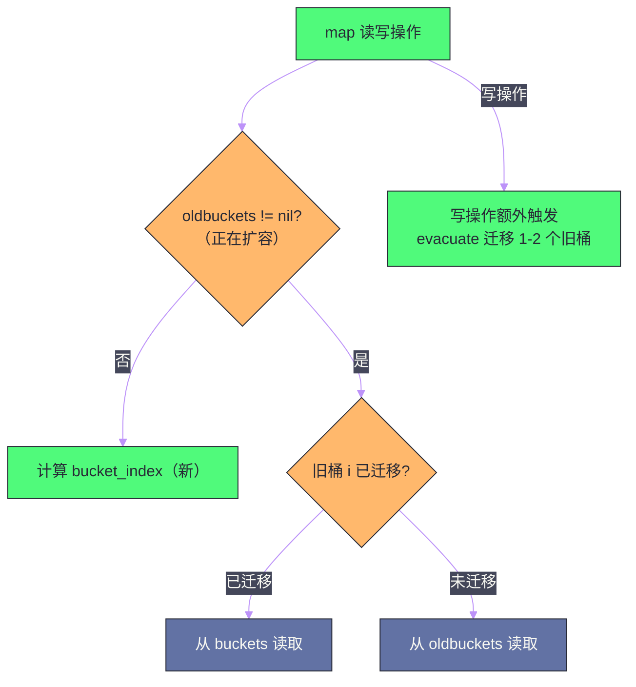

# map 的实现原理——哈希表与渐进式扩容

## 摘要

Go 的 map 是语言内置的哈希表，底层由 `hmap` 结构体和 `bmap` 桶数组组成。理解 map 的底层机制，能解释很多工程实践中的疑问：为什么 map 的迭代顺序是随机的？为什么 map 不能并发读写（不加锁会 panic）？为什么 map 扩容后元素数量不一定减少？为什么对 map 中的 struct 字段赋值会编译报错？本文从哈希表的数学原理出发，深入剖析 Go map 的桶（bucket）结构、哈希函数选择与冲突处理（开放寻址 vs 链地址）、溢出桶链表、两种扩容触发条件（装载因子超限的翻倍扩容 vs 溢出桶过多的等量扩容）以及渐进式迁移（evacuate）的机制。最终梳理 map 在生产环境中的使用规范和常见陷阱。

---

## 第 1 章 哈希表的本质：用空间换时间

### 1.1 为什么需要哈希表

在理解 Go map 的具体实现之前，先从第一性原理出发，理解哈希表这个数据结构存在的意义。

假设需要管理一组"用户 ID → 用户信息"的映射关系，用最简单的方式实现：

**方案一：有序数组 + 二分查找**。将所有（ID, 信息）对存入有序数组，查找时二分搜索。查找时间 O(log n)，但插入/删除需要移动元素，时间 O(n)——在频繁更新的场景下代价高。

**方案二：链表**。插入 O(1)（头插），但查找 O(n)——需要遍历整个链表。

**方案三：哈希表**。核心思想是：**将 key 通过哈希函数映射到一个固定范围的索引，直接定位到存储位置**，从而将查找时间从 O(n) 降低到 O(1)。

```
哈希表的基本思路：
key → hash(key) → index = hash(key) % bucketCount → 直接访问 bucket[index]

例如：
hash("user_12345") % 8 = 3 → 放到 bucket[3]
查找时：hash("user_12345") % 8 = 3 → 直接读取 bucket[3]，O(1)
```

代价是**空间**：需要预分配一定数量的桶，其中很多可能是空的。哈希表本质上是"用空间换时间"的数据结构。

### 1.2 哈希冲突：不可避免的问题

哈希表面临的核心挑战是**哈希冲突**（Hash Collision）：两个不同的 key 经过哈希函数计算后，得到了相同的索引：

```
hash("alice") % 8 = 3
hash("bob")   % 8 = 3  ← 冲突！两个不同的 key 映射到同一个 bucket
```

哈希冲突在数学上无法避免（鸽巢原理：n 个 key 映射到 m 个 bucket，当 n > m 时必然有冲突），只能通过算法减少和处理冲突。主流的冲突解决方案有两种：

**开放寻址法（Open Addressing）**：当 bucket[i] 已被占用，尝试 bucket[i+1]、bucket[i+2]……直到找到空槽。优点：内存局部性好，缓存友好；缺点：集群（cluster）效应，高负载时性能急剧下降。

**链地址法（Chaining/Separate Chaining）**：每个 bucket 维护一个链表，冲突的元素追加到链表尾部。优点：高负载时性能退化较慢；缺点：链表节点分散在堆中，缓存友好性差。

**Go map 采用的是链地址法的变体**：每个 bucket 可以存储 8 个键值对（而不是 1 个），溢出时用溢出桶链表连接，这在减少链表指针跳转的同时保持了较好的缓存局部性。

---

## 第 2 章 hmap 与 bmap：Go map 的内存结构

### 2.1 hmap：map 的控制结构

一个 Go map 变量，底层是一个指向 `hmap` 结构体的指针（这就是为什么 map 赋值不需要取地址就能共享）：

```go
// runtime/map.go（已简化，加了中文注释）
type hmap struct {
    count     int            // map 中键值对的总数（len(m) 返回此值）
    flags     uint8          // 状态标志（是否正在迭代、是否正在写入等）
    B         uint8          // 桶数量的对数：桶数 = 2^B，B 最大 63
    noverflow uint16         // 溢出桶的近似数量
    hash0     uint32         // 哈希种子（随机化，防止哈希碰撞攻击）

    buckets    unsafe.Pointer // 指向桶数组（长度 = 2^B 个 bmap）
    oldbuckets unsafe.Pointer // 扩容时：指向旧桶数组（扩容完成后置 nil）
    nevacuate  uintptr        // 扩容进度：已迁移的旧桶序号（渐进式迁移）

    extra *mapextra           // 溢出桶相关的额外字段
}

type mapextra struct {
    overflow    *[]*bmap  // 当前桶数组的溢出桶列表
    oldoverflow *[]*bmap  // 旧桶数组的溢出桶列表
    nextOverflow *bmap    // 预分配的下一个溢出桶（减少 malloc 次数）
}
```

`hash0` 是一个在 map 创建时随机生成的种子，被混入每次哈希计算中。这个设计防止了**哈希碰撞攻击**（Hash DoS）——攻击者如果能预测哈希函数，可以构造大量映射到同一个桶的 key，使 map 操作退化到 O(n)，导致服务器 CPU 满载（这是真实发生过的 [[DDoS]] 攻击向量）。随机种子使攻击者无法预测哈希结果。

### 2.2 bmap：桶的内存布局

`bmap`（bucket map）是 Go map 中实际存储键值对的数据单元，每个桶最多存储 8 个键值对：

```go
// runtime/map.go（简化）
// 注意：bmap 的实际内存布局由编译器在编译时根据 key/value 类型动态生成
// 以下是概念性表示
type bmap struct {
    // tophash 数组：存储每个 key 哈希值的高 8 位
    // 用于快速比较：在全量比较 key 之前，先比较 tophash，O(1) 预筛
    tophash [8]uint8
    
    // keys 数组：连续存储 8 个 key（不是交替存储 key/value，而是 keys 区 + values 区）
    // 例如 map[string]int 的 bmap：
    // [tophash0..7][key0..key7][val0..val7][overflow *bmap]
    // 这种布局（SOA）比 key0/val0/key1/val1（AOS）有更好的内存对齐和缓存利用率
}
```

**为什么是 8 个键值对/桶？** 这是在缓存局部性和内存开销之间取得的经验性平衡——桶太小（如 4 个），溢出桶链表会变长；桶太大（如 16 个），每次需要扫描的元素过多。8 个元素恰好能放入 1-2 个 CPU cache line（64 字节/line），扫描时缓存命中率高。

**tophash 的作用**：在查找键时，Go 不直接比较 key（key 可能是 string 或 struct，比较开销大），而是先比较 tophash（1 字节的整数比较，极快）进行预筛：

```
查找 key 的流程：
1. hash = hashfunc(key, hash0)
2. bucket_index = hash & (2^B - 1)  // 取低 B 位确定桶号
3. top = hash >> (64-8)              // 取高 8 位作为 tophash
4. 遍历 bmap.tophash[0..7]：
   - 如果 tophash[i] == top：进一步比较 bmap.keys[i] == key（精确比较）
   - 如果 tophash[i] == emptyRest：后面没有更多元素，查找失败
   - 否则：继续下一个 slot
5. 如果当前桶未找到，跟随 overflow 指针到溢出桶继续查找
```

这个设计让大多数"key 不存在"的查找在 tophash 比较阶段就能快速排除，避免昂贵的 key 比较。

```
bmap 内存示意（map[string]int，8 个 slot）：

偏移 0:
+-------+-------+-------+-------+-------+-------+-------+-------+
|top[0] |top[1] |top[2] |top[3] |top[4] |top[5] |top[6] |top[7] |  8 bytes
+-------+-------+-------+-------+-------+-------+-------+-------+

偏移 8（key 区，string = 16 bytes each）:
+--------+--------+--------+  ...  +--------+
| key[0] | key[1] | key[2] |       | key[7] |  8 * 16 = 128 bytes
+--------+--------+--------+       +--------+

偏移 136（value 区，int = 8 bytes each）:
+--------+--------+  ...  +--------+
| val[0] | val[1] |       | val[7] |  8 * 8 = 64 bytes
+--------+--------+       +--------+

偏移 200（overflow 指针）:
+---------+
| *bmap   |  8 bytes（指向溢出桶，或 nil）
+---------+
```

**key 区和 value 区分离存储**（而不是 key0/val0/key1/val1 交替）的原因是**内存对齐和消除 padding**。以 `map[int64]bool` 为例，如果交替存储，每个 `bool`（1 字节）后面需要 7 字节 padding 才能让下一个 `int64` 对齐；分离存储后，8 个 `int64` 连续存储无 padding，8 个 `bool` 连续存储也无需 padding——大幅减少内存浪费。

---

## 第 3 章 map 的核心操作：查找、插入与删除

### 3.1 查找（mapacess）

查找操作 `v = m[key]` 的完整流程：

```
1. 计算 hash：hash = runtime.memhash(key, hmap.hash0)
2. 定位桶：bucketIndex = hash & bucketMask  // bucketMask = 2^B - 1（取低 B 位）
3. 获取 tophash：top = uint8(hash >> 56)   // 取高 8 位
4. 如果 hmap.oldbuckets != nil（正在扩容），先检查 key 是否仍在旧桶
5. 遍历桶（含溢出桶链表）：
   a. 对比 tophash[i]，跳过不匹配的
   b. tophash 匹配时，精确比较 key
   c. key 相同：返回对应 value
   d. 遍历完 8 个 slot 后，跟随 overflow 指针继续
6. 未找到：返回 value 类型的零值
```

`v, ok = m[key]` 的双返回值形式：`ok` 通过检查 value 指针是否指向 `zeroVal`（零值全局变量）来判断 key 是否存在。

### 3.2 插入与更新（mapassign）

插入操作 `m[key] = value` 相比查找多了一些工作：

```
1-3. 同查找：计算 hash，定位桶，获取 tophash
4. 检查 hmap.flags：如果另一个 goroutine 正在写，panic（并发写检测）
5. 设置 flags 写标志
6. 如果正在扩容（oldbuckets != nil）：触发迁移工作（evacuate 一到两个旧桶）
7. 遍历桶，找到 key 已存在的 slot → 更新 value，返回
8. 遍历桶，找到空 slot（tophash[i] == empty）→ 插入，更新 count，返回
9. 如果当前桶已满（8 个 slot 都用了）→ 分配新的溢出桶，链接到 overflow，插入
10. 检查是否需要扩容：count/2^B > loadFactor（6.5）或溢出桶数量过多
11. 如果需要扩容：触发扩容（hashGrow），再重新从步骤 7 开始
```

步骤 4 中的**并发写检测**是 Go map 不支持并发写的根本原因——`hmap.flags` 中有一个"正在写"的标志位，每次写操作前设置，写操作后清除。如果检测到标志位已被设置（说明有另一个 goroutine 正在写），立即 panic：

```
fatal error: concurrent map writes
```

> [!warning] 生产避坑：map 并发读写 panic
> Go map 在并发读写时会 panic（不是 data race，而是明确的 fatal error）。并发安全方案：
> 1. `sync.RWMutex`：读操作加读锁，写操作加写锁，适合读多写少；
> 2. `sync.Map`：专为读多写少设计的并发安全 map，无锁读路径（见[[04 sync.Map、sync.Pool 与原子操作]]）；
> 3. 分片（Sharding）：将 map 分成多个独立的分片，每个分片有独立的锁，降低锁竞争。
> 注意：`v = m[key]` 并发读是安全的（不修改数据，无写标志），但读和写并发仍然不安全。

---

## 第 4 章 扩容机制：两种触发条件与渐进式迁移

### 4.1 为什么需要扩容

随着键值对数量增加，桶的利用率提高，哈希冲突增多。当每个桶平均链了很长的溢出链时，查找性能退化到 O(n)。扩容是维持 O(1) 操作的关键。

Go map 的扩容有**两种独立的触发条件**，对应不同的性能退化场景：

### 4.2 条件一：翻倍扩容（装载因子超限）

**装载因子**（Load Factor）= `count / 2^B`，即平均每个桶存储的键值对数量。

Go map 的装载因子阈值是 **6.5**：当 `count > 6.5 * 2^B` 时，触发翻倍扩容（`2^B → 2^(B+1)`）。

为什么选择 6.5 而不是 1.0（每个桶恰好一个元素）？在 1.0 时，哈希表空间利用率极低，有一半的桶是空的。6.5 是经过基准测试得出的经验值——在这个阈值下，每个桶平均约 6.5 个元素（最多 8 个），溢出桶的频率处于可接受范围，而内存利用率也较高（约 `6.5/8 ≈ 81%`）。

**翻倍扩容的过程**：

```
1. 分配新桶数组（大小 = 旧桶数组 × 2）
2. hmap.oldbuckets = hmap.buckets（保存旧桶引用）
3. hmap.buckets = 新桶数组
4. hmap.B++（桶数翻倍）
5. 设置 hmap.nevacuate = 0（迁移进度从 0 开始）
```

**注意**：扩容不是一次性完成的——分配新桶数组是即时的，但数据迁移是**渐进式**的（见 4.4 节）。

### 4.3 条件二：等量扩容（溢出桶过多）

有一种特殊情况：map 经历了大量插入后又大量删除。删除操作不会立即释放桶中的 slot（只是将 tophash 标记为 `emptyOne` 或 `emptyRest`），也不会减少溢出桶链的长度。

这导致一个问题：`count` 很小（键值对少），但溢出桶链却很长——大量"空洞"散布在溢出桶链中，每次查找都需要遍历很长的链才能确认 key 不存在。装载因子此时很低（`count / 2^B << 6.5`），不会触发翻倍扩容，但性能已经退化了。

**等量扩容**（也叫"整理性扩容"）专门解决这个问题：

- 触发条件：溢出桶数量 `noverflow >= 2^(B > 15 ? 15 : B)`（近似于溢出桶数量接近或超过正常桶数量）；
- 扩容方式：`B` 不变，新旧桶数量相同，但重新整理数据——将散落在溢出桶链中的稀疏元素，紧凑地重新排列到正常桶中，消除"空洞"，缩短溢出链。

### 4.4 渐进式迁移（Incremental Evacuation）

Go map 扩容的**最关键设计**是渐进式迁移，而不是一次性全量迁移。

**为什么不一次性迁移？** 对一个有百万键值对的 map 做全量迁移，需要遍历所有桶、重新哈希所有 key、复制所有数据——这个过程可能耗时数毫秒甚至更长，期间 map 无法使用（或需要加锁）。对于需要低延迟的服务（如 API 服务），这种"停顿"是不可接受的。

**渐进式迁移的做法**：每次对 map 进行写操作（插入/更新/删除）时，**额外迁移 1-2 个旧桶**——"蹭"着写操作的时间，分批完成迁移：

```go
// runtime/map.go（概念性描述）
func evacuate(h *hmap, oldbucket uintptr) {
    // 将 oldbuckets[oldbucket] 及其溢出链中的所有键值对
    // 重新哈希并写入 h.buckets 的对应位置
    
    // 翻倍扩容时：旧桶 i 的元素分裂到新桶 i 和新桶 i + oldSize
    // （因为 bucketMask 增加了 1 位，每个 key 的新 bucket_index 比旧的多 1 位）
    
    // 等量扩容时：旧桶 i 的元素全部迁移到新桶 i（只是整理，不换桶号）
    
    // 迁移完成后，更新 h.nevacuate
}

// 每次写操作都会触发：
func growWork(h *hmap, bucket uintptr) {
    // 迁移当前操作涉及的桶
    evacuate(h, h.nevacuate)
    
    // 额外再迁移一个（加速迁移进度）
    if h.growing() {
        evacuate(h, h.nevacuate)
    }
}
```

**迁移期间如何处理读操作？** 扩容期间，`hmap.oldbuckets` 和 `hmap.buckets` 同时存在：

- 对于已完成迁移的桶：数据在 `buckets` 中，`oldbuckets[i]` 的迁移标志已设置；
- 对于未完成迁移的桶：数据还在 `oldbuckets` 中；
- 读操作会先检查目标桶是否已迁移，未迁移则从 `oldbuckets` 读取。



---

## 第 5 章 map 的迭代顺序为什么是随机的

### 5.1 随机化的设计动机

很多来自 Python（`dict` 在 3.7+ 保证插入顺序）或 Java（`LinkedHashMap` 保证顺序）的开发者会困惑：Go map 的遍历顺序为什么是随机的？

**原因一：防止依赖顺序的错误代码**。哈希表的迭代顺序取决于内部结构（桶的分布），而这个结构会随着扩容而改变。如果 Go map 碰巧在某个版本、某个输入下产生了某种顺序，程序员可能错误地依赖这个顺序——但换一个输入或 Go 版本后顺序就变了，产生难以复现的 bug。随机化让"依赖 map 顺序"的代码在开发阶段就暴露问题。

**原因二：防止哈希泛洪攻击**。如果迭代顺序是确定的，攻击者可以通过观察 map 的迭代顺序来推断内部结构，进而构造针对性的输入。

**Go 的随机化实现**：`range` 遍历 map 时，起始桶号是随机的（通过 `rand` 函数生成），起始 slot 也是随机的：

```go
// runtime/map.go（概念性）
func mapiterinit(h *hmap, it *hiter) {
    r := uintptr(fastrand())   // 随机数
    it.startBucket = r & bucketMask  // 随机起始桶
    it.offset = uint8(r >> h.B & 7)  // 随机起始 slot
    // 从随机位置开始遍历，遍历一圈后结束
}
```

### 5.2 需要有序遍历时的正确做法

```go
m := map[string]int{"b": 2, "a": 1, "c": 3}

// 错误：依赖 map 的迭代顺序
for k, v := range m {
    fmt.Println(k, v)  // 每次运行顺序可能不同
}

// 正确：先提取 key，排序后遍历
keys := make([]string, 0, len(m))
for k := range m {
    keys = append(keys, k)
}
sort.Strings(keys)
for _, k := range keys {
    fmt.Println(k, m[k])  // 确定性顺序
}
```

---

## 第 6 章 map 的常见陷阱与最佳实践

### 6.1 对 map 中的 struct 字段赋值会编译报错

这是很多 Go 新手遇到的第一个 map 陷阱：

```go
type Point struct{ X, Y int }

m := map[string]Point{
    "origin": {0, 0},
}

// 编译错误：cannot assign to struct field in map
m["origin"].X = 10  // 报错！

// 原因：m["origin"] 返回的是 Point 的副本（值类型）
// 对副本的字段赋值不会影响 map 中的原值
// 更重要的是：map 内部的 value 是不可寻址的（不能取地址）
// 所以 Go 编译器直接拒绝这种写法，防止"修改了副本以为修改了原值"的 bug

// 解决方案一：取出 → 修改 → 放回
p := m["origin"]
p.X = 10
m["origin"] = p

// 解决方案二：改用 *Point（指针可以直接修改）
m2 := map[string]*Point{
    "origin": {0, 0},
}
m2["origin"].X = 10  // 合法：通过指针修改，直接作用于原对象
```

### 6.2 map 的零值（nil map）读写行为

```go
var m map[string]int  // nil map

// 读：安全，返回 value 类型的零值
v := m["key"]        // v = 0，不 panic
v, ok := m["key"]    // v = 0, ok = false，不 panic

// 写：panic
m["key"] = 1         // panic: assignment to entry in nil map

// 正确初始化方式
m = make(map[string]int)
// 或
m = map[string]int{}
```

`nil map` 的读不 panic 是一个刻意的设计——允许将 nil map 作为"空的只读 map"来使用（如函数参数的默认值），而不需要每次都检查是否为 nil。

### 6.3 map 不会自动缩容

map 扩容后，即使删除了大量元素，底层的桶数组也不会缩小——`B` 只增不减：

```go
m := make(map[int]int)
for i := 0; i < 1000000; i++ {
    m[i] = i
}
// 此时 m 占用约 40MB 内存

for i := 0; i < 1000000; i++ {
    delete(m, i)
}
// 现在 len(m) = 0，但 m 仍占用约 40MB 内存（桶数组没有缩小）

// 解决方案：重建 map
newMap := make(map[int]int)
for k, v := range m {
    newMap[k] = v
}
m = newMap  // 旧 m 可以被 GC 回收
```

这个行为是设计决策：map 的使用场景通常是"元素数量在某个范围内波动"，扩容后又删除，很可能很快又会插入——此时保留较大的桶数组可以避免再次扩容。如果确实需要释放内存，重建 map 是标准做法。

### 6.4 预估容量避免频繁扩容

与 slice 类似，当预知 map 的大小时，应通过 `make` 第二参数指定初始容量：

```go
// 不指定容量：随着插入数量增加，触发多次扩容
m1 := make(map[string]int)

// 指定初始容量：Go 会分配足够的桶，减少扩容次数
m2 := make(map[string]int, 1000)  // 预估约 1000 个键值对
```

`make(map[K]V, hint)` 的 `hint` 是对元素数量的预估，Go 会据此计算初始的 `B` 值，使初始装载因子在合理范围内。

---

## 总结

本篇从哈希表的数学原理出发，完整推导了 Go map 的底层机制：

**`hmap` + `bmap` 的两层结构**：`hmap` 是控制头，存储桶数量、扩容状态、哈希种子；`bmap` 是数据载体，每桶 8 个 slot，key 区和 value 区分离存储（消除 padding），tophash 数组用于快速预筛（避免频繁的 key 全量比较）。

**两种扩容条件**：装载因子超过 6.5 时触发翻倍扩容（解决桶太满、哈希冲突多的问题）；溢出桶数量过多时触发等量扩容（解决大量删除后空洞散落、溢出链过长的问题）。

**渐进式迁移**是 map 扩容设计的精髓：每次写操作"顺带"迁移 1-2 个旧桶，将可能耗时数毫秒的全量迁移分摊到后续的若干次写操作中，避免延迟抖动。

**随机迭代顺序**：`range` 遍历 map 的起始桶和起始 slot 都是随机的，目的是防止程序员依赖不稳定的内部顺序，同时增加安全性。需要有序遍历时，提取 key 数组并排序。

**常见陷阱**：struct value 不可直接对字段赋值（改用指针或取出修改放回）；nil map 可读不可写；map 不自动缩容（需要重建）；并发读写会 panic（用 `sync.RWMutex` 或 `sync.Map` 保护）。

下一篇深入 Go string 的不可变性与 UTF-8 编码机制：[[06 string 与 rune——UTF-8 编码与不可变性]]。

---

> [!note] 参考资料
> - Go 运行时源码：`runtime/map.go`、`runtime/map_fast.go`
> - Keith Randall,《Inside the Map Implementation》, GopherCon 2016
> - Go Blog,《Go maps in action》: https://go.dev/blog/maps
> - Russ Cox,《Go Data Structures: Interfaces》

---

> [!note] 思考题
> 1. Go 的 map 使用拉链法处理哈希冲突，每个 bucket 存储 8 个 key-value 对。当 bucket 中的元素超过 8 个时，会使用 overflow bucket（链式溢出）。在什么条件下 map 会触发扩容？'等量扩容'（sameSizeGrow）和'翻倍扩容'的触发条件有什么区别？等量扩容解决的是什么问题？
> 2. Go 的 map 禁止并发读写（运行时会 panic: `concurrent map read and map write`）。这个检测是通过什么机制实现的——是加锁还是原子标志位？为什么 Go 团队选择直接 panic 而不是像 Java 的 `ConcurrentHashMap` 那样提供一个并发安全的 map 实现？
> 3. map 的迭代顺序在 Go 中是'有意随机化'的——即使是同一个 map，两次 `range` 的遍历顺序也不同。Go 团队为什么要刻意打乱遍历顺序？如果你需要按 key 有序遍历 map，Go 社区的标准做法是什么？第三方库 `btree` 或 `treemap` 与'先排序再遍历'的方式相比，各有什么优劣？
