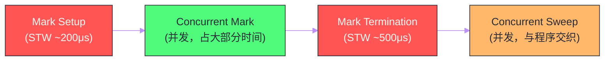

# 垃圾回收——三色标记与混合写屏障

## 摘要

Go 的垃圾回收器（GC）是整个运行时中最复杂、演进最频繁的模块。它的核心目标只有一个：在不停止程序运行（或极短暂停止）的前提下，准确识别并回收不再被引用的内存。从 Go 1.0 的 Stop-the-World（STW）GC，到 Go 1.5 的并发三色标记，再到 Go 1.8 引入的混合写屏障（Hybrid Write Barrier），Go GC 的 STW 时间从数百毫秒压缩到了亚毫秒级——这是 Go 生态能够支撑延迟敏感服务的重要基础。本文从垃圾回收的基本问题出发，完整推导三色标记（Tri-color Marking）算法的正确性依据——三色不变式，深入分析"并发 GC 与程序并发修改对象图"所引发的颜色破坏问题，以及 Go 选择混合写屏障而非纯插入/删除写屏障的设计权衡。最终梳理一次完整的 GC 流程（Mark Setup → Concurrent Mark → Mark Termination → Sweep）及各阶段的工程细节。

---

## 第 1 章 垃圾回收的基本问题：什么是"垃圾"

### 1.1 可达性与垃圾的定义

垃圾回收（Garbage Collection）需要解决的根本问题是：**程序分配的哪些内存对象，在当前时刻已经不会被程序访问到，可以安全地回收？**

"可访问"的精确定义是**可达性（Reachability）**：从一组被称为**GC Roots**（根对象）出发，通过对象中的指针字段不断追踪，能够触达的所有对象都是"活着的"（Live）；触达不了的对象就是"垃圾"（Garbage）。

Go 的 GC Roots 包括：
- 所有 Goroutine 的栈帧中的指针（局部变量、函数参数）；
- 全局变量（`var` 声明的包级变量）；
- 运行时内部的一些根指针（如调度器中的 Goroutine 队列、mcache 中的指针等）。

**引用计数 vs 可达性分析**：两种主流的 GC 方案。引用计数（如 Python 的 CPython）每次指针赋值时增减计数器，计数归零即回收——实现简单，但无法处理循环引用（A → B → A，即使 A、B 都不可达，计数也不为 0）。可达性分析（Go、Java、.NET 均采用）通过遍历对象图，能正确处理循环引用，但需要周期性暂停或并发标记。

### 1.2 标记-清扫算法：最基础的 GC 方案

最简单的可达性分析 GC 是**标记-清扫（Mark-Sweep）**算法，分两个阶段：

1. **标记阶段**：从 GC Roots 出发，遍历所有可达对象，标记为"存活"；
2. **清扫阶段**：遍历堆上所有对象，未被标记的对象是垃圾，回收其内存。

这个算法正确，但有一个致命问题：**标记阶段必须 STW（Stop-the-World）**——如果程序在标记过程中修改了对象之间的引用关系（如将一个已标记的活对象的指针，指向一个未标记的新对象），就可能漏标对象，将活对象当作垃圾回收——这是不可接受的错误。

STW 期间，所有 Goroutine 都被暂停，GC 独占 CPU。早期 Go 的 STW 时间随堆大小线性增长：100MB 的堆约需 100ms STW，1GB 的堆约需 1000ms STW——对于需要低延迟的服务（如 API 服务，P99 延迟要求 < 50ms），这是完全不可接受的。

---

## 第 2 章 三色标记：并发 GC 的理论基础

### 2.1 三色抽象：给对象状态建模

**三色标记（Tri-color Marking）**是 Dijkstra 在 1978 年提出的并发 GC 算法框架，其核心是用三种颜色为对象建立状态模型：

- **白色（White）**：尚未被 GC 扫描到。GC 开始时所有对象都是白色；GC 结束时，仍然是白色的对象就是垃圾（不可达）；
- **灰色（Gray）**：已被 GC 发现（通过根指针或其他对象的引用），但其内部指针字段尚未全部扫描。灰色是"待处理"状态；
- **黑色（Black）**：已被 GC 完全扫描——该对象本身已标记为存活，且其所有指针字段都已经被扫描（它们指向的对象已加入灰色集合）。

GC 的标记过程就是**将所有可达对象从白色变成黑色**的过程：

```
初始状态：所有对象都是白色
1. 将所有 GC Roots 直接引用的对象涂成灰色（加入灰色集合/工作队列）
2. 从灰色集合中取出一个对象 O：
   a. 将 O 的所有指针字段指向的对象涂成灰色（如果它们还是白色）
   b. 将 O 自己涂成黑色
3. 重复步骤 2，直到灰色集合为空
4. 此时：黑色对象 = 所有可达对象；剩余白色对象 = 垃圾
```

### 2.2 三色不变式：并发正确性的保证

三色标记允许 GC 和程序**并发**运行——GC 线程做标记，程序线程（Mutator，改变器）继续修改对象引用。但并发引入了新问题：程序可能在 GC 标记过程中修改对象图，导致**对象漏标**（一个活对象最终仍然是白色，被错误回收）。

漏标发生的充要条件（Wilson 1992 年证明）：**同时满足以下两个条件**：
1. **条件 A（新引用插入）**：一个黑色对象建立了对一个白色对象的引用——即黑色对象"直接指向"了白色对象；
2. **条件B（引用删除）**：所有从灰色对象到该白色对象的路径都被切断——即没有任何灰色对象能通过路径找到这个白色对象。

当两个条件同时满足时，这个白色对象就"消失"于 GC 的视野之外——黑色对象不会被重新扫描（黑色表示"已完成"），而通过灰色对象也找不到它，最终它仍是白色被当作垃圾回收。

**破坏其中任一条件**，就能保证 GC 的正确性。这就是**三色不变式（Tri-color Invariant）**的两个版本：

**强三色不变式**：破坏条件 A——**黑色对象不允许直接引用白色对象**。只要维持这个不变式，即使条件 B 发生也不会漏标（因为条件 A 不成立，两个条件不会同时满足）。

**弱三色不变式**：破坏条件 B——**如果一个白色对象被黑色对象引用，则这个白色对象必须从某个灰色对象可达**（即有灰色对象"保护"着这个白色对象）。这允许黑色引用白色，但只要白色还有灰色可达路径，就不会漏标。

### 2.3 写屏障：维持三色不变式的机制

**写屏障（Write Barrier）**是在程序修改指针字段时，由 GC 自动插入的一小段额外代码，用于维持三色不变式。

当程序执行 `*ptr = newValue`（指针赋值）时，写屏障代码会被触发，在实际写入之前或之后，根据写屏障的具体实现，将相关对象涂灰——确保三色不变式不被破坏。

注意：**写屏障只在堆对象上触发，栈上的指针修改不经过写屏障**。这是因为栈的访问极其频繁（每次函数调用都会修改栈），如果也加写屏障，开销太大。这个优化后来带来了额外的复杂性（见混合写屏障章节）。

---

## 第 3 章 Go GC 的演进：从 STW 到混合写屏障

### 3.1 Go 1.5：并发标记 + Dijkstra 插入写屏障

Go 1.5 是 GC 演进史上的重大里程碑，实现了**并发标记（Concurrent Marking）**：GC 标记阶段与程序并发执行，只在开始和结束时有短暂的 STW（几十毫秒降低到了 10ms 以内）。

**Dijkstra 插入写屏障（Insertion Write Barrier）**：维持强三色不变式。当程序将指针写入堆对象时，将**被指向的对象**涂灰：

```
// 插入写屏障伪代码（在 *slot = ptr 之前执行）
writeBarrier_insertion(*slot, ptr):
    shade(ptr)         // 将 ptr 指向的对象涂灰（如果它是白色）
    *slot = ptr        // 实际写入
```

插入写屏障确保：每次黑色对象建立对某对象的新引用时，被引用对象立刻变灰——黑色不能直接指向白色（强三色不变式）。

**问题：栈上指针的处理**。前面提到写屏障不处理栈。但 GC Roots 包括栈上的指针，程序可能在 Goroutine 的栈上建立对白色对象的引用——这违反了强三色不变式（栈"指针"相当于"黑色对象"，它指向了白色对象，但没有触发写屏障）。

Go 1.5 的解法：**在 Mark Termination（标记终止）阶段 STW，对所有 Goroutine 的栈重新扫描**——确保栈上的任何新引用都被处理到。但重新扫描所有栈的开销随 Goroutine 数量线性增长：1000 个 Goroutine × 每个栈 1ms = 1s STW，在大型服务中仍然不可接受。

### 3.2 Go 1.8：混合写屏障（Hybrid Write Barrier）

为了解决"栈重扫"的问题，Go 1.8 引入了**混合写屏障（Hybrid Write Barrier）**，允许在标记终止阶段不再重新扫描栈，STW 降低到亚毫秒级（< 500μs）。

混合写屏障的设计基于 Yuasa 的**删除写屏障（Deletion Write Barrier）**概念，同时结合了插入写屏障。其规则：

```
// 混合写屏障伪代码（在 *slot = ptr 执行时触发）
hybridWriteBarrier(*slot, ptr):
    shade(*slot)       // 将旧值（被删除的引用）涂灰（删除写屏障部分）
    shade(ptr)         // 将新值（新引用的对象）涂灰（插入写屏障部分）
    *slot = ptr        // 实际写入
```

另外，在 GC 标记开始时（STW 阶段），对所有 Goroutine 的**栈快照**处理：将当前栈上可见的所有对象标记为灰色（或黑色，取决于实现），之后不再重扫。

**为什么混合写屏障能避免重扫栈？**

Yuasa 删除写屏障的关键思想：在删除一个引用时（`*slot = ptr` 会删除旧引用 `*slot`），将旧值涂灰。这维持了**弱三色不变式**：任何被删除的引用，其目标对象会被标记为灰色（因此即使黑色对象指向它，也有灰色对象保护着它）。

结合 GC 开始时对栈的快照处理：
- GC 开始时，所有栈上的根对象已被涂灰；
- 之后栈上新创建的对象（如新的局部变量指针），由于删除写屏障，其旧值已被保护；
- 不再需要在标记结束时重扫所有栈。

**代价**：混合写屏障在每次指针写入时执行两次 shade 操作（旧值 + 新值），开销比单纯的插入写屏障稍高；但消除了栈重扫的 STW，整体延迟大幅降低。

---

## 第 4 章 一次完整的 GC 流程

### 4.1 四个阶段



**阶段一：Mark Setup（标记准备，STW）**

这是第一次 STW，时间约 200μs，完成以下工作：
- **开启写屏障**：通知所有 Goroutine，后续的指针写操作需要触发混合写屏障；
- **暂停所有 Goroutine**，扫描它们的栈，将根指针涂灰（这是栈的"快照"）；
- **开启辅助标记**：为每个 P 启动 Mark Worker Goroutine（后台标记协程）；
- **恢复所有 Goroutine**，进入并发标记阶段。

> [!info] 核心概念：为什么开启写屏障需要 STW
> 写屏障的开启必须是原子的——如果某个 Goroutine 在写屏障还未完全开启时执行了指针写操作，这次写操作就不会被写屏障拦截，可能破坏三色不变式。因此需要 STW 来确保所有 Goroutine 都在写屏障开启后才继续运行。这个 STW 非常短（只需要暂停所有 Goroutine、扫描栈、开启写屏障三件事），通常在 200μs 以内。

**阶段二：Concurrent Mark（并发标记）**

这是 GC 的主要工作阶段，**与程序并发执行**，时间占 GC 总时间的绝大部分。

Go 运行时为每个 P 分配了 Mark Worker Goroutine（后台标记 Goroutine），这些 Goroutine 与用户 Goroutine 共享 CPU 时间。默认情况下，GC 目标是使用约 25% 的 CPU（即 4 核机器上约 1 个核做 GC 标记）。

标记工作采用**工作窃取（Work Stealing）**模式：每个 P 有一个本地的灰色对象工作队列，当本地队列为空时，从全局队列或其他 P 的本地队列"偷"工作。这与 GMP 调度器的 Goroutine 调度是同一套机制。

**Mutator 辅助标记（Mutator Assist）**：当程序的内存分配速度超过 GC 的标记速度（"分配债"），分配内存的 Goroutine 会被要求先做一定量的标记工作，才能继续分配——这是一个负反馈控制机制，防止程序无限制地分配内存导致堆无限增长。

**阶段三：Mark Termination（标记终止，STW）**

第二次 STW，时间约 100-500μs，完成以下工作：
- **停止所有标记 Goroutine**（Mark Workers）；
- **扫描所有 Goroutine 的栈**（自 Go 1.8 混合写屏障后，这里的"扫描"只是处理栈上可能在并发标记期间新建的引用，代价很小）；
- **关闭写屏障**；
- **计算下次 GC 的触发阈值**（基于 GOGC 参数）；
- 恢复所有 Goroutine。

**阶段四：Concurrent Sweep（并发清扫）**

GC 完成标记后，所有白色对象都是垃圾，需要清扫（回收 mspan 中白色对象占用的 slot）。**清扫阶段完全并发**，与程序执行交织：

- 清扫由专门的后台 Goroutine（sweepg）执行，也可以在内存分配时触发（惰性清扫）；
- 清扫不需要 STW，因为清扫只修改 mspan 的 allocBits（标记哪些 slot 空闲），不访问对象内容；
- 清扫时，mspan 中的 gcmarkBits（GC 标记位图，存活对象为 1）直接变成新的 allocBits（下一轮可用的空闲位图），速度极快。

---

## 第 5 章 GC 调节器：Pacer 的设计

### 5.1 GC 何时触发？

Go GC 不是按固定时间触发，而是基于**堆增长比率**触发：

```
触发条件：当前堆大小 >= 目标堆大小
目标堆大小 = 上次 GC 结束时活跃对象大小 × (1 + GOGC/100)

GOGC=100（默认）：活跃对象翻倍时触发 GC
```

举例：上次 GC 后活跃对象为 100MB，GOGC=100，则当堆增长到 200MB 时触发下一次 GC。

**强制触发条件**：即使堆没有增长到阈值，如果距离上次 GC 超过 2 分钟（`forcegcperiod`），runtime 也会强制触发一次 GC，防止堆中存在长期不清理的"僵尸"对象。

### 5.2 GC Pacer：动态调节标记速度

Go 1.5 引入的 **GC Pacer（节奏器）**是一个精妙的控制系统，它动态调节 GC 的工作速度：

**问题**：如果 GC 标记太慢，程序在标记期间继续分配内存，堆可能增长到远超目标的大小（即"堆过冲"），浪费内存；如果 GC 标记太快（占用太多 CPU），程序的吞吐量下降。

**Pacer 的目标**：在程序到达目标堆大小时，GC 标记工作恰好完成——既不提前完成（浪费 CPU），也不延迟（需要 Mutator Assist 来补偿）。

Pacer 通过以下信息动态调整：
- 当前的堆增长速率（`mallocs - frees`）；
- 当前的 GC 标记速率（每秒标记了多少字节）；
- 距离目标堆大小还有多少"空间"；

据此计算需要调度多少 Mark Worker（占 CPU 的百分比）和是否需要触发 Mutator Assist。

Go 1.19 引入的 `GOMEMLIMIT` 在 Pacer 的基础上增加了上限约束：当程序内存占用接近 `GOMEMLIMIT` 时，GC 会更激进地运行（即使 GOGC 设置的阈值尚未达到），防止 OOM。

---

## 第 6 章 GC 对程序的影响与优化实践

### 6.1 GC 停顿的测量

```go
import "runtime"

// 方法一：直接读取 MemStats
var stats runtime.MemStats
runtime.ReadMemStats(&stats)
fmt.Printf("GC runs: %d\n", stats.NumGC)
fmt.Printf("Total GC pause: %v\n", time.Duration(stats.PauseTotalNs))
fmt.Printf("Last GC pause: %v\n", time.Duration(stats.PauseNs[(stats.NumGC+255)%256]))

// 方法二：开启 GC trace
// GODEBUG=gctrace=1 go run main.go
// 每次 GC 输出一行：
// gc 1 @0.021s 1%: 0.10+1.2+0.12 ms clock, 0.40+0.32/1.0/1.5+0.49 ms cpu, 4->4->2 MB, 5 MB goal, 4 P
// 格式：gc# @time 占用CPU%: STW1+并发+STW2 ms, ...
```

### 6.2 减少 GC 压力的实践方法

**方法一：减少对象分配（最有效）**

GC 的工作量与堆上的活跃对象数量成正比，减少分配直接减少 GC 压力：

```go
// 反例：在循环中反复创建临时对象
for i := 0; i < 1000000; i++ {
    event := &Event{ID: i, Time: time.Now()}  // 每次循环分配一个对象
    process(event)
}

// 正例：复用对象（sync.Pool）
var eventPool = &sync.Pool{
    New: func() interface{} { return &Event{} },
}
for i := 0; i < 1000000; i++ {
    event := eventPool.Get().(*Event)
    event.ID = i
    event.Time = time.Now()
    process(event)
    eventPool.Put(event)  // 放回池中
}
```

**方法二：减少指针（降低 GC 扫描开销）**

GC 扫描的开销与对象中的指针数量成正比——指针越少，GC 扫描越快。Go 的 mspan 对 noscan（不含指针）和 scan（含指针）对象分开管理，noscan 对象在 GC 时无需扫描内部，开销大幅降低。

```go
// 含指针的 struct：GC 需要扫描 Name、Email 字段（都是 string，含指针）
type User struct {
    ID    int64
    Name  string    // string header = ptr + len，含指针
    Email string
}

// 优化：如果 Name 和 Email 的来源可以控制，考虑用 []byte + 偏移量
// 或者：将 string 字段存在单独的数组中，主 struct 只存索引（整数）
// 这样主 struct 不含指针，GC 不需要扫描它
```

**方法三：调整 GOGC 与 GOMEMLIMIT**

```bash
# 内存充裕时，提高 GOGC 减少 GC 频率
GOGC=200 go run main.go

# 设置内存上限，防止 OOM（Go 1.19+）
GOMEMLIMIT=2GiB go run main.go

# 两者结合：内存宽裕时减少 GC，接近上限时自动加速 GC
GOGC=200 GOMEMLIMIT=1800MiB go run main.go
```

**方法四：用 arena（堆外内存）管理大量短生命周期对象**

Go 1.20 引入的实验性 `arena` 包允许将一批对象分配到同一个 arena 中，一次性整体释放，完全绕过 GC。适用于：每次请求处理时分配大量临时对象，请求结束后全部释放的场景（类似 C++ 的 arena allocator）。

### 6.3 GC trace 解读

```
gc 12 @4.567s 3%: 0.15+4.2+0.23 ms clock, 0.61+0.32/3.8/0.12+0.92 ms cpu, 512->520->260 MB, 572 MB goal, 8 P

字段解析：
gc 12       ← 第 12 次 GC
@4.567s     ← 程序启动后 4.567 秒时触发
3%          ← 本次 GC 占程序运行以来总 CPU 时间的 3%
0.15+4.2+0.23 ms clock
            ← 挂钟时间：Mark Setup STW=0.15ms，Concurrent Mark=4.2ms，Mark Termination STW=0.23ms
512->520->260 MB
            ← GC 开始时堆大小=512MB，GC 结束时堆大小=520MB，GC 后活跃对象=260MB
572 MB goal ← 下次触发 GC 的目标堆大小（260 × (1+100/100) = 520，这里 572 因内存对齐等因素略高）
8 P         ← 有 8 个 P（GOMAXPROCS=8）
```

**关键指标**：
- STW 时间（`0.15` 和 `0.23`）：越小越好，代表 GC 对延迟的直接影响；
- `512->520->260`：GC 后活跃对象 260MB，而 GC 开始时堆已 512MB，说明有 252MB 是垃圾——如果垃圾量持续很高，说明程序产生了大量短命对象；
- CPU 占用 3%：GC 吃掉了 3% 的 CPU，通常可接受（超过 10% 需要关注）。

---

## 总结

本篇从可达性分析与 STW 的基本问题出发，完整推导了 Go GC 的核心设计：

**三色标记与三色不变式**：用白/灰/黑三色为对象建立状态模型，GC 目标是将所有可达对象变为黑色，剩余白色对象是垃圾。并发 GC 面临"对象漏标"问题，其充要条件是"黑色直接引用白色"且"所有灰色到该白色的路径都被切断"。**维持三色不变式**（破坏其中一个条件）是保证并发 GC 正确性的核心手段。

**写屏障的演进**：插入写屏障（Go 1.5）维持强三色不变式，但需要在标记结束时重扫所有栈（随 Goroutine 数量增长的 STW）。Go 1.8 引入混合写屏障，结合插入写屏障和删除写屏障（Yuasa），通过在写入时同时保护旧值和新值，使栈不再需要重扫，将 STW 压缩到亚毫秒级。

**完整 GC 流程**：Mark Setup（STW ~200μs，开启写屏障+扫描栈根）→ Concurrent Mark（并发标记，与程序并发，占大部分时间）→ Mark Termination（STW ~500μs，关闭写屏障）→ Concurrent Sweep（并发清扫，与程序交织）。

**GC Pacer 与调优**：Pacer 动态调节 GC 标记速度，目标是在堆增长到目标大小时标记恰好完成。`GOGC` 调节触发阈值（内存 vs CPU 的权衡），`GOMEMLIMIT`（Go 1.19+）设置软内存上限。减少 GC 压力的三板斧：减少对象分配（`sync.Pool`）、减少指针（noscan 对象）、合理调整 GOGC。

下一篇深入 Go 1.18 泛型的类型参数语法与底层实现机制：[[10 Go 泛型——类型参数与实现机制]]。

---

> [!note] 参考资料
> - Austin Clements,《Go GC: Prioritizing Low Latency and Simplicity》, GopherCon 2015
> - Austin Clements,《Proposal: Eliminate STW stack re-scanning》（混合写屏障提案）
> - Go 运行时源码：`runtime/mgc.go`、`runtime/mbarrier.go`、`runtime/mgcmark.go`
> - Dijkstra et al.,《On-the-fly garbage collection: an exercise in cooperation》, 1978
