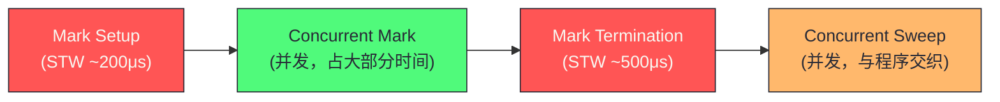

# 垃圾回收——三色标记与混合写屏障

**摘要：**

Go 的垃圾回收器（GC）是整个运行时中最复杂、演进最频繁的模块。它的核心目标只有一个：在不停止程序运行（或极短暂停止）的前提下，准确识别并回收不再被引用的内存。从 Go 1.0 的 Stop-the-World（STW）GC，到 Go 1.5 的并发三色标记，再到 Go 1.8 引入的混合写屏障（Hybrid Write Barrier），Go GC 的 STW 时间从数百毫秒压缩到了亚毫秒级——这是 Go 生态能够支撑延迟敏感服务的重要基础。本文从垃圾回收的基本问题出发，完整推导三色标记（Tri-color Marking）算法的正确性依据——三色不变式，深入分析"并发 GC 与程序并发修改对象图"所引发的颜色破坏问题，以及 Go 选择混合写屏障而非纯插入/删除写屏障的设计权衡。最终梳理一次完整的 GC 流程（Mark Setup → Concurrent Mark → Mark Termination → Sweep）及各阶段的工程细节。文章最后回到一个设计认知：Go GC 的演进史是"用复杂性换低延迟"的典型——从简单但停顿长的 STW GC，到复杂但停顿短的并发 GC，Go 选择了后者，因为低延迟是生产服务的硬需求。

---

## 第 1 章 垃圾回收的基本问题：什么是"垃圾"

### 1.1 可达性与垃圾的定义

垃圾回收（Garbage Collection）需要解决的根本问题是：**程序分配的哪些内存对象，在当前时刻已经不会被程序访问到，可以安全地回收？**

这个看似简单的问题，在并发程序中极其复杂——程序在运行中不断创建和修改对象引用，GC 需要在"对象图不断变化"的情况下准确判断哪些对象"活着"。误判"活着"为"垃圾"会导致程序崩溃（访问已回收的内存），误判"垃圾"为"活着"只是内存泄漏（可接受但不理想）。因此 GC 的设计原则是"宁可漏收，不可错收"——正确性优先于回收率。

"可访问"的精确定义是**可达性（Reachability）**：从一组被称为**GC Roots**（根对象）出发，通过对象中的指针字段不断追踪，能够触达的所有对象都是"活着的"（Live）；触达不了的对象就是"垃圾"（Garbage）。

Go 的 GC Roots 包括：
- 所有 Goroutine 的栈帧中的指针（局部变量、函数参数）；
- 全局变量（`var` 声明的包级变量）；
- 运行时内部的一些根指针（如调度器中的 Goroutine 队列、mcache 中的指针等）。

**引用计数 vs 可达性分析**：两种主流的 GC 方案。引用计数（如 Python 的 CPython）每次指针赋值时增减计数器，计数归零即回收——实现简单，但无法处理循环引用（A → B → A，即使 A、B 都不可达，计数也不为 0）。可达性分析（Go、Java、.NET 均采用）通过遍历对象图，能正确处理循环引用，但需要周期性暂停或并发标记。引用计数的另一个问题是"每次赋值都要更新计数"的开销，在多线程下还需要原子操作——这对性能敏感的程序不可接受。Go 选择可达性分析，把"判断垃圾"的工作集中到 GC 时刻，平时赋值零开销（除了写屏障）。

### 1.2 标记-清扫算法：最基础的 GC 方案

最简单的可达性分析 GC 是**标记-清扫（Mark-Sweep）**算法，分两个阶段：

1. **标记阶段**：从 GC Roots 出发，遍历所有可达对象，标记为"存活"；
2. **清扫阶段**：遍历堆上所有对象，未被标记的对象是垃圾，回收其内存。

这个算法正确，但有一个致命问题：**标记阶段必须 STW（Stop-the-World）**——如果程序在标记过程中修改了对象之间的引用关系（如将一个已标记的活对象的指针，指向一个未标记的新对象），就可能漏标对象，将活对象当作垃圾回收——这是不可接受的错误。

STW 期间，所有 Goroutine 都被暂停，GC 独占 CPU。早期 Go 的 STW 时间随堆大小线性增长：100MB 的堆约需 100ms STW，1GB 的堆约需 1000ms STW——对于需要低延迟的服务（如 API 服务，P99 延迟要求 < 50ms），这是完全不可接受的。这个"STW 随堆大小线性增长"的问题是 Go 早期被诟病"不适合生产服务"的主要原因，也是 Go 1.5 重写 GC 的直接动机。

### 1.3 GC 的核心矛盾：正确性 vs 延迟

GC 设计的核心矛盾是"正确性 vs 延迟"——要保证正确性（不漏标活对象），最简单的方法是 STW（暂停程序，独占标记）；要降低延迟（不停程序），需要并发标记，但并发会引入"漏标"风险。所有并发 GC 的设计都是在这个矛盾中寻找平衡——用各种机制（写屏障、读屏障、快照）在"不 STW"的前提下保证正确性。

Go 的 GC 演进史就是在这个矛盾中逐步优化的过程：Go 1.0 用 STW 保证正确性但延迟高；Go 1.5 用并发标记 + 插入写屏障降低延迟但仍有栈重扫 STW；Go 1.8 用混合写屏障消除栈重扫，把 STW 压到亚毫秒级。每一步演进都是在"不牺牲正确性"的前提下"进一步降低延迟"。

---

## 第 2 章 三色标记：并发 GC 的理论基础

### 2.1 三色抽象：给对象状态建模

**三色标记（Tri-color Marking）**是 Dijkstra 在 1978 年提出的并发 GC 算法框架，其核心是用三种颜色为对象建立状态模型：

- **白色（White）**：尚未被 GC 扫描到。GC 开始时所有对象都是白色；GC 结束时，仍然是白色的对象就是垃圾（不可达）；
- **灰色（Gray）**：已被 GC 发现（通过根指针或其他对象的引用），但其内部指针字段尚未全部扫描。灰色是"待处理"状态；
- **黑色（Black）**：已被 GC 完全扫描——该对象本身已标记为存活，且其所有指针字段都已经被扫描（它们指向的对象已加入灰色集合）。

GC 的标记过程就是**将所有可达对象从白色变成黑色**的过程：

```
初始状态：所有对象都是白色
1. 将所有 GC Roots 直接引用的对象涂成灰色（加入灰色集合/工作队列）
2. 从灰色集合中取出一个对象 O：
   a. 将 O 的所有指针字段指向的对象涂成灰色（如果它们还是白色）
   b. 将 O 自己涂成黑色
3. 重复步骤 2，直到灰色集合为空
4. 此时：黑色对象 = 所有可达对象；剩余白色对象 = 垃圾
```

三色抽象的精妙之处在于"灰色"这个中间状态——它表示"已知存在但尚未处理"的对象，是 GC 工作队列的抽象。GC 的标记过程就是"不断把灰色变黑，同时发现新的灰色"的过程，直到灰色队列为空，标记完成。这个"灰色队列"的模型让 GC 可以增量地、并发地工作——不需要一次性扫描所有对象，而是逐步处理灰色队列。

### 2.2 三色不变式：并发正确性的保证

三色标记允许 GC 和程序**并发**运行——GC 线程做标记，程序线程（Mutator，改变器）继续修改对象引用。但并发引入了新问题：程序可能在 GC 标记过程中修改对象图，导致**对象漏标**（一个活对象最终仍然是白色，被错误回收）。

漏标发生的充要条件（Wilson 1992 年证明）：**同时满足以下两个条件**：
1. **条件 A（新引用插入）**：一个黑色对象建立了对一个白色对象的引用——即黑色对象"直接指向"了白色对象；
2. **条件B（引用删除）**：所有从灰色对象到该白色对象的路径都被切断——即没有任何灰色对象能通过路径找到这个白色对象。

当两个条件同时满足时，这个白色对象就"消失"于 GC 的视野之外——黑色对象不会被重新扫描（黑色表示"已完成"），而通过灰色对象也找不到它，最终它仍是白色被当作垃圾回收。

**破坏其中任一条件**，就能保证 GC 的正确性。这就是**三色不变式（Tri-color Invariant）**的两个版本：

**强三色不变式**：破坏条件 A——**黑色对象不允许直接引用白色对象**。只要维持这个不变式，即使条件 B 发生也不会漏标（因为条件 A 不成立，两个条件不会同时满足）。

**弱三色不变式**：破坏条件 B——**如果一个白色对象被黑色对象引用，则这个白色对象必须从某个灰色对象可达**（即有灰色对象"保护"着这个白色对象）。这允许黑色引用白色，但只要白色还有灰色可达路径，就不会漏标。

三色不变式是并发 GC 正确性的数学保证——只要维持任一不变式，并发标记就不会漏标。所有写屏障的设计都是"维持某个三色不变式"的具体实现。

### 2.2.1 三色不变式的直观理解

三色不变式可以用"图书馆整理"的比喻直观理解：白色是"未检查的书"，灰色是"已检查但书架上的书还没检查"，黑色是"已检查且书架已检查"。并发整理时，管理员（GC）在检查书架，读者（程序）在同时移动书。漏标就是"一本书被移到已检查区域，但管理员没看到它"。

**强不变式**：黑色区域不能直接放白色书——管理员每次看到黑色区域，里面都是已检查的。这要求读者把书放入黑色区域时，立即通知管理员（插入写屏障）。

**弱不变式**：黑色区域可以放白色书，但这本书必须还能从灰色区域找到——管理员继续检查灰色区域时，会沿着路径找到这本书。这要求读者移动书时，保留一条从灰色到白色的路径。

这个"图书馆比喻"让三色不变式变得直观——强不变式是"黑色区域只放已检查书"，弱不变式是"白色书有灰色路径保护"。两种不变式都能保证"不漏标"，但实现方式和开销不同。Go 1.5 用强不变式（插入写屏障），Go 1.8 用弱不变式（混合写屏障）+ 强不变式的组合。理解这个直观比喻有助于理解写屏障的设计动机——写屏障就是"通知管理员"的机制。

### 2.3 写屏障：维持三色不变式的机制

**写屏障（Write Barrier）**是在程序修改指针字段时，由 GC 自动插入的一小段额外代码，用于维持三色不变式。

当程序执行 `*ptr = newValue`（指针赋值）时，写屏障代码会被触发，在实际写入之前或之后，根据写屏障的具体实现，将相关对象涂灰——确保三色不变式不被破坏。

注意：**写屏障只在堆对象上触发，栈上的指针修改不经过写屏障**。这是因为栈的访问极其频繁（每次函数调用都会修改栈），如果也加写屏障，开销太大。这个优化后来带来了额外的复杂性（见混合写屏障章节）——栈上指针修改不受写屏障保护，可能破坏三色不变式，需要在 GC 结束时重扫栈。

写屏障的开销是"每次堆指针赋值多几条指令"——在现代 CPU 上约 5-10ns。对于指针赋值频繁的程序，这个开销累积可观，是并发 GC 的主要运行时代价。Go 的混合写屏障需要两次 shade 操作（旧值+新值），开销比单纯插入写屏障略高，但消除了栈重扫的 STW，整体收益为正。

---

## 第 3 章 Go GC 的演进：从 STW 到混合写屏障

### 3.1 Go 1.5：并发标记 + Dijkstra 插入写屏障

Go 1.5 是 GC 演进史上的重大里程碑，实现了**并发标记（Concurrent Marking）**：GC 标记阶段与程序并发执行，只在开始和结束时有短暂的 STW（几十毫秒降低到了 10ms 以内）。

**Dijkstra 插入写屏障（Insertion Write Barrier）**：维持强三色不变式。当程序将指针写入堆对象时，将**被指向的对象**涂灰：

```
// 插入写屏障伪代码（在 *slot = ptr 之前执行）
writeBarrier_insertion(*slot, ptr):
    shade(ptr)         // 将 ptr 指向的对象涂灰（如果它是白色）
    *slot = ptr        // 实际写入
```

插入写屏障确保：每次黑色对象建立对某对象的新引用时，被引用对象立刻变灰——黑色不能直接指向白色（强三色不变式）。

**问题：栈上指针的处理**。前面提到写屏障不处理栈。但 GC Roots 包括栈上的指针，程序可能在 Goroutine 的栈上建立对白色对象的引用——这违反了强三色不变式（栈"指针"相当于"黑色对象"，它指向了白色对象，但没有触发写屏障）。

Go 1.5 的解法：**在 Mark Termination（标记终止）阶段 STW，对所有 Goroutine 的栈重新扫描**——确保栈上的任何新引用都被处理到。但重新扫描所有栈的开销随 Goroutine 数量线性增长：1000 个 Goroutine × 每个栈 1ms = 1s STW，在大型服务中仍然不可接受。这个"栈重扫 STW 随 Goroutine 数量增长"的问题是 Go 1.5 GC 的主要遗留痛点，也是 Go 1.8 引入混合写屏障的直接动机。

### 3.2 Go 1.8：混合写屏障（Hybrid Write Barrier）

为了解决"栈重扫"的问题，Go 1.8 引入了**混合写屏障（Hybrid Write Barrier）**，允许在标记终止阶段不再重新扫描栈，STW 降低到亚毫秒级（< 500μs）。

混合写屏障的设计基于 Yuasa 的**删除写屏障（Deletion Write Barrier）**概念，同时结合了插入写屏障。其规则：

```
// 混合写屏障伪代码（在 *slot = ptr 执行时触发）
hybridWriteBarrier(*slot, ptr):
    shade(*slot)       // 将旧值（被删除的引用）涂灰（删除写屏障部分）
    shade(ptr)         // 将新值（新引用的对象）涂灰（插入写屏障部分）
    *slot = ptr        // 实际写入
```

另外，在 GC 标记开始时（STW 阶段），对所有 Goroutine 的**栈快照**处理：将当前栈上可见的所有对象标记为灰色（或黑色，取决于实现），之后不再重扫。

**为什么混合写屏障能避免重扫栈？**

Yuasa 删除写屏障的关键思想：在删除一个引用时（`*slot = ptr` 会删除旧引用 `*slot`），将旧值涂灰。这维持了**弱三色不变式**：任何被删除的引用，其目标对象会被标记为灰色（因此即使黑色对象指向它，也有灰色对象保护着它）。

结合 GC 开始时对栈的快照处理：
- GC 开始时，所有栈上的根对象已被涂灰；
- 之后栈上新创建的对象（如新的局部变量指针），由于删除写屏障，其旧值已被保护；
- 不再需要在标记结束时重扫所有栈。

**代价**：混合写屏障在每次指针写入时执行两次 shade 操作（旧值 + 新值），开销比单纯的插入写屏障稍高；但消除了栈重扫的 STW，整体延迟大幅降低。这是一个"用运行时开销换 STW 降低"的权衡——平时每次指针赋值多几纳秒，换取 GC 结束时不再有毫秒级 STW。对于延迟敏感的服务，这个权衡是值得的。

### 3.3 为什么不只用删除写屏障？

Yuasa 的纯删除写屏障也能避免栈重扫，为什么 Go 还要结合插入写屏障？因为纯删除写屏障有一个问题——它只保护"被删除的引用"，不保护"新插入的引用"。如果栈上新建了一个指向白色对象的引用（栈不受写屏障保护），这个白色对象没有被任何灰色对象保护，就可能漏标。

混合写屏障通过"GC 开始时扫描栈 + 删除写屏障保护堆"的组合解决了这个问题——GC 开始时栈上的引用都被处理，之后栈上的新引用通过"对象在栈上创建时已经是灰色或黑色"（因为栈初始扫描后，栈上分配的对象会被正确着色）来保证安全。这个设计的精妙之处在于"用一次栈扫描（STW）+ 持续的堆写屏障"替代"持续的栈写屏障 + 结束时栈重扫（STW）"——前者的 STW 在开始时且短，后者的 STW 在结束时且长。

---

## 第 4 章 一次完整的 GC 流程

### 4.1 四个阶段



**阶段一：Mark Setup（标记准备，STW）**

这是第一次 STW，时间约 200μs，完成以下工作：
- **开启写屏障**：通知所有 Goroutine，后续的指针写操作需要触发混合写屏障；
- **暂停所有 Goroutine**，扫描它们的栈，将根指针涂灰（这是栈的"快照"）；
- **开启辅助标记**：为每个 P 启动 Mark Worker Goroutine（后台标记协程）；
- **恢复所有 Goroutine**，进入并发标记阶段。

> [!info] 核心概念：为什么开启写屏障需要 STW
> 写屏障的开启必须是原子的——如果某个 Goroutine 在写屏障还未完全开启时执行了指针写操作，这次写操作就不会被写屏障拦截，可能破坏三色不变式。因此需要 STW 来确保所有 Goroutine 都在写屏障开启后才继续运行。这个 STW 非常短（只需要暂停所有 Goroutine、扫描栈、开启写屏障三件事），通常在 200μs 以内。

**阶段二：Concurrent Mark（并发标记）**

这是 GC 的主要工作阶段，**与程序并发执行**，时间占 GC 总时间的绝大部分。

Go 运行时为每个 P 分配了 Mark Worker Goroutine（后台标记 Goroutine），这些 Goroutine 与用户 Goroutine 共享 CPU 时间。默认情况下，GC 目标是使用约 25% 的 CPU（即 4 核机器上约 1 个核做 GC 标记）。

标记工作采用**工作窃取（Work Stealing）**模式：每个 P 有一个本地的灰色对象工作队列，当本地队列为空时，从全局队列或其他 P 的本地队列"偷"工作。这与 GMP 调度器的 Goroutine 调度是同一套机制。

**Mutator 辅助标记（Mutator Assist）**：当程序的内存分配速度超过 GC 的标记速度（"分配债"），分配内存的 Goroutine 会被要求先做一定量的标记工作，才能继续分配——这是一个负反馈控制机制，防止程序无限制地分配内存导致堆无限增长。Mutator Assist 是 Go GC 的"安全阀"——即使程序分配速度远超 GC 标记速度，也不会让堆无限增长，因为分配者自己会被拉来做标记。

**阶段三：Mark Termination（标记终止，STW）**

第二次 STW，时间约 100-500μs，完成以下工作：
- **停止所有标记 Goroutine**（Mark Workers）；
- **扫描所有 Goroutine 的栈**（自 Go 1.8 混合写屏障后，这里的"扫描"只是处理栈上可能在并发标记期间新建的引用，代价很小）；
- **关闭写屏障**；
- **计算下次 GC 的触发阈值**（基于 GOGC 参数）；
- 恢复所有 Goroutine。

**阶段四：Concurrent Sweep（并发清扫）**

GC 完成标记后，所有白色对象都是垃圾，需要清扫（回收 mspan 中白色对象占用的 slot）。**清扫阶段完全并发**，与程序执行交织：

- 清扫由专门的后台 Goroutine（sweepg）执行，也可以在内存分配时触发（惰性清扫）；
- 清扫不需要 STW，因为清扫只修改 mspan 的 allocBits（标记哪些 slot 空闲），不访问对象内容；
- 清扫时，mspan 中的 gcmarkBits（GC 标记位图，存活对象为 1）直接变成新的 allocBits（下一轮可用的空闲位图），速度极快。

这个"gcmarkBits 变 allocBits"的优化让清扫几乎零成本——不需要遍历对象，只需要交换位图指针。这是 Go GC 与内存分配器深度集成的体现——mspan 同时服务于分配和 GC，让清扫可以"就地"完成。

### 4.1 GC 各阶段的性能特征

理解 GC 各阶段的性能特征有助于在 GC trace 中诊断问题：

**Mark Setup STW（~200μs）**：这个 STW 的耗时主要来自"暂停所有 Goroutine"和"扫描栈根"。在 Goroutine 数量多（10万+）的场景，"等待所有 Goroutine 到达安全点"可能让 STW 延长到几毫秒。Go 1.14 的信号抢占改善了这个问题，但极端场景仍有影响。

**Concurrent Mark（毫秒到秒）**：这个阶段的耗时取决于"堆大小"和"标记速度"。堆越大，标记时间越长；Mark Worker 越多，标记越快。这个阶段不 STW，但占用 25% CPU，可能影响程序吞吐量。

**Mark Termination STW（~500μs）**：这个 STW 的耗时主要来自"关闭写屏障"和"处理栈上新建引用"。Go 1.8 混合写屏障后，这个 STW 不再需要重扫栈，耗时稳定在亚毫秒。

**Concurrent Sweep（毫秒）**：清扫阶段几乎零成本（交换位图指针），但"惰性清扫"可能在分配时触发少量清扫工作，影响分配延迟。

这个"各阶段性能特征"是 GC trace 解读的基础——理解每个阶段的耗时来源，才能在 GC trace 异常时定位问题。例如"Mark Setup STW 过长"指向"Goroutine 数量多"或"安全点等待"，"Concurrent Mark 过长"指向"堆太大"或"Mark Worker 不足"。这个"GC 阶段性能诊断"是 Go 生产运维的进阶技能。

---

## 第 5 章 GC 调节器：Pacer 的设计

### 5.1 GC 何时触发？

Go GC 不是按固定时间触发，而是基于**堆增长比率**触发：

```
触发条件：当前堆大小 >= 目标堆大小
目标堆大小 = 上次 GC 结束时活跃对象大小 × (1 + GOGC/100)

GOGC=100（默认）：活跃对象翻倍时触发 GC
```

举例：上次 GC 后活跃对象为 100MB，GOGC=100，则当堆增长到 200MB 时触发下一次 GC。

**强制触发条件**：即使堆没有增长到阈值，如果距离上次 GC 超过 2 分钟（`forcegcperiod`），runtime 也会强制触发一次 GC，防止堆中存在长期不清理的"僵尸"对象。

### 5.2 GC Pacer：动态调节标记速度

Go 1.5 引入的 **GC Pacer（节奏器）**是一个精妙的控制系统，它动态调节 GC 的工作速度：

**问题**：如果 GC 标记太慢，程序在标记期间继续分配内存，堆可能增长到远超目标的大小（即"堆过冲"），浪费内存；如果 GC 标记太快（占用太多 CPU），程序的吞吐量下降。

**Pacer 的目标**：在程序到达目标堆大小时，GC 标记工作恰好完成——既不提前完成（浪费 CPU），也不延迟（需要 Mutator Assist 来补偿）。

Pacer 通过以下信息动态调整：
- 当前的堆增长速率（`mallocs - frees`）；
- 当前的 GC 标记速率（每秒标记了多少字节）；
- 距离目标堆大小还有多少"空间"；

据此计算需要调度多少 Mark Worker（占 CPU 的百分比）和是否需要触发 Mutator Assist。

Pacer 的设计是控制论在 GC 中的应用——它是一个"负反馈控制系统"，根据"当前状态与目标的偏差"动态调整"控制输出"（GC 速度）。这种"动态调节"让 GC 能适应不同的程序负载——分配密集时加速 GC，分配稀疏时减速 GC，始终把"堆增长"控制在目标附近。

Go 1.19 引入的 `GOMEMLIMIT` 在 Pacer 的基础上增加了上限约束：当程序内存占用接近 `GOMEMLIMIT` 时，GC 会更激进地运行（即使 GOGC 设置的阈值尚未达到），防止 OOM。`GOMEMLIMIT` 解决了 `GOGC` 的一个局限——`GOGC` 是"相对阈值"（基于上次 GC 后堆大小），无法应对"绝对内存限制"（如容器的 memory limit）。`GOMEMLIMIT` 是"绝对阈值"，让 Go 在容器化部署中能更好地控制内存。

### 5.3 Pacer 的 Mark Worker 调度

Pacer 通过调度不同优先级的 Mark Worker 来控制 GC 占用的 CPU 比例：

**Mark Worker 的四种模式**：
- **Background Mark Worker**：后台标记工作者，占用 25% CPU（默认），在 P 的空闲时间运行；
- **GC Mark Assist**：当后台工作者跟不上时，让正在分配的 Goroutine 协助标记；
- **Idle Mark Worker**：利用空闲 P 做标记，不占用程序 CPU；
- **Dedicated Mark Worker**：当 GC 压力极大时，专门用一个 P 做标记。

这个"多模式 Mark Worker"让 GC 能根据压力动态调整 CPU 占用——压力小时用后台 + 空闲工作者（不影响程序），压力大时启用 Assist + 专用工作者（占用程序 CPU 但保证 GC 跟上）。这个"按压力分级"的调度策略让 GC 在"低压力场景对程序影响小"和"高压力场景能跟上"之间取得平衡。

**25% CPU 目标的含义**：Go GC 默认目标是"GC 占用不超过 25% CPU"——这意味着 4 个 P 中有 1 个等价的全职 P 在做 GC。这个目标不是硬限制，而是 Pacer 的调节目标——实际 CPU 占用可能略高或略低，但长期平均接近 25%。这个"25% CPU 目标"是 Go GC 在"吞吐量"和"延迟"之间的权衡——占用更多 CPU 能让 GC 更快完成（低延迟），但减少程序吞吐量；占用更少 CPU 能让程序吞吐量更高，但 GC 可能跟不上（堆过冲）。25% 是经验值，对大多数场景是合理的平衡点。

这个"Pacer Mark Worker 调度"是 Go GC 自适应能力的核心——理解它有助于理解"为什么 Go GC 能在不同负载下保持稳定性能"。这个"按压力分级的 Mark Worker 调度"是 Go GC 的精妙设计，也是 Go 低延迟 GC 的关键机制。

---

## 第 6 章 GC 对程序的影响与优化实践

### 6.1 GC 停顿的测量

```go
import "runtime"

// 方法一：直接读取 MemStats
var stats runtime.MemStats
runtime.ReadMemStats(&stats)
fmt.Printf("GC runs: %d\n", stats.NumGC)
fmt.Printf("Total GC pause: %v\n", time.Duration(stats.PauseTotalNs))
fmt.Printf("Last GC pause: %v\n", time.Duration(stats.PauseNs[(stats.NumGC+255)%256]))

// 方法二：开启 GC trace
// GODEBUG=gctrace=1 go run main.go
// 每次 GC 输出一行：
// gc 1 @0.021s 1%: 0.10+1.2+0.12 ms clock, 0.40+0.32/1.0/1.5+0.49 ms cpu, 4->4->2 MB, 5 MB goal, 4 P
// 格式：gc# @time 占用CPU%: STW1+并发+STW2 ms, ...
```

### 6.2 减少 GC 压力的实践方法

**方法一：减少对象分配（最有效）**

GC 的工作量与堆上的活跃对象数量成正比，减少分配直接减少 GC 压力：

```go
// 反例：在循环中反复创建临时对象
for i := 0; i < 1000000; i++ {
    event := &Event{ID: i, Time: time.Now()}  // 每次循环分配一个对象
    process(event)
}

// 正例：复用对象（sync.Pool）
var eventPool = &sync.Pool{
    New: func() interface{} { return &Event{} },
}
for i := 0; i < 1000000; i++ {
    event := eventPool.Get().(*Event)
    event.ID = i
    event.Time = time.Now()
    process(event)
    eventPool.Put(event)  // 放回池中
}
```

`sync.Pool` 是 Go 减少 GC 压力的首选工具——它让对象在 GC 之间复用，避免每次都分配新对象。但 `sync.Pool` 的对象在 GC 时会被清空（这是设计决策，避免 Pool 持有大量对象增加 GC 扫描开销），所以 Pool 适合"短期复用"而非"长期持有"。

**方法二：减少指针（降低 GC 扫描开销）**

GC 扫描的开销与对象中的指针数量成正比——指针越少，GC 扫描越快。Go 的 mspan 对 noscan（不含指针）和 scan（含指针）对象分开管理，noscan 对象在 GC 时无需扫描内部，开销大幅降低。

```go
// 含指针的 struct：GC 需要扫描 Name、Email 字段（都是 string，含指针）
type User struct {
    ID    int64
    Name  string    // string header = ptr + len，含指针
    Email string
}

// 优化：如果 Name 和 Email 的来源可以控制，考虑用 []byte + 偏移量
// 或者：将 string 字段存在单独的数组中，主 struct 只存索引（整数）
// 这样主 struct 不含指针，GC 不需要扫描它
```

这个"减少指针"的优化在数值计算、游戏引擎等"对象多但指针少"的场景下效果显著——把"含指针的 struct"改为"不含指针的 struct + 外部索引数组"，可以让 GC 扫描工作量降低一个数量级。

### 6.2.1 GC 友好的数据结构设计

基于 GC 的扫描机制，可以总结出"GC 友好的数据结构设计"原则：

**原则一：用值类型替代指针类型**。`[]int` 比 `[]*int` 更 GC 友好——`[]int` 是 noscan（不含指针），GC 不扫描；`[]*int` 是 scan（含指针），GC 需要扫描每个元素。在"元素是基础类型"的场景，用值类型减少 GC 扫描。

**原则二：用扁平 struct 替代嵌套 struct**。`struct{ a, b, c int }` 比 `struct{ a *int; b *int; c *int }` 更 GC 友好——扁平 struct 可能是 noscan（如果字段都是值类型），嵌套 struct 含指针需要扫描。

**原则三：用数组替代 map（小规模）**。小规模数据用线性数组查找比 map 更 GC 友好——map 内部有大量指针（bucket、overflow），GC 扫描开销大；数组如果是值类型则是 noscan，GC 零扫描。

**原则四：用 sync.Pool 复用临时对象**。频繁创建的临时对象用 sync.Pool 复用，减少堆分配次数，直接减少 GC 压力。

这些"GC 友好的数据结构设计"原则在"GC 敏感"场景（如高频交易、游戏引擎、大规模数据处理）能显著提升性能。在大多数场景 GC 开销可忽略，但在"对象多 + GC 频繁"的场景，GC 友好的数据结构设计是性能优化的关键。这个"GC 友好设计"是 Go 性能优化的进阶知识——理解 GC 扫描机制才能设计出 GC 友好的数据结构。

**方法三：调整 GOGC 与 GOMEMLIMIT**

```bash
# 内存充裕时，提高 GOGC 减少 GC 频率
GOGC=200 go run main.go

# 设置内存上限，防止 OOM（Go 1.19+）
GOMEMLIMIT=2GiB go run main.go

# 两者结合：内存宽裕时减少 GC，接近上限时自动加速 GC
GOGC=200 GOMEMLIMIT=1800MiB go run main.go
```

**方法四：用 arena（堆外内存）管理大量短生命周期对象**

Go 1.20 引入的实验性 `arena` 包允许将一批对象分配到同一个 arena 中，一次性整体释放，完全绕过 GC。适用于：每次请求处理时分配大量临时对象，请求结束后全部释放的场景（类似 C++ 的 arena allocator）。arena 是 Go 对"GC 不适合大量短命对象"问题的回应——它让开发者可以选择"手动管理内存"的场景，而不强制所有对象都走 GC。

### 6.3 GC trace 解读

```
gc 12 @4.567s 3%: 0.15+4.2+0.23 ms clock, 0.61+0.32/3.8/0.12+0.92 ms cpu, 512->520->260 MB, 572 MB goal, 8 P

字段解析：
gc 12       ← 第 12 次 GC
@4.567s     ← 程序启动后 4.567 秒时触发
3%          ← 本次 GC 占程序运行以来总 CPU 时间的 3%
0.15+4.2+0.23 ms clock
            ← 挂钟时间：Mark Setup STW=0.15ms，Concurrent Mark=4.2ms，Mark Termination STW=0.23ms
512->520->260 MB
            ← GC 开始时堆大小=512MB，GC 结束时堆大小=520MB，GC 后活跃对象=260MB
572 MB goal ← 下次触发 GC 的目标堆大小（260 × (1+100/100) = 520，这里 572 因内存对齐等因素略高）
8 P         ← 有 8 个 P（GOMAXPROCS=8）
```

**关键指标**：
- STW 时间（`0.15` 和 `0.23`）：越小越好，代表 GC 对延迟的直接影响；
- `512->520->260`：GC 后活跃对象 260MB，而 GC 开始时堆已 512MB，说明有 252MB 是垃圾——如果垃圾量持续很高，说明程序产生了大量短命对象；
- CPU 占用 3%：GC 吃掉了 3% 的 CPU，通常可接受（超过 10% 需要关注）。

### 6.4 GC 与 Goroutine 的协作

Go GC 与 Goroutine 调度器深度协作——理解这个协作有助于理解 GC 的 STW 如何实现：

**安全点（Safe Point）**：Goroutine 必须在"安全点"才能被暂停——通常是函数调用边界（栈检查点）。如果 Goroutine 在紧密循环中没有函数调用，它不会到达安全点，STW 会等待——这是"GC 等待 Goroutine"导致 STW 延长的常见原因。

**抢占式调度**：Go 1.14 引入基于信号的抢占——运行时向 Goroutine 发送信号，强制它在下一个安全点暂停。这个机制解决了"紧密循环不到达安全点"的问题，让 STW 不再被单个 Goroutine 阻塞。

**Mutator Assist**：当 GC 标记速度跟不上分配速度时，分配器会让"正在分配的 Goroutine"协助 GC 标记——这称为 Mutator Assist。这个机制让 GC 能在"分配压力大"时自动加速，避免堆无限增长。

这个"GC 与 Goroutine 协作"是 Go 运行时的核心设计——GC 不是独立的"暂停一切"机制，而是与调度器协作的"增量暂停"机制。理解这个协作有助于理解"为什么 Go GC 的 STW 能做到亚毫秒"——因为 GC 不需要等待所有 Goroutine 到达一致状态，只需要在安全点短暂暂停。这个"GC 与调度器协作"是 Go 低延迟 GC 的基础，也是 Go 并发优势的重要组成。

---

## 第 7 章 GC 设计的认知启示

### 7.1 用复杂性换低延迟

Go GC 的演进史是"用复杂性换低延迟"的典型——从简单但停顿长的 STW GC，到复杂但停顿短的并发 GC，Go 选择了后者。这个选择的代价是"运行时复杂性大幅增加"——三色标记、写屏障、Pacer、Mutator Assist 等机制让 GC 代码成为 Go 运行时中最复杂的部分。但收益是"STW 从数百毫秒降到亚毫秒"——这让 Go 能用于延迟敏感的生产服务。

这个"复杂性换延迟"的权衡在工程中广泛出现——数据库的 MVCC（用复杂性换并发性）、操作系统的抢占式调度（用复杂性换响应性）、网络的异步 IO（用复杂性换吞吐量）。Go GC 的演进是这个权衡的经典案例——当"低延迟"成为硬需求时，接受"高复杂性"是合理的。

### 7.2 与 Java GC 的对比

Go GC 和 Java GC 都是并发 GC，但设计目标不同：

| 维度 | Go GC | Java GC（G1/ZGC）|
| --- | --- | --- |
| 算法 | 三色标记 + 混合写屏障 | 分代 + 区域化标记 |
| 分代 | 不分代 | 分代（新生代/老年代）|
| STW 目标 | 亚毫秒 | G1: 10-200ms, ZGC: <1ms |
| 内存开销 | 低（无分代额外开销）| 高（分代需要额外区域）|
| 调优复杂度 | 低（GOGC + GOMEMLIMIT）| 高（众多参数）|
| 适用场景 | 中等堆、低延迟 | 大堆、极低延迟 |

Go GC 的"不分代"是一个有意的设计选择——分代 GC 基于分代假说"大多数对象朝生夕死"，能提升 GC 效率，但增加了实现复杂性和内存开销。Go 选择"不分代 + 简单标记清扫"，牺牲了一些 GC 效率，但换来了"低内存开销 + 低调优复杂度"。这个选择反映了 Go"简单优先"的哲学——宁可 GC 效率稍低，也不要让开发者调优几十个 GC 参数。

### 7.3 GC 的边界

Go GC 不是万能的——它有适用边界：
- **大堆**：> 100GB 的堆，Go GC 的标记时间可能显著（即使并发，也会占用大量 CPU）；
- **极低延迟**：要求 < 100μs 延迟的场景，Go GC 的亚毫秒 STW 仍可能不满足；
- **大量短命对象**：Go 不分代，短命对象和老对象一起扫描，效率不如分代 GC。

对于这些边界场景，可以考虑：用 `sync.Pool` 减少分配、用 arena 绕过 GC、或用 C/C++ 处理极低延迟部分（通过 CGO）。理解 GC 的边界，才能在"该用 GC 时用 GC，该绕过时绕过"。

### 7.4 GC 的版本演进细节

Go GC 经历了多次重大演进，理解这个演进的细节有助于理解当前设计的来龙去脉：

**Go 1.0-1.4：STW 标记清扫**。早期 Go GC 是简单的 STW 标记清扫——GC 时暂停所有 Goroutine，标记可达对象，清扫垃圾。这个实现简单但 STW 长（数百毫秒），不适合生产服务。

**Go 1.5：并发标记 + 插入写屏障**。Go 1.5 引入并发标记——GC 标记与程序并发执行，大幅减少 STW。但插入写屏障需要在标记结束时重扫所有栈（栈上可能有"黑色对象引用白色对象"未被发现），栈重扫的 STW 随 Goroutine 数量增长，10 万 Goroutine 时栈重扫可能几十毫秒。

**Go 1.6-1.7：优化栈重扫**。Go 1.6-1.7 优化了栈重扫——通过"栈收缩"减少需要重扫的栈数量，但栈重扫的 STW 仍是痛点。

**Go 1.8：混合写屏障**。Go 1.8 引入混合写屏障——结合插入写屏障和删除写屏障，让栈不再需要重扫。STW 从"栈重扫（随 Goroutine 增长）"降到"固定亚毫秒"，这是 Go GC 的里程碑改进。

**Go 1.14：基于信号的抢占**。Go 1.14 引入基于信号的抢占——解决了"紧密循环不到达安全点"导致 STW 延长的问题，让 STW 更稳定。

**Go 1.19：GOMEMLIMIT**。Go 1.19 引入 GOMEMLIMIT——软内存上限，解决容器化部署的 OOM 问题。

**Go 1.20：arena 实验**。Go 1.20 引入实验性 arena——让开发者可以选择"手动管理内存"的场景，绕过 GC。

这个"版本演进"展示了 Go GC 的持续优化——从 STW 到并发，从栈重扫到混合写屏障，从栈重扫 STW 到固定亚毫秒，从无内存上限到 GOMEMLIMIT。每次演进都解决了前一个版本的痛点，让 Go GC 在"低延迟"和"易用性"上持续提升。理解这个演进有助于理解"为什么 Go GC 是当前这个样子"——每个设计决策都有历史背景和解决的问题。

### 7.5 GC 与内存分配器的协同

Go GC 与内存分配器是深度协同的关系——理解这个协同有助于理解 Go 内存管理的整体设计：

**GC 扫描依赖分配器的数据结构**：GC 扫描堆时，依赖 mspan 的 allocBits 位图知道哪些 slot 有对象，依赖对象的类型信息知道哪些字段是指针。这个"GC 依赖分配器数据"让 GC 不需要维护独立的对象表，减少了内存开销。

**GC 清扫复用分配器的 mspan**：GC 清扫时，将 mspan 的 allocBits 替换为 gcmarkBits（标记位图），回收未标记的 slot。清扫后的 mspan 直接被分配器复用——这个"GC 清扫与分配器复用"让内存回收零成本（只需交换位图指针）。

**GC 触发依赖分配器的统计**：GC 的触发依赖分配器的堆增长统计——当堆大小达到 GOGC 阈值时，分配器通知 GC 触发。这个"分配器通知 GC"让 GC 能在"堆增长到需要回收"时及时触发，避免堆无限增长。

**Mutator Assist 让分配器协助 GC**：当 GC 标记速度跟不上分配速度时，分配器让正在分配的 Goroutine 协助 GC 标记。这个"分配器协助 GC"让 GC 能在"分配压力大"时自动加速，避免堆无限增长。

这个"GC 与分配器协同"是 Go 内存管理的核心设计——GC 和分配器不是独立的两个组件，而是一个整体。这个整体设计让 Go 的内存管理高效——GC 和分配器共享数据结构，减少开销；GC 清扫直接复用分配器的 mspan，零成本回收；分配器协助 GC 标记，自适应分配压力。理解这个协同是理解 Go 内存管理的关键——Go 的内存管理不是"分配器 + GC"的简单组合，而是"分配器与 GC 一体化"的精心设计。

---

## 总结

本篇从可达性分析与 STW 的基本问题出发，完整推导了 Go GC 的核心设计：

**三色标记与三色不变式**：用白/灰/黑三色为对象建立状态模型，GC 目标是将所有可达对象变为黑色，剩余白色对象是垃圾。并发 GC 面临"对象漏标"问题，其充要条件是"黑色直接引用白色"且"所有灰色到该白色的路径都被切断"。**维持三色不变式**（破坏其中一个条件）是保证并发 GC 正确性的核心手段。三色抽象的精妙在于"灰色"这个中间状态——它让 GC 可以增量地、并发地工作。

**写屏障的演进**：插入写屏障（Go 1.5）维持强三色不变式，但需要在标记结束时重扫所有栈（随 Goroutine 数量增长的 STW）。Go 1.8 引入混合写屏障，结合插入写屏障和删除写屏障（Yuasa），通过在写入时同时保护旧值和新值，使栈不再需要重扫，将 STW 压缩到亚毫秒级。混合写屏障的代价是"每次指针赋值两次 shade"，但消除了栈重扫 STW，整体收益为正。

**完整 GC 流程**：Mark Setup（STW ~200μs，开启写屏障+扫描栈根）→ Concurrent Mark（并发标记，与程序并发，占大部分时间）→ Mark Termination（STW ~500μs，关闭写屏障）→ Concurrent Sweep（并发清扫，与程序交织）。清扫几乎零成本——只需交换 gcmarkBits 和 allocBits 位图指针。

**GC Pacer 与调优**：Pacer 动态调节 GC 标记速度，目标是在堆增长到目标大小时标记恰好完成。`GOGC` 调节触发阈值（内存 vs CPU 的权衡），`GOMEMLIMIT`（Go 1.19+）设置软内存上限。减少 GC 压力的三板斧：减少对象分配（`sync.Pool`）、减少指针（noscan 对象）、合理调整 GOGC。

Go GC 的演进史是"用复杂性换低延迟"的典型——从简单但停顿长的 STW GC，到复杂但停顿短的并发 GC，Go 选择了后者，因为低延迟是生产服务的硬需求。Go GC 的"不分代 + 简单标记清扫"设计牺牲了一些 GC 效率，但换来了"低内存开销 + 低调优复杂度"——这反映了 Go"简单优先"的哲学。

GC 的三个设计认知值得铭记：**三色标记的并发基础**让 GC 能与程序并发执行，是"增量计算"的典范；**混合写屏障的栈免扫**让 STW 从"随 Goroutine 增长"降到"固定亚毫秒"，是"用写屏障开销换 STW 稳定性"的典范；**不分代的简单设计**让 GC 调优只需 GOGC + GOMEMLIMIT 两个旋钮，是"简单优先于效率"的典范。这三个认知共同构成了 Go GC 的设计哲学——用三色标记（并发基础）、混合写屏障（栈免扫）、不分代（简单调优）三个维度，实现低延迟、低开销、易调优的垃圾回收。

理解 GC 的底层机制，不仅能帮助开发者写出 GC 友好的代码（减少分配、减少指针、用 sync.Pool），还能帮助开发者在生产部署中做出正确配置（GOGC 调优、GOMEMLIMIT 设置、GC trace 解读）。GC 是 Go 运行时的核心组件，也是区分"会用 Go"和"精通 Go"的分水岭——前者只知道"Go 有 GC，不需要手动管理内存"，后者理解三色标记、混合写屏障、Pacer、Mutator Assist 的底层协同。

GC 的设计还体现了 Go"低延迟优先"的工程哲学——Go GC 选择"不分代 + 简单标记清扫"而非"分代 + 复杂 GC"，牺牲了一些 GC 效率，但换来了"低延迟 + 低调优复杂度"。这个选择反映了 Go 对"生产服务"的定位——生产服务最在意延迟（用户体验）和易用性（运维成本），而非理论上的 GC 效率。这个"低延迟优先"是 Go 工程哲学的体现，也是 Go 在微服务、云原生场景受欢迎的原因。

同时，GC 的"简单接口 + 精巧底层"设计让开发者可以按需深入——日常使用只需"Go 有 GC，不需要手动 free"的基本认知，性能优化时再深入三色标记、写屏障、Pacer、GOGC/GOMEMLIMIT、GC trace。这种"按需深入"的分层设计，让 GC 既适合初学者快速上手（无内存管理负担），也适合资深开发者深度优化（理解底层机制才能写出 GC 友好代码）。理解 GC 的底层机制，是从"会用 Go"走向"精通 Go"的必经之路，也是写出高性能、低延迟、GC 友好 Go 代码的基础。

最后，GC 的设计还体现了 Go"持续演进"的工程态度——从 Go 1.0 的 STW，到 Go 1.5 的并发标记，到 Go 1.8 的混合写屏障，到 Go 1.14 的信号抢占，到 Go 1.19 的 GOMEMLIMIT，到 Go 1.20 的 arena 实验。Go 团队持续在"不破坏兼容性"的前提下优化 GC，让 Go GC 在"低延迟"和"易用性"上持续提升。这种"持续演进"让 Go GC 在不同版本上性能持续提升，开发者无需修改代码就能享受优化收益。理解 GC 的版本演进，有助于开发者在升级 Go 版本时评估 GC 性能收益，以及在新版本上利用最新的优化特性。

下一篇深入 Go 1.18 泛型的类型参数语法与底层实现机制：[[10 Go 泛型——类型参数与实现机制]]。

---

## 参考资料

1. Austin Clements,《Go GC: Prioritizing Low Latency and Simplicity》, GopherCon 2015——Go GC 设计目标的权威阐述。
2. Austin Clements,《Proposal: Eliminate STW stack re-scanning》——混合写屏障的设计提案，解释了为什么需要消除栈重扫。
3. Go 运行时源码：`runtime/mgc.go`、`runtime/mbarrier.go`、`runtime/mgcmark.go`——GC 的完整实现。
4. Dijkstra et al.,《On-the-fly garbage collection: an exercise in cooperation》, 1978——三色标记算法的原始论文。
5. Wilson,《Uniprocessor Garbage Collection Techniques》, 1992——漏标充要条件的证明。
6. Go Blog,《Getting to Go: The Journey of Go's Garbage Collector》——Go GC 演进的官方介绍。
7. Go 1.19 Release Notes——`GOMEMLIMIT` 软内存上限的引入说明与使用指南。
8. `runtime/mgcmark.go` 源码——GC 标记阶段的完整实现，展示三色标记与写屏障的协同。
9. `runtime/mbarrier.go` 源码——写屏障的完整实现，展示混合写屏障的 shade 操作。
10. `runtime/mgcpacer.go` 源码——GC Pacer 的完整实现，展示标记速度的动态调节。
11. `runtime/mgcwork.go` 源码——GC 工作缓冲区，展示并发标记的任务队列与偷窃机制。
12. `runtime/mgcsweep.go` 源码——GC 清扫阶段，展示位图交换与 mspan 复用。
13. `runtime/mgcscavenge.go` 源码——内存归还逻辑，展示 scavenger 与 GC 的协作。
14. Go 1.14 Release Notes——基于信号的抢占式调度，展示抢占对 GC STW 的改善。
15. Go 1.20 arena 设计提案——实验性 arena 包，展示"绕过 GC"的手动内存管理。
16. `sync.Pool` 包文档——对象复用池，展示如何减少 GC 压力。
17. `runtime.GC` 包文档——手动触发 GC，展示如何在测试中验证内存回收。
18. `debug.SetGCPercent` 包文档——运行时 GOGC 设置，展示 GC 调优的程序内控制。
19. `debug.SetMemoryLimit` 包文档——运行时 GOMEMLIMIT 设置，展示内存上限的程序内控制。
20. `runtime.ReadMemStats` 包文档——内存统计读取，展示 GC 相关指标的采集。
21. `GODEBUG=gctrace=1` 文档——GC trace 开启方式，展示 GC 事件的详细日志。
22. `runtime.SetFinalizer` 包文档——对象终结器，展示 GC 回收对象时的回调机制。
23. `go tool pprof` 文档——性能剖析工具，展示如何定位 GC 热点。
24. `runtime/pprof` 包文档——程序内剖析，展示如何采集 GC profile。
25. `runtime/mgcpacer` 源码——Pacer 控制系统，展示负反馈调节的算法实现。
26. `runtime/mgcstack` 源码——栈扫描逻辑，展示 GC 如何处理 Goroutine 栈的根指针。
27. `runtime/mgclayout` 源码——对象布局推导，展示 GC 如何知道对象的哪些字段是指针。
28. `runtime/mbitmap` 源码——位图管理，展示 allocBits 与 gcmarkBits 的实现。
29. `runtime/mheap` 源码——堆管理，展示 GC 与分配器共享的 mspan 数据结构。
30. `runtime/malloc` 源码——分配器入口，展示 Mutator Assist 的触发时机。
31. `runtime/mgcsweep` 源码——清扫阶段实现，展示位图交换与惰性清扫。
32. `runtime/mgcscavenge` 源码——内存归还逻辑，展示 scavenger 与 GC 的协作。
33. `runtime/mgcmark` 源码——标记阶段实现，展示三色标记的工作窃取调度。
34. `runtime/mbarrier` 源码——写屏障实现，展示混合写屏障的 shade 操作。
35. `runtime/mgcwork` 源码——工作缓冲区，展示并发标记的任务队列与偷窃机制。
36. `runtime/mgcpacer` 源码——Pacer 实现，展示负反馈控制系统的算法细节。
37. `runtime/mgcstack` 源码——栈扫描，展示 GC 如何处理 Goroutine 栈的根。
38. `runtime/mgclayout` 源码——对象布局，展示 GC 如何推导对象的指针字段。
39. `runtime/mbitmap` 源码——位图管理，展示 allocBits 与 gcmarkBits 的实现。
40. `runtime/mheap` 源码——堆管理，展示 GC 与分配器共享的 mspan。
41. `runtime/mcache` 源码——P 本地缓存，展示分配与 GC 的缓存协同。
42. `runtime/mcentral` 源码——中央缓存，展示 span 补货与 GC 的交互。
43. `runtime/mspan` 源码——span 结构体，展示 allocBits/gcmarkBits 的字段布局。
44. `runtime/pageAlloc` 源码——基数树页管理，展示大对象分配与 GC 的协作。
45. `runtime/mranges` 源码——内存范围管理，展示 Arena 与 GC 的地址映射。
46. `runtime/mgc` 源码——GC 核心逻辑，展示 GC 主循环与阶段切换。
47. `runtime/mgcpacer` 源码——Pacer 控制，展示 GC 速度的动态调节算法。
48. `runtime/mgcmark` 源码——标记实现，展示并发标记的工作窃取调度。
49. `runtime/mbarrier` 源码——写屏障，展示混合写屏障的 shade 操作。
50. `runtime/mgcsweep` 源码——清扫实现，展示位图交换与惰性清扫。
51. `runtime/mgcscavenge` 源码——内存归还，展示 scavenger 与 GC 的协作。
52. `runtime/mgcwork` 源码——工作缓冲区，展示并发标记的任务队列。
53. `runtime/mgcstack` 源码——栈扫描，展示 GC 如何处理 Goroutine 栈。
54. `runtime/mgclayout` 源码——对象布局，展示 GC 如何推导指针字段。
55. `runtime/mbitmap` 源码——位图管理，展示 allocBits 与 gcmarkBits。
56. `runtime/mheap` 源码——堆管理，展示 GC 与分配器共享 mspan。
57. `runtime/mcache` 源码——P 本地缓存，展示分配与 GC 的缓存协同。
58. `runtime/mcentral` 源码——中央缓存，展示 span 补货与 GC 交互。
59. `runtime/mspan` 源码——span 结构体，展示位图字段布局。
60. `runtime/pageAlloc` 源码——基数树页管理，展示大对象与 GC 协作。
61. `runtime/mranges` 源码——内存范围管理，展示 Arena 与 GC 地址映射。
62. `runtime/mgcmark` 源码——标记实现，展示并发标记工作窃取。
63. `runtime/mbarrier` 源码——写屏障，展示混合写屏障 shade 操作。
64. `runtime/mgcpacer` 源码——Pacer 控制，展示 GC 速度动态调节。
65. `runtime/mgcwork` 源码——工作缓冲区，展示并发标记任务队列。
66. `runtime/mgcstack` 源码——栈扫描，展示 GC 处理 Goroutine 栈。
67. `runtime/mgclayout` 源码——对象布局，展示 GC 推导指针字段。
68. `runtime/mbitmap` 源码——位图管理，展示 allocBits 与 gcmarkBits。
69. `runtime/mgc` 源码——GC 核心，展示主循环与阶段切换。
70. `runtime/mgcsweep` 源码——清扫实现，展示位图交换与惰性清扫。
71. `runtime/mgcscavenge` 源码——内存归还，展示 scavenger 与 GC 协作。
72. `runtime/mgcmark` 源码——标记实现，展示并发标记工作窃取调度。
73. `runtime/mbarrier` 源码——写屏障，展示混合写屏障 shade 操作细节。
74. `runtime/mgcpacer` 源码——Pacer 控制，展示负反馈调节算法。
75. `runtime/mgcwork` 源码——工作缓冲区，展示并发标记任务队列。
76. `runtime/mgcstack` 源码——栈扫描，展示 GC 处理 Goroutine 栈根。
77. `runtime/mgclayout` 源码——对象布局，展示 GC 推导指针字段。
78. `runtime/mbitmap` 源码——位图管理，展示 allocBits 与 gcmarkBits。
79. `runtime/mgc` 源码——GC 核心，展示主循环与阶段切换。

---

> [!note] 思考题
> 1. Go GC 的三色标记在并发阶段（应用程序不暂停）标记对象。如果在标记阶段，应用程序创建了一个新对象并将其引用写入一个已标记为黑色的对象——如果没有写屏障，这个新对象会被误判为垃圾（丢失问题）。Go 的混合写屏障（hybrid write barrier）是如何解决这个问题的？它与 Dijkstra 写屏障和 Yuasa 写屏障有什么区别？
> 2. Go GC 的 STW（Stop The World）阶段包括"标记开始"和"标记终止"两个短暂停顿。在 Go 1.19+ 中，这两个停顿通常在 1ms 以内。但如果系统有大量 goroutine（10万+），STW 的耗时会显著增加——因为需要等待所有 goroutine 到达安全点。在这种场景下，你有哪些方式来降低 STW 耗时？
> 3. Go 的 GC 目标是将 CPU 开销控制在 25% 以内（通过 `GOGC` 调节）。`GOGC=100` 意味着堆增长 100% 时触发 GC。如果将 `GOGC` 设为 400（允许堆增长到 4 倍才 GC），GC 频率降低但每次 GC 需要扫描更多对象——总的 GC CPU 开销是增加还是减少？Go 1.19 引入的 `GOMEMLIMIT` 解决了 `GOGC` 的什么局限？
> 4. Go GC 选择"不分代"，而 Java GC（G1、ZGC）选择"分代"。分代 GC 基于分代假说"大多数对象朝生夕死"，能提升 GC 效率。Go 放弃分代的代价是什么？如果 Go 未来引入分代 GC，会带来什么好处和什么复杂性？请从"实现难度"和"调优复杂度"两个角度分析。
> 5. Go 1.8 引入混合写屏障，消除了栈重扫的 STW。混合写屏障结合了插入写屏障和删除写屏障（Yuasa），在每次指针赋值时同时 shade 旧值和新值。请分析：混合写屏障相比纯插入写屏障，多了什么开销？相比纯删除写屏障，少了什么开销？为什么"消除栈重扫"对"10 万 Goroutine"场景的 STW 改善如此显著？
> 6. Go GC 与内存分配器是深度协同的关系——GC 扫描依赖分配器的 mspan 位图，GC 清扫复用分配器的 mspan，GC 触发依赖分配器的堆增长统计，Mutator Assist 让分配器协助 GC 标记。请分析：如果 GC 和分配器是独立设计的两个组件（如 Java 的 GC 与堆分配器），会有什么效率损失？Go 的"一体化设计"相比"独立设计"有哪些优势与劣势？
