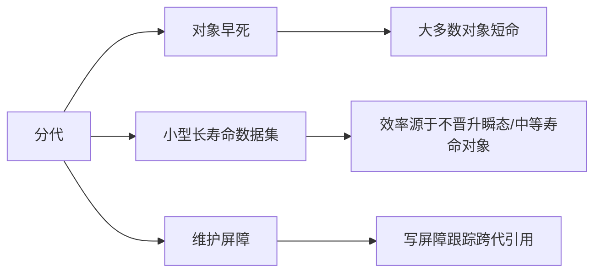
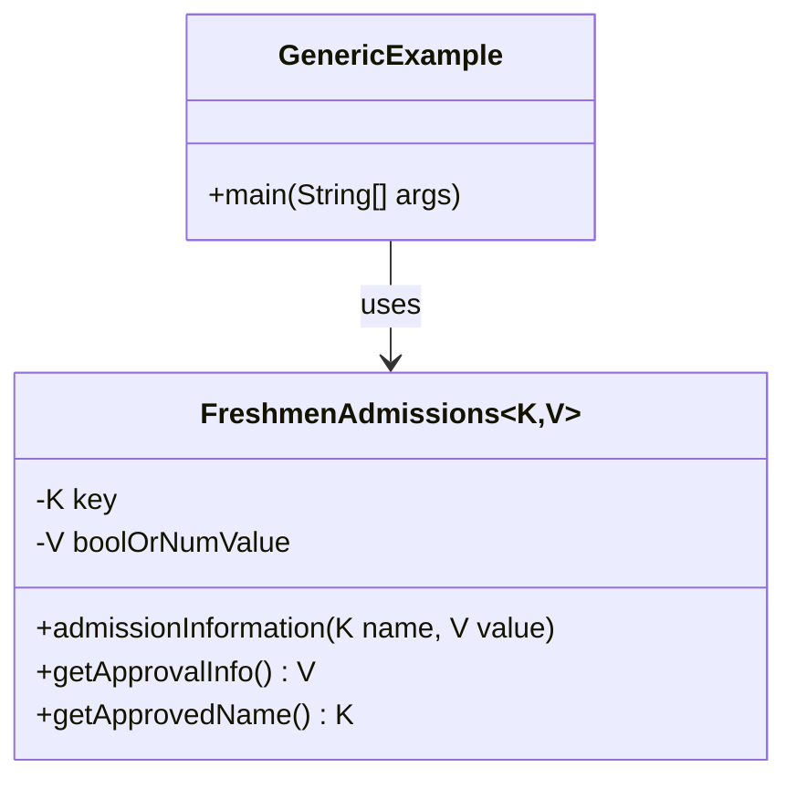

# 第1章 Java语言与虚拟机的性能演进

三十多年前，编程语言的版图在很大程度上由C语言及其面向对象扩展C++所定义。在这一时期，计算世界正经历着一场重大转变：从庞大、笨重的大型主机转向更小巧、更高效的小型计算机。C语言因其适用于Unix系统，而C++则因其对面向对象设计引入类的创新性，都处于这场技术演进的前沿。

然而，随着行业开始转向更专业化、更经济的系统（如微控制器和微型计算机），一系列新的挑战随之浮现。应用程序的代码行数急剧膨胀，将软件“移植”到各种平台的需求变得日益紧迫。这往往需要针对每个特定目标重写或大幅修改应用程序，这是一个劳动密集且容易出错的过程。开发人员还面临着管理大量静态库依赖关系的复杂性，以及嵌入式系统对轻量级软件的需求——这些都是C++的不足之处。

正是在这样的背景下，Java于20世纪90年代中期应运而生。其创建者旨在通过提供“一次编写，到处运行”的解决方案来填补这一空白。但Java不仅仅是一种编程语言。它引入了自己的运行时环境，包括一个虚拟机（Java虚拟机，JVM）、类库和一套全面的工具。这个包罗万象的生态系统，即Java开发工具包（JDK），旨在应对那个时代的挑战，并为编程的未来奠定基础。如今，四分之一个多世纪过去了，Java在编程语言世界中的影响力依然强劲，这证明了其适应性和设计的稳健性。

在此期间，应用程序的性能成为了一个关键因素，尤其是在大规模、数据密集型应用兴起的背景下。Java运行时系统的演进在应对这些性能挑战中发挥了关键作用。得益于泛型、自动装箱和拆箱的优化，以及并发实用程序的增强，Java应用程序在性能和可扩展性方面都取得了显著改进。此外，这些变化对JVM本身的性能也产生了深远影响。特别是，JVM必须调整并优化其执行策略，以高效处理这些新的语言特性。在阅读本书时，请牢记Java诞生的历史背景和驱动力。Java及其虚拟机的演进深刻影响了开发人员为各种平台编写和优化软件的方式。

在本章中，我们将详细审视Java和JVM的历史，重点介绍那些显著塑造其发展的技术进步和关键里程碑。从其作为平台无关性解决方案的早期阶段，到引入新语言特性，再到JVM的持续改进，Java已经发展成为现代软件开发工具库中一个强大且多功能的工具。

## 一个新生态系统的诞生

在20世纪90年代，互联网正在兴起，随着Java小程序的引入，网页变得更加互动。Java小程序是在Web浏览器内运行的小型应用程序，为最终用户提供了“实时”体验。

小程序不仅平台无关，而且还“安全”——在某种意义上，用户需要信任小程序的编写者。在讨论JVM上下文中的安全性时，必须理解直接内存访问应被禁止。因此，Java引入了自己的内存管理系统，称为**垃圾收集器（GC）**。

> [!NOTE]
> 在本书中，缩写GC既指代垃圾收集（自动内存管理的过程），也指代垃圾收集器（JVM中执行该过程的模块）。具体含义将根据GC使用的上下文来确定。

此外，一个抽象层（称为Java字节码）被添加到了任何可执行文件中。Java小程序迅速流行起来，因为驻留在Web服务器上的字节码会在网页渲染期间被传输并作为自己的进程执行。尽管Java字节码是平台无关的，但它被解释并编译为特定于底层平台的本机代码。

## 历史中的几页

JDK包含了诸如Java编译器之类的工具，该编译器将Java代码转换为Java字节码。Java字节码是由Java运行时环境（JRE）处理的可执行文件。因此，对于不同的环境，只需更新运行时即可。只要存在针对特定环境的JVM，字节码就可以执行。JVM和GC作为执行引擎。对于Java 1.0和1.1版本，字节码被解释为本机机器码，并且没有动态编译。

在Java 1.0和1.1版本发布后不久，人们发现Java需要更高的性能。因此，在Java 1.2中引入了一个即时（JIT）编译器。当与JVM结合时，它提供了基于热点方法和循环回边计数的动态编译。这个新的VM被称为Java HotSpot VM。

## 理解Java HotSpot VM及其编译策略

Java HotSpot VM在执行Java程序时扮演着关键角色，它能够高效地运行程序。它包括JIT编译、分层编译和自适应优化，以提升Java应用程序的性能。

### HotSpot执行引擎的演进

HotSpot VM执行混合模式，这意味着VM以解释模式启动，字节码基于一个描述表被转换成本机代码。该表包含一个对应于每个字节码指令的本机代码模板，称为**TemplateTable**；它只是一个简单的查找表。执行代码存储在一个代码缓存（称为**CodeCache**）中。CodeCache存储本机代码，也是一个用于存储JIT编译代码的有用缓存。

> [!NOTE]
> HotSpot VM还提供了一种不需要模板的解释器，称为C++解释器。一些OpenJDK移植版¹选择这条路线，以简化VM向非x86平台的移植。

### 性能关键方法及其优化

性能工程是软件开发的一个关键方面，该过程中的一个核心部分是识别和优化性能关键方法。这些方法被频繁执行或包含性能敏感的代码，并且最有可能从JIT编译中获益。优化性能关键方法不仅仅是选择合适的数据结构和算法，还涉及根据方法的调用频率、大小和复杂性以及可用的系统资源来识别和优化它们。

考虑以下`BookProgress`类作为示例：

```java
import java.util.*;

public class BookProgress {
    private String title;
    private Map<String, Integer> chapterPages;
    private Map<String, Integer> chapterPagesWritten;

    public BookProgress(String title) {
        this.title = title;
        this.chapterPages = new HashMap<>();
        this.chapterPagesWritten = new HashMap<>();
    }

    public void addChapter(String chapter, int totalPages) {
        this.chapterPages.put(chapter, totalPages);
        this.chapterPagesWritten.put(chapter, 0);
    }

    public void updateProgress(String chapter, int pagesWritten) {
        this.chapterPagesWritten.put(chapter, pagesWritten);
    }

    public double getProgress(String chapter) {
        return ((double) chapterPagesWritten.get(chapter) / chapterPages.get(chapter)) * 100;
    }

    public double getTotalProgress() {
        int totalWritten = chapterPagesWritten.values().stream().mapToInt(Integer::intValue).sum();
        int total = chapterPages.values().stream().mapToInt(Integer::intValue).sum();
        return ((double) totalWritten / total) * 100;
    }
}
```

> ¹ https://wiki.openjdk.org/pages/viewpage.action?pageId=13729802

#### 分段式代码缓存

随着我们对 HotSpot VM 细节的深入探讨，有必要重新审视代码缓存（code cache）的概念。回顾一下，代码缓存是用于存储 JIT 编译器或解释器生成的本机代码的存储区域。随着分层编译的引入，代码缓存也成为存储在不同分层编译级别收集的分析信息（profiling information）的仓库。有趣的是，即使是解释器用于查找每个字节码对应本机代码序列的模板表（TemplateTable），也存储在代码缓存中。

代码缓存的大小在启动时是固定的，但可以通过在命令行中传递所需的最大值给 `-XX:ReservedCodeCacheSize` 来修改。在 Java 7 之前，该大小的默认值为 48 MB。一旦代码缓存被填满，所有编译工作都会停止。当启用分层编译时，这构成了一个重大问题，因为代码缓存不仅包含 JIT 编译后的代码（在 HotSpot VM 中表示为 `nmethod`），还包含分析后的代码。`nmethod` 是指已由 JIT 编译器编译为机器码的 Java 方法的内部表示。相比之下，分析后的代码是那些已根据其运行时行为被分析和优化的代码。代码缓存需要

> **注**：此段落末尾的脚注标记 ² 指向原书脚注：² “What the JIT!? Anatomy of the OpenJDK HotSpot VM.” infoq.com。

足够的空间来容纳这两种类型的代码，以避免过早填满而导致性能下降。

为了解决这个问题，从 Java 7u4 开始，引入了**分段式代码缓存**（Segmented Code Cache）。代码缓存被划分为三个独立的区域（segments）：

1. **非方法代码（Non-method code）**：存储 JVM 内部代码，例如模板表、运行时存根（runtime stubs）以及适配器（adapters）。该区域通常较小，大小约为 1–2 MB。
2. **分析过的代码（Profiled code）**：存储经过轻量级分析（profiled）的代码，即分层编译中 T1–T3 级别生成的代码。这些代码可能尚未完全优化，但包含运行时收集的分析信息。
3. **非分析过的代码（Non-profiled code）**：存储完全优化的代码，即 T4 级别（C2 编译器）生成的代码。这些代码不包含分析信息，但执行效率最高。

这种分段管理的优势在于：
- 减少不同性质代码之间的相互干扰，例如，分析过的代码频繁更新时不会影响高度优化的代码。
- 允许更精细地控制缓存回收（code cache flushing），例如，可以只回收分析过的代码区域，而保留非分析过的代码。
- 提升整体性能，特别是对于长时间运行的应用程序。

此外，可以通过 `-XX:+PrintCodeCache` 选项查看代码缓存的详细使用情况，包括每个区域的大小和填充比例。这在调优 JIT 编译行为时非常有用。

#### 逆优化（Deoptimization）

尽管 HotSpot VM 的 JIT 编译器会尽力生成最优化的代码，但某些情况下，之前做出的优化假设可能在运行时不再成立。例如，编译器可能假设某个方法只被单一子类覆盖，从而进行内联优化，但后续类加载器可能引入新的子类，违反该假设。此时，HotSpot VM 必须进行**逆优化**（deoptimization），即从优化后的机器码回退到解释执行。

逆优化是自适应优化机制的关键组成部分。它确保即使最初编译时的假设不再成立，程序也能正确运行。当发生逆优化时，当前正在执行的优化版本代码会被撤销，VM 会将执行状态恢复到解释器可以继续执行的形式，并可能重新收集分析信息，然后重新编译。

逆优化通常由以下原因触发：
- 类层次结构变化（例如，加载新子类影响方法分派）。
- 已编译代码因代码缓存不足被回收。
- 通过 JVM 工具接口（JVMTI）进行的代码变更等。

逆优化虽然会带来短暂的性能损失，但保证了程序的正确性，是 HotSpot VM 实现复杂运行时优化的基石。开发者通常无需直接关注逆优化，但了解其存在有助于理解 JIT 编译的“乐观”本质。

本章后续内容将继续探讨 Java 语言生态的演进，包括性能优化的其他方面，以及语言本身的变化如何与虚拟机协同提升整体性能。

> [!INFO] 本章概要  
> 第一章覆盖了 Java 性能演进的多个关键领域：从简单代码示例入手分析性能指标，深入 HotSpot VM 的解释器与 JIT 编译策略，包括分层编译、客户端/服务器编译器、分段代码缓存以及逆优化机制。后续章节将在此基础上，进一步探讨类型系统、模块化、统一日志系统等主题。

## 代码缓存（Code Cache）管理

由JIT编译器编译为机器码的Java方法的内部表示称为nmethod。相比之下，带分析信息的代码（profiled code）是那些基于运行时行为被分析和优化过的代码。代码缓存需要同时管理这两种类型的代码，这增加了复杂性并可能导致性能问题。

为解决这些问题，JDK 7 update 40将 `ReservedCodeCacheSize` 的默认值增加到240 MB。此外，当代码缓存占用超过预设的 `CodeCacheMinimumFreeSpace` 阈值时，JIT编译会暂停，JVM会运行一个清理器（sweeper）。nmethod清理器通过清除较旧的编译版本来回收空间。然而，清理整个代码缓存数据结构可能非常耗时，尤其是当代码缓存很大且几乎满时。

Java 9 对代码缓存引入了一项重大更改：它根据代码类型将代码缓存分割成不同的区域。这不仅减少了清理时间，还最大限度地减少了短生命周期代码对长生命周期代码的碎片化。将相同类型的代码放在一起还可以减少硬件级别的指令缓存未命中。

分段代码缓存的当前实现包括以下区域：

- **非方法代码堆区域（Non-method code heap region）**：此区域保留给与Java方法无关的VM内部数据结构。例如，模板表（TemplateTable）——一种VM内部数据结构——驻留在此区域。此区域不包含已编译的Java方法。
- **不带分析信息的nmethod代码堆（Non-profiled nmethod code heap）**：此区域包含由JIT编译器编译但**不含**分析信息的Java方法。这些方法经过完全优化，预计是长生命周期的，意味着它们不会频繁重新编译，并且清理器可能只需不频繁地回收它们。
- **带分析信息的nmethod代码堆（Profiled nmethod code heap）**：此区域包含带有分析信息的Java方法。这些方法的优化程度不如不带分析信息的区域中的方法。它们被认为是短暂的，因为随着更多分析信息的可用，它们可能会被重新编译成更优化的版本并移至不带分析信息的区域。它们也可以根据需要由清理器频繁回收。

每个区域都有一个固定大小，可以通过各自的命令行选项设置：

| 堆区域类型 | 大小命令行选项 |
|------------|----------------|
| 非方法代码堆 | `-XX:NonMethodCodeHeapSize` |
| 不带分析信息的nmethod代码堆 | `-XX:NonProfiledCodeHeapSize` |
| 带分析信息的nmethod代码堆 | `-XX:ProfiledCodeHeapSize` |

展望未来，人们希望分段代码缓存能够容纳用于异构代码的额外代码区域，例如提前编译（AOT）代码和针对硬件加速器的代码[^3]。还有期望的是，固定的阈值大小可以升级为自适应调整大小，从而避免内存浪费。

[^3]: JEP 197: Segmented Code Cache. https://openjdk.org/jeps/197.

## 自适应优化与去优化

自适应优化允许HotSpot VM运行时将解释执行的代码优化为编译后的代码，或在栈上插入优化后的循环（因此我们可能得到类似“解释执行→编译执行→再回到解释执行”的代码执行序列）。然而，自适应优化的另一个主要优点是——代码的**去优化**。这意味着编译后的代码可以退回到解释执行，或者更高优化的代码序列可以回滚到更低优化的序列。

动态去优化有助于Java回收可能不再相关的代码。几个示例用例包括：在动态类加载期间检查相互依赖关系时、处理多态调用点时，以及回收优化程度较低的代码时。去优化首先会将代码标记为“不可进入”（not entrant），最终在将其标记为“僵尸代码”（zombie code）后回收[^4]。

[^4]: https://www.infoq.com/articles/OpenJDK-HotSpot-What-the-JIT/

### 去优化场景

在处理Java应用程序时，去优化可能在几种场景下发生。在本节中，我们将探讨其中两个场景。

#### 类加载与卸载

考虑一个包含两个类 `Car` 和 `DriverLicense` 的应用程序。`Car` 类需要 `DriverLicense` 来启用驾驶模式。JIT编译器优化了这两个类之间的交互。然而，如果由于驾驶法规的变更加载了新版本的 `DriverLicense` 类，先前编译的代码可能不再有效。这需要去优化以退回到解释模式或较低优化状态。这允许应用程序使用新版本的 `DriverLicense` 类。

以下是一个示例代码片段：

```java
class Car {
    private DriverLicense driverLicense;
 
    public Car(DriverLicense driverLicense) {
        this.driverLicense = driverLicense;
    }
 
    public void enableDriveMode() {
        if (driverLicense.isAdult()) {
            System.out.println("Drive mode enabled!");
        } else if (driverLicense.isTeenDriver()) {
            if (driverLicense.isLearner()) {
                System.out.println("You cannot drive without a licensed adult's supervision.");
            } else {
                System.out.println("Drive mode enabled!");
            }
        } else {
            System.out.println("You don't have a valid driver's license.");
        }
    }
}
 
class DriverLicense {
    private boolean isTeenDriver;
    private boolean isAdult;
    private boolean isLearner;
 
    public DriverLicense(boolean isTeenDriver, boolean isAdult, boolean isLearner) {
        this.isTeenDriver = isTeenDriver;
        this.isAdult = isAdult;
        this.isLearner = isLearner;
    }
 
    public boolean isTeenDriver() {
        return isTeenDriver;
    }
 
    public boolean isAdult() {
        return isAdult;
    }
 
    public boolean isLearner() {
        return isLearner;
    }
}
 
public class Main {
    public static void main(String[] args) {
        DriverLicense driverLicense = new DriverLicense(false, true, false);
        Car myCar = new Car(driverLicense);
        myCar.enableDriveMode();
    }
}
```

在此示例中，`Car` 类需要 `DriverLicense` 来启用驾驶模式。驾照可以是成人、持有学习许可证的青少年司机，或持有正式驾照的青少年司机。`enableDriveMode()` 方法使用 `isAdult()`、`isTeenDriver()` 和 `isLearner()` 方法检查驾照，并向控制台打印相应的消息。

如果加载了新版本的 `DriverLicense` 类，先前优化的代码可能不再有效，从而触发去优化。这允许应用程序无问题地使用新版本的 `DriverLicense` 类。

#### 多态调用点

在处理多态调用点时，去优化也可能发生，其中实际要调用的方法在运行时确定。让我们看一个使用 `DriverLicense` 类的示例：

```java
abstract class DriverLicense {
    public abstract void drive();
}
 
class AdultLicense extends DriverLicense {
    public void drive() {
        System.out.println("Thanks for driving responsibly as an adult");
    }
}
 
class TeenPermit extends DriverLicense {
    public void drive() {
        System.out.println("Thanks for learning to drive responsibly as a teen");
    }
}
 
class SeniorLicense extends DriverLicense {
    public void drive() {
        System.out.println("Thanks for being a valued senior citizen");
    }
}
 
public class Main {
    public static void main(String[] args) {
        DriverLicense license = new AdultLicense();
        license.drive(); // monomorphic call site
        
        // Changing the call site to bimorphic
        if (Math.random() < 0.5) {
            license = new AdultLicense();
        } else {
            license = new TeenPermit();
        }
        license.drive(); // bimorphic call site
        
        // Changing the call site to megamorphic
        for (int i = 0; i < 100; i++) {
            if (Math.random() < 0.33) {
                license = new AdultLicense();
            } else if (Math.random() < 0.66) {
                license = new TeenPermit();
            } else {
                license = new SeniorLicense();
            }
            license.drive(); // megamorphic call site
        }
    }
}
```

在此示例中，抽象类 `DriverLicense` 有三个子类：`AdultLicense`、`TeenPermit` 和 `SeniorLicense`。`drive()` 方法在每个子类中被覆盖，具有不同的实现。

首先，当我们将一个 `AdultLicense` 对象赋值给 `DriverLicense` 变量并调用 `drive()` 时，HotSpot VM 将调用点优化为**单态调用点**，并将目标方法地址缓存在内联缓存（inline cache，一种跟踪调用点类型分析信息的结构）中。

接着，我们通过随机将 `AdultLicense` 或 `TeenPermit` 对象赋值给 `DriverLicense` 变量并调用 `drive()`，将调用点更改为**双态调用点**。由于存在两种可能的类型，VM 不再能使用单态分发机制，因此切换到双态分发机制。此更改不需要去优化——并且仍然通过减少调用点处所需的虚方法分发次数来提供性能提升。

最后，我们通过随机将 `AdultLicense`、`TeenPermit` 或 `SeniorLicense` 对象赋值给 `DriverLicense` 变量并调用 `drive()` 100 次，将调用点更改为**多态调用点**（megamorphic call site）。由于现在有三种可能的类型，VM 不能使用双态分发机制，必须切换到多态分发机制。此更改也不需要去优化。

然而，如果我们引入一个新的子类 `InternationalLicense` 并将调用点更改为包含它，VM 可能会去优化该调用点并切换到多态或超多态调用点来处理新类型。此更改是必要的，因为 VM 对该调用点的类型分析信息将过时，先前优化的代码将不再有效。

以下是新子类和更新后调用点的代码片段：

```java
class InternationalLicense extends DriverLicense {
    public void drive() {
        System.out.println("Thanks for driving responsibly as an international driver");
    }
}
```


## HotSpot垃圾收集器：内存管理单元

HotSpot执行引擎的一个关键组件是其内存管理单元，通常称为垃圾收集器（GC）。HotSpot提供了多种垃圾收集算法，以满足三个性能方面的要求：应用响应能力、吞吐量和整体内存占用。响应能力指的是从发送刺激到系统返回响应所花费的时间。吞吐量衡量系统每秒可以执行的操作数。内存占用可以通过两种方式定义：优化可放入可用空间的数据或对象数量，以及移除冗余信息以节省空间。

## 分代垃圾收集、停止世界与并发算法

OpenJDK提供了多种分代GC，它们利用不同的策略来管理内存，共同目标是提升应用性能。这些收集器基于“大多数对象早死”的原则设计，意味着Java堆上大多数新分配的对象生命周期很短。利用这一观察，分代GC旨在优化内存管理，并显著减少垃圾收集对应用性能的负面影响。

在GC术语中，堆收集涉及识别存活对象、回收垃圾对象占用的空间，以及在某些情况下压缩堆以减少碎片。碎片可能以两种方式发生：（1）内部碎片，即分配的内存块大于所需，导致块内空间浪费；（2）外部碎片，即内存以分配和回收的方式被分割成不连续的块。外部碎片可能导致内存使用效率低下和可能的分配失败。压缩是一些GC用来对抗外部碎片的技术；它涉及在内存中移动对象，将空闲内存合并成一个连续的块。然而，如果作为停止世界操作执行，压缩在CPU使用方面可能代价高昂，并可能导致较长的暂停时间。

OpenJDK的GC采用了多种不同的GC算法：

- **停止世界（STW）算法**：STW算法在垃圾收集工作的整个持续时间内暂停应用线程。Serial、Parallel、（大部分）并发标记清除（CMS）和Garbage First（G1）GC在其收集周期的特定阶段使用STW算法。当堆填满并耗尽分配空间时，STW方法可能导致更长的暂停时间，特别是在非分代堆中，这种堆将堆视为一个单一的连续空间，而不将其划分为代。
- **并发算法**：这些算法旨在通过与应用线程并发执行大部分工作来最小化暂停时间。CMS是使用并发算法的收集器示例。然而，由于CMS不执行压缩，随着时间的推移，碎片可能成为问题。这可能导致更长的暂停时间，甚至导致回退到使用包含压缩的Serial Old收集器进行完全GC。
- **增量压缩算法**：G1 GC引入了增量压缩来解决CMS中的碎片问题。G1将堆划分为更小的区域，并在一个收集周期内对部分区域执行垃圾收集。这种方法有助于保持更可预测的暂停时间，同时处理压缩。
- **线程本地握手**：较新的GC（如Shenandoah和ZGC）利用线程本地握手来最小化STW暂停。通过采用这种机制，它们可以在逐个线程的基础上执行某些GC操作，允许应用线程在GC工作时继续运行。这种方法有助于减少垃圾收集对应用性能的整体影响。
- **超低暂停时间收集器**：Shenandoah和ZGC旨在通过并发标记、重定位和压缩实现超低暂停时间。两者都将STW暂停时间减少到整个垃圾收集工作的一小部分，为应用提供一致的低延迟。虽然这些GC在传统意义上不是分代的，但它们将堆划分为区域，并在不同时间收集不同区域。这种方法建立在增量和“垃圾优先”收集的原则之上。截至撰写本文时，正在努力进一步将这些较新的收集器发展为分代收集器，但本节将其纳入，是因为其创新策略增强了分代垃圾收集的原则。

每种收集器都有其优势和权衡，允许开发者选择最适合其应用需求的收集器。

## 年轻代收集与弱分代假设

在分代堆领域，大多数分配发生在年轻代的Eden空间中。当Eden空间接近容量时，分配线程可能遇到分配失败，表明GC必须介入回收空间。

在第一次年轻代收集期间，Eden空间经历一个清理（Scavenge）过程，其中存活对象被识别并随后移动到to幸存者空间。幸存者空间作为一个过渡区域，存活对象在此被复制、老化，并在from和to空间之间来回移动，直到它们达到晋升阈值。一旦对象超过这个阈值，它就被晋升到老年代。其基本目标是仅晋升那些证明了自己长寿的对象，从而创建一个像Charlie Hunt所说的“青少年荒地”[^5]。

分代垃圾收集基于与弱分代假设相关的两个主要特征：

1. **大多数对象早死**：这意味着我们只晋升长寿命对象。如果分代GC高效，我们不会晋升瞬态对象，也不会晋升中等寿命对象。这通常导致较小的长寿命数据集，从而控制过早晋升、碎片、撤离失败以及类似的退化问题。
2. **维护代际**：分代算法已被证明对OpenJDK GC有很大帮助，但它是有代价的。由于年轻代收集器比老年代收集器更频繁且独立工作，它最终会移动存活数据。因此，分代GC会产生维护/簿记开销，以确保它们标记所有可达对象——这是通过使用“写屏障”跟踪跨代引用来实现的。

图1.1描绘了分代GC的三个关键概念，直观地强化了此处讨论的信息。词云由以下短语组成：

- **对象早死**：强调大多数对象生命周期短，只有长寿命对象被晋升。
- **小型长寿命数据集**：强调分代GC在晋升瞬态或中等寿命对象方面的效率，从而产生较小长寿命数据集。
- **维护屏障**：强调分代GC标记所有可达对象所需的开销和簿记，通过写屏障实现。



**图1.1 分代垃圾收集器的关键概念**

[^5]: Charlie Hunt是我的导师，是《Java Performance》（https://ptgmedia.pearsoncmg.com/images/9780137142521/samplepages/0137142528.pdf）的作者，也是《Java Performance Companion》（www.pearson.com/en-us/subject-catalog/p/java-performance-companion/P200000009127/9780133796827）的合著者。

大多数HotSpot GC对年轻代收集采用著名的“清理（Scavenge）”算法。HotSpot VM中的Serial GC使用单个垃圾收集线程专门高效回收年轻代空间中的内存。相比之下，分代收集器如Parallel GC（吞吐量收集器）、G1 GC和CMS GC利用多个GC工作线程。

## 老年代收集与回收触发条件

HotSpot VM分代GC中的老年代回收算法针对吞吐量、响应能力或两者的组合进行了优化。Serial GC使用单线程标记-清理-压缩（MSC）GC。Parallel GC使用类似的多线程MSC GC。CMS GC执行大部分并发标记，将过程分为STW或并发阶段。标记后，CMS通过执行原地释放而不压缩来回收老年代空间。如果发生碎片，CMS回退到串行MSC。

G1 GC于Java 7 Update 4引入，并随时间完善，是第一个增量收集器。具体来说，它增量回收并压缩老年代空间，而不是作为MSC一部分执行的单一整体回收和压缩。G1 GC将堆划分为更小的区域，并在一个收集周期内对部分区域执行垃圾收集，这有助于保持更可预测的暂停时间，同时处理压缩。

在多次年轻代收集后，老年代开始填满，垃圾收集启动以回收老年代空间。为此，必须通过以下之一触发完整堆标记周期：（1）晋升失败，（2）常规大小对象的晋升导致老年代或总堆超过标记阈值，或（3）大对象分配（在G1 GC中也称为巨大分配）导致堆占用率超过预定阈值。

Shenandoah GC和ZGC——分别在JDK 12和JDK 11中引入——是超低暂停时间收集器，旨在最小化STW暂停。在JDK 17中，它们是单代收集器。除了利用线程本地握手外，这些收集器知道如何优化低暂停场景，要么通过让应用线程帮助，要么要求应用线程退让。这种GC技术称为优雅降级。

## 并行GC线程、并发GC线程及其配置

在HotSpot VM中，GC工作线程（也称为并行GC线程）的总数计算为启动时Java进程可用的处理核心总数的一部分。用户可以通过在命令行上使用`-XX:ParallelGCThreads=<n>`标志直接分配并行GC线程数来调整。

此配置标志使开发者能够为使用并行收集阶段的GC算法定义并行GC线程数。它对于调优分代GC（如Parallel GC和G1 GC）特别有用。较新的添加如Shenandoah和ZGC也使用多个GC工作线程，并与应用线程并发执行垃圾收集以最小化暂停时间。它们受益于负载均衡、工作共享和工作窃取，这些通过并行化垃圾收集来提升性能和效率。

## HotSpot 垃圾收集器：内存管理单元

与 GC 工作负载并行化相关的另一个配置标志是 `-XX:ConcGCThreads=<n>`。它允许开发者为使用并发收集阶段的特定 GC 算法指定并发 GC 线程数。该标志对于调优 G1（在标记期间执行并发工作）、Shenandoah 和 ZGC 特别有用——这些收集器通过执行并发标记、重定位和压缩来最小化 STW 暂停时间。

默认情况下，并行 GC 线程数会根据可用 CPU 核心数自动计算。并发 GC 线程数通常默认为并行 GC 线程数的四分之一。开发人员可能需要调整并行或并发 GC 线程数，以更好地匹配应用程序的性能要求和可用硬件资源。

> [!WARNING]
> - **增加并行 GC 线程数**：有助于提高整体 GC 吞吐量，因为更多线程同时工作于并行阶段。这可能会缩短 GC 暂停时间并可能提高应用程序吞吐量，但应谨慎避免过度提交处理资源。
> - **增加并发 GC 线程数**：可以增强整体 GC 性能并加速 GC 周期，因为更多线程同时工作于并发阶段。但这可能以更高的 CPU 利用率和与应用程序线程竞争 CPU 资源为代价。
> - **减少并行或并发 GC 线程数**：可能降低 CPU 利用率，但可能导致更长的 GC 暂停时间，从而影响应用程序性能和响应能力。在某些情况下，如果并发收集器无法跟上应用程序分配对象的速率（即 GC“输掉竞赛”），可能导致优雅降级——GC 退回到较不优化但更可靠的操作模式，例如 STW 收集模式，或采用限制应用程序分配速率等策略以防止收集器过载。

图 1.2 以词云形式展示了与 GC 工作相关的关键概念：

- **任务队列**：强调 GC 用于管理工作分配和在线程间分发工作的机制。
- **并发工作**：强调 GC 与应用程序线程同时执行的操作，旨在最小化暂停时间。
- **优雅降级**：指当 GC 跟不上应用程序的对象分配速率时，能够切换到较不优化但更可靠的操作模式。
- **暂停**：强调 STW 事件，期间应用程序线程被停止以允许 GC 执行某些任务。
- **任务窃取**：强调某些 GC 采用的策略，空闲 GC 线程从繁忙线程的任务队列中“窃取”任务，以确保高效负载均衡。
- **大量线程**：强调 GC 使用多线程并行化垃圾收集过程以提高吞吐量。


> **图 1.2** 垃圾收集工作的关键概念

在并行与并发 GC 线程数量和应用程序性能之间找到合适的平衡至关重要。开发人员应进行性能测试和监控，以确定其特定用例的最佳配置。调优这些线程时，需考虑的因素包括：可用 CPU 核心数、应用程序工作负载的性质，以及垃圾收集吞吐量与应用程序响应能力之间的期望平衡。

---

## Java 编程语言及其生态系统的演进：深入探讨

Java 语言自早期 Java 1.0 以来稳步演进。要理解 JVM（尤其是 HotSpot VM）的进步，了解 Java 编程语言及其生态系统的演进至关重要。深入了解语言特性、库、框架和工具如何塑造并影响 JVM 的性能优化和垃圾收集策略，将有助于我们把握更广泛的背景。

### Java 1.1 至 Java 1.4.2（J2SE 1.4.2）

**Java 1.1**（最初称为 JDK 1.1）引入了 JavaBeans，允许将多个对象封装在一个 bean 中。该版本还带来了 Java 数据库连接（JDBC）、远程方法调用（RMI）和内部类。这些特性为更复杂的应用程序奠定了基础，进而要求更优的 JVM 性能和垃圾收集策略。

从 **Java 1.2** 到 **Java 5.0**，发行版本更名为包含版本名称，例如 J2SE（Platform, Standard Edition）。重命名有助于区分 Java 2 Micro Edition（J2ME）和 Java 2 Enterprise Edition（J2EE）[^6]。J2SE 1.2 引入了两项重要改进：**集合框架**和 **JIT 编译器**。集合框架提供了“用于表示和操作集合的统一架构”[^7]，这对管理大规模数据结构和优化 JVM 中的内存管理至关重要。

**Java 1.3**（J2SE 1.3）为集合框架添加了新 API，引入了 Math 类，并将 HotSpot VM 设为默认 Java VM。还包含一个目录服务 API，用于 Java RMI 查找任何目录或名称服务。这些增强通过支持更高效的内存数据管理和交互模式，进一步影响了 JVM 效率。

**Java 1.4**（J2SE 1.4）基于 Java 规范请求（JSR）第 51 号[^8]引入了**新 I/O（NIO）API**，显著提高了 I/O 操作效率。这一增强减少了 I/O 任务的等待时间，并整体提升了 JVM 性能。J2SE 1.4 还引入了日志 API，允许生成可导向文件或控制台的文本或 XML 格式日志消息。

J2SE 1.4.1 很快被 **J2SE 1.4.2** 取代，后者包含了 HotSpot 客户端和服务端编译器的众多性能增强。安全增强也被加入，Java 用户可以通过 Java 插件控制面板的“更新”选项卡了解 Java 更新。随着 Java 语言及其生态系统的持续改进，JVM 性能策略也在演进，以适应日益复杂和资源密集型的应用程序。

[^6]: [Oracle Java Naming](https://www.oracle.com/java/technologies/javase/javanaming.html)
[^7]: [Collections Framework Overview](https://docs.oracle.com/javase/8/docs/technotes/guides/collections/overview.html)
[^8]: [JSR #51](https://jcp.org/en/jsr/detail?id=51)

---

### Java 5（J2SE 5.0）

Java 语言在 **Java 5.0** 发布时首次在语言精炼方面迈出重大一步。该版本引入了若干关键特性，包括**泛型**、**自动装箱/拆箱**、**注解**和**增强的 for 循环**。

#### 语言特性

**泛型**带来了两项主要变化：（1）语法变化；（2）核心 API 修改。泛型允许你为不同数据类型重用代码，这意味着只需编写一个类——无需针对不同输入重写。

要编译包含泛型的 Java 5.0 代码，需要使用 Java 5.0 JDK 附带的 Java 编译器 `javac`。（Java 5.0 之前的任何版本都没有核心 API 更改。）新的 Java 编译器在编译时检测到任何类型安全违规时会报错。因此，泛型将类型安全引入了 Java。同时，泛型消除了显式类型转换的需要，因为转换变为隐式。

以下是在 Java 5.0 中创建泛型类 `FreshmenAdmissions` 的示例：

```java
class FreshmenAdmissions<K, V> {
     // ...
}
```

在此示例中，`K` 和 `V` 是实际对象类型的占位符。类 `FreshmenAdmissions` 是一个泛型类型。如果声明该泛型类型的实例而未指定 `K` 和 `V` 的实际类型，则该实例被视为泛型类型 `FreshmenAdmissions<K, V>` 的**原始类型**。原始类型存在于泛型类型中，用于特定类型参数未知的情况。

```java
FreshmenAdmissions applicationStatus;   // 原始类型
```

但是，如果声明实例时使用了实际类型：

```java
FreshmenAdmissions<String, Boolean> applicationStatus;
```

那么 `applicationStatus` 被称为**参数化类型**——具体来说，它针对类型 `String` 和 `Boolean` 进行了参数化。

```java
FreshmenAdmissions<String, Boolean> applicationStatus;
```

> [!NOTE] 注意
> 许多 C++ 开发人员看到尖括号 `<>` 可能会立即联想到 C++ 模板。虽然 C++ 和 Java 都使用泛型类型，但 C++ 模板更像是编译时机制，泛型类型由 C++ 编译器替换为实际类型，提供强类型安全。

在讨论泛型时，我们还应该提及**自动装箱和拆箱**。在 `FreshmenAdmissions<K, V>` 类中，我们可以有一个返回类型 `V` 的泛型方法：

```java
public V getApprovalInfo() {
     return boolOrNumValue;
}
```

基于我们在参数化类型中声明的 `V`，我们可以执行布尔检查，代码将正确编译。例如：

```java
applicationStatus = new FreshmenAdmissions<>();
if (applicationStatus.getApprovalInfo()) {
    // ...
}
```

在此示例中，我们看到 `V` 作为 `Boolean` 的泛型类型调用。自动装箱确保此代码正确编译。相反，如果我们对 `V` 使用 `Integer` 进行泛型类型调用，则会收到“不兼容类型”错误。因此，**自动装箱**是 Java 编译器的一种转换，它理解原始类型与其包装类之间的关系。正如自动装箱将 `boolean` 值封装到其 `Boolean` 包装类中一样，**拆箱**帮助在返回类型为 `Boolean` 时返回 `boolean` 值。

以下是完整示例（使用 Java 5.0）：

```java
class FreshmenAdmissions<K, V> {
    private K key;
    private V boolOrNumValue;
    
    public void admissionInformation(K name, V value) {
        key = name;
        boolOrNumValue = value;
    }
       
    public V getApprovalInfo() {
        return boolOrNumValue;
    }  
    
    public K getApprovedName() {
        return key;
    }    
}
 
public class GenericExample {
    
    public static void main(String[] args) {
        FreshmenAdmissions<String, Boolean> applicationStatus;
        applicationStatus = new FreshmenAdmissions<String, Boolean>();
        FreshmenAdmissions<String, Integer> applicantRollNumber;
        applicantRollNumber = new FreshmenAdmissions<String, Boolean>();
    
        applicationStatus.admissionInformation("Annika", true);
        
        if (applicationStatus.getApprovalInfo()) {
                applicantRollNumber.admissionInformation(applicationStatus.getApprovedName(), 4);
        }
        
        System.out.println("Applicant " + applicantRollNumber.getApprovedName() +
            " has been admitted with roll number of " + applicantRollNumber.getApprovalInfo());
    }
    
}
```

图 1.3 展示了帮助可视化的类图。在图中，`FreshmenAdmissions` 类具有三个方法：`admissionInformation(K,V)`、`getApprovalInfo():V` 和 `getApprovedName():K`。`GenericExample` 类使用了 `FreshmenAdmissions` 类，并有一个 `main(String[] args)` 方法。



> **图 1.3**  `FreshmenAdmissions` 和 `GenericExample` 类的类图


## 图1.3 展示FreshmenAdmission类的泛型类型示例

## JVM与包的增强

Java 5.0还为`java.lang.*`和`java.util.*`包带来了重要补充，并增加了JSR 166中规定的大部分并发工具[^9]。

**垃圾收集人体工程学**（Garbage collection ergonomics）这一术语在J2SE 5.0中被提出；它指的是服务器级机器的默认收集器[^10]。默认收集器被选为并行GC，并且并行GC的初始堆大小和最大堆大小的默认值被自动设置。

> [!NOTE]
> J2SE 5.0时代的并行GC没有对老年代进行并行压缩。因此，只有年轻代可以并行清理；老年代仍然使用串行GC算法（MSC）。

Java 5.0还引入了增强型for循环，常被称为**for-each循环**，它极大地简化了对数组和集合的迭代。这种新的循环语法自动处理迭代，无需显式的索引操作或调用迭代器方法。增强型for循环比传统的for循环更简洁、更不易出错，使其成为语言中一个有价值的补充。以下示例演示其用法：

```java
List<String> names = Arrays.asList("Monica", "Ben", "Annika", "Bodin");
for (String name : names) {
    System.out.println(name);
}
```

[^9]: Java社区进程。JSR：Java规范请求，详情见JSR# 166. https://jcp.org/en/jsr/detail?id=166
[^10]: https://docs.oracle.com/javase/8/docs/technotes/guides/vm/server-class.html

---

**Java编程语言及其生态系统的演进：深入观察** 23

在此示例中，增强型for循环遍历`names`列表的元素，并将每个元素依次赋值给`name`变量。这比基于索引的for循环或使用迭代器的方式更清晰、更具可读性。

Java 5.0还为`java.lang`包带来了多项增强，包括引入**注解**（Annotations），这使得可以向Java源代码添加元数据。注解提供了一种将信息附加到代码元素（如类、方法和字段）的方法。它们可以被Java编译器、运行时环境或各种开发工具用于生成附加代码、强制执行编码规则或帮助调试。`java.lang.annotation`包包含了定义和处理注解所需的类和接口。一些常用的内置注解包括`@Override`、`@Deprecated`和`@SuppressWarnings`。

对`java.lang`包的另一个重要补充是`java.lang.instrument`包，它使得Java代理能够在JVM上修改正在运行的程序。这些新服务使开发者能够监控和管理Java应用程序的执行，提供对代码行为和性能的洞察。

---

## Java 6（Java SE 6）

Java SE 6，也称为**Mustang**，主要侧重于对Java API的补充和增强[^11]，但对语言本身只做了微小调整。特别是，它为集合框架引入了更多接口，并改进了JVM。有关Java 6的更多信息，请参考驱动JSR 270[^12]。

**并行压缩**（Parallel compaction）在Java 6中被引入，它允许使用多个GC工作线程对分代Java堆中的老年代进行压缩。这一特性通过减少垃圾收集所需的时间，显著提升了Java应用程序的性能。该特性的性能影响深远，因为它实现了更高效的内存管理，从而提高了Java应用程序的可伸缩性和响应能力。

[^11]: Oracle. “Java SE 6 Features and Enhancements.” www.oracle.com/java/technologies/javase/features.html
[^12]: Java社区进程。JSR：Java规范请求，详情见JSR# 270. www.jcp.org/en/jsr/detail?id=270

---

### JVM增强

Java SE 6在改进**脚本语言支持**方面取得了显著进展。引入了`javax.script`包，使开发者能够将脚本语言嵌入并在Java应用程序中执行。以下示例展示如何使用ScriptEngine API执行JavaScript代码：

```java
import javax.script.ScriptEngine;
import javax.script.ScriptEngineManager;
import javax.script.ScriptException;

public class ScriptingExample {
    public static void main(String[] args) {
        FreshmenAdmissions<String, Integer> applicantGPA;
        applicantGPA = new FreshmenAdmissions<String,Integer>();
        applicantGPA.admissionInformation("Annika", 98);

        ScriptEngineManager manager = new ScriptEngineManager();
        ScriptEngine engine = manager.getEngineByName("JavaScript");

        try {
            engine.put("score", applicantGPA.getApprovalInfo());
            engine.eval("var gpa = score / 25; print('Applicant GPA: ' + gpa);");
        } catch (ScriptException e) {
            e.printStackTrace();
        }
    }
}
```

Java SE 6还引入了**Java编译器API**（JSR 199[^13]），它允许开发者以编程方式调用Java编译器。使用FreshmenAdmissions示例，我们可以如下编译应用程序的Java源文件：

```java
import javax.tools.JavaCompiler;
import javax.tools.ToolProvider;
import java.io.File;

public class CompilerExample {
    public static void main(String[] args) {
        JavaCompiler compiler = ToolProvider.getSystemJavaCompiler();

        int result = compiler.run(null, null, null, "path/to/FreshmenAdmissions.java");
        if (result == 0) {
            System.out.println("Congratulations! You have successfully compiled your program");
        } else {
            System.out.println("Apologies, your program failed to compile");
        }
    }
}
```

图1.4是这两个类及其关系的可视化表示。

[^13]: https://jcp.org/en/jsr/detail?id=199

---

**Java编程语言及其生态系统的演进：深入观察** 25

---
![[Pasted image 20260505193907.png]]

**图1.4 Script Engine API与Java Compiler API示例**

此外，Java SE 6通过添加JAXB 2.0和JAX-WS 2.0 API增强了Web服务支持，简化了基于SOAP的Web服务的创建和使用。

---

## Java 7（Java SE 7）

Java SE 7标志着Java演进中的另一个重要里程碑，为Java语言和JVM都引入了众多增强。这些增强对于理解现代Java开发至关重要。

### 语言特性

Java SE 7引入了**菱形运算符**（`<>`），它简化了泛型类型推断。该运算符增强了代码可读性并减少了冗余。例如，在声明`FreshmenAdmissions`实例时，不再需要指定两次类型参数：

```java
// Java SE 7 之前
FreshmenAdmissions<String, Boolean> applicationStatus = new FreshmenAdmissions<String, Boolean>();

// Java SE 7 之后
FreshmenAdmissions<String, Boolean> applicationStatus = new FreshmenAdmissions<>();
```

另一个重要的新增是**try-with-resources语句**，它自动化了资源管理，降低了资源泄漏的可能性。实现了`java.lang.AutoCloseable`接口的资源可以与此语句一起使用，当不再需要时会自动关闭。


**Project Coin**[^14]是Java SE 7的一部分，引入了几个小而有力的增强，包括改进的字面量、对switch语句中字符串的支持，以及通过try-with-resources和多catch块增强的错误处理。在此期间还出现了性能改进，如**压缩的普通对象指针**（compressed oops）、**逃逸分析**（escape analysis）和**分层编译**（tiered compilation）。

[^14]: https://openjdk.org/projects/coin/

---

### JVM增强

Java SE 7通过**NIO.2**进一步增强了Java NIO库，提供了更好的文件I/O支持。此外，源自JSR 166：并发工具[^15]的**Fork/Join框架**被纳入Java SE 7的并发工具中。这个强大的框架通过递归地将任务分解成更小、更易管理的子任务，然后合并结果以获得最终结果，从而实现高效的并行处理。

Java中的Fork/Join框架让我想起了学生时代参加的一次编程竞赛。这次活动由电气与电子工程师协会（IEEE）举办，是一次面向计算机科学和工程专业学生的一日挑战。我和同学决定各自攻克竞赛中的两个谜题。我选择了一个需要优化二分拆分-排序算法的谜题。经过一番专注的工作，我成功地显著改进了算法，最终形成了竞赛中最高效的解决方案之一。

这段经历是二分拆分与排序能力的一次实际演示——这一概念与Java Fork/Join框架的核心原理相似。在下面的Fork/Join示例中，你可以看到该框架如何成为一种强大的工具，通过将任务拆分成更小的子任务并随后合并来高效地处理任务。

以下示例使用Fork/Join框架计算所有录取学生的平均GPA：

```java
// 创建一个录取学生及其GPA的列表
List<Integer> admittedStudentGPAs = Arrays.asList(95, 88, 76, 93, 84, 91);

// 使用Fork/Join框架计算平均GPA
ForkJoinPool forkJoinPool = new ForkJoinPool();
AverageGPATask averageGPATask = new AverageGPATask(admittedStudentGPAs, 0,
                                                   admittedStudentGPAs.size());
double averageGPA = forkJoinPool.invoke(averageGPATask);

System.out.println("The average GPA of admitted students is: " + averageGPA);
```

在此示例中，我们定义了一个自定义类`AverageGPATask`，它扩展了`RecursiveTask<Double>`。它被设计为通过递归地将GPA列表拆分成更小的任务来计算学生子集的平均GPA——这种方法让人想起我在竞赛期间改进的分治策略。一旦任务足够小，就可以直接计算。`AverageGPATask`的`compute()`方法负责拆分以及随后的结果组合，以确定总体平均GPA。

[^15]: https://jcp.org/en/jsr/detail?id=166

---

**Java编程语言及其生态系统的演进：深入观察** 

---

以下是`AverageGPATask`类的简化版本：

```java
class AverageGPATask extends RecursiveTask<Double> {
    private final List<Integer> studentGPAs;
    private final int start;
    private final int end;

    AverageGPATask(List<Integer> studentGPAs, int start, int end) {
        this.studentGPAs = studentGPAs;
        this.start = start;
        this.end = end;
    }
    // ... compute() 方法 ...
}

@Override
protected Double compute() {
    // 如果任务太大则拆分，如果足够小则直接计算
    // 合并子任务的结果
}
```

在这段代码中,我们创建了一个 `AverageGPATask` 实例来计算所有被录取学生的平均GPA.然后使用 `ForkJoinPool` 来执行这个任务.`ForkJoinPool` 的 `invoke()` 方法启动任务并主动等待其完成,类似于调用 `sort()` 函数并等待排序后的数组,从而返回计算结果.这是一个很好的例子,展示了 fork/join 框架如何用于提高 Java 应用程序的效率.

图1.5展示了这些类及其关系的可视化表示.在该图中,有两个类:`FreshmenAdmissions` 和 `AverageGPATask`.`FreshmenAdmissions` 类具有用于设置录取信息、获取批准信息以及获取批准名称的方法.`AverageGPATask` 类计算平均GPA,具有一个返回 `Double` 的 `compute` 方法.`ForkJoinPool` 类使用 `AverageGPATask` 类来计算平均GPA;`FreshmenAdmissions` 类使用 `AverageGPATask` 来计算被录取学生的平均GPA.

![[Pasted image 20260505193944.png]]

**图1.5 一个详细的 ForkJoinPool 示例**

Java SE 7 还对垃圾回收进行了重大增强.并行 GC 开始支持 NUMA 感知,从而在具有[[非统一内存访问]](NUMA)架构的系统上优化性能.其核心思想是,NUMA 通过考虑内存与处理单元(如 CPU 或核心)的物理接近程度来提高内存访问效率.在引入 NUMA 之前,计算机表现出统一内存访问模式,所有处理单元平等共享单个内存资源.NUMA 引入了一种范式,其中处理器访问其本地内存(物理上更接近的内存)比访问远程的非本地内存(可能邻近其他处理器或在多个核心之间共享)更快.理解 NUMA 感知垃圾回收的复杂性对于优化在 NUMA 系统上运行的 Java 应用程序至关重要.(关于 GC 中 NUMA 感知的深入探讨,请参阅第6章“OpenJDK 中的高级内存管理与垃圾回收”.)

在典型的 NUMA 配置中,内存访问时间可能会有所不同,因为数据必须在系统内经过某些路径(或跳数)传输.这些“跳”指的是数据在不同节点之间的传输.本地内存访问是直接的,因此更快(跳数更少),而访问非本地内存(位于离处理器更远的地方)会引入额外的跳数,由于更长的传输路径而导致更高的延迟.这种架构在多处理器系统中尤其有利,因为它通过利用接近性因素最大化了内存利用效率.

> [!NOTE] 我的参与
> 我首次参与 NUMA 感知垃圾回收的实现是在 AMD 任职期间.我参与了 AMD Opteron 处理器[^16]的性能表征工作,这是一款突破性的产品,将 NUMA 架构带入了主流.Opteron[^17] 设计有集成内存控制器和 HyperTransport 互连[^18],允许处理器之间以及处理器与内存之间进行直接、高速的连接.这种设计使 Opteron 成为 NUMA 系统的理想选择,并被用于许多高性能服务器,包括 Sun Microsystems 的 V40z[^19].V40z 是一款使用 AMD Opteron 处理器构建的高性能服务器.它是一个 NUMA 系统,因此可以显著受益于 NUMA 感知垃圾回收.我在向 JDK 团队提供跨流量和多 JVM 本地流量数据方面发挥了关键作用,并提供了关于交错内存的见解,以说明如何摊销内存节点之间的跳数延迟.
> 
> 为了进一步证实这一特性的好处,我在 HotSpot VM 中实现了一个原型,使用了 `-XX:+UseLargePages`.该原型在 Linux 上使用了大型页(也称为 HugeTLB 页[^20])和 `numactl` API[^21](一种用于控制 Linux 系统上 NUMA 策略的工具).它作为 NUMA 感知 GC 可能实现的性能提升的具体演示.

当并行 GC 支持 NUMA 感知时,它会优化内存处理方式,以在 NUMA 系统上提高性能.年轻代的 Eden 空间被分配在 NUMA 感知的区域中.换句话说,当创建一个对象时,它会被放置在执行创建该对象的线程的处理器本地的 Eden 空间中.这可以显著提高性能,因为访问本地内存比访问非本地内存更快.

幸存者空间和老年代在内存中是页交错的.页交错是一种技术,用于将内存页分布在 NUMA 系统中的不同节点上.它有助于平衡各节点间的内存利用率,从而更有效地利用每个节点上的内存带宽.

不过请注意,这些优化在具有大量处理器且本地与非本地内存访问时间差距较大的系统上最为有益.在处理器数量较少或本地与非本地内存访问时间相近的系统上,NUMA 感知垃圾回收的影响可能不那么明显.此外,NUMA 感知垃圾回收默认不启用;而是通过 `-XX:+UseNUMA` JVM 选项启用.

除了 NUMA 感知 GC,Java SE 7 Update 4 还引入了[[G1垃圾回收器]](G1 GC).G1 GC 旨在提供比其前代更优越的性能和可预测性.本书第6章深入探讨了 G1 GC 带来的增强,并提供了详细示例和实用技巧.要全面了解 G1 GC,我推荐阅读《Java Performance Companion》一书[^22].

## Java 8 (Java SE 8)

Java 8 带来了几个重要特性,增强了 Java 编程语言及其能力.这些特性可用于提高 Java 应用程序的效率和功能性.

### 语言特性

Java 8 最引人注目的特性之一是[[Lambda表达式]],它允许更简洁的函数式编程风格.这一特性可以通过更高效地实现函数式编程概念来提高代码的简洁性.例如,如果我们有一个学生列表,想要过滤出 GPA 大于 80 的学生,可以使用 lambda 表达式简洁地实现.

```java
List<Student> admittedStudentsGPA = Arrays.asList(student1, student2, student3, student4, student5, student6);
List<Student> filteredStudentsList = admittedStudentsGPA.stream().filter(s -> s.getGPA() > 80).collect(Collectors.toList());
```

lambda 表达式 `s -> s.getGPA() > 80` 本质上是一个短函数,它接收一个 `Student` 对象 `s`,并根据条件 `s.getGPA() > 80` 返回一个布尔值.`filter` 方法使用这个 lambda 表达式来过滤学生流,`collect` 将结果收集回列表.

Java 8 还将注解扩展到了任何使用类型的位置,这一能力称为[[类型注解]].这有助于增强语言的表现力和灵活性.例如,我们可以使用类型注解来指定 `studentGPAs` 列表只应包含非空的 `Integer` 对象:

```java
private final List<@NonNull Integer> studentGPAs;
```

此外,Java 8 引入了[[Stream API]],它允许对集合进行高效的数据操作和处理.这一新增功能促进了 JVM 性能的提升,因为开发者现在可以更有效地优化数据处理.以下是一个使用 Stream API 计算 `admittedStudentsGPA` 列表中学生的平均 GPA 的示例:

```java
double averageGPA = admittedStudentsGPA.stream().mapToInt(Student::getGPA).average().orElse(0);
```

在这个示例中,调用了 `stream` 方法从列表创建流,`mapToInt` 与方法引用 `Student::getGPA` 结合使用,将每个 `Student` 对象转换为其 GPA(整数),`average` 计算这些整数的平均值,`orElse` 在流为空且无法计算平均值时提供默认值 0.

Java 8 的另一个增强是[[接口默认方法]]的引入,这使得开发者能够添加新方法而不会破坏现有实现,从而增加了接口设计的灵活性.如果我们为任务定义一个接口,可以使用默认方法为某些方法提供标准实现.如果大多数任务都需要执行一组公共操作,这将非常有用.例如,我们可以定义一个 `Task` 接口,并带有一个 `logStart` 默认方法,用于记录任务开始的时间:

```java
public interface Task {
    default void logStart() {
        System.out.println("Task started");
    }
    Double compute();
}
```

这个 `Task` 接口可以由任何代表任务的类实现,提供记录任务开始的标准方式,并确保每个任务可以被计算.例如,我们的 `AverageGPATask` 类可以实现 `Task` 接口:

```java
class AverageGPATask extends RecursiveTask<Double> implements Task {
    // ...
}
```

### JVM 增强

在 JVM 方面,Java 8 移除了[[永久代]](PermGen)内存空间,它之前用于存储已加载类的元数据以及其他不与任何实例关联的对象.PermGen 经常由于内存泄漏和需要手动调优而导致问题.在 Java 8 中,它被[[元空间]]取代,元空间位于本地内存中,而不是 Java 堆上.这一变化消除了许多与 PermGen 相关的问题,并提高了 JVM 的整体性能.元空间将在后续章节中更详细地讨论.


[^16]: 在 AMD 的服务器性能和 Java 实验室期间,我的工作重点是优化 HotSpot VM,以提高 Java 工作负载在 NUMA 感知架构上的性能,主要关注 JIT 编译器优化、代码生成以及面向 Opteron 处理器系列的 GC 效率.
[^17]: Opteron 是第一款支持 AMD64(也称为 x86-64)的处理器:https://en.wikipedia.org/wiki/Opteron
[^18]: https://en.wikipedia.org/wiki/HyperTransport
[^19]: Oracle. “Introduction to the Sun Fire V20z and Sun Fire V40z Servers.” https://docs.oracle.com/cd/E19121-01/sf.v40z/817-5248-21/chapter1.html
[^20]: “HugeTLB Pages.” www.kernel.org/doc/html/latest/admin-guide/mm/hugetlbpage.html
[^21]: https://halobates.de/numaapi3.pdf
[^22]: www.pearson.com/en-us/subject-catalog/p/java-performance-companion/P200000009127/9780133796827


第8章《加速达到稳态：OpenJDK HotSpot VM》将详细介绍元空间（Metaspace）。

JDK 8 Update 20中引入的另一项有价值的优化是**字符串去重（String Deduplication）**，该特性专为G1垃圾收集器（G1 GC）设计。在Java中，`String`对象是不可变的，这意味着一旦创建，其内容就无法更改。这一特性常常导致多个`String`对象包含相同的字符序列。虽然这些重复对象不会影响应用程序的正确性，但它们会增加内存占用，并因更高的垃圾收集开销而间接影响性能。

字符串去重通过扫描GC周期期间的Java堆来解决重复String对象的问题。它会识别重复的字符串，并用对单个规范实例（canonical instance）的引用来替换它们。通过减小整体堆大小和存活对象数量，可以减少GC暂停所需的时间，从而降低尾延迟（该特性将在第6章中详细讨论）。要启用G1 GC的字符串去重功能，可以添加以下JVM选项：

```bash
-XX:+UseG1GC -XX:+UseStringDeduplication
```

---

### Java 9（Java SE 9）至 Java 16（Java SE 16）

#### Java 9：Project Jigsaw、JShell、AArch64端口以及改进的竞争锁

Java 9为Java平台带来了多项重要增强。最引人注目的新增功能是**Project Jigsaw**[^23]，它实现了一个模块系统，增强了平台的可扩展性和可维护性。我们将在第3章《从单体到模块化Java：回顾与持续演进》中深入探讨模块化。

Java 9还引入了**JShell**，这是一个交互式Java REPL（读取-求值-输出循环），使开发者能够快速测试和试验Java代码。JShell允许评估代码片段，包括语句、表达式和定义。它还支持命令，只需在命令开头添加斜杠（`/`）即可输入。例如，要将JShell的交互模式切换为详细模式，可以输入命令：

```bash
/set feedback verbose
```

以下是一个使用JShell的示例：

```bash
$ jshell
|  欢迎使用 JShell -- 版本 17.0.7
|  如需介绍,请输入:/help intro
 
jshell> /set feedback verbose
|  反馈模式:详细
 
jshell> boolean trueMorn = false
trueMorn ==> false
|  已创建变量 trueMorn : boolean
 
jshell> boolean Day(char c) {
   ...> return (c == 'Y');
   ...> }
|  已创建方法 Day(char)
 
jshell> System.out.println("Did you wake up before 9 AM? (Y/N)")
Did you wake up before 9 AM? (Y/N)
 
jshell> trueMorn = Day((char) System.in.read())
Y
trueMorn ==> true
|  已赋值给 trueMorn : boolean
 
jshell> System.out.println("It is " + trueMorn + " that you are a morning person")
It is true that you are a morning person
```

在此示例中，我们首先将 `trueMorn` 初始化为 `false`，然后定义 `Day()` 方法，该方法根据 `c` 的值返回 `true` 或 `false`。接着使用 `System.out.println` 提问并读取字符输入。我们输入 `Y`，因此 `trueMorn` 被评估为 `true`。

JShell还提供了诸如 `/list`、`/vars`、`/methods` 和 `/imports` 等命令，它们提供关于当前JShell会话的有用信息。例如，`/list` 显示你输入的所有代码片段：

```bash
jshell> /list
 
   1 : boolean trueMorn = false;
   2 : boolean Day(char c) {
       return (c=='Y');
       }
   3 : System.out.println("Did you wake up before 9 AM? (Y/N)")
   4 : trueMorn = Day((char) System.in.read())
   5 : System.out.println("It is " + trueMorn + " that you are a morning person")
```

`/vars` 列出所有已声明的变量：

```bash
jshell> /vars
|    boolean trueMorn = true
```

`/methods` 列出所有已定义的方法：

```bash
jshell> /methods
|    boolean Day(char)
```

`/imports` 显示当前会话中的所有导入：

```bash
jshell> /imports
|    import java.io.*
|    import java.math.*
|    import java.net.*
|    import java.nio.file.*
|    import java.util.*
|    import java.util.concurrent.*
|    import java.util.function.*
|    import java.util.prefs.*
|    import java.util.regex.*
|    import java.util.stream.*
```

如果运行 `/list -all` 或 `/list -start` 命令，也会显示这些导入项。

此外，JShell可以使用 `--module-path` 和 `--add-modules` 选项与模块配合工作，允许你探索和试验模块化Java代码。

Java 9还添加了 **AArch64（也称为Arm64）端口**，从而为OpenJDK中对Arm 64位架构提供官方支持。该端口扩展了Java在生态系统中的覆盖范围，使其能够运行在更广泛的设备上，包括那些采用Arm处理器的设备。

此外，Java 9通过 **JEP 143：改进竞争锁（Improve Contended Locking）**[^24] 改进了竞争锁。该增强优化了内部对象锁（intrinsic object locks）的性能，并减少了与竞争锁相关的开销，从而提高了那些严重依赖同步和竞争锁的Java应用程序的性能。在第7章《运行时性能优化：聚焦字符串、锁及更多》中，我们将更深入地探讨锁和字符串的性能。

#### 发布节奏变更与持续改进

从Java 9开始，OpenJDK社区决定将发布节奏改为更可预测的六个月周期。这一变更旨在为语言及其生态系统提供更频繁的更新和改进。因此，开发者可以更快地受益于新特性和增强。

#### Java 10：局部变量类型推断与G1并行Full GC

Java 10引入了 **`var` 关键字的局部变量类型推断**。该特性允许Java编译器从初始化器推断变量的类型，从而简化代码。这减少了代码的冗长度，使其更具可读性并减少样板代码。示例如下：

```java
// Java 10 之前
List<Student> admittedStudentsGPA = new ArrayList<>();
 
// Java 10 中使用 'var'
var admittedStudentsGPA = new ArrayList<Student>();
```

在此示例中，`var` 关键字用于声明变量 `admittedStudentsGPA`。编译器从初始化器 `new ArrayList<Student>()` 推断 `admittedStudentsGPA` 的类型，因此你无需显式声明它。

```java
// 使用 'var' 进行局部变量类型推断,结合 admittedStudentsGPA 列表
var filteredStudentsList = admittedStudentsGPA.stream()
    .filter(s -> s.getGPA() > 80)
    .collect(Collectors.toList());
```

在前面的示例中，`var` 关键字用于一个涉及流操作的更复杂场景。编译器从流操作的结果推断 `filteredStudentsList` 的类型。

除了局部变量类型推断，Java 10还通过启用**并行Full GC（并行完全垃圾收集）** 改进了G1 GC。此增强提高了垃圾收集的效率，特别是对于具有大型堆的应用程序，以及那些因某些病理（极端）情况导致疏散失败（evacuation failures）从而触发回退Full GC的应用程序。

#### Java 11：新的HTTP客户端和字符串方法，以及Epsilon和ZGC

Java 11是一个**长期支持（LTS）** 版本，为Java平台引入了各种改进，增强了其性能和实用性。此版本中一项重要的JVM新增功能是**Epsilon GC**[^25]，这是一个实验性的**无操作（no-op）GC**，旨在以最小的GC干扰测试应用程序的性能。Epsilon GC允许开发者了解垃圾收集对应用程序性能的影响，帮助他们做出关于GC调优和优化的明智决策。

```bash
$ java -XX:+UnlockExperimentalVMOptions -XX:+UseEpsilonGC -jar myApplication.jar
```

Epsilon GC是JVM中一个独特的存在。它管理内存分配，但不实现任何实际的内存回收过程。使用此GC时，一旦可用的Java堆被用完，JVM就会关闭。尽管这种行为看起来不寻常，但在某些场景下实际上非常有用——例如，对于生命周期极短的微服务。此外，对于能够承受堆内存占用但需要**超低延迟**的应用程序，Epsilon GC可以避免所有的标记、移动和压缩操作，从而消除性能开销。这种精简的行为使其成为测试应用程序内存压力以及了解VM/内存屏障相关开销的绝佳工具。

Java 11中另一项值得注意的JVM增强是引入了**Z垃圾收集器（ZGC）**，最初作为实验性特性提供。ZGC是一种低延迟、可扩展的GC，旨在以最小的暂停时间处理大型堆。通过为具有大内存需求的应用程序提供更好的垃圾收集性能，ZGC使开发者能够创建有效管理内存资源的高性能应用程序。（我们将在本书第6章中深入探讨ZGC。）

> [!NOTE] 实验性GC标志
> 请注意，这些GC在JDK 11中是实验性的，因此必须使用 `+UnlockExperimentalVMOptions` 标志才能启用它们。以下是ZGC的示例：
> ```bash
> $ java -XX:+UnlockExperimentalVMOptions -XX:+UseZGC -jar myApplication.jar
> ```

[^23]: https://openjdk.org/projects/jigsaw/
[^24]: https://openjdk.org/jeps/143
[^25]: https://blogs.oracle.com/javamagazine/post/epsilon-the-jdks-do-nothing-garbage-collector


除了JVM增强外，Java 11 还引入了一个新的 HTTP 客户端 API，支持 HTTP/2 和 WebSocket。这个 API 提升了性能，并为 HttpURLConnection API 提供了一个现代替代方案。以下示例展示了如何使用该 API 获取与我们的学生相关的课外活动数据（来自一个远程 API）：

```java
HttpClient client = HttpClient.newHttpClient();
HttpRequest request = HttpRequest.newBuilder()
    .uri(URI.create("http://students-extracurricular.com/students"))
    .build();
 
client.sendAsync(request, HttpResponse.BodyHandlers.ofString())
    .thenApply(HttpResponse::body)
    .thenAccept(System.out::println);
```

在这个例子中，我们向 `http://students-extracurricular.com/students` 发起一个 GET 请求，以获取课外活动数据。响应被异步处理，当数据到达时，它被打印到控制台。与旧的 HttpURLConnection API 相比，这个新 API 提供了一种更现代、更高效的 HTTP 请求方式。

此外，Java 11 还新增了几个 String 方法，例如 `strip()`、`repeat()` 和 `isBlank()`。让我们看看我们的学生 GPA 示例，以及如何使用这些方法来增强它：

```java
// 这里的学生姓名包含前导和尾随空白
List<String> studentNames = Arrays.asList("  Monica  ", "  Ben  ", "  Annika  ", "  Bodin  ");
 
// 我们可以使用 strip() 方法来清理姓名
List<String> cleanedNames = studentNames.stream()
    .map(String::strip)
    .collect(Collectors.toList());
 
// 现在假设我们想创建一个将每个姓名重复三次的字符串
// 我们可以使用 repeat() 方法实现这一点
List<String> repeatedNames = cleanedNames.stream()
    .map(name -> name.repeat(3))
    .collect(Collectors.toList());
 
// 假设我们要检查在去除空白后是否有任何姓名为空
// 我们可以使用 isBlank() 方法
boolean hasBlankName = cleanedNames.stream()
    .anyMatch(String::isBlank);
```

这些增强功能，以及众多其他改进，使 Java 11 成为开发高性能应用程序的强大而高效的平台。

---

## Java 12：Switch 表达式和 Shenandoah GC

Java 12 将 **Shenandoah GC** 作为实验性特性引入。与 ZGC 类似，Shenandoah GC 专为具有低延迟需求的大堆而设计。这一新增功能有助于提升延迟敏感型应用程序的 JVM 性能。要启用 Shenandoah GC，可以使用以下 JVM 选项：

```bash
$ java -XX:+UnlockExperimentalVMOptions -XX:+UseShenandoahGC -jar myApplication.jar
```

Java 12 还引入了 **switch 表达式**作为预览特性，简化了 switch 语句，使其更加易读和简洁：

```java
String admissionResult = switch (status) {
    case "accepted" -> "Congratulations!";
    case "rejected" -> "Better luck next time.";
    default -> "Awaiting decision.";
};
```

在 Java 14 中，你还可以选择使用 `yield` 关键字从 switch 块中返回值。当 case 块中有多个语句时，这尤其有用。示例如下：

```java
String admissionResult = switch (status) {
    case "accepted" -> {
        // 这里可以有多个语句
        yield "Congratulations!";
    }
    case "rejected" -> {
        // 这里可以有多个语句
        yield "Better luck next time.";
    }
    default -> {
        // 这里可以有多个语句
        yield "Awaiting decision.";
    }
};
```

## Java 13：文本块和 ZGC 增强

Java 13 提供了许多新特性和增强，包括引入文本块作为预览特性。文本块简化了多行字符串字面量的创建，使编写和阅读格式化文本更加容易：

```java
String studentInfo = """
                     Name: Monica Beckwith
                     GPA: 3.83
                     Status: Accepted
                     """;
```

JDK 13 还包含了对 ZGC 的多项增强。例如，新的 ZGC 取消提交（uncommit）功能允许以更及时高效的方式将未使用的堆内存返还给操作系统（OS）。在此特性之前，ZGC 仅在完整的 GC 周期[^26]期间才将内存释放回操作系统，这可能会不频繁，并可能导致 JVM 持有大量不必要的内存。有了新特性，当检测到某个页面不再被 JVM 需要时，ZGC 可以立即将内存返回给操作系统。

[^26]: https://openjdk.org/jeps/351

## Java 14：instanceof 的模式匹配和 G1 的 NUMA 感知内存分配器

Java 14 引入了 `instanceof` 运算符的模式匹配作为预览特性，简化了类型检查和类型转换：

```java
if (object instanceof Student student) {
    System.out.println("Student name: " + student.getName());
}
```

Java 14 还为 G1 GC 引入了 **NUMA 感知的内存分配**。此特性在多插槽系统中特别有用，因为不同插槽之间的内存访问延迟和带宽效率可能存在显著差异。通过 NUMA 感知分配，G1 可以优先在本地 NUMA 节点上分配内存，这可以显著降低内存访问延迟并提高性能。该特性可以在支持的平台上通过命令行选项 `-XX:+UseNUMA` 启用。

## Java 15：密封类和隐藏类

Java 15 引入了两个重要特性，使开发人员能够更好地控制类层次结构以及实现细节的封装。

**密封类（Sealed Classes）** 作为预览特性引入[^27]，使开发人员能够为超类定义有限的子类集合，从而对类层次结构进行更多控制。例如，在大学申请系统中，你可以这样写：

```java
public sealed class Student permits UndergraduateStudent, GraduateStudent, ExchangeStudent {
    private final String name;
    private final double gpa;
    // 通用的学生属性和方法
}
 
final class UndergraduateStudent extends Student {
    // 本科生特有的属性和方法
}
 
final class GraduateStudent extends Student {
    // 研究生特有的属性和方法
}
 
final class ExchangeStudent extends Student {
    // 交换生特有的属性和方法
}
```

[^27]: https://openjdk.org/jeps/360

这里，`Student` 是一个密封类，只有指定的类（`UndergraduateStudent`、`GraduateStudent`、`ExchangeStudent`）可以扩展它，从而确保受控的类层次结构。

**隐藏类（Hidden Classes）** [^28] 则是在运行时无法通过其名称发现的类，可用于动态生成类的框架。例如，在数据库框架中，可能会为特定任务（如查询处理程序）生成一个隐藏类：

```java
// 在数据库框架方法内部
MethodHandles.Lookup lookup = MethodHandles.lookup();
Class<?> queryHandlerClass = lookup.defineHiddenClass(
    queryHandlerBytecode, true).lookupClass();
// queryHandlerClass 现在是一个隐藏类,其他类不能直接使用.
```

`defineHiddenClass` 方法从字节码生成一个类。由于它没有在其他地方被引用，因此该类保持内部状态，并且对外部类不可访问[^29]。

[^28]: https://openjdk.org/jeps/371
[^29]: 尽管隐藏类示例为了简化而省略了 `MethodHandles.Lookup.ClassOption.NESTMATE`，但为了更全面的理解，值得提及。`NESTMATE` 使隐藏类能够访问其定义类的私有成员（如方法和字段），这在高级 Java 开发中很有用。这个专用特性通常不是日常 Java 使用所必需的，但对于复杂的内部实现可能很重要。

密封类和隐藏类都通过提供更精确控制类设计的工具，提高了可维护性并保护了类实现细节，从而增强了 Java 语言。

## Java 16：Records、ZGC 并发线程栈处理以及 Windows on Arm 移植

Java 16 引入了 **records**，一种新的类类型，简化了面向数据类的创建。Records 为定义不可变数据结构提供了简洁的语法：

```java
record Student(String name, double gpa) {}
```

在我领导微软团队时，我们通过使 JDK 能够在运行 Arm 64 硬件的 Windows 上运行，为 Java 生态系统做出了贡献。这一重大工作被封装在 **JEP 388: Windows/AArch64 Port**[^30] 中，我们成功实现了

[^30]: https://openjdk.org/jeps/388


模板解释器、C1 和 C2 JIT 编译器以及所有受支持的 GC。我们的工作拓宽了 Java 可以运行的环境，进一步巩固了其在技术生态系统中的地位。

此外，Java 15 中的 ZGC 演进为完全支持的特性。在 Java 16 中，通过 JEP 376: ZGC: 并发线程栈处理（Concurrent Thread-Stack Processing）<sup>31</sup>，ZGC 得到了进一步增强。这一改进将线程栈处理移至并发阶段，显著减少了 GC 暂停时间——从而增强了管理大型数据集的应用程序的性能。

## Java 17（Java SE 17）

Java 17 是本书撰写时最新的 LTS 版本，它为 JVM、Java 语言和 Java 库带来了多种增强。这些改进显著提升了 Java 应用程序的效率、性能和安全性。

### JVM 增强：性能与效率的飞跃

Java 17 引入了若干值得注意的 JVM 改进。JEP 356: 增强的伪随机数生成器（Enhanced Pseudo-Random Number Generators）<sup>32</sup> 为随机数生成提供了新的接口和实现，为 Java 应用程序生成随机数提供了更灵活、更高效的方法。

另一项重要增强是 JEP 382: 新的 macOS 渲染管线（New macOS Rendering Pipeline）<sup>33</sup>，它提升了 Java 在 macOS 上的二维图形渲染效率。这条新的渲染管线利用了 macOS 的原生图形能力，使得在 macOS 上运行的 Java 应用程序获得了更好的性能和渲染质量。

此外，JEP 391: macOS/AArch64 移植（macOS/AArch64 Port）<sup>34</sup> 为 JDK 添加了 macOS/AArch64 移植。该移植与我们的 Windows/AArch64 移植相辅相成，使 Java 能够在基于 M1 架构的 macOS 设备上原生运行，进一步扩展了 JVM 的平台支持，并增强了这些架构上的性能。

### 安全性与封装增强：加固 JDK

Java 17 还致力于提高 JDK 的安全性。JEP 403: 强封装 JDK 内部 API（Strongly Encapsulate JDK Internals）<sup>35</sup> 使得访问非供通用用途的内部 API 变得更加困难。这一变化加固了 JDK 的安全性，并通过阻止使用可能在后续版本中变更或移除的内部 API，确保了与未来版本的兼容性。

Java 17 中的另一项关键安全增强是 JEP 415: 上下文特定的反序列化过滤器（Context-Specific Deserialization Filters）<sup>36</sup> 的引入。该特性提供了一种基于上下文定义反序列化过滤器的机制，从而对反序列化过程实现更精细的控制。它解决了与 Java 序列化机制相关的一些安全问题，使其使用起来更安全。作为这一增强的结果，应用程序开发者现在可以构建过滤器并将其应用于每一个反序列化操作，与 Java 9 中引入的静态 JVM 全局过滤器相比，提供了一种更动态、更上下文特定的方法。

### 语言与库的增强

Java 17 引入了若干旨在提升开发者生产力和 Java 应用程序整体效率的语言与库增强。一个关键特性是 JEP 406: switch 的模式匹配（Pattern Matching for switch）<sup>37</sup>，它作为预览特性引入。该特性允许在 switch 语句和表达式中更简洁、更安全地表达常见模式，从而简化编码。它增强了代码的可读性，并减少了出错的可能性。

假设我们使用 switch 表达式根据学生的状态生成一条自定义消息。`String.format()` 函数用于将学生的姓名和 GPA 插入消息中：

```java
record Student(String name, String status, double gpa) {}

// 假设我们有一个学生
Student student = new Student("Monica", "accepted", 3.83);

String admissionResult = switch (student.status()) {
  case "accepted" -> String.format("%s has been accepted with a GPA of %.2f. Congratulations!", 
student.name(), student.gpa());
  case "rejected" -> String.format("%s has been rejected despite a GPA of %.2f. Better luck next 
time.", student.name(), student.gpa());
  case "waitlisted" -> String.format("%s is waitlisted. Current GPA is %.2f. Keep your fingers 
crossed!", student.name(), student.gpa());
  case "pending" -> String.format("%s's application is still pending. Current GPA is %.2f. We hope 
for the best!", student.name(), student.gpa());
  default -> String.format("The status of %s is unknown. Please check the application.", student.
name());
};

System.out.println(admissionResult);
```

此外，Java 17 还包含 JEP 412: 外部函数与内存 API（Foreign Function and Memory API，孵化器）<sup>38</sup>，它提供了一种纯 Java API，用于调用本地代码和处理本地内存。该 API 被设计得比现有的 Java 本地接口（JNI）更安全、更高效、更易用。我们将在第 9 章“驾驭异构硬件：JVM 性能工程的未来”中深入探讨外部函数与内存 API。

### 弃用与移除

Java 17 还标记了一些不再相关或已被新功能取代的特性的弃用和移除。

JEP 398: 弃用 Applet API 以待移除（Deprecate the Applet API for Removal）<sup>39</sup> 弃用了 Applet API。该 API 已经过时，因为大多数 Web 浏览器已移除对 Java 浏览器插件的支持。

另一项重要变更是根据 JEP 410: 移除试验性 AOT 和 JIT 编译器（Remove the Experimental AOT and JIT Compiler）<sup>40</sup>，移除了与 Graal 相关的试验性提前编译（AOT）和 JIT 编译器。Graal 编译器作为 JDK 9 中的一个试验性特性引入，从未打算成为 JDK 的长期特性。

最后，JEP 411: 弃用安全管理器以待移除（Deprecate the Security Manager for Removal）<sup>41</sup> 使得可追溯到 Java 1.0 的安全管理器不再相关，并标记为在未来版本中移除。安全管理器最初设计用于通过在沙箱中运行小程序来保护用户机器的完整性和数据的机密性，从而拒绝访问文件系统或网络等资源。然而，随着 Java 小程序的衰落和现代安全措施的兴起，安全管理器已变得不那么重要。

这些变化反映了 Java 平台的持续演进，因为它不断适应现代开发实践和开发者社区不断变化的需求。Java 17 无疑是开发健壮、可靠和高性能应用程序的最佳选择。它通过显著提升性能、加强安全性以及提高开发者效率，将 Java 的遗产提升到了新的高度，从而使其成为该领域无可争议的领导者。

## 拥抱演进以获得更高性能

在 Java 的整个演进过程中，对语言和 JVM 的众多改进优化了性能和效率。开发者获得了创新的特性和工具，使他们能够编写更高效的代码。同时，JVM 也经历了增强其性能的改进，例如新的垃圾回收器以及对不同平台和架构的支持。

随着 Java 的持续演进，了解最新的语言特性、增强和 JVM 改进至关重要。通过这样做，你可以有效地在应用程序中利用这些进步，编写地道且实用的代码，充分利用 Java 生态系统中的最新发展。

总之，Java 和 JVM 的进步持续不断地为 Java 应用程序的性能和效率做出贡献。对于开发者而言，及时了解这些改进以便在工作中充分利用它们至关重要。通过理解并应用这些新特性和增强，你可以优化 Java 应用程序的性能，并确保它们与最新的 Java 版本兼容。

---

<sup>31</sup> https://openjdk.org/jeps/376  
<sup>32</sup> https://openjdk.org/jeps/356  
<sup>33</sup> https://openjdk.org/jeps/382  
<sup>34</sup> https://openjdk.org/jeps/391  
<sup>35</sup> https://openjdk.org/jeps/403  
<sup>36</sup> https://openjdk.org/jeps/415  
<sup>37</sup> https://openjdk.org/jeps/406  
<sup>38</sup> https://openjdk.org/jeps/412  
<sup>39</sup> https://openjdk.org/jeps/398  
<sup>40</sup> https://openjdk.org/jeps/410  
<sup>41</sup> https://openjdk.org/jeps/411