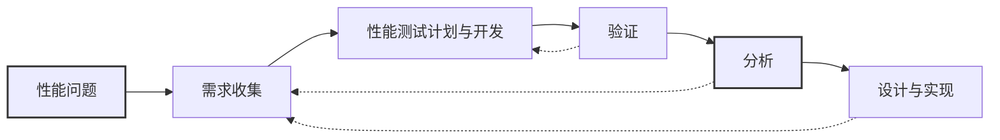

# 第5章 端到端Java性能优化：工程技术与微基准测试（JMH）

## 引言

欢迎来到我们Java虚拟机（JVM）性能工程之旅的关键阶段。本章标志着一个重要的转变——我们从理解Java的历史背景和基础结构，转向应用这些知识来优化性能。这为我们接下来深入探索OpenJDK HotSpot JVM的性能优化奠定了基础。

我们共同追溯了Java、其类型系统以及JVM的演进历程，目睹了Java从单体结构向模块化结构的转变。现在，我们准备将这些概念应用于性能优化这一至关重要的工作。

性能是任何软件应用成功的基石。它直接影响用户体验，决定了应用对用户交互的响应速度与流畅度。JVM作为Java应用的运行时环境，是这种性能的核心。通过学习和调整优化JVM，你可以显著提升Java应用的速度、响应能力和整体性能。这可能涉及调整内存和垃圾回收模式、使用优化后的代码或库、或者利用JVM即时编译（JIT）的能力和阈值等策略。掌握这些JVM优化技术是提升Java应用性能的宝贵技能。

基于我们之前对统一JVM日志接口的基础研究，现在我们能够探索性能指标，并思考如何有效测量和解读它们。在深入JVM的复杂性时，我们将考察它与硬件的交互、内存屏障的作用以及volatile变量的使用。我们还将深入探讨性能优化的完整过程，包括监控、性能分析、分析和调优。

本章超越了单纯的理论探讨，凝聚了超过二十年性能优化实战经验的精华。这里介绍了Java性能测量不可或缺的工具，以及多年来精心培养和打磨的诊断与分析方法。这种涉及对子系统进行详细调查以定位潜在问题的方法，为专注于性能优化的软件开发人员提供了至关重要的路线图。

我的旅程让我深刻理解底层硬件和软件栈对应用性能的巨大影响，因此本章着重揭示硬件与软件之间的相互作用。另一个专门的章节认识到基准测试的至关重要性——无论是评估特性发布的影响，还是分析不同系统层次的性能。我们将一起探索使用Java微基准测试框架（JMH）的实际应用。此外，我们还将了解JMH内置的性能分析器，例如`perfasm`，这是一个强大的工具，可以揭示代码的底层性能特征。

因此，本章不仅仅是理论和概念的集合。它是一本实践指南，充满了从广泛现场经验中汲取的示例和最佳实践。本章旨在弥合理论与实践之间的差距，为本书后续章节中详细的性能优化讨论奠定基础，确保读者具备踏上高级性能工程之旅的能力。

## 性能工程：软件工程的支柱

### 解读软件工程的层次

软件工程是一门综合性学科，包含两个截然不同却又相互交织的维度：（1）软件设计和开发，以及（2）软件架构需求。

软件设计和开发是我们在这段旅程中遇到的第一个维度。它涉及为系统制定详细的蓝图或方案，涵盖系统的架构、组件、接口以及其他显著特征。这些设计考虑为功能需求——定义系统应实现什么行为的规则——奠定了基础。功能需求包含了系统必须遵守的业务规则、应执行的数据操作以及应促进的交互。

相比之下，软件架构需求侧重于系统的非功能性或质量属性——通常被称为“ilities”（各种“性”）。这些需求概述了系统应如何表现，包括性能、可用性、安全性以及其他关键属性。

理解并在这两个维度之间取得平衡——在满足功能需求的同时确保高质量的属性——是软件工程的一个关键方面。有了这个基础理解，让我们聚焦于这些重要质量之一——性能。

### 性能：一项关键的质量属性

在各种架构需求中，性能占据着独特的地位。它衡量系统（称为“被测系统”，SUT）执行特定任务或“工作单元”（UoW）的有效程度。性能不仅仅是一个锦上添花的功能；它是一项基础质量属性。它影响着运营效率和用户体验，并在决定用户满意度方面起着关键作用。

要完全理解性能的概念，我们必须了解各种系统组件及其对性能的影响。在像JVM这样的托管运行时系统中，一个显著影响性能的关键组件是垃圾回收器（GC）。我用性能术语将GC的工作单元定义为“GC工作”，指每个GC必须执行以满足其性能要求的特定任务。例如，我将一类GC归类为“吞吐量最大化型”，以OpenJDK HotSpot VM中的Parallel GC为例，它专注于“并行工作”。相比之下，我定义的“低延迟优化型”回收器需要对其任务有更强的控制力，以保证亚毫秒级的暂停。因此，理解这些组件的各自属性和贡献至关重要，因为它们共同构成了系统性能的整体图景。

### 理解和评估性能

性能评估不仅仅是衡量系统运行快慢的度量。相反，它涉及理解SUT与UoW之间的交互。UoW可以是单个用户请求、一批请求或系统需要执行的任何任务。性能取决于SUT在不同条件下执行UoW的有效性和效率。它包括系统的资源利用率、吞吐量和响应时间等因素，以及这些参数随工作负载增加而变化的方式。

评估性能还需要与系统的用户互动，包括理解什么让他们满意，什么导致他们不满。他们的洞察可以揭示隐藏的性能问题或提出潜在的改进方向。性能不仅仅关乎速度——更关乎确保系统持续满足用户期望。

### 定义服务质量

服务质量（QoS）是一个广泛的术语，代表用户对服务性能和可用性的看法。在当今动态的软件环境中，使QoS与服务等级协议（SLA）保持一致，并融入现代站点可靠性工程（SRE）概念（如服务等级目标（SLO）和服务等级指标（SLI））至关重要。这些元素共同确保各方对满意性能的含义达成共识。

SLA定义了预期的服务水平，通常包括系统性能和可用性的指标。它们是服务提供商和用户之间关于预期性能标准的正式协议，提供了一个基准，用于衡量和评估系统的性能。

SLO是SLA中的具体、可衡量的目标，反映了期望的服务性能水平。它们是可靠性和可用性的目标，指导团队维持最佳服务水平。相比之下，SLI是用于评估服务相对于SLO性能的可量化度量。它们提供关于服务各个方面（如延迟、错误率或正常运行时间）的实时数据，允许持续监控和改进。

结合SLA、SLO和SLI来定义清晰、可量化的QoS指标，确保所有相关方对服务性能期望以及用于衡量这些期望的指标有全面且最新的理解。这种方法越来越被认为是管理应用可靠性的最佳实践，并且是现代软件开发和维护中不可或缺的一部分。

在完善我们对QoS的理解时，我融入了行业专家Stefano Doni的见解，他是Akamas公司的联合创始人兼首席技术官¹。Stefano关于纳入SRE概念（如SLO和SLI）的建议为我们讨论增添了显著的深度和相关性。

### 性能要求的成功标准

成功的性能不是一个“一刀切”的概念。相反，它应该根据可衡量、切合实际的标准来定义，这些标准反映了每个系统的独特要求和约束。这些标准可能包括响应时间、系统吞吐量、资源利用率等指标。定期针对这些标准进行监控和测量，有助于确保系统持续实现其性能目标。

在接下来的章节中，我们将探索衡量Java性能的具体指标，并强调硬件在塑造其效率方面的显著作用。这将为深入讨论并发性、硬件并行性以及弱排序系统的特性奠定基础，并自然过渡到基准测试的世界。

## 衡量Java性能的指标

性能指标对于理解应用在不同条件下的行为至关重要。这些指标提供了量化基础，用于衡量性能优化工作的成功与否。在Java性能优化背景下，采用了一系列广泛的指标来评估应用行为和效率的不同方面。这些指标涵盖从延迟（在刺激-响应背景下特别有洞察力）到可扩展性（评估应用处理增加负载的能力）等各个方面。效率、错误率和资源消耗是其他关键指标，它们提供了关于Java应用整体健康度和性能的洞察。

¹ Akmas专注于AI驱动的自主性能优化解决方案；www.akamas.io/about。


每个指标都提供了一个独特的视角，用于检查和优化Java应用程序的性能。例如，延迟指标在实时处理环境中至关重要，因为及时响应是首要需求。同时，可扩展性指标不仅对于评估应用程序当前应对增长和管理峰值负载的能力至关重要，而且对于确定其扩展因子（即应用程序在需求增加时有效扩展容量的度量）同样关键。这个扩展因子是容量规划的核心组成部分，因为它有助于预测维持和支持应用程序增长所需的资源与调整。通过理解当前的性能以及潜在的扩展场景，你可以确保应用程序保持健壮和高效，无缝适应当前和未来的运维挑战。  

评估响应性和延迟时，一个特别有洞察力的方面是理解应用程序中的调用链深度。调用链中的每个阶段都可能引入自身的延迟，并且这些延迟在链中传播时会累积和放大。这种效应意味着早期阶段的问题会显著加剧整体延迟，影响应用程序的端到端响应性。理解这种动态至关重要，尤其是在具有多个交互组件的复杂应用程序中。  

在Java生态系统中，这些指标不仅用于监控和优化生产环境中的应用程序，还在开发和测试阶段扮演关键角色。Java世界的工具和框架（如JMH）提供了专门的功能来测量和分析这些性能指标。  

就本书而言，尽管承认Java中各种性能指标的多样性和重要性，我们将集中讨论四个关键领域：**足迹**、**响应性**、**吞吐量**和**可用性**。选择这些指标是因为它们在Java应用程序中具有广泛的适用性和影响力：  

- **足迹**  
  足迹指的是运行软件所需的空间和资源。在资源有限的环境中，这是一个关键因素。足迹包含多个方面：  
  - **内存足迹**：软件执行期间消耗的内存量。这包括用于对象存储的Java堆以及JVM本身使用的本机内存。内存足迹涵盖运行时数据结构，这构成了应用系统足迹。JVM中的[[本机内存跟踪 (NMT)]] 在此可以发挥关键作用，提供关于本机内存分配与使用的详细洞察。这对于诊断Java堆之外潜在的内存效率低下或泄漏至关重要。在Java应用程序中，优化内存分配和垃圾收集策略是有效管理此足迹的关键。  
  - **代码足迹**：软件实际可执行代码的大小。大型代码库可能需要更多的内存和存储资源，影响系统的总体足迹。在托管运行时环境（如JVM提供的环境）中，代码足迹可能对进程产生直接影响，影响整体性能和资源利用率。  

  - **物理资源**：存储、网络带宽，特别是CPU使用等资源的消耗。CPU足迹，即应用程序消耗的CPU资源量，是性能和成本效益的关键因素，尤其是在云环境中。在Java应用程序的上下文中，GC算法的选择会显著影响CPU使用率。Stefano指出，适当优化GC算法有时可以将CPU使用率减半，从而在基于云的部署中节省大量成本。  

  足迹的这些方面会显著影响系统的效率和运维成本。例如，较大的足迹会导致启动时间更长，这在基于容器和无服务器架构的上下文中至关重要。在这种环境中，每个容器都包含应用程序及其依赖项，决定了特定的足迹。如果足迹很大，则可能导致效率低下，特别是在同一主机上运行多个容器的场景中。这种情况有时会引发“吵闹邻居”问题，即一个容器的资源密集型操作垄断系统资源，对其它容器的性能产生不利影响。因此，优化足迹不仅关乎提升单个容器的效率，还涉及管理资源争用，确保共享平台上更高效的资源使用。  

  在无服务器计算中，尽管资源管理是自动的，但足迹较大的应用程序可能会经历更长的启动时间，即“冷启动”。这可能影响无服务器函数的响应性，因此足迹优化对于更好的性能至关重要。类似地，对于大多数Java应用程序，内存足迹通常与GC的工作负载直接相关，从而影响性能。这在云环境和微服务架构中尤其如此，资源消耗直接影响响应性和运维开销，并需要仔细的容量规划。  

### 使用本机内存跟踪监控非堆内存  
基于我们之前关于JVM中NMT的讨论，让我们看看如何有效利用NMT来监控非堆内存。NMT为此提供了有价值的选项：摘要视图——提供总体使用情况的概览，以及详细信息视图——按各个调用点细分使用情况：  

```bash
-XX:NativeMemoryTracking=[off | summary | detail]
```  

> [!NOTE]  
> 启用NMT，尤其是在详细信息级别，可能会引入一些性能开销。因此，应谨慎使用，特别是在生产环境中。  

如需实时洞察，可使用`jcmd`获取运行时摘要或详细信息。例如，要获取摘要，使用以下命令：  

```bash
$ jcmd <pid> VM.native_memory summary
<pid>:
Native Memory Tracking:
(Omitting categories weighting less than 1KB)
Total: reserved=12825060KB, committed=11494392KB
-                 Java Heap (reserved=10485760KB, committed=10485760KB)
                            (mmap: reserved=10485760KB, committed=10485760KB) 
-                     Class (reserved=1049289KB, committed=3081KB)
                            (classes #4721)
                            (  instance classes #4406, array classes #315)
                            (malloc=713KB #12928) 
                            (mmap: reserved=1048576KB, committed=2368KB) 
                            (  Metadata:   )
                            (    reserved=65536KB, committed=15744KB)
                            (    used=15522KB)
                            (    waste=222KB =1.41%)
                            (  Class space:)
                            (    reserved=1048576KB, committed=2368KB)
                            (    used=2130KB)
                            (    waste=238KB =10.06%)
-                    Thread (reserved=468192KB, committed=468192KB)
                            (thread #456)
                            (stack: reserved=466944KB, committed=466944KB)
                            (malloc=716KB #2746) 
                            (arena=532KB #910)
-                      Code (reserved=248759KB, committed=18299KB)
                            (malloc=1075KB #5477) 
                            (mmap: reserved=247684KB, committed=17224KB) 
-                        GC (reserved=464274KB, committed=464274KB)
                            (malloc=41894KB #10407) 
                            (mmap: reserved=422380KB, committed=422380KB) 
-                  Compiler (reserved=543KB, committed=543KB)
                            (malloc=379KB #424) 
                            (arena=165KB #5)
-                  Internal (reserved=1172KB, committed=1172KB)
                            (malloc=1140KB #12338) 
                            (mmap: reserved=32KB, committed=32KB) 
-                     Other (reserved=818KB, committed=818KB)
                            (malloc=818KB #103) 
-                    Symbol (reserved=3607KB, committed=3607KB)
                            (malloc=2959KB #79293) 
                            (arena=648KB #1)
```  

**第122页**  
```bash
-    Native Memory Tracking (reserved=2720KB, committed=2720KB)
                            (malloc=352KB #5012) 
                            (tracking overhead=2368KB)
-        Shared class space (reserved=16384KB, committed=12176KB)
                            (mmap: reserved=16384KB, committed=12176KB) 
-               Arena Chunk (reserved=16382KB, committed=16382KB)
                            (malloc=16382KB) 
-                   Logging (reserved=7KB, committed=7KB)
                            (malloc=7KB #287) 
-                 Arguments (reserved=2KB, committed=2KB)
                            (malloc=2KB #53) 
-                    Module (reserved=252KB, committed=252KB)
                            (malloc=252KB #1226) 
-                 Safepoint (reserved=8KB, committed=8KB)
                            (mmap: reserved=8KB, committed=8KB) 
-           Synchronization (reserved=1195KB, committed=1195KB)
                            (malloc=1195KB #19541) 
-            Serviceability (reserved=1KB, committed=1KB)
                            (malloc=1KB #14) 
-                 Metaspace (reserved=65693KB, committed=15901KB)
                            (malloc=157KB #238) 
                            (mmap: reserved=65536KB, committed=15744KB) 
-      String Deduplication (reserved=1KB, committed=1KB)
                            (malloc=1KB #8)
```  

如你所见，该命令生成了全面的报告，按各个JVM组件（如Java堆、类、线程、GC和编译器区域等）分类内存使用情况。输出还包括保留和已提交的内存，有助于理解不同JVM子系统如何分配和使用内存。你还可以获取详细信息级别或摘要视图的差异（diff）。  

### 缓解足迹问题  
为解决与足迹相关的挑战，从NMT、GC日志、JIT编译数据和其他JVM统一日志输出中获得的见解可以为各种缓解策略提供依据。主要方法包括：  

- **数据结构优化**：通过分析使用模式并选择更适合应用程序可预测数据模式的轻量级、节省空间的替代方案，优先考虑内存高效的数据结构。这种方法确保最佳内存利用。  
- **代码重构**：精简代码以减少冗余内存操作并优化算法效率。减少对象创建、优先使用基本类型而非装箱类型、优化字符串处理是减少内存使用的关键策略。

## 衡量Java性能的指标

### 响应性

延迟和响应性虽然相关，但揭示的是系统性能的不同维度。延迟衡量从接收到刺激（如用户请求或系统事件）到生成并交付响应所经过的时间。它是一个关键指标，但仅捕捉了性能的一个维度。

而响应性则超越了单纯的反应速度。它评估系统在不同负载条件下如何适应，并随时间维持性能，提供对系统敏捷性和运营效率的整体视图。它涵盖了系统及时对输入做出反应并执行必要操作以生成响应的能力。

在评估系统响应性时，先前讨论的[[服务等级目标|SLO]]和[[服务等级指标|SLI]]概念变得尤为重要。通过为响应时间设定明确的SLO，你确立了系统旨在达到的性能基准。评估响应性时，请考虑以下关键问题：

-   目标响应时间是多少？
-   在什么条件下允许响应时间超过目标基准？允许超出多少？
-   系统能承受多长时间的延迟？
-   响应时间在哪里测量：客户端、服务器端，还是端到端？

针对这些问题建立SLI，可以设定清晰、可量化的基准，以衡量系统相对于SLO的实际性能。追踪这些指标有助于识别任何偏差，并指导你的优化工作。可以使用JMeter、LoadRunner以及自定义脚本等工具在不同负载条件下测量响应性，并持续监控SLI，从而洞察系统在多大程度上维持了SLO设定的性能标准。

### 吞吐量

吞吐量是另一个关键指标，量化了系统在单位时间内能处理的操作数量。在需要处理大批量事务或数据的环境中，它至关重要。例如，我在为一家大型电商平台提供性能咨询时，凸显了在假日促销等高峰期最大化吞吐量的重要性。这些时段可能导致流量显著激增，因此系统需要能够扩展资源以维持高吞吐量水平，并“保持尾部延迟的4个9”（即，在指定时间范围内完成99.99%的请求）。通过这样做，平台才能提供增强的用户体验并确保业务成功运营。

了解系统的扩展能力在这些情况下至关重要。扩展策略可涉及水平扩展（即向外扩展），即增加更多系统以分散负载；以及垂直扩展（即向上扩展），即增强现有系统的能力。例如，对于该电商平台在假日促销活动期间，采用有效的扩展策略至关重要。云环境通常能提供灵活性，以便有效实施此类策略，允许根据变化的需求动态分配资源。

### 可用性

可用性是衡量系统正常运行时间的指标——本质上，是指系统功能正常且可访问的频率。常用的衡量指标包括平均故障间隔时间（MTBF）。高可用性对于维持用户满意度和满足[[服务等级协议|SLA]]通常至关重要。其他重要指标包括平均恢复时间（MTTR），它指示从故障中恢复所需的平均时间；以及冗余度量，例如集群中故障转移实例的数量。这些可以提供关于系统弹性（韧性）的额外洞察。

在我为一家大型分布式数据库公司担任性能顾问时，高可用性是一个主要关注点。该公司专门为数据仓库和机器学习开发向外扩展架构，利用Hadoop处理海量数据集。实现高可用性需要强大的回退系统以及可扩展性和冗余策略。例如，在我们基于Hadoop的系统中，我们通过在集群内维护多个故障转移实例来确保高可用性。这种设置允许在故障发生时无缝地切换到备份实例，从而最大限度地减少停机时间。这种冗余不仅对持续服务至关重要，而且对于维持峰值负载期间的高吞吐量等性能指标也至关重要，确保系统能够处理大量请求或数据而不会出现性能下降。

此外，高可用性对于保持一致的响应性至关重要，能够从故障中迅速恢复，即使在不理想的条件下也能保持响应时间稳定。在数据库系统中，提升可用性意味着增加跨集群的故障转移实例，并使其多样化以获得更高的冗余性。经过严格测试，该策略确保在中断期间能够平滑、自动地进行故障转移，维持不间断的服务和用户信任。

特别是在大规模系统中（例如基于Hadoop生态系统的系统——其强调HDFS用于数据存储、YARN用于资源管理或HBase用于NoSQL数据库能力），理解和规划回退系统至关重要。此类系统的停机可能严重影响业务运营。这些系统设计为具有弹性，能够无缝接管操作以维持持续服务，这是用户满意度不可或缺的一部分。

通过我的经验，我认识到实现高可用性是一项复杂的平衡工作，需要周密的规划、稳健的系统设计以及持续的监控，以确保系统弹性并维护用户的信任。云部署可以极大地帮助实现这种平衡。凭借其内置的自动化故障转移和冗余程序，云服务巩固了系统抵御意外停机的能力。这种适应性，加上按需扩展资源的灵活性，在峰值负载期间至关重要，确保在各种条件下实现高可用性。

总之，实现高可用性超越了技术执行；它是构建可靠系统、持续满足并超越用户期望的承诺。这种奉献精神在我们数字时代至关重要，不仅需要像云部署这样的先进解决方案，还需要对系统架构采取整体方法。它涉及整合优先考虑无缝服务连续性的战略性设计原则，反映了对可靠性和卓越性能的全面承诺。

### 深入探讨响应时间与可用性

[[服务等级协议|SLA]]在设定响应时间基准方面至关重要。它们可能包含诸如平均响应时间、最大（最坏情况）响应时间、第99百分位响应时间以及其他高百分位（通常称为“4个9”和“5个9”）等指标。

对不同系统的响应时间进行可视化呈现可以揭示重要的见解。特别是，捕捉最坏情况可以识别出在查看平均或最佳情况时可能被忽视的潜在可用性问题。例如，考虑表5.1，其中列出了四个不同系统的记录响应时间。

**表5.1 示例：监控响应时间**

| 系统 | GC事件数 | 最小值（毫秒） | 平均值（毫秒） | 第99百分位（毫秒） | 最大值（毫秒） |
|:----|:--------|:------------|:------------|:----------------|:------------|
| 系统1 | 36,562 | 7.622 | 310.415 | 945.901 | 2932.333 |
| 系统2 | 34,920 | 7.258 | 320.778 | 1006.677 | 2744.587 |
| 系统3 | 36,270 | 6.432 | 321.483 | 1004.183 | 1681.305 |
| 系统4 | 40,636 | 7.353 | 325.670 | 1041.272 | 18,598.557 |

对表5.1中最小值、平均值和第99百分位响应时间的初步检查可能不会立即引起关注。然而，系统4的最大响应时间显示暂停长达约18.6秒，这值得深入调查。最初，如此长的暂停时间可能暗示垃圾回收（GC）效率低下，但也可能源于更广泛的系统延迟问题，可能在高度可用的分布式系统中触发故障转移机制。理解这一场景至关重要，因为频繁发生会严重影响MTBF和MTTR，使这些指标超出可接受的阈值。

这个例子强调了在评估响应时间时捕捉和评估最坏情况的重要性。有助于分析和解决此类性能问题的工具包括系统和应用程序分析器，如Intel VTune、Oracle Performance Analyzer、Linux perf、VisualVM<sup>2</sup>、Java Mission Control<sup>3</sup>等。使用这些工具有助于诊断影响响应性的系统性性能瓶颈，从而能够进行有针对性的优化以增强系统可用性。

> [!NOTE]
> 2: https://visualvm.github.io/
> 3: https://jdk.java.net/jmc/8/

### 响应时间的机制与应用程序时间线

为了更好地理解响应时间，请考虑图5.1，其中描绘了一个应用程序时间线。时间线展示了两个关键事件：刺激S<sub>0</sub>在时间T<sub>0</sub>到达，以及应用程序在时间T<sub>1</sub>发送回响应R<sub>0</sub>。接收到刺激后，应用程序继续工作（A<sub>cw</sub>）以处理这个新刺激，然后在时间T<sub>1</sub>发送回响应R<sub>0</sub>。刺激到达之前发生的工作记为A<sub>w</sub>。因此，图5.1说明了在应用程序工作上下文中的响应时间概念。

![[Pasted image 20260505195125.png]]

**图5.1  应用程序时间线，显示刺激到达和响应发送的时间点**

### 在暂停上下文中理解响应时间与吞吐量

停止世界（STW）暂停指的是所有应用程序线程被挂起的时间段。这些暂停（垃圾回收过程中必需的）会中断应用程序工作，并影响响应时间和吞吐量。考虑STW暂停上下文中的应用程序时间线，可以帮助我们更好地理解此类事件如何影响响应时间和吞吐量。

让我们考虑一个场景：STW事件中断了应用程序的连续工作（A<sub>cw</sub>）。在图5.2中，未中断的A<sub>cw</sub>的两个部分——A<sub>cw0</sub>和A<sub>cw1</sub>——被STW事件分隔开。在这个改变后的时间线中，原本在未中断场景下应在时间T<sub>1</sub>发送的响应R<sub>0</sub>现在被延迟到时间T<sub>2</sub>。这导致响应时间延长。

![[Pasted image 20260505195156.png]]

**图5.2  在存在STW事件的情况下，响应时间被延长，从T<sub>1</sub>延迟到T<sub>2</sub>**


## 衡量Java性能的指标

通过并排比较两条时间线（无中断与有中断），如图5.3所示，我们可以量化这些STW事件的影响。让我们关注两个关键指标：相同时间段内完成的总工作量以及吞吐量。

1. **已完成的工作：**
   - 在无中断场景中，已完成的总工作量为 `Acw`。
   - 在有中断场景中，已完成的总工作量为 `Acw0` 与 `Acw1` 之和。

2. **吞吐量（Wd）：**
   - 对于无中断时间线，吞吐量（`Wda`）计算公式为：已完成的工作量（`Acw`）除以从刺激到达到响应分发的时长（`T1 – T0`）。
   - 对于有中断时间线，吞吐量（`Wdb`）计算公式为：各段已完成工作量之和（`Acw0 + Acw1`）除以相同时长（`T1 – T0`）。

由于STW暂停造成的中断导致 `Acw0 + Acw1` 小于 `Acw`，因此 `Wdb` 将低于 `Wda`。这有效地说明了在从 `T0` 到 `T1` 的响应窗口内吞吐量的下降，凸显了STW事件如何影响应用程序处理任务的效率，并最终延长响应时间。

通过对响应时间、吞吐量、资源占用和可用性的探索，我们清楚地意识到，优化软件只是提升系统性能的一个方面。在我们深入软件子系统的细微差别时，我们认识到影响系统“性”的组件不仅限于软件层。JVM和应用程序运行的硬件基础在塑造整体性能和可靠性方面同样起着关键作用。
 
![[Pasted image 20260505195249.png]]

**图5.3 并排比较，突出显示已完成的工作与吞吐量**

## 硬件在性能中的作用

在我们探索JVM性能的过程中，我们已经涉及了关键的软件指标，如响应性、吞吐量等。在这些软件复杂性的背后，还有一个关键维度：底层硬件。

尽管软件创新吸引了众多关注，但硬件在塑造性能方面的作用同样至关重要。随着云架构的发展，硬件的战略重要性日益凸显，供应商正在针对性能和成本效益进行优化。

考虑从数据中心到云环境的各类环境，硬件变更（例如处理器架构调整或增加处理核心）的影响是深远的。这些修改如何影响性能指标或系统弹性，促使我们进行更深入的研究。这样的探究不仅增强了我们对硬件影响性能的理解，还指导了有效的硬件栈修改，强调了在追求技术效率时软件与硬件优化之间需要采取平衡的方法。

基于硬件在系统性能中的关键作用，让我们考虑一个使用Netty的容器化Java应用场景，Netty以其高性能和非阻塞I/O能力而闻名。虽然Netty擅长管理并发连接，但其有效性不仅限于软件优化，还包括如何与云基础设施集成，以及在容器环境约束下利用底层硬件的能力。

容器化引入了其自身的性能考量，包括资源隔离、开销以及宿主机系统内潜在的密度相关问题。部署在云平台上的此类应用程序需要穿越一个多层架构：从虚拟机监控程序和虚拟机，到管理资源、扩展和健康状态的容器编排。每一层都会引入影响数据传输、延迟和吞吐量的复杂性。

理解云和容器化环境的复杂性对于优化应用程序性能至关重要，这需要在软件能力、硬件资源和中间堆栈之间进行战略平衡。这种对优化的追求还受到全球技术标准和法规的进一步影响，这些标准和法规强调了安全性、数据保护和能效的重要性。这些标准推动合规性，并促进硬件层面的创新，从而增强虚拟化堆栈和整体系统效率。

当我们进入这一节时，我们的关注点扩展到硬件与软件之间的共生关系，强调从数据处理机制到内存管理策略的硬件细微差别如何影响应用程序的性能。这为后续章节的全面探讨奠定了基础。

### 解码硬件-软件动态

为了最大化应用程序的性能，理解代码与底层硬件之间复杂的相互作用至关重要。虽然软件提供了用户界面和功能，但硬件在决定运行速度方面起着关键作用。如果这种关键关系没有适当协调，就可能导致潜在的性能瓶颈。

硬件的特性，如CPU速度、内存可用性和磁盘I/O，直接影响应用程序处理任务的速度和效率。开发人员和系统架构师必须了解硬件的能力和限制。例如，为多核处理器优化的应用程序在单核设置下可能无法高效运行。此外，微架构的复杂性、多样化的子系统以及云环境引入的变量，都可能进一步复杂化扩展过程。

深入研究硬件与软件的交互，我们会发现复杂性，尤其是在硬件架构和线程行为等领域。例如，在理想世界中，多个线程可以无缝地访问共享内存结构，和谐地工作而没有任何冲突。这种场景如图5.4所示，受Maranget等人 *A Tutorial Introduction to the ARM and POWER Relaxed Memory Models*[^4] 启发，虽然理想，但往往理论强于实践。

[^4]: www.cl.cam.ac.uk/~pes20/ppc-supplemental/test7.pdf

![[Pasted image 20260505195321.png]]

**图5.4 线程1到n无障碍访问共享内存结构（灵感来自Luc Maranget, Susmit Sarkar, 和 Peter Sewell 的 A Tutorial Introduction to the ARM and POWER Relaxed Memory Models）**

然而，真实的计算世界充满了扩展和并发挑战。共享内存管理通常需要诸如锁之类的机制来确保数据有效性。这些机制虽然必不可少，但可能引入复杂性。借鉴Doug Lea的 *Concurrent Programming in Java: Design Principles and Patterns*[^5]，线程在访问对象时争夺锁的情况并不少见（图5.5）。这种竞争可能导致一个线程无意中阻塞其他线程，导致执行延迟和潜在的性能下降。

[^5]: Doug Lea. *Concurrent Programming in Java: Design Principles and Patterns*, 2nd ed. Boston, MA: Addison-Wesley Professional, 1999.

![[Pasted image 20260505195338.png]]

**图5.5 线程2锁定对象1并移动到对象2中的helper（灵感来自Doug Lea的 *Concurrent Programming in Java: Design Principles and Patterns*, 2nd ed.）**

这种理想化愿景与现实之间的差异，强调了硬件-软件交互中错综复杂的相互作用和固有挑战。线程、共享内存结构以及管理它们交互的机制（锁或无锁数据结构和算法）正是这种复杂性的证明。正是这种分歧强调了深入理解硬件如何影响应用程序性能的必要性。

### 性能交响曲：语言、处理器与内存模型

在最佳状态下，性能是由所使用的编程语言、处理器的能力以及它们遵循的内存模型共同谱写的一首和谐乐章。这种性能的交响曲正是我们本节要揭示的。

#### 并发：核心机制

并发是指同时执行多个任务或进程。它是现代计算中的一个基本概念，允许提高效率和响应能力。从应用程序的角度来看，理解并发对于设计能够同时处理多个用户或任务的系统至关重要。对于Web应用程序，这可能意味着无延迟地为多个用户提供服务。误解并发可能导致死锁或竞态条件等问题。

#### 共生关系：硬件与软件的相互作用

- **超越硬件：** 虽然强大的硬件可以提升性能，但只有当软件针对该硬件进行优化时，才能释放真正的潜力。这种优化受到编程语言的选择、语言与处理器的兼容性以及遵循特定内存模型的影响。
- **语言与处理器：** 不同的编程语言具有不同的抽象级别。有些语言更接近硬件交互，而另一些则优先考虑开发者便利性。挑战在于确保代码在这个范围内得到优化，使其在目标处理器架构上表现良好。

#### 内存模型：沉默的催化剂

- **平衡一致性与性能：** 内存模型定义了线程如何看待内存操作。它们在确保所有线程具有一致的内存视图和允许某些重排序以获得性能提升之间取得微妙的平衡。
- **语言特性：** 不同的语言带有各自的内存模型。例如，Java的内存模型强调特定的操作顺序，以维护线程间的一致性，即使这意味着牺牲一些性能。相比之下，C++11及更新版本提供了比Java更细粒度的内存排序控制。

### 增强性能：优化和谐

#### 硬件感知编程

要真正驾驭硬件的威力，我们必须超越语言的抽象。这涉及理解缓存层次结构、优化数据结构以实现缓存友好设计，并了解处理器的能力。以下是在不同缓存级别上的具体实践：

- **针对CPU缓存效率进行优化**：将数据结构与缓存行对齐，以最小化缓存未命中并加速访问。重要策略包括管理“真共享”——通过确保同一缓存行上的共享数据被高效访问来最小化性能影响——以及避免“伪共享”，即同一行上的无关数据导致失效。利用硬件预取（根据预期用途预加载数据）可改善空间和时间局部性。
- **应用级缓存策略**：在软件/应用层面实现缓存需要仔细考虑硬件可扩展性。例如，可用RAM决定了可以保留在内存中的数据量。关于缓存什么以及保留多久的决策，依赖于对硬件能力的细致理解，并遵循空间和时间局部性原则。
- **数据库与Web缓存**：数据库使用内存来缓存查询和结果，其性能与硬件资源相关联。类似地，通过内容分发网络（CDN）进行的Web缓存涉及地理分布的联网服务器，将内容缓存到更靠近用户的位置，从而减少延迟。软件定义网络（SDN）可在缓存策略中优化硬件使用，以提高内容分发效率。

#### 掌握内存模型

深入理解语言的内存模型可以防止并发问题并解锁性能优化。内存模型规定了内存与多个执行线程之间交互的规则。对这些模型的细致理解可以显著缓解并发相关问题，如可见性问题与竞态条件，同时为性能优化开辟途径。

- **Java内存模型**：在Java中，掌握happens-before关系的细节至关重要。这一概念确保了不同线程间操作的内存可见性和排序。通过掌握这些关系，开发者可以编写可扩展的线程安全代码，而无需过度同步。理解如何有效利用volatile变量、原子操作和同步块，可以带来显著的性能提升，尤其是在多线程环境中。
- **对软件设计的影响**：对内存模型的了解影响着关于线程间数据共享、锁使用以及无锁算法实现的决策。它使得同步策略更具策略性，帮助开发者为每种场景选择最合适的技术。例如，在低延迟系统中，避免使用重量级锁而采用无锁数据结构可能至关重要。

硬件在性能中的作用 133

在探讨了有助于构建高效且弹性的并发软件的硬件和内存模型的细微差别之后，下一步是深入探究内存模型的具体细节。

### 内存模型：解读线程动态与性能影响

内存模型概述了线程通过共享内存进行交互的规则，并决定了值在线程之间如何传播。这些规则对系统性能有重大影响。在理想的计算机世界中，我们会设想一个顺序一致性共享内存系统。这样的系统能确保操作按照原始程序顺序的精确序列执行，即所谓的单一全局执行顺序，从而产生一个顺序一致性机器。

例如，考虑这样一个场景：程序顺序规定线程2总是首先获得对象1上的锁，从而每次在线程2转向对象2中的辅助方法时有效阻塞线程1。这可以通过两个互补的图解表示来可视化：序列图和甘特图。

图5.6所示的序列图提供了线程与对象之间交互的详细视图。它展示了线程1以锁前操作开始其进程，紧接着线程2获取对象1上的锁。线程2随后对对象2的工作以及最终释放对象1上的锁，以清晰、顺序的方式描绘出来。与此同时，线程1进入等待状态，展示了它对线程2所持锁的依赖。一旦线程2释放锁，线程1获取该锁，继续对对象2进行操作，然后释放锁，完成其操作序列。

作为序列图的补充，图5.7所示的甘特图在一个时间线上展示了全局执行顺序。它呈现了每个线程与对象交互的起始点和结束点，捕捉了顺序一致性的本质。甘特图标记了线程1的等待周期（与线程2的独占访问周期重叠），然后展示了锁释放后线程1动作的继续。

通过将全局执行时间线与程序顺序时间线结合起来，我们可以观察到直接、顺序化的事件流。这种可视化符合顺序一致性机器的原理：尽管线程操作具有并发性，但系统行为就像存在一个单一、全局的良序事件序列。因此，这些图有助于我们加深对顺序一致性的理解。


![[Pasted image 20260505195444.png]]

**图5.6  顺序一致性共享内存模型中线程操作的序列**

![[Pasted image 20260505195518.png]]

**图5.7  线程交互的全局执行时间线**

硬件在性能中的作用 135

尽管图5.6、图5.7及讨论勾勒了一个理想化的顺序一致性系统，但现实世界中的当代计算系统通常遵循更宽松的内存模型，如全存储顺序（TSO）、部分存储顺序（PSO）或释放一致性。这些模型与各种硬件优化策略（如存储/写缓冲、乱序执行）结合使用时，可以带来性能提升。然而，它们也引入了观察到操作偏离编程顺序的可能性，从而可能导致不一致。

以存储缓冲的概念为例：线程可能在自身的写操作对其他线程可见之前就观察到这些写操作，这会扰乱操作的感知顺序。为了说明这一点，让我们通过一个包含两个线程（或进程）p0和p1的存储缓冲例子来探索。初始时，内存中有两个共享变量X和Y，均设为0。此外，我们有foo和bar，它们是分别存储在p0和p1寄存器中的局部变量：

```
p0                  p1 
a: X = 1;           c: Y = 1;
b: foo = Y;         d: bar = X;
```

在理想的顺序一致性环境中，foo和bar的值由操作的可能组合顺序决定，这些顺序可以包括{a,b,c,d}、{c,d,a,b}、{a,c,b,d}、{c,a,b,d}等。在这种场景下，foo和bar都不可能是零，因为每个线程内的操作保证按发布顺序被观察到。

然而，有了存储缓冲，线程可能会在自身的写操作被其他线程看到之前就感知到它们。这可能导致foo和bar都为零的情况，因为p0对X的写入（a: X = 1）可能在p1注意到之前就被p0自己识别，同样p1对Y的写入（c: Y = 1）也是如此。

尽管这种行为可能导致偏离预期顺序的不一致性，但这些优化对于提升系统性能至关重要，为更快的处理时间和更高的效率铺平了道路。此外，缓存一致性协议（如MESI和MOESI[^1]）在维护处理器缓存间一致性方面发挥着关键作用，进一步复杂化了内存模型的面貌。

总之，我们对内存一致性模型的探索为理解JVM内并发操作的复杂性奠定了基础。对于从事Java和JVM性能调优工作的人来说，掌握这些模型的实践现实和基本原理解至关重要，因为它们影响着我们并发程序的流畅和高效执行。

随着我们继续前进，我们将进一步探索硬件世界。特别是，我们将讨论具有分层内存结构的多处理器线程或核心，以及Java内存模型（JMM）的构造。我们将涵盖volatile变量的使用——JMM用于构建线程安全应用的关键特性——并探讨内存屏障和栅栏等概念如何在并发Java环境中贡献于可见性和排序。

此外，非统一内存访问（NUMA）的概念在考虑可变内存延迟系统上的Java应用性能时变得越来越相关。

[^1]: https://redis.com/glossary/cache-coherence/


### 并发硬件：穿越迷宫

在并发硬件系统的版图中，我们必须穿越多个处理器核心的复杂层次，每个核心都有自己的层次化内存结构。

#### 同步多线程与核心利用

多处理器核心可以实现同步多线程（SMT），这是一项旨在通过允许单核上同时执行多个硬件线程来提高CPU效率的技术。这种单核内的并发设计旨在更好地利用CPU资源：当某个线程等待I/O操作或其他长延迟指令时，空闲的CPU核心可以被另一个硬件线程使用。

与此相对的是利用完整核心的情况，每个线程运行在独立的物理核心上，拥有专用的计算资源。此时JVM面临一组不同的性能考量。完整核心为每个线程提供对核心资源的完全控制，降低争用，并可能提升计算密集型任务的性能。在这样的环境中，JVM的垃圾回收和线程调度可以确保无阻碍地访问这些资源，从而定制策略以最大化每个核心的效率。

然而，在使用超线程（SMT）的领域中，JVM面临更复杂的场景。它必须认识到线程可能无法独占核心的所有资源。这种共享环境可以提高多线程应用的吞吐量，但也可能引入更高的资源争用概率。JVM的线程调度器和GC必须适应这一现实，平衡工作负载分布和GC流程，以适应SMT的微妙之处。

选择利用完整核心还是超线程，与Java应用的性质密切相关。对于I/O密集型或多线程工作负载（可以利用空闲CPU周期），超线程可能提供吞吐量优势。相反，对于需要持续密集计算的CPU密集型进程，完整核心可能提供最佳性能结果。

当我们深入探讨这些硬件特性对JVM性能的影响时，必须认识到使软件策略与底层硬件能力相一致的极端重要性。无论是优化针对完整核心的专用资源，还是针对SMT的并发执行环境，最终目标始终如一：增强Java应用在这些并发硬件系统中的性能和响应能力。

#### 高级处理器技术与内存层次结构

现代处理器的复杂性超越了SMT和完整核心利用的范畴。在这些高级系统中，核心拥有自己独特的缓存层次结构，以维护跨多个处理单元的缓存一致性。每个核心通常拥有一个1级指令缓存（L1I$）、一个1级数据缓存（L1D$）和一个私有2级缓存（L2）。缓存一致性是一种机制，确保所有核心拥有内存的一致视图。本质上，当一个核心更新其缓存中的某个值，其他核心会得知这一变化，从而防止它们使用过期或不一致的数据。

在此设置中还包括一个通常所有核心共享的末级缓存（LLC），以促进它们之间的高效数据共享。此外，一些高性能系统在LLC旁边或代替LLC使用系统级缓存（SLC），以进一步优化数据访问时间或满足特定计算需求。

为了最大化性能，这些处理器采用了先进技术。例如，乱序执行允许处理器在数据可用时立即执行指令，而不是严格遵循原始程序顺序。这最大化资源利用率，提升处理器效率。

此外，如前所述，处理器使用加载和存储缓冲区来管理进出内存的数据传输。这些缓冲区临时保存内存操作（如加载和存储）的数据，允许CPU继续执行其他指令，而无需等待内存操作完成。这一机制平滑了快速CPU寄存器与相对较慢内存之间的数据流，有效弥合速度差距，优化处理器性能。

内存层次结构的核心是一个内存控制器，负责管理系统中的双倍数据速率（DDR）内存条，协调进出物理内存的数据流。图5.8展示了一个包含所有上述组件的全面硬件配置。

内存一致性（即一个处理器的内存变化如何被其他处理器感知）在不同硬件架构上各不相同。在一个极端，是采用强内存一致性模型的架构，如x86-64和SPARC使用TSO。7 相反，Arm v8-A架构采用更宽松的模型，允许更灵活的内存操作重排序。这种灵活性可带来更高性能，但要求程序员在使用同步原语时更加谨慎，以避免多线程应用中的意外行为。8

为了说明挑战，考虑前面讨论的涉及两个变量X和Y（均初始为0）的存储缓冲区示例。在像x86-64这样的TSO架构中，使用存储缓冲区可能导致foo和bar均为0——如果线程P1在P2对Y的写入变得可见之前读取Y，同时P2在P1对X的写入被P2看到之前读取X。在Arm v8中，硬件还可能重排序操作，潜在地导致比TSO所允许的更意想不到的结果。

7 https://docs.oracle.com/cd/E26502_01/html/E29051/hwovr-15.html
8 https://community.arm.com/arm-community-blogs/b/infrastructure-solutions-blog/posts/synchronization-overview-and-case-study-on-arm-architecture-563085493

![[Pasted image 20260505195549.png]]

 **图5.8　一个现代硬件配置**

在穿越高级处理器技术和内存层次结构的迷宫时，我们实际上只揭开了故事的一半。这些硬件优化的真正功效在于它们与运行其上的软件有效地同步。作为开发者和系统架构师，我们的挑战是确保我们的软件不仅利用而且补充这些复杂的硬件能力。

为此，像屏障和栅栏这样的软件机制可以补充并利用这些硬件特性。这些指令强制执行有序约束，确保多线程环境中的操作以尊重硬件内存模型的方式执行。这一理解对于Java性能工程至关重要，因为它使我们能够制定优化Java应用在复杂计算环境中性能的软件策略。在理解Java内存模型和并发挑战的基础上，让我们更仔细地审视这些软件策略，探讨它们如何与硬件协同工作，以优化基于Java的系统的效率和可靠性。

### 并发计算中的顺序机制：屏障、栅栏和volatile

在并发计算的复杂世界中，屏障、栅栏和volatile作为关键工具，用于维护顺序并确保数据一致性。这些机制通过阻止某些可能导致意外后果或意外结果的重排序而起作用。

#### 屏障

屏障是一种同步机制，用于并发编程中阻止特定类型的重排序。本质上，屏障就像程序中的一个检查点或同步点。当某个线程到达屏障时，它无法通过，直到所有其他线程也都到达该屏障。在内存操作的语境中，内存屏障阻止跨越屏障的读写操作（加载和存储）的重排序。这有助于维护多线程环境中共享数据的一致性。

#### 栅栏

屏障提供了一个宽泛的同步点，而栅栏则更针对内存操作。它们强制执行顺序约束，确保某些操作在其他操作开始之前完成。例如，一个store-load栅栏确保程序顺序中出现在栅栏之前的所有存储操作（写）在栅栏之后的任何加载操作（读）之前对其他线程可见。

#### Volatile

在像Java这样的语言中，`volatile`关键字提供了一种确保跨线程变量的可见性和顺序性的方式。对于volatile变量，对该变量的写操作对于之后读取该变量的所有线程都是可见的，提供了happens-before保证。相反，非volatile变量不具备`volatile`关键字所保证的交互性。因此，编译器可以使用非volatile变量的缓存值。

### 深入原子性：Java内存模型与Happens-Before关系

原子性确保操作要么完全执行，要么完全不执行，从而维护数据完整性。JMM对于在多线程语境中理解这一概念至关重要。它提供了可见性和顺序性保证，确保原子性并建立happens-before关系以实现可预测的执行。当一个动作happens-before另一个动作时，第一个动作不仅对第二个动作可见，而且在其之前排序。这种关系确保在多线程环境中执行的Java程序行为可预测且一致。

让我们考虑一个实际例子来演示这些概念的作用。Java中的`AtomicLong`类是一个典型的例子，展示了原子操作如何实现并在多线程语境中使用，以维护数据完整性和可预测性。`AtomicLong`通过底层同步技术确保对long值的原子操作，这些操作作为单一的、不可分割的工作单元。这一特性保护它们免受并发操作的潜在干扰或中断。这样的原子操作构成了同步的基础，即使在激烈的多线程场景中也确保系统范围内的连贯性。

```java
AtomicLong counter = new AtomicLong();
```

void incrementCounter() {
140  
Chapter 5  End-to-End Java Performance Optimization  
    counter.incrementAndGet();  
}  

在这段代码片段中，`AtomicLong` 类的 `incrementAndGet()` 方法展示了原子操作。它将计数器的递增（`counter++`）和获取（`get`）合并为单个操作。这种原子性在多线程环境中至关重要，因为它能防止其他线程在操作过程中观察到或干扰处于不一致状态的计数器。  

`AtomicLong` 类利用一种底层技术来确保这种顺序。它使用基于 CPU 指令的比较并交换循环，这些循环实际上起到了内存屏障的作用。这种由屏障保证的原子性是并发编程的基本要素。随着我们的深入，我们将进一步探讨这些概念如何支撑性能工程与优化。  

让我们再考虑一个实际例子来说明这些概念，这次涉及一个假设的 `DriverLicense` 类。这个例子展示了 Java 中如何使用 `volatile` 关键字来确保变量跨线程的可见性和顺序：  

```java
class DriverLicense {
    private volatile boolean validLicense = false;
 
    void renewLicense() {
        this.validLicense = true;
    }
 
    boolean isLicenseValid() {
        return this.validLicense;
    }
}
```

在这个例子中，`DriverLicense` 类作为管理驾驶执照状态的模型。当执照被续期（通过调用 `renewLicense()` 方法）时，`validLicense` 字段被设置为 `true`。当前状态可通过 `isLicenseValid()` 方法验证。  

`validLicense` 字段被声明为 `volatile`，这保证了当一个线程中执照被续期后（例如在线续期），新状态会立即对所有其他线程可见（例如检查执照状态的警察）。如果没有 `volatile` 关键字，由于 JVM 或系统执行的各种缓存或重排序优化，其他线程可能无法立即看到更新后的执照状态。  

在实际应用中，错误理解或不当实现这些机制可能导致严重后果。例如，一个电商平台如果没有正确处理并发事务，可能对客户重复收费或无法正确更新库存。对于开发者而言，在设计依赖多线程的应用程序时，理解这些机制至关重要。正确使用它们可以确保任务按正确顺序完成，防止潜在的数据不一致或错误。  

随着我们继续深入，我们将通过有效的线程管理和同步技术来探索运行时性能。具体来说，第 7 章“运行时性能优化：聚焦字符串、锁及其他”不仅会介绍高级同步和锁定机制，还会引导我们使用并发工具。通过利用这些并发框架的优势，结合对底层硬件行为的基础理解，我们将装备一套全面的工具包，以掌握并发系统中的性能优化。  

## 多处理器系统中的并发内存访问与一致性  

在我们探讨内存模型及其对线程动态的深远影响时，我们揭示了在多处理器系统中处理内存访问时出现的复杂挑战。当多个核心或线程同时访问和修改共享数据时，这些挑战更为严峻。在这种情况下，确保一致性和高效的内存访问至关重要。  

在多处理器系统中，线程经常与不同的内存控制器交互。尽管并发内存访问是这些系统的一个标志，但内置的一致性机制能够防止数据不一致。例如，即使一个核心更新了某个内存位置，一致性协议也会确保所有核心对数据有一致的视图。这消除了核心可能访问过期值的情况。这些强大机制的存在突显了现代系统在设计上的精巧，它们同时优先考虑性能和数据一致性。  

在多处理器系统中，确保跨线程的数据一致性是首要关注点。屏障、栅栏和 `volatile` 等工具一直是保证操作遵循特定顺序、维护跨线程数据一致性的基础。这些机制对于确保内存操作按正确顺序执行、防止潜在的数据竞争和不一致至关重要。  

> [!NOTE]  
> 数据竞争发生在两个或更多线程同时访问共享数据，且至少有一个访问是写操作时。  

然而，随着具有多个处理器和不同内存库的系统的兴起，复杂性又增加了一层——即处理器与内存之间的物理距离和访问时间差异。这就是非统一内存访问（NUMA）架构的用武之地。NUMA 基于系统的物理布局优化内存访问。这些机制和架构协同工作，确保现代多处理器系统中数据一致性和高效内存访问。  

## NUMA 深度探析：我在 AMD、Sun Microsystems 和 Arm 的经历  

基于我们对并发硬件和软件机制的理解，是时候进一步深入 NUMA 的世界了，这是一段基于我在 AMD、Sun Microsystems 和 Arm 的第一手经验。NUMA 是多处理环境中的关键组件，理解其细微差别可以显著提升系统性能。  

在 NUMA 系统中，内存控制器不仅仅是辅助设备——它是神经中枢。在 AMD，研究革命性的 Opteron 处理器时，我观察到控制器的作用是一个关键功能。这样一个 NUMA 感知的智能实体，能够根据架构的细微差别和各个处理器的需求，基于与处理器的亲密性来明智地分配内存，从而优化内存分配，减少跨节点流量，降低延迟，提升系统性能。  

考虑一下：当一个处理器请求数据时，内存控制器决定数据存储在哪里。如果是本地数据，控制器允许快速直接访问。如果不是，控制器必须启用互连网络，从而引入延迟。在 AMD 的工作中，NUMA 感知的内存控制器的角色是在这些决策之间找到最佳平衡，以最大化性能。  

NUMA 系统中的缓冲区充当中介，在传输过程中临时存储数据，帮助均衡跨节点的内存访问。这种均衡防止单个节点被过多的请求淹没，确保操作平稳——这一原则曾被我们用于优化 Sun Microsystems 高性能 V40z 服务器和 SPARC T4 的调度器。  

还必须关注传输系统——NUMA 架构的动脉。它使数据能够在系统中移动。一个经过良好优化的传输系统可以最小化延迟，从而提升系统的整体性能——这是我在 Arm 任职期间得到强调的一个关键考虑。  

掌握 NUMA 并非表面功夫：它需要理解内存控制器、缓冲区和传输系统在这个复杂架构中的相互作用。这种深刻理解在我优化并发系统性能的努力中至关重要。  

图 5.9 展示了一个简化的 NUMA 架构，包含缓冲区和互连。  
![[Pasted image 20260505195843.png]]

进一步深入 NUMA 领域，我们会遇到各种关键流量模式，包括交叉流量、本地流量和交错内存流量模式。这些模式显著影响内存访问延迟，从而影响数据处理速度（图 5.10）。  

交叉流量指处理器访问另一个处理器内存库中的数据。这种跨节点移动会引入延迟，但这是多处理系统不可避免的现实。此类情况下的一个关键考虑是通过智能内存分配进行高效处理，由 NUMA 感知的内存控制器促进，并观察延迟最小的路径，同时避免阻塞缓冲区。  

本地流量则相反，指处理器从其本地内存库检索数据——由于消除了对互连网络的需求，该过程比跨节点流量更快。优化系统以增加本地流量，同时最小化交叉流量的延迟，是高效 NUMA 系统的基石。  

交错内存为 NUMA 系统增加了另一层复杂性。这里，连续的内存地址分散在不同的内存库中。这种分散均衡了跨节点的负载，减少了瓶颈，提升了性能。然而，它可能无意中增加跨节点流量——这需要谨慎管理内存控制器。  

NUMA 架构解决了共享内存模型中的可扩展性限制，在共享内存模型中所有处理器共享一个内存空间。随着处理器数量的增加，对共享内存的带宽成为瓶颈，限制了系统的可扩展性。然而，为 NUMA 系统编程可能具有挑战性，因为开发者在设计算法和数据结构时需要考虑内存局部性。为了帮助开发者，现代操作系统提供 NUMA API，用于在特定节点上分配内存。此外，数据库和垃圾收集器等内存管理系统正变得越来越 NUMA 感知。这种感知对于最大化系统性能至关重要，并且是我在 AMD、Sun Microsystems 和 Arm 工作中的关键焦点。  

![[Pasted image 20260505195901.png]]

#### NUMA 的演进：现代处理器中的互连架构

NUMA 架构随着处理器设计的发展经历了多次重大演进，这在高端服务器处理器中尤为明显。这些创新在 Intel、AMD 和 Arm 等行业巨头的实践中清晰可见，每家都做出了独特的贡献，尤其在服务器环境和云计算场景中具有重要意义。

- **Intel 的网格互连（Mesh Fabric）**：Intel Xeon 可扩展处理器采用了网格架构，取代了传统的环形互连[^9]。这种网格拓扑以更直接的方式连接核心、缓存、内存和 I/O 组件，从而提供更高的带宽和更低的延迟，这两点对于数据中心和高性能计算应用至关重要。这一转变显著增强了复杂计算环境中的数据处理能力和系统响应性。

- **AMD 的 Infinity Fabric 架构**：AMD EPYC 处理器采用了 Infinity Fabric 架构[^10]。该技术在同一个封装内互连多个处理器芯片（die），实现高效的数据传输和可扩展性。在多芯片 CPU 中，它尤其有益，解决了多核环境中卓越扩展性和性能的挑战。AMD 的方法显著改善了大型服务器中的数据处理能力，这对于满足当今日益增长的计算需求至关重要。

- **Arm 的 NUMA 进展**：Arm 在 NUMA 技术方面也取得了长足进步，尤其是在其服务器级 CPU 中。Arm 架构（如 Neoverse N1 平台[^11]）体现了面向高吞吐量、并行处理任务的可扩展架构，并强调能效型的 NUMA 设计。其智能互连架构优化了跨不同核心的内存访问，平衡了性能与能效，从而提高了高密度服务器的每瓦性能。

[^9]: [Intel Xeon Processor Scalable Family Technical Overview](https://www.intel.com/content/www/us/en/developer/articles/technical/xeon-processor-scalable-family-technical-overview.html)
[^10]: [AMD Optimizes EPYC Memory With NUMA](https://www.amd.com/content/dam/amd/en/documents/epyc-business-docs/white-papers/AMD-Optimizes-EPYC-Memory-With-NUMA.pdf)
[^11]: [Arm Neoverse N1 Platform](https://www.arm.com/-/media/global/solutions/infrastructure/arm-neoverse-n1-platform.pdf)

#### 从开创性基础到现代创新：NUMA、JVM 及其延伸

大约 20 年前，我在 AMD 任职期间，我们的团队开启了一段开创性的旅程。我们超越了传统，尝试将复杂的 NUMA 世界与动态的 JVM 性能领域连接起来。这次早期的合作催生了 **NUMA 感知的垃圾回收器（NUMA-aware GC）** 的诞生——这是一项在多个节点系统中策略性地优化内存管理的重大创新。这证明了那个时代的远见卓识。我们当时获得的洞察并非仅仅是瞬间的灵光一闪；它们为今天我们所熟悉的 JVM 环境奠定了坚实的基础。如今，我们正在此基础上继续发展，利用我们基础工作中的智慧和见解来增强各种 GC。在第六章“OpenJDK 中的高级内存管理与垃圾回收”中，你将看到这些早期创新如何继续塑造和影响现代 JVM 性能。

#### 连接理论与实践：并发、库与高级工具

当我们将重点转向这些基础理论的实际应用时，从理解架构细节和并发模型中所获得的洞察将帮助我们构建量身定制的框架和库。这些框架和库可以利用 [[SMT|同步多线程（SMT）]] 或每核心扩展，并预热软件缓存以补充硬件缓存/内存层次结构。掌握了这些知识，我们应该能够使我们的系统与底层架构模型协调一致，在线程池方面利用这一优势，或者利用并发的、无锁的算法。这种方法作为云计算的一个重要方面，完美地体现了在应用程序和库开发中保持云原生的含义。

JVM 生态系统提供了用于监控和性能分析的先进工具，这些工具对于将这些理论概念转化为可操作的洞察至关重要。像 [[Java Mission Control]] 和 [[VisualVM]] 这样的工具允许开发者深入窥探 JVM 内部，详细了解应用程序如何与 JVM 及底层硬件交互。这些洞察对于识别瓶颈和优化性能至关重要。

> [!INFO] 性能工程方法论：动态而详细的方法
> 当我们通过应用开发的视角审视前面的章节时，出现两条主线：**优化**和**效率**。虽然这些概念最初可能显得抽象或过于技术化，但它们是决定应用程序性能、可扩展性和可靠性的核心。仅关注应用层的开发者可能会无意中低估这些基础概念的重要性。然而，对应用程序本身以及底层系统基础设施有整体的理解，才能确保最终软件健壮、高效且能够满足用户需求。
>
> **性能工程**——一门多维度的、循环迭代的学科——不仅需要对应用程序、JVM 和操作系统有深入理解，还需要了解底层硬件。在当今多样化的技术格局中，这一领域已扩展到包括容器和由 Hypervisor 管理的虚拟机等现代部署环境。这些云原生和虚拟化基础设施中的元素为性能工程过程增添了复杂性和机遇。


在这个扩展的领域中，我们可以采用多种方法，例如自上而下和自下而上的方法，来发现、诊断和解决系统中根深蒂固的性能问题——无论这些系统运行在传统环境还是现代分布式架构上。除了这些方法，实验设计技术——虽然不属于传统方法论——也起着关键作用，它提供了一套系统化的程序，用于从裸机服务器到容器化微服务的环境中进行实验和评估系统性能。这些方法和技术具有普遍适用性，确保无论部署场景如何，性能优化始终可实现。

### 实验设计

实验设计是一种用于检验关于系统性能的假设的系统化方法。它强调数据收集，并推动基于证据的决策制定。该方法在自上而下和自下而上的方法论中均有应用，用于建立**基线性能**和**峰值/压力性能**测量，并精确评估增量或特定改进的影响。基线性能代表系统在正常或预期负载下的能力，而峰值/压力性能则突出系统在极端负载下的韧性。实验设计有助于区分变量变化、评估性能影响，并收集关键的监控和分析数据。

实验设计内在地包含**控制条件**和**处理条件**。控制条件代表基线场景，通常对应系统在典型负载（如当前软件版本）下的性能。相反，处理条件引入实验变量（如不同的软件版本或负载），以观察其影响。控制条件与处理条件之间的比较有助于衡量实验变量对系统性能的影响。

一种特定类型的实验设计是**A/B测试**，其中比较产品/系统的两个版本，以确定哪个在特定指标上表现更佳。虽然所有A/B测试都是实验设计的一种形式，但并非所有实验设计都是A/B测试。更广泛的实验设计领域可能涉及多个条件，并应用于从市场营销到医学的各个领域。

建立这些条件的一个关键方面是理解和控制系统的**状态**。例如，在测量新JVM特性的影响时，必须确保JVM的状态在所有试验中保持一致。这包括GC的状态、JVM管理的线程的状态、与操作系统的交互等。这种一致性确保了结果的可靠性和解释的准确性。

### 自下而上方法论

自下而上的方法论从底层系统组件的粒度开始，逐步向上工作，提供对系统性能的详细洞察。在我于AMD、Sun、Oracle、Arm以及现在在微软担任JVM系统和GC性能工程师的经历中，自下而上的方法论一直是我工具包中的关键工具。其效用已在多种场景中得到体现，从在JVM/运行时级别引入新特性、评估Metaspace的影响，到调优G1 GC混合收集的阈值。

> [!TIP] 即将出现的JMH基准测试部分将展示自下而上方法如何用于理解新Arm处理器的原子指令集如何影响系统的可扩展性和性能。

与实验设计类似，自下而上的方法要求透彻理解**状态**在系统不同层级之间的管理方式，范围从硬件到高级应用框架：
- **硬件细微差别**：理解处理器架构、内存层级和I/O子系统如何影响JVM行为和性能至关重要。例如，理解处理器的核心和缓存架构如何影响JVM中的垃圾回收和线程调度，可以指导更明智的系统调优决策。
- **JVM的GC**：开发者必须认识到JVM如何管理堆内存，特别是G1等垃圾收集策略和Shenandoah、ZGC等低延迟收集器如何针对不同硬件、操作系统和工作负载模式进行优化。例如，ZGC通过利用大内存页和使用多映射技术来提升性能，并针对不同操作系统和硬件平台的内存管理特性和架构细微差别进行定制优化。
- **OS线程管理**：开发者应探索操作系统如何与JVM的多线程能力协同管理线程。这包括线程调度的细微差别以及上下文切换对JVM性能的影响。
- **容器化环境**：
  - **资源分配和限制**：分析Kubernetes等容器编排平台的资源分配策略——从管理CPU和内存请求与限制，到它们与底层硬件资源的交互。这些因素会影响关键的JVM配置，并影响其在容器内的性能。
  - **网络和I/O操作**：评估容器网络对JVM网络密集型应用的影响，以及I/O操作对JVM文件处理的影响。
  - **容器中的JVM调优**：我们还应该考虑容器环境中JVM调优的具体细节，例如根据容器的内存限制调整堆大小。在资源受限的环境中，确保JVM在容器内得到正确调优至关重要。
- **应用程序框架**：开发者必须理解Netty等用于高性能网络应用的框架如何管理异步任务和资源利用。在自下而上的分析中，我们会仔细审查Netty的线程管理、缓冲区分配策略，以及这些如何与JVM的非阻塞I/O操作和GC行为交互。

自下而上方法论的有效性在与基准测试结合时尤为明显。这种组合使得能够精确测量整个多样化技术栈——从硬件和操作系统，向上经过JVM、容器编排平台和云基础设施，最终到——的性能和可扩展性。

与基准测试相结合时，这种影响尤为明显。这种结合能够精确测量整个多样化技术栈的性能和可扩展性——从硬件和操作系统，向上经过JVM、容器编排平台和云基础设施，最终到达基准测试本身。这种全面的方法提供了对性能格局的深入理解，尤其突出了JVM与云操作系统中的容器、内存策略及硬件特性之间的关键交互。这些见解反过来又有助于调整系统以实现最佳性能。

此外，自底向上的方法在提升JVM和GC的开箱即用用户体验方面发挥了重要作用，强化了其在性能工程领域的重要性。我们将在第7章讨论与争用锁相关的性能改进时，更深入地探讨这种实用方法。

相比之下，自顶向下的方法论（我们在接下来的章节中的主要关注点）在具有明确工作说明书（SoW）的运营场景中尤其有价值。SoW是一份精心编制的文档，用于界定供应商或服务提供商的责任。它概述了预期的工作活动、具体的可交付成果以及执行时间表，从而为性能工程工作提供指南/路线图。在性能工程背景下，SoW提供了实现系统质量驱动SLA的详细布局。因此，这种方法使得系统特定的优化能够与SoW中概述的总体目标保持一致。

综合来看，这些方法论和技术为性能工程师提供了一个全面的工具箱，有助于有效提升系统吞吐量并扩展其能力。

## 自顶向下的方法论

自顶向下的方法论是一种总体方法，始于对系统高层目标的全面理解，然后向下推进，利用我们对整体技术栈的深入了解。当我们拥有广泛的知识——从高层应用架构和用户交互模式到硬件行为和系统配置的细节——时，这种方法最为有效。

该方法受益于其对“已知的已知”的关注——即熟悉的因素，包括操作工作流、访问模式、数据布局、应用压力和可调参数。这些“已知的已知”代表我们已经很好理解的系统方面或细节。它们可能包括系统的结构、其各个组件如何交互，以及系统在正常条件下的通常行为。自顶向下方法论的优势在于它能够揭示“已知的未知”——即我们知道存在但尚未很好理解的系统方面或细节。它们可能包括潜在的性能瓶颈、特定条件下的不可预测系统行为，或特定系统更改对性能的影响。

> [!NOTE] 说明
> 自顶向下方法论中嵌入的调查过程旨在将“已知的未知”转化为“已知的已知”，从而提供持续系统优化所需的知识。虽然我们对子系统的现有领域知识提供了基础理解，但有效识别和解决各种瓶颈需要超出此初始知识的更详细、更具体的信息，以帮助我们实现性能和可扩展性目标。

应用自顶向下方法论需要牢固掌握状态如何在不同的系统组件之间进行管理，从高层应用状态向下到JVM和OS对内存管理的细节。这些因素可能显著影响系统的整体行为。例如，在启动新的硬件系统时，自顶向下的方法首先定义硬件的性能目标和需求，然后调查“已知的未知”，如可扩展性和最佳部署场景。同样，从本地部署迁移到云环境始于迁移的总体目标（如成本效益和低开销），然后解决这些目标如何影响应用部署、JVM调优和资源分配。即使你在应用生态系统中引入一个新的库，你也应该采用自顶向下的方法，从集成的期望结果开始，然后检查该库与现有组件的交互及其对应用行为的影响。

## 构建工作说明书

当我们过渡到构建工作说明书时，我们将看到自顶向下方法论如何塑造我们优化复杂系统（如大规模在线事务处理（OLTP）数据库系统）的方法。通常，此类系统以其广泛、分布式的数据足迹为特征，需要仔细优化以确保高效性能。对于我们的特定OLTP系统，优化关键在于有效的缓存利用和多线程能力，这可以显著减少系统的调用链遍历时间。

调用链遍历时间是OLTP系统中的一个关键指标，表示完成程序内一系列函数调用和返回所需的累计时间。该指标通过将链中所有单个函数调用的持续时间相加来计算。在需要快速处理事务的环境中，最小化此时间可以显著提升系统性能。

为此类复杂系统创建SoW涉及制定清晰的性能和容量目标，识别可能的瓶颈，并指定时间线和可交付成果。在我们OLTP系统中，还需要理解系统内如何管理状态，特别是当OLTP系统处理大量事务并需要维护一致的有状态交互时。这种状态如何跨多个组件（从应用到JVM、操作系统，甚至I/O进程级别）进行管理，对系统性能有重大影响。SoW充当战略路线图，指导我们使用自顶向下方法论来调查和解决性能问题。

OLTP系统为快速检索建立对象数据关系。目标不仅是提升事务延迟，还要平衡减少尾部延迟和增加高峰负载期间系统利用率的需求。尾部延迟是指分布中最差百分位（例如，第99百分位及以上）经历的延迟。减少尾部延迟意味着提升系统最差情况下的性能，这可以极大改善整体用户体验。

## 性能工程方法论：动态而详细的视角

在高峰负载期间，系统需要平衡响应性和效率。**尾部延迟**是指在分布中（例如第99百分位及以上）最差百分位的延迟。降低尾部延迟意味着改善系统最差情况下的性能，从而大幅提升整体用户体验。

## 性能工程方法论：动态而详细的视角

广义而言，[[OLTP]]系统通常旨在同时提升响应性和效率。它们努力确保每个事务都能快速处理（提升响应性），并且系统能够处理日益增长的事务数量，特别是在高需求期间（确保效率）。这种双重关注对系统的整体运行效率至关重要，因此也成为性能工程过程中的核心方面。

平衡响应性与系统效率至关重要。如果一个系统响应迅速但不可扩展，它可能快速处理单个任务，但当任务数量增加时就会不堪重负。相反，一个可扩展但性能不佳的系统能够处理大量任务，但如果每个任务耗时过长，整体系统效率仍会受损。因此，理想的系统应在两个方面都表现出色。

在实际的Java工作负载中，这些考虑尤为相关。基于Java的系统通常处理高事务量，需要仔细调优以确保最佳性能和容量。降低尾部延迟、改善事务延迟以及提高高峰负载期间的系统利用率，都是有效管理Java工作负载的关键方面。

在SoW中明确了性能和可扩展性目标之后，我们现在将转向实现这些目标的过程。下一节，我们将详细探讨性能工程过程，系统性地分析所涉及的各个层面和子系统。

## 性能工程过程：自顶向下方法

在本节中，我们将采用系统性、自顶向下的方法来探索性能工程。这种方法之所以被选中，是因为它能全面覆盖系统各层，从最高系统级别开始，逐步深入更具体的子系统和组件。该方法的循环本质包含四个关键阶段：

1. **性能监控**：在应用生命周期内跟踪其性能指标，识别潜在改进领域。
2. **性能分析**：对监控期间识别出的每个感兴趣模式进行针对性分析。可能需要重复分析以准确评估其影响。
3. **分析**：解读性能分析阶段的结果，并制定行动计划。分析阶段通常与性能分析并行进行。
4. **应用调优**：应用分析阶段建议的调优措施。

该过程的迭代性质确保我们不断完善对系统的理解，持续改进性能，并达到可扩展性目标。这里需要注意，硬件监控可以发挥关键作用。收集的CPU利用率、内存使用、网络I/O、磁盘I/O等指标数据能提供有关系统性能的宝贵见解。这些发现可以指导性能分析、分析和调优阶段，帮助我们理解性能问题是源于软件还是硬件限制。

## 基于工作说明书：待调查的子系统

在本节中，我们将自顶向下的性能方法应用于现代应用栈的每一层，如图5.11所示。这种系统性的方法使我们能够缩短调用链遍历时间、缓解尾部延迟，并提高高峰负载期间的系统利用率。

我们从**应用层**开始遍历栈，评估其功能性能和高层特性。然后探索**应用生态系统**，重点关注支持应用操作的库和框架。接着，我们聚焦于**JVM的执行能力**以及**JRE**，后者负责提供执行所需的库和资源。这些组件可以被封装在**容器**内，确保应用在不同计算环境之间快速、可靠地运行。

容器之下是适用于容器化环境的**（客户）操作系统**。接下来是**虚拟机监控器**以及**宿主机操作系统**，用于虚拟化基础设施，管理容器并提供对物理**硬件**资源的访问。

我们利用各层特定的工具和技术来评估整个系统性能，确定潜在瓶颈所在，并寻找进行宏观改进的机会。我们的分析涵盖从硬件到软件的所有要素，提供对系统的整体视图。在SoW目标的指导下，每一层的分析都揭示出潜在的性能瓶颈和优化机会。通过系统性地探索每一层，我们旨在提升系统的整体性能和可扩展性，与自顶向下方法的目标保持一致——将系统级理解转化为有针对性的、可操作的见解。

![[Pasted image 20260505195946.png]]

## 应用及其生态系统：系统范围概览

根据面向Java核心OLTP数据库系统的SoW，我们现在聚焦于应用及其生态系统，进行全面的系统范围检查。我们的分析涵盖以下关键组件：

- **核心数据库服务与功能**：数据库系统执行的基本操作，如数据存储、检索、更新和删除。
- **提交日志处理**：管理提交日志，记录所有修改数据库数据的事务。
- **数据缓存**：硬件或软件组件，用于存储数据，以便将来能更快地服务对该数据的请求，从而显著提升系统性能。
- **连接池**：维护并优化用于复用的数据库连接缓存。这种策略促进了资源的有效利用，因为它减少了每次需要数据库访问时建立新连接的开销。
- **中间件/API**：中间件充当操作系统与运行在其上的应用之间的软件桥梁，促进无缝通信和交互。同时，应用程序编程接口（API）提供一组结构化的规则和协议，用于构建和交互软件应用。中间件和API共同增强了系统的互操作性，确保各个组件之间有效、高效地交互。
- **存储引擎**：处理数据库系统中数据存储和检索的底层软件组件。优化存储引擎可以带来显著的性能提升。
- **模式**：数据库的组织或结构，用数据库系统支持的形式语言定义。高效的模式设计可以改善数据检索时间和整体系统性能。

## 系统基础设施与交互

在软件系统中，库是预编译代码的集合，开发者可以复用它们来执行常见任务。库及其交互对系统性能起着至关重要的作用。库之间的交互指的是不同预编译代码集如何协同工作以执行更复杂的任务。检查这些交互可以提供关于系统性能的重要见解，因为交互中的问题或低效可能会拖慢系统或导致意外行为。

现在，将这些库及其交互与数据库系统操作类别的更广泛上下文联系起来。数据库系统中的每个组件都对以下方面有贡献：

1. **数据预处理任务**：如标准化和验证等操作，对于维护OLTP系统中的数据完整性和一致性至关重要。对于这些任务，我们旨在识别最资源密集型的事务及其路径。我们还将尝试理解所涉及的库以及它们之间如何相互交互。
2. **数据存储或准备任务**：为快速访问和修改而存储或准备数据所需的操作，适用于处理大量事务的OLTP系统。在这里，我们将识别关键的数据传输和数据馈送路径，以理解数据在系统内的流动方式。
3. **数据处理任务**：实际的工���模式，如排序、结构化和索引，直接关系到系统及时执行事务的能力。对于这些任务，我们将识别关键的数据路径和事务。我们还将找出用于加速这些操作的缓存或其他优化技术。

对于每个类别，我们将收集以下信息：

- 代价高昂的事务及其路径
- 数据传输和数据馈送路径
- 库及其交互
- 用于加速事务或数据路径的缓存或其他优化技术

通过这样做，我们可以洞察潜在的效率低下之处，以及哪些组件可能受益于性能优化。分类的操作——数据预处理任务、数据存储或准备任务、数据处理任务——是数据库系统的组成部分。改进这些领域将有助于改善事务延迟（性能），并允许系统处理更多事务（可扩展性）。

例如，识别代价高昂的事务（那些处理时间长或锁定其他关键操作的事务）及其路径，可以帮助简化数据预处理、降低尾部延迟、改善调用链遍历时间。同样，优化数据存储或准备任务可以带来更快的检索和高效的状态管理。识别关键数据传输路径并进行优化，可以显著提高高峰负载期间的系统利用率。最后，重点关注数据处理任务并优化缓存或其他技术的使用，可以加速事务并改善整体系统可扩展性。

在理解了系统范围动态之后，我们现在可以继续聚焦于系统的特定组件。第一站：JVM及其运行时环境。

## JVM与运行时环境

JVM充当应用与容器、操作系统和硬件之间的桥梁——这意味着优化JVM可以带来显著的性能提升。在这里，我们讨论最直接影响性能的配置选项，如JIT编译器优化、[[垃圾回收（GC）]]算法和JVM调优。

我们将首先确定JDK版本、JVM命令行和GC部署信息。JVM命令行是指启动JVM时可以使用的命令行选项。这些选项可以控制JVM行为的各个方面，如设置最大堆大小或启用各种日志记录选项（详见第4章“统一Java虚拟机日志接口”）。GC部署信息是指JVM使用的垃圾回收器的配置和操作细节，如GC类型、其设置及其性能指标。

考虑到我们OLTP系统的重复性和事务密集型特性，必须关注JIT编译器优化，如方法内联和循环优化。这些优化对于减少方法调用开销和提高循环执行效率至关重要，而这二者都是快速有效地处理大量事务的关键。

我们对GC的首选是[[G1垃圾回收器]]（G1 GC），因为它擅长管理通常驻留在年轻代的短期事务数据。这一选择符合我们最大限度地减少尾部延迟，同时高效处理大量事务的目标。同时，我们应当评估ZGC，并密切关注其分代变体的发展，该变体有望提供更适合OLTP场景的增强性能。

随后，我们将收集以下数据：

- GC日志：帮助识别GC线程扩展、临时数据处理、性能欠佳的阶段、GC锁定的影响、到达安全点的时间以及GC之外的应用程序停止时间
- 线程和锁定统计信息：深入了解线程锁定，更好地理解系统的并发行为
- [[Java本地接口]]（JNI）池和缓冲区：确保与本机代码的最佳交互
- JIT编译数据：涉及内联启发式和循环优化，因为它们对于加速事务处理至关重要

> [!NOTE] 由于Java Flight Recorder和VisualVM等分析工具可能具有侵入性，我们将单独收集分析数据，而非监控数据。

## 垃圾回收器

当我们谈论性能时，不可避免地会涉及一个关键话题：GC的优化。在此过程中，有三个要素至关重要：

- **自适应反应**：GC根据系统当前状态调整其行为的能力，例如适应更高的分配速率或增加的长生命周期数据压力。
- **实时预测**：GC基于当前趋势预测未来内存使用并相应调整其行为的能力。大多数面向延迟的GC都具有这种预测能力。
- **快速恢复**：GC在无法跟上内存分配或晋升速率时快速恢复的能力，例如通过启动疏散失败或完整的垃圾回收周期。

## 性能工程方法论：一种动态且详细的方法

### 容器化环境

容器已成为现代应用架构中无处不在的一部分，极大地影响了应用的部署和管理方式。在容器化环境中，JVM的自主调节（ergonomics）增加了新的复杂性维度。所使用的编排策略，特别是在Kubernetes等系统中，需要一种细致入微的方法来分配JVM资源，使其与OLTP系统的性能目标保持一致。在此，我们深入探讨容器化环境的以下几个方面：

- **容器资源分配与GC优化**：基于容器编排策略，确保JVM的资源分配与OLTP系统的性能目标保持一致。这包括手动配置以覆盖在容器设置中可能并非最优的JVM自主调节。
- **网络密集型JVM调优**：鉴于OLTP系统的网络密集型特性，我们评估容器网络如何影响JVM性能，并相应优化网络设置。
- **优化JVM的I/O操作**：我们仔细审查I/O操作（尤其是JVM的文件处理）的影响，以确保OLTP系统中高效的数据访问和传输。

### 操作系统考量

在此部分，我们分析操作系统如何影响OLTP系统的性能。我们探讨进程调度、内存管理和I/O操作的细微差别，并讨论这些因素如何与我们的Java应用程序（尤其是在高事务量环境中）交互。我们将使用操作系统提供的一系列诊断工具，在不同级别收集数据，并根据先前确定的类别对信息进行分组。

例如，在使用Linux系统时，我们拥有丰富的有效工具可供使用：

- **vmstat**：该实用程序用于监控CPU和内存利用率，提供大量关键统计数据：
    - **虚拟内存管理**：一种内存管理策略，抽象化机器上的物理存储资源，为用户营造出拥有大量主存的假象。该技术通过根据需求优化地管理和分配内存资源，显著提升系统的效率和灵活性。
    - **CPU使用率分析**：CPU运行时间与空闲时间的比例。高CPU使用率通常表示CPU频繁参与事务处理任务，而低使用率可能表明利用不足或空闲状态，通常指向其他潜在瓶颈。

- **Sysstat工具**
    - **mpstat**：专为线程级和CPU级监控设计，mpstat擅长收集关于锁争用、上下文切换、等待时间、窃取时间以及其他与高并发OLTP场景相关的重要CPU/线程度量指标。
    - **iostat**：专注于输入/输出设备性能，提供磁盘读写活动的详细度量，对于诊断OLTP系统中的I/O瓶颈至关重要。

这些诊断工具不仅提供当前状态的快照，还指导我们微调操作系统以增强OLTP系统的性能。它们帮助我们更深入地理解操作系统与Java应用程序之间的交互，特别是在高事务负载下有效管理资源方面。

### 宿主机操作系统与虚拟机监控器动态

宿主机操作系统和虚拟机监控器子系统是虚拟化的基础层。宿主机操作系统层对于管理机器的物理资源至关重要。在OLTP系统中，其对CPU、内存和存储的高效管理直接影响整体系统性能。此级别的监控工具有助于我们了解宿主机操作系统如何向不同虚拟机和容器分配资源。

虚拟机监控器处理CPU调度、内存分区和网络流量的方式会显著影响事务处理效率。因此，为了优化OLTP性能，我们分析虚拟机监控器的设置及其与宿主机操作系统和客户操作系统的交互。这包括检查虚拟CPU的分配方式、理解内存过度提交策略，以及评估网络虚拟化配置。

### 硬件子系统

在最底层，我们考虑软件运行的实际物理硬件。此检查建立在我们先前对不同CPU架构和复杂内存子系统的基础知识之上。我们还审视影响OLTP系统性能的存储和网络组件。在此背景下，我们之前讨论过的并发编程和内存模型概念变得更加相关。通过应用有效的监控技术，我们旨在理解资源约束或识别改进性能的机会。这为我们提供了系统中硬件-软件交互的完整图景。

因此，对硬件子系统进行彻底评估——涵盖CPU行为、内存性能以及存储和网络基础设施的效率——是必不可少的。这种方法不仅有助于精确定位性能瓶颈，还能揭示软件与硬件层之间的复杂关系。这些见解对于实施有针对性的优化至关重要，可显著提升我们以Java为核心的OLTP数据库系统的性能。

为了加深理解并促进这一优化，我们探索一些弥合硬件评估与可操作数据之间差距的高级工具：系统分析器和性能监控单元。这些工具在将原始硬件指标转化为有意义的见解方面发挥着关键作用，从而指导我们的优化策略。

### 系统分析器和性能监控单元

在性能工程领域，系统分析器——例如perf、OProfile、Intel的VTune Profiler以及其他面向架构的分析器——提供了关于硬件运行的宝贵见解，可帮助开发人员优化系统和应用程序性能。它们与硬件子系统交互，提供仅通过标准监控工具无法获得的全面视图。

这些分析器的一个关键数据来源是CPU内部的性能监控单元（PMU）。PMU（包括固定功能和可编程PMU）提供了丰富的底层性能信息，可用于识别瓶颈和优化系统性能。

系统分析器可以从PMU收集数据，以生成详细的性能概况。例如，perf命令可用于对整个系统进行CPU堆栈跟踪采样，创建“扁平分析”（flat profile），汇总整个系统中每个函数所花费的时间。这种性能概况可用于识别消耗不成比例CPU时间的函数。通过提供每个函数的包含时间和独占时间，扁平分析详细展示了系统时间的分配情况。

然而，系统分析器并不局限于CPU性能；它们还可以监控其他系统组件，如内存、磁盘I/O和网络I/O。例如，iostat和vmstat等工具可以分别提供磁盘I/O和内存使用情况的详细信息。

一旦我们通过监控统计数据识别出问题模式、瓶颈或改进机会，就可以使用这些高级分析工具进行更深入的分析。

## Java应用程序分析器

Java应用程序分析器，如async-profiler¹²（一种低开销采样分析器）和VisualVM（一种集成多个命令行JDK工具并提供轻量级分析能力的可视化工具），提供了丰富的JVM性能分析数据。它们可以执行不同类型的分析，如CPU分析、内存分析和线程分析。当与其他系统分析器结合使用时，这些工具可以提供从JVM级别到系统级别的更完整的应用程序性能图景。

通过从PMU收集数据，像async-profiler这样的分析器可以提供低层次的性能信息，帮助开发人员识别瓶颈。它们允许开发人员获取工作负载的堆栈和生成代码级详细信息，从而能够比较在不同架构（如Intel和Arm）上生成代码和编译器优化所花费的时间。

要有效使用async-profiler，我们需要hsdis¹³，这是一个用于OpenJDK HotSpot虚拟机的反汇编器插件。该插件用于反汇编由JIT编译器生成的机器代码，从而更深入地理解Java代码在硬件级别是如何执行的。

---

¹² https://github.com/async-profiler/async-profiler  
¹³ https://blogs.oracle.com/javamagazine/post/java-hotspot-hsdis-disassembler

## 关键要点

在本节中，我们采用自顶向下的方法来理解和提升以Java为中心的OLTP系统性能。我们从最高系统层级入手，延伸至中间件、API和存储引擎的复杂生态系统。接着，我们遍历了JVM及其运行时环境的各层，这对高效的事务处理至关重要。我们的分析融入了容器化环境的细微差别。理解JVM在这些容器内的行为以及它与Kubernetes等编排平台的交互方式，对于将JVM资源分配与OLTP系统的性能目标对齐至关重要。

随着我们深入，操作系统的角色逐渐聚焦，尤其是在进程调度、内存管理和I/O操作方面。在此，我们探索了诊断工具，以深入了解操作系统如何影响Java应用程序，特别是在高事务OLTP环境中。最后，我们到达了底层硬件子系统，在那里评估了CPU、内存、存储和网络组件。通过使用系统分析器和PMU（性能监控单元），我们可以全面了解硬件性能及其与软件层的交互。

性能工程是软件工程的一个关键方面，涉及系统的效率和效能。它要求深入理解现代技术栈的每一层——从应用程序到硬件——并采用各种方法和工具来识别和解决性能瓶颈。通过持续监控、明智的分析、专业的剖析和精心的调优，性能工程师可以提升系统的性能和可扩展性，从而改善整体用户体验——即最终用户与系统交互的有效性和效率。整体用户体验包括系统对用户请求的响应速度、在高需求期间的处理能力以及交付预期输出的可靠性等因素。改善的用户体验通常会导致更高的用户满意度、系统使用率提升，以及系统整体目标的更好实现。

但当然，旅程并未在此结束。要真正验证和量化我们的性能工程成果，我们需要一个稳健的机制来提供系统能力的经验证据。这就是性能基准测试发挥作用的地方。

## 性能基准测试的重要性

基准测试是性能工程中不可或缺的组成部分，该领域负责测量和评估软件性能。这一过程有助于确保软件始终满足用户期望，并在各种条件下以最佳状态运行。性能基准测试超越了标准的软件开发生命周期，帮助我们衡量和理解软件如何运行，特别是在其“非功能性需求”（如可扩展性、可靠性等）方面。其主要功能是为系统的性能能力（即被测系统，SUT）提供基于数据的保证。与我们之前讨论的方法论相一致，经验方法通过全面的测试和分析，为我们提供保障并验证系统设计的理论基础。性能基准测试提供了一种可靠的度量，用于衡量系统在处理各种条件（从标准运行负载到峰值需求场景）时的有效性和效率。

为此，我们进行一系列实验，旨在揭示SUT在不同条件下的性能特征。这个过程类似于性能工程中工作单元（UoW）的运作方式。对于基准测试而言，一个UoW可以是单个用户请求、一批请求，或者系统预期执行的任何任务。

### 关键性能指标

在开始基准测试之旅时，提取特定指标以全面了解软件的性能状况至关重要：

- **响应时间**：该指标衡量每个特定使用模式的持续时间。它是系统对用户请求响应能力的直接指标。
- **吞吐量**：该指标表示系统的容量，指示在设定时间范围内处理的操作数。较高的吞吐量通常意味着高效的代码执行。
- **Java堆利用率**：该指标深入分析内存使用模式。监控Java堆可以揭示潜在的内存瓶颈和优化领域。
- **线程行为**：线程是Java中并发执行的支柱。分析线程数量、交互以及潜在的阻塞场景，可以揭示并发问题，包括饥饿、过度与不足配置以及潜在的死锁。
- **硬件和操作系统压力**：在JVM之外，监控系统级指标至关重要。关注CPU使用率、内存分配、网络I/O以及其他重要组件，以衡量系统的整体健康状况。

虽然这些基础指标提供了一个坚实的起点，但特定的基准测试通常需要额外的JVM或应用程序级统计数据，这些数据需针对应用程序的独特特性进行定制。通过遵循性能工程流程并有效利用自顶向下和自底向上两种方法，我们可以更好地将这些指标置于上下文中。这种结构化方法不仅有助于在UoW内进行有针对性的优化，也有助于更广泛地理解和改善SUT的整体性能状况。这种双重视角确保了全面的优化策略，既解决了特定的、有针对性的任务，同时又提供了对系统整体运作的洞察。

## 性能基准测试流程：从规划到分析

基准测试不仅仅是测量速度或效率。它是一个全面的过程，深入探讨系统在不同工作负载和条件下的行为、响应能力和适应性。基准测试过程涉及多个相互关联的活动。

### 性能基准测试流程

基准测试之旅始于识别需求或问题，最终产出一份综合分析报告。它包含以下步骤（如图5.12所示）：

- **需求收集**：我们首先识别指导基准测试过程的性能需求或问题。此阶段通常涉及参考产品设计，以推导出针对应用程序独特需求的性能测试计划。
- **测试规划与开发**：设计全面计划以跟踪需求、测量具体实现并确保其验证。该计划清晰地概述了基准测试策略，说明如何对测试单元（UoT）进行基准测试，重点关注其极限。它还描述了工作负载/基准测试的特征，同时定义了结果的验收标准。该过程的多个阶段同时进行的情况并不少见，这反映了性能工程的动态和演进性质。在规划阶段之后，我们进入测试开发阶段，同时考虑实现细节。
- **性能验证**：在验证阶段，每个基准测试都经过严格评估，以确保其准确性和相关性。建立稳健的流程以增强多次运行结果的可重复性和稳定性。理解UoT和测试工具的性能特征至关重要。同时，持续验证成为一项必要投资，以确保基准测试保持对其UoW的真实性，并反映真实场景。



**图5.12 基准测试流程**

- **分析**：在分析阶段，我们确保测试组件（即UoT）受到足够压力，以便性能工程师和开发人员做出明智的决策。这类似于性能工程师在性能评估中考虑SUT与UoW之间的交互。结果的准确性至关重要，否则不相关的结果将驱动我们的决策。例如，测量值中的高方差表明存在干扰，需要调查其来源。在高方差场景下，测量值的直方图可以提供深刻见解。性能测试本质上关注性能，预设UoT在功能上是稳定的。任何导致功能失败的性能测试都应被视为失败的运行，其结果应被丢弃。

### 基准测试的迭代方法

正如产品设计会根据新的见解和不断变化的需求进行持续修订和更新一样，性能计划也是一份动态文档。它根据通过性能分析和设计阶段持续获得的见解而演变。这种迭代过程允许我们重新审视、重新思考并重做任何先前阶段以采取纠正措施，确保我们的基准测试保持相关性和准确性。它使我们能够捕获系统级瓶颈、测量资源消耗、理解执行细节（例如，堆上数据结构的位置）、缓存友好性等。迭代基准测试还允许我们评估新功能是否达到或超过性能要求而不会引起任何回归。

在比较两个UoT时，必须独立地对它们进行验证、特性分析和调优，以确保公平比较。确保基准测试的准确性和相关性对于在软件性能领域做出明智决策至关重要。

## JVM内存管理基准测试：综合指南

在JVM性能领域，内存管理是基石。随着Project Panama和Valhalla等开创性项目的演变，以及G1、ZGC、Shenandoah等垃圾回收器的出现，JVM内存管理的复杂性已成为一个重大关注点。本节深入探讨JVM内存管理基准测试，这一过程使开发者能够有效优化其应用程序。

### 设定明确目标

- **性能里程碑**：清晰定义你的目标。无论是最小化延迟、提升吞吐量，还是实现最佳内存利用率，定义明确的目标都将成为基准测试工作的指南针。
- **基准测试环境**：始终在与生产环境相同的环境中进行基准测试。这确保了你收集的见解可直接应用于真实场景。

## 基准测试的关键指标

- **分配速率**：监控应用程序分配内存的速度。高分配速率可能表明应用程序的内存使用模式存在低效之处。使用OpenJDK GC时，高分配速率与其他压力因素结合，可能使系统进入“优雅降级”模式。在这种模式下，GC可能无法达到其最佳暂停时间目标或吞吐量目标，但仍会继续运行，确保应用程序保持可用。优雅降级证明了这些GC的韧性与适应性，强调了监控和优化分配速率对保持应用性能一致的重要性。

- **垃圾收集指标**：密切监控GC效率指标，例如GC暂停时间——这些时间反映了应用程序线程因内存回收而停止的时长。持续时间较长或频繁的暂停会负面影响应用响应性。GC事件频率可指示JVM的内存压力水平，频率越高通常意味着内存挑战越大。了解各种GC阶段（尤其是高级收集器中的阶段）能提供GC过程的细粒度洞察。此外，需警惕GC引起的节流效应，即GC活动对应用性能的影响，尤其在较新的并发收集器中。

- **内存占用**：密切关注JVM内应用的总内存使用量，包括堆内存、分段代码缓存（code cache）和元空间（Metaspace）。每个区域在内存管理中都有其作用，了解其使用模式可揭示优化机会。同时，关注堆外内存（off-heap memory），即标准JVM堆及JVM自身运行空间之外的分配，例如原生库、线程栈和直接缓冲区的分配。监控堆外内存至关重要，因为即便堆看似处于舒适的低利用率，不受控的堆外使用也可能导致意外的内存不足或其他资源密集型的低效访问模式。

- **并发动态**：深入探究并发线程与内存管理之间的相互作用，特别是对于G1、ZGC和Shenandoah这类GC。并发数据结构对于多线程内存管理至关重要，但它们会引入确保线程安全与数据一致性的开销。维护屏障（maintenance barriers）对内存排序至关重要，可能微妙地影响读写访问模式。例如，写屏障可能减慢数据更新，而读屏障则可能引入检索延迟。掌握这些屏障的复杂性是必要的，因为它们可能引入标准GC暂停指标中不易察觉的复杂性。

- **原生内存交互（针对Project Panama）**：拥抱Project Panama带来的进步代表着JVM开发者的一大机遇。通过利用外部函数与内存（FFM）API，开发者能进入Java-原生交互的无缝高效新时代。Panama不仅提升效率，还提供了更安全的接口，降低了传统JNI方法的风险。这种变革性方法不仅有望缓解常见的缓冲区溢出等问题，还保证了类型安全。与其他机遇一样，必须在真实场景中对这些交互进行基准测试和验证，确保充分获取Panama带来的潜在收益和保障。

- **分代活动与区域化工作**：现代GC（如G1、Shenandoah、ZGC）采用区域化方法，将堆划分为多个区域。这种区域化直接影响维护结构的粒度，如记忆集（remembered sets）。超过区域大小阈值的对象（称为“巨型对象”）可能跨越多个区域，需特殊处理以避免碎片化。此外，JVM将内存组织为不同的代，每代有自己的收集动态。在并发操作中，跨代和跨区域都会采用维护屏障以确保数据完整性。透彻理解这些细节对高级内存优化至关重要，尤其是在分析区域占用率和分代活动时。

## 选择正确的工具

- **Java微基准测试框架（JMH）**：一个用于微基准测试的强大工具，能提供小代码片段的精确测量。
- **Java飞行记录器（JFR）与JVisualVM**：这些工具提供JVM内部的细粒度洞察，包括详细的GC指标。
- **GC日志**：分析GC日志能突显潜在的低效和瓶颈。通过添加可视化工具，可以得到GC过程的图形化表示，更容易发现模式、异常或需要关注的区域。

## 搭建基准测试环境

- **隔离**：确保基准测试环境没有外部干扰，防止结果失真。
- **一致性**：在所有基准测试会话中保持统一配置，确保结果可比较。
- **真实场景**：模拟真实工作负载以获得最准确的洞察，纳入真实的数据和请求频率。

## 基准测试执行协议

- **预热仪式**：让JVM达到最优状态，确保JIT编译和类加载稳定后再收集指标。
- **迭代方法**：重复执行基准测试，使用几何平均数和置信区间分析结果，以保障准确性并消除异常值和异常情况。
- **监控外部因素**：留意外部影响，如操作系统引发的调度中断、I/O中断、网络延迟和CPU争用。特别关注共享环境中的“吵闹邻居”效应，因为这些可能显著扭曲基准测试结果。

## 分析结果

- **识别瓶颈**：精确定位内存管理可能阻碍性能的区域。
- **与基线对比**：如果已经进行了性能提升更改，将新结果与之前的基准测试对比，衡量改进。
- **可视化呈现**：利用图表展示数据趋势。

## 优化循环

- **优化代码**：根据基准测试洞察修改代码或配置。
- **重新基准测试**：调整后，重新执行基准测试以评估这些更改的影响。
- **持续基准测试**：将基准测试融入开发例程，持续监控性能。

对JVM内存管理进行基准测试是一个持续的测量、分析和优化过程。有了正确的策略和工具，开发者可以确保基于JVM的应用具备高效的内存管理。无论你是要驾驭Project Panama和Valhalla的复杂性，还是试图理解G1、ZGC、Shenandoah等现代GC，系统化的基准测试策略都是实现JVM巅峰性能的基石。掌握JVM内存管理基准测试让开发者具备必要的工具和洞察，以保障应用高效且有效地运行。

当我们深入探讨基准测试和JVM内存管理的细节时，你可能想知道哪些工具和框架可以简化这个过程。如何确保你的基准测试准确、一致且能反映真实场景？这引出了下一个关键话题。

## 为什么需要基准测试框架？

贯穿本章，我们强调了硬件与软件之间的共生关系，以及它们的相互影响如何深刻影响性能。在通过基准测试识别性能瓶颈时，我们必须承认这种动态协同。基准测试应被视为对整个系统的探索，要考虑到Java应用栈各层次固有的优化。

回想我们之前对JVM、垃圾收集、以及JIT编译、分层编译阈值、代码缓存大小等概念的讨论。所有这些元素都在定义我们软件的性能域中发挥作用。例如，正如硬件-软件交互部分所强调的，处理器缓存层次结构和处理器内存模型会显著影响性能。因此，一个旨在衡量不同云架构（例如）性能的基准测试，应该对整个栈的这些因素敏感，确保我们不只是孤立地测量和操作，而是充分利用整体系统及其内置优化。

这正是基准测试框架的用武之地。一个基准测试框架提供标准化的框架，不仅帮助我们规避常见的基准测试陷阱，还能简化基准测试的构建、运行和计时过程，从而确保我们获得精确的测量和有洞察力的性能评估。认识到这一需求，Java社区——尤其是Oracle工程师——提供了自己的开源基准测试框架，包含了一套微基准测试，参见JDK增强提案（JEP）230：微基准测试套件\[14\]。接下来，我们将探讨这个基准测试框架的细微之处，并探究其在实现可靠性能测量中的重要性。

## Java微基准测试套件在性能优化中的作用

性能优化在发布周期中扮演关键角色，尤其是引入旨在提升性能的特性时。例如，JEP 143：改进竞争锁定\[15\]使用了22个基准测试来衡量对象监视器相关的性能改进。性能测试的核心组成部分是回归分析，它比较不同版本之间的基准测试结果，以识别重要的性能回归。

Java微基准测试框架（JMH）为随每个JDK版本一起进行的严格基准测试过程带来了稳定性。JMH最早在JDK 12中添加到JDK树中，它提供了脚本和基准测试，可以针对当前版本和之前版本进行编译和运行，使回归研究更容易。

### JMH用于性能优化的关键特性

- **基准测试模式**：JMH支持多种基准测试模式，如平均时间（Average Time）、采样时间（Sample Time）、单次执行时间（Single Shot Time）、吞吐量（Throughput）和所有模式（All）。每种模式都提供了对基准测试性能特征的不同视角。
- **多线程基准测试**：JMH支持单线程和多线程基准测试，允许在不同并发级别下进行性能测试。
- **编译器控制**：JMH提供机制确保JIT编译器不会通过过度优化或消除基准测试代码来干扰基准测试过程。
- **分析器**：JMH带有一个简单的分析器接口以及几个默认分析器，包括GC分析器、编译器分析器和类加载器分析器。这些分析器可以提供关于基准测试运行方式及潜在瓶颈之处的更深入信息。

JMH作为一个独立项目运行，依赖于用户提供的基准测试JAR文件。对于不熟悉Maven模板的读者，我们将从Maven概述以及设置基准测试项目所需的信息开始。

\[14\] [https://openjdk.org/jeps/230](https://openjdk.org/jeps/230)
\[15\] [https://openjdk.org/jeps/143](https://openjdk.org/jeps/143)

## Maven入门

Maven 是一个用于简化 Java 项目的配置、构建和管理的工具。它通过项目对象模型（POM）标准化了所有项目的构建系统，为开发过程带来了一致性和结构性。有关 Maven 的更多信息，请参考 Apache Maven 项目网站。¹⁶

安装 Maven 之后，下一步是设置 JMH 项目。

## 设置 JMH 并理解 Maven Archetype

Maven Archetype 是一个项目模板工具包，用于基于 JMH 项目 Archetype 创建新项目。其设置过程涉及为你的本地项目分配一个“GroupId”和一个“ArtifactId”。JMH 设置指南为 Archetype 和你的本地项目提供了建议。在我们的示例中，我们将使用以下代码在 `mybenchmarks` 目录下生成项目：

```bash
$ mvn archetype:generate \
   -DarchetypeGroupId=org.openjdk.jmh \
   -DarchetypeArtifactId=jmh-java-benchmark-archetype \
   -DarchetypeVersion=1.36 \
   -DgroupId=org.jmh.suite \
   -DartifactId=mybenchmarks \
   -DinteractiveMode=false \
   -Dversion=1.0
```

运行这些命令后，你应该会看到一条 `BUILD SUCCESS` 消息。

## 编写、构建并运行你的第一个 JMH 微基准测试

创建微基准测试的第一步是编写基准测试类。该类应位于 `mybenchmarks` 目录树中。若要表明某个方法是一个基准测试方法，请用 `@Benchmark` 注解标记它。

让我们编写一个玩具基准测试，以衡量在教育场景中两个关键操作的性能：注册学生和添加课程。`OnlineLearningPlatform` 类作为此操作的核心，提供了注册学生和添加课程的方法。重要的是，`Student` 和 `Course` 实体被定义为独立的类，每个类封装了各自的数据。`OnlineLearningPlatformBenchmark` 类中的基准测试方法 `registerStudentsBenchmark` 和 `addCoursesBenchmark` 旨在衡量这些操作的性能。这种简单的设置为我们提供了对 `OnlineLearningPlatform` 的可伸缩性和性能的洞察，使其成为 JMH 初学者的绝佳起点。

```java
package org.jmh.suite;

import org.openjdk.jmh.annotations.Benchmark;
import org.openjdk.jmh.annotations.State;
import org.openjdk.jmh.annotations.Scope;

// JMH Benchmark class for OnlineLearningPlatform
@State(Scope.Benchmark)
public class OnlineLearningPlatformBenchmark {

    // Instance of OnlineLearningPlatform to be used in the benchmarks
    private final OnlineLearningPlatform platform = new OnlineLearningPlatform();

    // Benchmark for registering students
    @Benchmark
    public void registerStudentsBenchmark() {
        Student student1 = new Student("Annika Beckwith");
        Student student2 = new Student("Bodin Beckwith");
        platform.registerStudent(student1);
        platform.registerStudent(student2);
    }

    // Benchmark for adding courses
    @Benchmark
    public void addCoursesBenchmark() {
        Course course1 = new Course("Marine Biology");
        Course course2 = new Course("Astrophysics");
        platform.addCourse(course1);
        platform.addCourse(course2);
    }

}
```

项目的目录结构如下所示：

```
mybenchmarks
└───src
    └───main
        └───java
            └───org
                └───jmh
                    └───suite
                        └───OnlineLearningPlatformBenchmark.java
                        └───OnlineLearningPlatform.java
                        └───Student.java
                        └───Course.java
target
└───benchmarks.jar
```

编写完基准测试类后，就该构建基准测试了。即使向 `mybenchmarks` 目录添加了更多基准测试，该过程也保持不变。要构建并安装项目，请使用 Maven 命令 `mvn clean install`。成功执行后，你将看到 `BUILD SUCCESS` 消息。这表明你的项目已成功构建，基准测试已可以运行。

最后，要运行基准测试，请在命令提示符下输入以下命令：

```bash
$ java -jar target/benchmarks.jar org.jmh.suite.OnlineLearningPlatformBenchmark
```

执行将显示基准测试信息和结果，包括有关 JMH 和 JDK 版本、预热迭代和时间、测量迭代和时间等的详细信息。

然后，JMH 项目在完成后会呈现汇总信息：

```
# Run complete. Total time: 00:16:45

Benchmark                                                Mode  Cnt  Score           Error        Units
OnlineLearningPlatformBenchmark.registerStudentsBenchmark thrpt 25  50913040.845 ± 1078858.366  ops/s
OnlineLearningPlatformBenchmark.addCoursesBenchmark       thrpt 25  50742536.478 ± 1039294.551  ops/s
```

大功告成！我们已经完成了一次运行，发现我们的方法每秒执行一定数量的操作（默认模式 = 吞吐量）。现在你已经准备好完善你的 JMH 项目并添加更复杂的计算了。

## 基准测试阶段：预热和测量

为了确保开发者获得可靠的基准测试结果，JMH 提供了 `@Warmup` 和 `@Measurement` 注解，用于指定基准测试的预热阶段和测量阶段。这很重要，因为 JVM 的 JIT 编译器通常会在前几次运行时优化代码。

```java
import org.openjdk.jmh.annotations.*;

@Warmup(iterations = 5)
@Measurement(iterations = 5)
public class MyBenchmark {

    @Benchmark
    public void testMethod() {
        // your benchmark code here...
    }
}
```

在此示例中，JMH 首先执行五次预热迭代，运行基准测试方法但不记录结果。这个预热阶段类似于应用程序生命周期中的上升阶段，在该阶段中 JVM 会逐步提升应用程序的性能，直至达到峰值性能。JMH 中的预热阶段旨在在实际测量开始前达到这种稳定状态。

预热之后，JMH 会进行五次测量迭代，此时记录结果。这对应于应用程序生命周期中的稳定状态阶段，在该阶段，应用程序以峰值性能执行其主要工作负载。

结合起来，这些特性使 JMH 成为性能优化的强大工具，使开发者能够更好地理解 Java 代码的行为和性能特征。如需深入学习，建议参考 OpenJDK 项目提供的官方 JMH 文档和示例代码。¹⁷

## 循环优化与 @OperationsPerInvocation

当在基准测试方法中处理循环时，你必须意识到可能的循环优化。JVM 的 JIT 编译器能够识别出循环结果是否影响程序输出，并在优化过程中完全移除该循环。为了确保循环不被移除，你可以使用 `@OperationsPerInvocation` 注解。这个注解告诉 JMH 你的基准测试方法执行了多少次操作，从而防止 JIT 编译器完全跳过循环。

`Blackhole` 类用于“消费”那些你不需要但希望避免被优化掉的值。这是通过将值传递给 `blackhole.consume()` 方法来实现的，该方法确保 JIT 编译器不会优化掉产生该值的代码。以下是一个示例：

```java
@Benchmark
@BenchmarkMode(Mode.AverageTime)
@OutputTimeUnit(TimeUnit.NANOSECONDS)
@OperationsPerInvocation(10000)
public void measureLoop() {
    for (int i = 0; i < 10000; i++) {
        blackhole.consume(i);
    }
}
```

在这个例子中，`@OperationsPerInvocation(10000)` 注解通知 JMH，`measureLoop()` 方法执行了 10,000 次操作。`blackhole.consume(i)` 调用确保了循环在 JIT 优化期间不会被移除，从而实现了对循环性能的准确基准测试。

¹⁶ [https://maven.apache.org/](https://maven.apache.org/)  
¹⁷ [https://github.com/openjdk/jmh](https://github.com/openjdk/jmh)

### JMH中的基准测试模式

JMH提供了多种基准测试模式，选择哪种模式取决于你关注性能的哪个方面。

- **吞吐量**：测量基准方法的吞吐量，重点关注在给定时间单位内方法可以被调用多少次。此模式在衡量原始速度时非常有用，例如数据流中的操作。
- **平均时间**：测量每次基准方法调用所花费的平均时间，深入了解执行单个方法调用通常需要多长时间。此模式适用于理解离散操作的性能，例如处理Web服务器的请求。
- **采样时间**：测量每次基准方法调用所花费的时间，并计算调用时间的分布。当你希望了解时间的分布情况而不仅仅是平均值时（例如网络调用的延迟），此模式非常有用。
- **单次调用时间**：测量基准方法单次调用所花费的时间。此模式适用于执行时间较长的基准测试，例如复杂算法或大型数据库查询。
- **全部**：在所有模式下运行基准测试，并报告每种模式的结果。当你想全面了解方法性能时，此模式非常有用。

要指定基准测试模式，请在基准方法上使用`@BenchmarkMode`注解。例如，要以吞吐量模式对方法进行基准测试，可以使用以下代码：

```java
@Benchmark
@BenchmarkMode(Mode.Throughput)
public void myMethod() {
    // ...
}
```

### 理解JMH中的分析器（Profilers）

除了支持创建、构建和执行基准测试外，JMH还提供了内置的分析器。分析器可以帮助你更好地理解代码在不同情况和配置下的行为。对于JMH而言，这些分析器可以提供JVM各个方面的洞察，例如垃圾回收、方法编译、类加载和代码生成。

你可以在运行基准测试时使用`-prof`命令行选项指定一个分析器。例如，`java -jar target/benchmarks.jar -prof gc` 将在启用GC分析器的情况下运行基准测试。该分析器会报告基准运行期间花费在GC上的时间以及GC处理的总数据量。其他分析器可以为JVM的不同方面提供类似的洞察。

> [!TIP]
> 分析器是深入诊断性能瓶颈的强大工具；例如，`-prof gc`可以帮助你识别与垃圾回收相关的开销，而`-prof perfasm`则可以显示JIT编译后的汇编指令。

### JMH中的关键注解

JMH提供了多种注解来指导基准测试的执行：

- `@Benchmark`：此注解将方法标记为基准测试目标。带有此注解的方法是收集性能指标的地方。
- `@BenchmarkMode`：此注解指定基准测试模式（例如吞吐量、平均时间）。它决定了JMH如何运行基准测试以及如何计算结果。
- `@OutputTimeUnit`：此注解指定基准测试输出的时间单位。它允许你控制基准结果中的时间粒度。
- `@Fork`：此注解指定每个基准测试的JVM fork数量。它允许你将每个基准测试隔离在自己的进程中，并避免基准测试之间的相互影响。
- `@Warmup`：此注解指定预热迭代的次数，并可选择指定每次预热迭代应持续的时间。预热迭代用于在测量开始前让JVM达到全速运行状态。
- `@Measurement`：此注解指定测量迭代的次数，并可选择指定每次测量迭代应持续的时间。测量迭代是实际的基准运行，其结果会被汇总并报告。
- `@State`：此注解用于标记包含基准状态的类。状态实例的生命周期[^18]由JMH管理。它允许你共享通用的设置代码、变量，并定义线程局部（Thread-local）或共享（Shared）作用域，以控制基准方法之间的状态共享。
- `@Setup`：此注解标记一个方法，该方法应在基准测试或状态对象设置时执行。它是一个生命周期方法，在基准方法执行之前被调用。
- `@TearDown`：此注解标记一个方法，该方法应在基准测试或状态对象拆除时执行。它是一个生命周期方法，在基准方法执行之后被调用。
- `@OperationsPerInvocation`：此注解指示基准方法在每次调用中执行的操作数量。它用于告知JMH基准方法中的操作数，有助于避免循环优化导致的失真。

[^18]: “生命周期”指基准测试经历的阶段序列（设置、执行、拆除）。

例如，要设置一个包含5次预热迭代、10次测量迭代、2次fork以及线程局部状态作用域的基准测试，可以使用以下代码：

```java
@State(Scope.Thread)
@BenchmarkMode(Mode.Throughput)
@OutputTimeUnit(TimeUnit.SECONDS)
@Warmup(iterations = 5)
@Measurement(iterations = 10)
@Fork(2)
public class MyBenchmark {
    // ...
}
```

### 使用JMH进行JVM基准测试

为了演示如何有效利用JMH进行基准测试，我们考虑一个实际用例：对不同的处理器选项进行基准测试。例如，Arm v8.1+可以使用大型系统扩展（Large System Extensions，[[LSE]]）——这是一组专门为提升多线程应用性能而设计的原子指令，能够提供更高效的原子操作。LSE指令可用于构建各种同步原语，包括锁和原子变量。

本次基准测试练习的重点是原子操作——比较并交换（[[CAS]]），我们旨在找出其最大和最小开销。CAS操作会极大影响多线程应用的性能，因此对于此类应用的开发者来说，深入了解其性能特征至关重要。CAS是并发编程中的基本元素，它将内存位置的内容与给定值进行比较；仅当比较结果为真时，才将该内存位置的内容修改为新的给定值。这一切在一个原子步骤中完成，防止其他线程在操作进行中更改该内存位置。

基准测试过程的预期结果将是了解不同处理器架构上CAS操作的性能特征。具体而言，该基准测试旨在找出Arm v8.1+上使用和不使用LSE时CAS操作的最大和最小开销。该基准测试的结果在以下几个方面很有价值：

- 它将提供关于在Arm v8.1+上使用LSE指令对多线程应用性能收益的洞察。
- 它将帮助开发者在设计和优化多线程应用时做出明智的决策，尤其是与可伸缩性研究结合时。
- 它可能通过突出LSE指令的性能影响，潜在地影响未来的硬件设计决策。

请记住，基准测试的目标不仅仅是收集性能数据，而是利用这些数据指导决策并推动软件和硬件设计的改进。

> [!INFO]
> CAS操作是并发编程的基石；理解其在不同处理器上的行为对于编写高效的多线程代码至关重要。

在我们的基准测试场景中，将使用`java.util.concurrent`包中的`AtomicInteger`类。该基准测试包含两个方法：`testAtomicIntegerAlways`和`testAtomicIntegerNever`。前者始终交换一个新值；后者从不提交更改，只是检索现有值。此基准测试练习旨在说明，面临可伸缩性问题的处理器和锁原语如何有可能从新的LSE指令中大幅受益。

在Arm处理器的上下文中，LSE提供了更高效的原子操作。当启用LSE时，Arm处理器表现出更高效的伸缩性，且开销最小——这一结果已通过极端用例得到证实。在没有LSE的情况下，Arm处理器会退回到加载链接/存储条件（Load-Link/Store-Conditional，[[LL/SC]]）操作，具体使用独占加载获取（LDAXR）和存储释放（STLXR）指令来实现原子读-修改-写操作。原子读-修改-写操作（如CAS）是许多同步原语的基础。它们涉及从内存读取一个值，将其与期望值进行比较，可能对其进行修改，然后将其写回内存——所有这些操作都以原子方式完成。

在LL/SC模型中，`LDAXR`指令从内存读取一个值并将该位置标记为保留。随后的`STLXR`指令尝试向内存写回一个新值，但前提是自`LDAXR`操作以来没有其他操作写入过该内存位置。

然而，当多个线程并发访问同一内存位置时，LL/SC操作可能由于潜在的争用和重试而遇到性能瓶颈。这一挑战通过LSE指令得到了有效解决，LSE指令旨在提升原子操作的性能，从而增强多线程应用的整体可伸缩性。

以下是来自OpenJDK JMH微基准测试的相关代码片段：

```java
package org.openjdk.bench.java.util.concurrent;

import org.openjdk.jmh.annotations.*;
import java.util.concurrent.TimeUnit;
import java.util.concurrent.atomic.AtomicInteger;

@BenchmarkMode(Mode.AverageTime)
@OutputTimeUnit(TimeUnit.NANOSECONDS)
@State(Scope.Benchmark)
public class Atomic {
    public AtomicInteger aInteger;

    @Setup(Level.Iteration)
    public void setupIteration() {
        aInteger = new AtomicInteger(0);
    }

    /** 始终交换一个新值.该测试应被编译为CAS */
    @Benchmark
    @OperationsPerInvocation(2)
public class Atomic {
    public AtomicInteger aInteger;
 
    @Setup(Level.Iteration)
    public void setupIteration() {
        aInteger = new AtomicInteger(0);
    }
 
    /** 总是交换值.此测试应被编译为一条CAS指令 */
    @Benchmark
    @OperationsPerInvocation(2)
    public void testAtomicIntegerAlways(Blackhole bh) {
        bh.consume(aInteger.compareAndSet(0, 2));
        bh.consume(aInteger.compareAndSet(2, 0));
    }
 
    /** 从不写入值,仅返回旧值.此测试应被编译为一条CAS指令 */
    @Benchmark
    public void testAtomicIntegerNever(Blackhole bh) {
        bh.consume(aInteger.compareAndSet(1, 3));
    }
}
```

在此基准测试中，当启用 LSE（Large System Extension）时，`AtomicInteger.compareAndSet` 方法是一条 CAS 操作。它将 `AtomicInteger` 的当前值与期望值进行比较，如果相等，则将 `AtomicInteger` 设置为新值。`testAtomicIntegerAlways` 方法每次调用执行两次操作：它将 `aInteger` 的值从 0 交换为 2，然后再从 2 交换回 0。`testAtomicIntegerNever` 方法尝试将 `aInteger` 的值从 1 交换为 3，但由于初始值为 0，因此交换永远不会发生。

---

## 使用 perfasm 剖析 JMH 基准测试

`perfasm` 剖析器以汇编级别提供基准测试的详细视图。当您试图理解代码的低级性能特征时，这一点变得至关重要。

例如，让我们考虑之前讨论的 `testAtomicIntegerAlways` 和 `testAtomicIntegerNever` 基准测试。如果使用 `perfasm` 剖析器运行这些基准测试，我们可以看到实现这些 CAS 操作的汇编指令。在 Arm v8.1+ 处理器上，这些将是 LSE 指令。通过比较这些指令在不同处理器上的性能，我们可以深入了解不同硬件架构如何影响原子操作的性能。

要使用 `perfasm` 剖析器，可以在运行基准测试时包含 `-prof perfasm` 选项。例如：

```bash
$ java -jar benchmarks.jar -prof perfasm
```

`perfasm` 剖析器的输出将包含基准测试期间最频繁执行的汇编指令列表。这揭示了代码在硬件级别的执行方式，并可以突出显示潜在的性能瓶颈或优化空间。

通过更好地理解代码的低级性能特征，您将能够就优化重点做出更明智的决策。因此，您更有可能实现高效的代码，进而增强应用程序的整体性能。

---

## 结论

JVM 性能工程是一门复杂但不可或缺的学科，用于构建高效的 Java 应用程序。通过使用诸如 JMH 及其集成剖析器之类的强大工具，并应用严格的方法论——监控、剖析、分析和调优——我们可以显著提高应用程序的性能。这些资源使我们能够深入代码的复杂性，提供对其性能特征的宝贵见解，并帮助识别适合优化的区域。即使看似微小的更改，例如使用 `volatile` 变量或选择原子操作，也可能对性能产生重大影响。此外，理解 JVM 与底层硬件之间的交互（包括内存屏障的作用）可以进一步增强我们的优化工作。

在继续前进的过程中，我鼓励您将本章讨论的原则、工具和技术应用到您自己的项目中。性能优化是一个持续的旅程，总存在改进和完善的空间。继续探索软件开发中这一迷人的领域，看看 JVM 性能工程能为您的应用程序带来的改变。
