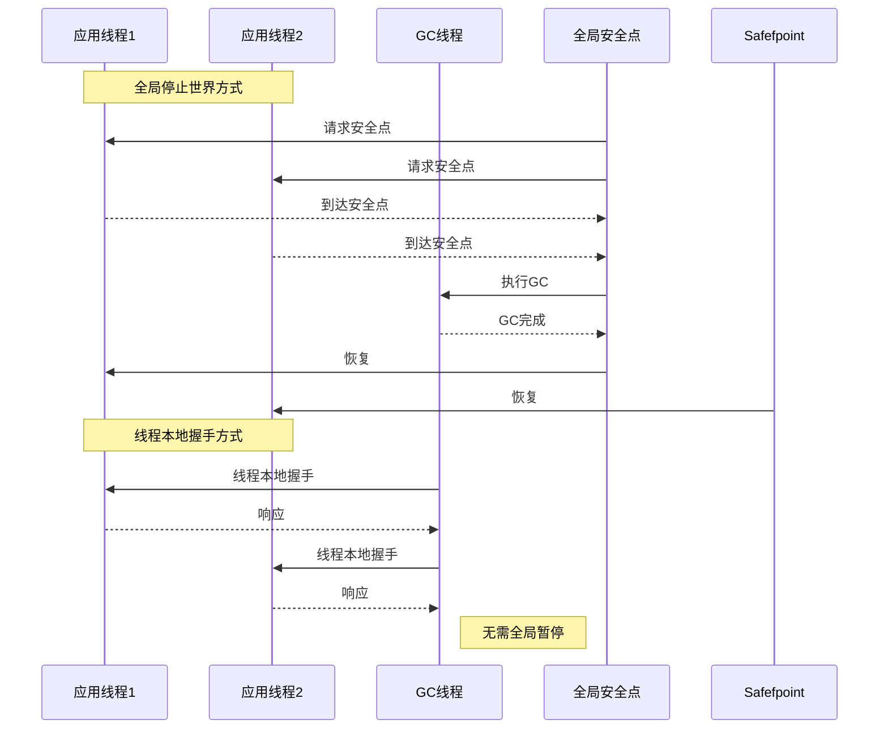
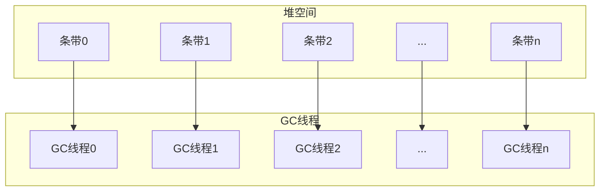
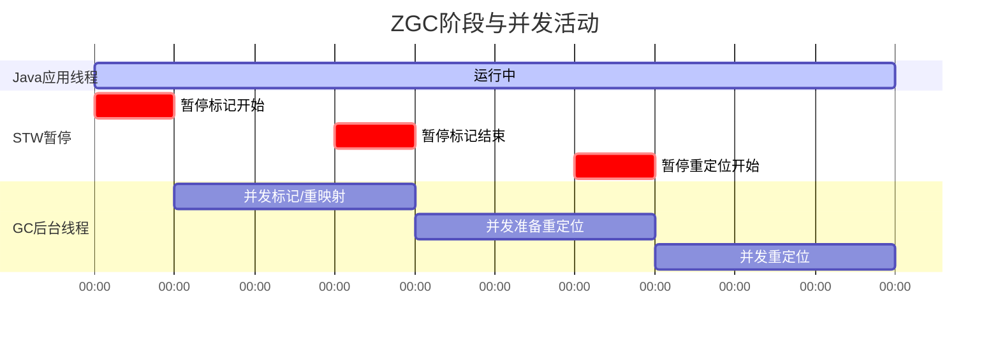

# 第6章 OpenJDK中的高级内存管理与垃圾回收

## 引言

本章我们将深入JVM性能工程的世界，审视OpenJDK Hotspot VM中的高级内存管理与垃圾回收技术。重点将放在从JDK 11到JDK 17的优化与算法演进上。

现代OpenJDK中的自动内存管理是JVM的关键方面。它使开发者能够利用优化的算法，提供高效分配路径并适应应用程序的需求。在托管运行时环境中工作，最大限度地减少了内存泄漏、悬空指针以及其他难以识别和解决的内存相关错误的风险。

我与垃圾回收器的旅程始于我在AMD（Advanced Micro Devices）任职期间，随后在Sun Microsystems和Oracle公司蓬勃发展，在那里我深度参与了垃圾回收技术的演进。这些经历为我提供了关于垃圾回收器开发和优化的独特视角，我将与您在本章中分享。

在JVM的众多增强中，JDK 11引入了垃圾回收的重大改进，例如可中止的混合回收（abortable mixed collections），提升了GC响应性；以及Z Garbage Collector（ZGC），旨在实现亚毫秒级停顿。

本章探讨这些发展，包括[[Thread-Local Allocation Buffers|线程本地分配缓冲区（TLAB）]]和[[NUMA|非统一内存架构]]感知型GC等优化。我们还将深入探讨各种事务性工作负载，研究它们与内存数据库的相互作用及其对Java堆的影响。

到本章结束时，您将对OpenJDK中的高级内存管理有更深入的理解，并掌握为Java应用程序有效优化GC的知识。那么，让我们深入探索高级内存管理与垃圾回收的迷人世界吧！

## Java中的垃圾回收概述

Java的GC是一个自动化的自适应内存管理系统，它回收应用程序不再需要的对象所占用的堆内存。对于OpenJDK中的大多数GC，JVM将堆内存划分为不同的代（generations），大多数对象分配在年轻代（young generation）中，年轻代进一步划分为Eden空间和Survivor空间。对象从Eden空间移动到Survivor空间，并可能在后续的Minor GC中存活后晋升到老年代（old generation）。

这种分代方法利用了“弱分代假说”（weak generational hypothesis），该假说认为大多数对象会很快变得不可达，并且从老年代到年轻代对象的引用较少。通过在Minor GC期间专注于年轻代，GC过程变得更加高效。

在GC过程中，回收器首先从根节点（应用程序可直接访问的对象）开始追踪对象图。这一阶段也称为标记（marking），涉及显式识别所有存活对象。并发回收器还可能隐式地将某些对象视为存活，这增加了GC的占用空间，并导致一种称为“浮动垃圾”（floating garbage）的现象。当GC保留了可能已不再存活的引用时，就会发生这种情况。完成追踪后，任何在此遍历中不可达的对象都被视为“垃圾”，可以被安全地释放。

OpenJDK HotSpot VM提供了多种内置垃圾回收器，每种都针对特定目标设计，从提高吞吐量、降低延迟到高效处理更大的堆大小。在我们的探索中，我们将重点介绍其中两种回收器——G1垃圾回收器（G1 Garbage Collector）和Z垃圾回收器（Z Garbage Collector，ZGC）。我个人深度参与了G1回收器的算法精炼和性能优化，这使我对它的高级内存管理技术有了深入的见解。除了G1 GC，我们还将探索ZGC，特别是关注它们在OpenJDK中的近期增强。

G1 GC是一项革命性特性，自JDK 7 Update 4起完全支持，旨在最大限度地发挥现代多核处理器和大容量内存的能力。G1不仅仅是垃圾回收器，它还是一个平衡响应性与吞吐量的全面解决方案。它始终满足GC暂停时间目标，确保应用程序平稳运行，同时提供令人印象深刻的处理能力。G1在后台与应用程序并发运行，遍历存活对象图并为堆的不同区域构建回收集（collection set）。它通过将堆拆分成更小、更易于管理的块（称为区域（region））并将每个区域作为独立实体处理，从而最小化暂停时间，进而提升应用程序的整体响应性。

区域的概念是G1和ZGC操作的核心。堆被划分为多个可独立回收的区域。这种方法使垃圾回收器能够专注于回收那些能释放大量空闲空间的区域，从而提高GC过程的效率。

ZGC最初作为实验性特性在JDK 11中引入，是一种专为可扩展性设计的低延迟GC。这种先进的GC确保GC暂停时间实际上与堆大小无关。它通过采用并发复制技术来实现这一点——在应用程序仍在运行时，将对象从一个内存区域迁移到另一个区域。这种对象的并发迁移显著降低了GC暂停对应用程序性能的影响。

ZGC的设计使Java应用程序在内存和延迟方面更具可预测性的扩展性，使其成为大堆大小和严格延迟要求的应用程序的理想选择。ZGC与应用程序协同工作，并发运行以将暂停时间降至最低，并保持高水平的应用程序响应性。

在本章中，我们将深入探讨这些GC的细节、它们的特性以及它们对各种应用程序类型的影响。我们将探索它们复杂的内存管理机制、线程本地与非统一内存架构（NUMA）感知分配的作用，以及调优这些回收器以获得最佳性能的方法。我们还将探索评估GC性能的实用策略，从初始测量到微调。理解这一迭代过程并识别工作负载模式，将使开发者能够选择最合适的GC策略，确保在广泛应用程序中的高效内存管理。

## 线程本地分配缓冲区与晋升本地分配缓冲区

[[TLAB|线程本地分配缓冲区（TLAB）]]是OpenJDK HotSpot VM中采用的一种优化技术，用于提升分配性能。TLAB通过为堆中的各个线程提供独立的内存区域，减少了同步开销，允许每个线程无需锁即可分配内存。这种无锁分配机制也称为“快速路径”（fast-path）。

在启用TLAB的环境中，每个线程在堆内被分配其自己的缓冲区。当线程需要分配新对象时，它只需在其TLAB内移动指针（bump a pointer）。这种方法使分配过程比获取锁并与其他线程同步的过程快得多。这对于多线程应用程序尤其有益，因为对共享内存池的争用会导致显著的性能下降。

TLAB是可调整大小的，能够适应各自线程的分配速率。JVM监控每个线程的分配行为，并据此调整TLAB的大小。这种自适应调整有助于在减少争用与高效利用堆空间之间取得平衡。

为微调TLAB性能，JVM提供了多个用于配置TLAB行为的选项。这些选项可用于针对特定应用程序工作负载和需求优化TLAB使用。一些关键的调优选项包括：

- **`-XX:+UseTLAB`**：启用或禁用TLAB。默认情况下，HotSpot VM中TLAB是启用的。要禁用TLAB，使用 `-XX:-UseTLAB`。
- **`-XX:TLABSize=<value>`**：设置TLAB的初始大小（字节）。调整此值有助于平衡TLAB大小与各线程的分配速率。例如，`-XX:TLABSize=16384` 将初始TLAB大小设置为16 KB。
- **`-XX:+ResizeTLAB`**：控制TLAB是否可调整大小。默认情况下，TLAB调整大小是启用的。要禁用，使用 `-XX:-ResizeTLAB`。
- **`-XX:TLABRefillWasteFraction=<value>`**：指定TLAB允许的最大浪费量，作为TLAB大小的一个分数。该值影响TLAB的调整，较小的值会导致更频繁的调整。例如，`-XX:TLABRefillWasteFraction=64` 将最大允许浪费设置为TLAB大小的1/64。

通过试验这些调优选项并监控对应用程序性能的影响，您可以优化TLAB使用以更好地适应应用程序的分配模式和需求，最终提升其整体性能。要监控TLAB使用情况，可以使用诸如Java Flight Recorder（JFR）和JVM日志记录等工具。

对于JDK 11及更高版本中的Java Flight Recorder，可以使用以下命令行选项开始记录：

```bash
-XX:StartFlightRecording=duration=300s,jdk.ObjectAllocationInNewTLAB#enabled=true,jdk.ObjectAllocationOutsideTLAB#enabled=true,filename=myrecording.jfr
```

该命令将记录应用程序300秒的情况，并保存为`myrecording.jfr`文件。然后，您可以使用JDK Mission Control`^[https://jdk.java.net/jmc/8/]`等工具分析记录，以可视化TLAB相关的统计数据。

对于JVM日志记录，可以使用统一日志记录系统启用TLAB相关信息，使用以下选项：

```bash
-Xlog:gc*,gc+tlab=debug:file=gc.log:time,tags
```

此配置将所有GC相关信息（`gc*`）以及TLAB信息（`gc+tlab=debug`）记录到名为`gc.log`的文件中。`time`和`tags`装饰器用于在日志输出中包含时间戳和标签。然后，您可以分析日志文件，研究TLAB调优对应用程序性能的影响。

与TLAB类似，OpenJDK HotSpot VM使用[[PLAB|晋升本地分配缓冲区（PLAB）]]供GC线程晋升对象。许多GC算法执行深度优先复制到这些PLAB中，以增强同址性（co-locality）。然而，并非所有晋升的对象都复制到PLAB中；某些对象可能直接晋升到老年代。与TLAB一样，PLAB会根据应用程序的晋升率自动调整大小。

## 优化内存访问：NUMA感知的垃圾回收

在OpenJDK HotSpot中，有一个专为非一致内存访问（NUMA）系统设计的架构特定分配器，称为“NUMA感知”。如第5章“端到端Java性能优化：工程技术与JMH微基准测试”所述，NUMA是一种用于多处理的计算机内存设计类型。内存访问速度取决于内存相对于处理器的位置。在这些系统上，操作系统根据“首次接触”原则分配物理内存，即内存分配在首次访问它的处理器最近的区域。因此，为了确保分配发生在距离分配线程最近的内存区域，伊甸园空间被划分为每个节点（节点指CPU、内存控制器和内存银行的组合）的段。使用NUMA感知分配器有助于提升多处理器系统的性能并降低内存访问延迟。

为了更好地理解其工作原理，我们来看一个示例。在图6.1中，可以看到四个节点，标记为Node 0到Node 3。每个节点拥有自己的处理单元、一个内存控制器和一个内存银行组合。运行在Node 0上的进程/线程想要访问Node 3上的内存，必须经过Node 2或Node 1到达Node 3。这被认为是两跳（2 hops）。如果Node 0上的进程/线程要访问Node 3或Node 2的内存银行，则只有一跳（1 hop）之遥。本地内存访问无需跳转。像图6.1所示的架构称为NUMA。

![[Pasted image 20260505200329.png]]

**图6.1  NUMA节点(包含处理器、内存控制器和DRAM银行)**


如果我们划分Java堆的伊甸园空间，使得每个节点都有对应的区域，并且让运行在特定节点上的线程从这些节点分配的区域中进行分配，那么我们就能够实现无跳转访问节点本地内存（前提是调度器不将线程迁移到另一个节点）。这就是NUMA感知分配器背后的原理——基本上，[[TLAB]]从最近的内存区域分配，从而实现更快的分配。

在对象生命周期的初始阶段，它位于从其NUMA节点专门分配的伊甸园空间中。当一些对象存活下来或需要晋升到老年代时，它们可能在不同节点的线程之间共享。此时，分配以节点交错（node-interleaved）的方式进行，即内存块按顺序从节点0到最高编号节点依次均匀分布，直到所有内存空间分配完毕。

图6.2展示了NUMA感知的伊甸园。线程0和线程1从Node 0的伊甸园区分配内存，因为它们都运行在Node 0上。同时，线程2从Node 1的伊甸园区分配内存，因为它运行在Node 1上。

![[Pasted image 20260505200456.png]]

**图6.2  NUMA感知GC的内部工作原理**

要启用JDK 8及更高版本中的NUMA感知GC，请使用以下命令行选项：

```
-XX:+UseNUMA
```

此选项启用NUMA感知的内存分配，允许JVM针对NUMA架构优化内存访问。

要检查你的JVM是否运行NUMA感知GC，可以使用以下命令行选项：

```
-XX:+PrintFlagsFinal
```

此选项输出JVM标志的最终值，包括`UseNUMA`标志，它指示是否启用了NUMA感知GC。

> [!SUMMARY]
> 总之，NUMA感知分配器通过将Java堆的伊甸园空间划分为每个节点的区域，并从最近的内存区域创建TLAB，来优化NUMA架构的内存访问。这可以加快分配速度并提升性能。然而，在启用NUMA感知GC时，必须监控应用程序的性能，因为其影响可能因系统硬件和软件配置而异。

某些垃圾收集器（如G1和Parallel GC）受益于NUMA优化。G1在JDK 14中实现了NUMA感知[^2]，增强了其在NUMA架构上管理大型堆的效率。ZGC是另一个现代垃圾收集器，旨在应对大型堆大小、低延迟需求和更好整体性能的挑战。ZGC在JDK 15中变得NUMA感知[^3]。在接下来的章节中，我们将深入探讨G1和ZGC的关键特性、增强功能，以及它们在现代Java应用程序上下文中的性能影响和调优选项。

[^2]: https://openjdk.org/jeps/345
[^3]: https://wiki.openjdk.org/display/zgc/Main#Main-EnablingNUMASupport

## 探索垃圾回收的改进

随着Java应用程序复杂度的不断提升，高效内存管理和垃圾回收变得越来越重要。OpenJDK HotSpot VM中的两个重要垃圾收集器——G1和ZGC——旨在提升垃圾回收的性能、可伸缩性和可预测性，尤其适用于具有巨大堆大小和严苛低延迟需求的应用程序。

本节将突出每个垃圾收集器的显著特性，列出从JDK 11到JDK 17的关键进步和优化。我们将探讨G1在混合收集性能、暂停时间可预测性以及更好地适应不同工作负载方面的增强。由于ZGC是一个较新的垃圾收集器，我们还将更深入地研究其独特能力，如并发垃圾回收、减少暂停时间，以及它对大堆大小的适用性。通过理解这些GC技术的进步，你将获得关于它们对应用程序性能和内存管理影响的宝贵见解，以及在选择适合特定用例的垃圾收集器时需要考虑的权衡。

### G1垃圾收集器：深入探讨高级堆管理

多年来，GC的设计发生了显著转变。最初的重点是以吞吐量为导向的GC，旨在最大化内存管理过程的整体效率。然而，随着应用程序复杂度的增加和用户期望的提高，重点已转向以延迟为导向的GC。这些GC旨在最小化可能中断应用程序性能的暂停时间，即使这意味着略微降低整体吞吐量。G1是JDK 11 LTS及更高版本的默认GC，它是这种向延迟导向GC转变的典型例子。在接下来的小节中，我们将考察G1 GC的复杂性、其堆管理以及优势。

#### 区域化堆

G1将堆划分为多个大小相等的区域，每个区域可以动态扮演伊甸园、幸存者或老年代空间的角色。这种灵活性有助于高效的内存管理。

#### 自适应大小调整

- **分代大小调整**：G1的分代框架辅以其自适应大小调整能力，允许它根据运行时行为调整年轻代和老年代的大小。这确保了最佳的堆利用率。
- **收集集合（CSet）大小调整**：G1动态选择一组区域进行收集，以满足暂停时间目标。CSet的选择基于这些区域中包含的垃圾量，从而确保高效的空间回收。
- **记忆集（RSet）粗化**：G1维护记忆集以跟踪跨区域引用。随着时间的推移，如果这些RSet变得过大，G1可以对它们进行粗化，降低其粒度和开销。

#### 暂停时间可预测性

- **增量收集**：G1将垃圾回收工作分解为较小的块，增量地处理这些块，以确保暂停时间保持可预测。
- **并发标记增强**：虽然CMS引入了并发标记，但G1通过快照开始（SATB）等先进技术增强了这一阶段。

## 探索垃圾回收改进

*G1 将其垃圾回收工作分解为更小的分块，增量处理这些分块，确保暂停时间保持可预测。*

*并发标记增强：* 尽管 CMS 引入了并发标记，但 G1 通过快照开始时（SATB）标记等先进技术增强了这一阶段[^4]。G1 采用多阶段方法，与其基于区域的堆管理紧密关联，确保最小化中断并高效回收空间。

*G1 中的预测：* G1 使用一套复杂的预测机制来优化其性能。这些预测基于 G1 的历史分析，使其能够动态适应应用程序的行为并优化性能：

- **单区域复制时间**：G1 通过借鉴过去撤离的历史数据，预测复制/撤离单个区域内容所需的时间。该预测对于估算 GC 周期的总暂停时间、以及决定在混合收集中包含多少区域以符合期望的暂停时间至关重要。
- **并发标记时间**：G1 预估完成并发标记阶段所需的时间。这一预见性对于通过动态调整 IHOP（启动堆占用百分比，`-XX:InitiatingHeapOccupancyPercent`）来确定启动标记阶段的时机至关重要。IHOP 的调整基于对老年代占用率和应用程序内存分配行为的实时分析。
- **混合垃圾回收时间**：G1 预测混合垃圾回收的时间，以策略性地选择一组老年代区域与年轻代一起回收。该估计帮助 G1 在回收足够内存空间与遵守暂停时间目标之间保持平衡。
- **年轻代垃圾回收时间**：G1 计算仅年轻代回收所需的时间，以指导年轻代大小的调整。G1 根据这些预测调整年轻代大小，以优化暂停时间，达到期望的目标（`-XX:MaxGCPauseTimeMillis`），并适应应用程序不断变化的分配模式。
- **可回收空间量**：G1 估计通过回收特定老年代区域可以回收的空间。该估计用于决定在混合收集中包含哪些老年代区域，优化内存利用率并最小化堆碎片风险。

### 核心扩展性

G1 的设计天然支持多线程，使其能够随可用核心数量扩展。这具有以下影响：

- **并行化的年轻代回收**：确保快速回收短生命周期对象。
- **并行化的老年代回收**：提高老年代空间回收的效率。
- **标记阶段的并发线程**：加速存活对象的识别。

[^4]: Charlie Hunt, Monica Beckwith, Poonam Parhar, and Bengt Rutisson. *Java Performance Companion*. Boston, MA: Addison-Wesley Professional, 2016.

### 开创性功能

除了区域化堆和自适应大小调整，G1 还引入了其他几个功能：

- **巨型对象处理**：G1 对跨多个区域的大对象有专门处理，确保它们不会导致碎片化或延长暂停时间。
- **自适应阈值调整（IHOP）**：如前所述，G1 根据运行时指标动态调整并发标记阶段的启动阈值。该调整特别关注 IHOP 的动态调节，以确定启动并发标记阶段的正确时机。

本质上，G1 是创新技术与自适应策略的结晶，在确保可预测响应性的同时实现高效内存管理。

---

## 区域化堆的优势

在 G1 中，将堆划分为区域比传统的分代方法创建了更灵活的回收单元。这些区域作为 G1 的工作单元（UoW），使其预测逻辑能够通过按需添加或移除区域，高效地为每个 GC 周期定制回收集合。通过调整回收集合中包含哪些区域，G1 可以动态响应应用程序当前的内存使用模式。

区域化堆促进了增量压缩，允许回收集合包含所有年轻区域和至少一个老年代区域。这与传统的老年代整体回收（如 Parallel GC 中的 Full GC 或 CMS 的回退 Full GC）相比，是一个显著改进，后者适应性较差且效率较低。

### 传统 Java 堆布局与区域化 Java 堆布局对比

为了更好地理解区域化堆的好处，我们将其与传统的 Java 堆布局进行比较。在传统的 Java 堆中（如图 6.3 所示），年轻代和老年代有各自独立的区域。相反，区域化 Java 堆布局（如图 6.4 所示）将堆划分为多个区域，这些区域可以分为空闲或占用。当一个年轻区域被释放回空闲列表时，可以根据晋升需求将其重新声明为老年代区域。这种非连续的分代结构，加上按需调整分代大小的灵活性，使 G1 的预测逻辑能够实现其响应性服务等级目标（SLO）。

![[Pasted image 20260505200536.png]]

**图 6.3 传统 Java 堆布局**

![[Pasted image 20260505200553.png]]

**图 6.4 区域化 Java 堆布局**

### 区域化 Java 堆布局的关键方面

G1 的一个重要方面是引入了巨型对象。如果一个对象占用了单个 G1 区域的 50% 或更多（如图 6.5 所示），则认为它是巨型对象。G1 处理巨型对象分配的方式与普通对象不同。巨型对象不是通过快速路径（TLAB）分配，而是直接从老年代分配到指定的巨型区域。如果巨型对象跨越超过一个区域大小，它将需要连续的区域。（关于巨型区域和对象的更多信息，请参考《Java Performance Companion》[^5]）。

![[Pasted image 20260505200616.png]]

**图 6.5 区域化堆，显示老年代、巨型对象和年轻代区域**

[^5]: Charlie Hunt, Monica Beckwith, Poonam Parhar, and Bengt Rutisson. *Java Performance Companion*. Boston, MA: Addison-Wesley Professional, 2016: 第 2 章和第 3 章。

### 区域化堆中平衡扩展性与响应性

区域化堆旨在在保持目标响应性和暂停时间的同时增强扩展性。然而，命令行选项 `-XX:MaxGCPauseMillis` 仅为 G1 提供软实时目标。尽管预测逻辑努力实现所需目标，但回收暂停在达到暂停时间目标时不会硬停止。如果您的应用程序由于分配（速率）峰值或突变率增加而经历较高的 GC 尾部延迟，并且预测逻辑难以跟上，您可能无法始终满足响应性 SLO。在这种情况下，可能需要手动 GC 调优（下一节将介绍）。

> [!NOTE]
> **突变率**是指应用程序更新引用的速率。

> [!NOTE]
> **尾部延迟**指最终用户经历的最慢响应时间。这些延迟会显著影响延迟敏感应用程序的用户体验，通常由延迟分布的高百分位数（例如，4-9s、5-9s 百分位数）表示。

---

## 优化 G1 参数以获得最佳性能

在大多数情况下，当应用程序遵循可预测的模式（包括预热（启动）阶段、稳定阶段和冷却（降速）阶段）时，G1 的自动调优和预测逻辑工作良好。然而，当分配率出现多个峰值时，特别是这些峰值源于突发、瞬态的巨型对象分配时，挑战可能会出现。这种情况可能导致过早晋升到老年代，并且需要在老年代中容纳瞬态的巨型对象/区域。这些因素可能扰乱预测逻辑，并对标记和混合回收周期施加过大压力。在恢复发生之前，应用程序可能会遇到由于晋升空间不足或由于碎片化导致缺乏巨型对象所需连续区域而导致的撤离失败。在这些情况下，无论是否手动干预或通过自动化/AI 系统干预，都变得必要。

G1 的区域化堆、回收集合和增量回收提供了许多调整内部阈值的调优旋钮，并在需要时支持针对性调优。为了做出关于修改这些参数的明智决策，必须了解这些调优旋钮及其对 G1 自调节机制的潜在影响。

---

### 优化 JDK 11 及更高版本的 GC 暂停响应性

为了有效调优 G1，分析从 GC 日志文件获得的暂停直方图可以为您的应用程序性能提供宝贵见解。考虑来自 JDK 11 GC 日志文件的暂停时间序列图，如图 6.6 所示。该图揭示了以下 GC 暂停：

- 4 次年轻 GC 暂停，随后……
- 1 次初始标记暂停（当 IHOP 阈值被超过时）
- 接下来，在并发标记阶段期间有 1 次年轻 GC 暂停……
- 然后是 1 次 Remark 暂停和 1 次 Cleanup 暂停
- 最后，在 7 次混合 GC 之前还有一次年轻 GC 暂停，以增量地回收老年代空间

假设系统有一个 SLO，要求 100% 的 GC 暂停时间小于等于 100 ms，很明显最后一次混合回收未满足此要求。这种一次性暂停可能可以通过 JDK 12 中引入的可中止混合回收功能（我们稍后将讨论）来缓解。然而，在自动优化不足或不适用的情况下，手动调优变得必要（图 6.7）。

![[Pasted image 20260505200646.png]]

**图 6.6 G1 垃圾回收器的暂停时间直方图**

![[Pasted image 20260505200702.png]]

**图 6.7 优化 G1 响应性**

有两个阈值可以帮助控制混合收集中包含的老年代区域数量：

- **混合收集中包含的最大老年代区域数**：`-XX:G1OldCSetRegionThresholdPercent=<p>`
- **混合收集中包含的最小老年代区域数**：`-XX:G1MixedGCCountTarget=<n>`

这两个可调参数有助于确定有多少老年代区域被添加到年轻区域中，形成混合回收集合。调整这些值可以改善暂停时间，确保 SLO 合规。

# 探索垃圾回收改进

在我们的示例中，如图6.6暂停事件时间线所示，大多数年轻代回收和混合回收都在SLO要求之内，除了最后一次混合回收。一个简单的解决方案是使用以下命令行选项减少混合回收集合中包含的老年代区域最大数量：

```bash
-XX:G1OldCSetRegionThresholdPercent=<p>
```

其中`p`是Java堆总大小的百分比。例如，堆大小为1 GB且默认值为10%（即`-Xmx1G -Xms1G -XX:G1OldCSetRegionThresholdPercent=10`）时，添加到回收集合中的老年代区域数量将是1 GB的10%（向上取整），因此得到103个区域。将百分比降低到7%后，最大数量降至72，这足以将最后一次混合回收暂停控制在可接受的GC响应时间SLO内。然而，单这一项改动可能会增加混合回收的总次数，这可能成为一个问题。

## G1响应性：实际增强

随着JDK版本的演进，G1引入了几项新特性和增强。如果正确使用，这些特性可以在无需大量调优的情况下显著提升应用程序的响应性和性能。尽管官方文档提供了这些特性的全面概述，但理解它们的实际应用具有巨大价值。以下是如何将这些增强转化为实际性能提升的经验：

- **并行引用处理（JDK 11）**：考虑一个使用`SoftReference`对象缓存产品图片的电商平台。在高流量销售活动期间，引用数量激增。并行引用处理能力使系统在高负载下保持敏捷，即使在流量高峰期间也能维持流畅的用户体验。

- **可中止的混合回收（JDK 12）**：想象一个实时多人游戏服务器在激烈游戏过程中服务数千名并发在线玩家。该服务器可能包含中等存活期（临时）数据（玩家、游戏对象）。在这里，低尾部延迟的实时约束是主要的SLO要求。可中止混合回收的引入确保游戏过程保持流畅，即使游戏内操作以疯狂的速度生成临时数据。

- **及时归还未使用的已提交内存（JDK 12）**：一个基于云的视频渲染服务，负责3D场景的后期制作，经常处于空闲资源状态。G1可以根据系统负载更快地将未使用的已提交内存归还给操作系统。借助这一能力，该服务可以优化资源利用率，从而确保同一台服务器上的其他应用程序在需要时能够访问内存，进而节省云托管费用。为进一步微调此行为，可使用两个G1调优选项：
  - `G1PeriodicGCInterval`：此选项指定触发周期GC的间隔（毫秒）。通过设置此选项，可以控制G1检查并可能将未使用内存归还给操作系统的频率。默认值为0，表示默认禁用周期GC。
  - `G1PeriodicGCSystemLoadThreshold`：此选项设置系统负载阈值。如果系统负载低于此阈值，即使未达到`G1PeriodicGCInterval`也会触发周期GC。该选项在系统负载不高且希望更积极地归还内存的场景中特别有用。默认值为0，表示禁用系统负载阈值检查。

> [!WARNING] 谨慎使用
> 尽管这些调优选项提供了更大的内存回收控制权，但务必谨慎行事。过于激进的设置可能导致频繁且不必要的GC周期，从而对应用程序性能产生负面影响。在做出更改后始终监控系统行为，并根据需要调整，以在内存回收和应用性能之间取得平衡。

- **改进的并发标记终止（JDK 13）**：想象一个全球金融分析平台，处理数十亿市场信号以提供实时交易洞见。JDK 13中改进的并发标记终止可以显著缩短GC暂停时间，确保高容量数据分析和报告不会中断，从而为交易员提供一致、及时的市场情报。

- **G1 NUMA感知（JDK 14）**：设想一个高性能计算（HPC）环境，负责运行复杂的模拟。借助G1的NUMA感知，JVM针对多插槽系统进行了优化，显著改善了GC暂停时间和整体应用性能。对于每毫秒都至关重要的HPC工作负载，这意味着更快的计算和更高效的硬件资源利用。

- **改进的并发细化（JDK 15）**：考虑一个企业搜索引擎，必须在庞大索引中处理数百万次查询。JDK 15中改进的并发细化减少了日志缓冲区条目的数量，从而缩短GC暂停时间。这种细化允许快速查询处理，对于维持用户对现代搜索引擎期望的响应性至关重要。

- **改进的堆管理（JDK 17）**：考虑一个大型物联网（IoT）平台，聚合来自数百万设备的数据。JDK 17在G1中增强的堆管理可以更有效地分配堆区域，从而最小化GC暂停时间并提高应用程序吞吐量。对于IoT生态系统，这意味着更快的数据摄入和处理，能够对关键传感器数据做出实时响应。

在这些增强的基础上，G1还包括其他优化，进一步提升响应性和效率：

- **优化疏散（Evacuation）**：此优化简化了疏散过程，可能减少GC暂停时间。在快速响应时间至关重要的事务型应用中，如金融处理或实时数据分析，优化疏散可以确保更快的交易处理，使系统即使在重负载下也能保持响应。

- **即时构建记忆集（Remembered Sets）**：通过在标记周期中构建记忆集，G1最小化了在`remark`阶段花费的时间。这对于如大数据分析平台等具有海量数据集的系统特别有益，因为更快的`remark`阶段可以缩短处理时间。

- **改进记忆集扫描**：这些改进有助于缩短GC暂停时间——对于如直播服务等连续数据流至关重要的应用来说，这是必不可少的考虑因素。

- **减少屏障开销**：降低与屏障相关的开销可以缩短GC暂停时间。这一增强在基于云的软件即服务（SaaS）应用中非常有价值，其中效率直接转化为降低的运营成本。

- **自适应IHOP**：此功能允许G1根据当前应用程序行为自适应调整IHOP值。例如，在动态内容分发网络中，自适应IHOP可以通过在不同流量负载下高效管理内存来改善响应性。

通过理解这些增强和可用的调优选项，您可以更好地优化G1，以满足特定应用程序的响应性要求。深思熟虑地实施这些改进可以带来实质性的性能提升，确保您的Java应用程序在各种条件下保持高效和响应。

## 使用JDK 11及更高版本优化GC暂停频率和开销

满足严格的SLO要求（例如，特定的吞吐量目标和最小GC开销）对许多应用至关重要。例如，SLO可能规定GC开销不得超过总执行时间的5%。暂停时间直方图的分析可能显示，由于频繁的混合GC暂停导致过多的GC开销，应用程序难以满足SLO的吞吐量要求。解决这一挑战需要策略性地调优G1以提高其效率。方法如下：

- **策略性地排除昂贵区域**：通过省略成本高昂的老年代区域来定制混合回收集合。此操作虽然接受一些未收集的垃圾（即“堆浪费”），但确保堆能够容纳存活数据、临时对象、大对象（Humongous Objects）以及额外的浪费空间。可能需要增加总Java堆大小来实现此目标。

- **设置存活数据阈值**：使用`-XX:G1MixedGCLiveThresholdPercent=<p>`为每个老年代区域根据该区域中存活数据的百分比设置截止值。超过此阈值的区域不包含在混合回收集合中，以避免昂贵的回收周期。

- **堆浪费管理**：应用`-XX:G1HeapWastePercent=<p>`允许总堆的特定百分比保持未收集（即“浪费”）。此策略针对标记阶段建立的排序数组末尾的昂贵区域。图6.8概述了这一过程。

![[Pasted image 20260505200755.png]]

**图6.8：优化G1的吞吐量**

## G1吞吐量优化：实际应用

自Java 11以来，G1经历了一系列改进和优化，包括引入自适应大小和阈值，这有助于优化其使用以满足特定应用的吞吐量需求。这些增强可能减少对降低开销进行微调的需求，因为它们可以带来更高效的内存使用，从而提升应用性能。让我们看看这些更新：

- **急切回收大对象（JDK 11）**：在社交媒体分析应用中，代表用户交互的大型数据集被频繁处理。急切回收大对象的能力防止堆耗尽，并使分析工作流保持顺畅，特别是在高流量事件（如病毒式营销活动）期间。

## 探索垃圾回收改进

- **改进的 `G1MixedGCCountTarget` 与可中止的混合回收 (JDK 12)**：设想一个高吞吐量的股票交易应用。通过微调混合 GC 的次数并允许回收过程可中止，G1 能在市场峰值期间维持一致的吞吐量，确保交易者体验到极低的延迟。
- **自适应堆大小调整 (JDK 15)**：云存储与协作平台等云服务在一天中会经历不同的负载。自适应堆大小调整确保在低活动期间系统最小化资源使用，降低运营成本，同时在高峰期仍能提供高吞吐量。
- **并发大对象分配与年轻代大小改进 (JDK 17)**：在大型物联网数据处理服务中，大对象的并发分配使得传入的传感器数据流处理更高效。改进的年轻代大小会根据工作负载动态调整，防止潜在瓶颈，确保实时分析的稳定吞吐量。

除上述增强外，以下优化也有助于提升 G1 GC 的吞吐量：

- **记忆集空间缩减**：在数据库管理系统中，减少记忆集的空间意味着有更多内存可用于缓存查询结果，从而带来更快的响应时间和更高的数据库操作吞吐量。
- **延迟线程与记忆集初始化**：对于按需视频流服务，延迟初始化允许根据用户需求快速扩展资源，最小化启动延迟并提升观众满意度。
- **在 `remark` 阶段取消提交 (Uncommit at remark)**：云平台可在非高峰时段通过此功能动态缩小资源分配，优化成本效益而不牺牲吞吐量。
- **老年代置于 NVDIMM**：将老年代置于非易失性 DIMM (NVDIMM) 上，G1 可以实现更快的访问时间和更好的性能。这可以更有效地利用可用内存，从而提高吞吐量。
- **每线程更小堆大小的动态 GC 线程**：在容器环境中运行的微服务可以利用动态 GC 线程来优化资源使用。通过缩小每个线程的堆大小，GC 可以适应每个微服务的特定需求，实现更高效的内存管理和改进的服务响应时间。
- **周期性 GC**：对于处理连续数据流的物联网平台，周期性垃圾回收可以通过定期清理未使用的对象来维持一致的应用程序状态。这种策略可以减少与垃圾回收周期相关的延迟，确保时间敏感的物联网操作能及时进行数据处理和决策。

通过理解这些增强功能以及可用的调优选项，你可以更好地优化 G1 以满足应用程序特定的吞吐量要求。

## 调优标记阈值

如前所述，Java 9 引入了自适应标记阈值，即 `IHOP`（Initiating Heap Occupancy Percent）。这一特性应能使大多数应用受益。然而，在某些病态情况下，例如短生命周期（可能为大对象）的突发分配（常见于构建短生命周期的事务缓存时），可能导致次优行为。在这种情况下，较低的自适应 IHOP 可能引发过早的并发标记阶段，该阶段完成后未能触发所需的混合回收——尤其是如果突发分配发生在之后。或者，较高的自适应 IHOP 如果没有足够快地下降，可能会延迟并发标记阶段的启动，导致常规的转移失败。

为解决这些问题，你可以禁用自适应标记阈值并将其设置为一个固定值，只需在命令行中添加以下选项：

```bash
-XX:-G1UseAdaptiveIHOP -XX:InitiatingHeapOccupancyPercent=<p>
```

其中 `p` 是你希望标记周期开始时堆的总占用百分比。

在图 6.9 中，在约 486.4 秒处的混合 GC 暂停之后，有一个年轻 GC 暂停，随后是标记周期的开始（年轻 GC 暂停后的那条线是初始标记暂停）。在初始标记暂停之后，我们观察到 23 个年轻 GC 暂停、一个 "to" 空间耗尽暂停，最后是一个 Full GC 暂停。这种模式——混合回收周期刚刚完成，一个新的并发标记周期开始，但无法在年轻代大小缩小时完成（因此出现了年轻集合）——表明自适应标记阈值存在问题。阈值可能过高，导致标记周期延迟到需要进行连续的并发标记和混合回收周期，或者由于并发标记线程数量过少而无法跟上工作负载，导致并发周期耗时过长。

![[Pasted image 20260505200817.png]]

**图 6.9** G1 垃圾回收器暂停时间线显示标记周期未完成

在这种情况下，你可以将 IHOP 值稳定在一个较低的水平，以适应静态和瞬态存活数据大小（LDS）（以及大对象），并通过将 `n` 设置为更高的值来增加并发线程数量：`-XX:ConcGCThreads=<n>`。`n` 的默认值是可用于并行（STW）GC 活动的 GC 线程数的四分之一。

G1 代表了 Java 生态系统中 GC 演进的一个重要里程碑。它引入了分区堆，并允许用户指定实际的暂停时间目标并最大化期望的堆大小。G1 预测每次回收（年轻和混合）的总区域数，以满足目标暂停时间。然而，实际的暂停时间仍可能因数据结构密度、被回收区域中区域或对象的流行程度、以及每区域存活数据量等因素而变化。这种可变性使得应用难以满足其已定义的 SLO，从而催生了对近实时、可预测、可扩展且低延迟垃圾回收器的需求。

---

## Z 垃圾回收器：适用于多 TB 堆的可扩展、低延迟 GC

为满足应用对实时响应性的需求，Z 垃圾回收器（ZGC）被引入，推动了 OpenJDK 垃圾回收能力的提升。ZGC 在 OpenJDK 中融合了创新概念——其中一些在 Azul 的 C4 收集器等收集器中已有先例[^6]。ZGC 的开创性特性包括并发压缩、彩色指针、堆外转发表和加载屏障，这些共同提升了性能和可预测性。

ZGC 最初作为实验性收集器在 JDK 11 中引入，并在 JDK 15 中达到生产就绪状态。在 JDK 16 中，并发线程栈处理被启用，使 ZGC 能够保证暂停时间保持在毫秒阈值以下，且与存活数据大小（LDS）和堆大小无关。这一进步使 ZGC 能够支持从 8 MB 到 16 TB 的广泛堆大小范围，从而满足从轻量级微服务到大数据分析、机器学习、图形渲染等内存密集型领域的多样化应用。

在本节中，我们将探讨 ZGC 的一些核心概念，这些概念使该收集器实现了超低暂停和高可预测性。

### ZGC 核心概念：彩色指针

ZGC 的关键创新之一是使用彩色指针，这是一种元数据标记形式，允许垃圾回收器将额外信息直接存储在指针内。这种技术被称为虚拟地址映射或标记，在 x86-64 和 aarch64 架构上通过多重映射实现。彩色指针可以指示对象的状态，例如它是否已知被标记、是否指向重定位集、或者是否仅通过 `Finalizer` 可达（图 6.10）。

![[Pasted image 20260505200846.png]]

**图 6.10** 彩色指针

> [!INFO] 彩色指针位说明
> - **Marked0 / Marked1**：对象已知被标记。
> - **Remapped**：对象已知不指向重定位集。
> - **Finalizable**：对象仅通过 Finalizer 可达。

这些标记指针使 ZGC 能够高效处理并发标记和重定位等复杂任务，而无需暂停应用。这导致了更短的 GC 暂停时间和更好的应用性能，使 ZGC 成为需要低延迟和高吞吐量的应用的有效解决方案。

### ZGC 核心概念：利用线程本地握手套手提升效率

ZGC 在垃圾回收方面的创新方法尤为突出，尤其是在如何利用线程本地握手套面（thread-local handshakes）[^7] 方面。线程本地握手套面使 JVM 能够在单个线程上执行操作，而无需全局 STW 暂停。这种方法减少了 STW 事件的影响，并有助于 ZGC 实现低暂停时间——这对延迟敏感型应用至关重要。

ZGC 采用线程本地握手套面是对传统垃圾回收 STW 技术的重大偏离（两者对比见图 6.11）。本质上，它们使 ZGC 能够适应和扩展回收，从而适用于具有更大堆大小和严格延迟要求的应用。然而，虽然 ZGC 的并发处理方法优化了低延迟，但可能对应用的最大吞吐量产生影响。ZGC 旨在平衡这些方面，确保吞吐量退化保持在可接受范围内。

![[Pasted image 20260505200929.png]]

**图 6.11**  传统 STW 暂停与 ZGC 线程本地握手套面的对比

### ZGC 核心概念：阶段与并发活动

与其他 OpenJDK 垃圾回收器一样，ZGC 是一种追踪式收集器，但它因能够同时执行并发标记和压缩而脱颖而出。它通过一组专门的阶段、创新的优化技术以及独特的垃圾回收方法，解决了在运行中的应用中将存活对象从“from”空间移动到“to”空间的挑战。

ZGC 细化了 G1 首创的分区堆概念，引入了 ZPages——根据内存使用模式分配和管理的动态大小区域。这种区域大小的灵活性是 ZGC 优化内存管理策略的一部分，以有效适应各种分配速率。

[^6]: www.azul.com/c4-white-paper/
[^7]: https://openjdk.org/jeps/312

## 探索垃圾回收改进

### 线程本地握手与全局停止世界事件

图6.11展示了线程本地握手（Thread-Local Handshakes）与全局停止世界（Stop-the-World）事件的对比。在传统的全局暂停中，所有应用线程需要同时到达安全点（Safepoint），导致较长的延迟。而ZGC采用线程本地握手机制，允许GC线程与单个应用线程进行异步交互，无需暂停所有线程。这显著减少了暂停时间，提高了并发性。



**图表说明**：图6.11 线程本地握手与全局停止世界事件

### ZGC逻辑条带（Logical Stripes）

ZGC通过将堆划分为逻辑条带改进了并发标记阶段。每个GC线程处理自己的条带，从而减少竞争和同步开销。这种设计允许ZGC在标记时进行并发、并行处理，缩短阶段时间并提高应用性能。

图6.12直观展示了ZGC堆组织为逻辑条带。堆空间内条带显示为独立分段，编号从0到n。对应每个条带有一个GC线程（“GC线程0”至“GC线程n”），负责其分配段的垃圾收集职责。



**图表说明**：图6.12 ZGC逻辑条带

### ZGC的阶段与并发活动

1. **停止世界初始标记（暂停标记开始）**：ZGC通过短暂暂停来标记根对象，启动并发标记周期。最近的优化（如将线程栈扫描移至并发阶段）已缩短此STW阶段的持续时间。

2. **并发标记/重映射**：在此阶段，ZGC追踪应用的活动对象图，并标记非根对象。它使用加载屏障（load barrier）来辅助加载未标记的对象指针。同时执行并发引用处理，并使用线程本地握手。

3. **停止世界重新标记（暂停标记结束）**：ZGC执行快速暂停，以完成并发阶段中正在处理中的对象的标记。此阶段的持续时间被严格控制以最小化暂停时间。自JDK 16起，标记工作量上限为200微秒。如果标记工作超过此时间限制，ZGC将继续并发标记，并尝试另一次“暂停标记结束”活动，直到所有工作完成。

4. **并发准备重定位**：此阶段，ZGC识别将构成收集/重定位集的区域。它还处理弱根和非强引用，并执行类卸载。

5. **停止世界重定位（暂停重定位开始）**：在此阶段，ZGC完成卸载任何剩余的元数据和nmethods[^1]。然后通过设置必要的数据结构（包括重映射掩码）来准备对象重定位。该掩码是ZGC指针转发机制的一部分，确保对被重定位对象的任何引用都更新到其新位置。应用线程被短暂暂停，以捕获收集/重定位集中的根。

[^1]: https://openjdk.org/groups/hotspot/docs/HotSpotGlossary.html

6. **并发重定位**：ZGC并发地执行将活动对象从“from”空间移动到“to”空间的实际工作。此阶段可以采用一种称为自愈（self-healing）的技术，即应用线程本身在遇到需要重定位的对象时协助重定位过程。这种方法减少了STW暂停期间需要完成的工作量，从而缩短了GC暂停时间并提高了应用性能。

图6.13描述了垃圾收集过程中Java应用线程与ZGC后台线程之间的交互。宽水平箭头表示应用执行的时间连续体，Java应用线程持续运行。垂直条表示STW暂停，应用线程被短暂停止以允许某些GC活动发生。



**图表说明**：图6.13 ZGC阶段与并发活动

在图6.13中，STW暂停短暂且不频繁，反映了ZGC的设计目标——最小化其对应用延迟的影响。这些暂停之间的时段代表并发垃圾收集活动阶段，ZGC与运行中的应用程序一起操作而不中断它。

### ZGC核心概念：堆外转发表（Off-Heap Forwarding Tables）

ZGC引入了堆外转发表——即存储重定位对象新位置的数据结构。通过将这些表分配在堆空间之外，ZGC确保转发表使用的内存不影响应用程序可用的堆空间。这允许立即返回并重用虚拟和物理内存，从而实现更高效的内存使用。此外，堆外转发表使ZGC能够处理更大的堆大小，因为转发表的大小不受堆大小的约束。

图6.14是堆外转发表的示意图。在此图中：
- 活动对象驻留在堆内存中。
- 这些活动对象被重定位，其新位置记录在转发表中。
- 转发表分配在堆外内存中。
- 重定位后的对象（现在位于新位置）可由应用线程访问。


**图表说明**：图6.14 ZGC的堆外转发表

### ZGC核心概念：ZPages

ZPage是堆内的连续内存块，旨在优化内存管理和GC过程。它可以有三种不同尺寸：小、中、大[^2]。这些页面的确切尺寸可能因JVM配置和运行平台而异。简要概述：

- **小页面**：通常用于小对象分配。可存在多个小页面，每个页面可独立管理。
- **中页面**：比小页面大，用于中等大小对象分配。
- **大页面**：保留用于大对象分配。大页面通常用于太大而无法放入小或中页面的对象。在大页面中分配的对象占据整个页面。

[^2]: https://malloc.se/blog/zgc-jdk14

图6.15和6.16展示了基准测试中ZPages的使用情况，突出显示了每种页面类型的频率和容量。图6.15显示小页面占主导地位，图6.16是同一图形的放大版本，聚焦于中和大页面类型。

![[Pasted image 20260505201039.png]]

**图表说明**：图6.15 页面大小随时间的使用情况

![[Pasted image 20260505201049.png]]

**图表说明**：图6.16 中和大ZPages随时间的变化

#### 目的与功能

ZGC使用ZPage来促进其多线程、并发和基于区域（region-based）的垃圾收集方法。

- **区域跨越**：单个ZPage（例如大ZPage）可以覆盖多个区域。当ZGC分配一个ZPage时，它标记该ZPage跨越的相应区域正在被该ZPage使用。
- **重定位**：在重定位阶段，活动对象从一个ZPage移动到另一个ZPage。这些对象先前在源ZPage中占据的区域随后可供未来分配使用。
- **并发性**：ZPages使ZGC能够并发地操作不同的页面，增强了可伸缩性并最小化了暂停持续时间。
- **动态性**：区域大小固定，但ZPages是动态的。它们可以根据分配请求的大小跨越多个区域。

#### 分配与重定位

ZPage的大小根据分配需求选择，可以是小、中或大页面。选定的ZPage将覆盖所需数量的固定大小区域以适应其大小。在GC周期中，活动对象可能从一个页面重定位到另一个页面。ZPages的概念允许ZGC高效地移动对象，并在整个页面变空时回收。

#### ZPages的优势

使用ZPage带来以下好处：

- **并发重定位**：由于对象被分组到页面中，ZGC可以并发地重定位整个页面的内容。
- **高效的内存管理**：空页面可以快速回收，减少了内存碎片问题。
- **可伸缩性**：ZGC的多线程特性可以高效处理多个页面，使其适用于大堆的应用程序。
- **页面元数据**：每个ZPage都有关联的元数据，跟踪诸如大小、占用率、状态（是用于对象分配还是重定位）等信息。

本质上，ZPages和区域是ZGC中协同工作的基本概念。ZPages提供用于对象存储的实际内存区域，而区域提供了一种机制，使ZGC能够高效地跟踪、分配和回收内存。

### ZGC自适应优化：触发ZGC周期

在现代应用程序中，内存管理变得更加动态，这使得拥有一个能实时适应的GC至关重要。ZGC体现了这一需求，提供了多种自适应触发器来启动其垃圾收集周期。这些触发器可能包括定时器、预热、高分配速率、分配停滞、主动触发和高利用率，旨在满足当代应用程序的动态内存需求。对于应用程序开发人员和系统管理员来说，理解这些触发器不仅有益，而且至关重要。掌握它们的细微差别可以更好地管理和调优ZGC，确保应用程序始终满足其性能和延迟基准。

#### 基于定时器的垃圾收集

ZGC可以配置为基于定时器触发GC周期。这种基于定时器的方法确保垃圾收集在可预测的间隔发生，提供内存管理的一致性。

- **机制**：当指定的定时器持续时间过去且在此期间没有其他垃圾收集启动时，会自动触发一个ZGC周期。
- **用法**：
    - **设置定时器**：可以使用 JVM 选项 `-XX:ZCollectionInterval=<值-秒>` 指定此定时器的间隔。
    - `-XX:ZCollectionInterval=0.01`：将 ZGC 配置为每 10 毫秒检查一次垃圾回收。
    - `-XX:ZCollectionInterval=3`：将间隔设置为 3 秒。
    - **默认行为**：默认情况下，`ZCollectionInterval` 的值设置为 0。这意味着基于定时器的触发机制被关闭，ZGC 不会仅基于时间启动垃圾回收。
- **示例日志**：当 ZGC 基于此定时器运行时，日志将类似于以下输出：
```
[21.374s][info][gc,start    ] GC(7) Garbage Collection (Timer)
[21.374s][info][gc,task     ] GC(7) Using 4 workers
...
[22.031s][info][gc          ] GC(7) Garbage Collection (Timer) 1480M(14%)->1434M(14%)
```
这些日志表明一个 GC 周期因定时器而触发，并提供了在此周期内回收的内存的详细信息。
- **注意事项**：基于定时器的方法虽然提供了可预测性，但应谨慎使用。理解 ZGC 的自适应触发器至关重要。理想情况下，基于定时器的回收应作为补充策略——一种周期性的“清理”，使 ZGC 达到已知状态。这种方法对于刷新类或处理引用等任务特别有益，因为 ZGC 周期可以处理并发卸载和引用处理。

#### 基于预热的 GC

在应用程序的预热阶段可以触发 ZGC 周期。这在应用程序的启动阶段尚未达到完全运行负载时尤其有益。此阶段是否触发 ZGC 周期受堆占用率的影响。

- **机制**：在应用程序的启动阶段，ZGC 监控堆占用率。当堆占用率达到 10%、20% 或 30% 的阈值时，ZGC 会触发一个预热周期。这可以看作是预热 GC，为应用程序典型的内存模式做准备。如果堆使用超过某个阈值且没有其他垃圾回收被启动，则会触发 ZGC 周期。此机制允许系统收集 GC 持续时间的早期样本，这些样本可由其他规则使用。
- **用法**：ZGC 的阈值 `soft_max_capacity` 决定了它旨在维持的最大堆占用率¹。对于基于预热的 GC 周期，ZGC 在堆占用率达到 `soft_max_capacity` 的 10%、20% 和 30% 时进行检查，前提是没有其他垃圾回收被启动。为了影响这些预热周期，最终用户可以调整 `-XX:SoftMaxHeapSize=<大小>` 命令行选项。
- **示例日志**：当 ZGC 在此规则下运行时，日志将类似于以下输出：
```
[7.171s][info][gc,start    ] GC(2) Garbage Collection (Warmup)
[7.171s][info][gc,task     ] GC(2) Using 4 workers
...
[8.842s][info][gc          ] GC(2) Garbage Collection (Warmup) 2078M(20%)->1448M(14%)
```
从日志中可以明显看出，当堆占用率达到 20% 时触发了预热周期。
- **注意事项**：预热/启动阶段对应用程序至关重要，尤其是那些在启动期间构建大量缓存的应用程序。这些缓存通常在后续事务中被大量使用。通过在预热期间启动 ZGC 周期，应用程序可以确保缓存被高效构建并针对未来使用进行优化。这确保了应用程序从预热阶段过渡到处理实际事务时，能够更平滑地达到一致的性能。

#### 基于高分配速率的 GC

当应用程序以高速率分配内存时，ZGC 可以启动一个 GC 周期以释放内存。这可以防止应用程序耗尽堆空间。

- **机制**：ZGC 持续监控内存分配速率。基于观察到的分配速率和可用空闲内存，ZGC 估计应用程序将耗尽内存（OOM）的时间。如果此估计时间小于 GC 周期的预期持续时间，ZGC 会触发一个周期。

ZGC 可以根据 `UseDynamicNumberOfGCThreads` 设置以两种模式运行：

- **动态 GC 工作者**：在此模式下，ZGC 动态计算避免 OOM 所需的 GC 工作者数量。它考虑的因素包括当前分配速率、分配速率的方差以及 GC 串行和并行阶段的平均时间。
- **静态 GC 工作者**：在此模式下，ZGC 使用固定数量的 GC 工作者（`ConcGCThreads`）。它基于采样分配速率的移动平均值来估计 OOM 的时间，并加入安全余量以应对不可预见的分配峰值。安全余量（“headroom”）计算为所有工作线程分配一个小 ZPage 所需的空间，以及所有工作线程共享一个中等 ZPage 所需的空间。
- **用法**：调整 `UseDynamicNumberOfGCThreads` 设置和 `-XX:SoftMaxHeapSize=<大小>` 命令行选项，以及可能调整 `-XX:ConGCThreads=<数量>`，可以对垃圾回收行为进行微调以适应特定的应用需求。
- **示例日志**：以下日志提供了由于高分配速率而触发 GC 周期的洞察：
```
[221.876s][info][gc,start    ] GC(12) Garbage Collection (Allocation Rate)
[221.876s][info][gc,task     ] GC(12) Using 3 workers
...
[224.073s][info][gc          ] GC(12) Garbage Collection (Allocation Rate) 5778M(56%)->2814M(27%)
```
从日志中可以明显看出，由于高分配速率启动了 GC，并将堆占用率从 56% 降低到 27%。

#### 基于分配停滞的 GC

当应用程序因空间不足而无法分配内存时，ZGC 将触发一个周期以释放内存。此机制确保应用程序不会因内存耗尽而停滞或崩溃。

- **机制**：ZGC 持续监控内存分配尝试。如果由于堆没有足够的空闲内存而无法满足分配请求，并且自上次 GC 周期以来观察到分配停滞，ZGC 将启动一个 GC 周期。这是一种响应式方法，确保及时释放可用内存以防止应用程序停滞。
- **用法**：此触发器是 ZGC 内部设计的，不需要显式配置。然而，监控和理解此类触发器的频率可以提供关于应用程序内存使用模式和潜在优化的洞察。
- **示例日志**：
```
...
[265.354s][info][gc          ] Allocation Stall (<thread-info>) 1554.773ms
[265.354s][info][gc          ] Allocation Stall (<thread-info>) 1550.993ms
...
...
[270.476s][info][gc,start    ] GC(19) Garbage Collection (Allocation Stall)
[270.476s][info][gc,ref      ] GC(19) Clearing All SoftReferences
[270.476s][info][gc,task     ] GC(19) Using 4 workers
...
[275.112s][info][gc          ] GC(19) Garbage Collection (Allocation Stall) 7814M(76%)->2580M(25%)
```
从日志中可以明显看出，由于分配停滞启动了 GC，并将堆占用率从 76% 降低到 25%。
- **注意事项**：频繁的分配停滞可能表明应用程序接近其内存限制，或存在零散的内存使用峰值。必须监控此类事件，并考虑增加堆大小或优化应用程序的内存使用。

#### 基于高使用率的 GC

如果堆利用率很高，可以触发 ZGC 周期以释放内存。这是在因高分配速率触发 ZGC 周期之前的第一步。如果堆占用率达到 95%，并且根据应用程序的分配速率，GC 会作为预防措施被触发。

- **机制**：ZGC 持续监控可用的空闲内存量。如果空闲内存降至堆总容量的 5% 或更少，则会触发 ZGC 周期。这在应用程序分配速率非常低的情况下特别有用，例如分配速率规则不会触发 GC 周期，但空闲内存仍在稳步减少。
- **用法**：此触发器是 ZGC 内部设计的，不需要显式配置。然而，理解此机制有助于调整堆大小和优化内存使用。
- **示例日志**：
```
[388.683s][info][gc,start    ] GC(36) Garbage Collection (High Usage)
[388.683s][info][gc,task     ] GC(36) Using 4 workers
...
[396.071s][info][gc          ] GC(36) Garbage Collection (High Usage) 9698M(95%)->2726M(27%)
```
- **注意事项**：如果频繁触发基于高使用率的 GC，可能表明堆大小不足以满足应用程序的需求。监控此类触发器的频率和堆占用率可以提供关于潜在优化或需要调整堆大小的洞察。

#### 主动 GC

ZGC 可以基于启发式或预测模型主动启动 GC 周期。此方法旨在预测 GC 周期的需求，使 JVM 能够保持较小的堆大小并确保更平滑的应用程序性能。

- **机制**：ZGC 使用一组规则来确定是否应启动主动 GC。这些规则考虑的因素包括自上次 GC 以来堆使用量的增长、自上次 GC 以来经过的时间以及对应用程序吞吐量的潜在影响。目标是在被认为有益时执行 GC 周期，即使堆仍有大量空闲空间。
- **用法**：
    - **启用/禁用主动 GC**：可以使用 JVM 选项 `ZProactive` 启用或禁用主动垃圾回收。
        - `-XX:+ZProactive`：启用主动垃圾回收。
        - `-XX:-ZProactive`：禁用主动垃圾回收。
    - **默认行为**：默认情况下，ZGC 中的主动垃圾回收是启用的（`-XX:+ZProactive`）。启用后，ZGC 将使用其启发式策略来决定何时启动主动 GC 周期，即使堆中仍有大量空闲空间。
- **示例日志**：
```
[753.984s][info][gc,start    ] GC(41) Garbage Collection (Proactive)
[753.984s][info][gc,task     ] GC(41) Using 4 workers
...
[755.897s][info][gc          ] GC(41) Garbage Collection (Proactive) 5458M(53%)->1724M(17%)
```

> [!INFO] 脚注
> ¹ 有关 `soft_max_capacity` 的更多信息，请参见 https://malloc.se/blog/zgc-softmaxheapsize

## 评估GC性能的实用技巧

> [!TIP]
> 生产环境中，考虑使用JMX（Java Management Extensions）或VisualVM[^11]进行间歇性、实时的GC性能监控。这些工具能提供有价值的指标，如GC总时间、最大GC暂停时间和堆使用情况。对于持续、低开销的监控（尤其是在生产环境中），Java Flight Recorder（JFR）是首选工具。它能提供详细的运行时信息，且对性能影响极小。相比之下，GC日志适合事后分析，能记录GC事件的完整历史。分析这些日志可以帮助你发现从单次快照中可能无法察觉的趋势和模式。

[^11]: https://visualvm.github.io/

- **理解GC指标：** 理解不同GC指标的含义很重要。例如，高GC时间可能意味着你的应用程序在垃圾回收上花费了大量时间，这可能影响其性能。同样，高堆使用率可能意味着你的应用程序有较高的“GC周转率”，或者堆大小不适合你的活跃数据集。“GC周转率”指的是应用程序分配和释放内存的频率。高周转率和配置不足的堆可能导致频繁的GC周期。监控这些指标将帮助你在GC调优方面做出明智的决策。

- **在应用程序上下文中解读指标：** GC对你应用程序性能的影响可能因应用程序的特定特性而异。例如，分配速率高的应用程序可能比分配速率低的应用程序更容易受到GC暂停时间的影响。因此，在应用程序的上下文中解读GC指标很重要。解读这些指标时，要考虑应用程序的工作负载、事务模式和内存使用模式等因素。此外，将这些GC指标与整体应用程序性能指标（如响应时间和吞吐量）关联起来。这种整体方法确保GC调优工作不仅与内存管理效率保持一致，还与应用程序的整体性能目标保持一致。

- **理解GC触发和自适应：** 垃圾回收通常在新生代Eden空间接近容量或达到老年代相关阈值时触发。现代GC算法具有自适应性，能够根据应用程序在这些不同堆区域的内存使用模式调整其行为。例如，如果应用程序的分配速率很高，年轻代GC可能会更频繁地触发以满足对象创建速率。同样，如果老年代利用率很高，GC可能会花更多时间来压缩堆以释放空间。理解这些自适应行为可以帮助你更有效地调整GC策略。

- **尝试不同的GC算法：** 不同的GC算法各有优缺点。例如，Parallel GC旨在最大化吞吐量，而ZGC旨在最小化暂停时间。另外，G1 GC在吞吐量和暂停时间之间提供了平衡，对于堆大小较大的应用程序可能是一个不错的选择。尝试不同的GC算法，看看哪种最适合你的工作负载。请记住，最适合你应用程序的GC算法取决于你的具体性能要求和约束。

- **调整GC参数：** 大多数GC算法提供一系列参数，你可以微调以优化性能。例如，你可以调整堆大小或年轻代与老年代空间的比例。在调整之前，请确保理解这些参数的作用，因为不当的调优可能导致性能下降。从默认设置或遵循推荐的最佳实践作为基线开始。然后，进行增量调整并密切监控其效果。与第5章概述的实验设计原则一致，在受控环境中测试每个更改至关重要。使用一个镜像生产环境的暂存区可以安全地评估每次调优工作，确保不会中断你的实时应用程序。请记住，GC调优本质上是一个迭代的性能工程过程。找到最佳配置通常涉及一系列仔细的实验和观察。

在为你的应用程序选择GC时，必须根据实际工作负载评估其性能。请记住，目标不仅仅是提升GC性能，而是确保你的应用程序提供最佳的用户体验。

## 不同工作负载下的GC性能评估

高效的内存管理对于Java应用程序的高效执行至关重要。作为这一过程的核心，垃圾回收必须经过优化以提供效率和适应性。为此，我们将考察各种开源框架（如Apache Hadoop、Apache Hive、Apache HBase、Apache Cassandra、Apache Spark等）的需求和共同特征。在此背景下，我们将深入探讨不同的事务模式、它们与内存存储机制的关系以及对堆管理的影响，这些都将指导我们如何优化GC以最好地适应我们的应用程序及其事务，同时仔细考虑它们的独特特征。

### 事务性工作负载的类型

项目和框架可以根据其与内存数据库的事务交互及其对Java堆的影响大致分为三类：

- **分析型：** 在线分析处理（OLAP）
- **操作性存储：** 在线事务处理（OLTP）
- **混合型：** 混合事务/分析处理（HTAP）

#### 分析型（OLAP）

这类事务通常涉及针对大数据集的复杂、长时间运行的查询，用于商业智能和数据挖掘。“无状态”描述了这些交互，意味着每个请求-响应对是独立的，事务之间不保留任何信息。这些工作负载通常具有高吞吐量和大堆需求的特点。在垃圾回收的背景下，主要关注点是管理临时对象和高分配速率，这可能导致堆大小较大。开源世界中OLAP应用的例子包括Apache Hadoop和Spark，它们用于跨计算机集群对大数据集进行分布式处理[^12]。这类应用的内存管理需求通常受益于能够有效处理大堆并提供良好整体吞吐量的GC（例如G1）。

[^12]: www.infoq.com/articles/apache-spark-introduction/

#### 操作性存储（OLTP）

这类事务通常与服务实时业务事务相关。OLTP应用程序的特点是大量短小、原子性的事务，例如数据库更新。它们需要快速、低延迟地访问大型数据库中的少量数据。在这些交互式事务中，数据的状态被频繁读取或写入；因此，这些交互是“有状态的”。在Java垃圾回收的背景下，重点在于管理高分配速率以及来自中等生命周期数据或事务的压力。例子包括NoSQL数据库如Apache Cassandra和HBase。对于这类工作负载，低暂停收集器（如ZGC和Shenandoah）通常很合适，因为它们旨在最小化GC暂停时间，而暂停时间可能直接影响事务延迟。

#### 混合型（HTAP）

HTAP应用程序涉及一种相对较新的工作负载类型，它是OLAP和OLTP的结合，需要同时进行分析处理和事务处理。此类系统旨在对操作数据进行实时分析。例如，这类系统包括内存计算系统如Apache Ignite，它提供高性能、集成、分布式的内存计算能力，用于处理OLAP和OLTP工作负载。开源世界的另一个例子是Apache Flink，它专为流处理设计，但也支持批处理任务。虽然Flink不是一个独立的HTAP数据库，但它通过其实时处理能力补充了HTAP架构，尤其是与管理系统事务性数据存储的系统集成时。此类工作负载所需的GC特性包括分析任务的高吞吐量，以及实时事务的低延迟，这意味着优化后的GC可能是最佳选择。理想情况下，这类工作负载应使用吞吐量优化且最小化暂停并保持低延迟的GC——例如优化的分代ZGC。

### 综合

通过理解不同类型的工作负载（OLAP、OLTP、HTAP）及其共性，我们可以为每种工作负载定位最有效的GC特性。这一知识有助于优化GC性能和适应性，从而提升Java应用程序的整体性能。随着这些工作负载性质的不断演变以及新工作负载的出现，对GC策略的持续研究和增强将至关重要，以确保它们保持有效和适应性强。在此背景下，自动内存管理成为优化和适应Java领域多样化工作负载场景的一个组成部分。

优化GC性能的关键在于理解工作负载的性质，并相应地选择合适的GC算法或调整参数。例如，无状态且以高吞吐量和大堆需求为特征的OLAP工作负载，可能受益于优化的G1等GC。有状态且需要快速、低延迟数据访问的OLTP工作负载，可能更适合低暂停的GC，如分代ZGC或Shenandoah、HTAP及其他现代GC策略

HTAP工作负载兼具OLAP和OLTP的特点，这类负载将推动GC策略的改进，以实现最优性能。

此外，机器学习和其它高级分析工具在性能调优中的日益广泛应用，暗示着未来的GC优化可能会利用这些技术来进一步细化和自动化调优过程。同时，考虑每种GC策略的CPU利用率也至关重要，因为它不仅直接影响垃圾回收效率，还会影响整体应用程序吞吐量。

通过根据工作负载的具体需求定制垃圾回收策略，我们可以确保Java应用程序高效、有效地运行，为最终用户提供最佳性能。这种方法结合GC领域持续的研究与开发，将确保Java继续成为各类应用程序的可靠平台。

## 活跃数据集压力

**活跃数据集**（Live Data Set, LDS）是指堆中存活数据的体积，它会影响垃圾回收过程的整体性能。LDS包含应用程序仍在使用且尚未成为垃圾回收候选对象的对象。

在传统GC算法中，活跃数据集压力越大，GC暂停时间可能越长，因为算法需要处理更多存活数据。然而，这并非对所有GC算法都成立。

### 理解数据生命周期模式

不同类型的数据对LDS压力产生的贡献方式各异，这突显了理解应用程序数据生命周期模式的重要性。根据生命周期，数据大致可分为四类：

- **瞬时数据**：这些短生命周期对象在使用后很快被丢弃。它们通常不应该存活超过Minor GC周期，而是在年轻代中被回收。
- **短生命周期数据**：这些对象的生命周期比瞬时数据稍长，但仍相对短暂。它们可能存活几个Minor GC周期，但通常在晋升到老年代之前被回收。
- **中生命周期数据**：这些对象的生命周期跨越多个Minor GC周期，通常会被晋升到老年代。它们会增加堆的占用率，并对GC施加压力。
- **长生命周期数据**：这些对象在应用程序的绝大部分生命周期中保持活跃。它们驻留在老年代，仅在后代回收周期中被回收。

### 对不同GC算法的影响

**G1** 的设计目标是提供更一致的暂停时间和更好的性能，它通过增量方式处理堆中的小区域，并预测哪些区域会产生最多的垃圾。然而，存活数据的体积仍然会影响其性能。中生命周期的数据和短生命周期数据在Minor GC周期中存活下来，会增加堆的占用率并施加不必要的压力，从而影响G1的性能。

**ZGC** 相比之下，其暂停时间在很大程度上与堆的大小或LDS无关。ZGC通过并发执行大部分工作（无需停止应用程序线程）来保持低延迟。然而，在高内存压力下，它会采用负载削减策略（例如限制分配速率）来维持其低暂停保证。因此，尽管ZGC能够更优雅地处理较大的LDS，但极端的内存压力仍可能影响其运行。

### 优化内存管理

理解应用程序数据的生命周期模式是有效调整垃圾回收策略的关键因素。这一知识使您能够在吞吐量和暂停时间之间取得平衡，而这两者正是不同GC算法提供的主要权衡。最终，这将带来更高效的内存管理。

例如，考虑一个产生大量瞬时或短生命周期数据的应用程序。这样的应用程序可能受益于优化Minor GC周期的算法。这种优化可能涉及允许对象在年轻代中老化，从而减少老年代回收的频率并提高整体吞吐量。

再考虑一个拥有大量长生命周期数据的应用程序。这些数据可能分布在应用程序的整个生命周期中，作为事务的活跃缓存。在这种情况下，增量处理老年代回收的GC算法可能是有益的。这种方法有助于更高效地管理更大的LDS，减少暂停时间并保持应用程序的响应性。

显然，GC的行为和性能可能会根据工作负载的具体特性和JVM的配置而变化。因此，定期监控和调优至关重要。通过根据应用程序不断变化的需求调整GC策略，您可以维持最佳的GC性能并确保应用程序的高效运行。
