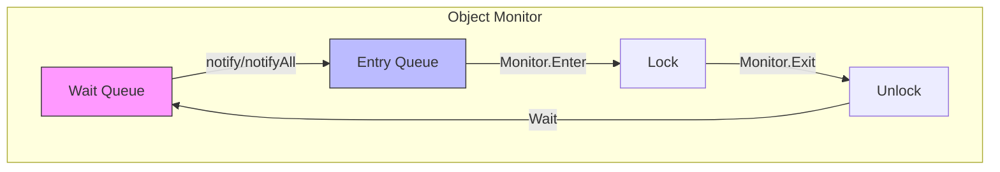

# 第7章 运行时性能优化：聚焦字符串、锁及其他

## 引言

运行时性能的效率对于扩展应用程序和满足用户需求至关重要。其核心是JVM，它管理运行时方面，如即时（JIT）编译、垃圾收集和线程同步——每一个都深刻影响Java应用程序的性能。

Java从Java 8到Java 17的演进展示了其对性能优化的承诺，这体现在350多个JDK增强提案（JEP）中。值得注意的优化包括`java.lang.String`占用的减少、竞争锁机制的进步以及字符串拼接的`indy`化[^1]，所有这些都显著提升了运行时效率。此外，诸如自旋等待提示等优化虽然不那么明显，但在增强系统性能方面至关重要。它们在云平台和多线程环境中特别有效，因为预计等待时间非常短。这些复杂的优化，常常隐藏在大型环境的复杂性之下，是服务提供商实现性能提升的核心。

在我的职业生涯中，我见证了Java运行时的动态演变。主要更新和预览功能（如虚拟线程）正越来越多地受到各种框架[^2]和库的支持，并被大型组织熟练集成。正如行业领袖在QCon旧金山会议上所讨论的那样[^3]，这种集成凸显了Java在这些组织中的战略地位，并指向向更深层次的JVM优化架构方法转变。

[^1]: https://openjdk.org/jeps/280
[^2]: https://spring.io/blog/2023/11/23/spring-boot-3-2-0-available-now
[^3]: https://qconsf.com/track/oct2023/jvm-trends-charting-future-productivity-performance

这一趋势在高性能数据库和存储系统中尤为明显，其中高效的线程模型至关重要。本章旨在揭开这些性能优势背后的“如何”和“为什么”，涵盖从字节码工程到字符串池、锁以及线程细微差别的广泛运行时方面。

为了进一步强调运行时，本章探讨了G1的字符串去重，并过渡到并发和并行领域，揭示了Java的Executor Service、线程池和ForkJoinPool框架。此外，它还介绍了Java的CompletableFuture以及虚拟线程和延续（continuations）的突破性概念，提供了Project Loom对未来并发的展望。虽然各种框架可能抽象掉这些复杂性，但对其评估和开发的概述及推理对于利用JVM的线程进步至关重要。

理解JVM内部框架的整体优化，以及它们的协调和区分，使我们能够更好地利用支持它们的工具，从而将JVM运行时改进的好处桥接到实际应用程序。

本次探索的一个关键目标是讨论JVM的内部工程如何增强代码执行效率。通过性能工程工具、分析工具和基准测试框架的视角剖析这些增强，我们旨在揭示它们全部的影响，并提供对JVM性能工程的透彻理解。尽管这些对JVM的改进在分布式环境中可能表现不同，但本章提炼了JVM的核心工程原理以及我们可用的性能工程工具。

当我们穿越运行时性能的 landscape 时，新手和经验丰富的开发人员都将欣赏JVM的持续增强如何简化开发过程。这些改进有助于建立一个更稳定和高效的 foundation，从而导致更少的性能相关问题 and 更顺畅的部署过程，甚至在要求最苛刻的环境中完善全面的系统体验。

## 字符串优化

随着Java平台的发展，它对编程中最普遍的构造之一——字符串的处理方法也在演变。鉴于字符串几乎是每个Java应用程序的基本方面，该领域的任何改进都可以显著影响应用程序的速度、内存占用和可扩展性。认识到这种关系，Java社区在字符串优化方面投入了大量精力。本节重点介绍在不同Java版本中引入的四项重要优化：

- **字面量和驻留字符串优化**：此优化涉及管理“字符串池”以减少堆占用，从而提高内存利用率。
- **G1中的字符串去重**：G1垃圾收集器提供的去重功能旨在通过去重相同的`String`对象来减少堆占用。
- **字符串拼接的indy化**：我们将研究字符串拼接在字节码级别的管理方式如何变化，从而提高性能并增加灵活性。
- **紧凑字符串**：我们将研究字符串的底层数组从`char[]`转变为`byte[]`如何减少应用程序的内存占用，使ASCII文本的空间需求减半。

每项优化不仅带来独特的优势，还呈现出其自身的一系列考虑和注意事项。在探索这些领域时，我们旨在理解其技术方面以及对应用程序性能的实际影响。

### HotSpot VM中的字面量和驻留字符串优化

在Java中减少分配开销一直是提升性能的重要机会。早在Java 9引入将字符串底层数组从`char[]`改为`byte[]`之前，OpenJDK HotSpot VM就已经采用了减少内存使用的技术，特别是针对字符串。

一项主要的优化涉及“字符串池”。由于字符串是不可变的，并且经常在应用程序的不同部分重复使用，Java中的`String`类利用一个池来节省堆空间。当调用`String.intern()`方法时，它会检查池中是否已存在相同的字符串。如果存在，该方法返回对现有字符串的引用，而不是分配新对象。

考虑一个实例`String1`，在Java 9之前，它会有一个`String1`对象和一个底层`char[]`（图7.1）。

![[Pasted image 20260505202717.png]]

> [!NOTE]- 图7.1 一个String对象

调用`String1.intern()`会检查池中是否存在具有相同值的现有字符串。如果未找到，则将`String1`添加到池中（图7.2）。

![[Pasted image 20260505202759.png]]

> [!NOTE]- 图7.2 Java堆内的字符串池


图7.3描述了字符串被驻留之前的情况。当创建一个新字符串`String2`并驻留它，且它与`String1`相等时，它将引用池中的同一个`char[]`（图7.4）。

![[Pasted image 20260505202816.png]]

> [!NOTE]- 图7.3 驻留之前的两个字符串对象

![[Pasted image 20260505202836.png]]

> [!NOTE]- 图7.4 驻留后的字符串对象共享同一引用

这种存储字符串的方法大大提高了内存效率，因为相同的字符串只存储一次。此外，可以使用`==`运算符快速高效地比较驻留字符串，因为它们共享相同的引用，而不必使用`equals()`方法。这不仅节省了内存，还加速了字符串比较操作，有助于应用程序更快的执行时间。

### 字符串去重优化与G1 GC

Java 8 update 20为G1 GC增强了字符串去重（dedup）优化，旨在减少内存占用。在停止世界（STW）的疏散暂停（年轻代或混合代）期间，或在后备完全收集的标记阶段，G1 GC识别去重候选对象。这些候选对象是`String`的实例，具有相同的`char[]`，并且已从伊甸园区疏散到幸存区或提升到老年代区域，且对象的年龄分别小于或等于去重阈值。去重涉及将一个`String`实例的`value`字段重新分配给另一个，从而避免需要重复的底层数组。

值得注意的是，大部分工作发生在名为“去重线程”的VM内部线程中。该线程与应用程序线程并发运行，通过计算哈希码并根据需要去重字符串来处理去重队列。

图7.5捕捉了本质：如果`String1`和`String2`逐字符相等，并且两者都由G1 GC管理，则重复的字符数组可以被替换为单个共享数组。

![[Pasted image 20260505202908.png]]

> [!NOTE]- 图7.5 Java中的字符串去重优化


> [!INFO] G1 GC的字符串去重功能默认不启用，可以通过JVM命令行选项控制。例如，要启用此功能，请使用`-XX:+UseStringDeduplication`选项。此外，可以使用`-XX:StringDeduplicationAgeThreshold=<#>`选项自定义`String`对象符合去重条件的年龄阈值。


对于有兴趣监控去重效果的开发者，可以使用 `-Xlog:stringdedup*=debug` 选项来获取详细日志。以下是一个示例日志输出：

```
...
[217.149s][debug][stringdedup,phases,start] Idle start
[217.149s][debug][stringdedup,phases      ] Idle end: 0.017ms
[217.149s][debug][stringdedup,phases,start] Concurrent start
[217.149s][debug][stringdedup,phases,start] Process start
[217.149s][debug][stringdedup,phases      ] Process end: 0.069ms
[217.149s][debug][stringdedup,phases      ] Concurrent end: 0.109ms
[217.149s][info ][stringdedup             ] Concurrent String Deduplication 45/2136.0B (new), 
1/40.0B (deduped), avg 114.4%, 0.069ms of 0.109ms
[217.149s][debug][stringdedup             ]   Last Process: 1/0.069ms, Idle: 1/0.017ms, Blocked: 
0/0.000ms
[217.149s][debug][stringdedup             ]     Inspected:              64
[217.149s][debug][stringdedup             ]       Known:                19( 29.7%)
[217.149s][debug][stringdedup             ]       Shared:                0(  0.0%)
[217.149s][debug][stringdedup             ]       New:                  45( 70.3%)  2136.0B
[217.149s][debug][stringdedup             ]       Replaced:              0(  0.0%)
[217.149s][debug][stringdedup             ]       Deleted:               0(  0.0%)
[217.149s][debug][stringdedup             ]     Deduplicated:            1(  1.6%)    40.0B(  1.9%)
...
```

> [!IMPORTANT]
> 开发者需要理解，虽然字符串去重能显著减少内存使用，但代价是 CPU 开销增加。去重过程本身需要计算资源，其影响应根据具体应用的性能需求和特征进行评估。

## 减少字符串的内存占用

Java 始终处于运行时优化的前沿。随着对高效内存管理的需求日益增长，Java 社区领导者引入了多项增强特性来减少字符串的内存占用。这项优化分两个重要部分交付：(1) 字符串拼接的 **indy-fication**（即引入 `invokedynamic`）；(2) 通过将底层数组从 `char[]` 改为 `byte[]` 引入 **紧凑字符串**。

### 字符串拼接的 indy-fication

**indy-fication** 是指使用来自 JSR 292[^5] 的 `invokedynamic` 特性，该特性作为 Java SE 7 的一部分，将动态语言支持引入了 JVM。JSR 292 通过添加一条新指令 `invokedynamic` 改变了 JVM 规范，该指令将转换延迟到运行时引擎，从而支持动态类型语言。

[^5]: https://jcp.org/en/jsr/detail?id=292

字符串拼接是 Java 中的基本操作，允许合并两个或多个字符串。如果你曾使用过 `System.out.println` 方法，那么你已经熟悉了用于此目的的 `+` 运算符。在下面的示例中，短语 `"It is "` 与布尔值 `trueMorn` 拼接，再与短语 `" that you are a morning person"` 拼接：

```java
System.out.println("It is " + trueMorn + " that you are a morning person");
```

输出会根据 `trueMorn` 的值而变化。以下是一种可能的输出：

```
It is false that you are a morning person
```

为了理解改进，让我们比较 Java 8 和 Java 17 生成的字节码。这是静态方法：

```java
private static void getMornPers() {
    System.out.println("It is " + trueMorn + " that you are a morning person");
}
```

我们可以使用 `javap` 工具查看该方法在 Java 8 下生成的字节码。命令行如下：

```bash
$ javap -c -p MorningPerson.class
```

以下是字节码反汇编：

```
  private static void getMornPers();
    Code:
       0: getstatic     #2                  // Field java/lang/System.out:Ljava/io/PrintStream;
       3: new           #9                  // class java/lang/StringBuilder
       6: dup
       7: invokespecial #10                 // Method java/lang/StringBuilder."<init>":()V
      10: ldc           #11                 // String It is
      12: invokevirtual #12                 // Method java/lang/StringBuilder.append:(Ljava/lang/
String;)Ljava/lang/StringBuilder;
      15: getstatic     #8                  // Field trueMorn:Z
      18: invokevirtual #13                 // Method java/lang/StringBuilder.append:(Z)Ljava/
lang/StringBuilder;
      21: ldc           #14                 // String that you are a morning person
      23: invokevirtual #12                 // Method java/lang/StringBuilder.append:(Ljava/lang/
String;)Ljava/lang/StringBuilder;
      26: invokevirtual #15                 // Method java/lang/StringBuilder.toString:()Ljava/
lang/String;
      29: invokevirtual #4                  // Method java/io/PrintStream.println:(Ljava/lang/
String;)V
      32: return
```

从这个字节码可以看出，`+` 运算符在内部被转换成了 `StringBuilder` API 的一系列 `append()` 调用。我们可以用 `StringBuilder` API 重写原始代码：

```java
String output = new StringBuilder().append("It is ").append(trueMorn).append(" that you are a morning person").toString();
```

该代码的字节码与使用 `+` 运算符的字节码类似。

然而，在 Java 17 中，字节码反汇编的外观明显不同：

```
  private static void getMornPers();
    Code:
       0: getstatic     #7                  // Field java/lang/System.out:Ljava/io/PrintStream;
       3: getstatic     #37                 // Field trueMorn:Z
       6: invokedynamic #41,  0             // InvokeDynamic #0:makeConcatWithConstants:(Z)Ljava/
lang/String;
      11: invokevirtual #15                 // Method java/io/PrintStream.println:(Ljava/lang/
String;)V
      14: return
```

该字节码经过优化，使用了带有 `makeConcatWithConstants` 方法的 `invokedynamic` 指令。这种转换被称为字符串拼接的 **indy-fication**。

`invokedynamic` 特性引入了一个 **引导方法（Bootstrap Method, BSM）**，用于辅助 `invokedynamic` 调用点。所有 `invokedynamic` 调用点都拥有方法句柄，这些句柄为 BSM 提供行为信息，BSM 在运行时被调用。要查看 BSM，请向 `javap` 命令行添加 `-v` 选项：

```bash
$ javap -p -c -v MorningPerson.class
```

以下是输出中的 BSM 摘录：

```
...
SourceFile: "MorningPerson.java"
BootstrapMethods:
  0: #63 REF_invokeStatic java/lang/invoke/StringConcatFactory.makeConcatWithConstants:(Ljava/
lang/invoke/MethodHandles$Lookup;Ljava/lang/String;Ljava/lang/invoke/MethodType;Ljava/lang/
String;[Ljava/lang/Object;)Ljava/lang/invoke/CallSite;
    Method arguments:
      #69 It is \u0001 that you are a morning person
InnerClasses:
  public static final #76= #72 of #74;    // Lookup=class java/lang/invoke/MethodHandles$Lookup of 
class java/lang/invoke/MethodHandles
```

如我们所见，运行时首先将 `invokedynamic` 调用转换为 `invokestatic` 调用。BSM 的方法参数指定了要从常量池链接和加载的常量。借助 BSM 并传递一个运行时参数，就可以将参数精确地放置在预先构建的字符串中。

采用 `invokedynamic` 进行字符串拼接带来了多项好处。首先，特殊字符串（如空字符串和 `null` 字符串）现在可以单独优化。当处理空字符串时，JVM 可以跳过不必要的操作，直接返回非空部分。类似地，JVM 可以有效处理 `null` 字符串，可能避免创建新的字符串对象和转换操作。

传统字符串拼接（尤其是使用 `StringBuilder`）的一个显著挑战是建议预先计算结果字符串的总长度。这一步旨在确保 `StringBuilder` 的内部缓冲区不会经历多次对性能有害的重置。使用 `invokedynamic` 后，这个问题得到缓解——JVM 能够动态确定结果字符串的最佳大小，确保高效的内存分配，无需手动估算长度。当被拼接字符串的长度不可预测时，这一功能尤其有益。

此外，`invokedynamic` 指令固有的灵活性意味着字符串拼接可以不断受益于 JVM 的进步。随着 JVM 的发展，引入新的优化技术，字符串拼接可以无缝地受益，而无需修改字节码或源代码。这不仅确保了字符串操作在不同 JVM 版本中保持高效，还能使应用程序避免潜在的性能瓶颈。

因此，对于关注性能的开发者来说，转向 `invokedynamic` 是一项重大进步。它简化了开发者的工作，减少了显式性能模式（如手动估算长度）的需求，并确保字符串操作由 JVM 自动优化。这种对 JVM 不断演进的智能的依赖不仅带来了即时性能提升，还能使你的代码与未来增强功能保持一致，是编写更快、更简洁、更高效的 Java 代码的明智长期投资。

### 紧凑字符串

在深入了解紧凑字符串之前，理解更广泛的背景至关重要。虽然计算性能通常围绕响应时间或吞吐量等指标，但 Java 中 `String` 类的改进主要侧重于一个略有不同的领域：**内存效率**。鉴于字符串在应用程序中的普遍性（从文本到 XML 处理），增强其内存占用可以显著影响应用程序的整体效率。

在 JDK 8 及更早版本中，JVM 内部使用字符数组（`char[]`）存储 `String` 对象。由于 Java 对字符采用 UTF-16 编码，每个 `char` 在内存中占用 2 个字节。正如 JEP 254: Compact Strings[^6] 所指出的，大多数字符串使用 Latin-1 字符集（7 位 ASCII 的 8 位扩展）编码，这是 HTML 的默认字符集。Latin-1 每个字符仅需 1 个字节——因此 JDK 8 本质上为每个存储的 Latin-1 字符浪费了 1 个字节的内存。

[^6]: https://openjdk.org/jeps/254

## 紧凑字符串的影响

JDK 9 通过 JEP 254: 紧凑字符串引入了一项重大变更，以解决该问题：它将 `String` 类的内部表示从 `char[]` 改为 `byte[]`。这一基础性修改减少了拉丁-1 编码字符串字符的内存浪费，同时保持了公共 API 不变。

回顾我在 Sun/Oracle 工作的时期，我们曾在 Java 6 中尝试过类似的优化，称为压缩字符串。然而，Java 6 采用的方法效果不佳，因为压缩是在 `String` 对象构造期间完成的，但字符串操作仍然在 `char[]` 上进行。因此，需要执行“解压缩”步骤，这限制了优化的实用性。

相比之下，紧凑字符串优化消除了解压缩的需要，从而提供了更有效的解决方案。这一更改也使字符串操作的 API（如 `StringBuilder` 和 `StringBuffer`）以及与字符串操作相关的 JIT 编译器内联函数[^7] 受益。

[^7]: https://chriswhocodes.com/hotspot_intrinsics_openjdk11.html

![[Pasted image 20260505202950.png]]

**图 7.6**  JDK 8 中的传统字符串表示

![[Pasted image 20260505202959.png]]

**图 7.7**  JDK 17 中的紧凑字符串表示

## 字符串表示的可视化

为了更好地理解这一概念，我们通过图表来可视化 JDK 8 中字符串的表示。图 7.6 展示了 `String` 对象如何由一个字符数组 (`char[]`) 支撑，每个字符占用 2 字节。

转向 JDK 9 及更高版本，紧凑字符串引入的优化如图 7.7 所示：`String` 对象现在由一个字节数组 (`byte[]`) 支撑，对于拉丁-1 字符仅使用必要的内存。

## 分析紧凑字符串：使用 NetBeans IDE 洞察 JVM 内部机制

为了说明紧凑字符串优化的优势，并让注重性能的 Java 开发者能够探索 JVM 内部机制，我们将重点放在 `String` 对象及其支撑数组的实现上。为此，我们将使用 NetBeans 集成开发环境 (IDE) 对一个简单的 Java 程序进行分析——这更像是一个演示，而非全面的基准测试。这种方法旨在展示如何分析 JVM 中的对象和类行为，特别是 JVM 在这两个不同版本中如何处理字符串。

我们用于此练习的 Java 代码旨在将两个日志文件的内容合并到第三个文件中。该程序使用了多个关键的 Java I/O 类，如 `BufferedReader`、`BufferedWriter`、`FileReader` 和 `FileWriter`。由于它大量涉及字符串处理，因此是突出显示 JDK 8 和 JDK 17 之间字符串表示变化的理想选择。需要强调的是，此设置更多是作为一种教学工具，而非精确定位性能的手段。其目的不是测量性能影响，而是提供一扇了解 JVM 内部字符串处理机制的窗口。

```java
package mergefiles;
 
import java.io.BufferedReader;
import java.io.BufferedWriter;
import java.io.FileReader;
import java.io.FileWriter;
import java.io.PrintWriter;
import java.io.IOException;
 
public class MergeFiles {
 
    public static void main(String[] args) {
 
       try
       {
            BufferedReader appreader = new BufferedReader(new FileReader( "applog.log"));
            BufferedReader gcreader = new BufferedReader(new FileReader( "gclog.log"));
            PrintWriter writer = new PrintWriter(new BufferedWriter(new FileWriter("all_my_logs.log")));
            
            String appline, gcline;
           
                while ((appline = appreader.readLine()) != null)
                {                        
                    writer.println(appline); 
                }
                
                while((gcline = gcreader.readLine()) != null)
                {    
                    writer.println(gcline);    
                } 
       }
       catch (IOException e)
       {
            System.err.println("Caught IOException: " +  e.getMessage());
       }
 
    }
   
}
```

NetBeans IDE 是开发者常用的工具，它配备了强大的分析工具，允许我们检查和程序运行时行为，包括 `String` 对象的内存消耗。JDK 8 的分析步骤如下：

1. **启动分析**：从“Profile”（分析）菜单中选择“Profile Project”（分析项目），如图 7.8 所示。

![[Pasted image 20260505203016.png]]

**图 7.8**  Apache NetBeans 分析菜单

2. **配置分析会话**：从“Configure Session”（配置会话）选项中，选择“Objects”（对象），如图 7.9 所示。

![[Pasted image 20260505203030.png]]

**图 7.9**  Apache NetBeans 配置会话

3. **开始分析**：在图 7.10 中，注意“Configure Session”（配置会话）按钮已更改为“Profile”（分析）并带有“▶”图标，表示单击此按钮开始分析。

![[Pasted image 20260505203057.png]]

**图 7.10**  Apache NetBeans 分析设置

4. **观察分析输出**：单击按钮后，分析开始。输出将显示在 Output（输出）窗口中，文本为“Profile Agent: ...”（图 7.11）。分析完成后，您可以保存快照。我将其保存为 `JDK8-Objects`。

![[Pasted image 20260505203109.png]]

**图 7.11**  Apache NetBeans 所有类的分析完成

5. **快照分析**：现在让我们放大快照，如图 7.12 所示。

![[Pasted image 20260505203119.png]]

**图 7.12**  放大的分析窗口

6. **基于类的分析（JDK 8）**：由于 Java 8 中的支撑数组是 `char[]`，因此 `char[]` 出现在最顶层并不奇怪。为了进一步调查，让我们基于 `char[]` 进行分析。我们将查看这些类，并旨在验证此 `char[]` 确实是 `String` 的支撑数组（参见图 7.13）。

![[Pasted image 20260505203129.png]]

**图 7.13**  Apache NetBeans 分析类菜单

7. **深入的类分析（JDK 8）**：选择“Profile Class”（分析类）后，您将看到（如图 7.14 所示）一个类被选中。然后您可以单击“Profile”（分析）按钮开始分析。

![[Pasted image 20260505203138.png]]

**图 7.14**  Apache NetBeans 分析单个类

8. **进一步分析（JDK 8）**：分析可能需要几秒钟，具体取决于您的系统。当您展开第一个、最顶层的路径时，最终窗口看起来像图 7.15 所示。

![[Pasted image 20260505203210.png]]

**图 7.15**  Apache NetBeans 展开的类菜单

现在，让我们看看这个过程在 JDK 17 中如何变化：

1. **重复初始步骤**：对于 Java 17，我使用了 Apache NetBeans 18 分析器，并重复步骤 1 到 3 来分析对象，捕获的分析结果如图 7.16 所示。

![[Pasted image 20260505203221.png]]

**图 7.16**  Apache NetBeans 18 捕获的分析结果

2. **基于类的分析（JDK 17）**：由于这是 Java 17，支撑数组已改为 `byte[]`；因此，我们看到 `byte[]` 对象位于最顶层。因此，紧凑字符串变更生效。让我们选择 `byte[]` 并分析类以确认它确实是 `String` 的支撑数组。图 7.17 显示了结果。

![[Pasted image 20260505203232.png]]

**图 7.17**  放大的分析窗口，显示 `byte[]` 位于最顶层

3. **字符串初始化分析（JDK 17）**：我们可以看到从 `String` 初始化调用了 `StringUTF16.compress`。此外，还看到了 `StringLatin1.newString()`，它最终调用 `Arrays.copyOfRange`。这个调用树反映了与紧凑字符串相关的变更。

4. **观察结果（JDK 17）**：当我们将图 7.17 与从 JDK 8 获得的分析结果进行比较时，我们注意到内存使用模式发生了变化。值得注意的是，`StringUTF16.compress` 和 `StringLatin1.newString` 在 JDK 8 的分析结果中缺失（参见图 7.18）。

![[Pasted image 20260505203242.png]]

**图 7.18**  （JDK 8 分析结果中缺少这些方法的说明，此处为文本描述）

Figure 7.18  缩放后的分析图，显示 `char[]` 位于顶部

通过遵循这些步骤并比较结果，紧凑字符串的影响变得显而易见。在 JDK 8 中，`char[]` 成为主要的内存消耗对象，表明其作为 `String` 后备数组的角色。在 JDK 17 中，`byte[]` 承担了这一角色，表明紧凑字符串的成功实现。通过分析性能分析结果，我们验证了 JDK 17 中基于字节的数组在压缩 UTF16 字符串方面的效率，并深入了解了 JVM 内部的字符串管理机制。

鉴于 JDK 17（以及 JDK 11）中 `String` 对象效率的显著提升，探索运行时可以带来更好性能的其他领域也变得同等重要。一个关键领域是在确保多线程应用程序平稳运行中起关键作用的同步原语基础知识以及运行时在该领域的进展。

## 增强的多线程性能：Java 线程同步

在当今高性能计算环境中，并发执行任务的能力不仅是优势，更是必需品。有效的多线程允许高效扩展，充分利用现代处理器的潜力，并优化各种资源的利用。跨线程共享数据进一步提高了资源效率。然而，随着系统规模扩大，不仅仅关乎添加更多线程或处理器，还涉及理解管理可伸缩性的底层原理。

进入可伸缩性定律的领域。许多开发人员熟悉 Amdahl 定律，该定律通过关注任务的串行部分来强调并行化的限制，但并未捕捉现实世界并行处理的所有细微差别。Gunther 的通用可伸缩性定律（USL）提供了更全面的视角。USL 同时考虑了对共享资源的争用以及确保数据更新跨处理器一致时产生的缓存一致性延迟。通过理解这些因素，开发人员可以预见潜在的瓶颈，并对系统设计和优化做出明智的决策。

然而，就目前而言，对可伸缩性的理论理解虽然是必要的，但只是等式的一部分。实际挑战出现在多个线程为了追求效率而尝试并发访问共享资源时。可变共享状态如果管理不当，将成为数据竞争和内存异常的温床。Java 以其丰富的并发编程模型来应对这一挑战。其并发 API 工具集和同步构造使开发人员能够构建既高性能又线程安全的应用程序。

Java 并发策略的核心是 **Java 内存模型（JMM）**。JMM 定义了线程与 Java 应用程序中内存的合法交互。它引入了 **happens-before** 关系的概念——一个基本的有序性约束，保证内存可见性，并确保某些内存操作在另一些之前排序。

例如，考虑两个线程 “a” 和 “b”。如果线程 “a” 修改了一个共享变量，随后线程 “b” 读取该变量，则必须建立 happens-before 关系，以确保 “b” 能观察到 “a” 所做的修改。

为了促进这种有序交互并防止内存异常，Java 提供了同步机制。开发人员主要工具之一是基于监视器锁的同步，这是每个 Java 对象内在的锁。这些锁确保对对象的独占访问，并在竞争同一资源的线程之间建立 happens-before 关系。

> [!NOTE]  
> 传统的 Java 对象通常与其关联的监视器呈一对一的对应关系。然而，Java 生态系统正经历着一场深刻的变革，这得益于诸如 Lilliput、Valhalla 和 Loom 等项目的推进。这些倡议预示着 Java 生态系统中既定规范的根本性转变——从对象头结构到线程管理的本质——并为 Java 并发的新时代铺平了道路。  
> - **Project Lilliput** 旨在通过精简 Java 对象头开销来最小化开销，这可能导致对象监视器与其同步的 Java 对象解耦。  
> - **Project Valhalla** 引入了值类型，这些类型是不可变的，并且缺乏常规 Java 对象所拥有的身份，从而重塑了传统的同步模型。  
> - **Project Loom** 专注于轻量级线程并增强并发性，进一步昭示了 Java 同步与并发实践的演进方向。  
>  这些项目重新定义了 Java 在对象管理和同步方面的处理方式，反映了为适应现代计算范式而优化该语言的持续努力。  
> ⁸ 参见：https://wiki.openjdk.org/display/lilliput

为了说明 Java 的同步机制，请考虑以下代码片段：

```java
public void doActivity() {
     synchronized(this) {
          // 同步块内部受保护的代码
     }
     // 同步块外部的常规代码
}
```

在这个例子中，线程必须获取实例对象（`this`）上的监视器锁才能执行受保护的代码。在此块之外，不需要这样的锁。

同步方法提供了类似的机制：

```java
public synchronized void doActivity() {
     // 同步方法内受保护的代码
}
// 同步方法外部的常规代码
```

> [!NOTE]  
> - 同步块本质上是封装的同步语句。  
> - 实例级同步仅适用于非静态方法，而静态方法需要类级同步。  
> - 实例对象的监视器与同一类的类对象监视器是不同的。

### 监视器锁的作用

在 Java 中，线程通过同步其操作来有效通信并确保数据一致性。这种同步的核心是监视器锁的概念。监视器锁通常简称为监视器，充当互斥锁，确保在任何给定时间只有一个线程可以拥有该锁并执行关联的同步代码块。

当线程遇到同步块时，它会尝试获取被同步对象关联的监视器锁。如果该锁已被另一个线程持有，则尝试线程将被挂起并加入该对象的 **等待集合（wait set）**——一系列排队等待获取该对象锁的线程。Java 中的每个对象天生都有一个关联的等待集合，该集合在对象创建时为空。

监视器锁在确保对共享资源的操作具有原子性、防止并发访问异常方面起着关键作用。在同步块内完成操作后，线程释放监视器锁。在释放之前，它可以选择调用对象的 `notify()` 或 `notifyAll()` 方法。`notify()` 方法从对象的等待集合中唤醒一个被挂起的线程，而 `notifyAll()` 唤醒所有等待的线程。

## OpenJDK HotSpot VM 中的锁类型

在 Java 的锁定机制上下文中，锁是用户空间事件，这类事件向操作系统（OS）显示为自愿上下文切换。因此，Java 运行时根据线程相对于被锁定对象的状态来优化和调度线程。在任何给定时刻，锁可以是 **有竞争（contended）** 或 **无竞争（uncontended）** 的。

### 锁竞争动态

当多个线程同时尝试获取锁时，就会发生锁竞争。如果线程 “t” 在一个同步块中处于活动状态，而另一个线程 “u” 尝试进入同一块，则在没有其他线程等待的情况下，锁是无竞争的。然而，一旦 “u” 尝试进入并因 “t” 持有锁而被迫等待，竞争就出现了。Java 的锁定机制经过优化，能够处理此类场景，在竞争频繁时从轻量级锁过渡到重量级锁。

#### 无竞争和膨胀前的锁（Uncontended and Deflated Locks）

无竞争和膨胀前的锁是轻量级的、基于栈的锁，针对无竞争场景进行了优化。HotSpot VM 通过一个简单的原子比较并交换指令（CAS）实现 **thin lock**（薄锁）。这个 CAS 操作将一个指向锁记录的指针（该锁记录生成于线程的栈中）放入对象的 **头字（header word）**。锁记录包含原始头字和实际指向同步对象的指针——这种机制称为 **置换头（displaced header）**。这种轻量级锁机制集成在解释器和 JIT 编译代码中，高效地管理了单一线程访问对象的同步。当检测到竞争时，该锁会膨胀为重量级锁。

> [!NOTE]  
> 原子指令（尤其是 CAS）的细节已在第 5 章“端到端 Java 性能优化：工程技术与 JMH 微基准测试”中讨论过。

#### 有竞争和膨胀的锁（Contended and Inflated Locks）

有竞争和膨胀的锁是重量级锁，在线程之间发生竞争时被激活。当一个 thin lock 遇到竞争时，JVM 将其膨胀为重量级锁。这种转换需要与操作系统进行更复杂的交互，尤其是在挂起竞争线程和唤醒已挂起线程时。重量级锁使用操作系统的原生互斥机制来管理竞争，确保同步块一次只能由一个线程执行。

### 代码示例与分析

考虑以下代码片段，它演示了监视器锁的使用以及 `wait()` 和 `notifyAll()` 方法的交互：

```java
public void run() {
    // 循环预定次数的迭代
    for (int j = 0; j < MAX_ITERATIONS; j++) {
        
        // 在共享资源上同步以确保线程安全
        synchronized(sharedResource) {
            
            // 检查当前线程类型是否为 DECREASING
            if(threadType == ThreadType.DECREASING) {
                
                // 等待,直到计数器不为零
                while (sharedResource.getCounter() == 0) {

synchronized(sharedResource) {
            
    // 检查当前线程类型是否为 DECREASING
    if(threadType == ThreadType.DECREASING) {
                
        // 等待直到计数器不为零
        while (sharedResource.getCounter() == 0) {
            try {
                // 等待直到另一个线程对该对象调用 notify() 或 notifyAll()
                sharedResource.wait();
            } catch (InterruptedException e) {
                // 处理中断异常并退出线程
                Thread.currentThread().interrupt();
                return;
            }
        }
                
        // 递减共享资源的计数器
        sharedResource.decrementCounter();
                
        // 打印当前状态(该方法会提供当前状态的更多细节)
        printStatus();
    } 
    // 如果当前线程类型不是 DECREASING(即 INCREASING)
    else {
                
        // 等待直到计数器未达到最大值(例如 10)
        while (sharedResource.getCounter() == 10) {
            try {
                // 等待直到另一个线程对该对象调用 notify() 或 notifyAll()
                sharedResource.wait();
            } catch (InterruptedException e) {
                // 处理中断异常并退出线程
                Thread.currentThread().interrupt();
                return;
            }
        }
                
        // 递增共享资源的计数器
        sharedResource.incrementCounter();
                
        // 打印当前状态(该方法会提供当前状态的更多细节)
        printStatus();
    }
            
    // 唤醒所有在此对象监视器上等待的线程
    sharedResource.notifyAll();
}
```

**增强的多线程性能：Java 线程同步**

该代码执行以下操作：

- **同步**：`synchronized(sharedResource)` 块确保互斥访问。任意时刻只有一个线程可以执行其中的代码。如果另一个线程在该块被占用时尝试进入，它将被强制等待。
- **计数器管理**：
  - 对于类型为 `DECREASING` 的线程，检查 `sharedResource` 的计数器。如果为零，线程进入等待状态，直到另一个线程修改计数器并发送通知。一旦被唤醒，它递减计数器并打印状态。
  - 相反，对于类型为 `INCREASING` 的线程，检查计数器是否达到最大值（10）。如果计数器已满，线程等待直到另一个线程修改计数器并发送通知。一旦被通知，它递增计数器并打印状态。
- **通知**：修改计数器后，线程通过调用 `sharedResource.notifyAll()` 方法向所有在 `sharedResource` 对象监视器上等待的其他线程发送唤醒信号。

## Java 锁机制的演进

多年来，Java 的锁机制在 API 层面和 HotSpot VM 层面都经历了显著的改进。本节提供到 Java 8 为止这些增强功能的结构化概述。

### API 级别增强

- **ReentrantLock（Java 5）**：`ReentrantLock` 属于 `java.util.concurrent.locks` 包，比 `synchronized` 关键字提供的内置锁更灵活。它支持诸如定时锁等待、可中断锁等待以及创建公平锁等特性。

  得益于 `ReentrantLock`，我们有了 `ReadWriteLock`，它使用一对锁：一个锁用于支持并发的只读操作，另一个独占锁用于写入。

  > [!NOTE]
  > 尽管 `ReentrantLock` 提供了高级功能，但它并非 `synchronized` 的直接替代品。开发人员在选择两者之前应权衡利弊。

- **StampedLock（Java 8）**：`StampedLock` 提供了一种乐观读机制，在高竞争条件下可以提高吞吐量。它像 `ReentrantReadWriteLock` 一样支持读写锁，但具有更好的可伸缩性。与其他锁不同，`StampedLock` 没有“所有者”，这意味着任何线程都可以释放锁，而不仅仅是获取锁的线程。使用 `StampedLock` 时需要仔细管理以避免潜在问题。

  > [!NOTE]
  > `StampedLock` 不支持可重入性，因此必须注意避免死锁。

### HotSpot VM 优化

- **偏向锁（Java 6）**：偏向锁是一种旨在提高无竞争锁性能的策略。通过这种方法，JVM 使用单个原子 CAS 操作将线程 ID 嵌入对象头中，表明该对象偏向于某个特定线程。这消除了偏向线程后续访问时的原子操作需求，在同一个线程重复获取锁的场景下提供了性能提升。

  > [!NOTE]
  > 偏向锁的引入是为了提升性能，但它给 JVM 带来了复杂性。一个重要的挑战是撤销偏向期间不可预测的延迟，这可能导致某些场景下性能不可预测。鉴于现代硬件和软件模式的演进削弱了偏向锁的优势，它在 JDK 15 中被弃用，为更一致、更可预测的同步技术铺平了道路。如果在 Java 15 之后的版本中尝试使用它，将生成以下警告：
  > ```
  > Java HotSpot™ 64-Bit Server VM warning: Option UseBiasedLocking was deprecated in version 15.0 and will likely be removed in a future release.
  > ```

- **锁消除**：该技术利用 JVM 的逃逸分析优化。JVM 检查锁对象是否“逃逸”出其当前作用域——即是否在创建它的方法或线程之外被访问。如果锁对象保持受限，JVM 可以消除锁及其相关开销，将字段值保留在寄存器中（标量替换）。
  **示例**：考虑一个方法，其中创建一个对象，加锁，修改，然后解锁。如果该对象没有逃逸出该方法，JVM 可以消除锁。

- **锁粗化**：我们经常会遇到包含多个 `synchronized` 语句的代码。然而，这些语句可能锁定的是同一个对象。JVM 可以将这些锁合并为一个更粗粒度的锁，而不是多次加锁，从而减少锁开销。JVM 对有竞争和无竞争的锁都应用此优化。
  **示例**：在一个循环中，每次迭代都有一个锁定同一对象的 `synchronized` 块，JVM 可以将这些锁粗化为循环外的一个锁。

- **自适应自旋（Java 7）**：在 Java 7 之前，遇到已锁定监视器的线程会立即进入等待状态。自适应自旋的引入允许线程短暂自旋（忙等待或自旋等待），预期锁很快会被释放。这一改进在多处理器系统上显著提升了性能，因为线程可能只需等待很短时间就能获取锁。

尽管这些无疑是锁相关的一些重要改进，但在各个 Java 版本中还出现了许多其他与同步和并发相关的增强、错误修复和性能调整。对于希望获得全面见解的读者，请参考官方 Java 文档。[^9] [^10]

## 优化竞争：Java 9 以来的增强

竞争锁对于确保多线程 Java 应用程序的平稳运行至关重要。多年来，Java 的演进一直专注于增强其竞争锁机制。受 JEP 143：改进竞争锁[^11] 的启发，Java 9 引入了一系列关键改进，并在后续版本中得到了进一步优化。其中突出的增强包括加速 Java 监视器进入操作和提高监视器退出操作的效率。这些操作是 Java 中 `synchronized` 方法和块的基础。

为了理解监视器进入和退出操作的重要性，让我们回顾一些基本概念。我们之前已经讨论过竞争锁上下文中的 `notify` 和 `notifyAll` 操作。然而，监视器操作（这是 `synchronized` 方法调用的核心）的复杂性可能对某些读者来说不太熟悉。例如，在我们的 `synchronized` 语句示例中，这些调用在幕后进行。通过 `javap -c` 查看 `sharedResource` 生成的字节码可以更清晰地理解：

```java
public void run();
 Code:
 ...       
  9: getfield #9 // Field sharedResource:LReservationSystem$SharedResource;
 12: dup
 13: astore_2
 14: monitorenter
 15: aload_0
 ...
 52: aload_2
 53: monitorexit
 ...
```

[^9]: https://docs.oracle.com/javase/tutorial/essential/concurrency/sync.html
[^10]: https://docs.oracle.com/en/java/javase/17/docs/api/java.base/java/util/concurrent/locks/package-summary.html
[^11]: https://openjdk.org/jeps/143


### 增强的多线程性能：Java线程同步

本质上，`monitorenter`和`monitorexit`在处理同步方法或同步块期间负责获取和释放对象上的锁。当线程遇到`wait()`调用时，它会转换到等待队列（Wait Queue）。只有当`notify()`或`notifyAll()`被调用时，线程才会移动到入口队列（Entry Queue），从而可能重新获得锁（图7.19）。



**图7.19 对象的监视器等待队列和入口队列**

> [!NOTE] **改进的Java Monitor进入和快速退出操作**
> 有竞争锁定是一种资源密集型操作，任何减少竞争时间的改进都会直接影响Java应用程序的效率。随着时间的推移，JVM经过了精心优化以提升同步性能，从Java 8到Java 17取得了显著进展。JVM性能工程的一个关键方面涉及梳理和理解这些运行时增强。

在Java 8中，进入一个膨胀的、有竞争的锁会调用`InterpreterRuntime::monitorenter`方法（图7.20）。如果锁不是立即可用的，则会调用较慢的`ObjectSynchronizer::slow_enter`方法。通过JEP 143引入的增强功能优化了这一过程，在Java 17中改进显而易见。Java 17中的`ObjectSynchronizer::enter`方法优化了常用代码路径——例如，通过将置换头（displaced header）设置为特定值来指示所使用的锁类型。这种调整为常见锁类型的高效管理提供了一条精简路径，如图7.21中“优化的ObjectSynchronizer::enter”路径所示。

退出锁的过程也得到了优化。Java 8的`InterpreterRuntime::monitorexit`可能回退到较慢的退出例程，而Java 17中优化的`ObjectSynchronizer::exit`方法确保了更快的释放锁路径。

**Java 8膨胀的、有竞争的锁**
- 进入锁 (Entering the Lock): `InterpreterRuntime::monitorenter` → `ObjectSynchronizer::slow_enter` (回退)
- 退出锁 (Exiting the Lock): `InterpreterRuntime::monitorexit` → `ObjectSynchronizer::slow_exit` (回退)
- 主要路径: `ObjectSynchronizer::enter`, `ObjectSynchronizer::exit`

**图7.20 Java 8中竞争锁进入和退出调用路径的高层概览**

**Java 17膨胀的、有竞争的锁**
- 进入锁 (Entering the Lock): `InterpreterRuntime::monitorenter` → 优化的 `ObjectSynchronizer::enter`
- 退出锁 (Exiting the Lock): `InterpreterRuntime::monitorexit` → 优化的 `ObjectSynchronizer::exit`

**图7.21 Java 17中竞争锁进入和退出调用路径的高层概览**

JDK 17中的进一步增强涉及加速Java的监视器`wait`和`notify/notifyAll`操作。这些操作使用一个`quick_notify`例程，高效地管理等待队列中的线程，并确保它们及时移动到监视器进入队列，从而消除了对慢速回退方法的依赖。

### 可视化竞争锁优化：性能工程练习

JVM性能工程不仅仅是识别瓶颈——它使我们能够深入了解那些能带来运行时效率提升的增强。因此，本节将进行一次动手探索，以说明Java 17在处理竞争锁方面相比Java 8的性能改进。

我们将应用第5章“端到端Java性能优化：工程技术与JMH微基准测试”中讨论的性能工程方法论，旨在通过利用分析器（profiler）和JMH基准测试工具来揭开这些方法的神秘面纱。

我们的探索围绕两个关键方面：

- **行动中的性能工程**：一个实际的性能问题处理示例，从问题识别到应用基准测试和分析以进行深入分析。
- **从理论到实践**：将第5章的概念与其实际应用联系起来，并演示竞争锁优化。

此外，我们将探索A/B性能测试，这是一种有针对性的实验设计方法，旨在比较两个JDK版本的性能结果。A/B性能测试是一种强大的技术，可以凭经验验证性能改进，确保所引入的任何更改都能带来切实的好处。

在探索竞争锁优化时，我们将利用Java微基准测试工具（JMH）。如第5章所述，JMH是进行性能基准测试的强大工具。以下是一个为评估同步块的递归加锁和解锁操作而定制的微基准测试：

```java
/** Perform recursive synchronized operations on local objects within a loop. */
@Benchmark
public void testRecursiveLockUnlock() {
    Object localObject = lockObject1;
    for (int i = 0; i < innerCount; i++) {
        synchronized (localObject) {
            synchronized (localObject) {
                dummyInt1++;
                dummyInt2++;
            }
        }
    }
}
```

`testRecursiveLockUnlock`方法旨在严格评估竞争锁的性能动态，特别是`monitorenter`和`monitorexit`操作。该方法通过对局部对象（`localObject`）在嵌套循环中执行同步操作来实现这一点。循环的每次迭代会导致`monitorenter`操作被调用两次（由于嵌套的同步块），而在退出同步块时`monitorexit`操作也被调用两次。对于有兴趣进一步探索的人，这个以及其他加锁/解锁微基准测试可在GitHub上的JMH JDK微基准测试代码工具仓库中找到，感谢OpenJDK社区的贡献者。^[13: https://github.com/openjdk/jmh-jdk-microbenchmarks]

最后，为了丰富我们的分析，我们将集成async-profiler。^[14: https://github.com/async-profiler/async-profiler] 该分析器将以火焰图（flamegraph）和调用树（call tree）两种模式使用。调用树模式提供了有价值的细粒度交互洞察，揭示了执行过程中选择的特定路径。

#### 设置与数据收集

我们的主要目标是深入揭示竞争锁改进的细节，并衡量它们引入的性能提升。为此，我们需要一个精细的设置和数据收集过程。通过使用Java 8作为性能基线，我们可以与后继版本Java 17进行比较，从而获得有洞察力的结论。以下是练习设置的综合概览：

1. **环境设置**：
   - 确保系统上同时安装了JDK 8和JDK 17。这种双设置允许进行并排性能评估。
   - 安装JMH以进行性能测量，并安装async-profiler以深入分析Java运行时。熟悉async-profiler的命令行选项。

2. **仓库克隆**：
   - 从GitHub克隆JMH JDK微基准测试仓库。这个仓库是专为JDK增强和测量而设计的微基准测试宝库。
   - 导航到`src`目录。在这里你将找到`vm/lang/LockUnlock.java`基准测试，它将是我们这次探索的主要工具。

3. **基准测试编译**：
   - 使用Maven项目管理工具编译基准测试。确保指定了适当的JDK版本以保持版本一致性。
   - 编译完成后，验证基准测试的完整性和执行就绪状态。

完成上述步骤后，你将拥有一个稳健的设置，用于进行测试和分析竞争锁改进及其对JVM性能的影响。

#### 测试与性能分析

为了全面而精确地理解JVM的竞争锁性能，必须遵循结构化方法并采用特定配置。本节重点介绍准确性能分析所必需的步骤和注意事项。

> [!TIP] 有关A/B性能测试的更多信息，请参阅第5章。

## 基准测试配置

选择 `RecursiveLockUnlock` 基准测试用于我们的研究后，目标是评估一致条件下监视器进入和退出路径，尽量减少任何外部或内部干扰。以下是细化的建议：

- **基准测试选择的一致性**：`LockUnlock.testRecursiveLockUnlock` 基准测试符合测量监视器进入和退出路径的具体目标。这确保了结果直接与所审视的性能方面相关。
- **消除偏向锁**：由于 Java 8 包含了偏向锁优化，使用 JVM 选项 `-XX:-UseBiasedLocking` 禁用它，以消除其对结果的潜在影响。这一步对于确保无偏的结果至关重要。
- **排除基于栈的锁**：在 JVM 参数中加入 `-XX:+UseHeavyMonitors`。这一预防措施确保 JVM 不会利用优化锁技术（如基于栈的锁），以免扭曲结果。
- **充分的预热**：基准测试的本质是重复的锁和解锁操作。因此，充分预热微基准测试运行非常重要，确保 JVM 在其峰值性能下运行。此外，将定时测量与性能分析运行分开，以考虑性能分析固有的开销。
- **一致的垃圾回收策略**：如第6章“OpenJDK 中的高级内存管理与垃圾回收”所述，Java 17 默认使用 G1 GC。为公平比较，跨版本匹配 GC 策略，将 Java 17 配置为使用吞吐量收集器（Java 8 的默认值）。虽然 GC 可能不会直接影响此微基准测试，但保持统一的性能基准环境至关重要。

> [!NOTE]
> 预热迭代使 JVM 为准确的性能测试做好准备，消除 JIT 编译、类加载和其他 JVM 优化带来的异常。

## 基准测试执行

为了准确评估有竞争的 JVM 锁的性能，在 JMH 框架内为 Java 8 和 Java 17 执行 `testRecursiveLockUnlock` 基准测试。将输出保存到文件以便详细分析。执行命令行大致如下：

```bash
jmh-micros mobeck$ java -XX:+UseHeavyMonitors -XX:+UseParallelGC -XX:-UseBiasedLocking -jar micros-jdk8/target/micros-jdk8-1.0-SNAPSHOT.jar -wi 50 -i 50 -f 1 .RecursiveLockUnlock.* 2>&1 | tee <logfilename.txt>
```

在前面的行中，请注意以下选项：

- `-wi 50`：指定预热迭代次数。
- `-i 50`：指定测量迭代次数。
- `-f 1`：指定分支数。分支会创建单独的 JVM 进程，以确保结果不会被 JVM 优化扭曲。由于我们已经最大化 CPU 资源，这里只使用一个分支。

对于其余设置，使用 JMH 套件中的默认值。运行基准测试并捕获结果后，我们可以启动性能分析器测量。对于火焰图模式，使用以下命令：

```bash
async-profiler-2.9 mobeck$ ./profiler.sh -d 120 -j 50 -a -t -s -f <path-to-logs-dir>/<filename>.html <pid-of-RecursiveLockUnlock-process>
```

- `-d 120`：将性能分析持续时间设置为 120 秒。
- `-j 50`：每 50ms 采样一次。
- `-a`：分析所有方法。
- `-t`：添加线程名称。
- `-s`：简化类名。
- `-f`：指定输出文件。

如需调用树分解，添加 `-o tree` 将数据组织成树状结构。

## 比较 Java 8 与 Java 17 的性能

获得 Java 8 和 Java 17 的性能分析数据后，我们继续对比它们的性能。打开两个版本的 HTML 文件，并排检查调用树和火焰图模式的输出，以识别差异和改进。

### 火焰图分析

火焰图提供了调用栈的可视化表示，有助于识别性能瓶颈。Java 17 的火焰图（图7.22）与 Java 8 的性能分析结果相当。

向下深入火焰图视图时，悬停在每个部分上会显示调用栈中每个方法的总样本百分比。图7.23和图7.24提供了特定调用栈及其关联方法的放大视图。

![[Pasted image 20260505203335.png]]

 **图7.22** Java 17 上 `RecursiveLockUnLock` 测试的放大调用栈

![[Pasted image 20260505203350.png]]

 **图7.23** 进一步放大 Java 17 的监视器进入栈

![[Pasted image 20260505203402.png]]

 **图7.24** Java 17 的监视器退出栈放大视图

将它们与图7.25和图7.26对比，分别是 Java 8 的监视器进入和退出栈。

![[Pasted image 20260505203438.png]]

**图7.25** Java 8 的监视器进入栈放大视图

![[Pasted image 20260505203447.png]]

**图7.26** Java 8 的监视器退出栈放大视图

### 基准测试结果

表7.1展示了 Java 17 在 `testRecursiveLockUnlock` 基准测试上相比 Java 8 的性能提升。

`Score (ns/op)` 列表示每次操作所需的时间（纳秒）。分数越低表示性能越好。此外，`Error (ns/op)` 列表示分数的变异性。错误越大表示性能变异性越大。

**表7.1** Java 17 与 Java 8 的 JMH 结果

| Java 版本 | 基准测试             | 模式 | 计数 | 分数 (ns/op) | 错误 (ns/op) |
|-----------|----------------------|------|------|---------------|---------------|
| Java 17   | LockUnlock.testRecursiveLockUnlock | avgt | 50   | 7002.294      | ±86.289       |
| Java 8    | LockUnlock.testRecursiveLockUnlock | avgt | 50   | 11198.681     | ±27.607       |

Java 17 的分数显著低于 Java 8，表明在处理竞争锁时效率更高，性能更好——这证实了 Java 17 在锁优化方面的进步。这种改进不仅在微基准测试中明显，也转化到实际应用中，确保在竞争锁场景下更平滑、更快速的执行。

### 调用树分析

虽然火焰图非常适合性能瓶颈的宏观概览，但 async-profiler 的调用树图提供了更深层分析所需的细节。它剖析程序的函数调用，帮助开发者追踪执行路径，并定位 Java 17 相比 Java 8 的性能改进。

图7.27、7.28和7.29可视化了两个 Java 版本的调用树，展示了监视器进入和退出路径。这些视觉图引导我们了解竞争锁路径的复杂性，并展示 Java 17 优化的亮点。

![[Pasted image 20260505203504.png]]

**图7.27** Java 17 中 `testRecursiveLockUnlock` 的 `monitorenter` 和 `monitorexit` 例程的调用树视图

![[Pasted image 20260505203520.png]]

 **图7.28** Java 8 中 `testRecursiveLockUnlock` 的 `monitorenter` 例程的调用树视图

![[Pasted image 20260505203533.png]]

**图7.29** Java 8 中 `testRecursiveLockUnlock` 的 `monitorexit` 例程的调用树视图

### 详细比较

比较 Java 8 和 Java 17 的调用树揭示了优化关键的基础性能差异。调用树片段中需要考虑的关键元素包括：

- **调用层次结构**：由缩进和括号中的数字表示，描述了方法调用的顺序。
- **包含与独占样本**：由百分比和括号后的数字表示，其中 "self" 表示方法的独占样本。
- **性能分析时间**：百分比基于 120 秒性能分析期间的总样本数，以捕获完整的性能谱。

Java 17 调用树片段显示：

```
...
[14] 97.69% 9,648 self: 39.04% 3,856 LockUnlock.testRecursiveLockUnlock
   [15] 44.52% 4,397 self: 28.24% 2,789 InterpreterRuntime::monitorenter(JavaThread*, BasicObjectLock*)
   [15] 10.74% 1,061 self: 3.16% 312 InterpreterRuntime::monitorexit(BasicObjectLock*)
   [15] 1.51% 149 self: 1.51% 149 tlv_get_addr
   [15] 0.74% 73 self: 0.74% 73 ObjectSynchronizer::enter(Handle, BasicLock*, JavaThread*)
   [15] 0.58% 57 self: 0.58% 57 ObjectSynchronizer::exit(oopDesc*, BasicLock*, JavaThread*)
   [15] 0.56% 55 self: 0.00% 0 InterpreterRuntime::frequency_counter_overflow(JavaThread*, unsigned char*)
...
```

`monitorenter` 和 `monitorexit` 的包含时间 =  
9,648 (testRecursiveLockUnLock 的包含时间)  
– 3,856 (testRecursiveLockUnLock 的独占时间)  
– 149 (tlv_get_addr 的包含时间)  
– 73 (ObjectSynchronizer::enter 的包含时间)  
– 57 (ObjectSynchronizer::exit 的包含时间)  
– 55 (InterpreterRuntime::frequency_counter_overflow 的包含时间)  
= 5,458 个样本  
= 4,397 (monitorenter 的包含时间) + 1,061 (monitorexit 的包含时间)

Java 8 调用树片段显示：

```
...
[14] 99.28% 9,784 self: 27.17% 2,678 LockUnlock.testRecursiveLockUnlock
   [15] 33.93% 3,344 self: 4.34% 428 InterpreterRuntime::monitorenter(JavaThread*, BasicObjectLock*)
   [15] 33.75% 3,326 self: 4.64% 457 InterpreterRuntime::monitorexit(JavaThread*, BasicObjectLock*)
   [15] 1.42% 140 self: 1.42% 140 HandleMarkCleaner::~HandleMarkCleaner()
   [15] 0.74% 73 self: 0.74% 73 ThreadInVMfromJavaNoAsyncException::~ThreadInVMfromJavaNoAsyncException()
   [15] 0.56% 55 self: 0.56% 55 HandleMark::pop_and_restore()
   [15] 0.44% 43 self: 0.44% 43 ObjectSynchronizer::slow_exit(oopDesc*, BasicLock*, Thread*)
   [15] 0.43% 42 self: 0.43% 42 ObjectSynchronizer::slow_enter(Handle, BasicLock*, Thread*)
   [15] 0.43% 42 self: 0.43% 42 Arena::Amalloc_4(unsigned long, AllocFailStrategy::AllocFailEnum)
   [15] 0.42% 41 self: 0.00% 0 InterpreterRuntime::frequency_counter_overflow(JavaThread*, unsigned char*)
...
```

`monitorenter` 和 `monitorexit` 的包含时间 =  
9,784 (testRecursiveLockUnLock 的包含时间)  
– 2,678 (testRecursiveLockUnLock 的独占时间)  
– 140 (HandleMarkCleaner::~HandleMarkCleaner 的包含时间)  
– 73 (ThreadInVMfromJavaNoAsyncException::~ThreadInVMfromJavaNoAsyncException 的包含时间)  
– 55 (HandleMark::pop_and_restore 的包含时间)  
– 43 (ObjectSynchronizer::slow_exit 的包含时间)  
– 42 (ObjectSynchronizer::slow_enter 的包含时间)  
– 42 (Arena::Amalloc_4 的包含时间)  
– 41 (InterpreterRuntime::frequency_counter_overflow 的包含时间)  
= 6,670 个样本  
= 3,344 (monitorenter 的包含时间) + 3,326 (monitorexit 的包含时间)


这些源自调用树HTML输出的文本片段，突显了Java 17与Java 8截然不同的性能特征。monitorenter和monitorexit组合操作中的样本数量显著差异，表明Java 17拥有更优的性能。

## Java 17与Java 8：数据解读

从运行时数据和调用树可以明显看出，Java 17在优化`LockUnlock.testRecursiveLockUnlock`方法方面取得了显著进展。以下是我们可以得出的结论：

**性能提升百分比（速度提升）：**

- Java 8耗时约11,198.681 ns/op。
- Java 17耗时约7,002.294 ns/op。
- 改进百分比 = [(旧时间 – 新时间) / 旧时间] × 100
- 改进百分比 = [(11,198.681 – 7,002.294) / 11,198.681] × 100 ≈ 37.47%
- 对于该基准测试，Java 17比Java 8快约37.47%。

让我们看看从测试条件、每个方法的调用树样本以及性能测量中学到了什么。

**一致的性能分析条件：**

- Java 17和Java 8在`LockUnlock.testRecursiveLockUnlock`方法执行期间，均在相同的基准测试条件下进行了性能分析。
- 基准测试设置为测量每次操作的平均时间，结果以纳秒为单位。
- `innerCount`参数静态设置为100，确保两个版本在同步操作方面的工作负载保持一致。

包含性（inclusive）和排除性（exclusive）样本计数表明，两个Java版本之间的性能差异影响了性能分析期间方法的执行次数。

**监控器进入和退出的包含性时间：**

- Java 17在监控器操作上花费了5,458个包含性样本（4,397个用于monitorenter + 1,061个用于monitorexit）。
- Java 8在监控器操作上花费了6,670个包含性样本（3,344个用于monitorenter + 3,326个用于monitorexit）。
- 这表明Java 8在监控器操作上花费的时间比Java 17多。

**`testRecursiveLockUnlock`方法中的排除性时间：**

- Java 17的排除性时间：3,856个样本
- Java 8的排除性时间：2,678个样本
- 排除性时间代表在`testRecursiveLockUnlock`方法中，除去monitorenter和monitorexit操作之外所花费的时间。Java 17中更高的排除性时间表明，Java 17在执行`testRecursiveLockUnlock`方法内的实际工作（即在同步块内对`dummyInt1`和`dummyInt2`进行递增操作）方面效率更高。

表7.2展示了Java 8的monitorenter调用树中出现的额外方法：

- 从调用树中，我们可以看到Java 8有更多与锁定和同步相关的方法调用。这包括`ObjectSynchronizer::slow_enter`、`ThreadInVMfromJavaNoAsyncException::~ThreadInVMfromJavaNoAsyncException`等方法。
- Java 8在这些操作中还有更深的调用栈，表明处理锁时开销更大、复杂性更高。

**表7.2  Java 8中monitorenter的额外方法**

| 栈深度 | 方法名 |
|--------|--------|
| 16 | `ThreadInVMfromJavaNoAsyncException::~ThreadInVMfromJavaNoAsyncException()` |
| 16 | `ObjectSynchronizer::slow_enter(Handle, BasicLock*, Thread*)` |
| 16 | `Arena::Amalloc_4(unsigned long, AllocFailStrategy::AllocFailEnum)` |
| 16 | `HandleMark::pop_and_restore()` |
| 16 | `Thread::last_handle_mark() const` |
| 16 | `Arena::check_for_overflow(unsigned long, char const*, AllocFailStrategy::AllocFailEnum) const` |
| 16 | `JavaThread::is_lock_owned(unsigned char*) const` |
| 16 | `Chunk::next() const` |

类似地，对于monitorexit，Java 8有更多且更深的栈，如表7.3所示。

**表7.3  Java 8中monitorexit的额外方法**

| 栈深度 | 方法名 |
|--------|--------|
| 16 | `ThreadInVMfromJavaNoAsyncException::~ThreadInVMfromJavaNoAsyncException()` |
| 16 | `ObjectSynchronizer::fast_exit(oopDesc*, BasicLock*, Thread*)` |
| 16 | `Arena::Amalloc_4(unsigned long, AllocFailStrategy::AllocFailEnum)` |
| 16 | `HandleMark::pop_and_restore()` |
| 16 | `HandleMarkCleaner::~HandleMarkCleaner()` |
| 16 | `ObjectSynchronizer::slow_exit(oopDesc*, BasicLock*, Thread*)` |
| 16 | `Arena::check_for_overflow(unsigned long, char const*, AllocFailStrategy::AllocFailEnum) const` |
| 16 | `Thread::last_handle_mark() const` |

**Java 17的优化：**

- Java 17有更少的与锁定相关的方法调用，表明JVM在处理同步方面进行了优化，在公共方法上花费的时间更少。
- Java 17调用树中更浅的深度和更少的调用表明，JVM在管理锁方面变得更加高效，减少了这些操作的开销和时间。

表7.4展示了Java 17的monitorenter栈，表7.5展示了其monitorexit栈（仅有一个条目）。

**表7.4  Java 17 monitorenter栈**

| 栈深度 | 方法名 |
|--------|--------|
| 16 | `ObjectSynchronizer::enter(Handle, BasicLock*, JavaThread*)` |
| 16 | `JavaThread::is_lock_owned(unsigned char*) const` |

**表7.5  Java 17 monitorexit栈**

| 栈深度 | 方法名 |
|--------|--------|
| 16 | `ObjectSynchronizer::exit(oopDesc*, BasicLock*, JavaThread*)` |

## 综合思考争用锁优化：反思

我们对Java 17运行时的全面分析揭示了显著的性能优化，尤其是在争用锁管理方面。Java 17在`testRecursiveLockUnlock`基准测试中表现出约37.47%的性能提升，超越了Java 8——这证明了其效率以及同步增强的有效性。

通过使用JMH等工具进行严格基准测试，以及async-profiler进行深入的调用树分析，JVM工程师的精细工作得以展现。调用树揭示了Java 17中更精简的执行路径，其特点是更少的方法调用和更浅的调用栈深度，与Java 8相比，这表明了更高效的锁管理策略。

本质上，这次探索不仅仅是窥探JVM的内部，更是对Java生态系统中性能工程本质的深入探究。通过严格的测量、性能分析和剖析，我们阐明了Java在处理争用锁方面的演进路径，展示了全球范围内对提升Java应用程序效率和速度的持续承诺。

## 自旋等待提示：间接的锁定改进

在深入探讨自旋等待提示的细节之前，了解其更广泛的背景至关重要。尽管大多数Java开发人员可能永远不会直接使用自旋等待提示，但它们在优化高负载服务器和计算密集型云应用程序中并发算法和数据结构的效率方面发挥着关键作用——在这些场景中，由锁和上下文切换导致的性能问题很常见。通过优化线程等待锁的方式，这些提示巧妙地融入JVM的线程调度和处理器交互中，从而实现了更智能的忙等待循环。这种对自旋等待提示的策略性使用，不仅减少了CPU消耗，还最大限度地减少了不必要的上下文切换——提升了针对那些被设计为利用此类提示的系统的线程响应能力。

> [!NOTE]
> 对于不熟悉术语“PAUSE”的读者：它是Intel的一条指令，用于优化线程在自旋循环中的等待方式，在主动轮询期间降低CPU功耗。虽然这看起来像是一个冷门话题，但理解这条指令可以让你深入了解Java与底层硬件如何交互以优化性能。

## 利用内建函数提升性能

在Java 7引入的自适应自旋概念基础上，Java在优化自旋等待机制方面取得了进一步进展。这些对生成代码的增强有效利用了各种硬件平台的独特能力。例如，支持单指令多数据流（SIMD）指令集的架构受益于OpenJDK HotSpot VM中的向量化增强。这是通过内建汇编存根来加速操作，以及通过自动向量化（编译器自动并行化代码执行以提高效率）实现的。

内建函数是预编译的、手工优化的汇编存根，旨在通过利用底层架构的特定能力来增强JIT编译代码。这些存根可以涵盖从复杂的数学计算到超高效的内存管理——为JIT编译代码提供了一条途径，使其性能更接近底层语言所能达到的水平。

![[Pasted image 20260505203654.png]]

![[Pasted image 20260505203708.png]]

图7.30描绘了不涉及内建函数时的JIT代码执行过程。将其与图7.31中展示了内建函数的相同过程进行对比。这些存根提供了优化的本地代码序列，并促进了对高级CPU指令的直接访问，或提供了对Java编程语言中不可用功能的访问。

## 理解自旋循环提示与PAUSE指令

在多处理器（MP）系统中，例如 x86-64 架构，当某个字段或变量被锁定且一个线程获得了锁时，其他争用同一锁的线程会进入一个等待循环（也称为忙等待循环、自旋等待循环或自旋循环）。这些线程被称为主动轮询。主动轮询有其优点：一旦锁可用，线程可以立即访问它。然而，缺点在于，这种循环轮询在线程仅仅等待执行任务时消耗大量电能。此外，MP 系统有一个处理流水线，它会根据“始终采用”或“永不采用”的分支来推测循环执行，并最终基于推测简化循环。当处于循环中的线程获得锁时，流水线需要被清空（这一过程称为流水线刷新），因为处理器所做的推测不再有效。这可能会对 MP 系统造成性能损失。

为解决此问题，x86-64 架构引入了 Streaming SIMD Extensions 2 (SSE2)[15] (https://www.intel.com/content/www/us/en/support/articles/000005779/processors.html) 和 [[PAUSE指令]]。该指令提示一个自旋循环，允许向循环中添加一个预定延迟。Java 9 通过引入 `java.lang.Thread` 中的 `onSpinWait()` 方法接受了这一发展，允许 Java 运行时在支持的 CPU 上借助内联机制调用 PAUSE 指令。  

[15]: https://www.intel.com/content/www/us/en/support/articles/000005779/processors.html

> [!NOTE] **注意**  
> 在非 Intel 架构或早于 PAUSE 指令的 Intel 架构上，此指令被视为 NOP（无操作），以确保兼容性，但没有性能收益。

JEP 285: Spin-Wait Hints[16] (https://openjdk.org/jeps/285) 已被证明对于 Java 应用程序非常宝贵，特别是在短自旋循环场景中有效利用 PAUSE 指令。Java 冠军、Azul Systems 的首席技术官兼联合创始人、自旋等待 JEP 的合著者 Gil Tene，通过其复现的图 7.32 展示了实际优势。

![[Pasted image 20260505203726.png]]

[16]: https://openjdk.org/jeps/285

## 从每任务一线程模型转向更可扩展的模型

在探讨了锁和自旋等待提示之后，有必要了解 Java 中并发模型的演进。在 Java 并发领域，传统的每任务一线程模型（每个新任务生成一个新线程）有其局限性。虽然这种方法直截了当，但对于处理大量短生命周期任务的应用来说，可能会变得资源密集。当我们从这种模型转型时，出现了两种主要的可扩展性方法：

- **异步/反应式风格**：将一个大任务拆分为多个在流水线中运行的小任务。虽然提供了可扩展性，但可能无法始终与 Java 平台的特性无缝契合。
- **每请求一线程与虚拟线程**：鼓励使用阻塞式、同步且可维护的代码。它充分利用 Java 语言特性与平台能力的全部范畴，对许多开发者来说更为直观。

我们的讨论将进一步探索后者的实际应用，重点关注 Java 并发框架的增强。

### 传统的一对一线程映射

为了更好地理解传统的每任务一线程模型，我们来看一个典型的线程创建示例。当需要执行一个新任务时，我们创建一个 Java 进程线程（jpt）：

```java
// 传统线程创建
Thread thread = new Thread(() -> {
    // 要在线程中执行的任务
});
thread.start();
```

图 7.33 展示了运行时结构以及 JVM 进程引入线程时与操作系统的交互。该图展示了 Java 中的常规线程模型。每个 Java 线程（jpt0、jpt1、jptn）通常一对一映射到一个操作系统线程。每个线程拥有自己的 Java 栈、程序计数器（PC）寄存器、本地栈和运行时数据。而操作系统负责调度和确定线程优先级，Java 管理同步、锁、等待队列和线程池。将 Java 线程以一对一比例映射到操作系统线程的标准做法可能会带来挑战。例如，当一个 Java 进程线程（jpt）被阻塞时，它可能会阻塞对应的操作系统线程，从而降低可扩展性。

![[Pasted image 20260505203750.png]]

### 使用每请求一线程模型提高可扩展性

为了解决一对一线程映射的可扩展性限制，Java 引入了更高级的并发工具。例如，每请求一线程模型允许每个请求或事务由一个单独的线程处理，从而提高了可扩展性。该模型通常与 Executor Service 和 ForkJoinPool、[[CompletableFuture]] 等框架结合使用，这些框架提供了管理并发的方法。

#### Java Executor Service 和线程池

Java 的 Executor Service 框架管理一个工作线程池，允许任务在池中的现有线程上执行，而不是为每个任务创建一个新线程。这种方法通常被称为“线程池”或“工作线程”模型，效率更高且更可扩展。当用于实现每请求一线程模型时，它通过确保每个事务都有一个线程来帮助可扩展性；这些线程的开销较低，因为它们来自线程池。

以下示例使用线程池为传入请求实现 Executor Service：

```java
ExecutorService executorService = Executors.newFixedThreadPool(10);

for (int i = 0; i < 1000; i++) {
  executorService.execute(() -> {
    // 要在池中某个线程上执行的任务
  });
}

executorService.shutdown();
```

图 7.34 展示了管理线程池的 Java Executor Service。图中描绘了一个阻塞队列（Blocking Q），其中包含等待由池中线程执行的任务（Task0、Task1、Task2）。这种模型促进了高效的线程管理，有助于防止资源浪费，因为池中的线程在不处理任务时会等待在阻塞队列上，而不是消耗 CPU 周期。然而，如果管理不当，特别是处理阻塞操作和大量线程时，可能会产生高昂的开销。

![[Pasted image 20260505203832.png]]

#### Java ForkJoinPool 框架

虽然 Executor Service 和线程池比传统的每任务一线程模型有了显著改进，但它们也有局限性。它们在高效处理大量小型任务方面可能力不从心，尤其是那些受益于并行处理的应用。这正是 ForkJoinPool 框架发挥作用的地方。

![[Pasted image 20260505203848.png]]

Java 7 中引入的 [[ForkJoinPool]] 框架旨在最大化可分解为更小任务并行执行的程序的效率。每个工作线程管理一个双端队列（DQ），允许动态执行任务。该框架使用[[工作窃取算法]]，当工作线程的任务队列为空时，可以从其他忙碌线程的 deque 中窃取任务。这使得 ForkJoinPool 能够充分利用多个处理器，显著提高某些任务的性能。

图 7.35 展示了 Java ForkJoinPool 的运行。标记为“DQ”的椭圆代表工作线程的各个 deque。deque 之间的弧形箭头说明了工作窃取机制，这是允许空闲线程从同伴的 deque 中接手任务的独特特性，从而维持池中工作负载的平衡。

让我们通过一个简单示例来加深理解：

```java
import java.util.concurrent.ForkJoinPool;
import java.util.concurrent.RecursiveAction;

class IncrementAction extends RecursiveAction {
    private final ReservationCounter counter;
    private final int incrementCount;

    IncrementAction(ReservationCounter counter, int incrementCount) {
        this.counter = counter;
        this.incrementCount = incrementCount;
    }

    @Override
    protected void compute() {
        // If the increment count is small, increment the counter directly.
        // This is the base case for the recursion.
        if (incrementCount <= 100) {
            for (int i = 0; i < incrementCount; i++) {
                counter.increment();
            }
        } else {
            // If the increment count is larger, split the task into two smaller tasks.
            // This is the recursive case.
            // The ForkJoinPool will execute these two tasks in parallel, if possible.
            int half = incrementCount / 2;
            IncrementAction firstHalf = new IncrementAction(counter, half);
            IncrementAction secondHalf = new IncrementAction(cter counter = new ReservationCounter();
        ForkJoinPool pool = new ForkJoinPool();
 
        // 将 IncrementAction 提交到 ForkJoinPool。
        // 池负责将任务拆分为更小的子任务并并行执行。
        pool.invoke(new IncrementAction(counter, 1000));
        System.out.println("Final count: " + counter.getCount());
    }
}
```

此代码示例展示了如何使用 ForkJoinPool 执行 `IncrementAction`(一个 `RecursiveAction`),该操作递增计数器.根据递增计数值,它要么直接递增计数器,要么将任务拆分为更小的子任务进行递归调用.

### Java CompletableFuture

在深入虚拟线程之前,理解 Java 并发工具包中另一个强大的工具至关重要:`CompletableFuture`.`CompletableFuture` 框架在 Java 8 中引入,代表一个可以以受控方式完成的未来计算,从而提供了丰富的 API,以函数式风格组合和编排任务.

`CompletableFuture` 最突出的特性之一是处理异步计算的能力.与代表可能尚未完成的计算结果的 `Future` 不同,`CompletableFuture` 可以随时手动完成.这使其成为处理可能异步执行的任务的强大工具.

`CompletableFuture` 还与 Java Streams API 无缝集成,允许进行复杂的数据转换和计算,从而有助于编写更易读、可维护的并发代码模式.此外,它还提供了强大的错误处理能力.开发者可以指定在计算异常完成时要执行的操作,这简化了并发环境中的错误处理.

![[Pasted image 20260505203913.png]]
图 7.36 CompletableFuture 的任务管理与执行

在底层,`CompletableFuture` 在标准线程池之上使用包装器,为管理和控制任务提供了更高层次的抽象.图 7.36 通过展示单个 `CompletableFuture` 实例(标记为“CF”)如何被管理来描绘这一抽象.这些实例在异步线程池内执行,体现了任务与主应用程序流程并行运行的并发原则.该图还展示了 `CompletableFuture` 实例如何被链接,利用其 API 管理完成阶段和任务序列,从而说明了该框架的组合能力.

以下是你在 `ReservationService` 上下文中如何使用 `CompletableFuture` 的简单示例:

```java
class ReservationService {
    private final ReservationCounter hotelCounter = new ReservationCounter();
    private final ReservationCounter flightCounter = new ReservationCounter();
    private final ReservationCounter carRentalCounter = new ReservationCounter();
 
    void incrementCounters() {
        CompletableFuture<Void> hotelFuture = 
                CompletableFuture.runAsync(new DoActivity(hotelCounter));
        CompletableFuture<Void> flightFuture = 
                CompletableFuture.runAsync(new DoActivity(flightCounter));
        CompletableFuture<Void> carRentalFuture = 
                CompletableFuture.runAsync(new DoActivity(carRentalCounter));
        // 组合 futures
        CompletableFuture<Void> combinedFuture = 
                CompletableFuture.allOf(hotelFuture, flightFuture, carRentalFuture);
 
        // 阻塞直到所有 future 完成
        combinedFuture.join();
    }
}
```

在此示例中,我们为每个 `DoActivity` 任务创建了一个 `CompletableFuture`.然后,我们使用 `CompletableFuture.allOf` 将这些 futures 组合成一个单独的 `CompletableFuture`.当所有原始 futures 都完成时,这个组合后的 future 也完成.通过调用组合 future 的 `join`,我们阻塞直到所有递增操作完成.因此,此示例演示了如何使用 `CompletableFuture` 来管理和协调多个异步任务.

在下一节中,我们将看到虚拟线程如何在这些概念的基础上重新构想 Java 的并发性.这种方法提倡使用可维护的阻塞(即同步)代码,同时充分利用 Java 语言和平台的特性.

## 用虚拟线程重新构想并发

传统上,线程(Java 的并发单元)是并发且顺序执行的.然而,将 Java 线程映射到 OS 线程的典型模型存在局限性.当处理阻塞操作和线程池时,这种模型尤其成问题.

> [!INFO] Project Loom
> Project Loom¹⁷,在 JDK 21 中引入¹⁸,旨在重新构想 Java 的并发性.它引入了虚拟线程,即由 JVM 管理的轻量级、高效的线程,使 Java 无需诉诸异步或响应式方法即可实现更好的可伸缩性.

¹⁷ https://openjdk.org/jeps/444  
¹⁸ www.infoq.com/news/2023/04/virtual-threads-arrives-jdk21/

### Project Loom 中的虚拟线程

虚拟线程,也称为轻量级线程,是一种新型 Java 线程.与由 OS 管理的传统线程不同,虚拟线程由 JVM 管理.这使得 JVM 能够比 OS 管理传统线程更高效地创建和切换虚拟线程.虚拟线程被设计为具有低内存占用和快速启动时间,使其非常适合需要高并发性的任务.

让我们在前面的图表基础上进一步理解并建立视觉关系.图 7.37 是 Project Loom 引入的新模型的高层概览图.在此模型中,在单个 JVM 进程内可以创建大量 Java 虚拟线程(jvt0、jvt1、jvtn).这些虚拟线程不直接映射到 OS 线程.相反,它们由 JVM 管理,JVM 可以根据需要将它们调度到更少数量的 OS 线程上.

图 7.37 还引入了载体线程(carrier thread)的概念.每个虚拟线程被调度到一个载体线程上,载体线程是传统的 Java 线程,与 OS 线程一一映射.JVM 可以在多个虚拟线程之间切换一个载体线程,从而允许它并发管理多个虚拟线程.此模型还突出了工作窃取算法,其中空闲的载体线程可以从繁忙载体线程的队列中窃取任务,从而更好地利用系统资源.

![[Pasted image 20260505203948.png]]
*图 7.37 Java 虚拟线程*

图中展示了:
- 一个 JVM 进程内包含多个虚拟线程(jvt0, jvt1, jvtn)
- 虚拟线程任务队列(Virtual Thread Tasks Q)连接到载体线程池(Carrier Thread Pools)
- 从 `java.lang.Thread.startVirtualThread()` 启动虚拟线程
- 载体线程池中的队列(Q)之间存在工作窃取(Work stealing)
- 载体线程池最终对应到 OS 线程(OS Threads)

### 虚拟线程及其载体

虚拟线程的生命周期可能涉及被调度到不同的载体线程上.尽管如此,虚拟线程对它在任何特定时刻所被调度到的具体载体线程是无感知的.

一个关键方面是载体线程和虚拟线程之间栈跟踪的分离.如果在虚拟线程内抛出异常,生成的栈跟踪将不包含来自载体线程的任何帧.这种分离在生成线程转储时也很明显:虚拟线程及其载体线程的栈帧保持独立,不会混合.

类似地,线程局部变量也保持这种分离.与载体线程关联的任何线程局部变量对虚拟线程都不可访问,反之亦然.这确保了载体线程和虚拟线程的状态保持独立,进一步强调了虚拟线程的封装性.

> [!TIP] JEP 444:虚拟线程
> JEP 444:虚拟线程¹⁹明确声明虚拟线程永远不应被池化.JVM 的调度器会为你处理这一步.

¹⁹ https://openjdk.org/jeps/444

### 与现有 API 的集成

Project Loom 的关键目标之一是确保虚拟线程能够与现有 API 无缝集成.因此,开发者可以无需对代码进行重大修改,就能将虚拟线程用于现有的库和框架.

在传统的 Java 并发中,`ExecutorService` API 一直是管理线程的基石.借助 Project Loom,该 API 已得到增强,可与虚拟线程和谐地配合工作.例如,在我们的 `ReservationService` 示例中,任务被提交到 `ExecutorService`,然后该服务负责创建和调度虚拟线程的复杂细节.这种无缝集成扩展到其他 API,如 `CompletableFuture`,后者现在支持带有虚拟线程的 `runAsync` 方法,并且向后兼容,允许开发者在不改动遗留代码的情况下使用虚拟线程.这种集成强调了开发者在其应用程序中采用虚拟线程的便利性,无需熟悉新 API 或重写现有代码即可获得可伸缩性和性能提升.

### 使用虚拟线程的实践示例

为了进一步说明虚拟线程的无缝集成,让我们考虑一个简单的 `ReservationCounter`:

```java
class ReservationService {
    private final ReservationCounter hotelCounter = new ReservationCounter();
    private final ReservationCounter flightCounter = new ReservationCounter();
    private final ReservationCounter carRentalCounter = new ReservationCounter();
 
    void incrementCounters() {
        try (var executor = Executors.newVirtualThreadPerTaskExecutor()) {
            executor.submit(new DoActivity(hotelCounter));
            executor.submit(new DoActivity(flightCounter));
            executor.submit(new DoActivity(carRentalCounter));
        }
    }
}
 
class ReservationCounter {
    private int count = 0;
 
    synchronized void increment() {
        count++;
    }
 
    synchronized int getCount() {
        return count;
    }
}
 
class DoActivity implements Runnable {
    private final ReservationCounter counter;
 
    DoActivity(ReservationCounter counter) {
        this.counter = counter;
    }
 
    @Override
    public void run() {
        for (int i = 0; i < 1000; i++) {
            counter.increment();
        }
    }
}

class LoomLockLoop {
    public static void main(String[] args) throws InterruptedException {
        ReservationService service = new ReservationService();
        service.incrementCounters();

        System.out.println("Final hotel count: " + service.hotelCounter.getCount());
        System.out.println("Final flight count: " + service.flightCounter.getCount());
        System.out.println("Final car rental count: " + service.carRentalCounter.getCount());
    }
}
```

在此示例中,`DoActivity` 类是一个 `Runnable`,它将 `ReservationCounter` 递增 1000 次.我们引入了一个 `ReservationService`,它管理三个不同的计数器——一个用于酒店预订,一个用于航班预订,一个用于租车预订.在 `incrementCounters` 方法中,我们为每个计数器创建一个新的 `DoActivity` 并提交给 `ExecutorService`.每次提交都会创建一个新的虚拟线程来执行 `DoActivity` 的 `run` 方法.这使得三个计数器的递增操作能够并发执行,展示了虚拟线程在处理多个并发任务时的效率和可扩展性.

## 虚拟线程实现并行

当目标是高效管理并行任务时,虚拟线程提供了一个显著优势.如前一个示例所示,我们可以创建大量虚拟线程来并发执行任务.然而,虚拟线程的真正威力在于 JVM 管理这些线程并将其调度到载体线程(carrier threads)上执行的能力.

虚拟线程调度器的并行度由可用于调度虚拟线程的载体线程数量决定.默认情况下,该值等于可用处理器数量,但可以通过系统属性 `jdk.virtualThreadScheduler.parallelism` 进行调整.因此,即使我们拥有大量虚拟线程,实际使用的操作系统线程数量也是有限的,从而实现高效的资源利用.

为了演示这种方法,让我们增强 `ReservationCounter` 示例,为每个活动使用虚拟线程并并行执行递增操作:

```java
class ReservationService {
    private final ReservationCounter hotelCounter = new ReservationCounter();
    private final ReservationCounter flightCounter = new ReservationCounter();
    private final ReservationCounter carRentalCounter = new ReservationCounter();

    void incrementCounters() {
        try (var executor = Executors.newVirtualThreadPerTaskExecutor()) {
            CompletableFuture<Void> hotelFuture = CompletableFuture.runAsync(
                new DoActivity(hotelCounter), executor);
            CompletableFuture<Void> flightFuture = CompletableFuture.runAsync(
                new DoActivity(flightCounter), executor);
            CompletableFuture<Void> carRentalFuture = CompletableFuture.runAsync(
                new DoActivity(carRentalCounter), executor);

            // 等待所有操作完成
            CompletableFuture.allOf(hotelFuture, flightFuture, carRentalFuture).join();
        }
    }
}

// ... 其余类保持不变 ...

class LoomLockLoop {
    public static void main(String[] args) throws InterruptedException {
        ReservationService service = new ReservationService();
        service.incrementCounters();

        System.out.println("Final hotel count: " + service.hotelCounter.getCount());
        System.out.println("Final flight count: " + service.flightCounter.getCount());
        System.out.println("Final car rental count: " + service.carRentalCounter.getCount());
    }
}
```

在此版本中，我们使用 `CompletableFuture.runAsync`（在 Java CompletableFuture 框架部分中展示过）将 `DoActivity` 任务提交给执行器。它返回一个 `CompletableFuture`，该对象在任务完成时完成。然后我们使用 `CompletableFuture.allOf` 创建一个新的 `CompletableFuture`，当所有给定的 future 都完成时该对象也会完成。这使得我们能够等待所有递增操作结束，然后再打印最终计数，从而演示了如何使用虚拟线程高效处理并行任务。

## 延续（Continuations）：虚拟线程的支撑机制

在底层，Project Loom 中虚拟线程的实现基于延续的概念。延续表示一个可以被挂起和恢复的计算。它本质上是一个保存的栈帧，可以在计算恢复时重新加载。

这种挂起和恢复计算的能力正是虚拟线程如此轻量级的原因。与传统线程不同（传统线程即使在被阻塞时也消耗资源），虚拟线程仅在真正执行工作时才消耗资源。

延续是一个强大的概念，但它对开发者来说大多是隐藏的。当使用虚拟线程时，你无需担心自己管理延续——JVM 会为你处理所有细节。

在我们的 `ReservationService` 示例中，每个 `DoActivity` 任务在被 `ExecutorService` 执行时可能会被多次挂起和恢复。这是因为每个 `DoActivity` 任务都在虚拟线程上运行，当虚拟线程被阻塞时（例如等待 `ReservationCounter` 上的锁时），JVM 会将其当前状态保存为延续，并切换到执行另一个虚拟线程。当阻塞操作完成时，JVM 可以通过重新加载其延续来恢复被挂起的虚拟线程。

## 结论

在本章中，我们遍历了 JVM 运行时性能优化的复杂领域，从字符串到锁等各个方面进行了阐述。我们首先揭秘了字符串优化，包括字符串池、字符串驻留（string interning）以及字符串去重（string deduplication）带来的变革性影响。接着，我们讨论了锁的话题及其在同步中的作用。

然后，我们深入并发领域，讨论了传统的并发模型及其固有的挑战，以及 Executor Service 和 ForkJoinPool 框架提供的创新解决方案。这些工具为线程管理和并发任务执行提供了全新的视角。此外，CompletableFuture 框架作为处理异步计算的灯塔，拥抱了函数式编程的优雅。最后，我们通过 Project Loom 探索了虚拟线程和延续的概念。这一举措标志着 Java 并发的一个转折点，有望在 JVM 内管理轻量级线程方面实现更高的可扩展性和效率。

展望未来，我们可以预期 JVM 性能优化方面的更多进步。对于性能工程师而言，紧跟这些发展并理解如何利用它们来构建更好的软件至关重要。

归根结底，性能工程是关于做出明智的决策。它关乎理解权衡，掌握你所拥有的工具和技术，并审慎地应用它们以达到性能目标。本章旨在让你更深入地理解这些要素，我相信它能成为你作为性能工程师持续成长道路上的宝贵资源。
