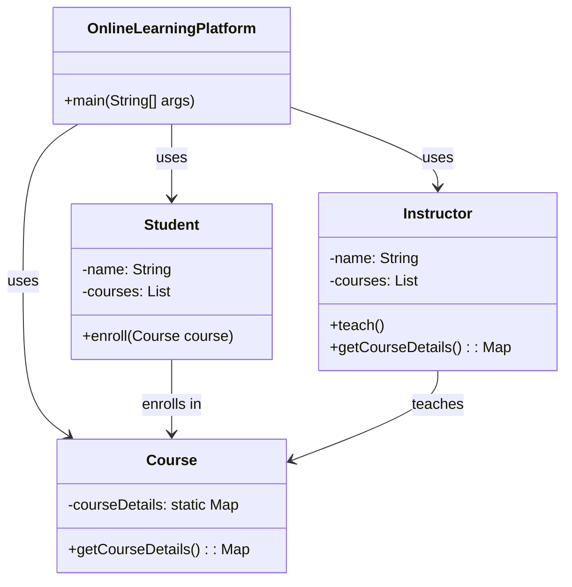
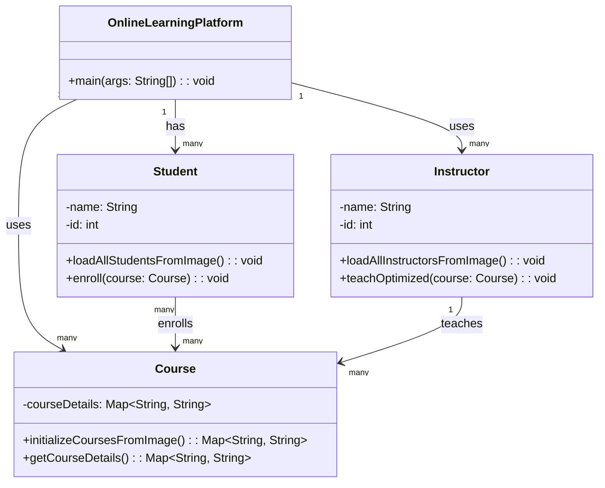

# 第8章 使用OpenJDK HotSpot VM加速达到稳定状态

## 引言

启动与预热/加速（ramp-up）性能优化是Java应用性能的关键因素，尤其是对于瞬态应用和微服务。目标是尽可能缩短JVM的启动和预热时间，从而加速应用`main`方法的执行。低效的启动或预热性能会导致响应时间延长和资源消耗增加，进而对用户与应用的交互产生负面影响。因此，专注于Java应用性能的这一方面至关重要。

虽然术语“预热”（warm-up）和“加速”（ramp-up）经常互换使用，但理解它们的细微差别能让我们更好地领会JVM启动和预热性能的复杂性。因此，有必要区分它们：

- **预热**：在Java应用和JVM的语境下，“预热”通常指JVM系统收集足够的性能分析数据以有效优化代码所需的时间。这对于JIT编译尤其关键，因为它依赖运行时行为来做出优化决策。
- **加速**：“加速”通常指应用系统达到其完全运行能力或性能所需的时间。这不仅涵盖代码优化，还包括资源分配、系统稳定等其他因素。

在本章中，我们首先深入探讨JVM启动和预热性能的复杂细节，从彻底理解这些过程及其各个阶段开始。然后探索Java应用的稳态，重点关注JVM如何管理该状态。在探讨这些主题的过程中，我们将讨论多种有助于实现更快启动和预热时间的技术与进展。无论你是在开发微服务架构、将应用部署到容器化环境，还是使用传统服务器环境，JVM启动与预热优化的原理和技术都保持一致。

## JVM启动和预热优化技术

JIT编译器持续得到改进，这极大促进了JVM启动和加速（包括预热）优化。字节码解释方面的增强带来了更好的加速性能。此外，类数据共享（Class Data Sharing）通过预处理类文件来优化启动，促进了更快的加载以及JVM进程间的数据共享。这减少了类加载所需的时间和内存，从而提高了启动性能。

从永久代（PermGen）到元空间（Metaspace）的过渡（JDK 8开始）对加速时间产生了积极影响。与固定最大大小的PermGen不同，Metaspace根据应用的运行时需求动态调整其大小。这种灵活性可以带来更高效的内存使用和更快的加速时间。

同样，JDK 9中引入的代码缓存分段在增强加速性能方面发挥了重要作用。它使JVM能够为非方法代码、性能分析代码和非性能分析代码维护独立的代码缓存，改善了编译代码的组织和检索，进一步提升了性能。

展望未来，Project Leyden旨在减少Java在HotSpot VM上的启动时间，重点关注用于效率的静态镜像。在HotSpot之外，我们还有GraalVM这一重要角色，它强调通过原生镜像实现更快的启动和更小的内存占用。

## 解码Java应用中的达到稳态时间

### 预备，开始，启动！

在Java/JVM应用语境中，“启动”指的是从调用JVM开始，通常被认为在应用的`main`方法开始执行时结束的关键过程。这一复杂过程包含多个阶段——即JVM引导、字节码加载、字节码验证与准备。这些操作的效率和速度显著影响着应用的启动性能。然而，正如我的同事Ludovic Henry正确指出的，这个定义可能过于局限。

从更广泛的角度看，启动过程超越了`Application.main`方法的执行——它包含了直到应用开始服务于其主要目的为止的整个初始化阶段。例如，对于一个Web服务，启动过程不仅限于JVM的初始化，而是持续到服务开始处理请求为止。

这一扩展的启动阶段涉及应用自身的初始化过程，例如解析命令行参数或配置，包括设置套接字、文件和其他资源。这些任务可能会触发额外的类加载，甚至可能导致JIT编译并流入加速阶段。这些操作的效率和速度在决定应用的整体启动性能中起着关键作用。

### JVM启动阶段

让我们更详细地探讨JVM启动过程中的具体阶段。

#### JVM引导

这个基础阶段专注于启动JVM并设置运行时环境。此阶段执行的任务包括解析命令行参数、将JVM代码加载到内存、初始化JVM内部数据结构、设置内存管理以及建立初始Java线程。该阶段对于应用的成功执行不可或缺。

例如，考虑命令 `java OnlineLearningPlatform`。该命令启动JVM并调用`OnlineLearningPlatform`类，标志着JVM引导阶段的开始。在此语境下，`OnlineLearningPlatform`代表一个旨在提供在线学习资源的Web服务。

#### 字节码加载

在此阶段，JVM加载启动应用所需的必要Java类。这包括加载包含应用`main`方法的类，以及在`main`方法执行期间引用的任何其他类，包括标准库中的系统类。类加载器通过从类路径读取`.class`文件并将这些文件中的字节码转换为JVM可执行的格式来执行类加载。

因此，例如对于`OnlineLearningPlatform`类，我们可能有一个`Student`类在此阶段被加载。

#### 字节码验证与准备

在类加载之后，JVM验证加载的字节码格式是否正确并遵守Java的类型系统。它还为执行准备类，包括为类变量分配内存、将它们初始化为默认值，以及执行任何静态初始化块。《Java语言规范》（Java Language Specification, JLS）严格定义了此过程，以确保不同JVM实现之间的一致性。

例如，`OnlineLearningPlatform`类可能有一个`Course`类，其中包含一个初始化`courseDetails`映射的静态初始化块。这个初始化发生在字节码验证和准备阶段。

```java
public class Course {
    private static Map<String, String> courseDetails;

    static {
        // 课程详细信息的静态初始化
        courseDetails = new HashMap<>();
        courseDetails.put("Math101", "Basic Mathematics");
        courseDetails.put("Eng101", "English Literature");
        // 更多课程
    }

    // 其他方法
}
```

启动阶段至关重要，因为它直接影响用户体验和系统资源利用率。缓慢的启动会导致不佳的用户体验，尤其是在用户等待应用启动的交互式应用中。此外，它们可能导致系统资源的低效使用，因为JVM和底层系统在启动期间需要做大量工作。

### 达到应用的稳态

超越启动阶段，Java应用的生命周期还包括另外两个重要阶段：加速阶段和稳态阶段。一旦应用启动其主要功能，它就进入加速阶段，该阶段的特点是应用性能逐步提升，直到达到峰值性能。稳态阶段发生在应用以峰值性能执行其主要工作负载时。

让我们仔细看看加速阶段，在此期间应用执行多项任务：

- **解释器与JIT编译**：最初，JVM将方法的字节码解释为原生代码。这些方法来自已加载和初始化的类。JVM然后执行这些原生代码。随着应用的继续运行，JVM会识别频繁执行的代码路径（热点路径）。这些路径随后被JIT编译以获得优化性能。JIT编译器采用多种优化技术来生成高效的原生代码，这可以显著提升应用的性能。
- **特定任务的类加载**：当应用开始其主要任务时，它可能需要加载这些操作特定的额外类。
- **缓存预热**：应用（如果使用）和JVM都有存储频繁访问数据的缓存。在加速期间，这些缓存会被填充或“预热”以包含频繁访问的数据，从而确保后续操作中更快的数据检索。

让我们尝试将其置于具体情境中：假设除了我们的`Course`类之外，我们还有一个`Instructor`类，它是在我们的Web服务初始化并获取最新讲师列表后加载的。对于该`Instructor`类，`teach`方法可能是JIT编译器优化的众多方法之一。

现在看一下图8.1中的类图，它展示了`OnlineLearningPlatform`Web服务及其`Student`、`Course`和`Instructor`类以及它们之间的关系。`OnlineLearningPlatform`类是在JVM引导阶段被调用的主类。`Student`类可能是在字节码加载阶段加载的。`Course`类及其静态初始化块说明了字节码验证和准备阶段。`Instructor`类是在加速阶段加载的，而`teach`和`getCourseDetails`方法可能在加速期间达到不同的优化级别。一旦它们达到峰值性能，Web服务就准备好进入稳态性能。

图8.2中的阶段图表显示了当应用经历其生命周期的各个阶段时，JIT编译时间、类加载器时间和垃圾收集（GC）时间。让我们进一步研究这些阶段并构建一个应用时间线。

**图8.1 OnlineLearningPlatform Web服务的类图**



**图8.2 应用阶段图表，显示垃圾收集、编译和类加载时间线**

![[Pasted image 20260505204328.png]]

## 应用程序的生命周期

对于大多数设计良好的应用程序，我们会看到经历以下阶段的生命周期（如图8.3所示）：

- **启动**：JVM被调用，并在应用初始化其状态后开始过渡到下一阶段。启动阶段包括JVM初始化、类加载、类初始化和应用程序初始化工作。
- **预热**：此阶段的特征是代码生成逐渐改进，导致应用性能提升，直至达到峰值性能。
- **稳定状态**：在此阶段，应用程序以峰值性能执行其主要工作负载。
- **降速**：在此阶段，应用程序开始关闭并释放资源。
- **应用停止**：JVM终止，应用程序停止。

图8.3中的时间线从左到右表示时间的推移。应用程序在完成初始化后启动，然后开始预热。应用程序在预热阶段后达到稳定状态。当应用程序准备停止时，它进入降速阶段，最后应用程序停止。

## 管理启动与预热阶段的状态

状态管理是Java应用性能的关键方面，尤其是在启动和预热阶段。应用的状态包含各种元素，包括数据、套接字、文件等。正确管理此状态可确保应用程序高效运行，并为其后续操作奠定基础。

### 启动时的状态

启动时的状态是应用程序当时正在交互的所有变量、对象和资源的全面快照：

- **静态变量**：即使在创建它们的方法执行完毕后仍保留其值的变量。
- **堆对象**：运行时动态分配并驻留在内存堆区域中的对象。

![[Pasted image 20260505204434.png]]

- **运行中的线程**：由应用程序执行的程序化指令序列。
- **资源**：文件描述符、套接字以及应用程序使用的其他资源。

图8.4中的流程图总结了应用程序状态的初始化过程，从静态变量的加载到资源的分配，以及通过预热阶段到稳定状态的过渡。

![[Pasted image 20260505204512.png]]

### 过渡到预热与稳定状态

启动阶段之后，应用程序进入预热阶段，开始处理实际工作任务。在此阶段，JIT编译器会根据实际使用模式优化代码。预热阶段的顶峰以应用程序达到稳定状态为标志。此时，性能稳定下来，JIT编译器已经优化了大部分应用代码。

如图8.5所示，从启动到稳定状态的持续时间称为“到达稳定状态的时间”。这个指标对于评估应用程序性能至关重要，尤其是对于那些生命周期短或运行在无服务器环境中的应用程序。在这种情况下，快速启动和高效的工作负载预热至关重要。

图8.4和图8.5共同提供了应用程序生命周期从启动阶段到达到稳定状态的直观表示，突出了高效状态管理的重要性。

![[Pasted image 20260505204533.png]]

### 高效状态管理的好处

在启动和预热阶段进行适当的状态管理可以减少到达稳定状态的时间，从而带来以下好处：

- **性能提升**：花费更少的时间在初始化和加载数据结构上，加速应用程序过渡到稳定状态，从而提升性能。
- **优化内存使用**：高效的状态管理减少了存储应用状态所需的内存量，从而降低内存占用。
- **更好的资源利用率**：在硬件和操作系统（OS）层面，精简的状态管理可以更充分地利用CPU和内存资源，并减少操作系统文件和网络系统的负载。
- **容器化环境**：在应用运行于容器的环境中，状态管理更为关键。在这些场景下，资源通常更有限，还需要容纳容器运行时的开销。

在当前的HotSpot VM环境中，有一种技术因其能够管理状态并改善到达稳定状态的性能而脱颖而出：类数据共享（CDS）。

## 类数据共享

类数据共享（CDS）是一个强大的JVM功能，旨在显著提升Java应用程序的启动性能。它通过预处理类文件并将其转换为内部格式，使得该格式可以在多个JVM实例之间共享。这个功能对于使用大量类的庞大应用尤其有益，因为它减少了加载这些类所需的时间，从而加速了启动时间。

### 共享归档文件的解剖结构

CDS创建的共享归档文件是一个高效且组织良好的数据结构，包含多个共享空间。每个空间都专门用于存储不同类型的数据。例如：

- **MiscData空间**：这个空间用于存储各种元数据类型。
- **ReadWrite和ReadOnly空间**：这些空间用于分配实际的类数据。

这种结构化的方法优化了数据检索，简化了加载过程，有助于更快的启动时间。

### 内存映射和直接使用

在JVM启动时，共享归档文件被内存映射到其进程空间中。由于共享归档中的类数据已经是JVM内部格式，因此可以直接使用，无需任何转换。这种直接访问进一步缩短了启动时间。

### 多实例优势

CDS的好处不仅限于单个JVM实例。共享归档文件可以被内存映射到同一台机器上运行的多个JVM进程中。这种内存映射和共享机制在云环境中尤其有益，因为资源约束和成本效益是主要关注点。允许多个JVM实例共享同一物理内存页面可减少整体内存占用，从而提升资源利用率并节省成本。此外，这种共享机制改善了后续JVM实例的启动时间，因为共享归档文件已被第一个JVM实例加载到内存中。这在无服务器环境中非常宝贵，因为快速启动函数响应事件至关重要。

### 使用`-XX:ArchiveClassesAtExit`进行动态转储

`-XX:ArchiveClassesAtExit`选项允许JVM将应用程序加载的类动态转储到一个共享归档文件中。通过在下次JVM启动时预加载应用程序实际使用的类，该功能可以微调启动性能。

使用CDS涉及以下步骤：

1.  生成一个包含预处理类数据的共享归档文件。这通过`-Xshare:dump` JVM选项完成。
2.  一旦归档文件生成，就可以通过`-Xshare:on`和`-XX:SharedArchiveFile`选项供JVM实例使用。

例如：

```bash
java -Xshare:dump -XX:SharedArchiveFile=my_app_cds.jsa -cp my_app.jar
java -Xshare:on -XX:SharedArchiveFile=my_app_cds.jsa -cp my_app.jar MyMainClass
```

在此示例中，第一个命令为`my_app.jar`使用的类生成一个共享归档文件，第二个命令使用该共享归档文件运行应用程序。

## 提前编译

提前编译（AOT）是一种在管理运行时中用于管理状态并改善到达峰值性能时间的重要技术。AOT在JDK 9中引入，旨在通过在JVM启动之前将方法编译为本地代码来提升启动性能。这种预编译意味着本地代码已提前准备就绪，无需等待对字节码的解释。这种方法对于生命周期短、JIT编译器可能没有足够时间有效优化代码的应用程序特别有益。

> [!NOTE]
> 在深入了解AOT的复杂性之前，理解其对应物——即时编译（JIT）——至关重要。在HotSpot VM中，解释器首先执行，但不会优化代码。JIT过程带来了优化，但需要时间来收集频繁执行方法和循环的剖析数据。因此，存在延迟，尤其是对于那些需要优化状态才能高效执行的代码。多个组件共同支持代码向优化状态的过渡。例如，（分段）代码缓存以不同状态（如分析过和未分析）保存JIT代码。此外，编译线程通过自适应和推测性优化来管理优化和去优化状态。值得注意的是，HotSpot VM会推测性地优化动态状态，有效地将它们转换为静态状态¹。这些元素共同支持代码从其初始的解释状态过渡到优化形式，这可以视为JIT编译的开销。

> ¹ John Rose在JVMLS 2023的演讲中指出了这一行为：https://cr.openjdk.org/~jrose/pres/202308-Leyden-JVMLS.pdf


AOT 为动态语言引入了静态编译。在 HotSpot VM 之前，像 IBM 的 J9 和 Excelsior JET 这样的平台已经成功使用了 AOT。依赖基于配置文件的引导技术来提供自适应优化的执行引擎，可能因为需要预热阶段而遭受启动时间缓慢的问题。在 HotSpot VM 的情况下，编译总是以解释模式开始。AOT 编译凭借其预编译方法和共享库，是应对这些预热挑战的绝佳解决方案。以 AOT 为先导，配合后台的自适应优化器，应用程序能够以更快的速度达到其峰值性能。

在 JDK 9 中，AOT 特性处于实验状态，并构建在 Graal 编译器之上。Graal 是一个用 Java 编写的动态编译器，而 HotSpot VM 是用 C++ 编写的。为了支持 Graal，HotSpot VM 需要支持一个新的 JVM 编译器接口，称为 JVMCI²。这项工作的初步尝试针对一些已知的库完成，例如 `java.base`、`jdk.compiler`、`jdk.vm.compiler` 等少数几个。

添加到 JDK 9³ 的 AOT 代码在两层上工作——分层和非分层，其中非分层是默认执行模式，旨在提高应用程序的响应性。分层模式类似于 HotSpot VM 分层编译的 T2 级别，即带有性能分析信息的客户端编译器。之后，超过 AOT 调用阈值的方法由客户端编译器在 T3 级别重新编译，并对这些方法进行完整的性能分析，最终导致服务器编译器在 T4 级别重新编译。

AOT 编译可以与 CDS 结合使用，以进一步提高启动性能。CDS 特性允许 JVM 在不同的 Java 进程之间共享常见的类元数据，而 AOT 编译允许 JVM 使用预编译代码而不是解释字节码。当一起使用时，这些特性可以显著减少启动时间和内存占用。

然而，AOT 编译器（在 OpenJDK HotSpot VM 的上下文中）面临某些限制。例如，AOT 编译的代码必须存储在共享库中，这就要求使用位置无关代码（PIC）⁴。这个要求是因为代码加载到内存的位置无法预先确定，从而阻止了 AOT 编译器进行基于位置的优化。相比之下，JIT 编译器可以对执行环境做出更多假设，并相应地优化代码。

JIT 编译器可以直接引用符号，无需间接引用，从而生成更高效的代码。然而，JIT 编译器的这些优化会增加启动时间，因为编译过程发生在应用程序执行期间。相比之下，直接执行字节码的解释器不需要花时间编译代码，但解释代码的执行速度通常比编译代码慢得多。

> [!INFO]
> 需要指出的是，不同的虚拟机（例如 GraalVM）以能够克服其中一些限制的方式实现 AOT 编译。特别是，GraalVM 的 AOT 编译结合配置文件引导优化（PGO）可以达到与 JIT 相当的峰值性能⁵，甚至允许进行某些利用封闭世界假设的优化，这在 JIT 环境中是不可能的。此外，GraalVM 的 AOT 编译器可以编译 100% 的代码——这可能是相对于 JIT 的一个优势，因为在 JIT 中某些“冷”代码可能仍保持解释执行。

## Project Leyden：Java 性能的新曙光

尽管 AOT 承诺了性能提升，但它给 HotSpot VM 增加的复杂性掩盖了其优势。维护一个单独的 AOT 编译器的挑战、由于依赖 Graal 编译器而带来的额外维护负担，以及生成 PIC 的低效率，都表明需要一种不同的方法⁶。这导致了 Project Leyden 的诞生。

Java 应用程序性能的本质在于理解和管理各种状态，特别是通过捕获变量、对象和资源的快照，并确保它们被高效利用。这就是 Project Leyden 的切入点。Leyden 在 JDK 17 中引入，旨在解决 Java 启动时间慢、达到峰值性能的时间长以及内存占用大的挑战。它不仅仅是关于更快的启动；而是关于确保 Java 应用程序的整个生命周期（从启动到稳定状态）都得到优化。

### 训练运行：捕获应用程序行为以获得最佳性能

Project Leyden 引入了“训练运行”的概念，这类似于我们为 CDS 生成预处理类存档的步骤。在训练运行中，我们旨在捕获应用程序的所有行为，尤其是在启动和预热阶段。然后，这些记录下来的行为（包括方法调用、资源分配和其他运行时细节）被用来生成一个定制的运行时镜像。这个镜像针对应用程序的特定需求进行了定制，确保更快的启动和更快速地达到峰值性能。这是 Leyden 确保 Java 应用程序不仅表现足够，而且表现最优的方式。

Leyden 的预编译运行时镜像标志着向增强性能可预测性的转变，这对于那些由于运行时间较短而传统 JIT 编译可能无法完全优化代码的应用程序尤其有利。这一进步代表了 Java 演进中的一次飞跃，精简了启动过程并实现了稳定的性能。

### Condenser：弥合代码与性能之间的鸿沟

尽管 CDS 在管理状态时充当底层骨干，Leyden 引入了 condenser——类似于状态管理守护者的工具。Condenser 确保计算（无论是程序直接表达的还是代表程序执行的）被转移到最合适的时间点。通过这样做，它们保留了程序的本质，同时为开发者提供了选择性能而非某些功能的灵活性。

### 使用 Project Leyden 转移计算：状态交响曲

Java 性能优化依赖于对状态的精细管理以及它们从一个阶段到下一个阶段的无缝过渡。Leyden 转移计算的方法正是这一理念的体现。它不仅仅是把工作搬来搬去；而是确保每一段计算、每一个变量和每一个资源都被最优地放置和利用。这是将启动和预热时间推到背景中，使其几乎可以忽略不计的艺术。

考虑我们的 `OnlineLearningPlatform` Web 服务。在 Leyden 优化之前，我们可能有下面这样的代码片段：

```java
public class OnlineLearningPlatform {
    public static void main(String[] args) {
        // 初始化
        System.out.println("Initializing OnlineLearningPlatform...");
        
        // 加载 Student 和 Course 类
        Student.loadAllStudents();
        Course.initializeCourses();
        
        // 预热阶段:在其最新列表加载后加载 Instructor 类
        Instructor.loadAllInstructors();
        Instructor.teach(new Course()); // 此方法是 JIT 优化的候选
    }
}

public class Student {
    private String name;
    private int id;

    public static void loadAllStudents() {
        // 加载所有学生
    }

    public void enroll(Course course) {
        // 将学生注册到课程
    }
}

public class Course {
    private static Map<String, String> courseDetails;

    static {
        courseDetails = new HashMap<>();
        courseDetails.put("Math101", "Basic Mathematics");
        courseDetails.put("Eng101", "English Literature");
        // 其他课程
    }

    public static void initializeCourses() {
        // 初始化课程
    }

    public Map<String, String> getCourseDetails() {
        return courseDetails;
    }
}

public class Instructor {
    private String name;
    private int id;

    public static void loadAllInstructors() {
        // 加载所有讲师
    }

    public void teach(Course course) {
        // 讲授课程
    }
}
```

在这个设置中，`OnlineLearningPlatform` 的初始化、`Student` 和 `Course` 类的加载，以及包含 `Instructor` 类的预热阶段都是顺序执行的，可能导致更长的启动时间。然而，使用 Leyden，我们可以有以下代码：

```java
public class OnlineLearningPlatform {
    public static void main(String[] args) {
        // 使用 Leyden 的转移计算进行初始化
        System.out.println("Initializing OnlineLearningPlatform with Leyden optimizations...");
        
        // 从预处理镜像加载 Student 和 Course 类
        Student.loadAllStudentsFromImage();
        Course.initializeCoursesFromImage();
        
        // 预热阶段:从预处理镜像加载 Instructor 类并进行 JIT 优化
        Instructor.loadAllInstructorsFromImage();
        Instructor.teachOptimized();
    }
}

public class Student {
    private String name;
    private int id;

    public static void loadAllStudentsFromImage() {
        // 从预处理镜像加载所有学生
    }

    public void enroll(Course course) {
        // 将学生注册到课程
    }
}

public class Course {
    private static Map<String, String> courseDetails;

    static {
        // 从预处理镜像加载课程详情
        courseDetails = ImageLoader.loadCourseDetails();
    }

    public static Map<String, String> initializeCoursesFromImage() {
        // 从预处理镜像加载课程详情并返回
        return courseDetails;
    }

    public Map<String, String> getCourseDetails() {
        return courseDetails;
    }
}

public class Instructor {
    private String name;
    private int id;

    public static void loadAllInstructorsFromImage() {
        // 从预处理镜像加载所有讲师
    }
}
```

> [!NOTE]
> 原始文本中的引用链接：
> - ¹ John Rose 在 JVMLS 2023 的演示：https://cr.openjdk.org/~jrose/pres/202308-Leyden-JVMLS.pdf
> - ² JVMCI 接口：https://openjdk.org/jeps/243
> - ³ JDK 9 AOT：https://openjdk.org/jeps/295
> - ⁴ 位置无关代码：https://docs.oracle.com/cd/E26505_01/html/E26506/glmqp.html
> - ⁵ Alina Yurenko, "GraalVM for JDK 21 Is Here!": https://medium.com/graalvm/graalvm-for-jdk-21-is-here-ee01177dd12d#0df7
> - ⁶ HotSpot 中的 AOT 编译介绍：https://devblogs.microsoft.com/java/aot-compilation-in-hotspot-introduction/


## 启动与预热期间的状态管理

```java
public class Course {
    private static Map<String, String> courseDetails;
    
    static {
        // 从预处理镜像加载课程详情
        courseDetails = ImageLoader.loadCourseDetails();
    }
    
    public Map<String, String> getCourseDetails() {
        return courseDetails;
    }
}

public class Instructor {
    private String name;
    private int id;

    public static void loadAllInstructorsFromImage() {
        // 从预处理镜像加载所有讲师
    }

    public void teachOptimized(Course course) {
        // 使用JIT优化授课
    }
}
```

值得注意的变化如下：

- 类现在来源于预处理镜像，这可以从`loadAllStudentsFromImage()`、`initializeCoursesFromImage()`和`loadAllInstructorsFromImage()`等方法中明显看出。
- `Course`类中的静态初始化块现在使用`ImageLoader.loadCourseDetails()`方法从预处理镜像加载课程详情。
- `Instructor`类引入了`teachOptimized()`方法，代表了JIT优化的授课方法。

通过利用Leyden的增强功能，`OnlineLearningPlatform`可以利用预处理镜像来加载类和JIT优化后的方法。我们的示例在Project Leyden后的修改版类图如图8.6所示。



**图8.6  新类图：Project Leyden优化后**

展望未来，Leyden承诺在性能和适应性之间实现和谐的融合。它旨在为开发者提供工具和自由，让他们选择如何管理状态、如何优化性能，以及如何让应用程序与底层JVM交互。从引入condenser到推出训练运行（training run）的概念，Leyden正在为一个未来奠定基础：在这个未来中，Java性能优化不再仅仅是一项技术工作，而是一门艺术。

随着Java生态系统的持续演进，GraalVM作为一项关键创新脱颖而出，它补充了性能优化超越Java传统边界的扩展。

## GraalVM：革新Java的达到稳定状态时间

站在动态演进的前沿，GraalVM专注于通过利用其动态编译能力和精通程度来优化启动和预热性能。它借助静态镜像的力量来提升跨各种应用程序的性能。

GraalVM是一种多语言虚拟机，无缝支持Java、Scala和Kotlin等JVM语言，以及Ruby、Python和WebAssembly等非JVM语言。它的真正实力在于极大地缩短启动和预热时间，确保应用程序不仅启动迅速，而且能在更短的时间内达到最佳性能。

GraalVM的核心是Graal编译器（图8.7）。这种动态编译器专为动态或“开放世界”执行而设计，与OpenJDK HotSpot VM类似，它擅长为多种处理器生成C2级机器代码。它采用“自优化”技术，利用动态和推测性优化来对程序行为做出有根据的预测。如果推测失败，编译器可以取消优化并重新编译，确保应用程序快速预热并更快地达到峰值性能。

![[Pasted image 20260505204612.png]]

> [!INFO] **图8.7  GraalVM优化策略**
> 该图展示了GraalVM在动态执行（开放世界）和原生镜像生成（封闭世界）两种模式下的优化策略。动态执行利用Graal编译器进行JIT编译；封闭世界则通过AOT编译生成立即可执行的独立二进制文件。

除动态执行外，GraalVM还提供原生镜像生成（Native Image Generation）功能，用于“封闭世界”优化。在这种场景下，整个应用程序的全貌在编译时已知。因此，GraalVM可以生成封装了应用程序、必要库和最小运行时的独立可执行文件。这种方法几乎消除了在JVM解释器和JIT编译器上花费的时间，实现了即时启动和快速预热——对于短生命周期的应用程序和微服务而言，这堪称范式转变。

### 简化原生镜像生成

GraalVM的AOT编译进一步放大了其性能优势。通过将Java字节码预编译为本机代码，它最大限度地减少了启动时JVM解释器的开销。此外，通过绕过传统的JIT编译阶段，应用程序能够更快地预热，在更短的时间内达到峰值性能。这对于微服务和无服务器环境等架构而言价值非凡，因为在这些环境中，快速启动和快速预热都至关重要。

在GraalVM的最新版本中，创建原生镜像的过程得到了简化，原生镜像能力现已包含在GraalVM发行版本身中¹。这一增强功能简化了开发者的流程：

```bash
# 安装GraalVM(请将VERSION和OS替换为您的GraalVM版本和操作系统)
$ curl -LJ https://github.com/graalvm/graalvm-ce-builds/releases/download/vm-VERSION/graalvm-ce-java11-VERSION-OS.tar.gz -o graalvm.tar.gz
$ tar -xzf graalvm.tar.gz

# 设置PATH以包含GraalVM的bin目录
$ export PATH=$PWD/graalvm-ce-java11-VERSION-OS/bin:$PATH

# 将Java应用程序编译为原生镜像
$ native-image -jar your-app.jar
```

执行此命令会创建一个预编译的、独立的Java应用程序可执行文件，其中包含最小的JVM和所有必要的依赖项。该应用程序可以立即开始执行，无需等待JVM启动或加载和初始化类。

### 借助OpenJDK支持增强Java性能

OpenJDK社区一直在努力改进对原生镜像构建的支持，使开发者能够更轻松地为其Java应用程序创建原生镜像。这包括在类初始化、堆序列化和服务绑定等领域的改进，这些改进有助于缩短启动时间并减小内存占用。通过提供将Java应用程序编译为本机可执行文件的能力，GraalVM使Java在高需求计算环境中成为更具吸引力的选择。

¹ https://github.com/oracle/graal/pull/5995

### 介绍Java on Truffle

为了全面展示GraalVM支持的执行模式，有必要提及Java on Truffle²。这是一个运行在Truffle框架之上的高级Java解释器，在执行Java程序时可以使用`-truffle`标志来启用：

```bash
# 使用Truffle解释器执行Java
$ java -truffle [options] class
```

此功能补充了现有的JIT和AOT编译模式，为开发者提供了执行Java程序的额外方法，尤其适用于动态工作负载。

² www.graalvm.org/latest/reference-manual/java-on-truffle/

## 新兴技术：用于检查点/恢复功能的CRIU和Project CRaC

OpenJDK通过诸如CRIU和CRaC等新兴项目持续创新。它们共同为缩短达到稳定状态的时间做出了贡献，拓展了高性能Java应用程序的领域。

**CRIU（Checkpoint/Restore in Userspace）** 是一款开创性的Linux工具，最初由Virtuozzo³编写，随后作为开源项目发布⁴。CRIU旨在支持OpenVZ（一种服务器虚拟化解决方案）的实时迁移功能。CRIU的精妙之处在于它能够暂时冻结一个正在运行的应用程序，创建一个以文件形式存储在硬盘上的检查点。之后可以利用这个检查点从冻结状态恢复并执行应用程序，无需任何改动或特定配置。

以下命令序列创建指定PID进程的检查点并将其存储在指定目录中。随后可以从该检查点恢复进程。

```bash
# 安装CRIU
$ sudo apt-get install criu

# 对运行中的进程创建检查点
$ sudo criu dump -t [PID] -D /checkpoint/directory -v4 -o dump.log

# 恢复已检查点的进程
$ sudo criu restore -D /checkpoint/directory -v4 -o restore.log
```

认识到CRIU的潜力后，Red Hat将其作为一个独立项目引入OpenJDK。其目标是提供一种冻结运行中的Java应用程序状态、存储它，然后稍后或在其他系统上恢复它的方法。此功能可用于在系统之间迁移运行的应用程序、保存和恢复复杂应用程序的状态以进行调试，以及创建应用程序快照供后续分析。

³ https://criu.org/Main_Page
⁴ https://wiki.openvz.org/Main_Page

## 检查点/恢复功能的扩展：Project CRaC

在CRIU能力的基础上，**Project CRaC（Coordinated Restore at Checkpoint）** —— Java生态系统中的一个新项目——旨在将CRIU的检查点/恢复功能集成到JVM中。这可能允许对Java应用程序进行检查点和恢复，为改善达到稳定状态的时间提供另一条途径。CRaC目前处于早期阶段，但代表着Java启动性能优化未来的一个有前景的方向。

让我们模拟对`OnlineLearningPlatform` Web服务进行检查点和恢复状态的过程：

```java
import org.crac.Context;
import org.crac.Core;
import org.crac.Resource;

public class OnlineLearningPlatform implements Resource {
    public static void main(String[] args) throws Exception {
        // 在CRaC的全局上下文中注册平台
        Core.getGlobalContext().register(new OnlineLearningPlatform());

        // 初始化
        System.out.println("正在初始化OnlineLearningPlatform...");
        
        // 加载Student和Course类
        Student.loadAllStudents();
        Course.initializeCourses();
        
        // 预热阶段:在讲师列表更新后加载Instructor类
        Instructor.loadAllInstructors();
        Instructor.teach(new Course()); // 该方法适合JIT优化
    }

    @Override
    public void beforeCheckpoint(Context<? extends Resource> context) throws Exception {
        System.out.println("准备对OnlineLearningPlatform进行检查点...");
    }

    @Override
    public void afterRestore(Context<? extends Resource> context) throws Exception {
        System.out.println("正在恢复OnlineLearningPlatform状态...");
    }
}
```

在此增强版本中，`OnlineLearningPlatform`类实现了CRaC的`Resource`接口。这允许我们定义检查点之前（`beforeCheckpoint`方法）和恢复之后（`afterRestore`方法）的行为。该平台已注册到CRaC的全局上下文中，从而能够进行检查点和恢复。

将[[CRIU]]（检查点/恢复用户空间）集成到JVM中是一项复杂任务，因为它需要修改JVM的内部结构和算法，以支持应用程序状态的冻结和恢复。它还需要与操作系统协调，确保正确捕获和恢复JVM及其运行应用程序的状态。尽管存在这些挑战，但将CRIU集成到JVM中带来了巨大的潜在收益。

图8.8展示了Java应用程序、[[Project CRaC]]和CRIU之间关系的高级表示。该图包含以下要素：

1. **Java应用程序**：这是起点，应用程序在此正常运行并操作。
2. **Project CRaC**：
   - 它提供了一套[[API]]，供Java应用程序发起检查点和恢复操作。
   - 当请求检查点时，Project CRaC与CRIU通信以执行检查点过程。
   - 类似地，当请求恢复时，Project CRaC与CRIU通信，从之前保存的状态中恢复应用程序。
3. **CRIU**：
   - 收到检查点请求后，CRIU冻结Java应用程序进程并将其状态保存为硬盘上的镜像文件。
   - 当发出恢复请求时，CRIU使用保存的镜像文件将Java应用程序进程恢复到其检查点状态。
4. **检查点状态和恢复状态**：
   - “检查点状态”表示检查点时刻Java应用程序的状态。
   - “恢复状态”表示恢复后Java应用程序的状态。它应与检查点状态完全相同。
5. **镜像文件**：这些文件是CRIU在检查点过程中创建的。它们包含Java应用程序的已保存状态。
6. **恢复进程**：这表示CRIU恢复后的Java应用程序进程。

尽管这些项目仍处于开发初期，但它们代表了Java启动性能优化方向的未来。将CRIU集成到JVM可能对Java应用程序的性能产生重大影响。通过允许应用程序被检查点和恢复，它有可能减少启动时间、提高性能，并为Java应用程序开启新的用例。

![[Pasted image 20260505204637.png]]

## 无服务器及其他环境中的启动与预热优化

随着云计算技术的发展，[[无服务器计算]]和[[容器化]]环境已成为应用程序部署的关键。Java凭借其持续的进步，非常适合应对这些现代计算范式带来的独特挑战，如图8.9所示。

- **无服务器冷启动**：[[GraalVM]]通过预编译应用程序来解决JVM的冷启动延迟问题，提供快速的函数调用响应；同时，[[CDS]]（类数据共享）通过重用类元数据来加速启动时间，对GraalVM起到补充作用。
- **CDS增强**：这些技术在无服务器和容器化环境中都至关重要，通过重用类元数据实现更快的启动和更低的内存使用。
- **预期优化**：即将到来的项目，如[[Project Leyden]]和[[Project CRaC]]，旨在进一步完善启动效率和应用程序检查点，使Java的“冷启动”问题成为历史。
- **容器化动态**：快速扩展和高效资源利用是重中之重，Java已准备好利用容器特定的优化来实现敏捷性能。

图8.9概括了Java在强大启动和预热策略支持下，向无缝云原生体验不断迈进的旅程。

![[Pasted image 20260505204649.png]]

### 无服务器计算与JVM优化

无服务器计算以其按需执行应用程序函数的能力，为应用程序部署和扩展带来了范式转变。这种方法将开发者从管理服务器中解放出来，提高了运营效率，并允许根据工作负载自动扩展。然而，无服务器环境引入了“冷启动”问题，当休眠函数被调用时，这个问题尤为突出。这需要资源分配、运行时初始化和应用程序启动，对于Java应用而言，由于涉及到[[JVM]]启动、[[类加载]]和[[JIT编译]]过程，这些步骤可能非常耗时。

“冷启动”问题发生在以下场景：一个Java应用程序在处于非活动状态后，在无服务器环境中面临突发的请求激增。这需要快速启动多个应用程序实例，任何延迟都可能影响用户体验。

为了解决这个问题，JVM优化技术，如[[CDS]]和[[JIT编译器]]增强，可以显著缓解冷启动延迟，使Java更适合无服务器计算。像[[AWS Lambda]]和[[Azure Functions]]这样的平台都支持Java，并提供了微调JVM配置的灵活性。通过利用CDS和校准其他JVM选项，开发者可以优化无服务器Java函数，确保这些函数具有更快的启动和预热性能。

### 新兴技术的预期收益

像[[Project Leyden]]这样的新兴技术正在塑造Java的未来性能，特别是在无服务器计算方面。Leyden承诺通过“训练运行”（Training Runs）和“压缩器”（Condensers）等创新，提升Java的启动阶段和稳态效率。这些发展有可能大幅缩短冷启动时间。即便如此，重要的是要记住，截至[[JDK 21]]，Leyden的功能仍在发展中，尚未准备好用于生产环境。当Leyden成熟时，它可能会彻底改变无服务器Java应用，使它们能够在没有通常启动延迟的情况下快速响应流量高峰，这要归功于“训练运行”期间存储的预计算状态。

与Leyden一起，[[Project CRaC]]提供了一种实操性更强的方法。开发者可以精确定位并准备应用程序的特定部分用于检查点，从而能够快速重新激活已存储的状态。这种方法在无服务器环境中尤其有价值，因为减少冷启动至关重要。

Leyden和CRaC这些举措标志着Java在无服务器环境中的一次飞跃，推动其走向一个应用程序能够瞬时扩展、不再受冷启动限制的未来。

### 容器化环境：确保快速启动与高效扩展

在现代应用程序部署领域，[[容器化]]已成为一项变革性技术。它将应用程序封装在一个轻量级、一致的环境中，使其成为[[微服务架构]]和云原生部署的理想选择。与无服务器类似，达到稳定状态的时间性能至关重要。在容器化环境中，应用程序与其依赖项一起被打包到容器中，然后在容器编排平台（例如[[Kubernetes]]）上运行。由于容器可能会根据工作负载频繁启动和停止，因此拥有快速的启动和预热时间对于确保应用程序能够快速扩展以处理增加的负载至关重要。

当前的JVM优化技术，如CDS和JIT编译器增强，已经为在这些环境中提升性能做出了重大贡献。这些已有的策略包括：

- 选择最小的基础[[Docker镜像]]以最小化镜像大小，从而缩短启动和预热持续时间。
- 定制JVM配置以更好地适应容器环境，例如设置JVM堆大小以感知容器的内存限制。
- 策略性地分层组织Docker镜像，以利用Docker的缓存机制并加速构建过程。
- 实施健康检查，确保应用程序在容器中正确运行。

通过利用这些技术，你可以确保容器化环境中的Java应用程序尽可能快地启动和预热，从而提供更好的用户体验并更有效地利用系统资源。

图8.10展示了当前策略以及未来集成Leyden（和CRaC）方法论的路线图。这是开发者今天可以遵循的路线图，同时展望未来项目承诺带来的好处。

![[Pasted image 20260505204738.png]]

### GraalVM的当代贡献

[[GraalVM]]目前正在解决Java在现代计算环境中面临的一些挑战。其显著特性——原生镜像能力，提供了[[AOT编译]]，显著缩短了启动时间——这对于无服务器计算和微服务架构来说是至关重要的优势。GraalVM的AOT编译器通过针对特定的性能挑战，对传统的[[HotSpot VM]]形成了补充，这对于低延迟和高效资源使用至关重要的场景非常有益。

尽管GraalVM的AOT编译器并非万能解决方案，但它为Java应用程序性能提供了一种专门的方法，满足了云原生环境中特定用例的需求。这种多功能性使Java在各种部署环境中成为强有力的竞争者，确保了应用程序的敏捷性和高性能。

## 关键要点

Java的演进持续与云原生需求保持一致。像Project Leyden和Project CRaC这样的项目，以及GraalVM的能力，展示了Java的适应性及其对性能提升和可扩展性的承诺：

- **适应性的Java演进**：通过像Project Leyden这样的举措和GraalVM现有的优势，Java展示了其对现代云原生部署范式的适应性。
- **优化技术**：理解和应用JVM优化技术至关重要。这包括利用CDS和JIT编译器增强来获得更好的性能。
- **特定场景下的GraalVM AOT编译**：对于快速启动和小内存占用至关重要的用例，例如在无服务器环境或微服务中，GraalVM的AOT编译器提供了有效的解决方案。它通过解决这些环境的特定性能挑战，对传统HotSpot VM进行了补充。
- **预期未来项目的影响**：Project Leyden和Project CRaC标志着Java在无服务器环境中的飞跃，预示着瞬时扩展和减少冷启动限制的未来。
- **Serverless与容器化性能**：对于Serverless和容器化部署，Java正在不断发展以确保快速启动和高效扩展，以适应现代云应用的需求。
- **平衡的方法**：随着Java生态系统的演变，采用平衡的技术方法至关重要。开发者应权衡其应用需求以及每种技术提供的具体优势——无论是当前的JVM优化、GraalVM的功能，还是即将推出的创新技术如Leyden和CRaC。

## 使用OpenJDK HotSpot VM提升预热性能

OpenJDK HotSpot VM是一款精密的软件，它集成了多种技术来优化Java应用程序的性能。这些技术旨在协同工作，各自应对应用生命周期中不同方面的问题，从启动到稳定状态。本节深入研究HotSpot VM的复杂工作机制，揭示其用于提升性能的机制，以及这些机制在Java应用性能更广泛背景下的作用。

在微服务和Serverless模型等动态的可扩展架构世界中，Java应用程序经常面临频繁重启和固有短暂寿命的考验。这样的环境放大了应用程序初始化阶段、预热阶段以及达到稳定运行状态过程的重要性。应用程序在这些阶段中进出的效率，决定了其在面对波动流量需求或需要快速扩展时的响应能力。这正体现了HotSpot VM所采用的各种优化——包括JIT编译、自适应优化与分层编译，以及客户端编译与服务器编译之间的战略选择——的关键作用。

### 编译器增强

在第1章“Java的性能演变：语言与虚拟机”中，我们探讨了HotSpot VM的JIT编译器及其一系列编译技术的复杂性（图8.11）。当我们回到这个话题时，让我们总结一下这个过程，同时重点介绍OpenJDK HotSpot VM中针对启动、预热和稳定阶段量身定制的优化。

#### 启动优化

JVM中的启动主要由较低层级处理。JVM还负责`invokedynamic`引导方法（BSM；详见第7章“运行时性能优化：聚焦字符串、锁及其他”）和类初始化器。

- **字节码生成**：Java程序首先被转换为字节码。这是Java编译过程的初始阶段，开发者编写的高级代码被转换为与平台无关的格式，可由JVM执行（无论底层硬件如何）。

![[Pasted image 20260505204755.png]]

图8.11 OpenJDK编译策略

- **解释执行**：然后基于描述表`TemplateTable`对字节码进行解释。该表提供了字节码指令与其对应机器码序列之间的映射，使JVM能够执行字节码。
- **使用客户端编译器（C1）进行JIT编译**：C1 JIT编译器旨在提供快速编译与基本优化之间的平衡。它将字节码转换为本地机器码，确保应用程序快速脱离启动阶段，并开始迈向峰值性能。在此阶段，C1编译器帮助收集关于应用程序行为的剖析信息。这些剖析数据至关重要，因为它为随后的C2编译器执行的更激进优化提供了依据。C1的JIT编译过程对于被多次调用的方法尤其有益，因为它避免了重复解释相同字节码的开销。
- **分段CodeCache**：来自不同JIT编译层级的优化代码以及剖析数据被存储在分段CodeCache中。此缓存划分为多个段：`Profiled`段包含轻量优化、带有剖析信息且生命周期较短的方法；`Non-method`段包含非方法代码（如字节码解释器本身）。随着我们接近稳定状态，未经剖析的、完全优化的方法也会存储在CodeCache的`Non-profiled`段中。该缓存允许更快地执行频繁使用的代码序列。

#### 预热优化

当Java应用程序超越启动阶段后，预热阶段对于奠定峰值性能的基础变得至关重要。JIT编译，尤其是使用客户端编译器（C1）时，在这一过渡中扮演着关键角色。

- **分层编译**：JVM性能策略的基石是分层编译，其中代码从T0（解释代码）过渡到T4（最高优化层级）。分层编译允许JVM在快速启动与峰值性能之间进行权衡。在执行早期阶段，JVM使用较快但优化程度较低的编译级别以确保快速启动。随着应用程序继续运行，JVM应用更激进的优化以实现更高的峰值性能。
- **自适应优化**：JIT编译代码会经历自适应优化，可以产生进一步优化的代码或栈上替换（OSR）。自适应优化涉及剖析正在运行的应用程序，并根据其行为优化性能。例如，频繁调用的方法可能会被进一步优化，而被取代的方法可能会被去优化，其资源被重新分配。
- **内联缓存**：预热期间采用的一项细致技术是内联缓存。通过这种方法，小型但频繁调用的方法被内联到调用方法中。此策略最小化了方法调用的开销，并由预热期间积累的剖析数据指导。

#### 稳定状态优化

随着Java应用程序在生命周期中成熟，从预热过渡到稳定运行状态，JVM采用一系列高级优化技术。这些技术旨在最大化长期运行应用程序的性能，确保其以峰值效率运行。

- **推测优化**：其中一项突出技术是推测优化。利用预热阶段积累的丰富剖析数据，JVM对可能的执行路径做出明智的预测。然后根据这些预期定制代码优化。如果这些有根据的推测中的任何一个被证明不准确，JVM能够优雅地回退到先前的、优化程度较低的代码版本，从而保障应用的完整性。此策略在长期运行的应用中大放异彩，其中偶尔优化回滚的微小开销远小于准确推测带来的性能飞跃。
- **去优化**：与推测优化相辅相成的是去优化的概念。当基本假设失效时，此机制赋予JVM撤销某些JIT编译器优化的能力。一个典型场景是当新加载的类覆盖了之前已被优化的方法时。回退能力确保应用能够准确响应动态变化。
- **使用服务器编译器（C2）进行JIT编译**：对于长期运行的应用程序，配备剖析信息的细致服务器编译器（C2）接管工作，对性能关键型方法应用激进且推测性的优化。此过程显著提升了Java应用的性能，特别是对于相同方法被多次调用的长期运行应用。

### 分段CodeCache与Project Leyden增强

基于我们在第1章“Java的性能演变：语言与虚拟机”中对分段CodeCache的详细讨论，现在让我们考虑其对缩短Java应用达到稳定状态时间的影响。

分段CodeCache旨在优先存储频繁执行的代码，确保这些代码随时可供执行。进一步深入CodeCache的机制，理解Code ByteBuffer的作用至关重要。该Buffer充当中间存储，在编译代码被移入分段CodeCache之前暂存它。这个两步过程确保了高效的内存管理和优化的代码检索。此外，缓存的分段允许更高效的内存管理，因为每个段可以根据其使用情况独立调整大小。在启动和预热性能的背景下，分段CodeCache通过确保应用代码中最关键的部分尽可能快地编译并准备好执行，从而显著提升了Java应用的整体性能。

随着Project Leyden的出现，这一机制将得到进一步增强。Project Leyden的一个突出特性将是能够直接从存档加载分段CodeCache。这将绕过启动和预热期间传统的分层代码编译过程，从而显著减少启动时间。Project Leyden将允许预编译代码被存档，然后在后续启动时直接加载到分段CodeCache中，而不是每次应用启动时都编译代码。

这种方法不仅会加速启动过程，还会确保应用从一开始就受益于优化代码。通过利用这一特性，开发者将实现更快的应用响应速度，尤其在需要加速达到稳定状态的环境中至关重要。

## 从PermGen到Metaspace的演进：迈向巅峰性能的飞跃

在Java的历史上，Java 8问世之前的JVM内存包含一个称为永久代（PermGen）的区域。该内存段专用于存储类元数据和静态变量。然而，PermGen模型并非没有缺陷。它具有固定大小，如果分配的空间不足以满足应用程序需求，可能导致`java.lang.OutOfMemoryError: PermGen space`错误。

### 启动影响

PermGen的固定特性意味着JVM在启动期间必须进行内存分配和释放，导致启动时间变慢。为弥补这些缺陷，Java 8引入了一项重大变更：用**Metaspace**取代PermGen¹¹。与前辈不同，Metaspace不是一个连续的堆空间，而是位于本地内存中，用于存储类元数据。默认情况下它会自动增长，其最大限制是可用的本地内存量，这远大于典型的PermGen最大大小。这一关键修改有助于在启动期间实现更高效的内存管理，从而可能加速启动时间。

### 预热影响

Metaspace的动态特性使其能够按需增长，确保JVM在预热阶段能快速适应应用程序的需求。这种灵活性减少了在该关键阶段出现内存相关瓶颈的可能性。

当Metaspace被填满时，会触发一次完全垃圾回收（GC）以清理未使用的类加载器和类。如果GC无法回收足够空间，Metaspace会进行扩展。这种动态特性有助于避免PermGen时代常见的`OutOfMemoryError`错误。

### 稳态影响

从PermGen到Metaspace的转变确保了JVM能更高效地达到稳态。通过消除类元数据和静态变量的固定内存空间限制，JVM可以管理其内存资源并降低`OutOfMemoryError`的风险，从而使Java应用程序更加健壮和可靠。

> [!WARNING] 内存泄漏风险
> 尽管Metaspace可以按需增长，但它并非对内存泄漏免疫。如果类加载器处理不当，本地内存可能会被填满，导致`OutOfMemoryError: Metaspace`。以下是具体机制：

1. **类加载器生命周期与潜在泄漏**：
   - a. 每个类加载器在Metaspace中都有自己的一段区域，用于加载类元数据。当类加载器被垃圾回收时，其对应的Metaspace段也会被释放。然而，如果存在对类加载器（或它加载的任何类）的存活引用，该类加载器就不会被垃圾回收，它使用的Metaspace内存也不会被释放。这就是不当管理类加载器导致内存泄漏的方式。
   - b. 类加载器泄漏还可能有其他方式。例如，假设一个类加载器加载了一个启动线程的类，并且当不再需要该类加载器时，该线程并未停止。在这种情况下，活跃线程会保持对类加载器的引用，阻止其被垃圾回收。类似地，如果类加载器加载的类注册了一个静态钩子（例如关闭钩子或JDBC驱动程序），并且在完成后未注销该钩子，这也会阻止类加载器被垃圾回收。
   - c. 在垃圾回收的语境中，类加载器是一个GC根节点。任何从GC根节点可达的对象都被视为存活，不可进行垃圾回收。因此，只要类加载器保持存活，它加载的所有类（以及这些类引用的任何对象）也都被视为存活，不可进行垃圾回收。

2. **OutOfMemoryError: Metaspace**：如果由于不当管理的类加载器积累了足够多的内存泄漏，Metaspace可能会被填满。在这种情况下，JVM会触发一次完全垃圾回收以清理未使用的类加载器和类。如果这未能释放足够空间，JVM会尝试扩展Metaspace。如果由于没有足够的本地内存可用而无法扩展Metaspace，则会抛出`OutOfMemoryError: Metaspace`。

> [!TIP] 监控与调优
> 监控Metaspace用量并根据需要调整最大大小至关重要。以下是几个可用于控制Metaspace大小的JVM选项：

- `-XX:MetaspaceSize=[size]`：设置Metaspace的初始大小。如果未指定，Metaspace会根据应用程序需求动态调整大小。
- `-XX:MaxMetaspaceSize=[size]`：设置Metaspace的最大大小。如果未指定，Metaspace可以无限制增长，直到可用本地内存的上限。
- `-XX:MinMetaspaceFreeRatio=[percentage]` 和 `-XX:MaxMetaspaceFreeRatio=[percentage]`：控制GC后Metaspace中允许的空闲空间比例，以决定是否进行大小调整。如果空闲空间百分比低于或高于这些阈值，Metaspace将相应收缩或增长。

诸如[[VisualVM]]、[[JConsole]]和[[Java Mission Control]]等工具可用于监控Metaspace用量，并提供有关内存使用、GC活动以及潜在内存泄漏的宝贵见解。这些工具还能通过显示已加载的类数量以及这些类占用的总空间来帮助识别类加载器泄漏。

## Java 16中的弹性Metaspace（JEP 387）

Java 16通过引入JEP 387：弹性Metaspace¹²，为Metaspace带来了重大升级。JEP 387的三大主要目标是：

- 高效地将未使用的类元数据内存返还给操作系统
- 最小化Metaspace的整体内存占用
- 精简Metaspace代码库以提高可维护性

以下是JEP 387带来关键变更的详细说明：

- **基于伙伴的分配方案**：此机制根据大小组织内存块，促进Metaspace中的快速分配与释放。它类似于伙伴系统，确保高效的内存管理。
- **延迟内存提交**：一种明智的方法——JVM仅在必要时提交内存。此策略减少了JVM的内存开销，特别是当分配的Metaspace远超实际利用率时。
- **细粒度内存管理**：此增强使JVM能够以更细的段管理Metaspace，减轻内部碎片化并优化内存消耗。
- **改进的回收策略**：一种主动策略，使JVM能够迅速将未使用的Metaspace内存返还给操作系统。这对于Metaspace用量模式波动的应用程序非常有价值，确保一致且最小的内存占用。

这些创新巧妙地解决了Metaspace管理挑战，包括内存碎片化。总之，Metaspace的动态特性，加上JEP 387引入的创新，凸显了Java在优化内存利用率、减少碎片化以及及时将未使用内存释放回操作系统方面的承诺。

## 结论

在本章中，我们全面探讨了JVM的启动与预热性能——这是Java应用程序性能的关键方面。Java生态系统中引入的各种优化技术，例如[[CDS]]、[[GraalVM]]以及JIT编译器增强，已显著改善了启动和启动后加速时间。对于微服务架构、无服务器计算以及容器化环境而言，快速初始化和小的内存占用至关重要。

展望未来，Java性能能力的持续演进仍处于技术创新的前沿。[[Project Leyden]]的引入（包含训练运行）以及[[CRIU]]和[[Project CRaC]]的出现，进一步放大了推动Java性能优化的潜力。

作为开发者和性能工程师，我们需要随时了解这些类型的进展，并理解如何在不同环境中应用它们。通过这样做，我们可以确保Java应用程序尽可能高效且性能卓越，从而提供最佳的用户体验。

---

¹¹ [www.infoq.com/articles/Java-PERMGEN-Removed/](http://www.infoq.com/articles/Java-PERMGEN-Removed/)  
¹² [https://openjdk.org/jeps/387](https://openjdk.org/jeps/387)
