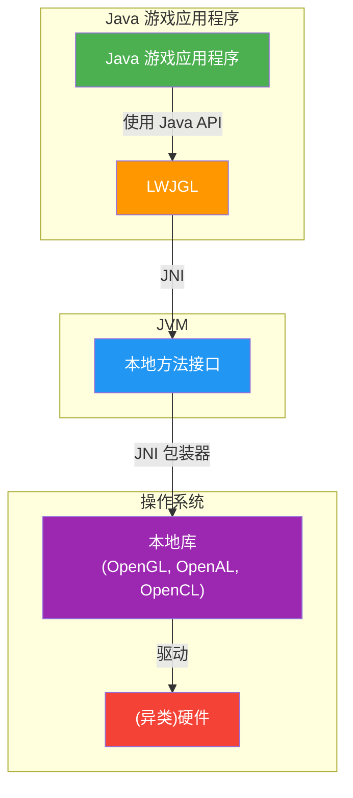
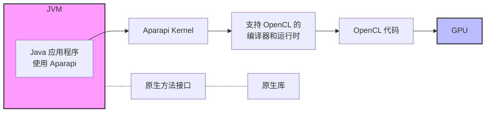

# 第9章 利用异类硬件：JVM性能工程的未来

## 异类硬件与JVM简介

在计算技术不断发展的领域中，图形处理单元（GPU）、现场可编程门阵列（FPGA）以及众多其他加速器这类专用硬件组件正取得显著进展。这些组件通常被称为“异类硬件”，但它们仅仅是冰山一角。尖端的硬件加速器，包括张量处理单元（TPU）、专用集成电路（ASIC）以及诸如Axelera[^1]之类的创新型AI芯片，正在重塑各类应用的性能基准。虽然这些强大组件主要针对机器学习和复杂数据处理任务进行了优化，但其能力并不仅限于此领域。借助专用接口和库的支持，基于JVM的应用也可以利用这些资源。例如，GPU以其无与伦比的并行计算能力而闻名，可成为Java应用程序的福音，加速数据密集型任务。

从历史上看，JVM作为一个平台无关的执行环境，一直与通用计算相关联，其中字节码被编译为CPU的机器码。这种设计使JVM能够在不同硬件平台之间提供高度的可移植性，因为相同的字节码可以在任何拥有JVM实现的设备上运行。

然而，异类硬件的兴起为JVM带来了新的机遇和挑战。尽管通用CPU功能多样且性能强大，但它们常常被专用硬件组件所补充，这些组件提供针对特定任务量身定制的能力。例如，虽然CPU拥有像Intel处理器的AVX512（高级向量扩展）[^2]和Arm架构的SVE（可伸缩向量扩展）[^3]这样的专用指令集，可以提升特定任务的性能，但其他硬件加速器则能够执行大规模矩阵运算或深度学习等任务所必需的专用计算。为了充分利用这些能力，JVM需要能够将字节码编译成能在此类硬件上高效运行的机器码。

这促使了新的语言特性、API和工具链的开发，旨在弥合JVM与专用硬件之间的差距。例如，属于[[Project Panama|Panama项目]]一部分的[[Vector API|向量API]]允许开发者表达能在支持向量操作的硬件上高效向量化的计算。通过有效利用这些硬件能力，我们可以实现显著的性能提升。

然而，在基于JVM的应用程序中有效使用这些专用硬件组件绝非易事。这需要在语言设计和工具链两方面进行调整，以有效利用这些硬件能力，包括开发能够与此类硬件交互的API，以及能够生成针对这些组件优化的代码的编译器。但是，管理内存访问模式、理解硬件特定行为以及处理硬件平台的异构性等挑战，使得这项任务变得复杂。

在此适应过程中，几个关键概念和项目发挥了重要作用：

- **OpenCL**：一个开放标准，可实现跨异构系统（包括CPU、GPU和其他处理器）的可移植并行编程。虽然OpenCL代码可以在多种硬件平台上执行，但其性能并非普遍可移植。换句话说，同一段OpenCL代码在不同硬件上运行的效率可能会有显著差异。例如，虽然一个商用GPU可能比顺序代码提供显著的性能提升，但同一段OpenCL代码在某些FPGA上可能运行得更慢[^4]。

- **Aparapi**：一个用于表达数据并行工作负载的Java API。Aparapi将Java字节码翻译为OpenCL，从而使其能够在各种硬件加速器（包括GPU）上执行。其运行时组件管理数据传输和生成的OpenCL代码的执行，为数据并行任务带来性能优势。尽管Aparapi抽象了大部分复杂性，但在特定硬件上实现最佳性能可能需要调优。

- **TornadoVM**：作为OpenJDK GraalVM的扩展，TornadoVM提供了独特的好处：在运行时动态地重新编译和优化Java字节码以适应不同的硬件目标。这使得Java程序能够自动适应可用的硬件资源（如GPU和FPGA），而无需更改任何代码。TornadoVM的动态特性确保应用程序能够根据特定的硬件和应用程序性质实现最佳的性能可移植性。

- **Project Panama**：OpenJDK社区正在进行的一个项目，旨在改善JVM与原生代码互操作性的连接。它专注于两个主要领域：
  - **向量API**：专为向量计算设计，该API确保在支持的CPU架构上，运行时编译为最高效的向量硬件指令。
  - **外部函数与内存（FFM）API**：此工具允许程序调用用其他语言编写的例程或利用其服务。在Panama项目的范围内，FFM使Java代码能够与原生库无缝交互，从而增强了Java与其他编程语言和系统的互操作性。

本章探讨了与JVM性能工程相关的挑战，并讨论了一些已提出的解决方案。虽然我们的主要重点将放在基于OpenCL的工具链上，但需要承认，[[CUDA]] [^5]是GPU最广泛采用的并行编程模型之一。在有效利用异类硬件能力方面，语言设计和工具链的重要性不言而喻。为了提供实际的理解，将呈现一系列说明性案例研究，展示如何应对这些挑战的示例，以及异类硬件为JVM性能工程带来的机遇。

## 云中的异类硬件

云计算的可用性使得最终用户能够方便地访问专用或异构硬件。过去，利用异类硬件的强大能力通常需要对物理硬件进行大量的前期投资。这一要求对许多开发者和组织（尤其是资源有限的那些）构成了难以逾越的障碍。

近年来，云计算革命极大地改变了这一格局。现在，开发人员无需进行大量的初始投资即可访问和利用异类硬件的强大能力。这得益于主要的云服务提供商，包括亚马逊网络服务（AWS）[^6]、谷歌云[^7]、微软Azure[^8]和甲骨文云基础设施[^9]。这些提供商在其服务中扩展了配备GPU和其他加速器的虚拟机，使开发者能够以灵活且经济高效的方式利用异类硬件的能力。NVIDIA一直处于GPU虚拟化的前沿，提供灵活的视频编码/解码方法和广泛的虚拟机管理程序支持，但AMD和Intel也有各自独特的方法和能力[^10]。

为了应对虚拟化复杂性，许多云“配置器”确保只有需要GPU的主机被部署在物理硬件上，从而获得对GPU的完全且独占的访问权。虽然这种方法允许其他（非GPU）主机使用CPU，但这确实说明了在云中使用异类硬件的一些底层复杂性。实际上，在云端利用专用硬件组件会带来自身的一系列挑战，尤其是从软件和运行时的角度来看。以下小节总结了其中一些挑战。

[^1]: www.axelera.ai/
[^2]: https://www.intel.com/content/www/us/en/architecture-and-technology/avx-512-overview.html
[^3]: https://developer.arm.com/Architectures/Scalable%20Vector%20Extensions
[^4]: Michail Papadimitrioua, Juan Fumero, Athanasios Stratikopoulosa, Foivos S. Zakkakb, and Christos Kotselidis. “Transparent Compiler and Runtime Specializations for Accelerating Managed Languages on FPGAs.” *Art, Science, and Engineering of Programming* 5, no. 2 (2020). https://arxiv.org/ftp/arxiv/papers/2010/2010.16304.pdf.
[^5]: https://developer.nvidia.com/cuda-zone
[^6]: https://aws.amazon.com/ec2/instance-types/f1/
[^7]: https://cloud.google.com/gpu
[^8]: www.nvidia.com/en-us/data-center/gpu-cloud-computing/microsoft-azure/
[^9]: www.oracle.com/cloud/compute/gpu/
[^10]: Gabe Knuth. “NVIDIA, AMD, and Intel: How They Do Their GPU Virtualization.” TechTarget (September 26, 2016). www.techtarget.com/searchvirtualdesktop/opinion/NVIDIA-AMD-and-Intel-How-they-do-their-GPU-virtualization.


## 硬件异质性

云计算环境的显著特征是其广泛多样的硬件产品组合，每种产品都具备独特的功能与性能。例如，较新的Arm设备配备有密码学加速器，可显著提升密码运算的速度。相比之下，英特尔AVX-512指令将SIMD向量寄存器的宽度扩展到512位，从而能够并行处理更多数据。

Arm的技术谱系还包括NEON和SVE。NEON为Arm v7和Arm v8架构提供SIMD指令，而SVE则允许CPU设计者选择最符合其需求的SIMD向量长度，范围从128位到2048位，以128位为增量递增。这些数据宽度和访问模式上的差异会显著影响计算性能。

这种多样性还延伸至GPU、FPGA及其他加速器，但它们在各个云服务商中的可用性差异很大。这种硬件异质性要求软件和运行时环境具备适应性和灵活性，能够根据实际使用的硬件来优化性能。在这种语境下，适应性通常意味着根据不同的硬件采取不同的优化路径，从而确保对可用资源的高效利用。

## API兼容性与虚拟机管理器约束

专用硬件通常需要使用特定的API才能有效发挥其作用。这些API为软件与硬件交互提供了途径，允许在硬件上执行内存管理、计算等任务。在GPU通用计算（GPGPU）领域，OpenCL是一种广泛使用的API。然而，设计为硬件无关的JVM可能无法原生支持这些专用API。这需要借助额外的库或工具（例如用于OpenCL的Java绑定[^11]）来填补这一空白。

此外，云服务商所用的虚拟机管理器（hypervisor）在管理和隔离虚拟机资源、提供安全性和稳定性方面发挥着关键作用。但它也可能对API兼容性施加额外的约束。虚拟机管理器控制着客户操作系统与硬件之间的交互，虽然它被设计为支持广泛的操作，但可能无法支持专用API的全部特性。例如，NVIDIA CUDA或OpenCL中的内存管理需要直接访问GPU内存，而这可能无法被虚拟机管理器完全支持。

一个需要重点考虑的因素是潜在的安全问题，尤其是关于GPU内存管理。传统的虚拟机管理器及其对输入输出内存管理单元（IOMMU）的处理，可以防止常规内存在不同主机之间泄露。然而，GPU往往处于这个“范围”之外。GPU驱动程序通常意识不到自己运行在虚拟化环境中，它依赖于在内核调度之间保持内存驻留。这引发了数据隔离方面的担忧——即一个主机写入的数据是否真正与另一主机隔离。在GPGPU场景下，GPU不仅用于图像处理，还用于通用计算任务，任何潜在的数据泄露都可能造成更严重的后果。现代云基础设施在解决这些问题上已取得进展，但潜在风险依然存在，这凸显了只允许一个主机访问GPU的重要性。

[^11]: www.jocl.org/

> [!NOTE] 异类硬件在云中
> 尽管这些约束看似令人生畏，但仍需重申虚拟机管理器在维护安全隔离环境方面所起的关键作用。然而，开发者在试图充分利用云端专用硬件能力时，必须认识到这些因素。

## 性能权衡

在云中使用虚拟化硬件是一把双刃剑。一方面，它提供了灵活性、可扩展性和隔离性，使应用的管理和部署更加容易。另一方面，它也可能引入性能权衡。为提供这些优势而必要的虚拟化开销，有时会抵消专用硬件带来的性能提升。

这种开销通常归因于虚拟机管理器，它需要将客户操作系统的调用转换到宿主机硬件。虚拟机管理器的设计目标是最小化这种开销，并且其效率也在不断提升。然而，在某些场景下，这种负担仍可能影响运行在异类硬件上的应用性能。例如，一个GPU加速的机器学习应用可能无法达到预期的加速效果，原因在于GPU虚拟化的开销，特别是如果该应用未针对GPU加速进行适当优化，或者虚拟化开销未被妥善管理。

## 资源争用

云环境的共享特性可能因资源争用而导致性能不一致。这通常被称为“吵闹的邻居”问题，即同一物理硬件上其他用户的活动会影响你的应用性能。例如，假设多个用户在同一台物理服务器上运行GPU密集型任务：如果一个吵闹的邻居垄断了GPU资源，其他用户的任务运行速度就会变慢，从而因GPU资源争用而体验性能下降。这是云计算基础设施中的常见问题，资源在多个用户间共享。为缓解此问题，云服务商通常会实施资源分配策略，以确保所有用户公平使用资源。然而，这些策略并非总是完美，资源争用仍可能导致性能不一致。

## 云特定限制

云环境可能施加额外的限制，这些限制在本地环境中并不存在。例如，云服务商通常限制单个虚拟机可使用的资源量（如内存或GPU计算单元）。这一约束可能会限制异类硬件在云中的性能优势。此外，使用某些类型的异类硬件可能仅限于特定的云区域或实例类型。例如，Google Cloud的A2虚拟机（支持NVIDIA A100 GPU）仅在选定区域可用。

产业界和研究界一直在积极致力于解决这些挑战。人们正在努力标准化API并开发硬件无关的编程模型。如前所述，OpenCL为跨异构计算系统的并行编程提供了一个统一的、通用的标准环境。它旨在利用单节点内多样化硬件组件的计算能力，因此非常适合高效运行领域特定的工作负载，如数据并行应用和大数据处理。然而，为了在JVM内充分利用OpenCL的能力，必须使用OpenCL的Java绑定。虽然OpenCL解决了节点内计算方面的问题，但高性能计算平台（尤其是超级计算机中使用的平台）通常还需要额外的库（如MPI）来实现节点间通信。

在探索这些主题的过程中，我有幸与Juan Fumero博士进行了讨论，他是TornadoVM开发背后的领军人物，TornadoVM是一个OpenJDK插件，旨在应对这些挑战。Fumero博士分享了HPC Wire的Vicent Natol的一句精辟言论：“CUDA是一种优雅的解决方案，用于表示算法中的并行性——不是所有算法，但足以产生重大影响。”这一观点不仅适用于CUDA，也适用于其他并行编程模型，如OpenCL、oneAPI等。Fumero博士关于并行编程及其挑战的见解，在考虑像TornadoVM这样的解决方案时尤其相关。在他指导下开发的TornadoVM，旨在通过允许Java程序自动在异构硬件上运行，来利用JVM生态系统中并行编程的力量。TornadoVM的设计旨在利用云环境中可用的GPU和FPGA，从而加速Java应用。通过提供高级编程模型并处理硬件异质性、API兼容性和潜在安全问题的复杂性，TornadoVM使开发者更容易在云中利用异类硬件的强大能力。

## 语言设计与工具链的作用

为了有效利用异类硬件的功能，语言设计和工具链都需要适应这些新需求。这涉及以下几个关键考虑：

- **语言抽象**：编程语言应提供直观的高级抽象，使开发者能够编写在不同类型硬件上高效执行的代码。这包括设计能够表达并行性并利用异类硬件独特特性的语言特性。例如，Project Panama中的Vector API为开发者提供了一种表达计算的方式，这些计算可以在支持向量操作的硬件上高效向量化。

- **编译器优化**：工具链，尤其是编译器，在将高级语言抽象转换为能在异类硬件上运行的高效低级代码方面起着关键作用。这包括开发复杂的优化技术，以利用不同类型硬件的独特特性。例如，TornadoVM编译器可以生成OpenCL、CUDA和SPIR-V代码。此外，它还会生成针对FPGA、带有向量指令的RISC-V以及Apple M1/M2芯片优化的代码。这使得TornadoVM能够在从物联网设备（如NVIDIA Jetson）到PC、云环境乃至最新消费级处理器的广泛计算系统上执行。


> [!INFO] 本部分内容
> 介绍LWJGL、TornadoVM、Project Panama等与硬件加速的集成方案。案例研究涵盖多个项目，探讨它们在利用异类硬件方面的挑战与解决方案。

## 案例研究

> [!TIP] 关键考量因素
> 以下因素显著影响着旨在更好利用异类硬件能力的项目的设计与实现。

- **运行时系统**：运行时系统需要能够管理和调度不同类型硬件上的计算。这涉及开发能处理异类硬件复杂性的运行时系统，例如跨不同类型设备管理内存，以及调度计算以最小化数据传输。以图像处理任务为例，对图像应用不同的滤镜或变换时，这些操作在GPU上的调度方式会显著影响性能。例如，对于某些滤镜，将图像分割成较小的“块”进行处理可能更高效；而其他操作则可能受益于将图像作为更大的连续块进行处理。如何划分和处理图像——无论是用更小的块还是更大的分段——可以类比为滤镜是实时应用还是经历明显延迟之间的差异。在运行时系统中，此类计算必须被巧妙地调度，以最小化数据传输开销并充分利用硬件能力。

- **互操作性**：语言和工具链应提供机制，使能与针对异类硬件设计的现有库和框架进行互操作。这可能涉及提供[[Foreign Function Interface]]（FFI）机制（如Project Panama中的机制），使Java代码能够与本地库互操作。

- **库支持**：尽管已经开发了一些支持异类硬件的库，但这些库通常特定于某些硬件类型，可能不适用于云提供商提供的所有硬件类型，或未针对所有类型进行优化。这些库中的特化可能包括针对特定硬件架构的优化，这在不同硬件类型上运行时可能导致显著的性能差异。

这些考量显著影响了旨在更好利用异类硬件能力的项目的设计与实现。例如，Aparapi（一个用于表达数据并行工作负载的API）的设计深受语言抽象需求的影响，这些抽象能够表达并行性并利用异类硬件的独特特性。类似地，TornadoVM的开发也受限于运行时系统需求，即能够管理和调度不同类型硬件上的计算。

在接下来的案例研究中，我们将更深入地探讨这些项目，探索它们如何应对异类硬件利用的挑战，以及它们如何受到前述考量的影响。

---

## 案例研究

将异类硬件与JVM的讨论扎根于真实世界的示例至关重要，而通过一系列案例研究是再好不过的方式。以下每个项目——LWJGL、Aparapi、Project Sumatra、CUDA4J（IBM与NVIDIA的联合项目）、TornadoVM和Project Panama——都提供了关于硬件加速器带来的挑战与机遇的独特见解。

- **[[LWJGL]]（轻量级Java游戏库）** <sup id="fnref12"><a href="#fn12">12</a></sup> 作为基础案例，展示了使用[[Java Native Interface]]（JNI）使Java应用程序能够与本地API交互，涵盖图形和计算操作等任务。它提供了一个实用示例，说明如何利用现有JVM机制来利用专用硬件。

- **[[Aparapi]]** 展示了如何设计语言抽象来表达并行性并利用异类硬件的独特特性。它在运行时将Java字节码翻译为OpenCL，从而能够在GPU上执行并行操作。

- **[[Project Sumatra]]** 尽管已不再活跃，但曾是一项重要努力，旨在通过依赖Java 8的[[Stream API]]来表达并行性，增强JVM将计算卸载到GPU的能力。Project Sumatra的经验和教训至今仍为当前和未来的项目提供参考。

- **与Project Sumatra并行的[[CUDA4J]]** <sup id="fnref13"><a href="#fn13">13</a></sup> 作为IBM与NVIDIA的联合项目出现。该项目利用Java 8 Stream API，使Java开发者能够编写GPU计算，而CUDA4J框架将其翻译为CUDA内核。它展示了社区协作努力在增强JVM与异类硬件（尤其是GPU）兼容性方面的力量。

- **[[TornadoVM]]** 展示了如何开发运行时系统来管理和调度不同类型硬件上的计算。它为硬件异质性和API兼容性的挑战提供了实用解决方案。

- **[[Project Panama]]** 提供了JVM未来的窥视。它专注于通过引入新的[[FFM API]]和[[Vector API]]来改善JVM与外部API（包括库和硬件加速器）的连接。这些发展代表了JVM设计的重大演进，使得与异类硬件的交互更高效、更流畅。

选择这些项目不仅因为其技术创新，还因为它们与JVM与专用硬件不断演进的格局相关。它们代表了社区为适应JVM以更好利用异类硬件能力所做的重大努力，因此为我们的讨论提供了宝贵的见解。

---
<small id="fn12">12. <a href="http://www.lwjgl.org">www.lwjgl.org</a></small>
<small id="fn13">13. 尽管具有小众性质，CUDA4J仍在IBM Power平台上与NVIDIA硬件一起继续应用：<a href="http://www.ibm.com/docs/en/sdk-java-technology/8?topic=only-cuda4j-application-programming-interface-linux-windows">www.ibm.com/docs/en/sdk-java-technology/8?topic=only-cuda4j-application-programming-interface-linux-windows</a></small>

---

## LWJGL：一个基线示例

LWJGL是Java如何与异类硬件交互的典型示例。这个成熟且广泛使用的库为Java开发者提供了访问多种本地API的途径，包括图形（OpenGL、Vulkan）、音频（OpenAL）和并行计算（OpenCL）。开发者可以在其Java应用程序中使用LWJGL来访问这些本地API。例如，开发者可能使用LWJGL对OpenGL的绑定，在游戏或模拟中渲染3D图形。这涉及编写Java代码调用LWJGL库中的方法，而这些方法又调用本地OpenGL库中的相应函数。

以下是一个简单示例，展示如何使用LWJGL创建OpenGL上下文并清除屏幕：

```java
try (MemoryStack stack = MemoryStack.stackPush()) {
    GLFWErrorCallback.createPrint(System.err).set();
    if (!glfwInit()) {
        throw new IllegalStateException("Unable to initialize GLFW");
    }
    long window = glfwCreateWindow(800, 600, "Shrek: The Musical", NULL, NULL);
    glfwMakeContextCurrent(window);
    GL.createCapabilities();
    while (!glfwWindowShouldClose(window)) {
        glClear(GL_COLOR_BUFFER_BIT | GL_DEPTH_BUFFER_BIT);
        // 将颜色设置为沼泽绿
        glClearColor(0.13f, 0.54f, 0.13f, 0.0f);
        // 绘制一个简单的3D场景...
        drawScene();
        // 绘制史莱克的房子
        drawShrekHouse();
        // 绘制法尔奎德国王的城堡
        drawFarquaadCastle();
        glfwSwapBuffers(window);
        glfwPollEvents();
    }
}
```

在这个示例中，我们正在为基于《史莱克：音乐剧》的游戏创建一个简单的3D场景。首先初始化GLFW并创建窗口。然后设置窗口的上下文为当前，并创建OpenGL上下文。在游戏的主循环中，我们清除屏幕，将颜色设置为沼泽绿（代表史莱克的沼泽），绘制3D场景，然后绘制史莱克的房子和法尔奎德国王的城堡。接着交换缓冲区并轮询事件。这是一个非常基础的示例，但能让你感受到如何使用LWJGL在Java中创建3D游戏。

### LWJGL与JVM

LWJGL主要通过[[JNI]]与JVM交互，JNI是从Java调用本地代码的标准机制。当Java应用程序调用LWJGL中的方法时，LWJGL库使用JNI来调用本地库（如OpenGL.dll或OpenAL.dll）中的相应函数。这使得Java应用程序能够利用本地库的能力，即使JVM本身并不直接支持这些能力。

图9.1展示了Java代码、LWJGL和本地库之间的控制流和数据流。顶部是运行在JVM之上的应用程序。该应用程序使用LWJGL提供的Java API与本地API交互。LWJGL提供了JVM与本地API之间的桥梁，使应用程序能够利用本地硬件的能力。



**图9.1 LWJGL与JVM**

LWJGL使用JNI调用本地库——由图9.1中的JNI包装器表示。JNI包装器本质上是“胶水代码”，它将Java与C之间的变量进行转换，并调用本地库。本地库再与驱动交互，驱动控制硬件。在LWJGL的情况下，这种交互涵盖从渲染视觉效果、处理音频到支持各种并行计算任务的一切。

使用JNI既有好处也有缺点。积极的一面是，JNI允许Java应用程序访问广泛的本地库和API，使它们能够利用JVM不直接支持的异类硬件能力。然而，JNI也会引入开销，因为调用本地方法通常比调用Java方法慢。此外，JNI要求开发者编写和维护连接Java与本地代码的胶水代码，这可能复杂且容易出错。

### 挑战与局限性

尽管JNI在让Java开发者访问本地API方面取得了成功，但它也凸显了这种方法的一些挑战和局限性。一个关键挑战是处理本地API的复杂性，这些API通常具有与Java不同的设计理念和约定。这可能导致效率低下，尤其是在处理内存管理和错误处理等底层细节时。

## 案例研究

此外，LWJGL 对 JNI 的依赖使其能够与原生库交互，但这本身也带来了一系列挑战。这些挑战从 Oracle 架构师 Gary Frost 的见解中可见一斑——他在将 Java 与异构硬件桥接方面有着丰富经验：

- **内存管理不匹配**：JVM 在内存管理方面高度自主。它控制内存分配和释放的生命周期，通过自动垃圾回收来管理对象生命周期。然而，这种控制可能与原生库和硬件 API 的行为发生冲突，后者要求手动控制内存。GPU 和其他加速器的 API 通常依赖异步操作，这可能导致与 JVM 内存管理风格的不匹配。这些 API 通常允许数据移动请求和内核调度立即返回，而实际操作则被排队等待后续执行。这种延迟隐藏机制对于在 GPU 和类似硬件上实现最佳性能至关重要，但其异步特性与 JVM 的垃圾回收器相冲突——垃圾回收器可能随时移动 Java 对象。通过 JNI 传递给 GPU 的指针可能在操作过程中失效，因此必须使用 `GetPrimitiveArrayCritical` 等函数来“钉住”对象，防止它们被移动。然而，该函数只能将对象钉住到对应的 JNI 调用返回为止，迫使 Java 应用程序人为地等待数据传输完成，从而限制了异步操作带来的性能优势。值得注意的是，这种内存管理不匹配并非 LWJGL 独有。其他 Java 框架和工具，如 Aparapi 和 TornadoVM（截至写作时），也面临类似的挑战。

- **性能开销**：通过 JNI 在 Java 和原生代码之间进行转换通常比纯 Java 调用更慢，因为需要转换数据类型并管理不同的调用约定。对于不频繁调用原生方法的应用程序来说，这种开销可能相对较小。但对于严重依赖原生 API 的性能关键型任务，JNI 开销可能成为显著的性能瓶颈。JVM 与原生库之间的强制同步只会加剧这一问题。

- **复杂性与维护**：使用 JNI 需要同时精通 Java 和 C/C++，因为开发者必须编写“胶水代码”来桥接这两种语言。这种双语能力要求以及不同编程范式之间的转换会增加复杂性，使得编写、调试和维护 JNI 代码成为一项艰巨的任务。

LWJGL 和 JNI 在允许 Java 应用程序访问原生库并利用异构硬件能力方面仍然起着重要作用，但理解它们的细微差别至关重要，尤其是在性能关键的环境中。精心设计与对 JVM 和目标原生库的透彻理解，可以帮助开发者应对这些挑战，并通过 Java 充分利用异构硬件的全部潜力。LWJGL 提供了一个基准，我们可以将其与其他方法（如 Aparapi、Project Sumatra 和 TornadoVM）进行比较，后续章节将讨论这些方法。

### Aparapi：桥接 Java 与 OpenCL

Aparapi（“A PARallel API”的缩写）是一个 Java API，允许开发者实现并行计算任务。它充当 Java 与 OpenCL 之间的桥梁。Aparapi 为 Java 开发者提供了一种将计算卸载到 GPU 或其他支持 OpenCL 的设备上的方式，从而利用这些设备惊人的协同计算能力。

在 Java 应用程序中使用 Aparapi 涉及通过 Aparapi API 提供的注解和类来定义并行任务。一旦定义了这些任务，Aparapi 会负责将 Java 字节码翻译为 OpenCL，然后可在 GPU 或其他硬件加速器上执行。

要真正体会 Aparapi 的能力，让我们进入天文学的世界——其中自适应光学技术被用于望远镜，通过巧妙补偿波前像差引起的畸变来增强光学系统性能。自适应光学系统的关键元件是可变形镜，这是一种用于校正畸变波前的精密设备。

我在天文自适应光学中心（CAAO）的工作中，使用了自适应光学系统实时校正大气畸变。这项任务需要处理大量传感器数据以调整望远镜镜面形状——这类任务非常受益于并行计算。Aparapi 可能被用于将这些计算卸载到 GPU 或其他支持 OpenCL 的设备上，使 CAAO 团队能够并行处理波前数据。这将显著加快校正过程，使团队能够更快、更准确地调整望远镜以适应不断变化的大气条件。

```java
import com.amd.aparapi.Kernel;
import com.amd.aparapi.Range;

public class WavefrontCorrection {
    public static void main(String[] args) {
        // 假设 wavefrontData 是一个表示畸变波前的二维数组
        final float[][] wavefrontData = getWavefrontData();

        // 创建一个新的 Aparapi Kernel,这是一个专为波前校正设计的计算单元
        Kernel kernel = new Kernel() {
            // run 方法定义了计算逻辑.它将在 GPU 上并行执行.
            @Override
            public void run() {
                // 获取全局 ID,每个工作项(计算单元)的唯一标识符
                int x = getGlobalId(0);
                int y = getGlobalId(1);

                // 执行波前校正计算.
                // 这是一个占位符;实际计算将取决于自适应光学系统的具体细节
                wavefrontData[x][y] = wavefrontData[x][y] * 2;
                // 在此示例中,波前数据的每个像素被简单加倍.
                // 在实际应用中,请在此处实现您的波前校正算法.
            }
        };

        // 使用表示波前数据大小的 Range 来执行内核
        // Range.create2D 创建一个等于波前数据大小的二维范围.
        // 这决定了将被并行化以在 GPU 上执行的工作项(计算)数量.
        kernel.execute(Range.create2D(wavefrontData.length, wavefrontData[0].length));
    }
}
```

在这段代码中，`getWavefrontData()` 是一个从自适应光学系统检索当前波前数据的方法。内核的 `run()` 方法中的计算应替换为校正波前畸变所需的实际计算。

> [!NOTE]
> 使用 Aparapi 时，Java 开发者必须理解 OpenCL 编程和执行模型。这是因为 Aparapi 将 Java 代码转换为 OpenCL 以在 GPU 上运行。此处展示的代码片段演示了如何使用 Aparapi 实现波前校正算法，但在实际用例中还需要考虑许多细微之处。例如，由于需要为 GPU 执行展平内存，Aparapi 可能不直接支持二维 Java 数组。此外，这段代码不会以标准的顺序 Java 方式执行；如果函数未经优化，则需要一个包装方法来调用此代码。这凸显了在利用 Aparapi 进行 GPU 加速时，了解底层硬件和执行模型的重要性。

### Aparapi 与 JVM

Aparapi 通过将 Java 字节码转换为可执行的 OpenCL 代码（可在 GPU 或其他硬件加速器上执行），实现了与 JVM 的无缝集成。这种转换由专为 OpenCL 优化的 Aparapi 编译器和运行时执行。随后，JVM 通过 Aparapi 和 OpenCL 将此代码的执行卸载到 GPU，使 Java 应用程序能够为数据并行工作负载带来显著的性能提升。

图 9.2 展示了从使用 Aparapi 的 Java 应用程序到计算卸载的流程。图的左侧显示 JVM，我们的 Java 应用程序在其中运行。应用程序（右侧）利用 Aparapi 定义一个 Kernel，该 Kernel 执行我们想要卸载的计算。然后，“支持 OpenCL 的编译器和运行时”将此 Kernel 从 Java 字节码转换为 OpenCL 代码。生成的 OpenCL 代码在 GPU 或其他支持 OpenCL 的设备上执行，如图中指向 GPU 的 OpenCL 箭头所示。



**图 9.2**　 Aparapi 与 JVM

### 挑战与局限性

Aparapi 为 Java 开发者提供了一条利用 GPU 和其他硬件加速器计算能力的可行途径。然而，与任何技术一样，它也存在自身的一系列挑战和局限性：

- **数据传输瓶颈**：主要挑战之一在于管理 CPU 与 GPU 之间的数据传输。在处理大量数据时，数据传输可能成为显著的瓶颈。Aparapi 提供了指定数组访问类型（在 GPU 上为只读、只写或读写）等机制，以帮助优化数据传输。

- **显式内存管理**：Java 开发者习惯于垃圾回收器提供的自动内存管理。相比之下，OpenCL 要求显式内存管理，这引入了复杂性和潜在的错误来源。Aparapi 的方法将 Java 字节码转换为 OpenCL，但不支持动态内存分配，进一步加剧了这一问题。

## 案例研究

### Aparapi 的挑战与局限

> [!WARNING] Aparapi 的内存管理与 Java 子集限制
> 相比之下，OpenCL 要求显式内存管理，引入了额外的复杂性和潜在错误源。Aparapi 的方法是将 Java 字节码翻译为 OpenCL，但这不支持动态内存分配，进一步增加了这一方面的复杂性。

- **内存限制**：Aparapi 无法利用常量内存或局部内存的优势，而这些对于优化 GPU 性能至关重要。相比之下，[[TornadoVM]] 通过 JIT 编译器优化自动利用这些内存类型[^16]。
- **Java 子集与反模式**：Aparapi 仅支持 Java 语言的一个子集。异常和动态方法调用等功能不支持，要求开发者可能需要重写或重构代码。此外，Java 内核代码虽然需要通过 Java 编译器，但实际上并不预期在 JVM 上运行。正如 Gary Frost 所言，这种用 Java 语法表示“意图”却不指望 JVM 执行生成字节码的方法，在 Java 中是一种反模式，并可能使得有效利用 GPU 特性变得困难。

需要认识到，这些挑战并非 Aparapi 独有。[[TornadoVM]]、OpenCL、CUDA 和 Intel oneAPI[^17] 等平台也支持各自语言的特定子集，通常基于 C/C++。因此，使用这些平台的开发者需要了解所支持的特性和构造，并相应调整代码。

总之，Aparapi 在使 Java 应用能够利用异类硬件的能力方面迈出了重要一步。持续的开发与改进很可能解决当前挑战，使开发者更容易在 Java 应用中挖掘 GPU 和其他硬件加速器的潜力。

[^16]: Michail Papadimitriou, Juan Fumero, Athanasios Stratikopoulos, and Christos Kotselidis. *Automatically Exploiting the Memory Hierarchy of GPUs Through Just-in-Time Compilation*. Paper presented at the 17th ACM SIGPLAN/SIGOPS International Conference on Virtual Execution Environments (VEE’21), April 16, 2021. [https://research.manchester.ac.uk/files/190177400/MPAPADIMITRIOU_VEE2021_GPU_MEMORY_JIT_Preprint.pdf](https://research.manchester.ac.uk/files/190177400/MPAPADIMITRIOU_VEE2021_GPU_MEMORY_JIT_Preprint.pdf)

[^17]: [Intel oneAPI 概述](https://www.intel.com/content/www/us/en/developer/tools/oneapi/overview.html)

### Project Sumatra：一项重要努力

**Project Sumatra** 是 JVM 与高性能硬件领域的一项开创性倡议。其主要目标是增强 JVM 与 GPU 及其他加速器的协作能力。该项目旨在使 Java 应用能够在 JVM 内部直接将数据并行任务卸载到 GPU。这与传统主要面向 CPU 的 JVM 执行模型有显著区别。

为了实现目标，Project Sumatra 引入了几个关键概念和组件。其中最重要的是异构系统架构（[[HSA]]）和 HSA 中间语言（[[HSAIL]]）。HSAIL 是一种可移植的中间语言，在运行时最终被编译为硬件指令集。这启用了为 GPU 和其他加速器动态生成优化本地代码的能力。

此外，HSA 提供的 CPU 和 GPU 缓存之间的一致性消除了将数据通过系统总线移动到加速器的需求，从而简化了 Java 应用的卸载过程并提升了性能。

Project Sumatra 的另一个关键组件是 Graal JIT 编译器，我们在第 8 章“使用 OpenJDK HotSpot VM 加速稳态时间”中简要探讨过。Graal 是一个动态编译器，可用作 JVM 内的 JIT 编译器。在 Sumatra 框架中，Graal 用于从 Java 字节码生成 HSAIL 代码，后者随后可在 GPU 上执行。

#### Project Sumatra 与 JVM

Project Sumatra 被设计为与 JVM 紧密集成。它探索了将诸如“Graal JIT 后端”和“HSA 运行时”等组件集成到 JVM 架构中，如图 9.3 所示。这些架构增强允许将 Java 字节码编译为 HSAIL 代码，然后 HSA 运行时利用这些代码生成可在 GPU 上运行的优化本地代码（除了现有的用于 CPU 的 JVM 组件之外）。

Project Sumatra 的主要目标之一是增强 [[Java 8 Stream API]]，使其能够在 GPU 上执行。Stream API 中表达的操作将被卸载到 GPU 进行处理。这种方法对于计算密集型任务尤其有利，例如之前描述的天文学场景中校正大量波前。可以充分利用 GPU 的并行化计算能力，比在 CPU 上更快地执行这些校正。然而，要使用这些增强功能，需要支持 HSA 基础设施的专用硬件，例如 AMD 的加速处理单元（[[APU]]）。

**图 9.3 说明**：Project Sumatra 与 JVM 的集成架构。图中展示了 Java 应用运行在 JVM 之上，JVM 内部包含 Graal JIT 后端和 HSA 运行时。HSAIL 代码被发送到加速处理单元（APU），APU 包含 CPU 和 GPU。此外，JVM 仍通过原生方法接口和原生库支持传统的 CPU 原生代码生成。Java API 和工具链作为 JDK 的一部分提供。

在以下示例中，我们使用 Stream API 从波前列表创建并行流。然后使用 lambda 表达式 `wavefront -> wavefront.correct()` 校正每个波前。校正后的波前被收集到一个新列表中。

```java
// 假设我们有一个名为 wavefronts 的 Wavefront 对象列表
List<Wavefront> wavefronts = ...;

// 我们可以使用 Stream API 并行处理这些波前
List<Wavefront> correctedWavefronts = wavefronts.parallelStream()
    .map(wavefront -> {
        // 在此,我们使用 lambda 表达式来定义校正操作
        Wavefront correctedWavefront = wavefront.correct();
        return correctedWavefront;
    })
    .collect(Collectors.toList());
```

在传统的 JVM 中，这段代码会在 CPU 上并行执行。然而，借助 Project Sumatra，目标是允许将此类数据并行计算卸载到 GPU。JVM 会识别出此计算可以卸载到 GPU，生成相应的 HSAIL 代码，并在 GPU 上执行它。

#### 挑战与经验教训

尽管目标宏大，Project Sumatra 面临了几个挑战。主要挑战之一是将 Java 的内存模型和异常语义映射到 GPU 的复杂性。此外，该项目与 HSA 紧密绑定，限制了其仅适用于 HSA 兼容硬件。

该项目的重要领导人是 Tom Deneau、Eric Caspole 和 Gary Frost。我有幸与 Tom 和 Gary 一起在 AMD 共事，Tom 是 Project Sumatra 的团队负责人。Tom 不仅是一位同事，更是我的导师。他对 Java 内存模型的深刻理解和指导，在 Project Sumatra 的成就中起到了关键作用。Tom、Eric 和 Gary 的非凡努力使得 Project Sumatra 突破了 Java 与 GPU 集成的边界，实现了诸如 GPU 上的线程局部分配以及从 GPU 安全地指向解释器等高级特性。

然而，尽管取得了显著进展，Project Sumatra 最终被终止。修改 JVM 以支持 GPU 执行的复杂性，以及跟上快速发展的硬件和软件生态系统所面临的挑战，导致了这一决定。

在 JVM 与 GPU 交互领域，J9/CUDA4J 方案值得一提。J9/CUDA4J 团队决定采用类似于 Project Sumatra 中包含的基于 Stream 的编程模型，并且至今仍在支持他们的解决方案。尽管 J9/CUDA4J 超出了本书的范围，但承认其存在和贡献，能够更全面地描绘 Java 走向拥抱 GPU 计算的历程。

尽管 Project Sumatra 被终止，但其对该领域的贡献依然宝贵。它展示了将计算卸载到 GPU 的潜在好处，同时揭示了要充分利用这些好处必须解决的挑战。从 Project Sumatra 中获得的知识继续影响着 JVM 和硬件加速器领域的现有和未来项目。正如 Gary 所说，我们通过 Project Sumatra 对 JVM 进行了强力推进，你可以在 [[Vector API]]、[[Value Types]] 和 [[Project Panama]] 等项目看到它的“涟漪”。

### TornadoVM：专为硬件加速器设计的 JVM

[[TornadoVM]] 是 OpenJDK 和 GraalVM 的一个插件，允许开发者在异构或专用硬件上运行 Java 程序。据 Dr. Fumero 所述，TornadoVM 的愿景实际上超越了单纯的异类硬件编译：它旨在实现代码和性能的可移植性。这是通过利用加速器的独特特性来实现的，不仅涵盖编译过程，还包括数据管理和线程调度等复杂方面。通过这种方式，TornadoVM 旨在为深入异构硬件计算领域的 Java 开发者提供一个整体解决方案。

TornadoVM 提供了精炼的 API，允许开发者在 Java 应用中表达并行性。该 API 围绕任务和注解构建，以促进并行执行。在较新版本的 TornadoVM 中，`TaskGraph` 是定义计算的核心，而 `TornadoExecutionPlan` 则指定执行参数。`@Parallel` 注解可用于标记应卸载到加速器的方法。

回到大型望远镜的自适应光学系统场景，假设我们有一个大型波前传感器数据数组，需要实时处理以校正大气畸变。以下是如何使用 TornadoVM 的更新示例：

```java
import uk.ac.manchester.tornado.api.TaskGraph;

public class TornadoExample {
    public static void main(String[] args) {
        // 创建一个任务图
        TaskGraph taskGraph = new TaskGraph("s0")
           .transferToDevice(DataTransferMode.FIRST_EXECUTION, wavefronts)
           .task("t0", TornadoExample::correctWavefront, wavefronts, correctedWavefronts)
           .transferToHost(DataTransferMode.EVERY_EXECUTION, correctedWavefronts);

        // 执行任务图
        ImmutableTaskGraph itg = taskGraph.snapshot();
        TornadoExecutionPlan executionPlan = new TornadoExecutionPlan(itg);

        executionPlan.execute();
    }
```

## 案例研究

### TornadoVM 示例：波前修正

以下代码展示了一个使用 TornadoVM 处理波前数据的简单示例：

```java
vefronts)
           .transferToHost(DataTransferMode.EVERY_EXECUTION, correctedWavefronts);
 
        // 执行任务图
        ImmutableTaskGraph itg = taskGraph.snapshot();
        TornadoExecutionPlan executionPlan = new TornadoExecutionPlan(itg);
 
        executionPlan.execute();
    }

    public static void correctWavefront(float[] wavefronts, float[] correctedWavefronts, int N) {
        for (@Parallel int i = 0; i < wavefronts.length; i++) {
           for (@Parallel int j = 0; j < wavefronts[i].length; j++) {
               correctedWavefronts[i * N + j] = wavefronts[i * N + j] * 2;
           }
        }
    }
}
```

在此示例中，创建了一个名为 `s0` 的 `TaskGraph`；它概述了操作和数据传输的序列。`wavefronts` 数据在计算开始前被传输到设备（如 GPU）。`correctWavefront` 方法作为任务添加到图中，处理每个波前以进行修正。计算完成后，修正后的数据被传输回主机（如 CPU）。

根据 Dr. Fumero 的说法，TornadoVM（类似于 Aparapi）不支持用户定义的对象，而是使用一组预定义的对象。在我们的示例中，`wavefronts` 很可能是一个浮点数组。使用 TornadoVM 的 Java 开发人员应熟悉 OpenCL 的编程和执行模型。代码并非以典型的顺序 Java 方式执行。如果函数被去优化，则需要一个包装器方法来调用此代码。处理二维 Java 数组时会出现一个挑战：除非 GPU 能够重新创建内存布局，否则可能需要将内存扁平化——这让人联想到 Aparapi 的问题。

### TornadoVM 与 JVM

TornadoVM 被设计为与 JVM 紧密集成。它扩展了 JVM，以利用专用硬件的强大并发计算能力，从而提升基于 JVM 的应用程序的性能。

图 9.4 从非常高的层次全面总结了 TornadoVM 的架构。如图所示，TornadoVM 为 JVM 引入了几个新组件，每个组件旨在优化 Java 应用程序在异构硬件上的执行：

- **API（任务图、执行计划和注解）**：开发者使用此接口定义可以卸载到 GPU 的任务。任务使用 Java 方法定义，并通过注解指示它们可以被卸载，如前面的示例所示。
- **运行时（数据优化器 + 字节码生成）**：TornadoVM 运行时负责优化主机（CPU）和设备（GPU）之间的数据移动。它使用基于任务的编程模型，每个任务与一个数据描述符相关联。数据描述符提供关于数据大小、形状和类型的信息，TornadoVM 使用这些信息来管理主机和设备之间的数据传输。TornadoVM 还提供了一种缓存机制，以避免不必要的数据传输。如果设备上的数据是最新的，TornadoVM 可以跳过数据传输，直接使用缓存的数据。
- **执行引擎（字节码解释器 + OpenCL + PTX + SPIR-V/LevelZero 驱动程序）**：TornadoVM 并不是生成用于在加速器上执行的字节码，而是使用字节码从主机端编排整个应用程序。这种方法虽然是实现细节，但为运行时优化（如动态任务迁移和批处理）提供了广泛的可能性，同时保持了简洁的设计[^18]。
- **JIT 编译器 + 内存管理**：TornadoVM 扩展了 Graal JIT 编译器，以生成针对 GPU 和其他加速器优化的代码。最近内存管理的变更意味着每个 Java 对象现在在目标加速器上都拥有自己的内存缓冲区，与 Aparapi 的方法类似。这一转变增强了系统的灵活性，允许多个应用程序共享单个 GPU，这非常适合云环境。

[^18]: Juan Fumero, Michail Papadimitriou, Foivos S. Zakkak, Maria Xekalaki, James Clarkson, and Christos Kotselidis. "Dynamic Application Reconfiguration on Heterogeneous Hardware." In *Proceedings of the 15th ACM SIGPLAN/SIGOPS International Conference on Virtual Execution Environments (VEE '19)*, April 14, 2019. https://jjfumero.github.io/files/VEE2019_Fumero_Preprint.pdf.

图 9.4  TornadoVM 架构

在传统的 JVM 中，Java 字节码在 CPU 上执行。然而，使用 TornadoVM，被注解为任务的 Java 方法可以卸载到 GPU 或其他加速器上。这使 TornadoVM 能够提升基于 JVM 的应用程序的性能。

### 挑战与未来方向

像任何开创性技术一样，TornadoVM 也面临着一些障碍。关键挑战之一是将 Java 的内存模型和异常语义映射到 GPU 的复杂性。Dr. Fumero 强调，TornadoVM 与 Aparapi 共享某些挑战，例如由于垃圾回收器而管理 GPU 上的非阻塞操作。与 Aparapi 一样，CPU 和加速器之间的数据移动可能具有挑战性。TornadoVM 通过一个最小化数据传输的数据优化器来解决这个问题。这通过 TaskGraph API 实现，该 API 可以容纳多个任务，每个任务指向一个现有的 Java 方法。

TornadoVM 不断发展和适应，突破了 JVM 和异类硬件的可能性边界。它证明了将计算卸载到 GPU 的潜在好处，并强调了实现这些好处所需克服的挑战。

## Project Panama：新视野

Project Panama 在针对专用硬件的 Java 性能优化领域取得了重大进展。它旨在增强 JVM 与外来函数和数据（特别是与硬件加速器相关的函数和数据）的交互。这一举措标志着传统 JVM 执行模型（历史上以标准处理器为中心）的显著转变。

图 9.5 是一个简化的框图，展示了 Project Panama 的关键组件——Vector API 和 FFM API。

> **注意**  
> 为了本章特别是本节的目的，我使用了撰写本书时可用的最新构建：JDK 21 EA。

图 9.5  Project Panama 架构

### Vector API

Project Panama 的基石之一是 Vector API，它引入了一种新的方式，让开发者表达应在向量（即同一类型的值的序列）上执行的计算。具体来说，该接口旨在执行向量计算，这些计算在运行时被编译为兼容 CPU 上的最优向量硬件指令。

Vector API 促进了单指令多数据（SIMD）指令的使用，这是一种并行计算指令集。SIMD 指令允许在多个数据点上同时执行单个操作。这在需要在大数据集上执行相同操作的任务中特别有用，如图形处理。

截至本书撰写时，Vector API 位于 Project Panama 早期访问构建中的 `jdk.incubator.vector` 模块。它提供了几个好处：

- **向量计算表达**：API 提供了一套向量操作，可用于在向量上表达计算。每个操作逐元素应用，确保向量中每个元素处理的统一性。
- **最优硬件指令编译 → 增强的可移植性**：API 被巧妙设计，在运行时将这些计算编译为适用架构上最高效的向量硬件指令。这一独特特性允许相同的 Java 代码在不同的 CPU 上利用向量指令，而无需任何修改。
- **利用 SIMD 指令 → 性能提升**：API 利用了 SIMD 指令的强大功能，可以显著提升大数据集上的计算性能。
- **高级操作与低级指令的对应 → 提高开发者生产力**：API 的架构使得高级向量操作通过内部函数直接对应到低级 SIMD 指令。因此，开发者可以在高级抽象层编写代码，同时仍然获得低级硬件指令的性能优势。
- **可扩展性**：Vector API 提供了一个可扩展的解决方案，用于以并发方式处理大量数据。随着数据集不断扩大，在向量上执行计算的能力变得越来越关键。

Vector API 在图形处理领域特别强大，它可以在大型像素数据数组上快速应用操作。这种向量操作使得图像滤镜应用等任务能够并行执行，显著加快处理速度。当所有像素需要统一的变换（如颜色调整或模糊效果）时，这种效率至关重要。

在深入代码之前，让我们澄清示例中使用的因子（factor）。在图像处理中，应用滤镜通常涉及修改像素值——因子代表这种修改率。例如，小于1的因子会使图像变暗以获得更暗的效果，而大于1的值则会使其变亮，增强我们《史莱克：音乐剧》游戏的视觉效果。

基于此，以下示例演示了在游戏开发中使用 Vector API 应用滤镜：

```java
import jdk.incubator.vector.*;
 
public class ImageFilter {
    public static void applyFilter(float[] shrekPixels, float factor) {
        // 获取 float 的首选向量类型
        var species = FloatVector.SPECIES_PREFERRED;
        // 以与向量类型长度匹配的块处理像素数据
        for (int i = 0; i < shrekPixels.length; i += species.length()) {
            // 将像素数据加载到向量中
            var musicalVector = FloatVector.fromArray(species, shrekPixels, i);
            // 通过将像素数据与因子相乘来应用滤镜
            var result = musicalVector.mul(factor);
            // 将结果存储回像素数据数组
            result.intoArray(shrekPixels, i);
        }
    } 
}
```

通过此代码片段，`FloatVector.SPECIES_PREFERRED` 允许我们的滤镜应用跨不同 CPU 架构扩展，通过利用可用的最宽向量寄存器来优化 SIMD 执行。然后，`mul` 操作系统地将我们预期的滤镜效果应用于每个像素，调整图像的整体亮度。

由于 Vector API 仍在演进中，目前仍处于孵化阶段——`jdk.incubator.vector` 包是 JDK 21 中 `jdk.incubator.vector` 模块的一部分。孵化模块包含尚未标准化但已提供给开发者试用和反馈的功能。正是通过这种迭代过程，健壮的功能得以完善并最终标准化。

要亲身体验 `ImageFilter` 程序并探索这些功能，需要对构建配置进行一些更改。需要更新 Maven `pom.xml` 文件，以确保使用正确的模块路径。

确保在编译时包含 `jdk.incubator.vector` 模块。所需的配置如下：

```xml
<build>
    <plugins>
        <plugin>
            <groupId>org.apache.maven.plugins</groupId>
            <artifactId>maven-compiler-plugin</artifactId>
            <version>3.11.0</version>
            <configuration>
                <source>21</source>
                <target>21</target>
                <compilerArgs>
                    <arg>--add-modules</arg>
                    <arg>jdk.incubator.vector</arg>
                </compilerArgs>
            </configuration>
        </plugin>
    </plugins>
</build>
```

## 外部函数与内存API（FFM API）

Panama 项目的另一个关键方面是 FFM API（也称为 FF&M API），它允许用一种语言编写的程序调用用另一种语言编写的例程或使用其服务。在 Panama 项目的范围内，FFM API 允许 Java 代码与原生库无缝互操作。这种无胶水的外来代码接口还支持直接调用外部函数，并且与 JVM 的方法处理和链接机制集成。因此，它旨在取代 JNI，提供更健壮、以 Java 为中心的开发模型，并促进 Java 程序与 Java 运行时外部的代码或数据之间的无缝交互。

FFM API 提供了一套全面的类和接口，使开发人员能够与外来代码和数据进行交互。截至本书写作时，它属于 JDK 21 早期访问构建中的 `java.lang.foreign` 模块。该接口提供了工具，使库和应用程序中的客户端代码能够执行以下功能：

- **外部内存分配**：FFM 允许 Java 应用程序在 Java 堆之外分配内存空间。此空间可用于存储将由外部函数处理的数据。
- **结构化外部内存访问**：FFM 提供了读取和写入已分配外部内存的方法。这包括对结构化内存访问的支持，以便 Java 应用程序可以与外部内存中的复杂数据结构进行交互。
- **外部资源的生命周期管理**：FFM 包括跟踪和管理外部资源生命周期的机制。这确保在不再需要内存时正确释放内存，防止内存泄漏。
- **外部函数调用**：FFM 允许 Java 应用程序直接调用外部库中的函数。这在 Java 与其他编程语言之间提供了无缝接口，增强了互操作性。

FFM API 还带来了一些非功能性好处，可以增强整体开发体验：

- **更好的性能**：通过启用对外部函数的直接调用和外部内存的访问，FFM 绕过了与 JNI 相关的开销。这带来了性能改进，尤其是对于严重依赖与原生库交互的应用程序。
- **安全与防护措施**：FFM 提供了与外来代码和数据交互的更安全途径。与 JNI 不同（JNI 如果使用不当可能导致不安全操作），FFM 旨在确保对外部内存的安全访问。这降低了内存相关错误和安全漏洞的风险。
- **更好的可靠性**：FFM 提供了与外来代码交互的更健壮接口，从而提高了 Java 应用程序的可靠性。它降低了使用 JNI 时可能发生的应用程序崩溃和其他运行时错误的风险。
- **开发简便性**：FFM 简化了与外来代码交互的过程。它提供了纯 Java 开发模型，比 JNI 更直观易用且易于理解。这方便了开发人员编写、调试和维护与原生库交互的代码。

为了说明 FFM API 的使用，我们考虑自适应光学领域的另一个例子。假设我们正在开发一个控制系统用于望远镜的次镜，并且想要调用一个原生函数来调整镜子。以下是使用 FFM 实现的方法：

```java
import java.lang.foreign.*;
import java.util.logging.*;
 
public class MirrorController {
    public static void adjustMirror(float[] secondaryMirrorAdjustments) { 
        // 从原生链接器获取查找对象
        var lookup = Linker.nativeLinker().defaultLookup();
        // 查找原生函数 "adjustMirror"
        var adjustMirrorSymbol = lookup.find("adjustMirror").get();
        // 从调整数组创建内存段
        var adjustmentArray = MemorySegment.ofArray(secondaryMirrorAdjustments);
        // 定义原生函数的函数描述符
        var function = FunctionDescriptor.ofVoid(ValueLayout.ADDRESS);
        // 获取指向原生函数的句柄
        var adjustMirror = Linker.nativeLinker().downcallHandle(adjustMirrorSymbol, function);
        try {
            // 使用调整数组的地址调用原生函数
            adjustMirror.invokeExact(adjustmentArray.address());
        } catch (Throwable ex) {
            // 记录发生的任何异常
            Logger.getLogger(MirrorController.class.getName()).log(Level.SEVERE, null, ex);
        }
    }
}
```

在这个例子中，我们使用 `secondaryMirrorAdjustments` 数组调整次镜。代码使用 JDK 21 中的 FFM API 编写[^19]。要使用此功能，需要在构建系统中启用预览特性。对于 Maven，可以通过将以下代码添加到 `pom.xml` 来实现：

```xml
<build>
    <plugins>
        <plugin>
            <groupId>org.apache.maven.plugins</groupId>
            <artifactId>maven-compiler-plugin</artifactId>
            <version>3.11.0</version>
            <configuration>
                <compilerArgs>--enable-preview</compilerArgs>
                <release>21</release>
            </configuration>
        </plugin>
    </plugins>
</build>
```

从 JDK 19 到 JDK 21，FFM API 的演变显示出简化和增强可用性的明确趋势。一个显著的变化是从使用 `SegmentAllocator` 类进行内存分配转变为更简洁的 `MemorySegment.ofArray()` 方法。此方法直接将 Java 数组转换为内存段，大大降低了代码的复杂性，增强了可读性，并使其更易于理解。随着此 API 的持续发展，未来 JDK 版本中可能会有进一步的变化和改进。

[^19]: FFM API 目前处于其第三次预览模式；这意味着该特性已完全指定但尚未永久化，因此在未来的 JDK 版本中可能会发生变化。

## 挑战与未来方向

Panama 项目仍在发展中，还有几个挑战和未来工作领域需要解决。主要挑战之一是跟上不断发展的硬件和软件技术。要跟上这一动态领域的众多变化，需要持续更新 Vector API 和 FFM API，以确保它们与这些设备保持兼容。

例如，随着 CPU 中增加新的向量指令以及引入新的可向量化数据类型，需要更新 Vector API。类似地，随着引入新类型的外部函数和内存布局，以及这些函数和布局的使用和演变方式的变化，FFM API 也需要更新。

另一个挑战是内存模型。Java 内存模型是为堆上内存设计的，但 Panama 项目引入了堆外内存的概念。这引发了关于如何确保内存安全以及如何将堆外内存与垃圾收集器集成的问题。

在未来工作方面，主要关注领域之一是提高 Vector 和 FFM API 的性能。这包括优化 JIT 编译器以生成更高效的向量操作代码，以及提高外部函数调用和内存访问的性能。

另一个正在研究的领域是提高 API 的可用性。这包括提供更好的工具来处理向量数据和外部函数，以及改进错误消息和调试支持。

最后，正在进行的工作旨在将 Panama 项目与 Java 生态系统的其他部分集成。这包括与 Java 语言和库的集成，以及与 Java 调试器和分析器之类的工具的集成。

## 展望 JVM 与 Panama 项目的未来

当我们站在技术进步的悬崖边时，地平线预示着一个变革的时代即将到来，JVM 和 Panama 项目将迎来蜕变。基于我在该领域的经验和理解，我想分享我对未来的愿景。图9.6 展示了一个可能的用例，其中游戏应用程序通过高层 JVM 语言 API 以及 FFM 和 Vector API 利用硬件加速器。

> [!info] 图9.6：通过高层 JVM 语言 API 和原生库使用硬件加速器的游戏应用程序
> ```mermaid
> graph TD
>     subgraph "Java 游戏应用与库"
>         JVM_JDK[JVM & JDK]
>     end
>     subgraph "JVM 语言高层 API"
>         API1[高层 JVM 语言 API]
>         API2[高层 JVM 语言 API]
>     end
>     API1 --> Vector_API[Vector API]
>     API2 --> FFM_API[FFM API]
>     Vector_API --> Native_Libs[Native Libraries]
>     FFM_API --> Native_Libs
>     Native_Libs --> Driver[Driver]
>     Driver --> Accelerators[Hardware Accelerators]
>     Accelerators --> Ray_Tracing[Ray Tracing Accelerator]
>     Accelerators --> GPU[GPU]
>     Accelerators --> Vector_Unit[Vector Unit]
>     Accelerators --> Descriptor[Accelerator Descriptor]
> ```

### 高层 JVM 语言 API 与原生库

我预期会开发出旨在直接与原生库交互的高级 JVM 语言 API。一个典型的例子是与 NVIDIA 的 RAPIDS 项目[^20]的潜在集成，该项目是一套专用于 GPU 上数据科学和分析管道的软件库。RAPIDS 利用 NVIDIA 的 CUDA 技术（一个并行计算平台和 API 模型）来优化支持 CUDA 的 GPU 上的底层计算操作。通过开发能够与这类原生 API 交互的 JVM API，我们有可能简化开发过程，确保高效的硬件利用。这将使更广泛的开发人员——包括那些可能不具备底层硬件编程深厚专业知识的人——能够利用硬件加速器的强大功能。

[^20]: “RAPIDS Suite of AI Libraries.” NVIDIA Developer. https://developer.nvidia.com/rapids.


---

图 9.6 一个通过 FFM API 和向量 API 并借助高层次 JVM 语言 API 利用加速器的游戏应用

> 图中展示了游戏应用、JVM & JDK、高层次的 JVM 语言 API、向量 API、本地库、驱动、硬件加速器（包括光线追踪加速器、GPU、向量单元）之间的交互关系。**FFM API** 和 **向量 API** 作为桥梁，连接高层次 API 与底层硬件加速器。

---

## 向量 API 与向量化数据处理系统

[[向量 API]] 在与 [[Apache Spark]]、向量数据库等向量化数据处理系统协同工作时，有潜力彻底改变分析处理的能力。通过对整个数据向量（而非离散数据点）并发执行操作，可以实现显著的性能提升。该 API 的硬件无关性优化承诺进一步增强此类处理能力，使开发者能够编写适用于多种硬件架构的高效代码：

- **向量数据库与向量 API**：向量数据库提供高维数据的可扩展搜索与分析。向量 API 凭借其平台无关的优化，可以进一步扩展这些操作的规模。
- **分析查询、Apache Spark 与向量 API**：Spark 在其查询优化器中使用向量化操作以提升性能。将向量 API 集成到这一过程中，可以进一步加速分析查询的执行，充分利用该 API 在不同硬件架构间的优化能力。
- **Parquet 列式存储文件格式**：Hadoop 生态系统中的 Parquet 列式存储文件格式可能受益于向量 API。Parquet 文件的压缩格式可以使用向量操作高效处理，从而可能提高 Hadoop 平台上数据处理任务的性能。

---

## 用于数据访问、缓存和格式化的加速器描述符

在这个设想的未来中，加速器描述符成为一项关键创新。这些元数据框架旨在标准化用于硬件加速器处理的数据访问、缓存和格式化规范。作为蓝图，它们将指导 JVM 将数据操作精调至每种加速器类型的独特特性和优势。创建这样一个系统不仅仅是技术挑战——它需要对数据导向计算的轨迹进行前瞻性思考。通过抽象这些规范，开发者可以更容易地调整其应用程序，以利用可用的全系列硬件加速器，从而简化当前复杂的优化过程。

> [!TIP] **实现这一愿景的愿景**
> 实现这一愿景需要精心的设计和协作实施。Java 社区必须团结起来，既拥抱这些增强，又推动其进步。只有这样，我们才能确保 JVM 不仅跟上技术创新的步伐，还能重新定义性能、可用性和灵活性的基准。

这一努力旨在协调 JVM 的坚实基础与尖端硬件加速器的能力，目标是获得显著的性能提升，同时不增加平台固有通用性的复杂性。保持 JVM 的通用目的性质，同时针对现代硬件进行优化是一个微妙的平衡，也是 [[Project Panama]] 和整个 JVM 社区的首要关注点。通过适当的发展，我们即将进入一个新的时代：JVM 在充分利用现代硬件加速器潜力的同时，在高性能场景中表现出色。

---

## 未来已在敲门！

当我深入探究 JVM 与硬件加速的复杂世界时，发现我的愿景与 Gary Frost 和 Dr. Fumero 的开创性工作之间存在着强烈的协同效应，这既令人启发又令人兴奋。尽管我们的研究轨迹各不相同，但在 [[JVMLS 2023]] 上的集体揭示展示了对该领域演进的统一愿景。

Gary 在 [[硬件加速器工具包（HAT）]]¹ 方面的工作是这一前瞻性愿景的证明。HAT 建立在 FFM API 的基础上，不仅仅是一个工具包——它是一个跨多种环境的适应性解决方案。它包括 **ndrange API**²、**FFM 数据封装模式**以及针对供应商特定运行时的抽象，以方便硬件加速器的使用。

HAT 中的 ndrange API 从 [[TornadoVM]] 汲取灵感，进一步增强了这些能力。作为 HAT 产品的补充，Project Panama 因其强大的功能性 API 和高效的数据管理策略而脱颖而出。考虑到 GPU 需要特定的数据布局，Project Panama 在创建 GPU 友好的数据结构方面表现出色。

[[Project Babylon]]³ 是一项创新项目，作为增强 Java 与包括 GPU 和 SQL 在内的多样化编程模型集成的关键发展而出现。它采用**代码反射**来标准化和转换 Java 代码，使其能够在不同的硬件平台上有效执行。这一倡议补充了 Project Panama 在原生代码互操作方面的努力，标志着 Java 在利用先进硬件能力方面进入变革阶段。

JVMLS 2023 上讨论的另一个亮点是 Dr. Fumero 关于 TornadoVM 对 **混合 API** 的创新愿景的演讲⁴。正如他所解释的，这个 API 无缝融合了原生代码和 JIT 编译代码的优势，使开发者能够利用以速度为中心、供应商优化的库。Project Panama 与这个混合 API 的无缝集成确保了数据流的连续性，并协调了 JIT 编译任务与库调用，为更凝聚、更高效的计算之旅铺平了道路。

> [!NOTE] **参考文献**
> ¹ [www.youtube.com/watch?v=lbKBu3lTftc](https://www.youtube.com/watch?v=lbKBu3lTftc)  
> ² [https://man.opencl.org/ndrange.html](https://man.opencl.org/ndrange.html)  
> ³ [https://openjdk.org/projects/babylon/](https://openjdk.org/projects/babylon/)  
> ⁴ Juan Fumero. *From CPU to GPU and FPGAs: Supercharging Java Applications with TornadoVM*. Presentation at JVM Language Summit 2023, August 7, 2023. [PDF](https://github.com/jjfumero/jjfumero.github.io/blob/master/files/presentations/TornadoVM-JVMLS23v2-clean.pdf)

总之，我们在探索 JVM、Project Panama 和硬件加速方面的个体旅程汇聚到了一个共同的目的地，强调了这一前沿领域的巨大潜力。我们正处于计算转型时代的边缘，JVM 将真正释放现代硬件加速器的未开发潜力。

---

## 结论：JVM 性能工程的未来

当我们结束对 JVM 性能工程的全面探索时，反思我们所走过的旅程至关重要。从 Java 及其虚拟机的发展历史，到其类型系统、模块化和内存管理的细微之处，我们已经遍历了 JVM 复杂性的广阔领域。每一章都是对 JVM 具体方面的深入探讨，提供了利用其全部潜力的见解、技术和工具。

这段旅程的巅峰是对未来的展望——一个 JVM 不仅适应而且繁荣的未来，充分利用现代硬件加速器的全部力量。我们对 Project Panama、向量 API 等的讨论描绘了一幅生动的未来图景。这是协作和共享愿景力量的证明。

我们讨论的工具、API 和框架是明天的基石。我鼓励你们去探索它们，同时运用你们自己的专业知识、见解和热情。JVM 社区充满活力，且不断发展。你们的贡献、实验和集体分享的见解将塑造其未来的轨迹。参与这个社区吧。深入挖掘新工具，突破它们的边界，并分享你们的发现。每一份贡献、每一行代码、每一次共享的经验，都是为我们在建造的大厦添砖加瓦。

感谢你们与我一同踏上这段启迪之旅。  
让我们继续探索、创新，共同塑造 JVM 性能工程的未来。