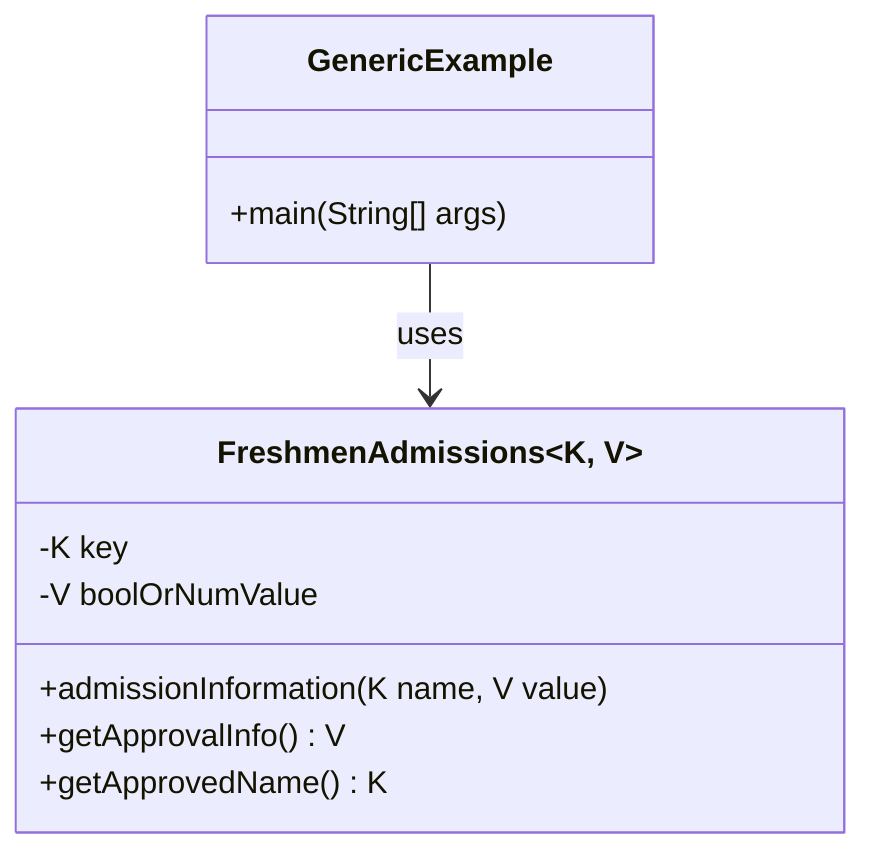
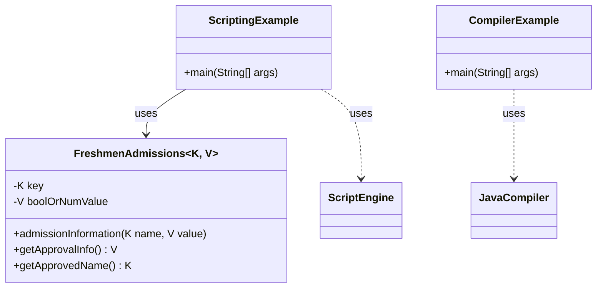
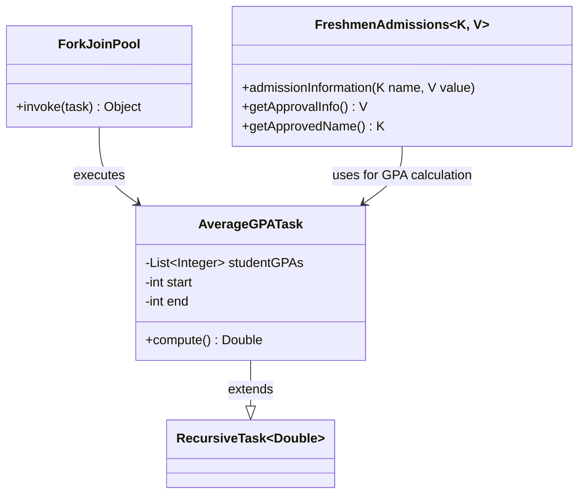

# 第1章 Java语言与虚拟机的性能演进

特别是，JVM 必须不断调整和优化其执行策略，以高效地处理这些新的语言特性。在阅读本书时，请牢记 Java 诞生时的历史背景和驱动因素。Java 及其虚拟机的演进深刻影响了开发者在各种平台上编写和优化软件的方式。在本章中，我们将全面审视 Java 和 JVM 的历史，突出那些对其发展产生重大影响的技术进步和关键里程碑。从其作为平台无关解决方案的早期阶段，到新语言特性的引入，再到 JVM 的持续改进，Java 已发展成为现代软件开发武器库中一个强大且多功能的工具。

## 新生态系统的诞生

在 1990 年代，互联网正在兴起，网页随着 Java Applet 的引入而变得更加交互化。Java Applet 是在 Web 浏览器中运行的小型应用程序，为最终用户提供"实时"体验。

Applet 不仅平台无关，而且从"安全"的角度来看，用户需要信任 Applet 的编写者。在讨论 JVM 上下文中的安全性时，必须理解应禁止对内存的直接访问。因此，Java 引入了自己的内存管理系统，称为垃圾收集器（GC）。

> **注意**：在本书中，缩写 GC 既指垃圾收集（garbage collection，自动内存管理的过程），也指垃圾收集器（garbage collector，JVM 中执行此过程的模块）。具体含义将根据使用 GC 的上下文而明确。

此外，一个称为 Java 字节码的抽象层被添加到所有可执行文件中。Java Applet 迅速流行起来，因为它们的字节码位于 Web 服务器上，会在网页渲染期间被传输并作为独立进程执行。尽管 Java 字节码是平台无关的，但它会被解释并编译为底层平台特有的本地代码。

## 历史上的几页

JDK 包含了诸如 Java 编译器之类的工具，用于将 Java 代码翻译为 Java 字节码。Java 字节码是由 Java 运行时环境（JRE）处理的可执行文件。因此，对于不同的环境，只需要更新运行时即可。只要存在针对特定环境的 JVM，字节码就可以被执行。JVM 和 GC 充当执行引擎。在 Java 1.0 和 1.1 版本中，字节码被解释为本地机器码，没有动态编译。

Java 1.0 和 1.1 版本发布后不久，人们发现 Java 需要更高的性能。因此，在 Java 1.2 中引入了即时（JIT）编译器。当与 JVM 结合时，它基于热点方法和回边分支计数提供了动态编译。这个新的 VM 被称为 Java HotSpot VM。

## 理解 Java HotSpot VM 及其编译策略

Java HotSpot VM 在高效执行 Java 程序中起着关键作用。它包含了 JIT 编译、分层编译和自适应优化，以提升 Java 应用程序的性能。

### HotSpot 执行引擎的演进

HotSpot VM 执行混合模式执行，这意味着 VM 以解释模式启动，基于描述表将字节码转换为本地代码。该表包含与每个字节码指令相对应的本地代码模板，称为 TemplateTable；它只是一个简单的查找表。执行代码存储在代码缓存（称为 CodeCache）中。CodeCache 存储本地代码，也是存储 JIT 编译代码的有用缓存。

> **注意**：HotSpot VM 还提供了一个不需要模板的解释器，称为 C++ 解释器。一些 OpenJDK 移植版本[^1]选择这条路径以简化 VM 向非 x86 平台的移植。

### 性能关键方法及其优化

性能工程是软件开发的一个关键方面，该过程的核心部分是识别和优化性能关键方法。这些方法被频繁执行或包含性能敏感的代码，并且最有可能从 JIT 编译中受益。优化性能关键方法不仅仅是选择合适的数据结构和算法；还涉及根据它们的调用频率、大小和复杂度以及可用系统资源来识别和优化这些方法。

考虑以下 `BookProgress` 类作为示例：

```java
import java.util.*;
public class BookProgress {
    private String title;
    private Map<String, Integer> chapterPages;
    private Map<String, Integer> chapterPagesWritten;
    public BookProgress(String title) {
        this.title = title;
        this.chapterPages = new HashMap<>();
        this.chapterPagesWritten = new HashMap<>();
    }
    public void addChapter(String chapter, int totalPages) {
        this.chapterPages.put(chapter, totalPages);
        this.chapterPagesWritten.put(chapter, 0);
    }
    public void updateProgress(String chapter, int pagesWritten) {
        this.chapterPagesWritten.put(chapter, pagesWritten);
    }
    public double getProgress(String chapter) {
        return ((double) chapterPagesWritten.get(chapter) / chapterPages.get(chapter)) * 100;
    }
    public double getTotalProgress() {
        int totalWritten = chapterPagesWritten.values().stream().mapToInt(Integer::intValue).sum();
        int total = chapterPages.values().stream().mapToInt(Integer::intValue).sum();
        return ((double) totalWritten / total) * 100;
    }
}
public class Main {
    public static void main(String[] args) {
        BookProgress book = new BookProgress("JVM Performance Engineering");
        String[] chapters = {
            "Performance Evolution",
            "Performance and Type System",
            "Monolithic to Modular",
            "Unified Logging System",
            "End-to-End Performance Optimization",
            "Advanced Memory Management",
            "Runtime Performance Optimization",
            "Accelerating Startup",
            "Harnessing Exotic Hardware"
        };
        for (String chapter : chapters) {
            book.addChapter(chapter, 100);
        }
        for (int i = 0; i < 50; i++) {
            for (String chapter : chapters) {
                int currentPagesWritten = book.chapterPagesWritten.get(chapter);
                if (currentPagesWritten < 100) {
                    book.updateProgress(chapter, currentPagesWritten + 2);
                    double progress = book.getProgress(chapter);
                    System.out.println("Progress for chapter " + chapter + ": " + progress + "%");
                }
            }
        }
        System.out.println("Total book progress: " + book.getTotalProgress() + "%");
    }
}
```

在这段代码中，我们定义了一个 `BookProgress` 类来跟踪一本书的写作进度，该书被分为多个章节。每个章节有一个总页数和一个当前已编写页数的计数。该类提供了添加章节、更新进度以及计算每个章节和整本书进度的方法。

`Main` 类为一本名为"JVM Performance Engineering"的书创建了一个 `BookProgress` 对象。它添加了九个章节，每章 100 页，并通过轮询方式每次编写两页来模拟写作过程。每次更新后，它计算并打印当前章节的进度，当所有页面都编写完成后，打印整本书的总体进度。

`getProgress(String chapter)` 和 `updateProgress(String chapter, int pagesWritten)` 方法被识别为性能关键方法。它们被频繁调用，使它们成为 HotSpot VM 优化的主要候选对象，这说明了程序中某些方法可能因其高频使用而需要更多关注性能优化。

### 解释器和 JIT 编译

HotSpot VM 提供了一个基于 TemplateTable 将字节码转换为本地代码的解释器。解释是此 VM 提供的自适应优化的第一步，被认为是字节码执行中最慢的形式。为了加快执行速度，HotSpot VM 采用了自适应 JIT 编译。JIT 优化的代码会替换那些被识别为性能关键的方法的模板代码。

如前所述，HotSpot VM 基于两个关键指标——方法进入次数和回边分支计数——来监控执行代码中的性能关键方法。VM 为 Java 应用程序中的各个方法分配调用计数器。当进入次数超过预设值时，该方法或其调用者将被选中进行异步 JIT 编译。类似地，代码中的每个循环也有一个计数器。一旦 HotSpot VM 确定回边分支（也称为回边）已超过其阈值，JIT 就会优化该特定循环。这种优化称为栈上替换（OSR）。通过 OSR，只有回边分支计数器溢出的循环会被编译并在执行栈上异步替换。

### 打印编译信息

一个非常有用的命令行选项是 `-XX:+PrintCompilation`，它可以帮助我们更好地理解 HotSpot VM 中的自适应优化。该选项还返回不同优化编译级别的信息，这些级别由一种称为分层编译的自适应优化提供（在下一小节中讨论）。

`-XX:+PrintCompilation` 选项的输出是 HotSpot VM 编译任务的日志。日志的每一行代表一个编译任务，包含多条信息：

- 自 JVM 启动到该编译任务被记录时的时间戳（以毫秒为单位）。
- 该编译任务的唯一标识符。
- 指示被编译方法的某些属性的标志，例如是否为 OSR 方法（%）、是否同步（s）、是否包含异常处理器（!）、是否为阻塞（b）、或者是否为本地方法（n）。
- 分层编译级别，指示应用于该方法的优化级别。
- 被编译方法的完全限定名。
- 对于 OSR 方法，编译开始的字节码索引。这通常是一个循环的开始位置。
- 该方法在字节码中的大小（以字节为单位）。

以下是 `-XX:+PrintCompilation` 选项输出的一些示例：

```
567   3   org.h2.command.dml.Insert::insertRows @ 76 (513 bytes)
693   % !   java.lang.Object::clone (native)
656   n 0   java.lang.StringBuffer::append (13 bytes)
797   s 4   ...
779        ...
835       ...
```

这些日志提供了对 HotSpot VM 自适应优化行为的宝贵洞察，帮助我们理解 Java 应用程序在运行时是如何被优化的。

### 分层编译

分层编译在 Java 7 中引入，提供了从 T0 到 T4 的多个优化编译级别：

1. **T0**：解释执行的代码，没有编译。这是代码的起点，然后进入 T1、T2 或 T3 级别。
2. **T1–T3**：客户端编译模式。T1 是第一步，使用方法调用计数器和回边分支计数器。在 T2 级别，客户端编译器包含性能分析信息，称为性能引导优化（profile-guided optimization）；熟悉静态编译器优化的读者可能对此并不陌生。在 T3 编译级别，可以生成完全性能分析过的代码。
3. **T4**：HotSpot VM 服务器编译器提供的最高优化级别。

在分层编译出现之前，服务器编译器会使用解释器来收集此类性能分析信息。随着分层编译的引入，代码更快地达到客户端编译级别，现在性能分析信息由客户端编译方法自身生成，从而提供了更好的启动时间。

> **注意**：自 Java 8 起，分层编译默认启用。

### 客户端和服务器编译器

HotSpot VM 提供了两种编译器：快速客户端编译器（也称为 C1 编译器）和服务器编译器（也称为 C2 编译器）。

1. **客户端编译器（C1）**：旨在为客户端场景提供快速启动时间。客户端编译器的 JIT 调用阈值比服务器编译器低。该编译器设计用于快速编译代码，启动时间快，但生成的代码优化程度较低。
2. **服务器编译器（C2）**：提供更多自适应优化和更高的阈值，以追求更高的性能。确定方法/循环何时需要编译的计数器仍然是相同的，但客户端编译器的调用阈值与服务器编译器不同（更低很多）。服务器编译器编译方法需要更长时间，但生成高度优化的代码，这对长期运行的应用程序非常有利。C2 编译器执行的一些优化包括内联（用方法体替换方法调用）、循环展开（增加循环体大小以减少循环检查的开销，并可能应用其他优化如循环向量化）、死代码消除（删除不影响程序结果的代码）以及范围检查消除（如果可以确保数组索引永远不会越界，则移除索引越界错误检查）。这些优化有助于提高代码的执行速度并减少某些操作的开销。[^2]

### 分段代码缓存

当我们深入探讨 HotSpot VM 的复杂性时，重新审视代码缓存的概念是很重要的。回顾一下，代码缓存是 JIT 编译器或解释器生成的本地代码的存储区域。随着分层编译的引入，代码缓存也成为在不同分层编译级别收集的性能分析信息的存储库。有趣的是，即使是解释器用于查找每个字节码对应的本地代码序列的 TemplateTable，也存储在代码缓存中。

代码缓存的大小在启动时固定，但可以通过命令行将所需的最大值传递给 `-XX:ReservedCodeCacheSize` 来修改。在 Java 7 之前，此大小的默认值为 48 MB。一旦代码缓存被填满，所有编译都将停止。当启用分层编译时，这带来了一个重大问题，因为代码缓存中不仅包含 JIT 编译的代码（在 HotSpot VM 中表示为 nmethod），还包含性能分析代码。nmethod 指的是已被 JIT 编译器编译为机器码的 Java 方法的内部表示。相比之下，性能分析代码则是已根据其运行时行为进行分析和优化的代码。代码缓存需要管理这两种类型的代码，导致复杂性增加和潜在的性能问题。

为了解决这些问题，在 JDK 7 Update 40 中，`ReservedCodeCacheSize` 的默认值增加到 240 MB。此外，当代码缓存占用率超过预设的 `CodeCacheMinimumFreeSpace` 阈值时，JIT 编译停止，JVM 运行一个清扫器（sweeper）。nmethod 清扫器通过清除较旧的编译来回收空间。然而，清扫整个代码缓存数据结构可能非常耗时，尤其是在代码缓存较大且几乎满的时候。

Java 9 对代码缓存引入了一项重大变更：它根据代码类型将代码缓存分割为不同的区域。这不仅减少了清扫时间，还减少了短生命周期代码对长生命周期代码的碎片化影响。将相同类型的代码放在一起还减少了硬件级别的指令缓存未命中。

当前分段代码缓存的实现包括以下区域：

- **非方法代码堆区域（Non-method code heap region）**：此区域保留给与 Java 方法无关的 VM 内部数据结构。例如，TemplateTable（一种 VM 内部数据结构）就位于此处。此区域不包含已编译的 Java 方法。
- **非性能分析 nmethod 代码堆（Non-profiled nmethod code heap）**：此区域包含由 JIT 编译器编译但不含性能分析信息的 Java 方法。这些方法是完全优化的，预期是长生命周期的，意味着它们不会被频繁重新编译，并且可能很少需要被清扫器回收。
- **性能分析 nmethod 代码堆（Profiled nmethod code heap）**：此区域包含带有性能分析信息编译的 Java 方法。这些方法不像非性能分析区域中的方法那样高度优化。它们被认为是临时性的，因为它们可以被重新编译为更优化的版本，并在获得更多性能分析信息后移至非性能分析区域。它们也可以根据需要被清扫器频繁回收。

每个区域都有一个固定大小，可以通过各自的命令行选项设置：

| 堆区域类型 | 大小命令行选项 |
|---|---|
| 非方法代码堆 | `-XX:NonMethodCodeHeapSize` |
| 非性能分析 nmethod 代码堆 | `-XX:NonProfiledCodeHeapSize` |
| 性能分析 nmethod 代码堆 | `-XX:ProfiledCodeHeapSize` |

展望未来，人们希望分段代码缓存可以容纳更多用于异构代码的代码区域，例如提前编译（AOT）代码和硬件加速器的代码。[^3] 同时也有期望将固定大小的阈值升级为自适应调整大小，从而避免内存浪费。

### 自适应优化与去优化

自适应优化允许 HotSpot VM 运行时将解释执行的代码优化为编译代码，或在栈上插入优化后的循环（这样我们就可以有类似"解释执行 -> 编译执行 -> 回到解释执行"的代码执行序列）。然而，自适应优化还有另一个主要优势——代码的去优化。这意味着编译后的代码可以回到解释执行模式，或者更高优化级别的代码序列可以回退到较低优化级别的序列。

动态去优化帮助 Java 回收可能不再相关的代码。一些示例场景包括：在动态类加载期间检查相互依赖关系时、处理多态调用点时、以及回收较低优化级别的代码时。去优化首先会将代码标记为"不再准入"（not entrant），最终在标记为"僵尸"（zombie）代码后将其回收。[^4]

### 去优化场景

在处理 Java 应用程序时，去优化可能发生在多种场景中。在本节中，我们将探讨其中两种场景。

#### 类加载与卸载

考虑一个包含两个类 `Car` 和 `DriverLicense` 的应用程序。`Car` 类需要 `DriverLicense` 才能启用驾驶模式。JIT 编译器优化了这两个类之间的交互。然而，如果由于驾驶法规的变更加载了新版本的 `DriverLicense` 类，先前编译的代码可能不再有效。这就需要去优化以回退到解释模式或较低优化状态。这使得应用程序能够使用新版本的 `DriverLicense` 类。

以下是一个示例代码片段：

```java
class Car {
    private DriverLicense driverLicense;
    public Car(DriverLicense driverLicense) {
        this.driverLicense = driverLicense;
    }
    public void enableDriveMode() {
        if (driverLicense.isAdult()) {
            System.out.println("Drive mode enabled!");
        } else if (driverLicense.isTeenDriver()) {
            if (driverLicense.isLearner()) {
                System.out.println("You cannot drive without a licensed adult's supervision.");
            } else {
                System.out.println("Drive mode enabled!");
            }
        } else {
            System.out.println("You don't have a valid driver's license.");
        }
    }
}
class DriverLicense {
    private boolean isTeenDriver;
    private boolean isAdult;
    private boolean isLearner;
    public DriverLicense(boolean isTeenDriver, boolean isAdult, boolean isLearner) {
        this.isTeenDriver = isTeenDriver;
        this.isAdult = isAdult;
        this.isLearner = isLearner;
    }
    public boolean isTeenDriver() {
        return isTeenDriver;
    }
    public boolean isAdult() {
        return isAdult;
    }
    public boolean isLearner() {
        return isLearner;
    }
}
public class Main {
    public static void main(String[] args) {
        DriverLicense driverLicense = new DriverLicense(false, true, false);
        Car myCar = new Car(driverLicense);
        myCar.enableDriveMode();
    }
}
```

在这个示例中，`Car` 类需要 `DriverLicense` 才能启用驾驶模式。驾照可以是成人驾照、持有学习驾照的青少年司机、或持有正式驾照的青少年司机。`enableDriveMode()` 方法使用 `isAdult()`、`isTeenDriver()` 和 `isLearner()` 方法检查驾照，并向控制台打印相应的信息。

如果加载了新版本的 `DriverLicense` 类，先前优化的代码可能不再有效，从而触发去优化。这使应用程序能够毫无问题地使用新版本的 `DriverLicense` 类。

#### 多态调用点

去优化也可能发生在处理多态调用点时，即实际调用的方法在运行时才确定。让我们看一个使用 `DriverLicense` 类的示例：

```java
abstract class DriverLicense {
    public abstract void drive();
}
class AdultLicense extends DriverLicense {
    public void drive() {
        System.out.println("Thanks for driving responsibly as an adult");
    }
}
class TeenPermit extends DriverLicense {
    public void drive() {
        System.out.println("Thanks for learning to drive responsibly as a teen");
    }
}
class SeniorLicense extends DriverLicense {
    public void drive() {
        System.out.println("Thanks for being a valued senior citizen");
    }
}
public class Main {
    public static void main(String[] args) {
        DriverLicense license = new AdultLicense();
        license.drive(); // 单态调用点（monomorphic call site）
        
        // 将调用点变为双态（bimorphic）
        if (Math.random() < 0.5) {
            license = new AdultLicense();
        } else {
            license = new TeenPermit();
        }
        license.drive(); // 双态调用点（bimorphic call site）
        
        // 将调用点变为多态（megamorphic）
        for (int i = 0; i < 100; i++) {
            if (Math.random() < 0.33) {
                license = new AdultLicense();
            } else if (Math.random() < 0.66) {
                license = new TeenPermit();
            } else {
                license = new SeniorLicense();
            }
            license.drive(); // 多态调用点（megamorphic call site）
        }
    }
}
```

在这个示例中，抽象类 `DriverLicense` 有三个子类：`AdultLicense`、`TeenPermit` 和 `SeniorLicense`。`drive()` 方法在每个子类中被重写为不同的实现。

首先，当我们将一个 `AdultLicense` 对象赋值给 `DriverLicense` 变量并调用 `drive()` 时，HotSpot VM 将调用点优化为单态调用点，并在内联缓存（一种用于跟踪调用点类型性能分析的结构）中缓存目标方法地址。

接下来，我们通过随机将 `AdultLicense` 或 `TeenPermit` 对象赋值给 `DriverLicense` 变量并调用 `drive()`，将调用点变为双态调用点。由于有两种可能的类型，VM 不再能使用单态分发机制，因此切换到双态分发机制。这一改变不需要去优化，而且通过减少调用点所需的虚方法分派次数，仍然提供了性能提升。

最后，我们通过随机将 `AdultLicense`、`TeenPermit` 或 `SeniorLicense` 对象赋值给 `DriverLicense` 变量并调用 `drive()` 100 次，将调用点变为多态调用点。由于现在有三种可能的类型，VM 不能再使用双态分发机制，必须切换到多态分发机制。这一改变也不需要去优化。

然而，如果我们引入一个新的子类 `InternationalLicense` 并将调用点改为包含它，VM 可能会对调用点进行去优化并切换到多态调用点以处理新类型。这一改变是必要的，因为 VM 对该调用点的类型性能分析信息已经过时，先前优化的代码不再有效。

以下是新子类和更新后的调用点的代码片段：

```java
class InternationalLicense extends DriverLicense {
    public void drive() {
        System.out.println("Thanks for driving responsibly as an international driver");
    }
}
// 更新后的调用点
for (int i = 0; i < 100; i++) {
    if (Math.random() < 0.25) {
        license = new AdultLicense();
    } else if (Math.random() < 0.5) {
        license = new TeenPermit();
    } else if (Math.random() < 0.75) {
        license = new SeniorLicense();
    } else {
        license = new InternationalLicense();
    }
    license.drive(); // 包含新类型的多态调用点
}
```

## HotSpot 垃圾收集器：内存管理单元

HotSpot 执行引擎的一个关键组成部分是其内存管理单元，通常称为垃圾收集器（GC）。HotSpot 提供了多种垃圾收集算法，涵盖性能的三重方面：应用程序响应性、吞吐量和总体内存占用。响应性指的是在发送刺激后从系统收到响应所需的时间。吞吐量衡量在给定系统上每秒可以执行的操作数量。占用空间可以从两个方面定义：优化可以放入可用空间的数据或对象的数量，以及删除冗余信息以节省空间。

### 分代垃圾收集、Stop-the-World 与并发算法

OpenJDK 提供了多种分代 GC，它们采用不同的策略来管理内存，共同目标是提升应用程序性能。这些收集器的设计基于"大多数对象早逝"的原则，意味着 Java 堆上新分配的大多数对象都是短生命周期的。利用这一观察结果，分代 GC 旨在优化内存管理并显著减少垃圾收集对应用程序性能的负面影响。

用 GC 术语来说，堆收集涉及识别存活对象、回收垃圾对象占用的空间，以及在某些情况下压缩堆以减少碎片化。碎片化有两种方式发生：（1）内部碎片化，分配的内存块超出需要的大小，在块内留下浪费的空间；（2）外部碎片化，内存以这样一种方式分配和释放，使得空闲内存被分割成不连续的块。外部碎片化可能导致内存使用效率低下和潜在的分配失败。压缩是一些 GC 用来对抗外部碎片化的技术；它涉及移动内存中的对象，将空闲内存合并为一个连续块。然而，压缩在 CPU 使用方面可能是一项昂贵的操作，如果作为 stop-the-world（STW）操作执行，可能导致长时间的暂停。

OpenJDK GC 采用了几种不同的 GC 算法：

- **Stop-the-world（STW）算法**：STW 算法在垃圾收集工作的整个持续时间内暂停应用程序线程。Serial、Parallel、（主要）并发标记清除（CMS）和 Garbage First（G1）GC 在其收集周期的特定阶段使用 STW 算法。当堆被填满且分配空间耗尽时，STW 方法可能导致更长的暂停时间，特别是在非分代堆中（非分代堆将堆视为单一连续空间，不划分为代）。
- **并发算法**：这些算法旨在通过与应用程序线程并发执行大部分工作来最小化暂停时间。CMS 是使用并发算法的收集器的一个例子。然而，由于 CMS 不执行压缩，碎片化可能随时间成为问题。这可能导致更长的暂停时间，甚至导致回退到使用 Serial Old 收集器执行完全 GC（包含压缩）。
- **增量压缩算法**：G1 GC 引入了增量压缩以处理 CMS 中的碎片化问题。G1 将堆划分为更小的区域，并在收集周期中对一部分区域执行垃圾收集。这种方法有助于在保持可预测暂停时间的同时处理压缩。
- **线程本地握手**：较新的 GC（如 Shenandoah 和 ZGC）利用线程本地握手来最小化 STW 暂停。通过采用这种机制，它们可以逐线程执行某些 GC 操作，允许应用程序线程在 GC 工作时继续运行。这种方法有助于减少垃圾收集对应用程序性能的整体影响。
- **超低暂停时间收集器**：Shenandoah 和 ZGC 旨在通过执行并发的标记、重定位和压缩来实现超低暂停时间。两者都将 STW 暂停减少到整个垃圾收集工作的一小部分，为应用程序提供一致的低延迟。虽然这些 GC 在传统意义上不是分代的，但它们确实将堆划分为区域并在不同时间收集不同区域。这种方法建立在增量和"垃圾优先"收集的原则之上。截至撰写本书时，将这些较新的收集器进一步发展为分代收集器的工作仍在进行中，但由于它们增强了分代垃圾收集原则的创新策略，它们被包含在本节中。

每个收集器都有其优势和权衡，允许开发人员选择最适合其应用程序需求的收集器。

### 年轻代收集与弱分代假说

在分代堆中，大多数分配发生在年轻代的 eden 空间中。当 eden 空间接近其容量时，分配线程可能会遇到分配失败，这表明 GC 必须介入并回收空间。

在第一次年轻代收集期间，eden 空间经历一次清收（scavenging）过程，其中存活对象被识别并随后移动到 to survivor 空间。survivor 空间作为一个过渡区域，存活对象在其中被复制、老化，并在 from 和 to 空间之间来回移动，直到它们跨过任期阈值（tenuring threshold）。一旦对象跨过此阈值，它就被晋升到老年代。其根本目标仅晋升那些证明了自己具有长生命周期的对象，从而创造一个"青少年的荒原"（Teenage Wasteland），正如 Charlie Hunt[^5] 所解释的那样。

分代垃圾收集基于与弱分代假说相关的两个主要特征：

1. **大多数对象早逝**：这意味着我们只晋升长生命周期对象。如果分代 GC 高效，我们既不会晋升临时对象，也不会晋升中等生命周期对象。这通常导致更小的长生命周期数据集，从而抑制过早晋升、碎片化、疏散失败以及类似的退化问题。
2. **代际维护**：分代算法已被证明对 OpenJDK GC 大有裨益，但这并非没有代价。由于年轻代收集器比老年代收集器更频繁地独立工作，它最终会移动存活数据。因此，分代 GC 会产生维护/簿记开销，以确保它们标记所有可达对象——这一成就通过使用"写屏障"来跟踪跨代引用而实现。

Figure 1.1 展示了分代 GC 的三个关键概念，以可视化方式强化了此处讨论的信息。

> ▲ 上图根据原文 Figure 1.1 "Key Concepts for Generational Garbage Collectors" 标题和上下文推测绘制，原文为英文截图。图中包含三个关键词组：Objects die young（对象早逝）、Small long-lived data sets（小的长生命周期数据集）、Maintenance barriers（维护屏障），三者围绕中央的"Generational"（分代）一词排列。

大多数 HotSpot GC 对年轻代收集采用了著名的"清收"（scavenge）算法。HotSpot VM 中的 Serial GC 使用单个垃圾收集线程专用于高效回收年轻代空间中的内存。相比之下，诸如 Parallel GC（吞吐量收集器）、G1 GC 和 CMS GC 等分代收集器则利用多个 GC 工作线程。

### 老年代收集与回收触发条件

HotSpot VM 分代 GC 中的老年代回收算法针对吞吐量、响应性或两者的组合进行了优化。Serial GC 采用单线程的标记-清除-压缩（MSC）GC。Parallel GC 使用具有多线程的类似 MSC GC。CMS GC 执行主要并发的标记，将过程分为 STW 或并发阶段。标记之后，CMS 通过执行原地释放（in-place deallocation）来回收老年代空间，而不进行压缩。如果发生碎片化，CMS 回退到串行 MSC。

G1 GC 在 Java 7 Update 4 中引入并随时间不断完善，是第一个增量收集器。具体来说，它增量地回收和压缩老年代空间，而不是执行作为 MSC 一部分的单一整体回收和压缩。G1 GC 将堆划分为更小的区域，并在收集周期中对一部分区域执行垃圾收集，这有助于在保持可预测暂停时间的同时处理压缩。

经过多次年轻代收集后，老年代开始变满，垃圾收集启动以回收老年代空间。为此，必须通过以下方式之一触发完整的堆标记周期：（1）晋升失败（promotion failure），（2）常规大小对象的晋升使得老年代或总堆大小超过标记阈值，或（3）大对象分配（在 G1 GC 中也称为巨型对象分配，humongous allocation）导致堆占用率超过预定阈值。

Shenandoah GC 和 ZGC——分别在 JDK 12 和 JDK 11 中引入——是超低暂停时间收集器，旨在最小化 STW 暂停。在 JDK 17 中，它们是单代收集器。除了利用线程本地握手之外，这些收集器知道如何通过让应用程序线程协助 GC 工作或要求应用程序线程退让来优化低暂停场景。这种 GC 技术被称为优雅降级（graceful degradation）。

### 并行 GC 线程、并发 GC 线程及其配置

在 HotSpot VM 中，GC 工作线程（也称为并行 GC 线程）的总数是根据启动时 Java 进程可用的处理核心总数的一个分数计算得出的。用户可以通过在命令行直接使用 `-XX:ParallelGCThreads=<n>` 标志来调整并行 GC 线程数。

此配置标志使开发人员能够为使用并行收集阶段的 GC 算法定义并行 GC 线程的数量。它对于调整分代 GC（如 Parallel GC 和 G1 GC）特别有用。较新的 GC（如 Shenandoah 和 ZGC）也使用多个 GC 工作线程，并与应用程序线程并发执行垃圾收集以最小化暂停时间。它们受益于负载均衡、工作共享和工作窃取，这些通过并行化垃圾收集过程来提升性能和效率。这种并行化对于运行在多核处理器上的应用程序特别有利，因为它允许 GC 更好地利用可用的硬件资源。

类似地，`-XX:ConcGCThreads=<n>` 配置标志允许开发人员为使用并发收集阶段的特定 GC 算法指定并发 GC 线程的数量。此标志对于调整 G1（它在标记期间执行并发工作）以及 Shenandoah 和 ZGC（它们旨在通过执行并发标记、重定位和压缩来最小化 STW 暂停）特别有用。

默认情况下，并行 GC 线程数根据可用 CPU 核心数自动计算。并发 GC 线程通常默认为并行 GC 线程数的四分之一。然而，开发人员可能希望调整并行或并发 GC 线程的数量，以更好地匹配其应用程序的性能要求和可用硬件资源。

增加并行 GC 线程的数量有助于提高整体 GC 吞吐量，因为更多线程同时在该过程的并行阶段工作。这种增加可能导致更短的 GC 暂停时间和可能更高的应用程序吞吐量，但开发人员应注意不要过度提交处理资源。

相比之下，增加并发 GC 线程的数量可以增强整体 GC 性能并加快 GC 周期，因为更多线程同时在该过程的并发阶段工作。然而，这种增加可能以更高的 CPU 利用率和与应用程序线程争抢 CPU 资源为代价。

相反，减少并行或并发 GC 线程的数量可能会降低 CPU 利用率，但可能导致更长的 GC 暂停时间，从而可能影响应用程序性能和响应性。在某些情况下，如果并发收集器无法跟上应用程序分配对象的速度（这种情况称为 GC"输掉比赛"），可能会导致优雅降级——也就是说，GC 回退到一种次优但更可靠的操作模式，例如 STW 收集模式，或者可能采用诸如限制应用程序分配速率等策略以防止其过载收集器。

Figure 1.2 以词云形式展示了与 GC 工作相关的关键概念：

> ▲ 上图根据原文 Figure 1.2 "Key Concepts for Garbage Collection Work" 标题和上下文推测绘制，原文为英文截图。图中包含六个关键词组：Task queues（任务队列）、Concurrent work（并发工作）、Graceful degradation（优雅降级）、Pauses（暂停）、Task stealing（任务窃取）、Lots of threads（大量线程），六者围绕中央的"GC Work"（GC 工作）一词排列。

在并行和并发 GC 线程的数量与应用程序性能之间找到适当的平衡至关重要。开发人员应进行性能测试和监控，以确定其特定用例的最佳配置。在调整这些线程时，请考虑可用 CPU 核心数、应用程序工作负载的性质以及垃圾收集吞吐量与应用程序响应性之间的期望平衡等因素。

## Java 编程语言及其生态系统的演进：深入探讨

自从早期的 Java 1.0 时代以来，Java 语言一直在稳步演进。要理解 JVM（特别是 HotSpot VM）的进步，理解 Java 编程语言及其生态系统的演进至关重要。深入了解语言特性、库、框架和工具如何塑造并影响了 JVM 的性能优化和垃圾收集策略，将有助于我们把握更广泛的上下文。

### Java 1.1 到 Java 1.4.2（J2SE 1.4.2）

Java 1.1，最初称为 JDK 1.1，引入了 JavaBeans，允许多个对象被封装在一个 bean 中。此版本还带来了 Java 数据库连接（JDBC）、远程方法调用（RMI）和内部类。这些特性为更复杂的应用程序奠定了基础，反过来又要求改进 JVM 性能和垃圾收集策略。

从 Java 1.2 到 Java 5.0，版本发布被重新命名以包含版本名称，从而产生了诸如 J2SE（Platform，Standard Edition）这样的名称。重新命名有助于区分 Java 2 Micro Edition（J2ME）和 Java 2 Enterprise Edition（J2EE）。[^6] J2SE 1.2 为 Java 引入了两项重大改进：集合框架（Collections Framework）和 JIT 编译器。集合框架提供了"用于表示和操作集合的统一架构"[^7]，这对于管理大规模数据结构和优化 JVM 中的内存管理变得至关重要。

Java 1.3（J2SE 1.3）向集合框架添加了新 API，引入了 Math 类，并将 HotSpot VM 设为默认的 Java VM。Java RMI 包含了一个目录服务 API，用于查找任何目录或名称服务。这些增强通过实现更节省内存的数据管理和交互模式，进一步影响了 JVM 的效率。

Java 1.4（J2SE 1.4）中基于 Java 规范请求（JSR）#51[^8] 引入的新输入/输出（NIO）API，显著提高了 I/O 操作效率。这一增强减少了 I/O 任务的等待时间，并整体提升了 JVM 性能。J2SE 1.4 还引入了日志记录 API（Logging API），允许生成文本或 XML 格式的日志消息，这些消息可以定向到文件或控制台。

J2SE 1.4.1 很快被 J2SE 1.4.2 取代，后者在 HotSpot 的客户端和服务端编译器中包含了许多性能增强。同时还增加了安全增强，Java 用户通过 Java 插件控制面板的更新选项卡了解到了 Java 更新。

随着 Java 语言及其生态系统的持续改进，JVM 性能策略不断演进以适应日益复杂和资源需求更大的应用程序。

### Java 5（J2SE 5.0）

Java 语言在 Java 5.0 版本的发布中迈出了语言精进方面的第一个重大飞跃。此版本引入了几个关键特性，包括泛型、自动装箱/拆箱、注解和增强的 for 循环。

#### 语言特性

泛型引入了两大变化：（1）语法的变化，（2）核心 API 的修改。泛型允许你为不同的数据类型重用代码，这意味着你可以只编写一个类——无需为不同的输入重写。

要编译包含泛型的 Java 5.0 代码，你需要使用随 Java 5.0 JDK 打包的 Java 编译器 javac。（Java 5.0 之前的任何版本都没有核心 API 的更改。）如果在编译时检测到任何类型安全违规，新的 Java 编译器将产生错误。因此，泛型将类型安全引入了 Java。同时，泛型消除了显式转换的需要，因为转换变成了隐式的。

以下是在 Java 5.0 中如何创建一个名为 `FreshmenAdmissions` 的泛型类的示例：

```java
class FreshmenAdmissions<K, V> {
    //...
}
```

在此示例中，`K` 和 `V` 是对象实际类型的占位符。`FreshmenAdmissions` 类是一个泛型类型。如果我们不指定 `K` 和 `V` 的实际类型就声明此泛型类型的实例，则它被认为是泛型类型 `FreshmenAdmissions<K, V>` 的原始类型（raw type）。原始类型存在于泛型类型中，当具体的类型参数未知时使用。

```java
FreshmenAdmissions applicationStatus;
```

然而，假设我们用实际类型声明实例：

```java
FreshmenAdmissions<String, Boolean>
```

那么 `applicationStatus` 被称为参数化类型（parameterized type）——具体来说，它是在类型 `String` 和 `Boolean` 上参数化的。

```java
FreshmenAdmissions<String, Boolean> applicationStatus;
```

> **注意**：许多 C++ 开发者看到尖括号 `<>` 可能会立即联想到 C++ 模板。虽然 C++ 和 Java 都使用泛型类型，但 C++ 模板更像是一种编译时机制，其中泛型类型被 C++ 编译器替换为实际类型，提供了强大的类型安全。

在讨论泛型的同时，我们还应该谈一谈自动装箱（autoboxing）和拆箱（unboxing）。在 `FreshmenAdmissions<K, V>` 类中，我们可以有一个返回类型 `V` 的泛型方法：

```java
public V getApprovalInfo() {
    return boolOrNumValue;
}
```

基于我们在参数化类型中对 `V` 的声明，我们可以执行布尔检查，代码将正确编译。例如：

```java
applicationStatus = new FreshmenAdmissions<>();
if (applicationStatus.getApprovalInfo()) {
    //...
}
```

在此示例中，我们看到 `V` 作为 `Boolean` 类型的泛型类型调用。自动装箱确保此代码正确编译。相比之下，如果我们将 `V` 作为 `Integer` 类型进行泛型类型调用，我们会得到一个"不兼容的类型"错误。因此，自动装箱是 Java 编译器的一种转换，它理解基本类型及其对象类之间的关系。正如自动装箱将 `boolean` 值封装到其 `Boolean` 包装类中一样，拆箱在返回类型是 `Boolean` 时帮助返回 `boolean` 值。

以下是完整示例（使用 Java 5.0）：

```java
class FreshmenAdmissions<K, V> {
    private K key;
    private V boolOrNumValue;
    public void admissionInformation(K name, V value) {
        key = name;
        boolOrNumValue = value;
    }
    public V getApprovalInfo() {
        return boolOrNumValue;
    }
    public K getApprovedName() {
        return key;
    }
}
public class GenericExample {
    public static void main(String[] args) {
        FreshmenAdmissions<String, Boolean> applicationStatus;
        applicationStatus = new FreshmenAdmissions<String, Boolean>();
        FreshmenAdmissions<String, Integer> applicantRollNumber;
        applicantRollNumber = new FreshmenAdmissions<String, Boolean>();
        applicationStatus.admissionInformation("Annika", true);
        if (applicationStatus.getApprovalInfo()) {
            applicantRollNumber.admissionInformation(applicationStatus.getApprovedName(), 4);
        }
        System.out.println("Applicant " + applicantRollNumber.getApprovedName() +
            " has been admitted with roll number of " + applicantRollNumber.getApprovalInfo());
    }
}
```

Figure 1.3 展示了一个类图，以帮助可视化这些类之间的关系。



> ▲ 上图根据原文 Figure 1.3 "A Generic Type Example Showcasing the FreshmenAdmission Class" 标题和上下文推测绘制，原文为英文截图。

#### JVM 与包增强

Java 5.0 还对 `java.lang.*` 和 `java.util.*` 包进行了重要补充，并添加了 JSR 166[^9] 中规定的大部分并发工具。

垃圾收集人体工程学（Garbage collection ergonomics）是 J2SE 5.0 中创造的一个术语，指的是服务器级机器的默认收集器。[^10] 默认收集器被选为并行 GC，并且并行 GC 的初始堆大小和最大堆大小的默认值被自动设置。

> **注意**：J2SE 5.0 时代的并行 GC 没有老年代的并行压缩。因此，只有年轻代可以并行清收；老年代仍然使用串行 GC 算法，即 MSC。

Java 5.0 还引入了增强的 for 循环，通常称为 for-each 循环，大大简化了数组和集合的遍历。这种新的循环语法自动处理迭代，无需显式的索引操作或调用迭代器方法。与传统的 for 循环相比，增强的 for 循环更加简洁且不易出错，使其成为该语言的一个有价值的补充。以下是一个演示其用法的示例：

```java
List<String> names = Arrays.asList("Monica", "Ben", "Annika", "Bodin");
for (String name : names) {
    System.out.println(name);
}
```

在此示例中，增强的 for 循环遍历 `names` 列表的元素，并依次将每个元素赋值给 `name` 变量。这比使用基于索引的 for 循环或迭代器要清晰和易读得多。

Java 5.0 为 `java.lang` 包带来了多项增强，包括引入了注解（annotations），它允许向 Java 源代码添加元数据。注解提供了一种将信息附加到类、方法和字段等代码元素的方法。它们可以被 Java 编译器、运行时环境或各种开发工具用来生成额外代码、强制执行编码规则或辅助调试。`java.lang.annotation` 包包含了定义和处理注解所需的类和接口。一些常用的内置注解包括 `@Override`、`@Deprecated` 和 `@SuppressWarnings`。

对 `java.lang` 包的另一个重要补充是 `java.lang.instrument` 包，它使得 Java agent 能够在 JVM 上修改正在运行的程序。这些新服务使开发者能够监控和管理 Java 应用程序的执行，提供对代码行为和性能的洞察。

### Java 6（Java SE 6）

Java SE 6，也称为 Mustang，主要关注 Java API 的补充和增强，[^11] 但对语言本身只做了微小调整。具体来说，它向集合框架增加了一些接口，并改进了 JVM。有关 Java 6 的更多信息，请参考驱动 JSR 270。[^12]

并行压缩（Parallel compaction）在 Java 6 中引入，允许使用多个 GC 工作线程在分代 Java 堆中执行老年代的压缩。此特性通过减少垃圾收集所花费的时间，显著提升了 Java 应用程序的性能。该特性的性能影响是深远的，因为它实现了更高效的内存管理，从而提高了 Java 应用程序的可伸缩性和响应性。

#### JVM 增强

Java SE 6 在改进脚本语言支持方面取得了重大进展。引入了 `javax.script` 包，使开发者能够在 Java 应用程序中嵌入和执行脚本语言。以下是一个使用 ScriptEngine API 执行 JavaScript 代码的示例：

```java
import javax.script.ScriptEngine;
import javax.script.ScriptEngineManager;
import javax.script.ScriptException;
public class ScriptingExample {
    public static void main(String[] args) {
        FreshmenAdmissions<String, Integer> applicantGPA;
        applicantGPA = new FreshmenAdmissions<String,Integer>();
        applicantGPA.admissionInformation("Annika", 98);
        ScriptEngineManager manager = new ScriptEngineManager();
        ScriptEngine engine = manager.getEngineByName("JavaScript");
        try {
            engine.put("score", applicantGPA.getApprovalInfo());
            engine.eval("var gpa = score / 25; print('Applicant GPA: ' + gpa);");
        } catch (ScriptException e) {
            e.printStackTrace();
        }
    }
}
```

Java SE 6 还引入了 Java 编译器 API（JSR 199[^13]），它允许开发者以编程方式调用 Java 编译器。使用 `FreshmenAdmissions` 示例，我们可以按如下方式编译应用程序的 Java 源文件：

```java
import javax.tools.JavaCompiler;
import javax.tools.ToolProvider;
import java.io.File;
public class CompilerExample {
    public static void main(String[] args) {
        JavaCompiler compiler = ToolProvider.getSystemJavaCompiler();
        int result = compiler.run(null, null, null, "path/to/FreshmenAdmissions.java");
        if (result == 0) {
            System.out.println("Congratulations! You have successfully compiled your program");
        } else {
            System.out.println("Apologies, your program failed to compile");
        }
    }
}
```

Figure 1.4 是两个类及其关系的可视化表示。



> ▲ 上图根据原文 Figure 1.4 "Script Engine API and Java Compiler API Examples" 标题和上下文推测绘制，原文为英文截图。

此外，Java SE 6 通过添加 JAXB 2.0 和 JAX-WS 2.0 API 增强了 Web 服务支持，简化了基于 SOAP 的 Web 服务的创建和消费。

### Java 7（Java SE 7）

Java SE 7 标志着 Java 演进中的另一个重要里程碑，为 Java 语言和 JVM 引入了众多增强。这些增强对于理解现代 Java 开发至关重要。

#### 语言特性

Java SE 7 引入了菱形运算符（`<>`），它简化了泛型类型推断。此运算符增强了代码的可读性并减少了冗余。例如，当声明一个 `FreshmenAdmissions` 实例时，你不再需要两次指定类型参数：

```java
// Java SE 7 之前
FreshmenAdmissions<String, Boolean> applicationStatus = new FreshmenAdmissions<String, Boolean>();
// Java SE 7 之后
FreshmenAdmissions<String, Boolean> applicationStatus = new FreshmenAdmissions<>();
```

另一个重要的补充是 try-with-resources 语句，它自动管理资源，减少了资源泄漏的可能性。实现了 `java.lang.AutoCloseable` 接口的资源可以与此语句一起使用，它们会在不再需要时自动关闭。

Project Coin，[^14] 作为 Java SE 7 的一部分，引入了几项虽小但影响深远的增强，包括改进的字面量、switch 语句中对字符串的支持、以及通过 try-with-resources 和多 catch 块增强的错误处理。压缩的普通对象指针（oops）、逃逸分析和分层编译等性能改进也在这一时期出现。

#### JVM 增强

Java SE 7 通过 NIO.2 进一步增强了 Java NIO 库，提供了更好的文件 I/O 支持。此外，源自 JSR 166：并发工具[^15] 的 fork/join 框架被纳入 Java SE 7 的并发工具中。这个强大的框架通过递归地将任务分解为更小、更易于管理的子任务，然后合并结果，从而实现高效的并行任务处理。

Java 中的 fork/join 框架让我想起了学生时代参加的一次编程竞赛。该活动由电气和电子工程师协会（IEEE）举办，是一项面向计算机科学和工程专业学生的一日挑战赛。我和我的同学决定各自解决竞赛中的两个谜题。我接手了一个需要优化二分拆分排序算法的谜题。经过一番专注的工作，我成功地对算法进行了显著优化，产生了竞赛中展示的最高效解决方案之一。

这段经历是对二分拆分和排序力量的实践演示——这个概念类似于 Java 的 fork/join 框架的核心原则。在下面的 fork/join 示例中，你可以看到该框架如何通过将任务划分为更小的子任务然后统一它们，成为一个高效处理任务的强大工具。

以下是使用 fork/join 框架计算所有录取学生平均 GPA 的示例：

```java
// 创建一个包含已录取学生 GPA 的列表
List<Integer> admittedStudentGPAs = Arrays.asList(95, 88, 76, 93, 84, 91);
// 使用 fork/join 框架计算平均 GPA
ForkJoinPool forkJoinPool = new ForkJoinPool();
AverageGPATask averageGPATask = new AverageGPATask(admittedStudentGPAs, 0,
    admittedStudentGPAs.size());
double averageGPA = forkJoinPool.invoke(averageGPATask);
System.out.println("The average GPA of admitted students is: " + averageGPA);
```

在此示例中，我们定义了一个自定义类 `AverageGPATask`，它扩展了 `RecursiveTask<Double>`。它被设计为通过递归地将 GPA 列表拆分为更小的任务来计算部分学生的平均 GPA——这种方法让人想起我在比赛中优化的分治策略。一旦任务足够小，就可以直接计算。`AverageGPATask` 的 `compute()` 方法负责任务的拆分以及随后结果的合并，以确定总体平均 GPA。

以下是 `AverageGPATask` 类可能的简化版本：

```java
class AverageGPATask extends RecursiveTask<Double> {
    private final List<Integer> studentGPAs;
    private final int start;
    private final int end;
    AverageGPATask(List<Integer> studentGPAs, int start, int end) {
        this.studentGPAs = studentGPAs;
        this.start = start;
        this.end = end;
    }
    @Override
    protected Double compute() {
        // 如果任务太大则拆分，如果足够小则直接计算
        // 合并子任务的结果
    }
}
```

在这段代码中，我们创建了一个 `AverageGPATask` 实例来计算所有录取学生的平均 GPA。然后我们使用 `ForkJoinPool` 来执行此任务。`ForkJoinPool` 的 `invoke()` 方法启动任务并主动等待其完成，类似于调用 `sort()` 函数并等待排序后的数组，从而返回计算结果。这是一个很好的例子，展示了 fork/join 框架如何用于提高 Java 应用程序的效率。

Figure 1.5 展示了类及其关系的可视化表示。



> ▲ 上图根据原文 Figure 1.5 "An Elaborate ForkJoinPool Example" 标题和上下文推测绘制，原文为英文截图。

Java SE 7 还为垃圾收集带来了显著的增强。并行 GC 变得 NUMA 感知，优化了在非统一内存访问（NUMA）架构上的系统性能。NUMA 的核心是通过考虑内存与处理单元（如 CPU 或核心）的物理接近度来提高内存访问效率。在引入 NUMA 之前，计算机表现出统一的内存访问模式，所有处理单元平等共享单一内存资源。NUMA 引入了一种新的范式，其中处理器访问其本地内存——在物理上更接近它的内存——比访问可能相邻于其他处理器或在各核心间共享的远程非本地内存更快。理解 NUMA 感知垃圾收集的复杂性对于优化运行在 NUMA 系统上的 Java 应用程序至关重要。（关于 GC 中 NUMA 感知的深入探讨，请参阅第 6 章"OpenJDK 中的高级内存管理与垃圾收集"。）

在典型的 NUMA 设置中，内存访问时间可能不同，因为数据必须经过系统内的某些路径——或称为跳转（hops）。这些跳转指的是数据在不同节点之间的传输。本地内存访问是直接的，因此更快（跳转更少），而访问非本地内存——距离处理器更远——会产生额外的跳转，由于更长的传输路径而导致更高的延迟。这种架构在多处理器系统中特别有利，因为它通过利用接近性因素最大化内存利用效率。

> **注意**：我第一次参与 NUMA 感知垃圾收集的实现是在 AMD 任职期间。我参与了 AMD Opteron 处理器[^16] 的性能特征分析，这是一款将 NUMA 架构带入主流市场的开创性产品。Opteron[^17] 设计有集成的内存控制器和 HyperTransport 互连，[^18] 允许处理器之间以及处理器与内存之间进行直接的高速连接。这种设计使 Opteron 成为 NUMA 系统的理想选择，并被用于许多高性能服务器中，包括 Sun Microsystems 的 V40z。[^19] V40z 是 Sun Microsystems 使用 AMD Opteron 处理器构建的高性能服务器。它是一个 NUMA 系统，因此可以显著受益于 NUMA 感知的垃圾收集。我在为 JDK 团队提供关于跨流量和多 JVM 本地流量的数据，以及交错内存的见解以说明如何分摊内存节点间跳转的延迟方面发挥了关键作用。
> 为了进一步证实该特性的好处，我为 HotSpot VM 实现了一个使用 `-XX:+UseLargePages` 的原型。该原型在 Linux 上使用了大页面（也称为 HugeTLB 页面[^20]）和 numactl API，[^21] 这是一个用于在 Linux 系统上控制 NUMA 策略的工具。它切实展示了 NUMA 感知 GC 可能带来的性能提升。

当并行 GC 具备 NUMA 感知能力时，它会优化处理内存的方式，以提升 NUMA 系统上的性能。年轻代的 eden 空间被分配在 NUMA 感知区域中。换句话说，当对象被创建时，它被放置在创建该对象的线程所执行的处理器本地的 eden 空间中。这可以显著提升性能，因为访问本地内存比访问非本地内存更快。

survivor 空间和老年代在内存中是页面交错的。页面交错是一种将内存页面分布到 NUMA 系统中不同节点的技术。它有助于平衡各节点间的内存利用率，从而更高效地利用每个节点上可用的内存带宽。

然而，需要注意的是，这些优化在具有大量处理器且本地与非本地内存访问时间差异显著的系统中最为有利。在处理器数量较少或本地与非本地内存访问时间相近的系统中，NUMA 感知垃圾收集的影响可能不那么明显。同时，NUMA 感知垃圾收集默认不启用；需要通过 `-XX:+UseNUMA` JVM 选项启用。

除了 NUMA 感知 GC 之外，Java SE 7 Update 4 还引入了 Garbage First 垃圾收集器（G1 GC）。G1 GC 旨在提供比其前代产品更优越的性能和可预测性。本书的第 6 章深入探讨了 G1 GC 带来的增强，提供了详细的示例和实用技巧。如需全面了解 G1 GC，我推荐《Java Performance Companion》一书。[^22]

### Java 8（Java SE 8）

Java 8 带来了多项显著特性，增强了 Java 编程语言及其能力。这些特性可以用来提高 Java 应用程序的效率和功能性。

#### 语言特性

Java 8 中最引人注目的特性之一是 lambda 表达式，它允许更简洁和函数式风格的编程。此特性可以通过更高效地实现函数式编程概念来改善代码的简洁性。例如，如果我们有一个学生列表，想要筛选出 GPA 大于 80 的学生，我们可以使用 lambda 表达式简洁地实现：

```java
List<Student> admittedStudentsGPA = Arrays.asList(student1, student2, student3, student4,
    student5, student6);
List<Student> filteredStudentsList = admittedStudentsGPA.stream().filter(s -> s.getGPA() > 80).
    collect(Collectors.toList());
```

lambda 表达式 `s -> s.getGPA() > 80` 本质上是一个简短函数，它接受一个 `Student` 对象 `s`，并根据条件 `s.getGPA() > 80` 返回布尔值。`filter` 方法使用此 lambda 表达式过滤学生流，`collect` 将结果收集回列表。

Java 8 还将注解扩展到覆盖任何使用类型的地方，这种能力称为类型注解。这有助于增强语言的表现力和灵活性。例如，我们可以使用类型注解来指定 `studentGPAs` 列表应只包含非 null 的 `Integer` 对象：

```java
private final List<@NonNull Integer> studentGPAs;
```

此外，Java 8 引入了流 API（Stream API），允许对集合进行高效的数据操作和处理。这一补充有助于 JVM 性能的提升，因为开发人员现在可以更有效地优化数据处理。以下是使用流 API 计算 `admittedStudentsGPA` 列表中学生的平均 GPA 的示例：

```java
double averageGPA = admittedStudentsGPA.stream().mapToInt(Student::getGPA).average().orElse(0);
```

在此示例中，`stream` 方法被调用来从列表创建流，`mapToInt` 使用方法引用 `Student::getGPA` 将每个 `Student` 对象转换为其 GPA（整数），`average` 计算这些整数的平均值，`orElse` 在流为空且无法计算平均值时提供默认值 0。

Java 8 的另一个增强是在接口中引入了默认方法，它使开发者能够在不破坏现有实现的情况下添加新方法，从而增加了接口设计的灵活性。如果我们为任务定义一个接口，可以使用默认方法来提供某些方法的标准实现。如果大多数任务需要执行一组通用操作，这可能很有用。例如，我们可以定义一个 `ComputableTask` 接口，其中包含一个记录任务开始时间的 `logStart` 默认方法：

```java
public interface Task {
    default void logStart() {
        System.out.println("Task started");
    }
    Double compute();
}
```

这个 `ComputableTask` 接口可以由任何代表任务的类实现，提供记录任务开始的标准方式，并确保每个任务都可以被计算。例如，我们的 `AverageGPATask` 类可以实现 `ComputableTask` 接口：

```java
class AverageGPATask extends RecursiveTask<Double> implements ComputableTask {
    // ...
}
```

#### JVM 增强

在 JVM 方面，Java 8 移除了永久代（PermGen）内存空间，此前用于存储已加载类的元数据和不与任何实例关联的其他对象。PermGen 经常因内存泄漏和需要手动调优而导致问题。在 Java 8 中，它被元空间（Metaspace）取代，后者位于本地内存中而非 Java 堆上。这一改变消除了许多与 PermGen 相关的问题，并提升了 JVM 的整体性能。元空间将在第 8 章"使用 OpenJDK HotSpot VM 加速达到稳态"中更详细地讨论。

JDK 8 Update 20 中引入的另一项有价值的优化是字符串去重（String Deduplication），该特性专为 G1 GC 设计。在 Java 中，`String` 对象是不可变的，这意味着一旦创建，其内容就不能更改。这一特性经常导致多个 `String` 对象包含相同的字符序列。虽然这些重复项不影响应用程序的正确性，但它们确实增加了内存占用，并可能因更高的垃圾收集开销而间接影响性能。

字符串去重通过在 GC 周期中扫描 Java 堆来处理重复 `String` 对象的问题。它识别重复的字符串，并将它们替换为对单个规范实例的引用。通过减少整体堆大小和存活对象的数量，可以缩短 GC 暂停所需的时间，从而有助于降低尾部延迟（该特性在第 6 章中有更详细的讨论）。要启用 G1 GC 的字符串去重功能，可以添加以下 JVM 选项：

```
-XX:+UseG1GC -XX:+UseStringDeduplication
```

### Java 9（Java SE 9）到 Java 16（Java SE 16）

#### Java 9：Project Jigsaw、JShell、AArch64 移植和改进的竞争锁

Java 9 为 Java 平台带来了多项显著增强。最引人注目的补充是 Project Jigsaw，[^23] 它实现了一个模块系统，增强了平台的可扩展性和可维护性。我们将在第 3 章"从单体到模块化 Java：回顾与持续演进"中深入探讨模块化。

Java 9 还引入了 JShell，一个交互式 Java REPL（读取-求值-打印循环），使开发者能够快速测试和实验 Java 代码。JShell 允许求值代码片段，包括语句、表达式和定义。它还支持命令，可以通过在命令开头添加正斜杠（"/"）来输入。例如，要将 JShell 中的交互模式更改为详细模式，可以输入命令 `/set feedback verbose`。

以下是如何使用 JShell 的示例：

```
$ jshell
|  Welcome to JShell -- Version 17.0.7
|  For an introduction type: /help intro

jshell> /set feedback verbose
|  Feedback mode: verbose

jshell> boolean trueMorn = false
trueMorn ==> false
|  Created variable trueMorn : boolean

jshell> boolean Day(char c) {
   ...> return (c == 'Y');
   ...> }
|  Created method Day(char)

jshell> System.out.println("Did you wake up before 9 AM? (Y/N)")
Did you wake up before 9 AM? (Y/N)

jshell> trueMorn = Day((char) System.in.read())
Y
trueMorn ==> true
|  Assigned to trueMorn : boolean

jshell> System.out.println("It is " + trueMorn + " that you are a morning person")
It is true that you are a morning person
```

在此示例中，我们首先将 `trueMorn` 初始化为 `false`，然后定义了 `Day()` 方法，该方法根据 `c` 的值返回 `true` 或 `false`。然后我们使用 `System.out.println` 提问并读取字符输入。我们输入 `Y` 作为输入，因此 `trueMorn` 被求值为 `true`。

JShell 还提供诸如 `/list`、`/vars`、`/methods` 和 `/imports` 等命令，它们提供有关当前 JShell 会话的有用信息。例如，`/list` 显示所有您输入的代码片段：

```
jshell> /list
1 : boolean trueMorn = false;
2 : boolean Day(char c) {
    return (c=='Y');
    }
3 : System.out.println("Did you wake up before 9 AM? (Y/N)")
4 : trueMorn = Day((char) System.in.read())
5 : System.out.println("It is " + trueMorn + " that you are a morning person")
```

`/vars` 列出所有您声明的变量：

```
jshell> /vars
|  boolean trueMorn = true
```

`/methods` 列出所有您定义的方法：

```
jshell> /methods
|  boolean Day(char)
```

`/imports` 显示当前会话中的所有导入：

```
jshell> /imports
|  import java.io.*
|  import java.math.*
|  import java.net.*
|  import java.nio.file.*
|  import java.util.*
|  import java.util.concurrent.*
|  import java.util.function.*
|  import java.util.prefs.*
|  import java.util.regex.*
|  import java.util.stream.*
```

如果运行 `/list -all` 或 `/list -start` 命令，导入也会显示出来。

此外，JShell 可以使用 `--module-path` 和 `--add-modules` 选项与模块配合使用，使您能够探索和实验模块化 Java 代码。

Java 9 还添加了 AArch64（也称为 Arm64）移植版本，从而在 OpenJDK 中为 Arm 64 位架构提供了官方支持。此移植扩展了 Java 在生态系统中的覆盖范围，使其能够在更广泛的设备上运行，包括那些带有 Arm 处理器的设备。

此外，Java 9 通过 JEP 143：改进竞争锁（Improve Contended Locking）[^24] 改进了竞争锁。这一增强优化了固有对象锁的性能，并减少了与竞争锁相关的开销，从而提升了严重依赖同步和竞争锁的 Java 应用程序的性能。在第 7 章"运行时性能优化：聚焦字符串、锁及更多"中，我们将更深入地探讨锁和字符串性能。

#### 发布节奏变更与持续改进

从 Java 9 开始，OpenJDK 社区决定将发布节奏改为更可预测的六个月周期。这一变化旨在为语言及其生态系统提供更频繁的更新和改进。因此，开发人员可以更快地从新特性和增强中受益。

#### Java 10：局部变量类型推断与 G1 并行完全 GC

Java 10 通过 `var` 关键字引入了局部变量类型推断。此特性通过允许 Java 编译器从初始化器中推断变量的类型来简化代码。这减少了冗长的代码，使其更易读并减少了样板代码。以下是一个示例：

```java
// Java 10 之前
List<Student> admittedStudentsGPA = new ArrayList<>();
// 使用 'var'（Java 10）
var admittedStudentsGPA = new ArrayList<Student>();
```

在此示例中，`var` 关键字用于声明变量 `admittedStudentsGPA`。编译器从初始化器 `new ArrayList<Student>()` 推断 `admittedStudentsGPA` 的类型，因此您无需显式声明。

```java
// 将 'var' 用于 admittedStudentsGPA 列表的局部变量类型推断
var filteredStudentsList = admittedStudentsGPA.stream().filter(s -> s.getGPA() > 80).
    collect(Collectors.toList());
```

在前面的示例中，`var` 关键字用于一个涉及流操作的更复杂场景。编译器从流操作的结果推断 `filteredStudentsList` 的类型。

除了处理局部变量类型推断之外，Java 10 还通过启用并行完全垃圾收集改进了 G1 GC。这一增强提高了垃圾收集的效率，特别是对于具有大堆的应用程序，以及那些因某些病态（边界）情况导致疏散失败，进而触发回退完全 GC 的应用程序。

#### Java 11：新的 HTTP 客户端和 String 方法，以及 Epsilon 和 Z GC

Java 11，一个长期支持（LTS）版本，为 Java 平台引入了各种改进，增强了其性能和实用性。此版本中一个重要的 JVM 新增功能是 Epsilon GC，[^25] 一个实验性的无操作 GC，用于在最小 GC 干扰下测试应用程序的性能。Epsilon GC 允许开发者了解垃圾收集对其应用程序性能的影响，帮助他们做出关于 GC 调优和优化的明智决策。

```
$ java -XX:+UnlockExperimentalVMOptions -XX:+UseEpsilonGC -jar myApplication.jar
```

Epsilon GC 是 JVM 中的一个独特补充。它管理内存分配，但不实现任何实际的内存回收过程。使用此 GC，一旦可用的 Java 堆被用完，JVM 将关闭。虽然这种行为可能看起来不寻常，但在某些场景下它实际上非常有用——例如，对于极其短命的微服务。此外，对于可以承受堆内存占用的超低延迟应用程序，Epsilon GC 可以帮助避免所有标记、移动和压缩，从而消除性能开销。这种简化的行为使其成为测试应用程序内存压力和理解 VM/内存屏障相关开销的绝佳工具。

Java 11 中另一个值得注意的 JVM 增强是引入了 Z 垃圾收集器（ZGC），最初作为实验性功能提供。ZGC 是一种低延迟、可伸缩的 GC，旨在以最小的暂停时间处理大堆。通过为具有大内存需求的应用程序提供更好的垃圾收集性能，ZGC 使开发者能够创建可以有效管理内存资源的高性能应用程序。（我们将在本书第 6 章深入探讨 ZGC。）

请记住，这些 GC 在 JDK 11 中是实验性的，因此需要使用 `+UnlockExperimentalVMOptions` 标志来启用它们。以下是 ZGC 的示例：

```
$ java -XX:+UnlockExperimentalVMOptions -XX:+UseZGC -jar myApplication.jar
```

除了 JVM 增强之外，Java 11 还引入了一个新的 HTTP 客户端 API，支持 HTTP/2 和 WebSocket。这个新 API 改进了性能，并提供了比 `HttpURLConnection` API 更现代的替代方案。作为使用示例，假设我们想从远程 API 获取与学生课外活动相关的数据：

```java
HttpClient client = HttpClient.newHttpClient();
HttpRequest request = HttpRequest.newBuilder()
    .uri(URI.create("http://students-extracurricular.com/students"))
    .build();
client.sendAsync(request, HttpResponse.BodyHandlers.ofString())
    .thenApply(HttpResponse::body)
    .thenAccept(System.out::println);
```

在此示例中，我们向 `http://students-extracurricular.com/students` 发起了一个 GET 请求以获取课外活动数据。响应被异步处理，当数据接收到时，被打印到控制台。与旧的 `HttpURLConnection` API 相比，这个新 API 提供了一种更现代、更高效的 HTTP 请求方式。

此外，Java 11 增加了几个新的 `String` 方法，例如 `strip()`、`repeat()` 和 `isBlank()`。让我们看看学生 GPA 示例，并了解如何使用这些方法来增强它：

```java
// 这里我们有一个带有前导和尾随空格的学生姓名列表
List<String> studentNames = Arrays.asList("  Monica  ", "  Ben  ", "  Annika  ", "  Bodin  ");

// 我们可以使用 strip() 方法来清理姓名
List<String> cleanedNames = studentNames.stream()
    .map(String::strip)
    .collect(Collectors.toList());

// 现在假设我们想创建一个将每个名字重复三次的字符串
// 我们可以使用 repeat() 方法来实现
List<String> repeatedNames = cleanedNames.stream()
    .map(name -> name.repeat(3))
    .collect(Collectors.toList());

// 再假设我们想检查在去除空格后是否有任何名字是空白的
// 我们可以使用 isBlank() 方法来实现
boolean hasBlankName = cleanedNames.stream()
    .anyMatch(String::isBlank);
```

这些增强以及许多其他改进，使 Java 11 成为开发高性能应用程序的健壮而高效的平台。

#### Java 12：Switch 表达式和 Shenandoah GC

Java 12 引入了 Shenandoah GC 作为实验性功能。与 ZGC 一样，Shenandoah GC 专为需要低延迟的大堆设计。这一补充有助于改善延迟敏感型应用程序的 JVM 性能。要启用 Shenandoah GC，可以使用以下 JVM 选项：

```
$ java -XX:+UnlockExperimentalVMOptions -XX:+UseShenandoahGC -jar myApplication.jar
```

Java 12 还引入了 switch 表达式作为预览功能，简化了 switch 语句并使其更具可读性和简洁性：

```java
String admissionResult = switch (status) {
    case "accepted" -> "Congratulations!";
    case "rejected" -> "Better luck next time.";
    default -> "Awaiting decision.";
};
```

在 Java 14 中，你还可以选择使用 `yield` 关键字从 switch 块返回值。当 case 块中有多个语句时，这特别有用。以下是一个示例：

```java
String admissionResult = switch (status) {
    case "accepted" -> {
        // 这里可以有多个语句
        yield "Congratulations!";
    }
    case "rejected" -> {
        // 这里可以有多个语句
        yield "Better luck next time.";
    }
    default -> {
        // 这里可以有多个语句
        yield "Awaiting decision.";
    }
};
```

#### Java 13：文本块和 ZGC 增强

Java 13 提供了许多新特性和增强，包括作为预览功能引入的文本块。文本块简化了多行字符串字面量的创建，使编写和阅读格式化文本更加容易：

```java
String studentInfo = """
    Name: Monica Beckwith
    GPA: 3.83
    Status: Accepted
    """;
```

JDK 13 还包括对 ZGC 的多项增强。例如，新的 ZGC 取消提交（uncommit）功能允许将未使用的堆内存以更及时和高效的方式归还给操作系统（OS）。在此特性之前，ZGC 只在完全 GC 周期期间将内存释放回操作系统，[^26] 这种情况可能不频繁，可能导致 JVM 不必要地持有大量内存。有了这个新特性，ZGC 可以在检测到页面不再被 JVM 需要时立即将内存归还给操作系统。

#### Java 14：instanceof 的模式匹配和 G1 的 NUMA 感知内存分配器

Java 14 引入了 `instanceof` 运算符的模式匹配作为预览功能，简化了类型检查和类型转换：

```java
if (object instanceof Student student) {
    System.out.println("Student name: " + student.getName());
}
```

Java 14 还为 G1 GC 引入了 NUMA 感知的内存分配。此特性在多插槽系统中特别有用，在这些系统中，不同插槽之间的内存访问延迟和带宽效率可能有显著差异。通过 NUMA 感知的分配，G1 可以在分配内存时优先选择本地 NUMA 节点，这可以显著减少内存访问延迟并提高性能。此特性可以在支持的平台上通过命令行选项 `-XX:+UseNUMA` 启用。

#### Java 15：密封类和隐藏类

Java 15 引入了两个重要特性，为开发者提供了对类层次结构和实现细节封装的更多控制。

密封类（sealed classes）作为预览功能引入，[^27] 使开发者能够为父类定义受限于集的子类，从而提供对类层次结构的更多控制。例如，在大学申请系统中，你可以这样使用：

```java
public sealed class Student permits UndergraduateStudent, GraduateStudent, ExchangeStudent {
    private final String name;
    private final double gpa;
    // 共有的学生属性和方法
}
final class UndergraduateStudent extends Student {
    // 本科生特有的属性和方法
}
final class GraduateStudent extends Student {
    // 研究生特有的属性和方法
}
final class ExchangeStudent extends Student {
    // 交换生特有的属性和方法
}
```

在这里，`Student` 是一个密封类，只有指定的类（`UndergraduateStudent`、`GraduateStudent`、`ExchangeStudent`）可以扩展它，从而确保了受控的类层次结构。

相比之下，隐藏类（hidden classes）[^28] 是在运行时无法通过名称发现的类，可以被动态生成类的框架使用。例如，在数据库框架中，可能会为特定任务（如查询处理器）生成一个隐藏类：

```java
// 在数据库框架方法内部
MethodHandles.Lookup lookup = MethodHandles.lookup();
Class<?> queryHandlerClass = lookup.defineHiddenClass(
    queryHandlerBytecode, true).lookupClass();
// queryHandlerClass 现在是一个隐藏类，不能被其他类直接使用。
```

`defineHiddenClass` 方法从字节码生成一个类。由于它没有被其他地方引用，该类保持内部状态且外部类无法访问。[^29]

密封类和隐藏类都通过提供更精确控制类设计的工具来增强 Java 语言，提高了可维护性并保护了类实现细节。

#### Java 16：Record、ZGC 并发线程栈处理以及 Windows on Arm 移植

Java 16 引入了 record，一种新的类类型，简化了以数据为中心的类的创建。Record 提供了定义不可变数据结构的简洁语法：

```java
record Student(String name, double gpa) {}
```

在我领导微软团队期间，我们为 Java 生态系统做出了贡献，使 JDK 能够在 Windows on Arm 64 硬件上运行。这一重要工作被封装在 JEP 388：Windows/AArch64 Port[^30] 中，我们成功启用了模板解释器、C1 和 C2 JIT 编译器以及所有支持的 GC。我们的工作拓宽了 Java 可以运行的环境，进一步巩固了其在技术生态系统中的地位。

此外，Java 15 中的 ZGC 已演进为完全支持的特性。在 Java 16 中，通过 JEP 376：ZGC：并发线程栈处理（Concurrent Thread-Stack Processing），[^31] ZGC 得到了进一步增强。这一改进将线程栈处理移至并发阶段，显著减少了 GC 暂停时间——为管理大型数据集的应用程序增强了性能。

### Java 17（Java SE 17）

Java 17，截至本书撰写时的最新 LTS 版本，为 JVM、Java 语言和 Java 库带来了各种增强。这些改进显著提升了 Java 应用程序的效率、性能和安全性。

#### JVM 增强：性能和效率的飞跃

Java 17 引入了多项值得注意的 JVM 改进。JEP 356：增强的伪随机数生成器（Enhanced Pseudo-Random Number Generators）[^32] 为随机数生成提供了新的接口和实现，为 Java 应用程序中生成随机数提供了更灵活和高效的方法。

另一项显著增强是 JEP 382：新的 macOS 渲染管线（New macOS Rendering Pipeline），[^33] 它改进了 Java 在 macOS 上的二维图形渲染效率。这个新的渲染管线利用了 macOS 的本地图形能力，为在 macOS 上运行的 Java 应用程序带来了更好的性能和渲染质量。

此外，JEP 391：macOS/AArch64 Port[^34] 为 JDK 添加了 macOS/AArch64 移植版本。此移植版本，辅以我们的 Windows/AArch64 移植版本，使 Java 能够在搭载 M1 架构的 macOS 设备上本地运行，进一步扩展了 JVM 的平台支持，并增强了在这些架构上的性能。

#### 安全与封装增强：强化 JDK

Java 17 还致力于提高 JDK 的安全性。JEP 403：强封装 JDK 内部 API（Strongly Encapsulate JDK Internals）[^35] 使得访问不打算供通用使用的内部 API 变得更加困难。这一改变强化了 JDK 的安全性，并通过阻止使用可能在后续版本中被更改或移除的内部 API 来确保与未来版本的兼容性。

Java 17 中的另一个关键安全增强是 JEP 415：上下文相关的反序列化过滤器（Context-Specific Deserialization Filters）。[^36] 此特性提供了一种基于上下文定义反序列化过滤器的机制，提供了对反序列化过程更细粒度的控制。它解决了与 Java 序列化机制相关的一些安全问题，使其使用更安全。作为这一增强的结果，应用程序开发者现在可以为每个反序列化操作构建和应用过滤器，与 Java 9 中引入的静态 JVM 级过滤器相比，提供了一种更动态和上下文相关的方法。

#### 语言和库增强

Java 17 引入了多项语言和库增强，旨在提高开发者生产力和 Java 应用程序的整体效率。一个关键特性是 JEP 406：switch 的模式匹配（Pattern Matching for switch），[^37] 作为预览功能引入。此特性通过允许在 switch 语句和表达式中更简洁安全地表达常见模式，简化了编码。它增强了代码的可读性并减少了出错的可能性。

假设我们使用 switch 表达式为基于学籍状态的学生生成自定义消息。`String.format()` 函数用于将学生姓名和 GPA 插入消息中：

```java
record Student(String name, String status, double gpa) {}
// 假设我们有一个学生
Student student = new Student("Monica", "accepted", 3.83);
String admissionResult = switch (student.status()) {
    case "accepted" -> String.format("%s has been accepted with a GPA of %.2f. Congratulations!",
        student.name(), student.gpa());
    case "rejected" -> String.format("%s has been rejected despite a GPA of %.2f. Better luck next time.",
        student.name(), student.gpa());
    case "waitlisted" -> String.format("%s is waitlisted. Current GPA is %.2f. Keep your fingers crossed!",
        student.name(), student.gpa());
    case "pending" -> String.format("%s's application is still pending. Current GPA is %.2f. We hope for the best!",
        student.name(), student.gpa());
    default -> String.format("The status of %s is unknown. Please check the application.",
        student.name());
};
System.out.println(admissionResult);
```

此外，Java 17 包含 JEP 412：外部函数与内存 API（Foreign Function and Memory API，孵化器），[^38] 提供了一个用于调用本地代码和处理本地内存的纯 Java API。该 API 被设计为比现有的 Java Native Interface（JNI）更安全、更高效且更易于使用。我们将在第 9 章"利用异域硬件：JVM 性能工程的未来"中深入探讨外部函数和内存 API。

#### 弃用与移除

Java 17 还标志着某些功能的弃用和移除，这些功能已不再相关或已被更新的功能所取代。

JEP 398：弃用 Applet API 以便移除（Deprecate the Applet API for Removal）[^39] 弃用了 Applet API。该 API 已经过时，因为大多数 Web 浏览器已移除了对 Java 浏览器插件的支持。

另一项重要变更是根据 JEP 410：移除实验性 AOT 和 JIT 编译器（Remove the Experimental AOT and JIT Compiler），[^40] 移除了与 Graal 相关的实验性提前编译（AOT）和 JIT 编译器。Graal 编译器是在 JDK 9 中作为实验性功能引入的，从未被设计为 JDK 的长期功能。

最后，JEP 411：弃用 Security Manager 以便移除（Deprecate the Security Manager for Removal）[^41] 使 Security Manager 不再相关，并标记在未来的版本中移除。Security Manager 最初设计用于通过将 Applet 运行在沙箱中来保护用户机器的完整性和数据的机密性，沙箱拒绝访问文件系统或网络等资源。然而，随着 Java Applet 的衰落和现代安全措施的兴起，Security Manager 已变得不那么重要了。

这些变更反映了 Java 平台的持续演进，因为它继续适应现代开发实践和开发者社区不断变化的需求。Java 17 无疑是开发健壮、可靠和高性能应用程序的最佳选择。它通过显著提高性能、加强安全性和增强开发者效率，将 Java 的传统推向了新的高度，使其成为该领域无可争议的领导者。

## 拥抱演进以提升性能

在 Java 的演进过程中，对语言和 JVM 的众多改进优化了性能和效率。开发人员配备了创新的特性和工具，使他们能够编写更高效的代码。同时，JVM 也看到了提升其性能的增强，如新的垃圾收集器和对不同平台和架构的支持。

随着 Java 的持续演进，了解最新的语言特性、增强和 JVM 改进至关重要。通过这样做，你可以有效地在应用程序中利用这些进步，编写符合习惯且实用的代码，充分利用 Java 生态系统中的最新发展。

总之，Java 和 JVM 的进步持续为 Java 应用程序的性能和效率做出贡献。对于开发人员来说，及时了解这些改进并充分利用它们于工作中是至关重要的。通过理解和应用这些新特性和增强，你可以优化 Java 应用程序的性能，并确保它们与最新 Java 版本的兼容性。

---

[^1]: https://wiki.openjdk.org/pages/viewpage.action?pageId=13729802
[^2]: "What the JIT!? Anatomy of the OpenJDK HotSpot VM." infoq.com.
[^3]: JEP 197: Segmented Code Cache. https://openjdk.org/jeps/197.
[^4]: https://www.infoq.com/articles/OpenJDK-HotSpot-What-the-JIT/
[^5]: Charlie Hunt 是我的导师，Java Performance 的作者 (https://ptgmedia.pearsoncmg.com/images/9780137142521/samplepages/0137142528.pdf)，也是我合著的 Java Performance Companion 的共同作者 (www.pearson.com/en-us/subject-catalog/p/java-performance-companion/P200000009127/9780133796827)。
[^6]: www.oracle.com/java/technologies/javase/javanaming.html
[^7]: Collections Framework Overview. https://docs.oracle.com/javase/8/docs/technotes/guides/collections/overview.html.
[^8]: https://jcp.org/en/jsr/detail?id=51
[^9]: Java Community Process. JSRs: Java Specification Requests, detail JSR# 166. https://jcp.org/en/jsr/detail?id=166.
[^10]: https://docs.oracle.com/javase/8/docs/technotes/guides/vm/server-class.html
[^11]: Oracle. "Java SE 6 Features and Enhancements." www.oracle.com/java/technologies/javase/features.html.
[^12]: Java Community Process. JSRs: Java Specification Requests, detail JSR# 270. www.jcp.org/en/jsr/detail?id=270.
[^13]: https://jcp.org/en/jsr/detail?id=199
[^14]: https://openjdk.org/projects/coin/
[^15]: https://jcp.org/en/jsr/detail?id=166
[^16]: 在 AMD 的 Server Perf and Java Labs 期间，我的重点是为 NUMA 感知架构上的 Java 工作负载优化 HotSpot VM，专注于 Opteron 处理器家族的 JIT 编译器优化、代码生成和 GC 效率。
[^17]: Opteron 是第一款支持 AMD64（即 x86-64 ISA）的处理器：https://en.wikipedia.org/wiki/Opteron.
[^18]: https://en.wikipedia.org/wiki/HyperTransport
[^19]: Oracle. "Introduction to the Sun Fire V20z and Sun Fire V40z Servers." https://docs.oracle.com/cd/E19121-01/sf.v40z/817-5248-21/chapter1.html.
[^20]: "HugeTLB Pages." www.kernel.org/doc/html/latest/admin-guide/mm/hugetlbpage.html.
[^21]: https://halobates.de/numaapi3.pdf
[^22]: www.pearson.com/en-us/subject-catalog/p/java-performance-companion/P200000009127/9780133796827
[^23]: https://openjdk.org/projects/jigsaw/
[^24]: https://openjdk.org/jeps/143
[^25]: https://blogs.oracle.com/javamagazine/post/epsilon-the-jdks-do-nothing-garbage-collector
[^26]: https://openjdk.org/jeps/351
[^27]: https://openjdk.org/jeps/360
[^28]: https://openjdk.org/jeps/371
[^29]: 虽然隐藏类的示例为简洁起见省略了 `MethodHandles.Lookup.ClassOption.NESTMATE`，但为了更全面的理解，值得一提。NESTMATE 使隐藏类能够访问其定义类的私有成员（如方法和字段），这在高级 Java 开发中很有用。这个专门特性通常不是日常 Java 使用所必需的，但对复杂的内部实现可能很重要。
[^30]: https://openjdk.org/jeps/388
[^31]: https://openjdk.org/jeps/376
[^32]: https://openjdk.org/jeps/356
[^33]: https://openjdk.org/jeps/382
[^34]: https://openjdk.org/jeps/391
[^35]: https://openjdk.org/jeps/403
[^36]: https://openjdk.org/jeps/415
[^37]: https://openjdk.org/jeps/406
[^38]: https://openjdk.org/jeps/412
[^39]: https://openjdk.org/jeps/398
[^40]: https://openjdk.org/jeps/410
[^41]: https://openjdk.org/jeps/411
