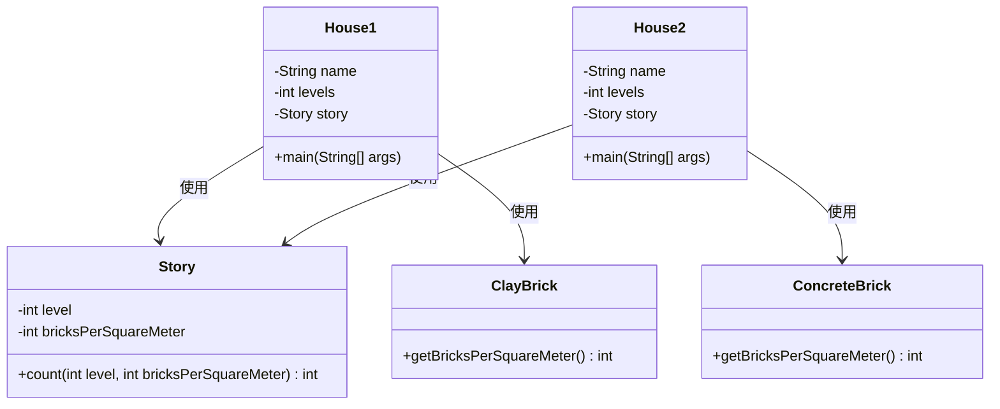
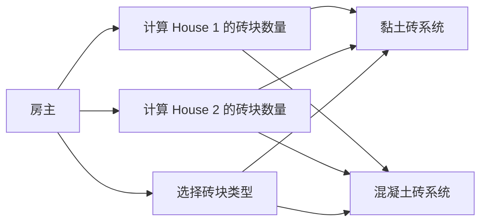
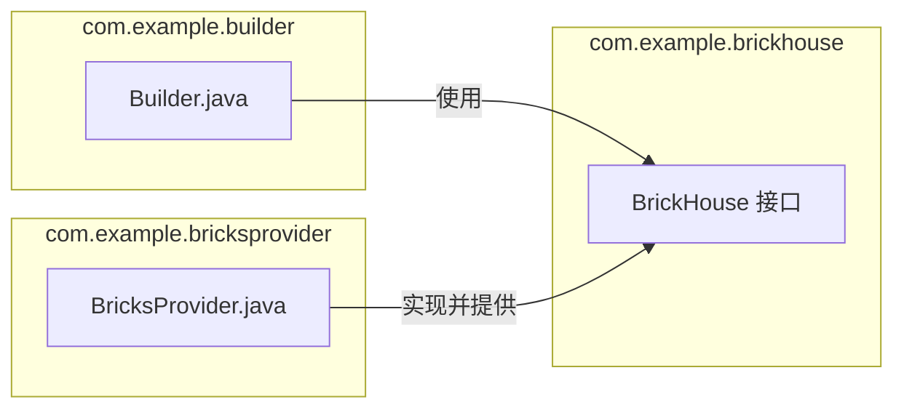
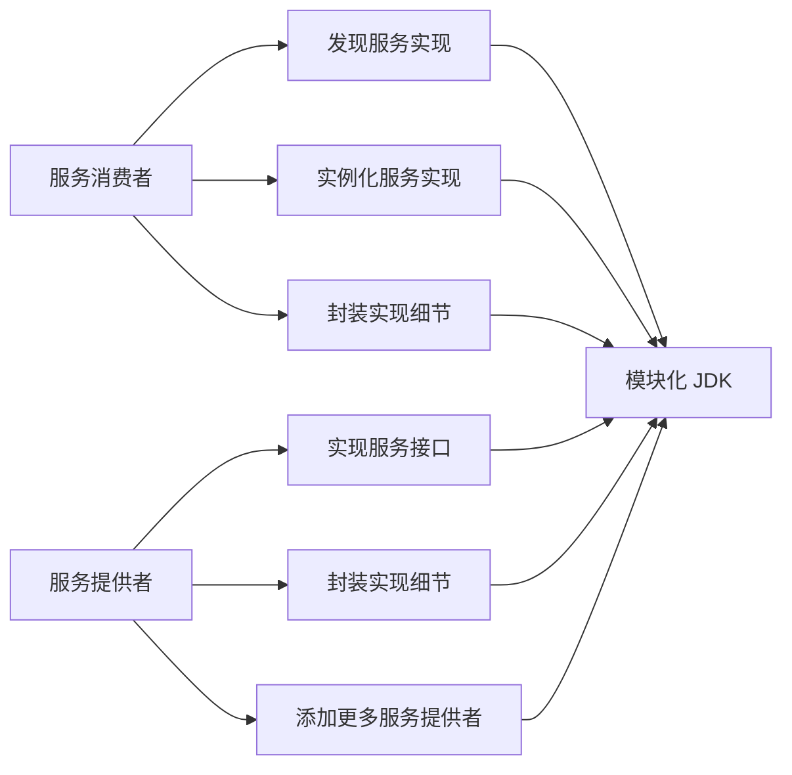
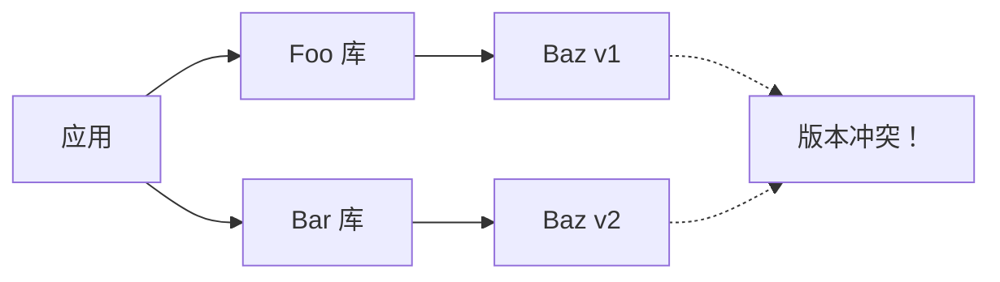
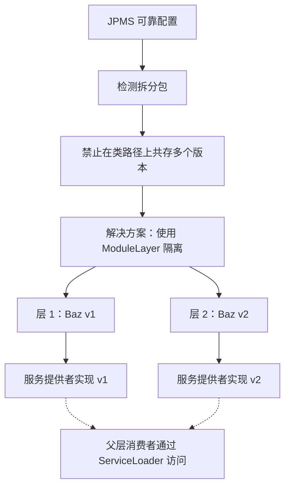
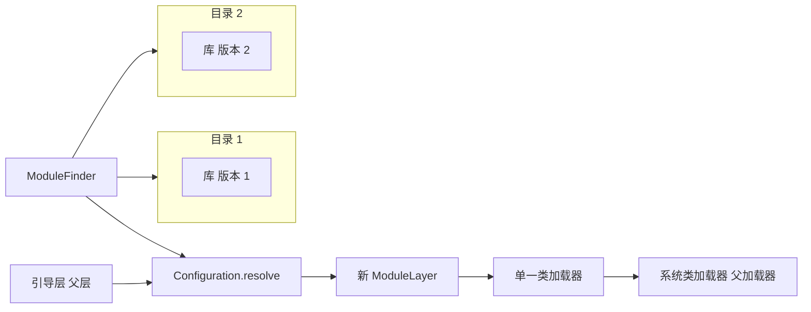
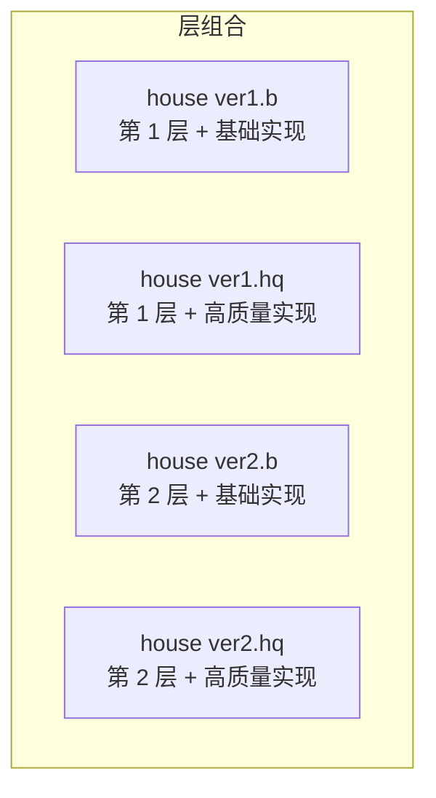
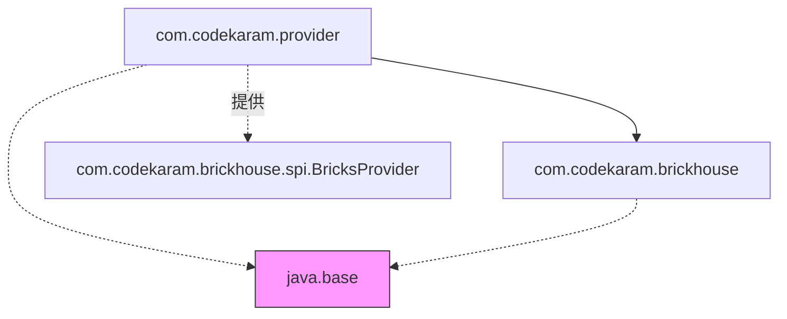

# 第3章 从单体到模块化Java：回顾与持续演进

...并利用最新的 JDK 创新。通过这一探索，目标是展示 Java 应用如何从模块化中显著受益。

## 理解 Java 平台模块系统

如前所述，JPMS 是对单体 JDK 日益增长的复杂性和笨拙性的战略性回应。开发它的首要目标是创建一个可扩展的平台，能够在增强性能的同时有效管理 API 级别的安全风险。Java 生态中模块化的出现使开发者能够根据应用的具体需求灵活选择和缩放模块。这一转型使得 Java 平台开发者能够在管理 Java API 时采用更模块化的布局，从而培育出一个不仅更易于维护而且更高效的系统。这种模块化方法的一个显著优势是，开发者可以仅使用其应用所需的那部分 JDK；这种选择性使用减小了应用的体积并缩短了加载时间，从而带来更高效、更高性能的应用。

### 揭秘模块

在 Java 中，模块是一个内聚的单元，包含包、资源和模块描述符（module-info.java），该描述符提供了关于模块的信息。模块充当这些元素的容器。因此，模块：

- **封装其包**：模块可以声明哪些包应对外部模块可见，哪些应隐藏。这种封装通过允许开发者清晰地表达代码的预期用途，提高了代码的可维护性和安全性。
- **表达依赖**：模块可以声明对其他模块的依赖，明确哪些模块是该模块正常运行所必需的。这种显式的依赖管理简化了部署过程，并帮助开发者在开发周期的早期识别问题。
- **强制严格封装**：模块系统在编译时和运行时都强制实施严格封装，使得意外或恶意破坏封装都变得困难。这种强制带来了更好的安全性和可维护性。
- **提升性能**：模块系统允许 JVM 优化代码的加载和执行，从而改善启动时间、降低内存消耗并提升执行速度。

模块系统的采用极大地提高了 Java 平台的可维护性、安全性和性能。

### 模块示例

让我们通过两个示例模块来探索模块系统：`com.house.brickhouse` 和 `com.house.bricks`。`com.house.brickhouse` 模块包含两个类 `House1` 和 `House2`，它们计算不同楼层房屋所需的砖块数量。`com.house.bricks` 模块包含一个 `Story` 类，提供了一个根据楼层数计算砖块数量的方法。以下是 `com.house.brickhouse` 的目录结构：

```
src
└── com.house.brickhouse
    ├── com
    │   └── house
    │       └── brickhouse
    │           ├── House1.java
    │           └── House2.java
    └── module-info.java
```

**com.house.brickhouse 的 module-info.java：**

```java
module com.house.brickhouse {
    requires com.house.bricks;
    exports com.house.brickhouse;
}
```

**com/house/brickhouse/House1.java：**

```java
package com.house.brickhouse;
import com.house.bricks.Story;
public class House1 {
    public static void main(String[] args) {
        System.out.println("My single-level house will need " + Story.count(1) + " bricks");
    }
}
```

**com/house/brickhouse/House2.java：**

```java
package com.house.brickhouse;
import com.house.bricks.Story;
public class House2 {
    public static void main(String[] args) {
        System.out.println("My two-level house will need " + Story.count(2) + " bricks");
    }
}
```

现在让我们来看 `com.house.bricks` 的目录结构：

```
src
└── com.house.bricks
    ├── com
    │   └── house
    │       └── bricks
    │           └── Story.java
    └── module-info.java
```

**com.house.bricks 的 module-info.java：**

```java
module com.house.bricks {
    exports com.house.bricks;
}
```

**com/house/bricks/Story.java：**

```java
package com.house.bricks;
public class Story {
    public static int count(int level) {
        return level * 18000;
    }
}
```

#### 编译与运行细节

我们首先编译 `com.house.bricks` 模块：

```bash
$ javac -d mods/com.house.bricks src/com.house.bricks/module-info.java src/com.house.bricks/com/house/bricks/Story.java
```

接下来，编译 `com.house.brickhouse` 模块：

```bash
$ javac --module-path mods -d mods/com.house.brickhouse src/com.house.brickhouse/module-info.java src/com.house.brickhouse/com/house/brickhouse/House1.java src/com.house.brickhouse/com/house/brickhouse/House2.java
```

现在运行 `House1` 示例：

```bash
$ java --module-path mods -m com.house.brickhouse/com.house.brickhouse.House1
```

输出：

```
My single-level house will need 18000 bricks
```

然后运行 `House2` 示例：

```bash
$ java --module-path mods -m com.house.brickhouse/com.house.brickhouse.House2
```

输出：

```
My two-level house will need 36000 bricks
```

### 引入新模块

现在，让我们通过引入一个提供各种砖块类型的新模块来扩展我们的项目。我们将这个模块命名为 `com.house.bricktypes`，它将包含不同砖块类型的各种类。以下是 `com.house.bricktypes` 模块的新目录结构：

```
src
└── com.house.bricktypes
    ├── com
    │   └── house
    │       └── bricktypes
    │           ├── ClayBrick.java
    │           └── ConcreteBrick.java
    └── module-info.java
```

**com.house.bricktypes 的 module-info.java：**

```java
module com.house.bricktypes {
    exports com.house.bricktypes;
}
```

`ClayBrick.java` 和 `ConcreteBrick.java` 类将定义各自砖块类型的属性和方法。

**ClayBrick.java：**

```java
package com.house.bricktypes;
public class ClayBrick {
    public static int getBricksPerSquareMeter() {
        return 60;
    }
}
```

**ConcreteBrick.java：**

```java
package com.house.bricktypes;
public class ConcreteBrick {
    public static int getBricksPerSquareMeter() {
        return 50;
    }
}
```

新模块就位后，我们需要更新现有模块以使用这些新的砖块类型。让我们从更新 `com.house.brickhouse` 模块的 `module-info.java` 文件开始：

```java
module com.house.brickhouse {
    requires com.house.bricks;
    requires com.house.bricktypes;
    exports com.house.brickhouse;
}
```

我们修改 `House1.java` 和 `House2.java` 文件以使用新的砖块类型。

**House1.java：**

```java
package com.house.brickhouse;
import com.house.bricks.Story;
import com.house.bricktypes.ClayBrick;
public class House1 {
    public static void main(String[] args) {
        int bricksPerSquareMeter = ClayBrick.getBricksPerSquareMeter();
        System.out.println("My single-level house will need "
            + Story.count(1, bricksPerSquareMeter) + " clay bricks");
    }
}
```

**House2.java：**

```java
package com.house.brickhouse;
import com.house.bricks.Story;
import com.house.bricktypes.ConcreteBrick;
public class House2 {
    public static void main(String[] args) {
        int bricksPerSquareMeter = ConcreteBrick.getBricksPerSquareMeter();
        System.out.println("My two-level house will need "
            + Story.count(2, bricksPerSquareMeter) + " concrete bricks");
    }
}
```

通过这些更改，我们的 `House1` 和 `House2` 类可以使用不同类型的砖块，为程序增加了更多灵活性。现在让我们更新 `com.house.bricks` 模块中的 `Story.java` 类，使其接受每平方米砖块数参数：

```java
package com.house.bricks;
public class Story {
    public static int count(int level, int bricksPerSquareMeter) {
        return level * bricksPerSquareMeter * 300;
    }
}
```

现在模块已经更新完毕，让我们编译并运行它们以查看实际效果：

- 为 `com.house.bricktypes` 模块创建新的 mods 目录：

```bash
$ mkdir mods/com.house.bricktypes
```

- 编译 `com.house.bricktypes` 模块：

```bash
$ javac -d mods/com.house.bricktypes src/com.house.bricktypes/module-info.java src/com.house.bricktypes/com/house/bricktypes/*.java
```

- 重新编译 `com.house.bricks` 和 `com.house.brickhouse` 模块：

```bash
$ javac --module-path mods -d mods/com.house.bricks src/com.house.bricks/module-info.java src/com.house.bricks/com/house/bricks/Story.java
$ javac --module-path mods -d mods/com.house.brickhouse src/com.house.brickhouse/module-info.java src/com.house.brickhouse/com/house/brickhouse/House1.java src/com.house.brickhouse/com/house/brickhouse/House2.java
```

通过这些更新，我们的程序现在更加通用，能够处理不同类型的砖块。这只是一个例子，展示了 Java 中的模块系统如何使我们的代码更加灵活和可维护。

#### Figure 3.1 显示模块间关系的类图

现在让我们用类图来可视化这些关系。图 3.1 包含了新模块 `com.house.bricktypes`，箭头表示"使用"关系。`House1` 使用 `Story` 和 `ClayBrick`，而 `House2` 使用 `Story` 和 `ConcreteBrick`。因此，`House1` 和 `House2` 的实例将包含对 `Story` 实例以及 `ClayBrick` 或 `ConcreteBrick` 实例的引用。它们使用这些引用来与 `Story`、`ClayBrick` 和 `ConcreteBrick` 类的方法和属性进行交互。更多细节如下：

- **House1 和 House2**：这两个类代表两种不同类型的房屋。两个类都具有以下属性：
  - `name`：一个字符串，表示房屋的名称。
  - `levels`：一个整数，表示房屋的楼层数。
  - `story`：一个 `Story` 类实例，表示房屋的一层。
  - `main(String[] args)`：类的入口方法，作为应用程序执行的启动器。

- **Story**：这个类表示房屋中的一层。具有以下属性：
  - `level`：一个整数，表示楼层编号。
  - `bricksPerSquareMeter`：一个整数，表示该楼层每平方米的砖块数。
  - `count(int level, int bricksPerSquareMeter)`：一个方法，计算给定楼层和每平方米砖块数所需的总砖块数。

- **ClayBrick 和 ConcreteBrick**：这两个类代表两种不同类型的砖块。两个类都具有以下属性：
  - `getBricksPerSquareMeter()`：一个静态方法，返回每平方米的砖块数量。房屋调用此方法以获取 `Story` 类计算所需的值。



> ▲ 上图根据原文 Figure 3.1 标题和上下文推测绘制，原文为英文截图

接下来，让我们看以房主（House Owner）为参与者、以黏土砖（Clay Brick）和混凝土砖（Concrete Brick）为系统的砖房建造系统用例图（图 3.2）。该图展示了房主如何与系统交互，以计算不同类型房屋所需的砖块数量并选择建造所用的砖块类型。

以下是关于用例图元素的更多信息：

- **房主**：这是想要建造房屋的参与者。房主通过以下方式与砖房建造系统交互：
  - 计算 House 1 的砖块数量
  - 计算 House 2 的砖块数量
  - 选择砖块类型

- **砖房建造系统**：该系统帮助房主完成建造过程。它提供以下用例：
  - **计算 House 1 的砖块数量**：该用例计算 House 1 所需的砖块数量。它与黏土砖和混凝土砖系统交互以获取必要数据。
  - **计算 House 2 的砖块数量**：该用例计算 House 2 所需的砖块数量。它也与黏土砖和混凝土砖系统交互以获取必要数据。
  - **选择砖块类型**：该用例允许房主选择建造所用的砖块类型。

- **黏土砖和混凝土砖**：这些系统向砖房建造系统提供计算建造房屋所需砖块数量所需的数据（例如尺寸、成本）。



> ▲ 上图根据原文 Figure 3.2 标题和上下文推测绘制，原文为英文截图

## 从单体内核到模块化：JDK 的演进

在引入模块化 JDK 之前，JDK 的臃肿导致了过于复杂且难以阅读的应用。特别是，复杂的依赖关系和交叉依赖使得应用难以维护和扩展。JAR 地狱（即 Java 中与类加载相关的问题）的出现既源于缺乏简洁性，也源于 JAR 对其所包含的类缺乏感知能力。

JDK 庞大的体积本身也带来了挑战，尤其是在小型设备或其他不需要整个单体 JDK 的场景中。模块化 JDK 应运而生，彻底改变了 JDK 的格局。

### 持续演进：JDK 11 及更高版本中的模块化 JDK

Java 平台模块系统（JPMS）首次引入于 JDK 9，并在后续版本中持续演进。JDK 11 是 JDK 8 之后的第一个长期支持（LTS）版本，进一步优化了模块化 Java 平台。以下是 JDK 11 中一些值得注意的改进和变更摘要：

- **移除已废弃的模块**：在 JDK 9 中已废弃的一些 Java 企业版（EE）和公共对象请求代理架构（CORBA）模块最终在 JDK 11 中被移除。这一变更促进了更精简的 Java 平台并减轻了维护负担。
- **模块系统趋于成熟**：JPMS 随着时间推移逐渐成熟，受益于开发者的反馈和实际使用经验。更新的 JDK 版本解决了问题、改进了性能并优化了模块系统的能力。
- **API 优化**：后续版本中 API 和功能不断得到优化，为使用模块系统的开发者提供了更一致、更连贯的体验。
- **持续增强**：JDK 11 及后续版本持续增强模块系统——例如，提供更好的诊断信息和错误报告、改进 JVM 性能以及其他使开发者受益的增量改进。

## 使用 JDK 17 实现模块化服务

借助 JDK 的模块化方法，我们可以通过将提供服务接口的模块与其提供者模块解耦来增强服务（Java 1.6 中引入）的概念，最终创建完全解耦的消费者。要使用服务，类型通常声明为接口或抽象类，服务提供者需要在其模块中被清晰标识，以便它们能够被识别为提供者。最后，消费者模块需要使用这些提供者。

为了更好地解释解耦过程，我们将通过一个逐步示例来构建一个 `BricksProvider` 及其提供者和消费者。

### 服务提供者

服务提供者是一个实现服务接口并使其可供其他模块消费的模块。它负责实现服务接口中定义的功能。在我们的示例中，我们将创建一个名为 `com.example.bricksprovider` 的模块，该模块将实现 `BrickHouse` 接口并提供服务。

#### 创建 com.example.bricksprovider 模块

首先，创建一个名为 `bricksprovider` 的新目录；在其中创建 `com/example/bricksprovider` 目录结构。接下来，在 `bricksprovider` 目录中创建一个 `module-info.java` 文件，内容如下：

```java
module com.example.bricksprovider {
    requires com.example.brickhouse;
    provides com.example.brickhouse.BrickHouse with com.example.bricksprovider.BricksProvider;
}
```

这个 `module-info.java` 文件声明了我们的模块需要 `com.example.brickhouse` 模块，并通过 `com.example.bricksprovider.BricksProvider` 类提供了 `BrickHouse` 接口的实现。

现在，在 `com/example/bricksprovider` 目录中创建 `BricksProvider.java` 文件，内容如下：

```java
package com.example.bricksprovider;
import com.example.brickhouse.BrickHouse;
public class BricksProvider implements BrickHouse {
    @Override
    public void build() {
        System.out.println("Building a house with bricks...");
    }
}
```

### 服务消费者

服务消费者是一个使用另一个模块提供的服务的模块。它在 `module-info.java` 文件中使用 `uses` 关键字声明其所需的服务。服务消费者随后可以使用 `ServiceLoader` API 来发现并实例化所需服务的实现。

#### 创建 com.example.builder 模块

首先，创建一个名为 `builder` 的新目录；在其中创建 `com/example/builder` 目录结构。接下来，在 `builder` 目录中创建一个 `module-info.java` 文件，内容如下：

```java
module com.example.builder {
    requires com.example.brickhouse;
    uses com.example.brickhouse.BrickHouse;
}
```

这个 `module-info.java` 文件声明了我们的模块需要 `com.example.brickhouse` 模块并使用 `BrickHouse` 服务。

现在，在 `com/example/builder` 目录中创建 `Builder.java` 文件，内容如下：

```java
package com.example.builder;
import com.example.brickhouse.BrickHouse;
import java.util.ServiceLoader;
public class Builder {
    public static void main(String[] args) {
        ServiceLoader<BrickHouse> loader = ServiceLoader.load(BrickHouse.class);
        loader.forEach(BrickHouse::build);
    }
}
```

### 一个可运行的示例

让我们考虑一个使用服务的模块化 Java 应用的简单示例：

- `com.example.brickhouse`：一个定义 `BrickHouse` 服务接口的模块，其他模块可以实现该接口。
- `com.example.bricksprovider`：一个提供 `BrickHouse` 服务实现并在其 `module-info.java` 文件中使用 `provides` 关键字声明的模块。
- `com.example.builder`：一个消费 `BrickHouse` 服务并在其 `module-info.java` 文件中使用 `uses` 关键字声明所需服务的模块。

然后，构建者可以使用 `ServiceLoader` API 来发现并实例化由 `com.example.bricksprovider` 模块提供的 `BrickHouse` 实现。



> ▲ 上图根据原文 Figure 3.3 标题和上下文推测绘制，原文为英文截图

图 3.3 以模块图的形式描述了模块与类之间的关系。该模块图表示了模块与类之间的依赖和关系：

- `com.example.builder` 模块包含 `Builder.java` 类，该类使用来自 `com.example.brickhouse` 模块的 `BrickHouse` 接口。
- `com.example.bricksprovider` 模块包含 `BricksProvider.java` 类，该类实现并提供 `BrickHouse` 接口。

### 实现细节

`ServiceLoader` API 是一个强大的机制，它允许 `com.example.builder` 模块在运行时发现并实例化由 `com.example.bricksprovider` 模块提供的 `BrickHouse` 实现。这带来了更大的灵活性和更好的关注点分离。以下小节聚焦于一些实现细节，帮助我们更好地理解模块之间的交互以及 `ServiceLoader` API 的作用。

#### 发现服务实现

`ServiceLoader.load()` 方法将服务接口作为其参数——在我们的例子中是 `BrickHouse.class`——并返回一个 `ServiceLoader` 实例。这个实例是一个可迭代对象，包含所有可用的服务实现。`ServiceLoader` 依赖于 `module-info.java` 文件中提供的信息来发现服务实现。

#### 实例化服务实现

在遍历 `ServiceLoader` 实例时，API 会自动实例化服务提供者提供的服务实现。在我们的示例中，`BricksProvider` 类被实例化，并在遍历 `ServiceLoader` 实例时调用其 `build()` 方法。

#### 封装实现细节

通过使用 JPMS，`com.example.bricksprovider` 模块可以封装其实现细节，仅暴露其提供的 `BrickHouse` 服务。这使得 `com.example.builder` 模块能够在不必依赖具体实现的情况下消费该服务，从而创建更健壮、更可维护的系统。

#### 添加更多服务提供者

我们的示例可以通过添加更多实现 `BrickHouse` 接口的服务提供者来轻松扩展。只要新的服务提供者在其各自的 `module-info.java` 文件中正确声明，`com.example.builder` 模块就能自动通过 `ServiceLoader` API 发现并使用它们。这实现了一个更加模块化和可扩展的系统，能够适应不断变化的需求或新的实现。

图 3.4 是一个用例图，描述了服务消费者与服务提供者之间的交互。它包括两个参与者：服务消费者和服务提供者。

- **服务消费者**：使用服务提供者提供的服务。服务消费者通过以下方式与模块化 JDK 交互：
  - **发现服务实现**：服务消费者使用模块化 JDK 查找可用的服务实现。
  - **实例化服务实现**：一旦发现服务实现，服务消费者使用模块化 JDK 创建这些服务的实例。
  - **封装实现细节**：服务消费者受益于模块化 JDK 提供的封装，无需了解底层实现即可使用服务。

- **服务提供者**：实现并提供服务。服务提供者通过以下方式与模块化 JDK 交互：
  - **实现服务接口**：服务提供者使用模块化 JDK 实现服务接口，该接口定义了服务的契约。
  - **封装实现细节**：服务提供者使用模块化 JDK 隐藏其服务实现的细节，仅暴露服务接口。
  - **添加更多服务提供者**：服务提供者可以使用模块化 JDK 为服务添加更多提供者，增强系统的模块化和可扩展性。



> ▲ 上图根据原文 Figure 3.4 标题和上下文推测绘制，原文为英文截图

模块化 JDK 充当这些交互的强大促进者，建立了一个全面的平台，服务提供者可以在此有效提供服务。同时，它为服务消费者提供了发现和使用这些服务的途径。这一动态生态促进了服务的无缝交互，增强了模块化 Java 应用的整体功能和互操作性。

## JAR 地狱版本化问题与 Jigsaw 层

在深入探讨 JAR 地狱版本化问题和 Jigsaw 层的细节之前，我想介绍 Nikita Lipski，他是一位 JVM 工程师同行，也是 Java 模块化领域的专家。Nikita 为此主题提供了宝贵的见解和全面的阐述，我们将在本节中讨论这些内容。他的工作将帮助我们更好地理解 JAR 地狱版本化问题，以及如何在 JDK 11 和 JDK 17 中利用 Jigsaw 层来解决此问题。

Java 的向后兼容性是其主要特性之一。这种兼容性确保了当新版本 Java 发布时，为旧版本构建的应用程序可以在新版本上运行而无需对源代码进行任何更改，而且通常甚至无需重新编译。同样的原则也适用于第三方库——应用程序可以在无需修改源代码的情况下使用更新版本的库。

然而，这种兼容性并不延伸到源代码级别的版本化，JPMS 也没有在此级别引入版本化。相反，版本化是在工件级别使用 Maven 或 Gradle 等工件管理系统进行管理的。这些系统处理 Java 项目中使用的库和框架的版本化和依赖管理，确保在构建过程中包含正确版本的依赖项。但是，当一个 Java 应用依赖于多个第三方库，而这些库又可能依赖于另一个库的不同版本时，会发生什么？如果类路径上存在同一个库的多个版本，可能会导致冲突和运行时错误。

因此，尽管 JPMS 确实改善了 Java 的模块化和代码组织，但在处理工件级别的版本化时，"JAR 地狱"问题仍然可能存在。让我们看一个示例（如图 3.5 所示），其中一个应用依赖于两个第三方库（Foo 和 Bar），而它们又依赖于另一个库（Baz）的不同版本。

如果将 Baz 库的两个版本都放置在类路径上，将不清楚在运行时将使用哪个版本的库，从而导致不可避免的版本冲突。为了解决这个问题，JPMS 通过检测拆分包（在 JPMS 中不允许存在）来禁止此类情况，以支持其"可靠配置"的目标（图 3.6）。

虽然尽早检测版本化问题很有用，但 JPMS 并没有提供解决它们的推荐方法。解决这些问题的一种方法是使用冲突库的最新版本，假设它是向后兼容的。然而，由于引入的不兼容性，这并不总是可行的。

为了解决此类情况，JPMS 提供了 `ModuleLayer` 特性，允许以隔离的方式将模块子图安装到模块系统中。当冲突库的不同版本被放置到不同的层中时，两个版本都可以被 JPMS 加载。虽然没有直接的方法从父层访问子层的模块，但可以通过在子层模块中实现服务提供者来实现间接访问，父层模块可以随后使用该服务提供者。（更多细节请参见前面关于"使用 JDK 17 实现模块化服务"的讨论。）



> ▲ 上图根据原文 Figure 3.5 标题和上下文推测绘制，原文为英文截图



> ▲ 上图根据原文 Figure 3.6 标题和上下文推测绘制，原文为英文截图

### 可运行的示例：JAR 地狱

在本节中，我们将提供一个可运行的示例，演示如何使用模块层来解决 JDK 17 上下文中的 JAR 地狱问题（此策略也适用于 JDK 11 用户）。此示例建立在 Nikita 的说明和我们之前讨论的房屋服务提供者实现之上。它演示了如何在模块化应用中使用同一库的不同版本（称为"基础"和"高质量"实现）。

首先，让我们看一下 Java SE 9 文档提供的示例代码[^1]：

```java
ModuleFinder finder = ModuleFinder.of(dir1, dir2, dir3);

ModuleLayer parent = ModuleLayer.boot();

Configuration cf = parent.configuration().resolve(finder, ModuleFinder.of(),
    Set.of("myapp"));

ClassLoader scl = ClassLoader.getSystemClassLoader();

ModuleLayer layer = parent.defineModulesWithOneLoader(cf, scl);
```

[^1]: https://docs.oracle.com/javase/9/docs/api/java/lang/ModuleLayer.html

在此示例中：

- **第 1 行**：设置一个 `ModuleFinder` 以从特定目录（`dir1`、`dir2` 和 `dir3`）定位模块。
- **第 2 行**：引导层被建立为父层。
- **第 3 行**：引导层的配置作为父配置被解析，用于第 1 行指定目录中找到的模块。
- **第 5 行**：使用解析后的配置创建一个新层，使用一个以系统类加载器为父加载器的单一类加载器。



> ▲ 上图根据原文 Figure 3.7 标题和上下文推测绘制，原文为英文截图



> ▲ 上图根据原文 Figure 3.8 标题和上下文推测绘制，原文为英文截图

现在，让我们扩展我们的房屋服务提供者实现。我们将在 `com.codekaram.provider` 模块中提供基础实现和高质量实现。你可以将"基础实现"视为房屋库的版本 1，将"高质量实现"视为房屋库的版本 2（图 3.7）。

对于每个楼层，我们将同时访问两个库。因此，我们的组合将是：第 1 层 + 基础实现提供者、第 1 层 + 高质量实现提供者、第 2 层 + 基础实现提供者、第 2 层 + 高质量实现提供者。为简单起见，我们将这些组合分别记为 house ver1.b、house ver1.hq、house ver2.b 和 house ver2.hq（图 3.8）。

### 实现细节

基于 Nikita 在前一节中介绍的概念，让我们深入实现细节，理解层的结构和程序流程在实际中是如何工作的。首先，让我们来看源代码树结构：

```
ModuleLayer
├── basic
│   └── src
│       └── com.codekaram.provider
│           ├── classes
│           │   └── com
│           │       └── codekaram
│           │           └── provider
│           │               └── House.java
│           └── module-info.java
├── high-quality
│   └── src
│       └── com.codekaram.provider
│           ├── classes
│           │   └── com
│           │       └── codekaram
│           │           └── provider
│           │               └── House.java
│           └── module-info.java
└── src
    └── com.codekaram.brickhouse
        ├── classes
        │   ├── com
        │   │   └── codekaram
        │   │       └── brickhouse
        │   │           ├── loadLayers.java
        │   │           └── spi
        │   │               └── BricksProvider.java
        │   └── module-info.java
        └── tests
```

以下是 `com.codekaram.provider` 的模块文件信息和模块图。请注意，基础实现和高质量实现看起来完全相同：

```java
module com.codekaram.provider {
    requires com.codekaram.brickhouse;
    uses com.codekaram.brickhouse.spi.BricksProvider;
    provides com.codekaram.brickhouse.spi.BricksProvider with com.codekaram.provider.House;
}
```

模块图（如图 3.9 所示）有助于可视化模块之间的依赖关系及其提供的服务，这对于理解模块化 Java 应用的结构非常有用：

- `com.codekaram.provider` 模块依赖于 `com.codekaram.brickhouse` 模块，并隐式依赖于 `java.base` 模块（每个 Java 应用的基础模块）。这通过从 `com.codekaram.provider` 指向 `com.codekaram.brickhouse` 的箭头以及指向 `java.base` 的隐含箭头表示。
- `com.codekaram.brickhouse` 模块也隐式依赖于 `java.base` 模块，所有 Java 模块都是如此。



> ▲ 上图根据原文 Figure 3.9 标题和上下文推测绘制，原文为英文截图

- `java.base` 模块不依赖于任何其他模块，是所有其他模块依赖的核心模块。
- `com.codekaram.provider` 模块提供服务 `com.codekaram.brickhouse.spi.BricksProvider`，其实现为 `com.codekaram.provider.House`。此关系在图中由从 `com.codekaram.provider` 指向 `com.codekaram.brickhouse.spi.BricksProvider` 的虚线箭头表示。

在深入探讨这些提供者的代码之前，让我们先来看 `com.codekaram.brickhouse` 模块的模块文件信息：

```java
module com.codekaram.brickhouse {
    uses com.codekaram.brickhouse.spi.BricksProvider;
    exports com.codekaram.brickhouse.spi;
}
```

`loadLayers` 类不仅将处理层的形成，还能够为每个楼层加载服务提供者。这有点简化，但有助于我们更好地理解流程。现在，让我们来检查 `loadLayers` 的实现。以下是根据"可运行的示例：JAR 地狱"部分中的示例代码创建层的代码：

```java
static ModuleLayer getProviderLayer(String getCustomDir) {
    ModuleFinder finder = ModuleFinder.of(Paths.get(getCustomDir));
    ModuleLayer parent = ModuleLayer.boot();
    Configuration cf = parent.configuration().resolve(finder,
        ModuleFinder.of(), Set.of("com.codekaram.provider"));
    ClassLoader scl = ClassLoader.getSystemClassLoader();
    ModuleLayer layer = parent.defineModulesWithOneLoader(cf, scl);
    
    System.out.println("Created a new layer for " + layer);
    return layer;
}
```

如果我们只想创建两个层，一个用于房屋版本 basic，另一个用于房屋版本 high-quality，我们需要做的就是（从 `main` 方法中）调用 `getProviderLayer()`：

```java
doWork(
    Stream.of(args)
    .map(getCustomDir -> getProviderLayer(getCustomDir)));
```

如果我们传递 `basic` 和 `high-quality` 两个目录作为运行时参数，`getProviderLayer()` 方法将在这两个目录中查找 `com.codekaram.provider`，然后为每个目录创建一个层。让我们来看输出结果（为了清晰和解释的目的添加了行号）：

```
1  $ java --module-path mods -m com.codekaram.brickhouse/
       com.codekaram.brickhouse.loadLayers basic high-quality
2  
3  Created a new layer for com.codekaram.provider
4  
5  I am the basic provider
6  
7  Created a new layer for com.codekaram.provider
8  
9  I am the high-quality provider
```

- **第 1 行**是我们的命令行参数，其中 `basic` 和 `high-quality` 是提供 `BrickProvider` 服务实现的目录。
- **第 3 行和第 7 行**是输出，表示 `com.codekaram.provider` 在两个目录中都被找到，并为每个目录创建了一个新层。
- **第 5 行和第 9 行**是 `provider.getName()` 的输出，实现于 `doWork()` 代码中：

```java
private static void doWork(Stream<ModuleLayer> myLayers){
    myLayers.flatMap(moduleLayer -> ServiceLoader
        .load(moduleLayer, BricksProvider.class)
        .stream().map(ServiceLoader.Provider::get))
        .forEach(eachSLProvider -> System.out.println("I am the " + eachSLProvider.getName() +
            " provider"));
}
```

在 `doWork()` 中，我们首先为 `BricksProvider` 服务创建一个服务加载器，并从模块层加载提供者。然后打印该提供者的 `getName()` 方法返回的字符串。从输出中可以看到，我们有两个模块层，并成功打印了 `I am the basic provider` 和 `I am the high-quality provider` 输出，其中 `basic` 和 `high-quality` 是 `getName()` 方法的返回字符串。

现在，让我们可视化之前讨论的四个层的工作方式。为此，我们将创建一个简单的问题陈述，为两层房屋的基础和高质量砖块生成报价。首先，将以下代码添加到我们的 `main()` 方法中：

```java
int[] level = {1,2};
IntStream levels = Arrays.stream(level);
```

接下来，按如下方式流式处理 `doWork()`：

```java
levels.forEach(levelcount -> loadLayers
    .doWork(...));
```

我们现在有了四个层，类似于之前提到的（house ver1.b、house ver1.hq、house ver2.b 和 house ver2.hq）。以下是更新后的输出：

```
Created a new layer for com.codekaram.provider
My basic 1 level house will need 18000 bricks and those will cost me $6120
Created a new layer for com.codekaram.provider
My high-quality 1 level house will need 18000 bricks and those will cost me $9000
Created a new layer for com.codekaram.provider
My basic 2 level house will need 36000 bricks and those will cost me $12240
Created a new layer for com.codekaram.provider
My high-quality 2 level house will need 36000 bricks and those will be over my budget of $15000
```

> **注意**：我们提供者的 `getName()` 方法返回的字符串已更改为仅返回 `"basic"` 和 `"high-quality"` 字符串，而不是完整的句子。

更新后的输出最后一行中的变化展示了如何将额外条件应用于服务提供者。在这里，预算约束检查已集成到两层房屋的高质量提供者实现中。当然，你可以根据需要自定义输出和条件。

以下是更新后的 `doWork()` 方法，用于处理楼层和提供者，以及 `main` 方法中的相关代码：

```java
private static void doWork(int level, Stream<ModuleLayer> myLayers){
    myLayers.flatMap(moduleLayer -> ServiceLoader
        .load(moduleLayer, BricksProvider.class)
        .stream().map(ServiceLoader.Provider::get))
        .forEach(eachSLProvider -> System.out.println("My " + eachSLProvider.getName()
            + " " + level + " level house will need " + eachSLProvider.getBricksQuote(level)));
}

public static void main(String[] args) {
    int[] levels = {1, 2};
    IntStream levelStream = Arrays.stream(levels);
    levelStream.forEach(levelcount -> doWork(levelcount, Stream.of(args)
        .map(getCustomDir -> getProviderLayer(getCustomDir))));
}
```

现在，我们可以使用基础和高质量实现来计算不同楼层房屋的砖块数量及其成本，每种实现都使用独立的模块层。这展示了模块层提供的强大功能和灵活性，使您能够动态加载和卸载服务的不同实现，而不会影响应用的其他部分。

请记住根据您的具体用例和需求调整服务提供者的代码。这里提供的示例只是一个起点，供您在此基础上构建和调整。

总之，此示例说明了 Java 模块层在创建既适应性强又可扩展的应用方面的实用性。通过使用模块层和 Java `ServiceLoader` 的概念，您可以创建可扩展的应用，使您能够根据不同的需求和条件调整这些应用，而不会影响代码库的其余部分。

## 开放服务网关倡议（OSGi）

开放服务网关倡议（OSGi）自 2000 年以来一直是 Java 开发者可用的替代模块系统，远早于 Jigsaw 和 Java 模块层的引入。由于 OSGi 出现时 Java 中没有内置的标准模块系统，它与 Project Jigsaw 以不同方式解决了许多模块化问题。在本节中，我们将借助 Nikita 的见解（他在 Java 模块化方面的专业经验涵盖 OSGi）比较 Java 模块层和 OSGi，突出它们的相似性和差异。

### OSGi 概述

OSGi 是一个成熟且广泛使用的框架，为 Java 应用提供模块化和可扩展性。它提供了一个动态组件模型，允许开发者在运行时创建、更新和移除模块（称为 bundle），而无需重启应用。

### 相似性

- **模块化**：Java 模块层和 OSGi 都通过强制组件之间的清晰分离来促进模块化，使代码更易于维护、扩展和重用。
- **动态加载**：两种技术都支持模块或 bundle 的动态加载和卸载，允许开发者在运行时更新、扩展或移除组件，而不影响应用的其余部分。
- **服务抽象**：Java 模块层（通过 `ServiceLoader`）和 OSGi 都提供服务抽象，实现组件之间的松耦合。这允许在切换服务的不同实现时具有更大的灵活性。

### 差异

- **成熟度**：OSGi 是一项更成熟且经过实战检验的技术，拥有丰富的生态系统和工具支持。Java 模块层在 JDK 9 中引入，相对较新，可能没有与 OSGi 相同水平的工具和库支持。
- **与 Java 平台的集成**：Java 模块层是 Java 平台的一部分，为模块化和可扩展性提供原生解决方案。相比之下，OSGi 是一个独立的框架，构建在 Java 平台之上。
- **复杂性**：OSGi 可能比 Java 模块层更复杂，学习曲线更陡峭，拥有更高级的特性。Java 模块层虽然也提供强大的功能，但对于刚接触模块化概念的开发者来说可能更直接、更容易使用。
- **运行时环境**：OSGi 应用在 OSGi 容器内运行，该容器管理 bundle 的生命周期并强制实施模块化规则。Java 模块层直接在 Java 平台上运行，由模块系统处理模块的加载和卸载。
- **版本化**：OSGi 为模块或 bundle 的多个版本提供内置支持，允许开发者同时部署和运行同一组件的不同版本。这是通过用版本限定模块并应用"使用约束"来确保每个模块存在安全的类命名空间来实现的。然而，处理 OSGi 中的版本化可能会给模块解析和最终用户带来不必要的复杂性。相比之下，Java 模块层原生不支持同一模块的多个版本，但你可以通过为每个版本创建独立的模块层来实现类似的功能。
- **严格封装**：Java 模块层作为 JDK 中的一等公民，提供严格封装，当未经授权访问未导出的功能时（即使通过反射），也会发出错误消息。在 OSGi 中，未导出的功能可以使用类加载器"隐藏"，但除非设置了特殊的安全管理器，否则模块内部仍然可以通过反射访问。OSGi 受限于 JPMS 之前的 Java SE 特性，无法提供与 Java 模块层相同级别的严格封装。

在 Java 应用中实现模块化和可扩展性时，开发者通常有两个主要选择：Java 模块层和 OSGi。请记住，在 Java 模块层和 OSGi 之间的选择并非总是非此即彼，而是可能取决于许多因素。这些因素包括项目的具体需求、现有的技术栈以及团队对这些技术的熟悉程度。此外，值得注意的是，Java 模块层和 OSGi 并不是在 Java 应用中实现模块化的唯一选择。根据您的具体需求和上下文，其他解决方案可能更合适。在做决定之前，彻底评估所有可用选项的优缺点非常重要。您的选择应基于项目的具体需求和限制，以确保获得最佳结果。

一方面，如果您需要高级功能如多版本支持和动态组件模型，OSGi 可能是更好的选择。该技术非常适合需要灵活性和可扩展性的复杂应用。然而，与 Java 模块层相比，它可能更难学习和实现，因此对于刚接触模块化的开发者来说可能不是最佳选择。

另一方面，Java 模块层为实现 Java 应用的模块化和可扩展性提供了更直接的解决方案。该技术内置于 Java 平台本身，这意味着已经熟悉 Java 的开发者应该会发现它相对容易使用。此外，Java 模块层提供了强大的封装特性，有助于防止依赖在不同模块之间泄露。

## Jdeps、Jlink、Jdeprscan 和 Jmod 简介

本节涵盖四个有助于模块化应用开发和部署的工具：jdeps、jlink、jdeprscan 和 jmod。这些工具中的每一个在构建、分析和部署 Java 应用的过程中都有其独特的用途。

### Jdeps

Jdeps 是一个有助于分析 Java 类或包依赖关系的工具。当您尝试为 JAR 文件创建模块文件时，它特别有用。使用 jdeps，您可以使用正则表达式创建各种过滤器。以下是如何对 `loadLayers` 类使用 jdeps：

```bash
$ jdeps mods/com.codekaram.brickhouse/com/codekaram/brickhouse/loadLayers.class
loadLayers.class -> java.base
loadLayers.class -> not found
com.codekaram.brickhouse -> com.codekaram.brickhouse.spi
                                 not found
com.codekaram.brickhouse -> java.io                                          java.base
com.codekaram.brickhouse -> java.lang                                        java.base
com.codekaram.brickhouse -> java.lang.invoke                                 java.base
com.codekaram.brickhouse -> java.lang.module                                 java.base
com.codekaram.brickhouse -> java.nio.file                                    java.base
com.codekaram.brickhouse -> java.util                                        java.base
com.codekaram.brickhouse -> java.util.function                               java.base
com.codekaram.brickhouse -> java.util.stream                                 java.base
```

上述命令的效果与将 `-verbose:package` 选项传递给 jdeps 相同。`-verbose` 选项单独使用将列出所有依赖项：

```bash
$ jdeps -v mods/com.codekaram.brickhouse/com/codekaram/brickhouse/loadLayers.class
loadLayers.class -> java.base
loadLayers.class -> not found
com.codekaram.brickhouse.loadLayers -> com.codekaram.brickhouse.spi.BricksProvider
                                            not found
com.codekaram.brickhouse.loadLayers -> java.io.PrintStream                      java.base
com.codekaram.brickhouse.loadLayers -> java.lang.Class                          java.base
com.codekaram.brickhouse.loadLayers -> java.lang.ClassLoader                    java.base
com.codekaram.brickhouse.loadLayers -> java.lang.ModuleLayer                    java.base
com.codekaram.brickhouse.loadLayers -> java.lang.NoSuchMethodException          java.base
com.codekaram.brickhouse.loadLayers -> java.lang.Object                         java.base
com.codekaram.brickhouse.loadLayers -> java.lang.String                         java.base
com.codekaram.brickhouse.loadLayers -> java.lang.System                         java.base
com.codekaram.brickhouse.loadLayers -> java.lang.invoke.CallSite                java.base
com.codekaram.brickhouse.loadLayers -> java.lang.invoke.LambdaMetafactory        java.base
com.codekaram.brickhouse.loadLayers -> java.lang.invoke.MethodHandle            java.base
com.codekaram.brickhouse.loadLayers -> java.lang.invoke.MethodHandles           java.base
com.codekaram.brickhouse.loadLayers -> java.lang.invoke.MethodHandles$Lookup    java.base
com.codekaram.brickhouse.loadLayers -> java.lang.invoke.MethodType              java.base
com.codekaram.brickhouse.loadLayers -> java.lang.invoke.StringConcatFactory     java.base
com.codekaram.brickhouse.loadLayers -> java.lang.module.Configuration           java.base
com.codekaram.brickhouse.loadLayers -> java.lang.module.ModuleFinder            java.base
com.codekaram.brickhouse.loadLayers -> java.nio.file.Path                       java.base
com.codekaram.brickhouse.loadLayers -> java.nio.file.Paths                      java.base
com.codekaram.brickhouse.loadLayers -> java.util.Arrays                         java.base
com.codekaram.brickhouse.loadLayers -> java.util.Collection                     java.base
com.codekaram.brickhouse.loadLayers -> java.util.ServiceLoader                  java.base
com.codekaram.brickhouse.loadLayers -> java.util.Set                            java.base
com.codekaram.brickhouse.loadLayers -> java.util.Spliterator                    java.base
com.codekaram.brickhouse.loadLayers -> java.util.function.Consumer              java.base
com.codekaram.brickhouse.loadLayers -> java.util.function.Function              java.base
com.codekaram.brickhouse.loadLayers -> java.util.function.IntConsumer           java.base
com.codekaram.brickhouse.loadLayers -> java.util.function.Predicate             java.base
com.codekaram.brickhouse.loadLayers -> java.util.stream.IntStream               java.base
com.codekaram.brickhouse.loadLayers -> java.util.stream.Stream                  java.base
com.codekaram.brickhouse.loadLayers -> java.util.stream.StreamSupport           java.base
```

### Jdeprscan

Jdeprscan 是一个分析模块中废弃 API 使用情况的工具。已废弃的 API 是 Java 社区已用新 API 替换的旧 API。这些旧 API 仍然受支持，但被标记为在未来版本中移除。Jdeprscan 通过建议替代方案来帮助开发者维护其代码，帮助他们过渡到更新、受支持的 API。

以下是如何对 `com.codekaram.brickhouse` 模块使用 jdeprscan：

```bash
$ jdeprscan --for-removal mods/com.codekaram.brickhouse
No deprecated API marked for removal found.
```

在此示例中，jdeprscan 被用于扫描 `com.codekaram.brickhouse` 模块中标记为待移除的废弃 API。输出表明未找到此类废弃 API。

您还可以使用 `--list` 查看模块中所有已废弃的 API：

```bash
$ jdeprscan --list mods/com.codekaram.brickhouse
No deprecated API found.
```

在这种情况下，在 `com.codekaram.brickhouse` 模块中未发现废弃 API。

### Jmod

Jmod 是一个用于创建、描述和列出 JMOD 文件的工具。JMOD 文件是打包模块化 Java 应用的 JAR 文件的替代格式，它提供了额外功能，如原生代码和配置文件。这些文件可用于分发或使用 jlink 创建自定义运行时镜像。

以下是如何使用 jmod 为 brickhouse 示例创建 JMOD 文件。让我们首先编译并打包与此示例相关的模块：

```bash
$ javac --module-source-path src -d build/modules $(find src -name "*.java")
$ jmod create --class-path build/modules/com.codekaram.brickhouse com.codekaram.brickhouse.jmod
```

在这里，`jmod create` 命令用于从位于 `build/modules` 目录中的 `com.codekaram.brickhouse` 模块创建一个名为 `com.codekaram.brickhouse.jmod` 的 JMOD 文件。然后，您可以使用 `jmod describe` 命令显示有关 JMOD 文件的信息：

```bash
$ jmod describe com.codekaram.brickhouse.jmod
```

此命令将输出模块描述符以及有关 JMOD 文件的任何附加信息。

此外，您可以使用 `jmod list` 命令显示所创建的 JMOD 文件的内容：

```bash
$ jmod list com.codekaram.brickhouse.jmod
com/codekaram/brickhouse/
com/codekaram/brickhouse/loadLayers.class
com/codekaram/brickhouse/loadLayers$1.class
...
```

输出列出了 `com.codekaram.brickhouse.jmod` 文件的内容，显示了包结构及其类文件。

通过使用 jmod 创建 JMOD 文件、描述其内容以及列出其各个文件，您可以更好地了解模块化应用的结构，并简化使用 jlink 创建自定义运行时镜像的过程。

### Jlink

Jlink 是一个帮助链接模块及其传递依赖以创建自定义模块化运行时镜像的工具。这些自定义镜像可以在不需要完整 JRE 的情况下打包和部署，这使您的应用更轻量且启动更快。

要使用 jlink 命令，需要将此工具添加到您的路径中。首先，确保 `$JAVA_HOME/bin` 在路径中。接下来，在命令行中输入 jlink：

```bash
$ jlink
Error: --module-path must be specified
Usage: jlink <options> --module-path <modulepath> --add-modules <module>[,<module>...]
Use --help for a list of possible options
```

以下是如何为"使用 JDK 17 实现模块化服务"中展示的代码使用 jlink：

```bash
$ jlink --module-path $JAVA_HOME/jmods:build/modules --add-modules com.example.builder --output consumer.services --bind-services
```

关于此示例的一些说明：

- 该命令在模块路径中包含一个名为 `$JAVA_HOME/jmods` 的目录。该目录包含所有应用模块所需的 `java.base.jmod`。
- 由于该模块是服务的消费者，因此有必要链接服务提供者（及其依赖项）。因此，使用了 `--bind-services` 选项。
- 运行时镜像将位于 `consumer.services` 目录中，如下所示：

```bash
$ ls consumer.services/
bin  conf  include  legal  lib  release
```

现在让我们运行该镜像：

```bash
$ consumer.services/bin/java -m com.example.builder/com.example.builder.Builder
Building a house with bricks...
```

使用 jlink，您可以创建轻量级、自定义、独立的运行时镜像，专为您的模块化 Java 应用量身定制，从而简化部署并减少分发应用的体积。

## 结论

本章对 Java 模块、工具和技术进行了全面探索，以创建和管理模块化应用。我们深入研究了 Java 平台模块系统（JPMS），强调了其优势，如可靠配置和严格封装。这些特性有助于构建更可维护和可扩展的应用。

我们探索了创建、打包和管理模块的复杂性，并探讨了使用模块层来增强应用灵活性。这些实践有助于解决迁移到更新 JDK 版本（如 JDK 11 或 JDK 17）时面临的常见挑战，包括更新项目结构和确保依赖兼容性。

### 性能影响

使用模块化 Java 带来了显著的性能影响。通过在应用中只包含必要的模块，JVM 加载的类更少，从而改善了启动性能并减少了内存占用。这在资源受限的环境（如容器中运行的微服务）中特别有利。然而，需要注意的是，虽然模块化可以改善性能，但它也引入了一定程度的复杂性。例如，不恰当的模块设计可能导致循环依赖[^2]，从而对性能产生负面影响。因此，仔细设计和理解模块对于充分获得性能收益至关重要。

[^2]: https://openjdk.org/projects/jigsaw/spec/issues/#CyclicDependences

### 工具与未来发展

我们研究了使用 jdeps、jdeprscan、jmod 和 jlink 等强大工具，这些工具有助于识别和解决兼容性问题、创建自定义运行时镜像以及简化模块化应用的部署。展望未来，我们可以预期 jlink 将有更高级的选项用于创建自定义运行时镜像，而 jdeps 将提供更详细和准确的依赖分析。

随着越来越多的开发者采用模块化 Java，新的最佳实践和模式将会出现，同时也会出现新的工具和库来与 JPMS 协同工作。Java 社区正在持续改进 JPMS，未来的 Java 版本有望进一步优化和扩展其能力。

### 拥抱模块化编程范式

过渡到模块化 Java 可能带来独特的挑战，尤其是在理解和实现大规模应用中的模块化结构方面。与不完全兼容 JPMS 的第三方库或框架可能产生兼容性问题。这些挑战虽然是迈向现代化的征程的一部分，但通常被模块化 Java 的优势所超越，例如改进的性能、增强的可扩展性和更好的可维护性。

总之，通过利用本章获得的知识，您可以自信地迁移您的项目，并充分利用模块化 Java 应用的潜力。模块化 Java 的未来令人兴奋，拥抱这一范式将使您能够满足软件开发领域不断变化的需求。现在是与模块化 Java 合作的激动人心的时刻，我们期待看到它如何演进并塑造健壮高效 Java 应用的未来。
