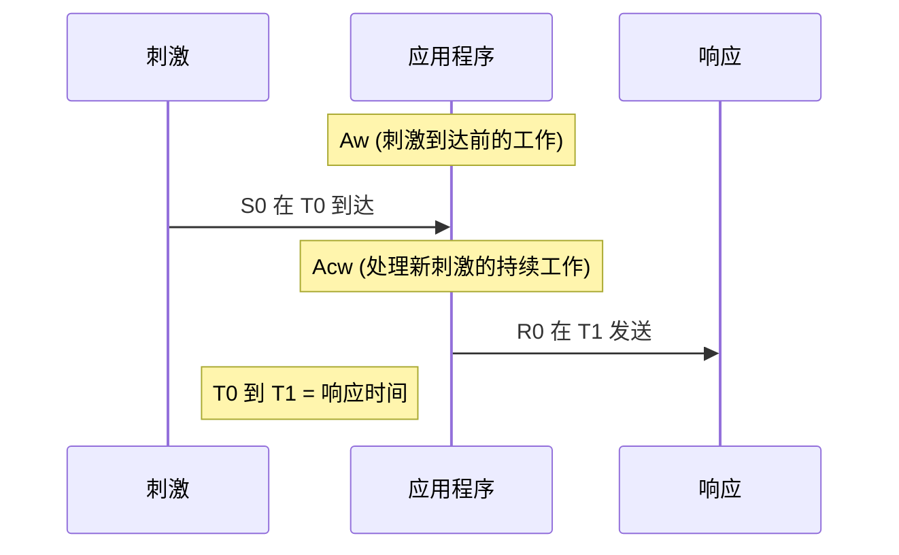
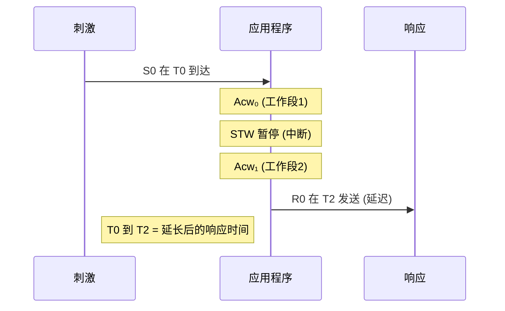
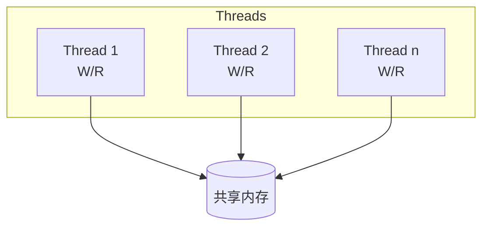
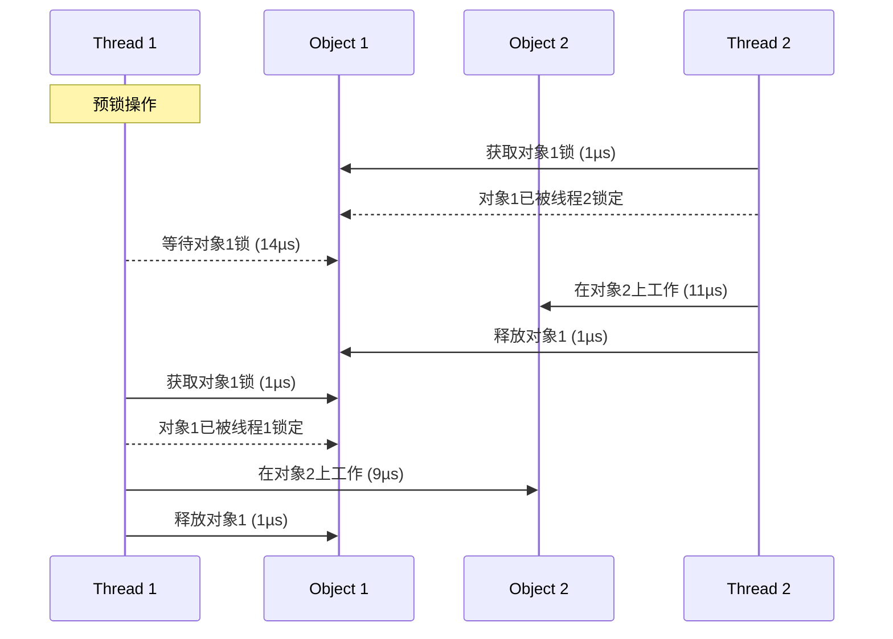
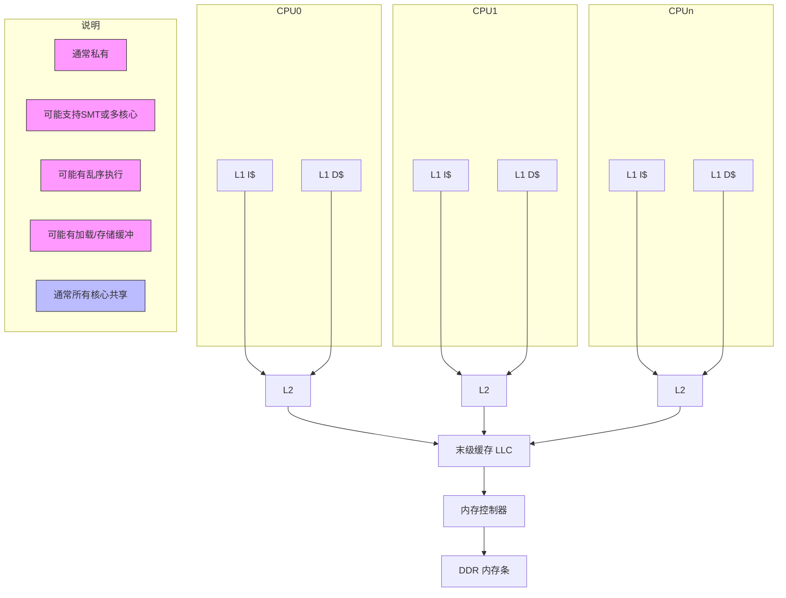
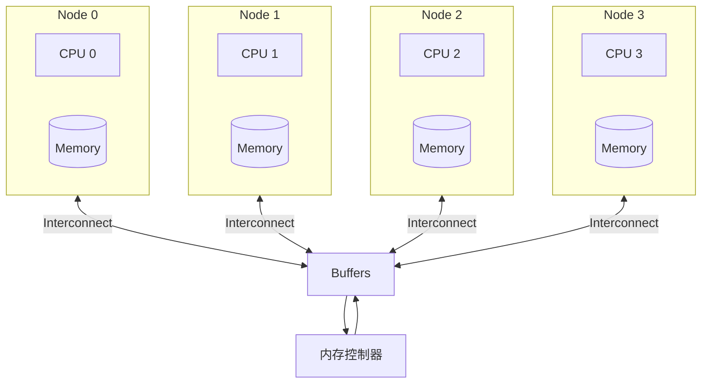
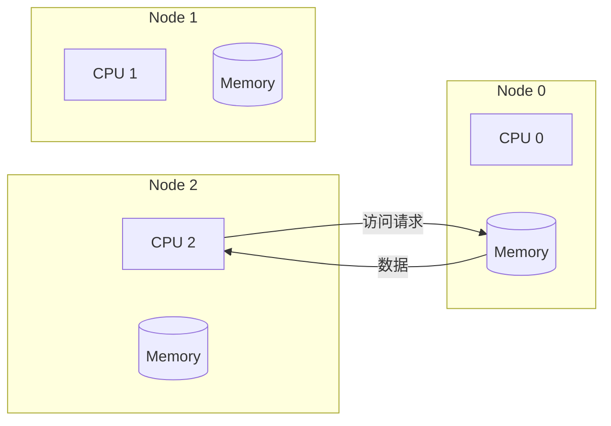

# 第5章 端到端Java性能优化：工程技术与JMH微基准测试

本章将超越纯粹的理论论述，凝聚了超过二十年在性能优化领域的实践经验。这里将介绍Java性能测量中不可或缺的工具，以及多年来精心培养和打磨的诊断与分析方法论。这种方法涉及对子系统进行详细调查以定位潜在问题，为高度关注性能优化的软件开发者提供了一份至关重要的路线图。

内存屏障的作用，以及volatile变量的使用。我们还将深入探讨性能优化的全面流程，其中包括监控、性能剖析、分析和调优。

我的职业生涯让我深刻理解了底层硬件和软件栈层对应用程序性能的深远影响，因此本章将揭示硬件与软件之间的相互作用关系。另一个专门的小节则认识到基准测试（benchmarking）的关键重要性——无论是用于评估特性发布的影响，还是分析不同系统层的性能。我们将一起探索使用Java微基准测试工具（JMH）的实际应用。此外，我们还将了解JMH内置的性能分析器（profiler），例如perfasm，这是一个强大的工具，能够揭示代码的底层性能特征。

因此，本章不仅仅是理论和概念的集合。它是一份实用指南，充满了示例和最佳实践，全部源自广泛的现场经验。它旨在弥合理论与实践之间的差距，为本书后续章节中详细的性能优化讨论奠定基础，确保读者能够充分准备好踏上高级性能工程之旅。

## 性能工程：软件工程的核心支柱

### 解码软件工程的层次

软件工程是一门综合性学科，包含两个独特却又相互交织的维度：（1）软件设计与开发，以及（2）软件架构需求。

软件设计与开发是我们在这趟旅程中遇到的第一个维度。它涉及为系统制作详细的蓝图或方案，涵盖系统的架构、组件、接口以及其他显著特征。这些设计考虑为功能需求奠定了基础——功能需求定义了系统应该完成什么的规则。功能需求封装了系统必须遵守的业务规则、系统应执行的数据操作以及系统应促进的交互。

相比之下，软件架构需求关注的是系统的非功能性或质量属性——通常被称为"ilities"（各种质量特性）。这些需求概述了系统应该如何运行，涵盖性能、可用性、安全性以及其他关键属性。

理解并在这两个维度之间取得平衡——满足功能需求的同时确保高质量属性——是软件工程的一个关键方面。有了这一基础理解，让我们将焦点转向这些关键质量属性之一——性能。

### 性能：关键质量属性

在各种架构需求中，性能占据着独特的地位。它衡量系统（称为"被测系统"，SUT）执行特定任务或"工作单元"（UoW）的效率。性能不仅仅是一个锦上添花的特性；它是一项基本的质量属性。它既影响运营效率，也影响用户体验，并在决定用户满意度方面发挥着关键作用。

要完全理解性能的概念，我们必须了解各种系统组件及其对性能的影响。在像JVM这样的托管运行时系统中，一个显著影响性能的关键组件是垃圾回收器（GC）。我在性能术语中将GC的工作单元定义为"GC工作"，指的是每个GC为满足其性能要求而必须执行的特定任务。例如，我将其归类为"吞吐量最大化"型的一种GC，以OpenJDK HotSpot VM中的Parallel GC为例，它专注于"并行工作"。相比之下，我所定义的"低延迟优化型"回收器需要对其任务进行更强的控制，以保证亚毫秒级的暂停。因此，理解这些组件的各自属性和贡献至关重要，因为它们共同构成了系统性能的整体图景。

### 理解与评估性能

性能评估不仅仅是衡量系统运行快或慢。相反，它涉及理解SUT与UoW之间的交互。UoW可以是单个用户请求、一批请求，或者系统需要执行的任何任务。性能取决于SUT在各种条件下执行UoW的有效性和效率。它涵盖了诸如系统资源利用率、吞吐量和响应时间等因素，以及这些参数随工作负载增加而变化的方式。

评估性能还需要与系统的用户互动，包括理解什么让他们满意，什么导致他们不满。他们的洞察可以揭示隐藏的性能问题或提出潜在的改进建议。性能不仅仅是关于速度——它是关于确保系统持续满足用户的期望。

### 定义服务质量

服务质量（QoS）是一个广义术语，代表用户对服务性能和可用性的看法。在当今动态的软件环境中，将QoS与服务等级协议（SLA）对齐，并融入现代站点可靠性工程（SRE）概念，如服务等级目标（SLO）和服务等级指标（SLI），至关重要。这些元素共同作用，确保对何为满意性能达成共识。

SLA定义了期望的服务水平，通常包括系统性能和可用性的指标。它们作为服务提供者和用户之间关于期望性能标准的正式协议，提供了衡量和评估系统性能的基准。

SLO是SLA中的具体、可衡量的目标，反映了期望的服务性能水平。它们作为可靠性和可用性的目标，指导团队维持最优的服务水平。相比之下，SLI是用于评估服务性能是否符合SLO的可量化度量。它们提供关于服务各个方面的实时数据，例如延迟、错误率或正常运行时间，从而实现持续的监控和改进。

根据SLA、SLO和SLI定义清晰、可量化的QoS指标，确保所有相关方对服务性能期望和用于衡量这些期望的指标拥有全面且最新的理解。这种方法越来越被认为是管理应用程序可靠性的最佳实践，并且是现代软件开发和维护中不可或缺的一部分。

在完善我们对QoS的理解过程中，我借鉴了行业专家Stefano Doni的见解，他是Akamas公司的联合创始人兼首席技术官[^1]。Stefano建议融入SLO和SLI等SRE概念，为我们的讨论增加了深度和相关性。

[^1]: Akamas专注于AI驱动的自主性能优化解决方案；www.akamas.io/about。

### 性能需求的成功标准

成功的性能不是一个"一刀切"的概念。相反，它应该以可衡量、现实的标准来定义，这些标准反映了每个系统的独特需求和约束。这些标准可以包括响应时间、系统吞吐量、资源利用率等指标。定期根据这些标准进行监控和测量，有助于确保系统持续达到其性能目标。

在接下来的章节中，我们将探索衡量Java性能的具体指标，突出硬件在塑造其效率方面的重要作用。这将为深入讨论并发性、硬件中的并行性以及弱有序系统的特性奠定基础，从而无缝过渡到基准测试的世界。

## 衡量Java性能的指标

性能指标对于理解应用程序在不同条件下的行为至关重要。这些指标为衡量性能优化工作的成功与否提供了量化基础。在Java性能优化的背景下，使用多种指标来衡量应用程序行为和效率的不同方面。这些指标涵盖从延迟（在刺激-响应上下文中尤其有洞察力）到可扩展性（评估应用程序处理增加负载的能力）等各个方面。效率、错误率和资源消耗是其他关键指标，为Java应用程序的整体健康状况和性能提供了洞察。

每个指标都提供了一个独特的视角，通过它可以检查和优化Java应用程序的性能。例如，延迟指标在需要及时响应的实时处理环境中至关重要。与此同时，可扩展性指标不仅对于评估应用程序当前的增长能力和应对峰值负载至关重要，而且对于确定其扩展因子——即应用程序响应需求增加而扩展容量的有效性的衡量标准——也至关重要。这个扩展因子是容量规划中不可或缺的一部分，因为它有助于预测维持和支持应用程序增长所需的资源和调整。通过理解当前性能和潜在的扩展场景，可以确保应用程序保持健壮和高效，无缝适应当前和未来的运营挑战。

关于响应性和延迟的一个特别有洞察力的方面是理解应用程序中的调用链深度。调用链中的每个阶段都可能引入自己的延迟，并且这些延迟会在沿链传播时累积和放大。这意味着早期阶段的问题会显著加剧整体延迟，影响应用程序的端到端响应性。这种动态特性对于理解至关重要，尤其是在具有多个交互组件的复杂应用程序中。

在Java生态系统中，这些指标不仅用于监控和优化生产环境中的应用程序，而且在开发和测试阶段也发挥着关键作用。Java世界中的工具和框架，如JMH，提供了专门的功能来测量和分析这些性能指标。

就本书而言，在承认Java中各种性能指标的多样性和重要性的同时，我们将专注于四个关键领域：足迹（footprint）、响应性（responsiveness）、吞吐量（throughput）和可用性（availability）。之所以选择这些指标，是因为它们具有广泛的适用性并对Java应用程序产生重大影响。

### 足迹

足迹指的是运行软件所需的空间和资源。这是一个关键因素，特别是在资源受限的环境中。足迹包括以下几个方面：

- **内存足迹**：软件在执行过程中消耗的内存量。这包括用于对象存储的Java堆和JVM本身使用的本机内存。内存足迹包括运行时数据结构，这些构成了应用程序系统足迹。JVM中的本机内存跟踪（NMT）在此处可以发挥关键作用，提供对本机内存分配和使用的详细洞察。这对于诊断Java堆之外潜在的内存低效或泄漏至关重要。在Java应用程序中，优化内存分配和垃圾回收策略是有效管理此足迹的关键。
- **代码足迹**：软件实际可执行代码的大小。大型代码库可能需要更多内存和存储资源，影响系统的整体足迹。在由JVM提供的托管运行时环境中，代码足迹可能直接影响进程，影响整体性能和资源利用率。
- **物理资源**：存储、网络带宽，特别是CPU使用等资源的使用。CPU足迹，即应用程序消耗的CPU资源量，是性能和成本效益的关键因素，尤其是在云环境中。在Java应用程序的上下文中，GC算法的选择会显著影响CPU使用率。Stefano指出，适当优化GC算法有时可以使CPU使用率减半，从而在云部署中实现可观的节约。

足迹的这些方面会显著影响系统的效率和运营成本。例如，较大的足迹可能导致更长的启动时间，这在容器化和无服务器架构中尤为关键。在这种环境中，每个容器都包含应用程序及其依赖项，决定了特定的足迹。如果这个足迹很大，可能会导致效率低下，尤其是在同一主机上运行多个容器的场景中。这种情况有时会引发"吵闹的邻居"问题，即一个容器的资源密集型操作垄断了系统资源，对其他容器的性能产生不利影响。因此，优化足迹不仅仅是提高单个容器的效率；它还要管理资源争用，确保共享平台上更高效的资源使用。

在无服务器计算中，尽管资源管理是自动的，但具有较大足迹的应用程序可能会经历更长的启动时间，称为"冷启动"。这可能会影响无服务器函数的响应性，因此足迹优化对于获得更好的性能至关重要。类似地，对于大多数Java应用程序来说，内存足迹通常直接与GC的工作负载相关，这可能会影响性能。在云环境和微服务架构中尤其如此，资源消耗直接影响响应性和运营开销，需要仔细进行容量规划。

### 使用本机内存跟踪监控非堆内存

基于我们之前在JVM中对NMT的讨论，让我们看看如何有效地使用NMT来监控非堆内存。NMT为此目的提供了有价值的选项：摘要视图（summary view）——提供聚合使用的概览，以及详细视图（detailed view）——呈现按单个调用站点划分的使用明细：

```
-XX:NativeMemoryTracking=[off | summary | detail]
```

> **注意**：启用NMT，特别是在详细级别，可能会引入一些性能开销。因此，应谨慎使用，尤其是在生产环境中。

为了获取实时洞察，可以使用`jcmd`获取运行时摘要或详细信息。例如，要检索摘要，使用以下命令：

```bash
$ jcmd <pid> VM.native_memory summary

<pid>:
Native Memory Tracking:
(Omitting categories weighting less than 1KB)
Total: reserved=12825060KB, committed=11494392KB
- Java Heap (reserved=10485760KB, committed=10485760KB)
  (mmap: reserved=10485760KB, committed=10485760KB)
- Class (reserved=1049289KB, committed=3081KB)
  (classes #4721)
  (  instance classes #4406, array classes #315)
  (malloc=713KB #12928)
  (mmap: reserved=1048576KB, committed=2368KB)
  (  reserved=65536KB, committed=15744KB)
  (  used=15522KB)
  (  waste=222KB =1.41%)
  (Metadata:)
- Class space:
  (reserved=1048576KB, committed=2368KB)
  (used=2130KB)
  (waste=238KB =10.06%)
- Thread (reserved=468192KB, committed=468192KB)
  (thread #456)
  (stack: reserved=466944KB, committed=466944KB)
  (malloc=716KB #2746)
  (arena=532KB #910)
- Code (reserved=248759KB, committed=18299KB)
  (malloc=1075KB #5477)
  (mmap: reserved=247684KB, committed=17224KB)
- GC (reserved=464274KB, committed=464274KB)
  (malloc=41894KB #10407)
  (mmap: reserved=422380KB, committed=422380KB)
- Compiler (reserved=543KB, committed=543KB)
  (malloc=379KB #424)
  (arena=165KB #5)
- Internal (reserved=1172KB, committed=1172KB)
  (malloc=1140KB #12338)
  (mmap: reserved=32KB, committed=32KB)
- Other (reserved=818KB, committed=818KB)
  (malloc=818KB #103)
- Symbol (reserved=3607KB, committed=3607KB)
  (malloc=2959KB #79293)
  (arena=648KB #1)
- Native Memory Tracking (reserved=2720KB, committed=2720KB)
  (malloc=352KB #5012)
  (tracking overhead=2368KB)
- Shared class space (reserved=16384KB, committed=12176KB)
  (mmap: reserved=16384KB, committed=12176KB)
- Arena Chunk (reserved=16382KB, committed=16382KB)
  (malloc=16382KB)
- Logging (reserved=7KB, committed=7KB)
  (malloc=7KB #287)
- Arguments (reserved=2KB, committed=2KB)
  (malloc=2KB #53)
- Module (reserved=252KB, committed=252KB)
  (malloc=252KB #1226)
- Safepoint (reserved=8KB, committed=8KB)
  (mmap: reserved=8KB, committed=8KB)
- Synchronization (reserved=1195KB, committed=1195KB)
  (malloc=1195KB #19541)
- Serviceability (reserved=1KB, committed=1KB)
  (malloc=1KB #14)
- Metaspace (reserved=65693KB, committed=15901KB)
  (malloc=157KB #238)
  (mmap: reserved=65536KB, committed=15744KB)
- String Deduplication (reserved=1KB, committed=1KB)
  (malloc=1KB #8)
```

如您所见，此命令生成一份全面的报告，按各种JVM组件（如Java堆、类、线程、GC和编译器区域等）分类内存使用情况。输出还包括保留（reserved）和已提交（committed）的内存量，有助于理解不同JVM子系统如何分配和利用内存。您还可以获取详细级别或摘要视图的差异（diff）信息。

### 缓解足迹问题

为了应对与足迹相关的挑战，从NMT、GC日志、JIT编译数据和其他JVM统一日志输出中获得的洞察可以指导各种缓解策略。关键方法包括：

- **数据结构优化**：通过分析使用情况并选择针对应用程序可预测数据模式量身定制的更轻量、更节省空间的替代方案，优先使用内存高效的数据结构。这种方法确保最优的内存利用率。
- **代码重构**：精简代码以减少冗余的内存操作并改进算法效率。最小化对象创建、优先使用基本类型而非装箱类型以及优化字符串处理是减少内存使用的关键策略。
- **自适应大小调整和GC策略**：利用现代GC的自适应大小调整功能，根据应用程序的行为和工作负载动态调整。根据您的足迹需求，仔细选择正确的GC算法，以增强运行时效率。在支持的情况下，为具有特定性能目标的应用程序引入`-XX:SoftMaxHeapSize`，允许受控的堆扩展并优化GC暂停时间。此策略与明智地设置初始堆大小（`-Xms`）和最大堆大小（`-Xmx`）相结合，形成了高效管理内存的全面方法。

这些技术协同应用时，确保了资源管理的平衡方法，在各种环境中提升了性能。

### 响应性

延迟（latency）和响应性（responsiveness）虽然相关，但揭示了系统性能的不同方面。延迟衡量的是从接收刺激（如用户请求或系统事件）到生成并交付响应所经过的时间。这是一个关键指标，但它只捕捉了性能的一个维度。

另一方面，响应性超越了单纯的反应速度。它评估系统在不同负载条件下的适应能力以及随时间推移维持性能的能力，提供了对系统敏捷性和运行效率的整体视角。它包括系统及时响应输入并执行必要操作以产生响应的能力。

在评估系统响应性时，先前讨论的SLO和SLI概念变得尤为相关。通过为响应时间设定明确的SLO，就建立了系统旨在实现的性能基准。在评估响应性时，需要考虑以下关键问题：

- 目标响应时间是多少？
- 在什么条件下，响应时间超出目标基准是可以接受的，允许的偏差程度是多少？
- 系统能承受多长时间的延迟？
- 响应时间在哪里测量：客户端、服务器端还是端到端？

根据这些问题建立SLI，可以设定清晰、可量化的基准，用于衡量相对于SLO的实际系统性能。跟踪这些指标有助于识别任何偏差并指导优化工作。JMeter、LoadRunner和自定义脚本等工具可用于测量不同负载条件下的响应性，并对SLI进行持续监控，提供关于系统维持SLO设定的性能标准的洞察。

### 吞吐量

吞吐量是另一个关键指标，它量化了系统每单位时间可以处理多少操作。在需要处理大量事务或数据的环境中，它至关重要。例如，我在为一家重要电商平台提供性能咨询时，凸显了在节假日促销等高峰期最大化吞吐量的重要性。这些时期可能导致流量大幅激增，因此系统需要能够扩展资源以维持高吞吐量水平，并"保持尾部延迟的4个9"（即在规定时间范围内完成99.99%的所有请求）。通过这样做，平台可以提供更好的用户体验，并确保业务运营成功。

理解系统的扩展能力在这些情况下至关重要。扩展策略可以包括水平扩展（scale out），即增加更多系统来分发负载；以及垂直扩展（scale up），即增强现有系统的能力。例如，在电商平台的节假日促销活动中，采用有效的扩展策略至关重要。云环境通常提供了灵活运用这些策略的能力，允许动态资源分配以适应不断变化的需求。

### 可用性

可用性是衡量系统正常运行时间的指标——本质上，是系统可用和可运行的时间。通常使用平均故障间隔时间（MTBF）等指标来衡量可用性。高可用性对于维持用户满意度和满足SLA通常至关重要。其他重要指标包括平均恢复时间（MTTR），它指示从故障中恢复的平均时间，以及冗余度量，如集群中故障转移实例的数量。这些可以提供关于系统韧性的额外洞察。

在我为一家大型分布式数据库公司担任性能顾问期间，高可用性是一个重点领域。该公司专门为数据仓库和机器学习开发扩展架构，利用Hadoop处理海量数据集。实现高可用性需要强大的回退系统以及可扩展性和冗余策略。例如，在我们的基于Hadoop的系统中，我们通过在集群中维护多个故障转移实例来确保高可用性。这种设置在发生故障时可以无缝切换到备份实例，最小化停机时间。这种冗余不仅对持续服务至关重要，而且对于在峰值负载期间维持高吞吐量等性能指标也至关重要，确保系统管理大量请求或数据而不会性能下降。

此外，高可用性对于维持一致的响应性至关重要，它允许从故障中快速恢复，并在不利条件下保持响应时间稳定。在数据库系统中，提高可用性意味着增加跨集群的故障转移实例，并使其多样化以获得更大的冗余。经过严格测试的这一策略确保在中断期间实现平滑、自动的故障转移，维持不间断的服务和用户信任。

特别是在大规模系统中，例如那些基于Hadoop生态系统的系统——它强调HDFS用于数据存储、YARN用于资源管理、HBase用于NoSQL数据库能力——理解并规划回退系统至关重要。此类系统的停机时间会显著影响业务运营。这些系统设计为具有韧性，能够无缝接管操作以维持持续服务，这对用户满意度至关重要。

通过我的经验，我了解到实现高可用性是一个复杂的平衡行为，需要仔细规划、稳健的系统设计和持续的监控，以确保系统韧性并维护用户的信任。云部署可以极大地帮助实现这种平衡。凭借其内置的自动故障转移和冗余程序，云服务增强了系统抵御意外停机的能力。这种适应性，加上按需扩展资源的灵活性，在峰值负载期间至关重要，确保在各种条件下的高可用性。

总之，实现高可用性超越了技术执行；它是对构建可靠系统的承诺，这些系统能够始终如一地满足并超越用户期望。这种承诺在我们数字时代至关重要，不仅需要像云部署这样的先进解决方案，还需要对系统架构采取整体方法。它涉及整合战略性设计原则，优先考虑无缝的服务连续性，反映了对可靠性和性能卓越性的全面承诺。

### 深入探讨响应时间与可用性

SLA对于设定响应时间的基准至关重要。它们可能包括平均响应时间、最大（最坏情况）响应时间、第99百分位响应时间以及其他高百分位（通常称为"4个9"和"5个9"）等指标。

跨不同系统的响应时间可视化表示可以揭示重要的洞察。特别是，捕获最坏情况可以识别在查看平均或最佳情况时可能被忽略的潜在可用性问题。例如，考虑表5.1，它展示了四个不同系统的记录响应时间。

**表5.1 示例：监控响应时间**

| 系统 | GC事件数 | 最小值(ms) | 平均值(ms) | 第99百分位(ms) | 最大值(ms) |
|---|---|---|---|---|---|
| System 1 | 36,562 | 7.622 | 310.415 | 945.901 | 2932.333 |
| System 2 | 34,920 | 7.258 | 320.778 | 1006.677 | 2744.587 |
| System 3 | 36,270 | 6.432 | 321.483 | 1004.183 | 1681.305 |
| System 4 | 40,636 | 7.353 | 325.670 | 1041.272 | 18,598.557 |

对表5.1中最小值、平均值和第99百分位响应时间的初步检查可能不会立即引起担忧。然而，系统4的最大响应时间揭示了长达约18.6秒的暂停，这值得深入调查。最初，这种延长暂停时间可能暗示GC效率低下，但也可能源于更广泛的系统延迟问题，可能触发高可用性分布式系统中的故障转移机制。理解这种情况至关重要，因为频繁发生会严重影响MTBF和MTTR，将这些指标推至可接受阈值之外。

这个例子强调了在评估响应时间时捕获和评估最坏情况的重要性。有助于分析和诊断此类性能问题的工具包括系统和应用程序性能分析器，如Intel VTune、Oracle Performance Analyzer、Linux perf、VisualVM[^2]和Java Mission Control[^3]等。利用这些工具对于诊断影响响应性的系统性性能瓶颈至关重要，能够实施有针对性的优化以增强系统可用性。

[^2]: https://visualvm.github.io/
[^3]: https://jdk.java.net/jmc/8/

### 响应时间的机制：应用程序时间线

为了更好地理解响应时间，请考虑图5.1，该图描绘了一个应用程序时间线。该时间线展示了两个关键事件：刺激S0在时间T0到达，以及应用程序在时间T1发回响应R0。接收到刺激后，应用程序继续工作（Acw）来处理这个新刺激，然后在时间T1发回响应R0。刺激到达之前发生的工作记为Aw。因此，图5.1说明了在应用程序工作上下文中的响应时间概念。



> ▲ 上图根据原文Figure 5.1标题和上下文推测绘制，原文为英文截图。图中展示了刺激到达与响应发送的应用程序时间线。

### 理解暂停上下文中的响应时间和吞吐量

停止世界（STW）暂停是指所有应用程序线程被挂起的时段。这些暂停（垃圾回收所需）会中断应用程序工作并影响响应时间和吞吐量。在STW暂停的背景下考虑应用程序时间线，可以帮助我们更好地理解此类事件如何影响响应时间和吞吐量。

让我们考虑一个场景，其中STW事件中断了应用程序的连续工作（Acw）。在图5.2中，不间断Acw的两个部分——Acw₀和Acw₁——被STW事件分隔开。在这个改变后的时间线中，原本应在不间断场景中的时间T1发送的响应R0，现在被延迟到时间T2。这导致了响应时间延长。



> ▲ 上图根据原文Figure 5.2标题和上下文推测绘制，展示了带有Stop-the-World暂停的应用程序时间线。

通过并排比较两种时间线（不间断和中断），如图5.3所示，我们可以量化这些STW事件的影响。让我们关注两个关键指标：同一时间段内的总工作量和吞吐量。

1. **完成的工作量**：
   - 在不间断场景中，完成的总工作量是Acw。
   - 在中断场景中，完成的总工作量是Acw₀和Acw₁之和。

2. **吞吐量（Wd）**：
   - 对于不间断时间线，吞吐量（Wda）计算为完成的总工作量（Acw）除以从刺激到达响应发送的持续时间（T₁ - T₀）。
   - 在中断时间线中，吞吐量（Wdb）是各段完成的工作量之和（Acw₀ + Acw₁）除以相同的持续时间（T₁ - T₀）。

由于STW暂停引起的中断导致Acw₀ + Acw₁小于Acw，因此Wdb将低于Wda。这有效地说明了在T₀到T₁响应窗口内吞吐量的降低，突显了STW事件如何影响应用程序处理任务的效率，并最终延长响应时间。

```mermaid
graph LR
    subgraph 不间断时间线
        A[Acw] --> B[吞吐量 Wda = Acw/(T1-T0)]
    end
    subgraph 中断时间线
        C[Acw₀] --> D[... STW ...] --> E[Acw₁] --> F[吞吐量 Wdb = (Acw₀+Acw₁)/(T1-T0)]
    end
    G[Acw₀+Acw₁ < Acw] --> H[Wdb < Wda]
```

> ▲ 上图根据原文Figure 5.3标题和上下文推测绘制，展示了不间断与中断时间线的工作量和吞吐量对比。

通过对响应时间、吞吐量、足迹和可用性的探索，很明显优化软件只是增强系统性能的一个方面。当我们导航软件子系统的细微差别时，我们认识到影响系统"ilities"的组件不仅仅局限于软件层。JVM和应用程序运行的硬件基础在塑造整体性能和可靠性方面同样起着关键作用。

## 硬件在性能中的作用

在我们对JVM性能的探索中，我们已经涉足了关键软件指标，如响应性、吞吐量等。在这些软件复杂性之外，还有一个关键维度：底层硬件。

虽然软件创新吸引了很多关注，但硬件在塑造性能方面的作用同样至关重要。随着云架构的发展，硬件的战略重要性变得更加明显，供应商在功率和成本效益方面都在进行优化。

考虑到从数据中心到云的环境，硬件变化的影响——如处理器架构调整或增加处理核心——是深远的。这些修改如何影响性能指标或系统韧性，促使我们进行更深入的调查。这样的探究不仅增强了我们对硬件影响性能的理解，还指导了有效的硬件栈修改，强调了在追求技术效率中采用平衡的软硬件优化方法的必要性。

基于硬件在系统性能中的关键作用，让我们考虑一个使用Netty的容器化Java应用场景，Netty以其高性能和非阻塞I/O能力而闻名。虽然Netty擅长管理并发连接，但其有效性不仅限于软件优化，还延伸到如何与云基础设施集成，以及在容器环境约束下利用底层硬件的能力。

容器化引入了其自身的一系列性能考虑因素，包括资源隔离、开销以及主机系统内潜在的密度相关问题。部署在云平台上的此类应用程序需要穿越多层架构：从虚拟机监控程序和虚拟机到容器编排（后者管理资源、扩缩容和健康检查）。每个层都会引入影响数据传输、延迟和吞吐量的复杂性。

理解云和容器化环境的复杂性对于优化应用程序性能至关重要，需要在软件能力、硬件资源和中间层栈之间实现战略平衡。这种对优化的追求进一步受到全球技术标准和法规的影响，强调了安全性、数据保护和能效的重要性。这些标准驱动合规性并促进硬件级别的创新，从而增强虚拟化栈和整体系统效率。

当我们过渡到这一节时，我们的重点扩展到硬件和软件之间的共生关系，突出从数据处理机制到内存管理策略的硬件复杂性如何影响应用程序的性能。这为后续章节的全面探索奠定了基础。

### 解码硬件-软件动态

要最大化应用程序的性能，理解其代码与底层硬件之间复杂的相互作用至关重要。虽然软件提供用户界面和功能，但硬件在决定操作速度方面起着关键作用。这种关键关系如果未能正确对齐，可能导致潜在的性能瓶颈。

硬件的特性，如CPU速度、内存可用性和磁盘I/O，直接影响应用程序处理任务的速度和效率。开发人员和系统架构师必须了解硬件的能力和限制。例如，为多核处理器优化的应用程序在单核设置上可能无法高效运行。此外，微架构的复杂性、多样化的子系统以及云环境引入的变量可能进一步复杂化扩展过程。

深入探讨硬件-软件交互，我们会发现复杂性，特别是在硬件架构和线程行为等领域。例如，在理想世界中，多个线程将无缝访问共享内存结构，和谐工作而没有任何冲突。这种场景，如图5.4所示，受Maranget等人《ARM和POWER宽松内存模型教程介绍》[^4]的启发，虽然令人向往，但往往更偏理论而非实践。



> ▲ 上图根据原文Figure 5.4标题和上下文推测绘制，展示了线程1到n无障碍访问共享内存结构（受Luc Maranget, Susmit Sarkar, and Peter Sewell的ARM和POWER宽松内存模型教程启发）。

[^4]: www.cl.cam.ac.uk/~pes20/ppc-supplemental/test7.pdf

然而，现实世界的计算充满了扩展和并发挑战。共享内存管理通常需要像锁这样的机制来确保数据有效性。这些机制虽然必不可少，但可能会引入复杂性。借鉴Doug Lea的《Java并发编程：设计原则与模式》[^5]，线程在访问对象时争用锁并不罕见（图5.5）。这种竞争可能导致一个线程无意中阻塞其他线程，导致执行延迟和潜在的性能下降。


> ▲ 上图根据原文Figure 5.5标题和上下文推测绘制，展示了线程2锁定对象1并移动到对象2中的辅助方法（受Doug Lea的《Java并发编程：设计原则与模式》第二版启发）。

[^5]: Doug Lea. Concurrent Programming in Java: Design Principles and Patterns, 2nd ed. Boston, MA: Addison-Wesley Professional, 1999.

这种理想化愿景与现实实践之间的差距强调了硬件-软件交互中复杂的相互作用和固有的挑战。线程、共享内存结构以及管理它们交互的机制（锁或无锁数据结构和算法）证明了这种复杂性。正是这种分歧强调了深入理解硬件如何影响应用程序性能的必要性。

### 性能交响曲：语言、处理器和内存模型

在最佳状态下，性能是所使用的编程语言、处理器的能力以及它们遵循的内存模型之间的和谐组合。这种性能交响曲正是我们本节要揭示的目标。

#### 并发：核心机制

并发是指同时执行多个任务或进程。这是现代计算中的一个基本概念，允许提高效率和响应性。从应用程序的角度来看，理解并发性对于设计能够同时处理多个用户或任务的系统至关重要。对于Web应用程序，这可能意味着无需延迟即可服务多个用户。误解并发可能导致死锁或竞态条件等问题。

#### 共生关系：硬件与软件交互

- **超越硬件**：虽然强大的硬件可以提升性能，但真正的潜力是在软件针对该硬件进行优化时才得以释放。这种优化受到编程语言选择、其与处理器的兼容性以及对特定内存模型的遵守情况的影响。
- **语言和处理器**：不同的编程语言具有不同级别的抽象。有些提供与硬件更紧密的交互，而另一些则优先考虑开发人员的便利性。挑战在于确保代码在整个谱系上得到优化，使其在目标处理器架构上具有高性能。

#### 内存模型：无声的催化剂

- **平衡一致性与性能**：内存模型定义了线程如何感知内存操作。它们在确保所有线程对内存有一致视图和允许某些重排序以获得性能提升之间取得了微妙的平衡。
- **语言特异性**：不同的语言带有自己的内存模型。例如，Java的内存模型强调特定的操作顺序以保持跨线程的一致性，即使这意味着牺牲一些性能。相比之下，C++11及更新版本提供了比Java更细粒度的内存序控制。

#### 提升性能：优化和谐性

##### 硬件感知编程

要真正发挥硬件的能力，我们必须超越语言的抽象。这涉及理解缓存层次结构、为缓存友好设计优化数据结构，以及了解处理器的能力。以下是在不同缓存级别中的应用方式：

- **优化CPU缓存效率**：使数据结构与缓存行对齐，以最小化缓存未命中并加速访问。重要策略包括管理"真共享"——通过确保同一缓存行上的共享数据被高效访问来最小化性能影响——以及避免"伪共享"，即同一行上无关的数据导致失效。利用硬件预取（根据预期使用预加载数据）改进了空间和时间的局部性。
- **应用级缓存策略**：在软件/应用层面实现缓存需要仔细考虑硬件可扩展性。例如，可用的RAM决定了可以在内存中保留的数据量。关于缓存什么及其保留时间的决策取决于对硬件能力的细致理解，以空间和时间的局部性原则为指导。
- **数据库和Web缓存**：数据库使用内存来缓存查询和结果，将性能与硬件资源联系起来。类似地，通过内容分发网络（CDN）的Web缓存涉及地理分布的联网服务器，将内容缓存到更接近用户的位置，减少延迟。软件定义网络（SDN）可以优化缓存策略中的硬件使用，以提高内容交付效率。

##### 掌握内存模型

深入理解语言的内存模型可以防止并发问题并解锁性能优化。内存模型规定了管理内存与多个执行线程之间交互的规则。对这些模型的细致理解可以显著减轻与并发相关的问题，如可见性问题和竞态条件，同时开辟性能优化的途径。

- **Java的内存模型**：在Java中，掌握happens-before关系的复杂性至关重要。这个概念确保了跨不同线程的内存可见性和操作顺序。通过掌握这些关系，开发者可以在没有过度同步的情况下编写可扩展的线程安全代码。理解如何有效利用volatile变量、原子操作和同步块，可以在多线程环境中带来显著的性能提升。
- **对软件设计的影响**：对内存模型的了解影响着关于线程间数据共享、锁的使用以及非阻塞算法实现的决策。它允许更策略性的同步方法，帮助开发者针对每种场景选择最合适的技术。例如，在低延迟系统中，避免重量级锁并使用无锁数据结构可能至关重要。

在探索了可以帮助我们构建高效且有韧性的并发软件的硬件和内存模型的细微差别之后，下一步是深入探讨内存模型的具体细节。

### 内存模型：解析线程动态与性能影响

内存模型概述了线程通过共享内存进行交互的规则，并规定了值如何在线程之间传播。这些规则对系统性能有重大影响。在理想的计算机世界中，我们会将内存模型设想为顺序一致（sequentially consistent）的共享内存系统。这样的系统将确保操作按照它们在原始程序顺序中出现的精确顺序执行，即单一的全局执行顺序，从而产生顺序一致的机器。

例如，考虑一个场景，程序顺序规定线程2总是先获得对象1上的锁，在它移动到对象2中的辅助方法时有效地每次都阻塞线程1。这可以借助两种互补的图示表示来可视化：序列图和甘特图。



> ▲ 上图根据原文Figure 5.6标题和上下文推测绘制，展示了顺序一致共享内存模型中线程操作的序列。

图5.6所示的序列图提供了线程与对象间交互的详细视图。它展示了线程1启动其进程并进行预锁操作，紧接着线程2获取对象1上的锁。线程2之后在对象2上的工作以及最终释放对象1上的锁都以清晰的顺序方式展示。与此同时，线程1进入等待状态，显示了其对线程2所持锁的依赖。一旦线程2释放锁，线程1获取它，继续其在对象2上的操作，然后释放锁，完成其操作序列。

补充序列图的是图5.7所示的甘特图，它展示了随时间变化的全局执行顺序。它呈现了每个线程与对象交互的起始和结束点，捕捉了顺序一致性的本质。甘特图标记了线程1的等待期（与线程2的独占访问期重叠），然后展示了线程1在锁释放后的继续动作。

```mermaid
gantt
    title 线程交互的全局执行时间线
    dateFormat HH:mm:ss
    axisFormat %H:%M:%S
    section Thread 1
    预锁操作           :a1, 00:00:00, 2s
    等待对象1锁        :a2, after a1, 14s
    获取对象1锁        :a3, after a2, 1s
    锁定对象1          :a4, after a3, 1s
    在对象2上工作      :a5, after a4, 9s
    释放对象1          :a6, after a5, 1s
    section Thread 2
    获取对象1锁        :b1, 00:00:02, 1s
    锁定对象1          :b2, after b1, 1s
    在对象2上工作      :b3, after b2, 11s
    释放对象1          :b4, after b3, 1s
```



> ▲ 上图根据原文Figure 5.7标题和上下文推测绘制，展示了线程交互的全局执行时间线。

通过将全局执行时间线与程序顺序时间线结合，我们可以观察到直接、顺序的事件流。这种可视化与顺序一致机器的原则一致，尽管线程操作具有并发性质，但系统表现得好像存在单一、全局的有序事件序列。因此，这些图示有助于增强我们对顺序一致性的理解。

虽然图5.6和5.7以及相关讨论勾勒了一个理想的、顺序一致的系统，但现实世界的当代计算系统通常遵循更宽松的内存模型，如完全存储排序（TSO）、部分存储排序（PSO）或释放一致性（release consistency）。这些模型与各种硬件优化策略（如存储/写入缓冲和乱序执行）相结合，允许获得性能提升。然而，它们也引入了观察到操作偏离其编程顺序的可能性，可能导致不一致性。

考虑存储缓冲（store buffering）的概念作为例子，线程可能在其他线程看到其写入之前就观察到自己的写入，这可能打乱感知到的操作顺序。为了说明这一点，让我们用一个两个线程（或进程）p0和p1的存储缓冲示例来探讨。初始时，我们在内存中有两个共享变量X和Y，都设置为0。此外，还有foo和bar，分别是存储在p0和p1线程寄存器中的局部变量：

```
p0:         p1:
a: X = 1;   c: Y = 1;
b: foo = Y; d: bar = X;
```

在一个理想的、顺序一致的环境中，foo和bar的值由组合的操作顺序决定，可能包括{a,b,c,d}、{c,d,a,b}、{a,c,b,d}、{c,a,b,d}等序列。在这种情况下，foo和bar都为零是不可能的，因为每个线程内的操作保证按照它们发出的顺序被观察到。

然而，有了存储缓冲，线程可能在自己写入对其他线程可见之前就感知到了自己的写入。这可能导致foo和bar都为零的情况，因为p0对X的写入（a: X = 1）可能在p1注意到之前就被p0识别，p1对Y的写入（c: Y = 1）也类似。

尽管这种行为可能导致偏离期望的顺序一致性的不一致，但这些优化对于提升系统性能是基础性的，为更快的处理速度和更高的效率铺平了道路。此外，像MESI和MOESI[^6]这样的缓存一致性协议在维护处理器缓存间的一致性方面起着关键作用，进一步复杂化了内存模型的格局。

总之，我们对内存一致性模型的探索为理解JVM内并发操作的复杂性奠定了基础。对于从事Java和JVM性能调优的人来说，必须扎实掌握这些模型的实际现实和基本原则，因为它们影响着并发程序的流畅和高效执行。

随着我们向前推进，我们将继续探索硬件世界。特别是，我们将讨论具有分层内存结构的多处理器线程或核心，以及Java内存模型（JMM）的构建。我们将涵盖volatile变量的使用——一个用于编写线程安全应用程序的关键JMM特性——并探索内存屏障（memory barriers）和围栏（fences）等概念如何在并发Java环境中促进可见性和有序性。

此外，非统一内存访问（NUMA）的概念随着我们考虑在具有可变内存访问时间的系统上Java应用程序的性能而变得越来越相关。理解NUMA的影响至关重要，因为它影响着JVM内的垃圾回收、线程调度和内存分配策略，从而影响Java应用程序的整体性能。

[^6]: https://redis.com/glossary/cache-coherence/

### 并发硬件：穿越迷宫

在并发硬件系统的格局中，我们必须导航多处理器核心的复杂层次，每个核心都有自己层级化的内存结构。

#### 同步多线程与核心利用率

多处理器核心可以实现同步多线程（SMT），这是一种旨在提高CPU效率的技术，允许多个硬件线程在单个核心上同时执行。这种单核心内的并发旨在更好地利用CPU资源，当一个线程等待I/O操作或其他长延迟指令时，空闲的CPU核心可以被另一个硬件线程使用。

将这与此相对，全核心利用中每个线程在单独的物理核心上运行，拥有专用的计算资源，对于JVM来说，会遇到一组不同的性能考虑。全核心为每个线程提供了对核心资源的完全控制，减少了争用，并可能提高计算密集型任务的性能。在这样的环境中，JVM的垃圾回收和线程调度可以确保不受阻碍地访问这些资源，量身定制最大化每个核心效率的策略。

然而，在使用超线程（SMT）的领域，JVM面临更复杂的场景。它必须意识到线程可能无法独占访问核心的所有资源。这种共享环境可以提高多线程应用程序的吞吐量，但也可能引入更高的资源争用可能性。JVM的线程调度器和GC必须适应这一现实，平衡工作负载分布和GC过程以适应SMT的微妙之处。

在利用全核心或超线程之间的选择与Java应用程序的性质密切相关。对于可以充分利用空闲CPU周期的I/O密集型或多线程工作负载，超线程可能提供吞吐量优势。相反，对于需要连续密集计算的CPU密集型进程，全核心可能提供最佳的性能结果。

随着我们深入研究这些硬件特性对JVM性能的影响，我们必须认识到将软件策略与底层硬件能力对齐的重要性。无论是针对全核心的专用资源还是SMT的并发执行环境进行优化，最终目标都是一样的：在这些并发硬件系统中增强Java应用程序的性能和响应性。

#### 高级处理器技术与内存层次结构

现代处理器的复杂性超出了SMT和全核心利用的范畴。在这些先进系统中，核心拥有自己独特的缓存层次结构，以跨多个处理单元维护缓存一致性。每个核心通常拥有一个1级指令缓存（L1I$）、一个1级数据缓存（L1D$）和一个私有的2级缓存（L2）。

缓存一致性是确保所有核心对内存有一致视图的机制。本质上，当一个核心更新其缓存中的值时，其他核心会被告知这一变化，防止它们使用过时或不一致的数据。

在这一设置中，包含一个通常所有核心都可以访问的共享末级缓存（LLC），促进它们之间的高效数据共享。此外，一些高性能系统在LLC之外或代替LLC包含系统级缓存（SLC），以进一步优化数据访问时间或满足特定的计算需求。

为了最大化性能，这些处理器采用了先进的技术。例如，乱序执行允许处理器在数据可用时立即执行指令，而不是严格遵守原始程序顺序。这最大化了资源利用率，提高了处理器效率。

此外，如前所述，处理器使用加载和存储缓冲来管理进出内存的数据传输。这些缓冲区临时保存内存操作（如加载和存储）的数据，允许CPU继续执行其他指令而无需等待内存操作完成。这种机制平滑了快速CPU寄存器和相对较慢的内存之间的数据流，有效弥合了速度差距并优化了处理器性能。

内存层次结构的核心是一个内存控制器，它管理系统内的双倍数据速率（DDR）内存条，协调进出物理内存的数据流。图5.8展示了包含上述所有组件的综合硬件配置。



> ▲ 上图根据原文Figure 5.8标题和上下文推测绘制，展示了一个现代硬件配置。

内存一致性，即一个处理器的内存变化被其他处理器感知的方式，因硬件架构而异。谱系的一端是具有强内存一致性模型的架构，如x86-64和SPARC，它们使用TSO[^7]。相反，Arm v8-A架构具有更宽松的模型，允许更灵活地重排序内存操作。这种灵活性可以带来更高的性能，但要求程序员在使用同步原语时更加谨慎，以避免多线程应用程序中的意外行为[^8]。

[^7]: https://docs.oracle.com/cd/E26502_01/html/E29051/hwovr-15.html
[^8]: https://community.arm.com/arm-community-blogs/b/infrastructure-solutions-blog/posts/synchronization-overview-and-case-study-on-arm-architecture-563085493

为了说明这些挑战，考虑之前讨论的两个变量X和Y（初始都为0）的存储缓冲示例。在像x86-64这样的TSO架构中，使用存储缓冲区可能导致foo和bar都为0，如果线程P1在P2对Y的写入可见之前读取Y，同时P2在P1对X的写入被P2看到之前读取X。在Arm v8中，硬件还可能重排序操作，可能导致比TSO允许的更意想不到的结果。

在导航先进处理器技术和内存层次结构的迷宫中，我们实际上只揭示了故事的一半。这些硬件优化的真正效能是在与运行其上的软件有效同步时才得以实现的。作为开发人员和系统架构师，我们的挑战是确保我们的软件不仅利用而且补充这些复杂的硬件能力。

为此，像屏障（barriers）和围栏（fences）这样的软件机制可以补充和利用这些硬件特性。这些指令强制实施顺序约束，确保多线程环境中的操作以尊重硬件内存模型的方式执行。这种理解对于Java性能工程至关重要，因为它使我们能够制定软件策略，在复杂的计算环境中优化Java应用程序的性能。基于我们对Java内存模型和并发挑战的理解，让我们更仔细地研究这些软件策略，探索它们如何与硬件协同工作，以优化基于Java的系统的效率和可靠性。

### 并发计算中的顺序机制：屏障、围栏和Volatile

在并发计算的复杂世界中，屏障、围栏和volatile变量是维护顺序和确保数据一致性的关键工具。这些机制通过阻止可能导致意外后果或结果的某些类型的重排序来发挥作用。

#### 屏障

屏障是并发编程中使用的一种同步机制，用于阻止某些类型的重排序。本质上，屏障就像程序中的一个检查点或同步点。当一个线程到达屏障时，它不能通过，直到所有其他线程也到达这个屏障。在内存操作的上下文中，内存屏障阻止跨越屏障的读写操作（加载和存储）的重排序。这有助于在多线程环境中维护共享数据的一致性。

#### 围栏

屏障提供了一个广泛的同步点，而围栏则更针对内存操作进行定制。它们强制实施顺序约束，确保某些操作在其他操作开始之前完成。例如，存储-加载围栏（store-load fence）确保程序顺序中出现在围栏之前的所有存储操作（写入）在围栏之后出现的任何加载操作（读取）之前对其他线程可见。

#### Volatile

在Java等语言中，volatile关键字提供了一种确保变量在线程间可见性和顺序性的方式。对于volatile变量，对该变量的写入对所有后续读取该变量的线程都是可见的，提供了happens-before保证。相比之下，非volatile变量没有volatile关键字保证的交互优势。因此，编译器可以使用非volatile变量的缓存值。

### 深入理解原子性：Java内存模型与Happens-Before关系

原子性确保操作要么完全执行，要么完全不执行，从而保持数据完整性。JMM对于在多线程上下文中理解这一概念至关重要。它提供了可见性和顺序性保证，确保原子性并建立可预测执行的happens-before关系。当一个动作happens-before另一个动作时，第一个动作不仅对第二个动作可见，而且在顺序上位于它之前。这种关系确保在多线程环境中执行的Java程序行为可预测且一致。

让我们考虑一个实际示例来说明这些概念的实际应用。Java中的AtomicLong类是在多线程上下文中如何实现和利用原子操作以维护数据完整性和可预测性的典型例子。AtomicLong通过低级同步技术确保对long值的原子操作，作为单一的、不可分割的工作单元。这种特性保护它们免受并发操作的潜在干扰。这样的原子操作构成了同步的基石，即使在激烈的多线程环境中也能确保系统范围的连贯性。

```java
AtomicLong counter = new AtomicLong();

void incrementCounter() {
    counter.incrementAndGet();
}
```

在这个代码片段中，AtomicLong类中的`incrementAndGet()`方法演示了原子操作。它将计数器的自增（counter++）和检索（get）操作合并为一个单一操作。这种原子性在多线程环境中至关重要，因为它可以防止其他线程在操作过程中观察或干扰处于不一致状态的计数器。

AtomicLong类利用低级技术来确保这种顺序。它使用比较并交换循环（compare-and-set loops），根植于CPU指令，有效地充当了内存屏障。由屏障保证的这种原子性是并发编程的一个重要方面。随着我们的进展，我们将更深入地探讨这些概念如何支持性能工程和优化。

让我们考虑另一个实际例子来说明这些概念，这次涉及一个假设的`DriverLicense`类。这个例子演示了如何在Java中使用volatile关键字来确保变量在线程间的可见性和顺序性：

```java
class DriverLicense {
    private volatile boolean validLicense = false;

    void renewLicense() {
        this.validLicense = true;
    }

    boolean isLicenseValid() {
        return this.validLicense;
    }
}
```

在这个例子中，`DriverLicense`类作为管理驾驶执照状态的模型。当执照被续期（通过调用`renewLicense()`方法）时，`validLicense`字段被设置为`true`。当前状态可以通过`isLicenseValid()`方法验证。`validLicense`字段被声明为volatile，这保证一旦在一个线程中续期了执照（例如，在线续期后），执照的新状态将立即可用于所有其他线程（例如，检查执照的警察）。没有volatile关键字，由于JVM或系统进行的各种缓存或重排序优化，其他线程可能需要延迟才能看到更新的执照状态。

在实际应用程序中，误解或不当实现这些机制可能导致严重后果。例如，一个没有正确处理并发事务的电商平台可能会对客户重复收费或无法正确更新库存。对开发者来说，理解这些机制在设计依赖多线程的应用程序时至关重要。正确使用它们可以确保任务按正确顺序完成，防止潜在的数据不一致或错误。

随着我们向前推进，我们的探索将通过有效的线程管理和同步技术来研究运行时性能。具体来说，第7章"运行时性能优化：关注字符串、锁及更广领域"不仅将介绍高级同步和锁定机制，还将引导我们了解并发工具集。通过利用这些并发框架的优势，结合对底层硬件行为的基础理解，我们将装备自己在并发系统中掌握性能优化的全面工具集。

### 多处理器系统中的并发内存访问与一致性

在我们对内存模型及其对线程动态的深远影响的探索中，我们已经揭示了在多处理器系统中处理内存访问时出现的复杂挑战。当多个核心或线程同时访问和修改共享数据时，这些挑战被放大。在这种情况下，确保一致性和高效内存访问非常重要。

在多处理器系统领域，线程通常与不同的内存控制器交互。虽然并发内存访问是这些系统的一个标志，但内置的一致性机制确保数据不一致被控制在最小限度。例如，即使一个核心更新了一个内存位置，一致性协议将确保所有核心对数据有一致的视图。这消除了核心可能访问过时值的场景。这些强大机制的存在突显了现代系统的复杂设计，它们优先考虑性能和数据一致性。

在多处理器系统中，确保跨线程的数据一致性是一个首要关注点。像屏障、围栏和volatile变量等工具一直是保证操作遵循特定顺序的基础，维护了跨线程的数据一致性。这些机制对于确保内存操作按正确顺序执行，防止潜在的数据竞争和不一致性至关重要。

> **注意**：数据竞争（Data race）发生在两个或更多线程同时访问共享数据，且至少有一个访问是写操作时。

然而，随着具有多个处理器和不同内存库的系统的兴起，另一个复杂层面被添加进来——即处理器与内存之间的物理距离和访问时间。这就是非统一内存访问（NUMA）架构的用武之地。NUMA基于系统的物理布局优化内存访问。总之，这些机制和架构协同工作，以确保现代多处理器系统中的数据一致性和高效内存访问。

### NUMA深入探讨：我在AMD、Sun Microsystems和Arm的经历

基于我们对并发硬件和软件机制的理解，现在是时候进一步深入NUMA的世界了，这是一段由我在AMD、Sun Microsystems和Arm的第一手经验启发的旅程。NUMA是多处理环境中的关键组件，理解其细微差别可以显著增强系统性能。

在NUMA系统中，内存控制器不仅仅是一个促进者——它是神经中枢。在AMD，从事开创性的Opteron处理器工作，我观察到控制器的作用是一个关键功能。这样一个NUMA感知的、能够根据架构的细微差别和各个处理器的需求明智地分配内存的智能实体，基于与处理器的接近程度优化了内存分配，最小化了跨节点流量，减少了延迟，并提升了系统性能。

试想：当一个处理器请求数据时，内存控制器决定数据存储在哪里。如果是本地的，控制器实现快速、直接的访问。如果不是，控制器必须启动互连网络，从而引入延迟。我在AMD的工作中，NUMA感知内存控制器的作用是在这些决策之间取得最佳平衡，以最大化性能。

NUMA系统中的缓冲区充当中介，在传输过程中临时存储数据，有助于平衡跨节点的内存访问。这种平衡行为防止单个节点被过多的请求淹没，确保平稳运行——这是我们在优化Sun Microsystems的高性能V40z服务器和SPARC T4调度器时使用的原则。

还必须关注传输系统——NUMA架构的动脉。它支持数据在系统中的移动。一个优化良好的传输系统最小化延迟，从而为系统的整体性能做出贡献——这是我在Arm任职期间强化的一项关键考虑。

掌握NUMA不是一项肤浅的练习：它是关于理解内存控制器、缓冲区和传输系统在这个复杂架构中的相互作用。这种深刻理解对于我在优化并发系统性能方面的努力至关重要。



> ▲ 上图根据原文Figure 5.9标题和上下文推测绘制，展示了现代系统中的NUMA节点。

进一步深入NUMA领域，我们遇到各种关键的流量模式，包括交叉流量（cross-traffic）、本地流量（local traffic）和交错内存流量模式（interleaved memory traffic patterns）。这些模式显著影响内存访问延迟，从而影响数据处理速度（图5.10）。

交叉流量指的是处理器访问另一个处理器内存库中的数据的情况。这种跨节点移动引入了延迟，但却是多处理系统不可避免的现实。在这种情况下的关键考量是通过智能内存分配进行高效处理，由NUMA感知的内存控制器促进，并观察延迟最小的路径，而不拥挤缓冲区。

相比之下，本地流量发生在处理器从其本地内存库检索数据时——由于消除了互连网络的需求，这个过程比跨节点流量更快。优化系统以增加本地流量同时最小化交叉流量延迟是高效NUMA系统的基石。

交错内存为NUMA系统增加了另一个层次的复杂性。这里，连续的内存地址分散在不同的内存库中。这种分散平衡了各节点间的负载，减少了瓶颈，提高了性能。然而，它可能无意中增加跨节点流量——这种可能性需要仔细管理内存控制器。

NUMA架构解决了共享内存模型固有的可扩展性限制，其中所有处理器共享一个单一内存空间。随着处理器数量的增加，共享内存的带宽成为瓶颈，限制了系统的可扩展性。然而，为NUMA系统编程可能具有挑战性，因为开发人员需要在设计算法和数据结构时考虑内存局部性。为了帮助开发人员，现代操作系统提供了NUMA API用于在特定节点上分配内存。此外，像数据库和GC这样的内存管理系统正变得越来越具有NUMA感知能力。这种感知能力对于最大化系统性能至关重要，并且是我在AMD、Sun Microsystems和Arm工作中的一个关键焦点。



> ▲ 上图根据原文Figure 5.10标题和上下文推测绘制，展示了NUMA访问的示意。

其他相关概念包括缓存一致性非统一内存访问（ccNUMA），其中系统在所有处理器上维护一致的内存映像；相比之下，NUMA指的是构建具有非统一内存的系统的总体设计哲学。理解这些概念，加上屏障、围栏和volatile变量，对于掌握并发系统中的性能优化至关重要。

### NUMA的演进：现代处理器中的Fabrics架构

NUMA架构随着处理器设计的发展经历了多次演进，特别是在高端服务器处理器中。这些创新在Intel、AMD和Arm等行业巨头的工作中明显可见，每家公司在服务器环境和云计算场景中都做出了独特的贡献。

- **Intel的Mesh Fabric**：Intel Xeon可扩展处理器采用了mesh架构，取代了传统的环形互连[^9]。这种mesh拓扑以更直接的方式有效连接核心、缓存、内存和I/O组件。这允许更高的带宽和更低的延迟，这两者对数据中心和高性能计算应用都至关重要。这一转变显著增强了复杂计算环境中的数据处理能力和系统响应性。
- **AMD的Infinity Fabric**：AMD的EPYC处理器采用了Infinity Fabric架构[^10]。该技术互连同一封装内的多个处理器芯片，实现高效的数据传输和可扩展性。在多芯片CPU中尤其有益，解决了多核环境中的特殊扩展和性能挑战。AMD的方法显著改善了大型服务器中的数据处理，这对于满足当今日益增长的计算需求至关重要。
- **Arm的NUMA进展**：Arm在NUMA技术方面也取得了进展，特别是在其服务器级CPU方面。像Neoverse N1平台[^11]这样的Arm架构体现了用于高吞吐量、并行处理任务的可扩展架构，强调能效NUMA设计。智能互连架构优化了跨不同核心的内存访问，平衡了性能与功耗效率，从而提高了密集部署服务器的性能功耗比。

[^9]: www.intel.com/content/www/us/en/developer/articles/technical/xeon-processor-scalable-family-technical-overview.html
[^10]: www.amd.com/content/dam/amd/en/documents/epyc-business-docs/white-papers/AMD-Optimizes-EPYC-MemoryWith-NUMA.pdf
[^11]: www.arm.com/-/media/global/solutions/infrastructure/arm-neoverse-n1-platform.pdf

### 从开创性基础到现代创新：NUMA、JVM及更远

大约20年前，在我任职AMD期间，我们的团队踏上了一段开创性的旅程。我们超越常规，寻求将NUMA的复杂世界与JVM性能的动态领域相连接。这种早期的合作最终催生了NUMA感知GC的诞生，这是一项重要创新，旨在战略性地优化多节点系统中的内存管理。这证明了那个时代的远见和创造力。我们当时获得的洞察不仅仅是瞬间的灵感；它们为我们今天所熟悉的JVM格局奠定了坚实的基础。今天，我们正在这一遗产的基础上继续建设，用我们基础工作的智慧和洞察来增强各种GC。在第6章"OpenJDK中的高级内存管理和垃圾回收"中，您将看到这些早期创新如何继续塑造和影响现代JVM性能。

### 连接理论与实践：并发、库和高级工具

当我们把焦点转向这些基础理论的实际应用时，从理解架构细微差别和并发范式中获得的洞察将帮助我们构建量身定制的框架和库。这些可以利用SMT或每核心扩展，并优化软件缓存以补充硬件缓存/内存层次结构。有了这些知识，我们应该能够使我们的系统与底层架构模型协调一致，在线程池或利用并发、无锁算法方面利用它为我们的优势。这种方法作为云计算的 vital 方面，是开发和库中云原生的完美例子。

JVM生态系统配备了用于监控和分析的高级工具，这些工具在将这些理论概念转化为可操作洞察方面可以发挥重要作用。像Java Mission Control和VisualVM这样的工具允许开发者窥视JVM的内部，提供对应用程序如何与JVM和底层硬件交互的详细理解。这些洞察对于识别瓶颈和优化性能至关重要。

## 性能工程方法论：动态且详细的方法

当我们通过应用程序开发的视角审视前面的章节时，出现两个共同的线索：优化和效率。虽然这些概念最初可能看起来抽象或过于技术化，但它们是决定应用程序运行多好、其可扩展性和可靠性的核心。仅关注应用层的开发者可能无意中低估了这些基础概念的重要性。然而，对应用程序本身和底层系统基础设施的整体理解可以确保最终的软件是健壮、高效且能够满足用户需求的。

性能工程——一个多维度、周期性的学科——不仅需要深刻理解应用程序、JVM和OS，还需要理解底层硬件。在当今多样化的技术格局中，这一领域扩展到包括现代部署环境，如由虚拟机监控程序管理的容器和虚拟机。这些元素是云计算和虚拟化基础设施的组成部分，为性能工程过程增加了复杂性和机遇。

在这个扩展域中，我们可以采用多样化的方法论，如自上而下和自下而上的方法，来发现、诊断和解决系统中根深蒂固的性能问题，无论它们是在传统设置还是现代分布式架构上运行。与这些方法一起，实验设计（experimental design）技术——虽然不是传统的方法论——起着关键作用，提供了进行实验和评估从裸机服务器到容器化微服务的系统性能的系统性程序。这些方法和技术具有普遍适用性，确保无论部署场景如何，性能优化仍然可达成。

### 实验设计

实验设计是一种系统性的方法，用于测试关于系统性能的假设。它强调数据收集并促进基于证据的决策。该方法在自上而下和自下而上的方法论中都被使用，以建立基线和峰值或压力性能测量，并精确评估增量或特定增强的效果。基线性能代表系统在正常或预期负载下的能力，而峰值或压力性能则突出其在极端负载下的韧性。实验设计有助于区分变量变化、评估性能影响以及收集关键的监控和分析数据。

实验设计的固有要素是控制条件（control）和处理条件（treatment）。控制条件代表基线场景，通常对应于系统在典型负载下的性能，例如使用当前软件版本。相比之下，处理条件引入实验变量，如不同的软件版本或负载，以观察它们的影响。控制条件和处理条件之间的比较有助于衡量实验变量对系统性能的影响。

一种特定类型的实验设计是A/B测试，其中比较产品的两个版本以确定哪个在特定指标上表现更好。虽然所有A/B测试都是实验设计的一种形式，但并非所有实验设计都是A/B测试。更广泛的实验设计领域可能涉及多个条件，并用于从市场营销到医学的各种领域。

设置这些条件的一个关键方面涉及理解和控制系统状态。例如，在测量新JVM特性的影响时，确保JVM状态在所有试验中保持一致至关重要。这可能包括GC的状态、JVM管理线程的状态、与OS的交互等。这种一致性确保可靠的结果和准确的解释。

### 自下而上方法论

自下而上的方法论从低级系统组件的粒度开始，逐步向上，提供对系统性能的详细洞察。在我于AMD、Sun、Oracle、Arm以及现在在Microsoft作为JVM系统和GC性能工程师的经历中，自下而上的方法论一直是我工具包中的关键工具。它的实用性在多种场景中得到了体现，从在JVM/运行时层面引入新特性和评估Metaspace的影响，到微调G1 GC混合收集的阈值。正如我们将在接下来的JMH基准测试部分看到的，自下而上的方法对于理解新Arm处理器的原子指令集如何影响系统的可扩展性和性能也至关重要。

与实验设计一样，自下而上的方法需要透彻理解状态如何在系统的不同层面进行管理，从硬件延伸到高级应用程序框架：

- **硬件细微差别**：理解处理器架构、内存层次结构和I/O子系统如何影响JVM行为和性能至关重要。例如，理解处理器的核心和缓存架构如何影响JVM中的垃圾回收和线程调度，可以导致更明智的系统调优决策。
- **JVM的GC**：开发者必须认识到JVM如何管理堆内存，特别是像G1以及Shenandoah和ZGC等低延迟回收器如何针对不同硬件、OS和工作负载模式进行优化。例如，ZGC通过利用大内存页和采用多重映射技术来增强性能，其定制优化适应特定OS和硬件平台的内存管理特性和架构差异。
- **OS线程管理**：开发者应探索OS如何与JVM的多线程能力协同管理线程。这包括线程调度的细微差别以及上下文切换对JVM性能的影响。
- **容器化环境**：
  - **资源分配和限制**：分析像Kubernetes这样的容器编排平台的资源分配策略——从管理CPU和内存请求和限制到它们与底层硬件资源的交互。这些因素影响关键的JVM配置并影响它们在容器内的性能。
  - **网络和I/O操作**：评估容器网络对JVM网络密集型应用的影响以及I/O操作对JVM文件处理的影响。
  - **容器中的JVM调优**：我们还应考虑容器环境中JVM调优的具体细节，例如相对于容器的内存限制调整堆大小。在资源受限的环境中，确保JVM在容器内正确调优至关重要。
- **应用程序框架**：开发者必须理解像Netty（用于高性能网络应用）这样的框架如何管理异步任务和资源利用。在自下而上的分析中，我们会审查Netty的线程管理、缓冲区分配策略，以及这些如何与JVM的非阻塞I/O操作和GC行为交互。

自下而上方法论的有效性在与基准测试集成时变得尤为明显。这种组合能够精确测量整个多样化技术栈的性能和可扩展性——从硬件和OS，到JVM、容器编排平台和云基础设施，最后到基准测试本身。这种全面的方法提供了对性能格局的深入理解，特别突显了JVM与云OS中的容器、内存策略和硬件细节的关键交互。这些洞察反过来又有助于调优系统以实现最佳性能。

此外，自下而上的方法在增强JVM和GC的开箱即用用户体验方面发挥了重要作用，强化了其在性能工程领域的重要性。我们将在第7章讨论与竞争锁相关的性能改进时，更深入地探讨这种务实的方法。

相比之下，自上而下的方法论（我们下一节的主要焦点）在具有明确工作说明书（SoW）时尤为有价值。SoW是一份精心编制的文件，描述了供应商或服务提供商的职责。它概述了预期的工作活动、具体交付物和执行时间表，从而作为性能工程工作的指南/路线图。在性能工程的背景下，SoW提供了实现系统质量驱动的SLA的详细布局。因此，这种方法使得系统特定的优化能够与SoW中概述的总体目标连贯一致。

综合起来，这些方法论和技术为性能工程师提供了一个全面的工具箱，促进了系统吞吐量的有效增强及其能力的扩展。

### 自上而下方法论

自上而下的方法论是一种总体方法，始于对系统高层目标的全面理解，并向下工作，利用我们对整体栈的深入理解。当我们在广泛的频谱上拥有知识时——从高级应用程序架构和用户交互模式到硬件行为和系统配置的细节——这种方法最为有效。

该方法受益于其对"已知已知"（known-knowns）的关注——熟悉的起作用的力量，包括操作工作流、访问模式、数据布局、应用程序压力和可调参数。这些"已知已知"代表了我们已经很好理解的系统方面或细节。它们可能包括系统的结构、其各个组件如何交互，以及系统在正常条件下的总体行为。自上而下方法论的优势在于其揭示"已知未知"（known-unknowns）的能力——即我们知道存在但尚未很好理解的系统的方面或细节。它们可能包括潜在的性能瓶颈、某些条件下不可预测的系统行为，或特定系统变化对性能的影响。

> **注意**：自上而下方法论中嵌入的调查过程旨在将"已知未知"转化为"已知已知"，从而提供持续系统优化所需的知识。虽然我们对子系统的现有领域知识提供了基础理解，但有效识别和解决各种瓶颈需要更详细和具体的信息，这些信息超越了初始知识，帮助我们实现性能和可扩展性目标。

应用自上而下方法论要求扎实掌握状态如何在不同的系统组件之间进行管理，从高级应用程序状态到JVM和OS进行内存管理的细节。这些因素可能显著影响系统的整体行为。例如，在启动新硬件系统时，自上而下的方法首先定义硬件的性能目标和需求，然后调查"已知未知"（如可扩展性）和最优部署场景。类似地，从本地部署迁移到云环境时，也从迁移的总体目标（如成本效益和低开销）开始，然后解决这些目标如何影响应用程序部署、JVM调优和资源分配。即使是在应用程序生态系统中引入新库，也应采用自上而下的方法，从集成所需的成果开始，然后检查库与现有组件的交互及其对应用程序行为的影响。

### 构建工作说明书

当我们过渡到构建工作说明书时，我们将看到自上而下的方法论如何塑造我们优化复杂系统（如大规模在线事务处理（OLTP）数据库系统）的方法。通常，这类系统以其巨大的分布式数据足迹为特征，需要仔细优化以确保高效性能。优化的关键（特别是在我们的特定OLTP系统中）在于有效的缓存利用和多线程能力，这可以显著减少系统的调用链遍历时间。

调用链遍历时间是OLTP系统中的关键指标，代表完成程序内一系列函数调用和返回所需的累计时间。该指标通过将链中所有单独函数调用的持续时间相加来计算。在需要快速处理事务的环境中，最小化这一时间可以显著增强系统性能。

为此类复杂系统创建SoW涉及设定清晰的性能和容量目标，识别可能的瓶颈，并指定时间表和交付物。在我们的OLTP系统中，还需要理解状态如何在系统内管理，特别是当OLTP系统处理大量事务且需要保持一致的有状态交互时。这种状态如何在各个组件之间管理——从应用程序级别到JVM、OS，甚至I/O进程级别——对系统的性能有着重要影响。SoW作为战略路线图，指导我们使用自上而下的方法调查和解决性能问题。

OLTP系统建立对象数据关系以实现快速检索。目标不仅是为了增强事务延迟，还要平衡这一点与减少尾部延迟和增加峰值负载期间系统利用率的需求。尾部延迟（tail latency）指的是分布中最差百分位（例如，第99百分位及以上）经历的延迟。减少尾部延迟意味着使系统的最差情况性能变得更好，这可以大大改善整体用户体验。

从广义上讲，OLTP系统通常旨在同时提高响应性和效率。它们努力确保每个事务都得到快速处理（增强响应性），并且系统能够处理越来越多的这些事务，特别是在高需求期间（确保效率）。这种双重关注对于系统的整体运营有效性至关重要，这反过来又使其成为性能工程过程的一个重要方面。

平衡响应性与系统效率至关重要。如果一个系统响应性好但不可扩展，它可以快速处理单个任务，但当任务数量增加时可能会不堪重负。相反，一个可扩展但性能不佳的系统可以处理大量任务，但如果每个任务需要太长时间来处理，整体系统效率仍然会受到影响。因此，理想的系统在这两个方面都表现出色。

在现实世界的Java工作负载背景下，这些考虑尤为相关。基于Java的系统通常处理高事务量，需要仔细调优以确保最佳性能和容量。关注减少尾部延迟、增强事务延迟和增加峰值负载期间的系统利用率都是有效管理Java工作负载的关键方面。

在SoW中确立了清晰的性能和可扩展性目标后，我们现在转向使我们能够满足这些目标的过程。在下一节中，我们将详细探讨性能工程过程，系统地研究其中涉及的各个方面和子系统。

### 性能工程过程：自上而下的方法

在本节中，我们将以系统性的、自上而下的方法开始我们的性能工程探索。选择这种方法是因为它全面覆盖了系统各层，从最高系统级别开始，然后深入更具体的子系统和组件。这种方法的周期性涉及四个关键阶段：

1. **性能监控**：在应用程序的生命周期内跟踪其性能指标，以识别潜在的改进领域。
2. **性能剖析**：针对监控期间识别出的每个感兴趣的pattern进行有针对性的性能剖析。可能需要重复这些pattern以准确衡量其影响。
3. **分析**：解释性能剖析阶段的结果并制定行动计划。分析阶段通常与性能剖析紧密配合。
4. **应用调优**：应用分析阶段建议的调优。

这个过程的迭代性质确保我们不断精炼对系统的理解，持续改进性能，并满足可扩展性目标。在此，重要的是要记住硬件监控可以发挥关键作用。收集的CPU利用率、内存使用、网络I/O、磁盘I/O和其他指标的数据可以提供对系统性能的宝贵洞察。这些发现可以指导性能剖析、分析和调优阶段，帮助我们理解性能问题是与软件相关还是源于硬件限制。

### 基于工作说明书：正在调查的子系统

在本节中，我们将自上而下的性能方法论应用于现代应用程序栈的每一层，如图5.11所示。这种系统性的方法允许我们改善调用链遍历时间、减轻尾部延迟，并增加峰值负载期间的系统利用率。


> ▲ 上图根据原文Figure 5.11标题和上下文推测绘制，展示了典型系统栈的不同层次的简化图。

我们对栈的旅程从应用程序层开始，在此评估其功能性能和高层特性。然后我们探索应用程序生态系统，重点关注支持应用程序操作的库和框架。接下来，我们关注JVM的执行能力和JRE，后者负责提供执行所需的库和资源。这些组件可能被封装在容器中，确保应用程序从一个计算环境到另一个计算环境都能快速可靠地运行。

容器之下是（客户）OS，针对容器化设置量身定制。接下来是用于虚拟化基础设施的虚拟机监控程序以及主机OS，它们管理容器并使其能够访问物理硬件资源。

我们通过利用每个层特定的各种工具和技术来评估整体系统性能，以确定潜在的瓶颈可能在哪里，并寻找进行大规模改进的机会。我们的分析涵盖了从硬件到软件的所有元素，为我们提供了系统的整体视图。每个层的分析都在SoW中概述的目标的指导下，提供了关于潜在性能瓶颈和优化机会的洞察。通过系统地探索每一层，我们旨在增强系统的整体性能和可扩展性，与自上而下方法论的目标一致——将我们的系统级理解转化为有针对性的、可操作的洞察。

#### 应用程序及其生态系统：系统范围概览

根据我们为以Java为中心的OLTP数据库系统制定的SoW，我们现在将重点关注应用程序及其生态系统，进行彻底的、系统范围的检查。我们的分析涵盖以下关键组件：

- **核心数据库服务和功能**：这是数据库系统执行的基本操作，如数据存储、检索、更新和删除操作。
- **提交日志处理**：这指的是管理提交日志，该日志记录所有修改数据库中数据的事务。
- **数据缓存**：这些硬件或软件组件存储数据，以便将来对该数据的请求可以更快得到服务，这可以显著提升系统性能。
- **连接池**：这些是数据库连接的缓存，被维护并优化以供重用。该策略促进了资源的高效利用，因为它减轻了每次需要数据库访问时建立新连接的开销。
- **中间件/API**：中间件充当OS和运行在其上的应用程序之间的软件桥梁，促进无缝通信和交互。同时，应用程序编程接口（API）提供了一套结构化的规则和协议，用于构建应用程序以及与软件应用程序交互。综合来看，中间件和API增强了系统的互操作性，确保其各个组件之间的有效和高效交互。
- **存储引擎**：这是处理数据库系统中数据存储和检索的底层软件组件。优化存储引擎可以带来显著的性能提升。
- **模式（Schema）**：这是数据库的组织或结构，以数据库系统支持的正式语言定义。高效的schema设计可以改善数据检索时间和整体系统性能。

#### 系统基础设施与交互

在软件系统中，库是开发者可以重用以执行常见任务的预编译代码集合。库及其交互在系统性能中起着关键作用。库之间的交互是指这些不同的预编译代码集合如何协同工作以执行更复杂的任务。检查这些交互可以提供关于系统性能的重要洞察，因为这些问题或交互中的低效可能会减慢系统速度或使其以意外方式运行。

现在，让我们将这些库及其交互与数据库系统操作类别的更广泛背景联系起来。数据库系统中的每个组件都贡献于以下方面：

1. **数据预处理任务**：诸如标准化和验证等操作，对于维护OLTP系统中的数据完整性和一致性至关重要。对于这些任务，我们旨在识别最耗费资源的事务并映射它们的路径。我们还将尝试理解涉及的库以及它们如何相互交互。

2. **数据存储或准备任务**：需要存储或准备数据以便快速访问和修改的操作，适用于处理大量事务的OLTP系统。在此，我们将识别关键的数据传输和数据馈送路径，以理解数据如何在系统内流动。

3. **数据处理任务**：实际的工作模式，如排序、结构化和索引，这些直接关系到系统及时执行事务的能力。对于这些任务，我们将识别关键的数据路径和事务。我们还将确定用于加速这些操作的缓存或其他优化技术。

对于每个类别，我们将收集以下信息：

- 昂贵的事务及其路径
- 数据传输和数据馈送路径
- 库及其交互
- 用于加速事务或数据路径的缓存或其他优化技术

通过这样做，我们可以获得关于低效率可能存在于哪里的洞察，以及哪些组件可能受益于性能优化。分类操作——数据预处理任务、数据存储或准备任务以及数据处理任务——是数据库系统的组成部分。改进这些领域将有助于改善事务延迟（性能），并允许系统处理不断增长的事务数量（可扩展性）。

例如，识别昂贵的事务（那些处理时间长或锁定其他关键操作的事务）及其路径可以帮助简化数据预处理、减少尾部延迟并改善调用链遍历时间。类似地，优化数据存储或准备任务可以导致更快速的检索和高效的状态管理。识别关键的数据传输路径并优化它们可以显著增加峰值负载期间的系统利用率。最后，关注数据处理任务并优化缓存或其他技术的使用可以加速事务并改善整体系统可扩展性。

了解了系统范围的动态之后，我们现在可以继续关注系统的特定组件。第一站：JVM及其运行时环境。

#### JVM和运行时环境

JVM充当应用程序与其运行的容器、OS和硬件之间的桥梁——这意味着优化JVM可以带来显著的性能提升。在这里，我们讨论最直接影响性能的配置选项，如JIT编译器优化、GC算法和JVM调优。

我们将从识别JDK版本、JVM命令行和GC部署信息开始。JVM命令行指的是启动JVM时可以使用的命令行选项。这些选项可以控制JVM行为的各个方面，如设置最大堆大小或启用各种日志记录选项，正如第4章"统一的Java虚拟机日志记录接口"中所阐述的。GC部署信息指的是JVM所使用的GC的配置和操作细节，如GC的类型、其设置及其性能指标。

考虑到我们OLTP系统的重复性和事务密集型特性，关注JIT编译器优化（如方法内联和循环优化）非常重要。这些优化有助于减少方法调用开销并增强循环执行效率，这两者对于快速有效地处理高吞吐量事务至关重要。

我们的主要GC选择是G1 GC（Garbage First Garbage Collector），因为它擅长管理通常驻留在年轻代中的短命事务数据。这个选择与我们的目标一致，即在高效处理大量事务的同时最小化尾部延迟。同时，我们应评估ZGC并密切关注其分代变体的发展，该变体承诺了适合OLTP场景的增强性能。

随后，我们将收集以下数据：

- **GC日志**：帮助识别GC线程扩展、瞬态数据处理、性能不佳的阶段、GC锁定器影响、到达安全点的时间以及GC之外的应用程序停止时间。
- **线程和锁统计信息**：深入了解线程锁定，更好地理解我们系统的并发行为。
- **Java本机接口（JNI）池和缓冲区**：确保与本机代码的最佳接口。
- **JIT编译数据**：关于内联启发式和循环优化的数据，因为它们对于加速事务处理至关重要。

> **注意**：由于Java Flight Recorder和VisualVM等性能剖析工具的潜在侵入性，我们将分别收集性能剖析数据与监控数据。

##### 垃圾回收器

当我们谈论性能时，不可避免地会谈到一个关键主题：GC的优化。在此过程中有三个关键要素：

- **自适应反应**：GC根据系统当前状态调整其行为的能力，例如适应更高的分配率或增加的长寿命数据压力。
- **实时预测**：GC根据当前趋势预测未来内存使用并相应调整其行为的能力。大多数面向延迟的GC都具有这种预测能力。
- **快速恢复**：GC在无法跟上内存分配或晋升速率时快速恢复的能力，例如通过启动疏散失败或完整垃圾回收周期。

##### 容器化环境

容器已成为现代应用程序架构中无处不在的一部分，显著影响了应用程序的部署和管理方式。在容器化环境中，JVM自适应性（ergonomics）进入了一个新的复杂维度。所使用的编排策略，特别是在像Kubernetes这样的系统中，需要一种细致的方法来使JVM资源分配与我们的OLTP系统的性能目标保持一致。在此，我们深入探讨容器化环境的以下方面：

- **容器资源分配和GC优化**：我们基于容器编排策略，确保JVM的资源分配与OLTP系统的性能目标保持一致。这包括手动配置以覆盖可能在容器设置中不是最优的JVM自适应性。
- **网络密集型JVM调优**：鉴于OLTP系统的网络密集型特性，我们评估容器网络如何影响JVM性能，并相应优化网络设置。
- **优化JVM的I/O操作**：我们仔细研究I/O操作的影响，特别是JVM的文件处理，以确保在OLTP系统中高效的数据访问和传输。

##### OS考虑

在本节中，我们分析OS如何影响OLTP系统的性能。我们探讨进程调度、内存管理和I/O操作的细微差别，并讨论这些因素如何与我们的Java应用程序交互，特别是在高吞吐量事务环境中。我们将使用OS提供的各种诊断工具在不同级别收集数据，并根据之前识别的类别对信息进行分组。

例如，在使用Linux系统时，我们拥有一系列有效的工具：

- **vmstat**：该工具用于监控CPU和内存利用率，提供大量关键统计数据：
  - 虚拟内存管理：一种内存管理策略，抽象机器上的物理存储资源，为用户创建扩展主内存的幻觉。该技术通过根据需要优化管理和分配内存资源，显著提高了系统的效率和灵活性。
  - CPU使用率分析：CPU运行时间与空闲时间的比例。高CPU使用率通常表明CPU频繁参与事务处理任务，而低值可能表明利用率不足或空闲状态，通常指向其他潜在瓶颈。
- **Sysstat工具**：
  - **mpstat**：专为线程和CPU级别监控设计，mpstat擅长收集关于锁争用、上下文切换、等待时间、窃取时间以及与其他高并发OLTP场景相关的CPU/线程指标的信息。
  - **iostat**：关注输入/输出设备性能，提供磁盘读/写活动的详细指标，对于诊断OLTP系统中的I/O瓶颈至关重要。

这些诊断工具不仅提供当前状态的快照，还指导我们微调OS以增强OLTP系统的性能。它们帮助我们更深入地理解OS与Java应用程序之间的交互，特别是在重事务负载下高效管理资源方面。

##### 主机OS和虚拟机监控程序动态

主机OS和虚拟机监控程序子系统是虚拟化的基础层。主机OS层对于管理机器的物理资源至关重要。在OLTP系统中，其对CPU、内存和存储的高效管理直接影响整体系统性能。此级别的监控工具有助于理解主机OS如何将资源分配给不同的VM和容器。

虚拟机监控程序处理CPU调度、内存分区和网络流量的方式会显著影响事务处理效率。因此，为了优化OLTP性能，我们分析虚拟机监控程序的设置及其与主机OS和客户OS的交互。这包括检查虚拟CPU的分配方式、理解内存超配策略以及评估网络虚拟化配置。

##### 硬件子系统

在最底层，我们考虑软件运行的实际物理硬件。这一检查建立在我们对不同CPU架构和复杂内存子系统的基础知识之上。我们还研究了有助于OLTP系统性能的存储和网络组件。在这种背景下，我们之前讨论的并发编程和内存模型概念变得更加相关。通过应用有效的监控技术，我们旨在理解资源约束或识别改进性能的机会。这为我们提供了系统中硬件-软件交互的完整图景。

因此，对硬件子系统进行彻底评估——涵盖CPU行为、内存性能以及存储和网络基础设施的效率——是必不可少的。这种方法不仅有助于定位性能瓶颈，还能揭示软件和硬件层之间的复杂关系。这些洞察对于实施可以显著提升我们以Java为核心的OLTP数据库系统性能的有针对性的优化至关重要。

为了加深理解并促进这种优化，我们探索一些弥合硬件评估与可操作数据之间差距的高级工具：系统性能分析器和性能监控单元。这些工具在将原始硬件指标转化为有意义的洞察方面起着关键作用，这些洞察可以指导我们的优化策略。

##### 系统性能分析器和性能监控单元

在性能工程领域，系统性能分析器——如perf、OProfile、Intel VTune Profiler以及其他面向架构的分析器——提供了对硬件功能的宝贵洞察，可以帮助开发者优化系统和应用程序性能。它们与硬件子系统交互，提供无法通过标准监控工具单独获得的全面视图。

这些分析器的关键数据来源是CPU内部的性能监控单元（PMU）。PMU包括固定功能和可编程PMU，提供丰富的低级性能信息，可用于识别瓶颈和优化系统性能。

系统性能分析器可以从PMU收集数据以生成详细的性能画像。例如，perf命令可以用于跨整个系统采样CPU栈轨迹，创建一个"扁平画像"（flat profile），汇总整个系统中每个函数花费的时间。这种性能画像可用于识别消耗不成比例CPU时间的函数。通过提供每个函数的包含（inclusive）和独占（exclusive）时间，扁平画像提供了系统时间花费位置的详细视图。

然而，系统性能分析器不限于CPU性能；它们还可以监控其他系统组件，如内存、磁盘I/O和网络I/O。例如，像iostat和vmstat这样的工具可以分别提供关于磁盘I/O和内存使用的详细信息。

一旦我们通过监控统计信息识别出问题模式、瓶颈或改进机会，就可以利用这些高级剖析工具进行更深入的分析。

##### Java应用程序性能分析器

像async-profiler[^12]（一个低开销采样分析器）和VisualVM（一个集成多个命令行JDK工具并提供轻量级分析能力的可视化工具）这样的Java应用程序性能分析器提供了大量关于JVM性能的分析数据。它们可以执行不同类型的分析，如CPU分析、内存分析和线程分析。

当与其他系统分析器一起使用时，这些工具可以提供从JVM级别到系统级别的更完整的应用程序性能图景。

通过从PMU收集数据，像async-profiler这样的分析器可以提供低级别的性能信息，帮助开发者识别瓶颈。它们允许开发者获取工作负载的栈和生成代码级别的详细信息，使他们能够比较在不同架构（如Intel和Arm）上的生成代码和编译器优化所花费的时间。

要有效使用async-profiler，我们需要hsdis[^13]，一个用于OpenJDK HotSpot VM的反汇编器插件。该插件用于反汇编JIT编译器生成的机器码，提供对Java代码在硬件级别如何执行的更深层次理解。

[^12]: https://github.com/async-profiler/async-profiler
[^13]: https://blogs.oracle.com/javamagazine/post/java-hotspot-hsdis-disassembler

#### 关键要点

在本节中，我们应用了自上而下的方法来理解和增强我们的以Java为核心的OLTP系统的性能。我们从最高系统级别开始，延伸到中间件、API和存储引擎的复杂生态系统。然后我们穿越JVM及其运行时环境的各层，这对于高效的事务处理至关重要。我们的分析包含了容器化环境的细微差别。理解JVM在这些容器中的行为以及它如何与像Kubernetes这样的编排平台交互，对于使JVM资源分配与OLTP系统的性能目标保持一致至关重要。

随着我们深入，OS的角色成为焦点，特别是在进程调度、内存管理和I/O操作方面。在这里，我们探索了诊断工具，以获得关于OS如何影响Java应用程序的洞察，特别是在高事务量的OLTP环境中。最后，我们到达了基础硬件子系统，在此评估了CPU、内存、存储和网络组件。通过使用系统分析器和PMU，我们可以获得硬件性能及其与软件层交互的全面视图。

性能工程是软件工程中解决系统效率和有效性的关键方面。它需要对现代栈的每一层都有深刻理解——从应用程序到硬件——并采用各种方法论和工具来识别和解决性能瓶颈。通过持续监控、审慎分析、专业分析和细致调优，性能工程师可以增强系统的性能和可扩展性，从而改善整体用户体验——即最终用户与系统交互的有效性和效率。用户体验的构成因素包括系统响应用户请求的速度、处理高峰期的能力，以及在交付预期输出方面的可靠性。改进的用户体验通常带来更高的用户满意度、更高的系统使用率，以及系统总体目标更好的实现。

但是，当然，旅程并未就此结束。要真正验证和量化我们性能工程工作的成果，我们需要一个提供系统能力经验证据的健壮机制。这就是性能基准测试的用武之地。

## 性能基准测试的重要性

基准测试是性能工程中不可或缺的组成部分，该领域旨在衡量和评估软件性能。该过程帮助确保软件持续满足用户期望，并在各种条件下以最佳状态运行。性能基准测试超出了标准的软件开发生命周期，帮助衡量和理解软件如何运行，特别是其"ilities"——如可扩展性、可靠性等非功能性需求。其主要功能是提供关于系统（即被测系统SUT）性能能力的数据驱动保证。与我们之前讨论的方法论一致，经验性方法为我们提供了保证，并通过全面的测试和分析验证了系统设计的理论基础。性能基准测试提供了系统如何有效和高效地处理各种条件的可靠衡量标准，从标准运营负载到峰值需求场景。

为了实现这一点，我们进行一系列旨在揭示SUT在不同条件下的性能特征的实验。这个过程类似于性能工程中工作单元（UoW）的操作方式。出于基准测试的目的，UoW可以是单个用户请求、一批请求或系统预期执行的任何任务。

### 关键性能指标

在开始基准测试之旅时，提取特定指标以全面了解软件的性能格局至关重要：

- **响应时间**：该指标捕获每个特定使用模式的持续时间。它是系统对用户请求的响应性的直接指标。
- **吞吐量**：该指标代表系统的容量，指示在设定时间范围内处理的操作数量。更高的吞吐量通常意味着高效的代码执行。
- **Java堆利用率**：此指标深入探讨内存使用模式。监控Java堆可以揭示潜在的内存瓶颈和优化领域。
- **线程行为**：线程是Java并发执行的骨干。分析计数、交互和潜在的阻塞场景可以揭示并发问题，包括饥饿、过度和不足供应以及潜在的死锁。
- **硬件和OS压力**：超越JVM，监控系统级指标也至关重要。关注CPU使用率、内存分配、网络I/O和其他关键组件，以衡量系统的整体健康状况。

虽然这些基础指标提供了一个坚实的起点，但特定的基准测试通常需要额外的JVM或应用程序级别的统计信息，以针对应用程序的独特特征进行定制。通过遵循性能工程过程并有效利用自上而下和自下而上的方法论，我们可以更好地将这些指标置于上下文中。这种结构化的方法不仅有助于在我们的UoW内进行有针对性的优化，还有助于更广泛地理解和改进SUT的整体性能格局。这种双重视角确保了全面的优化策略，处理特定的、有针对性的任务，同时提供对系统整体功能的洞察。

### 性能基准测试体系：从规划到分析

基准测试不仅仅是速度或效率的测量。这是一个全面的过程，深入研究系统在不同工作负载和条件下的行为、响应性和适应性。基准测试过程涉及几个相互关联的活动。

#### 性能基准测试流程

基准测试之旅始于识别需求或问题，并终结于全面的分析。它涉及以下步骤（如图5.12所示）：

- **需求收集**：我们从识别指导基准测试过程的性能需求或要求开始。此阶段通常涉及查阅产品设计以推导出最适合应用程序独特需求的性能测试计划。
- **测试计划与开发**：综合计划旨在跟踪需求、测量具体实现并确保其验证。该计划明确概述了关于如何对测试单元（UoT）进行基准测试的策略，关注其极限。它还描述工作负载/基准测试的同时定义结果的验收标准。这个过程的几个阶段同时进行并不少见，反映了性能工程动态和不断演变的性质。在规划阶段之后，我们进入测试开发阶段，同时牢记实现细节。
- **性能验证**：在验证阶段，每个基准测试都经过严格评估，以确保其准确性和相关性。建立健壮的过程以增强跨多次运行的结果的可重复性和稳定性。理解UoT和测试工具的性能特征至关重要。此外，持续验证成为必要的投入，以确保基准测试保持对其UoW的真实性，并反映现实世界的场景。


> ▲ 上图根据原文Figure 5.12标题和上下文推测绘制，展示了基准测试流程。

- **分析**：在分析阶段，我们确保测试组件（即UoT）被充分加压，以便性能工程师和开发者能够做出明智的决策。这反映了性能工程师在性能评估中考虑SUT与UoW之间交互的方式。结果的准确性至关重要，因为替代方案是让不相关的结果驱动我们的决策。例如，测量中的高方差表明存在干扰，需要调查其来源。测量的直方图，特别是在高方差场景中，可能具有启发性。性能测试固有地关注性能，前提是UoT功能上是稳定的。任何导致功能失败的性能测试都应被视为失败的运行，其结果应被丢弃。

#### 基准测试的迭代方法

正如产品设计基于新的见解和不断变化的需求不断修改和更新一样，性能计划是一份活的文档。它随着通过性能分析和设计阶段持续获得的洞察而演变。这种迭代过程允许我们重新审视、重新思考和重做先前任何阶段以采取纠正措施，确保我们的基准测试保持相关性和准确性。它使我们能够捕获系统级瓶颈、测量资源消耗、理解执行细节（例如，堆上的数据结构位置）、缓存友好性等。迭代基准测试还允许我们评估新特性是否满足或超过性能要求而不会引起任何回归。

当比较两个UoT时，独立地验证、表征和调优它们以确保公平比较至关重要。确保基准测试的准确性和相关性对于在软件性能领域做出明智的决策至关重要。

### 基准测试JVM内存管理：全面指南

在JVM性能领域，内存管理是一个基石。随着像Panama和Valhalla这样的开创性项目的发展，以及G1、ZGC和Shenandoah等GC的出现，JVM内存管理的复杂性已成为一个重要的关注点。本节深入探讨基准测试JVM内存管理，这一过程使开发者具备有效优化其应用程序的知识。

#### 明确目标

- **性能里程碑**：清晰定义你的目标。无论是最小化延迟、提升吞吐量，还是实现最佳内存利用率，明确定义的目标将作为你基准测试工作的指南针。
- **基准测试环境**：始终在复制生产设置的环境中运行基准测试。这确保你收集的洞察直接适用于现实场景。

#### 要基准测试的关键指标

- **分配率**：监控应用程序分配内存的速度。高分配率可能表明应用程序内存使用模式中存在效率低下。对于OpenJDK GC，高分配率和其他压力因素可能共同作用，将系统推入"优雅降级"模式。在这种模式下，GC可能无法达到其最优暂停时间目标或吞吐量目标，但将继续运行，确保应用程序保持可运行。优雅降级证明了这些GC的韧性和适应性，强调了监控和优化分配率以获得一致应用程序性能的重要性。
- **垃圾回收指标**：密切监控GC效率指标至关重要，如GC暂停时间，它反映了应用程序线程被停止以进行内存回收的持续时间。延长或频繁的暂停可能对应用程序响应性产生不利影响。GC事件的频率可以指示JVM的内存压力水平，更高的频率可能指向内存挑战。理解各种GC阶段，特别是在高级回收器中，可以提供对GC过程的细粒度洞察。此外，要警惕GC引起的节流效应，这代表了由于GC活动对应用程序产生的性能影响，特别是对于更新的并发回收器。
- **内存足迹**：警惕地跟踪JVM内应用程序的总内存利用率。这包括堆内存、分段代码缓存和Metaspace。每个区域在内存管理中都有其作用，理解它们的使用模式可以揭示优化机会。此外，关注堆外内存（off-heap memory），它涵盖标准JVM堆和JVM自身操作空间之外的内存分配，如本机库的分配、线程栈和直接缓冲区。监控此内存至关重要，因为未加控制的堆外使用可能导致意外的内存不足或其他次优的资源密集型访问模式，即使堆看起来舒适地未充分利用。
- **并发动态**：深入研究并发线程和内存管理之间的相互作用，特别是对于G1、ZGC和Shenandoah等GC。并发数据结构对于多线程内存管理至关重要，但会引入确保线程安全和数据一致性的开销。维护屏障（maintenance barriers）对于内存排序至关重要，可能微妙地影响读和写访问模式。例如，写屏障可能减慢数据更新，而读屏障可能引入检索延迟。掌握这些屏障的复杂性至关重要，因为它们可能引入在标准GC暂停指标中不立即显现的复杂性。
- **与本机内存的交互（针对Project Panama）**：接受Project Panama带来的进步代表了JVM开发者面前的重大机遇。通过利用外部函数和内存（FFM）API，开发者可以进入一个无缝高效的Java-本机交互的新时代。除了效率之外，Panama还提供了更安全的接口，降低了与传统JNI方法相关的风险。这种变革性方法不仅有望减轻缓冲区溢出等常见问题，还确保了类型安全性。与任何机遇一样，在现实场景中对这些交互进行基准测试和验证至关重要，确保充分利用Panama带来的潜在好处和保证。
- **分代活动和区域化工作**：现代GC如G1、Shenandoah和ZGC采用区域化方法，将堆划分为多个区域。这种区域化直接影响维护结构的粒度，如记忆集（remembered sets）。超过区域大小阈值的对象（称为"巨型对象"）可能跨越多个区域，并需要特殊处理以避免碎片化。此外，JVM将内存组织成不同的代，每代有自己独特的回收动态。在代和区域之间都使用维护屏障以确保并发操作期间的数据完整性。深入理解这些复杂性对于高级内存优化至关重要，特别是在分析区域占用率和分代活动时。

#### 选择正确的工具

- **Java微基准测试工具（JMH）**：用于微基准测试的强大工具，JMH为小段代码提供精确的测量。
- **Java Flight Recorder和JVisualVM**：这些工具提供对JVM内部的细粒度洞察，包括详细的GC指标。
- **GC日志**：分析GC日志可以突显潜在的低效率和瓶颈。通过添加可视化工具，可以获得GC过程的图形化表示，更容易发现问题模式、异常或关注领域。

#### 设置基准测试环境

- **隔离**：确保你的基准测试环境没有外部干扰，防止结果失真。
- **一致性**：在所有基准测试会话中保持统一的配置，确保结果具有可比性。
- **现实场景**：模拟现实世界的工作负载以获得最准确的洞察，包含真实的数据和请求频率。

#### 基准测试执行协议

- **预热仪式**：允许JVM达到其最佳状态，确保在收集指标之前JIT编译和类加载已经稳定。
- **迭代方法**：重复执行基准测试，使用几何平均和置信区间分析结果，以确保准确性并中和异常值和异常。
- **监控外部因素**：关注外部影响，如OS引起的调度中断、I/O中断、网络延迟和CPU争用。特别注意共享环境中的"吵闹的邻居"效应，因为这些可能显著扭曲基准测试结果。

#### 分析结果

- **识别瓶颈**：定位内存管理可能妨碍性能的区域。
- **与基线比较**：如果进行了性能改进更改，将新结果与以前的基准测试进行比较以衡量改进。
- **可视化表示**：利用图表进行数据趋势可视化。

#### 精炼循环

- **精炼代码**：根据基准测试洞察修改代码或配置。
- **重新基准测试**：调整后，重新执行基准测试以衡量那些更改的影响。
- **持续基准测试**：将基准测试集成到开发例程中，以进行持续的性能监控。

基准测试JVM内存管理是一个持续的测量、分析和精炼工作。有了正确的策略和工具，开发者可以确保其基于JVM的应用程序已准备好进行高效的内存管理。无论你是导航像Panama和Valhalla这样项目的复杂性，还是试图理解像G1、ZGC和Shenandoah这样的现代GC，有条理的基准测试策略是峰值JVM性能的基石。掌握JVM内存管理基准测试为开发者提供了确保高效和有效应用程序性能所需的工具和洞察。

在我们深入探讨基准测试和JVM内存管理的复杂性时，你可能已经好奇于哪些工具和框架可以促进这一过程。如何确保你的基准测试准确、一致且反映现实场景？这引导我们进入下一个关键主题。

### 为什么需要基准测试工具？

通过本章，我们一直强调硬件和软件之间的共生关系，包括它们的相互作用如何深刻影响性能。在对软件进行基准测试以识别性能瓶颈时，我们必须承认这种动态协同作用。基准测试应被视为对整体系统的探索，考虑到Java应用程序栈不同层级的固有优化。

回想一下我们之前关于JVM、垃圾回收以及诸如JIT编译、分层编译阈值和代码缓存大小等概念的讨论。所有这些元素在定义我们软件的性能格局中都发挥着作用。例如，正如硬件-软件交互部分所强调的，处理器缓存层次结构和处理器内存模型可以显著影响性能。因此，设计用于衡量不同云架构之间性能的基准测试应对这些跨栈因素敏感，确保我们不仅仅是在孤岛中进行测量和操作，而是充分利用整体系统及其内置优化。

这正是基准测试工具的用武之地。基准测试工具提供了一个标准化框架，不仅帮助我们规避常见的基准测试陷阱，还简化了基准测试的构建、运行和计时过程，从而确保我们获得精确的测量和有洞察力的性能评估。

认识到这一需求，Java社区——特别是Oracle工程师——提供了自己的开源基准测试工具，包含一套微基准测试，如JDK增强提案（JEP）230：微基准测试套件[^14]所引用的。接下来，我们将检查这个基准测试工具的细微差别，并探讨其在实现可靠性能测量中的重要性。

[^14]: https://openjdk.org/jeps/230

### Java微基准测试套件在性能优化中的作用

性能优化在发布周期中起着关键作用，特别是引入旨在提升性能的特性时。例如，JEP 143：改进竞争锁[^15]使用了22个基准测试来衡量与对象监视器相关的性能改进。性能测试的核心组成部分是回归分析，它比较不同版本之间的基准测试结果，以识别非平凡的性能回归。

Java微基准测试工具（JMH）为伴随每个JDK发布的严格基准测试过程带来了稳定性。JMH最初在JDK 12中被添加到JDK树中，提供了能够为当前和先前版本编译和运行的脚本和基准测试，使回归研究更加容易。

[^15]: https://openjdk.org/jeps/143

#### JMH用于性能优化的关键特性

- **基准测试模式**：JMH支持各种基准测试模式，如平均时间（Average Time）、采样时间（Sample Time）、单次时间（Single Shot Time）、吞吐量（Throughput）和全部（All）。每种模式都从不同角度提供了基准测试的性能特征。
- **多线程基准测试**：JMH支持单线程和多线程基准测试，允许在不同程度的并发下进行性能测试。
- **编译器控制**：JMH提供了确保JIT编译器不会通过过度优化或消除基准测试代码来干扰基准测试过程的机制。
- **性能分析器**：JMH带有一个简单的分析器接口以及几个默认分析器，包括GC分析器、编译器分析器和类加载器分析器。这些分析器可以提供关于基准测试运行方式和潜在瓶颈所在的更深入信息。

JMH作为一个独立项目运行，依赖于用户基准测试JAR文件。对于那些不熟悉Maven模板的读者，我们将从Maven概述和设置基准测试项目所需的信息开始。

### Maven入门

Maven是一种用于促进基于Java项目的配置、构建和管理的工具。它通过项目对象模型（POM）标准化了所有项目的构建系统，为开发过程带来了一致性和结构。关于Maven的更多信息，请参考Apache Maven项目网站[^16]。

[^16]: https://maven.apache.org/

安装Maven后，下一步是设置JMH项目。

### 设置JMH并理解Maven Archetype

Maven Archetype是一个项目模板工具，用于基于JMH项目Archetype创建新项目。其设置涉及为本地项目分配"GroupId"和"ArtifactId"。JMH设置指南为Archetype和本地项目提供了建议。在我们的示例中，我们将使用以下代码在mybenchmarks目录中生成项目：

```bash
$ mvn archetype:generate \
  -DarchetypeGroupId=org.openjdk.jmh \
  -DarchetypeArtifactId=jmh-java-benchmark-archetype \
  -DarchetypeVersion=1.36 \
  -DgroupId=org.jmh.suite \
  -DartifactId=mybenchmarks \
  -DinteractiveMode=false \
  -Dversion=1.0
```

运行命令后，您应该看到"BUILD SUCCESS"消息。

### 编写、构建和运行您的第一个JMH微基准测试

创建微基准测试的第一步是编写基准测试类。该类应位于mybenchmarks目录树中。要指示一个方法是基准测试方法，使用`@Benchmark`注解。

让我们编写一个玩具基准测试来测量在教务环境中两个关键操作的性能：注册学生和添加课程。`OnlineLearningPlatform`类作为此操作的核心，提供了注册学生和添加课程的方法。重要的是，`Student`和`Course`实体被定义为单独的类，每个类封装其各自的数据。`OnlineLearningPlatformBenchmark`类中的基准测试方法`registerStudentsBenchmark`和`addCoursesBenchmark`旨在测量这些操作的性能。简单的设置提供了对`OnlineLearningPlatform`的可扩展性和性能的洞察，使其成为JMH初学者的极佳起点。

```java
package org.jmh.suite;

import org.openjdk.jmh.annotations.Benchmark;
import org.openjdk.jmh.annotations.State;
import org.openjdk.jmh.annotations.Scope;

// JMH基准测试类 for OnlineLearningPlatform
@State(Scope.Benchmark)
public class OnlineLearningPlatformBenchmark {
    // 用于基准测试的OnlineLearningPlatform实例
    private final OnlineLearningPlatform platform = new OnlineLearningPlatform();

    // 注册学生的基准测试
    @Benchmark
    public void registerStudentsBenchmark() {
        Student student1 = new Student("Annika Beckwith");
        Student student2 = new Student("Bodin Beckwith");
        platform.registerStudent(student1);
        platform.registerStudent(student2);
    }

    // 添加课程的基准测试
    @Benchmark
    public void addCoursesBenchmark() {
        Course course1 = new Course("Marine Biology");
        Course course2 = new Course("Astrophysics");
        platform.addCourse(course1);
        platform.addCourse(course2);
    }
}
```

项目的目录结构如下：

```
mybenchmarks
└───src
    └───main
        └───java
            └───org
                └───jmh
                    └───suite
                        └───OnlineLearningPlatformBenchmark.java
                        └───OnlineLearningPlatform.java
                        └───Student.java
                        └───Course.java
target
    └───benchmarks.jar
```

一旦编写了基准测试类，就可以构建基准测试了。即使向mybenchmarks目录添加更多基准测试，该过程也保持不变。要构建和安装项目，使用Maven命令`mvn clean install`。成功执行后，您将看到"BUILD SUCCESS"消息。这表明您的项目已成功构建，基准测试已准备好运行。

最后，运行基准测试，在命令提示符下输入以下命令：

```bash
$ java -jar target/benchmarks.jar org.jmh.suite.OnlineLearningPlatformBenchmark
```

执行将显示基准测试信息和结果，包括关于JMH和JDK版本、预热迭代和时间、测量迭代和时间的详细信息等。

JMH项目在完成后呈现聚合信息：

```
# Run complete. Total time: 00:16:45

Benchmark                                                    Mode  Cnt         Score         Error   Units
OnlineLearningPlatformBenchmark.registerStudentsBenchmark   thrpt   25  50913040.845 ± 1078858.366  ops/s
OnlineLearningPlatformBenchmark.addCoursesBenchmark          thrpt   25  50742536.478 ± 1039294.551  ops/s
```

就是这样！我们已经完成了一次运行，发现我们的方法每秒执行一定数量的操作（默认=吞吐量模式）。现在你已经准备好精炼并向JMH项目添加更复杂的计算了。

### 基准测试阶段：预热和测量

为了确保开发者获得可靠的基准测试结果，JMH提供了`@Warmup`和`@Measurement`注解，帮助指定基准测试的预热和测量阶段。这很重要，因为JVM的JIT编译器通常会在前几次运行中优化代码。

```java
import org.openjdk.jmh.annotations.*;

@Warmup(iterations = 5)
@Measurement(iterations = 5)
public class MyBenchmark {
    @Benchmark
    public void testMethod() {
        // 你的基准测试代码在这里...
    }
}
```

在此示例中，JMH首先执行五次预热迭代，运行基准测试方法但不记录结果。这个预热阶段类似于应用程序生命周期中的启动阶段，JVM正在逐渐提升应用程序的性能，直到达到峰值性能。JMH中的预热阶段设计为在实际测量开始前达到此稳定状态。

预热后，JMH执行五次测量迭代，在此记录结果。这对应于应用程序生命周期中的稳定状态阶段，此时应用程序以最佳性能执行其主要工作负载。

结合起来，这些特性使JMH成为性能优化的强大工具，使开发者能够更好地理解其Java代码的行为和性能特征。关于详细学习，建议参考OpenJDK项目提供的官方JMH文档和示例代码[^17]。

[^17]: https://github.com/openjdk/jmh

### 循环优化和@OperationsPerInvocation

当在基准测试方法中处理循环时，必须注意潜在的循环优化。JVM的JIT编译器可以识别出循环的结果不影响程序输出的情况，并可能在优化期间完全移除循环。为了确保循环不被移除，可以使用`@OperationsPerInvocation`注解。该注解告诉JMH你的基准测试方法执行了多少操作，防止JIT编译器完全跳过循环。

`Blackhole`类用于"消费"你不需要但希望防止被优化掉的值。这是通过将值传递给`blackhole.consume()`方法来实现的，该方法确保JIT编译器不会优化掉产生该值的代码。下面是一个示例：

```java
@Benchmark
@BenchmarkMode(Mode.AverageTime)
@OutputTimeUnit(TimeUnit.NANOSECONDS)
@OperationsPerInvocation(10000)
public void measureLoop() {
    for (int i = 0; i < 10000; i++) {
        blackhole.consume(i);
    }
}
```

在这个例子中，`@OperationsPerInvocation(10000)`注解告知JMH`measureLoop()`方法执行了10,000次操作。`blackhole.consume(i)`调用确保循环在JIT优化期间不被移除，从而实现对循环性能的准确基准测试。

### JMH的基准测试模式

JMH提供了几种基准测试模式，选择哪种模式取决于你对性能的哪个方面感兴趣。

- **Throughput（吞吐量）**：测量基准测试方法的吞吐量，关注在给定时间单位内该方法可以被调用多少次。这种模式在你想测量原始速度时很有用，例如数据流中的操作。
- **Average Time（平均时间）**：测量每次基准测试方法调用的平均时间，提供执行单个方法调用通常需要多长时间的洞察。这种模式对于理解离散操作的性能很有用，例如处理发往Web服务器的请求。
- **Sample Time（采样时间）**：测量每次基准测试方法调用所需的时间，并计算调用时间的分布。这种模式在你想了解时间的分布（不仅仅是平均值）时很有用，例如网络调用的延迟。
- **Single Shot Time（单次时间）**：测量基准测试方法单次调用所需的时间。这种模式适用于需要大量时间执行的基准测试，例如复杂算法或大型数据库查询。
- **All（全部）**：在所有模式下运行基准测试并报告每种模式的结果。这种模式在你想全面了解方法性能时很有用。

要指定基准测试模式，在基准测试方法上使用`@BenchmarkMode`注解。例如，要用吞吐量模式对方法进行基准测试，可以使用以下代码：

```java
@Benchmark
@BenchmarkMode(Mode.Throughput)
public void myMethod() {
    // ...
}
```

### 理解JMH中的性能分析器

除了支持创建、构建和执行基准测试之外，JMH还提供内置的性能分析器。性能分析器可以帮助你更好地理解代码在不同条件和配置下的行为。对于JMH来说，这些分析器提供了对JVM各个方面的洞察，如垃圾回收、方法编译、类加载和代码生成。

你可以在运行基准测试时使用`-prof`命令行选项指定性能分析器。例如，`java -jar target/benchmarks.jar -prof gc`将使用启用的GC分析器运行基准测试。该分析器报告基准测试运行期间花费在GC上的时间以及GC处理的总数据量。其他分析器可以为JVM的不同方面提供类似的洞察。

### JMH中的关键注解

JMH提供了各种注解来指导基准测试的执行：

- **`@Benchmark`**：此注解将方法标记为基准测试目标。带有此注解的方法将是收集性能指标的方法。
- **`@BenchmarkMode`**：此注解指定基准测试模式（例如，Throughput、Average Time）。它决定了JMH如何运行基准测试和计算结果。
- **`@OutputTimeUnit`**：此注解指定基准测试输出的时间单位。它允许你控制基准测试结果中的时间粒度。
- **`@Fork`**：此注解指定每个基准测试的JVM分叉数。它允许你将每个基准测试隔离在自己的进程中，并避免基准测试之间的交互。
- **`@Warmup`**：此注解指定预热迭代次数，以及可选地每次预热迭代应持续的时间。预热迭代用于在进行测量之前让JVM达到全速。
- **`@Measurement`**：此注解指定测量迭代次数，以及可选地每次测量迭代应持续的时间。测量迭代是实际的基准测试运行，其结果被聚合和报告。
- **`@State`**：此注解用于标记包含基准测试状态的类。状态实例的生命周期[^18]由JMH管理。它允许你共享公共设置代码、变量，并定义线程本地或共享作用域以控制基准测试方法之间的状态共享。
- **`@Setup`**：此注解标记应执行以设置基准测试或状态对象的方法。它是一个生命周期方法，在基准测试方法执行之前被调用。
- **`@TearDown`**：此注解标记应执行以拆除基准测试或状态对象的方法。它是一个生命周期方法，在基准测试方法执行之后被调用。
- **`@OperationsPerInvocation`**：此注解指示基准测试方法在每次调用中执行的操作数。它用于告知JMH基准测试方法中的操作数，这对于避免循环优化的扭曲很有用。

[^18]: 'Lifecycle' 指的是基准测试经历的阶段序列（setup, execution, teardown）。

例如，要设置具有5次预热迭代、10次测量迭代、2次分叉和线程本地状态作用域的基准测试，可以使用以下代码：

```java
@State(Scope.Thread)
@BenchmarkMode(Mode.Throughput)
@OutputTimeUnit(TimeUnit.SECONDS)
@Warmup(iterations = 5)
@Measurement(iterations = 10)
@Fork(2)
public class MyBenchmark {
    // ...
}
```

### 使用JMH进行JVM基准测试

为了演示如何有效地使用JMH进行基准测试，让我们考虑一个实际用例，我们基准测试不同的处理器选项。例如，Arm v8.1+可以使用大型系统扩展（LSE）——这是一组明确制定的原子指令，旨在通过提供更高效的原子操作来增强多线程应用程序的性能。LSE指令可用于构建各种同步原语，包括锁和原子变量。

我们基准测试练习的焦点是称为比较并交换（CAS）的原子操作，目标在于识别最大和最小开销。CAS操作可以显著影响多线程应用程序的性能，因此彻底理解其性能特征对于此类应用程序的开发者至关重要。CAS是并发编程中的基本元素，它将内存位置的内容与给定值进行比较；然后仅在比较结果为真时将内存位置的内容修改为新的给定值。这是在一个单一的原子步骤中完成的，防止其他线程在操作中间更改内存位置。

基准测试过程的预期结果是理解CAS操作在不同处理器架构上的性能特征。具体来说，基准测试旨在找出Arm v8.1+上使用和不使用LSE的CAS操作的最大和最小开销。此基准测试过程的结果在多个方面都有价值：

- 它将提供关于在Arm v8.1+上为多线程应用程序使用LSE指令的性能优势的洞察。
- 它将帮助开发者在设计和优化多线程应用程序时做出明智的决策，特别是与可扩展性研究相结合时。
- 它可能通过突出LSE指令的性能影响来潜在地影响未来的硬件设计决策。

请记住，基准测试的目标不仅仅是收集性能数据，而是利用这些数据来指导决策并推动软件和硬件设计的改进。

在我们的基准测试场景中，我们将使用`java.util.concurrent`包中的`AtomicInteger`类。基准测试包含两个方法：`testAtomicIntegerAlways`和`testAtomicIntegerNever`。前者始终交换一个值；后者从不提交更改，仅检索现有值。此基准测试练习旨在说明处理器和锁原语在处理可扩展性问题时如何可能从新的LSE指令中获得实质性收益。

在Arm处理器的背景下，LSE提供了更高效的原子操作。当LSE启用时，Arm处理器以最小开销展示更高效的扩展——这一结果由极端用例验证。在没有LSE的情况下，Arm处理器退回到加载链接/存储条件（LL/SC）操作，特别是使用独占加载获取（LDAXR）和存储释放（STLXR）指令进行原子读-修改-写操作。原子读-修改-写操作，如CAS，构成了许多同步原语的骨干。它们涉及从内存读取值、与期望值比较、可能修改它，然后将其写回内存——所有都在原子步骤中完成。

在LL/SC模型中，LDAXR指令从内存读取值并将该位置标记为保留。随后的STLXR指令尝试仅在没有其他操作自LDAXR操作以来写入该内存位置时将新值写回内存。然而，LL/SC操作可能由于多个线程同时访问同一内存位置时潜在的争用和重试而遇到性能瓶颈。LSE指令有效解决了这一挑战，它旨在提高原子操作的性能，从而增强多线程应用程序的整体可扩展性。

以下是来自OpenJDK JMH微基准测试的相关代码片段：

```java
package org.openjdk.bench.java.util.concurrent;

import org.openjdk.jmh.annotations.*;
import java.util.concurrent.TimeUnit;
import java.util.concurrent.atomic.AtomicInteger;

@BenchmarkMode(Mode.AverageTime)
@OutputTimeUnit(TimeUnit.NANOSECONDS)
@State(Scope.Benchmark)
public class Atomic {
    public AtomicInteger aInteger;

    @Setup(Level.Iteration)
    public void setupIteration() {
        aInteger = new AtomicInteger(0);
    }

    /** 始终交换值。此测试应编译为CAS */
    @Benchmark
    @OperationsPerInvocation(2)
    public void testAtomicIntegerAlways(Blackhole bh) {
        bh.consume(aInteger.compareAndSet(0, 2));
        bh.consume(aInteger.compareAndSet(2, 0));
    }

    /** 从不写入值，只返回旧值。此测试应编译为CAS */
    @Benchmark
    public void testAtomicIntegerNever(Blackhole bh) {
        bh.consume(aInteger.compareAndSet(1, 3));
    }
}
```

在此基准测试中，当LSE启用时，`AtomicInteger`类的`compareAndSet`方法是一个CAS操作。它将`AtomicInteger`的当前值与期望值进行比较，如果相同，则将`AtomicInteger`设置为新值。`testAtomicIntegerAlways`方法每次调用执行两次操作：它将`aInteger`的值从0交换为2，然后从2交换回0。`testAtomicIntegerNever`方法尝试将`aInteger`的值从1交换为3，但由于初始值为0，交换永远不会发生。

### 使用perfasm剖析JMH基准测试

perfasm分析器在汇编级别提供基准测试的详细视图。当你试图理解代码的低级性能特征时，这变得必不可少。

举个例子，让我们考虑我们之前讨论的`testAtomicIntegerAlways`和`testAtomicIntegerNever`基准测试。如果我们使用perfasm分析器运行这些基准测试，我们可以看到实现这些CAS操作的汇编指令。在Arm v8.1+处理器上，这些将是LSE指令。通过比较这些指令在不同处理器上的性能，我们可以获得关于不同硬件架构如何影响原子操作性能的洞察。

要使用perfasm分析器，可以在运行基准测试时包含`-prof perfasm`选项。例如：

```bash
$ java -jar benchmarks.jar -prof perfasm
```

perfasm分析器的输出将包括基准测试期间最频繁执行的汇编指令列表。这揭示了代码在硬件级别如何被执行，并可突显潜在瓶颈或优化领域。

通过更好地理解代码的低级性能特征，你将能够对优化重点做出更明智的决策。因此，你更有可能实现高效代码，这反过来又导致应用程序整体性能的提升。

## 结论

JVM性能工程是一个复杂但不可或缺的学科，用于构建高效的Java应用程序。通过使用像JMH及其集成分析器这样的强大工具，并应用严格的方法论——监控、分析、剖析和调优——我们可以显著改进应用程序的性能。这些资源允许我们深入研究代码的复杂性，提供对其性能特征的有价值的洞察，并帮助我们识别适合优化的领域。即使是看似微小的更改，如使用volatile变量或选择原子操作，都可能对性能产生显著影响。此外，理解JVM与底层硬件之间的交互，包括内存屏障的作用，可以进一步增强我们的优化工作。

随着我们向前推进，我鼓励你将本章讨论的原则、工具和技术应用到自己的项目中。性能优化是一段持续的旅程，总有精进和改进的空间。继续探索软件开发的这一迷人领域，看看JVM性能工程可以给你的应用程序带来什么不同。
