# 第6章 OpenJDK高级内存管理与垃圾回收

在本章结束时，你将深入理解 OpenJDK 中的高级内存管理，并具备有效优化 Java 应用程序 GC 的知识。那么，让我们深入探索高级内存管理与垃圾回收的迷人世界！

## Java 垃圾回收概述

Java 的 GC 是一个自动的自适应内存管理系统，它回收应用程序不再需要的对象所使用的堆内存。对于 OpenJDK 中的大多数 GC 来说，JVM 将堆内存划分为不同的代（generation），大多数对象分配在年轻代（young generation）中，年轻代进一步划分为 Eden 区和 Survivor 区。随着对象在后续的 minor GC 周期中存活，它们从 Eden 区移动到 Survivor 区，并可能晋升到老年代（old generation）。

这种分代方法利用了"弱分代假说"（weak generational hypothesis），该假说指出大多数对象会很快变得不可达，并且从老年代对象到年轻代对象的引用较少。通过在 minor GC 周期中重点关注年轻代，GC 过程变得更加高效。

在 GC 过程中，回收器首先从根节点（root nodes）——即应用程序可以直接访问的对象——开始追踪对象图。这一阶段也称为标记（marking），涉及显式识别所有存活对象。并发回收器还可能隐式地将某些对象视为存活，这会增加 GC 足迹（footprint），并导致一种称为"浮动垃圾"（floating garbage）的现象。当 GC 保留了可能不再存活的引用时，就会发生这种情况。完成追踪后，在此遍历过程中不可达的任何对象都被视为"垃圾"，可以安全地回收。

OpenJDK HotSpot VM 提供了几种内置的垃圾回收器，每种回收器都有特定的目标，从提高吞吐量、减少延迟到高效处理更大的堆大小。在我们的探索中，我们将重点关注其中两种回收器——G1 垃圾回收器和 Z 垃圾回收器（ZGC）。我直接参与了 G1 回收器的算法优化和性能调优，这使我对它的高级内存管理技术有了深入的见解。除了 G1 GC，我们还将探讨 ZGC，特别关注它们在 OpenJDK 中的最新增强。

G1 GC 自 JDK 7 Update 4 起得到完全支持，是一项革命性的功能，旨在最大化现代多核处理器和大内存的能力。G1 不仅仅是一个垃圾回收器，更是一个平衡响应性与吞吐量的全面解决方案。它始终如一地满足 GC 暂停时间目标，确保应用程序的平稳运行，同时提供令人印象深刻的处理能力。G1 在后台与应用程序并发运行，遍历存活对象图并为堆的不同区域构建回收集（collection set）。它通过将堆拆分为更小、更易于管理的块（称为 region）并将每个块作为独立实体处理来最小化暂停，从而增强应用程序的整体响应性。

Region 的概念是 G1 和 ZGC 运行的核心。堆被划分为多个独立可回收的 region。这种方法允许垃圾回收器专注于收集那些能产生大量空闲空间的 region，从而提高 GC 过程的效率。

ZGC 最初作为 JDK 11 中的实验性功能引入，是一款专为可扩展性而设计低延迟 GC。这款先进的 GC 确保 GC 暂停时间几乎与堆的大小无关。它通过采用并发复制技术来实现这一点，在应用程序仍在运行时将对象从内存的一个区域移动到另一个区域。这种对象的并发 relocation 显著减少了 GC 暂停对应用程序性能的影响。

ZGC 的设计允许 Java 应用程序在内存和延迟方面更可预测地扩展，使其成为具有大堆大小和严格延迟要求的应用的理想选择。ZGC 与应用程序并行工作，并发运行以将暂停降至最低并保持高水平的应用程序响应性。

在本章中，我们将深入探讨这些 GC 的细节、它们的特性以及它们对各种应用程序类型的影响。我们将探索它们复杂的内存管理机制、线程本地和非统一内存访问（NUMA）感知分配的角色，以及调优这些回收器以实现最佳性能的方法。我们还将探讨评估 GC 性能的实用策略，从初始测量到微调。理解这一迭代过程并识别工作负载模式将使开发人员能够选择最合适的 GC 策略，确保在广泛的应用程序中实现高效的内存管理。

## 线程本地分配缓冲区与晋升本地分配缓冲区

线程本地分配缓冲区（Thread-Local Allocation Buffers，TLAB）是 OpenJDK HotSpot VM 中采用的一种优化技术，用于提高分配性能。TLAB 通过为每个线程在堆中提供独立的内存区域来减少同步开销，允许每个线程无需锁即可分配内存。这种无锁分配机制也称为"快速路径"（fast-path）。

在启用 TLAB 的环境中，每个线程被分配一个堆内的缓冲区。当一个线程需要分配新对象时，它只需在其 TLAB 内推进指针即可。这种方法使分配过程比获取锁和与其他线程同步的过程快得多。它对于多线程应用程序尤其有利，因为在这些应用程序中，对共享内存池的竞争可能导致显著的性能下降。

TLAB 是可调整大小的，可以适应各自线程的分配速率。JVM 监控每个线程的分配行为，并可以相应调整 TLAB 的大小。这种自适应调整有助于在减少竞争和高效利用堆空间之间取得平衡。

为了微调 TLAB 性能，JVM 提供了几个配置 TLAB 行为的选项。这些选项可用于针对特定的应用程序工作负载和要求优化 TLAB 使用。一些关键的调优选项包括：

- **UseTLAB**：启用或禁用 TLAB。默认情况下，HotSpot VM 中的 TLAB 是启用的。要禁用 TLAB，请使用 `-XX:-UseTLAB`。
- **-XX:TLABSize=\<value\>**：设置 TLAB 的初始大小（以字节为单位）。调整此值有助于平衡 TLAB 大小与各个线程的分配速率。例如，`-XX:TLABSize=16384` 将初始 TLAB 大小设置为 16 KB。
- **ResizeTLAB**：控制 TLAB 是否可调整大小。默认情况下，TLAB 调整大小是启用的。要禁用 TLAB 调整大小，请使用 `-XX:-ResizeTLAB`。
- **-XX:TLABRefillWasteFraction=\<value\>**：指定 TLAB 允许的最大浪费量，作为 TLAB 大小的一部分。该值影响 TLAB 的调整大小，较小的值会导致更频繁的调整大小。例如，`-XX:TLABRefillWasteFraction=64` 将最大允许浪费设置为 TLAB 大小的 1/64。

通过试验这些调优选项并监控对应用程序性能的影响，你可以优化 TLAB 使用以更好地适应应用程序的分配模式与需求，最终提高其整体性能。要监控 TLAB 使用，你可以使用 Java Flight Recorder（JFR）和 JVM 日志等工具。

对于 JDK 11 及更高版本中的 Java Flight Recorder，你可以使用以下命令行选项启动记录：

```
-XX:StartFlightRecording=duration=300s,jdk.ObjectAllocationInNewTLAB#enabled=true,
jdk.ObjectAllocationOutsideTLAB#enabled=true,filename=myrecording.jfr
```

此命令将记录应用程序 300 秒的 profile 并将其保存为 `myrecording.jfr`。然后，你可以使用 JDK Mission Control[^1] 等工具分析记录，以可视化与 TLAB 相关的统计信息。

对于 JVM 日志，你可以使用统一日志记录系统（Unified Logging）通过以下选项启用 TLAB 相关信息：

```
-Xlog:gc*,gc+tlab=debug:file=gc.log:time,tags
```

此配置将所有 GC 相关信息（`gc*`）以及 TLAB 信息（`gc+tlab=debug`）记录到名为 `gc.log` 的文件中。`time` 和 `tags` 修饰符用于在日志输出中包含时间戳和标签。然后，你可以分析日志文件以研究 TLAB 调优对应用程序性能的影响。

与 TLAB 类似，OpenJDK HotSpot VM 使用晋升本地分配缓冲区（Promotion-Local Allocation Buffers，PLAB）供 GC 线程晋升对象。许多 GC 算法执行深度优先复制（depth-first copying）到这些 PLAB 中，以增强共置性（co-locality）。然而，并非所有晋升的对象都被复制到 PLAB 中；某些对象可能直接晋升到老年代。与 TLAB 一样，PLAB 会根据应用程序的晋升速率自动调整大小。

对于 HotSpot 中的分代 GC，确保各代的正确大小并允许对象根据应用程序的分配速率适当老化至关重要。这种方法确保大部分（可能只有）长寿命的静态对象和瞬时对象被晋升（"tenured"）。偶尔，分配速率的峰值可能不必要地增加晋升速率，这可能会触发老年代收集。一个经过适当调优的 GC 将有足够的余量，以便此类峰值能够轻松容纳，而不会触发全局暂停（stop-the-world，STW）的 GC 事件——这对于一些较新的 GC 来说是一种故障安全或后备收集。

要调优 PLAB，你可以使用以下选项，尽管这些选项不太常用，因为 PLAB 通常由 JVM 自我调优：

- **-XX:GCTimeRatio=\<value\>**：调整 GC 时间与应用程序时间的比率。较低的值会导致更大的 PLAB，可能以增加堆使用为代价减少 GC 时间。
- **ResizePLAB**：启用或禁用 PLAB 的自适应调整大小。默认情况下，它是启用的。
- **-XX:PLABWeight=\<value\>**：设置在计算新 PLAB 大小时，当前 PLAB 大小添加到平均 PLAB 大小的百分比。默认值为 75。

PLAB 可以通过减少争用和提供更快的对象晋升路径来帮助提高 GC 性能。适当大小的 PLAB 可以最小化内存碎片的数量，并允许更高效的内存利用。然而，与 TLAB 一样，在减少争用和优化内存使用之间取得平衡至关重要。如果你怀疑 PLAB 大小可能是应用程序的问题，你可以考虑调整 `-XX:PLABWeight` 和 `-XX:ResizePLAB` 选项，但在生产环境中应用更改之前，请务必小心并始终测试它们对应用程序性能的影响。

## 使用NUMA感知垃圾回收优化内存访问

在 OpenJDK HotSpot 中，有一种专为非统一内存访问（NUMA）系统设计的架构特定分配器，称为"NUMA 感知"。正如第 5 章"端到端 Java 性能优化：工程技术及 JMH 微基准测试"中所讨论的，NUMA 是一种在多处理中使用的计算机内存设计类型。内存访问的速度取决于内存相对于处理器的位置。在这些系统上，操作系统基于"首次触碰"（first-touch）原则分配物理内存，该原则指出内存被分配在最先访问它的处理器最近的区域。因此，为了确保分配发生在最靠近分配线程的内存区域，Eden 空间被划分为每个节点（node，即 CPU、内存控制器和内存组的组合）的段。使用 NUMA 感知分配器可以帮助提高多处理器系统中的性能并减少内存访问延迟。

为了更好地理解其工作原理，让我们看一个例子。在图 6.1 中，你可以看到四个节点，标记为 Node 0 到 Node 3。每个节点都有自己的处理单元以及内存控制器加内存组的组合。运行在 Node 0 上但想要访问 Node 3 上的内存的进程/线程将不得不通过 Node 2 或 Node 1 到达 Node 3。这被认为是两跳（two hops）。如果 Node 0 上的进程/线程想要访问 Node 3 或 Node 2 的内存组，那么它只有一跳之遥。本地内存访问不需要跳转。像图 6.1 所描绘的这种架构称为 NUMA。

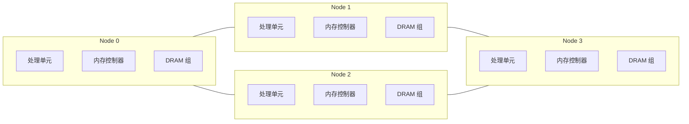

> ▲ 上图根据原文 Figure 6.1 标题和上下文推测绘制，原文为英文截图。标题：NUMA 节点，包含处理器、内存控制器和 DRAM 组

如果我们划分 Java 堆的 Eden 空间，使每个节点都有对应的区域，并且运行在特定节点上的线程从这些节点分配的区域中进行分配，那么我们将能够实现无跳转访问节点本地内存（前提是调度器不将线程移动到不同的节点）。这就是 NUMA 感知分配器背后的原理——基本上，TLAB 从最近的内存区域分配，从而实现更快的分配。

在对象生命周期的初始阶段，它驻留在专门从其 NUMA 节点分配的 Eden 空间中。一旦部分对象存活下来，或者当对象需要晋升到老年代时，它们可能会在不同节点的线程之间共享。此时，分配以节点交错（node-interleaved）方式进行，这意味着内存块按顺序均匀分布在各个节点上，从 Node 0 到编号最高的节点，直到所有内存空间分配完毕。

图 6.2 展示了 NUMA 感知的 Eden 空间。Thread 0 和 Thread 1 从 Node 0 的 Eden 区域分配内存，因为它们都运行在 Node 0 上。与此同时，Thread 2 从 Node 1 的 Eden 区域分配内存，因为它运行在 Node 1 上。

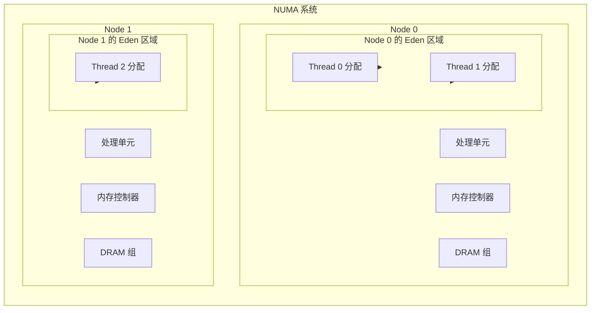

> ▲ 上图根据原文 Figure 6.2 标题和上下文推测绘制，原文为英文截图。标题：NUMA 感知 GC 的内部工作原理

要在 JDK 8 及更高版本中启用 NUMA 感知 GC，请使用以下命令行选项：

```
-XX:+UseNUMA
```

此选项启用 NUMA 感知的内存分配，允许 JVM 为 NUMA 架构优化内存访问。

要检查你的 JVM 是否正在运行 NUMA 感知 GC，可以使用以下命令行选项：

```
-XX:+PrintFlagsFinal
```

此选项输出 JVM 标志的最终值，包括 `UseNUMA` 标志，该标志指示 NUMA 感知 GC 是否已启用。

总之，NUMA 感知分配器旨在通过将 Java 堆的 Eden 空间划分为每个节点的区域，并从最近的内存区域创建 TLAB，来优化 NUMA 架构的内存访问。这可以带来更快的分配和更高的性能。然而，在启用 NUMA 感知 GC 时，务必监控应用程序的性能，因为其影响可能因系统的硬件和软件配置而异。

某些垃圾回收器，如 G1 和 Parallel GC，受益于 NUMA 优化。G1 在 JDK 14 中成为 NUMA 感知[^2]，增强了其在 NUMA 架构上管理大堆的效率。ZGC 是另一种现代垃圾回收器，旨在应对大堆大小、低延迟要求和更好整体性能的挑战。ZGC 在 JDK 15 中成为 NUMA 感知[^3]。在接下来的部分中，我们将深入探讨 G1 和 ZGC 的关键特性与增强，以及它们在现代 Java 应用程序上下文中的性能影响和调优选项。

## 探索垃圾回收改进

随着 Java 应用程序的复杂性不断提高，对高效内存管理和 GC 的需求变得越来越重要。OpenJDK HotSpot VM 中的两个重要垃圾回收器——G1 和 ZGC——旨在提高垃圾回收的性能、可扩展性和可预测性，特别是对于具有大堆大小和严格低延迟要求的应用程序。

本节重点介绍每个垃圾回收器的显著特性，列出从 JDK 11 到 JDK 17 的关键进步和优化。我们将探讨 G1 在混合收集性能、暂停时间可预测性以及更好地适应不同工作负载方面的增强。由于 ZGC 是较新的垃圾回收器，我们还将更深入地探讨其独特能力，例如并发垃圾回收、减少的暂停时间以及其对大堆大小的适用性。通过理解 GC 技术的这些进步，你将获得关于它们对应用程序性能和内存管理影响的宝贵见解，以及在为特定用例选择垃圾回收器时需要考虑的权衡。

### G1垃圾回收器：深入高级堆管理

多年来，GC 的设计发生了显著转变。最初，重点在于面向吞吐量的 GC，旨在最大化内存管理过程的整体效率。然而，随着应用程序复杂性的增加和用户期望的提高，重点已转向面向延迟的 GC。这些 GC 旨在最小化可能中断应用程序性能的暂停时间，即使这意味着整体吞吐量略有降低。G1 是 JDK 11 LTS 及更高版本的默认 GC，是这种向面向延迟 GC 转变的主要例子。在接下来的部分中，我们将审视 G1 GC 的复杂性、其堆管理及其优势。

#### 区域化堆（Regionalized Heap）

G1 将堆划分为多个大小相同的区域（region），允许每个区域动态扮演 Eden、Survivor 或老年代空间的角色。这种灵活性有助于高效的内存管理。

#### 自适应大小（Adaptive Sizing）

- **分代大小（Generational sizing）**：G1 的分代框架辅以其自适应大小能力，允许其根据运行时行为调整年轻代和老年代的大小。这确保了最佳的堆利用率。
- **回收集大小（Collection Set sizing）**：G1 动态选择一组 region 进行收集以满足暂停时间目标。CSet 根据这些 region 包含的垃圾量进行选择，确保高效的空间回收。
- **记忆集粗化（Remembered Set coarsening）**：G1 维护记忆集（Remembered Sets，RSet）以跟踪跨 region 的引用。随着时间的推移，如果这些 RSet 变得过大，G1 可以粗化它们，降低其粒度和开销。

#### 暂停时间可预测性（Pause-Time Predictability）

- **增量收集（Incremental collection）**：G1 将垃圾回收工作分解为更小的块，增量处理这些块以确保暂停时间保持可预测。
- **并发标记增强（Concurrent marking enhancement）**：尽管 CMS 引入了并发标记，但 G1 通过先进的技术（如起始快照标记（snapshot-at-the-beginning，SATB）[^4]）增强了这一阶段。G1 采用多阶段方法，与其基于 region 的堆管理紧密关联，确保最小化中断和高效的空间回收。
- **G1 中的预测（Predictions in G1）**：G1 使用一套复杂的预测机制来优化其性能。这些预测基于 G1 的历史分析，使其能够动态适应应用程序的行为并优化性能：
  - **单 region 复制时间（Single region copy time）**：G1 通过利用过去 evacuation 的历史数据预测复制/回收单个 region 内容所需的时间。此预测对于估计 GC 周期的总暂停时间以及划分混合收集中包含的 region 数量以遵守期望的暂停时间至关重要。
  - **并发标记时间（Concurrent marking time）**：G1 预测完成并发标记阶段所需的时间。这种预见性对于通过动态调整 IHOP（启动堆占用百分比，-XX:InitiatingHeapOccupancyPercent）来安排标记阶段的启动时机至关重要。IHOP 的调整基于老年代占用率和应用程序内存分配行为的实时分析。
  - **混合垃圾回收时间（Mixed garbage collection time）**：G1 预测混合垃圾回收的时间，以策略性地选择一组老年代 region 与年轻代一起收集。此估计帮助 G1 在回收足够的内存空间和遵守暂停时间目标之间保持平衡。
  - **年轻代垃圾回收时间（Young garbage collection time）**：G1 计算仅年轻代收集所需的时间，以指导年轻代的大小调整。G1 基于这些预测调整年轻代的大小，以基于期望目标（-XX:MaxGCPauseTimeMillis）优化暂停时间并适应应用程序不断变化的分配模式。
  - **可回收空间量（Amount of reclaimable space）**：G1 估计通过收集特定老年代 region 将回收的空间。此估计为在混合收集中包含老年代 region 的决策过程提供信息，优化内存利用率，并最小化堆碎片风险。

#### 核心可扩展性（Core Scaling）

G1 的设计天生支持多线程，允许其随可用核心数进行扩展。这具有以下影响：

- **并行的年轻代收集（Parallelized young-generation collections）**：确保快速回收短生命周期对象。
- **并行的老年代收集（Parallelized old-generation collections）**：提高老年代空间回收的效率。
- **标记阶段的并发线程（Concurrent threads during the marking phase）**：加速存活对象的识别。

#### 开创性特性（Pioneering Features）

除了区域化堆和自适应大小之外，G1 还引入了其他几个特性：

- **大对象处理（Humongous objects handling）**：G1 对跨多个 region 的大对象有专门的处理，确保它们不会导致碎片化或延长暂停时间。
- **自适应阈值调优（Adaptive threshold tuning，IHOP）**：如前所述，G1 基于运行时指标动态调整并发标记阶段的启动阈值。此调优特别关注 IHOP 的动态调整，以确定开始并发标记阶段的正确时机。

本质上，G1 是创新技术和自适应策略的结晶，确保高效内存管理的同时提供可预测的响应性。

#### 区域化堆的优势

在 G1 中，将堆划分为 region 创建了比传统分代方法更灵活的收集单元。这些 region 作为 G1 的工作单元（Unit of Work，UoW），使其预测逻辑能够根据需要通过添加或移除 region 来为每个 GC 周期高效定制回收集。通过调整包含在回收集中的 region，G1 可以动态响应应用程序当前的內存使用模式。

区域化堆促进了增量压缩（incremental compaction），使回收集能够包含所有年轻代 region 和至少一个老年代 region。这是对传统整体式老年代收集（例如 Parallel GC 中的 Full GC 或 CMS 的后备 Full GC）的重大改进，后者适应性和效率较低。

#### 传统与区域化Java堆布局

为了更好地理解区域化堆的优势，让我们将其与传统 Java 堆布局进行比较。在传统 Java 堆中（如图 6.3 所示），有为年轻代和老年代指定的独立区域。相比之下，区域化 Java 堆布局（如图 6.4 所示）将堆划分为 region，这些 region 可以归类为空闲（free）或已占用（occupied）。当年轻代 region 被释放回空闲列表时，可以根据晋升需求将其回收为老年代 region。这种非连续的分代结构，加上根据需要调整各代大小的灵活性，使 G1 的预测逻辑能够实现其响应性服务级别目标（SLO）。

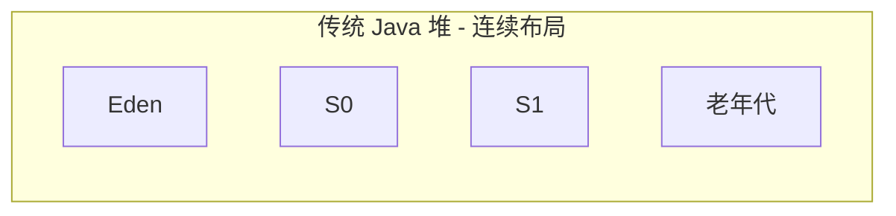

> ▲ 上图根据原文 Figure 6.3 标题和上下文推测绘制，原文为英文截图。标题：传统 Java 堆布局

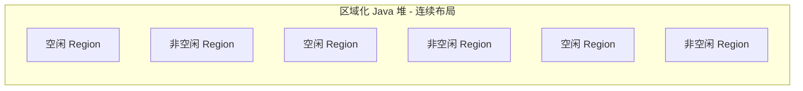

> ▲ 上图根据原文 Figure 6.4 标题和上下文推测绘制，原文为英文截图。标题：区域化 Java 堆布局

#### 区域化Java堆布局的关键方面

G1 的一个重要方面是引入了大对象（humongous objects）。如果一个对象占用单个 G1 region 的 50% 或更多，则被视为大对象（图 6.5）。G1 处理大对象分配的方式与常规对象不同。大对象不遵循快速路径（TLAB）分配，而是直接从老年代分配到指定的大对象 region（humongous region）中。如果大对象跨越超过一个 region 大小，它将需要连续的 region。（关于大对象 region 和大对象的更多信息，请参考《Java Performance Companion》[^5]。）

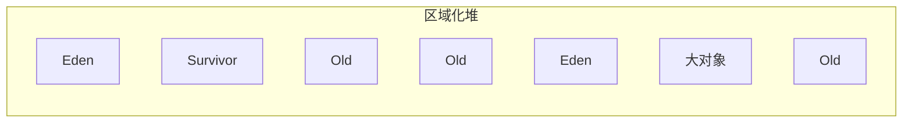

> ▲ 上图根据原文 Figure 6.5 标题和上下文推测绘制，原文为英文截图。标题：区域化堆，显示老年代、大对象和年轻代 Region

#### 区域化堆中的可扩展性与响应性平衡

区域化堆旨在增强可扩展性，同时维持目标响应性和暂停时间。然而，命令行选项 `-XX:MaxGCPauseMillis` 只为 G1 提供了软实时目标。尽管预测逻辑努力满足要求的目标，但当暂停时间目标达到时，收集暂停不会硬性停止。如果你的应用程序由于分配（速率）峰值或突变率增加而经历高 GC 尾部延迟，并且预测逻辑难以跟上，你可能无法始终满足响应性 SLO。在这种情况下，可能需要手动 GC 调优（在下一节中介绍）。

> **注**：突变率（mutation rate）是应用程序更新引用的速率。

> **注**：尾部延迟（tail latency）指最终用户经历的最慢响应时间。这些延迟可能会显著影响延迟敏感型应用的用户体验，通常由延迟分布的高百分位数（例如 4-9s、5-9s 百分位数）表示。

### 优化G1参数以实现峰值性能

在大多数情况下，当应用程序遵循可预测的模式（包括预热/斜坡上升阶段、稳态和冷却/斜坡下降阶段）时，G1 的自动调优和预测逻辑能有效工作。然而，当分配速率出现多个峰值时（尤其是这些峰值由突发性、瞬时性的大对象分配导致时），挑战可能出现。这种情况可能导致老年代的过早晋升，并需要容纳老年代中的瞬时大对象/region。这些因素可能破坏预测逻辑，并对标记和混合收集周期施加过大压力。在恢复发生之前，应用程序可能遇到因晋升空间不足或碎片导致的大对象缺乏连续 region 而导致的 evacuation 失败。在这些情况下，干预——无论是手动的还是通过自动化/AI 系统——变得必要。

G1 的区域化堆、回收集和增量收集提供了许多用于调整内部阈值的旋钮，并在需要时支持有针对性的调优。为了做出关于修改这些参数的明智决策，理解这些调优旋钮及其对 G1 自适应调节（ergonomics）的潜在影响至关重要。

#### 优化JDK 11及更高版本的GC暂停响应性

为了有效调优 G1，分析从 GC 日志文件获取的暂停直方图可以提供关于应用程序性能的宝贵见解。考虑来自 JDK 11 GC 日志文件的暂停时间序列图，如图 6.6 所示。此图揭示了以下 GC 暂停：

- 4 次年轻代 GC 暂停，然后是……
- 当 IHOP 阈值被跨越时的 1 次初始标记暂停
- 接下来，在并发标记阶段期间的 1 次年轻代 GC 暂停……
- 然后是 1 次 remark 暂停和 1 次 cleanup 暂停
- 最后，在 7 次混合 GC 之前还有 1 次年轻代 GC 暂停，用于增量回收老年代空间

假设系统有一个要求 100% 的 GC 暂停时间小于或等于 100 毫秒的 SLO，那么很明显最后一次混合收集未满足此要求。这种一次性暂停可能可以通过 JDK 12 中引入的可中止混合收集（abortable mixed collection）特性来缓解——我们稍后将讨论这一点。然而，在自动优化不足或不适用的场景下，手动调优变得必要（图 6.7）。

> **图 6.6**：G1 垃圾回收器的暂停时间直方图 —— 一幅暂停时间序列图，显示年轻代 GC、初始标记、remark、cleanup 和混合 GC 暂停。

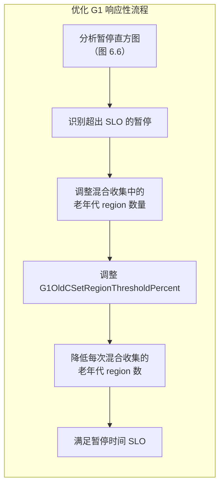

> ▲ 上图根据原文 Figure 6.7 标题和上下文推测绘制，原文为英文截图。标题：优化 G1 响应性

两个阈值有助于控制混合收集中包含的老年代 region 数量：

- 混合收集中包含的最大老年代 region 数量设置：`-XX:G1OldCSetRegionThresholdPercent=<p>`
- 混合回收集中的最小老年代 region 数量：`-XX:G1MixedGCCountTarget=<n>`

这两个可调参数帮助确定有多少老年代 region 被添加到年轻代 region 中，从而形成混合回收集。调整这些值可以改善暂停时间，确保 SLO 合规。

在我们的示例中，如暂停事件时间线所示（图 6.6），大多数年轻代收集和混合收集都在 SLO 要求以下，除了最后一次混合收集。一个简单的解决方案是通过以下命令行选项减少混合回收集包含的最大老年代 region 数量：

```
-XX:G1OldCSetRegionThresholdPercent=<p>
```

其中 p 是总 Java 堆的百分比。例如，堆大小为 1 GB 且默认值为 10%（即 `-Xmx1G -Xms1G -XX:G1OldCSetRegionThresholdPercent=10`）时，添加到回收集的老年代 region 计数将是 1 GB 的 10%（向上取整），因此我们得到 103 个。将百分比降低到 7%，最大计数降至 72，这将足以使最后一次混合收集暂停处于可接受的 GC 响应时间 SLO 内。然而，仅此更改可能会增加混合收集的总次数，这可能是一个问题。

#### G1响应性增强的实际应用

随着 JDK 版本的进步，G1 引入了若干新特性和增强。这些特性在正确使用时，可以显著提高应用程序的响应性和性能，而无需进行大量调优。虽然官方文档提供了这些特性的全面概述，但理解其实际应用具有巨大价值。以下是将现场经验转化为实际性能增益的方式：

- **并行化引用处理（JDK 11）**：考虑一个使用 `SoftReference` 对象缓存产品图片的电商平台。在高流量销售活动期间，引用数量激增。并行引用处理能力使系统在重负载下保持敏捷，即使在流量峰值时也能保持流畅的用户体验。
- **可中止混合收集（JDK 12）**：设想一个在激烈游戏过程中服务于数千名并发在线玩家的实时多人游戏服务器。该服务器具有中等生命周期（瞬时）数据（玩家、游戏对象）。在这里，具有低尾部延迟的实时约束是主导性的 SLO 要求。可中止混合收集的引入确保即使游戏内操作以疯狂的速度生成瞬时数据，游戏也能保持流畅。
- **及时返回未使用的已提交内存（JDK 12）**：一个基于云的视频渲染服务（执行 3D 场景的后期制作）经常处于空闲状态。G1 可以基于系统负载更快速地将未使用的已提交内存返回给操作系统。凭借此能力，该服务可以优化资源利用，从而确保同一服务器上的其他应用在需要时能访问内存，进而带来云托管成本的节约。为进一步微调此行为，可以使用两个 G1 调优选项：
  - **G1PeriodicGCInterval**：该选项指定触发周期性 GC 周期的间隔（以毫秒为单位）。通过设置此选项，你可以控制 G1 检查并可能将未使用内存返回给 OS 的频率。默认值为 0，这意味着周期性 GC 周期默认是禁用的。
  - **G1PeriodicGCSystemLoadThreshold**：该选项设置系统负载阈值。如果系统负载低于此阈值，即使尚未达到 `G1PeriodicGCInterval`，也会触发周期性 GC 周期。此选项在系统未处于高负载且更积极地回收内存有益的场景中特别有用。默认值为 0，意味着系统负载阈值检查被禁用。
  > **警告**：尽管这些调优选项提供了对内存回收的更好控制，但务必谨慎行事。过于激进的设置可能导致频繁且不必要的 GC 周期，这可能对应用程序性能产生负面影响。在进行更改后始终监控系统行为，并相应调整，以在内存回收和应用程序性能之间取得平衡。

- **改进的并发标记终止（JDK 13）**：想象一个处理数十亿市场信号以获取实时交易洞察的全球金融分析平台。JDK 13 中改进的并发标记终止可以显著缩短 GC 暂停时间，确保大批量数据分析和报告不受中断，从而为交易者提供一致、及时的市场情报。
- **G1 NUMA 感知（JDK 14）**：设想一个执行复杂模拟的高性能计算（HPC）环境。借助 G1 的 NUMA 感知能力，JVM 针对多插槽系统进行了优化，带来 GC 暂停时间和整体应用程序性能的显著改善。对于每毫秒都至关重要的 HPC 工作负载，这意味着更快的计算和更高效的硬件资源使用。
- **改进的并发细化（JDK 15）**：考虑一个企业搜索引擎必须处理跨海量索引的数百万个查询的场景。JDK 15 中改进的并发细化减少了将生成的日志缓冲区条目数量，这转化为更短的 GC 暂停。这种细化允许快速的查询处理，对于维护用户对现代搜索引擎期望的响应性至关重要。
- **改进的堆管理（JDK 17）**：考虑一个汇总来自数百万台设备数据的大规模物联网（IoT）平台。JDK 17 中 G1 增强的堆管理可以更高效地分配堆 region，从而最小化 GC 暂停时间并提高应用程序吞吐量。对于物联网生态系统，这转化为更快的数据摄取和处理，实现对关键传感器数据的实时响应。

在这些增强的基础上，G1 还包含进一步改善响应性和效率的其他优化：

- **优化 evacuation（Optimizing evacuation）**：此优化简化了 evacuation 过程，可能减少 GC 暂停时间。在快速响应时间至关重要的交易型应用中，如金融处理或实时数据分析，优化 evacuation 可以确保更快的交易处理。这使系统即使在高负载下也能保持响应性。
- **即时构建记忆集（Building remembered sets on the fly）**：通过在标记周期中构建记忆集，G1 最小化了 remark 阶段花费的时间。这对于具有海量数据集的系统（如大数据分析平台）可能特别有益，更快的 remark 阶段可以缩短处理时间。
- **记忆集扫描改进（Improvements in remembered sets scanning）**：这些改进有助于缩短 GC 暂停时间——对于直播服务等需要不间断数据流的应用来说是一个重要考虑因素。
- **减少屏障开销（Reduce barrier overhead）**：降低与屏障相关的开销可以缩短 GC 暂停时间。此增强在基于云的 SaaS 应用中很有价值，在这些应用中，效率直接转化为降低的运营成本。
- **自适应 IHOP（Adaptive IHOP）**：此特性允许 G1 基于当前的应用程序行为自适应调整 IHOP 值。例如，在动态内容交付网络中，自适应 IHOP 可以通过在不同流量负载下高效管理内存来提高响应性。

通过理解这些增强和可用的调优选项，你可以更好地优化 G1 以满足特定应用程序的响应性要求。仔细地实施这些改进可以带来显著的性能提升，确保你的 Java 应用程序在广泛条件下保持高效和响应迅速。

### 优化JDK 11及更高版本的GC暂停频率与开销

满足需要特定吞吐量目标和最小 GC 开销的严格 SLO 对许多应用程序至关重要。例如，SLO 可能规定 GC 开销不得超过总执行时间的 5%。暂停时间直方图的分析可能揭示应用程序由于频繁的混合 GC 暂停而难以满足 SLO 的吞吐量要求，导致过度的 GC 开销。应对这一挑战涉及 G1 的策略性调优以提高其效率。方法如下：

- **策略性地排除昂贵的 region**：通过省略高开销的老年代 region 来定制混合回收集。此操作在接受一些未收集垃圾（即"堆浪费"）的同时，确保堆容纳活跃数据、瞬时对象、大对象以及额外的浪费空间。可能需要增加总 Java 堆大小来实现这一目标。
- **设置活跃数据阈值**：利用 `-XX:G1MixedGCLiveThresholdPercent=<p>` 基于每个老年代 region 中活跃数据的百分比确定其截止值。超过此阈值的 region 不包含在混合回收集以避免高成本的收集周期。
- **堆浪费管理**：应用 `-XX:G1HeapWastePercent=<p>` 以允许总堆的一定百分比保持未收集（即"浪费"）。此策略针对标记阶段建立的已排序数组末尾的高成本 region。

图 6.8 展示了这一过程的概述。

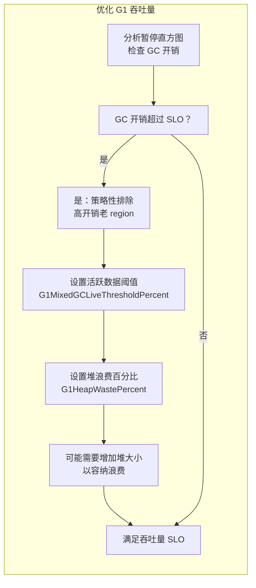

> ▲ 上图根据原文 Figure 6.8 标题和上下文推测绘制，原文为英文截图。标题：优化 G1 的吞吐量

#### G1吞吐量优化的实际应用

自 Java 11 以来，G1 经历了一系列改进和优化，包括自适应大小和阈值的引入，可以帮助优化其使用以满足特定应用程序的吞吐量需求。这些增强可能减少为降低开销而进行微调的需求，因为它们可以带来更高效的内存使用，从而提高应用程序性能。让我们来看一下这些更新：

- **急切回收大对象（Eager reclaim of humongous objects，JDK 11）**：在社交媒体分析应用中，代表用户交互的大型数据集被频繁处理。急切回收大对象的能力防止了堆耗尽，并使分析工作流程保持流畅，特别是在高流量事件（如病毒式营销活动）期间。
- **改进的 G1MixedGCCountTarget 和可中止混合收集（JDK 12）**：考虑股票交易应用中的高容量交易系统。通过微调混合 GC 的数量并允许可中止收集，G1 帮助在市场飙升期间保持一致的吞吐量，确保交易者经历最小的延迟。
- **自适应堆大小（JDK 15）**：基于云的服务，如文档存储和协作平台，在一天中经历不同的负载。自适应堆大小确保在低活动期间，系统最小化资源使用，降低运营成本，同时在高负载期间仍提供高吞吐量。
- **并发大对象分配和年轻代大小改进（JDK 17）**：在大规模物联网数据处理服务中，大对象的并发分配允许更高效地处理传入的传感器数据流。改进的年轻代大小动态调整以适应工作负载，防止潜在瓶颈并确保实时分析的稳定吞吐量。

除了这些增强，以下优化也有助于提高 G1 GC 的吞吐量：

- **记忆集空间减少（Remembered sets space reductions）**：在数据库管理系统中，减少记忆集的空间意味着更多内存可用于缓存查询结果，从而为数据库操作带来更快的响应时间和更高的吞吐量。
- **惰性线程和记忆集初始化（Lazy threads and remembered sets initialization）**：对于点播视频流服务，惰性初始化允许根据用户需求快速扩展资源，最小化启动延迟并提高观众满意度。
- **在 remark 时取消提交（Uncommit at remark）**：云平台可以通过在非高峰时段动态缩减资源分配来受益于此特性，优化成本效益而不牺牲吞吐量。
- **NVDIMM 上的老年代（Old generation on NVDIMM）**：通过将老年代放置在非易失性 DIMM（NVDIMM）上，G1 可以实现更快的访问时间和更好的性能。这可以更有效地利用可用内存，从而提高吞吐量。
- **动态 GC 线程与更小的每线程堆大小（Dynamic GC threads with a smaller heap size per thread）**：在容器化环境中运行的微服务可以利用动态 GC 线程来优化资源使用。通过更小的每线程堆大小，GC 可以适应每个微服务的特定需求，从而实现更高效的内存管理和改进的服务响应时间。
- **周期性 GC（Periodic GC）**：对于处理连续数据流的物联网平台，周期性垃圾回收可以通过定期清理未使用的对象来帮助维护一致的应用程序状态。此策略可以减少与垃圾回收周期相关的延迟，确保对时间敏感的物联网操作进行及时的数据处理和决策。

通过理解这些增强和可用的调优选项，你可以更好地优化 G1 以满足特定应用程序的吞吐量要求。

#### 调优标记阈值

如前所述，Java 9 引入了自适应标记阈值，即 IHOP。此特性应该使大多数应用程序受益。然而，某些病态情况，如短生命周期（可能为大对象）的突发分配（常在构建短生命周期事务缓存时出现），可能导致次优行为。在这种情况下，较低的自适应 IHOP 可能导致过早的并发标记阶段，该阶段完成后未触发所需的混合收集——特别是如果突发分配随后发生。或者，较高且未能快速降低的自适应 IHOP 可能延迟并发标记阶段的启动，导致定期的 evacuation 失败。

要解决这些问题，你可以禁用自适应标记阈值并将其设置为稳定值，方法是在命令行中添加以下选项：

```
-XX:-G1UseAdaptiveIHOP -XX:InitiatingHeapOccupancyPercent=<p>
```

其中 p 是总堆的占用百分比，你希望在此处开始标记周期。

在图 6.9 中，在约 486.4 秒处的混合 GC 暂停之后，有一个年轻代 GC 暂停，然后是标记周期的开始（年轻代 GC 暂停之后的线条是初始标记暂停）。在初始标记暂停之后，我们观察到 23 次年轻代 GC 暂停、一次"to"空间耗尽暂停，最后是一次 Full GC 暂停。这种模式——混合收集周期刚刚完成，新的并发标记周期开始但无法完成，同时年轻代大小正在减小（因此有年轻代收集）——表明自适应标记阈值存在问题。阈值可能过高，将标记周期延迟到需要背靠背并发标记和混合收集周期的程度，或者由于并发标记线程数量不足无法跟上工作负载，并发周期可能需要太长时间才能完成。

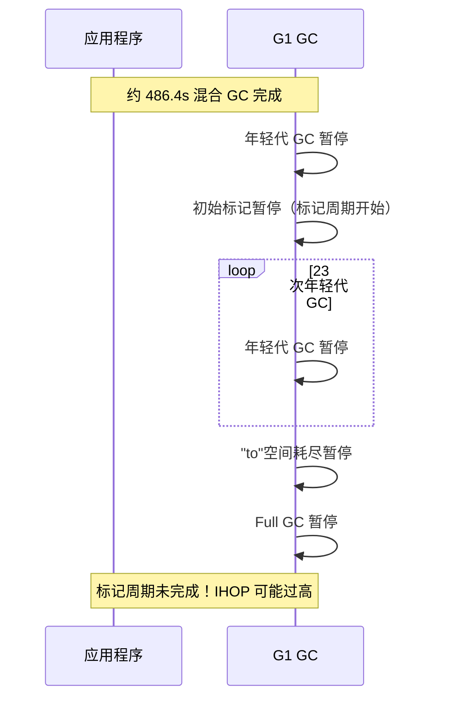

> ▲ 上图根据原文 Figure 6.9 标题和上下文推测绘制，原文为英文截图。标题：G1 垃圾回收器暂停时间线，显示未完成的标记周期

在这种情况下，你可以将 IHOP 值稳定在较低水平，以容纳静态和瞬时活跃数据集大小（LDS）（以及大对象），并通过将 n 设置为更高的值来增加并发线程数：`-XX:ConcGCThreads=<n>`。n 的默认值是可用的并行（STW）GC 活动线程数的四分之一。

G1 代表了 Java 生态系统中 GC 演进的一个重要里程碑。它引入了区域化堆，并允许用户指定实际的暂停时间目标和最大化期望的堆大小。G1 预测每次收集（年轻代和混合）的 region 总数以满足目标暂停时间。然而，实际暂停时间可能仍会因数据结构密度、所收集 region 中 region 或对象的流行度以及每个 region 中活跃数据量等因素而变化。这种变异性使得应用程序难以满足已定义的 SLO，并产生了对近乎实时、可预测、可扩展且低延迟垃圾回收器的需求。

## Z垃圾回收器：面向多TB堆的可扩展低延迟GC

为满足应用程序对实时响应性的需求，Z 垃圾回收器（ZGC）被引入，推进了 OpenJDK 的垃圾回收能力。ZGC 将创新概念引入 OpenJDK 世界——其中一些概念在其他回收器（如 Azul 的 C4 收集器[^6]）中有先例。ZGC 的开创性特性包括并发压缩、染色指针（colored pointers）、堆外转发表（off-heap forwarding tables）和加载屏障（load barriers），这些共同增强了性能和可预测性。

ZGC 最初作为实验性回收器在 JDK 11 中引入，并在 JDK 15 中达到生产就绪状态。在 JDK 16 中，启用了并发线程栈处理，使 ZGC 能够保证暂停时间保持在亚毫秒阈值以下，且与 LDS 和堆大小无关。这一进步使 ZGC 能够支持从 8 MB 到高达 16 TB 的广泛堆大小，使其能够满足从轻量级微服务到内存密集型领域（如大数据分析、机器学习和图形渲染）等各种应用的需求。

在本节中，我们将了解 ZGC 的一些核心概念，这些概念使该回收器能够实现超低暂停和高可预测性。

### ZGC核心概念：染色指针

ZGC 的关键创新之一是其使用染色指针，这是一种元数据标记形式，允许垃圾回收器直接在指针内存储额外信息。这种技术称为虚拟地址映射或标记，在 x86-64 和 aarch64 架构上通过多重映射（multi-mapping）实现。染色指针可以指示对象的状态，例如它是否已知已被标记、是否指向重定位集（relocation set），或者是否仅能通过 Finalizer 访问（图 6.10）。

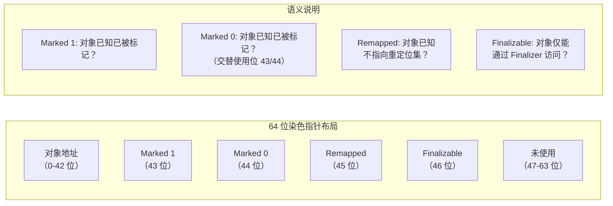

> ▲ 上图根据原文 Figure 6.10 标题和上下文推测绘制，原文为英文截图。标题：染色指针

这些标记指针使 ZGC 能够高效处理并发标记和重定位等复杂任务，而无需暂停应用程序。这带来了整体更短的 GC 暂停时间和更好的应用程序性能，使 ZGC 成为需要低延迟和高吞吐量的应用的有效解决方案。

### ZGC核心概念：利用线程本地握手提高效率

ZGC 在垃圾回收方面的创新方法值得注意，尤其是在它利用线程本地握手（thread-local handshakes）[^7]的方式上。线程本地握手使 JVM 能够在单个线程上执行操作，而无需全局 STW 暂停。这种方法减少了 STW 事件的影响，并有助于 ZGC 提供低暂停时间的能力——这是对延迟敏感的应用程序的关键考虑因素。

ZGC 采用线程本地握手是对传统垃圾回收 STW 技术的重大背离（两者在图 6.11 中进行比较）。本质上，它们使 ZGC 能够适应和扩展收集，从而使其适用于具有更大堆大小和严格延迟要求的应用程序。然而，虽然 ZGC 的并发处理方法优化了低延迟，但它可能对应用程序的最大吞吐量产生影响。ZGC 旨在平衡这些方面，确保吞吐量下降保持在可接受的范围内。

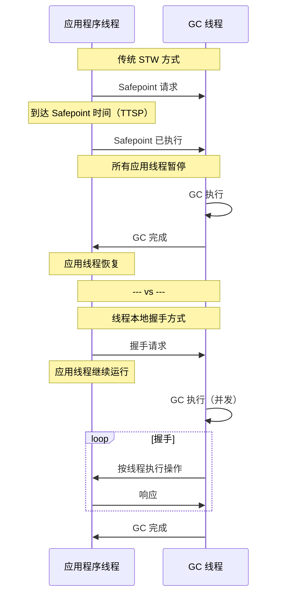

> ▲ 上图根据原文 Figure 6.11 标题和上下文推测绘制，原文为英文截图。标题：线程本地握手 vs 全局 Stop-the-World 事件

### ZGC核心概念：阶段与并发活动

与其他 OpenJDK 垃圾回收器一样，ZGC 是一个追踪回收器，但它的突出之处在于能够同时执行并发标记和压缩。它通过一组专门的阶段、创新的优化技术以及独特的垃圾回收方法，解决了在运行应用中从"from"空间向"to"空间移动存活对象的挑战。

ZGC 通过引入 ZPages——根据内存使用模式动态分配和管理的动态大小 region——细化了 G1 首创的区域化堆概念。region 大小调整的灵活性是 ZGC 优化内存管理和高效适配各种分配速率策略的一部分。

ZGC 还通过采用将堆划分为逻辑条带（logical stripes）的独特方法改进了并发标记阶段。每个 GC 线程在其自己的条带上工作，从而减少了争用和同步开销。这种设计使 ZGC 能够在标记时执行并发并行处理，减少阶段时间并提高整体应用程序性能。

图 6.12 提供了 ZGC 堆组织为逻辑条带的直观表示。条带显示为堆空间内的独立段，编号从 0 到 n。每个条带对应一个 GC 线程——"GC Thread 0"到"GC Thread n"——负责其分配段的垃圾回收职责。

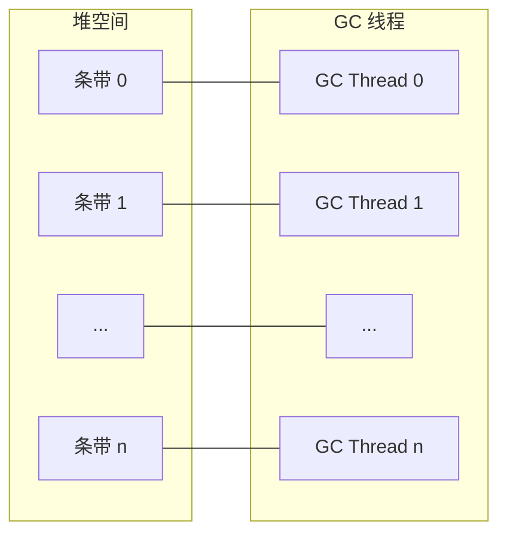

> ▲ 上图根据原文 Figure 6.12 标题和上下文推测绘制，原文为英文截图。标题：ZGC 逻辑条带

现在让我们来看 ZGC 的阶段和并发活动：

1. **STW 初始标记（Pause Mark Start）**：ZGC 通过一个短暂的暂停来标记根对象，启动并发标记周期。最近的优化（如将线程栈扫描移至并发阶段）已减少了此 STW 阶段的持续时间。
2. **并发标记/重映射（Concurrent Mark/Remap）**：在此阶段，ZGC 追踪应用程序的存活对象图并标记非根对象。它使用加载屏障来帮助加载未标记的对象指针。同时执行并发引用处理，并使用线程本地握手。
3. **STW 最终标记（Pause Mark End）**：ZGC 执行一个快速暂停以完成在并发阶段正在进行中的对象的标记。此阶段的持续时间被严格控制以最小化暂停时间。从 JDK 16 开始，标记工作量上限为 200 微秒。如果标记工作超过此时间限制，ZGC 将并发继续标记，并将再次尝试"pause mark end"活动，直到所有工作完成。
4. **并发准备重定位（Concurrent Prepare for Relocation）**：在此阶段，ZGC 识别将形成收集/重定位集的 region。它还处理弱根和非强引用，并执行类卸载。
5. **STW 重定位（Pause Relocate Start）**：在此阶段，ZGC 完成卸载任何剩余的元数据和 nmethod[^8]。然后通过设置必要的数据结构（包括使用重映射掩码）为对象重定位做准备。此掩码是 ZGC 指针转发机制的一部分，确保对重定位对象的任何引用都被更新为指向其新位置。应用线程短暂暂停，以捕获收集/重定位集中的根。
6. **并发重定位（Concurrent Relocate）**：ZGC 并发执行实际的重定位工作，将存活对象从"from"空间移动到"to"空间。此阶段可以采用称为自愈（self-healing）的技术，其中应用线程自身在遇到需要重定位的对象时协助重定位过程。这种方法减少了 STW 暂停期间需要完成的工作量，从而缩短 GC 暂停时间并提高应用程序性能。

图 6.13 描绘了垃圾回收过程中 Java 应用线程与 ZGC 后台线程之间的交互。宽水平箭头代表应用程序执行随时间的连续性，Java 应用线程持续运行。垂直条代表 STW 暂停，应用程序线程在此期间短暂暂停以允许某些 GC 活动进行。

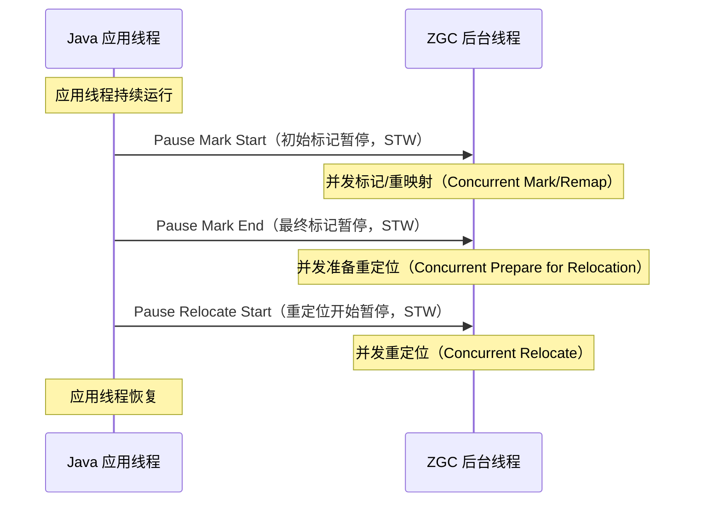

> ▲ 上图根据原文 Figure 6.13 标题和上下文推测绘制，原文为英文截图。标题：ZGC 阶段与并发活动

在应用线程时间线下方是一条虚线，代表 GC 后台线程的持续活动。这些线程与应用线程并发运行，执行标记、重映射和重定位对象等垃圾回收任务。

在图 6.13 中，STW 暂停短且不频繁，反映了 ZGC 最小化其对应用延迟影响的设计目标。这些暂停之间的间隔代表并发垃圾回收活动阶段，在此期间 ZGC 与正在运行的应用并行工作而不中断它。

### ZGC核心概念：堆外转发表

ZGC 引入了堆外转发表（off-heap forwarding tables）——即存储重定位对象新位置的数据结构。通过将这些表分配在堆空间之外，ZGC 确保转发表使用的内存不会影响应用程序的可用堆空间。这允许立即归还和重用虚拟和物理内存，从而实现更高效的内存使用。此外，堆外转发表使 ZGC 能够处理更大的堆大小，因为转发表的大小不受堆大小的限制。

图 6.14 是堆外转发表的图示表示。在此图中：

- 存活对象驻留在堆内存中。
- 这些存活对象被重定位，它们的新位置记录在转发表中。
- 转发表分配在堆外内存中。
- 重定位后的对象现在位于其新位置，可以被应用线程访问。

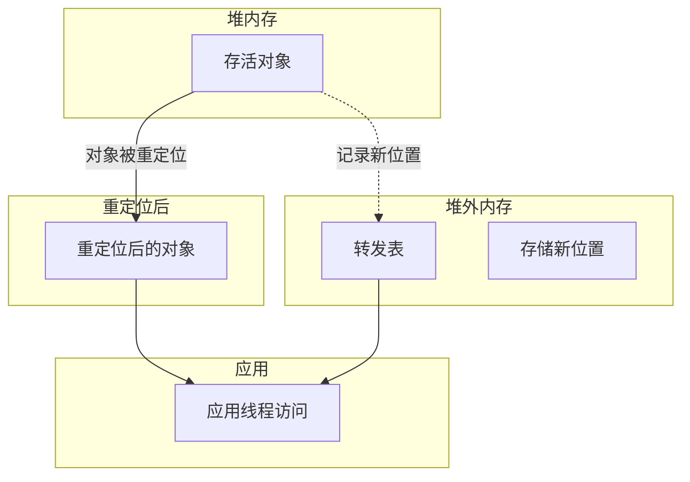

> ▲ 上图根据原文 Figure 6.14 标题和上下文推测绘制，原文为英文截图。标题：ZGC 的堆外转发表

### ZGC核心概念：ZPages

ZPage 是堆内的一块连续内存块，旨在优化内存管理和 GC 过程。它可以有三种不同的尺寸——小（small）、中（medium）和大（large）[^9]。这些页面的确切大小可能因 JVM 配置和运行平台而异。以下是一个简要概述：

- **小页面（Small pages）**：通常用于小对象分配。可以存在多个小页面，每个页面可以独立管理。
- **中页面（Medium pages）**：比小页面大，用于中等大小的对象分配。
- **大页面（Large pages）**：为大对象分配保留。大页面通常用于太大而无法放入小或中页面的对象。在大页面中分配的对象占据整个页面。

图 6.15 和 6.16 显示了基准测试中 ZPages 的使用情况，突出了每种页面类型的频率和容量。图 6.15 显示小页面占主导地位，图 6.16 是同一图的放大版本，聚焦于中和大页面类型。

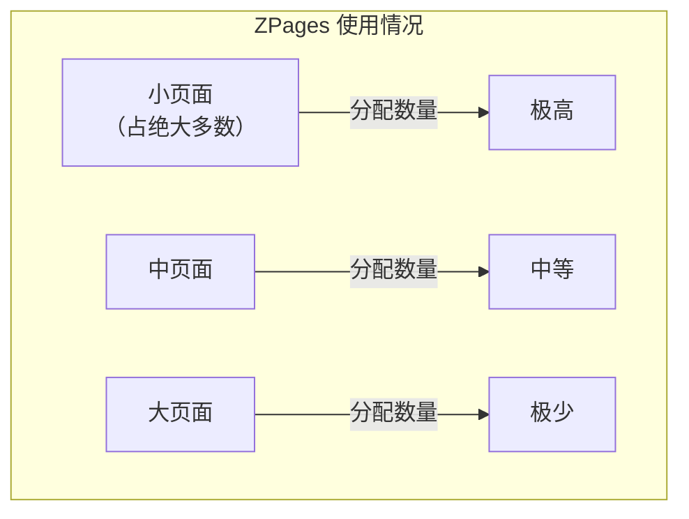

> ▲ 上图根据原文 Figure 6.15 标题和上下文推测绘制，原文为英文截图。标题：页面大小随时间的使用情况

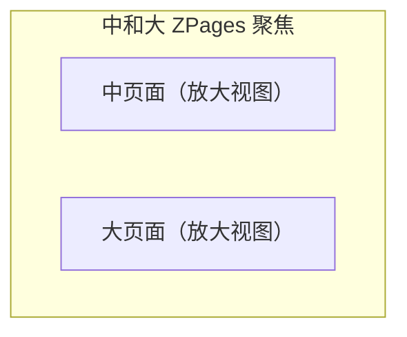

> ▲ 上图根据原文 Figure 6.16 标题和上下文推测绘制，原文为英文截图。标题：中和大 ZPages 随时间的变化

#### 目的与功能

ZGC 使用页面来促进其多线程、并发且基于 region 的垃圾回收方法。

- **Region 跨越（Region spanning）**：单个 ZPage（例如，大的 ZPage）可以覆盖多个 region。当 ZGC 分配一个 ZPage 时，它会将该 ZPage 跨越的对应 region 标记为该 ZPage 正在使用。
- **重定位（Relocation）**：在重定位阶段，存活对象从一个 ZPage 移动到另一个 ZPage。这些对象之前在源 ZPage 中占用的 region 随后可用于未来的分配。
- **并发性（Concurrency）**：ZPages 使 ZGC 能够并发操作不同的页面，增强可扩展性并最小化暂停时间。
- **动态特性（Dynamic nature）**：虽然 region 的大小是固定的，但 ZPages 是动态的。它们可以根据分配请求的大小跨越多个 region。

#### 分配与重定位

ZPage 的大小根据分配需求选择，可以是小、中或大页面。选定的 ZPage 随后将覆盖必要数量的固定大小 region 以容纳其大小。在 GC 周期期间，存活对象可能从一个页面重定位到另一个页面。页面的概念使 ZGC 能够高效地移动对象，并在页面变空时回收整个页面。

#### ZPages的优势

使用页面提供了几个好处：

- **并发重定位（Concurrent relocation）**：由于对象被分组到页面中，ZGC 可以并发地重定位整个页面的内容。
- **高效的内存管理（Efficient memory management）**：空页面可以快速回收，内存碎片问题得以减少。
- **可扩展性（Scalability）**：ZGC 的多线程特性可以高效处理多个页面，使其对具有大堆的应用具有可扩展性。
- **页面元数据（Page metadata）**：每个 ZPage 都有关联的元数据，跟踪其大小、占用率、状态（是用于对象分配还是重定位等）等信息。

本质上，ZPages 和 region 是 ZGC 中协同工作的基本概念。ZPages 提供了对象存储的实际内存区域，而 region 为 ZGC 提供了高效跟踪、分配和回收内存的机制。

### ZGC自适应优化：触发ZGC周期

在现代应用中，内存管理变得更加动态，这使得拥有能够实时适应的 GC 变得至关重要。ZGC 证明了这一需求，提供了一系列自适应触发器来启动其垃圾回收周期。这些触发器可能包括定时器、预热、高分配速率、分配停滞、主动触发和高利用率，旨在满足当代应用的动态内存需求。对于应用程序开发人员和系统管理员来说，理解这些触发器不仅有益——更是必要的。理解它们的细微差别可以带来更好的 ZGC 管理和调优，确保应用程序始终满足其性能和延迟基准。

#### 基于定时器的垃圾回收

ZGC 可以配置为基于定时器触发 GC 周期。这种基于定时器的方法确保垃圾回收以可预测的间隔发生，提供内存管理上的一致性水平。

- **机制**：当指定的定时器持续时间过去且在此期间没有其他垃圾回收被启动时，ZGC 周期自动触发。
- **用法**：
  - **设置定时器**：可以使用 JVM 选项 `-XX:ZCollectionInterval=<value-in-seconds>` 指定此定时器的间隔。
    - `-XX:ZCollectionInterval=0.01`：配置 ZGC 每 10 毫秒检查一次垃圾回收。
    - `-XX:ZCollectionInterval=3`：将间隔设置为 3 秒。
  - **默认行为**：默认情况下，`ZCollectionInterval` 的值设置为 0。这意味着基于定时器的触发机制已关闭，ZGC 不会仅基于时间启动垃圾回收。
- **示例日志**：当 ZGC 基于此定时器运行时，日志将类似于以下输出：
  ```
  [21.374s][info][gc,start] GC(7) Garbage Collection (Timer)
  [21.374s][info][gc,task] GC(7) Using 4 workers
  ...
  [22.031s][info][gc] GC(7) Garbage Collection (Timer) 1480M(14%)->1434M(14%)
  ```
  这些日志表明一个 GC 周期因定时器而触发，并提供了关于此周期期间回收的内存的详细信息。
- **注意事项**：基于定时器的方法虽然提供了可预测性，但应审慎使用。理解 ZGC 的自适应触发器至关重要。基于定时器的收集应理想情况下作为补充策略——一种定期的"清理"以使 ZGC 达到已知状态。此方法对于刷新类或处理引用等任务特别有益，因为 ZGC 周期可以处理并发的类卸载和引用处理。

#### 基于预热的GC

ZGC 周期可以在应用程序的预热阶段触发。这在应用程序尚未达到其完全运行负载的斜坡上升阶段尤其有益。在此阶段触发 ZGC 周期的决策受堆占用率的影响。

- **机制**：在应用程序的斜坡上升阶段，ZGC 监控堆占用率。当堆占用率达到 10%、20% 或 30% 的阈值时，ZGC 触发一个预热周期。这可以视为对 GC 进行预热，为其准备应对应用程序典型内存模式。如果堆使用率超过某个阈值且未启动其他垃圾回收，则触发 ZGC 周期。此机制允许系统收集 GC 持续时间的早期样本，可供其他规则使用。
- **用法**：ZGC 的阈值 `soft_max_capacity` 决定了它旨在维持的最大堆占用率[^10]。对于预热型 GC 周期，ZGC 在 `soft_max_capacity` 的 10%、20% 和 30% 处检查堆占用率，前提是未启动其他垃圾回收。为了影响这些预热周期，最终用户可以调整 `-XX:SoftMaxHeapSize=<size>` 命令行选项。
- **示例日志**：当 ZGC 基于此规则运行时，日志将类似于以下输出：
  ```
  [7.171s][info][gc,start] GC(2) Garbage Collection (Warmup)
  [7.171s][info][gc,task] GC(2) Using 4 workers
  ...
  [8.842s][info][gc] GC(2) Garbage Collection (Warmup) 2078M(20%)->1448M(14%)
  ```
  从日志中可以明显看出，当堆占用率达到 20% 时触发了预热周期。
- **注意事项**：预热/斜坡上升阶段对应用程序至关重要，尤其是那些在启动期间构建广泛缓存的应用程序。这些缓存在后续事务中被大量使用。通过在预热期间启动 ZGC 周期，应用程序可以确保缓存被高效构建并优化以备将来使用。这确保了当应用程序从预热阶段过渡到处理实际事务时，能更平滑地过渡到一致性能。

#### 基于高分配速率的GC

当应用程序以高速率分配内存时，ZGC 可以启动 GC 周期以释放内存。这防止了应用程序耗尽堆空间。

- **机制**：ZGC 持续监控内存分配速率。基于观察到的分配速率和可用空闲内存，ZGC 估计直到应用程序耗尽内存（OOM）的时间。如果此估计时间小于 GC 周期的预期持续时间，ZGC 触发一个周期。
  ZGC 可以根据 `UseDynamicNumberOfGCThreads` 设置工作在两种模式下：
  - **动态 GC 工作线程（Dynamic GC workers）**：在此模式下，ZGC 动态计算避免 OOM 所需的 GC 工作线程数。它考虑当前分配速率、分配速率的方差以及 GC 串行和并行阶段的平均时间等因素。
  - **静态 GC 工作线程（Static GC workers）**：在此模式下，ZGC 使用固定数量的 GC 工作线程（`ConcGCThreads`）。它基于采样分配速率的移动平均值估计直到 OOM 的时间，并针对未预见的分配峰值设置了安全余量。安全余量（"headroom"）计算为所有工作线程分配一个小 ZPage 所需的空间以及所有工作线程共享一个中 ZPage 所需的空间。
- **用法**：调整 `UseDynamicNumberOfGCThreads` 设置和 `-XX:SoftMaxHeapSize=<size>` 命令行选项，以及可能调整 `-XX:ConcGCThreads=<number>`，可以针对特定应用需求微调垃圾回收行为。
- **示例日志**：以下日志提供了由于高分配速率触发 GC 周期的洞察：
  ```
  [221.876s][info][gc,start] GC(12) Garbage Collection (Allocation Rate)
  [221.876s][info][gc,task] GC(12) Using 3 workers
  ...
  [224.073s][info][gc] GC(12) Garbage Collection (Allocation Rate) 5778M(56%)->2814M(27%)
  ```
  从日志中可以明显看出，由于高分配速率启动了 GC，并将堆占用率从 56% 降低到 27%。

#### 基于分配停滞的GC

当应用程序因空间不足无法分配内存时，ZGC 将触发一个周期以释放内存。此机制确保应用程序不会因内存耗尽而停滞或崩溃。

- **机制**：ZGC 持续监控内存分配尝试。如果分配请求无法满足，因为堆没有足够的空闲内存且自上次 GC 周期以来已观察到分配停滞，ZGC 启动一个 GC 周期。这是一种响应式方法，确保及时释放内存以防止应用程序停滞。
- **用法**：此触发器是 ZGC 设计固有的，不需要显式配置。然而，监控和理解此类触发器的频率可以提供关于应用程序内存使用模式和潜在优化的洞察。
- **示例日志**：
  ```
  ...
  [265.354s][info][gc] Allocation Stall (<thread-info>) 1554.773ms
  [265.354s][info][gc] Allocation Stall (<thread-info>) 1550.993ms
  ...
  ...
  [270.476s][info][gc,start] GC(19) Garbage Collection (Allocation Stall)
  [270.476s][info][gc,ref] GC(19) Clearing All SoftReferences
  [270.476s][info][gc,task] GC(19) Using 4 workers
  ...
  [275.112s][info][gc] GC(19) Garbage Collection (Allocation Stall) 7814M(76%)->2580M(25%)
  ```
  从日志中可以明显看出，由于分配停滞启动了 GC，并将堆占用率从 76% 降低到 25%。
- **注意事项**：频繁的分配停滞可能表明应用程序接近其内存限制或存在偶发性内存使用峰值。必须监控此类情况，并考虑增加堆大小或优化应用程序的内存使用。

#### 基于高使用率的GC

如果堆利用率高，可以触发 ZGC 周期以释放内存。这是在由于高分配速率触发 ZGC 周期之前的第一步。如果堆占用率达到 95%，并且基于应用程序的分配速率，GC 作为预防措施被触发。

- **机制**：ZGC 持续监控可用内存量。如果空闲内存降至堆总容量的 5% 或以下，则触发 ZGC 周期。这在应用程序分配速率非常低的场景中特别有用，以至于分配速率规则不触发 GC 周期，但空闲内存仍在稳定减少。
- **用法**：此触发器是 ZGC 设计固有的，不需要显式配置。然而，理解此机制有助于调优堆大小和优化内存使用。
- **示例日志**：
  ```
  [388.683s][info][gc,start] GC(36) Garbage Collection (High Usage)
  [388.683s][info][gc,task] GC(36) Using 4 workers
  ...
  [396.071s][info][gc] GC(36) Garbage Collection (High Usage) 9698M(95%)->2726M(27%)
  ```
- **注意事项**：如果基于高使用率的 GC 被频繁触发，可能表明堆大小不适合应用程序的需求。监控此类触发器的频率和堆占用率可以提供关于潜在优化或调整堆大小需求的洞察。

#### 主动GC

ZGC 可以基于启发式或预测模型主动启动 GC 周期。这种方法旨在预测对 GC 周期的需求，使 JVM 能够维持更小的堆大小并确保更流畅的应用程序性能。

- **机制**：ZGC 使用一组规则来确定是否应启动主动 GC。这些规则考虑因素，如自上次 GC 以来的堆使用增长、自上次 GC 以来的经过时间以及对应用程序吞吐量的潜在影响。目标是在认为有益时执行 GC 周期，即使堆仍有大量空闲空间。
- **用法**：
  - **启用/禁用主动 GC**：主动垃圾回收可以使用 JVM 选项 `ZProactive` 启用或禁用。
    - `-XX:+ZProactive`：启用主动垃圾回收。
    - `-XX:-ZProactive`：禁用主动垃圾回收。
  - **默认行为**：默认情况下，ZGC 中的主动垃圾回收是启用的（`-XX:+ZProactive`）。启用后，ZGC 将使用其启发式方法决定何时启动主动 GC 周期，即使堆中仍有大量空闲空间。
- **示例日志**：
  ```
  [753.984s][info][gc,start] GC(41) Garbage Collection (Proactive)
  [753.984s][info][gc,task] GC(41) Using 4 workers
  ...
  [755.897s][info][gc] GC(41) Garbage Collection (Proactive) 5458M(53%)->1724M(17%)
  ```
  从日志中可以明显看出，启动了一个主动 GC，将堆占用率从 53% 降低到 17%。
- **注意事项**：主动 GC 机制旨在通过预测内存需求来优化应用程序性能。然而，监控其行为以确保其符合应用程序的要求至关重要。频繁的主动 GC 可能表明 JVM 的启发式方法过于激进，或应用程序具有不可预测的内存使用模式。

ZGC 自适应触发器的深度和广度突显了其在管理多样化应用内存方面的多功能性。这些触发器虽然通常适用于大多数较新的垃圾回收器，但在 ZGC 中有独特的实现。这些触发器的具体细节和敏感性可能因 GC 的设计和配置而异。尽管 ZGC 的默认行为相当稳健，但其表面之下隐藏着丰富的优化潜力。通过深入研究每个触发器的细节并解释相关的日志，实践者和系统专家可以微调 ZGC 的操作，使其更好地符合应用程序独特的内存模式。在快速发展的软件开发世界中，这些洞察可能是良好性能与卓越性能之间的分水岭。

### ZGC的进展

自其在 JDK 11 LTS 中实验性亮相以来，ZGC 在随后的 JDK 版本中经历了众多增强和改进。以下是从 JDK 11 到 JDK 17 对 ZGC 的一些关键改进概览：

- **JDK 11**：ZGC 的实验性引入。ZGC 带来了诸如加载屏障和染色指针等创新概念，旨在提供近乎实时的低延迟垃圾回收以及大堆大小的可扩展性。
- **JDK 12**：并发类卸载。类卸载是从内存中移除不再需要的类的过程，从而释放空间供其他任务使用。在传统 GC 中，类卸载需要 STW 暂停，这可能导致更长的 GC 暂停时间。然而，随着 JDK 12 中并发类卸载的引入，ZGC 能够在应用程序仍在运行时卸载类，从而减少了对 STW 暂停的需求，带来了更短的 GC 暂停时间。
- **JDK 13**：取消提交未使用的内存。在 JDK 13 中，ZGC 得到增强，能够更快速地取消提交未使用的内存。这一改进带来了更高效的内存使用和可能更短的 GC 暂停时间。
- **JDK 14**：添加了 Windows 和 macOS 支持。ZGC 在 JDK 14 中扩展了其平台支持，可在 Windows 和 macOS 上使用。这拓宽了 ZGC 对各种系统的适用性。
- **JDK 15**：生产就绪、压缩类指针和 NUMA 感知。到 JDK 15，ZGC 已成熟到生产就绪状态，为具有大堆大小的应用提供了稳健的低延迟垃圾回收解决方案。此外，ZGC 成为 NUMA 感知的，考虑了具有 NUMA 架构的多插槽系统上的内存放置。这带来了改进的 GC 暂停时间和整体性能。
- **JDK 16**：并发线程栈处理。JDK 16 为 ZGC 引入了并发线程栈处理，进一步减少了 remark 暂停期间的工作，带来了更短的 GC 暂停时间。
- **JDK 17**：动态 GC 线程、更快的终止和内存效率。ZGC 现在动态调整 GC 线程数以获得更好的 CPU 使用率和性能。此外，ZGC 中止正在进行的 GC 周期的能力使 JVM 终止更快。标记栈内存使用有所减少，使算法更加内存高效。

## 垃圾回收的未来趋势

对于运行时来说，内存管理单元是协调与底层硬件操作的最大"干扰因素"。具体来说：

- GC 不仅遍历存活对象图，还重定位存活对象以实现（部分）压缩。这种重定位可能破坏 CPU 缓存的状态，因为它将来自不同 region 的存活对象移动到一个新的 region。
- 虽然 TLAB 指针碰撞分配是高效的，但干扰主要发生在 GC 开始工作时，因为这两种活动具有对比性。
- 并发工作，在现代 GC 算法中越来越流行，引入了开销。这是由于维护屏障以及跟上应用程序速度的挑战。目标是实现毫秒或更短的暂停时间，并确保在 GC 可能被淹没的场景中优雅降级。

在今天的数据中心面临成本和效率双重压力的云计算时代，功耗和空间效率是真正需要解决的问题。考虑到 GC 需要并发工作并满足现代应用日益增长的需求，这一点尤其正确。增量标记和使用 region 是使这种并发工作更高效的策略。

现代 GC 的一个新兴趋势是"可调优工作单元"（tunable work units）的概念——即能够调整和微调 GC 过程中的特定任务以优化性能和效率的能力。通过将 GC 过程分解为更小的、可调优的单元，可以更好地将 GC 的操作与应用程序的需求和底层硬件能力对齐。这种粒度使得对部分压缩、维护屏障和并发工作等方面能够更精确地控制，从而实现更可预测和高效的垃圾回收周期（图 6.17）。

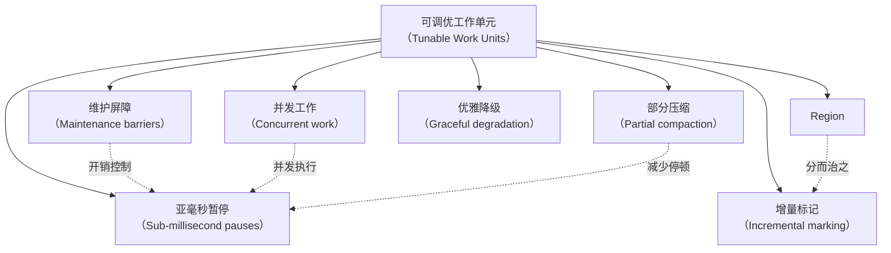

> ▲ 上图根据原文 Figure 6.17 标题和上下文推测绘制，原文为英文截图。标题：并发垃圾回收器的可调优工作单元

随着系统变得更加强大，多核处理器成为常态，并发利用这些核心的 GC 将占据优势。然而，功耗效率，尤其是在数据中心和云环境中，至关重要。这不仅关乎随 CPU 使用率的扩展，还关乎该功耗的使用效率。

GC 需要与其运行的硬件以及管理的软件模式保持同步。这样做将需要解决以下需求：

- 高效的 CPU 和系统缓存利用
- 最小化访问此类缓存的延迟，并使其达到正确状态
- 理解分配大小、模式和 GC 压力

通过对硬件和软件模式更加感知，并根据系统的当前状态调整其策略，GC 可以增强其内在的自适应性，并显著提高性能和效率。

机器学习等外部工具可以通过分析应用行为和内存使用模式进一步提高 GC 性能，机器学习算法可能自动化 GC 调优中许多复杂且耗时的过程。但这不仅仅是调优问题：还涉及通过识别和匹配模式来提示 GC 以特定方式行为。这有助于在潜在 GC 行为问题发生之前避免它们。此类机器学习算法还可以通过学习执行垃圾回收任务的最有效方式来帮助优化功耗使用，从而减少整体 CPU 使用和功耗。

JVM 中垃圾回收的未来无疑将是动态和自适应的，由内部改进和外部优化共同驱动。随着我们继续突破现代应用可能的边界，我们的垃圾回收器显然需要跟上步伐，不断演变和适应以迎接这些新挑战。

垃圾回收领域并非静态；它随着软件开发的格局一起演变。新的 GC 正在被开发，现有的 GC 也在不断改进以处理应用程序不断变化的需求。例如：

- **低暂停回收器**，如 ZGC 和 Shenandoah，旨在最小化 GC 暂停时间以改善应用性能。
- **最近的 JDK 版本**对现有 GC（如 G1、ZGC 和 Shenandoah）进行了持续改进，旨在提高其性能、可扩展性和可用性。随着这些 GC 继续演变，它们可能适用于更广泛的工作负载。截至本书撰写时，已进行的改进已经播下了种子，很可能使 ZGC 和 Shenandoah 成为分代 GC。
- **应用开发实践的变化**，如微服务和云原生应用的兴起，导致了对容器化和资源效率的更多关注。这一趋势将影响 GC 的改进，因为此类应用通常具有与传统单体应用不同的内存管理要求。
- **大数据和机器学习应用的兴起**，通常需要在内存中处理大型数据集，正在推动垃圾回收的边界。这些应用需要能够高效管理大堆并提供良好整体吞吐量的 GC。

随着这些趋势继续展开，架构师和性能工程师保持信息灵通并准备好根据需要调整其垃圾回收策略将非常重要。这将带来 OpenJDK HotSpot VM 垃圾回收器的进一步改进和增强。

## 评估GC性能的实用技巧

谈到 GC 调优，我的建议是建立在第 5 章详述的方法论和性能工程方法之上。从理解应用程序的内存使用模式开始。GC 日志是你最好的朋友。有各种日志解析器和绘图工具可以帮助你将应用模式可视化。通过 GC 日志丰富你的理解将为有效的 GC 调优奠定基础。

并且不要低估测试的重要性。测试可以帮助你理解所选回收器与应用程序内存需求之间的协同作用。一旦我们建立了协同作用及其差距，我们就可以进行有针对性的增量调优。这类调优努力可以对应用性能产生显著影响，而其增量性质将使你能够彻底测试任何更改以确保它们产生期望的效果。

使用你的工作负载评估不同 GC 的性能是优化应用性能的关键步骤。以下是一些与第 5 章倡导的基准测试策略和结构化方法相呼应的实用技巧：

- **测量 GC 性能**：使用 Java 内置的 JMX（Java Management Extensions）或 VisualVM[^11] 等工具进行间歇性的实时 GC 性能监控。这些工具可以提供有价值的指标，如总 GC 时间、最大 GC 暂停时间和堆使用情况。对于持续的低开销监控，特别是在生产环境中，Java Flight Recorder（JFR）是首选工具。它提供详细的运行时信息，对性能的影响最小。相比之下，GC 日志非常适合事后分析，捕获 GC 事件的全面历史记录。分析这些日志可以帮助你识别从单个快照中可能不明显的趋势和模式。
- **理解 GC 指标**：理解不同 GC 指标的含义很重要。例如，高 GC 时间可能表明应用程序花费大量时间进行垃圾回收，这可能影响其性能。类似地，高堆使用率可能表明应用具有高"GC 颠簸"（GC churn）或未为活跃数据集适当调整大小。"GC 颠簸"指的是应用程序分配和释放内存的频率。高颠簸率和配置不足的堆可能导致频繁的 GC 周期。监控这些指标将帮助你做出关于 GC 调优的明智决策。
- **在应用程序上下文中解释指标**：GC 对应用性能的影响可能因其特定特性而异。例如，具有高分配率的应用可能比具有低分配率的应用更受 GC 暂停时间影响。因此，在解释 GC 指标时，考虑应用的上下文很重要。在解释这些指标时，考虑诸如应用的工作负载、事务模式和内存使用模式等因素。此外，将这些 GC 指标与整体应用性能指标（如响应时间和吞吐量）相关联。这种整体方法确保 GC 调优努力不仅与内存管理效率保持一致，而且与应用的总体性能目标保持一致。
- **理解 GC 触发和自适应**：垃圾回收通常在 Eden 空间接近容量或达到与老年代相关的阈值时触发。现代 GC 算法是自适应的，可以根据应用在这些不同堆区域的内存使用模式调整其行为。例如，如果应用具有高分配速率，年轻 GC 可能更频繁地触发以跟上对象创建的速度。类似地，如果老年代利用率高，GC 可能花更多时间压缩堆以释放空间。理解这些自适应行为可以帮助你更有效地调整 GC 策略。
- **尝试不同的 GC 算法**：不同的 GC 算法有不同的优势和劣势。例如，Parallel GC 旨在最大化吞吐量，而 ZGC 旨在最小化暂停时间。此外，G1 GC 提供了吞吐量和暂停时间之间的平衡，对于具有大堆大小的应用来说是一个不错的选择。尝试不同的 GC 算法以查看哪种算法对你的工作负载最有效。请记住，最佳 GC 算法取决于你特定的性能要求和约束。
- **调优 GC 参数**：大多数 GC 算法提供了一系列可以微调以优化性能的参数。例如，你可以调整堆大小或年轻代与老年代空间的比率。在调整这些参数之前确保理解它们的作用，因为不当的调优可能导致更差的性能。从默认设置开始，或遵循推荐的实践作为基线。从那里开始，进行增量调整并密切监控其效果。与第 5 章概述的实验设计原则一致，在受控环境中测试每个更改至关重要。利用与生产环境镜像的预发布环境，可以安全地评估每次调优努力，确保不对你的在线应用造成干扰。请记住，GC 调优本质上是迭代性的性能工程过程。找到最优配置通常涉及一系列仔细的实验和观察。

在为应用选择 GC 时，在工作负载的上下文中评估其性能至关重要。请记住，目标不仅仅是提高 GC 性能，而是确保你的应用提供最佳的用户体验。

## 评估各种工作负载下的GC性能

高效的内存管理对于 Java 应用的高效执行至关重要。作为此过程的中心方面，垃圾回收必须经过优化以提供效率和适应性。为实现这一点，我们将审视诸如 Apache Hadoop、Apache Hive、Apache HBase、Apache Cassandra、Apache Spark 等开源框架的需求和共享特征。在此上下文中，我们将深入探讨不同的事务模式、它们与内存中存储机制的关系以及对堆管理的影响，所有这些都为我们优化 GC 以最佳适配应用及其事务的方法提供信息，同时仔细考虑其独特特征。

### 事务型工作负载的类型

这些项目和框架可以根据它们与内存中数据库的事务交互以及对 Java 堆的影响大致分为三类：

- **分析型（Analytics，OLAP）**：在线分析处理（Online Analytical Processing）
- **操作型存储（Operational stores，OLTP）**：在线事务处理（Online Transactional Processing）
- **混合型（Hybrid，HTAP）**：混合事务/分析处理（Hybrid Transactional and Analytical Processing）

#### 分析型（OLAP）

这种事务类型通常涉及对大型数据集的复杂、长时间运行的查询，用于商业智能和数据挖掘。"无状态"描述了这些交互，意味着每个请求和响应对是独立的，事务之间不保留信息。这些工作负载通常以高吞吐量和大堆需求为特征。在垃圾回收的背景下，主要关注点在于瞬态对象的管理和高分配速率，这可能导致大堆大小。开源世界中 OLAP 应用的例子包括 Apache Hadoop 和 Spark，它们用于跨计算机集群分布式处理大型数据集[^12]。这类应用的内存管理需求通常受益于能够高效处理大堆并提供良好整体吞吐量的 GC（例如 G1）。

#### 操作型存储（OLTP）

这种事务类型通常与服务实时业务事务相关。OLTP 应用的特点是大量短小、原子性的事务，如对数据库的更新。它们需要对大型数据库中的少量数据进行快速、低延迟的访问。在这些交互式事务中，数据的读取或写入状态很频繁；因此，这些交互是"有状态"的。在 Java 垃圾回收的背景下，重点在于管理高分配速率和中等生命周期数据或事务的压力。例子包括 Apache Cassandra 和 HBase 等 NoSQL 数据库。对于这些类型的工作负载，低暂停回收器如 ZGC 和 Shenandoah 通常是一个好的选择，因为它们旨在最小化 GC 暂停时间，而这直接影响事务的延迟。

#### 混合型（HTAP）

HTAP 应用涉及相对较新的工作负载类型，是 OLAP 和 OLTP 的组合，需要同时进行分析处理和事务处理。此类系统旨在对操作数据进行实时分析。例如，此类别包括 Apache Ignite 等内存中计算系统，它提供了处理 OLAP 和 OLTP 工作负载的高性能、集成和分布式内存计算能力。开源世界中的另一个例子是 Apache Flink，它专为流处理设计，但也支持批处理任务。虽然 Flink 不是独立的 HTAP 数据库，但它以其实时处理能力补充了 HTAP 架构，特别是与管理系统事务数据存储集成时。对此类工作负载期望的 GC 特征包括分析任务的高吞吐量，结合实时事务的低延迟，这表明增强的 GC 可能是最优的。理想情况下，这些工作负载将使用吞吐量优化的 GC，最小化暂停并维持低延迟——例如，优化的分代 ZGC。

### 综合

通过理解不同类型的工作负载（OLAP、OLTP、HTAP）及其共性，我们可以为每种类型确定最有效的 GC 特征。这些知识有助于优化 GC 性能和自适应性，从而贡献于 Java 应用的整体性能。随着这些工作负载性质的不断演变和新型工作负载的出现，对 GC 策略的持续研究和增强将保持其有效性和适应性至关重要。在此背景下，自动内存管理成为在 Java 环境中优化和适应多样化工作负载场景的组成部分。

优化 GC 性能的关键在于理解工作负载的性质，并相应选择正确的 GC 算法或调整参数。例如，OLAP 工作负载是无状态的，以高吞吐量和大堆需求为特征，可能受益于优化后的 G1 等 GC。OLTP 工作负载是有状态的，需要快速、低延迟的数据访问，可能更适合低暂停 GC，如分代 ZGC 或 Shenandoah。HTAP 工作负载结合了 OLAP 和 OLTP 的特征，将推动 GC 策略的改进以实现最佳性能。

此外，机器学习和性能调优中其他高级分析工具的日益普及表明，未来的 GC 优化可能利用这些技术进一步改进和自动化调优过程。考虑每种 GC 策略相关的 CPU 利用率也至关重要，因为它直接影响不仅仅是垃圾回收效率，还有整体的应用吞吐量。

通过将垃圾回收策略定制为工作负载的特定需求，我们可以确保 Java 应用高效且有效地运行，为最终用户提供最佳性能。这种方法，加上 GC 领域的持续研发，将确保 Java 继续成为广泛应用的稳健可靠平台。

## 活跃数据集压力

"活跃数据集"（Live Data Set，LDS）包括堆中活跃数据的体量，可能影响垃圾回收过程的整体性能。LDS 包含应用程序仍在使用的、尚未有资格进行垃圾回收的对象。

在传统 GC 算法中，活跃数据集压力越大，GC 暂停时间可能越长，因为算法必须处理更多的活跃数据。然而，这并非对所有 GC 算法都成立。

### 理解数据生命周期模式

不同类型的数据以不同方式对 LDS 压力做出贡献，突显了理解应用程序数据生命周期模式的重要性。数据可以根据其生命周期大致分为四种类型：

- **瞬时数据（Transient data）**：这些短生命周期对象在使用后迅速被丢弃。它们通常不应存活超过 minor GC 周期，并在年轻代被回收。
- **短生命周期数据（Short-lived data）**：这些对象的生命周期比瞬时数据稍长，但仍然相对较短。它们可能存活几个 minor GC 周期，但通常在晋升到老年代之前被回收。
- **中等生命周期数据（Medium-lived data）**：这些对象的生命周期延伸到多个 minor GC 周期，并经常晋升到老年代。它们可能增加堆的占用率并对 GC 施加压力。
- **长生命周期数据（Long-lived data）**：这些对象在应用程序生命周期的大部分时间内保持使用状态。它们驻留在老年代，仅在老年代回收周期中被回收。

### 对不同GC算法的影响

G1 旨在通过增量处理较小区域中的堆并预测哪些 region 将产生最多垃圾，来提供更一致的暂停时间和更好的性能。然而，活跃数据的体量仍然影响其性能。存活过 minor GC 周期的中等生命周期数据和短生命周期数据可能增加堆的占用率并施加不必要压力，从而影响 G1 的性能。

相比之下，ZGC 设计为具有大体上与堆大小或 LDS 无关的暂停时间。ZGC 通过并发执行大部分工作而不停止应用线程来维持低延迟。然而，在高内存压力下，它采用负载卸除策略，例如限制分配速率，以维持其低暂停保证。因此，虽然 ZGC 旨在更优雅地处理较大的 LDS，但极端的内存压力仍可能影响其操作。

### 优化内存管理

理解应用程序数据的生命周期模式是有效调整垃圾回收策略的关键因素。这一知识使您能够在吞吐量和暂停时间之间取得平衡，这是不同 GC 算法提供的主要权衡。最终，这导致了更高效的内存管理。

例如，考虑一个具有高比例瞬时或短生命周期数据创建率的应用。此类应用可能受益于优化 minor GC 周期的算法。这种优化可能涉及允许对象在年轻代内老化，从而减少老年代收集的频率并提高整体吞吐量。

现在考虑一个具有大量长生命周期数据的应用。这些数据可能在应用程序的整个生命周期中分布，作为事务的活动缓存。在这种情况下，增量处理老年代收集的 GC 算法可能是有益的。这种方法可以帮助更有效地管理较大的 LDS，减少暂停时间并保持应用响应性。

显然，GC 的行为和性能可能因工作负载的具体特征和 JVM 的配置而异。因此，定期监控和调优至关重要。通过根据应用程序不断变化的需求调整 GC 策略，您可以维持最佳的 GC 性能并确保应用程序的高效运行。

[^1]: https://jdk.java.net/jmc/8/
[^2]: https://openjdk.org/jeps/345
[^3]: https://wiki.openjdk.org/display/zgc/Main#Main-EnablingNUMASupport
[^4]: Charlie Hunt, Monica Beckwith, Poonam Parhar, and Bengt Rutisson. *Java Performance Companion*. Boston, MA: Addison-Wesley Professional, 2016.
[^5]: Charlie Hunt, Monica Beckwith, Poonam Parhar, and Bengt Rutisson. *Java Performance Companion*. Boston, MA: Addison-Wesley Professional, 2016: chapters 2 and 3.
[^6]: www.azul.com/c4-white-paper/
[^7]: https://openjdk.org/jeps/312
[^8]: https://openjdk.org/groups/hotspot/docs/HotSpotGlossary.html
[^9]: https://malloc.se/blog/zgc-jdk14
[^10]: https://malloc.se/blog/zgc-softmaxheapsize
[^11]: https://visualvm.github.io/
[^12]: www.infoq.com/articles/apache-spark-introduction/
