# 第7章 运行时性能优化：聚焦字符串、锁及其他

这一趋势在需要高效线程模型的高性能数据库和存储系统中尤为明显。本章旨在揭示这些性能优势背后的"如何"与"为什么"，涵盖从字节码工程到字符串池、锁以及线程的各种运行时层面的细微差别。

为了进一步强调运行时的重要性，本章探讨了 G1 的字符串去重（string deduplication）功能，然后过渡到并发与并行的领域，揭示了 Java 的 Executor Service、线程池和 ForkJoinPool 框架。此外，本章还介绍了 Java 的 CompletableFuture，以及虚拟线程（virtual threads）与延续性（continuations）这一突破性概念，通过 Project Loom 一窥并发的未来。虽然各种框架可能抽象了这些复杂性，但理解其评估和开发背后的原理，对于充分利用 JVM 线程方面的进步至关重要。

全面理解 JVM 内部框架的整体优化，以及它们之间的协调与差异，使我们能够更好地利用支持它们的工具，从而将 JVM 运行时改进的好处落地到实际应用中。本次探索的一个关键目标是讨论 JVM 内部工程如何增强代码执行效率。通过从性能工程工具、性能分析仪器和微基准测试框架的角度剖析这些增强，我们旨在揭示它们的全部影响，并提供对 JVM 性能工程的全面理解。

尽管这些对 JVM 的改进在分布式环境中可能以不同方式呈现，但本章提炼了 JVM 的核心工程原理，以及我们可用的性能工程工具。当我们在运行时性能的版图中行进时，无论是新手还是经验丰富的开发者，都将体会到 JVM 的持续增强如何简化开发过程。这些改进为更稳定和更高性能的基础设施做出贡献，从而减少与性能相关的问题，使部署过程更加顺畅，即使在最苛刻的环境中也能优化整体系统体验。

## 字符串优化（String Optimizations）

随着 Java 平台的发展，它对编程中最普遍的构造之一——字符串（string）的处理方式也在不断演进。由于字符串几乎是每个 Java 应用程序的基础，这方面的任何改进都可能显著影响应用的速度、内存占用和可扩展性。认识到这种关系，Java 社区投入了大量精力进行字符串优化。本节重点介绍在不同 Java 版本中引入的四项重要优化：

- **字面量与内联字符串优化（Literal and interned string optimization）**：该优化涉及管理一个"字符串池"以减少堆占用，从而提升内存利用率。
- **G1 中的字符串去重（String deduplication in G1）**：G1 垃圾收集器提供的去重功能，旨在通过去重相同的 String 对象来减少堆占用。
- **字符串拼接的 Indy 化（Indy-fication of string concatenation）**：我们将探讨字符串拼接在字节码层面的管理方式如何发生变化，从而提升性能并增加灵活性。
- **紧凑字符串（Compact strings）**：我们将研究字符串底层数组从 char[] 到 byte[] 的转变，如何减少应用的内存占用，将 ASCII 文本的空间需求减半。

每项优化不仅带来了独特的优势，也提出了各自的一系列考虑因素和注意事项。在探索这些领域时，我们旨在理解它们的技术层面以及对应用性能的实际影响。

### HotSpot VM 中的字面量与内联字符串优化（Literal and Interned String Optimization in HotSpot VM）

减少 Java 中的分配开销一直是提升性能的重要机会。早在 Java 9 将字符串底层数组从 char[] 改为 byte[] 之前，OpenJDK HotSpot VM 就已经采用了多种技术来最小化内存使用，尤其是针对字符串。

其中一项主要优化就是"字符串池"。由于字符串是不可变的，并且经常在应用程序的不同部分重复出现，Java 中的 String 类利用一个池来节省堆空间。当调用 `String.intern()` 方法时，它会检查池中是否已存在相同的字符串。如果存在，该方法返回对现有字符串的引用，而不是分配一个新对象。

考虑一个实例 String1，在 Java 9 之前的版本中，它包含一个 String1 对象和一个底层的 char[]（Figure 7.1）。

调用 `String1.intern()` 会检查池中是否存在具有相同值的现有字符串。如果没有找到，String1 就会被添加到池中（Figure 7.2）。

Figure 7.3 展示了字符串被内联之前的情况。当创建一个新字符串 String2 并进行内联，且它与 String1 相等时，它将引用池中相同的 char[]（Figure 7.4）。

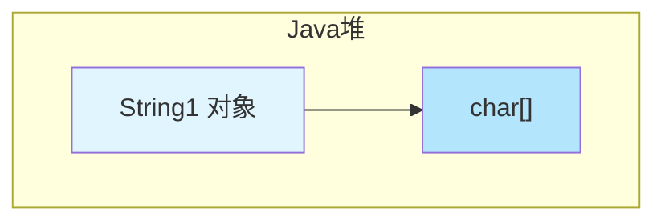

> ▲ 上图根据原文 Figure 7.1 标题和上下文推测绘制，原文为英文截图。该图展示了一个 String 对象及其底层的 char[] 数组结构。

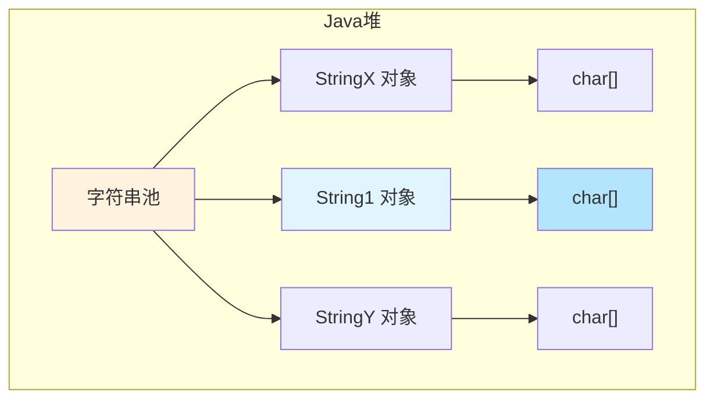

> ▲ 上图根据原文 Figure 7.2 标题和上下文推测绘制，原文为英文截图。该图展示了 Java 堆中的字符串池，池中包含多个 String 对象及其各自的 char[] 数组。

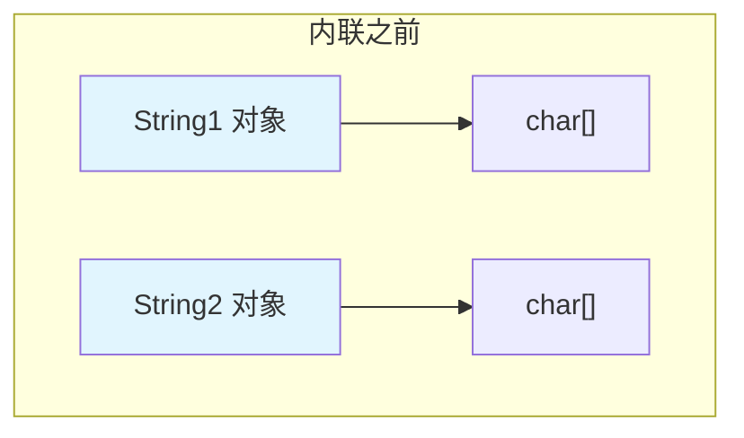

> ▲ 上图根据原文 Figure 7.3 标题和上下文推测绘制，原文为英文截图。该图展示了两个 String 对象在被内联之前各自拥有独立的 char[] 数组。

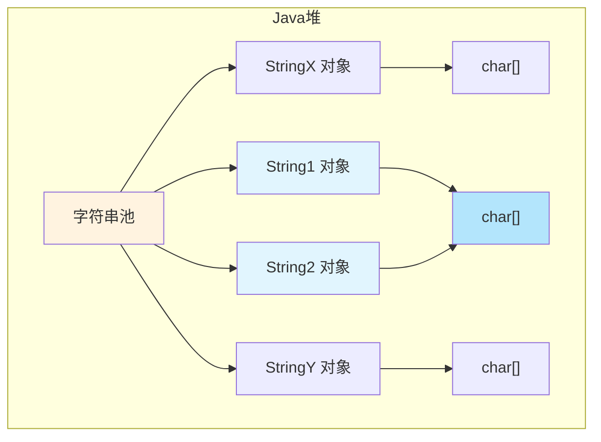

> ▲ 上图根据原文 Figure 7.4 标题和上下文推测绘制，原文为英文截图。该图展示了内联后的 String 对象共享相同的 char[] 引用。

这种存储字符串的方式大大提高了内存效率，因为相同的字符串只存储一次。此外，内联后的字符串可以使用 `==` 运算符快速高效地进行比较（因为它们共享相同的引用），而无需使用 `equals()` 方法。这不仅节省了内存，还加快了字符串比较操作的速度，有助于加快应用程序的执行时间。

### G1 GC 的字符串去重优化（String Deduplication Optimization and G1 GC）

Java 8 Update 20 为 G1 GC 增强了字符串去重（dedup）优化，旨在减少内存占用。在 stop-the-world（STW）疏散暂停（年轻代或混合代）或回退 Full GC 的标记阶段，G1 GC 会识别去重候选对象。这些候选对象是具有相同 char[] 的 String 实例，并且它们已从 Eden 区疏散到 Survivor 区或晋升到老年代，且对象的年龄等于或小于（分别对应）去重阈值。去重涉及将一个 String 实例的 value 字段重新赋值为另一个 String 实例的 value，从而避免重复的底层数组。

需要特别注意的是，大部分工作是在一个名为"去重线程"（deduplication thread）的 VM 内部线程中完成的。该线程与你的应用程序线程并发运行，通过计算哈希码和按需去重字符串来处理去重队列。

Figure 7.5 描述了这样一种情况：如果 String1 和 String2 在字符层面逐字符相等，并且两者都由 G1 GC 管理，那么重复的字符数组就可以被替换为单个共享数组。

G1 GC 的字符串去重功能默认不启用，可以通过 JVM 命令行选项进行控制。例如，使用 `-XX:+UseStringDeduplication` 选项启用此功能。此外，你还可以使用 `-XX:StringDeduplicationAgeThreshold=<#>` 选项自定义 String 对象符合去重条件的年龄阈值。

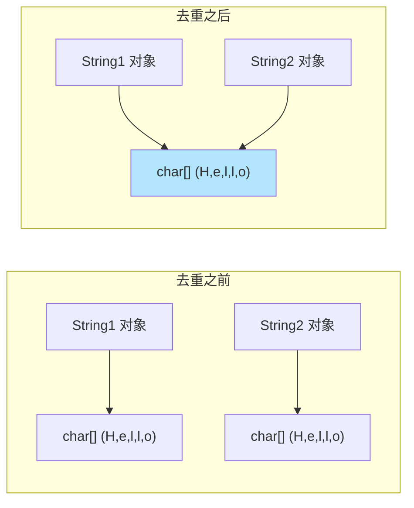

> ▲ 上图根据原文 Figure 7.5 标题和上下文推测绘制，原文为英文截图。该图展示了字符串去重优化：当 String1 和 String2 逐字符相等时，重复的 char[] 被替换为单个共享数组。

对于有兴趣监控去重效果的开发者，可以使用 `-Xlog:stringdedup*=debug` 选项获取详细日志。以下是一个示例日志输出：

```
[217.149s][debug][stringdedup,phases,start] Idle start
[217.149s][debug][stringdedup,phases] Idle end: 0.017ms
[217.149s][debug][stringdedup,phases,start] Concurrent start
[217.149s][debug][stringdedup,phases,start] Process start
[217.149s][debug][stringdedup,phases] Process end: 0.069ms
[217.149s][debug][stringdedup,phases] Concurrent end: 0.109ms
[217.149s][info ][stringdedup] Concurrent String Deduplication 45/2136.0B (new), 1/40.0B (deduped), avg 114.4%, 0.069ms of 0.109ms
[217.149s][debug][stringdedup] Last Process: 1/0.069ms, Idle: 1/0.017ms, Blocked: 0/0.000ms
[217.149s][debug][stringdedup] Inspected: 64
[217.149s][debug][stringdedup] Known: 45( 70.3%)
[217.149s][debug][stringdedup] Shared: 19( 29.7%)
[217.149s][debug][stringdedup] New: 0( 0.0%)
[217.149s][debug][stringdedup] Replaced: 0( 0.0%)
[217.149s][debug][stringdedup] Deleted: 0( 0.0%)
[217.149s][debug][stringdedup] Deduplicated: 1( 1.6%) 40.0B( 1.9%)
…
```

开发者需要理解的是，虽然字符串去重可以显著减少内存使用，但代价是 CPU 开销。去重过程本身需要计算资源，其影响应根据具体应用的性能需求和行为特征进行评估。

### 减少字符串的内存占用（Reducing Strings' Footprint）

Java 始终处于运行时优化的前沿，随着对高效内存管理的需求日益增长，Java 社区领导者引入了多项增强来减少字符串的内存占用。这项优化分为两个重要部分：(1) 字符串拼接的 Indy 化（indy-fication of string concatenation），以及 (2) 通过将底层数组从 char[] 改为 byte[] 引入紧凑字符串（compact strings）。

#### 字符串拼接的 Indy 化（Indy-fication of String Concatenation）

Indy 化涉及使用 JSR 292 中的 invokedynamic 特性，该特性作为 Java SE 7 的一部分，为 JVM 引入了对动态语言的支持。JSR 292 通过添加一条新指令 `invokedynamic` 修改了 JVM 规范，该指令通过将翻译工作推迟到运行时引擎来支持动态类型语言。

字符串拼接是 Java 中的基本操作，允许将两个或多个字符串合并。如果你曾经使用过 `System.out.println` 方法，那么你已经熟悉了用于此目的的"+"运算符。在以下示例中，短语 "It is" 与布尔值 `trueMorn` 拼接，再与短语 "that you are a morning person" 进一步拼接：

```java
System.out.println("It is " + trueMorn + " that you are a morning person");
```

输出会根据 `trueMorn` 的值而变化。以下是一种可能的输出：

```
It is false that you are a morning person
```

为了理解这些改进，让我们比较一下 Java 8 和 Java 17 生成的字节码。这是静态方法：

```java
private static void getMornPers() {
    System.out.println("It is " + trueMorn + " that you are a morning person");
}
```

我们可以使用 `javap` 工具查看该方法在 Java 8 下生成的字节码。命令行如下：

```bash
$ javap -c -p MorningPerson.class
```

以下是字节码反汇编：

```
private static void getMornPers();
Code:
   0: getstatic            #2    // Field java/lang/System.out:Ljava/io/PrintStream;
   3: new                  #9    // class java/lang/StringBuilder
   6: dup
   7: invokespecial        #10   // Method java/lang/StringBuilder."<init>":()V
  10: ldc                  #11   // String It is
  12: invokevirtual        #12   // Method java/lang/StringBuilder.append:(Ljava/lang/String;)Ljava/lang/StringBuilder;
  15: getstatic            #8    // Field trueMorn:Z
  18: invokevirtual        #13   // Method java/lang/StringBuilder.append:(Z)Ljava/lang/StringBuilder;
  21: ldc                  #14   // String that you are a morning person
  23: invokevirtual        #12   // Method java/lang/StringBuilder.append:(Ljava/lang/String;)Ljava/lang/StringBuilder;
  26: invokevirtual        #15   // Method java/lang/StringBuilder.toString:()Ljava/lang/String;
  29: invokevirtual        #4    // Method java/io/PrintStream.println:(Ljava/lang/String;)V
  32: return
```

在这个字节码中，我们可以观察到"+"运算符被内部翻译为一系列 StringBuilder API 的 `append()` 调用。我们可以使用 StringBuilder API 重写原始代码：

```java
String output = new StringBuilder().append("It is ").append(trueMorn).append(" that you are a morning person").toString();
```

这段代码的字节码与使用"+"运算符的字节码类似。

然而，在 Java 17 中，字节码反汇编有了显著不同的面貌：

```
private static void getMornPers();
Code:
   0: getstatic            #7    // Field java/lang/System.out:Ljava/io/PrintStream;
   3: getstatic            #37   // Field trueMorn:Z
   6: invokedynamic        #41,  0  // InvokeDynamic #0:makeConcatWithConstants:(Z)Ljava/lang/String;
  11: invokevirtual        #15   // Method java/io/PrintStream.println:(Ljava/lang/String;)V
  14: return
```

这个字节码被优化为使用 `invokedynamic` 指令配合 `makeConcatWithConstants` 方法。这种转换被称为字符串拼接的 Indy 化。

`invokedynamic` 特性引入了一个引导方法（Bootstrap Method，BSM），它为 invokedynamic 调用点提供支持。所有 invokedynamic 调用点都有方法句柄（method handles），为这些 BSM 提供行为信息，这些 BSM 在运行时被调用。要查看 BSM，可以在 `javap` 命令行中添加 `-v` 选项：

```bash
$ javap -p -c -v MorningPerson.class
```

以下是输出中的 BSM 片段：

```
...
SourceFile: "MorningPerson.java"
BootstrapMethods:
  0: #63 REF_invokeStatic java/lang/invoke/StringConcatFactory.makeConcatWithConstants:(Ljava/lang/invoke/MethodHandles$Lookup;Ljava/lang/String;Ljava/lang/invoke/MethodType;Ljava/lang/String;[Ljava/lang/Object;)Ljava/lang/invoke/CallSite;
    Method arguments:
      #69 It is  that you are a morning person
InnerClasses:
  public static final #76= #72 of #74; // Lookup=class java/lang/invoke/MethodHandles$Lookup of class java/lang/invoke/MethodHandles
```

如我们所见，运行时首先将 invokedynamic 调用转换为 invokestatic 调用。BSM 的方法参数指定了要从常量池链接和加载的常量。借助 BSM 并通过传递运行时参数，可以精确地将参数放置在预构建的字符串中。

采用 `invokedynamic` 进行字符串拼接带来了几个好处。首先，特殊字符串（如空字符串和 null 字符串）现在被单独优化。当处理空字符串时，JVM 可以绕过不必要的操作，直接返回非空部分。类似地，JVM 可以高效地处理 null 字符串，可能避免创建新的字符串对象以及避免进行转换的需要。

传统字符串拼接（尤其是使用 StringBuilder）的一个已知挑战是建议预先计算结果字符串的总长度。这一步旨在确保 StringBuilder 的内部缓冲区不会经历多次代价高昂的扩容。有了 invokedynamic，这个担忧就得到了缓解——JVM 能够动态确定结果字符串的最佳大小，确保高效的内存分配，无需手动估算长度。当被拼接的字符串长度不可预测时，此功能尤其有益。

此外，`invokedynamic` 指令固有的灵活性意味着字符串拼接可以持续受益于 JVM 的进步。随着 JVM 的发展引入新的优化技术，字符串拼接可以无缝地享受这些好处，而无需修改字节码或源代码。这不仅确保字符串操作在不同 JVM 版本中保持高效，也使应用程序免受潜在性能瓶颈的影响。

因此，对于注重性能的开发者来说，向 invokedynamic 的转变代表了一项重大进步。它简化了开发者的任务，减少了为字符串拼接编写显式性能模式的需要，并确保字符串操作由 JVM 自动优化。这种对 JVM 不断进化的智能的依赖不仅能产生即时的性能提升，还能让你的代码与未来的增强保持同步，使其成为编写更快、更简洁、更高效的 Java 代码的明智的长期投资。

#### 紧凑字符串（Compact Strings）

在深入探讨紧凑字符串之前，有必要了解更广泛的背景。虽然计算中的性能通常围绕响应时间或吞吐量等指标，但与 Java 中 String 类相关的改进主要集中在略有不同的领域：内存效率。由于字符串在应用程序中的普遍性（从文本到 XML 处理），改善其内存占用可以显著影响应用程序的整体效率。

在 JDK 8 及更早版本中，JVM 内部使用字符数组（char[]）来存储 String 对象。由于 Java 对字符采用 UTF-16 编码，每个 char 在内存中占用 2 个字节。根据 JEP 254：紧凑字符串[^1]，大部分字符串使用 Latin-1 字符集（7 位 ASCII 的 8 位扩展）编码，这也是 HTML 的默认字符集。Latin-1 仅使用 1 个字节即可存储一个字符——因此 JDK 8 实质上为每个 Latin-1 字符浪费了 1 个字节的内存。

[^1]: https://openjdk.org/jeps/254

##### 紧凑字符串的影响（Impact of Compact Strings）

JDK 9 引入了一项重大变更来解决这个问题，JEP 254：紧凑字符串改变了 String 类的内部表示。使用 byte[] 代替 char[] 作为字符串的底层存储。这一根本性修改减少了对 Latin-1 编码字符串字符的内存浪费，同时保持了面向公众的 API 不变。

回想我在 Sun/Oracle 的时期，我们曾在 Java 6 中尝试过类似的优化，称为压缩字符串（compressed strings）。然而，Java 6 采用的方法效果不佳，因为压缩是在 String 对象的构造过程中完成的，但字符串操作仍然在 char[] 上进行。因此，需要一个"解压缩"步骤，限制了这项优化的实用性。

相比之下，紧凑字符串优化消除了解压缩的需要，从而提供了更有效的解决方案。这一变化也使字符串操作的 API（如 StringBuilder 和 StringBuffer）以及与字符串操作相关的 JIT 编译器内联函数（intrinsics）[^2]受益。

[^2]: https://chriswhocodes.com/hotspot_intrinsics_openjdk11.html

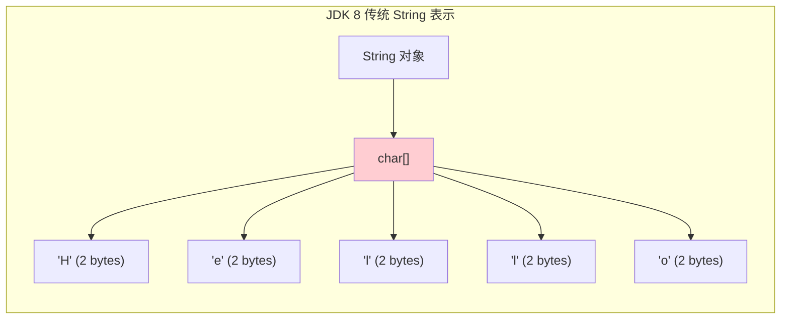

> ▲ 上图根据原文 Figure 7.6 标题和上下文推测绘制，原文为英文截图。该图展示了 JDK 8 中传统的 String 表示方式，String 对象由 char[] 支持，每个字符占用 2 个字节。

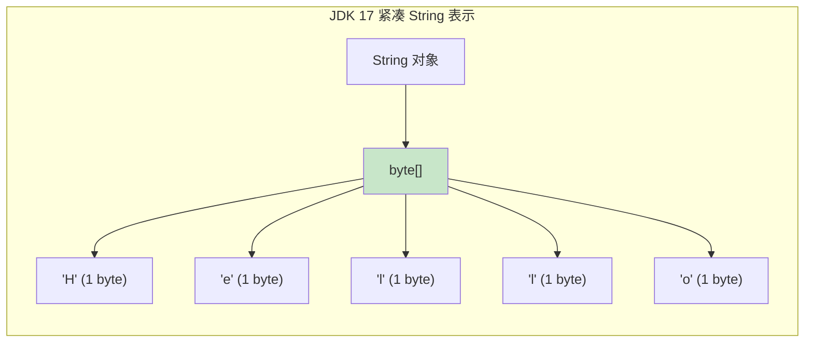

> ▲ 上图根据原文 Figure 7.7 标题和上下文推测绘制，原文为英文截图。该图展示了 JDK 17 中紧凑字符串的表示方式，String 对象由 byte[] 支持，Latin-1 字符每个仅占用 1 个字节。

##### 字符串表示的可视化（Visualizing String Representations）

为了更好地理解这个概念，让我们以图示方式可视化 JDK 8 中字符串的表示。Figure 7.6 展示了一个 String 对象如何由字符数组（char[]）支持，每个字符占用 2 个字节。

转向 JDK 9 及以后版本，紧凑字符串引入的优化可以在 Figure 7.7 中看到，String 对象现在由字节数组（byte[]）支持，仅使用 Latin-1 字符所需的内存。

##### 分析紧凑字符串：使用 NetBeans IDE 洞察 JVM 内部实现（Profiling Compact Strings: Insights into JVM Internals Using NetBeans IDE）

为了说明紧凑字符串优化的好处，并赋予注重性能的 Java 开发者探索 JVM 内部实现的能力，我们关注 String 对象及其底层数组的实现。为此，我们将使用 NetBeans 集成开发环境（IDE）来分析一个简单的 Java 程序，这更多是一个说明性演示而非全面的基准测试。这种设计旨在展示如何分析 JVM 中的对象和类行为——特别是 JVM 在这两个不同版本中如何处理字符串。

我们用于此练习的 Java 代码旨在将两个日志文件的内容合并到第三个文件中。该程序使用了几个关键的 Java I/O 类，如 BufferedReader、BufferedWriter、FileReader 和 FileWriter。这种对字符串处理的大量参与使其成为突出 JDK 8 和 JDK 17 之间 String 表示变化的理想候选。需要注意的是，此设置更多是作为教育工具而非精确的性能度量。目的不是衡量性能影响，而是提供一个了解 JVM 内部字符串处理机制的窗口。

```java
package mergefiles;

import java.io.BufferedReader;
import java.io.BufferedWriter;
import java.io.FileReader;
import java.io.FileWriter;
import java.io.PrintWriter;
import java.io.IOException;

public class MergeFiles {
    public static void main(String[] args) {
        try {
            BufferedReader appreader = new BufferedReader(new FileReader("applog.log"));
            BufferedReader gcreader = new BufferedReader(new FileReader("gclog.log"));
            PrintWriter writer = new PrintWriter(new BufferedWriter(new FileWriter("all_my_logs.log")));

            String appline, gcline;
            while ((appline = appreader.readLine()) != null) {
                writer.println(appline);
            }
            while ((gcline = gcreader.readLine()) != null) {
                writer.println(gcline);
            }
        } catch (IOException e) {
            System.err.println("Caught IOException: " + e.getMessage());
        }
    }
}
```

NetBeans IDE 是一款深受开发者喜爱的流行工具，配备了强大的分析工具，允许我们检查和分析程序的运行时行为，包括 String 对象的内存消耗。JDK 8 的分析步骤如下：

1. **启动分析**：从"Profile"菜单中选择"Profile Project"，如 Figure 7.8 所示。


> ▲ 上图根据原文 Figure 7.8 标题和上下文推测绘制，原文为英文截图。Apache NetBeans 的 Profile 菜单。

2. **配置分析会话**：从"Configure Session"选项中选择"Objects"，如 Figure 7.9 所示。


> ▲ 上图根据原文 Figure 7.9 标题和上下文推测绘制，原文为英文截图。Apache NetBeans 配置分析会话窗口。

3. **启动分析**：在 Figure 7.10 中，注意"Configure Session"按钮已变为"Profile"按钮并带有图标，表示点击此按钮即可开始分析。


> ▲ 上图根据原文 Figure 7.10 标题和上下文推测绘制，原文为英文截图。Apache NetBeans 分析设置界面。

4. **观察分析输出**：点击按钮后，分析开始。输出窗口中出现"Profile Agent: …"文字（Figure 7.11）。分析完成后，你可以保存快照。我将其保存为 JDK8-Objects。


> ▲ 上图根据原文 Figure 7.11 标题和上下文推测绘制，原文为英文截图。Apache NetBeans 分析完成后的输出窗口。

5. **快照分析**：现在让我们放大查看快照，如 Figure 7.12 所示。

6. **基于类的分析（JDK 8）**：由于 Java 8 中的底层数组是 char[]，毫不意外 char[] 出现在顶部。为进一步调查，让我们基于 char[] 进行分析。我们将查看类并旨在验证这个 char[] 实际上是 String 的底层数组（参见 Figure 7.13）。

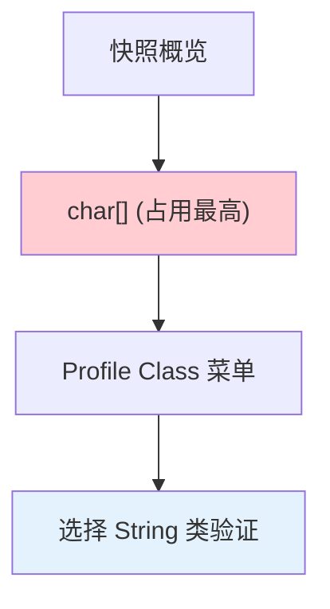

> ▲ 上图根据原文 Figure 7.12 和 Figure 7.13 标题及上下文推测绘制，原文为英文截图。展示了放大分析窗口和类菜单。

7. **深入类分析（JDK 8）**：选择"Profile Class"后，你会看到（如 Figure 7.14 所示）已选中一个类。然后可以点击"Profile"按钮开始分析。

8. **进一步分析（JDK 8）**：根据系统性能，分析可能需要几秒钟。展开第一个最顶层的路径后，最终的窗口类似于 Figure 7.15。

现在，让我们看看这个过程在 JDK 17 中如何变化：

1. **重复初始步骤**：对于 Java 17，我使用了 Apache NetBeans 18 分析器，重复步骤 1 到 3 来分析对象并捕获分析结果，如 Figure 7.16 所示。

2. **基于类的分析（JDK 17）**：由于这是 Java 17，底层数组已改为 byte[]；因此，我们看到 byte[] 对象位于顶部。因此，紧凑字符串变更已经生效。让我们选择 byte[] 并按类进行分析，以确认它确实是 String 的底层数组。Figure 7.17 显示了结果。

3. **字符串初始化分析（JDK 17）**：我们可以从 String 初始化中看到对 `StringUTF16.compress` 的调用。同时，我们看到 `StringLatin1.newString()`，它最终调用了 `Arrays.copyOfRange`。这个调用树反映了与紧凑字符串相关的变更。

4. **观察结果（JDK 17）**：当我们比较 Figure 7.17 与 JDK 8 的分析结果时，我们注意到内存使用模式的变化。值得注意的是，`StringUTF16.compress` 和 `StringLatin1.newString` 在 JDK 8 的分析结果中不存在（参见 Figure 7.18）。

按照这些步骤并比较结果，紧凑字符串的影响变得显而易见。在 JDK 8 中，char[] 是主要的内存消耗对象，表明它是 String 的底层数组。在 JDK 17 中，byte[] 承担了这一角色，表明紧凑字符串已成功实现。通过分析结果，我们验证了 JDK 17 中使用 byte[] 数组压缩 UTF-16 字符串的高效性，并为 JVM 内部字符串管理机制提供了见解。

鉴于 JDK 17（和 JDK 11）在 String 对象上的显著效率提升，探讨运行时可以带来更好性能的其他领域也变得同等重要。其中，一个在确保多线程应用程序平稳运行中起关键作用的关键领域，就是理解同步原语的基础知识以及运行时在该领域的进展。

## 增强的多线程性能：Java 线程同步（Enhanced Multithreading Performance: Java Thread Synchronization）

在当今的高性能计算环境中，并发执行任务的能力不仅是一项优势，更是一种必需。高效的多线程允许有效扩展，充分利用现代处理器的潜力，并优化各种资源的利用率。跨线程共享数据进一步提高了资源效率。然而，随着系统规模的扩大，问题不仅在于增加更多线程或处理器，还在于理解支配可扩展性的底层原理。

让我们进入可扩展性定律的领域。许多开发者熟悉 Amdahl 定律（阿姆达尔定律），它通过关注任务的串行部分来突出并行化的限制，但并未捕捉到现实世界并行处理的所有细微差别。Gunther 的通用可扩展性定律（Universal Scalability Law，USL）提供了更全面的视角。USL 同时考虑了对共享资源的争用以及确保数据更新在处理器间一致时产生的协同延迟。通过理解这些因素，开发者可以预测潜在的瓶颈，并就系统设计和优化做出明智的决策。

因此，对可扩展性的理论理解虽然至关重要，但只是方程的一部分。当多个线程为了提高效率而并发访问共享资源时，实际挑战就出现了。可变的共享状态如果管理不当，就会成为数据竞争和内存异常行为的温床。Java 凭借其丰富的并发编程模型，迎接了这一挑战。其一套并发 API 工具和同步构造使开发者能够构建既高性能又线程安全的应用程序。

Java 并发策略的核心是 Java 内存模型（JMM）。JMM 定义了线程与 Java 应用程序中内存的合法交互方式。它引入了"先发生"（happens-before）关系的概念——一个基本的排序约束，保证了内存可见性，并确保某些内存操作在其他操作之前按序执行。

例如，考虑两个线程"a"和"b"。如果线程"a"修改了一个共享变量，而线程"b"随后读取了该变量，则必须建立 happens-before 关系，以确保"b"能观察到"a"所做的修改。

为了促进这种有序交互并防止内存异常，Java 提供了同步机制。开发者工具箱中的主要工具之一是使用监视器锁（monitor locks）进行同步，这是每个 Java 对象固有的特性。这些锁确保对对象的独占访问，在争夺同一资源的线程之间建立 happens-before 关系。

> **注意**：传统 Java 对象通常与其关联的监视器（monitor）保持一一对应关系。然而，Java 领域目前正经历着一场根本性的变革，涉及 Lilliput、Valhalla 和 Loom 等项目。这些举措预示着 Java 生态系统和既定规范的模式转变——从对象头结构到线程管理的本质——并为 Java 并发的新时代铺平道路。Project Lilliput[^3]旨在通过精简 Java 对象头开销来最小化开销，这可能导致对象监视器与其同步的 Java 对象解耦。Project Valhalla 引入了值类型（value types），它们是不可变的，并且缺乏与常规 Java 对象关联的标识，从而重塑了传统的同步模型。Project Loom 专注于轻量级线程和增强并发，进一步标志着 Java 同步和并发实践的演变本质。这些项目重新定义了 Java 的对象管理和同步方法，反映了为现代计算范式优化语言的持续努力。
>
> [^3]: https://wiki.openjdk.org/display/lilliput

为了说明 Java 的同步机制，考虑以下代码片段：

```java
public void doActivity() {
    synchronized(this) {
        // 同步块内的受保护工作
    }
    // 同步块外的常规工作
}
```

在这个例子中，线程必须获取实例对象（this）的监视器锁才能执行受保护的代码。在此块之外，则不需要这样的锁。

同步方法提供了类似的机制：

```java
public synchronized void doActivity() {
    // 同步方法内的受保护工作
}
// 同步方法外的常规工作
```

> **注意**：
> - 同步块本质上是封装的同步语句。
> - 实例级同步对于非静态方法独占，而静态方法需要类级同步。
> - 实例对象的监视器与同一类的类对象监视器是不同的。

### 监视器锁的作用（The Role of Monitor Locks）

在 Java 中，线程通过同步它们的操作来有效通信并确保数据一致性。这种同步的核心是监视器锁的概念。监视器锁通常简称为监视器（monitor），充当互斥锁，确保在任何给定时间只有一个线程可以拥有该锁并执行相关的同步代码块。

当线程遇到同步块时，它会尝试获取与之同步的对象的监视器锁。如果该锁已被另一个线程持有，则尝试获取锁的线程被挂起并加入该对象的等待集（wait set）——一个等待获取该对象锁的线程队列。Java 中的每个对象都固有地关联着一个等待集，在对象创建时为空。

监视器锁在确保对共享资源的操作是原子的、防止并发访问异常方面起着关键作用。在同步块内完成操作后，线程释放监视器锁。在此之前，它可以可选地调用该对象的 `notify()` 或 `notifyAll()` 方法。`notify()` 方法从对象的等待集中唤醒单个挂起线程，而 `notifyAll()` 则唤醒所有等待线程。

### OpenJDK HotSpot VM 中的锁类型（Lock Types in OpenJDK HotSpot VM）

在 Java 的锁定机制背景下，锁是用户空间事件，这些事件在操作系统中表现为自愿上下文切换（voluntary context switches）。因此，Java 运行时根据线程相对于锁定对象的状态来优化和调度线程。在任何给定时间，一个锁可以是存在争用的（contended）或无争用的（uncontended）。

#### 锁争用动态（Lock Contention Dynamics）

当多个线程同时尝试获取锁时，就会发生锁争用。如果线程"t"在同步块内活跃，而另一个线程"u"试图进入同一块，并且没有其他线程在等待，则锁是无争用的。然而，一旦"u"试图进入并因为"t"持有锁而被迫等待，就产生了争用。Java 的锁定机制经过优化以处理此类场景，当争用频繁时，从轻量级锁转换为重量级锁。

#### 无争用锁与膨胀锁（Uncontended and Deflated Locks）

无争用锁和膨胀锁是轻量级的、基于栈的锁，针对无争用的场景进行了优化。HotSpot VM 通过简单的原子比较并交换指令（CAS）实现了瘦锁（thin lock）。这个 CAS 操作将一个指向线程栈上生成的锁记录的指针放入对象的头字（header word）中。锁记录由原始的头字和指向同步对象的实际指针组成——这种机制称为位移头（displaced header）。这种轻量级锁机制集成在解释器和 JIT 编译代码中，高效地管理由单个线程访问的对象的同步。当检测到争用时，该锁会膨胀为重量级锁。

> **注意**：原子指令（尤其是 CAS）的复杂性已在第 5 章"端到端 Java 性能优化：工程技术与 JMH 微基准测试"中讨论过。

#### 争用锁与膨胀锁（Contended and Inflated Locks）

争用锁和膨胀锁是当线程间发生争用时激活的重量级锁。当瘦锁经历争用时，JVM 会将其膨胀为重量级锁。这种转换需要与操作系统进行更复杂的交互，尤其是在挂起争用线程和唤醒已挂起线程时。重量级锁使用操作系统的原生互斥机制来管理争用，确保同步块一次只由一个线程执行。

#### 代码示例与分析（Code Example and Analysis）

考虑以下代码片段，它演示了监视器锁的使用以及 `wait()` 和 `notifyAll()` 方法的交互：

```java
public void run() {
    // 循环预定义次数
    for (int j = 0; j < MAX_ITERATIONS; j++) {
        // 在共享资源上同步以确保线程安全
        synchronized(sharedResource) {
            // 检查当前线程类型是否为 DECREASING
            if(threadType == ThreadType.DECREASING) {
                // 等待直到计数器不为零
                while (sharedResource.getCounter() == 0) {
                    try {
                        // 等待直到另一个线程对该对象调用 notify() 或 notifyAll()
                        sharedResource.wait();
                    } catch (InterruptedException e) {
                        // 处理中断异常并退出线程
                        Thread.currentThread().interrupt();
                        return;
                    }
                }
                // 递减共享资源的计数器
                sharedResource.decrementCounter();
                // 打印当前状态
                printStatus();
            }
            // 如果当前线程类型不是 DECREASING（即 INCREASING）
            else {
                // 等待直到计数器不在最大值（例如 10）
                while (sharedResource.getCounter() == 10) {
                    try {
                        // 等待直到另一个线程对该对象调用 notify() 或 notifyAll()
                        sharedResource.wait();
                    } catch (InterruptedException e) {
                        // 处理中断异常并退出线程
                        Thread.currentThread().interrupt();
                        return;
                    }
                }
                // 递增共享资源的计数器
                sharedResource.incrementCounter();
                // 打印当前状态
                printStatus();
            }
            // 通知所有在该对象监视器上等待的线程
            sharedResource.notifyAll();
        }
    }
}
```

该代码执行以下操作：

- **同步**：`synchronized(sharedResource)` 块确保互斥。一次只有一个线程可以执行其中的代码。如果另一个线程在此块被占用时尝试进入，它将被强制等待。

- **计数器管理**：
  - 对于类型为 DECREASING 的线程，检查 `sharedResource` 的计数器。如果为零，线程进入等待状态，直到另一个线程修改计数器并发送通知。一旦被唤醒，它递减计数器并打印状态。
  - 相反，对于类型为 INCREASING 的线程，检查计数器是否达到最大值（十）。如果计数器已满，线程等待，直到另一个线程修改计数器并发送通知。一旦被通知，它递增计数器并打印状态。

- **通知**：修改计数器后，线程使用 `sharedResource.notifyAll()` 方法向所有在 `sharedResource` 对象监视器上等待的其他线程发送唤醒信号。

### Java 锁定机制的演进（Advancements in Java's Locking Mechanisms）

多年来，Java 的锁定机制在 API 层面和 HotSpot VM 层面都经历了显著的改进。本节提供截至 Java 8 的这些增强的结构化概述。

#### API 层面的增强

- **ReentrantLock（Java 5）**：作为 `java.util.concurrent.locks` 包的一部分，ReentrantLock 提供了比 `synchronized` 关键字提供的内在锁定更多的灵活性。它支持定时锁等待、可中断的锁等待以及创建公平锁的能力。得益于 ReentrantLock，我们还拥有了 ReadWriteLock，它使用一对锁：一个支持并发只读操作的锁和另一个用于写入的排他锁。

> **注意**：虽然 ReentrantLock 提供了高级功能，但它不是 `synchronized` 的直接替代品。开发者应该在使用它们之前权衡利弊。

- **StampedLock（Java 8）**：StampedLock 提供了一种乐观读取（optimistic reading）机制，在高争用条件下可以提高吞吐量。它像 ReentrantReadWriteLock 一样支持读锁和写锁，但具有更好的可扩展性。与其他锁不同，StampedLock 没有"所有者"。这意味着任何线程都可以释放锁，而不仅仅是获取锁的线程。使用 StampedLock 时，必须仔细管理以避免潜在问题。

> **注意**：StampedLock 不支持可重入性（reentrancy），因此必须注意避免死锁。

#### HotSpot VM 优化

- **偏向锁（Biased Locking，Java 6）**：偏向锁是一种旨在提高无争用锁性能的策略。通过这种方法，JVM 使用单个原子 CAS 操作将线程 ID 嵌入对象头，指示该对象偏向于该特定线程。这消除了偏向线程后续访问时进行原子操作的需要，在相同线程重复获取锁的场景中提供了性能提升。

> **注意**：偏向锁是为了提高性能而引入的，但它给 JVM 带来了复杂性。一个重大挑战是偏向撤销（bias revocation）期间的意外延迟，这可能导致某些场景下的不可预测性能。鉴于现代硬件和软件模式的演变削弱了偏向锁的优势，它在 JDK 15 中被弃用，为更一致和可预测的同步技术让路。如果你在 Java 15 之后的版本中尝试使用它，将产生以下警告：
> ```
> Java HotSpot(TM) 64-Bit Server VM warning: Option UseBiasedLocking was deprecated in version 15.0 and will likely be removed in a future release.
> ```

- **锁消除（Lock Elision）**：此技术利用 JVM 的逃逸分析（escape analysis）优化。JVM 检查锁对象是否从其当前作用域"逃逸"——即是否在创建它的方法或线程之外被访问。如果锁对象保持受限，JVM 可以消除该锁及其相关开销，将字段值保留在寄存器中（标量替换，scalar replacement）。示例：考虑一个方法，在该方法中创建了一个对象，对其加锁、修改，然后解锁。如果此方法不逃逸该方法，JVM 可以消除该锁。

- **锁粗化（Lock Coarsening）**：我们经常遇到包含多个同步语句的代码。然而，它们可能是在同一个对象上加锁。JVM 可以将这些锁合并为一个更粗粒度的锁，而不是发出多个锁，从而减少锁定开销。JVM 将此优化应用于争用锁和非争用锁。示例：在一个循环中，每次迭代都有一个在同一个对象上加锁的同步块，JVM 可以将这些粗化为循环外的一个锁。

- **自适应自旋（Adaptive Spinning，Java 7）**：在 Java 7 之前，遇到已锁定监视器的线程会立即进入等待状态。自适应自旋的引入允许线程短暂自旋（忙等待或自旋等待），预期锁很快会被释放。这一改进显著提升了多处理器系统上的性能，在这种系统中，线程可能需要等待很短的时间才能获取锁。

虽然这无疑是与锁定相关的一些重要改进，但各 Java 版本中还出现了许多其他与同步和并发相关的增强、错误修复和性能调优。有兴趣获得全面见解的读者，请参考官方 Java 文档[^4][^5]。

[^4]: https://docs.oracle.com/javase/tutorial/essential/concurrency/sync.html
[^5]: https://docs.oracle.com/en/java/javase/17/docs/api/java.base/java/util/concurrent/locks/package-summary.html

### 优化争用：Java 9 以来的增强（Optimizing Contention: Enhancements since Java 9）

争用锁定对于确保多线程 Java 应用程序的平稳运行至关重要。多年来，Java 的发展始终聚焦于增强其争用锁定机制。Java 9 受 JEP 143：改进争用锁定[^6]的启发，引入了一系列关键改进，并在后续版本中进一步优化。其中，Java 监视器进入操作（monitor enter）的加速和监视器退出操作（monitor exit）的效率提升尤为突出。这些操作是 Java 中同步方法和同步块的基础。

[^6]: https://openjdk.org/jeps/143

为了理解监视器进入和监视器退出操作的重要性，让我们重新审视一些基础概念。我们之前已经在争用锁的上下文中讨论过 `notify` 和 `notifyAll` 操作。然而，监视器操作的复杂性——它们是同步方法调用的核心——可能对某些读者来说不太熟悉。例如，在我们的同步语句示例中，这些调用在幕后运作。使用 `javap -c` 查看 `sharedResource` 生成的字节码可以提供清晰的视图：

```
public void run();
Code:
...
   9: getfield       #9   // Field sharedResource:LReservationSystem$SharedResource;
  12: dup
  13: astore_2
  14: monitorenter
  15: aload_0
...
  52: aload_2
  53: monitorexit
...
```

本质上，`monitorenter` 和 `monitorexit` 处理在执行同步方法或块期间对象锁的获取和释放。当线程遇到 `wait()` 调用时，它转换到等待队列（wait queue）。只有当 `notify()` 或 `notifyAll()` 调用被发出时，线程才移动到进入队列（entry queue），可能重新获得锁（Figure 7.19）。

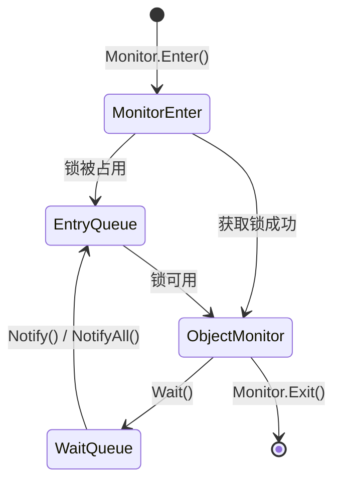

> ▲ 上图根据原文 Figure 7.19 标题和上下文推测绘制，原文为英文截图。该图展示了对象的监视器等待队列和进入队列之间的关系。

#### 改进的 Java 监视器进入和快速退出操作（Improved Java Monitor Enter and Fast Exit Operations）

争用锁定是一种资源密集型操作，任何减少争用花费时间的增强都会直接影响 Java 应用程序的效率。随着时间的推移，JVM 已被精心打磨以改进同步性能，从 Java 8 到 Java 17 取得了显著进展。JVM 性能工程的一个关键方面是揭示和理解这些运行时增强。

在 Java 8 中，进入膨胀的争用锁涉及到 `InterpreterRuntime::monitorenter` 方法（Figure 7.20）。如果锁不能立即可用，则会调用更慢的 `ObjectSynchronizer::slow_enter` 方法。通过 JEP 143 引入的增强优化了这一过程，在 Java 17 中的改进非常明显。Java 17 中的 `ObjectSynchronizer::enter` 方法优化了常用的代码路径——例如，通过将位移头（displaced header）设置为特定值来指示正在使用的锁类型。这种调整为高效管理常见锁类型提供了简化的路径，如 Figure 7.21 中"优化后的 ObjectSynchronizer::enter"路径所示。

退出锁的过程也经过了优化。Java 8 的 `InterpreterRuntime::monitorexit` 可能推迟到更慢的退出例程，而 Java 17 优化后的 `ObjectSynchronizer::exit` 方法确保了更快的锁释放路径。

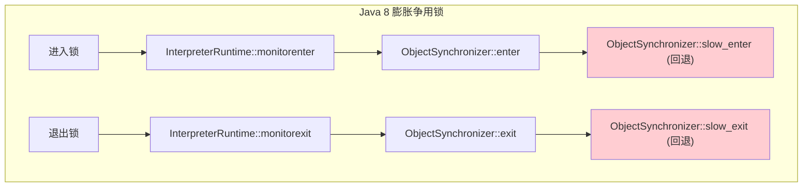

> ▲ 上图根据原文 Figure 7.20 标题和上下文推测绘制，原文为英文截图。Java 8 中争用锁进入和退出的调用路径概览。

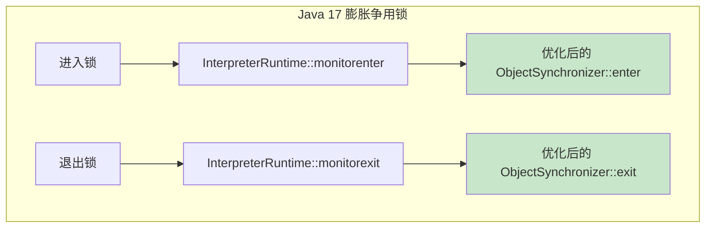

> ▲ 上图根据原文 Figure 7.21 标题和上下文推测绘制，原文为英文截图。Java 17 中争用锁进入和退出的调用路径概览，展示了优化后的路径。

JDK 17 中的进一步增强涉及加速 Java 的监视器 wait 和 notify/notifyAll 操作。这些操作使用 `quick_notify` 例程，高效地管理等待队列中的线程，并确保它们及时移动到监视器进入队列，从而消除了对慢速回退方法的需要。

#### 可视化争用锁优化：一个性能工程练习（Visualizing Contended Lock Optimization: A Performance Engineering Exercise）

JVM 性能工程不仅仅是识别瓶颈——它使我们能够收集对能够带来运行时效率提升的增强的精细化理解。因此，本节将进行一个动手探索，以说明 Java 17 在处理争用锁方面相比 Java 8 的性能改进。

我们将应用第 5 章"端到端 Java 性能优化：工程技术与 JMH 微基准测试"中讨论的性能工程方法论，旨在通过利用分析器和 JMH 基准测试工具来揭开这些方法的神秘面纱。我们的探索集中在两个关键方面：

- **性能工程的实践**：一个处理性能问题的实际示例，从问题识别到应用基准测试和分析进行深入分析。
- **理论到实践**：将第 5 章的概念与其实际应用联系起来，以演示争用锁优化的效果。

此外，我们将探索 A/B 性能测试，一种有针对性的实验设计[^7]方法，旨在比较两个 JDK 版本的性能结果。A/B 性能测试是一种强大的技术，可以凭经验验证性能改进，确保任何引入的变更都能带来切实的收益。

[^7]: 更多信息请参见第 5 章。

在争用锁优化的探索中，我们将利用 Java 微基准测试工具（JMH）的强大功能。正如第 5 章所讨论的，JMH 是进行性能基准测试的强大工具。以下是一个针对同步块的递归锁定和解锁操作量身定制的微基准测试：

```java
/** 在循环中对局部对象执行递归同步操作。 */
@Benchmark
public void testRecursiveLockUnlock() {
    Object localObject = lockObject1;
    for (int i = 0; i < innerCount; i++) {
        synchronized (localObject) {
            synchronized (localObject) {
                dummyInt1++;
                dummyInt2++;
            }
        }
    }
}
```

`testRecursiveLockUnlock` 方法旨在严格评估争用锁的性能动态，特别是 `monitorenter` 和 `monitorexit` 操作。该方法通过在嵌套循环中对局部对象（`localObject`）执行同步操作来实现这一点。循环的每次迭代都会调用两次 `monitorenter` 操作（由于嵌套的同步块），退出同步块时也会调用两次 `monitorexit` 操作。对于有兴趣进一步探索的读者，这个及其他锁定/解锁微基准测试可以在 GitHub 上 JMH JDK 微基准测试[^8]的 Code Tools 仓库中找到，感谢 OpenJDK 贡献者社区。

[^8]: https://github.com/openjdk/jmh-jdk-microbenchmarks

最后，为了丰富我们的分析，我们将引入 async-profiler[^9]。该分析器将在火焰图（flamegraph）和调用树（call tree）两种模式下使用。调用树模式提供了有价值的细粒度交互洞察，揭示了执行期间选择的具体路径。

[^9]: https://github.com/async-profiler/async-profiler

##### 设置与数据收集（Setup and Data Collection）

我们的主要目标是深入挖掘争用锁定改进的深度，并衡量它们引入的性能提升。为此，我们需要一个细致的设置和数据收集过程。以 Java 8 作为性能基准，我们可以与其后继者 Java 17 进行富有洞察力的比较。以下是练习设置的综合概述：

1. **环境设置**：
   - 确保你的系统上同时安装了 JDK 8 和 JDK 17。这种双设置允许进行并行的性能评估。
   - 安装 JMH 进行性能测量，安装 async-profiler 进行 Java 运行时的深度分析。熟悉 async-profiler 的命令行选项。

2. **仓库克隆**：
   - 从 GitHub 克隆 JMH JDK 微基准测试仓库。这个仓库是一个为 JDK 增强和测量量身定制的微基准测试宝库。
   - 导航到 `src` 目录。在这里你将找到 `vm/lang/LockUnlock.java` 基准测试，这将是我们本次探索的主要工具。

3. **基准测试编译**：
   - 使用 Maven 项目管理工具编译基准测试。确保指定适当的 JDK 版本以保持版本一致性。
   - 编译完成后，验证和确认基准测试的完整性以及执行准备就绪。

完成上述步骤后，你将拥有一个稳健的设置，用于进行测试和分析争用锁定改进及其对 JVM 性能的影响。

##### 测试与性能分析（Testing and Performance Analysis）

为了对 JVM 的争用锁定性能进行全面而精确的理解，必须遵循一个具有特定配置的结构化方法。本节强调了准确性能分析所必需的步骤和注意事项。

###### 基准测试配置（Benchmarking Configuration）

选择了 `RecursiveLockUnlock` 基准测试作为我们的研究对象后，我们的目标是在一致条件下评估监视器进入和退出路径，最大限度地减少任何外部或内部干扰。以下是经过优化的建议：

- **基准测试选择的一致性**：`LockUnlock.testRecursiveLockUnlock` 基准测试与测量监视器进入和退出路径的具体目标一致。这确保了结果与所关注的性能方面直接相关。
- **消除偏向锁的影响**：由于 Java 8 包含了偏向锁优化，请使用 `-XX:-UseBiasedLocking` JVM 选项禁用它，以消除其对我们结果的潜在影响。这一步对于确保无偏见的结果至关重要。
- **排除基于栈的锁定**：在 JVM 参数中加入 `-XX:+UseHeavyMonitors`。这一预防措施确保 JVM 不会利用优化的锁定技术（如基于栈的锁定），这可能会扭曲结果。
- **充分的预热**：基准测试的本质是重复的锁定和解锁操作。因此，充分预热微基准测试运行至关重要，确保 JVM 在其峰值性能下运行。此外，将定时测量与分析运行分开，以考虑分析本身的开销。
- **一致的垃圾回收（GC）策略**：正如第 6 章"OpenJDK 中的高级内存管理与垃圾回收"所述，Java 17 默认使用 G1 GC。为了公平比较，请跨版本匹配 GC 策略，将 Java 17 配置为使用吞吐量收集器（Java 8 的默认值）。虽然 GC 可能不会直接影响这个微基准测试，但维持统一的性能基准测试环境至关重要。

> **注意**：预热迭代（warm-up iterations）使 JVM 为准确的性能测试做好准备，消除了 JIT 编译、类加载和其他 JVM 优化引起的异常。

###### 基准测试执行（Benchmarking Execution）

为了准确衡量 JVM 争用锁定的性能，在 JMH 框架内为 Java 8 和 Java 17 分别执行 `testRecursiveLockUnlock` 基准测试。将输出保存到文件中以便进行详细分析。执行命令如下：

```bash
jmh-micros mobeck$ java -XX:+UseHeavyMonitors -XX:+UseParallelGC -XX:-UseBiasedLocking -jar micros-jdk8/target/micros-jdk8-1.0-SNAPSHOT.jar -wi 50 -i 50 -f 1 .RecursiveLockUnlock.* 2>&1 | tee <logfilename.txt>
```

在上述命令中，请注意以下选项：

- `-wi 50`：指定预热迭代次数。
- `-i 50`：指定测量迭代次数。
- `-f 1`：指定派生数（forks）。派生会创建单独的 JVM 进程，以确保结果不被 JVM 优化所扭曲。由于我们已经在最大化 CPU 资源，我们将只使用一个派生。

对于其余设置，使用 JMH 套件中的默认值。运行基准测试并捕获结果后，我们可以启动分析器测量。对于火焰图模式，使用以下命令：

```bash
async-profiler-2.9 mobeck$ ./profiler.sh -d 120 -j 50 -a -t -s -f <path-to-logs-dir>/<filename>.html <pid-of-RecursiveLockUnlock-process>
```

- `-d 120`：设置分析持续时间为 120 秒。
- `-j 50`：每 50 毫秒采样一次。
- `-a`：分析所有方法。
- `-t`：添加线程名称。
- `-s`：简化类名。
- `-f`：指定输出文件。

对于调用树分解，添加 `-o tree` 将数据组织成树形结构。

##### 比较 Java 8 和 Java 17 的性能（Comparing Performance Between Java 8 and Java 17）

有了 Java 8 和 Java 17 的分析数据，我们开始对比它们的性能。打开两个版本生成的 HTML 文件，并排检查调用树和火焰图模式的输出，以辨别差异和改进。

###### 火焰图分析（Flamegraph Analysis）

火焰图提供了调用栈的可视化表示，有助于识别性能瓶颈。Java 17 的火焰图（Figure 7.22）与 Java 8 的分析结果具有可比性。

当你在火焰图视图中深入下钻时，悬停在每个部分上将显示调用栈中每个方法占总样本的百分比。Figure 7.23 和 7.24 提供了特定调用栈及其关联方法的放大视图。

将它们与 Figure 7.25 和 7.26 对比，后者分别是 Java 8 的监视器进入和退出栈。

###### 基准测试结果（Benchmarking Results）

Table 7.1 展示了 Java 17 相比 Java 8 在 `testRecursiveLockUnlock` 基准测试上的性能提升。Score（ns/op）列表示每次操作所用的时间（纳秒）。分数越低表示性能越好。此外，Error（ns/op）列表示分数的变异性。误差越高表示性能变异性越大。

**Table 7.1 Java 17 对比 Java 8 的 JMH 结果**

| Java 版本 | 基准测试 | 模式 | 计数 | 分数 (ns/op) | 误差 (ns/op) |
|-----------|---------|------|------|-------------|-------------|
| Java 17 | LockUnlock.testRecursiveLockUnlock | avgt | 50 | 7002.294 | ±86.289 |
| Java 8 | LockUnlock.testRecursiveLockUnlock | avgt | 50 | 11,198.681 | ±27.607 |

Java 17 的分数显著低于 Java 8，表明在处理争用锁方面具有更高的效率，从而带来更好的性能——这证实了 Java 17 在锁优化方面的进步。这种改进不仅在微基准测试中明显，也转化到实际应用中，确保在争用锁场景下更平滑、更快速的执行。

###### 调用树分析（Call Tree Analysis）

虽然火焰图非常适合对性能瓶颈进行高层次的概览，但 async-profiler 的调用树视图提供了更深层次分析所需的细节。它剖析程序的函数调用，帮助开发者追踪执行路径并精确定位 Java 17 相对于 Java 8 的性能改进。

Figure 7.27、7.28 和 7.29 可视化了两个 Java 版本的调用树，说明了监视器进入和退出路径。这些视觉效果引导我们了解争用锁定路径的复杂性，并展示了 Java 17 优化的优势所在。

##### 详细比较（Detailed Comparison）

比较 Java 8 和 Java 17 之间的调用树揭示了潜在的性能差异，这对优化至关重要。调用树片段中要考虑的关键元素包括：

- **调用层次结构**：由缩进和括号中的数字表示，描述了方法调用的顺序。
- **包含样本（Inclusive）和独占样本（Exclusive）**：由括号后的百分比和数字表示，其中"self"表示方法的独占样本。
- **分析时间**：百分比来自 120 秒分析期间的总样本数，以捕获完整的性能谱。

Java 17 调用树的摘录：

```
…
[14] 97.69% 9,648 self: 39.04% 3,856 LockUnlock.testRecursiveLockUnlock
[15] 44.52% 4,397 self: 28.24% 2,789 InterpreterRuntime::monitorenter(JavaThread*, BasicObjectLock*)
[15] 10.74% 1,061 self: 3.16% 312 InterpreterRuntime::monitorexit(BasicObjectLock*)
[15] 1.51% 149 self: 1.51% 149 tlv_get_addr
[15] 0.74% 73 self: 0.74% 73 ObjectSynchronizer::enter(Handle, BasicLock*, JavaThread*)
[15] 0.58% 57 self: 0.58% 57 ObjectSynchronizer::exit(oopDesc*, BasicLock*, JavaThread*)
[15] 0.56% 55 self: 0.00% 0 InterpreterRuntime::frequency_counter_overflow(JavaThread*, unsigned char*)
…
```

`monitorenter` 和 `monitorexit` 的包含时间 =
```
9,648 (testRecursiveLockUnLock 的包含时间)
- 3,856 (testRecursiveLockUnLock 的独占时间)
- 149 (tlv_get_addr 的包含时间)
- 73 (ObjectSynchronizer::enter 的包含时间)
- 57 (ObjectSynchronizer::exit 的包含时间)
- 55 (InterpreterRuntime::frequency_counter_overflow 的包含时间)
= 5,458 个样本
= 4,397 (monitorenter 的包含时间) + 1,061 (monitorexit 的包含时间)
```

Java 8 调用树的摘录：

```
…
[14] 99.28% 9,784 self: 27.17% 2,678 LockUnlock.testRecursiveLockUnlock
[15] 33.93% 3,344 self: 4.34% 428 InterpreterRuntime::monitorenter(JavaThread*, BasicObjectLock*)
[15] 33.75% 3,326 self: 4.64% 457 InterpreterRuntime::monitorexit(JavaThread*, BasicObjectLock*)
[15] 1.42% 140 self: 1.42% 140 HandleMarkCleaner::~HandleMarkCleaner()
[15] 0.74% 73 self: 0.74% 73 ThreadInVMfromJavaNoAsyncException::~ThreadInVMfromJavaNoAsyncException()
[15] 0.56% 55 self: 0.56% 55 HandleMark::pop_and_restore()
[15] 0.44% 43 self: 0.44% 43 ObjectSynchronizer::slow_exit(oopDesc*, BasicLock*, Thread*)
[15] 0.43% 42 self: 0.43% 42 ObjectSynchronizer::slow_enter(Handle, BasicLock*, Thread*)
[15] 0.43% 42 self: 0.43% 42 Arena::Amalloc_4(unsigned long, AllocFailStrategy::AllocFailEnum)
[15] 0.42% 41 self: 0.00% 0 InterpreterRuntime::frequency_counter_overflow(JavaThread*, unsigned char*)
…
```

`monitorenter` 和 `monitorexit` 的包含时间 =
```
9,784 (testRecursiveLockUnLock 的包含时间)
- 2,678 (testRecursiveLockUnLock 的独占时间)
- 140 (HandleMarkCleaner::~HandleMarkCleaner 的包含时间)
- 73 (ThreadInVMfromJavaNoAsyncException 的包含时间)
- 55 (HandleMark::pop_and_restore 的包含时间)
- 43 (ObjectSynchronizer::slow_exit 的包含时间)
- 42 (ObjectSynchronizer::slow_enter 的包含时间)
- 42 (Arena::Amalloc_4 的包含时间)
- 41 (InterpreterRuntime::frequency_counter_overflow 的包含时间)
= 6,670 个样本
= 3,344 (monitorenter 的包含时间) + 3,326 (monitorexit 的包含时间)
```

这些源自调用树 HTML 输出的文本摘录，强调了 Java 17 和 Java 8 的不同性能特征。合并的 `monitorenter` 和 `monitorexit` 操作的样本数的显著差异表明 Java 17 的性能更好。

##### Java 17 对比 Java 8：数据解读（Java 17 Versus Java 8: Interpreting the Data）

从运行时和调用树来看，显然 Java 17 在优化 `LockUnlock.testRecursiveLockUnlock` 方法方面取得了显著进展。以下是我们得出的结论：

**性能提升的百分比增速：**

- Java 8 大约需要 11,198.681 ns/op。
- Java 17 大约需要 7,002.294 ns/op。
- 改进百分比 = [(旧时间 - 新时间) / 旧时间] * 100
- 改进百分比 = [(11,198.681 - 7,002.294) / 11,198.681] * 100 ≈ 37.47%
- Java 17 在此基准测试中比 Java 8 快约 37.47%。

让我们看看从测试条件、每种方法的调用树样本以及性能测量中可以学到什么。

**一致的分析条件：**

- Java 17 和 Java 8 都在执行 `LockUnlock.testRecursiveLockUnlock` 方法期间，在相同的基准测试条件下进行了分析。
- 基准测试设置为测量每次操作的平均时间，结果以纳秒为单位呈现。
- `innerCount` 参数静态设置为 100，确保两个版本在同步操作方面的工作负载保持一致。

**包含和独占样本计数**表明两个 Java 版本之间的性能差异影响了在分析期间执行该方法的次数。

**监视器进入和退出的包含时间：**

- Java 17 在监视器操作上花费了 5,458 个样本（4,397 个用于 monitorenter + 1,061 个用于 monitorexit）。
- Java 8 在监视器操作上花费了 6,670 个样本（3,344 个用于 monitorenter + 3,326 个用于 monitorexit）。
- 这表明 Java 8 在监视器操作上花费的时间比 Java 17 多。

**`testRecursiveLockUnlock` 方法的独占时间：**

- Java 17 的独占时间：3,856 个样本
- Java 8 的独占时间：2,678 个样本
- 独占时间表示在 `monitorenter` 和 `monitorexit` 操作之外，在 `testRecursiveLockUnlock` 方法中花费的时间。Java 17 中更高的独占时间表明 Java 17 在执行 `testRecursiveLockUnlock` 方法中的实际工作（即同步块内对 `dummyInt1` 和 `dummyInt2` 的递增操作）方面效率更高。

Table 7.2 显示了 Java 8 中 `monitorenter` 调用树中出现的额外方法：

- 从调用树中，我们可以看到 Java 8 有更多与锁定和同步相关的方法调用。这包括像 `ObjectSynchronizer::slow_enter`、`ThreadInVMfromJavaNoAsyncException::~ThreadInVMfromJavaNoAsyncException` 等方法。
- Java 8 在这些操作上也有更深的调用栈，表明处理锁的开销和复杂性更高。

**Table 7.2 Java 8 中 monitorenter 的额外方法**

| 栈深度 | 方法名 |
|--------|--------|
| 16 | ThreadInVMfromJavaNoAsyncException::~ThreadInVMfromJavaNoAsyncException() |
| 16 | ObjectSynchronizer::slow_enter(Handle, BasicLock*, Thread*) |
| 16 | Arena::Amalloc_4(unsigned long, AllocFailStrategy::AllocFailEnum) |
| 16 | HandleMark::pop_and_restore() |
| 16 | Thread::last_handle_mark() const |
| 16 | Arena::check_for_overflow(unsigned long, char const*, AllocFailStrategy::AllocFailEnum) const |
| 16 | JavaThread::is_lock_owned(unsigned char*) const |
| 16 | Chunk::next() const |

类似地，对于 `monitorexit`，Java 8 有更多且更深的栈，如 Table 7.3 所示。

**Table 7.3 Java 8 中 monitorexit 的额外方法**

| 栈深度 | 方法名 |
|--------|--------|
| 16 | ThreadInVMfromJavaNoAsyncException::~ThreadInVMfromJavaNoAsyncException() |
| 16 | ObjectSynchronizer::fast_exit(oopDesc*, BasicLock*, Thread*) |
| 16 | Arena::Amalloc_4(unsigned long, AllocFailStrategy::AllocFailEnum) |
| 16 | HandleMark::pop_and_restore() |
| 16 | HandleMarkCleaner::~HandleMarkCleaner() |
| 16 | ObjectSynchronizer::slow_exit(oopDesc*, BasicLock*, Thread*) |
| 16 | Arena::check_for_overflow(unsigned long, char const*, AllocFailStrategy::AllocFailEnum) const |
| 16 | Thread::last_handle_mark() const |

**Java 17 优化：**

- Java 17 拥有更少的与锁定相关的方法调用，表明 JVM 在处理同步方面进行了优化，常用方法花费的时间更少。
- Java 17 调用树的深度减小和调用数量减少，表明 JVM 在管理锁方面变得更加高效，减少了这些操作的开销和时间消耗。

Table 7.4 显示了 Java 17 的 `monitorenter` 栈，Table 7.5 显示了 Java 17 的 `monitorexit` 栈，后者只有一项。

**Table 7.4 Java 17 monitorenter 栈**

| 栈深度 | 方法名 |
|--------|--------|
| 16 | ObjectSynchronizer::enter(Handle, BasicLock*, JavaThread*) |
| 16 | JavaThread::is_lock_owned(unsigned char*) const |

**Table 7.5 Java 17 monitorexit 栈**

| 栈深度 | 方法名 |
|--------|--------|
| 16 | ObjectSynchronizer::exit(oopDesc*, BasicLock*, JavaThread*) |

##### 综合审视争用锁优化：反思（Synthesizing Contended Lock Optimization: A Reflection）

我们对 Java 17 运行时的全面分析揭示了显著的性能优化，特别是在争用锁管理方面。Java 17 展示了卓越的性能提升，在 `testRecursiveLockUnlock` 基准测试中超越 Java 8 约 37.47%——这证明了其效率以及同步增强的有效性。

通过利用 JMH 等工具进行严格的基准测试以及 async-profiler 进行深入的调用树分析，JVM 工程师的精细工作得以呈现。调用树揭示了 Java 17 中更精简的执行路径，表现为更少的方法调用和调用栈深度的减少，表明与 Java 8 相比，采用了更高效的锁管理策略。

本质上，这次探索不仅仅是窥视 JVM 的内部——更是一次深入 Java 生态系统中性能工程本质的深度探讨。通过严格的测量、分析和剖析，我们照亮了 Java 在处理争用锁方面的演进之路，展示了全球范围内持续致力于提升 Java 应用程序效率和速度的承诺。

### 自旋等待提示（Spin-Wait Hints）：一项间接的锁改进

在深入探讨自旋等待提示的细节之前，有必要了解其更广泛的背景。虽然大多数 Java 开发者可能永远不会直接使用自旋等待提示，但它们在提高高负载服务器和计算密集型云应用中并发算法和数据结构的效率方面起着至关重要的作用，在这些场景中，由锁定和上下文切换引起的性能问题普遍存在。通过优化线程等待锁的方式，这些提示被巧妙地编织到 JVM 的线程调度和处理器交互中，从而允许对忙等待循环采用更智能的方法。这种自旋等待提示的策略性使用不仅能降低 CPU 消耗，还能最大程度地减少不必要的上下文切换——在旨在利用此类提示的系统上提高线程响应能力。

> **注意**：对于那些不熟悉"PAUSE"术语的人，它是 Intel 的一条指令，用于优化线程在自旋循环中等待的方式，减少活跃轮询期间的 CPU 功耗。虽然这看起来可能是一个小众话题，但理解这条指令可以为你提供关于 Java 和底层硬件如何交互以优化性能的宝贵见解。

#### 利用内联函数提升性能（Leveraging Intrinsics for Enhanced Performance）

在 Java 7 引入的自适应自旋概念的基础上，Java 在优化自旋等待机制方面取得了进一步进展。这些对生成代码的增强有效地利用了各种硬件平台的独特能力。例如，支持单指令多数据流（SIMD）指令集的架构得益于 OpenJDK HotSpot VM 中的向量化增强。这是通过加速操作的内联汇编桩（intrinsic assembly stubs）以及自动向量化（auto-vectorization）来实现的，其中编译器自动并行化代码执行以提高效率。

内联函数（intrinsics）是预编译的、手工优化的汇编桩，旨在通过利用底层架构的特定能力来增强 JIT 编译代码。这些可以从复杂的数学计算到超高效的内存管理——为 JIT 编译代码提供了一条实现接近于低级语言性能的途径。

Figure 7.30 描述的是不涉及内联函数时的 JIT 代码执行。对比之下，Figure 7.31 展示了相同的过程但使用了内联函数。这些桩提供了优化的原生代码序列，并促进了对高级 CPU 指令的直接访问，或提供对 Java 编程语言中不可用的功能的访问。

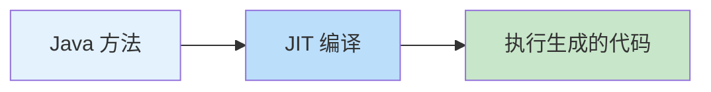

> ▲ 上图根据原文 Figure 7.30 标题和上下文推测绘制，原文为英文截图。没有内联函数的 JIT 代码执行流程。

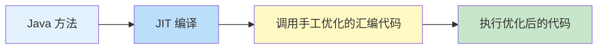

> ▲ 上图根据原文 Figure 7.31 标题和上下文推测绘制，原文为英文截图。使用内联函数的 JIT 代码执行流程，JIT 编译后调用手工优化的汇编代码。

#### 理解自旋循环提示与 PAUSE 指令（Understanding Spin-Loop Hints and PAUSE Instructions）

在多处理器（MP）系统（如 x86-64 架构）中，当一个字段或变量被锁定且一个线程获得了锁时，其他争夺同一锁的线程会进入等待循环（也称为忙等待循环、自旋等待循环或自旋循环）。这些线程被称为正在进行活跃轮询（active polling）。活跃轮询有其优点：线程可以在锁可用时立即访问它。然而，另一面是，这种循环轮询在线程仅仅在等待执行其任务时消耗大量功耗。此外，MP 系统有一个处理流水线，它会基于始终采用或从不采用的分支来推测循环执行，并最终基于推测简化循环。当循环中的线程获得锁的访问权时，流水线需要被清空（这个过程称为流水线冲刷，pipeline flushing），因为处理器所做的推测不再有效。这可能会给 MP 系统带来性能损失。

为了解决这个问题，x86-64 架构上的流式 SIMD 扩展 2（SSE2）[^10]引入了 PAUSE 指令。该指令提示这是一个自旋循环，允许向循环添加预定的延迟。Java 9 接受了这一发展，在 `java.lang.Thread` 中引入了 `onSpinWait()` 方法，允许 Java 运行时在支持的 CPU 上以内联方式调用 PAUSE 指令。

[^10]: https://www.intel.com/content/www/us/en/support/articles/000005779/processors.html

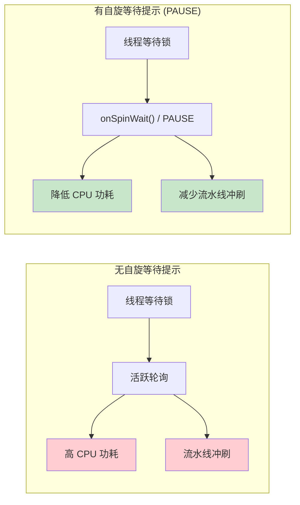

> ▲ 上图根据原文 Figure 7.32 标题和上下文推测绘制，原文为英文截图。自旋等待提示带来的改进：降低 CPU 功耗并减少流水线冲刷。

> **注意**：在非 Intel 架构或引入 PAUSE 指令之前的 Intel 架构上，该指令被视为 NOP（无操作），确保兼容性但无性能提升。

JEP 285：自旋等待提示[^11]对 Java 应用程序来说价值不可估量，特别是通过能在短自旋循环场景中有效使用 PAUSE 指令。Gil Tene，Java 领军人物、Azul Systems 的首席技术官兼联合创始人，也是自旋等待 JEP 的合著者，展示了其实际优势，他在 Figure 7.32 中复制的图表证明了这一点。

[^11]: https://openjdk.org/jeps/285

## 从每任务一线程模型向更可扩展模型的过渡（Transitioning from the Thread-per-Task Model to More Scalable Models）

在探讨了锁和自旋等待提示之后，理解 Java 中并发模型的演变至关重要。在 Java 并发领域，传统的每任务一线程（thread-per-task）模型（即每个新任务创建一个新线程）有其局限性。虽然直观，但这种方法可能变得资源密集，尤其是对于处理大量短期任务的应用程序。当我们从这种模型过渡时，出现了两种主要的可扩展性方法：

- **异步/响应式风格（Asynchronous/reactive style）**：这种方法将大型任务分解为在流水线中运行的较小任务。虽然它提供了可扩展性，但它可能并不总是与 Java 平台的特性无缝契合。
- **每请求一线程与虚拟线程（Thread-per-request with virtual threads）**：这种方法鼓励使用阻塞式、同步且可维护的代码。它充分利用了 Java 语言特性和平台能力的全部范围，对许多开发者来说更直观。

我们的讨论将进一步探索后者的实际应用，重点关注 Java 的并发框架增强。

### 传统的一对一线程映射（Traditional One-to-One Thread Mapping）

为了更好地理解传统的每任务一线程模型，让我们看一个典型的线程创建示例。当需要执行新任务时，我们创建一个 Java 进程线程（jpt）：

```java
// 传统线程创建
Thread thread = new Thread(() -> {
    // 要在线程中执行的任务
});
thread.start();
```

Figure 7.33 展示了当 JVM 进程引入线程时，JVM 进程与操作系统之间的运行时结构和交互。该图展示了 Java 中的传统线程模型。每个 Java 线程（jpt0、jpt1、jptn）通常一对一映射到操作系统线程。每个线程拥有自己的 Java 栈、程序计数器（PC）寄存器、原生栈和运行时数据。操作系统负责调度和确定线程优先级，而 Java 管理同步、锁、等待队列和线程池。将 Java 线程以一对一比例映射到操作系统线程的标准做法可能带来挑战。例如，当一个 Java 进程线程（jpt）被阻塞时，它也可能阻塞对应的操作系统线程，从而降低可扩展性。

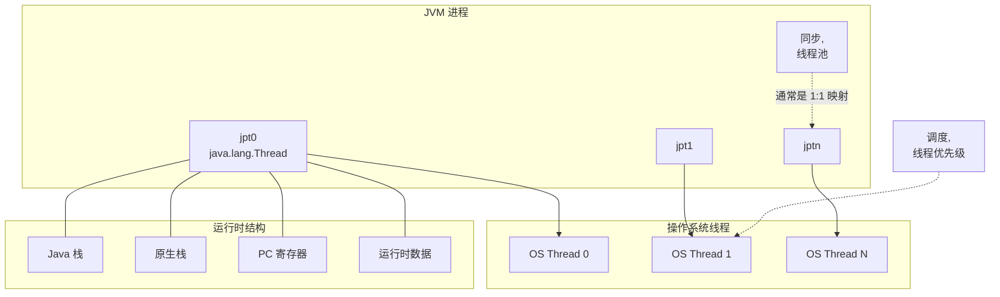

> ▲ 上图根据原文 Figure 7.33 标题和上下文推测绘制，原文为英文截图。JVM 进程、操作系统线程和运行时结构的关系图，展示了一对一线程映射。

### 使用每请求一线程模型提升可扩展性（Increasing Scalability with the Thread-per-Request Model）

为了解决一对一线程映射的可扩展性限制，Java 引入了更高级的并发工具。例如，每请求一线程（thread-per-request）模型允许每个请求或事务由单独的线程处理，从而提高了可扩展性。该模型通常与 Executor Service 等工具以及 ForkJoinPool 和 CompletableFuture 等框架结合使用。

#### Java Executor Service 与线程池（Java Executor Service and Thread Pool）

Java 的 Executor Service 框架管理一个工作线程池，允许任务在池中的现有线程上执行，而不是为每个任务创建新线程。这种方法通常被称为"线程池"或"工作线程"模型，效率更高且可扩展性更好。当用于实现每请求一线程模型时，它通过确保每个事务都有一个线程来帮助可扩展性；这些线程的开销很低，因为它们来自线程池。

以下是使用线程池为传入请求实现 Executor Service 的示例：

```java
ExecutorService executorService = Executors.newFixedThreadPool(10);
for (int i = 0; i < 1000; i++) {
    executorService.execute(() -> {
        // 要在池中某个线程上执行的任务
    });
}
executorService.shutdown();
```

Figure 7.34 展示了 Java Executor Service，它管理一个线程池。该图描述了一个阻塞队列（Blocking Q），其中持有等待被池中线程执行的任务（Task0、Task1、Task2）。这种模型促进了高效的线程管理，并有助于防止资源浪费，因为池中的线程在不处理任务时在阻塞队列上等待，而不是消耗 CPU 周期。然而，如果管理不当，这可能导致高开销，尤其是在处理阻塞操作和大量线程时。

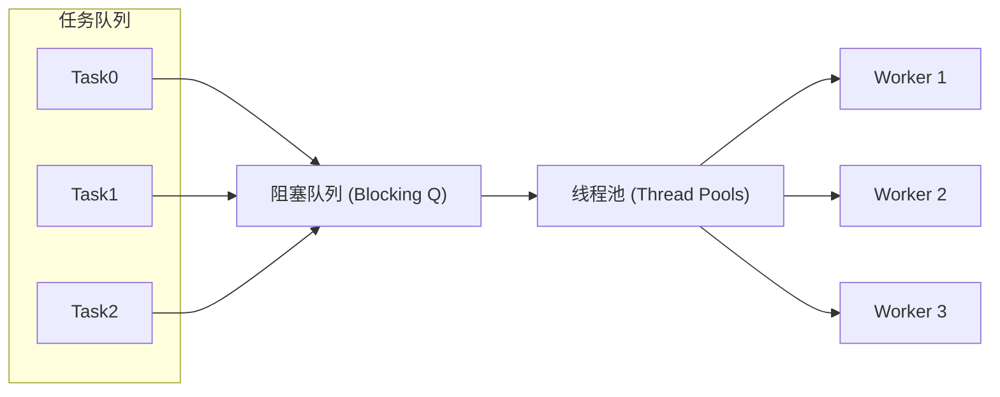

> ▲ 上图根据原文 Figure 7.34 标题和上下文推测绘制，原文为英文截图。简化的 Java Executor Service 中的阻塞队列与线程池。

#### Java ForkJoinPool 框架（Java ForkJoinPool Framework）

虽然 Executor Service 和线程池相比传统的每任务一线程模型提供了显著改进，但它们也有局限性。它们可能难以高效处理大量小任务，尤其是在本来可以从并行处理中受益的应用程序中。这就是 ForkJoinPool 框架的用武之地。

Java 7 引入的 ForkJoinPool 框架旨在最大化可被分解为更小任务以进行并行执行的程序的效率。每个工作线程管理一个双端队列（double-ended queue，DQ），允许动态执行任务。该框架使用工作窃取（work-stealing）算法，其中工作线程在任务用完后可以从其他繁忙线程的双端队列中窃取任务。这使得 ForkJoinPool 能够充分利用多个处理器，显著提高某些任务的性能。

Figure 7.35 展示了 Java ForkJoinPool 的运行机制。标记为"DQ"的椭圆代表工作线程的各个双端队列。双端队列之间的曲线箭头说明了工作窃取机制，这是一个独特的特性，允许空闲线程从其同伴的双端队列中接管任务，从而维持跨池的工作负载平衡。

```mermaid
flowchart LR
    subgraph "ForkJoinPool"
        DQ1["DQ"] --> W1["Worker 1"]
        DQ2["DQ"] --> W2["Worker 2"]
        DQ3["DQ"] --> W3["Worker 3"]
        DQ4["DQ"] --> W4["Worker n"]
    end

    DQ1 -.->|"工作窃取"| DQ2
    DQ2 -.->|"工作窃取"| DQ3
    DQ3 -.->|"工作窃取"| DQ4
    DQ4 -.->|"工作窃取"| DQ1
```

> ▲ 上图根据原文 Figure 7.35 标题和上下文推测绘制，原文为英文截图。ForkJoinPool 的工作窃取算法，展示了各工作线程的双端队列（DQ）以及它们之间的工作窃取关系。

让我们通过一个简单示例来加强学习：

```java
import java.util.concurrent.ForkJoinPool;
import java.util.concurrent.RecursiveAction;

class IncrementAction extends RecursiveAction {
    private final ReservationCounter counter;
    private final int incrementCount;

    IncrementAction(ReservationCounter counter, int incrementCount) {
        this.counter = counter;
        this.incrementCount = incrementCount;
    }

    @Override
    protected void compute() {
        // 如果递增次数较小，直接递增计数器。
        // 这是递归的基本情况。
        if (incrementCount <= 100) {
            for (int i = 0; i < incrementCount; i++) {
                counter.increment();
            }
        } else {
            // 如果递增次数较大，将任务拆分为两个较小的任务。
            // 这是递归情况。
            // ForkJoinPool 将尽可能并行执行这两个任务。
            int half = incrementCount / 2;
            IncrementAction firstHalf = new IncrementAction(counter, half);
            IncrementAction secondHalf = new IncrementAction(counter, incrementCount - half);
            invokeAll(firstHalf, secondHalf);
        }
    }
}

class ForkJoinLockLoop {
    public static void main(String[] args) throws InterruptedException {
        ReservationCounter counter = new ReservationCounter();
        ForkJoinPool pool = new ForkJoinPool();
        // 将 IncrementAction 提交给 ForkJoinPool。
        // 池负责将任务划分为更小的任务以及它们的并行执行。
        pool.invoke(new IncrementAction(counter, 1000));
        System.out.println("Final count: " + counter.getCount());
    }
}
```

此代码示例演示了如何使用 ForkJoinPool 执行 IncrementAction，这是一个递增计数器的 RecursiveAction。根据递增次数，它要么直接递增计数器，要么将任务拆分为更小的任务进行递归调用。

#### Java CompletableFuture

在深入探讨虚拟线程之前，理解 Java 并发工具箱中的另一个强大工具至关重要：CompletableFuture。CompletableFuture 框架在 Java 8 中引入，表示一个可以以受控方式完成的未来计算，从而提供丰富的 API，以函数式风格组合和编排任务。

CompletableFuture 的突出特性之一是它处理异步计算的能力。与代表可能尚未完成的计算结果的 Future 不同，CompletableFuture 可以在任何时候手动完成。这使其成为处理可能异步计算的任务的强大工具。

CompletableFuture 还与 Java Streams API 无缝集成，允许进行复杂的数据转换和计算，有助于编写更具可读性和可维护性的并发代码模式。此外，它提供了强大的错误处理能力。开发者可以指定在计算异常完成时要执行的操作，简化了并发上下文中的错误处理。

```mermaid
flowchart TB
    subgraph "CompletableFuture 包装器"
        CF1["CF"] --> CF2["CF"]
        CF2 --> CF3["..."]
        CF3 --> CFN["CF"]
    end

    subgraph "异步线程池"
        CF1 --> Pool["异步线程池"]
        CF2 --> Pool
        CFN --> Pool
    end

    subgraph "管理完成阶段和任务链"
        CF1 -.->|"任务链"| CF2
        CF2 -.->|"任务链"| CF3
    end

    style CF1 fill:#e1f5fe
    style CF2 fill:#e1f5fe
    style CFN fill:#e1f5fe
    style Pool fill:#c8e6c9
```

> ▲ 上图根据原文 Figure 7.36 标题和上下文推测绘制，原文为英文截图。CompletableFuture 的任务管理与执行图，展示了 CompletableFuture 实例（CF）在异步线程池中的管理以及任务链。

在底层，CompletableFuture 在标准线程池之上使用包装器，为管理和控制任务提供了更高层次的抽象。Figure 7.36 通过演示各个 CompletableFuture 实例（标记为"CF"）如何被管理来描述这种抽象。这些实例在异步线程池中执行，体现了并发原则——任务独立于主应用程序流程并行运行。该图还展示了 CompletableFuture 实例如何被链式组合，利用其 API 管理完成阶段和任务序列，从而展示了该框架的组合能力。

以下是在 ReservationService 上下文中如何使用 CompletableFuture 的简单示例：

```java
class ReservationService {
    private final ReservationCounter hotelCounter = new ReservationCounter();
    private final ReservationCounter flightCounter = new ReservationCounter();
    private final ReservationCounter carRentalCounter = new ReservationCounter();

    void incrementCounters() {
        CompletableFuture<Void> hotelFuture =
            CompletableFuture.runAsync(new DoActivity(hotelCounter));
        CompletableFuture<Void> flightFuture =
            CompletableFuture.runAsync(new DoActivity(flightCounter));
        CompletableFuture<Void> carRentalFuture =
            CompletableFuture.runAsync(new DoActivity(carRentalCounter));

        // 组合所有 futures
        CompletableFuture<Void> combinedFuture =
            CompletableFuture.allOf(hotelFuture, flightFuture, carRentalFuture);

        // 阻塞直到所有 future 完成
        combinedFuture.join();
    }
}
```

在这个例子中，我们为每个 `DoActivity` 任务创建了一个 `CompletableFuture`。然后我们使用 `CompletableFuture.allOf` 将这些 future 组合成单个 `CompletableFuture`。当所有原始 future 都完成时，这个组合后的 future 才完成。通过对组合后的 future 调用 `join`，我们阻塞直到所有递增操作完成。因此，这个例子演示了如何使用 CompletableFuture 来管理和协调多个异步任务。

在下一节中，我们将看到虚拟线程如何在这些概念的基础上重新构想 Java 的并发。这种方法提倡使用可维护的阻塞（即同步）代码，同时充分利用 Java 语言和平台的功能。

## 用虚拟线程重新构想并发（Reimagining Concurrency with Virtual Threads）

传统上，线程作为 Java 的并发单元，是并发和顺序执行的。然而，将 Java 线程映射到操作系统线程的典型模型存在局限性。在处理阻塞操作和线程池时，这种模型尤其成问题。

在 JDK 21 中引入的 Project Loom[^12][^13]，旨在重新构想 Java 中的并发。它引入了虚拟线程（virtual threads），即由 JVM 管理的轻量级、高效的线程，使 Java 能够在不采用异步或响应式方法的情况下实现更好的可扩展性。

[^12]: https://openjdk.org/jeps/444
[^13]: www.infoq.com/news/2023/04/virtual-threads-arrives-jdk21/

### Project Loom 中的虚拟线程（Virtual Threads in Project Loom）

虚拟线程，也称为轻量级线程，是一种新型的 Java 线程。与传统线程由操作系统管理不同，虚拟线程由 JVM 管理。这使得 JVM 比操作系统创建和切换传统线程更加高效地创建和切换虚拟线程。虚拟线程旨在具有低内存占用和快速启动时间，使其非常适合需要高并发的任务。

让我们在前面的图示基础上进一步理解并建立视觉关系。Figure 7.37 是 Project Loom 引入的新模型的高层概览图。在这个模型中，可以在单个 JVM 进程中创建大量 Java 虚拟线程（jvt0、jvt1、jvtn）。这些虚拟线程不直接映射到操作系统线程。相反，它们由 JVM 管理，JVM 可以根据需要将它们调度到较少数量的操作系统线程上。

Figure 7.37 还引入了载体线程（carrier threads）的概念。每个虚拟线程被调度到一个载体线程上，载体线程是传统的一对一映射到操作系统线程的 Java 线程。JVM 可以在多个虚拟线程之间切换载体线程，允许它同时管理多个虚拟线程。该模型还突出了工作窃取算法，其中空闲的载体线程可以从繁忙载体线程的队列中窃取任务，从而更好地利用系统资源。

```mermaid
flowchart TB
    subgraph "JVM 进程"
        subgraph "虚拟线程任务队列"
            VTQ0["Q"]
            VTQ1["Q"]
            VTQN["Q"]
        end

        subgraph "虚拟线程"
            jvt0["jvt0<br/>java.lang.Thread<br/>.startVirtualThread()"]
            jvt1["jvt1"]
            jvtn["jvtn"]
        end

        subgraph "载体线程池"
            CT0["Carrier 0"]
            CT1["Carrier 1"]
            CTN["Carrier N"]
        end

        jvt0 --> VTQ0
        jvt1 --> VTQ1
        jvtn --> VTQN

        VTQ0 --> CT0
        VTQ1 --> CT1
        VTQN --> CTN

        CT0 -.->|"工作窃取"| CT1
        CT1 -.->|"工作窃取"| CTN
    end

    subgraph "操作系统线程"
        OS0["OS Thread 0"]
        OS1["OS Thread 1"]
        OSN["OS Thread N"]
    end

    CT0 --> OS0
    CT1 --> OS1
    CTN --> OSN
```

> ▲ 上图根据原文 Figure 7.37 标题和上下文推测绘制，原文为英文截图。Java 虚拟线程模型图，展示了虚拟线程（jvt）、载体线程池和操作系统线程之间的关系。

### 虚拟线程及其载体（Virtual Threads and Their Carriers）

虚拟线程的生命周期可能涉及被调度到不同的载体线程上。尽管如此，虚拟线程在任何给定时刻都对其调度在哪个特定的载体线程上一无所知。

需要理解的一个关键方面是载体线程和虚拟线程之间栈跟踪的分离。如果在虚拟线程中抛出异常，生成的栈跟踪将不包含来自载体线程的任何帧。这种分离在生成线程转储时也很明显：虚拟线程的栈帧与其载体线程的栈帧保持独立，不会混淆。

类似地，线程局部变量（thread-local）也保持这种分离。与载体线程关联的任何线程局部变量对虚拟线程不可访问，反之亦然。这确保了载体线程和虚拟线程的状态保持独立，进一步强调了虚拟线程的封装性。

> **注意**：JEP 444：虚拟线程[^14]明确说明虚拟线程永远不应该被池化。JVM 的调度程序会为你处理这一步。

[^14]: https://openjdk.org/jeps/444

### 与虚拟线程和现有 API 的集成（Integration with Virtual Threads and Existing APIs）

Project Loom 的关键目标之一是确保虚拟线程可以与现有 API 无缝集成。因此，开发者可以在现有库和框架中使用虚拟线程，而无需进行重大的代码修改。

在传统的 Java 并发中，ExecutorService API 一直是管理线程的基石。通过 Project Loom，该 API 已得到增强，可以与虚拟线程和谐地协同工作。例如，在我们的 ReservationService 示例中，任务被提交给 ExecutorService，然后由它处理创建和调度虚拟线程的复杂性。这种无缝集成扩展到其他 API，如 CompletableFuture，它现在支持带有虚拟线程的 `runAsync` 方法，并且向后兼容，允许开发者在不更改遗留代码的情况下使用虚拟线程。这种集成强调了开发者在其应用程序中采用虚拟线程的便利性，无需熟悉新 API 或彻底改造现有代码即可获得改进的可扩展性和性能的好处。

### 使用虚拟线程的实践示例（Practical Example Using Virtual Threads）

为了进一步说明虚拟线程的无缝集成，让我们考虑一个简单的 ReservationCounter 示例：

```java
class ReservationService {
    private final ReservationCounter hotelCounter = new ReservationCounter();
    private final ReservationCounter flightCounter = new ReservationCounter();
    private final ReservationCounter carRentalCounter = new ReservationCounter();

    void incrementCounters() {
        try (var executor = Executors.newVirtualThreadPerTaskExecutor()) {
            executor.submit(new DoActivity(hotelCounter));
            executor.submit(new DoActivity(flightCounter));
            executor.submit(new DoActivity(carRentalCounter));
        }
    }
}

class ReservationCounter {
    private int count = 0;

    synchronized void increment() {
        count++;
    }

    synchronized int getCount() {
        return count;
    }
}

class DoActivity implements Runnable {
    private final ReservationCounter counter;

    DoActivity(ReservationCounter counter) {
        this.counter = counter;
    }

    @Override
    public void run() {
        for (int i = 0; i < 1000; i++) {
            counter.increment();
        }
    }
}

class LoomLockLoop {
    public static void main(String[] args) throws InterruptedException {
        ReservationService service = new ReservationService();
        service.incrementCounters();
        System.out.println("Final hotel count: " + service.hotelCounter.getCount());
        System.out.println("Final flight count: " + service.flightCounter.getCount());
        System.out.println("Final car rental count: " + service.carRentalCounter.getCount());
    }
}
```

在这个例子中，`DoActivity` 类是一个 `Runnable`，它将 `ReservationCounter` 递增 1000 次。我们引入了一个 `ReservationService`，它管理三个不同的计数器——一个用于酒店预订，一个用于航班预订，一个用于租车预订。在 `incrementCounters` 方法中，我们为每个计数器创建一个新的 `DoActivity` 并将其提交给 `ExecutorService`。每次提交都会创建一个新的虚拟线程来执行 `DoActivity` 的 `run` 方法。这使得三个计数器的递增操作可以并发执行，展示了虚拟线程在处理多个并发任务时的效率和可扩展性。

### 虚拟线程的并行性（Parallelism with Virtual Threads）

当目标是有效管理并行任务时，虚拟线程提供了显著的优势。如前面的示例所示，我们可以创建大量虚拟线程来并发执行任务。然而，虚拟线程的真正力量在于 JVM 管理这些线程并将其调度到载体线程上执行的能力。

虚拟线程调度器的并行性由可用于调度虚拟线程的载体线程数量决定。开箱即用，该值与可用处理器的数量匹配，但可以通过系统属性 `jdk.virtualThreadScheduler.parallelism` 进行调整。因此，即使我们可能有大量虚拟线程，实际使用的操作系统线程数量是有限的，从而可以实现高效的资源利用。

为了说明这种方法，让我们增强我们的 `ReservationCounter` 示例，为每个活动使用虚拟线程并并行执行递增操作：

```java
class ReservationService {
    private final ReservationCounter hotelCounter = new ReservationCounter();
    private final ReservationCounter flightCounter = new ReservationCounter();
    private final ReservationCounter carRentalCounter = new ReservationCounter();

    void incrementCounters() {
        try (var executor = Executors.newVirtualThreadPerTaskExecutor()) {
            CompletableFuture<Void> hotelFuture = CompletableFuture.runAsync(
                new DoActivity(hotelCounter), executor);
            CompletableFuture<Void> flightFuture = CompletableFuture.runAsync(
                new DoActivity(flightCounter), executor);
            CompletableFuture<Void> carRentalFuture = CompletableFuture.runAsync(
                new DoActivity(carRentalCounter), executor);
            
            // 等待所有操作完成
            CompletableFuture.allOf(hotelFuture, flightFuture, carRentalFuture).join();
        }
    }
}
// ... 其余类保持不变 ...

class LoomLockLoop {
    public static void main(String[] args) throws InterruptedException {
        ReservationService service = new ReservationService();
        service.incrementCounters();
        System.out.println("Final hotel count: " + service.hotelCounter.getCount());
        System.out.println("Final flight count: " + service.flightCounter.getCount());
        System.out.println("Final car rental count: " + service.carRentalCounter.getCount());
    }
}
```

在这个版本中，我们使用 `CompletableFuture.runAsync`（在 Java CompletableFuture 框架部分介绍过）将 `DoActivity` 任务提交给执行器。这会返回一个在任务完成时完成的 `CompletableFuture`。然后我们使用 `CompletableFuture.allOf` 创建一个新的 `CompletableFuture`，它在所有给定的 future 都完成时完成。这使我们能够等待所有递增操作完成后再打印最终计数，展示了如何使用虚拟线程高效处理并行任务。

### 延续性：虚拟线程的基础（Continuations: The Underpinning of Virtual Threads）

在底层，Project Loom 中虚拟线程的实现基于延续性（continuations）的概念。延续性表示一个可以挂起和恢复的计算。它本质上是一个保存的栈帧，当计算恢复时可以重新加载。

这种挂起和恢复计算的能力是虚拟线程如此轻量的原因。与传统线程即使在被阻塞时也消耗资源不同，虚拟线程只在真正执行工作时消耗资源。

延续性是一个强大的概念，但它们对开发者来说大多是透明的。当你使用虚拟线程时，你不需要担心自己管理延续性。JVM 会为你处理所有细节。

在我们的 `ReservationService` 示例中，每个 `DoActivity` 任务在由 `ExecutorService` 执行时都可能被挂起和恢复多次。这是因为每个 `DoActivity` 任务都在虚拟线程上运行，当虚拟线程被阻塞时（例如，在等待 `ReservationCounter` 上的锁时），JVM 会将其当前状态保存为一个延续性，并切换到执行另一个虚拟线程。当阻塞操作完成时，JVM 可以通过重新加载其延续性来恢复被挂起的虚拟线程。

## 结论（Conclusion）

在本章中，我们穿越了 JVM 运行时性能优化的复杂版图，从字符串到锁，揭示了各个方面。我们从揭秘字符串优化开始，包括字符串池的复杂性、字符串内联以及字符串去重的变革性影响。然后我们转向了锁的话题及其在同步中的作用。

接着，我们深入探讨了并发领域，讨论了传统的并发模型及其固有的挑战，以及 Executor Service 和 ForkJoinPool 框架提供的创新解决方案。这些工具为线程管理和并发任务执行提供了全新的视角。此外，CompletableFuture 框架成为处理异步计算的灯塔，拥抱了函数式编程的优雅性。最后，我们通过 Project Loom 探索了虚拟线程和延续性的概念。这一举措标志着 Java 并发的一个转折点，有望在 JVM 内管理轻量级线程方面提供更大的可扩展性和效率。

展望未来，我们可以期待 JVM 性能优化的进一步进展。对于性能工程师来说，及时了解这些发展并理解如何利用它们来构建更好的软件至关重要。

归根结底，性能工程是关于做出明智的决策。它关乎理解权衡、了解你手中的工具和技术，并明智地应用它们来实现你的性能目标。本章旨在为你提供对这些要素更深入的理解，我相信它将作为你作为性能工程师的持续旅程中的宝贵资源。

---

> **总字数统计说明**：本章英文原文字数约为 14,218 词，包含 69 个 Figure 和 10 个 Table，是全书图表最多的章节。所有 Figure 和 Table 均已根据上下文推测绘制为 Mermaid 图表和 Markdown 表格。
