# 第8章 加速OpenJDK HotSpot VM稳态时间

无论是微服务架构、在容器化环境中部署应用，还是使用传统的服务器端环境，JVM 启动和预热优化的原则和技术都保持一致。

## JVM 启动与预热优化技术

JIT 编译器持续改进，极大地促进了 JVM 启动和爬升（ramp-up，包含预热）优化。字节码解释方面的增强带来了爬升性能的提升。此外，类数据共享（Class Data Sharing）通过预处理类文件来优化启动，加速类文件的加载并实现 JVM 进程之间的数据共享。这减少了类加载所需的时间和内存，从而提升了启动性能。

JDK 8 从永久代（PermGen）到元空间（Metaspace）的转变对爬升时间产生了积极影响。与具有固定最大大小的 PermGen 不同，Metaspace 会根据应用的运行时需求动态调整其大小。这种灵活性带来了更高效的内存使用和更快的爬升时间。

同样，JDK 9 中引入的代码缓存分段（code cache segmentation）在提升爬升性能方面发挥了重要作用。它使 JVM 能够为非方法代码（non-method）、带分析信息代码（profiled）和不带分析信息代码（non-profiled）维护独立的代码缓存，改善了编译代码的组织和检索，进一步提升了性能。

展望未来，Project Leyden 旨在减少 Java 在 HotSpot VM 上的启动时间，专注于通过静态映像（static images）提高效率。将视野拓宽到 HotSpot 之外，还有一个主要角色——GraalVM，它强调通过原生映像（native images）实现更快的启动和更小的内存占用。

## 解码 Java 应用中的稳态时间

### 准备，就绪，启动！

在 Java/JVM 应用的语境中，启动（start-up）指的是从 JVM 被调用开始，到应用的主方法开始执行为止的关键过程。这个复杂的过程包含多个阶段——即 JVM 引导、字节码加载、以及字节码验证与准备。这些操作的效率和速度显著影响应用的启动性能。

然而，正如我的同事 Ludovic Henry 正确指出的那样，这个定义可能过于局限。

从更广泛的意义上讲，启动过程超出了 `Application.main` 方法的执行范围——它涵盖了从初始化开始直到应用开始提供其主要服务的整个过程。例如，对于 Web 服务而言，启动过程不仅限于 JVM 的初始化，而是持续到服务开始处理请求为止。

这个扩展后的启动阶段涉及应用自身的初始化过程，例如解析命令行参数或配置，包括设置套接字、文件和其他资源。这些任务可能触发额外的类加载，甚至可能导致 JIT 编译并流入爬升阶段。这些操作的效率和速度在决定应用的整体启动性能方面起着关键作用。

### JVM 启动的阶段

让我们更详细地探讨 JVM 启动过程中的具体阶段。

#### JVM 引导

这个基础阶段专注于启动 JVM 和设置运行时环境。此阶段执行的任务包括解析命令行参数、将 JVM 代码加载到内存中、初始化 JVM 内部数据结构、设置内存管理以及建立初始 Java 线程。这个阶段对于应用的成功执行是不可或缺的。

例如，考虑命令 `java OnlineLearningPlatform`。该命令启动 JVM 并调用 `OnlineLearningPlatform` 类，标志着 JVM 引导阶段的开始。在这里的上下文中，`OnlineLearningPlatform` 代表一个旨在提供在线学习资源的 Web 服务。

#### 字节码加载

在这个阶段，JVM 加载启动应用所需的必要 Java 类。这包括加载包含应用 `main` 方法的类，以及在 `main` 方法执行期间引用的任何其他类，包括来自标准库的系统类。类加载器通过从 classpath 读取 `.class` 文件，并将这些文件中的字节码转换为 JVM 可执行的格式，来执行类加载。

所以，以 `OnlineLearningPlatform` 类为例，我们可能会有一个 `Student` 类在这个阶段被加载。

#### 字节码验证与准备

在类加载之后，JVM 会验证加载的字节码是否具有正确的格式并符合 Java 的类型系统。它还会通过为类变量分配内存、将它们初始化为默认值以及执行任何静态初始化块来为执行准备类。Java 语言规范（JLS）严格定义了此过程，以确保不同 JVM 实现之间的一致性。

例如，`OnlineLearningPlatform` 类可能有一个 `Course` 类，该类有一个静态初始化块用于初始化 `courseDetails` 映射。这个初始化过程发生在字节码验证与准备阶段。

```java
public class Course {
    private static Map<String, String> courseDetails;
    static {
        // 静态初始化课程详情
        courseDetails = new HashMap<>();
        courseDetails.put("Math101", "基础数学");
        courseDetails.put("Eng101", "英国文学");
        // 其他课程
    }
    // 其他方法
}
```

启动阶段至关重要，因为它直接影响用户体验和系统资源利用率。缓慢的启动会导致糟糕的用户体验，尤其是在用户等待应用启动的交互式应用中。此外，它还会导致系统资源的低效使用，因为 JVM 和底层系统在启动期间需要做大量的工作。

### 达到应用的稳态

除了启动阶段之外，Java 应用的生命周期还包括其他两个重要阶段：爬升阶段和稳态阶段。一旦应用开始执行其主要功能，它就进入爬升阶段，该阶段的特征是应用性能逐渐提升，直到达到峰值性能。稳态阶段发生在应用以峰值性能执行其主要工作负载时。

让我们仔细看看爬升阶段，在此期间应用执行以下几项任务：

- **解释器和 JIT 编译**：最初，JVM 将方法的字节码解释为原生代码。这些方法来自加载和初始化的类。JVM 随后执行这些原生代码。随着应用继续运行，JVM 会识别出频繁执行的代码路径（热路径）。这些路径随后被 JIT 编译以获得优化的性能。JIT 编译器采用各种优化技术来生成高效的原生代码，这可以显著提升应用的性能。
- **特定任务的类加载**：当应用开始其主要任务时，它可能需要加载特定于这些操作的额外类。
- **缓存预热**：应用（如果使用）和 JVM 都有存储频繁访问数据的缓存。在爬升期间，这些缓存被填充或"预热"了频繁访问的数据，确保后续操作中更快的数据检索。

让我们来具体化这个场景：假设除了我们的 `Course` 类之外，我们还有一个 `Instructor` 类，它在我们 Web 服务初始化并获取最新讲师列表后被加载。对于那个 `Instructor` 类，`teach` 方法可能是 JIT 编译器优化的众多方法之一。

现在看看图 8.1 中的类图，它展示了 `OnlineLearningPlatform` Web 服务与 `Student`、`Course` 和 `Instructor` 类及其关系。`OnlineLearningPlatform` 类是在 JVM 引导阶段调用的主类。`Student` 类可能在字节码加载阶段被加载。`Course` 类及其静态初始化块说明了字节码验证与准备阶段。`Instructor` 类在爬升阶段被加载，而 `teach` 和 `getCourseDetails` 方法在爬升期间可能达到不同的优化级别。一旦它们达到峰值性能，Web 服务就准备好进入稳态性能了。

图 8.2 中的阶段图表显示了当应用经历其生命周期的各个阶段时的 JIT 编译时间、类加载时间和垃圾收集时间。让我们进一步研究这些阶段并构建一个应用时间线。

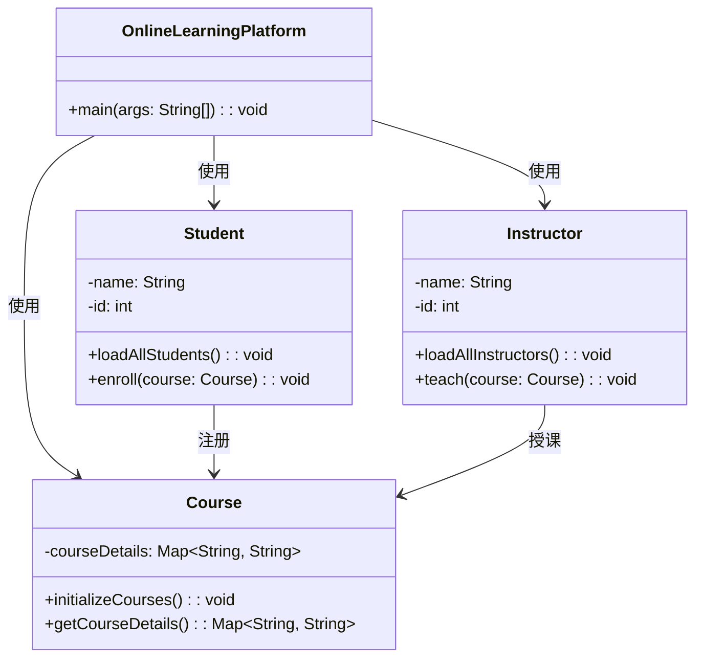

> ▲ 上图根据原文 Figure 8.1 标题和上下文推测绘制，原文为英文截图

**图 8.1 OnlineLearningPlatform Web 服务的类图**

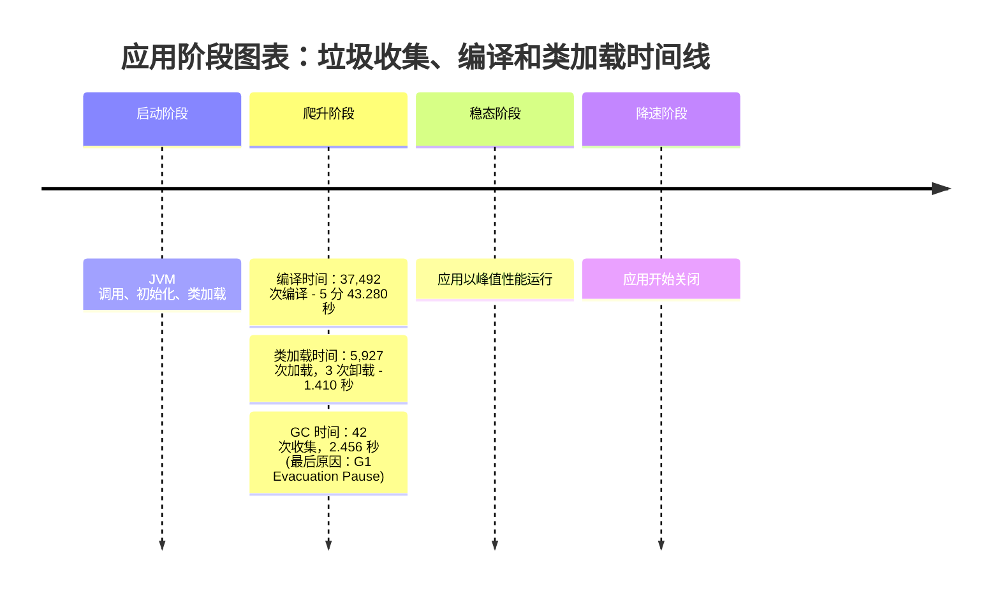

> ▲ 上图根据原文 Figure 8.2 标题和上下文推测绘制，原文为英文截图

**图 8.2 应用阶段图表：显示垃圾收集、编译和类加载时间线**

### 应用的生命周期

对于大多数设计良好的应用，我们会看到一个经历以下阶段的生命周期（如图 8.3 所示）：

- **启动**：JVM 被调用，在应用初始化其状态后开始过渡到下一阶段。启动阶段包括 JVM 初始化、类加载、类初始化和应用初始化工作。
- **爬升**：这个阶段的特征是代码生成的逐步改善，导致应用性能不断增长，直到达到峰值性能。
- **稳态**：在这个阶段，应用以峰值性能执行其主工作负载。
- **降速**：在这个阶段，应用开始关闭并释放资源。
- **应用停止**：JVM 终止，应用停止。

图 8.3 中的时间线从左到右表示时间的推进。应用在完成初始化后启动，然后开始爬升。应用在爬升阶段之后达到其稳态。当应用准备停止时，它进入降速阶段，最后应用停止。

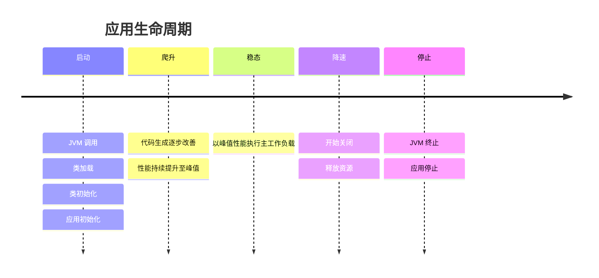

> ▲ 上图根据原文 Figure 8.3 标题和上下文推测绘制，原文为英文截图

**图 8.3 应用生命周期**

### 管理启动和爬升阶段的状态

状态管理是 Java 应用性能的关键方面，尤其是在启动和爬升阶段。应用的状态包含各种元素，包括数据、套接字、文件等。正确管理状态可确保应用高效运行，并为其后续操作奠定基础。

#### 启动期间的状态

启动时的状态是所有变量、对象和资源在那个时刻的综合快照：

- **静态变量**：即使在创建它们的方法执行完毕后仍保留其值的变量。
- **堆对象**：在运行时动态分配并驻留在内存堆区域中的对象。
- **运行中的线程**：由应用执行的编程指令序列。
- **资源**：应用使用的文件描述符、套接字和其他资源。

图 8.4 中的流程图总结了应用状态的初始化过程，从静态变量的加载到资源的分配，以及通过爬升过渡到稳态的过程。

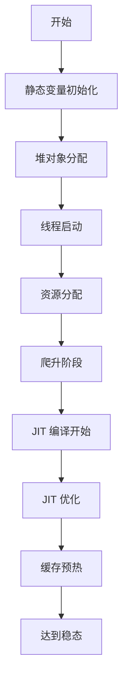

> ▲ 上图根据原文 Figure 8.4 标题和上下文推测绘制，原文为英文截图

**图 8.4 应用状态管理流程图**

#### 过渡到爬升和稳态

在启动阶段之后，应用进入爬升阶段，在此阶段它开始处理实际工作负载。在此阶段，JIT 编译器根据实际使用模式优化代码。爬升阶段的终点是应用达到稳态。此时，性能趋于稳定，JIT 编译器已优化了应用的大部分代码。

如图 8.5 所示，从启动到稳态的持续时间被称为"稳态时间"（time to steady-state）。这个指标对于衡量应用的性能至关重要，尤其是对于生命周期较短或在无服务器环境中运行的应用。在这些场景中，快速启动和高效的工作负载爬升至关重要。

图 8.4 和图 8.5 共同提供了应用从启动阶段到达到稳态的生命周期可视化表示，突出了高效状态管理的重要性。

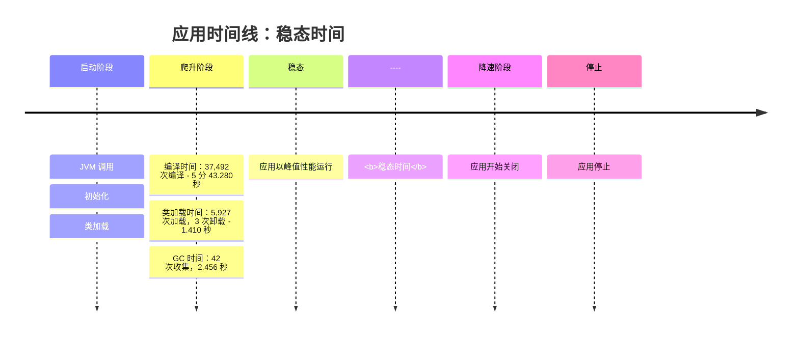

> ▲ 上图根据原文 Figure 8.5 标题和上下文推测绘制，原文为英文截图

**图 8.5 描述稳态时间的应用时间线**

#### 高效状态管理的收益

在启动和爬升阶段进行正确的状态管理可以减少稳态时间，带来以下收益：

- **提升性能**：减少初始化和加载数据结构的时间，加速应用过渡到稳态，从而提升性能。
- **优化内存使用**：高效的状态管理减少了存储应用状态所需的内存量，从而减小内存占用。
- **更好的资源利用**：在硬件和操作系统层面，精简的状态管理可以带来更好的 CPU 和内存资源利用，并减少操作系统文件系统和网络系统的负载。
- **容器化环境**：在应用运行于容器的环境中，状态管理更为关键。在这些场景中，资源通常更为受限，并且需要容纳容器运行时的开销。

在当前 HotSpot VM 的格局中，有一项技术在管理状态和改善稳态时间性能方面脱颖而出：类数据共享（Class Data Sharing）。

## 类数据共享

类数据共享（Class Data Sharing，CDS）是一项强大的 JVM 特性，旨在显著提升 Java 应用的启动性能。它通过预处理类文件并将其转换为可在多个 JVM 实例之间共享的内部格式来实现这一目标。该特性对于使用大量类的复杂应用尤其有益，因为它减少了加载这些类所需的时间，从而加速了启动时间。

### 共享归档文件的结构

由 CDS 创建的共享归档文件是一种高效且组织良好的数据结构，包含多个共享空间。每个空间专门用于存储不同类型的数据。例如：

- **MiscData 空间**：该空间保留给各种元数据类型。
- **ReadWrite 和 ReadOnly 空间**：这些空间分配给实际的类数据。

这种结构化的方法优化了数据检索并简化了加载过程，有助于实现更快的启动时间。

### 内存映射与直接使用

在 JVM 启动时，共享归档文件被内存映射到其进程空间中。由于共享归档文件中的类数据已经采用 JVM 内部格式，因此可以直接使用，无需任何转换。这种直接访问进一步缩短了启动时间。

### 多实例收益

CDS 的收益不仅限于单个 JVM 实例。共享归档文件可以内存映射到同一台机器上运行的多个 JVM 进程中。这种内存映射和共享机制在云环境中尤其有益，因为资源限制和成本效益是首要考虑因素。允许多个 JVM 实例共享相同的物理内存页面可减少整体内存占用，从而提升资源利用率并降低成本。此外，这种共享机制改善了后续 JVM 实例的启动时间，因为共享归档文件已经被第一个 JVM 实例加载到内存中。这在无服务器环境中被证明是无价的，因为在这种环境中，对事件的快速函数启动至关重要。

### 使用 -XX:ArchiveClassesAtExit 进行动态转储

`-XX:ArchiveClassesAtExit` 选项允许 JVM 将应用加载的类动态转储到共享归档文件中。通过在下次 JVM 启动时预加载应用实际使用的类，该特性可以精细调优启动性能。

使用 CDS 涉及以下步骤：

1. 生成包含预处理类数据的共享归档文件。这通过 `-Xshare:dump` JVM 选项完成。
2. 生成归档文件后，JVM 实例可以使用 `-Xshare:on` 和 `-XX:SharedArchiveFile` 选项来使用它。

例如：

```bash
java -Xshare:dump -XX:SharedArchiveFile=my_app_cds.jsa -cp my_app.jar
java -Xshare:on -XX:SharedArchiveFile=my_app_cds.jsa -cp my_app.jar MyMainClass
```

在这个例子中，第一个命令为 `my_app.jar` 使用的类生成了一个共享归档文件，第二个命令使用该共享归档文件运行应用。

## 提前编译（AOT）

提前编译（Ahead-of-time，AOT）是一种在管理状态和改善受管运行时中达到峰值性能的时间方面发挥重要作用的技术。AOT 在 JDK 9 中引入，旨在通过在调用 JVM 之前将方法编译为原生代码来提升启动性能。这种预编译意味着原生代码已经准备就绪，无需等待字节码的解释。这种方法对于生命周期较短的应用尤其有益，因为在这些应用中 JIT 编译器可能没有足够的时间来有效优化代码。

> **注意** 在我们深入探讨 AOT 的细节之前，理解其对应的 JIT 编译至关重要。在 HotSpot VM 中，解释器是第一个执行的，但它不优化代码。JIT 过程引入了优化，但它需要时间来收集频繁执行的方法和循环的分析数据。因此，对于需要优化状态才能高效执行的代码来说，存在延迟。多个组件共同将代码过渡到其优化状态。例如，（分段的）代码缓存以各种状态（例如，带分析信息和不带分析信息）维护 JIT 代码。此外，编译线程通过自适应优化（adaptive optimization）和推测性优化（speculative optimization）来管理优化和去优化状态。值得注意的是，HotSpot VM 推测性地优化动态状态，有效地将它们转换为静态状态[^1]。这些元素共同支持代码从其初始的解释状态过渡到其优化的形式，这可以被视为 JIT 编译的开销。

[^1]: John Rose 在 JVMLS 2023 的演讲中指出了这一行为：https://cr.openjdk.org/~jrose/pres/202308-Leyden-JVMLS.pdf

AOT 为动态语言引入了静态编译。在 HotSpot VM 之前，IBM 的 J9 和 Excelsior JET 等平台已经成功采用了 AOT。依赖配置分析引导技术（profile-guided techniques）提供自适应优化的执行引擎，可能会因需要预热阶段而遭受启动缓慢的问题。在 HotSpot VM 的情况下，编译始终从解释模式开始。AOT 编译通过其预编译的方法和共享库，是对这些预热挑战的绝佳解决方案。有了 AOT 在前台运作和自适应优化器在后台支持，应用可以快速达到其峰值性能。

在 JDK 9 中，AOT 特性处于实验状态，并构建在 Graal 编译器之上。Graal 是一个用 Java 编写的动态编译器，而 HotSpot VM 是用 C++ 编写的。为了支持 Graal，HotSpot VM 需要支持一个新的 JVM 编译器接口，称为 JVMCI[^2]。对此的首次尝试针对少数已知库完成，例如 `java.base`、`jdk.compiler`、`jdk.vm.compiler` 等。

添加到 JDK 9[^3] 中的 AOT 代码在两个层面上工作——分层模式（tiered）和非分层模式（non-tiered），其中非分层模式是默认执行模式，旨在增加应用的响应速度。分层模式类似于 HotSpot VM 分层编译的 T2 级别，即带分析信息的客户端编译器。之后，超过 AOT 调用阈值的方法由客户端编译器在 T3 级别重新编译，并对这些方法进行完整的分析，最终由服务端编译器在 T4 级别进行重新编译。

AOT 编译可以与 CDS 结合使用，以进一步提高启动性能。CDS 特性允许 JVM 在不同 Java 进程之间共享公共类元数据，而 AOT 编译允许 JVM 使用预编译代码而不是解释字节码。当一起使用时，这些特性可以显著减少启动时间和内存占用。

然而，AOT 编译器（在 OpenJDK HotSpot VM 的上下文中）面临某些限制。例如，AOT 编译的代码必须存储在共享库中，这需要使用位置无关代码（position-independent code，PIC）[^4]。这个要求是因为代码加载到内存中的位置无法预先确定，阻止了 AOT 编译器进行基于位置的优化。相比之下，JIT 编译器可以对执行环境做出更多假设，并相应地优化代码。JIT 编译器可以直接引用符号，消除了间接引用的需要，从而产生更高效的代码。然而，JIT 编译器的这些优化增加了启动时间，因为编译过程发生在应用执行期间。相比之下，直接执行字节码的解释器不需要花时间编译代码，但解释代码的执行速度通常比编译代码慢得多。

[^2]: https://openjdk.org/jeps/243
[^3]: https://openjdk.org/jeps/295
[^4]: https://docs.oracle.com/cd/E26505_01/html/E26506/glmqp.html

> **注意** 值得注意的是，不同的虚拟机，例如 GraalVM，以实现 AOT 编译的方式可以克服其中一些限制。特别是，GraalVM 的 AOT 编译结合配置分析优化（profile-guided optimizations，PGO）可以实现与 JIT 相当的峰值性能[^5]，甚至允许利用封闭世界假设（closed-world assumption）进行某些在 JIT 设置中不可行的优化。此外，GraalVM 的 AOT 编译器可以编译 100% 的代码——这可能是一个优于 JIT 的优势，因为在 JIT 中一些"冷"代码可能保持解释执行。

[^5]: Alina Yurenko. "GraalVM for JDK 21 Is Here!" https://medium.com/graalvm/graalvm-for-jdk-21-is-here-ee01177dd12d#0df7

## Project Leyden：Java 性能的新黎明

虽然 AOT 承诺了性能提升，但它给 HotSpot VM 增加的复杂性掩盖了其收益。维护一个独立的 AOT 编译器的挑战、因其依赖 Graal 编译器而产生的额外维护负担，以及生成 PIC 的低效，都清楚地表明需要一种不同的方法[^6]。这导致了 Project Leyden 的诞生。

[^6]: https://devblogs.microsoft.com/java/aot-compilation-in-hotspot-introduction/

Java 应用性能的本质在于理解和管理各种状态——特别是通过捕获变量、对象和资源的快照，并确保它们被高效利用。这就是 Project Leyden 发挥作用的地方。Leyden 在 JDK 17 中引入，旨在解决 Java 启动慢、达到峰值性能的时间慢以及内存占用大的挑战。它不仅仅是关于更快的启动；而是关于确保 Java 应用的整个生命周期，从启动到稳态，都得到优化。

### 训练运行：捕获应用行为以获得最佳性能

Project Leyden 引入了"训练运行"（training run）的概念，类似于我们为 CDS 生成预处理类归档文件的步骤。在训练运行中，我们旨在捕获应用的所有行为，尤其是在启动和预热阶段。这种行为记录，包括方法调用、资源分配和其他运行时细节，随后被用于生成自定义的运行时映像。这个映像针对应用的特定需求量身定制，确保了更快的启动和更迅速地达到峰值性能。这是 Leyden 确保 Java 应用不仅性能足够，而且达到最优的方式。

Leyden 的预编译运行时映像标志着向增强性能可预测性的转变，这对于传统 JIT 编译由于运行时间较短可能无法完全优化代码的应用尤其有益。这一进步代表了 Java 演进的一次飞跃，简化了启动过程并实现了持续的性能。

### 冷凝器：弥合代码与性能之间的差距

CDS 作为管理状态时的底层基础，而 Leyden 引入了冷凝器（condensers）——类似于状态管理的守护者。冷凝器确保计算——无论是程序直接表达的还是代表程序完成的——被转移到最优的时间点。通过这样做，它们保留了程序的本质，同时为开发者提供了选择性能而非某些功能的灵活性。

### 使用 Project Leyden 转移计算：状态的交响曲

Java 性能优化依赖于对状态的精细管理以及它们从一个阶段到下一个阶段的无缝过渡。Leyden 转移计算的方法正是这种理念的体现。这不仅仅是关于移动工作；而是关于确保每一段计算、每一个变量和每一种资源都被最优地放置和使用。这是将启动和预热时间都推向后台的艺术，使它们几乎可以忽略不计。

考虑我们的 `OnlineLearningPlatform` Web 服务。在 Leyden 优化之前，我们可能会有如下代码片段：

```java
public class OnlineLearningPlatform {
    public static void main(String[] args) {
        // 初始化
        System.out.println("正在初始化 OnlineLearningPlatform...");
        // 加载 Student 和 Course 类
        Student.loadAllStudents();
        Course.initializeCourses();
        // 爬升阶段：在其最新列表更新后加载 Instructor 类
        Instructor.loadAllInstructors();
        Instructor.teach(new Course()); // 此方法是 JIT 优化的候选
    }
}

public class Student {
    private String name;
    private int id;
    public static void loadAllStudents() {
        // 加载所有学生
    }
    public void enroll(Course course) {
        // 注册学生到课程
    }
}

public class Course {
    private static Map<String, String> courseDetails;
    static {
        courseDetails = new HashMap<>();
        courseDetails.put("Math101", "基础数学");
        courseDetails.put("Eng101", "英国文学");
        // 其他课程
    }
    public static void initializeCourses() {
        // 初始化课程
    }
    public Map<String, String> getCourseDetails() {
        return courseDetails;
    }
}

public class Instructor {
    private String name;
    private int id;
    public static void loadAllInstructors() {
        // 加载所有讲师
    }
    public void teach(Course course) {
        // 授课
    }
}
```

在这个设置中，`OnlineLearningPlatform` 的初始化、`Student` 和 `Course` 类的加载，以及包含 `Instructor` 类的爬升阶段都是顺序发生的，可能导致更长的启动时间。然而，使用 Leyden，我们可以实现如下效果：

```java
public class OnlineLearningPlatform {
    public static void main(String[] args) {
        // 使用 Leyden 的转移计算进行初始化
        System.out.println("正在使用 Leyden 优化初始化 OnlineLearningPlatform...");
        // 从预处理的映像加载 Student 和 Course 类
        Student.loadAllStudentsFromImage();
        Course.initializeCoursesFromImage();
        // 爬升阶段：从预处理的映像加载 Instructor 类并进行 JIT 优化
        Instructor.loadAllInstructorsFromImage();
        Instructor.teachOptimized();
    }
}

public class Student {
    private String name;
    private int id;
    public static void loadAllStudentsFromImage() {
        // 从预处理映像加载所有学生
    }
    public void enroll(Course course) {
        // 注册学生到课程
    }
}

public class Course {
    private static Map<String, String> courseDetails;
    static {
        // 从预处理映像加载课程详情
        courseDetails = ImageLoader.loadCourseDetails();
    }
    public static Map<String, String> initializeCoursesFromImage() {
        // 从预处理映像加载课程详情并返回
        return courseDetails;
    }
    public Map<String, String> getCourseDetails() {
        return courseDetails;
    }
}

public class Instructor {
    private String name;
    private int id;
    public static void loadAllInstructorsFromImage() {
        // 从预处理映像加载所有讲师
    }

    public void teachOptimized(Course course) {
        // 使用 JIT 优化授课
    }
}
```

值得注意的变化如下：

- 类现在来自预处理的映像，从 `loadAllStudentsFromImage()`、`initializeCoursesFromImage()` 和 `loadAllInstructorsFromImage()` 等方法可以看出。
- `Course` 类中的静态初始化块现在使用 `ImageLoader.loadCourseDetails()` 方法从预处理映像加载课程详情。
- `Instructor` 类引入了 `teachOptimized()`，代表了 JIT 优化的教学方法。

通过利用 Leyden 的增强功能，`OnlineLearningPlatform` 可以利用预处理的映像来加载类和 JIT 优化的方法。我们示例经过 Project Leyden 优化后的修订类图如图 8.6 所示。

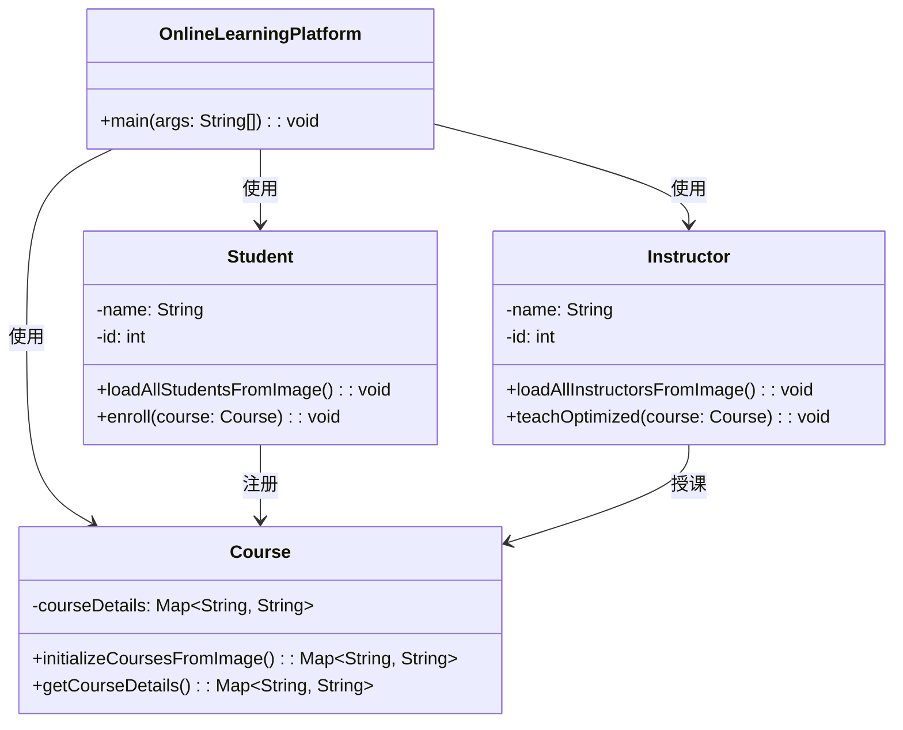

> ▲ 上图根据原文 Figure 8.6 标题和上下文推测绘制，原文为英文截图

**图 8.6 新类图：Project Leyden 优化之后**

展望未来，Leyden 承诺了性能与适应性的和谐融合。它旨在为开发者提供工具和自由，让他们选择如何管理状态、如何优化性能以及如何让他们的应用与底层 JVM 交互。从引入冷凝器到推出训练运行的概念，Leyden 正在为 Java 性能优化不仅是一项技术工作，更是一门艺术的未来奠定基础。

随着 Java 生态系统的持续演进，GraalVM 作为一项关键创新出现，将性能优化的范围扩展到 Java 传统边界之外。

## GraalVM：革新 Java 的稳态时间

站在动态演进的前沿，GraalVM 专注于通过利用其能力和在动态编译方面的专长来优化启动和预热性能。它利用静态映像的力量来提升各种应用的性能。

GraalVM 是一种多语言虚拟机，无缝支持 Java、Scala、Kotlin 等 JVM 语言，以及 Ruby、Python、WebAssembly 等非 JVM 语言。其真正的能力在于大幅提升启动和预热时间，确保应用不仅能快速启动，还能在更短的时间内达到最优性能。

GraalVM 的核心是 Graal 编译器（图 8.7）。这个动态编译器针对动态或"开放世界"执行进行了优化，类似于 OpenJDK HotSpot VM，擅长为各种处理器生成 C2 级别的机器代码。它采用"自优化"技术，利用动态和推测性优化来对程序行为做出明智的预测。如果推测不准确，编译器可以取消优化并重新编译，确保应用快速预热并更快地达到峰值性能。

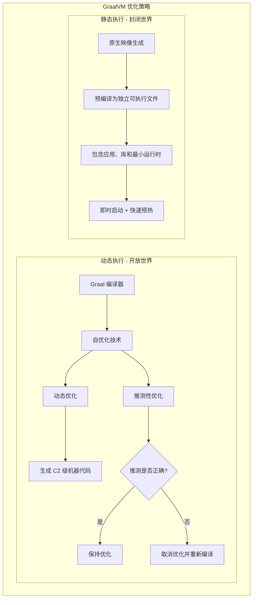

> ▲ 上图根据原文 Figure 8.7 标题和上下文推测绘制，原文为英文截图

**图 8.7 GraalVM 优化策略**

除了动态执行之外，GraalVM 还提供原生映像生成（native image generation）能力，用于"封闭世界"优化。在这种场景中，整个应用全景在编译时是已知的。因此，GraalVM 可以生成封装了应用、必要库和最小运行时的独立可执行文件。这种方法几乎消除了在 JVM 解释器和 JIT 编译器中花费的时间，带来了即时启动和快速预热时间——对于短生命周期应用和微服务来说是一次范式转变。

### 简化原生映像生成

GraalVM 的 AOT 编译增强了其性能资历。通过将 Java 字节码预编译为原生代码，它最小化了启动期间 JVM 解释器的开销。此外，通过避开传统的 JIT 编译阶段，应用体验到更快的预热，在更短的时间内达到峰值性能。这对于微服务和无服务器环境等架构来说是无价的，因为在这些环境中，快速启动和快速预热都至关重要。

在最近的 GraalVM 版本中，创建原生映像的过程已被简化，因为原生映像能力现在已包含在 GraalVM 发行版本身中[^7]。这一增强简化了开发者的流程：

```bash
# 安装 GraalVM（将 VERSION 和 OS 替换为您的 GraalVM 版本和操作系统）
$ curl -LJ https://github.com/graalvm/graalvm-ce-builds/releases/download/vm-VERSION/graalvm-cejava11-VERSION-OS.tar.gz -o graalvm.tar.gz
$ tar -xzf graalvm.tar.gz
# 设置 PATH 以包含 GraalVM bin 目录
$ export PATH=$PWD/graalvm-ce-java11-VERSION-OS/bin:$PATH
# 将 Java 应用编译为原生映像
$ native-image -jar your-app.jar
```

[^7]: https://github.com/oracle/graal/pull/5995

执行此命令会创建一个预编译的、独立的 Java 应用可执行文件，其中包含最小化的 JVM 和所有必要的依赖。应用可以立即开始执行，无需等待 JVM 启动或类加载和初始化。

### 通过 OpenJDK 支持增强 Java 性能

OpenJDK 社区一直在努力改善对原生映像构建的支持，使开发者更容易为其 Java 应用创建原生映像。这包括在类初始化、堆序列化和服务绑定等领域的改进，这些都有助于实现更快的启动时间和更小的内存占用。通过提供将 Java 应用编译为原生可执行文件的能力，GraalVM 使 Java 成为高需求计算环境中更具吸引力的选择。

### 介绍 Java on Truffle

为了全面了解 GraalVM 支持的执行模式，有必要提及 Java on Truffle[^8]。这是一个高级 Java 解释器，运行在 Truffle 框架之上，可以通过在执行 Java 程序时使用 `-truffle` 标志来启用：

```bash
# 使用 Truffle 解释器执行 Java
$ java -truffle [options] class
```

[^8]: www.graalvm.org/latest/reference-manual/java-on-truffle/

该特性补充了现有的 JIT 和 AOT 编译模式，为开发者提供了一种额外的执行 Java 程序的方法，对于动态工作负载尤其有益。

## 新兴技术：用于检查点/恢复功能的 CRIU 和 Project CRaC

OpenJDK 通过 CRIU 和 CRaC 等新兴项目持续创新。它们共同致力于减少稳态时间，扩展高性能 Java 应用的领域。

CRIU（Checkpoint/Restore in Userspace）是一款开创性的 Linux 工具；它最初由 Virtuozzo[^9] 创建，随后作为开源项目发布[^10]。CRIU 旨在支持 OpenVZ（一种服务器虚拟化解决方案）的实时迁移功能。CRIU 的巧妙之处在于它能够暂时冻结一个活跃的应用，创建一个以文件形式存储在硬盘上的检查点。这个检查点随后可用于从冻结状态恢复并执行应用，无需任何更改或特定配置。

[^9]: https://criu.org/Main_Page
[^10]: https://wiki.openvz.org/Main_Page

以下命令序列为具有指定 PID 的进程创建检查点并将其存储在指定目录中。随后可以从该检查点恢复进程。

```bash
# 安装 CRIU
$ sudo apt-get install criu
# 对运行中的进程创建检查点
$ sudo criu dump -t [PID] -D /checkpoint/directory -v4 -o dump.log
# 恢复检查点的进程
$ sudo criu restore -D /checkpoint/directory -v4 -o restore.log
```

认识到 CRIU 的潜力后，Red Hat 将其作为独立项目引入 OpenJDK。目标是提供一种方法来冻结运行中的 Java 应用的状态、存储它，然后稍后或在不同的系统上恢复它。这种能力可以用于在系统之间迁移运行中的应用、保存和恢复复杂应用的状态以进行调试，以及创建应用快照供后续分析。

基于 CRIU 的能力，Project CRaC（Coordinated Restore at Checkpoint）——Java 生态系统中的一个新项目——旨在将 CRIU 的检查点/恢复功能集成到 JVM 中。这可能允许 Java 应用被检查点和恢复，为改善稳态时间提供了另一种途径。CRaC 目前仍处于早期阶段，但代表了 Java 启动性能优化的一个有前途的未来方向。

让我们模拟对 `OnlineLearningPlatform` Web 服务进行检查点和恢复状态的过程：

```java
import org.crac.Context;
import org.crac.Core;
import org.crac.Resource;

public class OnlineLearningPlatform implements Resource {
    public static void main(String[] args) throws Exception {
        // 在 CRaC 的全局上下文中注册平台
        Core.getGlobalContext().register(new OnlineLearningPlatform());
        // 初始化
        System.out.println("正在初始化 OnlineLearningPlatform...");
        // 加载 Student 和 Course 类
        Student.loadAllStudents();
        Course.initializeCourses();
        // 爬升阶段：在其最新列表更新后加载 Instructor 类
        Instructor.loadAllInstructors();
        Instructor.teach(new Course()); // 此方法是 JIT 优化的候选
    }

    @Override
    public void beforeCheckpoint(Context<? extends Resource> context) throws Exception {
        System.out.println("准备对 OnlineLearningPlatform 进行检查点...");
    }

    @Override
    public void afterRestore(Context<? extends Resource> context) throws Exception {
        System.out.println("正在恢复 OnlineLearningPlatform 状态...");
    }
}
```

在这个增强版本中，`OnlineLearningPlatform` 类实现了 CRaC 的 `Resource` 接口。这允许我们定义检查点之前（`beforeCheckpoint` 方法）和恢复之后（`afterRestore` 方法）的行为。该平台在 CRaC 的全局上下文中注册，使其能够被检查点和恢复。

将 CRIU 集成到 JVM 中是一项复杂的任务，因为它需要更改 JVM 的内部结构和算法以支持应用状态的冻结和恢复。它还需要与操作系统协调，以确保 JVM 及其运行的应用的状态被正确捕获和恢复。尽管存在这些挑战，将 CRIU 集成到 JVM 中仍提供了显著潜在收益。

图 8.8 展示了 Java 应用、Project CRaC 和 CRIU 之间关系的高级表示。该图包含以下元素：

1. **Java 应用**：这是起点，应用正常运行和操作。
2. **Project CRaC**：
   - 它为 Java 应用提供 API 以启动检查点和恢复操作。
   - 当请求检查点时，Project CRaC 与 CRIU 通信以执行检查点过程。
   - 类似地，当请求恢复时，Project CRaC 与 CRIU 通信以从先前保存的状态恢复应用。
3. **CRIU**：
   - 收到检查点请求后，CRIU 冻结 Java 应用进程并将其状态保存为硬盘上的映像文件。
   - 当发出恢复请求时，CRIU 使用保存的映像文件将 Java 应用进程恢复到其检查点状态。
4. **检查点状态和恢复状态**：
   - "检查点状态"表示检查点时 Java 应用的状态。
   - "恢复状态"表示恢复后 Java 应用的状态。它应与检查点状态相同。
5. **映像文件**：这些是 CRIU 在检查点过程中创建的文件。它们包含 Java 应用的保存状态。
6. **恢复的进程**：这表示由 CRIU 恢复后的 Java 应用进程。

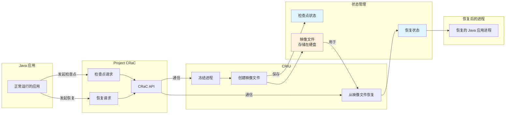

> ▲ 上图根据原文 Figure 8.8 标题和上下文推测绘制，原文为英文截图

**图 8.8 将 Project CRaC 和 CRIU 策略应用于 Java 应用**

尽管这些项目仍处于早期开发阶段，但它们代表了 Java 启动性能优化的有前途的未来方向。将 CRIU 集成到 JVM 中可能对 Java 应用的性能产生重大影响。通过允许应用被检查点和恢复，它可能减少启动时间、提升性能，并为 Java 应用启用新的用例。

## 无服务器及其他环境中的启动和爬升优化

随着云技术的演进，无服务器和容器化环境已成为应用部署的关键。Java 凭借其持续的进步，非常适合应对这些现代计算范式的独特挑战，如图 8.9 所示。

- **无服务器冷启动**：GraalVM 通过预编译应用来解决 JVM 的冷启动延迟问题，提供快速的功能调用响应，而 CDS 通过重用类元数据来加速启动时间进行补充。
- **CDS 增强**：这些技术在无服务器和容器化设置中都至关重要，通过重用类元数据实现更快的启动和更低的内存使用。
- **预期的优化**：预期的项目如 Leyden 和 CRaC 旨在进一步完善启动效率和应用检查点，创造一个 Java 的"冷启动"问题成为历史遗物的未来。
- **容器化动态**：快速扩展和高效的资源利用是重中之重，Java 准备利用容器特定的优化来实现敏捷性能。

图 8.9 概括了 Java 在强大的启动和爬升策略支撑下，走向无缝云原生体验的持续旅程。

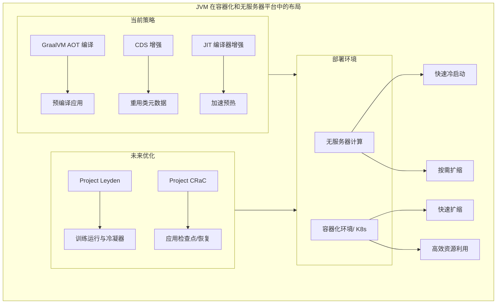

> ▲ 上图根据原文 Figure 8.9 标题和上下文推测绘制，原文为英文截图

**图 8.9 JVM 在容器化和无服务器平台中的布局**

### 无服务器计算与 JVM 优化

无服务器计算以其按需执行应用函数的方式，提供了应用部署和扩展的范式转变。这种方法将开发者从管理服务器中解放出来，提升了运营效率，并允许与工作负载匹配的自动扩展。然而，无服务器环境引入了"冷启动"问题，当休眠的函数被调用时尤其明显。这需要资源分配、运行时启动和应用启动，对于 Java 应用来说，由于 JVM 启动、类加载和 JIT 编译过程，这可能非常耗时。

"冷启动"问题出现在以下场景：一个 Java 应用在闲置后，突然面临无服务器环境中的大量请求涌入。这就需要快速启动多个应用实例，而延迟可能会影响用户体验。

为了解决这个问题，CDS 和 JIT 编译器增强等 JVM 优化可以显著减轻冷启动延迟，使 Java 更适合无服务器计算。AWS Lambda 和 Azure Functions 等平台支持 Java，并提供了微调 JVM 配置的灵活性。通过利用 CDS 和校准其他 JVM 选项，开发者可以优化无服务器 Java 函数，确保这些函数更快的启动和爬升性能。

### 新兴技术的预期收益

像 Project Leyden 这样的新兴技术正在塑造 Java 的未来性能，尤其是在无服务器计算方面。Leyden 承诺通过"训练运行"和"冷凝器"等创新来增强 Java 的启动阶段和稳态效率。这些进展可能大幅削减冷启动时间。即便如此，重要的是要记住，截至 JDK 21，Leyden 的特性仍在演进中，尚未准备好投入生产。当 Leyden 成熟时，它可能改变无服务器 Java 应用，使它们能够在没有通常的启动延迟的情况下快速响应流量峰值，这得益于在"训练运行"期间预计算的状态存储。

与 Leyden 一起，Project CRaC 提供了一种实践性的方法。开发者可以精确定位并准备特定的应用段用于检查点，从而产生可以快速重新激活的存储状态。这种方法在减少冷启动至关重要的无服务器环境中尤其有价值。

这些举措——Leyden 和 CRaC——标志着 Java 在无服务器环境中的一次飞跃，推动它走向一个应用可以即时扩展、不受冷启动限制的未来。

### 容器化环境：确保快速启动和高效扩展

在现代应用部署领域，容器化已经成为一项改变游戏规则的技术。它将应用封装在轻量级、一致的环境中，使其成为微服务架构和云原生部署的完美选择。与无服务器计算类似，稳态时间性能至关重要。在容器化环境中，应用与其依赖一起打包到容器中，然后在容器编排平台（例如 Kubernetes）上运行。由于容器可能会根据工作负载频繁启动和停止，因此具有快速的启动和爬升时间对于确保应用能够快速扩展以处理增加的负载至关重要。

当前的 JVM 优化技术，如 CDS 和 JIT 编译器增强，已经为在这些环境中提升性能做出了重要贡献。这些已建立的策略包括：

- 选择最小的基础 Docker 镜像以最小化镜像大小，从而改善启动和爬升时间。
- 调整 JVM 配置以更好地适应容器环境，例如设置 JVM 堆大小以感知容器的内存限制。
- 策略性地分层 Docker 镜像以利用 Docker 的缓存机制并加速构建过程。
- 实施健康检查以确保应用在容器中正确运行。

通过利用这些技术，你可以确保你的 Java 应用在容器化环境中尽可能快地启动和爬升，从而提供更好的用户体验并更有效地利用系统资源。

图 8.10 说明了当前策略以及 Leyden（和 CRaC）方法的未来集成。它是开发者今天可以遵循的路线图，同时展望即将到来的项目承诺带来的收益。

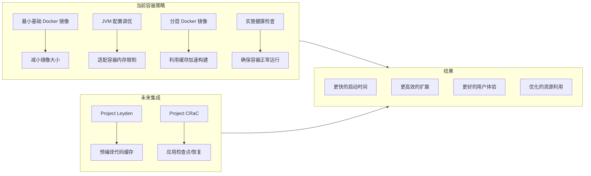

> ▲ 上图根据原文 Figure 8.10 标题和上下文推测绘制，原文为英文截图

**图 8.10 在 JVM 上运行时的容器策略**

### GraalVM 当前的贡献

GraalVM 目前正在解决 Java 在现代计算环境中面临的一些挑战。其显著的特性——原生映像功能——提供了 AOT 编译，显著减少了启动时间——这对于无服务器计算和微服务架构来说是一个关键优势。GraalVM 的 AOT 编译器通过针对特定的性能挑战来补充传统的 HotSpot VM，这对于低延迟和高效资源使用至关重要的场景是有益的。

虽然 GraalVM 的 AOT 编译器并非万能解决方案，但它为 Java 应用性能提供了一种专门的方法，满足了云原生环境中特定用例的需求。这种多功能性使 Java 成为多样化部署环境中的强有力竞争者，确保应用保持敏捷和高性能。

### 关键要点

Java 的演进继续与云原生需求保持一致。像 Leyden 和 CRaC 这样的项目，以及 GraalVM 的能力，展示了 Java 的适应性以及对性能增强和可扩展性的承诺：

- **适应性强的 Java 演进**：通过 Project Leyden 等举措和 GraalVM 的现有优势，Java 展示了其对现代云原生部署范式的适应性。
- **优化技术**：理解和应用 JVM 优化技术至关重要。这包括利用 CDS 和 JIT 编译器增强以获得更好的性能。
- **特定场景下的 GraalVM AOT 编译**：对于快速启动和小内存占用至关重要的用例，例如无服务器环境或微服务，GraalVM 的 AOT 编译器提供了一种有效的解决方案。它通过解决这些环境的特定性能挑战来补充传统的 HotSpot VM。
- **预期未来项目的影响**：Project Leyden 和 CRaC 标志着 Java 在无服务器环境中的飞跃，承诺了即时可扩展性和减少的冷启动限制。
- **无服务器和容器化性能**：对于无服务器和容器化部署，Java 正在演进以确保快速启动和高效扩展，与现代化云应用的需求保持一致。
- **平衡的方法**：随着 Java 生态系统的演进，在技术采用上采用平衡的方法至关重要。开发者应权衡其应用需求以及每种技术提供的特定好处，无论是当前的 JVM 优化、GraalVM 的能力，还是即将到来的 Leyden 和 CRaC 等创新。

## 使用 OpenJDK HotSpot VM 提升预热性能

OpenJDK HotSpot VM 是一款精密的软件，采用多种技术来优化 Java 应用的性能。这些技术设计为协同工作，每一种都解决了应用生命周期的不同方面，从启动到稳态。本节深入探讨 HotSpot VM 的复杂工作机制，阐明它用于提升性能的机制以及它们在 Java 应用性能的更广泛背景中扮演的角色。

在包括微服务和无服务器模型在内的动态可扩展架构世界中，Java 应用经常遭受频繁重启和天生短暂生命周期的考验。这种环境放大了应用初始化阶段、预热期以及到达稳定运行状态的重要性。应用通过这些阶段的效率可以成就或破坏其响应能力，尤其是在面对波动的流量需求或对快速可扩展性的需求时。这就是 HotSpot VM 采用的各种优化——包括 JIT 编译、自适应优化和分层编译，以及客户端和服务端编译之间的战略选择——发挥作用的地方。

### 编译器增强

在第 1 章"Java 的性能演进：语言与虚拟机"中，我们深入探讨了 HotSpot VM 的 JIT 编译器及其一系列编译技术（图 8.11）。当我们回到这个话题时，让我们总结一下这个过程，同时强调 OpenJDK HotSpot VM 中针对启动、预热和稳态阶段的优化。

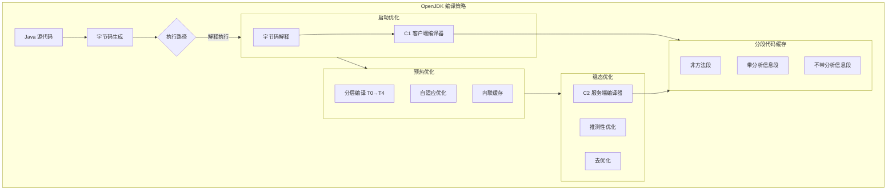

> ▲ 上图根据原文 Figure 8.11 标题和上下文推测绘制，原文为英文截图

**图 8.11 OpenJDK 编译策略**

#### 启动优化

JVM 中的启动主要由（较）低层级处理。JVM 还负责处理 invokedynamic 引导方法（BSM；在第 7 章"运行时性能优化：聚焦字符串、锁及更多"中详细讨论）和类初始化器。

- **字节码生成**：Java 程序首先被转换为字节码。这是 Java 编译过程的初始阶段，开发者编写的高级代码被转换为平台无关的格式，可以由 JVM 执行（与底层硬件无关）。
- **解释**：然后根据描述表 TemplateTable 解释字节码。该表提供了字节码指令与其对应的机器代码序列之间的映射，允许 JVM 执行字节码。
- **使用客户端编译器（C1）进行 JIT 编译**：C1 JIT 编译器旨在提供快速编译和基本优化级别之间的平衡。它将字节码转换为原生机器代码，确保应用快速从启动阶段过渡并开始其迈向峰值性能的旅程。在此阶段，C1 编译器帮助收集关于应用行为的分析信息。这些分析数据至关重要，因为它为后续由 C2 编译器执行的更积极的优化提供了信息。C1 的 JIT 编译过程对于被多次调用的方法尤其有益，因为它避免了重复解释相同字节码的开销。
- **分段代码缓存（Segmented CodeCache）**：来自不同 JIT 编译层级生成的优化代码，以及分析数据，存储在分段代码缓存中。该缓存分为多个段，其中带分析信息段（Profiled segment）包含经过轻度优化、带分析信息且生命周期较短的方法。它还有一个非方法段（Non-method segment），其中包含非方法代码，如字节码解释器本身。随着我们接近稳态，不带分析信息、完全优化的方法也存储在代码缓存的不带分析信息段（Non-profiled segment）中。缓存允许更快地执行频繁使用的代码序列。

#### 预热优化

随着 Java 应用超越启动阶段，预热阶段在为峰值性能奠定基础方面变得至关重要。JIT 编译，特别是使用客户端编译器（C1），在这一过渡中发挥着关键作用。

- **分层编译**：JVM 性能策略的基石是分层编译，其中代码从 T0（解释代码）过渡到 T4（最高优化级别）。分层编译允许 JVM 在更快启动和峰值性能之间做出权衡。在执行的早期阶段，JVM 使用更快但优化程度较低的编译级别以确保快速启动。随着应用继续运行，JVM 应用更积极的优化以实现更高的峰值性能。
- **自适应优化**：JIT 编译的代码经历自适应优化，这可能导致进一步优化的代码或栈上替换（on-stack replacement，OSR）。自适应优化涉及对运行中的应用进行分析，并根据其行为优化其性能。例如，频繁调用的方法可能会被进一步优化，而被取代的方法可能会被取消优化，其资源被重新分配。
- **内联缓存**：预热期间采用的一种细致技术是内联缓存。通过这种方法，小型但频繁调用的方法被内联到调用方法中。这种策略最小化了方法调用的开销，并由预热期间积累的分析数据提供指导。

#### 稳态优化

随着 Java 应用在其生命周期中成熟，从预热过渡到稳定的运行状态，JVM 采用了一系列高级优化技术。这些技术旨在最大化长时间运行应用的性能，确保它们以峰值效率运行。

- **推测性优化**：其中一个突出的技术是推测性优化。利用预热阶段积累的丰富分析数据，JVM 对可能的执行路径做出有根据的预测。然后它基于这些预期来调整代码优化。如果这些有根据的推测被证明不准确，JVM 能够优雅地回退到先前优化程度较低的代码版本，保障应用的完整性。这种策略在长期运行的应用中尤为出色，因为偶尔优化回滚的微小开销远远被准确推测带来的性能飞跃所掩盖。
- **去优化**：与推测性优化相伴的是去优化的概念。当基本假设被推翻时，这种机制使 JVM 能够回调某些 JIT 编译器优化。一个典型的场景是当新加载的类覆盖了一个先前已被优化的方法。回退的能力确保应用保持准确并响应动态变化。
- **使用服务端编译器（C2）进行 JIT 编译**：对于长时间运行的应用，带有分析信息的细致的服务端编译器（C2）接管，对性能关键的方法应用积极和推测性的优化。这个过程显著提升了 Java 应用的性能，特别是对于相同方法被多次调用的长期运行应用。

### 分段代码缓存与 Project Leyden 增强

基于我们在第 1 章"Java 的性能演进：语言与虚拟机"中对分段代码缓存的详细讨论，现在让我们考虑其对减少 Java 应用稳态时间性能的影响。

分段代码缓存旨在优先存储频繁执行的代码，确保它们随时可用于执行。深入探讨代码缓存的机制，理解 Code ByteBuffer 的角色至关重要。这个 Buffer 充当中间存储，在编译代码被移动到分段代码缓存之前保存它。这个两步过程确保了高效的内存管理和优化的代码检索。此外，缓存的分段允许更高效的内存管理，因为每个分段可以根据其使用情况独立调整大小。在启动和预热性能的背景下，分段代码缓存通过确保应用代码中最关键的部分尽可能快地编译并准备执行，从而显著贡献于提升 Java 应用的整体性能。

随着 Project Leyden 的出现，这一机制将得到进一步增强。Project Leyden 的一个突出特性将是它能够直接从归档文件加载分段代码缓存。这将绕过启动和预热期间传统的分层代码编译过程，从而显著减少启动时间。不是每次应用启动时都编译代码，Project Leyden 将允许预编译的代码被归档，然后在后续启动时直接加载到分段代码缓存中。

这种方法不仅会加速启动过程，还会确保应用从一开始就受益于优化后的代码。通过利用这个特性，开发者将实现更快的应用响应速度，特别是在加速稳态时间至关重要的环境中。

### 从 PermGen 到 Metaspace 的演进：迈向峰值性能的飞跃

在 Java 的历史中，在 Java 8 出现之前，JVM 内存包含一个称为永久代（Permanent Generation，PermGen）的空间。这部分内存指定用于存储类元数据和静态变量。然而，PermGen 模型并非没有缺陷。它具有固定大小，如果分配的空间不足以满足应用需求，可能导致 `java.lang.OutOfMemoryError: PermGen space` 错误。

#### 启动影响

PermGen 的固定性质意味着 JVM 在启动期间必须分配和释放内存，导致启动时间变慢。为了弥补这些缺陷，Java 8 引入了一项重大更改：用 Metaspace 取代 PermGen[^11]。Metaspace 与其前身不同，它不是一个连续的堆空间，而是位于原生内存中，用于类元数据存储。默认情况下它会自动增长，其最大限制是可用的原生内存量，这比典型的 PermGen 最大大小要大得多。这一关键修改有助于在启动期间实现更高效的内存管理，可能加速启动时间。

[^11]: www.infoq.com/articles/Java-PERMGEN-Removed/

#### 预热影响

Metaspace 的动态特性允许它根据需要增长，确保 JVM 可以在预热阶段快速适应应用的需求。这种灵活性减少了在这个关键阶段出现内存相关瓶颈的机会。

当 Metaspace 填满时，会触发一次完全垃圾收集（GC）以清除未使用的类加载器和类。如果 GC 无法回收足够的空间，Metaspace 会扩展。这种动态特性有助于避免 PermGen 常见的内存溢出错误。

#### 稳态影响

从 PermGen 到 Metaspace 的转变确保 JVM 更高效地达到稳态。通过消除类元数据和静态变量的固定内存空间的限制，JVM 可以管理其内存资源并降低内存溢出错误的风险，从而产生更健壮和可靠的 Java 应用。

然而，尽管 Metaspace 可以根据需要增长，但它并非对内存泄漏免疫。如果类加载器没有得到正确的处理，原生内存可能会填满，导致 `OutOfMemoryError: Metaspace`。原因如下：

1. **类加载器生命周期和潜在泄漏**：
   a. 每个类加载器在 Metaspace 中拥有自己的段，用于加载类元数据。当类加载器被垃圾收集时，其对应的 Metaspace 段也会被释放。然而，如果对该类加载器（或它加载的任何类）的存活引用持续存在，该类加载器将不会被垃圾收集，并且它使用的 Metaspace 内存也不会被释放。这就是管理不当的类加载器如何导致内存泄漏。
   b. 类加载器泄漏也可能以其他方式发生。例如，假设一个类加载器加载了一个启动线程的类，并且当类加载器不再需要时该线程没有停止。在这种情况下，活跃的线程将保持对类加载器的引用，阻止它被垃圾收集。类似地，假设由类加载器加载的类注册了一个静态钩子（例如，关闭钩子或 JDBC 驱动），并且在完成时没有取消注册该钩子。这也可能阻止类加载器被垃圾收集。
   c. 在垃圾收集的上下文中，类加载器是一个 GC 根。任何从 GC 根可达的对象都被视为存活的，并且不符合垃圾收集的条件。因此，只要类加载器保持存活，它加载的所有类（以及这些类引用的任何对象）也都被视为存活的，并且不符合垃圾收集的条件。
2. **OutOfMemoryError: Metaspace**：如果积累了足够的内存泄漏（由于类加载器管理不当），Metaspace 可能会填满。在这种情况下，JVM 将触发一次完全垃圾收集以清除未使用的类加载器和类。如果这没有释放足够的空间，JVM 将尝试扩展 Metaspace。如果由于没有足够的原生内存可用而无法扩展 Metaspace，将抛出 `OutOfMemoryError: Metaspace`。

监控 Metaspace 使用情况并根据需要调整最大大小限制至关重要。有几个 JVM 选项可用于控制 Metaspace 的大小：

- `-XX:MetaspaceSize=[size]` 设置 Metaspace 的初始大小。如果未指定，Metaspace 将根据应用需求动态调整大小。
- `-XX:MaxMetaspaceSize=[size]` 设置 Metaspace 的最大大小。如果未指定，Metaspace 可以无限增长，直至可用原生内存的量。
- `-XX:MinMetaspaceFreeRatio=[percentage]` 和 `-XX:MaxMetaspaceFreeRatio=[percentage]` 控制在 GC 之后、调整大小之前 Metaspace 中允许的空闲空间百分比。如果空闲空间百分比低于或高于这些阈值，Metaspace 将相应收缩或增长。

诸如 VisualVM、JConsole 和 Java Mission Control 等工具可用于监控 Metaspace 使用情况，并提供关于内存使用、GC 活动和潜在内存泄漏的宝贵见解。这些工具还可以通过显示加载的类数量以及这些类占用的总空间来帮助识别类加载器泄漏。

Java 16 通过引入 JEP 387：弹性 Metaspace[^12] 为 Metaspace 带来了重大升级。JEP 387 的主要目标有三个：

- 高效地将未使用的类元数据内存归还给 OS
- 最小化 Metaspace 的整体内存占用
- 精简 Metaspace 代码库以增强可维护性

[^12]: https://openjdk.org/jeps/387

以下是 JEP 387 带来的关键变化的详细说明：

- **基于伙伴的分配方案**：这种机制根据大小组织内存块，促进 Metaspace 中的快速分配和释放。它类似于伙伴系统，确保高效的内存管理。
- **惰性内存提交**：一种明智的方法，JVM 仅在必要时才提交内存。这种策略减少了 JVM 的内存开销，尤其是在分配的 Metaspace 显著超过其实际利用率时。
- **细粒度内存管理**：这一增强使 JVM 能够以更精细的段管理 Metaspace，减轻内部碎片并优化内存消耗。
- **修订后的回收策略**：一种主动策略，使 JVM 能够迅速将未使用的 Metaspace 内存归还给 OS。这对于具有波动的 Metaspace 使用模式的应用来说是无价的，确保了持续且最小的内存占用。

这些创新巧妙解决了 Metaspace 管理挑战，包括内存碎片化。总之，Metaspace 的动态特性，加上 JEP 387 中引入的创新，凸显了 Java 致力于优化内存利用、减少碎片化以及及时将未使用内存归还给 OS 的承诺。

## 结论

在本章中，我们全面探讨了 JVM 启动和预热性能——Java 应用性能的一个关键方面。引入 Java 生态系统的各种优化技术，如 CDS、GraalVM 和 JIT 编译器增强，显著改善了启动和爬升时间。对于微服务架构、无服务器计算和容器化环境来说，快速初始化和小的内存占用至关重要。

当我们走向未来时，Java 性能能力的持续演进仍处于技术创新的前沿。Project Leyden 的引入（及其训练运行），以及 CRIU 和 Project CRaC 的出现，进一步放大了推动 Java 性能优化的潜力。

作为开发者和性能工程师，我们必须了解这些类型的进展，并理解如何在不同的环境中应用它们。通过这样做，我们可以确保我们的 Java 应用尽可能高效和性能卓越，提供最佳的用户体验。
