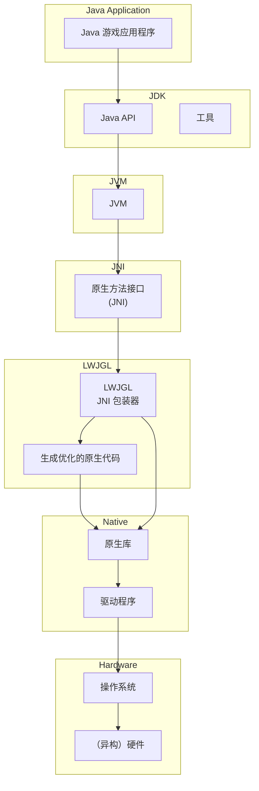
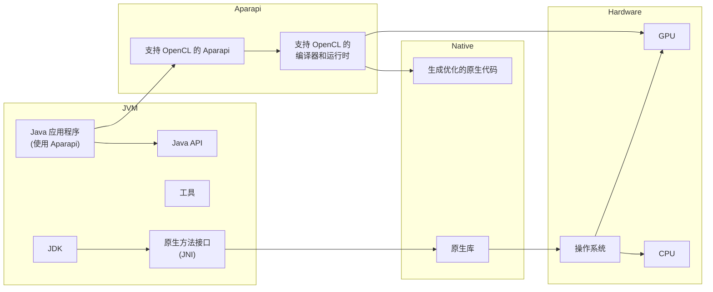
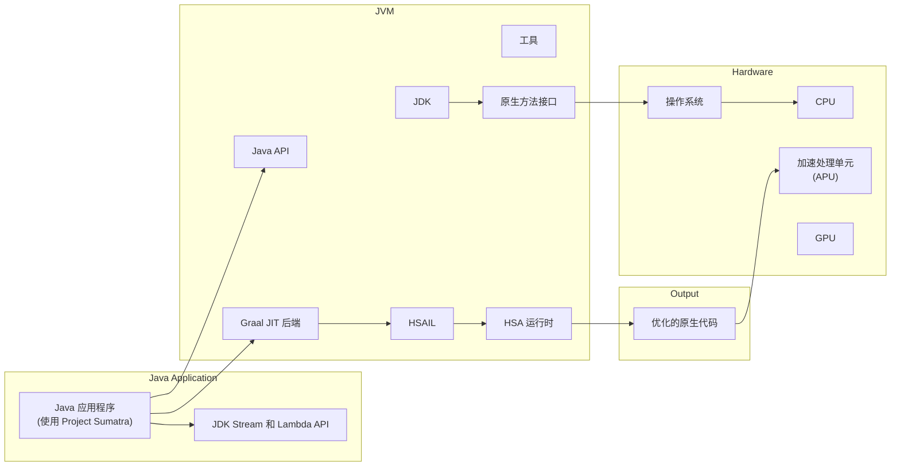
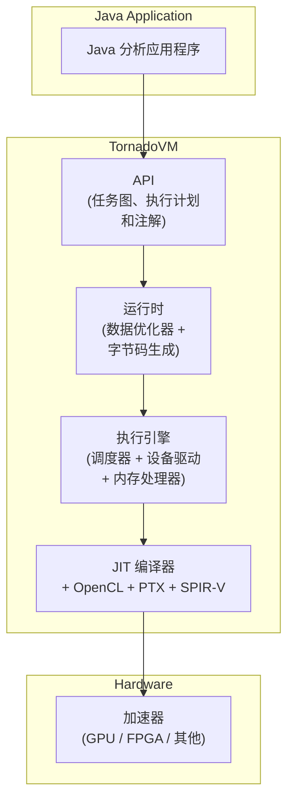
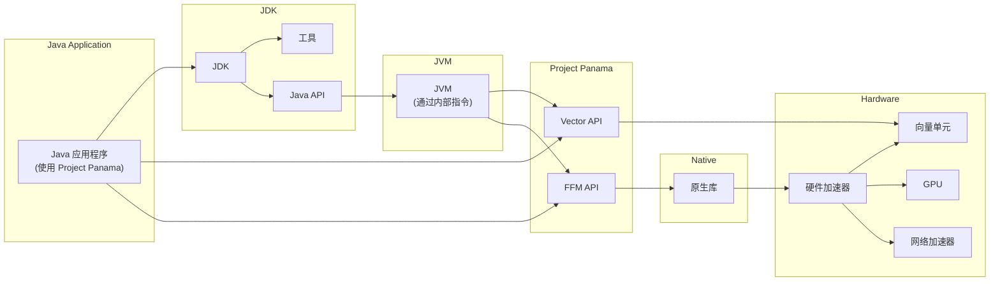
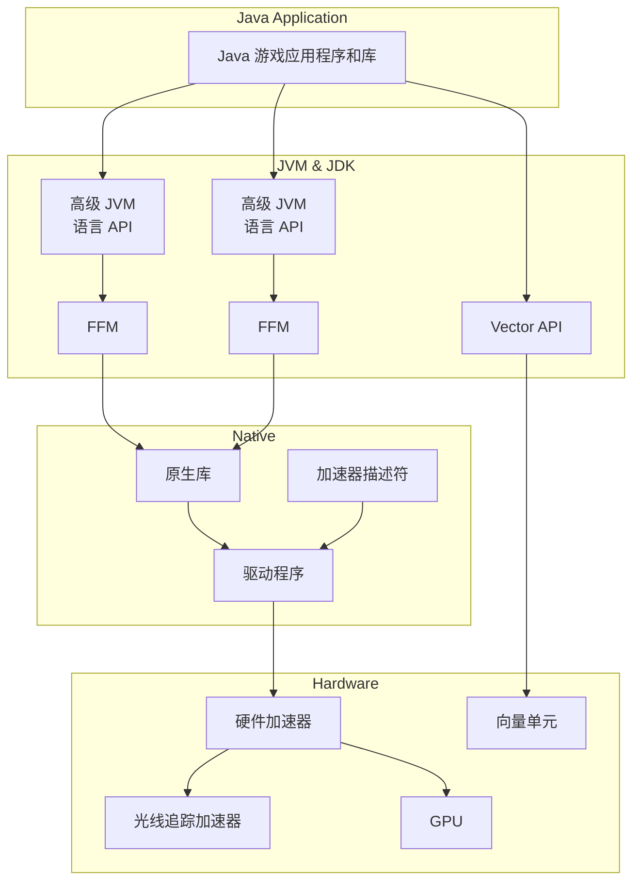

# 第9章 驾驭异构硬件：JVM性能工程的未来

执行大规模矩阵运算或深度学习中必不可少的专业化计算，需要充分利用这些能力。为了充分发挥这些能力，JVM 需要能够将字节码编译为可在此类硬件上高效运行的机器码。

这促使人们开发新的语言特性、API 和工具链，旨在弥合 JVM 与专用硬件之间的鸿沟。例如，作为 Project Panama 一部分的 Vector API，允许开发者表达可在支持向量操作的硬件上高效向量化的计算。通过有效利用这些硬件能力，我们可以实现显著的性能提升。

然而，在基于 JVM 的应用程序中有效利用这些专用硬件组件的任务远非易事。它需要在语言设计和工具链两方面进行调整，以有效挖掘这些硬件能力，包括开发能够与此类硬件交互的 API，以及能够生成针对这些组件优化的代码的编译器。然而，管理内存访问模式、理解硬件特定行为以及应对硬件平台的异构性等挑战，使得这项任务变得相当复杂。

在这一适应过程中，几个关键概念和项目发挥了重要作用：

- **OpenCL**：一个开放标准，支持跨异构系统（包括 CPU、GPU 和其他处理器）的可移植并行编程。虽然 OpenCL 代码可以在多种硬件平台上执行，但其性能并非普遍可移植。换言之，同一份 OpenCL 代码的效率会因执行它的硬件不同而有显著差异。例如，虽然一块普通 GPU 可能相比串行代码带来实质性的性能提升，但同样的 OpenCL 代码在某些 FPGA 上可能运行得更慢[^4]。

- **Aparapi**：一个用于表达数据并行工作负载的 Java API。Aparapi 将 Java 字节码翻译为 OpenCL，使其能够在包括 GPU 在内的各种硬件加速器上执行。其运行时组件管理数据传输和生成的 OpenCL 代码的执行，为数据并行任务带来性能收益。尽管 Aparapi 抽象了大部分复杂性，但要在特定硬件上实现最佳性能可能仍需调优。

- **TornadoVM**：作为 OpenJDK GraalVM 的一个扩展，TornadoVM 提供了在运行时为不同硬件目标动态重新编译和优化 Java 字节码的独特能力。这使得 Java 程序能够自动适应可用的硬件资源（如 GPU 和 FPGA），而无需修改代码。TornadoVM 的动态特性确保了应用程序可以根据特定硬件和应用程序的性质实现最佳的性能可移植性。

- **Project Panama**：OpenJDK 社区中一个正在进行的项目，旨在改善 JVM 与原生代码之间互操作性的连接。它聚焦于两个主要领域：

  - **Vector API**：专为向量计算设计，该 API 确保在支持的 CPU 架构上，运行时编译为最高效的向量硬件指令。

  - **外部函数与内存（FFM）API**：该工具允许程序调用用不同语言编写的例程或使用其服务。在 Project Panama 的范围内，FFM 使 Java 代码能够与本地库无缝交互，从而增强 Java 与其他编程语言和系统的互操作性。

[^4]: Michail Papadimitriou, Juan Fumero, Athanasios Stratikopoulosa, Foivos S. Zakkakb, and Christos Kotselidis. "Transparent Compiler and Runtime Specializations for Accelerating Managed Languages on FPGAs." *Art, Science, and Engineering of Programming* 5, no. 2 (2020). https://arxiv.org/ftp/arxiv/papers/2010/2010.16304.pdf.

本章探讨与 JVM 性能工程相关的挑战，并讨论已经提出的一些解决方案。虽然我们的主要焦点将放在基于 OpenCL 的工具链上，但有必要承认 CUDA[^5] 是 GPU 领域最广泛采用的并行编程模型之一。在有效利用异构硬件能力方面，语言设计和工具链的重要性怎么强调都不为过。为了提供实践理解，我们将通过一系列说明性案例研究，展示这些挑战是如何被应对的，以及异构硬件为 JVM 性能工程带来的机遇。

[^5]: https://developer.nvidia.com/cuda-zone

## 云中的异构硬件

云计算的可用性使得终端用户可以便捷地访问专用或异构硬件。在过去，利用异构硬件的强大能力通常需要对物理硬件进行大量的前期投资。这一要求对于许多开发者和组织，尤其是资源有限的那些，是一道难以逾越的障碍。

近年来，云计算革命彻底改变了这一格局。如今，开发者无需进行大量初始投资即可访问和利用异构硬件的强大能力。这得益于主要的云服务提供商，包括 Amazon Web Services (AWS)[^6]、Google Cloud[^7]、Microsoft Azure[^8] 和 Oracle Cloud Infrastructure[^9]。这些提供商扩展了其产品线，提供了配备 GPU 和其他加速器的虚拟机，使开发者能够以灵活且经济高效的方式利用异构硬件的强大能力。NVIDIA 在 GPU 虚拟化方面处于领先地位，提供了灵活的视频编解码方法和广泛的虚拟机监控程序支持，但 AMD 和 Intel 也有各自独特的方法和能力[^10]。

[^6]: https://aws.amazon.com/ec2/instance-types/f1/
[^7]: https://cloud.google.com/gpu
[^8]: www.nvidia.com/en-us/data-center/gpu-cloud-computing/microsoft-azure/
[^9]: www.oracle.com/cloud/compute/gpu/
[^10]: Gabe Knuth. "NVIDIA, AMD, and Intel: How They Do Their GPU Virtualization." TechTarget (September 26, 2016). www.techtarget.com/searchvirtualdesktop/opinion/NVIDIA-AMD-and-Intel-How-they-do-their-GPU-virtualization.

为了解决虚拟化的复杂性，许多云"配置器"确保只有一台需要 GPU 的主机部署在物理硬件上，从而获得对其完全且独占的访问权限。虽然这种方法允许其他（非 GPU）主机使用 CPU，但它确实说明了在云中使用异构硬件的一些底层复杂性。实际上，在云端利用专用硬件组件本身就带来了一系列挑战，特别是从软件和运行时的角度来看。以下小节总结了其中的一些挑战。

### 硬件异构性

云计算环境的特征是提供种类繁多的硬件产品，每种都有独特的特点和能力。例如，较新的 Arm 设备配备了加密加速器，可以显著提高加密操作的速度。相比之下，Intel 的 AVX-512 指令将 SIMD 向量寄存器的宽度扩展到 512 位，便于并行处理更多数据。

Arm 的技术谱系还包括 NEON 和 SVE。NEON 为 Arm v7 和 Arm v8 提供 SIMD 指令，而 SVE 允许 CPU 设计者选择最符合其需求的 SIMD 向量长度，范围从 128 位到 2048 位，以 128 位为增量递增。这些数据宽度和访问模式的变化会显著影响计算性能。

这种多样性还扩展到了 GPU、FPGA 和其他加速器，尽管它们在不同云提供商之间的可用性差异很大。这种硬件异构性要求软件和运行时能够适应和灵活应对，能够根据所使用的具体硬件优化性能。在这种背景下，适应性通常意味着根据不同的硬件采取不同的优化路径，从而确保有效利用可用资源。

### API 兼容性与虚拟机监控程序约束

专用硬件通常需要特定的 API 才能有效使用。这些 API 为软件与硬件交互提供了一种方式，允许在硬件上执行内存管理和计算等任务。GPU 通用计算（GPGPU）领域一个广泛使用的 API 是 OpenCL。然而，JVM 被设计为与硬件无关，可能并不原生支持这些专用 API。这需要使用额外的库或工具，例如 OpenCL 的 Java 绑定[^11]，来弥合这一差距。

[^11]: www.jocl.org/

此外，云提供商使用的虚拟机监控程序在管理和隔离虚拟机资源方面起着至关重要的作用，提供了安全性和稳定性。然而，它可能对 API 兼容性施加额外的约束。虚拟机监控程序控制着客户操作系统与硬件之间的交互，虽然它被设计为支持广泛的操���，但它可能不支持专用 API 的所有特性。例如，NVIDIA CUDA 或 OpenCL 中的内存管理需要直接访问 GPU 内存，而虚拟机监控程序可能不完全支持这一点。

一个需要考虑的重要方面是潜在的安全问题，特别是关于 GPU 内存管理的问题。传统的虚拟机监控程序及其对输入输出内存管理单元（IOMMU）的处理可以防止普通内存在不同主机之间泄露。然而，GPU 通常处于这个"范围"之外。GPU 驱动程序通常不知道自己在虚拟化环境中运行，它依赖于在内核调度之间保持内存驻留。这引发了关于数据隔离的问题——即一台主机写入的数据是否真正与另一台主机隔离。在 GPGPU 中，GPU 不仅处理图像，还用于通用计算任务，任何潜在的数据泄露都可能带来更严重的后果。现代云基础设施在解决这些问题方面取得了进展，但潜在风险仍然存在，这突显了只允许一台主机访问 GPU 的重要性。

尽管这些约束可能看起来令人生畏，但值得重申虚拟机监控程序在维护安全和隔离环境方面所起的关键作用。然而，开发者在力求充分利用云中专用硬件的能力时，必须认识到这些因素。

### 性能权衡

在云中使用虚拟化硬件是一把双刃剑。一方面，它提供了灵活性、可伸缩性和隔离性，使应用程序的管理和部署更加容易。另一方面，它可能会引入性能权衡。虚拟化的开销（这是提供这些优势所必需的）有时会抵消专用硬件带来的性能收益。

这种开销通常归因于虚拟机监控程序，它需要将来自客户操作系统的调用转换为主机硬件调用。虚拟机监控程序被设计为最小化这种开销，并且其效率在不断提高。然而，在某些场景下，这种负担仍然可能影响运行在异构硬件上的应用程序的性能。例如，一个 GPU 加速的机器学习应用程序可能由于 GPU 虚拟化的开销而无法达到预期的加速效果，特别是当该应用程序没有为 GPU 加速进行适当优化，或者虚拟化开销没有得到妥善管理时。

### 资源争用

云环境的共享特性可能导致由于资源争用而带来的不一致性能。这通常被称为"吵闹邻居"问题，因为同一物理硬件上其他用户的活动会影响你的应用程序性能。例如，假设多个用户在同一台物理服务器上运行 GPU 密集型任务：如果某个吵闹邻居垄断了 GPU 资源，导致其他用户的任务运行得更慢，他们可能会因 GPU 资源争用而体验到性能下降。这是云计算基础设施中一个常见问题，因为资源在多个用户之间共享。为了缓解这个问题，云提供商通常会实施资源分配策略，以确保所有用户公平使用资源。然而，这些策略并非总是完美无缺，可能因资源争用而导致性能不一致。

### 云特定限制

云环境可能会施加一些本地环境不存在的额外限制。例如，云提供商通常会限制单个虚拟机可以使用的资源量，如内存或 GPU 计算单元。这一约束可能会限制异构硬件在云中的性能收益。此外，使用某些类型的异构硬件的能力可能仅限于特定的云区域或实例类型。例如，Google Cloud 支持 NVIDIA A100 GPU 的 A2 虚拟机仅在选定区域可用。

产业界和研究界一直在积极致力于解决这些挑战的方案。各方正在努力标准化 API 并开发与硬件无关的编程模型。如前所述，OpenCL 为跨异构计算系统的并行编程提供了一个统一的、通用的标准环境。它旨在利用单个节点内不同硬件组件的计算能力，使其成为高效运行领域特定工作负载（如数据并行应用和大数据处理）的理想选择。然而，为了在 JVM 内充分利用 OpenCL 的能力，OpenCL 的 Java 绑定是必不可少的。虽然 OpenCL 在节点内解决了计算方面的挑战，但高性能计算平台，特别是超级计算机中使用的平台，通常还需要额外的库（如 MPI）来进行节点间通信。

在我探索这些主题的过程中，我有幸与 Dr. Juan Fumero 进行了讨论，他是 TornadoVM 开发背后的领军人物，TornadoVM 是 OpenJDK 的一个插件，旨在应对这些挑战。Dr. Fumero 分享了 Vicent Natol（HPC Wire）的一句中肯引述："CUDA 是在算法中表达并行性问题的一个优雅解决方案——不是所有算法，但足够多到有重要意义。"这种感受不仅适用于 CUDA，也适用于其他并行编程模型，如 OpenCL、oneAPI 等。Dr. Fumero 对并行编程及其挑战的见解，在考虑 TornadoVM 这样的解决方案时尤为贴切。在他的指导下开发的 TornadoVM 旨在通过允许 Java 程序自动在异构硬件上运行，来利用 JVM 生态系统中的并行编程力量。TornadoVM 被设计为利用云环境中可用的 GPU 和 FPGA 来加速 Java 应用程序。通过提供高级编程模型并处理硬件异构性、API 兼容性和潜在安全问题的复杂性，TornadoVM 使开发者更容易在云中利用异构硬件的强大能力。

## 语言设计和工具链的作用

为了有效利用异构硬件的功能，语言设计和工具链都需要适应新的需求。这涉及几个关键考量：

- **语言抽象**：编程语言应提供直观的高级抽象，使开发者能够编写在不同类型硬件上高效执行的代码。这涉及设计能够表达并行性并利用异构硬件独特特性的语言特性。例如，Project Panama 中的 Vector API 为开发者提供了一种表达计算的方式，使其能够在支持向量操作的硬件上高效向量化。

- **编译器优化**：工具链，特别是编译器，在将高级语言抽象翻译为能够在异构硬件上运行的高效低级代码方面起着关键作用。这涉及开发能够利用不同类型硬件独特特性的复杂优化技术。例如，TornadoVM 编译器可以生成 OpenCL、CUDA 和 SPIR-V 代码。此外，它还能生成针对 FPGA、带有向量指令的 RISC-V 以及 Apple M1/M2 芯片优化的代码。这使得 TornadoVM 能够在从物联网设备（如 NVIDIA Jetson）到 PC、云环境，甚至最新的消费级处理器等广泛的计算系统上执行。

- **运行时系统**：运行时系统需要能够管理和调度不同类型硬件上的计算。这涉及开发能够处理异构硬件复杂性的运行时系统，例如管理跨不同类型设备的内存，以及调度计算以最小化数据传输。考虑图像处理任务，其中对图像应用不同的滤镜或变换。这些操作在 GPU 上的调度方式会极大地影响性能。例如，对于某些滤镜，以较小的"块"处理图像可能更高效，而其他操作可能受益于将图像作为更大的连续块来处理。选择如何划分和处理图像——是更小的块还是更大的区块——可以类比于滤镜是实时应用还是体验到明显延迟之间的区别。在运行时系统中，这样的计算必须被巧妙调度，以最小化数据传输开销并充分利用硬件能力。

- **互操作性**：语言和工具链应提供机制，使其能够与为异构硬件设计的现有库和框架进行互操作。这可能涉及提供外部函数接口（FFI）机制，如 Project Panama 中的机制，允许 Java 代码与原生库互操作。

- **库支持**：虽然已经开发了一些支持异构硬件的库，但这些库通常特定于某些类型的硬件，并且可能并非对所有云提供商提供的硬件类型都可用或已优化。这些库中的特化可以包括针对特定硬件架构的优化，这可能导致在不同类型的硬件上运行时出现显著的性能差异。

这些考量显著影响了旨在更好地利用异构硬件功能的项目的设计和实现。例如，Aparapi 的设计（一个用于表达数据并行工作负载的 API）深受对能够表达并行性并利用异构硬件独特特性的语言抽象的需求影响。类似地，TornadoVM 的开发也受到对能够管理和调度不同类型硬件上计算的运行时系统的需求的指导。

在接下来的案例研究中，我们将更深入地探讨这些项目，研究它们如何应对异构硬件利用的挑战，以及它们如何受到上述讨论的影响。

## 案例研究

将我们对异构硬件和 JVM 的讨论建立在真实世界的例子上非常重要，而最好的方式莫过于通过一系列案例研究。这些项目中的每一个——LWJGL、Aparapi、Project Sumatra、CUDA4J（IBM 与 NVIDIA 的联合项目）、TornadoVM 和 Project Panama——都为我们理解硬件加速器带来的挑战和机遇提供了独特的视角。

- **LWJGL（轻量级 Java 游戏库）**[^12] 作为一个基础性案例，展示了如何使用 Java 原生接口（JNI）使 Java 应用程序能够与一系列任务（包括图形和计算操作）的原生 API 进行交互。它提供了一个实践示例，说明如何利用现有的 JVM 机制来利用专用硬件。

- **Aparapi** 展示了如何设计语言抽象来表达并行性并利用异构硬件的独特特性。它在运行时将 Java 字节码翻译为 OpenCL，从而在 GPU 上执行并行操作。

- **Project Sumatra**，虽然已不再活跃，但曾是一项重大努力，旨在通过利用 Java 8 的 Stream API 来表达并行性，从而增强 JVM 将计算卸载到 GPU 的能力。Project Sumatra 的经验和教训继续为当前和未来的项目提供信息。

- **CUDA4J** 与 Project Sumatra 并行推进，是 IBM 和 NVIDIA 的联合成果[^13]。该项目利用 Java 8 Stream API，使 Java 开发者能够编写 GPU 计算代码，由 CUDA4J 框架将其翻译为 CUDA 内核。它展示了社区协作在增强 JVM 与异构硬件（尤其是 GPU）兼容性方面的力量。

- **TornadoVM** 展示了如何开发运行时系统来管理和调度不同类型硬件上的计算。它为硬件异构性和 API 兼容性的挑战提供了一个实用的解决方案。

- **Project Panama** 让我们一窥 JVM 的未来。它通过引入新的 FFM API 和 Vector API，专注于改善 JVM 与外部 API（包括库和硬件加速器）的连接。这些发展代表了 JVM 设计的一次重大演进，实现了与异构硬件更高效、更流畅的交互。

[^12]: www.lwjgl.org
[^13]: 尽管其小众性质，CUDA4J 仍在 IBM Power 平台上与 NVIDIA 硬件一起继续得到应用：www.ibm.com/docs/en/sdk-java-technology/8?topic=only-cuda4j-application-programming-interface-linux-windows。

选择这些项目不仅因为它们的技术创新，还因为它们与 JVM 和专用硬件不断演变的格局密切相关。它们代表了社区为使 JVM 更好地利用异构硬件能力所做的重大努力，因此为我们讨论提供了宝贵的见解。

### LWJGL：一个基线示例

LWJGL 是 Java 如何与异构硬件交互的一个典型示例。这个成熟且广泛使用的库为 Java 开发者提供了一系列原生 API 的访问，包括图形（OpenGL、Vulkan）、音频（OpenAL）和并行计算（OpenCL）相关的 API。

开发者可以在他们的 Java 应用程序中使用 LWJGL 来访问这些原生 API。例如，开发者可能使用 LWJGL 对 OpenGL 的绑定在游戏或模拟中渲染 3D 图形。这涉及编写调用 LWJGL 库中方法的 Java 代码，而 LWJGL 库又调用原生 OpenGL 库中相应的函数。

以下是一个如何使用 LWJGL 创建 OpenGL 上下文并清空屏幕的简单示例：

```java
try (MemoryStack stack = MemoryStack.stackPush()) {
    GLFWErrorCallback.createPrint(System.err).set();
    if (!glfwInit()) {
        throw new IllegalStateException("Unable to initialize GLFW");
    }
    long window = glfwCreateWindow(800, 600, "怪物史莱克：音乐剧", NULL, NULL);
    glfwMakeContextCurrent(window);
    GL.createCapabilities();
    while (!glfwWindowShouldClose(window)) {
        glClear(GL_COLOR_BUFFER_BIT | GL_DEPTH_BUFFER_BIT);
        // 将颜色设置为沼泽绿
        glClearColor(0.13f, 0.54f, 0.13f, 0.0f);
        // 绘制一个简单的 3D 场景...
        drawScene();
        // 绘制史莱克的房子
        drawShrekHouse();
        // 绘制法尔奎德国王的城堡
        drawFarquaadCastle();
        glfwSwapBuffers(window);
        glfwPollEvents();
    }
}
```

在这个示例中，我们为基于《怪物史莱克：音乐剧》的游戏创建一个简单的 3D 场景。我们首先初始化 GLFW 并创建一个窗口。然后激活窗口上下文并创建 OpenGL 上下文。在游戏的主循环中，我们清空屏幕，将颜色设置为沼泽绿（代表史莱克的沼泽），绘制 3D 场景，然后绘制史莱克的房子和法尔奎德国王的城堡。然后交换缓冲区并轮询事件。这是一个非常基本的示例，但它让你了解如何使用 LWJGL 在 Java 中创建 3D 游戏。

#### LWJGL 与 JVM

LWJGL 主要通过 JNI 与 JVM 交互，JNI 是从 Java 调用原生代码的标准机制。当 Java 应用程序调用 LWJGL 中的方法时，LWJGL 库使用 JNI 调用原生库（如 OpenGL.dll 或 OpenAL.dll）中的相应函数。这使得 Java 应用程序能够利用原生库的能力，即使 JVM 本身并不直接支持这些能力。

图 9.1 展示了 Java 代码、LWJGL 和原生库之间的控制流和数据流。顶部是运行在 JVM 之上的应用程序。该应用程序使用 LWJGL 提供的 Java API 与原生 API 交互。LWJGL 在 JVM 和原生 API 之间提供了一个桥梁，使应用程序能够利用原生硬件的能力。



> ▲ 上图根据原文 Figure 9.1 标题和上下文推测绘制，原文为英文截图

**图 9.1 LWJGL 与 JVM**

LWJGL 使用 JNI 调用原生库——由图 9.1 中的 JNI 包装器表示。JNI 包装器本质上是"胶水代码"，它在 Java 和 C 之间转换变量，并调用原生库。原生库进而与控制硬件的驱动程序交互。在 LWJGL 的情况下，这种交互涵盖了从渲染视觉、处理音频到支持各种并行计算任务的一切。

使用 JNI 既有好处也有缺点。积极的一面是，JNI 允许 Java 应用程序访问广泛的原生库和 API，使其能够利用 JVM 不直接支持的异构硬件能力。然而，JNI 也引入了开销，因为对原生方法的调用通常比调用 Java 方法慢。此外，JNI 要求开发者编写和维护桥接 Java 和原生代码的胶水代码，这可能既复杂又容易出错。

#### 挑战与局限

尽管 JNI 在为 Java 开发者提供对原生 API 的访问方面取得了成功，但它也凸显了这种方法的一些挑战和局限。一个关键挑战是与原生 API 打交道的复杂性，这些 API 通常具有与 Java 不同的设计理念和约定。这可能导致效率低下，尤其是在处理内存管理和错误处理等底层细节时。

此外，LWJGL 依赖 JNI 与原生库对接也伴随着自身的一系列挑战。这些挑战通过 Oracle 架构师 Gary Frost 的见解得到了突出展示，他在将 Java 与异构硬件桥接方面有着丰富的历史：

- **内存管理不匹配**：JVM 在管理内存方面高度自主。它控制着内存分配和释放的生命周期，提供自动垃圾回收来管理对象的生命周期。然而，这种控制可能与需要手动控制内存的原生库和硬件 API 的行为发生冲突。GPU 和其他加速器的 API 通常依赖异步操作，这可能与 JVM 的内存管理风格产生冲突。这些 API 通常允许数据移动请求和内核调度立即返回，而实际操作排队等待稍后执行。这种延迟隐藏机制对于在 GPU 和类似硬件上实现峰值性能至关重要，但其异步性质与 JVM 的垃圾收集器发生冲突，后者可能随时移动 Java 对象。通过 JNI 传递给 GPU 的指针可能在操作中途变得无效，需要使用 `GetPrimitiveArrayCritical` 等函数来"钉住"对象，防止它们被移动。然而，该函数只能在对应的 JNI 调用返回之前钉住对象，迫使 Java 应用程序人为等待数据传输完成，从而阻碍了异步操作的性能优势。值得注意的是，这种内存管理不匹配并非 LWJGL 独有。其他 Java 框架和工具，如 Aparapi 和 TornadoVM（截至撰写本文时），在这方面也面临类似的挑战。

- **性能开销**：通过 JNI 在 Java 和原生代码之间的转换通常比纯 Java 调用慢，因为需要转换数据类型和管理不同的调用约定。这种开销对于不频繁调用原生方法的应用程序来说相对较小。然而，对于严重依赖原生 API 的性能关键型任务，JNI 开销可能成为一个重大的性能瓶颈。JVM 与原生库之间的强制同步只是加剧了这个问题。

- **复杂性与维护**：使用 JNI 需要扎实掌握 Java 和 C/C++ 两种语言，因为开发者必须编写"胶水代码"来桥接两种语言。这种双语能力的要求以及不同范式之间的转换会引入复杂性，使得编写、调试和维护 JNI 代码成为一项具有挑战性的任务。

LWJGL 和 JNI 在允许 Java 应用程序访问原生库和利用异构硬件能力方面仍然发挥着重要作用，但理解它们的细微差别至关重要，尤其是在性能关键的场景下。仔细的设计以及对 JVM 和目标原生库的深入理解可以帮助开发者应对这些挑战，并通过 Java 充分利用异构硬件的全部力量。LWJGL 为我们提供了一个基线，可以用来与其他方法进行比较，如 Aparapi、Project Sumatra 和 TornadoVM，我们将在以下章节中讨论这些方法。

### Aparapi：桥接 Java 与 OpenCL

Aparapi，即"A PARallel API"（一个并行 API）的缩写，是一个允许开发者实现并行计算任务的 Java API。它充当了 Java 和 OpenCL 之间的桥梁。Aparapi 提供了一种方式，让 Java 开发者可以将计算卸载到 GPU 或其他支持 OpenCL 的设备上，从而利用这些设备卓越的协调计算能力。

在 Java 应用程序中使用 Aparapi 涉及使用 Aparapi API 提供的注解和类来定义并行任务。一旦这些任务被定义，Aparapi 负责将 Java 字节码翻译为 OpenCL，然后可以在 GPU 或其他硬件加速器上执行。

为了真正欣赏 Aparapi 的能力，让我们进入天文学的世界，望远镜中使用自适应光学技术来增强光学系统的性能，通过巧妙地补偿波前畸变引起的失真[^14]。自适应光学系统的一个关键元件是可变形镜，这是一种用于校正失真波前的精密设备。

[^14]: https://en.wikipedia.org/wiki/Adaptive_optics

我在天文自适应光学中心（CAAO）的工作中，我们使用自适应光学系统实时校正大气畸变。这项任务需要处理大量传感器数据来调整望远镜镜面的形状——这是一项可以从并行计算中大大受益的任务。Aparapi 可能被用来将这些计算卸载到 GPU 或其他支持 OpenCL 的设备上，使 CAAO 团队能够并行处理波前数据。这将显著加快校正过程，使团队能够更快、更准确地调整望远镜，以适应不断变化的大气条件。

```java
import com.amd.aparapi.Kernel;
import com.amd.aparapi.Range;

public class WavefrontCorrection {
    public static void main(String[] args) {
        // 假设 wavefrontData 是一个表示畸变波前的二维数组
        final float[][] wavefrontData = getWavefrontData();

        // 创建一个新的 Aparapi Kernel，一个专为波前校正设计的计算单元
        Kernel kernel = new Kernel() {
            // run 方法定义了计算逻辑。它将在 GPU 上并行执行。
            @Override
            public void run() {
                // 获取全局 id，每个工作项（计算单元）的唯一标识符
                int x = getGlobalId(0);
                int y = getGlobalId(1);
                // 执行波前校正计算。
                // 这是一个占位符；实际计算将取决于自适应光学系统的具体情况
                wavefrontData[x][y] = wavefrontData[x][y] * 2;
                // 在这个示例中，波前数据的每个像素简单加倍。
                // 在实际应用程序中，在此处实现您的波前校正算法。
            }
        };

        // 使用代表波前数据大小的 Range 执行内核
        // Range.create2D 创建一个等于波前数据大小的二维范围。
        // 这决定了将在 GPU 上并行化的工作项（计算）。
        kernel.execute(Range.create2D(wavefrontData.length, wavefrontData[0].length));
    }
}
```

在这段代码中，`getWavefrontData()` 是一个从自适应光学系统检索当前波前数据的方法。内核的 `run()` 方法中的计算将被替换为校正波前畸变所需的实际计算。

> **注意**：在使用 Aparapi 时，Java 开发者必须了解 OpenCL 的编程和执行模型。这是因为 Aparapi 将 Java 代码翻译为 OpenCL 以在 GPU 上运行。此处展示的代码片段演示了如何使用 Aparapi 实现波前校正算法，但在这样的用例中还有许多复杂性需要考虑。例如，由于需要在 GPU 执行时展平内存，二维 Java 数组可能无法在 Aparapi 中直接支持。此外，此代码不会以标准的顺序 Java 方式执行；相反，如果函数未经优化，则需要一个包装方法来调用此代码。这凸显了在使用 Aparapi 进行 GPU 加速时，了解底层硬件和执行模型的重要性。

#### Aparapi 与 JVM

Aparapi 通过将 Java 字节码转换为可在 GPU 或其他硬件加速器上执行的可执行 OpenCL 代码，与 JVM 实现了无缝集成。这种翻译由 Aparapi 编译器和运行时执行，它们针对 OpenCL 进行了优化。然后 JVM 通过 Aparapi 和 OpenCL 将这些代码的执行卸载到 GPU，使 Java 应用程序能够为数据并行工作负载带来显著的性能提升。

图 9.2 说明了从使用 Aparapi 的 Java 应用程序到计算卸载的流程。图的左侧显示 JVM，我们的 Java 应用程序在其中运行。应用程序（右侧）利用 Aparapi 定义一个执行我们要卸载的计算的 Kernel[^15]。然后，"支持 OpenCL 的编译器和运行时"将该 Kernel 从 Java 字节码翻译为 OpenCL 代码。生成的 OpenCL 代码在 GPU 或其他支持 OpenCL 的设备上执行，如指向 GPU 的 OpenCL 箭头所示。

[^15]: https://www.javadoc.io/doc/com.aparapi/aparapi/1.9.0/com/aparapi/Kernel.html



> ▲ 上图根据原文 Figure 9.2 标题和上下文推测绘制，原文为英文截图

**图 9.2 Aparapi 与 JVM**

#### 挑战与局限

Aparapi 为 Java 开发者利用 GPU 和其他硬件加速器的计算能力提供了一条有前景的途径。然而，像任何技术一样，它也面临着自己的一系列挑战和局限：

- **数据传输瓶颈**：主要挑战之一在于管理 CPU 和 GPU 之间的数据传输。数据传输可能是一个重要的瓶颈，尤其是在处理大量数据时。Aparapi 提供了多种机制来帮助优化数据传输，例如指定数组访问类型（在 GPU 上为只读、只写或读写）。

- **显式内存管理**：Java 开发者习惯于垃圾收集器提供的自动内存管理。相比之下，OpenCL 要求显式的内存管理，引入了一层复杂性和潜在的错误来源。Aparapi 将 Java 字节码翻译为 OpenCL 的方法不支持动态内存分配，进一步复杂了这一方面。

- **内存限制**：Aparapi 无法利用常量内存或本地内存的优势，而这些对于优化 GPU 性能至关重要。相比之下，TornadoVM 通过 JIT 编译器优化自动利用这些内存类型[^16]。

- **Java 子集与反模式**：Aparapi 只支持 Java 语言的一个子集。异常和动态方法调用等功能不受支持，要求开发者可能重写或重构他们的代码。此外，Java 内核代码虽然需要经过 Java 编译器，但实际上并不打算在 JVM 上运行。正如 Gary Frost 所说，这种使用 Java 语法来表示"意图"但不期望 JVM 执行生成的字节码的做法，代表了 Java 中的一种反模式，并且可能使得有效利用 GPU 特性变得困难。

[^16]: Michail Papadimitriou, Juan Fumero, Athanasios Stratikopoulos, and Christos Kotselidis. "Automatically Exploiting the Memory Hierarchy of GPUs Through Just-in-Time Compilation." 论文发表于第 17 届 ACM SIGPLAN/SIGOPS 国际虚拟执行环境会议（VEE'21），2021 年 4 月 16 日。https://research.manchester.ac.uk/files/190177400/MPAPADIMITRIOU_VEE2021_GPU_MEMORY_JIT_Preprint.pdf。

重要的是要认识到这些挑战并非 Aparapi 独有。TornadoVM、OpenCL、CUDA 和 Intel oneAPI[^17] 等平台也支持各自语言（通常基于 C/C++）的特定子集。因此，使用这些平台的开发者需要了解支持哪些特性和构造，并相应调整他们的代码。

[^17]: www.intel.com/content/www/us/en/developer/tools/oneapi/overview.html

总之，Aparapi 代表了使 Java 应用程序能够利用异构硬件能力向前迈进的一步。持续的开发和改进很可能会解决当前的挑战，使开发者更容易在他们的 Java 应用程序中利用 GPU 和其他硬件加速器的力量。

### Project Sumatra：一项重要的努力

Project Sumatra 是 JVM 和高性能硬件领域的一项开创性举措。其主要目标是增强 JVM 与 GPU 和其他加速器协作的能力。该项目旨在使 Java 应用程序能够直接在 JVM 内部将数据并行任务卸载到 GPU。这与传统上主要针对 CPU 的 JVM 执行模型有着显著的不同。

Project Sumatra 引入了几个关键概念和组件来实现其目标。其中最重要的是异构系统架构（HSA）和 HSA 中间语言（HSAIL）。HSAIL 是一种可移植的中间语言，在运行时被最终化为硬件 ISA。这使得能够动态生成针对 GPU 和其他加速器的优化原生代码。

此外，HSA 提供的 CPU 和 GPU 缓存之间的连贯性消除了通过系统总线将数据移动到加速器的需要，简化了 Java 应用程序的卸载过程并提升了性能。

Project Sumatra 的另一个关键组件是 Graal JIT 编译器，我们在第 8 章"加速 OpenJDK HotSpot VM 的时间到稳态"中简要探讨过。Graal 是一个动态编译器，可以在 JVM 内部用作 JIT 编译器。在 Sumatra 的框架内，Graal 被用来从 Java 字节码生成 HSAIL 代码，然后可以在 GPU 上执行。

#### Project Sumatra 与 JVM

Project Sumatra 被设计为与 JVM 紧密集成。它探索了将"Graal JIT 后端"和"HSA 运行时"等组件集成到 JVM 架构中，如图 9.3 所示。这些对架构的增强使得 Java 字节码可以被编译为 HSAIL 代码，HSA 运行时可以利用这些代码生成优化的原生代码，在 GPU 上运行（除了现有的为 CPU 生成优化原生代码的 JVM 组件之外）。

Project Sumatra 的一个主要目标是增强 Java 8 Stream API 以在 GPU 上执行，将 Stream API 中表达的操作卸载到 GPU 进行处理。这种方法对于计算密集型任务特别有益，例如在前述的天文学场景中校正大量波前——GPU 的并行计算能力可以被用来比在 CPU 上更快地执行这些校正。然而，要使用这些增强功能，需要支持 HSA 基础设施的专用硬件，如 AMD 的加速处理单元（APU）。



> ▲ 上图根据原文 Figure 9.3 标题和上下文推测绘制，原文为英文截图

**图 9.3 Project Sumatra 与 JVM**

在以下示例中，我们使用 Stream API 从波前列表中创建一个并行流。然后使用 lambda 表达式 `wavefront -> wavefront.correct()` 来校正每个波前。校正后的波前被收集到一个新列表中。

```java
// 假设我们有一个名为 wavefronts 的 Wavefront 对象列表
List<Wavefront> wavefronts = ...;

// 我们可以使用 Stream API 并行处理这些波前
List<Wavefront> correctedWavefronts = wavefronts.parallelStream()
    .map(wavefront -> {
        // 这里，我们使用 lambda 表达式定义校正操作
        Wavefront correctedWavefront = wavefront.correct();
        return correctedWavefront;
    })
    .collect(Collectors.toList());
```

在传统的 JVM 中，这段代码会在 CPU 上并行执行。然而，有了 Project Sumatra，目标是允许这样的数据并行计算被卸载到 GPU。JVM 会识别出该计算可以卸载到 GPU，生成相应的 HSAIL 代码，并在 GPU 上执行。

#### 挑战与经验教训

尽管目标宏大，Project Sumatra 面临着几个挑战。主要挑战之一是将 Java 的内存模型和异常语义映射到 GPU 的复杂性。此外，该项目与 HSA 紧密耦合，这限制了其在非 HSA 兼容硬件上的适用性。

该项目的重要部分由 Tom Deneau、Eric Caspole 和 Gary Frost 领导。Tom 曾在 AMD 与 Gary 和我一起工作，是 Project Sumatra 的团队负责人。Tom 不仅是同事，还是导师，他对 Java 内存模型的深刻理解和指导在 Project Sumatra 的成就中发挥了重要作用。Tom、Eric 和 Gary 的卓越共同努力使 Project Sumatra 得以突破 Java 与 GPU 集成的边界，实现了诸如 GPU 上的线程本地分配和从 GPU 安全指向解释器回指等高级特性。

然而，尽管取得了重大进展，Project Sumatra 最终还是被终止了。修改 JVM 以支持 GPU 执行的复杂性，以及跟上快速发展的硬件和软件生态系统的挑战，导致了这一决定。

在 JVM 与 GPU 交互的领域中，J9/CUDA4J 的产品值得一提。J9/CUDA4J 团队决定使用与 Project Sumatra 中类似的基于 Stream 的编程模型，并且他们至今仍在支持他们的解决方案。虽然 J9/CUDA4J 超出了本书的范围，但承认它的存在和贡献描绘了 Java 拥抱 GPU 计算之旅的更全面图景。

尽管 Project Sumatra 已被终止，但其在该领域的贡献仍然是无价的。它展示了将计算卸载到 GPU 的潜在好处，同时揭示了要充分利用这些好处必须应对的挑战。从 Project Sumatra 中获取的知识继续为 JVM 和硬件加速器领域的正在进行和未来的项目提供信息。正如 Gary 所说，我们通过 Project Sumatra 在 JVM 上狠狠地推进了一把，而你可以看到它的"涟漪"出现在 Vector API、Value Types 和 Project Panama 等项目中。

### TornadoVM：专为硬件加速器设计的专用 JVM

TornadoVM 是 OpenJDK 和 GraalVM 的一个插件，允许开发者在异构或专用硬件上运行 Java 程序。根据 Dr. Fumero 的说法，TornadoVM 的愿景实际上超越了仅为异构硬件编译的目标：它旨在实现代码和性能的双重可移植性。这是通过利用加速器的独特特性来实现的，不仅涵盖编译过程，还包括数据管理和线程调度等复杂方面。通过这样做，TornadoVM 力求为涉足异构硬件计算领域的 Java 开发者提供一个整体解决方案。

TornadoVM 提供了一套精良的 API，允许开发者在他们的 Java 应用程序中表达并行性。该 API 围绕任务和注解进行组织，以促进并行执行。`TaskGraph`（包含在较新版本的 TornadoVM 中）是定义计算的核心，而 `TornadoExecutionPlan` 则指定执行参数。`@Parallel` 注解可用于标记应卸载到加速器的方法。

重新审视我们为大型望远镜设计的自适应光学系统场景，假设我们有一个大型波前传感器数据数组，需要实时处理以校正大气畸变。以下是在此上下文中如何使用 TornadoVM 的更新示例：

```java
import uk.ac.manchester.tornado.api.TaskGraph;

public class TornadoExample {
    public static void main(String[] args) {
        // 创建一个任务图
        TaskGraph taskGraph = new TaskGraph("s0")
            .transferToDevice(DataTransferMode.FIRST_EXECUTION, wavefronts)
            .task("t0", TornadoExample::correctWavefront, wavefronts, correctedWavefronts)
            .transferToHost(DataTransferMode.EVERY_EXECUTION, correctedWavefronts);

        // 执行任务图
        ImmutableTaskGraph itg = taskGraph.snapshot();
        TornadoExecutionPlan executionPlan = new TornadoExecutionPlan(itg);
        executionPlan.execute();
    }

    public static void correctWavefront(float[] wavefronts, float[] correctedWavefronts, int N) {
        for (@Parallel int i = 0; i < wavefronts.length; i++) {
            for (@Parallel int j = 0; j < wavefronts[i].length; j++) {
                correctedWavefronts[i * N + j] = wavefronts[i * N + j] * 2;
            }
        }
    }
}
```

在这个示例中，创建了一个名为 `s0` 的 `TaskGraph`；它概述了操作的顺序和数据传输。在计算开始之前，`wavefronts` 数据被传输到设备（如 GPU）。`correctWavefront` 方法作为任务添加到图中，处理每个波前以进行校正。计算完成后，校正后的数据传输回主机（如 CPU）。

根据 Dr. Fumero 的说法，TornadoVM（与 Aparapi 类似）不支持用户定义的对象，而是使用一组预定义的对象。在我们的示例中，`wavefronts` 很可能是一个 float 数组。使用 TornadoVM 的 Java 开发者应该熟悉 OpenCL 的编程和执行模型。代码不会以典型的顺序 Java 方式执行。如果函数被去优化，则需要一个包装方法来调用此代码。处理二维 Java 数组时会出现一个挑战：内存可能需要展平，除非 GPU 能够重新创建内存布局——这是与 Aparapi 类似的问题。

#### TornadoVM 与 JVM

TornadoVM 被设计为与 JVM 紧密集成。它扩展了 JVM 以利用专用硬件广泛的同时计算能力，从而提升基于 JVM 的应用程序的性能。

图 9.4 以非常高层次展示了 TornadoVM 架构的全面概览。如图所示，TornadoVM 向 JVM 引入了几个新组件，每个组件都旨在优化 Java 应用程序在异构硬件上的执行：

- **API（任务图、执行计划和注解）**：开发者使用这个接口来定义可以卸载到 GPU 的任务。任务使用 Java 方法定义，并加上注解以指示它们可以被卸载，如前一个示例所示。

- **运行时（数据优化器 + 字节码生成）**：TornadoVM 运行时负责优化主机（CPU）和设备（GPU）之间的数据移动。它使用基于任务的编程模型，每个任务都与一个数据描述符相关联。数据描述符提供关于数据大小、形状和类型的信息，TornadoVM 使用这些信息来管理主机和设备之间的数据传输。TornadoVM 还提供了一种缓存机制来避免不必要的数据传输。如果设备上的数据是最新的，TornadoVM 可以跳过数据传输，直接使用设备上的缓存数据。

- **执行引擎（字节码解释器 + OpenCL + PTX + SPIR-V/LevelZero 驱动）**：TornadoVM 不是生成在加速器上执行的字节码，而是使用字节码从主机端编排整个应用程序。这种方法虽然是一个实现细节，但为运行时优化提供了广泛的可能性，例如动态任务迁移和批处理，同时保持了清晰的设计[^18]。

- **JIT 编译器 + 内存管理**：TornadoVM 扩展了 Graal JIT 编译器，生成针对 GPU 和其他加速器优化的代码。最近在内存管理方面的变化意味着每个 Java 对象现在在目标加速器上都拥有自己独立的内存缓冲区，这与 Aparapi 的方法类似。这一转变增强了系统的灵活性，允许多个应用程序共享一个 GPU，这非常适合云环境设置。

[^18]: Juan Fumero, Michail Papadimitriou, Foivos S. Zakkak, Maria Xekalaki, James Clarkson, and Christos Kotselidis. "Dynamic Application Reconfiguration on Heterogeneous Hardware." 载于 *Proceedings of the 15th ACM SIGPLAN/SIGOPS International Conference on Virtual Execution Environments* (VEE '19), 2019 年 4 月 14 日。https://jjfumero.github.io/files/VEE2019_Fumero_Preprint.pdf。



> ▲ 上图根据原文 Figure 9.4 标题和上下文推测绘制，原文为英文截图

**图 9.4 TornadoVM**

在传统的 JVM 中，Java 字节码在 CPU 上执行。然而，使用 TornadoVM，被注解为任务的 Java 方法可以卸载到 GPU 或其他加速器。这使得 TornadoVM 能够提升基于 JVM 的应用程序的性能。

#### 挑战与未来方向

TornadoVM 像任何开创性技术一样，也面临着自己的一系列障碍。关键挑战之一是将 Java 的内存模型和异常语义映射到 GPU 的复杂性。Dr. Fumero 强调，TornadoVM 与 Aparapi 存在某些共同的挑战，例如由于垃圾收集器的原因在 GPU 上管理非阻塞操作。与 Aparapi 一样，CPU 和加速器之间的数据移动可能具有挑战性。TornadoVM 通过一个最小化数据传输的数据优化器来解决这一挑战。这通过 Task-Graph API 得以实现，该 API 可以容纳多个任务，每个任务指向一个现有的 Java 方法。

TornadoVM 持续演进和适应，不断推动 JVM 与异构硬件的可能性边界。它证明了将计算卸载到 GPU 的潜在好处，并强调了实现这些好处需要克服的挑战。

### Project Panama：新的地平线

Project Panama 在面向专用硬件的 Java 性能优化领域取得了显著进展。它旨在增强 JVM 与外部函数和数据（特别是与硬件加速器相关的那些）的交互。这一举措标志着从传统 JVM 执行模型（历来以标准处理器为中心）的重大转变。

图 9.5 是一个简化的框图，展示了 Project Panama 的关键组件——Vector API 和 FFM API。

> **注意**：为了本章和本节的目的，我使用了撰写本书时可用的最新构建版本：JDK 21 EA。



> ▲ 上图根据原文 Figure 9.5 标题和上下文推测绘制，原文为英文截图

**图 9.5 Project Panama**

#### Vector API（向量 API）

在撰写本书时，Vector API 位于 Project Panama 早期访问构建版本的 `jdk.incubator.vector` 模块中。它提供了几个好处：

- **向量计算表达**：该 API 提供了一套向量操作，可用于表述对向量的计算。每个操作都是逐元素应用的，确保向量中每个元素处理的一致性。

- **最优硬件指令编译 → 增强的可移植性**：该 API 被巧妙设计为在运行时将这些计算编译为目标架构上最高效的向量硬件指令。这一独特特性使同一段 Java 代码能够在各种不同的 CPU 上利用向量指令，而无需任何修改。

- **利用 SIMD 指令 → 性能提升**：该 API 利用了 SIMD 指令的强大能力，这可以显著提升大数据集上的计算性能。

- **高级操作对应低级指令 → 提高开发者生产力**：该 API 的架构使得高级向量操作通过内部指令直接对应低级 SIMD 指令。因此，开发者可以在高级抽象层次编写代码，同时仍然获得低级硬件指令的性能优势。

- **可伸缩性**：Vector API 为以并发方式处理海量数据提供了可伸缩的解决方案。随着数据集持续增长，对向量进行计算的能力变得越来越关键。

Vector API 在图形处理领域特别强大，它可以快速对大型像素数据数组应用操作。这样的向量操作使得图像滤镜应用等任务能够并行执行，显著加快处理速度。当需要在所有像素上应用统一的变换（如颜色调整或模糊效果）时，这种效率至关重要。

在深入代码之前，让我们先澄清一下示例中使用的因子。在图像处理中，应用滤镜通常涉及修改像素值——因子代表这种修改的比率。例如，小于 1 的因子会使图像变暗，产生更暗的效果，而大于 1 的值会使图像变亮，增强我们《怪物史莱克：音乐剧》游戏的视觉效果。

考虑到这一点，以下示例演示了在我们的游戏开发中使用 Vector API 应用滤镜：

```java
import jdk.incubator.vector.*;

public class ImageFilter {
    public static void applyFilter(float[] shrekPixels, float factor) {
        // 获取 float 类型的首选向量物种
        var species = FloatVector.SPECIES_PREFERRED;

        // 以匹配向量物种长度的块来处理像素数据
        for (int i = 0; i < shrekPixels.length; i += species.length()) {
            // 将像素数据加载到向量中
            var musicalVector = FloatVector.fromArray(species, shrekPixels, i);

            // 通过将像素数据与因子相乘来应用滤镜
            var result = musicalVector.mul(factor);

            // 将结果存回到像素数据数组中
            result.intoArray(shrekPixels, i);
        }
    }
}
```

通过这里展示的代码片段，`FloatVector.SPECIES_PREFERRED` 允许我们的滤镜应用程序通过利用可用的最宽向量寄存器来跨不同 CPU 架构伸缩，从而优化我们的 SIMD 执行。`mul` 操作然后有条不紊地将我们预期的滤镜效果应用到每个像素，调整图像的整体亮度。

由于 Vector API 仍在演进中，它目前处于孵化器阶段——`jdk.incubator.vector` 包是 JDK 21 中 `jdk.incubator.vector` 模块的一部分。孵化器模块是包含尚未标准化的特性的模块，但已提供给开发者试用并提供反馈。正是通过这种迭代过程，健壮的特性被完善并最终标准化。

要亲身体验 `ImageFilter` 程序并探索这些能力，需要对构建配置做一些更改。Maven 的 `pom.xml` 文件需要更新，以确保在编译期间包含 `jdk.incubator.vector` 模块。所需的配置如下：

```xml
<build>
    <plugins>
        <plugin>
            <groupId>org.apache.maven.plugins</groupId>
            <artifactId>maven-compiler-plugin</artifactId>
            <version>3.11.0</version>
            <configuration>
                <source>21</source>
                <target>21</target>
                <compilerArgs>
                    <arg>--add-modules</arg>
                    <arg>jdk.incubator.vector</arg>
                </compilerArgs>
            </configuration>
        </plugin>
    </plugins>
</build>
```

#### 外部函数与内存 API

Project Panama 的另一个关键方面是 FFM API（也称为 FF&M API），它允许用一种语言编写的程序调用用另一种程序编写的例程或使用其服务。在 Project Panama 的范围内，FFM API 允许 Java 代码与原生库无缝互操作。这种无胶水的外部代码接口还支持对外部函数的直接调用，并与 JVM 的方法处理和链接机制集成。因此，它旨在通过提供更健壮、以 Java 为中心的开发模型，以及促进 Java 程序与位于 Java 运行时外部的代码或数据之间的无缝交互，来取代 JNI。

FFM API 提供了一套全面的类和接口，使开发者能够与外部代码和数据交互。在撰写本书时，它是 JDK 21 早期访问构建版本中 `java.lang.foreign` 模块的一部分。该接口提供了使库和应用程序中的客户端代码能够执行以下功能的工具：

- **外部内存分配**：FFM 允许 Java 应用程序在 Java 堆之外分配内存空间。该空间可用于存储将由外部函数处理的数据。

- **结构化外部内存访问**：FFM 提供了向已分配的外部内存进行读写的方法。这包括对结构化内存访问的支持，以便 Java 应用程序可以���外部内存中的复杂数据结构进行交互。

- **外部资源的生命周期管理**：FFM 包含了跟踪和管理外部资源生命周期的机制。这确保了内存在不再需要时被正确释放，防止内存泄漏。

- **外部函数调用**：FFM 允许 Java 应用程序直接调用外部库中的函数。这在 Java 和其他编程语言之间提供了无缝的接口，增强了互操作性。

FFM API 还带来了若干非功能性的好处，可以增强整体开发体验：

- **更好的性能**：通过启用对外部函数的直接调用和对外部内存的直接访问，FFM 绕过了与 JNI 相关的开销。这带来了性能提升，特别是对于严重依赖与原生库交互的应用程序。

- **安全性和保障措施**：FFM 为与外部代码和数据的交互提供了更安全的途径。与 JNI（如果使用不当可能导致不安全操作）不同，FFM 被设计为确保对外部内存的安全访问。这降低了内存相关错误和安全漏洞的风险。

- **更好的可靠性**：FFM 提供了更健壮的与外部代码交互的接口，从而提高了 Java 应用程序的可靠性。它减轻了使用 JNI 时可能发生的应用程序崩溃和其他运行时错误的风险。

- **开发便利性**：FFM 简化了与外部代码交互的过程。它提供了纯 Java 的开发模型，比 JNI 更直观易用。这方便了开发者编写、调试和维护与原生库交互的代码。

为了说明 FFM API 的使用，让我们考虑自适应光学领域的另一个示例。假设我们正在开发一个用于控制望远镜副镜的系统，并且我们想要调用一个原生函数来调整镜子。以下是使用 FFM 实现的方法：

```java
import java.lang.foreign.*;
import java.util.logging.*;

public class MirrorController {
    public static void adjustMirror(float[] secondaryMirrorAdjustments) {
        // 从原生链接器获取查找对象
        var lookup = Linker.nativeLinker().defaultLookup();

        // 查找原生函数 "adjustMirror"
        var adjustMirrorSymbol = lookup.find("adjustMirror").get();

        // 从调整数组创建一个内存段
        var adjustmentArray = MemorySegment.ofArray(secondaryMirrorAdjustments);

        // 为原生函数定义函数描述符
        var function = FunctionDescriptor.ofVoid(ValueLayout.ADDRESS);

        // 获取原生函数的句柄
        var adjustMirror = Linker.nativeLinker().downcallHandle(adjustMirrorSymbol, function);

        try {
            // 使用调整数组的地址调用原生函数
            adjustMirror.invokeExact(adjustmentArray.address());
        } catch (Throwable ex) {
            // 记录发生的任何异常
            Logger.getLogger(MirrorController.class.getName()).log(Level.SEVERE, null, ex);
        }
    }
}
```

在这个示例中，我们使用 `secondaryMirrorAdjustments` 数组来调整副镜。代码使用 JDK 21 中的 FFM API 编写[^19]。要使用此特性，你需要在构建系统中启用预览特性。对于 Maven，可以通过将以下代码添加到 `pom.xml` 来实现：

[^19]: FFM API 目前处于第三个预览模式；这意味着该特性已经完全规范但尚未最终定稿，因此在未来的 JDK 版本中可能会发生变化。

```xml
<build>
    <plugins>
        <plugin>
            <groupId>org.apache.maven.plugins</groupId>
            <artifactId>maven-compiler-plugin</artifactId>
            <version>3.11.0</version>
            <configuration>
                <compilerArgs>--enable-preview</compilerArgs>
                <release>21</release>
            </configuration>
        </plugin>
    </plugins>
</build>
```

从 JDK 19 到 JDK 21，FFM API 的演进展示了简化和增强可用性的明显趋势。一个显著的变化是从使用 `SegmentAllocator` 类进行内存分配，转向更精简的 `MemorySegment.ofArray()` 方法。该方法直接将 Java 数组转换为内存段，显著降低了代码的复杂性，增强了可读性，使其更易于理解。随着该 API 的持续演进，在未来的 JDK 版本中可能会有进一步的变化和改进。

#### 挑战与未来方向

Project Panama 仍在演进中，仍然存在几个挑战和未来的工作领域需要解决。主要挑战之一是跟上不断发展的硬件和软件技术的步伐。紧跟这一动态领域的众多变化，需要持续更新 Vector API 和 FFM API，以确保它们与这些设备保持兼容。

例如，随着新的向量指令被添加到 CPU 中，以及新的可向量化数据类型被引入，Vector API 需要更新。类似地，随着新类型的外部函数和内存布局被引入，以及这些函数和布局的使用和演变方式的变化，FFM API 也需要更新。

另一个挑战是内存模型。Java 内存模型是为堆上内存设计的，但 Project Panama 引入了堆外内存的概念。这引发了关于如何确保内存安全性以及如何将堆外内存与垃圾收集器集成的问题。

在未来的工作方面，主要关注领域之一是改进 Vector 和 FFM API 的性能。这包括优化 JIT 编译器以生成更高效的向量操作代码，以及改进外部函数调用和内存访问的性能。

另一个正在研究的领域是改进 API 的可用性。这包括提供更好的工具来处理向量数据和外部函数，以及改进错误消息和调试支持。

最后，正在进行的工作是寻求将 Project Panama 与 Java 生态系统的其他部分集成。这包括将其与 Java 语言和库集成，以及与 Java 调试器和分析器等工具集成。

## 展望 JVM 与 Project Panama 的未来

当我们站在技术进步的前沿时，地平线预示着 JVM 和 Project Panama 即将迎来一个转型时代。根据我在该领域的经验和理解，我想分享一下我对未来的愿景。图 9.6 说明了一个可能的用例，其中游戏应用程序通过高级 JVM 语言 API 的帮助，利用 FFM 和 Vector API 使用加速器。



> ▲ 上图根据原文 Figure 9.6 标题和上下文推测绘制，原文为英文截图

**图 9.6 通过高级 JVM 语言 API 的帮助，游戏应用程序利用 FFM API 和 Vector API 使用加速器**

### 高级 JVM 语言 API 与原生库

我预计将出现与原生库直接对接的高级 JVM 语言 API。一个典型的例子是与 NVIDIA RAPIDS 项目的潜在集成，RAPIDS 是一套专用于 GPU 上的数据科学和分析管道的软件库[^20]。RAPIDS 利用 NVIDIA 的 CUDA 技术（一个并行计算平台和 API 模型）来优化支持 CUDA 的 GPU 上的底层计算操作。通过开发能够与此类原生 API 对接的 JVM API，我们可以潜在地简化开发过程，确保高效的硬件利用。这将使更广泛的开发者——包括那些可能没有深厚的底层硬件编程专业知识的开发者——能够利用硬件加速器的力量。

[^20]: "RAPIDS Suite of AI Libraries." NVIDIA Developer. https://developer.nvidia.com/rapids。

### Vector API 与向量化数据处理系统

Vector API 在与向量化数据处理系统（如 Apache Spark 和向量数据库）协同作用时，有潜力彻底改变分析处理。通过对整个数据向量而不是离散数据点同时执行操作，它可以实现显著的���度提升。该 API 的硬件无关优化承诺将进一步提升此类处理，使开发者能够编写适用于各种硬件架构的高效代码：

- **向量数据库与 Vector API**：向量数据库为高维数据提供可伸缩的搜索和分析功能。Vector API 凭借其平台无关的优化，可以进一步扩展这些操作。

- **分析查询、Apache Spark 与 Vector API**：Spark 在其查询优化器中使用向量化操作以增强性能。将 Vector API 集成到这一过程中可以进一步加速分析查询的执行，充分利用该 API 跨不同硬件架构进行优化的能力。

- **Parquet 列式存储文件格式**：Hadoop 生态系统的 Parquet 列式存储文件格式可能从 Vector API 中受益。可以使用向量操作高效处理 Parquet 文件的压缩格式，有可能提升整个 Hadoop 平台上数据处理任务的性能。

### 用于数据访问、缓存和格式化的加速器描述符

在这个设想的未来中，加速器描述符是一个关键的创新。这些元数据框架旨在标准化硬件加速器处理的数据访问、缓存和格式化规范。作为蓝图，它们将指导 JVM 将数据操作微调到每种加速器类型的独特特性和优势。创建这样的系统不仅仅是一个技术挑战——它需要对数据密集型计算的轨迹有前瞻性思考。通过抽象这些规范，开发者可以更容易地定制他们的应用程序，以利用各种可用的硬件加速器，简化当前复杂的优化过程。

要实现这一愿景，需要精心的设计和协作实施。Java 社区必须团结起来，既拥抱又推进这些增强。通过这样做，我们可以确保 JVM 不仅跟上技术创新的步伐，而且重新定义性能、可用性和灵活性的基准。

这项工作关乎协调 JVM 的坚实基础与尖端硬件加速器的能力，旨在实现显著的性能提升，同时不使平台的固有通用性复杂化。在保持 JVM 通用性本质的同时针对现代硬件进行优化，是一个微妙的平衡，也是 Project Panama 和整个 JVM 社区的首要关注点。通过适当的发展，我们即将进入一个新时代，JVM 将在高性能场景中表现出色，充分利用现代硬件加速器的潜力。

## 未来已来！

当我深入探索 JVM 和硬件加速的复杂世界时，发现我的愿景与 Gary Frost 和 Dr. Fumero 的开创性工作之间存在着强烈的协同效应，既令人振奋又富有启发性。尽管我们的研究方向各异，但 JVMLS 2023 上的集体启示展示了该领域演进的一致愿景。

Gary 使用硬件加速器工具包（HAT）[^21]的工作证明了这一前瞻性愿景。HAT 建立在 FFM API 的基础之上，不仅仅是一个工具包——它是一个跨各种环境的适应性解决方案。它包括 ndrange API[^22]、FFM 数据包装模式以及供应商特定运行时的抽象，以促进硬件加速器的使用。

[^21]: www.youtube.com/watch?v=lbKBu3lTftc
[^22]: https://man.opencl.org/ndrange.html

HAT 中的 ndrange API 借鉴了 TornadoVM 的思路，进一步增强了这些能力。作为 HAT 产品的补充，Project Panama 以其强大的函数式 API 和高效的数据管理策略脱颖而出。考虑到 GPU 需要特定的数据布局，Project Panama 在创建 GPU 友好的数据结构方面表现出色。

Project Babylon[^23] 是一个创新的尝试，作为增强 Java 与包括 GPU 和 SQL 在内的多样化编程模型集成的关键发展而出现。它使用代码反射来标准化和转换 Java 代码，使其能够在不同的硬件平台上有效执行。这一举措补充了 Project Panama 在原生代码互操作方面的努力，标志着 Java 在利用先进硬件能力方面的一个转型阶段。

[^23]: https://openjdk.org/projects/babylon/

JVMLS 2023 讨论的另一个亮点是 Dr. Fumero 关于 TornadoVM 对混合 API（Hybrid API）创新愿景的演讲[^24]。正如他所解释的，该 API 无缝融合了原生代码和 JIT 编译代码的优势，使开发者能够利用注重速度的供应商优化库。Project Panama 与此混合 API 的无缝集成确保了不间断的数据流，并协调了 JIT 编译任务与库调用，为更连贯、更高效的计算过程铺平了道路。

[^24]: Juan Fumero. "From CPU to GPU and FPGAs: Supercharging Java Applications with TornadoVM." 在 JVM Language Summit 2023 上的演讲，2023 年 8 月 7 日。https://github.com/jjfumero/jjfumero.github.io/blob/master/files/presentations/TornadoVM-JVMLS23v2-clean.pdf。

总之，我们各自在 JVM、Project Panama 和硬件加速方面的探索之旅汇聚于一个共同的目标，强调了这一前沿领域的巨大潜力。我们正站在计算领域转型时代的边缘，在这个时代，JVM 将真正释放现代硬件加速器的未开发潜力。

## 结语：JVM 性能工程的未来

当我们结束对 JVM 性能工程的全面探索时，有必要反思我们所走过的旅程。从 Java 及其虚拟机��历史演进，到其类型系统、模块化和内存管理的细微差别，我们遍历了 JVM 复杂性的广阔图景。每一章都是对 JVM 特定方面的深入探讨，提供了见解、技术和工具来充分利用其全部潜力。

这段旅程的终点是对未来的展望——一个 JVM 不仅适应而且蓬勃发展，充分利用现代硬件加速器全部力量的未来。我们对 Project Panama、Vector API 等的讨论，描绘了一幅生动的未来图景。这是对协作和共同愿景力量的证明。

我们讨论的工具、API 和框架是明天的基石，我鼓励你运用自己的专业知识、见解和热情去探索它们。JVM 社区充满活力，且不断演进。你的贡献、实验以及我们共同分享的见解将塑造其未来的轨迹。参与这个社区。深入探索新的工具，推动它们的边界，并分享你的发现。每一个贡献、每一行代码、每一次分享的经验，都为正在构建的大厦增添了一块砖。

感谢你与我一同踏上这段启迪之旅。

**让我们继续一起探索、创新，并塑造 JVM 性能工程的未来。**
