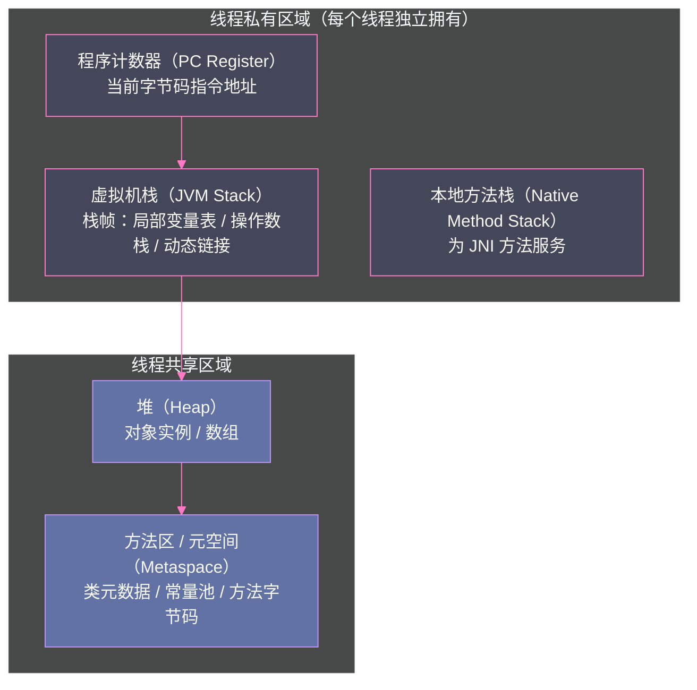

# 01 JVM 全局架构——从 .java 到机器码的完整旅程

**摘要：**

每一行 Java 代码在屏幕上被敲下，到最终在 CPU 的算术逻辑单元中以电信号的形式被执行，中间跨越了令人惊叹的抽象层次。本文以一段最简单的 `HelloWorld.java` 为主线，完整梳理 Java 程序的生命周期：`javac` 前端编译器将源码转化为 `.class` 字节码（Class 文件）；JVM 的类加载子系统将 `.class` 装载进运行时数据区；执行引擎先通过解释器逐条翻译字节码执行，再由 JIT 编译器将热点代码编译为本地机器码；贯穿整个生命周期的 GC 子系统负责自动管理堆内存的分配与回收。本文是 JVM 专栏的总纲，目标是在读者脑中建立一张清晰的全局地图，为后续每篇文章的深入剖析奠定上下文。

---

## 第 1 章 为什么需要 JVM

### 1.1 C 语言的直接编译模型

在 JVM 出现之前，C/C++ 程序的编译模型是直接的：`gcc hello.c -o hello`，源码被编译为特定 CPU 架构和特定操作系统的可执行文件（ELF on Linux x86-64，PE on Windows x64）。

这个模型极其高效——程序直接运行机器码，没有任何中间层。但代价是：
- **不可移植**：在 Linux x86-64 编译的二进制文件不能直接在 macOS ARM 上运行
- **平台碎片化**：同一份源码需要针对不同平台维护不同的构建配置、条件编译宏
- **手动内存管理**：`malloc`/`free` 的配对是程序员的责任，出错代价是内存泄漏或悬空指针

### 1.2 Java 的"一次编写，到处运行"

1995 年 Sun Microsystems 发布 Java 时，提出了一个解决跨平台问题的架构：**在源码和硬件之间插入一层虚拟机（JVM）**。

```
Java 源码 → javac → .class 字节码 → JVM（平台相关）→ 机器码 → CPU
                         ↑
                    平台无关的中间表示
```

`.class` 字节码是一种**平台中立的中间表示**——它不是 x86 指令，不是 ARM 指令，而是面向一台"虚拟机"的指令集。只要目标平台上有对应的 JVM 实现（Windows JVM、Linux JVM、macOS ARM JVM），同一份 `.class` 字节码文件就可以在任意平台上运行。

这个设计的精妙之处：**跨平台的复杂性被封装在 JVM 中**，而不是让每个应用程序自己处理。JVM 实现者（Oracle、Amazon、Azul 等）负责在每个平台上正确地将字节码翻译为本地机器码，Java 应用开发者只需要面对一套统一的字节码规范。

### 1.3 JVM 的三大核心职责

除了跨平台，JVM 还承担了另外两个对应用开发具有深远影响的职责：

**自动内存管理（GC）**：JVM 的垃圾回收器负责跟踪对象的引用关系，当对象不再被任何活跃代码引用时，自动回收其占用的内存。这消灭了 C 语言中大量内存 Bug 的根源（悬空指针、重复释放），代价是 GC 停顿（Stop-The-World）——这也是 JVM 调优最核心的话题之一。

**安全沙箱**：字节码在执行前会经过严格的验证（格式检查、类型安全检查），防止恶意代码破坏 JVM 或访问非授权内存。这也是 Java 曾经被大量用于 Applet（浏览器沙箱执行）的基础。

**自适应优化（JIT）**：JVM 在运行期间持续收集程序的执行统计信息（哪些方法被频繁调用），将热点方法动态编译为高度优化的本地机器码，其性能可以接近甚至超越静态编译的 C++ 代码。

> [!note] 设计哲学
> JVM 是一个"运行时优化平台"——它不像 C 编译器那样在编译时静态优化，而是在程序实际运行时，根据真实的执行行为进行动态优化。这意味着 Java 程序在经过"预热"后，其性能往往比刚启动时高出一个数量级。

---

## 第 2 章 第一步：javac 前端编译

### 2.1 javac 做了什么

当你执行 `javac HelloWorld.java` 时，Java 前端编译器（`javac`）执行了以下阶段：

**词法分析（Lexical Analysis）**：将源码文本分割为一系列 Token（关键字 `public`、标识符 `HelloWorld`、字面量 `"Hello, World!"`、分隔符 `{}`、`;` 等）。

**语法分析（Parsing）**：将 Token 流构建为**抽象语法树（AST, Abstract Syntax Tree）**。AST 是源码结构的树状表示，每个节点代表一个语法结构（类声明、方法声明、方法调用、运算表达式等）。

**语义分析（Semantic Analysis）**：包括符号解析（将变量名绑定到对应的声明）、类型检查（加法的两个操作数是否兼容）、常量折叠（`1 + 2` 在编译期直接变成 `3`）。

**语法糖脱糖（Desugaring）**：Java 的很多语法糖在这里被展开为等价的基础形式。例如：
- `for-each` 循环 → `Iterator` 遍历
- 自动装箱/拆箱 → `Integer.valueOf()`/`Integer.intValue()`
- 泛型类型参数 → 类型擦除（`List<String>` → `List`）+ 插入类型转换强制转型
- Lambda → 匿名内部类（JDK 7 之前）或 `invokedynamic`（JDK 8+）

**字节码生成（Bytecode Generation）**：将处理后的 AST 生成 `.class` 文件。

### 2.2 javac 不做什么——与 JIT 的职责分界

`javac` 是一个相对朴素的编译器，它**几乎不做优化**。这是有意为之的设计。

原因在于：`javac` 在编译时没有程序运行时的信息——它不知道哪些代码会被频繁执行，不知道实际的对象类型（多态调用），不知道运行时的内存布局。这些信息只有在程序实际运行时才能获得。

真正激进的优化（内联、逃逸分析、循环展开、死代码消除）都在 **JIT 编译器（C1/C2）** 中完成，因为那时 JVM 拥有完整的运行时信息。

---

## 第 3 章 第二步：Class 文件结构

### 3.1 Class 文件是什么

`.class` 文件是一个严格定义的二进制格式（由 JVM 规范《The Java Virtual Machine Specification》完整描述），与具体的 CPU 架构和操作系统无关。

用 `javap -verbose HelloWorld.class` 可以反汇编查看：

```
Classfile /path/to/HelloWorld.class
  Last modified ...; size 425 bytes
  MD5 checksum ...
  Compiled from "HelloWorld.java"
public class HelloWorld
  minor version: 0
  major version: 61     ← Java 17 编译产生，61 = 61-44 = 17
  flags: (0x0021) ACC_PUBLIC, ACC_SUPER
  
Constant pool:           ← 常量池：字符串字面量、类名、方法名等
   #1 = Methodref   #2.#3    // java/lang/Object."<init>":()V
   #2 = Class       #4       // java/lang/Object
   #3 = NameAndType #5:#6    // "<init>":()V
   ...
   #7 = String      #8       // Hello, World!
   ...

public static void main(java.lang.String[]);
  descriptor: ([Ljava/lang/String;)V
  Code:
    stack=2, locals=1, args_size=1
       0: getstatic #9  // Field java/lang/System.out:Ljava/io/PrintStream;
       3: ldc #7        // String Hello, World!
       5: invokevirtual #10 // Method java/io/PrintStream.println:(Ljava/lang/String;)V
       8: return
```

### 3.2 Class 文件的关键结构

Class 文件由以下几部分构成（按顺序）：

**魔数（Magic Number）**：`0xCAFEBABE`——4 字节固定值，用于让 JVM 快速确认这是合法的 Class 文件（而不是随机的二进制文件）。

> [!info] 为什么是 CAFEBABE？
> 这是 James Gosling（Java 之父）的幽默之作：在 Java 之前，他的团队曾在旧金山一家名叫 "Cafe Dead" 的餐厅开会（后来改名 "Cafe Byte"），而 "Babe" 是 Grateful Dead 乐队相关的俚语。CAFE + BABE = 咖啡馆的宝贝，恰好也暗合了 Java 与咖啡的联系。

**版本号**：`minor_version`（次版本） + `major_version`（主版本）。主版本号对应 JDK 版本（45=JDK 1.0，52=JDK 8，61=JDK 17，65=JDK 21）。JVM 会拒绝加载高于自身支持版本的 Class 文件，这是 `java.lang.UnsupportedClassVersionError` 的根源。

**常量池（Constant Pool）**：Class 文件中最重要的数据结构，包含字符串字面量、类名、字段名、方法名、方法描述符等。字节码指令通过常量池索引（`#7`、`#10`）引用这些符号，而不是直接嵌入字符串——这大幅减小了 Class 文件体积，也是符号引用（Symbolic Reference）的存储位置。

**访问标志（Access Flags）**：标记类/接口的修饰符（`public`、`final`、`abstract`、`interface` 等）。

**字段表（Fields）**：描述类中所有字段（名称、类型、访问标志）。

**方法表（Methods）**：描述类中所有方法，每个方法包含 `Code` 属性——这就是方法对应的字节码序列。

**属性表（Attributes）**：附加信息，包括 `LineNumberTable`（字节码偏移量到源码行号的映射，用于异常栈跟踪）、`LocalVariableTable`（局部变量名，用于调试）、`StackMapTable`（JDK 6+ 的字节码验证优化）等。

---

## 第 4 章 第三步：类加载子系统

### 4.1 类加载的五个阶段

JVM 不会在启动时把所有类都加载到内存——它采用**懒加载（Lazy Loading）** 策略：只在第一次使用某个类时才加载它。

一个类从 `.class` 文件到可以被程序使用，要经历五个阶段：

```
加载（Loading）→ 验证（Verification）→ 准备（Preparation）→ 解析（Resolution）→ 初始化（Initialization）
```

**加载（Loading）**：通过类加载器（ClassLoader）将 `.class` 文件的字节流读入内存，在**方法区**中创建对应的 `Class` 对象（`java.lang.Class` 实例），并在**堆**中创建一个代表这个类型的 `Class` 对象供反射使用。

**验证（Verification）**：检查字节码是否符合 JVM 规范，防止恶意字节码破坏 JVM。包括：
- 文件格式验证（魔数、版本号、常量池格式）
- 元数据验证（父类是否存在、是否继承了 `final` 类、接口方法是否都有实现）
- 字节码验证（操作数栈类型合法性、跳转指令目标合法性）
- 符号引用验证（引用的类、字段、方法是否实际存在）

**准备（Preparation）**：为类的**静态变量**分配内存，并设置初始零值（`int` → 0，`boolean` → false，`Object` → null）。注意：这里设置的是零值，不是代码中写的初始值。`public static int value = 100` 在准备阶段 `value` 是 0，`100` 在初始化阶段才赋上。

**解析（Resolution）**：将常量池中的**符号引用**替换为**直接引用**。符号引用是字符串形式的（`java/lang/String`），直接引用是 JVM 内部的指针/偏移量。解析的目标是类、接口、字段、方法。

**初始化（Initialization）**：执行类的 `<clinit>()` 方法（由 `javac` 将所有静态变量赋值语句和静态代码块合并生成），这里静态变量才被赋予真正的初始值。

### 4.2 双亲委派模型

Java 的类加载器构成一个层次结构，采用**双亲委派模型（Parent Delegation Model）**：

```
Bootstrap ClassLoader（启动类加载器）
    ↑ 父加载器
Extension/Platform ClassLoader（扩展/平台类加载器）
    ↑ 父加载器
Application ClassLoader（应用程序类加载器）
    ↑ 父加载器
自定义 ClassLoader
```

当任何一个类加载器收到加载请求时，**先委派给父加载器**，父加载器加载失败后才自己尝试。这保证了：
- `java.lang.Object` 永远由 Bootstrap ClassLoader 加载，不会被"替换"
- 相同 ClassLoader 加载的相同全名类具有唯一性

---

## 第 5 章 第四步：运行时数据区

JVM 在运行时将内存划分为若干区域（对应 JVM 规范的 "Run-Time Data Areas"），每个区域有各自的用途和生命周期：



**程序计数器（PC Register）**：记录当前线程正在执行的字节码指令的地址。是 JVM 中唯一不会发生 OutOfMemoryError 的区域。执行本地（native）方法时，PC 为 undefined（因为本地代码不是字节码）。

**虚拟机栈（JVM Stack）**：每个方法调用时创建一个**栈帧（Stack Frame）**，方法返回时栈帧出栈。栈帧包含：
- **局部变量表**：存储方法参数和局部变量
- **操作数栈**：字节码指令的计算"草稿纸"（JVM 是基于栈的虚拟机）
- **动态链接**：指向当前方法所属类的运行时常量池引用
- **方法返回地址**：方法正常/异常返回后需要恢复的调用者 PC

**堆（Heap）**：JVM 中最大的内存区域，**所有对象实例和数组**都在这里分配。GC 管理的就是这块区域。分为**新生代**（Young Generation：Eden + S0 + S1）和**老年代**（Old Generation）。

**方法区（元空间）**：存储已被加载的**类型信息**（类名、父类、接口列表、字段描述符、方法字节码、运行时常量池等）。JDK 8 之前叫**永久代（PermGen）**，位于 JVM 堆内；JDK 8 开始改为**元空间（Metaspace）**，存储在本地内存（Native Memory），由操作系统管理，彻底消除了 `java.lang.OutOfMemoryError: PermGen space`。

---

## 第 6 章 第五步：执行引擎

### 6.1 两种执行方式

字节码进入执行引擎后，有两种执行方式：

**解释执行（Interpreter）**：将字节码指令逐条翻译为机器码并立即执行。启动快（无需等待编译），但每次执行都需要翻译，性能较低（约为 C 代码的 1/10 到 1/5）。

**JIT 编译执行（Just-In-Time Compilation）**：将热点方法的整个字节码编译为本地机器码缓存起来，后续调用直接执行机器码。编译有启动延迟（"预热期"），但一旦完成，性能与静态编译代码相当。

HotSpot VM 采用**分层编译（Tiered Compilation，JDK 8 起默认）**策略，综合两者优点：

```
Level 0: 解释器         → 解释执行，收集基础计数统计
Level 1: C1（无 profile）→ 简单编译，快速生成机器码（适合几乎不调用的方法）
Level 2: C1（限量 profile）→ C1 编译 + 少量性能计数
Level 3: C1（完整 profile）→ C1 编译 + 完整分支/调用统计
Level 4: C2            → 基于 profile 的深度优化编译（最终目标）
```

大多数方法从 Level 0 开始，随着调用次数增加，逐步经历 Level 1/2/3，最终在足够"热"时晋升到 Level 4（C2 编译），获得最高性能。

### 6.2 C1 与 C2 的分工

**C1 编译器（Client Compiler）**：
- 编译速度快（适合快速让方法"比解释快"）
- 优化相对保守：方法内联、常量折叠、基本死代码消除
- 输出含有 profile 桩的机器码（用于收集运行时统计）

**C2 编译器（Server Compiler）**：
- 编译速度慢，但优化深度远超 C1
- 核心优化：**逃逸分析**（Escape Analysis）→ 栈上分配 + 标量替换 + 锁消除；**内联缓存**（Inline Cache）+ 虚方法去虚化；**循环展开**；**向量化**（SIMD）

### 6.3 热点探测机制

JVM 通过两个计数器来判断一个方法是否"热"：

**方法调用计数器（Invocation Counter）**：每次方法被调用时 +1，超过阈值（`-XX:CompileThreshold`，默认 10000 次）触发 JIT 编译请求。

**回边计数器（Back-Edge Counter）**：在方法内部，每执行一次循环回跳（loop back-edge）时 +1，用于触发**OSR（On-Stack Replacement）编译**——对于一个正在解释执行的循环，JIT 可以将其在循环进行到一半时"替换"为编译版本，不需要等下次调用。

---

## 第 7 章 第六步：GC 子系统

### 7.1 为什么需要 GC

Java 程序中所有对象通过 `new` 在堆上分配。当一个对象不再被任何活跃代码引用时，它的内存就可以被回收以供新对象使用。

手动管理（如 C 的 `malloc`/`free`）的问题：
- 忘记 `free` → 内存泄漏
- 重复 `free` → 悬空指针 / 程序崩溃
- 提前 `free`（对象还在被使用时就释放）→ Use-After-Free 漏洞

GC 自动处理这些问题，代价是：不确定的暂停（Stop-The-World）和额外的 CPU/内存开销。

### 7.2 分代假说与内存布局

现代 GC 的设计基于两个分代假说：

**弱分代假说（Weak Generational Hypothesis）**：大多数对象生命周期极短（"朝生暮死"），只有少数对象能存活很长时间。统计数据表明，超过 95% 的对象在第一次 GC 前就死亡。

**强分代假说（Strong Generational Hypothesis）**：经历过越多次 GC 仍然存活的对象，未来也越可能继续存活（越"老"越难死）。

基于这两个假说，JVM 将堆划分为新生代和老年代，分别采用不同的回收策略：

```
堆（Heap）
├── 新生代（Young Generation，约 1/3）
│   ├── Eden 区（约 8/10）← 新对象优先分配在此
│   ├── Survivor 0（约 1/10，"From"）
│   └── Survivor 1（约 1/10，"To"）
└── 老年代（Old Generation，约 2/3）
    └── 经历 N 次 Minor GC 存活的"老"对象
```

**Minor GC**（Young GC）：只回收新生代，频率高，停顿短（通常几毫秒到几十毫秒）。

**Major GC / Full GC**：回收老年代（或整个堆），频率低，停顿长（可能几百毫秒到数秒）。Full GC 是性能调优的重点关注对象。

### 7.3 GC 收集器家族一览

```
单线程时代            并行时代              并发时代
─────────────────────────────────────────────────────→ 时间
Serial       →    Parallel Scavenge  →    G1 (JDK 7+)
Serial Old   →    Parallel Old       →    ZGC (JDK 11+)
             →    CMS                →    Shenandoah (JDK 12+)
                 (并发标记，但整理是STW)

STW = Stop-The-World（全线暂停）
```

- **Serial/Serial Old**：单线程 STW，适合客户端小应用
- **Parallel Scavenge/Old**：多线程并行 STW，吞吐量优先
- **CMS**：并发标记减少停顿，但碎片化严重，JDK 9 废弃
- **G1**：Region 化堆，可预测停顿，JDK 9+ 默认
- **ZGC/Shenandoah**：亚毫秒停顿目标，并发转移，延迟敏感型场景

---

## 第 8 章 JVM 全局架构总览

将以上所有阶段整合为一张完整的架构图：

```mermaid
%%{init: {'theme': 'dark', 'themeVariables': {'primaryColor': '#6272a4', 'primaryTextColor': '#f8f8f2', 'primaryBorderColor': '#bd93f9', 'lineColor': '#ff79c6', 'secondaryColor': '#44475a', 'tertiaryColor': '#282a36'}}}%%
graph TD
    SRC["HelloWorld.java\n源代码"] -->|"javac 前端编译"| CLASS["HelloWorld.class\n字节码文件"]
    
    CLASS --> CLS_LOADER

    subgraph "JVM 运行时"
        subgraph "类加载子系统"
            CLS_LOADER["类加载器\nBootstrap / Extension / App"]
            CLS_LOADER -->|"加载 → 验证 → 准备 → 解析 → 初始化"| RT_DATA
        end
        
        subgraph "运行时数据区"
            RT_DATA{" "}
            PC_REG["程序计数器"]
            JVM_STACK["虚拟机栈\n栈帧（局部变量/操作数栈）"]
            HEAP_MEM["堆\nEden / Survivor / Old"]
            METASPACE_MEM["元空间\n类元数据 / 常量池"]
            NATIVE_STACK["本地方法栈"]
            RT_DATA --> PC_REG
            RT_DATA --> JVM_STACK
            RT_DATA --> HEAP_MEM
            RT_DATA --> METASPACE_MEM
            RT_DATA --> NATIVE_STACK
        end
        
        subgraph "执行引擎"
            INTERPRETER["解释器\n逐条翻译字节码"]
            JIT["JIT 编译器\nC1（快速）+ C2（深度优化）"]
            GC_ENGINE["GC 子系统\nSerial/Parallel/G1/ZGC"]
            INTERPRETER -->|"热点探测，晋升"| JIT
        end
        
        JVM_STACK -->|"字节码分发"| INTERPRETER
        HEAP_MEM <-->|"对象分配 / 回收"| GC_ENGINE
    end
    
    JIT -->|"输出本地机器码"| CPU["CPU\n执行机器指令"]

    classDef source fill:#50fa7b,stroke:#50fa7b,color:#282a36
    classDef class fill:#8be9fd,stroke:#8be9fd,color:#282a36
    classDef jvm fill:#6272a4,stroke:#bd93f9,color:#f8f8f2
    classDef cpu fill:#ff79c6,stroke:#ff79c6,color:#282a36
    class SRC source
    class CLASS class
    class CPU cpu
```

---

## 第 9 章 HotSpot VM 与其他 JVM 实现

### 9.1 JVM 规范与实现的分离

需要区分两个概念：

**JVM 规范（JVM Specification）**：由 Oracle 维护的《The Java Virtual Machine Specification》，定义了 JVM 的抽象行为——字节码格式、类型系统、运行时数据区的语义、异常处理语义等。这是一个**规范文档**，不是代码。

**JVM 实现**：符合规范的具体实现。只要通过 TCK（Technology Compatibility Kit）测试，任何组织都可以实现自己的 JVM。

主要 JVM 实现对比：

| 实现 | 维护者 | 特点 |
| :--- | :--- | :--- |
| **HotSpot** | Oracle/OpenJDK | 最主流，JDK 自带，C1+C2 分层编译 |
| **GraalVM Native Image** | Oracle | AOT 编译为本地二进制，启动极快，但失去动态特性 |
| **OpenJ9（Eclipse）** | IBM/Eclipse | 内存占用低，适合容器化部署 |
| **Azul Zing/Zulu** | Azul Systems | C4 GC（无 STW），商业支持 |
| **Android ART** | Google | Android 专用，DEX 字节码，AOT + JIT 混合 |

### 9.2 GraalVM 的意义

GraalVM 是近年来 JVM 生态最重要的创新之一，它做了两件事：

**Graal JIT 编译器**：用 Java 编写的 C2 替代品，支持插件化（Truffle 框架），可以让 JVM 高效执行 Python、Ruby、JavaScript 等非 Java 语言（将其编译为 Graal 能理解的中间表示）。

**Native Image**：将 Java 程序提前（AOT）编译为本地可执行文件，无需 JVM 运行时。启动时间从秒级降到毫秒级，内存占用大幅降低，非常适合 Serverless/FaaS 和微服务容器化场景。代价是：无法使用动态类加载、反射使用受限，失去了 JIT 的运行时自适应优化。

---

## 第 10 章 总结：全局地图与专栏导读

本文是整个 JVM 专栏的总纲，建立了 Java 程序从源码到执行的完整认知框架：

**编译阶段**（`javac`）→ 生成平台无关的 `.class` 字节码，语法糖在此展开，泛型类型此处擦除。

**类加载**（ClassLoader）→ 五阶段（加载/验证/准备/解析/初始化）将字节码转化为 JVM 内部的类型表示，双亲委派保证核心类的唯一性。

**运行时数据区** → 程序计数器（线程隔离）、虚拟机栈（方法调用帧）、堆（对象分配，GC 管理）、元空间（类元数据）各司其职。

**执行引擎** → 解释器负责启动和冷路径，JIT（C1+C2 分层）负责热路径的深度优化，共同实现"启动快 + 运行快"。

**GC 子系统** → 基于分代假说管理堆内存，从 Serial → Parallel → CMS → G1 → ZGC/Shenandoah，停顿时间从秒级降至亚毫秒。

后续各篇文章将沿着这张地图深入每个子系统：

- **第 2-3 篇**：深入运行时数据区，逐字节解析对象内存布局
- **第 4-9 篇**：GC 理论 → 经典回收器 → G1 → ZGC/Shenandoah 的演进全解析
- **第 10 篇**：类加载机制与双亲委派的深度剖析
- **第 11-12 篇**：字节码与 JIT 编译的底层原理
- **第 13-14 篇**：生产环境 OOM 排查 + GC 调优实战

---

## 参考文献

1. Tim Lindholm et al., "The Java Virtual Machine Specification, Java SE 21 Edition"
2. Scott Oaks, "Java Performance: The Definitive Guide", 2nd Ed., O'Reilly, 2020
3. 周志明, 《深入理解 Java 虚拟机（第三版）》, 机械工业出版社, 2019
4. HotSpot VM 架构文档, wiki.openjdk.org/display/HotSpot
5. Cliff Click & Michael Paleczny, "A Simple Graph-Based Intermediate Representation", 1995（C2 Sea-of-Nodes IR）
6. Christian Wimmer et al., "Graal: A Research Platform for Dynamic Compilation and Managed Runtimes", 2013

---

> [!note] 思考题
> 1. Java 源码经过 javac 编译为字节码，再由 JVM 解释执行或 JIT 编译为机器码。为什么 Java 不像 Go 那样直接编译为原生机器码？字节码这一'中间表示'除了跨平台之外，还为 JVM 的哪些运行时优化提供了前提条件？
> 2. JVM 规范定义了类加载、内存模型、执行引擎等抽象接口，但并不规定具体实现。HotSpot、OpenJ9、GraalVM 都是合规实现。同一份字节码在不同 JVM 上的执行性能可能差异巨大——这种差异主要来自哪些模块的实现差异？
> 3. 从 `java MyApp` 命令输入到 `main` 方法第一行执行，JVM 启动过程中至少经历了哪些阶段（类加载、链接、初始化、线程创建等）？如果 `main` 方法所在类的静态初始化块抛出异常，JVM 的行为是什么？
