# 01 JVM 全局架构——从 .java 到机器码的完整旅程

> [!abstract] 摘要
> 每一行 Java 代码在屏幕上被敲下，到最终在 CPU 的算术逻辑单元中以电信号的形式被执行，中间跨越了令人惊叹的抽象层次。本文以一段最简单的 `HelloWorld.java` 为主线，完整梳理 Java 程序的生命周期：`javac` 前端编译器将源码转化为 `.class` 字节码（Class 文件）；JVM 的类加载子系统将 `.class` 装载进运行时数据区；执行引擎先通过解释器逐条翻译字节码执行，再由 JIT 编译器将热点代码编译为本地机器码；贯穿整个生命周期的 GC 子系统负责自动管理堆内存的分配与回收。文章同时给出 JVM 与 C/C++、Go 两类"竞品"编译模型的深度对比，梳理 Class 文件版本、类加载、执行引擎在 JDK 8/11/17/21 四个 LTS 版本上的关键演进，并在每个环节标注生产环境的常见误区与排查抓手。本文是 JVM 专栏的总纲，目标是在读者脑中建立一张清晰的全局地图——之后专栏的每一篇文章，都是在这张地图的某一个节点上"打钻"，向下钻到源码级的实现细节。

---

## 第 1 章 为什么需要 JVM

### 1.1 C 语言的直接编译模型

在 JVM 出现之前，C/C++ 程序的编译模型是直接的：`gcc hello.c -o hello`，源码被编译为特定 CPU 架构和特定操作系统的可执行文件（ELF on Linux x86-64，PE on Windows x64）。

这个模型极其高效——程序直接运行机器码，没有任何中间层。但代价是：
- **不可移植**：在 Linux x86-64 编译的二进制文件不能直接在 macOS ARM 上运行
- **平台碎片化**：同一份源码需要针对不同平台维护不同的构建配置、条件编译宏
- **手动内存管理**：`malloc`/`free` 的配对是程序员的责任，出错代价是内存泄漏或悬空指针

更深层的问题在于：C 编译器（如 GCC/Clang）做的是**一次性静态优化**。它在编译期基于源码的静态结构进行内联、常量传播、循环优化，但它对"这段代码在生产环境里到底跑得有多热""这个函数指针实际指向的是哪个具体实现"这类运行期才能观察到的行为一无所知。静态编译器只能依赖启发式规则和程序员标注（如 `__builtin_expect`）去猜测运行期行为，猜错了就是死账——二进制已经生成，无法在运行期回退重新编译。这个局限是理解"为什么 JVM 要引入一层虚拟机做运行期编译"的关键前提，而不仅仅是"为了跨平台"。

### 1.1.1 不这样会怎样：C 模型在企业级场景下的真实代价

设想一个用 C++ 编写的企业中间件，需要同时支持 Linux/Windows/macOS、x86-64/ARM64，并且要面向数十个客户的不同 CPU 型号做微调优化。工程团队必须维护交叉编译工具链、多套 CI 矩阵、平台相关的条件编译宏（`#ifdef __linux__`），任何一次内存管理 Bug（悬空指针、Double Free、Use-After-Free）都可能造成难以复现的偶发崩溃或安全漏洞（如著名的 Heartbleed 本质就是一次内存越界读）。这些问题不是"C 语言写得不好"，而是这套编译模型把跨平台适配和内存安全的责任，从"编译器/运行时"下放给了"程序员"——JVM 的核心设计动机之一，就是把这两类责任重新收归到运行时层面。

### 1.2 Java 的"一次编写，到处运行"

1995 年 Sun Microsystems 发布 Java 时，提出了一个解决跨平台问题的架构：**在源码和硬件之间插入一层虚拟机（JVM）**。

```
Java 源码 → javac → .class 字节码 → JVM（平台相关）→ 机器码 → CPU
                         ↑
                    平台无关的中间表示
```

`.class` 字节码是一种**平台中立的中间表示**——它不是 x86 指令，不是 ARM 指令，而是面向一台"虚拟机"的指令集。只要目标平台上有对应的 JVM 实现（Windows JVM、Linux JVM、macOS ARM JVM），同一份 `.class` 字节码文件就可以在任意平台上运行。

这个设计的精妙之处：**跨平台的复杂性被封装在 JVM 中**，而不是让每个应用程序自己处理。JVM 实现者（Oracle、Amazon、Azul 等）负责在每个平台上正确地将字节码翻译为本地机器码，Java 应用开发者只需要面对一套统一的字节码规范。

### 1.3 JVM 的三大核心职责

除了跨平台，JVM 还承担了另外两个对应用开发具有深远影响的职责：

**自动内存管理（GC）**：JVM 的垃圾回收器负责跟踪对象的引用关系，当对象不再被任何活跃代码引用时，自动回收其占用的内存。这消灭了 C 语言中大量内存 Bug 的根源（悬空指针、重复释放），代价是 GC 停顿（Stop-The-World）——这也是 JVM 调优最核心的话题之一。

**安全沙箱**：字节码在执行前会经过严格的验证（格式检查、类型安全检查），防止恶意代码破坏 JVM 或访问非授权内存。这也是 Java 曾经被大量用于 Applet（浏览器沙箱执行）的基础。

**自适应优化（JIT）**：JVM 在运行期间持续收集程序的执行统计信息（哪些方法被频繁调用），将热点方法动态编译为高度优化的本地机器码，其性能可以接近甚至超越静态编译的 C++ 代码。

> [!note] 设计哲学
> JVM 是一个"运行时优化平台"——它不像 C 编译器那样在编译时静态优化，而是在程序实际运行时，根据真实的执行行为进行动态优化。这意味着 Java 程序在经过"预热"后，其性能往往比刚启动时高出一个数量级。

### 1.4 与 Go 的对比：另一条跨平台路径

Go 语言同样标榜"跨平台"，但它选择了与 Java 完全不同的技术路线：`go build` 直接生成目标平台的静态链接可执行文件，没有独立的虚拟机进程，没有字节码这一中间表示层。Go 实现跨平台的方式是**工具链内置多套后端代码生成器**（`GOOS`/`GOARCH` 组合），编译期直接决定目标机器码，而不是把这个决定推迟到运行期。

这个差异带来的工程后果值得展开：

| 维度 | JVM（Java） | Go |
| :--- | :--- | :--- |
| 中间表示 | `.class` 字节码，运行时才编译为机器码 | 无独立字节码，编译期直出机器码 |
| 启动速度 | 较慢（需类加载 + 解释器预热，Native Image 除外） | 极快（无需运行时初始化字节码子系统） |
| 峰值性能 | 预热后接近甚至反超 C++（JIT 可利用运行期 profile 做激进优化） | 稳定但通常不做运行期自适应优化 |
| 内存管理 | 分代 GC，STW 可控但存在（G1/ZGC 已压到亚毫秒级） | 三色标记 + 混合写屏障的并发 GC，无分代（Go 1.x 长期如此） |
| 部署产物 | 需要 JVM 运行时环境（或 Native Image 静态化） | 单一静态二进制，天然适合容器化分发 |
| 动态特性 | 反射、动态代理、运行时类加载、热部署 | 反射能力弱，不支持运行期动态加载新类型 |

这不是"孰优孰劣"的问题，而是**设计目标不同带来的权衡取舍**：Java 用"运行期编译的延迟"换来了"跨平台 + 运行期自适应优化"的能力，Go 用"放弃运行期优化"换来了"启动快、部署简单、心智负担低"。理解这一点后再看后文的 JIT 分层编译（第 6 章）与 GraalVM Native Image（第 9 章），会发现 Java 生态其实也在朝 Go 的部署形态靠拢——这正是 AOT（Ahead-Of-Time）编译在 Java 世界越来越受重视的根本原因。

---

## 第 2 章 第一步：javac 前端编译

### 2.1 javac 做了什么

当你执行 `javac HelloWorld.java` 时，Java 前端编译器（`javac`）执行了以下阶段：

**词法分析（Lexical Analysis）**：将源码文本分割为一系列 Token（关键字 `public`、标识符 `HelloWorld`、字面量 `"Hello, World!"`、分隔符 `{}`、`;` 等）。

**语法分析（Parsing）**：将 Token 流构建为**抽象语法树（AST, Abstract Syntax Tree）**。AST 是源码结构的树状表示，每个节点代表一个语法结构（类声明、方法声明、方法调用、运算表达式等）。

**语义分析（Semantic Analysis）**：包括符号解析（将变量名绑定到对应的声明）、类型检查（加法的两个操作数是否兼容）、常量折叠（`1 + 2` 在编译期直接变成 `3`）。

**语法糖脱糖（Desugaring）**：Java 的很多语法糖在这里被展开为等价的基础形式。例如：
- `for-each` 循环 → `Iterator` 遍历
- 自动装箱/拆箱 → `Integer.valueOf()`/`Integer.intValue()`
- 泛型类型参数 → 类型擦除（`List<String>` → `List`）+ 插入类型转换强制转型
- Lambda → 匿名内部类（JDK 7 之前）或 `invokedynamic`（JDK 8+）

**字节码生成（Bytecode Generation）**：将处理后的 AST 生成 `.class` 文件。

### 2.2 Lambda 脱糖的特殊路径：为什么不是简单变成匿名内部类

Lambda 表达式是脱糖阶段里最容易被误解的一个例子，值得单独展开，因为它揭示了 `javac` 与 JVM 之间责任分工的一次重大调整。

在 JDK 8 引入 Lambda 之初，一个直觉的实现方式是：把 `Runnable r = () -> System.out.println("hi");` 直接脱糖为一个匿名内部类 `new Runnable() { public void run() { ... } }`。这也是 JDK 7 及更早版本模拟"类似 Lambda 效果"时唯一能用的手段。但这个方案有两个明显缺陷：**类爆炸**（每一处 Lambda 都需要在编译期生成一个独立的 `.class` 文件，大型项目里 Lambda 数量可能是方法数量的数倍）；**缺乏灵活性**（一旦生成为具体类文件，运行期无法再更换实现策略，比如根据是否已有等价 Lambda 做去重缓存）。

Java 团队因此选择了另一条路：`javac` 只把 Lambda 体本身编译为当前类的一个**私有合成方法**（`private static synthetic lambda$main$0` 之类的命名），然后在调用处插入一条 **`invokedynamic`** 指令，把"如何把这个方法适配成目标函数式接口的实例"这件事，**推迟到类加载后的第一次调用时**，由 JVM 运行期通过 `LambdaMetafactory` 动态生成适配类并缓存。用 `javap -c` 反编译含 Lambda 的类可以看到：

```
private static void lambda$main$0();
  Code:
     0: getstatic  #2  // System.out
     3: ldc        #3  // "hi"
     5: invokevirtual #4 // println
     8: return

public static void main(java.lang.String[]);
  Code:
     0: invokedynamic #5, 0  // InvokeDynamic #0:run:()Ljava/lang/Runnable;
     5: astore_1
     ...
```

`invokedynamic` 第一次执行时会触发一次"引导方法"（Bootstrap Method）调用，由 `LambdaMetafactory.metafactory()` 在运行期用 `ASM` 风格的字节码生成技术现场造出一个实现 `Runnable` 接口的适配类，并把这个绑定结果缓存到调用点的 `CallSite` 中——后续同一处调用点直接复用缓存，不再重复生成。这个机制本质上把"要不要生成适配类、怎么生成"的决策权，从编译期的 `javac` 转移给了运行期的 JVM，为后续 JIT 对 Lambda 调用做内联优化留出了空间，也是 `invokedynamic`（JDK 7 为支持动态语言引入，JDK 8 复用于 Lambda）真正发挥价值的场景。这部分机制在 [[执行引擎/11 字节码指令集与执行引擎]] 中还会结合 `invokevirtual`/`invokeinterface` 等其余四条方法调用指令做进一步对比。

### 2.3 javac 不做什么——与 JIT 的职责分界

`javac` 是一个相对朴素的编译器，它**几乎不做激进优化**（常量折叠、简单的死代码剔除之类的"编译期显然成立"的优化会做，但仅限于这个级别）。这是有意为之的设计，而不是能力不足。

原因在于：`javac` 在编译时没有程序运行时的信息——它不知道哪些代码会被频繁执行，不知道实际的对象类型（多态调用的真实目标是哪个子类实现），不知道运行时的内存布局，也不知道某个分支在生产流量下走"true"还是"false"的概率分布。这些信息只有在程序实际运行时才能获得。

真正激进的优化（内联、逃逸分析、循环展开、死代码消除、基于分支概率的代码布局）都在 **JIT 编译器（C1/C2）** 中完成，因为那时 JVM 拥有完整的运行时信息。这也是为什么反编译一个 Java 项目的 `.class` 文件，看到的字节码往往"平淡无奇"——几乎所有的性能魔法都发生在后面执行引擎那一层，而不是编译阶段。

> [!warning] 生产避坑：不要用 javac 字节码的"朴素程度"评估性能
> 很多工程师用 `javap -c` 看到某段代码生成的字节码里有冗余的局部变量、看似多余的类型转换指令，就断定这段代码性能差，进而做手工"优化"（比如手动把多层嵌套调用摊平）。这是一个典型误区：`javac` 生成的字节码是否精简，与该方法最终的机器码性能几乎无关，因为 C2 编译器会在内联后对整个调用树重新做寄存器分配、常量传播和死代码消除。真正值得关注的性能问题，应该用 JFR（JDK Flight Recorder）或 `async-profiler` 观测运行期的真实热点，而不是靠读字节码"猜"性能。

---

## 第 3 章 第二步：Class 文件结构

### 3.1 Class 文件是什么

`.class` 文件是一个严格定义的二进制格式（由 JVM 规范《The Java Virtual Machine Specification》完整描述），与具体的 CPU 架构和操作系统无关。

用 `javap -verbose HelloWorld.class` 可以反汇编查看：

```
Classfile /path/to/HelloWorld.class
  Last modified ...; size 425 bytes
  MD5 checksum ...
  Compiled from "HelloWorld.java"
public class HelloWorld
  minor version: 0
  major version: 61     ← Java 17 编译产生，61 = 61-44 = 17
  flags: (0x0021) ACC_PUBLIC, ACC_SUPER
  
Constant pool:           ← 常量池：字符串字面量、类名、方法名等
   #1 = Methodref   #2.#3    // java/lang/Object."<init>":()V
   #2 = Class       #4       // java/lang/Object
   #3 = NameAndType #5:#6    // "<init>":()V
   ...
   #7 = String      #8       // Hello, World!
   ...

public static void main(java.lang.String[]);
  descriptor: ([Ljava/lang/String;)V
  Code:
    stack=2, locals=1, args_size=1
       0: getstatic #9  // Field java/lang/System.out:Ljava/io/PrintStream;
       3: ldc #7        // String Hello, World!
       5: invokevirtual #10 // Method java/io/PrintStream.println:(Ljava/lang/String;)V
       8: return
```

### 3.2 Class 文件的关键结构

Class 文件由以下几部分构成（按顺序）：

**魔数（Magic Number）**：`0xCAFEBABE`——4 字节固定值，用于让 JVM 快速确认这是合法的 Class 文件（而不是随机的二进制文件）。

> [!info] 为什么是 CAFEBABE？
> 这是 James Gosling（Java 之父）的幽默之作：在 Java 之前，他的团队曾在旧金山一家名叫 "Cafe Dead" 的餐厅开会（后来改名 "Cafe Byte"），而 "Babe" 是 Grateful Dead 乐队相关的俚语。CAFE + BABE = 咖啡馆的宝贝，恰好也暗合了 Java 与咖啡的联系。

**版本号**：`minor_version`（次版本） + `major_version`（主版本）。主版本号对应 JDK 版本（45=JDK 1.0，52=JDK 8，61=JDK 17，65=JDK 21）。JVM 会拒绝加载高于自身支持版本的 Class 文件，这是 `java.lang.UnsupportedClassVersionError` 的根源。

**常量池（Constant Pool）**：Class 文件中最重要的数据结构，包含字符串字面量、类名、字段名、方法名、方法描述符等。字节码指令通过常量池索引（`#7`、`#10`）引用这些符号，而不是直接嵌入字符串——这大幅减小了 Class 文件体积，也是符号引用（Symbolic Reference）的存储位置。

**访问标志（Access Flags）**：标记类/接口的修饰符（`public`、`final`、`abstract`、`interface` 等）。

**字段表（Fields）**：描述类中所有字段（名称、类型、访问标志）。

**方法表（Methods）**：描述类中所有方法，每个方法包含 `Code` 属性——这就是方法对应的字节码序列。

**属性表（Attributes）**：附加信息，包括 `LineNumberTable`（字节码偏移量到源码行号的映射，用于异常栈跟踪）、`LocalVariableTable`（局部变量名，用于调试）、`StackMapTable`（JDK 6+ 的字节码验证优化）等。

### 3.3 常量池为什么这样设计：符号引用的工程意义

常量池表面上只是一个"存字符串的地方"，但它承载着 Class 文件格式最核心的设计决策：**类、字段、方法在字节码指令中只以常量池索引的形式出现，从不直接内嵌完整的限定名字符串**。这个设计不是为了省几个字节，而是解决了两个更本质的问题。

第一个问题是**编译期与运行期的解耦**。`javac` 编译 `HelloWorld.java` 时，`System`、`PrintStream` 这些类可能还没有被加载，甚至它们的实际内存地址在编译期根本不存在（地址是运行期才分配的）。如果字节码里直接写死内存地址，这份 `.class` 文件就无法在任意一次 JVM 启动之间复用。常量池里存的是**符号引用**（Symbolic Reference）——用字符串描述"我需要一个名叫 `java/io/PrintStream` 的类，它有一个签名为 `(Ljava/lang/String;)V` 的 `println` 方法"，而不是这个方法实际的入口地址。只有在类加载的**解析（Resolution）**阶段（详见第 4 章），JVM 才会把这些符号引用替换为**直接引用**（Direct Reference，即指向方法区中方法元数据的指针或偏移量）。

第二个问题是**字节码的紧凑性与去重**。一个类中如果有十次调用同一个方法，字节码指令只需要十次引用同一个常量池索引（比如都写 `#10`），常量池本身只存一份完整的方法描述符字符串。这对包含大量重复符号引用的大型类（尤其是生成的代理类、Lambda 相关的合成类）而言，是显著的空间优化。

理解常量池的符号引用机制后，"运行时常量池"（Runtime Constant Pool，存在于方法区/元空间中）这个名词就不再抽象——它就是 Class 文件常量池被加载进内存后的运行期形态，且在解析阶段逐步把符号引用替换为直接引用，这个过程是**懒惰的**（Lazy Resolution）：JVM 规范允许在首次真正用到某个符号引用时才解析它，而不是类加载时一次性全部解析完毕，这也是为什么一个类里引用了一个根本不存在的类，只要这行代码从未被执行，程序也不会抛 `NoClassDefFoundError`。

### 3.4 Class 文件版本与 JDK 演进对照

主版本号是排查 `UnsupportedClassVersionError` 最直接的线索，也是判断一个第三方 JAR 编译目标的最快方式（`unzip -p xxx.jar some/Class.class | xxd | head`）。几个关键 LTS 版本的对应关系：

| JDK 版本 | Class 文件 major version | 该版本对字节码/Class 格式的关键影响 |
| :--- | :--- | :--- |
| JDK 8 | 52 | Lambda + `invokedynamic` 全面落地；`StackMapTable` 成为字节码验证的标配属性 |
| JDK 11 | 55 | 支持嵌套类之间私有成员访问的 `invokestatic` 优化（避免生成桥接方法）；模块系统属性延续 JDK 9 引入的 `Module` 属性 |
| JDK 17 | 61 | Sealed Class 相关属性（`PermittedSubclasses`）；密封类的类型检查在验证阶段加强 |
| JDK 21 | 65 | Record 相关属性进一步稳定；模式匹配（Pattern Matching for switch）引入新的字节码序列支持 |

> [!warning] 生产避坑：`--release` 与 `-source`/`-target` 不是一回事
> 用 `javac -source 8 -target 8` 编译，只保证生成的字节码版本号是 JDK 8 对应值，但**编译时仍然会链接当前 JDK 的标准库**（比如可能误用了 JDK 11 才有的 API，编译不报错，运行期才 `NoSuchMethodError`）。正确做法是使用 `javac --release 8`，它会强制使用对应版本的 API 签名文件（`ct.sym`）做编译期校验，从根源上避免这类版本不匹配问题——这是多版本兼容发布场景（尤其是给老版本 JDK 用户提供兼容 JAR）中最容易被忽视的一个坑。

---

## 第 4 章 第三步：类加载子系统

### 4.1 类加载的五个阶段

JVM 不会在启动时把所有类都加载到内存——它采用**懒加载（Lazy Loading）** 策略：只在第一次使用某个类时才加载它。

一个类从 `.class` 文件到可以被程序使用，要经历五个阶段：

```
加载（Loading）→ 验证（Verification）→ 准备（Preparation）→ 解析（Resolution）→ 初始化（Initialization）
```

**加载（Loading）**：通过类加载器（ClassLoader）将 `.class` 文件的字节流读入内存，在**方法区**中创建对应的 `Class` 对象（`java.lang.Class` 实例），并在**堆**中创建一个代表这个类型的 `Class` 对象供反射使用。

**验证（Verification）**：检查字节码是否符合 JVM 规范，防止恶意字节码破坏 JVM。包括：
- 文件格式验证（魔数、版本号、常量池格式）
- 元数据验证（父类是否存在、是否继承了 `final` 类、接口方法是否都有实现）
- 字节码验证（操作数栈类型合法性、跳转指令目标合法性）
- 符号引用验证（引用的类、字段、方法是否实际存在）

**准备（Preparation）**：为类的**静态变量**分配内存，并设置初始零值（`int` → 0，`boolean` → false，`Object` → null）。注意：这里设置的是零值，不是代码中写的初始值。`public static int value = 100` 在准备阶段 `value` 是 0，`100` 在初始化阶段才赋上。

**解析（Resolution）**：将常量池中的**符号引用**替换为**直接引用**。符号引用是字符串形式的（`java/lang/String`），直接引用是 JVM 内部的指针/偏移量。解析的目标是类、接口、字段、方法。

**初始化（Initialization）**：执行类的 `<clinit>()` 方法（由 `javac` 将所有静态变量赋值语句和静态代码块合并生成），这里静态变量才被赋予真正的初始值。

### 4.1.1 主动引用与被动引用：什么时候才会真正触发初始化

懒加载策略带来一个常见的认知误区：很多人以为"用到一个类的名字就会触发它的初始化"，实际上 JVM 规范严格限定了只有几种**主动引用**才会触发初始化，其余属于**被动引用**，不会触发：

- 主动引用（会触发初始化）：`new` 一个实例；访问/设置类的静态字段（非 `final` 常量）；调用类的静态方法；反射调用（`Class.forName` 默认参数会触发初始化）；子类初始化前会先触发父类初始化；JVM 启动时指定的主类。
- 被动引用（不会触发初始化）：通过子类引用父类的静态字段，只会触发父类初始化，子类不会被初始化；定义对象数组（`Parent[] arr = new Parent[10]`）不会触发 `Parent` 初始化；引用类的编译期常量（`public static final int X = 1`，因为常量在编译期已经被内联进调用方的常量池，运行期根本不需要访问这个类）。

这个区分在生产排查中经常起决定性作用——例如一个持有大量静态初始化逻辑（数据库连接池预热、缓存加载）的类，如果只是被"引用了一下"却预期它的 `<clinit>` 已经跑过，结果发现缓存还是空的，往往就是踩了被动引用的坑。

### 4.2 双亲委派模型

Java 的类加载器构成一个层次结构，采用**双亲委派模型（Parent Delegation Model）**：

```
Bootstrap ClassLoader（启动类加载器）
    ↑ 父加载器
Extension/Platform ClassLoader（扩展/平台类加载器）
    ↑ 父加载器
Application ClassLoader（应用程序类加载器）
    ↑ 父加载器
自定义 ClassLoader
```

当任何一个类加载器收到加载请求时，**先委派给父加载器**，父加载器加载失败后才自己尝试。这保证了：
- `java.lang.Object` 永远由 Bootstrap ClassLoader 加载，不会被"替换"
- 相同 ClassLoader 加载的相同全名类具有唯一性

不这样设计会有什么后果？如果没有双亲委派、允许应用程序类加载器优先加载，那么一个恶意的第三方 JAR 完全可以在自己的 classpath 里放一个自定义的 `java.lang.String`，篡改字符串的行为，进而攻击整个 JVM 内运行的其他代码——这是双亲委派最初被设计出来时（面向 Applet 沙箱场景）要防范的核心安全风险。双亲委派把"核心类的加载权"锁定在信任链的顶端（Bootstrap ClassLoader，只从 `$JAVA_HOME/lib` 等受信任路径加载），从根本上堵住了这类攻击面。

> [!info] 核心概念：Class 对象的身份由 `(全限定名, ClassLoader)` 二元组决定
> JVM 判断两个 `Class` 对象是否代表"同一个类"，不只看类名，还要看加载它的 `ClassLoader` 实例是否相同。这意味着同一份 `.class` 字节码，被两个不同的类加载器分别加载后，会得到两个**互不相等、无法相互类型转换**的 `Class` 对象——即使类名完全一致，`instanceof` 判断也会失败，抛出令人费解的 `ClassCastException: com.foo.Bar cannot be cast to com.foo.Bar`（看起来像同一个类却转换失败）。这正是 Tomcat 为每个 Web 应用配备独立类加载器、实现"应用间类隔离"的底层原理，具体机制在 [[类加载器/10 类加载机制——双亲委派模型与打破它的场景]] 中有完整展开。

> [!warning] 生产避坑：双亲委派并非不可打破，但打破需要理由
> JDBC 驱动加载（`DriverManager` 由 Bootstrap 加载，却需要加载 Application ClassLoader 路径下的第三方驱动实现类）、JNDI、OSGi 模块化、Tomcat 的 Web 应用隔离，都是需要主动"打破"双亲委派的典型场景，通常借助**线程上下文类加载器**（Thread Context ClassLoader）实现——由子加载器反向委托父加载器去调用子加载器完成加载。滥用打破双亲委派（比如业务代码里手写 `ClassLoader` 去绕过双亲委派"抢跑"加载核心类）容易引发类版本冲突、内存泄漏（自定义 ClassLoader 未被正确回收会导致方法区/元空间对应的类元数据无法卸载），这也是很多容器化环境里"重复部署几次后 Metaspace 持续增长"故障的根源之一，第 5 章会继续讨论元空间的这类风险。

---

## 第 5 章 第四步：运行时数据区

JVM 在运行时将内存划分为若干区域（对应 JVM 规范的 "Run-Time Data Areas"），每个区域有各自的用途和生命周期：

```mermaid
%%{init: {'theme': 'dark', 'themeVariables': {'primaryColor': '#6272a4', 'primaryTextColor': '#f8f8f2', 'primaryBorderColor': '#bd93f9', 'lineColor': '#ff79c6', 'secondaryColor': '#44475a', 'tertiaryColor': '#282a36'}}}%%
graph TD
    subgraph "线程共享区域"
        HEAP["堆（Heap）\n对象实例 / 数组"]
        METASPACE["方法区 / 元空间（Metaspace）\n类元数据 / 常量池 / 方法字节码"]
    end
    
    subgraph "线程私有区域（每个线程独立拥有）"
        PC["程序计数器（PC Register）\n当前字节码指令地址"]
        STACK["虚拟机栈（JVM Stack）\n栈帧：局部变量表 / 操作数栈 / 动态链接"]
        NATIVE["本地方法栈（Native Method Stack）\n为 JNI 方法服务"]
    end
    
    PC --> STACK
    STACK --> HEAP
    HEAP --> METASPACE

    classDef shared fill:#6272a4,stroke:#bd93f9,color:#f8f8f2
    classDef private fill:#44475a,stroke:#ff79c6,color:#f8f8f2
    class HEAP,METASPACE shared
    class PC,STACK,NATIVE private
```



**程序计数器（PC Register）**：记录当前线程正在执行的字节码指令的地址。是 JVM 中唯一不会发生 OutOfMemoryError 的区域。执行本地（native）方法时，PC 为 undefined（因为本地代码不是字节码）。

**虚拟机栈（JVM Stack）**：每个方法调用时创建一个**栈帧（Stack Frame）**，方法返回时栈帧出栈。栈帧包含：
- **局部变量表**：存储方法参数和局部变量
- **操作数栈**：字节码指令的计算"草稿纸"（JVM 是基于栈的虚拟机）
- **动态链接**：指向当前方法所属类的运行时常量池引用
- **方法返回地址**：方法正常/异常返回后需要恢复的调用者 PC

**堆（Heap）**：JVM 中最大的内存区域，**所有对象实例和数组**都在这里分配。GC 管理的就是这块区域。分为**新生代**（Young Generation：Eden + S0 + S1）和**老年代**（Old Generation）。

**方法区（元空间）**：存储已被加载的**类型信息**（类名、父类、接口列表、字段描述符、方法字节码、运行时常量池等）。JDK 8 之前叫**永久代（PermGen）**，位于 JVM 堆内；JDK 8 开始改为**元空间（Metaspace）**，存储在本地内存（Native Memory），由操作系统管理，彻底消除了 `java.lang.OutOfMemoryError: PermGen space`。

### 5.1 为什么方法区要从堆里搬到本地内存

PermGen 迁移到 Metaspace 是 JDK 8 里一次影响深远却容易被低估的改动，值得追问"为什么"。PermGen 时代，方法区被划归堆内存管理，大小由 `-XX:MaxPermSize` 固定（默认值较小），而类元数据的增长量在字节码生成技术（CGLIB 动态代理、反射框架、大量 Lambda 合成类、OSGi/热部署场景反复加载卸载类）流行之后变得越来越难预测。一旦大量动态生成的类无法被及时卸载（尤其是自定义 ClassLoader 泄漏导致其加载的类无法回收），PermGen 会被迅速耗尽，抛出 `OutOfMemoryError: PermGen space`——而 PermGen 的回收依附于 Full GC，回收时机不可控、代价高昂。

HotSpot 团队的解法是把类元数据挪到操作系统直接管理的本地内存中，默认情况下**只受本机可用内存的限制**（可以通过 `-XX:MaxMetaspaceSize` 主动设限），并且元空间的回收不再需要 Full GC 触发——类的卸载在满足条件（对应的类加载器被回收）时可以更灵活地进行。这个改动同时也简化了 HotSpot 内部实现：字符串常量池、静态变量的存储位置在 JDK 7/8 之间也发生过调整（字符串常量池从 PermGen 移入堆，静态变量始终存放在堆中由对应 `Class` 对象持有），使得堆和方法区各自的职责边界更清晰。

### 5.2 各内存区域的 OOM/异常类型对照

排查线上内存问题的第一步，是根据具体的异常类型快速判断问题出在哪个运行时数据区：

| 运行时数据区 | 典型异常 | 常见触发场景 |
| :--- | :--- | :--- |
| 虚拟机栈 | `StackOverflowError` | 递归过深（无终止条件或递归层数超预期）；单个栈帧过大（局部变量表/操作数栈需求超出 `-Xss` 限制） |
| 虚拟机栈（线程创建） | `OutOfMemoryError: unable to create new native thread` | 线程数超过操作系统限制，或 `-Xss` 设置过大导致可创建线程数受限 |
| 堆 | `OutOfMemoryError: Java heap space` | 内存泄漏（对象无法被回收）；瞬时大对象分配；堆容量设置过小 |
| 元空间 | `OutOfMemoryError: Metaspace` | 大量动态类未被卸载（ClassLoader 泄漏、频繁热部署）；`-XX:MaxMetaspaceSize` 设置过小 |
| 直接内存 | `OutOfMemoryError: Direct buffer memory` | NIO `DirectByteBuffer` 分配超过 `-XX:MaxDirectMemorySize`；堆外内存未被及时释放 |
| 整体 GC 开销 | `OutOfMemoryError: GC overhead limit exceeded` | GC 耗时占比过高（默认阈值 98%）却回收不到足够内存，判定为"事实上已经不可用" |

这张对照表更完整的排查方法论（`jmap -histo`、`MAT` 支配树分析、堆外内存泄漏定位思路）在 [[JVM实战/13 JVM 内存问题实战——OOM、内存泄漏与堆外内存]] 中系统展开；虚拟机栈栈帧的内部结构（局部变量表、操作数栈、动态链接）与堆中对象的内存布局细节，则分别对应 [[运行时数据区/02 运行时数据区——堆、栈、方法区的内存布局]] 与 [[运行时数据区/03 对象的创建、内存布局与访问定位]] 两篇的核心内容。

---

## 第 6 章 第五步：执行引擎

### 6.1 两种执行方式

字节码进入执行引擎后，有两种执行方式：

**解释执行（Interpreter）**：将字节码指令逐条翻译为机器码并立即执行。启动快（无需等待编译），但每次执行都需要翻译，性能较低（约为 C 代码的 1/10 到 1/5）。

**JIT 编译执行（Just-In-Time Compilation）**：将热点方法的整个字节码编译为本地机器码缓存起来，后续调用直接执行机器码。编译有启动延迟（"预热期"），但一旦完成，性能与静态编译代码相当。

HotSpot VM 采用**分层编译（Tiered Compilation，JDK 8 起默认）**策略，综合两者优点：

```
Level 0: 解释器         → 解释执行，收集基础计数统计
Level 1: C1（无 profile）→ 简单编译，快速生成机器码（适合几乎不调用的方法）
Level 2: C1（限量 profile）→ C1 编译 + 少量性能计数
Level 3: C1（完整 profile）→ C1 编译 + 完整分支/调用统计
Level 4: C2            → 基于 profile 的深度优化编译（最终目标）
```

大多数方法从 Level 0 开始，随着调用次数增加，逐步经历 Level 1/2/3，最终在足够"热"时晋升到 Level 4（C2 编译），获得最高性能。

### 6.2 C1 与 C2 的分工

**C1 编译器（Client Compiler）**：
- 编译速度快（适合快速让方法"比解释快"）
- 优化相对保守：方法内联、常量折叠、基本死代码消除
- 输出含有 profile 桩的机器码（用于收集运行时统计）

**C2 编译器（Server Compiler）**：
- 编译速度慢，但优化深度远超 C1
- 核心优化：**逃逸分析**（Escape Analysis）→ 栈上分配 + 标量替换 + 锁消除；**内联缓存**（Inline Cache）+ 虚方法去虚化；**循环展开**；**向量化**（SIMD）

C1 与 C2 的分工不是"两个平行的编译器各挑一部分方法编译"，而是**接力式的分层晋升**：一个方法先在 Level 0 用解释器执行并积累调用计数与分支 profile，达到阈值后交给 C1 快速产出一版"够快但不激进"的机器码（Level 1-3，其中 Level 2/3 还会继续插桩收集更细粒度的类型 profile），如果这个方法后续持续保持"热"，再交给 C2 基于已经积累的丰富 profile 信息做深度优化（Level 4）。这个设计的动机是：C2 的优化质量极大依赖 profile 的准确性和丰富度，如果一个方法从解释器直接跳到 C2 编译（早期 HotSpot 只有纯 C1/纯 C2 两种模式可选，分层编译是后来才引入的折中方案），要么因为 profile 不足导致优化保守，要么必须为了收集更多 profile 而延迟编译时机，牺牲响应速度。分层编译让"编译时机"和"优化深度"形成了一个平滑的梯度过渡，是 JDK 8 起默认开启（`-XX:+TieredCompilation`）的关键原因。

### 6.3 热点探测机制

JVM 通过两个计数器来判断一个方法是否"热"：

**方法调用计数器（Invocation Counter）**：每次方法被调用时 +1，超过阈值（`-XX:CompileThreshold`，默认 10000 次）触发 JIT 编译请求。

**回边计数器（Back-Edge Counter）**：在方法内部，每执行一次循环回跳（loop back-edge）时 +1，用于触发**OSR（On-Stack Replacement）编译**——对于一个正在解释执行的循环，JIT 可以将其在循环进行到一半时"替换"为编译版本，不需要等下次调用。

回边计数器存在的必要性在于：如果只有方法调用计数器，一个"只被调用一次但内部循环执行了几百万次"的方法（典型如启动阶段的批处理任务、单次调用但循环体巨大的数据处理逻辑）永远不会被判定为热点，因为方法调用计数器只在方法入口 +1 一次。回边计数器让 JVM 能够识别"方法本身冷、但循环体极热"这种场景，并且允许 JIT 在**不等待方法返回、不等待下一次调用**的情况下，直接把当前正在执行的这次调用从解释执行"平滑替换"为已编译的机器码继续执行——这正是 OSR 名字里"On-Stack"的含义：替换发生在当前调用栈还未退出的情况下。

### 6.4 逃逸分析与去虚化：C2 优化效果最显著的两把武器

**逃逸分析（Escape Analysis）**判断一个对象的引用是否会"逃出"当前方法或线程的作用域。如果编译器能证明一个对象既不会被其他方法持有引用（未发生方法逃逸），也不会被其他线程访问（未发生线程逃逸），就可以对它做三类激进优化：**栈上分配**（对象直接分配在栈帧里，随栈帧一起回收，完全绕开堆和 GC）；**标量替换**（Scalar Replacement，把对象拆解为若干个基本类型的局部变量，对象这个"整体"甚至可能都不存在，直接消除分配行为）；**锁消除**（如果一个 `synchronized` 锁的对象被证明不会被其他线程访问，锁操作可以直接去掉，因为不存在竞争）。这三项优化在大量创建短生命周期小对象的场景（如高频的 DTO 转换、Stream 链式调用中间对象）中效果显著，能大幅降低 GC 压力——这也是很多人误以为"Java 里所有对象都必须在堆上分配"这一陈旧结论，在现代 JVM 上已经不完全准确的原因。逃逸分析与标量替换的判定条件、局限（多态调用、反射、大对象超过内联深度阈值时逃逸分析失效）在 [[执行引擎/12 JIT 编译与逃逸分析——从解释执行到本地代码]] 中有完整的源码级剖析。

**去虚化（Devirtualization）**针对 Java 中大量存在的虚方法调用（多态调用在运行期才能确定实际目标方法）。C2 通过**内联缓存（Inline Cache）**先假设调用点只会遇到一种具体类型（Monomorphic），生成一段"类型检查通过则直接跳转到具体实现"的高速路径；如果实际观测到调用点确实只有一种类型出现过，C2 甚至可以进一步把这个虚调用直接内联展开为具体方法体（彻底消除虚调用的间接跳转开销）。这类基于运行期观测做的"激进假设"优化，一旦假设被打破（比如后续出现了第二种实现类型），JVM 必须执行**逆优化（Deoptimization）**——退回解释执行重新收集 profile，这个过程有实际的性能代价。

> [!warning] 生产避坑：接口的实现类数量会显著影响 JIT 优化效果
> 一个被高频调用的接口方法，如果运行期只存在一到两个实现类（Monomorphic/Bipolymorphic），内联缓存命中率高，去虚化和内联效果好；一旦实现类数量达到三个以上（Megamorphic），内联缓存退化为查表分发，C2 通常放弃内联优化，性能会出现台阶式下降。这是"面向接口编程"在追求可扩展性与追求极致性能之间的一个真实权衡点——策略模式、责任链模式等设计模式如果在热路径上引入了过多实现类，需要额外关注这类"多态膨胀"对 JIT 优化效果的影响，详见 [[Java/OOP设计模式/00 专栏导览|OOP 设计模式]] 专栏中对应模式的性能讨论。

---

## 第 7 章 第六步：GC 子系统

### 7.1 为什么需要 GC

Java 程序中所有对象通过 `new` 在堆上分配。当一个对象不再被任何活跃代码引用时，它的内存就可以被回收以供新对象使用。

手动管理（如 C 的 `malloc`/`free`）的问题：
- 忘记 `free` → 内存泄漏
- 重复 `free` → 悬空指针 / 程序崩溃
- 提前 `free`（对象还在被使用时就释放）→ Use-After-Free 漏洞

GC 自动处理这些问题，代价是：不确定的暂停（Stop-The-World）和额外的 CPU/内存开销。

### 7.2 分代假说与内存布局

现代 GC 的设计基于两个分代假说：

**弱分代假说（Weak Generational Hypothesis）**：大多数对象生命周期极短（"朝生暮死"），只有少数对象能存活很长时间。统计数据表明，超过 95% 的对象在第一次 GC 前就死亡。

**强分代假说（Strong Generational Hypothesis）**：经历过越多次 GC 仍然存活的对象，未来也越可能继续存活（越"老"越难死）。

基于这两个假说，JVM 将堆划分为新生代和老年代，分别采用不同的回收策略：

```
堆（Heap）
├── 新生代（Young Generation，约 1/3）
│   ├── Eden 区（约 8/10）← 新对象优先分配在此
│   ├── Survivor 0（约 1/10，"From"）
│   └── Survivor 1（约 1/10，"To"）
└── 老年代（Old Generation，约 2/3）
    └── 经历 N 次 Minor GC 存活的"老"对象
```

**Minor GC**（Young GC）：只回收新生代，频率高，停顿短（通常几毫秒到几十毫秒）。

**Major GC / Full GC**：回收老年代（或整个堆），频率低，停顿长（可能几百毫秒到数秒）。Full GC 是性能调优的重点关注对象。

### 7.3 GC 收集器家族一览

```
单线程时代            并行时代              并发时代
─────────────────────────────────────────────────────→ 时间
Serial       →    Parallel Scavenge  →    G1 (JDK 7+)
Serial Old   →    Parallel Old       →    ZGC (JDK 11+)
             →    CMS                →    Shenandoah (JDK 12+)
                 (并发标记，但整理是STW)

STW = Stop-The-World（全线暂停）
```

- **Serial/Serial Old**：单线程 STW，适合客户端小应用
- **Parallel Scavenge/Old**：多线程并行 STW，吞吐量优先
- **CMS**：并发标记减少停顿，但碎片化严重，JDK 9 废弃
- **G1**：Region 化堆，可预测停顿，JDK 9+ 默认
- **ZGC/Shenandoah**：亚毫秒停顿目标，并发转移，延迟敏感型场景

这条演进路线背后有一条清晰的主线：GC 算法始终在"降低 STW 停顿"与"控制吞吐量/实现复杂度损耗"之间寻找新的平衡点。CMS 是第一次尝试把标记阶段挪到与用户线程并发执行，但它的整理（Compact）阶段仍然是 STW 的，且并发标记依赖的写屏障和"增量更新"策略会产生浮动垃圾，长期运行下碎片化问题最终导致它在 JDK 9 被标记废弃、JDK 14 移除。G1 把堆划分为大量等大小的 Region，用"停顿预测模型"（基于历史回收耗时的衰减平均值）主动挑选一组 Region 做"混合回收"（Mixed GC），第一次把"停顿时间目标"（`-XX:MaxGCPauseMillis`）作为可配置的调优目标而不是被动接受。ZGC 与 Shenandoah 则更进一步，把**转移（Evacuation，即移动对象到新地址）**这个传统认为必须 STW 的阶段也做成了并发的——ZGC 靠**着色指针（Colored Pointer）**+ **读屏障（Load Barrier）**，Shenandoah 靠 **Brooks 转发指针** + 写屏障，路线不同但目标一致：把 STW 时间从"和堆大小/存活对象数量成正比"降低到"和 GC Roots 数量成正比"，从而实现与堆大小基本无关的亚毫秒级停顿。这条主线的详细算法原理和三色标记法的具体实现，在 [[对象生命周期与GC/05 垃圾回收算法——标记清除、复制、标记整理与分代假说]] 与 [[对象生命周期与GC/07 G1 收集器——Region 化内存与混合回收]]、[[对象生命周期与GC/08 ZGC——亚毫秒停顿的着色指针与读屏障]]、[[对象生命周期与GC/09 Shenandoah——与 ZGC 殊途同归的并发压缩]] 中逐篇展开。

### 7.4 GC 收集器的默认值演进：JDK 8/11/17/21 对照

同一段 Java 代码在不同 JDK 版本上跑，即便完全不调 GC 参数，实际的 GC 行为也可能完全不同——这是升级 JDK 版本时最容易被忽视、却最容易引发线上停顿特征突变的一个因素：

| JDK 版本 | 默认 GC 收集器 | 关键变化 |
| :--- | :--- | :--- |
| JDK 8 | Parallel GC | CMS 仍可用但已显露碎片化问题；G1 需手动 `-XX:+UseG1GC` 开启 |
| JDK 11 | G1 GC | G1 正式成为默认收集器（JDK 9 起）；ZGC 以实验特性首次引入（Linux/x86-64） |
| JDK 17 | G1 GC | ZGC/Shenandoah 已转正为生产可用特性；CMS 已在 JDK 14 被完全移除 |
| JDK 21 | G1 GC | 分代 ZGC（Generational ZGC）引入，显著改善 ZGC 在高分配速率场景下的表现；虚拟线程（Project Loom）对 GC 的 Root 扫描范围有细微影响 |

> [!warning] 生产避坑：JDK 升级后 Full GC 频率/停顿特征变化，先查默认 GC 是否切换
> 从 JDK 8 直接跳到 JDK 17/21 的团队，如果历史上依赖 Parallel GC 的吞吐量特性做过精细调优（比如设定了固定的新生代大小比例），升级后默认收集器变为 G1，其内存布局（Region 化，无固定新生代边界）、停顿目标模型完全不同，旧的调优参数很多会失效甚至互相冲突。稳妥做法是升级后先用 `-XX:+PrintFlagsFinal` 或 `-Xlog:gc*` 观察实际生效的 GC 组合与参数默认值，再决定是否需要显式指定收集器和调优参数，而不是依赖"没报错就是没问题"的假设。

---

## 第 8 章 JVM 全局架构总览

前面七章分别拆解了 JVM 生命周期中的每一个环节，但生产环境里遇到的问题很少乖乖只出现在单一环节里——一次"接口偶发超时"，排查过程往往要在这几个环节之间反复跳跃：先看是不是 GC 停顿（第 7 章），排除之后看是不是刚好命中了 JIT 逆优化导致的性能陷阱（第 6 章），再排除之后可能发现是某个大类第一次被加载触发了昂贵的类加载和验证（第 4 章）。把这些环节整合成一张全局地图的价值，正是让排查者在遇到问题时能快速判断"大概是哪一层出的问题"，而不是盲目地把所有工具都跑一遍。

将以上所有阶段整合为一张完整的架构图：

```mermaid
%%{init: {'theme': 'dark', 'themeVariables': {'primaryColor': '#6272a4', 'primaryTextColor': '#f8f8f2', 'primaryBorderColor': '#bd93f9', 'lineColor': '#ff79c6', 'secondaryColor': '#44475a', 'tertiaryColor': '#282a36'}}}%%
graph TD
    SRC["HelloWorld.java\n源代码"] -->|"javac 前端编译"| CLASS["HelloWorld.class\n字节码文件"]
    
    CLASS --> CLS_LOADER

    subgraph "JVM 运行时"
        subgraph "类加载子系统"
            CLS_LOADER["类加载器\nBootstrap / Extension / App"]
            CLS_LOADER -->|"加载 → 验证 → 准备 → 解析 → 初始化"| RT_DATA
        end
        
        subgraph "运行时数据区"
            RT_DATA{" "}
            PC_REG["程序计数器"]
            JVM_STACK["虚拟机栈\n栈帧（局部变量/操作数栈）"]
            HEAP_MEM["堆\nEden / Survivor / Old"]
            METASPACE_MEM["元空间\n类元数据 / 常量池"]
            NATIVE_STACK["本地方法栈"]
            RT_DATA --> PC_REG
            RT_DATA --> JVM_STACK
            RT_DATA --> HEAP_MEM
            RT_DATA --> METASPACE_MEM
            RT_DATA --> NATIVE_STACK
        end
        
        subgraph "执行引擎"
            INTERPRETER["解释器\n逐条翻译字节码"]
            JIT["JIT 编译器\nC1（快速）+ C2（深度优化）"]
            GC_ENGINE["GC 子系统\nSerial/Parallel/G1/ZGC"]
            INTERPRETER -->|"热点探测，晋升"| JIT
        end
        
        JVM_STACK -->|"字节码分发"| INTERPRETER
        HEAP_MEM <-->|"对象分配 / 回收"| GC_ENGINE
    end
    
    JIT -->|"输出本地机器码"| CPU["CPU\n执行机器指令"]

    classDef source fill:#50fa7b,stroke:#50fa7b,color:#282a36
    classDef class fill:#8be9fd,stroke:#8be9fd,color:#282a36
    classDef jvm fill:#6272a4,stroke:#bd93f9,color:#f8f8f2
    classDef cpu fill:#ff79c6,stroke:#ff79c6,color:#282a36
    class SRC source
    class CLASS class
    class CPU cpu
```

### 8.1 一次典型请求背后的时间分布

把这张架构图换成时间轴来看更有直觉：一个新启动的 Java 服务处理"第一个请求"和处理"第十万个请求"，走的是完全不同的路径组合。冷启动阶段，耗时大头是类加载（尤其是 Spring/框架类，涉及大量反射和动态代理类生成）和解释执行（JIT 还没来得及编译）；随着请求量上升，热点方法陆续被 C1/C2 编译，单请求耗时逐步下降并趋于稳定；进入稳定期后，剩余的耗时波动主要来自 GC 停顿和偶发的逆优化（Deoptimization）。这也是为什么"预热"（Warm-up）在压测和容量评估中至关重要——直接拿冷启动状态下的压测数据去做容量规划，会严重低估系统的稳态处理能力，这在容器化环境里频繁扩缩容的场景中是一个容易被忽视但影响很大的陷阱：新扩容出来的 Pod 在完全预热之前吞吐量明显低于老 Pod，如果负载均衡策略不做区分，新 Pod 可能会被"平等"地分配流量而成为瞬时瓶颈。

> [!warning] 生产避坑：容器化环境下的"预热陷阱"
> Kubernetes 滚动发布或 HPA 自动扩容时，新启动的 Pod 立即被加入负载均衡池，此时它的类还在陆续加载、JIT 还在陆续编译，处理同样请求的耗时可能是老 Pod 的数倍。缓解手段包括：启动探针（Readiness Probe）延迟标记就绪、应用层预热脚本（启动后先自行发送一批模拟流量触发类加载和 JIT 编译）、使用分层编译的更激进阈值（`-XX:TieredStopAtLevel` 配合场景调整）、或者直接采用 GraalVM Native Image（第 9 章）从根源上消除预热过程。

---

## 第 9 章 HotSpot VM 与其他 JVM 实现

### 9.1 JVM 规范与实现的分离

需要区分两个概念：

**JVM 规范（JVM Specification）**：由 Oracle 维护的《The Java Virtual Machine Specification》，定义了 JVM 的抽象行为——字节码格式、类型系统、运行时数据区的语义、异常处理语义等。这是一个**规范文档**，不是代码。

**JVM 实现**：符合规范的具体实现。只要通过 TCK（Technology Compatibility Kit）测试，任何组织都可以实现自己的 JVM。

主要 JVM 实现对比：

| 实现 | 维护者 | 特点 |
| :--- | :--- | :--- |
| **HotSpot** | Oracle/OpenJDK | 最主流，JDK 自带，C1+C2 分层编译 |
| **GraalVM Native Image** | Oracle | AOT 编译为本地二进制，启动极快，但失去动态特性 |
| **OpenJ9（Eclipse）** | IBM/Eclipse | 内存占用低，适合容器化部署 |
| **Azul Zing/Zulu** | Azul Systems | C4 GC（无 STW），商业支持 |
| **Android ART** | Google | Android 专用，DEX 字节码，AOT + JIT 混合 |

### 9.2 GraalVM 的意义

GraalVM 是近年来 JVM 生态最重要的创新之一，它做了两件事：

**Graal JIT 编译器**：用 Java 编写的 C2 替代品，支持插件化（Truffle 框架），可以让 JVM 高效执行 Python、Ruby、JavaScript 等非 Java 语言（将其编译为 Graal 能理解的中间表示）。

**Native Image**：将 Java 程序提前（AOT）编译为本地可执行文件，无需 JVM 运行时。启动时间从秒级降到毫秒级，内存占用大幅降低，非常适合 Serverless/FaaS 和微服务容器化场景。代价是：无法使用动态类加载、反射使用受限，失去了 JIT 的运行时自适应优化。

Native Image 的工作方式与本文第 1.4 节提到的 Go 编译模型高度相似——都是在编译期把"能确定的东西"全部确定下来，生成单一静态二进制。区别在于 Native Image 的实现代价要高得多：它需要在构建期做**全程序静态分析（Points-to Analysis）**，穷举程序运行期可能到达的所有代码路径（这也是为什么反射、动态代理、`Class.forName` 等运行期动态行为在 Native Image 下需要显式注册配置，否则会在运行期直接找不到类而报错）。这本质上是把 Java "运行期动态特性丰富"的优势，部分让位于"启动快、镜像小、内存占用低"的部署友好性，是容器化和 Serverless 场景下真实的工程取舍，而不是简单的"新技术替代旧技术"。Spring Boot 3.x 对 GraalVM Native Image 的一等公民支持，正是这条演进路线在主流框架层面落地的体现，可参考 [[Java/SpringBoot/10 3.x新特性——GraalVM Native Image与虚拟线程]] 的具体实践细节。

### 9.3 关键特性在 JDK 主流 LTS 版本上的演进全景

前面各章已经分别提到过 Class 文件版本（3.4 节）和 GC 默认值（7.4 节）的演进，这里把与本文主线相关的其他关键特性做一次横向汇总，作为后续读到具体某个版本相关话题时的快速参照：

| 特性维度 | JDK 8 | JDK 11 | JDK 17 | JDK 21 |
| :--- | :--- | :--- | :--- | :--- |
| 默认 GC | Parallel GC | G1 GC | G1 GC | G1 GC（分代 ZGC 可选） |
| 方法区实现 | Metaspace（已从 PermGen 迁移） | Metaspace | Metaspace | Metaspace |
| Lambda / invokedynamic | 首次引入 | 稳定 | 稳定 | 稳定，配合模式匹配增强 |
| 模块系统（JPMS） | 无 | 已引入（JDK 9） | 稳定 | 稳定 |
| 字符串实现 | `char[]` | `byte[]` + Compact Strings（JDK 9 引入） | 延续 | 延续 |
| 密封类 / Record | 无 | 无 | 正式特性 | 稳定 + 模式匹配深度整合 |
| 并发模型 | 平台线程为主 | 平台线程为主 | 平台线程为主 | 虚拟线程（Project Loom）正式特性 |
| 是否为 LTS | 是 | 是 | 是 | 是 |

这张表最大的价值不是记住每一格具体内容，而是建立一个认知：**JVM 不是一个静态不变的黑盒，它的默认行为、内存模型细节、并发原语的底层实现都在持续演进**。做性能调优或者故障排查时，第一步永远应该先确认当前运行的 JDK 具体版本和发行商（Oracle JDK / OpenJDK / Amazon Corretto / Azul Zulu 等发行版之间也存在细节差异），而不是照搬网上某篇针对特定旧版本写的调优参数。

---

## 第 10 章 总结：全局地图与专栏导读

本文是整个 JVM 专栏的总纲，建立了 Java 程序从源码到执行的完整认知框架：

**编译阶段**（`javac`）→ 生成平台无关的 `.class` 字节码，语法糖在此展开，泛型类型此处擦除。

**类加载**（ClassLoader）→ 五阶段（加载/验证/准备/解析/初始化）将字节码转化为 JVM 内部的类型表示，双亲委派保证核心类的唯一性。

**运行时数据区** → 程序计数器（线程隔离）、虚拟机栈（方法调用帧）、堆（对象分配，GC 管理）、元空间（类元数据）各司其职。

**执行引擎** → 解释器负责启动和冷路径，JIT（C1+C2 分层）负责热路径的深度优化，共同实现"启动快 + 运行快"。

**GC 子系统** → 基于分代假说管理堆内存，从 Serial → Parallel → CMS → G1 → ZGC/Shenandoah，停顿时间从秒级降至亚毫秒。

如果把这五个环节的关系提炼成一句话：**javac 决定"写什么"，类加载决定"怎么变成 JVM 认识的东西"，运行时数据区决定"东西放在哪"，执行引擎决定"怎么跑得快"，GC 子系统决定"怎么把不用的东西收回来"**。这五者不是相互独立的黑盒，而是紧密耦合、相互影响的一个系统：字节码的设计（`invokedynamic`）为执行引擎的动态优化留出了空间；运行时数据区的堆分代布局，直接决定了 GC 算法的设计取向（分代假说）；执行引擎的逃逸分析结果，又会反过来影响到底需不需要在堆上分配对象、需不需要触发 GC。理解 JVM 的正确姿势不是把这五章当作互不相干的知识点背下来，而是理解它们之间的因果链条——这也是本文反复用"是什么 → 为什么 → 不这样会怎样 → 具体如何落地 → 边界与反例"这套逻辑展开每个概念的原因。

后续各篇文章将沿着这张地图深入每个子系统，读者可以按自己当下最迫切的问题选择切入点，不必严格按顺序阅读：

- **第 2-3 篇**（[[运行时数据区/02 运行时数据区——堆、栈、方法区的内存布局]]、[[运行时数据区/03 对象的创建、内存布局与访问定位]]）：深入运行时数据区，逐字节解析对象内存布局、Mark Word 结构与压缩指针
- **第 4-9 篇**（[[对象生命周期与GC/04 垃圾回收基础——可达性分析、安全点与安全区域]] 至 [[对象生命周期与GC/09 Shenandoah——与 ZGC 殊途同归的并发压缩]]）：GC 理论 → 经典回收器 → G1 → ZGC/Shenandoah 的演进全解析
- **第 10 篇**（[[类加载器/10 类加载机制——双亲委派模型与打破它的场景]]）：类加载机制与双亲委派的深度剖析，含 SPI/OSGi/Tomcat 打破双亲委派的实际场景
- **第 11-12 篇**（[[执行引擎/11 字节码指令集与执行引擎]]、[[执行引擎/12 JIT 编译与逃逸分析——从解释执行到本地代码]]）：字节码与 JIT 编译的底层原理，逃逸分析与内联缓存的源码级机制
- **第 13-14 篇**（[[JVM实战/13 JVM 内存问题实战——OOM、内存泄漏与堆外内存]]、[[JVM实战/14 GC 调优实战——日志分析、参数调优与选型指南]]）：生产环境 OOM 排查 + GC 调优实战

下一篇 [[运行时数据区/02 运行时数据区——堆、栈、方法区的内存布局]] 将把本文第 5 章"运行时数据区"这个小节，展开为一整篇独立的深度剖析——程序计数器为什么是 JVM 中唯一不会 OOM 的区域、栈帧的三大组成部分如何支撑方法调用、堆的分代布局细节，以及直接内存与 NIO 之间的关系。

---

## 参考文献

1. Tim Lindholm et al., "The Java Virtual Machine Specification, Java SE 21 Edition"
2. Scott Oaks, "Java Performance: The Definitive Guide", 2nd Ed., O'Reilly, 2020
3. 周志明, 《深入理解 Java 虚拟机（第三版）》, 机械工业出版社, 2019
4. HotSpot VM 架构文档, wiki.openjdk.org/display/HotSpot
5. Cliff Click & Michael Paleczny, "A Simple Graph-Based Intermediate Representation", 1995（C2 Sea-of-Nodes IR）
6. Christian Wimmer et al., "Graal: A Research Platform for Dynamic Compilation and Managed Runtimes", 2013

---

> [!note] 思考题
> 1. Java 源码经过 javac 编译为字节码，再由 JVM 解释执行或 JIT 编译为机器码。为什么 Java 不像 Go 那样直接编译为原生机器码？字节码这一'中间表示'除了跨平台之外，还为 JVM 的哪些运行时优化提供了前提条件？
> 2. JVM 规范定义了类加载、内存模型、执行引擎等抽象接口，但并不规定具体实现。HotSpot、OpenJ9、GraalVM 都是合规实现。同一份字节码在不同 JVM 上的执行性能可能差异巨大——这种差异主要来自哪些模块的实现差异？
> 3. 从 `java MyApp` 命令输入到 `main` 方法第一行执行，JVM 启动过程中至少经历了哪些阶段（类加载、链接、初始化、线程创建等）？如果 `main` 方法所在类的静态初始化块抛出异常，JVM 的行为是什么？
