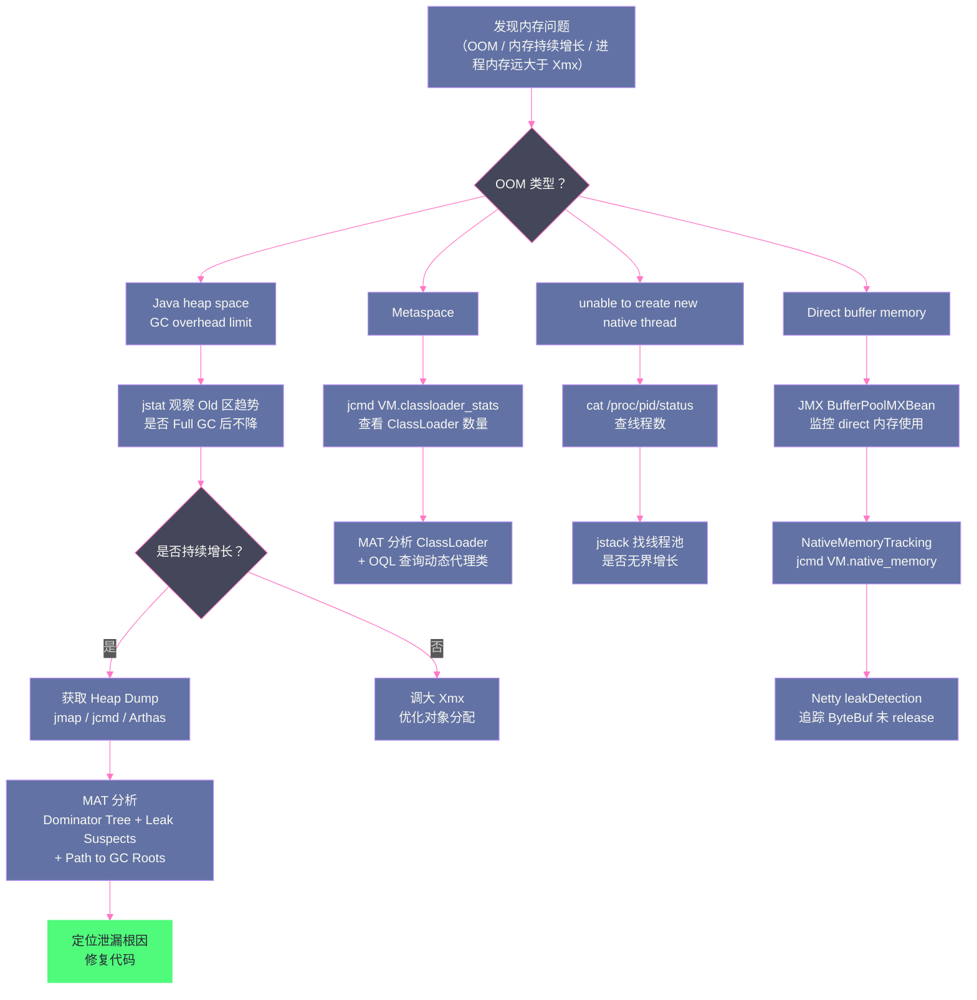

# 13 JVM 内存问题实战——OOM、内存泄漏与堆外内存

**摘要：**

内存问题是 Java 生产环境最常见、最难排查的故障类型之一。`OutOfMemoryError` 只是问题的表象——"Java heap space"、"Metaspace"、"unable to create new native thread"、"Direct buffer memory"、"GC overhead limit exceeded"，每种 OOM 背后是完全不同的根因，对应完全不同的排查路径和修复方案。本文系统梳理七种 OOM 的根因与诊断方法，深入剖析**堆内存泄漏**（最常见，但也最难找到泄漏源）的排查思路（堆转储分析、MAT 工具使用），以及被大量忽视的**堆外内存（Direct Memory）泄漏**——`DirectByteBuffer`、JNI、JVM 本身的堆外内存消耗，以及如何用 `NativeMemoryTracking` 定位堆外内存问题。最后给出一套完整的内存问题诊断工作流，结合 `jmap`、`jstack`、`jstat`、Arthas 等工具的实战用法。

---

## 第 1 章 OOM 的种类与根因分析

Java 的 `OutOfMemoryError` 并不只有一种，不同的 `message` 字段代表完全不同的问题：

### 1.1 Java heap space——堆内存耗尽

**错误信息**：`java.lang.OutOfMemoryError: Java heap space`

**根因**：Java 堆已满，无法再为新对象分配内存。GC 执行后仍无法释放足够空间。

**常见原因**：
- **真实的内存泄漏**：某些对象被长期强引用，无法被 GC 回收（典型：缓存无限增长、ClassLoader 泄漏、静态集合持有对象引用）
- **堆大小配置不足**：应用正常运行需要的堆内存超过 `-Xmx` 配置
- **大对象分配**：一次性分配超大数组或集合（如读取 1GB 文件到 `byte[]`）
- **内存峰值**：高并发场景下并发请求同时创建大量对象，瞬间耗尽堆

**诊断步骤**：
1. 分析 GC 日志：Full GC 后堆使用率是否仍在 95% 以上（典型泄漏特征）
2. 获取堆转储（Heap Dump），用 MAT 分析（详见第 3 章）
3. 观察堆使用趋势：持续增长不回落 = 泄漏；突发增长后能回落 = 内存不足

### 1.2 GC overhead limit exceeded——GC 时间占比过高

**错误信息**：`java.lang.OutOfMemoryError: GC overhead limit exceeded`

**根因**：JVM 检测到 GC 时间占比过高（默认：过去 98% 的时间在做 GC，但每次 GC 只释放了不到 2% 的堆空间），触发此错误以避免应用陷入无限 GC 却毫无进展的死循环。

这通常是堆内存泄漏的早期预警——堆快满了，GC 拼命回收却无能为力。

**参数控制**：
- `-XX:GCTimeLimit=98`（GC 时间占比阈值，默认 98%）
- `-XX:GCHeapFreeLimit=2`（每次 GC 后最少释放比例，默认 2%）
- `-XX:-UseGCOverheadLimit`：禁用此检测（不推荐，会导致应用陷入 GC 死循环）

### 1.3 Metaspace——元空间耗尽

**错误信息**：`java.lang.OutOfMemoryError: Metaspace`（JDK 8+）

**根因**：Metaspace（类元数据存储区）耗尽。

**常见原因**：
- **类加载泄漏**：频繁热部署，旧的 ClassLoader 未被 GC 回收，Metaspace 中的类元数据持续积累
- **动态代理/字节码增强过多**：每次创建代理类（CGLib、ASM 动态生成）都会加载一个新类，如果代理类未被卸载，Metaspace 持续增长（Spring AOP 在某些配置下会产生大量代理类）
- **`-XX:MaxMetaspaceSize` 设置过小**：Metaspace 默认无上限，设置过小会限制正常运行

**诊断**：
```bash
# 查看 Metaspace 使用情况
jstat -gc <pid> 1000
# MC=Metaspace Capacity，MU=Metaspace Used

# 查看已加载类数量
jcmd <pid> GC.class_histogram | head -20

# 查看 ClassLoader 统计
jcmd <pid> VM.classloader_stats
```

### 1.4 unable to create new native thread——无法创建本地线程

**错误信息**：`java.lang.OutOfMemoryError: unable to create new native thread`

**根因**：操作系统无法再创建新线程。注意这与 Java 堆无关！

**触发条件**（任何一个满足即触发）：
- **进程线程数达到系统限制**：`/proc/sys/kernel/threads-max`（系统总线程数上限）或 `/proc/sys/kernel/pid_max`（PID 上限）
- **进程文件描述符数量达到上限**：`ulimit -u`（每个用户的最大进程数）
- **JVM 进程虚拟内存不足**：每个线程的栈（`-Xss`，默认 512KB~1MB）需要消耗虚拟内存，32 位系统虚拟地址空间只有 4GB，大量线程会耗尽

**诊断**：
```bash
# 查看当前进程的线程数
cat /proc/<pid>/status | grep Threads

# 查看系统线程限制
cat /proc/sys/kernel/threads-max

# 临时增加用户进程数限制
ulimit -u 65535
```

**修复方向**：
- 检查是否有线程池无限增长（`newCachedThreadPool` 不设上限）
- 减小每个线程的栈大小（`-Xss256k`），让相同虚拟内存下能支持更多线程
- 增加系统线程数限制（需要运维配合）

### 1.5 Direct buffer memory——直接内存耗尽

**错误信息**：`java.lang.OutOfMemoryError: Direct buffer memory`

**根因**：`DirectByteBuffer` 申请的堆外直接内存（Direct Memory）超过了 `-XX:MaxDirectMemorySize` 限制（默认等于 `-Xmx`）。

NIO 的 `ByteBuffer.allocateDirect()` 分配的内存不在 Java 堆中，而是直接在操作系统的本地内存中。这类内存不受 GC 管辖，但通过 `PhantomReference` + `sun.misc.Cleaner` 与对应的 `DirectByteBuffer` 对象生命周期绑定——当 `DirectByteBuffer` 被 GC 回收时，Cleaner 触发释放直接内存。

**常见原因**：
- **`DirectByteBuffer` 创建速度远快于 GC 回收速度**：频繁创建、短期使用大量 `DirectByteBuffer`，GC 来不及回收对应的 `DirectByteBuffer` 对象，导致直接内存持续增长
- **`MaxDirectMemorySize` 设置过小**：应用合理使用直接内存，但限制设置不够大
- **Netty 的堆外内存池（PooledDirectByteBuf）管理不当**：Netty 自己管理堆外内存池，如果对象未被正确 `release()`，内存泄漏

**诊断**（详见第 4 章）。

### 1.6 StackOverflowError——栈溢出

**错误信息**：`java.lang.StackOverflowError`（严格说不是 OOM，但常被混淆）

**根因**：线程的虚拟机栈深度超过限制（`-Xss`，默认 512KB~1MB）。

**常见原因**：
- **无限递归**：递归方法没有终止条件，或终止条件逻辑错误
- **互相调用的深层递归**：A 调 B，B 调 A，…，深度超过栈大小
- **框架层层嵌套调用**：Spring、Hibernate、CGLIB 的深层代理调用链有时会意外达到栈深度限制

```bash
# 增大栈大小（允许更深的递归）
-Xss4m

# 查看当前线程的栈深度（jstack 中的线程 dump 可以看调用链深度）
jstack <pid> | grep -A 100 "java.lang.StackOverflowError"
```

### 1.7 OOM 类型速查表

| OOM 错误信息 | 受影响区域 | 最常见根因 |
| :--- | :--- | :--- |
| `Java heap space` | Java 堆 | 内存泄漏或堆大小不足 |
| `GC overhead limit exceeded` | Java 堆（间接）| 堆几乎全满，GC 无效 |
| `Metaspace` | 元空间（方法区）| ClassLoader 泄漏，类过多 |
| `unable to create new native thread` | 操作系统线程资源 | 线程数过多，系统限制 |
| `Direct buffer memory` | 堆外直接内存 | `DirectByteBuffer` 堆外内存耗尽 |
| `request size bytes for reason` | Java 堆（大对象）| 分配超大对象失败 |
| `StackOverflowError` | 虚拟机栈 | 无限递归或调用链过深 |

---

## 第 2 章 堆内存泄漏的排查思路

### 2.1 什么是内存泄漏

Java 的内存泄漏与 C/C++ 不同：C++ 的内存泄漏是忘记调用 `free()`，程序员忘了释放内存。Java 没有手动内存管理，GC 自动回收。

**Java 的内存泄漏定义**：**对象不再被业务逻辑使用，但仍然被某个强引用链持有，导致 GC 无法回收**。

换句话说，Java 的内存泄漏是**逻辑上的泄漏**（对象不需要了，但没有被解除引用），而不是技术上的泄漏（GC 机制本身没有问题，只是业务代码没有解除不必要的引用）。

### 2.2 典型的内存泄漏模式

**模式一：静态集合无限增长**

```java
// 典型的静态集合泄漏：
public class EventBus {
    // static 字段生命周期与 JVM 相同，listener 永远不会被回收
    private static final List<EventListener> listeners = new ArrayList<>();

    public static void register(EventListener listener) {
        listeners.add(listener);  // 只加不删！
    }
    // 忘了提供 unregister 方法，或调用方忘记 unregister
}
```

**模式二：ThreadLocal 未清除**

在使用线程池的环境中，线程被复用，如果 `ThreadLocal` 值未被清除：

```java
// 每次请求创建 ThreadLocal，但未在请求结束后 remove()
ThreadLocal<UserContext> userContext = new ThreadLocal<>();
userContext.set(new UserContext(userId));
// 忘了 userContext.remove()！
// 线程池的线程持有 ThreadLocalMap → UserContext 引用
// → UserContext 永远无法被 GC
```

**模式三：缓存无上限**

```java
// 简单的 HashMap 缓存，没有大小限制，没有过期机制
private static final Map<String, byte[]> cache = new HashMap<>();
// 随着时间推移，cache 越来越大，直到 OOM
```

应该使用有界缓存（Guava `CacheBuilder`、Caffeine），或软引用/弱引用缓存。

**模式四：ClassLoader 泄漏**

详见 [[类加载器/10 类加载机制——双亲委派模型与打破它的场景]] 第 6.2 节，Tomcat 热部署场景，旧的 ClassLoader 被全局单例持有引用，导致 Metaspace 中的类元数据无法卸载。

**模式五：监听器/回调未注销**

```java
// Android/Swing/JavaFX 常见模式，但 Java 后端也有类似问题：
// 短命对象注册到长命对象的监听器列表，但忘记在销毁时注销
longLivedObject.addListener(shortLivedObject);
// shortLivedObject 不再使用，但 longLivedObject.listeners 还持有它的引用
```

### 2.3 获取堆转储（Heap Dump）

排查堆内存泄漏，最有效的工具是**堆转储（Heap Dump）**——JVM 将堆中所有对象（包括其引用关系）快照到文件，供离线分析。

**方法一：JVM 参数自动触发**（推荐生产环境配置）

```bash
# OOM 时自动生成堆转储
-XX:+HeapDumpOnOutOfMemoryError
-XX:HeapDumpPath=/data/logs/heapdump/

# 这样 OOM 发生的瞬间，JVM 会保存现场，为事后分析提供最有价值的数据
```

**方法二：jmap 手动触发**（适合运行中的进程）

```bash
# 生成堆转储（live=只包含存活对象，去掉 :live 则包含所有对象）
jmap -dump:live,format=b,file=/tmp/heap.hprof <pid>

# 注意：jmap 会触发一次 Full GC（因为 live 选项），会导致 STW！
# 生产环境谨慎使用，建议在业务低峰期操作
```

**方法三：jcmd 触发**（更现代，推荐）

```bash
jcmd <pid> GC.heap_dump /tmp/heap.hprof
```

**方法四：Arthas**（可在生产环境安全使用）

```bash
# Arthas 的 heapdump 命令，不强制 Full GC
heapdump --live /tmp/heap.hprof
```

---

## 第 3 章 MAT 工具——堆转储分析实战

### 3.1 MAT 的核心概念

**Eclipse Memory Analyzer Tool（MAT）** 是分析堆转储文件最强大的工具，完全免费，可以处理几十 GB 的堆转储文件。

MAT 中两个最重要的概念：

**Shallow Heap（浅堆）**：对象本身占用的内存大小（不含其引用的子对象）。例如，一个 `String` 对象的 Shallow Heap 是固定的（Mark Word + Klass Pointer + `value` 字段引用 + `hash` 字段 = ~32 字节），与字符串的实际内容长度无关。

**Retained Heap（保留堆）**：如果这个对象被 GC 回收，能释放的内存总量（包括它直接或间接引用的、且不会被其他存活对象引用的所有对象的 Shallow Heap 之和）。Retained Heap 才是内存占用的真实大小，是找泄漏的关键指标。

**例子**：一个 `HashMap` 对象（Shallow Heap ~48 字节）内部持有 1000 万个 `String` 条目（每个 ~56 字节），则该 `HashMap` 的 Retained Heap ≈ 1000 万 × 56 字节 ≈ 560MB。

### 3.2 MAT 的使用流程

**第一步：打开堆转储文件**

将 `.hprof` 文件下载到本地，用 MAT 打开。MAT 会自动建立索引（大文件可能需要几分钟），然后显示 Overview 页面。

**第二步：查看 Dominator Tree（支配树）**

支配树列出了"对象及其 Retained Heap"，按 Retained Heap 降序排列：

```
Dominator Tree（示例）：

Class Name              | Shallow Heap | Retained Heap | % Retained
------------------------|-------------|---------------|----------
com.example.CacheManager| 48 B        | 532 MB        | 87.3%
  ↳ HashMap             | 48 B        | 532 MB        |
      ↳ 1000万个条目... |             |               |
```

Retained Heap 最大的对象，往往就是内存泄漏的嫌疑人。

**第三步：查看 Leak Suspects Report（泄漏嫌疑报告）**

MAT 提供自动化的泄漏嫌疑分析（`File → Run Leak Suspects Report`），它会找到 Retained Heap 异常大的对象，并尝试解释为什么它们无法被 GC：

```
Problem Suspect 1:
  One instance of "com.example.CacheManager" 
  loaded by "jdk.internal.loader.ClassLoaders$AppClassLoader @ 0x12345"
  occupies 532,145,200 (87.34%) bytes.
  
  Keywords: com.example.CacheManager, java.util.HashMap
  
  Shortest path from GC Root to com.example.CacheManager:
  ← static field com.example.App.cacheManager
  ← com.example.CacheManager @ 0x12345
```

**第四步：查找引用链**

选中嫌疑对象，右键 → Path to GC Roots（排除弱引用）：

这会展示从 GC Root 到该对象的最短引用路径，精确到"哪个字段、哪个类持有了这个对象"。

**第五步：OQL 查询**

MAT 支持类似 SQL 的 OQL（Object Query Language）进行自定义查询：

```sql
-- 查找所有持有超过 1000 个元素的 HashMap
SELECT h FROM java.util.HashMap h WHERE h.size > 1000

-- 查找特定类的所有实例及其大小
SELECT toString(l), l.@retainedHeapSize FROM java.util.ArrayList l
```

---

## 第 4 章 堆外内存问题——最容易被忽视的领域

### 4.1 为什么堆外内存问题更难排查

堆内存（Java Heap）完全由 JVM 管理，`jmap`、MAT 可以看到所有对象。**堆外内存（Off-Heap Memory）** 则是 JVM 进程消耗的、Java 堆以外的内存，分散在多个区域：

- **直接内存（Direct Memory）**：`ByteBuffer.allocateDirect()` 和 Netty 的 `DirectByteBuf` 分配
- **Metaspace**：类元数据（已在 1.3 节讨论）
- **JIT 代码缓存（Code Cache）**：JIT 编译的机器码
- **JVM 内部结构**：GC 数据结构（卡表、RSet 等）、线程栈
- **JNI 本地代码**：JNI 调用中 C/C++ 代码分配的内存
- **文件映射（mmap）**：`MappedByteBuffer` 对文件的内存映射

堆外内存的问题在于：Java 的监控工具（`jmap`、MAT）只能看到 Java 堆，看不到堆外内存。进程的**实际内存占用（RSS，Resident Set Size）** 可能远大于 `-Xmx` 的设置，但 Java 层面无法解释这个差值。

### 4.2 DirectByteBuffer 的生命周期与泄漏

`ByteBuffer.allocateDirect(size)` 创建一个 `DirectByteBuffer` 对象（在 Java 堆）和一块本地内存（在堆外）。本地内存的释放依赖于：
1. `DirectByteBuffer` Java 对象被 GC 回收
2. `Cleaner`（`PhantomReference` 的子类）触发本地内存释放

**泄漏场景**：`DirectByteBuffer` 对象被 GC 回收的速度，远低于 Direct Memory 分配的速度——虽然业务代码"用完"了 `DirectByteBuffer`（不再持有强引用），但 GC 可能很久才触发 Full GC 来回收 `DirectByteBuffer` 对象，这期间堆外内存持续增长。

```bash
# 监控直接内存使用
# 方法 1：通过 MXBean（程序内监控）
long directUsed = ManagementFactory.getPlatformMXBean(BufferPoolMXBean.class)
    .stream()
    .filter(b -> b.getName().equals("direct"))
    .mapToLong(BufferPoolMXBean::getMemoryUsed)
    .sum();

# 方法 2：JVM 参数打印 GC 时的直接内存信息（JDK 8）
-XX:+PrintGCDetails -XX:+PrintGCDateStamps

# 方法 3：通过 jconsole 或 VisualVM 的"Memory Pool"页面
# 查看 "direct" buffer pool 的使用情况
```

### 4.3 NativeMemoryTracking——全面追踪 JVM 堆外内存

JDK 8u40+ 提供了 **NativeMemoryTracking（NMT）**，可以追踪 JVM 各个内存区域的本地内存使用：

```bash
# 启动参数（summary 级别开销约 5~10%，detail 级别约 10~15%）
-XX:NativeMemoryTracking=summary

# 查看当前内存使用报告
jcmd <pid> VM.native_memory summary

# 输出示例：
Total: reserved=6341MB, committed=4218MB
-                 Java Heap (reserved=4096MB, committed=4096MB)
                            (mmap: reserved=4096MB, committed=4096MB)
-                     Class (reserved=1056MB, committed=16MB)
                            (classes #10234)
-                    Thread (reserved=258MB, committed=258MB)
                            (thread #127)
-                      Code (reserved=248MB, committed=64MB)
                            (mmap: reserved=248MB, committed=64MB)
-                        GC (reserved=456MB, committed=376MB)
-                  Internal (reserved=164MB, committed=160MB)
-                    Symbol (reserved=22MB, committed=22MB)
-    Native Memory Tracking (reserved=5MB, committed=5MB)
```

NMT 可以帮助定位是哪个 JVM 内部区域在消耗堆外内存，是排查"进程内存远大于 `-Xmx`"问题的最重要工具。

```bash
# 对比两个时间点的差异（先建立基线，再对比增长）
jcmd <pid> VM.native_memory baseline
# ... 一段时间后 ...
jcmd <pid> VM.native_memory summary.diff
```

### 4.4 Netty 堆外内存泄漏排查

Netty 自己管理一套堆外内存池（`PooledByteBufAllocator`），性能远高于 JDK 的 `DirectByteBuffer`，但要求**每个 `ByteBuf` 在使用完后必须显式 `release()`**。

Netty 提供了堆外内存泄漏检测机制：

```bash
# 启用 Netty 的资源泄漏检测（生产环境使用 SIMPLE，开发环境使用 PARANOID）
-Dio.netty.leakDetection.level=PARANOID

# 当检测到泄漏时，Netty 会打印：
# LEAK: ByteBuf.release() was not called before it's garbage-collected.
# See http://netty.io/wiki/reference-counted-objects.html for details.
# Recent access records: ...（泄漏的堆栈跟踪）
```

---

## 第 5 章 诊断工具实战速查

### 5.1 jstat——实时 GC 监控

```bash
# 每 1000ms 输出一次 GC 统计，输出 10 次
jstat -gcutil <pid> 1000 10

# 输出示例：
#   S0     S1     E      O      M     CCS    YGC     YGCT    FGC    FGCT     GCT
#  0.00  30.45  85.23  72.16  96.54  94.12    427    3.214    12    6.789    10.003
#
# S0/S1: Survivor 区使用率
# E: Eden 使用率（接近 100% = Minor GC 频繁触发）
# O: Old（老年代）使用率（持续增长 = 内存泄漏）
# M: Metaspace 使用率
# YGC/YGCT: Young GC 次数/总时间
# FGC/FGCT: Full GC 次数/总时间（增长过快是告警信号）

# 关键告警信号：
# 1. O（老年代使用率）持续增长，Full GC 后也不明显下降 → 内存泄漏
# 2. FGC 频繁（每隔几分钟就一次）→ 内存压力大
# 3. FGCT 单次时间过长 → GC 停顿影响服务
```

### 5.2 jmap——堆信息与类实例统计

```bash
# 查看堆信息（各内存区域的使用情况）
jmap -heap <pid>

# 查看类实例统计（按实例数/内存占用排序，快速定位异常类）
jmap -histo:live <pid> | head -30
# 输出：
#  num     #instances         #bytes  class name
# -------------------------------------------
#    1:       1234567       98765432  [B（byte 数组）
#    2:        543210       43456780  java.lang.String
#    3:        234567       18765432  com.example.UserSession
# ↑ UserSession 实例数异常多，可能是泄漏嫌疑
```

### 5.3 jstack——线程栈分析

```bash
# 获取所有线程的栈信息（排查死锁、线程阻塞、CPU 飙高）
jstack <pid> > /tmp/thread_dump.txt

# 分析死锁（jstack 会自动检测并标注）：
# "Found one Java-level deadlock:"
# "Thread-1" waiting to lock "0x..." which is held by "Thread-2"
# "Thread-2" waiting to lock "0x..." which is held by "Thread-1"

# 找 CPU 飙高的线程：
# 1. top -H -p <pid>  找 CPU 高的 TID（十进制）
# 2. 转为十六进制：printf "%x\n" <TID>
# 3. 在 jstack 输出中找对应的 nid=0x<十六进制TID>
```

### 5.4 Arthas——生产环境的瑞士军刀

**Arthas** 是阿里开源的 Java 诊断工具，可以在不重启应用的情况下进行实时诊断：

```bash
# 启动 Arthas（attach 到目标 JVM 进程）
java -jar arthas-boot.jar <pid>

# 常用命令：

# 查看堆内存使用
memory

# 实时查看 GC 情况（类似 jstat）
gc

# 反编译运行中的类（查看是否是最新部署的版本）
jad com.example.UserService

# 动态追踪方法调用（排查方法是否被调用、参数是什么）
trace com.example.UserService * '{params}'

# 观察方法执行耗时和返回值（性能分析）
watch com.example.UserService getUserById '{params, returnObj, throwExp}' -x 3

# 热更新方法（紧急修复，不重启）
# 先 jad 反编译，修改代码，javac 编译，redefine 加载
redefine /tmp/UserService.class
```

---

## 第 6 章 完整的内存问题诊断工作流



---

## 第 7 章 总结

内存问题的排查需要系统性的方法，而不是盲目的参数调整：

**七种 OOM 各有根因**：`Java heap space` 是最常见的，需要区分真正的泄漏（持续增长不下降）和内存不足（增长有上限）。每种 OOM 的诊断路径完全不同，先确认类型再行动。

**堆内存泄漏的根本**：对象被不必要的强引用持有。最常见的模式：静态集合无限增长、ThreadLocal 未清除、缓存无边界、ClassLoader 泄漏、监听器未注销。

**MAT 是堆转储分析的核心工具**：关注 Retained Heap（而非 Shallow Heap），Dominator Tree 找最大的保留者，Path to GC Roots 找引用链，Leak Suspects 自动分析。

**堆外内存问题更隐蔽**：进程内存 > `-Xmx` 的差值是堆外内存，用 NMT（`-XX:NativeMemoryTracking=summary`）分区域追踪；Direct Memory 监控用 `BufferPoolMXBean`；Netty 堆外内存泄漏用 `leakDetection`。

**工具矩阵**：`jstat` 实时监控 GC 趋势 → `jmap`/`jcmd` 获取堆快照 → MAT 离线分析 → Arthas 在线诊断 → NMT 堆外内存全景。

下一篇 [[JVM实战/14 GC 调优实战——日志分析、参数调优与选型指南]] 将聚焦 GC 性能调优，从 GC 日志的解读方法，到各个收集器（G1、ZGC、Shenandoah）的调优参数，到基于延迟/吞吐量不同目标的 GC 选型决策，给出一套完整的 GC 调优方法论。

---

## 参考文献

1. 周志明, 《深入理解 Java 虚拟机（第三版）》, 第 2 章：内存溢出实战
2. Eclipse Memory Analyzer Tool（MAT）官方文档, help.eclipse.org/latest/index.jsp
3. 美团技术博客, "JVM 内存溢出问题排查手册", 2021
4. Nitsan Wakart, "JVM Anatomy Quarks: Native Memory Tracking", shipilev.net
5. 阿里开源, "Arthas User Guide", arthas.aliyun.com/doc
6. Netty Project, "Reference Counted Objects", netty.io/wiki/reference-counted-objects.html
7. JDK Tools Reference, "jmap", "jstack", "jstat", "jcmd", docs.oracle.com

---

> [!note] 思考题
> 1. `java.lang.OutOfMemoryError: Java heap space` 和 `java.lang.OutOfMemoryError: GC overhead limit exceeded` 都表示堆内存不足，但含义不同。后者意味着 GC 花费了 98% 以上的时间但只回收了不到 2% 的堆空间。在什么场景下你会看到第一种而非第二种？第二种错误是否意味着一定存在内存泄漏？
> 2. 堆外内存（Direct Memory）通过 `ByteBuffer.allocateDirect()` 分配，不受 GC 管理。NIO 框架（如 Netty）大量使用堆外内存来减少数据拷贝。但堆外内存泄漏比堆内存泄漏更难排查——`jmap` 无法显示堆外分配。你有哪些工具和方法来排查堆外内存泄漏？`-XX:MaxDirectMemorySize` 的默认值是什么？
> 3. 使用 MAT（Memory Analyzer Tool）分析堆转储（Heap Dump）时，需要区分 Shallow Size（对象自身大小）和 Retained Size（对象被回收后能释放的总大小）。一个 `HashMap` 的 Shallow Size 只有几十字节，但 Retained Size 可能是 GB 级。在什么情况下 Shallow Size 大的对象反而不是泄漏的根因？
