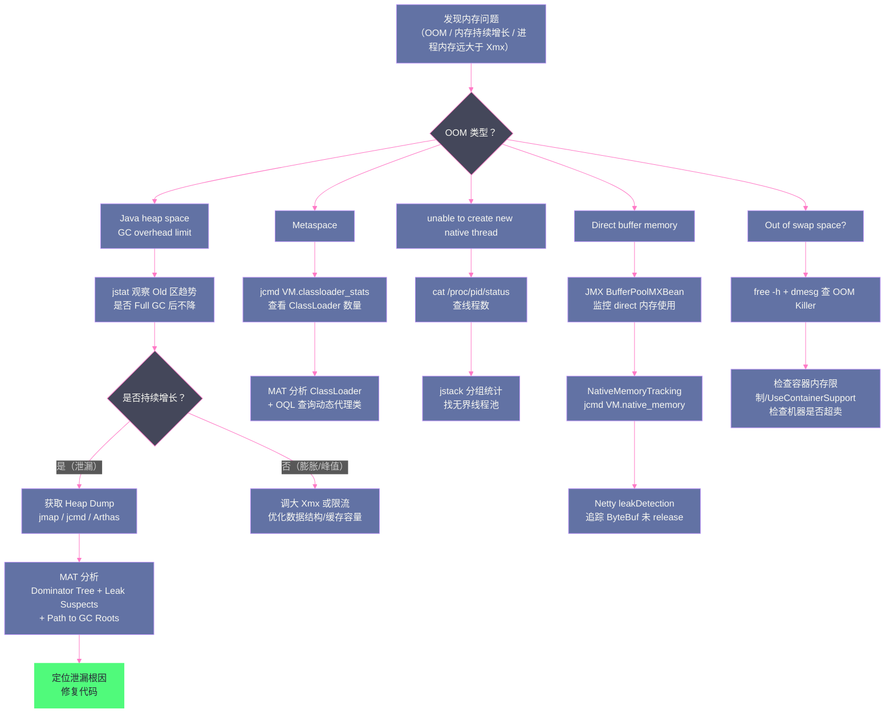

# 13 JVM 内存问题实战——OOM、内存泄漏与堆外内存

**摘要：**

内存问题是 Java 生产环境最常见、最难排查的故障类型之一。`OutOfMemoryError` 只是问题的表象——"Java heap space"、"Metaspace"、"unable to create new native thread"、"Direct buffer memory"、"GC overhead limit exceeded"、"Out of swap space"，每种 OOM 背后是完全不同的根因，对应完全不同的排查路径和修复方案。本文系统梳理八种内存相关异常的根因与诊断方法，深入剖析**堆内存泄漏**（最常见，但也最难找到泄漏源）的排查思路（堆转储分析、MAT 工具使用、内存泄漏与内存膨胀的区分方法），以及被大量忽视的**堆外内存（Direct Memory）泄漏**——`DirectByteBuffer`、JNI、JVM 本身的堆外内存消耗，以及如何用 `NativeMemoryTracking`（NMT）和 async-profiler 定位堆外内存问题。文中穿插两个完整的生产事故复盘（ThreadLocal 引发的堆内存泄漏、Netty ByteBuf 未释放引发的堆外内存泄漏），还原从告警触发到根因定位再到修复验证的全过程。最后给出一套完整的内存问题诊断工作流，结合 `jmap`、`jstack`、`jstat`、`jcmd`、Arthas、async-profiler 等工具的实战用法，目标是让读者拿到一份"看到现象就知道该敲哪条命令"的排查手册。

---

## 第 1 章 OOM 的种类与根因分析

Java 的 `OutOfMemoryError` 并不只有一种，不同的 `message` 字段代表完全不同的问题。这一点必须先明确：**排查内存问题的第一步永远是精确读出 `OutOfMemoryError` 后面那句话，而不是拍脑袋加大 `-Xmx`**。生产环境里最常见的返工场景，就是运维在没搞清楚 OOM 类型的情况下直接把堆调大了两倍，结果几天后问题原样重现——因为堆内存泄漏根本不是"堆不够大"的问题，调大堆只是把故障爆发的时间往后推了几天。

> [!info] 核心概念：OOM 是"资源耗尽事件"，不是"堆溢出事件"
> `OutOfMemoryError` 这个名字带有误导性——很多工程师第一反应是"堆满了"，但实际上它覆盖了 JVM 管理的所有内存资源类型：堆、Metaspace、直接内存、操作系统线程资源，甚至操作系统级别的虚拟内存。JVM 规范里对它的定义是"JVM 无法分配一个对象，因为没有更多内存可用，并且垃圾收集器已经无法提供更多内存"。这句定义里"垃圾收集器已经无法提供更多内存"是关键——它说明大多数 OOM 是在**GC 已经尽力之后**才抛出的，因此排查思路要从"GC 为什么没能回收"入手，而不是简单地怪 GC 不给力。

### 1.1 Java heap space——堆内存耗尽

**错误信息**：`java.lang.OutOfMemoryError: Java heap space`

**根因**：Java 堆已满，无法再为新对象分配内存。GC 执行后仍无法释放足够空间。这里的堆内存布局可参考 [[运行时数据区/02 运行时数据区——堆、栈、方法区的内存布局]]，对象分配路径和晋升规则可参考 [[对象生命周期与GC/05 垃圾回收算法——标记清除、复制、标记整理与分代假说]]。

**常见原因**：
- **真实的内存泄漏**：某些对象被长期强引用，无法被 GC 回收（典型：缓存无限增长、ClassLoader 泄漏、静态集合持有对象引用）
- **堆大小配置不足**：应用正常运行需要的堆内存超过 `-Xmx` 配置
- **大对象分配**：一次性分配超大数组或集合（如读取 1GB 文件到 `byte[]`）
- **内存峰值**：高并发场景下并发请求同时创建大量对象，瞬间耗尽堆

**为什么会发生（触发条件的本质）**：JVM 每次分配对象前都会先尝试在 Eden 区分配，Eden 不够时触发 Minor GC；Minor GC 后仍不够，对象直接在老年代分配（大对象、晋升对象）；老年代分配失败时触发 Full GC；**Full GC 结束后老年代仍无法容纳新对象，才会抛出 `Java heap space`**。这意味着抛出这个错误之前，JVM 已经做了一次代价最高的 STW（Stop-The-World）Full GC——生产环境看到这个错误时，业务早已在 Full GC 停顿中经历了一次明显的延迟毛刺，故障往往是"先卡顿几秒，再报 OOM"，而不是"瞬间报 OOM"。

**完整诊断流程**（现象 → 根因 → 工具定位 → 修复）：

第一步，先看 GC 日志判断是"斜率型增长"还是"脉冲型增长"。开启 GC 日志（JDK 9+ 用统一日志框架）：

```bash
# JDK 9+
-Xlog:gc*:file=/data/logs/gc.log:time,uptime,level,tags:filecount=10,filesize=100m

# JDK 8
-XX:+PrintGCDetails -XX:+PrintGCDateStamps -Xloggc:/data/logs/gc.log
```

关注 Full GC 之后老年代（Old）的使用率。如果连续多次 Full GC 之后老年代占用率始终在 90% 以上且不下降，这是**内存泄漏**的典型特征；如果 Full GC 后老年代能降到 30% 以下，只是某次业务高峰把堆打满了一下，这属于**内存不足或瞬时峰值**，加大 `-Xmx` 或做限流才是对症的方案。

第二步，用 `jstat` 做实时观察，比翻日志更直观：

```bash
jstat -gcutil <pid> 2000 30
#   S0     S1     E      O      M     CCS    YGC     YGCT    FGC    FGCT     GCT
#  0.00  67.32  91.05  96.88  95.10  92.30    812    5.442     28   14.220   19.662
```

如果观察 30 组数据（每 2 秒一次，持续 1 分钟），O 列（老年代使用率）持续贴着 95%+，且每次 FGC 后几乎不降，基本可以确认是泄漏，进入第三步。

第三步，获取堆转储并用 MAT 分析（详见第 3 章）。生产环境推荐直接配置：

```bash
-XX:+HeapDumpOnOutOfMemoryError
-XX:HeapDumpPath=/data/logs/heapdump/
-XX:+ExitOnOutOfMemoryError    # 建议搭配：OOM 后直接退出进程，让编排系统（K8s/Supervisor）重启实例，避免"半死不活"状态持续占用资源
```

第四步，如果还没到 OOM 但已经怀疑存在泄漏趋势，可以用 async-profiler 做**分配采样（Allocation Profiling）**，不需要等 OOM 发生就能定位到具体是哪行代码在疯狂分配对象：

```bash
# 采集 60 秒内的对象分配火焰图，采样间隔按分配字节数（而不是时间）触发，更精确捕捉大对象分配
./profiler.sh -e alloc -d 60 -f /tmp/alloc.html <pid>
```

打开生成的 HTML 火焰图，火焰图中最宽的那一层通常直接对应泄漏源头的分配调用栈——这比等到堆转储再去反查调用链效率高得多，是生产环境"发现内存增长趋势但还未 OOM"阶段的首选手段。

> [!warning] 生产避坑：不要只看单次 jmap -heap 的快照就下结论
> `jmap -heap` 只是某一时刻的快照，老年代占用 80% 可能是刚发生过 Full GC 之后的正常水位，也可能是马上要 OOM 的前兆。必须结合至少 3~5 个 Full GC 周期的**趋势**才能判断，单点数据没有诊断价值。这是新手最容易踩的坑——看到一次高使用率就慌张地重启服务，掩盖了真正的问题。

### 1.2 GC overhead limit exceeded——GC 时间占比过高

**错误信息**：`java.lang.OutOfMemoryError: GC overhead limit exceeded`

**根因**：JVM 检测到 GC 时间占比过高（默认：过去 98% 的时间在做 GC，但每次 GC 只释放了不到 2% 的堆空间），触发此错误以避免应用陷入无限 GC 却毫无进展的死循环。

这通常是堆内存泄漏的早期预警——堆快满了，GC 拼命回收却无能为力。与 1.1 节的 `Java heap space` 相比，这个错误说明 JVM 甚至没有等到堆彻底装不下新对象，而是提前判断出"继续 GC 下去性价比太低，不如直接报错让上层感知"。从工程角度看，这其实是 JVM 给你的一次**善意提醒**：它不想让 CPU 100% 消耗在无效的 GC 上，把整个应用拖入假死状态。

**参数控制**：
- `-XX:GCTimeLimit=98`（GC 时间占比阈值，默认 98%）
- `-XX:GCHeapFreeLimit=2`（每次 GC 后最少释放比例，默认 2%）
- `-XX:-UseGCOverheadLimit`：禁用此检测（不推荐，会导致应用陷入 GC 死循环）

**如何用工具区分它和普通的堆内存不足**：观察 GC 日志中连续 Full GC 之间的时间间隔。正常情况下，即便堆压力大，Full GC 之间也应该有秒级到分钟级的间隔；如果发现 Full GC **背靠背连续触发**（前一次 Full GC 结束几十毫秒后下一次又开始），CPU 使用率同时飙到接近 100%（`top -H -p <pid>` 能看到大量 GC 线程占满 CPU），这是"GC overhead limit exceeded"即将触发的典型信号。这种场景下再去看 `jstack` 往往会看到大量业务线程处于 `RUNNABLE` 但实际卡在 safepoint 等待（可参考 [[对象生命周期与GC/04 垃圾回收基础——可达性分析、安全点与安全区域]] 中安全点的概念），表现为接口响应时间整体劣化但没有具体的异常堆栈——这也是它比 1.1 节 OOM 更难被业务方第一时间察觉的原因，业务感知到的是"全站变慢"而不是"报错"。

### 1.3 Metaspace——元空间耗尽

**错误信息**：`java.lang.OutOfMemoryError: Metaspace`（JDK 8+）

**根因**：Metaspace（类元数据存储区）耗尽。方法区的历史演进和 Metaspace 取代永久代的原因可参考 [[运行时数据区/02 运行时数据区——堆、栈、方法区的内存布局]] 第 2 章。

**常见原因**：
- **类加载泄漏**：频繁热部署，旧的 ClassLoader 未被 GC 回收，Metaspace 中的类元数据持续积累
- **动态代理/字节码增强过多**：每次创建代理类（CGLib、ASM 动态生成）都会加载一个新类，如果代理类未被卸载，Metaspace 持续增长（Spring AOP 在某些配置下会产生大量代理类）
- **`-XX:MaxMetaspaceSize` 设置过小**：Metaspace 默认无上限，设置过小会限制正常运行

**触发条件的深层机制**：一个类被卸载（unload）的前提是它的 `ClassLoader` 对象已经不可达。这意味着即便类本身的实例都已经被回收，只要加载它的 `ClassLoader` 还被任何一处强引用持有（哪怕只有一处），这个 `ClassLoader` 加载的**所有类**的元数据都无法从 Metaspace 释放——这是 Metaspace 泄漏和堆内存泄漏最大的区别：堆内存泄漏是"一个对象没被回收"，Metaspace 泄漏往往是"一整批类因为一个 ClassLoader 引用没被回收"，泄漏的量级是成批的，增长曲线通常是阶梯式（每次热部署跳一个台阶），而不是堆泄漏那种平滑上升。

**诊断**：
```bash
# 查看 Metaspace 使用情况
jstat -gc <pid> 1000
# MC=Metaspace Capacity，MU=Metaspace Used

# 查看已加载类数量
jcmd <pid> GC.class_histogram | head -20

# 查看 ClassLoader 统计（JDK 8u60+）
jcmd <pid> VM.classloader_stats

# 输出示例，重点看 ClassLoader 数量是否随时间持续增长：
# ClassLoader         Parent               CLD*               Classes   ChunkSz   BlockSz  Type
# 0x00007f2a3c001000  0x0000000000000000   0x00007f2a3c123400        1     4096      256    "sun.misc.Launcher$AppClassLoader"
# 0x00007f2a4d005800  0x00007f2a3c001000   0x00007f2a4d234500     1287  1048576   876543    "org.apache.catalina.loader.WebappClassLoader"
```

如果反复热部署后发现有多个 `WebappClassLoader` 实例同时存在（正常情况应该只有一个当前活跃的），说明旧的 ClassLoader 没有被卸载，这就是典型的 ClassLoader 泄漏，后续在 MAT 里用 OQL 查询 `WebappClassLoader` 的实例数和 GC Root 引用链即可定位到底是谁在持有旧 ClassLoader（常见元凶：`ThreadLocal`、JDBC 驱动的静态注册表、日志框架的 `Appender` 缓存、`java.beans.Introspector` 的缓存）。

**边界与反例**：不要把"Metaspace 缓慢增长到稳定水位后不再增长"误判为泄漏。应用刚启动时大量类被懒加载（Spring 容器初始化、动态代理首次生成），Metaspace 在启动后的前几分钟到几十分钟内持续增长是完全正常的现象；只有当稳定运行很长时间之后（比如已经过了所有懒加载类都应该加载完的阶段）Metaspace 仍然持续爬升，才需要按泄漏路径排查。

### 1.4 unable to create new native thread——无法创建本地线程

**错误信息**：`java.lang.OutOfMemoryError: unable to create new native thread`

**根因**：操作系统无法再创建新线程。注意这与 Java 堆无关！这是最容易被误判为"堆问题"的一种 OOM——很多工程师看到 `OutOfMemoryError` 就本能地去 dump 堆，结果发现堆使用率很低，一头雾水。

**触发条件**（任何一个满足即触发）：
- **进程线程数达到系统限制**：`/proc/sys/kernel/threads-max`（系统总线程数上限）或 `/proc/sys/kernel/pid_max`（PID 上限）
- **进程文件描述符数量达到上限**：`ulimit -u`（每个用户的最大进程数）
- **JVM 进程虚拟内存不足**：每个线程的栈（`-Xss`，默认 512KB~1MB）需要消耗虚拟内存，32 位系统虚拟地址空间只有 4GB，大量线程会耗尽；在容器化环境（cgroup 限制内存）中，即便物理内存充足，容器的内存 cgroup 限制也可能因为线程栈占用的虚拟内存/常驻内存超限而触发

**诊断**：
```bash
# 查看当前进程的线程数
cat /proc/<pid>/status | grep Threads

# 查看系统线程限制
cat /proc/sys/kernel/threads-max

# 查看当前用户已用/最大进程（线程）数
ulimit -u

# 更直观：统计当前 JVM 进程的线程数，和 jstack 输出的线程数对比验证
ls /proc/<pid>/task | wc -l

# 临时增加用户进程数限制
ulimit -u 65535
```

**排查线程数暴涨的根因**，用 `jstack` 抓取全部线程栈，按线程名前缀分组统计数量：

```bash
jstack <pid> | grep '^"' | sed -E 's/"([^"-]+).*/\1/' | sort | uniq -c | sort -rn | head -20
# 输出示例：
#   4821 pool-1-thread-
#     45 http-nio-8080-exec-
#     32 Catalina-utility-
# ↑ pool-1-thread- 有 4821 个，明显是某个线程池无界增长
```

看到某一类线程名的数量远超预期（比如业务线程池配置的最大线程数是 50，jstack 却统计出几千个 `pool-1-thread-`），基本可以断定是**每次请求都 `new Thread()` 或者用了 `Executors.newCachedThreadPool()`（无界线程池，最大线程数是 `Integer.MAX_VALUE`）导致的线程堆积**，进一步用 `jstack` 看这些线程的状态——如果大量线程停在 `WAITING (on object monitor)` 或某个下游调用的 `TIMED_WAITING`，说明是下游变慢导致线程池里的线程堆积（线程创建速度远快于线程释放速度），本质上和内存泄漏的"生产速度大于消费速度"是同一类问题，只是资源换成了线程而不是对象。

**修复方向**：
- 检查是否有线程池无限增长（`newCachedThreadPool` 不设上限），改用有界队列 + 固定核心线程数的 `ThreadPoolExecutor`，并配置合理的拒绝策略
- 减小每个线程的栈大小（`-Xss256k`），让相同虚拟内存下能支持更多线程（这只是缓解，不解决根因）
- 增加系统线程数限制（需要运维配合），但同样只是缓解手段
- 治本方案永远是找到线程堆积的源头——通常是下游依赖（数据库连接、RPC 调用）响应变慢导致线程池排队，需要结合超时控制和熔断机制解决

### 1.5 Direct buffer memory——直接内存耗尽

**错误信息**：`java.lang.OutOfMemoryError: Direct buffer memory`

**根因**：`DirectByteBuffer` 申请的堆外直接内存（Direct Memory）超过了 `-XX:MaxDirectMemorySize` 限制（默认等于 `-Xmx`）。

NIO 的 `ByteBuffer.allocateDirect()` 分配的内存不在 Java 堆中，而是直接在操作系统的本地内存中。这类内存不受 GC 管辖，但通过 `PhantomReference` + `sun.misc.Cleaner`（JDK 9+ 为 `jdk.internal.ref.Cleaner` / `java.lang.ref.Cleaner`）与对应的 `DirectByteBuffer` 对象生命周期绑定——当 `DirectByteBuffer` 被 GC 回收时，Cleaner 触发释放直接内存。

**常见原因**：
- **`DirectByteBuffer` 创建速度远快于 GC 回收速度**：频繁创建、短期使用大量 `DirectByteBuffer`，GC 来不及回收对应的 `DirectByteBuffer` 对象，导致直接内存持续增长
- **`MaxDirectMemorySize` 设置过小**：应用合理使用直接内存，但限制设置不够大
- **Netty 的堆外内存池（PooledDirectByteBuf）管理不当**：Netty 自己管理堆外内存池，如果对象未被正确 `release()`，内存泄漏

**诊断**（详见第 4 章）。

### 1.6 StackOverflowError——栈溢出

**错误信息**：`java.lang.StackOverflowError`（严格说不是 OOM，但常被混淆）

**根因**：线程的虚拟机栈深度超过限制（`-Xss`，默认 512KB~1MB）。虚拟机栈的帧结构和局部变量表布局参考 [[运行时数据区/02 运行时数据区——堆、栈、方法区的内存布局]] 第 3 章。

**常见原因**：
- **无限递归**：递归方法没有终止条件，或终止条件逻辑错误
- **互相调用的深层递归**：A 调 B，B 调 A，…，深度超过栈大小
- **框架层层嵌套调用**：Spring、Hibernate、CGLIB 的深层代理调用链有时会意外达到栈深度限制

```bash
# 增大栈大小（允许更深的递归）
-Xss4m

# 查看当前线程的栈深度（jstack 中的线程 dump 可以看调用链深度）
jstack <pid> | grep -A 100 "java.lang.StackOverflowError"
```

**边界与反例**：栈溢出偶尔会被误判为"死循环导致的 CPU 100%"，两者现象类似（CPU 都会飙高，因为栈帧不断入栈出栈本身就有开销），区分方法是看 `jstack` 输出——`StackOverflowError` 场景下能看到同一组方法在调用栈中反复出现且深度异常（几千层），而普通死循环的调用栈通常很浅（可能就在一个 `while` 循环体内打转），栈深度是关键区分特征。

### 1.7 Out of swap space?——操作系统内存耗尽

**错误信息**：`java.lang.OutOfMemoryError: request <N> bytes for <reason>. Out of swap space?`

**根因**：这是最容易被忽视、也最容易被误判为"Java 层问题"的一种 OOM——它其实是操作系统层面的内存分配失败。当 JVM 向操作系统申请一块本地内存（`malloc`/`mmap`）用于内部结构（比如扩展 Metaspace、分配线程栈、GC 的内部数据结构）时，如果操作系统连虚拟内存（物理内存 + Swap）都无法满足这次分配请求，操作系统的内存分配调用会失败，JVM 捕获到这个失败后抛出这个 OOM，并在错误信息里带上具体是申请多少字节、为了什么目的（`<reason>` 通常是 `"C heap"`、`"Metaspace"` 之类）。

**常见触发场景**：
- **容器内存限制过紧，且没有正确识别 cgroup 限制**：老版本 JDK（8u131 之前）不识别 cgroup 内存限制，会按物理机总内存计算堆大小，导致容器内实际可用内存远小于 JVM 认为的可用内存，任何堆外内存分配都可能触发这个错误。这是容器化环境中一类经典的"水土不服"故障，务必确认使用 `-XX:+UseContainerSupport`（JDK 10+ 默认开启，JDK 8u191+ 也支持）
- **同一台机器上多个 JVM 进程叠加内存占用超过物理内存 + Swap 总量**：常见于混部环境，业务方各自看自己的 JVM 参数都合理，但机器层面总内存已经超卖
- **操作系统 Swap 已关闭（生产环境常见做法）且物理内存耗尽**：没有 Swap 兜底，内存耗尽立刻触发失败而不是靠 Swap 硬撑

**诊断**：
```bash
# 查看系统整体内存和 Swap 使用
free -h

# 查看该进程的实际内存占用（RSS 是关键指标，注意区分 RSS 和 VSZ）
ps -o pid,vsz,rss,comm -p <pid>

# 查看是否触发过 OOM Killer（内核日志，比 JVM 自身报错更早发现问题信号）
dmesg | grep -i "out of memory\|oom-killer"
cat /var/log/messages | grep -i oom
```

> [!warning] 生产避坑：区分 JVM 抛出的 OOM 和内核 OOM Killer 杀进程是两件不同的事
> `java.lang.OutOfMemoryError` 是 JVM 主动检测到分配失败后抛出的**可捕获异常**，进程还活着，能记录日志、能触发堆转储。而 Linux 内核的 OOM Killer 是在系统整体内存压力过大时**直接把进程杀掉**（`SIGKILL`），JVM 连反应的机会都没有，日志里什么都不会留下，只能在 `dmesg` 或 `/var/log/messages` 里看到内核打的 `Killed process <pid>` 记录。如果应用"莫名其妙消失"，进程日志没有任何 OOM 相关记录，第一时间应该去查 `dmesg`，而不是继续揪着 JVM 日志找答案。

### 1.8 OOM 类型速查表

| OOM 错误信息 | 受影响区域 | 最常见根因 | 首选定位工具 |
| :--- | :--- | :--- | :--- |
| `Java heap space` | Java 堆 | 内存泄漏或堆大小不足 | jstat 趋势 + MAT 堆转储 |
| `GC overhead limit exceeded` | Java 堆（间接）| 堆几乎全满，GC 无效 | jstat + GC 日志间隔分析 |
| `Metaspace` | 元空间（方法区）| ClassLoader 泄漏，类过多 | jcmd VM.classloader_stats + MAT |
| `unable to create new native thread` | 操作系统线程资源 | 线程数过多，系统限制 | jstack 分组统计 + ulimit |
| `Direct buffer memory` | 堆外直接内存 | `DirectByteBuffer`/Netty 堆外内存耗尽 | NMT + BufferPoolMXBean |
| `request size bytes for reason`（不带 Out of swap） | Java 堆（大对象）| 分配超大对象失败 | 检查分配大小 + jmap -histo |
| `Out of swap space?` | 操作系统整体内存 | 容器限制/Swap 耗尽/机器超卖 | free -h + dmesg |
| `StackOverflowError` | 虚拟机栈 | 无限递归或调用链过深 | jstack 栈深度分析 |

---

## 第 2 章 堆内存泄漏的排查思路

### 2.1 什么是内存泄漏

Java 的内存泄漏与 C/C++ 不同：C++ 的内存泄漏是忘记调用 `free()`，程序员忘了释放内存。Java 没有手动内存管理，GC 自动回收。

**Java 的内存泄漏定义**：**对象不再被业务逻辑使用，但仍然被某个强引用链持有，导致 GC 无法回收**。

换句话说，Java 的内存泄漏是**逻辑上的泄漏**（对象不需要了，但没有被解除引用），而不是技术上的泄漏（GC 机制本身没有问题，只是业务代码没有解除不必要的引用）。理解这一点非常关键——排查 Java 内存泄漏，本质上是在做一件事：**顺着引用链，找到那个"本该断开却没断开"的强引用**，而不是去怀疑 GC 算法本身出了问题（这在生产实践里几乎不会发生，成熟的 GC 实现经过了海量场景的验证）。

### 2.2 内存泄漏与内存膨胀的区分

这是排查内存问题时一个容易被混淆、但对后续处理方案影响巨大的判断——两者的现象都是"内存持续增长"，但根因和修复方式完全不同。

**内存泄漏（Memory Leak）**：无用对象因为强引用没有被解除，永久占用内存，理论上给无限的时间和无限的堆，内存占用会无限增长直到 OOM。特征是：**增长曲线不受流量影响，即便业务量下降或完全没有流量（比如夜间低峰期），内存占用依然只涨不跌**。

**内存膨胀（Memory Bloat）**：应用设计上就需要比预期更多的内存才能正常工作——常见于用了低效的数据结构（比如用 `HashMap<Long, Long>` 而不是原生数组存储大量数值，自动装箱带来数倍的内存放大）、缓存设计的容量上限设置得过大、批处理任务一次性加载过多数据到内存。特征是：**增长曲线与业务量/数据规模强相关，业务量下降时内存占用会随之下降（或至少不再上涨），只是"需要的内存比预期多"，而不是"占用了不该占用的内存"**。

区分方法很直接：**观察内存曲线是否与业务流量曲线的形状相关**。把 APM 系统（比如 Prometheus + Grafana）里的堆内存曲线和 QPS 曲线叠加在一张图上看——如果内存曲线在流量低谷期依然平的往上走（不随流量回落而回落），是泄漏；如果内存曲线跟着流量曲线同涨同跌，只是整体水位比预期偏高，是膨胀，应该去看数据结构设计和缓存容量配置，而不是去找"谁忘了释放引用"。

> [!note] 设计哲学：泄漏是关闭的阀门，膨胀是过粗的水管
> 内存泄漏像是一个应该关闭却没关闭的阀门，水一直在流入蓄水池，无论你今天用不用水，池子都在涨；内存膨胀像是水管本身选得比实际需求粗了几号，用水量大的时候流量确实大，用水量小的时候也会跟着小，只是这根水管的造价（内存占用）比精细设计的水管高。修复泄漏是"找到阀门并关掉"，修复膨胀是"换一根更合适口径的水管"（优化数据结构、调整缓存策略）。

### 2.3 典型的内存泄漏模式

**模式一：静态集合无限增长**

```java
// 典型的静态集合泄漏：
public class EventBus {
    // static 字段生命周期与 JVM 相同，listener 永远不会被回收
    private static final List<EventListener> listeners = new ArrayList<>();

    public static void register(EventListener listener) {
        listeners.add(listener);  // 只加不删！
    }
    // 忘了提供 unregister 方法，或调用方忘记 unregister
}
```

**模式二：ThreadLocal 未清除**

在使用线程池的环境中，线程被复用，如果 `ThreadLocal` 值未被清除：

```java
// 每次请求创建 ThreadLocal，但未在请求结束后 remove()
ThreadLocal<UserContext> userContext = new ThreadLocal<>();
userContext.set(new UserContext(userId));
// 忘了 userContext.remove()！
// 线程池的线程持有 ThreadLocalMap → UserContext 引用
// → UserContext 永远无法被 GC
```

`ThreadLocal` 泄漏的机制值得展开说一下，因为它是生产环境出现频率最高的泄漏模式之一。每个 `Thread` 对象内部持有一个 `ThreadLocalMap`，`ThreadLocalMap` 的 `Entry` 继承自 `WeakReference<ThreadLocal<?>>`——注意，**弱引用的是 `ThreadLocal` 这个 key 本身，而不是它存储的 value**。当 `ThreadLocal` 对象本身被回收后，`Entry` 的 key 变成 `null`，但 value（比如上面例子中的 `UserContext`）依然被 `Entry` 强引用，只有等到下一次这个线程访问 `ThreadLocalMap`（`get`/`set`/`remove` 触发的 `expungeStaleEntry` 清理逻辑）时，key 为 `null` 的过期 Entry 才会被清理。在线程池场景下，线程是长期存活、反复复用的，如果业务代码只 `set` 不 `remove`，且线程后续也没有再触碰同一个 `ThreadLocal`，这些过期 Entry 会一直堆积在 `ThreadLocalMap` 里，随着线程池处理的请求越多，泄漏的 value 对象也越多。

### 2.4 生产事故复盘：线程池 ThreadLocal 泄漏导致的堆内存溢出

某次生产环境案例中，一个订单查询服务在大促前的压测中，堆内存使用率随时间持续爬升，最终触发 Full GC 后依然无法回落，几小时内进程 OOM 重启。以下是完整的排查时间线，按"现象 → 告警 → 排查 → 定位 → 修复 → 复盘"还原。

**现象与告警**：Grafana 监控面板上，该服务的 JVM 老年代使用率曲线呈现明显的锯齿状爬升——每次 Full GC 都能回收一部分内存，但回收后的谷值一次比一次高，整体趋势线性上升。触发了预设的"老年代使用率连续 10 分钟超过 85%"告警。此时接口响应时间还没有明显恶化，属于早期预警阶段介入，而不是等到 OOM 崩溃后被动响应。

**初步排查**：登录服务器后先用 `jstat -gcutil <pid> 2000 10` 确认告警属实，Old 列稳定在 88% 左右且 FGC 计数增长很快。接着直接上 `jmap -histo:live <pid> | head -20` 看类实例分布：

```
 num     #instances         #bytes  class name
----------------------------------------------
   1:       892341       85664736  com.example.order.UserContext
   2:       892341       57109824  java.lang.ThreadLocal$ThreadLocalMap$Entry
   3:        45201       21536480  [Ljava.lang.ThreadLocal$ThreadLocalMap$Entry;
```

`UserContext` 的实例数达到 89 万个，且和 `ThreadLocalMap$Entry` 的实例数完全一致，这个数字对比线程池的配置（核心线程数 200）明显不合理——如果 `ThreadLocal` 被正确清理，同一时刻存活的 `UserContext` 实例数应该接近于"正在处理中的请求数"，不应该超过几百，而实际数字是 89 万，说明每次请求处理完之后 `UserContext` 都没有被清理，随着处理的请求数累积。

**定位根因**：拉取一份堆转储（`jcmd <pid> GC.heap_dump /tmp/order-svc.hprof`），用 MAT 打开，在 `UserContext` 实例上做 "Path to GC Roots"（排除弱引用/软引用），引用链清晰地显示：

```
UserContext
 ← value (in java.lang.ThreadLocal$ThreadLocalMap$Entry)
 ← table (in java.lang.ThreadLocal$ThreadLocalMap)
 ← threadLocals (in java.lang.Thread)
 ← <线程池核心线程对象> (GC Root: Thread)
```

结合代码走查，发现问题出现在一个 Filter 里：请求进入时调用 `UserContextHolder.set(new UserContext(...))`，但业务代码在正常返回路径上调用了 `remove()`，唯独在参数校验失败抛出异常的分支（走的是全局异常处理器）里没有走到 `finally` 清理逻辑——这是一处典型的"正常路径清理了，异常路径漏了清理"的代码缺陷，而参数校验失败在这个接口里恰好是个高频分支（大量爬虫和无效请求会先命中校验失败）。

**修复方案**：把 `remove()` 调用从业务方法内部挪到 Filter 的 `finally` 块中，确保无论请求正常返回还是抛出任何异常，`ThreadLocal` 都会被清理：

```java
public void doFilter(ServletRequest req, ServletResponse resp, FilterChain chain) throws IOException, ServletException {
    try {
        UserContextHolder.set(new UserContext(extractUserId(req)));
        chain.doFilter(req, resp);
    } finally {
        // 无论是否异常，finally 保证一定执行，从根本上杜绝“异常路径漏清理”
        UserContextHolder.remove();
    }
}
```

**验证**：修复后重新压测同等流量，用 `jstat` 观察老年代曲线，Full GC 后能稳定回落到 20% 以下，`jmap -histo:live` 里 `UserContext` 实例数稳定在几百个量级（与并发请求数吻合）。

**复盘结论**：这次泄漏的根本原因不是"不知道要 remove"，团队对 `ThreadLocal` 泄漏风险是有认知的，问题出在**清理逻辑放在业务方法内部而不是统一的资源管理边界（Filter/拦截器的 finally）**，导致某个异常分支被漏掉。这类问题的通用防御手段是：任何 `ThreadLocal.set()` 都应该在同一个方法/同一层级用 `try-finally` 包裹对应的 `remove()`，绝不允许清理逻辑分散在业务代码的多个分支里；有条件的团队还可以引入静态代码检查规则，检测 `ThreadLocal.set()` 调用点是否存在配对的 `try-finally` 结构。

**模式三：缓存无上限**

```java
// 简单的 HashMap 缓存，没有大小限制，没有过期机制
private static final Map<String, byte[]> cache = new HashMap<>();
// 随着时间推移，cache 越来越大，直到 OOM
```

应该使用有界缓存（Guava `CacheBuilder`、Caffeine），或软引用/弱引用缓存。这里要提醒一点：软引用缓存看似"内存不够时自动释放，不会 OOM"，但软引用只在**即将发生 OOM 前**才被批量清理，清理这一刻往往会触发一次代价高昂的 Full GC，而且软引用缓存命中率会随着堆压力波动而不稳定，生产环境更推荐用 Caffeine 这类基于 LRU/LFU + 显式容量上限的缓存实现，行为更可预测。

**模式四：ClassLoader 泄漏**

详见 [[类加载器/10 类加载机制——双亲委派模型与打破它的场景]] 第 6.2 节，Tomcat 热部署场景，旧的 ClassLoader 被全局单例持有引用，导致 Metaspace 中的类元数据无法卸载，具体排查手段见本文 1.3 节。

**模式五：监听器/回调未注销**

```java
// Android/Swing/JavaFX 常见模式，但 Java 后端也有类似问题：
// 短命对象注册到长命对象的监听器列表，但忘记在销毁时注销
longLivedObject.addListener(shortLivedObject);
// shortLivedObject 不再使用，但 longLivedObject.listeners 还持有它的引用
```

**模式六：未关闭的资源持有连带引用**

除了以上教科书式的五种模式，生产环境还有一类容易被忽视的泄漏源——**没有正确关闭的资源对象（数据库连接、文件流、RPC 客户端）通过其内部缓冲区间接持有大对象引用**。比如某个 `ResultSet` 没有被 `close()`，其内部持有的结果集缓冲区（可能是几千行的查询结果）就一直存活；某个自定义的连接池实现里，异常分支下连接没有被归还池子，连接对象上挂载的 `Socket` 输入输出流缓冲区也会持续占用内存。这类泄漏的特征是：MAT 里 Dominator Tree 排名靠前的往往不是业务对象本身，而是 `java.sql.ResultSet`、`sun.nio.ch.SocketChannelImpl` 之类的底层资源对象，看到这类对象占据 Retained Heap 前几位时，第一反应应该是检查对应资源的关闭逻辑是否完整（`try-with-resources` 是否被正确使用），而不是去分析业务对象的引用关系。

### 2.5 获取堆转储（Heap Dump）

排查堆内存泄漏，最有效的工具是**堆转储（Heap Dump）**——JVM 将堆中所有对象（包括其引用关系）快照到文件，供离线分析。

**方法一：JVM 参数自动触发**（推荐生产环境配置）

```bash
# OOM 时自动生成堆转储
-XX:+HeapDumpOnOutOfMemoryError
-XX:HeapDumpPath=/data/logs/heapdump/

# 这样 OOM 发生的瞬间，JVM 会保存现场，为事后分析提供最有价值的数据
```

**方法二：jmap 手动触发**（适合运行中的进程）

```bash
# 生成堆转储（live=只包含存活对象，去掉 :live 则包含所有对象）
jmap -dump:live,format=b,file=/tmp/heap.hprof <pid>

# 注意：jmap 会触发一次 Full GC（因为 live 选项），会导致 STW！
# 生产环境谨慎使用，建议在业务低峰期操作
```

**方法三：jcmd 触发**（更现代，推荐）

```bash
jcmd <pid> GC.heap_dump /tmp/heap.hprof
```

**方法四：Arthas**（可在生产环境安全使用）

```bash
# Arthas 的 heapdump 命令，不强制 Full GC
heapdump --live /tmp/heap.hprof
```

> [!warning] 生产避坑：大堆环境下 dump 本身可能引发二次故障
> 对于 `-Xmx` 配置到几十 GB 的实例，一次完整堆转储可能耗时数十秒到几分钟，且期间进程会有明显的停顿（不同方式停顿程度不同，Arthas 的方式相对最轻）。如果集群里其他实例还在正常承接流量，可以考虑先把这台实例从负载均衡摘掉再执行 dump；如果整个集群都已经出现同样的泄漏迹象，优先保留一到两个实例的现场做分析，其余实例直接重启止血，避免为了"分析问题"而让故障影响面进一步扩大。

---

## 第 3 章 MAT 工具——堆转储分析实战

### 3.1 MAT 的核心概念

**Eclipse Memory Analyzer Tool（MAT）** 是分析堆转储文件最强大的工具，完全免费，可以处理几十 GB 的堆转储文件。

MAT 中两个最重要的概念：

**Shallow Heap（浅堆）**：对象本身占用的内存大小（不含其引用的子对象）。例如，一个 `String` 对象的 Shallow Heap 是固定的（Mark Word + Klass Pointer + `value` 字段引用 + `hash` 字段 = ~32 字节），与字符串的实际内容长度无关。对象头的具体布局参考 [[运行时数据区/03 对象的创建、内存布局与访问定位]]。

**Retained Heap（保留堆）**：如果这个对象被 GC 回收，能释放的内存总量（包括它直接或间接引用的、且不会被其他存活对象引用的所有对象的 Shallow Heap 之和）。Retained Heap 才是内存占用的真实大小，是找泄漏的关键指标。

**例子**：一个 `HashMap` 对象（Shallow Heap ~48 字节）内部持有 1000 万个 `String` 条目（每个 ~56 字节），则该 `HashMap` 的 Retained Heap ≈ 1000 万 × 56 字节 ≈ 560MB。

### 3.2 MAT 的使用流程

**第一步：打开堆转储文件**

将 `.hprof` 文件下载到本地，用 MAT 打开。MAT 会自动建立索引（大文件可能需要几分钟），然后显示 Overview 页面。如果本地机器内存不够，可以在启动 MAT 前修改其 `MemoryAnalyzer.ini` 里的 `-Xmx` 参数（MAT 本身也是个 Java 程序，分析大堆转储需要更大的分析进程内存，经验值是目标堆转储文件大小的 1.2~1.5 倍）。

**第二步：查看 Dominator Tree（支配树）**

支配树列出了"对象及其 Retained Heap"，按 Retained Heap 降序排列：

```
Dominator Tree（示例）：

Class Name              | Shallow Heap | Retained Heap | % Retained
------------------------|-------------|---------------|----------
com.example.CacheManager| 48 B        | 532 MB        | 87.3%
  ↳ HashMap             | 48 B        | 532 MB        |
      ↳ 1000万个条目... |             |               |
```

Retained Heap 最大的对象，往往就是内存泄漏的嫌疑人。

**第三步：查看 Leak Suspects Report（泄漏嫌疑报告）**

MAT 提供自动化的泄漏嫌疑分析（`File → Run Leak Suspects Report`），它会找到 Retained Heap 异常大的对象，并尝试解释为什么它们无法被 GC：

```
Problem Suspect 1:
  One instance of "com.example.CacheManager" 
  loaded by "jdk.internal.loader.ClassLoaders$AppClassLoader @ 0x12345"
  occupies 532,145,200 (87.34%) bytes.
  
  Keywords: com.example.CacheManager, java.util.HashMap
  
  Shortest path from GC Root to com.example.CacheManager:
  ← static field com.example.App.cacheManager
  ← com.example.CacheManager @ 0x12345
```

**第四步：查找引用链**

选中嫌疑对象，右键 → Path to GC Roots（排除弱引用）：

这会展示从 GC Root 到该对象的最短引用路径，精确到"哪个字段、哪个类持有了这个对象"。这一步是整个排查过程里信息密度最高的一步——**"排除弱引用/软引用"这个选项一定要勾选**，否则路径会经过一些本来就会被 GC 忽略的引用（比如 `WeakHashMap` 内部的 key 引用），干扰对真正泄漏源的判断。

**第五步：OQL 查询**

MAT 支持类似 SQL 的 OQL（Object Query Language）进行自定义查询：

```sql
-- 查找所有持有超过 1000 个元素的 HashMap
SELECT h FROM java.util.HashMap h WHERE h.size > 1000

-- 查找特定类的所有实例及其大小
SELECT toString(l), l.@retainedHeapSize FROM java.util.ArrayList l

-- 查找所有 ClassLoader 实例，用于排查 1.3 节的 Metaspace 泄漏
SELECT c, c.@retainedHeapSize FROM OBJECTS classloader c

-- 统计某个类的实例数量（比 histogram 更精确，可以加条件过滤）
SELECT * FROM com.example.order.UserContext
```

### 3.3 用 Histogram 视图快速定位"数量异常"型泄漏

除了 Dominator Tree 关注"体积异常"，MAT 的 Histogram 视图（`Java Basics → Histogram`）关注"数量异常"，对于第 2.4 节那种"大量小对象堆积"的泄漏模式往往更直观——直接按类名列出实例数和 Shallow Heap 总和，排序后一眼就能看出哪个类的实例数明显不符合业务预期。经验法则是：**任何"实例数远超业务实体数量级"的类都值得怀疑**，比如一个电商系统同时存在的订单对象实例数不应该是百万级（除非在做批量导出这类特殊场景），如果 Histogram 里 `Order` 类的实例数达到百万级，基本可以断定是泄漏而不是正常业务数据。

---

## 第 4 章 堆外内存问题——最容易被忽视的领域

### 4.1 为什么堆外内存问题更难排查

堆内存（Java Heap）完全由 JVM 管理，`jmap`、MAT 可以看到所有对象。**堆外内存（Off-Heap Memory）** 则是 JVM 进程消耗的、Java 堆以外的内存，分散在多个区域：

- **直接内存（Direct Memory）**：`ByteBuffer.allocateDirect()` 和 Netty 的 `DirectByteBuf` 分配
- **Metaspace**：类元数据（已在 1.3 节讨论）
- **JIT 代码缓存（Code Cache）**：JIT 编译的机器码，相关机制参考 [[执行引擎/12 JIT 编译与逃逸分析——从解释执行到本地代码]]
- **JVM 内部结构**：GC 数据结构（卡表、RSet 等）、线程栈
- **JNI 本地代码**：JNI 调用中 C/C++ 代码分配的内存，比如某些压缩库（Snappy、LZ4 的 native 绑定）、图像处理库
- **文件映射（mmap）**：`MappedByteBuffer` 对文件的内存映射

堆外内存的问题在于：Java 的监控工具（`jmap`、MAT）只能看到 Java 堆，看不到堆外内存。进程的**实际内存占用（RSS，Resident Set Size）** 可能远大于 `-Xmx` 的设置，但 Java 层面无法解释这个差值。这也是很多"容器 OOMKilled 但 JVM 日志里啥都没有"故障的根源——JVM 自己的堆和 GC 都很健康，但整个进程的 RSS 已经超过了容器的内存 cgroup 限制，内核直接把进程杀了，Java 层完全没有察觉到危险。

> [!info] 核心概念：`-Xmx` 约束的只是 Java 堆，不是整个进程
> 这是一个反复被误解的点：很多人以为把 `-Xmx` 设置为容器内存限制的 80%，进程就绝对不会 OOM。但实际上进程的总内存占用 = 堆 + Metaspace + Code Cache + 线程栈总和 + 直接内存 + JNI 本地内存 + JVM 自身运行时开销，`-Xmx` 只框定了其中"堆"这一部分。生产环境评估容器内存限制时，必须为堆外部分预留足够余量（经验值：堆外总开销预留容器总内存的 25%~35%，具体取决于线程数、是否大量使用 NIO/Netty），单纯按 `-Xmx` 去逼近容器上限是危险的配置方式。

### 4.2 DirectByteBuffer 的生命周期与泄漏

`ByteBuffer.allocateDirect(size)` 创建一个 `DirectByteBuffer` 对象（在 Java 堆）和一块本地内存（在堆外）。本地内存的释放依赖于：
1. `DirectByteBuffer` Java 对象被 GC 回收
2. `Cleaner`（`PhantomReference` 的子类）触发本地内存释放

**泄漏场景**：`DirectByteBuffer` 对象被 GC 回收的速度，远低于 Direct Memory 分配的速度——虽然业务代码"用完"了 `DirectByteBuffer`（不再持有强引用），但 GC 可能很久才触发 Full GC 来回收 `DirectByteBuffer` 对象，这期间堆外内存持续增长。这里有一个反直觉的地方：`DirectByteBuffer` 的 Java 对象本身非常小（Shallow Heap 只有几十字节），如果这些对象大多分配在年轻代且很快晋升不了，Minor GC 频率如果因为堆内对象分配压力不大而变低，`Cleaner` 触发的时机也会相应推迟——**堆内内存看起来很健康（年轻代 GC 频率低、堆使用率不高），却掩盖了堆外内存正在快速增长的事实**，这是很多团队第一次遇到 Direct Memory 泄漏时最容易困惑的地方："堆明明很健康，为什么会 OOM？"

```java
// 监控直接内存使用（程序内监控，方法 1）
long directUsed = ManagementFactory.getPlatformMXBeans(BufferPoolMXBean.class)
    .stream()
    .filter(b -> b.getName().equals("direct"))
    .mapToLong(BufferPoolMXBean::getMemoryUsed)
    .sum();
```

```bash
# 方法 2：JVM 参数打印 GC 时的直接内存信息（JDK 8）
-XX:+PrintGCDetails -XX:+PrintGCDateStamps

# 方法 3：通过 jconsole 或 VisualVM 的"Memory Pool"页面
# 查看 "direct" buffer pool 的使用情况

# 方法 4：手动触发一次 Full GC，观察 Direct Memory 是否随之下降
# 如果强制 Full GC 后 Direct Memory 明显下降，说明是"GC 不及时"型的问题（可以靠调整 GC 频率缓解）
# 如果强制 Full GC 后 Direct Memory 几乎不降，说明是真正的引用泄漏（DirectByteBuffer 对象本身还被强引用着，GC 无法回收它）
jcmd <pid> GC.run
```

最后这个"手动触发 Full GC 观察是否下降"的方法，是区分"Direct Memory 增长是回收不及时还是真正泄漏"最简单直接的手段，务必记住这个技巧。

### 4.3 NativeMemoryTracking——全面追踪 JVM 堆外内存

JDK 8u40+ 提供了 **NativeMemoryTracking（NMT）**，可以追踪 JVM 各个内存区域的本地内存使用。这是排查"进程 RSS 远大于 `-Xmx`"问题时最应该第一时间打开的工具，因为它把 JVM 自身消耗的堆外内存按区域拆解得非常清楚，能快速判断问题出在哪个子系统。

NMT 需要在**启动参数**中开启（无法对运行中的进程动态开启，这是它相比 Arthas 类工具的一个明显限制，因此生产环境建议默认打开 `summary` 级别，开销不大）：

```bash
# 启动参数（summary 级别开销约 5~10%，detail 级别约 10~15%，detail 额外记录调用栈，适合临时诊断）
-XX:NativeMemoryTracking=summary

# 查看当前内存使用报告
jcmd <pid> VM.native_memory summary

# 输出示例：
Total: reserved=6341MB, committed=4218MB
-                 Java Heap (reserved=4096MB, committed=4096MB)
                            (mmap: reserved=4096MB, committed=4096MB)
-                     Class (reserved=1056MB, committed=16MB)
                            (classes #10234)
-                    Thread (reserved=258MB, committed=258MB)
                            (thread #127)
-                      Code (reserved=248MB, committed=64MB)
                            (mmap: reserved=248MB, committed=64MB)
-                        GC (reserved=456MB, committed=376MB)
-                  Internal (reserved=164MB, committed=160MB)
-                    Symbol (reserved=22MB, committed=22MB)
-    Native Memory Tracking (reserved=5MB, committed=5MB)
```

理解 `reserved` 和 `committed` 的区别很关键：`reserved` 是 JVM 向操作系统预留（保留地址空间）但未必真正使用的内存，`committed` 才是实际映射到物理内存/已提交使用的部分——**committed 才是真正计入进程 RSS 的部分**，排查内存占用问题时应该重点盯着 `committed` 这一列。另外注意 `Thread` 这一项：127 个线程占用了 258MB 本地内存，平均每个线程约 2MB，这个数值远超默认的 `-Xss`（通常 1MB 左右），原因是线程栈的 `reserved`/`committed` 除了 `-Xss` 配置的栈空间外，还包含了保护页（guard page）和其他线程相关的本地内存结构，这也是为什么"线程数暴涨"（1.4 节）不仅是操作系统线程资源问题，同时也会大量消耗堆外内存。

NMT 可以帮助定位是哪个 JVM 内部区域在消耗堆外内存，是排查"进程内存远大于 `-Xmx`"问题的最重要工具。

```bash
# 对比两个时间点的差异（先建立基线，再对比增长）——这是排查“持续增长型”堆外内存问题的标准做法
jcmd <pid> VM.native_memory baseline
# ... 一段时间后 ...
jcmd <pid> VM.native_memory summary.diff

# 输出示例（diff 模式会标注每个区域相对基线的增量，正号代表增长）：
-                 Java Heap (reserved=4096MB, committed=4096MB)  (+0MB)
-                    Thread (reserved=328MB, committed=328MB)    (+70MB)  (thread #163, +36)
-                Internal   (reserved=890MB, committed=886MB)    (+726MB)   <- 重点关注对象，这里 Internal 区域异常暴涨
```

如果 `diff` 结果显示 `Internal` 区域持续暴涨，这个区域通常对应 JNI 分配、`Unsafe.allocateMemory` 的直接分配、以及一部分未被单独分类的本地内存分配，进一步排查需要结合业务代码里是否用到 `sun.misc.Unsafe`（比如某些高性能序列化框架、`netty` 的 `PlatformDependent`）、JNI 库、以及压缩/加解密库的本地绑定。如果 `NMT` 里所有 JVM 已知区域加起来的总量都远小于操作系统层面观察到的 RSS，剩下的差值大概率来自**JNI 库自己分配、且没有通过 JVM 的内存分配接口申请的内存**——这部分 NMT 无法追踪，需要借助操作系统级工具进一步定位。

### 4.4 借助操作系统工具定位 NMT 也无法覆盖的堆外内存

当 NMT 汇总的所有区域加起来仍然无法解释 RSS 与预期的差值时，说明问题出在 JVM 感知不到的本地内存分配（典型场景：某个 JNI 库自己调用 `malloc`，完全绕开了 JVM 的内存管理接口）。这时需要跳出 Java 生态，用操作系统层面的工具继续排查：

```bash
# 查看进程的内存映射区域，按大小排序，找异常大的匿名映射段
pmap -x <pid> | sort -k3 -n -r | head -20

# glibc 的内存分配器（ptmalloc）在多线程高并发场景下容易产生大量内存碎片，
# 表现为 RSS 持续增长但 Java 层完全没有对应的分配记录，
# 可以尝试切换为 jemalloc 作为进程的内存分配器来验证（LD_PRELOAD 方式，无需重新编译）
LD_PRELOAD=/usr/lib/x86_64-linux-gnu/libjemalloc.so java -jar app.jar

# 如果怀疑是某个 native 库的内存分配问题，用 async-profiler 的 nativemem 事件（较新版本支持）
# 采集本地内存分配的调用栈，能直接定位到是哪个 JNI 调用在持续分配却未释放
./profiler.sh -e nativemem -d 60 -f /tmp/native-alloc.html <pid>
```

`LD_PRELOAD` 切换 `jemalloc` 这个手段值得展开说明：glibc 默认的 `ptmalloc` 分配器在多线程场景下，每个线程可能持有自己的内存分配区域（arena），线程数一多，即便实际使用的内存不大，分配器为了减少锁竞争而预留的内存碎片也会显著推高 RSS——这类问题的表现和真正的内存泄漏很像（RSS 持续增长），但换成 `jemalloc`（它对多线程碎片问题有更好的规避策略）后如果 RSS 增长明显放缓或者峰值明显降低，基本可以确认是分配器碎片问题，而不是应用层的引用泄漏，处理方式也完全不同（调整分配器参数或更换分配器，而不是改代码）。

### 4.5 Netty 堆外内存泄漏排查

Netty 自己管理一套堆外内存池（`PooledByteBufAllocator`），性能远高于 JDK 的 `DirectByteBuffer`，但要求**每个 `ByteBuf` 在使用完后必须显式 `release()`**。这是 Netty 引用计数模型的核心约定——`ByteBuf` 内部维护一个引用计数，`retain()` 增加计数，`release()` 减少计数，计数归零时才真正释放堆外内存；如果某个中间处理环节忘记 `release()`，这块堆外内存就永久泄漏，且引用计数模型下 GC 完全无法介入（因为 Java 对象层面 `ByteBuf` 包装对象可能早就被回收了，但底层堆外内存块因为引用计数没归零而没有被 Netty 内部回收逻辑释放）。

Netty 提供了堆外内存泄漏检测机制：

```bash
# 启用 Netty 的资源泄漏检测（生产环境使用 SIMPLE，开发环境使用 PARANOID）
-Dio.netty.leakDetection.level=PARANOID

# 当检测到泄漏时，Netty 会打印：
# LEAK: ByteBuf.release() was not called before it's garbage-collected.
# See http://netty.io/wiki/reference-counted-objects.html for details.
# Recent access records: ...（泄漏的堆栈跟踪）
```

四个检测级别分别是 `DISABLED`（完全不检测，生产环境性能最优但出问题时毫无线索）、`SIMPLE`（默认级别，按大约 1% 的采样率检测并打印简要堆栈，性能影响很小，生产环境推荐保持这个级别常态开启）、`ADVANCED`（同样 1% 采样，但会记录更详细的访问路径，包含每一次 `retain`/`release` 调用点）、`PARANOID`（100% 采样，记录所有 `ByteBuf` 的完整访问路径，性能开销明显，只建议在开发/预发环境或线上临时诊断时短暂开启）。

排查思路是：先在生产环境保持 `SIMPLE` 级别常态运行，一旦日志里出现 `LEAK:` 记录，立即在预发环境或者流量较小的一台线上实例上临时切换到 `PARANOID` 级别复现，`PARANOID` 打印的完整访问路径会精确显示这个 `ByteBuf` 经过了哪些 handler、在哪个方法调用点被创建、又在哪个点之后就没有了后续的 `release()` 记录——通常问题出在自定义的 `ChannelHandler` 里，异常处理分支或者业务逻辑分支提前 `return` 却没有走到统一的 `release()` 清理点，这和 2.4 节里 `ThreadLocal` 泄漏"异常路径漏清理"的模式高度相似，本质上是同一类工程缺陷（资源清理逻辑没有用 `try-finally` 或者框架级的自动释放机制兜底）在不同资源类型上的重复出现。

### 4.6 生产事故复盘：Netty ByteBuf 未释放导致的堆外内存泄漏

某次生产环境案例中，一个基于 Netty 实现的网关服务运行数天后，通过基础设施层的容器监控发现该服务的容器内存占用（RSS）持续爬升，最终逼近容器内存 cgroup 限制附近，触发过几次 OOM Killer 强杀重启，但 JVM 自身的 GC 日志和堆内存监控看起来完全正常——老年代使用率稳定，Full GC 频率也在合理范围。

**排查过程**：由于 JVM 堆内指标一切正常，第一时间怀疑是堆外内存问题。先用 NMT 做基线对比：

```bash
jcmd <pid> VM.native_memory baseline
# 等待若干小时后
jcmd <pid> VM.native_memory summary.diff
```

diff 结果显示 `Direct Memory` 区域随时间持续增长，且增速与容器 RSS 的增速基本吻合，确认问题出在直接内存这一层，而不是 JNI 或其他本地分配。

接下来打开 Netty 的泄漏检测确认具体源头，先用 `SIMPLE` 级别观察日志（因为是线上环境，不能一开始就上 `PARANOID`），很快在日志里发现了 `LEAK: ByteBuf.release() was not called before it's garbage-collected` 的记录，但 `SIMPLE` 级别的堆栈信息不够精细，无法定位到具体的业务代码位置。于是在一台流量占比很小的边缘节点上临时开启 `-Dio.netty.leakDetection.level=PARANOID` 复现问题，很快捕获到完整的访问路径，泄漏发生在一个自定义的编码器（`MessageToByteEncoder` 的子类）中——该编码器在处理超大消息时会先申请一个中间 `ByteBuf` 做协议头拼接，正常路径下这个中间 `ByteBuf` 会在编码结束后释放，但当消息体大小超过某个阈值触发了分片逻辑时，分片处理的代码分支创建了新的 `ByteBuf` 却忘记释放最初申请的那个中间缓冲区。

**修复方案**：把中间缓冲区的释放逻辑统一放到方法的 `finally` 块（或者用 Netty 提供的 `ReferenceCountUtil.release()` 配合 `try-finally`），确保无论走哪个分支（正常编码路径或分片路径）都会执行释放：

```java
ByteBuf headerBuf = ctx.alloc().directBuffer(headerSize);
try {
    // ... 正常编码逻辑，以及超大消息时的分片处理逻辑
} finally {
    // 无论走哪条分支，headerBuf 都会被释放，避免引用计数泄漏
    ReferenceCountUtil.release(headerBuf);
}
```

**验证与复盘**：修复上线后，观察容器 RSS 曲线在同等流量下趋于平稳，NMT 的 Direct Memory 区域也不再持续增长。这次事故的复盘要点：**当 JVM 堆内指标完全正常但容器 RSS 异常增长时，应该第一时间把排查焦点转向堆外内存，而不是继续在堆内数据里找线索**；NMT 定性判断"是不是直接内存问题"效率很高，但要精确定位到具体代码行，还是需要结合具体框架（这里是 Netty）提供的专用诊断手段（这里是 `leakDetection`），两类工具配合使用，缺一不可。

---

## 第 5 章 诊断工具实战速查

### 5.1 jstat——实时 GC 监控

```bash
# 每 1000ms 输出一次 GC 统计，输出 10 次
jstat -gcutil <pid> 1000 10

# 输出示例：
#   S0     S1     E      O      M     CCS    YGC     YGCT    FGC    FGCT     GCT
#  0.00  30.45  85.23  72.16  96.54  94.12    427    3.214    12    6.789    10.003
#
# S0/S1: Survivor 区使用率
# E: Eden 使用率（接近 100% = Minor GC 频繁触发）
# O: Old（老年代）使用率（持续增长 = 内存泄漏）
# M: Metaspace 使用率
# YGC/YGCT: Young GC 次数/总时间
# FGC/FGCT: Full GC 次数/总时间（增长过快是告警信号）

# 关键告警信号：
# 1. O（老年代使用率）持续增长，Full GC 后也不明显下降 → 内存泄漏
# 2. FGC 频繁（每隔几分钟就一次）→ 内存压力大
# 3. FGCT 单次时间过长 → GC 停顿影响服务
```

### 5.2 jmap——堆信息与类实例统计

```bash
# 查看堆信息（各内存区域的使用情况）
jmap -heap <pid>

# 查看类实例统计（按实例数/内存占用排序，快速定位异常类）
jmap -histo:live <pid> | head -30
# 输出：
#  num     #instances         #bytes  class name
# -------------------------------------------
#    1:       1234567       98765432  [B（byte 数组）
#    2:        543210       43456780  java.lang.String
#    3:        234567       18765432  com.example.UserSession
# ↑ UserSession 实例数异常多，可能是泄漏嫌疑
```

### 5.3 jstack——线程栈分析

```bash
# 获取所有线程的栈信息（排查死锁、线程阻塞、CPU 飙高）
jstack <pid> > /tmp/thread_dump.txt

# 分析死锁（jstack 会自动检测并标注）：
# "Found one Java-level deadlock:"
# "Thread-1" waiting to lock "0x..." which is held by "Thread-2"
# "Thread-2" waiting to lock "0x..." which is held by "Thread-1"

# 找 CPU 飙高的线程：
# 1. top -H -p <pid>  找 CPU 高的 TID（十进制）
# 2. 转为十六进制：printf "%x\n" <TID>
# 3. 在 jstack 输出中找对应的 nid=0x<十六进制TID>
```

### 5.4 async-profiler——低开销的采样分析利器

`jstack` 只能拿到某一瞬间的线程栈快照，对于间歇性出现的问题（比如偶发的 CPU 毛刺、偶发的内存分配异常）不容易捕捉到。**async-profiler** 基于 `AsyncGetCallTrace` 和 perf_events，能以极低的性能开销做**持续采样**，生成火焰图，是生产环境做性能与内存问题定位时相比 `jstack` 更有效的补充手段：

```bash
# CPU 采样：定位 CPU 占用异常高的具体方法（配合 1.2 节 GC overhead 场景排查 GC 线程占用）
./profiler.sh -e cpu -d 60 -f /tmp/cpu.html <pid>

# 内存分配采样：定位对象分配热点，配合 1.1 节泄漏排查（比等 OOM 后再 dump 效率高）
./profiler.sh -e alloc -d 60 -f /tmp/alloc.html <pid>

# 锁竞争采样：定位线程阻塞的锁源头（配合 1.4 节线程堆积问题）
./profiler.sh -e lock -d 60 -f /tmp/lock.html <pid>

# 直接生成火焰图之外，也支持输出文本形式的调用栈统计，方便脚本化处理
./profiler.sh -e alloc -d 60 -o collapsed -f /tmp/alloc.collapsed <pid>
```

生成的 HTML 火焰图可以直接在浏览器打开，横轴是采样占比（越宽代表这段调用栈被采样到的次数越多），纵轴是调用深度。排查内存分配热点时，重点看 `alloc` 事件火焰图里最宽的几个"塔"分别对应哪个业务方法——这几乎总能直接指向问题代码，而不需要像堆转储分析那样先猜测再验证。

### 5.5 Arthas——生产环境的瑞士军刀

**Arthas** 是阿里开源的 Java 诊断工具，可以在不重启应用的情况下进行实时诊断：

```bash
# 启动 Arthas（attach 到目标 JVM 进程）
java -jar arthas-boot.jar <pid>

# 常用命令：

# 查看堆内存使用
memory

# 实时查看 GC 情况（类似 jstat）
gc

# 反编译运行中的类（查看是否是最新部署的版本）
jad com.example.UserService

# 动态追踪方法调用（排查方法是否被调用、参数是什么）
trace com.example.UserService * '{params}'

# 观察方法执行耗时和返回值（性能分析）
watch com.example.UserService getUserById '{params, returnObj, throwExp}' -x 3

# 热更新方法（紧急修复，不重启）
# 先 jad 反编译，修改代码，javac 编译，redefine 加载
redefine /tmp/UserService.class
```

`memory` 命令的输出结构和 `jmap -heap` 类似，但 Arthas 本身以 Agent 形式挂载在目标 JVM 上，不需要额外启动 JVM 进程去分析，对生产环境更友好；`gc` 命令可以近似替代持续跑一个 `jstat` 会话；如果怀疑某个方法参数异常导致了内存分配暴涨（比如某个查询接口的分页参数被传成了负数或超大值，一次查询扫描了远超预期的数据量），`trace`/`watch` 命令能在不修改代码、不重启的情况下，实时验证这个猜想，这在排查 2.4 节和 4.6 节这类"需要先确认猜想再动手修复"的场景中非常实用——先用 `watch` 验证问题方法的实际入参分布，确认根因后再决定修复方案，避免盲目改代码。

---

## 第 6 章 完整的内存问题诊断工作流

面对一次内存相关的告警，与其凭经验直觉去猜根因，更可靠的做法是遵循一套固定的决策树——先根据 OOM 类型或者监控指标的异常特征分流，再针对每一类问题走专属的工具链。下面的流程图汇总了本文前几章的排查路径，可以作为值班手册直接使用。



这套流程图的核心设计原则是：**每一类 OOM 都有一条明确的工具链路径，不允许"跳步"**。比如遇到 `Java heap space`，绝不应该跳过 `jstat` 趋势观察直接去 dump 堆——因为如果实际上是一次性的流量峰值而不是泄漏，dump 堆分析出来的只是"当时刚好存活的一堆正常业务对象"，浪费排查时间还容易得出错误结论（把正常的业务高峰对象误判为泄漏源）。同理，遇到 `Direct buffer memory`，第一步永远是用 `BufferPoolMXBean` 或 NMT 确认问题确实在直接内存这层，而不是想当然地认为是 Netty 的问题就直接去开 `PARANOID` 级别检测——万一根因只是 `-XX:MaxDirectMemorySize` 配置得比实际业务需求小，那再怎么排查 Netty 的引用计数都是徒劳的。

---

## 第 7 章 总结

内存问题的排查需要系统性的方法，而不是盲目的参数调整：

**八种内存相关异常各有根因**：`Java heap space` 是最常见的，需要区分真正的泄漏（持续增长不下降）和内存不足/内存膨胀（增长有上限，与业务量相关）。`Out of swap space?` 提醒我们内存问题不总是 Java 层面的，容器限制和机器超卖同样能触发 OOM。每种异常的诊断路径完全不同，先确认类型再行动，避免"看到 OOM 就调大 -Xmx"的粗暴处理方式。

**堆内存泄漏的根本**：对象被不必要的强引用持有。最常见的模式：静态集合无限增长、`ThreadLocal` 未清除、缓存无边界、`ClassLoader` 泄漏、监听器未注销、未关闭资源的连带引用。绝大多数生产事故的根因高度相似——**清理逻辑没有用 `try-finally` 或框架级机制统一兜底，而是分散在多个业务分支里，总有一条异常路径被漏掉**。这是本文两个事故复盘案例（`ThreadLocal` 泄漏、Netty `ByteBuf` 泄漏）共同印证的工程教训。

**内存泄漏和内存膨胀的区分**：把内存曲线和业务流量曲线叠加观察，不随流量回落的持续增长是泄漏，跟随流量同涨同跌只是水位偏高的是膨胀，两者的修复方式完全不同。

**MAT 是堆转储分析的核心工具**：关注 Retained Heap（而非 Shallow Heap），Dominator Tree 找最大的保留者，Histogram 找数量异常，Path to GC Roots 找引用链（记得排除弱引用），Leak Suspects 自动分析给出初步方向。

**堆外内存问题更隐蔽**：进程内存（RSS）> `-Xmx` 的差值是堆外内存，用 NMT（`-XX:NativeMemoryTracking=summary`）分区域追踪，配合 `baseline`/`summary.diff` 观察增长趋势；Direct Memory 监控用 `BufferPoolMXBean`，配合手动触发 Full GC 判断是回收不及时还是真正泄漏；Netty 堆外内存泄漏用 `leakDetection`（生产环境常态 `SIMPLE`，复现问题时临时升级 `PARANOID`）；NMT 都解释不了的差值，需要借助 `pmap`、`jemalloc` 替换、async-profiler 的 `nativemem` 事件继续深挖。

**工具矩阵**：`jstat` 实时监控 GC 趋势 → `jmap`/`jcmd` 获取堆快照 → MAT 离线分析 → Arthas 在线诊断（`trace`/`watch` 验证猜想）→ async-profiler 低开销采样定位分配/锁热点 → NMT 堆外内存全景 → 操作系统工具（`pmap`/`dmesg`/`free`）兜底排查 JVM 感知不到的本地内存分配。这套组合覆盖了从 Java 层到操作系统层的完整排查纵深，是生产环境内存问题排查应当具备的完整工具箱。

下一篇 [[JVM实战/14 GC 调优实战——日志分析、参数调优与选型指南]] 将聚焦 GC 性能调优，从 GC 日志的解读方法，到各个收集器（G1、ZGC、Shenandoah，详见 [[对象生命周期与GC/07 G1 收集器——Region 化内存与混合回收]]、[[对象生命周期与GC/08 ZGC——亚毫秒停顿的着色指针与读屏障]]、[[对象生命周期与GC/09 Shenandoah——与 ZGC 殊途同归的并发压缩]]）的调优参数，到基于延迟/吞吐量不同目标的 GC 选型决策，给出一套完整的 GC 调优方法论。

---

## 参考文献

1. 周志明, 《深入理解 Java 虚拟机（第三版）》, 第 2 章：内存溢出实战
2. Eclipse Memory Analyzer Tool（MAT）官方文档, help.eclipse.org/latest/index.jsp
3. 美团技术博客, "JVM 内存溢出问题排查手册", 2021
4. Nitsan Wakart, "JVM Anatomy Quarks: Native Memory Tracking", shipilev.net
5. 阿里开源, "Arthas User Guide", arthas.aliyun.com/doc
6. Netty Project, "Reference Counted Objects", netty.io/wiki/reference-counted-objects.html
7. JDK Tools Reference, "jmap", "jstack", "jstat", "jcmd", docs.oracle.com
8. Andrei Pangin, "async-profiler", github.com/async-profiler/async-profiler
9. Oracle, "Java Platform, Standard Edition HotSpot Virtual Machine Garbage Collection Tuning Guide"，Native Memory Tracking 章节

---

> [!note] 思考题
> 1. `java.lang.OutOfMemoryError: Java heap space` 和 `java.lang.OutOfMemoryError: GC overhead limit exceeded` 都表示堆内存不足，但含义不同。后者意味着 GC 花费了 98% 以上的时间但只回收了不到 2% 的堆空间。在什么场景下你会看到第一种而非第二种？第二种错误是否意味着一定存在内存泄漏？
> 2. 堆外内存（Direct Memory）通过 `ByteBuffer.allocateDirect()` 分配，不受 GC 管理。NIO 框架（如 Netty）大量使用堆外内存来减少数据拷贝。但堆外内存泄漏比堆内存泄漏更难排查——`jmap` 无法显示堆外分配。你有哪些工具和方法来排查堆外内存泄漏？`-XX:MaxDirectMemorySize` 的默认值是什么？
> 3. 内存泄漏和内存膨胀现象相似（都表现为内存占用高企），但根因和修复方式完全不同。如果你只有一份孤立的堆转储文件，没有历史监控曲线，你能否仅凭这一份快照区分两者？需要补充哪些信息才能做出可靠判断？
