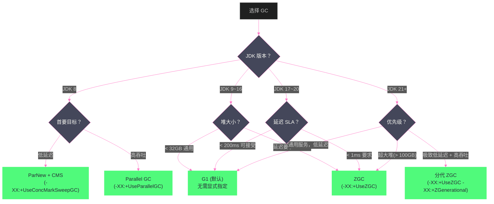

# 14 GC 调优实战——日志分析、参数调优与选型指南

**摘要：**

GC 调优是 JVM 性能工程中最重要也最容易被误解的领域。最常见的误区是：**盲目堆砌参数**——看到某个博客推荐某组参数就全部照抄，不理解每个参数的含义，调完比调之前更差。正确的 GC 调优必须建立在**充分理解当前系统 GC 行为**的基础上：先读懂 GC 日志（找到真正的性能瓶颈），再有针对性地调整参数，最后验证调整效果。本文给出一套完整的 GC 调优方法论：从 GC 日志的配置与解读（GC 日志格式演进、关键字段含义、异常模式识别），到 G1/ZGC/Shenandoah 各收集器的调优重点与参数详解，到基于业务场景的 GC 选型决策框架，最后通过两个典型生产案例（电商高峰期 G1 Full GC 问题、实时风控服务 ZGC 调优）展示完整的调优思路与过程。

---

## 第 1 章 GC 调优的正确姿势

### 1.1 先问自己：真的需要调优 GC 吗

GC 调优的前提是**确认 GC 是实际的性能瓶颈**。在实践中，很多被归咎于 GC 的问题，实际根因是：
- 业务逻辑的 SQL 性能问题（数据库慢查询导致请求堆积）
- 线程池配置不合理（线程数过少，请求排队等待）
- 网络 I/O 瓶颈（带宽或连接数限制）
- 应用代码中的锁竞争（CPU 在等锁而非做业务）

GC 是性能问题需要同时满足：
1. 监控数据显示 GC 停顿时间显著影响了服务的 P99/P999 延迟（如 GC 日志中有 500ms 以上的停顿）
2. GC 占用了大量 CPU（`jstat -gcutil` 显示 GC 时间占比高）
3. GC 频率异常高（Minor GC 每秒几十次，Full GC 每小时几次）

如果以上三点都不满足，堆大小足够，GC 正常运转，就不需要调优——把时间用在更值得的地方。

### 1.2 GC 调优的目标层次

GC 调优通常针对以下目标之一（很难同时满足所有目标，需要明确优先级）：

**目标一：降低最大停顿时间（Latency）**：减少 GC 停顿对服务响应时间的影响，适合延迟敏感型应用（Web API、金融交易、实时推荐）。指标：P99/P999 响应时间、GC 停顿 `max pause`。

**目标二：提高吞吐量（Throughput）**：减少 GC 占用的 CPU 时间比例，让业务代码运行更多。适合批处理、计算密集型应用。指标：单位时间处理请求数、业务吞吐量。

**目标三：减少内存占用（Footprint）**：在保证功能的前提下减小堆大小，适合内存受限环境（如容器）。

> [!note] 设计哲学：调优是权衡，不是免费的午餐
> 降低停顿时间（ZGC/Shenandoah）会损失吞吐量（读屏障开销）；提高吞吐量（Parallel GC）会增加停顿时间；减小内存占用会增加 GC 频率。没有一个 GC 配置能同时在所有维度完美。明确优先目标，接受其他维度的代价。

---

## 第 2 章 GC 日志的配置与解读

### 2.1 开启 GC 日志——不同 JDK 版本的参数

**JDK 8（经典参数）**：

```bash
# 基础 GC 日志（每次 GC 的停顿时间和堆使用变化）
-XX:+PrintGCDetails
-XX:+PrintGCDateStamps
-XX:+PrintGCTimeStamps
-Xloggc:/data/logs/gc.log

# 增强信息（推荐生产环境开启）
-XX:+PrintGCCause               # 打印 GC 触发原因
-XX:+PrintAdaptiveSizePolicy    # 打印 G1 的自适应调整决策
-XX:+PrintTenuringDistribution  # 打印对象年龄分布（用于调优晋升阈值）
-XX:+PrintReferenceGC           # 打印弱引用/软引用处理时间
-XX:+PrintGCApplicationStoppedTime  # 打印 STW 总停顿时间（包含等待安全点时间）
```

**JDK 9+（统一日志框架，更强大）**：

```bash
# 统一日志框架 -Xlog:gc*（格式：-Xlog:<selector>:<output>:<decorators>）
# 基础 GC 日志（等价于 JDK 8 的 PrintGCDetails + PrintGCDateStamps）
-Xlog:gc*:file=/data/logs/gc.log:time,uptime,level,tags

# 只关注 GC 停顿（更简洁）
-Xlog:gc:file=/data/logs/gc.log:time

# 包含安全点信息（排查 Time To Safepoint 问题）
-Xlog:gc*,safepoint:file=/data/logs/gc.log:time,uptime

# GC 日志滚动（防止日志文件过大）
-Xlog:gc*:file=/data/logs/gc.log:time,uptime:filecount=10,filesize=100m
```

> [!warning] 生产避坑：GC 日志的开销
> GC 日志对性能的影响极小（通常 < 0.5%），**任何生产环境都应该开启 GC 日志**。没有 GC 日志，GC 问题的事后分析几乎无从下手。日志文件用 `-Xlog:filecount=10,filesize=100m` 做滚动，防止磁盘满。

### 2.2 G1 GC 日志解读

G1 的 GC 日志比 CMS 更结构化，以下是 JDK 11 格式（`-Xlog:gc*`）的典型 Young GC 日志：

```
[2024-01-15T10:23:45.234+0800][2.345s][info][gc,start     ] GC(47) Pause Young (Normal) (G1 Evacuation Pause)
[2024-01-15T10:23:45.234+0800][2.345s][info][gc,task      ] GC(47) Using 8 workers of 8 for evacuation
[2024-01-15T10:23:45.256+0800][2.367s][info][gc,phases    ] GC(47)   Pre Evacuate Collection Set: 0.2ms
[2024-01-15T10:23:45.256+0800][2.367s][info][gc,phases    ] GC(47)   Merge Heap Roots: 1.1ms
[2024-01-15T10:23:45.256+0800][2.367s][info][gc,phases    ] GC(47)   Evacuate Collection Set: 15.3ms  ← 实际复制时间（STW 的主体）
[2024-01-15T10:23:45.256+0800][2.367s][info][gc,phases    ] GC(47)   Post Evacuate Collection Set: 2.4ms
[2024-01-15T10:23:45.256+0800][2.367s][info][gc,phases    ] GC(47)   Other: 2.7ms
[2024-01-15T10:23:45.256+0800][2.367s][info][gc,heap      ] GC(47) Eden regions: 150->0(150)   ← Eden 从 150 个 Region 变为 0（全部清空）
[2024-01-15T10:23:45.256+0800][2.367s][info][gc,heap      ] GC(47) Survivor regions: 10->12(20)
[2024-01-15T10:23:45.256+0800][2.367s][info][gc,heap      ] GC(47) Old regions: 300->305(1024)  ← 老年代增加了 5 个 Region（晋升）
[2024-01-15T10:23:45.256+0800][2.367s][info][gc,heap      ] GC(47) Archive regions: 0->0(0)
[2024-01-15T10:23:45.256+0800][2.367s][info][gc,heap      ] GC(47) Humongous regions: 3->3(3)
[2024-01-15T10:23:45.256+0800][2.367s][info][gc            ] GC(47) Pause Young (Normal) (G1 Evacuation Pause) 3456M->2890M(4096M) 22.1ms
                                                                                                                 ↑ 停顿前堆大小  ↑ 停顿后 ↑ 总堆 ↑ 停顿时间
```

**关键字段解读**：

- `Pause Young (Normal)`：正常的 Young GC（区别于 `(Concurrent Start)`——并发标记周期开始时附加的 Young GC）
- `Eden regions: 150->0(150)`：Eden 从 150 个 Region 被清空，下次分配又有 150 个 Eden Region 可用（说明新生代大小=150 Region）
- `Old regions: 300->305`：老年代增加 5 个 Region，说明有 5 个 Region 的对象从 Young 晋升到 Old
- `3456M->2890M(4096M) 22.1ms`：堆从 3456MB 降到 2890MB，总堆 4096MB，停顿 22.1ms

**并发标记周期的日志特征**：

```
[gc,start] GC(52) Pause Young (Concurrent Start) (G1 Humongous Allocation)
                                      ↑ 触发原因：Humongous 分配导致触发并发标记

[gc] Concurrent Mark Cycle
[gc,marking] GC(52) Concurrent Clear Claimed Marks   ← 并发阶段开始
[gc,marking] GC(52) Concurrent Scan Root Regions
[gc,marking] GC(52) Concurrent Mark From Roots       ← 并发标记（不停顿）
...
[gc,start  ] GC(53) Pause Remark                     ← 最终标记（STW）
[gc        ] GC(53) Pause Remark 3890M->3890M(4096M) 42.3ms

[gc,start  ] GC(54) Pause Cleanup                    ← 清理（STW，极短）
[gc        ] GC(54) Pause Cleanup 3890M->3820M(4096M) 4.2ms
```

**Mixed GC 的识别**：

```
[gc,start] GC(60) Pause Young (Mixed) (G1 Evacuation Pause)
                              ↑ "Mixed" 表明这是混合回收（新生代+部分老年代）
[gc,heap ] GC(60) Old regions: 400->320(1024)
                                   ↑ 老年代 Region 减少了 80 个（被回收了 80 个 Region！）
```

### 2.3 G1 日志中的告警信号

**告警 1：Full GC**

```
[gc,start] GC(100) Pause Full (G1 Compaction Pause)
[gc      ] GC(100) Pause Full (G1 Compaction Pause) 3890M->2100M(4096M) 8234.5ms
                                                                          ↑ 8 秒！严重停顿
```

Full GC 是 G1 的紧急模式，必须排查根因（堆空间不足、分配过快、IHOP 配置过高等）。

**告警 2：to-space exhausted（晋升失败）**

```
[gc,phases] GC(47) To-space exhausted
```

表示在 Young GC 复制存活对象时，目标区域（To Survivor 或 Old）空间不足，触发对象分配失败，可能导致 Full GC。原因：老年代空间不足以接收晋升对象。

**告警 3：Evacuation Failure**

```
[gc,start] GC(48) Pause Young (G1 Evacuation Pause)
[gc,phases] GC(48) Evacuation Failure
```

疏散失败——Young GC 期间，存活对象无法被移动到目标 Region（没有可用的 Free Region），触发 Full GC。

### 2.4 ZGC 日志解读

ZGC 的日志格式更简洁：

```
[gc           ] GC(0) Garbage Collection (Warmup)
[gc,phases    ] GC(0) Pause Mark Start          0.014ms   ← 初始标记 STW：0.014ms！
[gc,phases    ] GC(0) Concurrent Mark           28.374ms  ← 并发标记（无停顿）
[gc,phases    ] GC(0) Pause Mark End            0.021ms   ← 最终标记 STW：0.021ms！
[gc,phases    ] GC(0) Concurrent Select Relocation Set 0.189ms
[gc,phases    ] GC(0) Pause Relocate Start      0.013ms   ← 初始转移 STW：0.013ms！
[gc,phases    ] GC(0) Concurrent Relocate       5.284ms   ← 并发转移（无停顿）
[gc           ] GC(0) Garbage Collection (Warmup) 4096M(100%)->2048M(50%) 34.1ms
                                                             ↑ 堆使用从 4GB 降到 2GB
                                                                              ↑ 整个 GC 周期耗时 34ms（大部分是并发，STW 仅 ~0.05ms）
```

**ZGC 三次 STW 停顿合计通常 < 1ms**，这就是 ZGC 亚毫秒停顿的直接体现。

---

## 第 3 章 G1 调优实战

### 3.1 G1 调优的三个核心杠杆

**杠杆一：停顿时间目标 `-XX:MaxGCPauseMillis`**

这是 G1 调优最重要的参数，也是最常被误用的参数。

**错误做法**：将 `MaxGCPauseMillis` 设置为非常小的值（如 10ms），希望 GC 停顿极短。实际结果：G1 每次 GC 只能回收很少的 Region（停顿预算太小），回收进度落后于分配速度，最终堆快速被填满，触发 Full GC，停顿反而更长。

**正确做法**：
1. 先用默认值（200ms）观察实际停顿
2. 如果实际停顿稳定在 50ms，可以尝试降低到 100ms
3. 如果降低后发现 Full GC 频率上升，说明调得太小了，适当调大
4. `MaxGCPauseMillis` 不是越小越好，而是**最小化 Full GC 同时满足延迟目标的最大值**

**杠杆二：堆大小 `-Xms`/`-Xmx`**

最简单有效的调优。堆越大，GC 频率越低，停顿也可能更长（需要处理的 Region 更多）。

- 设置 `-Xms=-Xmx`（两者相等），避免 JVM 在运行时动态调整堆大小（调整时也会触发 Full GC）
- 对于容器化部署，设置为容器内存的 75%~80%（留出堆外内存空间）

**杠杆三：IHOP 阈值 `-XX:InitiatingHeapOccupancyPercent`**

触发并发标记的老年代占用比，默认 45%。

- 太高（如 80%）：并发标记启动太晚，老年代快满时才开始，可能在标记完成前就触发 Full GC
- 太低（如 20%）：并发标记过于频繁，GC CPU 占用增加

JDK 9+ 的**自适应 IHOP（Adaptive IHOP）** 会自动调整，无需手动设置。

### 3.2 G1 的 Region 大小调优

G1 Region 大小默认由 JVM 根据堆大小自动计算（目标约 2048 个 Region）：

| 堆大小 | 默认 Region 大小 |
| :--- | :--- |
| 4GB | 2MB |
| 8GB | 4MB |
| 16GB | 8MB |
| 32GB | 16MB |

**Humongous 分配频繁时调整 Region 大小**：如果业务中有大量 Humongous 对象（超过 Region 大小 50% 的对象），考虑增大 Region 大小（`-XX:G1HeapRegionSize=8m`），使更多对象走正常 Young GC 路径，减少直接进老年代的 Humongous 分配。

### 3.3 G1 调优参数速查

| 参数 | 含义 | 默认值 | 调优建议 |
| :--- | :--- | :--- | :--- |
| `-XX:MaxGCPauseMillis` | 停顿时间目标 | 200ms | 根据 SLA 设置，不要太小 |
| `-XX:G1HeapRegionSize` | Region 大小 | 自动计算 | Humongous 频繁时增大 |
| `-XX:InitiatingHeapOccupancyPercent` | 触发并发标记阈值 | 45% | JDK9+ 自适应，通常不调 |
| `-XX:G1NewSizePercent` | 新生代最小比例 | 5% | 通常不调 |
| `-XX:G1MaxNewSizePercent` | 新生代最大比例 | 60% | 通常不调 |
| `-XX:G1MixedGCCountTarget` | Mixed GC 目标次数 | 8 | 减小可让每次回收更多 Old |
| `-XX:G1HeapWastePercent` | 允许的老年代垃圾率 | 5% | 降低可让 GC 更彻底 |
| `-XX:ParallelGCThreads` | STW 并行 GC 线程 | 核数（≤8）| 容器环境按实际 CPU 配额设 |
| `-XX:ConcGCThreads` | 并发标记线程 | ParallelGCThreads/4 | 标记速度跟不上时可增大 |

---

## 第 4 章 ZGC 调优实战

### 4.1 ZGC 的"几乎不需要调优"

与 G1 相比，ZGC 的调优参数极少——这是 ZGC 的设计哲学：**自适应，让 GC 自己决定何时、如何回收**。

ZGC 只有两个真正需要关注的调优点：

**堆大小**：ZGC 需要更多的堆空间"余量"才能安全运行。由于并发转移期间新对象仍在分配，ZGC 需要确保在并发 GC 完成之前不会耗尽空间。推荐：
- 生产环境 ZGC 的堆大小应比实际使用量多 **2~3 倍**
- 使用 `-XX:SoftMaxHeapSize`（软上限）限制日常使用，`-Xmx` 作为极限：

```bash
# 堆在正常情况下不超过 6GB，极限允许到 8GB（应对分配峰值）
-Xmx8g -XX:SoftMaxHeapSize=6g
```

**并发线程数**：ZGC 并发 GC 线程数（`-XX:ConcGCThreads`）默认为 CPU 核数的 1/4。如果 GC 速度跟不上分配速度（ZGC 日志中出现 `Allocation Stall`），适当增大：

```bash
# 在 CPU 资源充足时，增加并发线程
-XX:ConcGCThreads=4  # 默认可能只有 1~2
```

### 4.2 ZGC 常见问题

**问题：`Allocation Stall`——分配停滞**

```
[gc,alloc] GC(5) Allocation Stall (main) 12.345ms
```

用户线程在分配对象时被迫等待（堆空间被临时耗尽，等待 GC 腾出空间）。虽然这不是传统 STW，但对延迟有影响。

**原因**：ZGC 的并发回收速度跟不上对象分配速度（通常是分配速率突发激增或堆大小不足）。

**解决**：
1. 增大堆大小（增加缓冲空间）
2. 增加并发 GC 线程（`-XX:ConcGCThreads`）
3. 降低 GC 触发阈值（让 GC 更早启动，不等堆快满时才开始）：`-XX:ZCollectionInterval=10`（每 10 秒强制一次 GC，防止长时间不 GC 导致堆突然满）

**问题：吞吐量不如 G1**

非分代 ZGC 的吞吐量通常比 G1 低 10%~30%（读屏障开销）。对于吞吐量敏感的应用，**优先考虑 JDK 21 的分代 ZGC**（`-XX:+ZGenerational`），分代 ZGC 的吞吐量接近或超过 G1。

---

## 第 5 章 GC 选型决策框架

### 5.1 选型矩阵

| 场景特征 | 推荐 GC | 原因 |
| :--- | :--- | :--- |
| **JDK 8，延迟敏感，堆 < 4GB** | ParNew + CMS | JDK 8 下的最佳低延迟选项，堆小时 Remark 停顿短 |
| **JDK 8，吞吐量优先，批处理** | Parallel Scavenge + Parallel Old | 最大化 CPU 利用率，JDK 8 默认 |
| **JDK 11~17，通用服务** | G1 | JDK 9+ 默认，平衡延迟和吞吐量，堆 4GB~数十 GB |
| **JDK 21+，高吞吐 + 低延迟** | 分代 ZGC | 同时满足亚毫秒停顿和接近 Parallel 的吞吐量 |
| **JDK 11+，极致低延迟（< 1ms）** | ZGC | 着色指针+读屏障，停顿与堆大小无关 |
| **超大堆（> 32GB），延迟敏感** | ZGC | 堆越大，ZGC 的优势越明显；G1 在大堆下停顿可能仍较长 |
| **Red Hat 环境，低延迟** | Shenandoah | Red Hat 生态支持好，Brooks Pointer 方案，兼容性广 |
| **Serverless/CLI 工具，启动速度** | GraalVM Native Image | 牺牲 JIT 峰值性能，换取毫秒级启动和极低内存 |
| **容器（1~2 核，内存受限）** | Serial GC 或 G1 | Serial 在单核下无并行开销；G1 有更精细的内存控制 |

### 5.2 分阶段决策树



---

## 第 6 章 生产案例实战

### 6.1 案例一：电商大促期间 G1 Full GC 问题

**现象**：某电商平台大促期间，高并发时段 Java 服务频繁触发 Full GC，单次停顿最长达 12 秒，大量请求超时报错。

**基本配置**：
- JDK 11，G1 GC，`-Xmx8g -Xms4g`（注意：初始堆和最大堆不一致！）
- `-XX:MaxGCPauseMillis=200`（默认）
- 未配置 GC 日志（！）

**第一步：事后分析**

虽然没有 GC 日志，但通过以下方式重建问题：
1. 翻阅 Prometheus 指标：发现问题时段内，JVM 进程的 CPU 利用率从 40% 飙升到 100%，持续 30 秒
2. 查看应用日志中的 GC 信息（Spring Actuator 的 `/actuator/metrics/jvm.gc.pause`）：Full GC 停顿 8~12 秒

**第二步：复现与分析**

增加 GC 日志后，在压测环境复现问题。GC 日志关键片段：

```
# 事发前 5 分钟：并发标记周期越来越频繁
GC(145) Concurrent Mark Cycle
...
GC(189) Concurrent Mark Cycle  # 每隔几秒就触发一次并发标记

# 事发时：Mixed GC 无法及时清理老年代
GC(192) Pause Young (Mixed) ... Old regions: 980->965(1024)  # 老年代几乎满了
GC(193) Pause Young (G1 Evacuation Pause) ... To-space exhausted  # 晋升失败
GC(194) Pause Full (G1 Compaction Pause) 7890M->4200M(8192M) 11432.5ms  # Full GC 11.4 秒！
```

**根因分析**：
1. **`-Xms4g` 不等于 `-Xmx8g`**：JVM 从 4GB 开始，需要扩展堆时触发 GC，这本身就消耗时间；更重要的是，堆扩展到 8GB 的过程中，GC 的行为是不稳定的
2. **Humongous 分配频繁**：`jmap -histo:live` 发现大量 >1MB 的 `byte[]` 对象（请求/响应的序列化缓冲区），不断直接进老年代
3. **老年代回收速度跟不上**：大促时 QPS 是正常的 10 倍，对象晋升速度远超 Mixed GC 的回收速度，老年代快速被填满

**解决方案**：

```bash
# 修复 1：统一初始堆和最大堆
-Xms8g -Xmx8g

# 修复 2：增大 Region 大小，减少 Humongous 分配
-XX:G1HeapRegionSize=4m  # 从默认 2MB 增大到 4MB（超过 2MB 的对象才进 Humongous）

# 修复 3：降低 IHOP，让并发标记更早触发
-XX:InitiatingHeapOccupancyPercent=35  # 从默认 45% 降到 35%

# 修复 4：增加 Mixed GC 回收力度
-XX:G1MixedGCCountTarget=4  # 从默认 8 次改为 4 次，每次回收更多 Old Region
-XX:G1HeapWastePercent=3    # 从默认 5% 改为 3%，更彻底地清理老年代

# 修复 5：配置完整 GC 日志（以后不要再没有 GC 日志了！）
-Xlog:gc*:file=/data/logs/gc-%t.log:time,uptime:filecount=10,filesize=100m
```

**效果**：大促期间再无 Full GC，G1 Young GC 停顿稳定在 80~150ms，Mixed GC 停顿在 100~200ms，P99 请求延迟从 8s+ 降到 300ms 以下。

### 6.2 案例二：实时风控服务 ZGC 调优

**现象**：某金融公司实时风控服务，使用 G1 GC，P999 延迟偶发 500ms 以上（因 GC 停顿），但 P99 只有 20ms。业务要求 P999 < 50ms。

**分析**：

G1 GC 日志中发现 Pause Remark（最终标记）偶发 400~600ms 的停顿：

```
GC(230) Pause Remark 6890M->6890M(8192M) 542.3ms  # Remark 停顿 542ms！
```

这是因为堆很大（8GB），Remark 阶段需要处理大量的 SATB 队列（并发标记期间高并发写入导致大量引用变更记录积压）。

**决策：迁移到 ZGC**

G1 的 Remark 停顿是结构性问题（堆越大，并发写入越多，Remark 越慢），无法通过调参根本解决。迁移到 ZGC，利用其亚毫秒停顿特性。

**迁移过程**：

```bash
# 第一步：切换 GC，保持其他配置不变
-XX:+UseZGC
-Xmx8g -Xms8g  # ZGC 同样需要 Xms=Xmx

# 第二步：根据 ZGC 特点调整堆大小
# ZGC 需要更多"缓冲"，但 8GB 的机器只有 8GB，实际需要将进程拆分或升配
# 方案：将服务实例数从 4 个增加到 6 个，每个实例堆从 8GB 降到 5GB
# （因为 ZGC 在 5GB 的堆上表现得更稳定）
-Xmx5g -Xms5g

# 第三步：加上 SoftMaxHeapSize 留出缓冲
-XX:SoftMaxHeapSize=4g  # 正常控制在 4GB，极限 5GB

# 第四步：JDK 21 升级并启用分代 ZGC（在生产环境稳定后）
-XX:+UseZGC -XX:+ZGenerational
```

**效果对比**：

| 指标 | G1（调优前）| ZGC（迁移后）|
| :--- | :--- | :--- |
| P99 延迟 | 20ms | 18ms（略好）|
| P999 延迟 | 500~600ms | **< 2ms** |
| Max GC 停顿 | 542ms | 0.8ms |
| GC 吞吐量损失 | 基准 | +8%（读屏障开销）|
| 内存利用率 | 8GB / 实例 | 5GB / 实例（需要更多实例）|

迁移后 P999 延迟从 500ms 降到 2ms，完全满足业务要求。吞吐量轻微下降（8%），但通过增加实例数弥补，总成本基本持平。

---

## 第 7 章 GC 调优的反模式

### 7.1 常见的 GC 调优误区

**误区 1：`-Xmx` 越大越好**

堆大小过大会导致 GC 每次需要扫描更多 Region/对象，停顿时间反而增加；同时，大堆下 Full GC 的代价极高（几十秒甚至更长）。推荐：**堆大小 = 长期存活对象大小 × 3~4 倍**，留足 GC 空间但不过分浪费。

**误区 2：盲目降低 `-XX:MaxGCPauseMillis`**

如前所述，`MaxGCPauseMillis` 设置过小会适得其反。正确做法：从默认值开始，根据实际 GC 日志数据逐步调整。

**误区 3：`-XX:+UseG1GC -XX:+UseConcMarkSweepGC` 同时开启**

两个 GC 指令同时存在，JVM 只使用后指定的（或忽略其中一个），没有任何意义。选一个就好。

**误区 4：`-XX:ParallelGCThreads` 设置为 CPU 核数**

在容器化环境中（如 Docker 限制了 CPU 配额），`ParallelGCThreads` 默认读取的是宿主机 CPU 核数，可能远大于容器实际可用的 CPU 数，导致大量 GC 线程竞争极少的 CPU，反而更慢。正确做法：显式设置为容器实际 CPU 配额数：

```bash
# 容器分配了 4 个 CPU
-XX:ParallelGCThreads=4
-XX:ConcGCThreads=1
# JDK 10+ 可以用 JVM 参数自动感知容器 CPU 配额：
-XX:+UseContainerSupport  # JDK 8u191+ 和 JDK 10+ 默认开启
```

**误区 5：从网上抄一份 JVM 参数"最佳实践"**

"最佳实践"是针对特定负载模式的特定应用的调优结果，复制到你的应用可能毫无意义。**唯一的最佳实践是：读懂你自己应用的 GC 日志，基于数据做决定**。

---

## 第 8 章 总结

GC 调优是一门需要理论基础和实践经验相结合的工程技艺。本专栏从 GC 的基础理论走到了调优实战，以下是完整的 GC 调优知识体系：

**1. 建立监控基线**（在任何调优之前）：
- 开启 GC 日志（永远）：`-Xlog:gc*:file=gc.log:time,uptime:filecount=10,filesize=100m`
- 建立 GC 相关的 Prometheus 指标：GC 停顿时间（avg/max/P99）、GC 频率、堆使用率、Full GC 次数
- 观察至少一个完整的业务周期（包括高峰期）才能得出结论

**2. 识别问题模式**：
- 老年代使用率持续增长不回落 → 内存泄漏（参见上篇第 13 章）
- Full GC 频繁 → 内存不足或泄漏
- Young GC 频率极高（每秒 > 10 次）→ 对象创建速率过高，考虑减少对象分配
- Remark/Cleanup 停顿过长 → 考虑迁移到 ZGC

**3. 选择合适的 GC**：
- 按本章第 5 章的选型框架，基于 JDK 版本、延迟目标、堆大小三要素决策
- JDK 21 及以上，分代 ZGC 是绝大多数场景的最优选择

**4. 有针对性地调优参数**：
- G1：`MaxGCPauseMillis`、`G1HeapRegionSize`、`IHOP`
- ZGC：堆大小、`SoftMaxHeapSize`、`ConcGCThreads`
- 每次只改一个参数，对比前后 GC 日志验证效果

**5. 持续优化**：GC 调优不是一次性的。业务增长（负载增加、数据量增大）会使之前的调优结果失效，需要定期重新评估。

至此，JVM 专栏的 14 篇文章全部完成。从第 01 篇的全局架构鸟瞰，经过运行时数据区、对象生命周期、GC 基础理论、六种垃圾回收器（Serial/Parallel/CMS/G1/ZGC/Shenandoah），到类加载机制、字节码执行、JIT 编译，最后落地到内存问题实战和 GC 调优实战——构建了一个从原理到实践的完整 JVM 知识体系。

---

## 参考文献

1. 周志明, 《深入理解 Java 虚拟机（第三版）》, 第 3.8 章、附录 D：JVM 参数表
2. 美团技术博客, "CMS GC 问题分析与解决"、"G1 GC 最佳实践", tech.meituan.com
3. Oracle Documentation, "Garbage Collection Tuning Guide", docs.oracle.com
4. Monica Beckwith, "G1GC Tuning: A Comprehensive Guide", JavaOne 2015
5. Per Liden, "ZGC Tuning Advice", ZGC Developer Blog, jdk.java.net/zgc
6. Aleksey Shipilev, "GC Pauses and Safe Points", shipilev.net
7. Charlie Hunt & Binu John, "Java Performance: The Definitive Guide", O'Reilly, 2014
8. OpenJDK Wiki, "HotSpot GC FAQ", wiki.openjdk.org

---

> [!note] 思考题
> 1. G1 的 GC 日志中出现 `to-space exhausted` 意味着什么？这个错误发生时 G1 会采取什么紧急措施？你应该调整哪些参数来避免它？这与 CMS 的 `Concurrent Mode Failure` 有什么本质区别？
> 2. 在一个 4 核 8GB 内存的容器中运行 Java 应用，JVM 堆设置为 6GB。如果使用 G1 收集器，GC 线程数默认是多少？GC 线程数过多会导致 GC 和应用线程竞争 CPU——在 CPU 受限的容器环境中，你如何调整 `-XX:ParallelGCThreads` 和 `-XX:ConcGCThreads`？
> 3. JDK 8 默认使用 Parallel GC，JDK 9+ 默认使用 G1，JDK 21 引入了 Generational ZGC。在一个需要从 JDK 8 升级到 JDK 21 的项目中，你如何制定 GC 迁移策略？直接切换到 ZGC 是否安全？你需要关注哪些兼容性风险？
