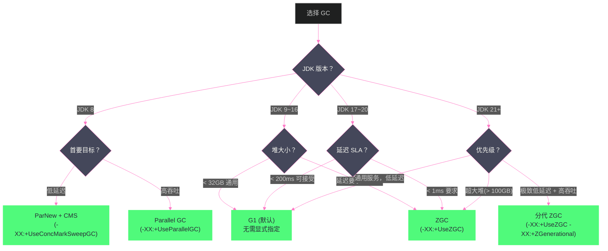

# 14 GC 调优实战——日志分析、参数调优与选型指南

**摘要：**

GC 调优是 JVM 性能工程中最重要也最容易被误解的领域。最常见的误区是：**盲目堆砌参数**——看到某个博客推荐某组参数就全部照抄，不理解每个参数的含义，调完比调之前更差。正确的 GC 调优必须建立在**充分理解当前系统 GC 行为**的基础上：先明确调优目标（延迟/吞吐量/内存占用三者互斥，必须排优先级），再读懂 GC 日志（找到真正的性能瓶颈所在阶段），再有针对性地调整参数，最后用同一套负载重新压测验证效果——这是一个"目标—约束—假设—验证"的闭环迭代过程，而不是一次性的参数拼图。

本文给出一套完整的 GC 调优方法论与实操手册：从 GC 调优该遵循的工作流程，到不同 JDK 版本（8/11/17/21）默认 GC 与堆参数的演进对比，到 GC 日志的配置与逐字段解读（覆盖 G1、CMS、ZGC 三种日志格式，并逐行拆解一条真实日志的每一个数值代表什么），到 G1、Parallel/CMS、ZGC、Shenandoah 四类收集器各自的调优重点、核心参数与调优后可能引入的新问题，到覆盖 Web 服务、批处理、大数据计算、低延迟交易系统四种典型业务场景的 GC 选型决策树，最后通过三个贴近生产实况的调优案例（电商大促 G1 Full GC 问题、实时风控服务 ZGC 迁移、离线批处理 Parallel GC 吞吐量调优）展示从现象到根因再到验证的完整调优链路。文末系统梳理调优反模式，帮助规避"越调越差"的常见陷阱。

---

## 第 1 章 GC 调优的正确姿势

### 1.1 先问自己：真的需要调优 GC 吗

GC 调优的前提是**确认 GC 是实际的性能瓶颈**。在实践中，很多被归咎于 GC 的问题，实际根因是：
- 业务逻辑的 SQL 性能问题（数据库慢查询导致请求堆积）
- 线程池配置不合理（线程数过少，请求排队等待）
- 网络 I/O 瓶颈（带宽或连接数限制）
- 应用代码中的锁竞争（CPU 在等锁而非做业务）

GC 是性能问题需要同时满足：
1. 监控数据显示 GC 停顿时间显著影响了服务的 P99/P999 延迟（如 GC 日志中有 500ms 以上的停顿）
2. GC 占用了大量 CPU（`jstat -gcutil` 显示 GC 时间占比高）
3. GC 频率异常高（Minor GC 每秒几十次，Full GC 每小时几次）

如果以上三点都不满足，堆大小足够，GC 正常运转，就不需要调优——把时间用在更值得的地方。

### 1.2 GC 调优的目标层次

GC 调优通常针对以下目标之一（很难同时满足所有目标，需要明确优先级）：

**目标一：降低最大停顿时间（Latency）**：减少 GC 停顿对服务响应时间的影响，适合延迟敏感型应用（Web API、金融交易、实时推荐）。指标：P99/P999 响应时间、GC 停顿 `max pause`。

**目标二：提高吞吐量（Throughput）**：减少 GC 占用的 CPU 时间比例，让业务代码运行更多。适合批处理、计算密集型应用。指标：单位时间处理请求数、业务吞吐量。

**目标三：减少内存占用（Footprint）**：在保证功能的前提下减小堆大小，适合内存受限环境（如容器）。

> [!note] 设计哲学：调优是权衡，不是免费的午餐
> 降低停顿时间（ZGC/Shenandoah）会损失吞吐量（读屏障开销）；提高吞吐量（Parallel GC）会增加停顿时间；减小内存占用会增加 GC 频率。没有一个 GC 配置能同时在所有维度完美。明确优先目标，接受其他维度的代价。

### 1.3 GC 调优的方法论：目标—约束—假设—验证

大多数失败的 GC 调优都栽在同一个环节：**跳过了"明确目标"，直接进入"改参数"**。看到堆使用率高就加大 `-Xmx`，看到停顿长就调小 `MaxGCPauseMillis`，改完发现问题依旧甚至更糟，再随手加另一个参数——这种"试错式"调优本质上是把生产环境当成了随机搜索的沙盘，风险和收益完全不对等。

一套可重复、可验证的调优流程应该分四步走，缺一步都容易走偏：

**第一步：确定目标（Objective）**。目标必须是量化的业务指标，而不是"降低 GC 时间"这种技术自嗨的目标。例如"P99 响应时间从 300ms 降到 150ms 以内"，或者"同等硬件下 QPS 从 8000 提升到 12000"。目标决定了后续所有取舍的方向——如果目标是吞吐量，那么增加 STW 停顿换取更高的内存回收效率是可以接受的；如果目标是延迟，那么牺牲一部分 CPU 效率去做更频繁的并发标记也是划算的。**没有量化目标的调优无法判断"调好了"还是"调坏了"**，只能凭感觉，凭感觉的调优在下一次负载变化时大概率会失效。

**第二步：识别约束（Constraint）**。约束是调优空间的边界：可用内存上限（容器配额、宿主机物理内存）、可用 CPU 核数、JDK 版本（决定了能不能用 ZGC/Shenandoah）、业务对偶发长停顿的容忍度（有些系统能接受每天一次 2 秒的 Full GC，有些系统一次 200ms 的停顿就会触发下游熔断）。约束条件没搞清楚之前谈调优是空中楼阁——比如在容器只分配了 2 个 CPU 核心的环境里讨论要不要上 ZGC，答案基本是否定的（ZGC 并发标记和转移线程本身需要吃 CPU，核数太少反而会与业务线程抢资源，参见 [[对象生命周期与GC/08 ZGC——亚毫秒停顿的着色指针与读屏障]] 中并发开销的讨论）。

**第三步：形成假设并只改一个变量**。基于当前 GC 日志的具体表现（哪个阶段耗时最长、哪类 GC 触发最频繁），提出一个具体假设，比如"Mixed GC 次数不够导致老年代堆积，把 `G1MixedGCCountTarget` 从 8 降到 4 应该能加快老年代回收速度"。**每次只调整一个参数**，这是整个方法论里最容易被忽视但最重要的一条纪律。如果一次改三个参数，效果变好或变差都无法归因到具体哪个参数，下一次遇到类似问题时依然不知道该动哪个杠杆。

**第四步：用同一套负载重新验证**。调优效果必须在与问题复现时同等量级的负载下验证（同样的 QPS、同样的对象分配速率），不能在低峰期测出"效果很好"就直接上生产。理想情况下应该有一套可重放的压测脚本或者流量录制回放工具，能在预发环境反复验证调优假设，而不是每次都要在生产环境"用真实流量试错"。

> [!warning] 生产避坑：调优≠调参数，是一次完整的实验
> 把每一次调优当作一次带对照组的实验来做：记录调优前的 GC 日志基线（至少覆盖一个完整业务高峰周期）、调优后的 GC 日志、以及业务侧指标（P99/P999、QPS、错误率）的前后对比。没有基线数据，"感觉好像好一点了"是无法向团队证明的结论，下次故障复现时也无从复盘。

### 1.4 不同 JDK 版本的默认 GC 与堆参数演进

调优之前必须先弄清楚"如果什么都不配置，JVM 默认会怎么做"——很多线上问题的根源就是团队沿用了旧版 JDK 的参数模板，升级 JDK 大版本后默认行为已经变了，但配置没有同步调整。

| JDK 版本 | 默认收集器 | 默认堆大小策略 | 默认 `MaxGCPauseMillis` | 关键变化 |
| :--- | :--- | :--- | :--- | :--- |
| JDK 8 | Parallel GC | `-Xmx` 默认为物理内存 1/4 | 不适用（Parallel 无此参数） | CMS 可用但已在 JDK 9 标记废弃（JEP 291），JDK 14 移除（JEP 363） |
| JDK 9~10 | **G1** 成为默认收集器（JEP 248） | 同 JDK 8 策略 | 200ms | 引入统一日志框架 `-Xlog`，`PrintGCDetails` 等旧参数被标记废弃 |
| JDK 11 (LTS) | G1 | 同上；容器感知（`UseContainerSupport`）默认开启 | 200ms | ZGC 以 Experimental 形式加入（Linux/x64） |
| JDK 15 | G1 | 同上 | 200ms | ZGC 转正（JEP 377）；Shenandoah 转正（JEP 379） |
| JDK 17 (LTS) | G1 | 同上；容器内默认 `-Xmx` 为容器内存限制的 1/4（可通过 `-XX:MaxRAMPercentage` 调整） | 200ms | ZGC/Shenandoah 均已 GA，可直接生产使用 |
| JDK 21 (LTS) | G1 | 同上 | 200ms | **分代 ZGC**（Generational ZGC，JEP 439）加入，`-XX:+ZGenerational` 显式开启；JDK 23 起分代 ZGC 成为 ZGC 唯一模式 |

> [!info] 核心概念：容器化环境下的默认堆大小陷阱
> JDK 8u191 之前的版本**不感知 cgroup 限制**，会按宿主机的物理内存计算默认堆大小（1/4），如果容器只分配了 2GB 内存而宿主机有 128GB，JVM 会尝试申请 32GB 堆，直接被 OOM Killer 杀掉。JDK 8u191+ 和 JDK 10+ 默认开启 `-XX:+UseContainerSupport`，会读取 cgroup 的内存限制而不是宿主机物理内存。排查容器内 Java 进程无故被杀，第一件事就是确认 JDK 版本是否支持容器感知，以及 `-XX:MaxRAMPercentage` 是否被合理设置（默认 25%，内存吃紧场景可以调到 50%~75%，但要留出堆外内存和其他进程的空间，详见 [[JVM实战/13 JVM 内存问题实战——OOM、内存泄漏与堆外内存]] 中堆外内存部分的讨论）。

---

## 第 2 章 GC 日志的配置与解读

### 2.1 开启 GC 日志——不同 JDK 版本的参数

**JDK 8（经典参数）**：

```bash
# 基础 GC 日志（每次 GC 的停顿时间和堆使用变化）
-XX:+PrintGCDetails
-XX:+PrintGCDateStamps
-XX:+PrintGCTimeStamps
-Xloggc:/data/logs/gc.log

# 增强信息（推荐生产环境开启）
-XX:+PrintGCCause               # 打印 GC 触发原因
-XX:+PrintAdaptiveSizePolicy    # 打印 G1 的自适应调整决策
-XX:+PrintTenuringDistribution  # 打印对象年龄分布（用于调优晋升阈值）
-XX:+PrintReferenceGC           # 打印弱引用/软引用处理时间
-XX:+PrintGCApplicationStoppedTime  # 打印 STW 总停顿时间（包含等待安全点时间）
```

**JDK 9+（统一日志框架，更强大）**：

```bash
# 统一日志框架 -Xlog:gc*（格式：-Xlog:<selector>:<output>:<decorators>）
# 基础 GC 日志（等价于 JDK 8 的 PrintGCDetails + PrintGCDateStamps）
-Xlog:gc*:file=/data/logs/gc.log:time,uptime,level,tags

# 只关注 GC 停顿（更简洁）
-Xlog:gc:file=/data/logs/gc.log:time

# 包含安全点信息（排查 Time To Safepoint 问题）
-Xlog:gc*,safepoint:file=/data/logs/gc.log:time,uptime

# GC 日志滚动（防止日志文件过大）
-Xlog:gc*:file=/data/logs/gc.log:time,uptime:filecount=10,filesize=100m
```

> [!warning] 生产避坑：GC 日志的开销
> GC 日志对性能的影响极小（通常 < 0.5%），**任何生产环境都应该开启 GC 日志**。没有 GC 日志，GC 问题的事后分析几乎无从下手。日志文件用 `-Xlog:filecount=10,filesize=100m` 做滚动，防止磁盘满。

### 2.2 G1 GC 日志解读

G1 的 GC 日志比 CMS 更结构化，以下是 JDK 11 格式（`-Xlog:gc*`）的典型 Young GC 日志：

```
[2024-01-15T10:23:45.234+0800][2.345s][info][gc,start     ] GC(47) Pause Young (Normal) (G1 Evacuation Pause)
[2024-01-15T10:23:45.234+0800][2.345s][info][gc,task      ] GC(47) Using 8 workers of 8 for evacuation
[2024-01-15T10:23:45.256+0800][2.367s][info][gc,phases    ] GC(47)   Pre Evacuate Collection Set: 0.2ms
[2024-01-15T10:23:45.256+0800][2.367s][info][gc,phases    ] GC(47)   Merge Heap Roots: 1.1ms
[2024-01-15T10:23:45.256+0800][2.367s][info][gc,phases    ] GC(47)   Evacuate Collection Set: 15.3ms  ← 实际复制时间（STW 的主体）
[2024-01-15T10:23:45.256+0800][2.367s][info][gc,phases    ] GC(47)   Post Evacuate Collection Set: 2.4ms
[2024-01-15T10:23:45.256+0800][2.367s][info][gc,phases    ] GC(47)   Other: 2.7ms
[2024-01-15T10:23:45.256+0800][2.367s][info][gc,heap      ] GC(47) Eden regions: 150->0(150)   ← Eden 从 150 个 Region 变为 0（全部清空）
[2024-01-15T10:23:45.256+0800][2.367s][info][gc,heap      ] GC(47) Survivor regions: 10->12(20)
[2024-01-15T10:23:45.256+0800][2.367s][info][gc,heap      ] GC(47) Old regions: 300->305(1024)  ← 老年代增加了 5 个 Region（晋升）
[2024-01-15T10:23:45.256+0800][2.367s][info][gc,heap      ] GC(47) Archive regions: 0->0(0)
[2024-01-15T10:23:45.256+0800][2.367s][info][gc,heap      ] GC(47) Humongous regions: 3->3(3)
[2024-01-15T10:23:45.256+0800][2.367s][info][gc            ] GC(47) Pause Young (Normal) (G1 Evacuation Pause) 3456M->2890M(4096M) 22.1ms
                                                                                                                 ↑ 停顿前堆大小  ↑ 停顿后 ↑ 总堆 ↑ 停顿时间
```

**关键字段解读**：

- `Pause Young (Normal)`：正常的 Young GC（区别于 `(Concurrent Start)`——并发标记周期开始时附加的 Young GC）
- `Eden regions: 150->0(150)`：Eden 从 150 个 Region 被清空，下次分配又有 150 个 Eden Region 可用（说明新生代大小=150 Region）
- `Old regions: 300->305`：老年代增加 5 个 Region，说明有 5 个 Region 的对象从 Young 晋升到 Old
- `3456M->2890M(4096M) 22.1ms`：堆从 3456MB 降到 2890MB，总堆 4096MB，停顿 22.1ms

**并发标记周期的日志特征**：

```
[gc,start] GC(52) Pause Young (Concurrent Start) (G1 Humongous Allocation)
                                      ↑ 触发原因：Humongous 分配导致触发并发标记

[gc] Concurrent Mark Cycle
[gc,marking] GC(52) Concurrent Clear Claimed Marks   ← 并发阶段开始
[gc,marking] GC(52) Concurrent Scan Root Regions
[gc,marking] GC(52) Concurrent Mark From Roots       ← 并发标记（不停顿）
...
[gc,start  ] GC(53) Pause Remark                     ← 最终标记（STW）
[gc        ] GC(53) Pause Remark 3890M->3890M(4096M) 42.3ms

[gc,start  ] GC(54) Pause Cleanup                    ← 清理（STW，极短）
[gc        ] GC(54) Pause Cleanup 3890M->3820M(4096M) 4.2ms
```

**Mixed GC 的识别**：

```
[gc,start] GC(60) Pause Young (Mixed) (G1 Evacuation Pause)
                              ↑ "Mixed" 表明这是混合回收（新生代+部分老年代）
[gc,heap ] GC(60) Old regions: 400->320(1024)
                                   ↑ 老年代 Region 减少了 80 个（被回收了 80 个 Region！）
```

### 2.3 G1 日志中的告警信号

**告警 1：Full GC**

```
[gc,start] GC(100) Pause Full (G1 Compaction Pause)
[gc      ] GC(100) Pause Full (G1 Compaction Pause) 3890M->2100M(4096M) 8234.5ms
                                                                          ↑ 8 秒！严重停顿
```

Full GC 是 G1 的紧急模式，必须排查根因（堆空间不足、分配过快、IHOP 配置过高等）。

**告警 2：to-space exhausted（晋升失败）**

```
[gc,phases] GC(47) To-space exhausted
```

表示在 Young GC 复制存活对象时，目标区域（To Survivor 或 Old）空间不足，触发对象分配失败，可能导致 Full GC。原因：老年代空间不足以接收晋升对象。

**告警 3：Evacuation Failure**

```
[gc,start] GC(48) Pause Young (G1 Evacuation Pause)
[gc,phases] GC(48) Evacuation Failure
```

疏散失败——Young GC 期间，存活对象无法被移动到目标 Region（没有可用的 Free Region），触发 Full GC。

### 2.4 ZGC 日志解读

ZGC 的日志格式更简洁：

```
[gc           ] GC(0) Garbage Collection (Warmup)
[gc,phases    ] GC(0) Pause Mark Start          0.014ms   ← 初始标记 STW：0.014ms！
[gc,phases    ] GC(0) Concurrent Mark           28.374ms  ← 并发标记（无停顿）
[gc,phases    ] GC(0) Pause Mark End            0.021ms   ← 最终标记 STW：0.021ms！
[gc,phases    ] GC(0) Concurrent Select Relocation Set 0.189ms
[gc,phases    ] GC(0) Pause Relocate Start      0.013ms   ← 初始转移 STW：0.013ms！
[gc,phases    ] GC(0) Concurrent Relocate       5.284ms   ← 并发转移（无停顿）
[gc           ] GC(0) Garbage Collection (Warmup) 4096M(100%)->2048M(50%) 34.1ms
                                                             ↑ 堆使用从 4GB 降到 2GB
                                                                              ↑ 整个 GC 周期耗时 34ms（大部分是并发，STW 仅 ~0.05ms）
```

**ZGC 三次 STW 停顿合计通常 < 1ms**，这就是 ZGC 亚毫秒停顿的直接体现。

### 2.5 CMS 日志解读（存量系统必备）

尽管 CMS 在 JDK 14 已被移除，大量存量 JDK 8 系统仍在使用，排查这类系统的 GC 问题仍需要读懂 CMS 日志。一条典型的 CMS 并发周期日志（`-XX:+PrintGCDetails`）：

```
2024-01-15T10:20:12.123+0800: 120.456: [GC (CMS Initial Mark) [1 CMS-initial-mark: 3221225M(4194304K)] 3350000K(4194304K), 0.0234512 secs]
                                                                  ↑ 老年代初始标记：STW，通常很短（<10ms）
2024-01-15T10:20:12.234+0800: 120.567: [CMS-concurrent-mark-start]
2024-01-15T10:20:13.456+0800: 121.789: [CMS-concurrent-mark: 1.234/1.235 secs]     ← 并发标记，不停顿
2024-01-15T10:20:13.567+0800: 121.890: [CMS-concurrent-preclean-start]
2024-01-15T10:20:13.678+0800: 122.001: [CMS-concurrent-preclean: 0.111/0.111 secs]
2024-01-15T10:20:14.789+0800: 123.012: [GC (CMS Final Remark) [YG occupancy: 655360 K (786432 K)]
    [Rescan (parallel) , 0.4567890 secs][weak refs processing, 0.0012345 secs]
    [class unloading, 0.0034567 secs][scrub symbol table, 0.0045678 secs]
    [1 CMS-remark: 3221225K(4194304K)] 3876585K(4980736K), 0.4661234 secs]
                                                              ↑ Final Remark 是 CMS 最长的 STW 阶段，堆越大、并发期间对象变更越多，这里越慢
2024-01-15T10:20:15.234+0800: 123.567: [CMS-concurrent-sweep-start]
2024-01-15T10:20:17.890+0800: 126.234: [CMS-concurrent-sweep: 2.667/2.667 secs]   ← 并发清理，不压缩，产生内存碎片
2024-01-15T10:20:17.901+0800: 126.245: [CMS-concurrent-reset-start]
```

CMS 最大的结构性缺陷在这段日志里已经能看出来：`concurrent-sweep` 只做标记清除，不做压缩，长期运行后老年代会出现大量不连续的碎片空间；一旦出现较大对象需要分配而找不到连续空间，就会触发退化的 **Concurrent Mode Failure**——直接退化为单线程 Serial Old 做 Full GC，停顿可以长达数秒到数十秒。这也是 CMS 被 G1/ZGC 取代的核心原因（详细的算法层面对比参见 [[对象生命周期与GC/06 经典垃圾回收器——Serial、Parallel、CMS 深度剖析]]）。日志中出现 `concurrent mode failure` 字样，等价于 G1 里的 `to-space exhausted`，都是"并发回收速度跟不上分配速度"的信号。

### 2.6 逐字段拆解：读懂一条完整的 G1 日志到底在说什么

初学者面对 GC 日志最大的困惑不是"看不懂术语"，而是"不知道该按什么顺序读、哪个数字才是关键"。下面把 2.2 节里那条 Young GC 尾行拆到不能再拆，建立一套固定的读图顺序，以后拿到任何一条 GC 日志都按同样的顺序过一遍：

```
[2024-01-15T10:23:45.256+0800][2.367s][info][gc ] GC(47) Pause Young (Normal) (G1 Evacuation Pause) 3456M->2890M(4096M) 22.1ms
```

按下面六步顺序读：

1. **时间戳定位**：`[2024-01-15T10:23:45.256+0800]` 是绝对时间（用于对齐业务监控和链路追踪的时间轴），`[2.367s]` 是 JVM 启动后的相对时间（`uptime`，用于计算两次 GC 之间的间隔，即 GC 频率）。两者同时打开（`time,uptime`）几乎是标配——只有绝对时间没法算频率，只有相对时间没法对齐业务告警。
2. **GC 序号**：`GC(47)` 是这个 JVM 生命周期内的第 47 次 GC 事件（Young/Mixed/Full 统一计数）。序号连续性很有用：如果发现 `GC(47)` 到 `GC(52)` 之间时间跨度极短，说明这段时间 GC 触发异常频繁，值得深挖那个区间的分配速率。
3. **GC 类型与触发原因**：`Pause Young (Normal) (G1 Evacuation Pause)` 拆成两部分理解——外层 `Pause Young/Mixed/Full` 是"这次 GC 做了什么范围的回收"，括号里的 `(Normal)/(Concurrent Start)/(Prepare Mixed)` 是"这次 GC 的角色"，最后一个括号 `(G1 Evacuation Pause)/(G1 Humongous Allocation)/(G1 Preventive Collection)` 是"是什么原因触发了这次 GC"。诊断问题永远要看最后一个括号——如果频繁看到 `(G1 Humongous Allocation)`，说明业务里有大量超过 Region 一半大小的对象在直接分配，这是 3.2 节要处理的问题。
4. **停顿耗时**：`22.1ms` 是这次 STW 的总耗时。判断这个数字好不好，不能孤立看，要对照第一步算出的两次 GC 间隔——如果间隔是 2 秒，停顿 22ms，GC 占用 CPU 时间比例约 1.1%，是健康的；如果间隔缩短到 200ms，占比就变成 11%，需要警惕。
5. **堆大小变化**：`3456M->2890M(4096M)` 分别是 GC 前堆使用量、GC 后堆使用量、堆总容量。`(3456-2890)/3456` 约等于 16.4% 是本次回收的"净回收率"——这个比例长期偏低（比如低于 5%），说明大部分对象都还活着，GC 在做无用功，应该考虑是不是有内存泄漏或者堆设置得太小。
6. **阶段耗时明细**（对应本节 2.2 中 `gc,phases` 那一组日志）：把总停顿 22.1ms 拆到 `Merge Heap Roots`、`Evacuate Collection Set`、`Post Evacuate Collection Set` 等具体阶段。**这是定位"停顿到底花在哪"最关键的一步**——如果 `Evacuate Collection Set`（实际对象复制）占了大头，说明存活对象太多，该考虑降低晋升速度或增大新生代；如果 `Merge Heap Roots` 或者 `Other` 异常高，往往和 Remembered Set 扫描、跨代引用过多有关，需要检查是否有大量跨代引用（例如老年代对象持有大量新生代对象的引用，这类"逆向引用"会显著拖慢 RSet 扫描）。

> [!note] 设计哲学：不要只看"停顿了多久"，要看"停顿花在哪个阶段"
> 同样是 22ms 的停顿，"花在复制存活对象"和"花在扫描 Remembered Set"背后对应的调优方向完全不同——前者应该控制存活对象规模（调小新生代、提前晋升或者减少长生命周期对象分配），后者应该检查跨代引用模式（是否有老年代大对象频繁引用新生代对象，这种写屏障产生的记录会显著增加 RSet 维护和扫描成本）。只读最后一行的总停顿数字，相当于医生只看体温不看化验单，能发现"发烧"但看不出"为什么发烧"。

### 2.7 用 `jstat` 做实时观测的补充手段

GC 日志适合事后分析和长期趋势观察，但排查线上问题时往往需要立即看到当前 GC 状态，这时 `jstat -gcutil <pid> 1000` 更直接：

```bash
$ jstat -gcutil 12345 1000 10
  S0     S1     E      O      M     CCS    YGC     YGCT    FGC    FGCT     GCT
  0.00  45.23  78.12  62.45  97.88  94.21    156    3.421     2    16.789   20.210
  0.00  45.23  91.34  62.45  97.88  94.21    157    3.445     2    16.789   20.234
```

各列含义：`S0`/`S1` 是两个 Survivor 区的使用率，`E` 是 Eden 使用率，`O` 是老年代（Old）使用率，`M` 是元空间（Metaspace）使用率，`CCS` 是压缩类空间使用率，`YGC`/`YGCT` 是 Young GC 累计次数和累计耗时，`FGC`/`FGCT` 是 Full GC 累计次数和累计耗时，`GCT` 是 GC 总耗时。**排查思路**：连续采样几次，观察 `O` 列是否单调上升不回落（内存泄漏信号，参见 [[JVM实战/13 JVM 内存问题实战——OOM、内存泄漏与堆外内存]] 第 2 章的判定标准）；对比两次采样之间 `YGC` 增量和 `YGCT` 增量，能算出这段时间内平均每次 Young GC 的耗时，比翻日志文件更快；`FGCT` 一旦在短时间内快速增长，说明 Full GC 正在发生或频繁发生，应立即结合 GC 日志定位原因。`jstat` 的优势是无需预先配置 GC 日志即可临时用于线上急救排查，但它只有聚合数据，看不到单次 GC 的阶段耗时明细，最终定位根因仍要回到 `-Xlog:gc*` 的详细日志。

---

## 第 3 章 G1 调优实战

### 3.1 G1 调优的三个核心杠杆

**杠杆一：停顿时间目标 `-XX:MaxGCPauseMillis`**

这是 G1 调优最重要的参数，也是最常被误用的参数。

**错误做法**：将 `MaxGCPauseMillis` 设置为非常小的值（如 10ms），希望 GC 停顿极短。实际结果：G1 每次 GC 只能回收很少的 Region（停顿预算太小），回收进度落后于分配速度，最终堆快速被填满，触发 Full GC，停顿反而更长。

**正确做法**：
1. 先用默认值（200ms）观察实际停顿
2. 如果实际停顿稳定在 50ms，可以尝试降低到 100ms
3. 如果降低后发现 Full GC 频率上升，说明调得太小了，适当调大
4. `MaxGCPauseMillis` 不是越小越好，而是**最小化 Full GC 同时满足延迟目标的最大值**

**杠杆二：堆大小 `-Xms`/`-Xmx`**

最简单有效的调优。堆越大，GC 频率越低，停顿也可能更长（需要处理的 Region 更多）。

- 设置 `-Xms=-Xmx`（两者相等），避免 JVM 在运行时动态调整堆大小（调整时也会触发 Full GC）
- 对于容器化部署，设置为容器内存的 75%~80%（留出堆外内存空间）

**杠杆三：IHOP 阈值 `-XX:InitiatingHeapOccupancyPercent`**

触发并发标记的老年代占用比，默认 45%。

- 太高（如 80%）：并发标记启动太晚，老年代快满时才开始，可能在标记完成前就触发 Full GC
- 太低（如 20%）：并发标记过于频繁，GC CPU 占用增加

JDK 9+ 的**自适应 IHOP（Adaptive IHOP）** 会自动调整，无需手动设置。

### 3.2 G1 的 Region 大小调优

G1 Region 大小默认由 JVM 根据堆大小自动计算（目标约 2048 个 Region）：

| 堆大小 | 默认 Region 大小 |
| :--- | :--- |
| 4GB | 2MB |
| 8GB | 4MB |
| 16GB | 8MB |
| 32GB | 16MB |

**Humongous 分配频繁时调整 Region 大小**：如果业务中有大量 Humongous 对象（超过 Region 大小 50% 的对象），考虑增大 Region 大小（`-XX:G1HeapRegionSize=8m`），使更多对象走正常 Young GC 路径，减少直接进老年代的 Humongous 分配。

### 3.3 G1 调优参数速查

| 参数 | 含义 | 默认值 | 调优建议 |
| :--- | :--- | :--- | :--- |
| `-XX:MaxGCPauseMillis` | 停顿时间目标 | 200ms | 根据 SLA 设置，不要太小 |
| `-XX:G1HeapRegionSize` | Region 大小 | 自动计算 | Humongous 频繁时增大 |
| `-XX:InitiatingHeapOccupancyPercent` | 触发并发标记阈值 | 45% | JDK9+ 自适应，通常不调 |
| `-XX:G1NewSizePercent` | 新生代最小比例 | 5% | 通常不调 |
| `-XX:G1MaxNewSizePercent` | 新生代最大比例 | 60% | 通常不调 |
| `-XX:G1MixedGCCountTarget` | Mixed GC 目标次数 | 8 | 减小可让每次回收更多 Old |
| `-XX:G1HeapWastePercent` | 允许的老年代垃圾率 | 5% | 降低可让 GC 更彻底 |
| `-XX:ParallelGCThreads` | STW 并行 GC 线程 | 核数（≤8）| 容器环境按实际 CPU 配额设 |
| `-XX:ConcGCThreads` | 并发标记线程 | ParallelGCThreads/4 | 标记速度跟不上时可增大 |

### 3.4 反例：盲目调小 `NewRatio`/新生代占比导致晋升过快

G1 默认按 `G1NewSizePercent`（5%）到 `G1MaxNewSizePercent`（60%）之间自适应调整新生代大小，这套自适应逻辑已经在大多数场景下工作得不错。但不少团队沿用 CMS 时代的经验，习惯性地通过 `-XX:NewRatio` 或者直接设置固定的 `-Xmn` 来"手动"控制新生代大小，这在 G1 上很容易踩坑。

**问题现象**：把新生代占比人为调小（比如设置 `-XX:G1MaxNewSizePercent=20`，期望减少 Young GC 扫描的对象数量、缩短单次停顿），结果发现 Young GC 频率暴增，同时老年代增长速度明显加快，没过多久就触发了 Mixed GC 甚至 Full GC。

**为什么会这样**：新生代变小意味着 Eden 更快被填满，Young GC 触发得更频繁；同时 Survivor 区（占新生代比例不变）绝对容量也变小，原本能在 Survivor 中多"熬"几轮 GC 才晋升的对象，现在提前触发了 `-XX:MaxTenuringThreshold` 判定或者直接因为 Survivor 装不下而被强制晋升到老年代——这就是**过早晋升（Premature Promotion）**。过早晋升的直接后果是老年代里混入了大量本应在新生代死亡的"实际上是短命对象"，老年代增长速度加快，Mixed GC 需要处理的老年代垃圾更多，回收压力从新生代转移到了老年代，整体停顿时间不降反升。

**不调整会怎样 vs. 调整错了会怎样**：如果保持默认自适应策略，G1 会根据 `MaxGCPauseMillis` 目标动态在允许范围内伸缩新生代大小，这是一套已经过内部反馈校正的机制；一旦手动锁定新生代占比，等于关闭了这套自适应能力，一旦业务的对象分配模式发生变化（比如大促期间对象分配速率翻倍），固定占比就无法跟着负载自动调整，只能靠人工介入重新调参——这也是为什么**除非有充分的日志证据表明自适应策略在当前负载模式下确实表现不佳，否则不建议手动固定 G1 的新生代占比**。

**正确的定位方法**：如果怀疑存在过早晋升，打开 `-XX:+PrintTenuringDistribution`，观察对象年龄分布日志：

```
Desired survivor size 218103808 bytes, new threshold 3 (max 15)
- age   1:  145678232 bytes,  145678232 total
- age   2:   34567890 bytes,  180246122 total
- age   3:    2345678 bytes,  182591800 total   ← age 3 之后急剧下降，说明大部分对象在 3 轮内死亡，晋升阈值设置合理
```

如果日志显示 `new threshold` 被频繁压低到 1~2（意味着对象几乎刚进入 Survivor 就被判定晋升），并且 age 1 的 bytes 占比极高，说明新生代/Survivor 空间确实不够用，这时应该**增大**新生代空间而不是减小，或者调大 `-XX:SurvivorRatio` 让 Survivor 区分到更多空间。

### 3.5 反例：Full GC 的其它触发路径——不只是老年代不足

G1 触发 Full GC 并不只有"老年代空间不足"这一条路径，实战排查中还有两类容易被忽视的诱因：

**元空间（Metaspace）耗尽**：如果应用大量动态生成类（反射代理、CGLIB/ByteBuddy 动态代理、频繁重启的脚本引擎），且 `-XX:MaxMetaspaceSize` 设置过小，元空间耗尽同样会触发 Full GC 尝试回收无用类元数据，日志中会看到 `Pause Full (Metadata GC Threshold)`。这类问题的正确姿势不是调大堆，而是排查类加载器泄漏（参见 [[JVM实战/13 JVM 内存问题实战——OOM、内存泄漏与堆外内存]] 中类加载器泄漏的排查方法）。

**显式调用 `System.gc()`**：某些框架或运维脚本（如某些老旧的 RMI 实现、部分 APM 探针）会周期性调用 `System.gc()`，G1 下默认这会触发一次 Full GC（除非配置 `-XX:+ExplicitGCInvokesConcurrent` 让它退化为并发标记周期而不是真正的 Full GC）。日志中出现 `Pause Full (System.gc())` 而找不到明显的内存压力时，应该排查代码或依赖库里是否有显式的 `System.gc()` 调用。

---

## 第 4 章 Parallel GC 与 CMS 调优实战

### 4.1 Parallel GC：吞吐量优先场景的调优重点

Parallel GC（`-XX:+UseParallelGC`，JDK 8 默认收集器）的设计目标非常单一：**在保证不 OOM 的前提下，最大化业务代码可用的 CPU 时间占比**，它完全不追求停顿时间，Young GC 和 Full GC 都是全线程 STW。对于离线批处理、定时任务、大数据计算引擎的 Executor 进程这类对停顿时间不敏感、但对单位时间处理量敏感的场景，Parallel GC 往往比 G1 更合适——因为 G1 为了控制停顿时间引入的 Region 管理、RSet 维护、并发标记都是纯粹的额外开销，在不需要控制停顿的场景里这些开销就是纯损耗。

Parallel GC 的调优杠杆远比 G1 简单：

- **`-XX:GCTimeRatio`**：设置"GC 时间"与"应用时间"的比例目标，默认 99（即 GC 时间不超过总时间的 1%）。这是 Parallel GC 的自适应大小策略（Adaptive Size Policy）的核心输入之一，JVM 会根据这个比例自动在 Young/Old 之间调整堆分配比例。
- **`-XX:MaxGCPauseMillis`**：Parallel GC 也支持这个参数，但语义与 G1 不同——它只是自适应策略的一个软性参考目标，不像 G1 那样有 Region 级别的精细控制能力，实际效果有限，追求吞吐量场景通常不设置这个参数，让 `GCTimeRatio` 主导。
- **`-XX:ParallelGCThreads`**：STW 阶段的并行线程数，默认等于 CPU 核数（8 核以内）或 `8 + (N-8)*5/8`（超过 8 核后按比例递减，避免线程数线性增长带来的调度开销）。批处理场景可以适当调大到接近容器核数上限，因为反正是 STW，多线程并行处理能有效缩短单次停顿。

**调优后的新问题**：把 `GCTimeRatio` 调得过高（比如 199，意味着 GC 时间不超过 0.5%）看似能进一步压榨吞吐量，但会导致 JVM 把堆自适应调整得越来越大以减少 GC 频率，最终可能出现单次 Full GC 停顿时间过长（几秒到几十秒），如果这个 JVM 进程同时还要承担一部分对延迟敏感的探活检查（如 K8s liveness probe），过长的 Full GC 可能导致进程被误判死亡并重启。**吞吐量优先不等于完全不关心停顿**，需要设一个"能接受的最大停顿"作为兜底约束。

### 4.2 CMS 调优：存量系统的维稳策略

CMS 已从 JDK 14 移除，本节只针对仍在 JDK 8 上运行、短期内没有升级计划的存量系统。CMS 调优的核心矛盾是：**并发标记要尽早启动，但启动太早又浪费 CPU**。

- **`-XX:CMSInitiatingOccupancyFraction`**：触发并发标记的老年代占用比，默认约 92%（在 `-XX:+UseCMSInitiatingOccupancyOnly` 关闭时该值仅作为初次参考，之后由 JVM 自适应；生产环境建议显式打开 `-XX:+UseCMSInitiatingOccupancyOnly` 并显式设置这个值为 70%~80%，避免自适应算法在业务波动较大时判断失误导致并发标记启动过晚）。
- **`-XX:+CMSScavengeBeforeRemark`**：在 Final Remark 之前先做一次 Young GC，减少 Remark 阶段需要扫描的跨代引用，是缩短 CMS 最长停顿阶段的常见手段。
- **`-XX:CMSFullGCsBeforeCompaction`**：CMS 不压缩老年代空间，长期运行会产生碎片，这个参数控制"每隔多少次 Full GC 强制做一次带压缩的整理"，默认 0（即每次 Full GC 都可能整理，具体逻辑较复杂，生产上通常显式设为一个较小的值如 1~5 以保证碎片不会无限积累）。

> [!warning] 生产避坑：CMS 存量系统的现实选择是"迁移"而不是"死磕调优"
> CMS 的 Concurrent Mode Failure 退化为单线程 Serial Old 是结构性缺陷，无法通过调参根治，只能降低触发概率。如果团队还在 JDK 8 上使用 CMS 并频繁遭遇长停顿，评估升级到 JDK 11/17 + G1（收益明确、迁移成本可控）远比持续在 CMS 参数上做精细调优更有性价比。CMS 调优的价值只在于"撑到能安排升级窗口之前不出大故障"。

---

## 第 5 章 ZGC 调优实战

### 5.1 ZGC 的"几乎不需要调优"

与 G1 相比，ZGC 的调优参数极少——这是 ZGC 的设计哲学：**自适应，让 GC 自己决定何时、如何回收**。

ZGC 只有两个真正需要关注的调优点：

**堆大小**：ZGC 需要更多的堆空间"余量"才能安全运行。由于并发转移期间新对象仍在分配，ZGC 需要确保在并发 GC 完成之前不会耗尽空间。推荐：
- 生产环境 ZGC 的堆大小应比实际使用量多 **2~3 倍**
- 使用 `-XX:SoftMaxHeapSize`（软上限）限制日常使用，`-Xmx` 作为极限：

```bash
# 堆在正常情况下不超过 6GB，极限允许到 8GB（应对分配峰值）
-Xmx8g -XX:SoftMaxHeapSize=6g
```

**并发线程数**：ZGC 并发 GC 线程数（`-XX:ConcGCThreads`）默认为 CPU 核数的 1/4。如果 GC 速度跟不上分配速度（ZGC 日志中出现 `Allocation Stall`），适当增大：

```bash
# 在 CPU 资源充足时，增加并发线程
-XX:ConcGCThreads=4  # 默认可能只有 1~2
```

### 5.2 ZGC 常见问题

**问题：`Allocation Stall`——分配停滞**

```
[gc,alloc] GC(5) Allocation Stall (main) 12.345ms
```

用户线程在分配对象时被迫等待（堆空间被临时耗尽，等待 GC 腾出空间）。虽然这不是传统 STW，但对延迟有影响。

**原因**：ZGC 的并发回收速度跟不上对象分配速度（通常是分配速率突发激增或堆大小不足）。

**解决**：
1. 增大堆大小（增加缓冲空间）
2. 增加并发 GC 线程（`-XX:ConcGCThreads`）
3. 降低 GC 触发阈值（让 GC 更早启动，不等堆快满时才开始）：`-XX:ZCollectionInterval=10`（每 10 秒强制一次 GC，防止长时间不 GC 导致堆突然满）

**问题：吞吐量不如 G1**

非分代 ZGC 的吞吐量通常比 G1 低 10%~30%（读屏障开销）。对于吞吐量敏感的应用，**优先考虑 JDK 21 的分代 ZGC**（`-XX:+ZGenerational`），分代 ZGC 的吞吐量接近或超过 G1。

---

## 第 6 章 Shenandoah 调优实战

### 6.1 Shenandoah 与 ZGC 的设计取舍差异

Shenandoah（Red Hat 主导，OpenJDK 12 引入，JDK 15 转正）与 ZGC 的目标高度相似——都追求与堆大小无关的低停顿——但底层机制不同：ZGC 用着色指针（Colored Pointer）+ 读屏障；Shenandoah 用 Brooks 转发指针（每个对象头多一个指针字段指向对象的最新副本）+ 写屏障（在写操作时维护转发关系）。这个机制差异带来的实际影响是：**Shenandoah 对象头有额外的一个字（8 字节）的内存开销**，这在对象数量极大、单个对象较小的场景（比如大量小型 POJO 缓存）会带来相对更明显的内存膨胀；而 ZGC 的着色指针方案不需要在对象头加字段，但对指针位宽和硬件虚拟地址空间有更高要求（这也是早期 ZGC 只支持 64 位平台且对最大堆有理论限制的原因）。两者的详细算法对比参见 [[对象生命周期与GC/09 Shenandoah——与 ZGC 殊途同归的并发压缩]]。

在调优层面，Shenandoah 与 ZGC 走了同样的"自适应、少配置"路线，暴露的核心参数集合也相似：

| 参数 | 含义 | 调优建议 |
| :--- | :--- | :--- |
| `-XX:+UseShenandoahGC` | 启用 Shenandoah | 需要 JDK 支持该收集器（OpenJDK 主线 15+，Red Hat 系发行版 8u/11u 也有回植） |
| `-XX:ShenandoahGCHeuristics` | 触发回收的策略 | 默认 `adaptive`；`compact` 更激进地控制内存占用（牺牲吞吐量）；`aggressive` 用于压测/调试，几乎持续回收 |
| `-XX:ShenandoahGCMode` | 回收模式 | JDK 21+ 默认 `satb`（SATB 并发标记）；较新版本也提供 `generational` 分代模式（实验性），思路与分代 ZGC 类似 |
| `-XX:ConcGCThreads` | 并发线程数 | 与 ZGC 类似，CPU 紧张环境需要谨慎设置 |

### 6.2 什么场景该选 Shenandoah 而不是 ZGC

多数团队在 ZGC 和 Shenandoah 之间选择时会陷入"选哪个更好"的纠结，实际上更合理的问题是"哪个在你的发行版和运维体系里摩擦更小"：

- 如果生产环境是 **Red Hat Enterprise Linux + Red Hat 提供的 OpenJDK 发行版**，Shenandoah 得到官方长期支持和回植（甚至回植到了 JDK 8u/11u，社区版 ZGC 在这些版本上并不总是可用），选 Shenandoah 摩擦更小。
- 如果已经在 **JDK 21+** 并且追求最新的分代收集能力和更成熟的生态工具链（比如与 JFR、Async-profiler 的集成程度），分代 ZGC 目前是更主流的选择，社区案例和踩坑经验也更丰富。
- 两者性能特征在大多数业务负载下的差异并不是决定性的（都能做到亚毫秒到个位数毫秒停顿），**选型决策的第一优先级应该是发行版和长期支持策略，其次才是纯粹的性能微调空间**。

> [!note] 设计哲学：低延迟收集器的"趋同进化"
> ZGC 和 Shenandoah 是两个团队在同一个问题（如何做到停顿时间与堆大小无关）上给出的不同解法，最终都收敛到"并发标记 + 并发转移/压缩 + 极少数超短 STW 阶段"这一相同的架构范式，这也是 GC 领域近十年最重要的技术趋势——从"控制停顿时间"转向"消除停顿时间与堆大小的耦合关系"。理解这个共同范式比记住两者具体实现差异更有长期价值。

---

## 第 7 章 GC 选型决策框架

### 7.1 选型矩阵

| 场景特征 | 推荐 GC | 原因 |
| :--- | :--- | :--- |
| **JDK 8，延迟敏感，堆 < 4GB** | ParNew + CMS | JDK 8 下的最佳低延迟选项，堆小时 Remark 停顿短 |
| **JDK 8，吞吐量优先，批处理** | Parallel Scavenge + Parallel Old | 最大化 CPU 利用率，JDK 8 默认 |
| **JDK 11~17，通用服务** | G1 | JDK 9+ 默认，平衡延迟和吞吐量，堆 4GB~数十 GB |
| **JDK 21+，高吞吐 + 低延迟** | 分代 ZGC | 同时满足亚毫秒停顿和接近 Parallel 的吞吐量 |
| **JDK 11+，极致低延迟（< 1ms）** | ZGC | 着色指针+读屏障，停顿与堆大小无关 |
| **超大堆（> 32GB），延迟敏感** | ZGC | 堆越大，ZGC 的优势越明显；G1 在大堆下停顿可能仍较长 |
| **Red Hat 环境，低延迟** | Shenandoah | Red Hat 生态支持好，Brooks Pointer 方案，兼容性广 |
| **Serverless/CLI 工具，启动速度** | GraalVM Native Image | 牺牲 JIT 峰值性能，换取毫秒级启动和极低内存 |
| **容器（1~2 核，内存受限）** | Serial GC 或 G1 | Serial 在单核下无并行开销；G1 有更精细的内存控制 |

### 7.2 分阶段决策树



### 7.3 按业务场景细化的决策依据

选型矩阵和决策树给出的是通用规则，实际决策还需要结合具体业务场景的负载特征做二次校准。下面拆解四类典型场景各自的关键变量。

**Web 服务/API 网关类场景**：这类服务的核心诉求是 P99/P999 延迟稳定，同时请求量存在明显的日内峰谷波动。对象分配模式通常是"大量短生命周期对象（请求上下文、DTO、JSON 序列化缓冲区）+ 少量长生命周期对象（连接池、本地缓存）"，天然适合分代收集器的假设。JDK 17 及以上、堆在 4GB~32GB 之间，G1 配合默认 `MaxGCPauseMillis=200` 通常就能满足大多数 Web 服务的延迟要求；如果 P999 SLA 卡得很紧（比如要求 < 50ms），或者堆已经超过 16GB 且 G1 的 Remark 阶段开始出现数百毫秒的尖刺（如 8.2 节案例），才需要评估迁移到 ZGC。**关键校验点**：观察压测或生产流量下 G1 的 Mixed GC 和 Remark 停顿分布，而不是想当然地"延迟敏感就上 ZGC"——ZGC 的读屏障开销在 QPS 很高但堆较小、对象生命周期极短的场景下，换来的延迟收益可能并不明显，反而白白牺牲了 10%~20% 的吞吐量。

**离线批处理/定时任务类场景**：这类进程通常生命周期较短（跑完一批数据就退出），完全不涉及在线请求，唯一的诉求是"用最少的时间和资源跑完这批任务"。这种场景下 GC 停顿对业务几乎没有感知代价（没有用户在等待响应），Parallel GC 是天然的最优选择，G1/ZGC 为控制停顿引入的额外开销在这里毫无意义。如果批处理任务本身内存压力很大（比如内存排序、大规模聚合），调优重点应该放在减少对象分配总量（比如用堆外内存或者对象池承载中间结果）而不是纠结用哪个收集器。

**大数据计算引擎（Spark/Flink Executor）类场景**：这类场景的特殊性在于，JVM 进程往往同时要处理"大量短命的计算中间对象"和"数量可观的长期缓存对象（Shuffle 缓冲区、State Backend 中的状态数据）"，且对单次长停顿的容忍度视作业类型而不同——批处理作业（Spark Batch）容忍度较高，流式作业（Flink Streaming）如果单次停顿过长会导致 Checkpoint 超时甚至触发反压。因此 Spark 批处理 Executor 通常倾向 G1 或 Parallel GC（吞吐优先），而 Flink 这类需要严格控制端到端延迟的流处理 Executor，堆较大时应认真评估 G1 的 Mixed GC 是否能跟上状态数据的增长速度，跟不上时考虑 ZGC。**注意**：这类引擎自身通常有堆外内存管理机制（Spark 的 Tungsten、Flink 的 Managed Memory），JVM 堆調优必须结合引擎自身的内存模型一起看，单独调 GC 参数收效有限。

**低延迟交易/实时风控类场景**：这是对 GC 停顿最敏感的场景，业务方通常直接要求"单次停顿不超过 N 毫秒"这种硬指标，且监控的是 P999 甚至 P9999 而不是平均值或 P99。这类场景基本不存在"要不要上 ZGC/Shenandoah"的讨论空间——只要 JDK 版本支持，几乎是默认选择。调优的重点也从"选型"转移到"堆大小规划"（留出足够余量避免 Allocation Stall，见 5.2 节）和"应用层面减少大对象分配"（对象池化、避免大数组频繁创建），因为即便 GC 本身的 STW 停顿被压到亚毫秒级，应用线程被读屏障、写屏障额外拖慢的时间累积起来，在纳秒级延迟敏感的场景下也需要被纳入考量。

---

## 第 8 章 生产案例实战

### 8.1 案例一：电商大促期间 G1 Full GC 问题

**现象**：某电商平台大促期间，高并发时段 Java 服务频繁触发 Full GC，单次停顿最长达 12 秒，大量请求超时报错。

**基本配置**：
- JDK 11，G1 GC，`-Xmx8g -Xms4g`（注意：初始堆和最大堆不一致！）
- `-XX:MaxGCPauseMillis=200`（默认）
- 未配置 GC 日志（！）

**第一步：事后分析**

虽然没有 GC 日志，但通过以下方式重建问题：
1. 翻阅 Prometheus 指标：发现问题时段内，JVM 进程的 CPU 利用率从 40% 飙升到 100%，持续 30 秒
2. 查看应用日志中的 GC 信息（Spring Actuator 的 `/actuator/metrics/jvm.gc.pause`）：Full GC 停顿 8~12 秒

**第二步：复现与分析**

增加 GC 日志后，在压测环境复现问题。GC 日志关键片段：

```
# 事发前 5 分钟：并发标记周期越来越频繁
GC(145) Concurrent Mark Cycle
...
GC(189) Concurrent Mark Cycle  # 每隔几秒就触发一次并发标记

# 事发时：Mixed GC 无法及时清理老年代
GC(192) Pause Young (Mixed) ... Old regions: 980->965(1024)  # 老年代几乎满了
GC(193) Pause Young (G1 Evacuation Pause) ... To-space exhausted  # 晋升失败
GC(194) Pause Full (G1 Compaction Pause) 7890M->4200M(8192M) 11432.5ms  # Full GC 11.4 秒！
```

**根因分析**：
1. **`-Xms4g` 不等于 `-Xmx8g`**：JVM 从 4GB 开始，需要扩展堆时触发 GC，这本身就消耗时间；更重要的是，堆扩展到 8GB 的过程中，GC 的行为是不稳定的
2. **Humongous 分配频繁**：`jmap -histo:live` 发现大量 >1MB 的 `byte[]` 对象（请求/响应的序列化缓冲区），不断直接进老年代
3. **老年代回收速度跟不上**：大促时 QPS 是正常的 10 倍，对象晋升速度远超 Mixed GC 的回收速度，老年代快速被填满

**解决方案**：

```bash
# 修复 1：统一初始堆和最大堆
-Xms8g -Xmx8g

# 修复 2：增大 Region 大小，减少 Humongous 分配
-XX:G1HeapRegionSize=4m  # 从默认 2MB 增大到 4MB（超过 2MB 的对象才进 Humongous）

# 修复 3：降低 IHOP，让并发标记更早触发
-XX:InitiatingHeapOccupancyPercent=35  # 从默认 45% 降到 35%

# 修复 4：增加 Mixed GC 回收力度
-XX:G1MixedGCCountTarget=4  # 从默认 8 次改为 4 次，每次回收更多 Old Region
-XX:G1HeapWastePercent=3    # 从默认 5% 改为 3%，更彻底地清理老年代

# 修复 5：配置完整 GC 日志（以后不要再没有 GC 日志了！）
-Xlog:gc*:file=/data/logs/gc-%t.log:time,uptime:filecount=10,filesize=100m
```

**效果**：大促期间再无 Full GC，G1 Young GC 停顿稳定在 80~150ms，Mixed GC 停顿在 100~200ms，P99 请求延迟从 8s+ 降到 300ms 以下。

### 8.2 案例二：实时风控服务 ZGC 调优

**现象**：某金融公司实时风控服务，使用 G1 GC，P999 延迟偶发 500ms 以上（因 GC 停顿），但 P99 只有 20ms。业务要求 P999 < 50ms。

**分析**：

G1 GC 日志中发现 Pause Remark（最终标记）偶发 400~600ms 的停顿：

```
GC(230) Pause Remark 6890M->6890M(8192M) 542.3ms  # Remark 停顿 542ms！
```

这是因为堆很大（8GB），Remark 阶段需要处理大量的 SATB 队列（并发标记期间高并发写入导致大量引用变更记录积压）。

**决策：迁移到 ZGC**

G1 的 Remark 停顿是结构性问题（堆越大，并发写入越多，Remark 越慢），无法通过调参根本解决。迁移到 ZGC，利用其亚毫秒停顿特性。

**迁移过程**：

```bash
# 第一步：切换 GC，保持其他配置不变
-XX:+UseZGC
-Xmx8g -Xms8g  # ZGC 同样需要 Xms=Xmx

# 第二步：根据 ZGC 特点调整堆大小
# ZGC 需要更多"缓冲"，但 8GB 的机器只有 8GB，实际需要将进程拆分或升配
# 方案：将服务实例数从 4 个增加到 6 个，每个实例堆从 8GB 降到 5GB
# （因为 ZGC 在 5GB 的堆上表现得更稳定）
-Xmx5g -Xms5g

# 第三步：加上 SoftMaxHeapSize 留出缓冲
-XX:SoftMaxHeapSize=4g  # 正常控制在 4GB，极限 5GB

# 第四步：JDK 21 升级并启用分代 ZGC（在生产环境稳定后）
-XX:+UseZGC -XX:+ZGenerational
```

**效果对比**：

| 指标 | G1（调优前）| ZGC（迁移后）|
| :--- | :--- | :--- |
| P99 延迟 | 20ms | 18ms（略好）|
| P999 延迟 | 500~600ms | **< 2ms** |
| Max GC 停顿 | 542ms | 0.8ms |
| GC 吞吐量损失 | 基准 | +8%（读屏障开销）|
| 内存利用率 | 8GB / 实例 | 5GB / 实例（需要更多实例）|

迁移后 P999 延迟从 500ms 降到 2ms，完全满足业务要求。吞吐量轻微下降（8%），但通过增加实例数弥补，总成本基本持平。

### 8.3 案例三：离线批处理作业的 Parallel GC 吞吐量调优

**现象**：某数据团队每晚的离线报表任务（基于 Java 实现的批处理程序，非 Spark/Flink，独立 JVM 进程）运行时间从原来的 40 分钟逐渐增长到 70 分钟，团队最初怀疑是数据量增长导致，但排查发现数据量只增长了 15%，运行时间却增长了 75%，明显不成比例。

**基本配置**：JDK 11，默认 G1 GC（未显式指定收集器），`-Xmx16g`（未设置 `-Xms`，默认从较小值开始扩容），未开启 GC 日志。

**第一步：补充监控**：临时加上 `-Xlog:gc*:file=/tmp/batch-gc.log:time,uptime` 重跑一次任务，观察 GC 行为。

**第二步：日志分析**：

```
GC(3) Pause Young (Concurrent Start) (G1 Humongous Allocation)   ← 大量 Humongous 分配
GC(3) Pause Young (Concurrent Start) 4123M->3890M(8192M) 45.2ms
GC(15) Concurrent Mark Cycle
GC(18) Pause Remark 6234M->6234M(8192M) 89.3ms
GC(25) Pause Young (Mixed) ... Old regions: 890->845(2048)
```

日志显示这个批处理程序在跑的过程中，G1 触发了大量并发标记周期和 Mixed GC——但**这个进程运行期间没有任何在线请求，没有人在等它的响应，控制停顿时间对它没有任何业务价值**。G1 为了维持"停顿时间目标"而做的所有额外工作（并发标记的 CPU 占用、Region 管理、RSet 维护）在这个场景下都是纯粹浪费掉的 CPU 时间，直接侵占了本应用于业务计算的 CPU 资源。

**根因**：团队沿用了在线服务的默认收集器配置模板（什么都不配置，JDK 11 默认走 G1），却没有意识到批处理场景的负载特征和调优目标与在线服务完全不同。数据量增长带来的额外对象分配进一步加剧了 G1 并发标记的 CPU 消耗占比，形成了"数据量涨 15%、GC 开销占比跟着涨、总耗时涨 75%"的非线性放大效果。

**解决方案**：

```bash
# 直接切换到 Parallel GC，去掉所有停顿时间控制的开销
-XX:+UseParallelGC
# 固定堆大小，避免运行期扩容触发的额外 GC
-Xms16g -Xmx16g
# 批处理机器 CPU 相对宽裕，STW 阶段线程数可以设置得更激进
-XX:ParallelGCThreads=16
```

**效果**：切换后任务运行时间从 70 分钟降到 32 分钟，比数据量增长前的 40 分钟还要短——因为 Parallel GC 的 STW 停顿虽然单次更长，但没有并发标记阶段持续占用 CPU，总的 GC 相关 CPU 时间反而比 G1 更少。这个案例的教训很直接：**GC 调优的第一步永远是先确认调优目标，在线服务和离线批处理的目标是两套完全不同的坐标系，把在线服务的默认配置模板不加思考地套用到批处理场景，本身就是一种反模式**。

---

## 第 9 章 GC 调优的反模式

### 9.1 常见的 GC 调优误区

**误区 1：`-Xmx` 越大越好**

堆大小过大会导致 GC 每次需要扫描更多 Region/对象，停顿时间反而增加；同时，大堆下 Full GC 的代价极高（几十秒甚至更长）。推荐：**堆大小 = 长期存活对象大小 × 3~4 倍**，留足 GC 空间但不过分浪费。

**误区 2：盲目降低 `-XX:MaxGCPauseMillis`**

如前所述，`MaxGCPauseMillis` 设置过小会适得其反。正确做法：从默认值开始，根据实际 GC 日志数据逐步调整。

**误区 3：`-XX:+UseG1GC -XX:+UseConcMarkSweepGC` 同时开启**

两个 GC 指令同时存在，JVM 只使用后指定的（或忽略其中一个），没有任何意义。选一个就好。

**误区 4：`-XX:ParallelGCThreads` 设置为 CPU 核数**

在容器化环境中（如 Docker 限制了 CPU 配额），`ParallelGCThreads` 默认读取的是宿主机 CPU 核数，可能远大于容器实际可用的 CPU 数，导致大量 GC 线程竞争极少的 CPU，反而更慢。正确做法：显式设置为容器实际 CPU 配额数：

```bash
# 容器分配了 4 个 CPU
-XX:ParallelGCThreads=4
-XX:ConcGCThreads=1
# JDK 10+ 可以用 JVM 参数自动感知容器 CPU 配额：
-XX:+UseContainerSupport  # JDK 8u191+ 和 JDK 10+ 默认开启
```

**误区 5：从网上抄一份 JVM 参数"最佳实践"**

"最佳实践"是针对特定负载模式的特定应用的调优结果，复制到你的应用可能毫无意义。**唯一的最佳实践是：读懂你自己应用的 GC 日志，基于数据做决定**。

**误区 6：把 JVM 刚启动后的 GC 表现当作稳态数据**

JVM 刚启动时，JIT 尚未完成热点代码的编译（参见 [[JVM实战/12 JIT 编译与逃逸分析——从解释执行到本地代码]]），对象分配模式和逃逸分析结果都还没有稳定下来，G1/ZGC 的自适应策略（如 G1 的 IHOP 自适应、Adaptive Size Policy）也需要经过若干轮 GC 才能收敛到符合当前负载的参数。很多团队在压测或者刚发布后的短时间窗口内采集 GC 数据就下结论——"这个参数改了没用"或者"这个版本比上个版本差"，而实际上只是采样窗口落在了系统预热期。正确做法：GC 调优的效果验证应至少跳过前几分钟的预热期（具体时长取决于业务的 JIT 编译压力和 GC 自适应收敛速度，一般建议观察窗口不少于一个完整的老年代占用周期），并且尽量覆盖到负载的高峰时段，而不是只看平稳期的数据。

**误区 7：只调 JVM 参数，不回头看应用代码里的分配行为**

GC 参数调优的天花板取决于应用本身的对象分配速率和存活模式——如果代码里存在大量可以避免的临时对象分配（比如日志拼接产生的中间字符串、频繁的自动装箱、不必要的对象拷贝），无论怎么调 GC 参数都只是在有限的空间里做优化。遇到 GC 压力大的问题，除了看 GC 日志，也应该结合 `-XX:+PrintGCApplicationStoppedTime` 或 `async-profiler` 的内存分配采样（`-e alloc`）看清楚"到底是谁在疯狂分配对象"，很多时候业务代码层面的一行小改动（比如用 `StringBuilder` 替代循环内字符串拼接、复用缓冲区）比任何 JVM 参数调整的收益都更直接。

---

## 第 10 章 总结

GC 调优是一门需要理论基础和实践经验相结合的工程技艺，靠的不是记住多少参数，而是能不能在拿到一份 GC 日志时快速定位"时间花在了哪一步、为什么会花在这一步"。本专栏从 GC 的基础理论走到了调优实战，以下是完整的 GC 调优知识体系：

**1. 先明确目标，再动手调参**（第 1 章）：
- 延迟、吞吐量、内存占用三者互斥，必须先确定优先级，再开始调优
- 建立"目标—约束—假设—验证"的闭环流程，每次只改一个变量，用同一套负载做前后对比
- 升级 JDK 大版本时，重新核对默认 GC 和默认堆策略是否发生了变化，不要沿用旧版本的参数模板

**2. 建立监控基线**（在任何调优之前）：
- 开启 GC 日志（永远）：`-Xlog:gc*:file=gc.log:time,uptime:filecount=10,filesize=100m`
- 建立 GC 相关的 Prometheus 指标：GC 停顿时间（avg/max/P99）、GC 频率、堆使用率、Full GC 次数
- 观察至少一个完整的业务周期（包括高峰期）才能得出结论，同时跳过 JVM 启动后的预热窗口

**3. 学会逐字段拆解 GC 日志**（第 2 章）：
- 按"时间戳定位 → GC 序号 → 类型与触发原因 → 停顿耗时 → 堆大小变化 → 阶段耗时明细"六步顺序读日志
- 不要只看总停顿时间，要看停顿具体花在哪个阶段（复制存活对象、扫描 RSet、并发标记 Remark 等）
- `jstat -gcutil` 适合应急排查的实时观测，GC 日志适合事后分析和趋势判断，两者互补而非取代

**4. 识别问题模式**：
- 老年代使用率持续增长不回落 → 内存泄漏（参见 [[JVM实战/13 JVM 内存问题实战——OOM、内存泄漏与堆外内存]] 第 2 章）
- Full GC 频繁 → 内存不足、IHOP 配置不当，或元空间/`System.gc()` 等非常规触发路径
- Young GC 频率极高（每秒 > 10 次）→ 对象创建速率过高，考虑减少对象分配而不是一味调大新生代
- Remark/Cleanup 停顿过长 → 考虑迁移到 ZGC/Shenandoah
- 对象年龄分布中低龄对象占比异常高 → 过早晋升，检查新生代/Survivor 空间是否被人为调得过小

**5. 选择合适的 GC**（第 7 章）：
- 按选型矩阵和分阶段决策树，基于 JDK 版本、延迟目标、堆大小三要素决策
- 再结合具体业务场景（Web 服务、批处理、大数据计算、低延迟交易）校准——同样的延迟指标，在不同的对象分配模式下最优选择可能不同
- JDK 21 及以上，分代 ZGC 是绝大多数在线服务场景的最优选择；离线批处理场景默认吞吐优先的 Parallel GC 往往更合适

**6. 有针对性地调优参数**（第 3~6 章）：
- G1：`MaxGCPauseMillis`、`G1HeapRegionSize`、`IHOP`、Mixed GC 回收力度参数
- Parallel/CMS：`GCTimeRatio`、`CMSInitiatingOccupancyFraction`，存量 CMS 系统以维稳和推动升级为主
- ZGC/Shenandoah：堆大小与余量规划、`SoftMaxHeapSize`、`ConcGCThreads`
- 每次只改一个参数，对比前后 GC 日志验证效果，避免多变量同时调整导致无法归因

**7. 持续优化，避开反模式**（第 9 章）：GC 调优不是一次性的。业务增长（负载增加、数据量增大）会使之前的调优结果失效，需要定期重新评估；同时警惕堆越大越好、`MaxGCPauseMillis` 越小越好、参数抄来抄去、忽视预热期数据、只调参数不看代码分配行为这几类常见反模式。

至此，JVM 专栏的 14 篇文章全部完成。从第 01 篇的全局架构鸟瞰，经过运行时数据区、对象生命周期、GC 基础理论、六种垃圾回收器（Serial/Parallel/CMS/G1/ZGC/Shenandoah），到类加载机制、字节码执行、JIT 编译，最后落地到内存问题实战和 GC 调优实战——构建了一个从原理到实践的完整 JVM 知识体系。GC 调优作为收尾篇章，本质上是把前面十三篇的理论知识串成一套可以在真实故障现场直接使用的排查方法论：看日志、定位阶段、形成假设、验证效果，如此循环。

---

## 参考文献

1. 周志明, 《深入理解 Java 虚拟机（第三版）》, 第 3.8 章、附录 D：JVM 参数表
2. 美团技术博客, "CMS GC 问题分析与解决"、"G1 GC 最佳实践", tech.meituan.com
3. Oracle Documentation, "Garbage Collection Tuning Guide", docs.oracle.com
4. Monica Beckwith, "G1GC Tuning: A Comprehensive Guide", JavaOne 2015
5. Per Liden, "ZGC Tuning Advice", ZGC Developer Blog, jdk.java.net/zgc
6. Aleksey Shipilev, "GC Pauses and Safe Points", shipilev.net
7. Charlie Hunt & Binu John, "Java Performance: The Definitive Guide", O'Reilly, 2014
8. OpenJDK Wiki, "HotSpot GC FAQ", wiki.openjdk.org

---

> [!note] 思考题
> 1. G1 的 GC 日志中出现 `to-space exhausted` 意味着什么？这个错误发生时 G1 会采取什么紧急措施？你应该调整哪些参数来避免它？这与 CMS 的 `Concurrent Mode Failure` 有什么本质区别？
> 2. 在一个 4 核 8GB 内存的容器中运行 Java 应用，JVM 堆设置为 6GB。如果使用 G1 收集器，GC 线程数默认是多少？GC 线程数过多会导致 GC 和应用线程竞争 CPU——在 CPU 受限的容器环境中，你如何调整 `-XX:ParallelGCThreads` 和 `-XX:ConcGCThreads`？
> 3. JDK 8 默认使用 Parallel GC，JDK 9+ 默认使用 G1，JDK 21 引入了 Generational ZGC。在一个需要从 JDK 8 升级到 JDK 21 的项目中，你如何制定 GC 迁移策略？直接切换到 ZGC 是否安全？你需要关注哪些兼容性风险？
