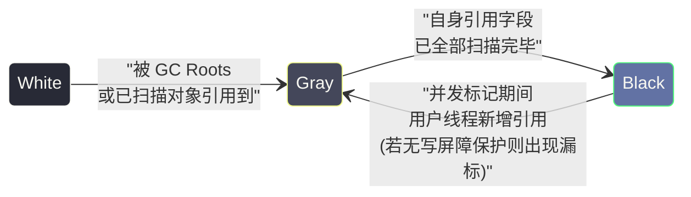
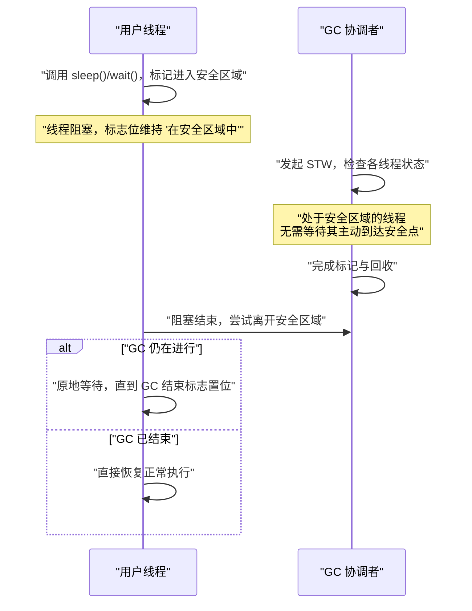

# 04 垃圾回收基础——可达性分析、安全点与安全区域

> [!abstract] 摘要
> GC 要回收内存，首先必须解决一个逻辑起点问题：**哪些对象是"垃圾"，哪些是"存活"的？** 这个看似简单的判断题，背后是工程实现上的巨大分歧。本文从两种判活算法讲起——**引用计数法**（直觉正确，但在多线程、循环引用、性能三个维度上都站不住脚，被 Java 彻底放弃）与**可达性分析法**（从 GC Roots 出发遍历引用图，是 HotSpot 唯一选择），深入 GC Roots 的精确边界与枚举成本，以及 Java 四种引用类型（强/软/弱/虚）如何把"对象是否存活"这件事的决定权部分交还给程序员。接着进入更难啃的工程问题：可达性分析必须在引用关系**冻结**的快照上进行，这要求所有 Java 线程在某个时刻整体暂停（Stop-The-World）；而"如何让线程在恰当的位置、以极低的代价暂停"，正是**安全点（Safepoint）**、**OopMap** 与**安全区域（Safe Region）** 三套机制共同要解决的问题。读完本文，你应该能够回答：为什么 JVM 不能像 CPython 一样用引用计数；GC 是如何在几毫秒内精确定位所有栈上引用而不做全栈线性扫描的；一个执行密集计算循环的线程为什么会拖慢整个进程的 GC 停顿；以及软引用、弱引用在生产代码中最容易被误用的两种方式。

---

## 第 1 章 垃圾的定义：从直觉到工程严格化

### 1.1 什么是"垃圾"

在 Java 中，**垃圾（Garbage）** 的工程定义是：**不再被任何活跃代码路径所引用、因此不可能再被程序访问到的堆对象**。这个定义有两层含义容易被忽略：

第一，"引用"指的是**程序运行时可以实际到达**的引用路径，不是对象曾经被谁指向过。一个对象即使在历史上被十个变量引用过，只要当前时刻没有任何活跃路径能到达它，它就是垃圾——GC 判活是一个**瞬时状态**问题，不是历史问题。

第二，"垃圾"不等于"没用的对象"。一个对象在业务语义上可能仍然"有用"（比如一份还没被消费的缓冲区数据），但只要程序中没有任何引用能找到它，它在 GC 眼中就是垃圾，回收后业务逻辑再也无法感知它的存在——这提示我们，内存泄漏的本质往往不是"对象不该存在"，而是"引用链忘了断开"。

这个定义直观，但工程实现上有一个尚未解决的核心挑战：**JVM 必须在程序高速运行的同时，用尽可能低的代价，持续、准确地判断哪些对象已经满足这个定义**。围绕这个挑战，历史上出现过两条完全不同的技术路线：

1. **引用计数（Reference Counting）**：为每个对象维护一个"被引用次数"计数器，计数降为 0 即视为垃圾，可以立即回收。
2. **可达性分析（Reachability Analysis）**：从一组"根对象"出发，遍历整个对象引用图，遍历不到的对象即为垃圾。

这两条路线不是对等的备选项，而是一条被 Java 认真评估后放弃、一条被采纳为唯一标准。理解"为什么放弃"比记住"用了哪个"更重要，因为背后的取舍逻辑会反复出现在后续章节（三色标记、写屏障、并发 GC）中。

### 1.2 引用计数法：直觉正确，但输在三个维度

**工作原理**：每个对象头部维护一个整型引用计数器 `refCount`。任何引用赋值都伴随计数变更：新增一条指向该对象的引用，`refCount++`；引用失效（重新赋值、作用域结束、显式置空），`refCount--`。当 `refCount == 0`，对象立即被回收，回收动作本身还要递归地对它所引用的其他对象做一次 `refCount--`（可能引发连锁回收）。

```
Object A → Object B（A 持有对 B 的引用）
B.refCount = 1

A 的引用消失 → B.refCount-- → B.refCount = 0 → B 立即被回收
```

**表面上的优势**：对象一旦不再被引用就立即释放，内存归还及时，理论上不存在"垃圾攒到一定量才集中回收"带来的长时间停顿。CPython 就是引用计数的典型代表，`sys.getrefcount()` 可以直接观察到这个计数器。

引用计数看起来足够优雅，但把它放进 JVM 的语境里检验，会在三个独立的维度上同时失败——任何一个失败都足以否决它，三个叠加在一起，说明这不是"细节可以打磨"的问题，而是**路线选择错误**。

**维度一：循环引用（Circular Reference）导致的永久泄漏。** 这是最常被提及、也最直观的缺陷：

```java
// 循环引用：A 引用 B，B 引用 A
class Node {
    Node next;
}

Node a = new Node();
Node b = new Node();
a.next = b;  // a → b，b.refCount = 1
b.next = a;  // b → a，a.refCount = 1

a = null;    // 栈上局部变量 a 消失，但 a 对象的 refCount 仍 = 1（被 b.next 引用）
b = null;    // 栈上局部变量 b 消失，但 b 对象的 refCount 仍 = 1（被 a.next 引用）

// 结果：
// a 对象：外部可达路径 = 0，但 refCount = 1（被 b 引用）→ 永远不会被回收
// b 对象：外部可达路径 = 0，但 refCount = 1（被 a 引用）→ 永远不会被回收
```

在 Java 的对象图中，循环引用不是罕见的边界情况，而是随处可见的正常结构：双向链表、树结构的父子双向指针、观察者模式中监听器与被观察对象互相持有、Spring 容器中允许的循环依赖 Bean、缓存条目里"值持有对键的反向索引"。如果 JVM 采用引用计数，这些结构一旦失去外部引用就会永久滞留在堆里——一种**静默的、编译器和运行时都无法察觉的内存泄漏**，只能靠堆 dump 分析事后发现。

**维度二：多线程环境下引用计数更新本身的代价。** 这一点在单线程语言（早期 Python）里不明显，但在 Java 这种默认多线程共享堆的语言里是致命的。任何一次引用赋值——哪怕只是把一个局部变量指向一个已存在的对象——理论上都需要对目标对象的 `refCount` 做一次**原子递增**；引用失效时要做一次**原子递减**。在多核 CPU 上，原子操作意味着缓存行的独占访问（cache line ownership），如果多个线程频繁读写同一个热点对象（比如一个被大量线程共享的配置对象、连接池对象），这些原子操作会造成剧烈的缓存一致性流量（cache coherence traffic），性能开销远高于"偶尔停顿一次做集中回收"。CPython 用全局解释器锁（GIL）规避了这个问题的多线程版本，但代价是牺牲了真正的多核并行能力——这个代价对 Java 是不可接受的。

**维度三：无法摊销的即时性开销。** 引用计数把"回收成本"从"集中的、可预测的 GC 停顿"打散成"分布在程序每一处赋值语句里的小额、持续开销"。这看起来像是把一笔大账拆成无数笔小账更公平，但实际上小额开销的**总和**通常比集中处理更高，因为集中处理可以利用批量化、并行化、局部性等优化手段（这正是本专栏后续 [[对象生命周期与GC/05 垃圾回收算法——标记清除、复制、标记整理与分代假说]] 中分代收集要解决的问题）；而分布式的引用计数更新是无法批量优化的逐条串行操作。

> [!warning] 生产避坑：引用计数不是"没有 STW 的银弹"
> 一个常见的误解是"引用计数没有 Stop-The-World，所以延迟更平滑"。这只对了一半：引用计数确实没有集中式的长停顿，但它把开销摊到了每一次引用赋值上，在高并发写多的场景下，这种摊销开销的总量和抖动（尤其是多线程竞争同一对象计数器时）未必比一次可预测的 GC 停顿更友好。CPython 在计数法之外还额外引入了分代式的循环垃圾回收器（`gc` 模块）来专门处理计数法解决不了的循环引用——这恰恰说明纯引用计数在工程上是不完备的，必须搭配其他机制才能用。Java 选择了更彻底的方案：直接放弃引用计数，全面转向可达性分析。

三个维度共同指向一个结论：引用计数在 JVM 这种多线程、对象图高度互联的运行时里，既不安全（循环引用泄漏），也不高效（原子操作竞争）。Java 从设计之初就选择了可达性分析——这个决定从根本上消除了循环引用问题，也为后续所有并发/并行 GC 算法的设计铺平了道路。

---

## 第 2 章 可达性分析——从根出发遍历引用图

### 2.1 基本思想

**可达性分析（Reachability Analysis）** 的核心思想是：从一组被称为 **GC Roots** 的根对象出发，沿着引用关系（`a.field → b`）向下遍历整张对象图，能被遍历到的对象都是存活的（"可达"），遍历结束后仍未被访问到的对象就是垃圾，可以回收。

```
GC Roots（根集合）
    ↓ 引用
  Object A （可达，存活）
    ↓ 引用
  Object B （可达，存活）
    ↓ 引用
  Object C （可达，存活）

  Object D  ←── 只被 Object E 引用
  Object E  ←── 只被 Object D 引用（循环引用，但均不可达）
  → D 和 E 都不可达，即为垃圾，可以回收
```

循环引用 D ↔ E 在可达性分析里完全不构成问题——只要 D 和 E 都不处于从任何 GC Root 出发的可达路径上，它们就会被判定为垃圾，无论它们互相引用多少次，也无论这个引用环有多复杂。这是可达性分析相对引用计数最本质的优势：**判活的标准从"局部计数"变成了"全局连通性"**，循环结构不再有特殊地位。

### 2.2 GC Roots 是什么

**GC Roots（垃圾回收根）** 是可达性分析的起点集合，代表"程序当前状态下肯定不是垃圾的对象"。在 HotSpot VM 中，GC Roots 主要包括以下几类：

| GC Root 类别 | 具体来源 | 为什么必须是根 |
|---|---|---|
| 虚拟机栈中的引用 | 每个线程每个栈帧的局部变量表（方法参数、局部变量） | 正在执行的方法随时可能使用它 |
| 本地方法栈中的引用 | JNI 代码通过 `NewGlobalRef`/`NewLocalRef` 创建的引用 | 本地代码持有的对象对 Java 侧不可见但确实存活 |
| 方法区中的静态变量 | 类的 `static` 字段 | 生命周期与类绑定，类未卸载则字段引用不能视为垃圾 |
| 方法区中的运行时常量 | 常量池中被引用的字符串常量、类常量 | 常量池随类存在，语义上恒定存活 |
| 被 `synchronized` 持有的对象 | 正在被同步块持有的锁对象 | 活跃的临界区意味着有线程正在使用它 |
| JVM 内部引用 | 基本类型 Class 对象、常驻系统类、预置异常实例、`ClassLoader` 本身 | JVM 运行时基础设施依赖它们 |

**虚拟机栈中的引用**是最常见、也是理解安全点机制的关键一类：

```java
public void process() {
    User user = new User();    // user 是局部变量，位于虚拟机栈的局部变量表，是 GC Root 候选
    doSomething(user);         // user 对象在 process() 方法执行期间持续可达
}
// process() 返回后，栈帧被弹出销毁，user 这条引用路径消失，User 对象随即可能变为垃圾
```

**方法区中的静态变量引用**是长生命周期泄漏最常见的源头：

```java
public class Cache {
    // static 字段本身是 GC Root，cacheMap 引用的对象只要 Cache 类未卸载就永远可达
    private static Map<String, Object> cacheMap = new HashMap<>();
}
```

这也解释了为什么"静态 Map 做缓存"是 Java 中最经典的内存泄漏模式之一——只要不主动 `remove`，条目永远处于 GC Roots 的直接可达范围内，GC 束手无策，因为从 GC 的视角看，这些对象**确实**是存活的，它没有任何依据判断这些数据"业务上已经过期"。这也是第 3 章要引入软引用/弱引用的核心动机之一。

**JVM 内部的引用**中有几个反直觉的例子值得单独说明：`NullPointerException`、`ArrayIndexOutOfBoundsException` 等 JVM 会大量抛出的异常，其中一部分实例是 JVM 提前创建好、反复重用的（避免每次抛异常都新建对象和填充堆栈轨迹带来的开销），这些常驻实例本身就是 GC Root 的一部分；`ClassLoader` 对象作为根的这一事实，是"类加载器内存泄漏"（比较典型的场景是 Web 容器热部署后旧版本类无法卸载）的根本原因——只要类加载器本身可达，它加载的所有类、类的静态字段、字段引用的对象就都间接可达，形成一条极难察觉的长引用链。这类问题会在 [[类加载器/03 类加载器与双亲委派机制]] 中结合具体案例展开。

> [!info] 核心概念：GC Roots 的边界
> 记忆 GC Roots 的方法：**凡是"活跃线程正在使用的"、"类级别生命周期绑定的"、"JVM 内部必须常驻的"，就是 GC Root**。GC Roots 代表程序当前仍然"需要"的对象集合，是所有存活判定的唯一入口——不存在"介于根和非根之间"的中间状态，一个对象要么可以从某个根出发被到达，要么不能。

### 2.3 GC Roots 枚举的工程代价：为什么不能"扫一遍栈"了事

可达性分析的第一步是找到所有 GC Roots，其中虚拟机栈引用这一类天然存在一个工程难题：**JVM 怎么知道一个栈帧里，哪几个 Slot 存的是对象引用，哪几个是普通的 int/long？** 栈帧里的数据在二进制层面看不出类型差异，一个 64 位的值既可能是一个堆地址，也可能只是一个很大的 `long` 计算结果。

如果没有额外的元信息，唯一稳妥的做法是**保守式扫描**：把每一帧里所有"看起来像"合法堆地址的值都当成引用来处理。这正是很多不带类型系统的语言（C/C++ 上的 Boehm GC）采用的方案，但它有两个代价：一是可能把普通整数误判为引用，让本该回收的对象被误保留（虚报存活，不影响正确性但降低回收效率）；二是因为不能确定一个值到底是不是"真正的指针"，GC **完全不能移动对象**——一旦移动，那些被误判为指针的整数值就会指向错误的地址，程序直接崩溃。这就排除了压缩、复制这类需要挪动对象的高效算法。

HotSpot 的选择是反过来：**在编译期就把每个栈帧的类型信息精确记录下来**，运行时不用猜，直接查表。这张表就是第 5 章要详细展开的 **OopMap**。有了 OopMap，栈扫描从"逐帧逐字节猜测"变成"逐帧查表读取固定的引用槽位列表"，速度和准确性都得到保证，也为对象移动（复制算法、标记-整理算法）扫清了障碍。这是理解本文后半部分（STW、安全点、OopMap、安全区域）为什么会成为一个整体的关键线索：**它们都是为了让"精确找到 GC Roots"这件事又快又对**。

### 2.4 可达性分析的三色标记模型

可达性分析在并发/并行场景下通常用**三色标记（Tri-color Marking）** 模型来描述遍历状态：

- **白色（White）**：尚未被 GC 访问到的对象。分析开始时所有对象都是白色。分析结束后仍是白色的对象，就是垃圾。
- **灰色（Gray）**：自身已被标记为存活，但它引用的对象还没有被全部扫描完——灰色对象是遍历过程的"工作队列"。
- **黑色（Black）**：自身已标记为存活，并且它引用的所有对象也都已扫描完毕——黑色对象是"已完全处理"的存活对象。

标准的遍历流程：

1. 将所有 GC Roots 直接引用的对象标记为灰色，放入工作队列；
2. 从工作队列取出一个灰色对象，扫描它的所有引用字段：把发现的白色引用对象标记为灰色（加入队列），然后把当前对象本身标记为黑色；
3. 重复步骤 2，直到工作队列为空（不再存在灰色对象）；
4. 分析结束：黑色对象 = 存活，白色对象 = 垃圾。



三色模型在**单线程 STW 式**的可达性分析中只是一个描述工具，遍历过程中用户线程完全停止，白/灰/黑三种状态之间不会有意外跳变，结果一定正确。但一旦引入**并发标记**——也就是 GC 线程和用户线程同时运行，用户线程随时可能修改对象引用关系——三色模型就从"描述工具"变成了"必须严格维护的不变式"。第 4 章开头描述的"对象丢失"问题，用三色语言精确表述就是：一个已经变黑（认为已扫描完毕）的对象，被用户线程新增了一条指向白色对象的引用，同时该白色对象唯一的其他引用被切断——GC 不会再重新扫描黑色对象，于是这个白色对象永远不会被重新标记为灰色，最终被误判为垃圾并回收，而它实际上是可达的。

这个问题在并发标记的 GC 中通过**写屏障（Write Barrier）** 解决：在用户线程执行引用赋值的前后插入一段由 GC 控制的代码，用来记录"发生了可能破坏三色不变式的赋值"，具体的记录策略又分为**增量更新（Incremental Update）**（CMS 采用，记录新增的引用关系，重新扫描发出赋值的对象）和**原始快照（Snapshot At The Beginning, SATB）**（G1、Shenandoah 采用，记录被覆盖丢失的旧引用，保证快照开始时刻可达的对象都不会被漏标）。这部分内容是并发 GC 设计的核心难点，将在 [[对象生命周期与GC/06 经典垃圾回收器——Serial、Parallel、CMS 深度剖析]] 和 [[对象生命周期与GC/07 G1 收集器——Region 化内存与混合回收]] 中结合具体收集器展开，本文只需要建立"并发标记为什么需要写屏障"这个因果链条。

---

## 第 3 章 四种引用类型——把判活的决定权部分交还给程序员

### 3.1 为什么需要不止一种引用

在 JDK 1.2 之前，Java 只有一种引用语义：**强引用（Strong Reference）**——只要一条强引用存在，对象就绝不会被 GC 回收，没有任何例外。这个语义在绝大多数场景下都是正确且必要的（否则程序无法保证"我持有的对象不会突然消失"这个基本假设），但它有一个盲区：**它无法表达"这个对象有用，但没用到值得为它冒 OOM 风险"这种中间状态**。

典型场景是**内存敏感的缓存**：你希望缓存对象在内存充裕时尽量留在内存里加速访问，但一旦内存紧张，宁可让缓存失效走一次回源查询，也不要让整个进程因为缓存占满堆而 OOM。用强引用实现这样的缓存做不到——除非你自己实现一套复杂的 LRU 淘汰逻辑主动 `remove`，但那本质上是应用层在猜测 GC 的内存压力状态，猜测不准就会两头都不讨好（猜保守了缓存命中率低，猜激进了照样 OOM）。

JDK 1.2 在 `java.lang.ref` 包中引入了软引用、弱引用、虚引用三种新语义，本质上是把"这个对象在内存压力下是否值得保留"这个判断权，部分地从纯粹的可达性判断（全有或全无）下放给了 GC 的运行时状态和程序员的显式声明，形成了一个从"绝不回收"到"完全不影响回收但可以收到通知"的强弱梯度。

### 3.2 强引用（Strong Reference）

**就是普通的 `new` 赋值**，不需要任何特殊语法：

```java
Object obj = new Object();  // 强引用
```

**GC 行为**：只要强引用存在，对象**永远不会被 GC 回收**，即便即将发生 OOM 也不例外——JVM 宁可抛出 `OutOfMemoryError` 终止分配请求，也绝不会为了腾出空间而回收一个仍有强引用指向它的对象。这是 Java 内存模型对开发者最基本的承诺，一旦被打破，几乎所有依赖对象生命周期的代码都会变得不可预测。

**"消除"强引用**：将引用变量重新赋值（最常见是赋为 `null`），使对象在当前作用域内不再可达。需要注意的是，赋 `null` 本身不会触发回收，它只是让这条引用路径失效，对象是否被回收仍取决于是否存在其他可达路径以及下一次 GC 何时发生。

### 3.3 软引用（Soft Reference）

**描述一些有用但非必需的对象**：

```java
SoftReference<byte[]> softRef = new SoftReference<>(new byte[1024 * 1024]);
byte[] data = softRef.get();  // 可能返回 null（如果对象已被 GC 回收）
```

**GC 行为**：当 JVM 内存充足时，软引用指向的对象不会被回收；**当 JVM 面临 OOM 风险时（可用内存即将耗尽），软引用对象会在抛出 `OutOfMemoryError` 之前被优先回收**——也就是说，软引用给了 GC 一个"最后关头可以牺牲"的对象池，用它们换取继续运行下去的内存空间。

**HotSpot 的具体回收策略**：软引用不是"内存不足就无差别全部清空"，而是带有一定的 LRU 倾向——HotSpot 会记录软引用对象自上次被访问（调用过 `get()`）以来经过的时钟周期，结合当前堆的空闲比例，决定是否在下一次 Full GC 时回收它。控制这个策略的参数是 `-XX:SoftRefLRUPolicyMSPerMB`（默认值约为 1000，单位毫秒/MB），含义是：**每 1 MB 空闲堆空间，能为一个软引用对象多续命大约 1000 毫秒的"未被访问时间"**。空闲堆越大，软引用能撑得越久；空闲堆越紧张，软引用被清理得越快。这个策略只在 Full GC（或触发了完整堆扫描的收集周期）时生效，Minor GC 通常不主动清理软引用。

**典型用途**：内存敏感的缓存——图片缩略图缓存、页面渲染缓存、反射元数据缓存等。当内存不足时，GC 自动清理这些缓存对象，业务代码只需要判断 `get()` 是否返回 `null`，回源重建即可，实现"优雅降级"而不是硬性 OOM。

> [!warning] 生产避坑：SoftReference 不是"确定性 LRU 缓存"
> 一个常见的误用是把 `SoftReference` 当成一个开箱即用的 LRU 缓存实现来使用，期望它"内存紧张时按最久未使用的顺序精确淘汰"。实际上软引用的回收时机完全由 JVM 的内存压力和 GC 触发时机决定，不受应用层控制，也不保证在真正 OOM 之前有充足的响应时间去回收——在某些堆配置下（比如老年代持续增长很快），软引用甚至可能因为一次 Full GC 集中回收而造成命中率骤降，产生"缓存雪崩"效应。生产级缓存组件（Caffeine、Guava Cache）普遍选择自己实现基于访问频率/时间的显式淘汰策略，而不是依赖 `SoftReference`，只在需要"内存压力兜底"的场景才会附加软引用语义。把软引用当成缓存淘汰算法的替代品，而不是兜底安全网，是这里最容易踩的坑。

### 3.4 弱引用（Weak Reference）

**描述非必需的对象，生命周期比软引用更短、更可预测**：

```java
WeakReference<Object> weakRef = new WeakReference<>(new Object());
Object obj = weakRef.get();  // 可能返回 null
```

**GC 行为**：**只要发生一次 GC（不区分 Minor 还是 Full），弱引用指向的对象就会被回收**（前提是没有其他强引用指向该对象）——弱引用完全不参与"是否内存紧张"的判断，它比软引用更弱、更激进。

**典型用途一：`WeakHashMap`**。它的 key 使用弱引用持有，当 key 对象不再被任何强引用持有时，下一次 GC 会清空这条弱引用，`WeakHashMap` 在后续操作（`get`/`put`/`size` 等，内部会调用 `expungeStaleEntries()`）中会把对应条目整体移除，从而避免"key 对象已经没人用了，但 Map 里的条目还在，造成内存泄漏"。

**典型用途二**：[[并发编程/JUC工具/15 ThreadLocal 的实现原理与内存泄漏——线程封闭的正确姿势]] 中 `ThreadLocalMap.Entry` 继承自 `WeakReference<ThreadLocal<?>>`，也就是说 **key（`ThreadLocal` 实例本身）是弱引用**，而 **value（业务对象）仍然是强引用**。这个设计经常被误解，值得单独澄清：

> [!warning] 生产避坑：弱引用只解决了一半的 ThreadLocal 泄漏问题
> 很多人以为"`ThreadLocalMap` 的 key 是弱引用，所以 `ThreadLocal` 不会内存泄漏"，这是不准确的。弱引用只保证了**当外部对 `ThreadLocal` 变量的强引用消失后，key 会在下次 GC 时变成 null**，形成所谓的"stale entry"（陈旧条目）。但 **value（`set()` 进去的业务对象）仍然是强引用**，只要这个 `Entry` 数组条目本身还在 `ThreadLocalMap` 里，value 就不会被回收。而 `ThreadLocalMap` 只有在被主动调用 `get()`/`set()`/`remove()` 触发内部清理逻辑，或者显式调用 `ThreadLocal.remove()` 时，才会真正清扫掉这些 stale entry。如果一个线程被线程池复用、长期不再访问某个已经过期的 `ThreadLocal`，这个 value 对象可以在弱引用机制"生效"之后依然长期滞留在内存里——这正是 `ThreadLocal` 内存泄漏在生产环境中最常见的真实成因，而不是"忘了用弱引用"。正确姿势永远是：用完 `ThreadLocal` 后在 `finally` 块里显式调用 `remove()`，不要指望弱引用机制自动兜底。

### 3.5 虚引用（Phantom Reference）与引用队列

**最弱的引用，程序完全无法通过它拿到对象本身**：

```java
ReferenceQueue<Object> queue = new ReferenceQueue<>();
PhantomReference<Object> phantomRef = new PhantomReference<>(new Object(), queue);
phantomRef.get();  // 永远返回 null！虚引用无法访问对象本身
```

**GC 行为**：虚引用**完全不影响 GC 的回收决定**——就好像这条引用不存在一样，对象该被回收就会被回收。但虚引用有一个强引用、软引用、弱引用都不具备的特性：**当对象即将被真正回收（内存被实际释放）之前，JVM 会把这个虚引用对象放入它关联的 `ReferenceQueue`**，程序通过轮询或阻塞监听这个队列，可以感知到"某个对象已经走到生命周期终点"这一事件，并在那个时刻执行确定性的清理逻辑。

`get()` 恒为 `null` 这个设计不是缺陷,而是有意为之：如果虚引用能拿到对象本身，程序理论上可以在"对象已经被判定要回收"之后又通过这条引用重新让对象变得可达（对象复活），这会让 GC 的回收判定失去确定性,并带来类似 `finalize()` 的资源泄漏和安全隐患（见第 8 章）。彻底禁止 `get()` 返回对象,就从设计上杜绝了这种复活的可能性,让"对象生命周期终结"这件事变得**单向且不可逆**。

**引用队列（`ReferenceQueue`）的通用机制**：软引用、弱引用、虚引用在构造时都可以关联一个 `ReferenceQueue`，当 GC 判定对应对象需要被回收（软/弱引用是判定要清空引用本身，虚引用是判定对象内存要被真正释放）时，JVM 会把这个 `Reference` 对象（而不是原对象）加入队列。程序可以起一个专门的线程，通过 `queue.remove()`（阻塞）或 `queue.poll()`（非阻塞）持续消费这个队列,统一执行清理逻辑——这是一种**比 `finalize()` 更安全、更可控**的资源回收观察机制,因为清理逻辑运行在你自己控制的线程里,而不是 JVM 内部一个不透明的 `Finalizer` 线程。

**典型用途一**：`DirectByteBuffer` 的堆外内存清理。JDK 9 之前使用 `sun.misc.Cleaner`（继承自 `PhantomReference`），JDK 9 之后统一迁移到公开 API `java.lang.ref.Cleaner`。核心思路一致：`DirectByteBuffer` 对象本身在堆内,但它背后申请的是一块堆外内存,GC 管不到堆外内存,只能管住 `DirectByteBuffer` 这个堆内对象。当 `DirectByteBuffer` 对象被判定要回收时，与它关联的虚引用触发回调，回调里执行 `unsafe.freeMemory(address)` 释放真正的堆外内存,从而把堆内对象的生命周期和堆外资源的生命周期绑在一起。

```java
// java.lang.ref.Cleaner 的典型用法（JDK 9+，替代已废弃的 finalize）
public class ResourceHolder implements AutoCloseable {
    private static final Cleaner CLEANER = Cleaner.create();

    // State 不能持有 ResourceHolder 本身的强引用，否则对象永远不可达为"待回收"状态
    private static class State implements Runnable {
        private long nativeHandle;
        State(long handle) { this.nativeHandle = handle; }
        @Override public void run() {
            // 对象被回收前的最后一次机会：释放原生资源
            NativeLib.release(nativeHandle);
        }
    }

    private final State state;
    private final Cleaner.Cleanable cleanable;

    public ResourceHolder() {
        long handle = NativeLib.acquire();
        this.state = new State(handle);
        // 注册清理动作：ResourceHolder 被 GC 回收时，state.run() 会被自动调用
        this.cleanable = CLEANER.register(this, state);
    }

    @Override
    public void close() {
        cleanable.clean(); // 主动触发清理，幂等，可以提前于 GC 执行
    }
}
```

**典型用途二**：资源泄漏的兜底监控。很多连接池、文件句柄池会用虚引用监控"业务代码是否忘记调用 `close()`"——如果一个连接对象被 GC 回收时,通过虚引用队列发现它还没有被业务代码显式关闭,就可以在监控日志里打一条"疑似资源泄漏"的告警,这是排查"忘记 close 导致连接池耗尽"类问题的常见手段（Netty 的 `ResourceLeakDetector` 就是基于类似思路,底层使用弱引用配合采样机制实现）。

### 3.6 四种引用的对比

| 引用类型 | 类 | GC 回收时机 | `get()` 返回 | 典型用途 | 典型误用 |
| :--- | :--- | :--- | :--- | :--- | :--- |
| **强引用** | 直接赋值 | 永不（只要引用存在） | 对象本身 | 绝大多数场景 | 忘记置空导致的"人为泄漏"（容器长期持有） |
| **软引用** | `SoftReference` | 临近 OOM 前 | 对象或 `null` | 内存敏感缓存 | 当作确定性 LRU 缓存使用 |
| **弱引用** | `WeakReference` | 任意一次 GC | 对象或 `null` | `WeakHashMap`、`ThreadLocalMap.Entry` 的 key | 误以为弱引用能自动清理 value 强引用 |
| **虚引用** | `PhantomReference` | 任意一次 GC（不影响判定） | 永远 `null` | 资源回收回调、堆外内存释放、泄漏监控 | 在回调中持有原对象强引用导致复活 |

四种引用类型的强弱关系不是孤立的四个选项，而是一条连续的梯度：强引用完全阻止回收，软引用在内存压力下让步，弱引用在任意 GC 时让步，虚引用完全不参与判定只提供事后通知。选择哪一种，本质上是在回答"这个对象的存活权重，应该由谁——业务逻辑、GC 的内存压力判断，还是完全不设权重——来决定"。

---

## 第 4 章 Stop-The-World——GC 的世界暂停

### 4.1 为什么需要 STW

可达性分析必须在一个**一致性快照（Consistent Snapshot）** 上进行——分析过程中，对象之间的引用关系不能发生变化,否则遍历得到的结论就不再对应任何一个真实存在过的程序状态。

具体设想一个并发标记的场景：GC 正在遍历对象图,已经扫描完对象 A（标记为黑色,意味着"A 的所有引用字段已确认扫描完毕,不会再被重新访问"）,当时发现 A 不引用对象 X。就在这之后,用户线程执行了两步操作：把 A 的某个字段重新指向 X,同时把此前唯一持有 X 的另一个引用置空。这两步操作发生在 GC 已经"放过"A 之后,GC 不会知道要重新扫描 A,于是永远不会发现"X 现在通过 A 可达"这个新事实；而 X 唯一的旧引用又已经被切断——最终 X 在 GC 眼里全程呈现为白色（不可达）,会被当作垃圾回收,但它在程序的真实语义中始终是可达的。

这个问题在业界称为**"对象丢失"（Object Lost）问题**,更常用的说法是**"漏标"**。它不是概率性的偶发 bug,而是三色标记模型在并发场景下的**结构性风险**——只要标记过程和用户线程赋值操作交织执行,且没有额外机制介入,漏标就一定会在某个时间点发生。

最彻底、最简单的解决方案就是本文标题里的 STW：**在分析期间暂停所有 Java 线程**,让引用关系在分析窗口内保持冻结,可达性分析的结论天然对应一个真实存在过的、静止的程序状态,不存在漏标可能。这也是为什么早期的 Serial、Parallel 收集器选择"整个标记阶段完全 STW"——不是因为它们设计得原始,而是因为这是唯一不需要任何额外并发控制机制就能保证正确性的方案。

STW 的代价是显而易见的：暂停期间应用程序完全无响应,对外表现为**延迟抖动**——用户可能感受到某个请求突然卡顿几十毫秒甚至数百毫秒。如何在保证正确性的前提下**缩短 STW 时间、缩小 STW 的范围**,是几乎所有现代垃圾回收器（CMS、G1、ZGC、Shenandoah）演进的主线,后续章节 [[对象生命周期与GC/07 G1 收集器——Region 化内存与混合回收]]、[[对象生命周期与GC/08 ZGC——亚毫秒停顿的着色指针与读屏障]] 都会围绕"怎样在并发标记的同时,用写屏障而不是 STW 来避免漏标"这个主题展开。

### 4.2 精确式 GC 与保守式 GC

STW 之后,GC 首先要做的是找到所有 GC Roots,尤其是虚拟机栈中的对象引用。第 2.3 节已经指出这里有两种策略：

**保守式 GC（Conservative GC）**：把栈上所有"看起来像"合法堆地址的值都当成引用来处理,不需要类型系统配合,实现简单,但存在误判和无法移动对象两个代价（细节见 2.3 节）。

**精确式 GC（Exact/Precise GC）**：JVM 在编译期就确切知道每个栈帧里哪些 Slot 是引用类型、哪些是基本数据类型,运行时通过 **OopMap** 直接查表得到精确结果,不需要猜测。

**HotSpot 全面采用精确式 GC + OopMap**,这不是一个孤立的技术选型,而是后续所有高效回收算法（复制算法、标记-整理算法都需要移动对象,详见 [[对象生命周期与GC/05 垃圾回收算法——标记清除、复制、标记整理与分代假说]]）能够成立的**前提条件**——没有精确式 GC,对象根本不能安全移动。

---

## 第 5 章 OopMap——精确 GC 的数据结构

### 5.1 什么是 OopMap

**OopMap（Ordinary Object Pointer Map）** 是 HotSpot 在类加载解析、字节码解释准备和 JIT 编译时生成的一种元数据,记录了**特定代码位置上，当前栈帧（以及活跃寄存器）里哪些槽位存放的是对象引用（oop）**。

"Oop"是 HotSpot 内部对 Java 对象引用（本质上是一个指向堆对象的指针）的称呼（Ordinary Object Pointer,区别于 `Klass*` 这类元数据指针）。OopMap 就是"引用所在位置的地图",GC 拿着这张地图,不需要理解栈帧里每个字节的业务含义,只需要按图索骥读取标记为引用的槽位。

```
方法 foo() 在偏移量 0x0042 处（某个安全点）对应的 OopMap：
Slot 0: reference（this 引用）
Slot 1: int（非引用，跳过）
Slot 2: reference（局部变量 user）
Slot 3: long（非引用，跳过）
寄存器 rbx: reference（编译后可能驻留在寄存器中的引用）
...
```

GC 在 STW 之后,遍历所有线程的虚拟机栈,对每一帧根据它当前的执行位置（PC）查询对应的 OopMap,就能直接、准确地找出该帧里所有的对象引用,汇入 GC Roots 集合,交给可达性分析。这一步的时间复杂度只取决于"活跃栈帧数 × 每帧引用槎位数",与堆的大小完全无关——这是 GC Roots 枚举能做到"通常远快于标记阶段本身"的根本原因。

### 5.2 OopMap 的维护

**解释执行时**：字节码解释器本身知道每条指令操作的数据类型（字节码本身携带类型信息,比如 `aload` 明确是加载引用,`iload` 明确是加载 int）,因此解释器可以在方法调用、循环回跳等特定位置动态更新等价的引用位置信息,不需要提前生成静态表。

**JIT 编译时**：这是 OopMap 真正体现价值的场景。C1/C2 编译器把字节码翻译成机器码后,原始的类型信息（哪个寄存器存引用）在纯机器码层面已经完全丢失——一段机器码看起来只是若干条 `mov`、`add`、`cmp` 指令,无法从指令本身反推出寄存器里存的是引用还是整数。为了让 GC 仍然能在编译后的代码里精确找到引用,C1/C2 会在生成机器码的同时,针对每一个**安全点**位置（下一章的主题）单独生成一份 OopMap,记录"如果 GC 恰好在这个位置暂停线程,此刻哪些寄存器、哪些栈槎位是引用"。这些 OopMap 数据作为编译产物的一部分,随编译后的代码一起存放在 CodeCache 中。

这里还有一个值得点破的工程权衡：**如果给每一条机器指令都生成一份 OopMap,数据量会随代码体积线性膨胀,占用大量元空间,同时每次寄存器分配、指令重排都要同步维护这份表,编译期开销也会显著增加**。HotSpot 的解法是只在安全点位置生成 OopMap——这把"OopMap 的存储和维护成本"和"安全点的稀疏程度"绑定在了一起,也解释了为什么下一章要花大量篇幅讨论"安全点应该设在哪里"：安全点位置选得越稀疏,OopMap 越少、越省内存,但线程从"准备暂停"到"真正暂停在安全点"的等待时间就可能越长；选得越密集,反过来。这是一个典型的空间/时间权衡,不存在免费的解。

### 5.3 OopMap 与去优化（Deoptimization）的关联

一个容易被忽略但很有实际意义的细节：JIT 编译后的代码在运行时可能因为类型假设被打破（比如做了内联缓存优化,后来发现调用点出现了新的子类）而被**去优化（Deoptimization）**,退回到解释执行。去优化发生时,JVM 需要把编译后代码此刻在寄存器和栈槎位里的状态,重新映射还原成解释器能理解的栈帧结构——这个映射过程同样严重依赖 OopMap（以及与之配套的 `DebugInfo`）来确定哪些位置是引用、需要在还原后的解释器栈帧里放到正确的局部变量槎位。这说明 OopMap 不仅服务于 GC,也是 HotSpot 分层编译体系里"编译代码"和"解释执行"之间能够无缝切换的基础设施之一,这部分内容会在专栏的执行引擎系列文章中详细展开。

---

## 第 6 章 安全点（Safepoint）——GC 暂停的合适位置

### 6.1 为什么不能在任意位置暂停

STW 需要暂停所有 Java 线程,但线程**不能在代码的任意一条指令处**被暂停。原因有两个：一是刚才讨论的 OopMap 只在特定位置（安全点）生成,如果线程恰好停在两个安全点之间的某条指令上,GC 根本没有对应的 OopMap 可查,无法准确枚举这一帧的引用；二是某些代码序列代表一个逻辑上不可分割的原子操作（比如对象分配过程中"申请内存 - 初始化对象头"的中间状态,或者某些复合字节码的展开过程）,如果线程恰好停在这样的中间状态,堆的内部一致性可能被破坏。

JVM 的做法是：**只在程序中特定的"安全点"（Safepoint）处允许线程暂停**。在安全点上,JVM 保证 OopMap 是完整且准确的,且线程一定不处于任何原子操作的中间状态。

### 6.2 安全点的设置原则

并非每一条字节码指令都是安全点。如果处处都设置安全点,会同时带来两个副作用：OopMap 数据量会随之爆炸性增长（上一节已分析）,同时每条指令都要额外判断"是否需要暂停",带来持续的运行时开销,与"绝大多数时候并不需要暂停"这个事实严重不成比例。

HotSpot 选择在以下几类"具有代表性、出现频率适中"的位置设置安全点：

- **方法调用前后**：调用开销本身已经不小,插入一次轻量检查的边际成本很低；
- **循环回跳（loop back-edge）处**：这一点专门为了防止一段长时间执行、内部没有方法调用的循环，迟迟不给 GC 暂停的机会；
- **异常抛出点**：异常处理路径本身涉及栈展开,是天然的检查点；
- **JIT 编译代码中的显式轮询指令**：C1/C2 在生成机器码时,会在上述几类位置插入一条专门的安全点轮询指令。

**安全点轮询（Safepoint Polling）机制**：JVM 如何让所有线程"感知到"现在需要在安全点暂停？答案不是发送中断信号,而是一个非常巧妙的**内存页技巧**：

HotSpot 预先分配一个特殊的内存页（polling page）。正常运行状态下,这个页是**可读**的；当 JVM 需要发起全局 STW 时,把这个页的访问权限改为**不可读**（通过操作系统的内存保护机制,如 `mprotect`）。

每个线程经过安全点位置时,都会执行一条极简单的轮询指令（本质上是一条 `test [address], eax` 这样的内存读操作)：

- 如果轮询页仍可读（正常状态）：读操作正常返回,线程无感知地继续执行,几乎没有额外开销；
- 如果轮询页已被置为不可读（GC 请求 STW 已发出）：读操作触发操作系统级的段错误（`SIGSEGV`）,JVM 预先注册的信号处理器捕获这个异常,把当前线程挂起在这个安全点上,等待 GC 完成后再恢复执行。

这个设计的精妙之处在于：**正常路径的开销被压缩到极限——只是一条内存读指令,没有函数调用,没有锁,没有系统调用**。只有在真正需要 STW 的那一刻,才会付出一次"制造并捕获段错误"的额外开销,而这原本就是要付出的暂停成本的一部分。这是一种典型的"把公共路径优化到极致,把罕见路径的代价转移过去"的设计思路。

### 6.3 主动式中断 vs 抢先式中断

到达安全点有两种理论上的实现路线：

| 实现方式 | 原理 | 实现复杂度 | HotSpot 是否采用 |
|---|---|---|---|
| **抢先式中断（Preemptive Suspension）** | GC 直接借助操作系统能力中断所有线程,检查当前 PC 是否落在安全点上,不是则恢复运行直到跑到安全点 | 高（依赖平台相关的线程控制原语,且检查逻辑复杂） | 基本不采用 |
| **主动式中断（Voluntary Suspension）** | 设置一个全局标志（本质是轮询页的可读/不可读状态）,线程在经过安全点时主动检查该标志,发现需要暂停则自行挂起 | 低（只需要在编译期插入统一的轮询指令) | 采用 |

HotSpot 选择主动式中断,核心原因是它把"判断当前位置是否安全"这个逻辑,从运行时的动态检测（抢先式需要在中断发生的瞬间反查当前 PC 是否合法）,转移到了编译期静态插入（主动式只需要保证插入轮询指令的位置本身就是安全点,运行时不需要再判断）。这大幅简化了实现,也是轮询页技巧能够做到近乎零开销的前提。

### 6.4 到达安全点的延迟与"安全点偏置"问题

STW 需要等**所有**线程都到达安全点才能真正开始 GC 工作,这意味着 STW 的实际停顿时间由最慢到达安全点的那个线程决定。如果某个线程正在执行一段"没有安全点检查点"的长循环——最典型的例子是纯整数计算、编译器判定为"可数循环（counted loop）"且循环体内没有方法调用的内层循环——它可能需要相当长的时间才能到达下一个安全点,导致其他早已到达安全点、正在等待的线程被迫多等一段时间。

这不是一个理论假设,而是 HotSpot 历史上一个真实存在过的已知问题（社区称为"safepoint bias"）：出于性能考虑,早期的 C2 编译器对**可数循环**（编译期能确定循环次数上界的循环,比如 `for (int i = 0; i < n; i++)`）在循环回跳处**不插入**安全点轮询,理由是这类循环"理应很快结束"。但如果 `n` 是一个运行时才能确定的很大值,这个假设就不成立,循环会执行很长时间而完全不给 GC 任何暂停机会。JDK 后续版本通过 `-XX:+UseCountedLoopSafepoints` 提供了在可数循环中也插入安全点的选项,缓解了这类场景下的 STW 延迟问题（该问题与 JDK 内部编号为 JDK-8022585 的改进相关,具体是否默认开启随 JDK 版本演进,升级前建议查阅目标版本的 Release Notes 确认默认行为）。

**诊断工具**：JVM 参数 `-XX:+PrintGCApplicationStoppedTime`（JDK 8 及更早）或 `-Xlog:safepoint`（JDK 9+ 统一日志框架下的等价方案）可以打印每一次 STW 的详细停顿时间,其中会区分两段耗时：**Time To Safepoint（TTSP，等待所有线程到达安全点的时间）** 和 **GC 实际执行时间**。如果观察到 TTSP 占比异常高,通常说明存在长时间运行、没有安全点检查的代码路径（典型嫌疑：紧凑的数值计算循环、耗时的 JNI 调用——JNI 调用期间线程运行在本地代码里,完全不受 JVM 安全点轮询机制控制,只能在调用返回、重新进入 JVM 管理的代码时才被检查）。

### 6.5 安全点的可观测性

生产环境排查"GC 停顿时间比标记/清除阶段耗时之和还长"这类问题时,安全点往往是被忽视的一环。除了上面提到的 `-Xlog:safepoint`,还可以结合 `jstack` 观察线程当前状态（虚拟机内部会标注线程是否处于 `_thread_blocked` 或安全点等待状态)，以及 async-profiler 一类工具的安全点相关采样模式,定位具体是哪一段代码长期占用某个线程而不给安全点轮询的机会。这类问题的修复思路通常不是调整 GC 参数,而是审查代码——把长时间运行的紧密循环拆分,或者减少超长的 JNI 调用持续时间。

---

## 第 7 章 安全区域（Safe Region）——睡眠线程的解决方案

### 7.1 安全点机制的盲区

安全点机制的前提假设是**线程始终在运行 Java 代码**——只有正在运行,才会持续地"经过"安全点位置,JVM 才能等待它主动到达并暂停。但现实中大量线程并不处于这个假设覆盖的状态：

- **阻塞在 `Thread.sleep()`、`Object.wait()` 中的线程**：它们没有在执行 Java 字节码,自然也不会经过任何安全点检查点；
- **阻塞在 IO 等待、被操作系统调度挂起的线程**：同样不在 JVM 管理的执行路径上。

对这些线程,JVM 不能指望它们"主动跑到安全点"——它们压根没在跑。如果 GC 傻等这些线程"醒来经过安全点",STW 可能被无限期拖长,直到 `sleep` 到期或 `wait` 被唤醒,这显然不可接受。

### 7.2 安全区域的定义

**安全区域（Safe Region）** 是代码执行路径中的一段**区间**（不是一个点),在这段区间内,可以保证**引用关系不会发生任何变化**——既然状态是静止的,GC 就可以在这段区间内的任意时刻安全地对其进行扫描,不需要等待线程"主动配合"。

最典型的安全区域就是线程阻塞在 `Object.wait()`、`Thread.sleep(long)`、`Object.wait(long timeout)` 内部的整个期间——线程在这些调用内部不会执行任何用户代码，不可能修改引用，从进入到退出的整段区间都满足安全区域的定义。

### 7.3 安全区域的工作流程

1. **进入安全区域时**：线程执行到 `sleep`/`wait` 等阻塞调用的入口,先把自己标记为"已进入安全区域"（设置一个状态标志),然后才真正进入阻塞状态；
2. **GC 发起 STW 时**：不需要等待处于安全区域标志下的线程主动响应——它们的引用状态已知是静止的,GC 可以直接把它们视为"已经安全暂停",跳过等待；
3. **线程准备离开安全区域时**（比如 `sleep` 到期、被 `notify` 唤醒）：必须先检查全局是否正在进行 STW（是否有 GC 请求处于活跃状态)：
   - 若当前没有 GC 在进行,线程直接标记"离开安全区域",恢复正常执行；
   - 若当前正有 GC 在进行,线程必须**原地等待**,直到 GC 完成后才允许真正离开安全区域、恢复执行——这一步保证了线程离开安全区域时,不会带着一个"过时"的引用视图闯入一个已经被 GC 修改过对象布局（比如发生了对象移动)的堆。



这样一来,即使有大量线程长期阻塞在 `sleep()`/`wait()` 中,GC 也完全不需要为它们付出任何等待成本——它们已经处于一个已知安全的静止状态。安全区域可以看作是安全点概念在"线程不运行"这个特殊场景下的自然延伸,两者共同覆盖了"运行中的线程"和"阻塞中的线程"这两类场景,合起来才构成一套完整的 STW 暂停方案。

---

## 第 8 章 finalize()——对象的"临终救赎"及其历史教训

### 8.1 对象的两次标记机会

可达性分析确定一个对象不可达后,它并不一定立即被回收。如果对象重写了 `Object.finalize()` 方法,JVM 会给它一次额外的**自救机会**：

**第一次标记**：可达性分析后,不可达对象被第一次标记。JVM 检查它是否"有必要执行 `finalize()`"（重写了该方法,且此前从未被执行过)。若有必要,对象会被放入 `java.lang.ref.Finalizer` 内部维护的一个待处理队列（这个队列本身也是基于 `ReferenceQueue` + 特殊的 `FinalReference` 实现的,和第 3.5 节的机制一脉相承)。

**自救机会**：一个专门的、低优先级的 `Finalizer` 守护线程,异步地依次执行队列中对象的 `finalize()` 方法。如果这个方法体里把 `this` 重新赋值给某个仍然可达的强引用（比如一个静态字段：`SomeClass.instance = this`），这个对象就会重新变得可达,从而**逃脱了这一轮本该发生的回收**。

**第二次标记**：等到下一次 GC 时,已经执行过 `finalize()` 的对象即使再次被判定为不可达,也不会再有第二次自救机会,直接回收。

### 8.2 为什么不应该使用 finalize()

`finalize()` 是 Java 历史上评价最负面的设计之一,JDK 9 起被标注为 `@Deprecated`,JDK 18 进一步标注为 `@Deprecated(forRemoval=true)`（对应 JEP 421),意味着它已经进入官方计划移除的轨道。原因集中在三点：

**不确定性**：JVM 不保证 `finalize()` 一定会在某个明确的时间点执行,甚至不保证一定会被执行（例如 JVM 进程直接被杀死退出的情况下)。任何依赖 `finalize()` 做"确定性资源释放"（比如关闭文件句柄、释放数据库连接）的代码,本质上都建立在一个不可靠的假设上。

**性能代价**：重写了 `finalize()` 的对象,第一次被判定不可达时不能立即回收,必须先流转进 Finalizer 队列,由专用线程异步执行完 `finalize()` 之后才能进入第二次判定——这意味着这类对象至少要多存活一个完整的 GC 周期。如果程序里存在大量这样的对象且 `Finalizer` 线程处理跟不上产生速度,甚至会在 Finalizer 队列里堆积出一种特殊的内存泄漏（对象迟迟排不到执行 `finalize()`,一直无法真正回收)。

**安全隐患（Finalizer 攻击）**：攻击者可以构造一个在构造函数中途抛出异常的子类,利用"对象已经被分配、`finalize()` 仍然会被调用"这一特性,在 `finalize()` 里把本应因构造失败而永不可见的 `this` 重新暴露出去,绕过构造函数里原本设计的安全检查逻辑（例如权限校验)。这类攻击手法在早期 Java 安全研究中有过公开分析,是 `finalize()` 被认为存在根本性安全缺陷的原因之一。

**替代方案**：确定性资源释放应该使用 `try-with-resources` 搭配 `AutoCloseable`；如果确实需要"对象被 GC 回收时顺带做一次兜底清理"这种非确定性但更安全的能力,应该使用第 3.5 节介绍的 `PhantomReference` 或者其上层封装 `java.lang.ref.Cleaner`（JDK 9+ 官方推荐的替代方案)——两者的核心区别在于：`Cleaner`/`PhantomReference` 的清理逻辑运行在你自己创建、可控的线程里,而 `finalize()` 运行在 JVM 内部一个不透明、优先级不可控的线程里,可控性和可预测性完全不在一个量级上。

---

## 第 9 章 一个综合案例：从现象到根因的排查链条

把前面几章的机制串起来,看一个真实场景会更有体感。假设线上服务出现缓慢的内存增长,最终触发 Full GC 后老年代占用依然居高不下,排查过程大致会走过以下几个环节,每一环都对应本文讲过的一个机制：

第一步,用 `jmap -histo:live` 或堆 dump 配合 MAT（Memory Analyzer Tool）分析支配树（Dominator Tree），定位占用内存最多的对象类型,发现是某个业务对象的实例数远超预期。这一步本质上是在人工做一次"可达性分析"的逆向工程：从"谁占内存最多"倒推"是谁把它们引用住了"。

第二步,顺着 MAT 里的"到 GC Root 的最短路径（Path to GC Roots）"功能网上追,如果发现路径的顶端落在某个线程的 `ThreadLocalMap` 上——这就对应第 3.4 节讨论的场景：`ThreadLocalMap.Entry` 的 key（`ThreadLocal` 本身）虽然是弱引用,但 value 是强引用,只要这个 `Entry` 还挂在某个存活线程（尤其是线程池里长期复用、几乎不销毁的工作线程）的 `ThreadLocalMap` 上,value 对象就会一直可达,永不回收,不会因为业务上早已用不到而消失——这正是 GC Roots（本例中是"虚拟机栈中的引用"间接持有的线程对象及其 `ThreadLocalMap`)只关心可达性、不关心业务语义的直接体现。

第三步,如果确认是这个成因,修复方式不是去改 GC 参数或者调大堆——那只是延缓症状出现的时间——而是在业务代码里为每一处 `ThreadLocal.set()` 补上对应的 `finally { threadLocal.remove(); }`,主动切断强引用路径,让对象真正变得不可达。

这个排查链条的价值在于说明一件事：**理解 GC Roots、引用类型、可达性分析这些机制,最终目的不是应付面试,而是能在拿到一份堆 dump 时,快速在"哪些是根""哪些引用类型在起作用""为什么这条引用链没有按预期断开"这几个问题之间建立对应关系**,把一个抽象的内存增长现象,还原成一条具体、可修复的代码逻辑错误。

---

## 第 10 章 总结

判断对象是否存活,是 GC 一切工作的逻辑起点,本文围绕这个起点建立了一条完整的因果链：

**引用计数法**：直觉简单,但在循环引用（结构性缺陷)、多线程原子操作竞争（性能缺陷)、以及无法批量摊销的即时开销（效率缺陷）三个独立维度上都不成立,Java 从设计之初整体放弃。

**可达性分析**：从 GC Roots（虚拟机栈引用、静态字段引用、JVM 内部引用等）出发遍历引用图,把判活标准从"局部计数"变成"全局连通性",天然消除循环引用问题,是 HotSpot 唯一采用的判活算法。三色标记模型为并发场景下的标记过程提供了精确的状态描述,也暴露出"漏标"这一结构性风险,催生了写屏障机制。

**四种引用类型**：强引用永不主动让步,软引用在 OOM 风险来临前让步,弱引用在任意一次 GC 时让步,虚引用完全不参与判活但提供事后通知——四者构成一条连续的强弱梯度,把部分判活决定权从纯粹的可达性判断,下放给内存压力状态和程序员的显式声明。

**Stop-The-World**：可达性分析要求引用关系在分析窗口内冻结,否则会因漏标而误回收存活对象。STW 是保证正确性最直接的手段,也是 GC 延迟抖动的根源,后续几乎所有并发/并行 GC 的演进都是在围绕"如何缩短或规避 STW"做文章。

**OopMap**：把栈帧中引用位置的判定,从运行时的猜测或线性扫描,变成编译期生成、运行时查表的确定性操作,是 GC Roots 枚举能做到快速且准确的基础,也是对象可以安全移动（复制、压缩算法)的前提。

**安全点**：线程只在方法调用、循环回跳等特定位置检查是否需要暂停,通过一个巧妙的内存页读写权限技巧触发挂起,正常路径的开销被压缩到一条内存读指令。可数循环长期不设安全点的历史问题,提示我们安全点密度本身是一个需要持续权衡的设计参数。

**安全区域**：为阻塞在 `sleep`/`wait` 中、不在 JVM 调度下运行的线程,提供安全点机制的自然延伸,使 GC 无需为这些静止线程付出任何等待成本。

**finalize() 及其替代**：曾经作为"对象消亡时的清理钩子"存在,但因不确定性、性能代价和安全隐患被官方逐步废弃,`PhantomReference`/`Cleaner` 是更安全、更可控的替代方案。

下一篇 [[对象生命周期与GC/05 垃圾回收算法——标记清除、复制、标记整理与分代假说]] 将在"已知哪些对象是垃圾"的基础上,进入下一个问题：**如何高效地把这些垃圾占用的内存真正腾出来**——三种基础算法（标记-清除、复制、标记-整理）各自的原理、优缺点与适用场景,以及分代收集假说如何把这三种算法组合成一套完整的回收体系。

---

## 参考文献

1. Tim Lindholm et al., "The Java Virtual Machine Specification, Java SE 21 Edition"
2. 周志明, 《深入理解 Java 虚拟机（第三版）》, 第 3 章：垃圾收集器与内存分配策略
3. Cliff Click, "Safepoints: Meaning, Side Effects and Implementations", Azul Systems
4. Aleksey Shipilev, "JVM Anatomy Quark #22: Safepoint Polls", shipilev.net
5. OpenJDK Wiki, "Garbage Collection Safepoints", wiki.openjdk.org
6. JEP 421: Deprecate Finalization for Removal (JDK 18)
7. Brian Goetz et al., "Java Concurrency in Practice", 第 3 章：对象共享与可见性
8. OpenJDK Source, `hotspot/share/gc/shared`、`hotspot/share/runtime/safepoint.cpp`（安全点与 OopMap 的具体实现）

---

> [!note] 思考题
> 1. 可达性分析以 GC Roots 为起点遍历对象图,GC Roots 包括线程栈中的引用、静态变量、JNI 引用等。如果一个对象只被某个 `ThreadLocal` 引用持有,且对应线程使用了线程池（线程本身长期不销毁),这个对象会被 GC 回收吗？这是 ThreadLocal 内存泄漏的根本原因吗？结合第 3.4 节与第 9 章的排查链条给出解释。
> 2. 安全点是代码中 GC 可以安全暂停线程的位置,HotSpot 通常在方法调用、循环回跳等位置插入安全点。如果一个线程正在执行一个"可数循环"（如 `for (int i = 0; i < 100; i++)`），HotSpot 是否一定会在循环回跳处插入安全点？这与"不可数循环"（如 `while (true)`）在安全点插入策略上有什么本质区别？
> 3. 软引用和弱引用都会在 GC 发生时被回收,但触发条件不同（软引用要等到内存压力较大时,弱引用任意 GC 都会被清理)。如果要实现一个"内存充裕时尽量保留、但绝不允许拖累系统走向 OOM"的本地缓存,你会选择软引用,还是自己实现一套显式的容量/频率淘汰策略并放弃依赖软引用？为什么？
