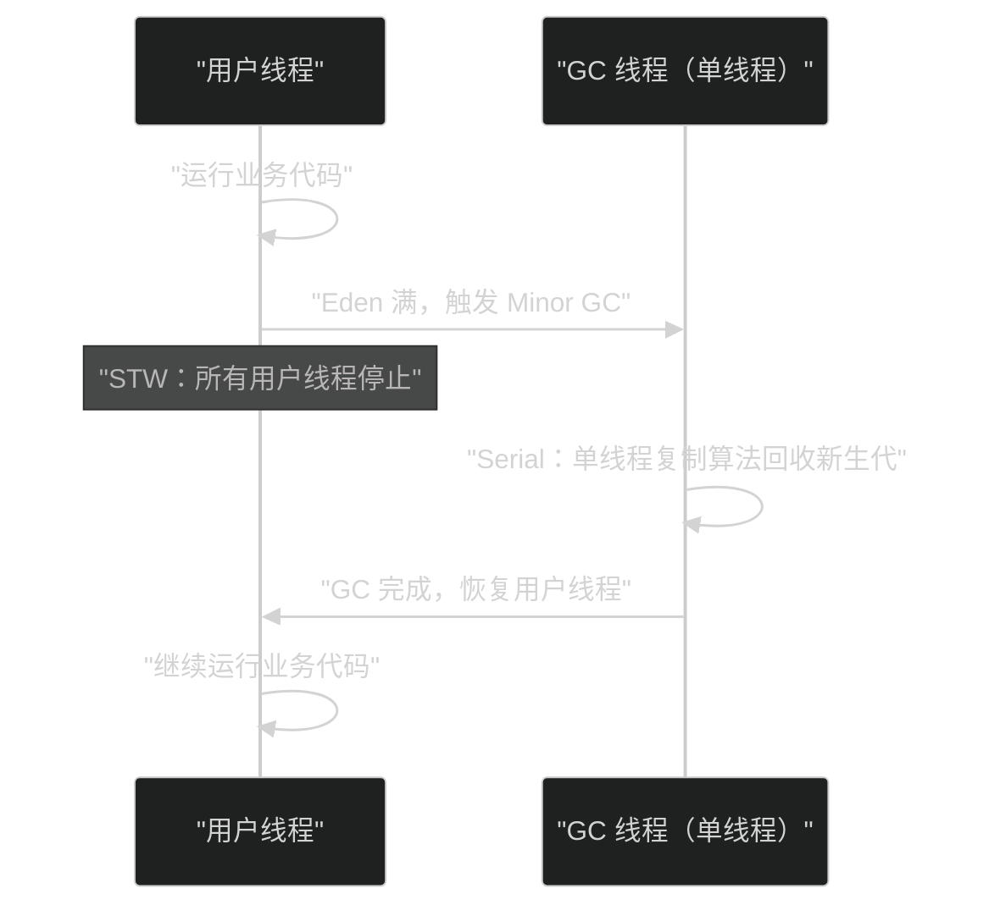
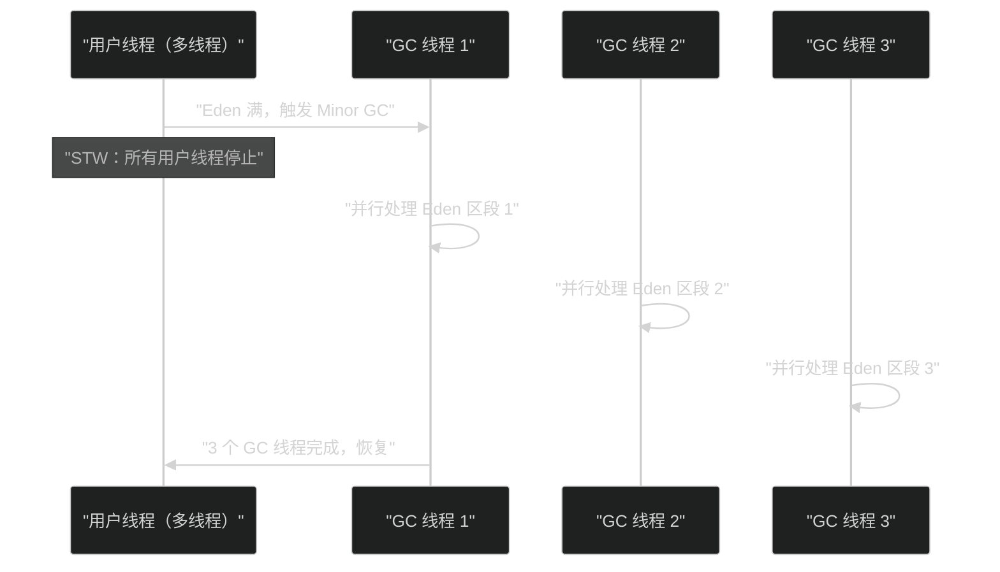
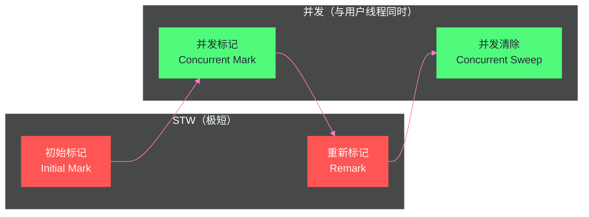

# 06 经典垃圾回收器——Serial、Parallel、CMS 深度剖析

**摘要：**

如果说上一篇介绍的三种基础算法是"食材"，那么垃圾回收器就是将食材烹饪成菜肴的"厨师"——同样的食材，不同的烹饪方式，结果完全不同。本文深入剖析 HotSpot 历史上三代经典垃圾回收器：**Serial/Serial Old**（单线程，STW 全停，简单可靠，JDK 1.3 之前的唯一选择）、**Parallel Scavenge/Parallel Old**（多线程并行，追求最大吞吐量，JDK 8 之前服务端默认）、**CMS（Concurrent Mark Sweep）**（并发标记减少停顿，首次引入"与用户线程并发工作"的 GC，开启了低延迟 GC 的时代）。理解这三代回收器的演进，是理解 G1、ZGC 等现代 GC 的必要前提——现代 GC 的每一个设计决策，都是在解决 CMS 留下的遗留问题。

---

## 第 1 章 垃圾回收器的两个核心评价维度

在深入各个收集器之前，需要建立评价 GC 的统一语言。GC 的性能主要由两个相互对立的维度衡量：

**吞吐量（Throughput）**：用户线程运行时间占总时间的比例：

```
吞吐量 = 用户代码运行时间 / (用户代码运行时间 + GC 停顿时间)
```

吞吐量 99% 意味着程序 100 秒中只有 1 秒在做 GC，99 秒在处理业务。吞吐量高的 GC 适合批处理任务（比如 Hadoop、Spark 作业）——用户不在意某次 GC 停顿了 2 秒，只要总任务完成时间短就好。

**停顿时间（Latency / Pause Time）**：单次 GC 造成的最大 STW 时间。停顿时间低的 GC 适合交互式应用（Web 服务器、金融交易系统）——用户可以接受整体吞吐量低一些，但不能接受某次请求突然卡顿 2 秒。

> [!note] 设计哲学：吞吐量与延迟的天然对立
> 这两个目标在一定程度上是天然对立的。要提高吞吐量，就要减少 GC 的"管理开销"，让 GC 集中干活（例如并行 STW，虽然停顿时间长，但管理开销小，总效率高）。要降低延迟，就要让 GC 与用户线程并发工作（并发 GC），代价是 GC 线程和用户线程互相竞争 CPU，总体吞吐量略有下降。这个权衡贯穿整个 GC 发展史。

---

## 第 2 章 Serial 收集器——单线程时代的奠基者

### 2.1 Serial 是什么

**Serial 收集器**（新生代）和 **Serial Old 收集器**（老年代）是 HotSpot 最早的垃圾回收器，也是最简单的实现。

**核心特点**：
- **单线程**：整个 GC 过程只使用一个线程完成
- **Stop-The-World**：GC 期间，所有用户线程全部暂停，等待 GC 完成



### 2.2 Serial 的算法

- **新生代（Serial）**：复制算法（Eden + Survivor 的复制收集）
- **老年代（Serial Old）**：标记-整理算法

### 2.3 为什么 Serial 至今没有被废弃

听起来 Serial 是个"老古董"，但它至今仍然是 HotSpot 的合法选项，原因有三：

**简单可靠**：Serial 是所有收集器中代码最简单、最好理解的，没有线程间协调的复杂性，也没有任何并发 Bug 的风险。

**适合小堆/单核环境**：在**客户端应用**（桌面应用、嵌入式设备）中，堆通常很小（几十 MB 到几百 MB），单次 GC 停顿时间本来就很短（可能就几十毫秒），多线程并行 GC 的线程切换和同步开销反而可能超过收益。

**容器场景的意外适用**：在 CPU 只有 1 核的容器中（`-XX:ActiveProcessorCount=1`），并行收集器退化为实际只有 1 个 GC 线程，与 Serial 无异，但 Serial 省去了多线程框架的开销。

**启用方式**：`-XX:+UseSerialGC`（同时使用 Serial + Serial Old）

---

## 第 3 章 Parallel 收集器——吞吐量至上的并行 GC

### 3.1 从 Serial 到 Parallel 的关键一步

**Parallel Scavenge 收集器**（新生代）和 **Parallel Old 收集器**（老年代）是 Serial 的多线程版本，也是 JDK 8 服务端 JVM 的默认 GC（`-server` 模式）。

**核心改变**：将单线程 GC 改为**多个 GC 线程并行执行**，大幅缩短 STW 停顿时间（在多核机器上，N 个 GC 线程理论上将 GC 时间缩短为 Serial 的 1/N）。



注意：这里的"并行"是指**多个 GC 线程之间并行**，用户线程仍然全部停止（STW 依然存在，只是时间变短了）。

### 3.2 Parallel Scavenge 的目标——最大化吞吐量

Parallel Scavenge 与 ParNew（也是并行新生代收集器）的关键区别在于**设计目标不同**：

- **ParNew**：为了配合 CMS 而设计，着重降低停顿时间，可以与 CMS 配合使用
- **Parallel Scavenge**：追求**最大化吞吐量**（Throughput），不是最小化单次停顿

Parallel Scavenge 提供了两个关键参数：

**`-XX:MaxGCPauseMillis`**：期望最大 GC 停顿时间（毫秒）。JVM 会尽量保证单次 GC 停顿不超过此值，但不是绝对保证。注意：为了缩短停顿，JVM 可能会减小新生代大小（新生代越小，每次 GC 处理的对象越少，停顿越短）——但这会导致 Minor GC 更频繁，总体吞吐量可能下降。

**`-XX:GCTimeRatio`**：GC 时间占总时间的比例上限。默认值 99，表示 GC 时间不超过总时间的 `1/(1+99) = 1%`（即吞吐量至少 99%）。

**`-XX:+UseAdaptiveSizePolicy`**：自适应调节策略（**Ergonomics**）。JVM 根据实际运行的 GC 情况，**自动调整**新生代大小（`-Xmn`）、Eden 与 Survivor 的比例（`-XX:SurvivorRatio`）、对象晋升年龄阈值（`-XX:MaxTenuringThreshold`）等参数，不需要手动调优——这是 Parallel Scavenge 的独特卖点，也是它被称为"自适应收集器"的原因。

### 3.3 Parallel Old——Parallel Scavenge 的老年代搭档

在 JDK 6 之前，Parallel Scavenge 没有匹配的老年代并行收集器，只能与 Serial Old 配合——这是一个尴尬的组合（新生代多线程 GC，老年代单线程 GC，整体受限于老年代的单线程效率）。

**Parallel Old 收集器**（JDK 6 引入）填补了这个空缺，使用**多线程 + 标记-整理算法**回收老年代，与 Parallel Scavenge 配合组成真正的"全并行"组合。

JDK 8 默认 GC：`-XX:+UseParallelGC`（新生代 Parallel Scavenge + 老年代 Parallel Old）

**GC 线程数**：默认等于 CPU 核心数（最多 8 个），也可以通过 `-XX:ParallelGCThreads=N` 指定。

---

## 第 4 章 CMS 收集器——并发 GC 的里程碑

### 4.1 CMS 解决的核心问题

Parallel GC 大幅缩短了 STW 停顿时间（通过多线程并行），但停顿依然存在——整个 GC 过程中用户线程全部停止。在大堆（数 GB）的老年代 Full GC 时，即使多线程并行，停顿也可能达到数秒。

**CMS（Concurrent Mark Sweep）收集器**的目标：**让 GC 的大部分工作与用户线程并发执行**，从而将 STW 停顿时间压缩到极短（只在极少数步骤需要 STW）。

这是 HotSpot GC 历史上的里程碑：第一次实现了"GC 线程与用户线程同时运行"，开创了低延迟 GC 的先河。

### 4.2 CMS 的四个阶段

CMS 对老年代使用**并发标记-清除**算法，整个回收过程分为四个阶段：



**阶段 1：初始标记（Initial Mark）—— STW，极短**

只标记**直接与 GC Roots 关联的老年代对象**（GC Roots 能直接引用的，不进行深度扫描）。仅需标记一层，工作量极小，STW 时间非常短（通常几毫秒）。

**阶段 2：并发标记（Concurrent Mark）—— 并发，最耗时**

从初始标记的结果出发，对整个老年代进行**深度可达性遍历**（三色标记）。这是 CMS 最耗时的阶段，但**与用户线程并发运行**，不会造成停顿。

代价：用户线程在并发标记期间会修改引用关系（新建对象、改变引用指向），导致已标记的状态不再准确，需要后续的重新标记阶段来修正。

**阶段 3：重新标记（Remark）—— STW，较短**

修正并发标记期间因用户线程运行导致的标记变动。CMS 使用**增量更新（Incremental Update）** 方案：在并发标记阶段，通过写屏障记录所有发生变化的引用（黑色对象新增的白色引用），重新标记阶段再次扫描这些变动的对象。

这个阶段比初始标记耗时稍长（需要扫描写屏障记录的变动集合），但远短于并发标记阶段，通常只有数十毫秒到 1-2 秒。

重新标记采用**多线程并行**（`-XX:ParallelCMSThreads` 控制线程数），进一步缩短 STW 时间。

**阶段 4：并发清除（Concurrent Sweep）—— 并发**

将未被标记的垃圾对象的内存空间加入空闲列表，**与用户线程并发运行**。由于使用标记-清除算法（而不是标记-整理），不移动对象，不需要更新引用，可以安全地与用户线程并发进行。

**并发清除期间产生的新垃圾**（用户线程在清除阶段新创建后又立即死亡的对象）无法在本轮 CMS 中回收，称为**浮动垃圾（Floating Garbage）**，等待下一轮 CMS 处理。

### 4.3 CMS 的配套新生代收集器

CMS 用于老年代，新生代需要配套的收集器。通常与 **ParNew 收集器**配合：
- ParNew 是 Serial 的多线程版本，专为配合 CMS 而设计（可以与 CMS 的 GC 线程协同工作）
- 启用方式：`-XX:+UseConcMarkSweepGC`（JVM 自动选择 ParNew + CMS + Serial Old）

### 4.4 CMS 的三个致命缺陷

CMS 首创了并发 GC 的思想，但它自身存在三个无法根治的缺陷，这也是它在 JDK 9 被废弃、JDK 14 被移除的原因：

**缺陷 1：CPU 资源竞争**

并发标记和并发清除阶段，CMS 线程与用户线程争夺 CPU 时间。默认 CMS 线程数为 `(CPU 核心数 + 3) / 4`，在 4 核机器上是 1 个线程，占用 25% 的 CPU；在 8 核上是 2 个线程，占用 25%。

对于 CPU 本来就紧张的应用，CMS 的并发阶段会明显影响用户线程的执行速度（吞吐量下降），即使表面上没有 STW 停顿，响应时间也可能增加。

**缺陷 2：浮动垃圾与并发失败（Concurrent Mode Failure）**

CMS 在并发清除阶段必须预留足够的老年代空间给用户线程分配新对象（晋升的对象）——因为此时 GC 还没有完成，老年代还没有被清理。

如果并发清除的速度跟不上对象晋升的速度（老年代快速被填满），就会发生 **Concurrent Mode Failure（并发模式失败）**：CMS 来不及并发清理，紧急启动 **Serial Old 收集器**进行全堆单线程 Full GC！这会导致比正常 CMS 更长的 STW 停顿（有时高达数十秒），是生产环境最严重的 GC 事故之一。

预防措施：
- `-XX:CMSInitiatingOccupancyFraction=75`：老年代占用率达到 75% 时就触发 CMS（默认 92%，太晚了）
- `-XX:+UseCMSInitiatingOccupancyOnly`：禁止 JVM 自动调整触发阈值，始终使用指定比例

**缺陷 3：内存碎片化**

CMS 使用标记-清除算法，**不移动对象**，回收后老年代内存会越来越碎片化。随着时间推移：
- 大对象分配失败（找不到连续大块空闲内存），触发 Full GC
- 即使空闲空间总量足够，碎片化也会导致反复 Full GC

缓解措施：
- `-XX:+UseCMSCompactAtFullCollection`：Full GC 时进行内存整理（但整理需要 STW，停顿时间增加）
- `-XX:CMSFullGCsBeforeCompaction=N`：每隔 N 次 Full GC 后，进行一次内存整理

这些参数只是缓解，无法根治——碎片化是标记-清除算法的本质，换算法才是根本解决。

### 4.5 CMS 的典型 GC 日志解读

```
# JDK 8 格式（-XX:+PrintGCDetails）
[GC (CMS Initial Mark) [1 CMS-initial-mark: 512000K(1024000K)] ← 初始标记：老年代 512MB/1GB
  514000K(2048000K), 0.0089670 secs]                           ← 全堆 514MB/2GB，耗时 8.9ms（STW）

[CMS-concurrent-mark-start]                                    ← 并发标记开始
[CMS-concurrent-mark: 0.582/0.582 secs]                       ← 并发标记耗时 582ms（无 STW）

[CMS-concurrent-preclean-start]                                ← 预清理（并发）
[CMS-concurrent-preclean: 0.024/0.024 secs]

[GC (CMS Final Remark)                                         ← 重新标记（STW）
  [YG occupancy: 251936 K (1024000 K)]
  [Rescan (parallel) , 0.1598220 secs]                        ← 并行重扫，159ms（STW）
  [weak refs processing, 0.0000543 secs]
  [class unloading, 0.0044898 secs]
  [1 CMS-remark: 512000K(1024000K)] 763936K(2048000K), 0.1711230 secs]

[CMS-concurrent-sweep-start]                                   ← 并发清除
[CMS-concurrent-sweep: 0.218/0.218 secs]                      ← 并发清除 218ms（无 STW）

[CMS-concurrent-reset-start]                                   ← 重置内部数据结构
[CMS-concurrent-reset: 0.014/0.014 secs]
```

**关键数据**：本次 CMS 总耗时约 1 秒（含并发阶段），STW 时间：初始标记 8.9ms + 重新标记 171ms = **约 180ms**。这就是 CMS 降低停顿的核心价值——将原本可能数秒的 Full GC STW，压缩到约 180ms。

---

## 第 5 章 三代收集器的工程权衡总结

### 5.1 收集器组合策略

| 场景 | 推荐组合 | 原因 |
| :--- | :--- | :--- |
| **客户端应用、小堆（< 512MB）** | Serial + Serial Old | 简单，单核性能好，停顿短（堆小） |
| **批处理/吞吐量优先（Hadoop/Spark）** | Parallel Scavenge + Parallel Old | 最大化 CPU 利用率，自适应调节 |
| **交互式应用、延迟敏感（JDK 8 服务端）** | ParNew + CMS | 并发标记减少老年代停顿 |
| **JDK 9+ 服务端（大多数场景）** | G1 | 综合 Parallel 的吞吐量 + CMS 的低延迟 |

### 5.2 演进脉络：每一代都在解决上一代的问题

```
Serial（1 线程，长 STW）
    → Parallel（N 线程，STW 时间缩短 N 倍，但仍有 STW）
        → CMS（并发标记，STW 极短，但碎片化 + 并发失败）
            → G1（Region 化，可预测停顿，解决碎片问题，下一篇详述）
                → ZGC/Shenandoah（并发转移，亚毫秒停顿）
```

每一代收集器都是在前一代的痛点上做出新的取舍，没有任何一个收集器能做到"完全没有代价"——有的是 STW 时间长，有的是 CPU 竞争，有的是内存碎片，有的是复杂的调优。

理解这条演进脉络，比单独记忆每个收集器的特点更有价值——当你需要在 G1 和 ZGC 之间做选型时，理解它们分别解决了什么问题、引入了什么新代价，才能做出有依据的判断。

---

## 第 6 章 总结

**Serial/Serial Old**：单线程，全程 STW，代码最简单。适合小堆和单核环境，依然是容器场景的合理选项。

**Parallel Scavenge/Parallel Old**：多线程并行 STW GC，吞吐量最优。JDK 8 服务端默认选项，适合 CPU 密集、批处理类型的应用。自适应调节策略减少手动调参工作量。

**CMS**：史上首个并发 GC，初始标记 + 重新标记 STW（各几毫秒到数百毫秒），并发标记 + 并发清除与用户线程同时进行。首次将老年代 GC 停顿压缩到亚秒级，开创低延迟 GC 时代。代价：CPU 竞争、浮动垃圾、内存碎片化、Concurrent Mode Failure 风险。JDK 9 废弃，JDK 14 移除。

下一篇 [[对象生命周期与GC/07 G1 收集器——Region 化内存与混合回收]] 将深入 G1——它继承了 CMS 的并发标记思想，但通过 Region 化的内存布局从根本上解决了碎片化问题，并引入了停顿预测模型，在低延迟和高吞吐量之间找到了更好的平衡点，成为 JDK 9 起的默认 GC。

---

## 参考文献

1. 周志明, 《深入理解 Java 虚拟机（第三版）》, 第 3.5 章：经典垃圾收集器
2. Jon Masamitsu, "Concurrent Mark Sweep Collector Enhancements", Sun Microsystems Blog, 2005
3. 美团技术博客, "Java中9种常见的CMS GC问题分析与解决", 2020
4. OpenJDK Wiki, "CMS Collector", wiki.openjdk.org
5. JEP 291: Deprecate the Concurrent Mark Sweep (CMS) Garbage Collector (JDK 9)
6. JEP 363: Remove the Concurrent Mark Sweep (CMS) Garbage Collector (JDK 14)

---

> [!note] 思考题
> 1. CMS（Concurrent Mark Sweep）使用'初始标记→并发标记→重新标记→并发清除'四个阶段。并发标记阶段 GC 线程和应用线程同时运行，可能导致'浮动垃圾'（Floating Garbage）。浮动垃圾的产生机制是什么？CMS 的 `-XX:CMSInitiatingOccupancyFraction` 为什么默认设置为 68%（JDK 6）或 92%（JDK 8）而非更高？
> 2. Parallel Scavenge 收集器关注的是吞吐量（= 应用时间 / (应用时间 + GC 时间)），而 CMS 关注的是停顿时间。在一个既需要高吞吐量（批处理 ETL）又需要低延迟（偶尔的 HTTP 请求处理）的混合型应用中，你会选择哪种收集器？能否通过 JVM 参数让 Parallel Scavenge 兼顾延迟？
> 3. CMS 在并发清除阶段如果应用线程分配内存过快，导致老年代空间不足，会触发'Concurrent Mode Failure'，降级为 Serial Old 进行 Full GC。这个 Full GC 的停顿时间可能是秒级的。除了增大堆内存，你有哪些手段来避免 Concurrent Mode Failure？
