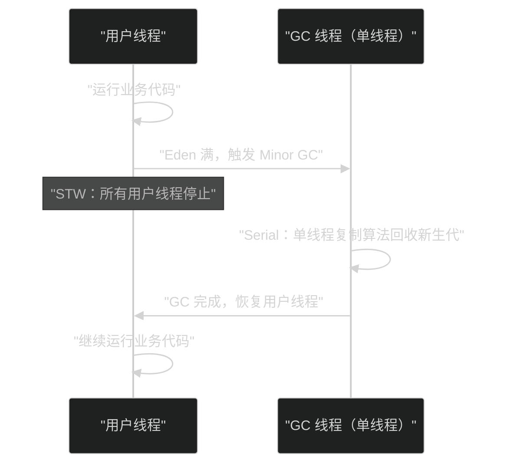
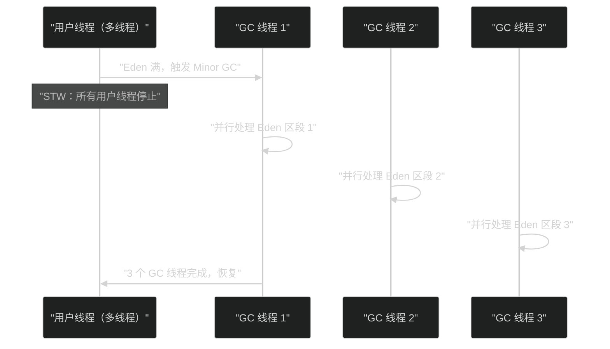
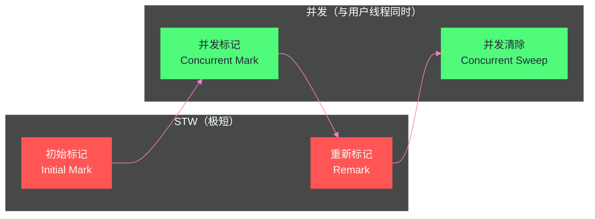

# 06 经典垃圾回收器——Serial、Parallel、CMS 深度剖析

> [!abstract] 摘要
> 如果说 [[对象生命周期与GC/05 垃圾回收算法——标记清除、复制、标记整理与分代假说|上一篇]] 介绍的三种基础算法是"食材"，那么垃圾回收器就是将食材烹饪成菜肴的"厨师"——同样的食材，不同的烹饪方式，结果完全不同。本文深入剖析 HotSpot 历史上三代经典垃圾回收器：**Serial/Serial Old**（单线程，STW 全停，简单可靠，是 JDK 1.3 之前唯一的选择，也是至今在小内存/单核容器场景下仍然合理的选项）、**Parallel Scavenge/Parallel Old**（多线程并行 STW，追求最大吞吐量，JDK 8 之前服务端默认 GC，其自适应调节机制——GC Ergonomics——是这一代收集器的核心创新）、**CMS（Concurrent Mark Sweep）**（并发标记大幅压缩停顿，首次实现"GC 线程与用户线程同时工作"，开启低延迟 GC 时代，但也因增量更新的重扫代价、内存碎片、Concurrent Mode Failure 三大顽疾在 JDK 9 被标记废弃、JDK 14 被彻底移除）。文章不仅讲清楚"是什么"，更着重讲透"为什么这样设计""不这样会怎样""生产环境如何排查故障"——理解这三代回收器的演进逻辑，是理解 G1、ZGC 等现代 GC 的必要前提，因为现代 GC 的每一个设计决策，本质上都是在回答 CMS 留下的未解之题。

---

## 第 1 章 垃圾回收器的评价维度与设计张力

### 1.1 吞吐量——GC 效率的宏观视角

在深入各个收集器之前，需要先建立一套评价 GC 的统一语言，否则讨论"哪个收集器更好"会变成没有意义的口水战——脱离场景谈优劣毫无价值。评价 GC 主要依赖两个相互制约的维度。

**吞吐量（Throughput）** 衡量的是用户线程运行时间占总运行时间的比例：

```
吞吐量 = 用户代码运行时间 / (用户代码运行时间 + GC 停顿时间)
```

吞吐量 99% 意味着程序运行 100 秒，其中只有 1 秒消耗在 GC 上，99 秒真正在处理业务逻辑。这个指标背后的工程含义是"单位硬件资源能承载多少业务计算量"——同样一台 32 核机器，吞吐量从 95% 提升到 99%，等价于凭空多出将近 4% 的算力，不需要多买一台服务器。这正是为什么大数据批处理场景（Hadoop、Spark 作业）格外看重吞吐量：这类任务没有"用户正在等待响应"的实时压力，只关心一批任务从提交到完成的总耗时，单次 GC 停顿两秒完全可以接受，只要总任务完成时间足够短。

**停顿时间（Latency / Pause Time）** 衡量的是单次 GC 造成的最大 STW（Stop-The-World）时长。这个指标背后的工程含义是"用户能感知到的最坏响应体验"——即使全天 GC 总耗时只占 0.5%，只要某一次 GC 停顿了 3 秒，恰好卡住了一次金融交易请求或者一次实时竞价广告的出价窗口，业务上造成的损失可能远超过"吞吐量下降了几个百分点"带来的成本。这正是为什么 Web 服务器、金融交易系统、实时竞价系统格外看重停顿时间，甚至愿意为了降低停顿而主动牺牲一部分吞吐量。

> [!note] 设计哲学：吞吐量与延迟为什么天然对立
> 这两个目标在工程实现上存在根本性冲突，理解这一点是理解整个 GC 发展史的钥匙。要提高吞吐量，最直接的手段是让 GC "全力冲刺"——STW 期间独占全部 CPU 资源，用最简单粗暴的方式尽快完成回收，管理开销（线程协调、状态同步）越小越好。而要降低延迟，就必须让 GC 与用户线程并发工作，把一次大停顿拆解成多次小停顿或者干脆消除停顿——但代价是 GC 线程和用户线程要同时争抢 CPU、要用写屏障记录并发期间的引用变化、要处理并发执行带来的各种边界情况（漏标、浮动垃圾、并发失败），这些额外机制本身就是开销，会拖累整体吞吐量。没有免费的午餐：Serial 用极简换来了长停顿；Parallel 用多线程换来了短停顿但没有降低总开销；CMS 用并发换来了更短停顿但引入了额外的运行时代价和不确定性。

除了吞吐量与延迟，业界还常提及第三个维度——**内存占用（Footprint）**，即 GC 完成工作所需的额外内存空间（例如复制算法需要预留 Survivor 空间，标记阶段需要额外的位图或队列）。三者构成一个不可能三角：想要低延迟和高吞吐量兼得，往往要用更多内存做缓冲（比如更大的 Eden 区减少 Minor GC 频率）；想要用最少的内存跑起来，往往就要接受更频繁的 GC 和更长的停顿。这也是为什么在容器化、内存受限的场景中（如 4C8G 的 Pod），GC 选型往往比"理论上最优的收集器"更复杂——你要在三个维度里找一个适合具体约束条件的折中点，而不是无脑选"最先进"的收集器。

### 1.2 HotSpot 收集器的演进坐标

在正式进入具体收集器之前，有必要先建立一个宏观坐标系：HotSpot 从诞生至今，一直在"分代 GC 大框架"内部反复迭代收集器实现，每一代新收集器几乎都是对上一代某个具体痛点的针对性回应。下表按照大致的历史脉络列出本文涉及的三代收集器与后续文章即将讨论的现代收集器，帮助建立整体认知（具体版本号请以官方 Release Notes 与 JEP 为准，此处只标注公认的关键节点）：

| 收集器 | 作用分代 | 核心算法 | 线程模型 | 设计目标 | 历史地位 |
|---|---|---|---|---|---|
| Serial / Serial Old | 新生代 / 老年代 | 复制 / 标记-整理 | 单线程 | 简单可靠 | HotSpot 最早的收集器，客户端模式的长期默认选项 |
| ParNew | 新生代 | 复制 | 多线程并行 | 配合 CMS 降低新生代停顿 | Serial 的多线程版，专为搭配 CMS 设计 |
| Parallel Scavenge / Parallel Old | 新生代 / 老年代 | 复制 / 标记-整理 | 多线程并行 | 最大化吞吐量 | JDK 8 服务端默认，引入自适应调节 |
| CMS | 老年代 | 并发标记-清除 | 部分并发 | 降低老年代停顿 | 首个生产级并发 GC，JDK 9 废弃、JDK 14 移除 |
| [[对象生命周期与GC/07 G1 收集器——Region 化内存与混合回收\|G1]] | 全堆（Region 化） | 复制 + 标记-整理，并发标记 | 并行 + 并发 | 可预测停顿 | JDK 9 起默认 GC |
| [[对象生命周期与GC/08 ZGC——亚毫秒停顿的着色指针与读屏障\|ZGC]] / [[对象生命周期与GC/09 Shenandoah——与 ZGC 殊途同归的并发压缩\|Shenandoah]] | 全堆 | 并发标记 + 并发转移 | 高度并发 | 亚毫秒停顿 | 停顿时间与堆大小基本解耦 |

这张表的阅读方式不是横向比较"谁更强"，而是纵向理解"每一行相对上一行解决了什么问题、又留下了什么新问题"——这正是本文接下来三章要讲透的内容。

---

## 第 2 章 Serial 收集器——单线程时代的奠基者

### 2.1 Serial 是什么，为什么会以这种形态出现

**Serial 收集器**（新生代）和 **Serial Old 收集器**（老年代）是 HotSpot 最早的垃圾回收器实现，也是概念上最简单的实现。它的设计目标很朴素：在 20 世纪 90 年代末、多核 CPU 尚未普及的硬件条件下，用尽可能简单的方式实现一个"能正确工作"的分代 GC。

**核心特点**：
- **单线程**：整个 GC 过程（无论是新生代的 Minor GC 还是老年代的 Full GC）只使用一个线程完成，不存在任何线程间协调、锁竞争、任务窃取的复杂性。
- **Stop-The-World（独占式）**：GC 期间，JVM 会在安全点（Safepoint，详见 [[对象生命周期与GC/04 垃圾回收基础——可达性分析、安全点与安全区域]]）挂起所有用户线程，等待唯一的 GC 线程完成全部工作后再恢复。

理解"为什么会以这种形态出现"比记住"它是单线程的"更重要。在没有多核 CPU 的年代，即使把 GC 设计成多线程，也没有硬件资源可以并行执行，多线程框架本身的调度、同步开销反而是纯粹的负担。Serial 是在特定硬件约束下的理性选择,不是"落后"或者"简陋"的产物——这是理解整个 GC 演进史时容易产生的误区：后代收集器不是因为"更聪明"才多线程化，而是因为多核 CPU 的普及让并行成为了有利可图的选项。



### 2.2 Serial 的算法选择——为什么新生代用复制、老年代用标记-整理

- **新生代（Serial）**：使用**复制算法**，即把 Eden 和 一个 Survivor 区中的存活对象一次性复制到另一个 Survivor 区。
- **老年代（Serial Old）**：使用**标记-整理算法**，即先标记所有存活对象，再将它们整体挪动到内存的一端，最后清理边界之外的空间。

这个分工不是任意选择,而是 [[对象生命周期与GC/05 垃圾回收算法——标记清除、复制、标记整理与分代假说|分代假说]]直接推导出的结论：新生代对象存活率极低（通常只有 10% 左右存活到下一轮 GC），复制算法需要搬运的对象少，效率很高，代价（预留一半空间）在低存活率场景下完全可以接受；老年代对象存活率高，如果用复制算法，需要搬运绝大多数对象，代价过高，而标记-整理算法只需要标记和挪位置,不需要额外预留一半空间,更适合老年代"存活率高、回收频率低"的特点。Serial 与 Serial Old 只是把这套通用理论落地为具体的单线程实现，算法层面没有任何"简化"或"缩水"。

从 HotSpot 源码层面看,新生代对应的实现类是 `DefNewGeneration`（Default New Generation),老年代对应的是 `TenuredGeneration`,两者都挂在 `GenCollectedHeap` 这个堆管理框架下——这也是理解后续 ParNew、Parallel Scavenge 的基础：它们本质上是把 `DefNewGeneration` 换成了并行版本的实现类，堆的整体分代结构（Eden / Survivor / Old）并没有变化,变化的只是"谁来扫描、谁来搬运对象"这件事的并发度。

### 2.3 为什么 Serial 至今没有被废弃

听起来 Serial 像是个"老古董"，但截至目前它仍然是 HotSpot 的合法选项(没有被标记 deprecated),原因可以归纳为三条,而这三条本质上都在回答同一个问题——单线程 GC 什么时候不是缺点,反而是优点。

**简单可靠，没有并发 Bug 的攻击面**：Serial 是所有收集器中代码最简单、最好理解的实现,不存在任何线程间协调的复杂性,自然也不存在任何"并发标记漏标""写屏障实现错误""多线程状态机竞态"之类的潜在 Bug。这对某些极度看重稳定性、宁可牺牲性能也不接受偶发性诡异问题的场景（比如某些嵌入式控制系统）有天然吸引力。

**适合小堆环境，STW 时间本身就短**：GC 停顿时间的本质是"处理这批存活对象需要多久"，如果堆本身很小（几十 MB 到几百 MB，常见于客户端应用、桌面小工具、嵌入式设备），单次 Minor GC 需要处理的对象数量本就有限，停顿时间可能只有几毫秒到几十毫秒——这种量级下,多线程并行 GC 引入的线程创建、任务切分、结果汇总等协调开销,反而可能超过并行本身节省下来的时间。也就是说,并行不是免费的,只有当"并行节省的时间"大于"并行协调的开销"时才划算,而小堆场景恰好不满足这个条件。

**容器场景的意外适用**：在只分配了 1 个 vCPU 的容器中（例如通过 `-XX:ActiveProcessorCount=1` 显式限制,或者容器编排系统本身只给了 1 核配额）,并行收集器实际上会退化为只创建 1 个 GC 线程工作——效果与 Serial 完全等价,但 Serial 因为压根没有引入多线程框架的初始化开销（线程池创建、任务队列分配等）,反而能省下一点点资源。这也是很多资料建议"低配额容器优先考虑 `-XX:+UseSerialGC`"的原因所在。

> [!warning] 边界与反例：Serial 在大堆场景下的真实代价
> 上述优点全部建立在"堆很小"的前提上。一旦堆膨胀到 GB 级别，Serial 的单线程劣势会被急剧放大：假设老年代占用 4GB，触发 Full GC 时需要标记-整理这 4GB 内存中的存活对象，单线程处理的吞吐量典型量级在每秒数百 MB 到 1-2 GB（取决于对象图复杂度和硬件），意味着一次 Full GC 停顿可能长达数秒甚至十几秒——这在任何面向用户的在线服务里都是不可接受的事故级停顿。生产环境中如果误将大堆服务配置为 `-XX:+UseSerialGC`（常见于复制线上配置模板时没有针对性调整），会造成周期性的长时间无响应，排查时容易被误判为网络问题或下游依赖超时，实际上打开 GC 日志一看就是 Serial Old 的单线程 Full GC 在作祟。这是一个典型的"参数适配场景，脱离场景谈参数没有意义"的案例。

**启用方式**：`-XX:+UseSerialGC`（同时启用 Serial 与 Serial Old，两者不能拆开单独使用，因为它们共享同一套简单的堆管理假设）。

### 2.4 一次真实的 Serial 误配置排查思路

一个具有代表性的生产案例：某团队在把一个原本运行在小型嵌入式网关上的 Java 组件迁移到云端容器时，直接复用了旧的启动脚本（其中包含 `-XX:+UseSerialGC`），但容器规格从"单核 256MB"提升到了"4 核 4GB"，业务侧也从单一网关转发逐渐演变为聚合了缓存、序列化、批量转换等更复杂的处理逻辑，老年代占用逐渐上升到 GB 级别。上线后监控发现服务偶发性出现数秒的响应尖刺，且尖刺周期与业务日志中的对象分配高峰基本吻合。

排查路径是典型的"先看 GC 日志，再看资源配置，最后回溯变更历史"三步走：第一步打开 GC 日志确认单次停顿时长和收集器类型，日志中显式出现 `Full GC (System)` 或者对应 Serial Old 的标识，且耗时与老年代占用量呈明显正相关；第二步核对启动参数，发现 `-XX:+UseSerialGC` 是历史遗留配置，与当前 4 核的硬件规格明显不匹配；第三步回溯变更记录，确认这是"复制旧配置模板未做适配"的典型疏漏。最终的修复方案是切换为更匹配当前硬件规格和延迟要求的收集器组合（对该团队而言是 `-XX:+UseParallelGC`），问题随之消失。这个案例的价值不在于结论本身（"别把小堆参数用在大堆上"这个道理并不新鲜），而在于排查路径的通用性——遇到周期性长停顿，永远应该先确认"当前实际生效的收集器和参数是否与硬件规格、业务负载相匹配"，而不是直接跳到复杂的并发失败或碎片化假设上。

---

## 第 3 章 Parallel 收集器——吞吐量至上的并行 GC

### 3.1 从 Serial 到 Parallel 的关键一步

**Parallel Scavenge 收集器**（新生代）和 **Parallel Old 收集器**（老年代）是 Serial 思想的多线程化实现，也是 JDK 8 服务端 JVM（`-server` 模式）的默认组合。促成这次演进的根本驱动力是硬件的变化——多核 CPU 在 21 世纪初迅速普及,服务器动辄 4 核、8 核甚至更多,如果 GC 依然只用一个线程干活，其余 N-1 个核心在 STW 期间完全闲置，是对硬件资源的巨大浪费。

**核心改变**：把单线程的标记、复制、整理工作**拆分给多个 GC 线程并行执行**。在理想情况下（对象分布均匀、线程间没有等待），N 个 GC 线程可以将 GC 时间缩短为 Serial 的 1/N 左右——这本质上是一次简单直接的"用空闲的 CPU 核心换取更短的 STW 时间"的交易，没有引入并发带来的复杂性，因为用户线程依然是全部停止的，GC 线程之间也不需要跟正在运行的用户线程打交道。



务必注意这里的"并行（Parallel）"与后文 CMS 的"并发（Concurrent）"是两个完全不同的概念,这也是初学者最容易混淆的地方：**并行**指的是多个 GC 线程之间同时工作,但用户线程依然全部停止；**并发**指的是 GC 线程与用户线程同时运行,用户线程不必完全停下来。Parallel 系列收集器只做到了"并行"，没有做到"并发"——STW 依然存在，只是变短了，这是它和 CMS 在设计目标上的根本分野。

### 3.2 Parallel Scavenge 的目标——最大化吞吐量而非最小化单次停顿

Parallel Scavenge 与同样是多线程并行的 ParNew 收集器容易被混为一谈,但两者的设计目标截然不同,这一点在选型时至关重要：

- **ParNew**：为了配合 CMS 而设计,本质上是"给 CMS 用的新生代收集器",它本身并不追求极致吞吐量,而是要保证新生代的 Minor GC 停顿足够短,同时能和 CMS 的并发标记线程协同工作（避免相互踩踏）。
- **Parallel Scavenge**：追求**最大化吞吐量**（Throughput）,不是最小化单次停顿——这意味着 Parallel Scavenge 允许某次 GC 停顿稍长一些,只要长期统计下来吞吐量指标达标即可。

Parallel Scavenge 引入了两个关键参数,理解它们背后的权衡逻辑,比记住参数名本身更重要：

**`-XX:MaxGCPauseMillis`**：期望的最大 GC 停顿时间（毫秒）。JVM 会尽量保证单次 GC 停顿不超过此值,但这只是一个"软约束"（soft goal),不是绝对保证。它的实现机制是通过动态收缩新生代大小来实现的——新生代越小,单次 Minor GC 需要处理的对象越少,停顿自然越短。但这里隐含着一个反直觉的代价：新生代变小意味着 Eden 被填满的速度更快,Minor GC 触发得更频繁,单看某一次停顿确实短了,但总的 GC 次数增多了,累积的 GC 总耗时（进而影响吞吐量）反而可能上升。这是一个典型的"缩短单次停顿"和"提升总吞吐量"相互拉扯的例子,再次印证第一章的核心张力。

**`-XX:GCTimeRatio`**：设定 GC 时间占总运行时间的比例上限。它的默认值是 99,含义是 GC 时间不应超过总时间的 `1/(1+99) = 1%`，即吞吐量目标至少 99%。这个参数与 `MaxGCPauseMillis` 是有冲突可能的两个目标——如果你把 `MaxGCPauseMillis` 设得极小（比如 10ms),同时又要求 `GCTimeRatio` 极高（比如 199,对应吞吐量 99.5%),JVM 可能无法同时满足两者,这时 JVM 内部会有优先级仲裁逻辑(通常倾向优先满足停顿目标,吞吐量目标次之),生产调优时如果两个参数同时设置得过于激进,反而会让自适应算法陷入不断调整、来回震荡的状态，实际效果比不设置还差。

### 3.3 GC Ergonomics——自适应调节策略的具体运作逻辑

**`-XX:+UseAdaptiveSizePolicy`**（默认开启）是 Parallel Scavenge 系列区别于 Serial 最重要的工程创新，通常被称为 **GC Ergonomics（GC 人体工学 / 自适应调节）**。它解决的核心问题是：手动调优新生代大小、Survivor 比例、晋升年龄阈值等参数极其繁琐，且最优值会随着应用运行时的负载变化而变化（比如白天流量大、晚上流量小，最优新生代大小可能不同）——与其让运维人员反复手动试错，不如让 JVM 自己观察历史 GC 表现，动态调整。

它的运作逻辑可以概括为一个持续反馈的调节循环：每一次 GC 完成后，JVM 都会记录本次 GC 的停顿时间、回收后的存活对象比例、晋升到老年代的对象数量等统计数据，并采用**指数衰减加权平均**的方式与历史数据融合（近期的 GC 表现权重更高，避免单次异常波动导致误判）。基于融合后的统计结果，JVM 会对比当前表现与 `MaxGCPauseMillis` / `GCTimeRatio` 设定的目标：

- 如果最近几次 Minor GC 的停顿时间持续超过目标，JVM 会**收缩新生代大小**（减少 Eden 空间），让下一次 Minor GC 处理的对象更少；
- 如果最近的吞吐量低于 `GCTimeRatio` 设定的目标（GC 太频繁），JVM 会**扩大新生代大小**，降低 Minor GC 触发频率；
- Survivor 区的比例（`-XX:SurvivorRatio` 的运行时实际生效值）和对象晋升年龄阈值（`-XX:MaxTenuringThreshold` 的运行时实际生效值）也会依据类似逻辑动态调整——如果 Survivor 区经常溢出（对象来不及在新生代内多次复制就被迫提前晋升），会调整晋升策略。

这套机制的意义在于：Parallel Scavenge 把"调优"这件事的一部分责任从运维人员转移给了 JVM 自身,在大多数常规业务场景下,不需要手工调优就能获得接近最优的吞吐量表现。但代价也很明确——自适应调节的过程本身需要额外的统计和决策开销，且调节结果具有一定的滞后性（要观察若干次 GC 之后才能收敛到较优状态），对于负载模式剧烈波动、追求极致可预测性的场景，有经验的工程师往往会选择关闭自适应（`-XX:-UseAdaptiveSizePolicy`）并手动固定各项参数,以换取更稳定、可复现的 GC 行为。

### 3.4 Parallel Old——补齐老年代的并行拼图

在 Parallel Old 出现之前，Parallel Scavenge 没有匹配的老年代并行收集器，只能与 Serial Old 搭配——这是一个尴尬的组合：新生代是多线程并行的，老年代 Full GC 却退化为单线程，整体性能受限于老年代的单线程效率，新生代的并行优化几乎失去了意义（因为老年代的 Full GC 停顿依然很长）。这个尴尬阶段也说明了一个朴素的道理：一套 GC 方案的整体表现，取决于其中最慢的那一环，局部优化如果没有覆盖到瓶颈所在的环节，收益会被严重稀释。

**Parallel Old 收集器**填补了这个空缺，使用**多线程 + 标记-整理算法**回收老年代，与 Parallel Scavenge 配合组成真正的"全并行"组合，两者结合才构成社区文档中通常所说的"吞吐量优先"收集器方案。

**启用方式**：`-XX:+UseParallelGC`（新生代 Parallel Scavenge + 老年代 Parallel Old，是 JDK 8 服务端环境的默认 GC 组合）。

**GC 线程数**：默认与 CPU 核心数相关（在核心数较多时会有一定的折算规则，避免线程数无限膨胀带来的调度开销），也可以通过 `-XX:ParallelGCThreads=N` 显式指定。生产环境中如果发现容器实际可用 CPU 配额远小于宿主机物理核心数（常见于早期容器化改造，JVM 未正确感知 cgroup 限制的场景），GC 线程数可能被错误地设置为宿主机核心数，导致大量 GC 线程在少量 CPU 配额上疯狂抢占调度，反而拖慢 GC 本身——这是容器化环境中一个经典的隐性坑,后续在 [[JVM实战/14 GC 调优实战——日志分析、参数调优与选型指南]] 中会展开具体的排查方法。

### 3.5 Parallel 组合的边界——STW 依然无法回避

Parallel Scavenge + Parallel Old 用多线程把 STW 时间大幅压缩，但停顿本身依然完整存在——从用户线程的视角看，GC 期间自己依然被完全冻结，只是冻结的时长变短了。在中小堆场景下，这个方案往往已经足够优秀；但当老年代增长到数 GB 甚至十几 GB 规模时，即使有多个线程并行处理，一次 Full GC 的停顿仍然可能达到秒级甚至数秒级——对于批处理、离线计算类场景这完全可以接受，但对于要求毫秒级响应的在线交易系统，这样的停顿是无法容忍的。正是这个"停顿依然存在，只是变短了"的天花板，催生了下一代收集器的核心诉求：能不能让 GC 完全不停顿，或者只在极短的瞬间停顿？这正是 CMS 要回答的问题。

---

## 第 4 章 CMS 收集器——并发 GC 的里程碑

### 4.1 CMS 解决的核心问题

Parallel 系列大幅缩短了 STW 停顿时间（通过多线程并行），但停顿的"存在性"本身没有改变——整个 GC 过程中用户线程全部停止,只是停止的时长缩短了。在大堆（数 GB 乃至更大）场景下的老年代 Full GC，即使多线程并行，停顿也可能达到数秒，这对延迟敏感型应用是不可接受的。

**CMS（Concurrent Mark Sweep）收集器**给出了一个此前从未被生产级实现过的答案：**让 GC 的大部分工作与用户线程并发执行**，从而把 STW 停顿压缩到极短的几个必要环节。这不是简单的工程优化,而是范式转变——从"GC 时用户线程必须完全静止"转向"GC 时用户线程和 GC 线程可以同时活动"。这是 HotSpot GC 历史上真正的里程碑,第一次在生产级 JVM 中实现了"GC 线程与用户线程同时运行"，为后续 G1、ZGC、Shenandoah 等一切并发 GC 铺平了道路——可以说,没有 CMS 踩过的坑,就没有后续这些更成熟方案的诞生。

### 4.2 CMS 的四个阶段

CMS 对老年代使用**并发标记-清除**算法，整个回收过程分为四个阶段，其中两个阶段 STW，两个阶段并发：



**阶段 1：初始标记（Initial Mark）—— STW，极短**

只标记**直接与 GC Roots 关联的老年代对象**（GC Roots 能直接触达的第一层引用,不做深度遍历）。因为只需标记一层,工作量极小,STW 时间通常只有几毫秒。这个阶段之所以必须 STW,是因为如果不停顿用户线程,GC Roots 集合本身可能在扫描过程中发生变化（比如某个线程栈里新出现了一个局部变量引用),导致标记起点不完整——这是一个必须付出的最小停顿代价。

**阶段 2：并发标记（Concurrent Mark）—— 并发，最耗时**

从初始标记的结果出发,对整个老年代进行**深度可达性遍历**（[[对象生命周期与GC/04 垃圾回收基础——可达性分析、安全点与安全区域|三色标记]]算法）。这是 CMS 整个流程中最耗时的阶段,但因为**与用户线程并发运行**,不会造成 STW 停顿,用户看到的应用响应时间基本不受影响（CPU 层面会有资源竞争,后文会详细展开）。

代价在于：用户线程在并发标记期间会持续修改对象引用关系（新建对象、改变字段指向)，这会导致 GC 线程已经完成的标记结果出现偏差——某些原本应该存活的对象,因为引用关系在标记过程中发生了变化,可能被错误地判定为垃圾（即 [[对象生命周期与GC/05 垃圾回收算法——标记清除、复制、标记整理与分代假说|漏标问题]]）。这正是需要后续重新标记阶段来修正的根本原因。

**阶段 3：重新标记（Remark）—— STW，较短**

修正并发标记期间因用户线程运行导致的标记偏差。CMS 采用的方案是**增量更新（Incremental Update）**：在并发标记阶段，通过[[对象生命周期与GC/05 垃圾回收算法——标记清除、复制、标记整理与分代假说|写屏障]]拦截所有"黑色对象新增指向白色对象的引用"这类事件,把发生变化的对象重新标记为灰色并记入待重扫集合;重新标记阶段就是对这个待重扫集合中的对象重新做一次扫描,确保不会漏掉真正存活的对象。

这个阶段的耗时比初始标记稍长（因为要扫描写屏障记录下来的变动集合，集合大小取决于并发标记期间应用线程的活跃程度），但远短于并发标记阶段本身,量级上通常是几十毫秒到一两秒不等,具体取决于并发标记期间应用的引用变更频率。重新标记阶段本身采用**多线程并行**执行（可通过参数控制并行线程数),进一步压缩这段 STW 时间。

**阶段 4：并发清除（Concurrent Sweep）—— 并发**

将未被标记的垃圾对象所占内存空间归还到空闲列表,这个过程**与用户线程并发运行**。因为 CMS 使用的是标记-清除算法而不是标记-整理算法,回收过程不移动任何存活对象,不需要更新引用地址,这正是它能够安全地与用户线程并发进行的前提——如果需要移动对象(如标记-整理),并发执行会引发极其复杂的问题(用户线程可能正在读取一个"正在被搬移"的对象),这也是为什么 CMS 选择牺牲空间整理能力来换取并发安全性。

**并发清除期间产生的新垃圾**（用户线程在清除阶段新创建、又迅速死亡的对象)无法在本轮 CMS 中被识别和回收,这部分对象被称为**浮动垃圾（Floating Garbage）**,只能等到下一轮 CMS 周期才能处理。浮动垃圾量的大小与并发清除阶段的耗时、应用的对象分配速率直接相关——并发清除耗时越长、分配越快,浮动垃圾越多,这也是后文将要讨论的内存预留问题的直接成因。

### 4.3 CMS 的配套新生代收集器——ParNew

CMS 只负责老年代,新生代仍然需要独立的收集器配合。CMS 与 **ParNew 收集器**搭配使用,而不是与追求吞吐量的 Parallel Scavenge 搭配,原因是 ParNew 在设计上就充分考虑了如何与 CMS 的并发标记线程协同工作——例如,ParNew 在处理跨代引用扫描时会兼顾 CMS 正在使用的并发标记数据结构,避免两者互相踩踏对方维护的状态。

**启用方式**：`-XX:+UseConcMarkSweepGC`（JVM 自动选择 ParNew 作为新生代收集器 + CMS 作为老年代收集器,Full GC 兜底时退化为 Serial Old,这一点在下文的 Concurrent Mode Failure 中会看到其具体触发场景)。

### 4.4 增量更新与 SATB——一次面向未来的技术选型对比

CMS 处理并发标记期间引用变化的方案是**增量更新（Incremental Update）**：只要发现黑色对象新增了指向白色对象的引用，就把该黑色对象重新打回灰色，加入待重扫队列。这个方案直观、容易理解，但有一个隐藏的成本：重新标记阶段需要重新扫描的是**所有被修改过的黑色对象本身**，如果并发标记期间对象图变动剧烈（应用线程活跃、引用关系频繁改写），待重扫集合会膨胀得很大，导致重新标记这个 STW 阶段的耗时变得不可预测。

[[对象生命周期与GC/07 G1 收集器——Region 化内存与混合回收|G1]] 后来选择了另一种方案——**SATB（Snapshot At The Beginning，原始快照）**：在并发标记开始的逻辑时间点，为整个堆的引用关系"拍一张快照"，标记期间只要有引用被**删除**（而不是新增），就通过写屏障把被删除的那条原始引用记录下来，确保这个原本可达的对象在本轮 GC 中不会被错误回收（哪怕它标记结束时已经变成了事实上的垃圾，也留到下一轮处理，本质上是主动多算出一部分"浮动垃圾"来换取重新标记阶段更小的工作量）。SATB 的重新标记阶段只需要处理这个专门的记录队列，工作量相对更可控、更可预测,这也是 G1 相比 CMS 能给出更明确的停顿时间预测模型的技术原因之一。

理解这两种方案的取舍,能帮助建立一个重要认知：CMS 与 G1 并不是"新旧替代"这么简单的关系,两者在同一个技术难题（并发标记期间如何保证正确性）上做出了不同的工程选择,而选择的差异直接决定了后续停顿时间的可预测性——这也是本专栏后续文章会重点展开的内容。

### 4.5 CMS 的三个致命缺陷

CMS 首创了并发 GC 的思想,但它自身存在三个始终无法根治的缺陷,这也是它在 JDK 9 被标记废弃（JEP 291）、JDK 14 被彻底移除（JEP 363）的直接原因。理解这三个缺陷的具体触发机制、而不是止步于"CMS 有碎片问题"这类笼统的描述，对于生产环境排查 GC 故障至关重要。

#### 4.5.1 缺陷一：CPU 资源竞争

并发标记和并发清除阶段,CMS 的 GC 线程会与用户线程实时争夺 CPU 时间片——这是"并发"这个词本身付出的代价,不存在免费的并发。CMS 默认使用的并发 GC 线程数与 CPU 核心数相关（核心数越多,分配给并发 GC 的线程比例通常会做相应折算,避免占用过多 CPU),但无论如何折算,在并发阶段这部分 CPU 资源实际上是从用户线程手里"抢"过来的。

这个代价对于 CPU 资源本就紧张的应用（比如已经跑满 70%-80% CPU 利用率的服务）影响尤为明显：即使 GC 日志显示"没有明显的 STW 停顿"，应用的整体响应时间、吞吐量也会在并发标记/清除阶段悄悄下降,这种"隐性的性能损耗"比显性的 STW 停顿更难被察觉和归因,常见的误判是把响应变慢归结为下游依赖或网络问题,而实际元凶是并发 GC 线程在后台持续抢占 CPU。

#### 4.5.2 缺陷二：浮动垃圾与并发失败（Concurrent Mode Failure）——生产事故的高发点

CMS 在并发清除阶段仍然需要给用户线程分配新对象（包括从新生代晋升过来的对象）预留出足够的老年代空间——因为此刻 GC 还没有清理完成，老年代实际可用空间比表面看到的要小。这是 CMS 一个隐含但极其关键的设计约束：**CMS 触发的时机必须早于老年代真正被填满，为并发阶段的"新增分配"留出安全余量**。

一旦老年代被填满的速度超过了并发清除的速度（可能因为业务突然出现流量高峰、大对象批量分配、或者 CMS 本身启动得太晚)，就会触发 **Concurrent Mode Failure（并发模式失败）**：CMS 意识到自己已经来不及在老年代空间耗尽之前完成并发清理，只能紧急放弃当前的并发流程,退化为**单线程的 Serial Old 收集器**，对整堆做一次完整的 Full GC。这次紧急 Full GC 的 STW 停顿远比正常的 CMS 重新标记阶段长得多——因为它要处理的是整个老年代的标记-整理工作，且只有一个线程执行,在数 GB 级别的老年代上，停顿时间达到数秒乃至数十秒都是有可能的。这是生产环境中最严重、最典型的一类 GC 事故。

**典型排查场景**：假设某在线服务在某次大促活动期间出现周期性的长时间无响应,排查步骤通常是：

1. 打开 GC 日志（`-Xlog:gc*` 或 JDK 8 的 `-XX:+PrintGCDetails -XX:+PrintGCDateStamps`），检索关键字 `concurrent mode failure` 或 `Full GC (CMS)` —— 出现这类日志基本可以确认 Concurrent Mode Failure 已经发生。
2. 结合 `jstat -gcutil <pid> 1000` 观察老年代占用率（`O` 列）的增长曲线,如果发现老年代占用率快速逼近 100% 后突然跌回低值并伴随长时间的采样间隔（说明发生了长停顿),基本可以确认是老年代分配速率超过了 CMS 并发清理速度。
3. 检查触发 CMS 的阈值参数——`-XX:CMSInitiatingOccupancyFraction`（老年代占用率达到该比例时触发 CMS）配置是否过高（默认值在不同 JDK 小版本上有差异,较早期版本设置较低,后续版本调高,具体以当前使用的 JDK 版本文档为准，此处不做具体数字假设）。如果这个值设置得太高，CMS 启动得太晚,留给并发清理的"安全余量"就会不足。

**预防措施**：
- 主动调低 `-XX:CMSInitiatingOccupancyFraction`（例如设置为 70~75，比默认值更早触发 CMS），给并发清理留出更充足的时间窗口。
- 搭配 `-XX:+UseCMSInitiatingOccupancyOnly`，禁止 JVM 根据历史统计自动调整触发阈值,始终使用你显式指定的比例——因为 JVM 的自适应调整在流量剧烈波动的场景下有可能"学习"到一个偏晚的触发时机,反而增加 Concurrent Mode Failure 的风险。
- 从应用侧减少大对象、大批量对象的突发分配（比如避免一次性反序列化超大 JSON 到内存、避免一次性 `toArray()` 超大集合），降低老年代占用率的突发增长速率。
- 适当增大堆内存或调整新生代/老年代比例，给 CMS 的并发清理留出更多缓冲时间。

> [!warning] Promotion Failed 与 Concurrent Mode Failure 的关系
> 生产 GC 日志中还会看到另一个类似但略有区别的现象——**Promotion Failed（晋升失败）**：Minor GC 过程中，需要把 Survivor 区中存活的对象晋升到老年代,但老年代此刻没有足够的连续空闲空间容纳（哪怉总空闲空间够,但因为标记-清除算法不整理内存,产生了[[对象生命周期与GC/05 垃圾回收算法——标记清除、复制、标记整理与分代假说|内存碎片]]，找不到一块连续区域），这次晋升就会失败,进而触发一次 Full GC 来清理和整理空间。Promotion Failed 更多指向"空间碎片化导致找不到连续空间"，而 Concurrent Mode Failure 更多指向"并发清理速度跟不上分配速度导致空间耗尽"——两者的根因不同,但都会以"退化为 Serial Old 做一次 STW Full GC"的形式收场,日志表现也容易混淆，排查时需要仔细核对 GC 日志中的具体事件描述文本，不能只凭"发生了一次长 Full GC"就草率下结论。

#### 4.5.3 缺陷三：内存碎片化

CMS 使用标记-清除算法，回收过程不移动任何存活对象——这是它能够与用户线程并发工作的前提，但代价是老年代空间会随着时间推移变得越来越碎片化：每次清除只是把零散分布的垃圾对象所占空间标记为可用，这些空闲空间在物理内存布局上并不连续,分布在存活对象之间形成大量细碎的空隙。随着这个过程反复发生：

- 当应用需要分配一个较大的对象时（哪怕总的空闲空间总量绰绰有余），也可能因为找不到一块足够大的连续空闲区域而分配失败,进而触发 Full GC 来整理空间；
- 即使不涉及大对象分配,碎片化本身也会导致内存分配器的管理成本上升（维护空闲列表的搜索、合并操作变得更复杂），间接拖慢分配速度。

缓解措施（注意"缓解"而非"根治"这个用词的区别）：
- `-XX:+UseCMSCompactAtFullCollection`：在触发 Full GC 时顺带执行一次内存整理，把存活对象重新挪到连续区域,消除碎片。代价是整理过程本身需要移动对象，因此这部分工作无法与用户线程并发进行，必须 STW，停顿时间会因此增加。
- `-XX:CMSFullGCsBeforeCompaction=N`：不是每次 Full GC 都整理，而是每隔 N 次 Full GC 才做一次整理，用来在"碎片化程度"和"整理带来的额外停顿"之间取一个折中点。

这些参数的本质都只是缓解手段，不是根本解法——碎片化是标记-清除算法本身固有的属性,只要不移动对象，碎片就必然会随时间累积。想要从根源上解决这个问题，只能更换算法本身的设计,这正是 G1 通过 Region 化内存布局、把整理开销分摊到多次局部性的 Mixed GC 中所要解决的核心问题（详见下一篇）。

### 4.6 CMS 被废弃与移除的历史脉络

CMS 的命运在 OpenJDK 社区经历了两个关键节点，理解这段历史脉络,有助于理解"一个曾经的技术里程碑,为什么最终会被主动放弃"这个更普遍的工程规律。

**JDK 9：JEP 291 将 CMS 标记为废弃（Deprecated）**。这一步并不意味着立即移除,而是官方明确的信号——CMS 不再被推荐用于新项目,现有用户应该规划迁移到 G1。JEP 291 给出的理由主要集中在两点：一是 CMS 长期以来暴露的三大缺陷（本文 4.5 节详述的 CPU 竞争、并发失败风险、内存碎片）已经被证明难以在现有架构下根治；二是 G1 在 JDK 9 已经成熟到可以作为默认 GC（同期的 JEP 248 将默认 GC 从 Parallel 切换为 G1），社区没有足够的人力同时维护两套并发 GC 实现,继续维护 CMS 意味着分散本应投入 G1、以及后续 ZGC/Shenandoah 研发的工程资源。

**JDK 14：JEP 363 彻底移除 CMS**。从"标记废弃"到"彻底移除"经历了若干个大版本的过渡期,这个节奏本身也值得关注——给了社区足够长的时间迁移，而不是"说废弃就立即删除"式的激进变更。移除的直接理由是 CMS 相关代码长期缺乏积极维护（既有的问题没有被继续修复，也没有跟进新特性），继续把这部分代码留在 HotSpot 代码库中，只会增加代码库整体的维护复杂度而没有实际收益——与其让一段"名存实亡"的代码继续占用维护资源,不如彻底移除,把工程精力完全集中在更有前途的并发收集器上。

这段历史给出的更普遍的工程启示是：一项技术被废弃，往往不是因为它"不好"，而是因为出现了在同一个问题域上全面更优的替代方案，且旧方案的固有缺陷已经被证明无法在不推倒重来的前提下根治。CMS 对 GC 演进史的贡献不会因为被移除而减少——它验证了"并发 GC"这个方向在生产环境是可行的,SATB 与增量更新这两种技术路线的取舍讨论,直接塑造了 G1 乃至后续 ZGC、Shenandoah 的设计决策。

### 4.7 CMS 的典型 GC 日志解读

```
# JDK 8 格式（-XX:+PrintGCDetails）
[GC (CMS Initial Mark) [1 CMS-initial-mark: 512000K(1024000K)] ← 初始标记：老年代 512MB/1GB
  514000K(2048000K), 0.0089670 secs]                           ← 全堆 514MB/2GB，耗时 8.9ms（STW）

[CMS-concurrent-mark-start]                                    ← 并发标记开始
[CMS-concurrent-mark: 0.582/0.582 secs]                       ← 并发标记耗时 582ms（无 STW）

[CMS-concurrent-preclean-start]                                ← 预清理（并发）
[CMS-concurrent-preclean: 0.024/0.024 secs]

[GC (CMS Final Remark)                                         ← 重新标记（STW）
  [YG occupancy: 251936 K (1024000 K)]
  [Rescan (parallel) , 0.1598220 secs]                        ← 并行重扫，159ms（STW）
  [weak refs processing, 0.0000543 secs]
  [class unloading, 0.0044898 secs]
  [1 CMS-remark: 512000K(1024000K)] 763936K(2048000K), 0.1711230 secs]

[CMS-concurrent-sweep-start]                                   ← 并发清除
[CMS-concurrent-sweep: 0.218/0.218 secs]                      ← 并发清除 218ms（无 STW）

[CMS-concurrent-reset-start]                                   ← 重置内部数据结构
[CMS-concurrent-reset: 0.014/0.014 secs]
```

**关键数据**：本次 CMS 完整周期总耗时约 1 秒（包含并发阶段），但真正的 STW 时间只有：初始标记 8.9ms + 重新标记 171ms = **约 180ms**。这就是 CMS 相较 Parallel 系列的核心价值所在——把原本可能长达数秒的老年代 Full GC STW，压缩到约 180ms 量级。

对比之下,如果这份日志中出现 `concurrent mode failure` 字样,或者出现一次没有 `CMS` 标记前缀、耗时明显更长的裸 `Full GC` 记录,基本可以判断触发了 4.5.2 节描述的紧急降级流程,需要立刻按照该节给出的排查路径核实老年代占用率增长曲线和触发阈值配置。

---

## 第 5 章 三代收集器的工程权衡总结

### 5.1 三代收集器的多维度对比

在给出组合策略之前,先用一张多维度表格把三代收集器的关键特征并排摆在一起,这比单独阅读每一章更容易建立横向对比的直觉：

| 维度 | Serial/Serial Old | Parallel Scavenge/Parallel Old | CMS |
|---|---|---|---|
| 新生代算法 | 复制（单线程） | 复制（多线程并行） | 复制（配合 ParNew，多线程并行） |
| 老年代算法 | 标记-整理（单线程） | 标记-整理（多线程并行） | 标记-清除（初始标记+并发标记+重新标记+并发清除） |
| STW 范围 | 全程 STW | 全程 STW（多线程缩短时长） | 仅初始标记与重新标记两个阶段 STW |
| 是否与用户线程并发 | 否 | 否（仅 GC 线程间并行） | 是（并发标记与并发清除阶段） |
| 是否移动对象 | 是 | 是 | 否（老年代不移动，因此产生碎片） |
| 典型停顿量级（数 GB 老年代） | 秒级到十几秒 | 数百毫秒到秒级 | 数十毫秒到数百毫秒（正常路径） |
| 主要代价 | 停顿时间长 | 停顿依然完整存在 | CPU 竞争、内存碎片、并发失败风险 |
| 是否支持自适应调节 | 否 | 是（GC Ergonomics） | 部分（触发阈值可自适应，但社区通常建议手动固定） |
| JDK 生命周期状态 | 长期保留 | 长期保留（JDK 8 默认） | JDK 9 废弃，JDK 14 移除 |

这张表格最值得关注的一行是"是否移动对象"——它直接决定了两件事：一是该收集器能否安全地与用户线程并发工作（不移动对象是并发安全的前提，这也是 CMS 选择标记-清除而非标记-整理的根本原因）；二是该收集器是否会随时间产生内存碎片（不移动对象意味着碎片必然累积）。这两件事看似独立，实际上是同一个技术选择的一体两面,后续 G1 用 Region 化的局部整理打破了这个"要并发就必然有碎片"的绑定关系，这也是本专栏后续内容的重点。

### 5.2 收集器组合策略

| 场景 | 推荐组合 | 原因 |
|---|---|---|
| **客户端应用、小堆（< 512MB）** | Serial + Serial Old | 简单，单核性能好，堆小则停顿本身就短 |
| **单核 / 极低 CPU 配额容器** | Serial + Serial Old | 并行框架的协调开销在单核下反而是负担 |
| **批处理/吞吐量优先（Hadoop/Spark）** | Parallel Scavenge + Parallel Old | 最大化 CPU 利用率，自适应调节减少人工调优 |
| **交互式应用、延迟敏感（JDK 8 服务端历史选型）** | ParNew + CMS | 并发标记大幅降低老年代停顿 |
| **JDK 9+ 服务端（大多数通用场景）** | G1 | 综合了 Parallel 的吞吐量与 CMS 的低延迟思路，且解决了碎片化问题 |
| **超大堆、极致低延迟** | ZGC / Shenandoah | 停顿时间与堆大小基本解耦，见后续文章 |

### 5.3 演进脉络：每一代都在解决上一代的问题

```
Serial（1 线程，长 STW）
    → Parallel（N 线程并行，STW 时间缩短约 N 倍，但仍然完整存在 STW）
        → CMS（引入并发标记，STW 压缩到极短，但代价是 CPU 竞争 + 碎片化 + 并发失败风险）
            → G1（Region 化内存布局，可预测停顿模型，从根源缓解碎片问题，详见下一篇）
                → ZGC / Shenandoah（并发转移，停顿时间与堆大小基本解耦，趋近亚毫秒级）
```

每一代收集器都是在上一代暴露出的痛点上做出新的取舍，没有任何一个收集器可以做到"完全没有代价"——有的代价是 STW 时间长（Serial），有的是持续的 CPU 资源竞争（CMS 并发阶段），有的是内存碎片带来的额外 Full GC（CMS 标记-清除），有的是复杂的调优成本和心智负担（几乎所有需要手动配置阈值参数的收集器）。理解这条演进脉络背后"解决了什么问题、又留下了什么新问题"的逻辑链条，比单独记忆某个收集器的参数列表更有长期价值——当你未来需要在 G1 和 ZGC 之间做选型决策时，真正有用的思考方式是问自己："这个场景下,我更在意的是哪个维度的代价？我能接受哪一类新引入的复杂度？"，而不是简单地认为"越新的收集器一定越好"。

### 5.4 一个容易被忽视的选型误区

实践中一个常见的误区是把收集器选型简化为"看 JDK 版本用默认值就行"。这在大多数场景下确实是合理的起点(默认值通常经过大量场景验证)，但对于有明确延迟或吞吐量约束的核心业务系统，仍然值得投入时间理解自己的实际负载特征（对象分配速率、存活对象比例、堆大小、CPU 配额）,再结合本文和后续 G1/ZGC 文章给出的具体权衡维度做针对性验证——单纯照抄网上某个"最佳实践参数模板"，脱离自身业务的对象生命周期特征和资源约束，效果往往适得其反，这一点在 [[JVM实战/14 GC 调优实战——日志分析、参数调优与选型指南]] 中会给出更系统的排查和验证方法论。

---

## 第 6 章 总结

**Serial/Serial Old**：单线程，全程 STW，实现最简单，也最不容易出现并发相关的诡异 Bug。适合小堆、单核环境，在容器场景下依然是值得考虑的合理选项，但在大堆场景下会带来数秒级的长停顿，务必匹配场景使用。

**Parallel Scavenge/Parallel Old**：多线程并行 STW GC，吞吐量最优，是 JDK 8 服务端的历史默认选项，适合 CPU 密集、批处理类型的应用。GC Ergonomics 自适应调节策略通过持续观察历史 GC 表现动态调整新生代大小与晋升阈值，大幅减少了人工调优的必要性，但停顿本身依然是完整的 STW，无法从根本上突破这一限制。

**CMS**：史上首个生产级并发 GC，初始标记与重新标记两个阶段 STW（各自从几毫秒到数百毫秒不等），并发标记与并发清除两个阶段与用户线程同时进行。它首次把老年代 GC 停顿压缩到亚秒级，开创了低延迟 GC 的时代，但也因为增量更新方案在对象图变动剧烈时重扫代价不可控、标记-清除算法带来的内存碎片、以及并发清理速度跟不上分配速度触发的 Concurrent Mode Failure 这三重顽疾，最终在 JDK 9 被标记废弃（JEP 291）、JDK 14 被彻底移除（JEP 363）。它留下的技术遗产——三色标记的并发实现、写屏障拦截引用变化、增量更新与 SATB 两种技术路线的取舍——直接塑造了后续所有并发 GC 的设计基础。

下一篇 [[对象生命周期与GC/07 G1 收集器——Region 化内存与混合回收]] 将深入 G1——它继承了 CMS 的并发标记思想，但通过 Region 化的内存布局从根本上缓解了碎片化问题，并引入了基于历史统计的停顿预测模型,在低延迟和高吞吐量之间找到了比 CMS 更成熟的平衡点，成为 JDK 9 起的默认 GC。再往后的 [[对象生命周期与GC/08 ZGC——亚毫秒停顿的着色指针与读屏障]] 与 [[对象生命周期与GC/09 Shenandoah——与 ZGC 殊途同归的并发压缩]] 则代表着这条"并发 GC"路线更进一步的探索——把连对象转移这样传统上必须 STW 的环节也做成并发,把停顿时间彻底做到与堆大小解耦。

---

## 参考文献

1. 周志明, 《深入理解 Java 虚拟机（第三版）》, 第 3.5 章：经典垃圾收集器
2. Jon Masamitsu, "Concurrent Mark Sweep Collector Enhancements", Sun Microsystems Blog, 2005
3. 美团技术博客, "Java中9种常见的CMS GC问题分析与解决", 2020
4. OpenJDK Wiki, "CMS Collector", wiki.openjdk.org
5. JEP 291: Deprecate the Concurrent Mark Sweep (CMS) Garbage Collector (JDK 9)
6. JEP 363: Remove the Concurrent Mark Sweep (CMS) Garbage Collector (JDK 14)
7. JEP 248: Make G1 the Default Garbage Collector (JDK 9)

---

> [!note] 思考题
> 1. CMS（Concurrent Mark Sweep）使用"初始标记 → 并发标记 → 重新标记 → 并发清除"四个阶段。并发标记阶段 GC 线程和应用线程同时运行，可能导致"浮动垃圾"（Floating Garbage）。浮动垃圾的产生机制是什么？CMS 的 `-XX:CMSInitiatingOccupancyFraction` 的取值为什么不能设置得过高（比如接近 100%），也不适合设置得过低（比如 10%）？分别会带来什么后果？
> 2. Parallel Scavenge 收集器关注的是吞吐量（= 应用时间 / (应用时间 + GC 时间)），而 CMS 关注的是停顿时间。在一个既需要高吞吐量（批处理 ETL）又需要低延迟（偶尔的 HTTP 请求处理）的混合型应用中，你会选择哪种收集器？能否通过 JVM 参数让 Parallel Scavenge 兼顾延迟，或者让 CMS 兼顾吞吐量？各自的极限在哪里？
> 3. CMS 在并发清除阶段如果应用线程分配内存过快，导致老年代空间不足，会触发 Concurrent Mode Failure，降级为 Serial Old 进行 Full GC，这个 Full GC 的停顿时间可能是秒级甚至数十秒级的。除了增大堆内存和调低 `CMSInitiatingOccupancyFraction`，你还能想到哪些从应用层面（而不是 JVM 参数层面）降低 Concurrent Mode Failure 风险的手段？
> 4. Promotion Failed 与 Concurrent Mode Failure 在 GC 日志表现上容易混淆，但根因不同。如果你在生产环境的 GC 日志中同时观察到两类事件交替出现，你会如何设计一套排查流程来区分并定位具体的根因？
