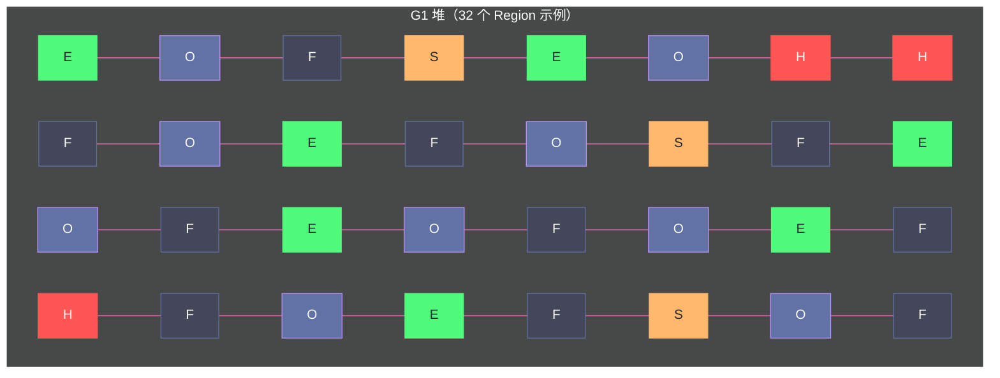

# 07 G1 收集器——Region 化内存与混合回收

**摘要：**

G1（Garbage-First Collector）是 JDK 9 起的服务端默认 GC，设计目标是在**可预测的停顿时间**内实现**高吞吐量**——在 CMS 低延迟和 Parallel 高吞吐之间找到更好的平衡点。G1 的最大创新在于打破了传统分代 GC 的物理堆布局：不再将堆分为固定的新生代/老年代连续区域，而是将整个堆划分为大量等大的 **Region**，每个 Region 可以动态扮演 Eden、Survivor、Old 或 Humongous（大对象）的角色。这使 G1 能够根据停顿目标，**有选择地只回收垃圾最多的 Region**（Garbage-First 命名的由来），而不必每次都回收整个老年代。本文深入剖析 G1 的 Region 化内存模型、并发标记流程（SATB 快照）、Young GC 与 Mixed GC 的执行机制、停顿预测模型，以及 G1 退化为 Full GC 的场景与应对方案。在此基础上，本文进一步拆解 Remembered Set 的内部三级结构（Sparse / Fine / Coarse）与写屏障的具体工作方式、CSet（Collection Set）选择算法与衰减均值预测模型的数学细节、`G1MixedGCCountTarget` 等一组容易被忽视的调优参数，以及一次真实的 Evacuation Failure 生产排查案例，力求把 G1 从"黑盒调参"还原为"可解释的工程决策"。

---

## 第 1 章 G1 诞生的背景：CMS 的三个遗留问题

### 1.1 CMS 的历史局限

在深入 G1 之前，有必要回顾 [[对象生命周期与GC/05 垃圾回收算法——标记清除、复制、标记整理与分代假说]] 中讲过的三种基础回收算法（标记-清除、复制、标记-整理）以及分代假说——这是理解 G1 为什么要"既复制又分 Region"的前提。[[对象生命周期与GC/06 经典垃圾回收器——Serial、Parallel、CMS 深度剖析]] 中我们看到，CMS 通过并发标记大幅降低了老年代 GC 的停顿时间，但留下了三个根本性问题：

**问题 1：碎片化**。CMS 使用标记-清除算法，不压缩整理内存，随着运行时间增长，老年代碎片越来越严重，最终触发需要长时间 STW 的 Full GC（Serial Old）进行碎片整理。

**问题 2：停顿时间不可预测**。CMS 虽然大幅降低了常规停顿，但当发生 Concurrent Mode Failure（并发失败）时，会退化为 Serial Old 进行单线程 Full GC，停顿时间可能从几百毫秒暴增到几十秒，极不稳定。

**问题 3：大堆下仍然停顿过长**。当老年代很大（几十 GB）时，即使并发标记不停顿，重新标记阶段的 STW 也可能较长，无法满足严格的延迟 SLA。

G1 的设计目标，就是系统性地解决这三个问题。

### 1.2 G1 的核心设计理念

G1 的设计包含两个核心理念：

**Region 化（Regionalization）**：打破传统"新生代/老年代是连续内存大块"的假设，将整个堆切成数百到数千个等大的 Region。每个 Region 可以独立地被回收，使 GC 的工作单元从"整代"缩小到"单个 Region"。

**可预测停顿（Predictable Pause）**：G1 通过历史数据建立每个 Region 的**回收价值和回收耗时模型**，每次 GC 在停顿时间目标（`-XX:MaxGCPauseMillis`）的约束下，选择回收价值最高的 Region 集合（Garbage-First！），保证停顿时间的可预测性。

---

## 第 2 章 Region 化内存模型

### 2.1 Region 是什么

G1 将堆内存划分为大量**大小相等的 Region**（默认 1MB，可配置为 1~32MB，必须是 2 的幂次，由 `-XX:G1HeapRegionSize` 或 JVM 自动计算）。

一个 4GB 的堆，按 1MB Region 大小划分，共有 4096 个 Region。

**Region 大小是如何自动计算出来的？** 如果不手动指定 `-XX:G1HeapRegionSize`，HotSpot 会依据初始堆大小 `-Xms`（或默认初始堆）反推一个合适的 Region 大小，目标是让 Region 总数落在一个"既不会因为太多而增加元数据开销、也不会因为太少而丧失回收粒度"的区间（大致是 2048 个左右）。具体做法是把堆大小除以目标 Region 数量，再向上取整到最近的 2 的幂次，并夹在 `[1MB, 32MB]` 的合法区间内。这也是为什么小堆（几百 MB 到 1GB）自动算出的 Region 往往是 1MB，而几十 GB 的大堆会自动算出 8MB、16MB 甚至 32MB——**Region 数量本身、而不是绝对大小，才是 G1 内部治理逻辑真正关心的量**：Region 越多，停顿预测模型有更细的粒度可以挑选（CSet 组合的自由度更高），但 Region 元数据（每个 Region 自身的 RSet、标记位图片段等）的绝对数量也随之增加，两者需要折中。

理解这一点后再回看 2.2 节的 Humongous 判定阈值，就能看出一个隐含的因果链：**初始堆大小的设置，会通过 Region 大小的自动计算，间接决定 Humongous 阈值，进而影响业务对象是否会被误判为大对象**。这是很多团队在换机型、调整 `-Xms` 后 Humongous 分配行为发生变化、却找不到直接原因的根源所在。

每个 Region 在任意时刻，都有且只有一种**角色（Role）**：
- **Eden**：新对象优先分配的区域（等同传统 Eden 区语义）
- **Survivor**：Minor GC / Young GC 后，存活对象的中转区
- **Old**：经历多次 GC 晋升的长生命周期对象
- **Humongous**：大对象专用区域（对象大小超过 Region 大小的 50%）
- **Free**：空闲，尚未分配角色



**传统分代 GC vs G1 的内存布局对比**：

| 维度 | 传统分代（CMS/Parallel）| G1 |
| :--- | :--- | :--- |
| **内存布局** | 新生代/老年代各为连续大块 | 全堆切成等大 Region，动态分配角色 |
| **新生代大小** | 固定比例（通常 1/3 堆）| 动态调整（GC 后根据停顿目标重新分配 Eden Region 数量）|
| **回收单元** | 整代（Minor GC 回收整个新生代）| Region 集合（可以只回收若干 Region）|
| **碎片化** | 标记-清除产生碎片（CMS）| Region 内部可能有碎片，但回收时整个 Region 被清空，本质无碎片 |

### 2.2 Humongous Region——大对象的特殊处理

当一个对象的大小超过 **Region 大小的 50%**（如 Region 为 1MB，对象超过 512KB），该对象被视为大对象（Humongous Object），直接分配到 **Humongous Region**（一个或多个连续的 Region）。

```java
// 若 G1 Region 大小为 1MB（1048576 字节）
// 分配超过 512KB 的数组，会直接进入 Humongous Region
byte[] largeArray = new byte[600 * 1024];  // 600KB，超过 512KB 阈值
```

**Humongous 对象的特殊性**：
- 直接分配在老年代（即使刚创建的新对象，如果足够大也进老年代）
- 参与老年代的并发标记和回收
- Humongous Region 不能被其他对象共用（可能导致空间浪费：最后一个 Humongous Region 可能只用了一部分）

> [!warning] 生产避坑
> 频繁创建大对象（超过 Region 大小 50%）会导致频繁的 Humongous 分配，直接进入老年代，加速老年代填满，触发更频繁的并发标记周期甚至 Full GC。常见罪魁祸首：大 `byte[]`（网络请求/响应的缓冲区）、大 `String`、大集合一次性 `toArray()`。可通过 `-XX:+G1LogLevel=finest` 观察 Humongous 分配情况，必要时增大 Region 大小（`-XX:G1HeapRegionSize=4m`）。

### 2.3 每个 Region 独立的 Remembered Set

传统 GC 只有一个全局卡表（Card Table）记录跨代引用。G1 的每个 Region 都有自己独立的 **Remembered Set（RSet）**，记录"有哪些其他 Region 中的对象持有对本 Region 中对象的引用"。

这使 G1 能够独立地回收任意 Region——只要扫描该 Region 的 RSet，就能找到所有跨 Region 的引用，不需要扫描整个堆。

代价：RSet 本身占用内存（通常为堆大小的 5%~20%），且每次引用赋值都需要通过写屏障更新 RSet，有一定运行时开销。

**为什么必须是"每个 Region 一份 RSet"，而不是像传统分代 GC 那样用一张全局卡表？**

传统分代 GC（Parallel/CMS）只需要解决一个方向的跨代引用问题：老年代对象引用新生代对象是常态（不需要记录），新生代对象引用老年代对象才需要记录（用于 Minor GC 时定位 GC Root 的补充来源）。因为只有两个"代"，一张全局卡表（Card Table）就足够表达"谁引用了新生代"。

但 G1 的回收单元是任意 Region 的任意组合——今天可能只回收 3 个 Old Region，明天可能回收另外 5 个。如果只用一张全局卡表，GC 时仍然需要扫描全堆的卡表才能确定"谁引用了这次要回收的 Region"，Region 化带来的"按需回收"优势就完全丧失了。RSet 把"外部谁引用了我"这个信息**去中心化地存储在被引用 Region 自己身上**，使得回收任意 Region 集合时，只需要合并这些 Region 各自的 RSet，就能拿到完整的"外部引用来源"列表，而不必触碰堆的其余部分。这是 Region 化能够成立的关键前提，也是理解 G1 与 CMS 本质差异的钥匙。

### 2.4 RSet 的内部结构：Sparse / Fine-Grain / Coarse-Grain 三级降级

RSet 并不是一个简单的链表或 HashSet，而是一个为了控制内存开销而设计的**三级降级结构**。原因很直接：如果对每一条跨 Region 引用都精确记录到"字段级别"，内存开销会随着引用密度线性膨胀，在引用密集的对象图（如缓存类应用大量互相持有引用的对象）中可能反而超过 RSet 想要节省的扫描成本。HotSpot 因此设计了按"某个源 Region 指向本 Region 的引用数量"分级存储：

| 层级 | 存储粒度 | 触发条件 | 特点 |
| :--- | :--- | :--- | :--- |
| **Sparse（稀疏）** | 精确记录每一张卡（Card，通常 512 字节）的地址，用 Hash 表存放 `(源 Region, Card Index)` | 某个源 Region 指向当前 Region 的引用数很少（默认几个） | 精度最高，内存最省，但引用一多就会溢出 |
| **Fine-Grain（细粒度）** | 每个源 Region 对应一个位图（Bitmap），位图的每一位代表一张 Card | Sparse 表中某个源 Region 的记录数超过阈值 | 精度仍是 Card 级，但换成位图存储，避免 Hash 冲突和无限增长 |
| **Coarse-Grain（粗粒度）** | 退化为"某个源 Region 曾经引用过本 Region"这一个 bit，不再记录具体 Card | Fine-Grain 位图数量超过 `-XX:G1RSetRegionEntries` 等内部阈值，或源 Region 太多 | 精度最低——回收时必须扫描整个源 Region 才能找到具体引用，但内存占用是常数 |

三级降级的设计哲学是**空间与精度的动态权衡**：绝大多数 Region 之间的引用关系是稀疏的（只有零星几条跨 Region 引用），Sparse 表用极小的内存就能精确表达；但一旦某个源 Region 与目标 Region 的引用变得稠密（例如两个 Region 中的对象存在大量互相持有的场景），继续维护精确记录的边际收益迅速下降，此时退化为位图甚至粗粒度标记反而更划算——牺牲一点扫描精度（多扫一些无关的 Card 甚至整个源 Region），换取 RSet 内存不失控。

> [!warning] 生产避坑
> 当应用中存在大量"发布-订阅""缓存索引"式的强耦合对象图（例如一个全局 `Map<Key, List<Listener>>` 里的 `Listener` 分散在几乎所有 Region 中），RSet 会大量退化为 Coarse-Grain，导致 Mixed GC 阶段不得不扫描远超预期的源 Region 范围，实际停顿显著超出 `MaxGCPauseMillis` 预测。这是 G1 场景下"引用密度过高拖垮 RSet"的典型反例，排查手段是开启 `-Xlog:gc+remset=trace` 观察粗粒度 RSet 的占比。

### 2.5 写屏障如何维护 RSet：Post-Write Barrier 与 Dirty Card Queue

RSet 不是一次性生成的，而是在**每次引用字段写操作发生时增量维护**的。这依赖 G1 在编译期（JIT）为每一次对象引用类型字段赋值插入的**写后屏障（Post-Write Barrier）**。

```java
// 伪代码：G1 的 Post-Write Barrier 逻辑（简化自 HotSpot g1BarrierSet.cpp）
void oop_field_store(oop* field, oop new_value) {
    *field = new_value;                     // 1. 先完成真正的赋值
    if (is_cross_region(field, new_value)) { // 2. 判断新引用是否跨 Region
        byte* card = card_for(field);
        if (*card != DIRTY) {
            *card = DIRTY;                   // 3. 标记该字段所在的 Card 为脏
            enqueue(card, dirty_card_queue);  // 4. 异步放入 Dirty Card Queue，交给并发 refine 线程处理
        }
    }
}
```

关键设计点：写屏障本身只做**极轻量**的工作——判断是否跨 Region、把 Card 标脏、丢进队列，真正"把这条脏 Card 转换为目标 Region RSet 中的一条记录"的工作，交给后台的 **Concurrent Refinement 线程**异步完成，避免用户线程在每次写操作上承担过多开销。这也解释了为什么 RSet 的更新对吞吐量的影响是"轻微而稳定的"，而不是"随引用图变化剧烈波动的"——因为脏卡的产生和消费被解耦成了两个独立的流水线阶段。

`-XX:G1ConcRefinementThreads`（默认等于 `ConcGCThreads`）控制并发 refine 线程数；如果 Dirty Card Queue 的堆积速度超过 refine 线程的处理速度，G1 会让部分用户线程"帮忙"处理队列（Mutator Refinement），这是写操作偶发延迟抖动的常见来源之一，也是高并发写密集型服务在 G1 下需要关注的细节。

---

## 第 3 章 G1 的 GC 类型

### 3.1 Young GC（纯新生代 GC）

当所有 Eden Region 都被填满时，触发 **Young GC**（也称 Minor GC）：

**STW 全程**：Young GC 全程 STW，所有 Java 线程暂停。

**回收集（Collection Set，CSet）**：所有 Eden Region + 所有 Survivor Region。

**算法**：复制算法——将 CSet 中的存活对象复制到新的 Survivor Region（或晋升到 Old Region）。

**完成后**：原来的 Eden Region 全部变为 Free 状态，下一批 Eden Region 重新从 Free Region 中分配。新生代的大小（Eden Region 数量）根据停顿目标动态调整。

**多线程并行**：Young GC 使用多个 GC 线程并行执行复制，线程数由 `-XX:ParallelGCThreads` 控制。多个 GC 线程并行复制存活对象到目标 Region 时，必须避免线程间在同一个 Region 上抢占分配地址——G1 为此给每个 GC 线程分配一块私有的 **PLAB（Promotion Local Allocation Buffer，晋升本地分配缓冲区）**，线程在 PLAB 内以指针碰撞方式快速分配，PLAB 用尽再重新从目标 Region 申请一块，从而把"多线程竞争同一分配指针"的同步开销降到最低。这与新生代 TLAB（Thread Local Allocation Buffer）的设计动机完全一致，只是作用阶段从"用户线程分配新对象"变成了"GC 线程复制存活对象"。

### 3.2 并发标记周期（Concurrent Marking Cycle）

当老年代占用率（Old Region 总量 / 总堆大小）达到 `-XX:InitiatingHeapOccupancyPercent`（IHOP，默认 45%）时，G1 触发**并发标记周期**，为后续的 Mixed GC 做准备。

并发标记周期分为以下阶段：

**初始标记（Initial Mark）—— STW，极短，附在 Young GC 上**

标记直接与 GC Roots 关联的对象。G1 将初始标记**"搭便车"附加在一次 Young GC 上**——利用 Young GC 的 STW 顺带完成初始标记，不额外增加停顿次数。

**根区域扫描（Root Region Scanning）—— 并发**

扫描 Young GC 后新晋升到 Old Region 的 Survivor 对象所指向的引用（这些 Survivor 是新的 GC Root 候选）。**必须在下一次 Young GC 开始前完成**（否则 Young GC 会等待根区域扫描完成），通常很快。

**并发标记（Concurrent Mark）—— 并发，最耗时**

对整个堆（全部 Region）进行并发可达性分析，标记所有存活对象。与用户线程并发，不停顿。

**并发标记为什么可以和用户线程"同时"跑而不冲突？TAMS 指针的作用**

并发标记最棘手的问题是：标记线程在遍历对象图的同时，用户线程仍在不断分配新对象、修改引用关系。如果标记线程误把"标记开始之后新分配的对象"当成待处理的旧对象扫描，不仅浪费 CPU，还可能因为新对象初始化未完成而扫描到脏数据。

G1 的解法是给每个 Region 记录一个 **TAMS（Top At Mark Start，标记开始时的 Top 指针）**。Region 内 `[bottom, TAMS)` 区间是标记开始前已存在的对象，需要走正常的标记流程（查标记位图、递归扫描引用）；`[TAMS, top)` 区间是标记开始后新分配的对象，G1 直接认为它们是"隐式存活"的（不需要标记，本轮直接跳过判定，等下一轮 GC 处理）。这是一种用空间换时间、用短暂的"过度保守"换取并发安全的经典权衡——多保留一点新分配对象不会造成内存泄漏（下次标记周期会重新评估），但如果因为竞态条件漏标了一个旧对象，则是致命的正确性问题。

标记结果存储在一个独立的**标记位图（Marking Bitmap）**中，每个对象对应位图中的一个 bit，标记线程只需要对位图做原子置位，不需要修改对象头，避免了与用户线程在对象头上的写竞争。

G1 使用 **SATB（Snapshot At The Beginning，原始快照）** 算法处理并发标记期间的引用变化（与 CMS 的增量更新不同）：

- **SATB 的核心思想**：在并发标记开始时，逻辑上记录整个堆的对象引用关系快照；在标记过程中，如果用户线程删除了某个引用（`a.field = null`，原来 `a.field` 指向对象 X），写屏障会将被删除的原始引用（X）记录到 SATB 队列，保证 X 在本次 GC 中不会被错误回收（即使 X 在标记期间变成了"孤儿"，也等下次 GC 再处理）。

```java
// 伪代码：G1 的 Pre-Write Barrier（SATB 写前屏障，简化自 g1BarrierSet.cpp）
void oop_field_store_pre(oop* field, oop new_value) {
    if (marking_is_active()) {           // 只在并发标记周期内才生效，其余时间是空操作
        oop old_value = *field;          // 取出即将被覆盖的旧引用
        if (old_value != null && !already_marked(old_value)) {
            satb_queue.enqueue(old_value); // 把即将失去引用的旧对象记入 SATB 队列
        }
    }
    *field = new_value;                  // 真正的赋值动作（这里发生在屏障之后）
}
```

这段屏障代码解释了为什么 SATB 保证的是"标记开始时刻可达的对象一定不会被本轮回收"——它并不关心新引用指向了谁（新引用指向的对象本身是可达的，天然会被扫描到），只关心"原来的引用去哪了"，把这个即将丢失的引用信息保留下来，等价于在逻辑上"冻住"了标记开始那一刻的对象图快照。

- **为什么 G1 用 SATB 而不是增量更新（CMS 的方式）**：CMS 的增量更新在赋值发生后需要把新引用指向的对象（及其所在的黑色对象）重新标记为待扫描，Remark 阶段要重新扫描所有被写过的对象；SATB 在 Remark 阶段只需要把 SATB 队列里堆积的旧引用当作新的扫描起点处理一次，队列长度基本只取决于并发期间的删除引用次数，不会像增量更新那样随对象图规模扩大而线性增长。在对象图庞大的场景下，SATB 的重新标记开销更可预测，停顿更短。这也是 G1 面向大堆设计时必须做出的取舍——大堆意味着并发标记耗时更长，增量更新累积的待重扫对象会更多，SATB 的队列式记账方式伸缩性更好。

- **SATB 的代价**：即使一个对象在标记期间已经变成真正的垃圾（不再被任何存活对象引用），只要它在标记开始时可达，SATB 也会保留它，导致它至少要多存活一个 GC 周期才能被回收（所谓"漂浮垃圾"，Floating Garbage）。这是 SATB 用正确性换来的固有代价，与 CMS 面临的漂浮垃圾问题本质相同，只是触发条件不同（SATB 因删除引用触发，CMS 增量更新因新增引用触发）。

**最终标记（Final Mark / Remark）—— STW，短**

处理 SATB 队列中记录的所有变动，完成最后的标记确认。通常只有几十毫秒。由于绝大部分标记工作已经在并发阶段完成，Remark 阶段只需要清空各线程的 SATB 队列残余部分、处理弱引用（`WeakReference`/`SoftReference` 等）的最终判定，理论上其耗时与堆大小基本无关，只与并发期间产生的引用变化量相关——这正是 G1 相比 CMS 在大堆场景下 Remark 停顿更稳定的根本原因。

**清理（Cleanup）—— STW（极短）+ 并发**

- STW 部分：统计每个 Region 的存活率（存活对象占 Region 大小的比例），找出完全空的 Region（存活率 0%）直接归还为 Free，更新 RSet 等。这部分很短。
- 并发部分：将空 Region 归还到空闲列表。

### 3.3 Mixed GC——G1 的核心创新

并发标记完成后，G1 进入 **Mixed GC** 阶段——这是 G1 区别于所有前代收集器的核心创新。

**Mixed GC 的"混合"含义**：每次 Mixed GC 的回收集（CSet）包含：
- **所有 Young Region**（Eden + Survivor，必须全部回收，与 Young GC 一致）
- **部分 Old Region**（根据停顿目标和回收价值，精心选择的若干 Old Region）

这就是"混合"——新生代 + （部分）老年代混合回收。

**为什么只回收部分 Old Region？**

G1 通过并发标记知道了每个 Old Region 的存活对象数量和预计回收时间。根据停顿时间目标（`-XX:MaxGCPauseMillis`），G1 从 Old Region 中**优先选择回收收益最高的（垃圾最多的）**，直到预计 STW 时间接近目标上限为止。

这正是"**Garbage-First**"命名的由来：优先回收垃圾最多的 Region。

**Mixed GC 的算法**：复制算法——将 CSet 中所有 Region 的存活对象复制到新的 Region（Old 或 Free），整个旧 Region 清空后归还为 Free 状态。复制过程完全避免了碎片化（Region 的清空是整块的，不存在 Region 内部的碎片问题）。

**Mixed GC 的执行次数**：一次并发标记周期完成后，通常会连续执行多次 Mixed GC（每次回收一批 Old Region），直到老年代占用率降低到 `-XX:G1HeapWastePercent`（默认 5%，即允许有 5% 的老年代空间是垃圾未回收）以下为止。

```
并发标记 → Mixed GC 1（回收部分 Old）→ Mixed GC 2（继续回收）→ Mixed GC 3 → ... → Young GC → ...
                                         （多次 Mixed GC 直到老年代垃圾率低于 G1HeapWastePercent）
```

> [!note] 设计哲学：Mixed GC 让"回收新生代"和"回收老年代"不再是两件事
> 传统分代 GC（Parallel/CMS）把"新生代 GC"和"老年代 GC"当作两个独立触发、独立执行的过程，彼此之间没有任何协同——Minor GC 只管新生代，Major/Full GC 才处理老年代，中间往往夹杂着长时间的空档期，直到老年代压力积累到临界点才被动触发一次代价高昂的整堆回收。G1 的 Mixed GC 把这两件事**焊接在同一次 STW 里**：既然反正要停顿一次做 Young GC，不如在同一次停顿的预算里，"顺带"处理一部分老年代垃圾。这不是简单的功能叠加，而是从"被动响应式回收"转向"主动持续摊销式回收"的范式转变——老年代的回收压力被拆解成许多次可控的小额支出，而不是攒到某个时间点集中爆发。这也是为什么 G1 环境下"健康"的 GC 日志应该呈现出 Mixed GC 均匀穿插在 Young GC 之间的节奏，而不是长时间只有 Young GC、突然跳出一次巨大的 Full GC。

---

## 第 4 章 停顿预测模型——可预测停顿的秘密

### 4.1 停顿预测的基本原理

G1 的停顿预测是基于**衰减均值（Decaying Average）** 的历史统计模型：

对每个 Region，G1 在历史上多次 GC 中收集了"回收该 Region 耗时 T、回收的垃圾量 V"的数据。G1 用衰减均值（更近的数据权重更大）来估计**当前回收该 Region 的预计耗时**。

在 Young GC 和 Mixed GC 时，G1 按如下方式构建 CSet：
1. 必须包含所有 Young Region（不可省略）
2. 估算所有 Young Region 的回收总时间 `T_young`
3. 剩余停顿预算 = `MaxGCPauseMillis - T_young`
4. 按回收收益（垃圾量/预计耗时，越高越优先）排序 Old Region
5. 依次添加 Old Region 到 CSet，直到剩余停顿预算不足为止

这样，每次 GC 的 STW 时间在统计意义上**接近 `MaxGCPauseMillis` 但不超过**（实际可能略有偏差，是预测而非保证）。

**一个简化的数值推演**，帮助建立直观感受（数字为示例，非真实测量值）：

- 假设 `MaxGCPauseMillis = 200`，本次触发的是 Mixed GC；
- 当前 Eden + Survivor 共 40 个 Region，根据历史衰减均值，预测复制这批 Young 对象耗时 `T_young = 120ms`；
- 剩余停顿预算 `200 - 120 = 80ms`；
- 候选 Old Region 池（已通过 `G1MixedGCLiveThresholdPercent` 预筛选）中有 15 个 Region，按"预计垃圾量 / 预计复制耗时"排序后，前 3 个 Region 的预计复制耗时分别是 25ms、22ms、20ms，累计 67ms，仍在预算内，纳入 CSet；
- 第 4 个候选 Region 预计耗时 18ms，累计将达到 85ms，超过剩余预算 80ms，G1 停止继续添加，本次 CSet 最终锁定在"全部 Young Region + 3 个 Old Region"；
- 剩余 12 个候选 Old Region 留给下一次 Mixed GC 继续处理，直到候选池耗尽或触及 `G1HeapWastePercent` 止损线。

这个推演过程说明了一个容易被误解的地方：**G1 每次到底回收多少个 Old Region，是停顿预算动态计算出来的结果，而不是一个配置好的固定数字**——`G1MixedGCCountTarget` 只是这个动态计算过程里的一个参考分母，实际每轮纳入的 Region 数会随 Young GC 耗时的波动而波动。

### 4.2 衰减均值模型的数学细节：为什么不用简单平均

如果用简单算术平均来估计"回收某个 Region 需要多久"，会有一个明显缺陷：GC 早期（JVM 刚启动，JIT 未热身、缓存未预热）的耗时数据会持续拖累后续所有预测，即使系统已经进入稳定运行状态，历史上的"冷启动噪声"仍然占据相同的权重。G1 采用的是类似 TCP RTT 估算（RTO 计算）中使用的**指数衰减加权平均（Exponentially Weighted Moving Average）**：

```text
predicted_new = α × sample_new + (1 - α) × predicted_old
```

其中 `sample_new` 是本次 GC 实际观测到的耗时/收益样本，`predicted_old` 是历史预测值，`α`（衰减系数，通常是一个较小的常数）决定"最近一次样本"相对"历史累积预测"的权重。这种迭代式公式的效果是：**距离现在越远的历史样本，对当前预测的影响呈指数级衰减**，模型能够快速跟上应用负载特征的变化（例如从流量低峰进入高峰，对象存活模式变化），而不会被很久以前的异常值长期干扰。G1 对下面几类关键指标都维护了独立的衰减均值预测器：

- 每个 Region 的"复制一个存活对象所需的平均时间"（不同 Region 存活率不同，单位耗时会有差异）
- Young GC 中"扫描一个 Root 引用的平均耗时"
- Remembered Set 扫描的平均耗时（每个待处理 Card 的平均处理时间）
- 对象晋升到 Old Region 的平均速率（用于自适应调整 Eden 大小和 IHOP）

这些独立的小模型组合起来，才构成了 G1 对"这次 GC 大概要多久"的整体预测能力——理解这一点后就能明白，为什么应用刚启动时 G1 的停顿预测往往不准（历史样本不足，衰减均值还在收敛），以及为什么长期运行、负载稳定的服务，G1 的停顿会越来越贴近 `MaxGCPauseMillis` 目标。

### 4.3 CSet 候选集的产生：从"存活率排序"到 G1MixedGCLiveThresholdPercent

停顿预测模型决定了"预算内能塞进多少 Old Region"，但在此之前还有一步经常被忽视：**哪些 Old Region 有资格进入候选排序队列**。这一步发生在并发标记的 Cleanup 阶段——G1 统计出每个 Old Region 的存活对象比例后，只有存活率低于 `-XX:G1MixedGCLiveThresholdPercent`（默认 85%）的 Region，才会被放入"候选回收集合"参与后续的价值排序；存活率高于这个阈值的 Region 被认为"性价比太低"（复制成本高、能腾出的空间少），直接排除在 Mixed GC 候选之外，这些 Region 只有等到未来存活对象继续死亡、存活率下降后才会重新进入候选池。

这一设计避免了一种容易被忽视的浪费：如果不设阈值，G1 可能会把一个存活率 95% 的大 Region 排进候选队列，即使它恰好垃圾量的绝对值不小（因为 Region 本身很大），复制 95% 的对象所付出的 STW 时间成本相对于腾出的 5% 空闲空间而言极不划算。`G1MixedGCLiveThresholdPercent` 本质上是一道预筛选闸门，先把"注定亏本"的 Region 挡在门外，再让停顿预测模型在真正有性价比的候选池中做精细排序。

### 4.4 Mixed GC 何时停止：G1HeapWastePercent 与 G1MixedGCCountTarget 的协同

一次并发标记周期识别出的候选 Old Region 通常不会在一次 Mixed GC 中全部处理完——如果一次性把所有候选 Region 都塞进 CSet，单次停顿会远超 `MaxGCPauseMillis`。G1 用两个参数共同控制"分几批处理、什么时候彻底停止"：

**`-XX:G1MixedGCCountTarget`**（默认 8）：期望把候选 Old Region 集合平摊到大约 8 次 Mixed GC 中处理完。它不是一个硬性次数上限，而是用于计算"平均每次 Mixed GC 应该纳入多少个 Old Region"的分母——候选 Region 总数除以这个目标次数，得到每次的期望数量，再结合停顿预算做上限约束。调小这个值，意味着期望更快处理完候选集合，代价是单次 Mixed GC 会塞入更多 Old Region，停顿时间上升。

**`-XX:G1HeapWastePercent`**（默认 5）：当候选 Old Region 集合中剩余的"总垃圾量"占堆的比例已经低于这个百分比时，G1 认为**继续做 Mixed GC 的收益已经不值得再承受一次 STW**，直接停止本轮 Mixed GC 序列，等待下一次并发标记周期重新评估。这是一个"边际收益递减"的止损阈值——垃圾率越低的 Region 集合，复制成本相对收益越差。

两者的协同关系可以概括为：`G1MixedGCCountTarget` 决定"正常情况下要跑几轮"，`G1HeapWastePercent` 决定"提前收工的止损线"。生产环境如果发现 Mixed GC 轮次频繁被过早截断（老年代垃圾清理不彻底、很快又触发下一轮并发标记），可以适当降低 `G1HeapWastePercent`（如降到 1%~2%），逼迫 G1 更彻底地清理老年代，代价是总的 Mixed GC 停顿时间累积会增加。

### 4.5 参数调优

**`-XX:MaxGCPauseMillis=200`**（默认 200ms）：停顿时间目标。不是硬保证，而是 G1 的优化目标。设置过小（如 50ms），G1 每次 GC 选择的 CSet 很小，回收进度慢，可能导致堆快速填满，触发 Full GC。通常建议根据应用实际测试，而不是盲目调小。

**`-XX:G1NewSizePercent=5`**（默认 5%）/ **`-XX:G1MaxNewSizePercent=60`**（默认 60%）：新生代占堆的最小/最大比例，控制 Young Region 数量的动态范围。

**`-XX:InitiatingHeapOccupancyPercent=45`**（IHOP，默认 45%）：触发并发标记的老年代占用阈值。JDK 9+ 引入**自适应 IHOP（Adaptive IHOP）**，G1 可以根据历史数据自动调整此阈值，不需要手动设置。

**`-XX:G1MixedGCCountTarget=8`**：一次并发标记周期后，期望 Mixed GC 的最大次数（默认 8 次），控制每次 Mixed GC 回收的老年代 Region 数量（并发标记标识的待回收 Old Region 总数 / MixedGCCountTarget）。

---

## 第 5 章 G1 的 Full GC——退化场景

### 5.1 什么情况下 G1 会触发 Full GC

G1 的设计目标是用 Young GC + Mixed GC 完成所有内存回收，**理想状态下 Full GC 永远不会发生**。但以下场景会迫使 G1 退化为 Full GC：

**场景 1：堆空间不足（Evacuation Failure，也叫 to-space exhausted）**

Mixed GC 或 Young GC 的复制过程中，需要将存活对象复制到新的 Free Region，但此时没有足够的 Free Region 可用——即整个堆已经快满了，GC 都来不及腾出空间。

Evacuation Failure 的发生机制值得展开：G1 在执行一次 Young GC 或 Mixed GC 之前，并不能精确预知"这次要复制的存活对象总量"，只能依赖前面提到的衰减均值模型做**估算**。如果估算偏差较大（例如某次业务高峰对象存活率突然远超历史均值），或者堆本身已经接近满载、Free Region 储备不足，GC 线程在复制过程中会遇到"目标 Region 已满，且没有下一个 Free Region 可用"的情况——这就是 to-space exhausted。此时已经复制过去的对象无法回退，尚未复制的对象也无处可去，G1 只能放弃本次 Evacuation，把这些"来不及转移"的对象**就地保留在原 Region 中**（通过设置一个特殊的转发状态，标记该对象暂不移动），STW 阶段结束后立即触发一次 Full GC 来彻底整理堆空间。

这时 G1 触发 **Full GC**（JDK 10 之前是单线程 Serial 式，JDK 10 之后改为并行，性能大幅改善，参见 JEP 307: Parallel Full GC for G1）。

> [!warning] 生产避坑：GC 日志中的 "to-space exhausted" / "Evacuation Failure"
> 如果在 GC 日志（`-Xlog:gc*`）中看到 `to-space exhausted` 或 `Evacuation Failure` 字样，说明堆已经处于危险的高水位状态，紧随其后几乎一定会出现一次长时间 STW 的 Full GC。这是比"频繁 Mixed GC"更严重的信号，需要立即排查：（1）近期是否有内存泄漏；（2）堆是否设置过小；（3）是否有突发流量导致对象存活率骤增；（4）`MaxGCPauseMillis` 是否设置过小导致老年代回收进度长期落后于分配速度。

**场景 2：Humongous 对象无法分配**

超大对象需要连续的 Humongous Region，但即使有足够的空闲 Region，它们不是连续的，也无法满足大对象分配需求。G1 在分配 Humongous 对象失败时，会先尝试触发一次 Young GC（顺带做一次 Region 整理，看能否腾出连续空间），如果仍然找不到足够的连续 Free Region，则退化为 Full GC——Full GC 会对整堆做压缩整理，把碎片化的 Free Region 拼接成连续区域，这是唯一能解决"总空闲量够但连续性不够"问题的手段，因为 G1 的 Young/Mixed GC 都不会主动整理 Free Region 之间的碎片分布。

这解释了为什么"总堆使用率不高，但仍然频繁 Full GC"的现象往往和大对象分配相关——问题不是内存不够，而是**连续内存**不够。

**场景 3：并发标记速度跟不上分配速度**

如果对象分配速度极快，在 G1 完成并发标记之前老年代就已经满了，G1 来不及通过 Mixed GC 回收空间，触发 Full GC（类似 CMS 的 Concurrent Mode Failure）。这种情况下 GC 日志中通常能看到并发标记周期被启动，但在其完成之前又发生了多次 Young GC，老年代占用率持续上升直至触及堆上限。根本原因是分配速率与并发标记速率之间的"赛跑"失败——并发标记线程数（`-XX:ConcGCThreads`）不足、CPU 资源被业务线程大量抢占、或者对象晋升速度突然加快，都可能导致这场赛跑失败。

### 5.2 生产排查案例：一次由大对象引发的 Full GC 复盘

某订单服务在大促期间频繁出现十余秒的 STW 停顿，业务侧表现为接口超时和线程池堆积。排查过程可以作为上述三类触发场景在真实生产环境中如何交织出现的样本：

**现象观测**：通过 `-Xlog:gc*:file=gc.log:time,uptime,level,tags` 采集的 GC 日志显示，堆总体使用率在 Full GC 触发前只有 60% 左右，远未到堆满的程度，但 Full GC 依然被触发，且日志中能看到反复出现的 `Humongous` 分配记录。

**根因定位**：业务代码中有一段"批量导出订单明细"的逻辑，会把一批订单序列化为一个较大的 `byte[]`（用于压缩后落盘），单次分配大小普遍在 800KB~1.5MB 之间。该环境的 Region 大小按堆规格自动计算为 2MB，Humongous 阈值（Region 的 50%）为 1MB，这批对象绝大多数超过了阈值，被判定为 Humongous 对象，直接进入老年代的 Humongous Region。大促期间导出任务并发量陡增，短时间内产生大量生命周期很短、但体积超阈值的 Humongous 对象，这些对象在死亡后留下大量不连续的 Free Region 碎片，新的 Humongous 分配请求经常因为"找不到连续空闲 Region"而失败，最终触发 Full GC 做整堆压缩整理。

**处理方案**：短期通过 `-XX:G1HeapRegionSize=4m` 把 Region 调大，使这批 800KB~1.5MB 的对象不再触及 Humongous 阈值（4MB Region 的 50% 阈值是 2MB），恢复走正常的 Young GC 路径分配和回收；中期推动业务侧改造导出逻辑，将大块 `byte[]` 拆分为流式写出（分批写文件而不是一次性拼一个大数组），从根本上消除超大对象分配。这个案例说明：Full GC 的表面症状（长时间 STW）背后，根因可能与"堆是否够大"完全无关，而是"内存布局的连续性"问题，排查时不能只看堆使用率，还要结合 GC 日志里的 Humongous 分配记录和 Region 碎片情况。

这个案例也提示了一套可以固化为常规监控的检查项，避免同类问题在下一次大促重演：

- 持续采集 GC 日志中 `Humongous` 相关记录的出现频率，环比增长超过阈值即告警；
- 监控老年代碎片情况的间接指标——当 Free Region 总量充足但 Humongous 分配仍然频繁失败时，本身就是碎片化的信号；
- 在压测环境提前用与生产同规格的对象大小分布回放流量，观察 Region 大小是否会让相当比例的对象越过 50% 阈值；
- 把 `-XX:G1HeapRegionSize` 纳入容量规划的常规评审项，而不是只在出问题之后才回头调整。

### 5.3 Full GC 的代价

G1 的 Full GC 会**停止所有用户线程，回收整个堆**。JDK 10 之后虽然改为多线程并行，但对于几十 GB 的大堆，Full GC 仍然可能停顿数秒到数十秒。Full GC 是 G1 性能调优的重点规避目标。

### 5.4 避免 Full GC 的调优方向

**增大堆大小**：最直接的方法，增加 Free Region 数量，降低堆满的风险。

**降低 IHOP 阈值**（`-XX:InitiatingHeapOccupancyPercent`）：让并发标记更早触发，在老年代还有较多空闲时就开始回收，避免堆被撑满。

**减小 `MaxGCPauseMillis`**：让每次 Mixed GC 回收更多 Old Region（停顿时间预算增加，CSet 可以更大），加快老年代回收速度（但会增加单次停顿时间）。

**减少大对象分配**：大对象直接进老年代，加速老年代填满。减少大对象是降低 G1 Full GC 频率最有效的业务层面优化。

**增大 Region 大小**（`-XX:G1HeapRegionSize`）：对于频繁出现 Humongous 的场景，增大 Region 阈值，使更多对象走正常 Young GC 路径。

---

## 第 6 章 G1 vs CMS：工程选型指南

| 维度 | CMS | G1 |
| :--- | :--- | :--- |
| **JDK 支持** | JDK 5~13（JDK 9 废弃，JDK 14 移除）| JDK 7+ 可用，JDK 9 起默认 |
| **算法** | 新生代：复制；老年代：并发标记-清除 | 全堆：Region 化并发标记 + 复制 |
| **碎片化** | 严重（老年代标记-清除）| 基本无（Region 整块回收+复制）|
| **停顿可预测性** | 差（Concurrent Mode Failure 时停顿暴增）| 好（基于模型的停顿预测）|
| **内存利用率** | 高（不预留 Region 缓冲）| 略低（需要维护 RSet，占用 5%~20% 内存）|
| **吞吐量** | 并发阶段 CPU 竞争，吞吐量有损失 | 与 CMS 相当或略好（Mixed GC 效率更高）|
| **调优复杂度** | 高（碎片、CMF、PretenureSizeThreshold 等）| 中（主要调 MaxGCPauseMillis 和 IHOP）|
| **适用堆大小** | < 4GB（堆大时 Remark 停顿长）| 4GB~数百 GB（Region 化，扩展性好）|
| **适用场景** | JDK 8 延迟敏感，堆 < 4GB | JDK 9+，堆 4GB+，需要可预测停顿 |

> [!note] 设计哲学：G1 不是"更快的 CMS"
> G1 不只是 CMS 的改进版，而是整体架构的重新设计。CMS 和 G1 的目标类似（低延迟），但解决路径截然不同。CMS 在传统分代布局上打补丁（并发标记避开 STW），G1 从根本上改变内存布局（Region 化，使回收单元从"整代"变为"若干 Region"）。理解这个本质差异，才能理解为什么 G1 能解决 CMS 的碎片问题，以及 G1 的 RSet 内存开销从何而来。

### 6.1 三代收集器的完整坐标：G1 / CMS / ZGC 该怎么选

把 [[对象生命周期与GC/08 ZGC——亚毫秒停顿的着色指针与读屏障]] 纳入同一张坐标系，能更清楚地看出 G1 在整个 HotSpot GC 演进链条中的位置——它既不是延迟最低的方案，也不是吞吐最高的方案，而是在两者之间找到一个**工程上可控、调优成本适中**的平衡点：

| 维度 | CMS | G1 | ZGC（JDK 15+ 生产可用） |
| :--- | :--- | :--- | :--- |
| **内存布局** | 分代连续大块 | Region 化 | Region 化（更细粒度，支持动态调整） |
| **典型停顿量级** | 几十 ms～不可控（CMF 时秒级） | 几十~几百 ms | 亚毫秒~几毫秒 |
| **核心机制** | 并发标记-清除 | SATB + 停顿预测 + Mixed GC | 着色指针 + 读屏障 + 并发转移 |
| **是否压缩整理** | 老年代不压缩（会碎片化） | Region 级压缩（复制算法） | 并发压缩（转移阶段与用户线程并发） |
| **STW 阶段数量** | 多（Init/Remark 等） | 少（Initial Mark 附加在 Young GC 上） | 极少，且时间与堆大小基本无关 |
| **吞吐量损耗** | 中（并发标记占 CPU） | 中（写屏障 + RSet 维护） | 较高（读屏障 + 着色指针带来的额外开销） |
| **内存开销** | 低 | RSet 占堆 5%~20% | 着色指针位需要更大地址空间，间接内存开销更高 |
| **可用堆规格** | 4GB 以下体验较好 | 4GB~数百 GB | 数十 GB~TB 级，且停顿几乎不随堆增大而增长 |
| **适用场景** | 遗留系统维护（已废弃，不建议新项目使用） | 通用服务端默认选择 | 超大堆、极端低延迟 SLA（交易系统、高频服务） |

选型的第一原则是**不要为了追求理论上更优的技术指标，引入不必要的复杂度**。如果堆规格在数 GB 到数十 GB、停顿目标在百毫秒级可以接受，G1 已经是性价比最高的选择——它是 JDK 9+ 的默认收集器，社区实践和运维工具链最成熟，调优参数的经验案例最丰富。只有当业务对停顿时间有近乎苛刻的要求（例如高频交易、实时风控），或者堆规格进入数百 GB 甚至 TB 级、G1 的并发标记开始明显跟不上分配速度时，才需要评估迁移到 ZGC 或 [[对象生命周期与GC/09 Shenandoah——与 ZGC 殊途同归的并发压缩]] 的成本收益。

值得注意的是，ZGC 和 Shenandoah 并不是"G1 的简单替代品"——它们解决延迟问题的路径与 G1 完全不同（着色指针/Brooks 转发指针 + 读屏障，而不是停顿预测模型），代价是更高的内存开销和相对更复杂的故障排查手段（例如着色指针对 `jmap`/`jstack` 等传统诊断工具的兼容性要求更高）。从 G1 迁移到 ZGC 之前，应该先确认当前的延迟问题是否真的是 G1 架构本身的天花板（例如并发标记耗时随堆增大而线性增长导致的老年代填满风险），还是可以通过本文列出的调优手段（调整 IHOP、Region 大小、消除大对象分配）在 G1 范围内解决——后者的迁移成本和风险都远低于更换收集器。

---

## 第 7 章 G1 的关键 JVM 参数速查

| 参数 | 含义 | 默认值 | 建议 |
| :--- | :--- | :--- | :--- |
| `-XX:+UseG1GC` | 启用 G1 | JDK 9+ 默认 | JDK 8 需显式设置 |
| `-XX:MaxGCPauseMillis` | 停顿时间目标（ms）| 200 | 根据应用 SLA 设置，不要设置过小 |
| `-XX:G1HeapRegionSize` | Region 大小（1~32MB）| JVM 自动计算 | 大对象问题严重时适当增大 |
| `-XX:InitiatingHeapOccupancyPercent` | 触发并发标记的老年代占用比 | 45 | JDK 9+ 自适应，一般不手动设置 |
| `-XX:G1MixedGCCountTarget` | 期望 Mixed GC 次数上限 | 8 | 降低此值使每次 Mixed GC 回收更多 |
| `-XX:G1HeapWastePercent` | Mixed GC 停止阈值（老年代垃圾率）| 5 | 降低可让 G1 更彻底地清理老年代 |
| `-XX:G1MixedGCLiveThresholdPercent` | Old Region 进入 Mixed GC 候选集的存活率上限 | 85 | 存活率高于此值的 Region 不参与本轮 Mixed GC |
| `-XX:G1RSetUpdatingPauseTimePercent` | RSet 更新占停顿预算的比例上限 | 10 | RSet 扫描耗时过高时可适当调大 |
| `-XX:G1ConcRefinementThreads` | 并发 refine 线程数 | 等于 ConcGCThreads | 脏卡堆积明显时可适当增大 |
| `-XX:ParallelGCThreads` | STW 并行 GC 线程数 | CPU 核数（≤8 时等于核数）| 容器环境需根据实际 CPU 配额设置 |
| `-XX:ConcGCThreads` | 并发 GC 线程数 | ParallelGCThreads / 4 | 通常不需要调整 |

> [!info] 核心概念：参数调优的正确姿势
> G1 的绝大多数参数都是"影响内部算法行为的旋钮"，而不是"独立生效的开关"。孤立地调大或调小某个参数，往往只是把瓶颈从一个环节转移到另一个环节——例如降低 `MaxGCPauseMillis` 看似能缩短单次停顿，实际可能因为每次 Mixed GC 回收的 Old Region 太少，导致老年代垃圾堆积更快，反而更频繁触发 Full GC。真正有效的调优流程是：先通过 `-Xlog:gc*` 采集足够长时间的 GC 日志，定位具体是哪个阶段（Young GC、并发标记、Mixed GC、Evacuation Failure）耗时异常或频率异常，再针对性调整对应参数，每次只调一个变量并观察一段时间的效果。

---

## 第 8 章 总结

G1 是 HotSpot GC 演进历史上最重要的里程碑之一。它的核心贡献：

**Region 化内存布局**：打破了"代"的物理边界，使 GC 的工作粒度从"整代"降低到"若干 Region"，实现了回收单元的精细控制。

**SATB 快照**：比 CMS 的增量更新更适合大堆场景，并发标记期间的引用变化处理开销更可预测。

**Mixed GC**：可以在同一次 GC 中同时回收新生代和部分老年代，在单次 GC 内兼顾了新老两代的垃圾，效率远高于"新生代 GC + 偶发全堆 Full GC"的两段式模型。

**停顿预测模型**：基于历史统计的衰减均值模型，使 G1 能在停顿时间目标约束下做出最优回收决策，停顿时间的可预测性远超 CMS。理解 CSet 的构建过程——从 `G1MixedGCLiveThresholdPercent` 的预筛选，到衰减均值排序，再到 `G1HeapWastePercent` 的止损截断——才能真正理解"Garbage First"这个名字背后的工程决策链条，而不只是停留在"优先回收垃圾多的 Region"这句表面描述上。

**分级 RSet 与写屏障**：Sparse/Fine/Coarse 三级降级结构，是 G1 在"记录跨 Region 引用的精度"与"RSet 自身内存开销"之间做出的动态权衡；写屏障把维护成本拆分为"轻量的用户线程标脏"和"异步的并发 refine 处理"两个阶段，是 G1 能在可接受的吞吐损耗下支撑 Region 化内存模型的关键基础设施。

**局限性**：RSet 内存开销大（5%~20%，引用密集场景可能进一步退化为大量 Coarse-Grain 记录），写屏障对吞吐量有轻微影响，大堆下并发标记速度仍可能成为瓶颈（超大堆需要 ZGC/Shenandoah）。Evacuation Failure 和 Humongous 分配失败退化为 Full GC，是 G1 生产环境中最值得建立监控告警的两类信号。

把这些机制串起来看，G1 的整体设计思路可以概括为一句话：**用可观测、可统计的历史数据，替代对未来的确定性假设**——停顿预测靠衰减均值而不是精确计算，RSet 精度靠引用密度动态降级而不是一刀切的固定粒度，Mixed GC 的节奏靠止损阈值而不是硬性次数限制。这种"用统计模型驯服不确定性"的思路，也是理解后续 ZGC、Shenandoah 等收集器设计取舍的一条重要参照线。

**RSet 的分级降级与写屏障的两段式设计**：Sparse/Fine/Coarse 的三级结构，本质是在"记录精度"和"存储成本"之间随引用密度动态权衡；把写屏障拆分为"轻量同步标脏"和"异步并发 refine"两个阶段，是 G1 能够把跨 Region 引用维护的吞吐损耗控制在可接受范围内的关键工程手段——这一思路后续也被 ZGC、Shenandoah 等更年轻的收集器在各自的屏障设计中继续沿用和演化。

下一篇 [[对象生命周期与GC/08 ZGC——亚毫秒停顿的着色指针与读屏障]] 将进入下一代 GC 的领域：ZGC 通过**着色指针（Colored Pointer）** 和**读屏障（Load Barrier）** 实现了并发对象转移，将 STW 停顿从 G1 的几十~几百毫秒降到了亚毫秒级别。

---

## 参考文献

1. Detlefs et al., "Garbage-First Garbage Collection", Proceedings of the 4th international symposium on Memory management (ISMM 2004)
2. 周志明, 《深入理解 Java 虚拟机（第三版）》, 第 3.7 章：Garbage First 收集器
3. Monica Beckwith, "G1: One Garbage Collector To Rule Them All", JavaOne 2013
4. 美团技术博客, "新一代垃圾回收器ZGC的探索与实践", 2020
5. OpenJDK Wiki, "G1 GC Tuning Guide", wiki.openjdk.org
6. JEP 248: Make G1 the Default Garbage Collector (JDK 9)

---

> [!note] 思考题
> 1. G1 将堆划分为大小相等的 Region（默认 2048 个），每个 Region 可以是 Eden、Survivor、Old 或 Humongous。当一个对象大小超过 Region 的 50% 时被分配到 Humongous Region。频繁创建大于 Region 50% 的对象会导致什么问题？你如何调整 G1 参数来缓解 Humongous 分配的性能影响？
> 2. G1 的 Mixed GC 会同时回收 Young Region 和部分 Old Region。G1 通过 Remembered Set（RSet）记录跨 Region 的引用关系，避免全堆扫描。RSet 的维护成本约占堆的 10%-20%——在什么场景下 RSet 的内存开销会特别大？如果 Region 之间的跨引用非常密集，G1 的效率会退化到什么程度？
> 3. G1 的 `-XX:MaxGCPauseMillis` 设置目标停顿时间（默认 200ms）。G1 通过统计每个 Region 的回收价值（可回收空间/回收耗时）来选择性回收——这就是'Garbage First'名称的由来。但如果你将目标停顿设为 10ms，G1 可能每次只回收极少的 Region，导致堆空间不断增长。最终会触发什么？这种'目标停顿过低导致反效果'的现象如何避免？
