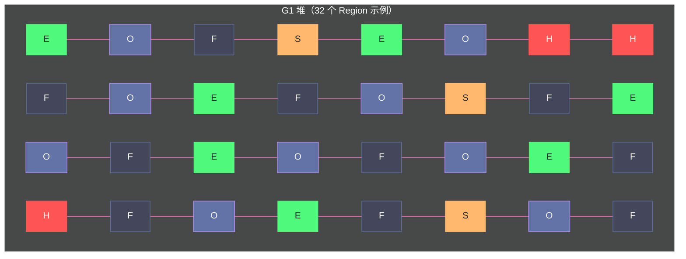

# 07 G1 收集器——Region 化内存与混合回收

**摘要：**

G1（Garbage-First Collector）是 JDK 9 起的服务端默认 GC，设计目标是在**可预测的停顿时间**内实现**高吞吐量**——在 CMS 低延迟和 Parallel 高吞吐之间找到更好的平衡点。G1 的最大创新在于打破了传统分代 GC 的物理堆布局：不再将堆分为固定的新生代/老年代连续区域，而是将整个堆划分为大量等大的 **Region**，每个 Region 可以动态扮演 Eden、Survivor、Old 或 Humongous（大对象）的角色。这使 G1 能够根据停顿目标，**有选择地只回收垃圾最多的 Region**（Garbage-First 命名的由来），而不必每次都回收整个老年代。本文深入剖析 G1 的 Region 化内存模型、并发标记流程（SATB 快照）、Young GC 与 Mixed GC 的执行机制、停顿预测模型，以及 G1 退化为 Full GC 的场景与应对方案。

---

## 第 1 章 G1 诞生的背景：CMS 的三个遗留问题

### 1.1 CMS 的历史局限

[[对象生命周期与GC/06 经典垃圾回收器——Serial、Parallel、CMS 深度剖析]] 中我们看到，CMS 通过并发标记大幅降低了老年代 GC 的停顿时间，但留下了三个根本性问题：

**问题 1：碎片化**。CMS 使用标记-清除算法，不压缩整理内存，随着运行时间增长，老年代碎片越来越严重，最终触发需要长时间 STW 的 Full GC（Serial Old）进行碎片整理。

**问题 2：停顿时间不可预测**。CMS 虽然大幅降低了常规停顿，但当发生 Concurrent Mode Failure（并发失败）时，会退化为 Serial Old 进行单线程 Full GC，停顿时间可能从几百毫秒暴增到几十秒，极不稳定。

**问题 3：大堆下仍然停顿过长**。当老年代很大（几十 GB）时，即使并发标记不停顿，重新标记阶段的 STW 也可能较长，无法满足严格的延迟 SLA。

G1 的设计目标，就是系统性地解决这三个问题。

### 1.2 G1 的核心设计理念

G1 的设计包含两个核心理念：

**Region 化（Regionalization）**：打破传统"新生代/老年代是连续内存大块"的假设，将整个堆切成数百到数千个等大的 Region。每个 Region 可以独立地被回收，使 GC 的工作单元从"整代"缩小到"单个 Region"。

**可预测停顿（Predictable Pause）**：G1 通过历史数据建立每个 Region 的**回收价值和回收耗时模型**，每次 GC 在停顿时间目标（`-XX:MaxGCPauseMillis`）的约束下，选择回收价值最高的 Region 集合（Garbage-First！），保证停顿时间的可预测性。

---

## 第 2 章 Region 化内存模型

### 2.1 Region 是什么

G1 将堆内存划分为大量**大小相等的 Region**（默认 1MB，可配置为 1~32MB，必须是 2 的幂次，由 `-XX:G1HeapRegionSize` 或 JVM 自动计算）。

一个 4GB 的堆，按 1MB Region 大小划分，共有 4096 个 Region。

每个 Region 在任意时刻，都有且只有一种**角色（Role）**：
- **Eden**：新对象优先分配的区域（等同传统 Eden 区语义）
- **Survivor**：Minor GC / Young GC 后，存活对象的中转区
- **Old**：经历多次 GC 晋升的长生命周期对象
- **Humongous**：大对象专用区域（对象大小超过 Region 大小的 50%）
- **Free**：空闲，尚未分配角色



**传统分代 GC vs G1 的内存布局对比**：

| 维度 | 传统分代（CMS/Parallel）| G1 |
| :--- | :--- | :--- |
| **内存布局** | 新生代/老年代各为连续大块 | 全堆切成等大 Region，动态分配角色 |
| **新生代大小** | 固定比例（通常 1/3 堆）| 动态调整（GC 后根据停顿目标重新分配 Eden Region 数量）|
| **回收单元** | 整代（Minor GC 回收整个新生代）| Region 集合（可以只回收若干 Region）|
| **碎片化** | 标记-清除产生碎片（CMS）| Region 内部可能有碎片，但回收时整个 Region 被清空，本质无碎片 |

### 2.2 Humongous Region——大对象的特殊处理

当一个对象的大小超过 **Region 大小的 50%**（如 Region 为 1MB，对象超过 512KB），该对象被视为大对象（Humongous Object），直接分配到 **Humongous Region**（一个或多个连续的 Region）。

```java
// 若 G1 Region 大小为 1MB（1048576 字节）
// 分配超过 512KB 的数组，会直接进入 Humongous Region
byte[] largeArray = new byte[600 * 1024];  // 600KB，超过 512KB 阈值
```

**Humongous 对象的特殊性**：
- 直接分配在老年代（即使刚创建的新对象，如果足够大也进老年代）
- 参与老年代的并发标记和回收
- Humongous Region 不能被其他对象共用（可能导致空间浪费：最后一个 Humongous Region 可能只用了一部分）

> [!warning] 生产避坑
> 频繁创建大对象（超过 Region 大小 50%）会导致频繁的 Humongous 分配，直接进入老年代，加速老年代填满，触发更频繁的并发标记周期甚至 Full GC。常见罪魁祸首：大 `byte[]`（网络请求/响应的缓冲区）、大 `String`、大集合一次性 `toArray()`。可通过 `-XX:+G1LogLevel=finest` 观察 Humongous 分配情况，必要时增大 Region 大小（`-XX:G1HeapRegionSize=4m`）。

### 2.3 每个 Region 独立的 Remembered Set

传统 GC 只有一个全局卡表（Card Table）记录跨代引用。G1 的每个 Region 都有自己独立的 **Remembered Set（RSet）**，记录"有哪些其他 Region 中的对象持有对本 Region 中对象的引用"。

这使 G1 能够独立地回收任意 Region——只要扫描该 Region 的 RSet，就能找到所有跨 Region 的引用，不需要扫描整个堆。

代价：RSet 本身占用内存（通常为堆大小的 5%~20%），且每次引用赋值都需要通过写屏障更新 RSet，有一定运行时开销。

---

## 第 3 章 G1 的 GC 类型

### 3.1 Young GC（纯新生代 GC）

当所有 Eden Region 都被填满时，触发 **Young GC**（也称 Minor GC）：

**STW 全程**：Young GC 全程 STW，所有 Java 线程暂停。

**回收集（Collection Set，CSet）**：所有 Eden Region + 所有 Survivor Region。

**算法**：复制算法——将 CSet 中的存活对象复制到新的 Survivor Region（或晋升到 Old Region）。

**完成后**：原来的 Eden Region 全部变为 Free 状态，下一批 Eden Region 重新从 Free Region 中分配。新生代的大小（Eden Region 数量）根据停顿目标动态调整。

**多线程并行**：Young GC 使用多个 GC 线程并行执行复制，线程数由 `-XX:ParallelGCThreads` 控制。

### 3.2 并发标记周期（Concurrent Marking Cycle）

当老年代占用率（Old Region 总量 / 总堆大小）达到 `-XX:InitiatingHeapOccupancyPercent`（IHOP，默认 45%）时，G1 触发**并发标记周期**，为后续的 Mixed GC 做准备。

并发标记周期分为以下阶段：

**初始标记（Initial Mark）—— STW，极短，附在 Young GC 上**

标记直接与 GC Roots 关联的对象。G1 将初始标记**"搭便车"附加在一次 Young GC 上**——利用 Young GC 的 STW 顺带完成初始标记，不额外增加停顿次数。

**根区域扫描（Root Region Scanning）—— 并发**

扫描 Young GC 后新晋升到 Old Region 的 Survivor 对象所指向的引用（这些 Survivor 是新的 GC Root 候选）。**必须在下一次 Young GC 开始前完成**（否则 Young GC 会等待根区域扫描完成），通常很快。

**并发标记（Concurrent Mark）—— 并发，最耗时**

对整个堆（全部 Region）进行并发可达性分析，标记所有存活对象。与用户线程并发，不停顿。

G1 使用 **SATB（Snapshot At The Beginning，原始快照）** 算法处理并发标记期间的引用变化（与 CMS 的增量更新不同）：

- **SATB 的核心思想**：在并发标记开始时，逻辑上记录整个堆的对象引用关系快照；在标记过程中，如果用户线程删除了某个引用（`a.field = null`，原来 `a.field` 指向对象 X），写屏障会将被删除的原始引用（X）记录到 SATB 队列，保证 X 在本次 GC 中不会被错误回收（即使 X 在标记期间变成了"孤儿"，也等下次 GC 再处理）。

- **为什么 G1 用 SATB 而不是增量更新（CMS 的方式）**：SATB 在重新标记阶段只需要处理 SATB 队列（被删除的引用），而增量更新需要重新扫描所有被修改的黑色对象。在对象图庞大的情况下，SATB 的重新标记开销更可预测，停顿更短。

**最终标记（Final Mark / Remark）—— STW，短**

处理 SATB 队列中记录的所有变动，完成最后的标记确认。通常只有几十毫秒。

**清理（Cleanup）—— STW（极短）+ 并发**

- STW 部分：统计每个 Region 的存活率（存活对象占 Region 大小的比例），找出完全空的 Region（存活率 0%）直接归还为 Free，更新 RSet 等。这部分很短。
- 并发部分：将空 Region 归还到空闲列表。

### 3.3 Mixed GC——G1 的核心创新

并发标记完成后，G1 进入 **Mixed GC** 阶段——这是 G1 区别于所有前代收集器的核心创新。

**Mixed GC 的"混合"含义**：每次 Mixed GC 的回收集（CSet）包含：
- **所有 Young Region**（Eden + Survivor，必须全部回收，与 Young GC 一致）
- **部分 Old Region**（根据停顿目标和回收价值，精心选择的若干 Old Region）

这就是"混合"——新生代 + （部分）老年代混合回收。

**为什么只回收部分 Old Region？**

G1 通过并发标记知道了每个 Old Region 的存活对象数量和预计回收时间。根据停顿时间目标（`-XX:MaxGCPauseMillis`），G1 从 Old Region 中**优先选择回收收益最高的（垃圾最多的）**，直到预计 STW 时间接近目标上限为止。

这正是"**Garbage-First**"命名的由来：优先回收垃圾最多的 Region。

**Mixed GC 的算法**：复制算法——将 CSet 中所有 Region 的存活对象复制到新的 Region（Old 或 Free），整个旧 Region 清空后归还为 Free 状态。复制过程完全避免了碎片化（Region 的清空是整块的，不存在 Region 内部的碎片问题）。

**Mixed GC 的执行次数**：一次并发标记周期完成后，通常会连续执行多次 Mixed GC（每次回收一批 Old Region），直到老年代占用率降低到 `-XX:G1HeapWastePercent`（默认 5%，即允许有 5% 的老年代空间是垃圾未回收）以下为止。

```
并发标记 → Mixed GC 1（回收部分 Old）→ Mixed GC 2（继续回收）→ Mixed GC 3 → ... → Young GC → ...
                                         （多次 Mixed GC 直到老年代垃圾率低于 G1HeapWastePercent）
```

---

## 第 4 章 停顿预测模型——可预测停顿的秘密

### 4.1 停顿预测的基本原理

G1 的停顿预测是基于**衰减均值（Decaying Average）** 的历史统计模型：

对每个 Region，G1 在历史上多次 GC 中收集了"回收该 Region 耗时 T、回收的垃圾量 V"的数据。G1 用衰减均值（更近的数据权重更大）来估计**当前回收该 Region 的预计耗时**。

在 Young GC 和 Mixed GC 时，G1 按如下方式构建 CSet：
1. 必须包含所有 Young Region（不可省略）
2. 估算所有 Young Region 的回收总时间 `T_young`
3. 剩余停顿预算 = `MaxGCPauseMillis - T_young`
4. 按回收收益（垃圾量/预计耗时，越高越优先）排序 Old Region
5. 依次添加 Old Region 到 CSet，直到剩余停顿预算不足为止

这样，每次 GC 的 STW 时间在统计意义上**接近 `MaxGCPauseMillis` 但不超过**（实际可能略有偏差，是预测而非保证）。

### 4.2 参数调优

**`-XX:MaxGCPauseMillis=200`**（默认 200ms）：停顿时间目标。不是硬保证，而是 G1 的优化目标。设置过小（如 50ms），G1 每次 GC 选择的 CSet 很小，回收进度慢，可能导致堆快速填满，触发 Full GC。通常建议根据应用实际测试，而不是盲目调小。

**`-XX:G1NewSizePercent=5`**（默认 5%）/ **`-XX:G1MaxNewSizePercent=60`**（默认 60%）：新生代占堆的最小/最大比例，控制 Young Region 数量的动态范围。

**`-XX:InitiatingHeapOccupancyPercent=45`**（IHOP，默认 45%）：触发并发标记的老年代占用阈值。JDK 9+ 引入**自适应 IHOP（Adaptive IHOP）**，G1 可以根据历史数据自动调整此阈值，不需要手动设置。

**`-XX:G1MixedGCCountTarget=8`**：一次并发标记周期后，期望 Mixed GC 的最大次数（默认 8 次），控制每次 Mixed GC 回收的老年代 Region 数量（并发标记标识的待回收 Old Region 总数 / MixedGCCountTarget）。

---

## 第 5 章 G1 的 Full GC——退化场景

### 5.1 什么情况下 G1 会触发 Full GC

G1 的设计目标是用 Young GC + Mixed GC 完成所有内存回收，**理想状态下 Full GC 永远不会发生**。但以下场景会迫使 G1 退化为 Full GC：

**场景 1：堆空间不足（Evacuation Failure）**

Mixed GC 或 Young GC 的复制过程中，需要将存活对象复制到新的 Free Region，但此时没有足够的 Free Region 可用——即整个堆已经快满了，GC 都来不及腾出空间。

这时 G1 触发 **Full GC**（JDK 10 之前是单线程 Serial 式，JDK 10 之后改为并行，性能大幅改善）。

**场景 2：Humongous 对象无法分配**

超大对象需要连续的 Humongous Region，但即使有足够的空闲 Region，它们不是连续的，也无法满足大对象分配需求，触发 Full GC。

**场景 3：并发标记速度跟不上分配速度**

如果对象分配速度极快，在 G1 完成并发标记之前老年代就已经满了，G1 来不及通过 Mixed GC 回收空间，触发 Full GC（类似 CMS 的 Concurrent Mode Failure）。

### 5.2 Full GC 的代价

G1 的 Full GC 会**停止所有用户线程，回收整个堆**。JDK 10 之后虽然改为多线程并行，但对于几十 GB 的大堆，Full GC 仍然可能停顿数秒到数十秒。Full GC 是 G1 性能调优的重点规避目标。

### 5.3 避免 Full GC 的调优方向

**增大堆大小**：最直接的方法，增加 Free Region 数量，降低堆满的风险。

**降低 IHOP 阈值**（`-XX:InitiatingHeapOccupancyPercent`）：让并发标记更早触发，在老年代还有较多空闲时就开始回收，避免堆被撑满。

**减小 `MaxGCPauseMillis`**：让每次 Mixed GC 回收更多 Old Region（停顿时间预算增加，CSet 可以更大），加快老年代回收速度（但会增加单次停顿时间）。

**减少大对象分配**：大对象直接进老年代，加速老年代填满。减少大对象是降低 G1 Full GC 频率最有效的业务层面优化。

**增大 Region 大小**（`-XX:G1HeapRegionSize`）：对于频繁出现 Humongous 的场景，增大 Region 阈值，使更多对象走正常 Young GC 路径。

---

## 第 6 章 G1 vs CMS：工程选型指南

| 维度 | CMS | G1 |
| :--- | :--- | :--- |
| **JDK 支持** | JDK 5~13（JDK 9 废弃，JDK 14 移除）| JDK 7+ 可用，JDK 9 起默认 |
| **算法** | 新生代：复制；老年代：并发标记-清除 | 全堆：Region 化并发标记 + 复制 |
| **碎片化** | 严重（老年代标记-清除）| 基本无（Region 整块回收+复制）|
| **停顿可预测性** | 差（Concurrent Mode Failure 时停顿暴增）| 好（基于模型的停顿预测）|
| **内存利用率** | 高（不预留 Region 缓冲）| 略低（需要维护 RSet，占用 5%~20% 内存）|
| **吞吐量** | 并发阶段 CPU 竞争，吞吐量有损失 | 与 CMS 相当或略好（Mixed GC 效率更高）|
| **调优复杂度** | 高（碎片、CMF、PretenureSizeThreshold 等）| 中（主要调 MaxGCPauseMillis 和 IHOP）|
| **适用堆大小** | < 4GB（堆大时 Remark 停顿长）| 4GB~数百 GB（Region 化，扩展性好）|
| **适用场景** | JDK 8 延迟敏感，堆 < 4GB | JDK 9+，堆 4GB+，需要可预测停顿 |

> [!note] 设计哲学：G1 不是"更快的 CMS"
> G1 不只是 CMS 的改进版，而是整体架构的重新设计。CMS 和 G1 的目标类似（低延迟），但解决路径截然不同。CMS 在传统分代布局上打补丁（并发标记避开 STW），G1 从根本上改变内存布局（Region 化，使回收单元从"整代"变为"若干 Region"）。理解这个本质差异，才能理解为什么 G1 能解决 CMS 的碎片问题，以及 G1 的 RSet 内存开销从何而来。

---

## 第 7 章 G1 的关键 JVM 参数速查

| 参数 | 含义 | 默认值 | 建议 |
| :--- | :--- | :--- | :--- |
| `-XX:+UseG1GC` | 启用 G1 | JDK 9+ 默认 | JDK 8 需显式设置 |
| `-XX:MaxGCPauseMillis` | 停顿时间目标（ms）| 200 | 根据应用 SLA 设置，不要设置过小 |
| `-XX:G1HeapRegionSize` | Region 大小（1~32MB）| JVM 自动计算 | 大对象问题严重时适当增大 |
| `-XX:InitiatingHeapOccupancyPercent` | 触发并发标记的老年代占用比 | 45 | JDK 9+ 自适应，一般不手动设置 |
| `-XX:G1MixedGCCountTarget` | 期望 Mixed GC 次数上限 | 8 | 降低此值使每次 Mixed GC 回收更多 |
| `-XX:G1HeapWastePercent` | Mixed GC 停止阈值（老年代垃圾率）| 5 | 降低可让 G1 更彻底地清理老年代 |
| `-XX:ParallelGCThreads` | STW 并行 GC 线程数 | CPU 核数（≤8 时等于核数）| 容器环境需根据实际 CPU 配额设置 |
| `-XX:ConcGCThreads` | 并发 GC 线程数 | ParallelGCThreads / 4 | 通常不需要调整 |

---

## 第 8 章 总结

G1 是 HotSpot GC 演进历史上最重要的里程碑之一。它的核心贡献：

**Region 化内存布局**：打破了"代"的物理边界，使 GC 的工作粒度从"整代"降低到"若干 Region"，实现了回收单元的精细控制。

**SATB 快照**：比 CMS 的增量更新更适合大堆场景，并发标记期间的引用变化处理开销更可预测。

**Mixed GC**：可以在同一次 GC 中同时回收新生代和部分老年代，在单次 GC 内兼顾了新老两代的垃圾，效率远高于"新生代 GC + 偶发全堆 Full GC"的两段式模型。

**停顿预测模型**：基于历史统计的衰减均值模型，使 G1 能在停顿时间目标约束下做出最优回收决策，停顿时间的可预测性远超 CMS。

**局限性**：RSet 内存开销大（5%~20%），写屏障对吞吐量有轻微影响，大堆下并发标记速度仍可能成为瓶颈（超大堆需要 ZGC/Shenandoah）。

下一篇 [[对象生命周期与GC/08 ZGC——亚毫秒停顿的着色指针与读屏障]] 将进入下一代 GC 的领域：ZGC 通过**着色指针（Colored Pointer）** 和**读屏障（Load Barrier）** 实现了并发对象转移，将 STW 停顿从 G1 的几十~几百毫秒降到了亚毫秒级别。

---

## 参考文献

1. Detlefs et al., "Garbage-First Garbage Collection", Proceedings of the 4th international symposium on Memory management (ISMM 2004)
2. 周志明, 《深入理解 Java 虚拟机（第三版）》, 第 3.7 章：Garbage First 收集器
3. Monica Beckwith, "G1: One Garbage Collector To Rule Them All", JavaOne 2013
4. 美团技术博客, "新一代垃圾回收器ZGC的探索与实践", 2020
5. OpenJDK Wiki, "G1 GC Tuning Guide", wiki.openjdk.org
6. JEP 248: Make G1 the Default Garbage Collector (JDK 9)

---

> [!note] 思考题
> 1. G1 将堆划分为大小相等的 Region（默认 2048 个），每个 Region 可以是 Eden、Survivor、Old 或 Humongous。当一个对象大小超过 Region 的 50% 时被分配到 Humongous Region。频繁创建大于 Region 50% 的对象会导致什么问题？你如何调整 G1 参数来缓解 Humongous 分配的性能影响？
> 2. G1 的 Mixed GC 会同时回收 Young Region 和部分 Old Region。G1 通过 Remembered Set（RSet）记录跨 Region 的引用关系，避免全堆扫描。RSet 的维护成本约占堆的 10%-20%——在什么场景下 RSet 的内存开销会特别大？如果 Region 之间的跨引用非常密集，G1 的效率会退化到什么程度？
> 3. G1 的 `-XX:MaxGCPauseMillis` 设置目标停顿时间（默认 200ms）。G1 通过统计每个 Region 的回收价值（可回收空间/回收耗时）来选择性回收——这就是'Garbage First'名称的由来。但如果你将目标停顿设为 10ms，G1 可能每次只回收极少的 Region，导致堆空间不断增长。最终会触发什么？这种'目标停顿过低导致反效果'的现象如何避免？
