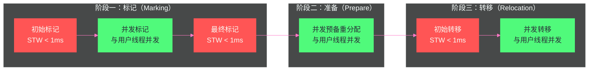
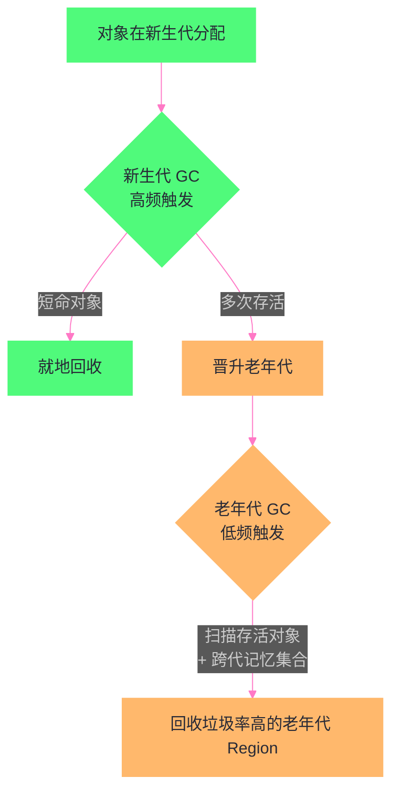

# 08 ZGC——亚毫秒停顿的着色指针与读屏障

> [!abstract] 摘要
> ZGC（Z Garbage Collector）是 JDK 11 引入（JDK 15 正式 GA）的新一代低延迟垃圾回收器，其设计目标极为激进：**无论堆大小（从几百 MB 到 16TB），STW 停顿时间始终控制在亚毫秒级（实测通常 < 1ms，部分场景可到 0.1ms 以内）**。这是 G1 停顿目标（几十~几百毫秒）的几个数量级的提升。ZGC 实现这一目标依赖两个此前从未在生产级 GC 中大规模落地的技术创新：**着色指针（Colored Pointer）**——把 GC 需要的元数据直接编码进 64 位引用本身的高位比特，让"这个对象处于什么 GC 状态"这个问题不再需要访问对象头就能回答；**读屏障（Load Barrier）配合自愈机制（Self-Healing）**——在每一次从堆中取出引用时插入一段极轻量的检查与修正逻辑，使得对象的并发转移（复制到新地址）不再需要停顿所有用户线程。本文从地址空间的位布局推导开始，讲清楚着色指针为什么必须占用地址位、多重虚拟地址映射（Multi-Mapping）如何实现"同一块物理内存，多个虚拟地址视图"、4TB/16TB 堆容量上限的数学来源；再深入读屏障的自愈机制、转发表与 CAS 竞争处理；最后讲透 JDK 21 分代 ZGC 为什么能在保持亚毫秒停顿的同时把吞吐量代价降下来，并给出面向超大堆生产场景的调优实践。

---

## 第 1 章 G1 的局限与 ZGC 的目标

### 1.1 G1 停顿时间的天花板

[[对象生命周期与GC/07 G1 收集器——Region 化内存与混合回收]] 中我们看到，G1 通过 Region 化和停顿预测模型，将典型的 GC 停顿从秒级降到了几十~几百毫秒。但 G1 的停顿时间存在一个工程天花板：

**G1 的复制阶段（Evacuation）必须是 STW 的**。G1 在 Young GC 和 Mixed GC 的复制阶段，所有对象转移（从旧 Region 复制到新 Region）都在 STW 期间完成，用户线程不能同时访问正在被移动的对象（会读到旧地址或中间状态）。

对于大堆（几十 GB 以上），即使并行复制速度很快，每次复制的存活对象总量也很大，停顿时间难以突破几十毫秒的下限。更严重的是，**G1 的停顿时间与堆大小正相关**——堆越大，单次 GC 要处理的 Region 越多，停顿越长。

这个天花板不是 G1 工程实现粗糙导致的，而是**并发复制对象在传统 GC 架构下无解**这一根本约束的直接体现。[[对象生命周期与GC/05 垃圾回收算法——标记清除、复制、标记整理与分代假说]] 中讲过，复制算法/标记整理算法要移动对象，本质上是"改变对象的身份证号码（地址）"。如果对象的地址在被移动的同一时刻，还有用户线程正持有着这个对象的旧地址在读写它的字段，就会发生非常经典的一类并发 bug：**读到已经被覆盖的内存，或者读到一半新一半旧的对象状态**。G1、CMS、Parallel GC 都通过"移动阶段完全 STW，用户线程完全静止"来规避这个问题——这是最简单也最安全的方案，代价就是停顿时间随存活对象总量线性增长，而存活对象总量又随堆增大而增大。

### 1.2 ZGC 的革命性目标

ZGC 的目标是将 STW 停顿时间彻底与堆大小解耦：**无论堆有多大，停顿时间都是固定的亚毫秒级**。

实现这个目标，需要解决 G1 的根本问题：**对象转移（复制）必须从 STW 变为并发**。这就是 ZGC 最核心的技术挑战——如何在用户线程正在使用对象的同时，安全地将对象移动到新地址。

如果不解决这个问题会怎样？答案是我们只能永远停留在"堆越大、停顿越长"的老路上——无论怎样优化并行度、怎样调整 Region 大小，STW 期间要完成的复制工作量是一个物理事实，无法通过工程手段消除，只能通过**让复制这件事本身脱离 STW** 来解决。这正是 ZGC（以及后面会讲到的 [[对象生命周期与GC/09 Shenandoah——与 ZGC 殊途同归的并发压缩]]）与 [[对象生命周期与GC/06 经典垃圾回收器——Serial、Parallel、CMS 深度剖析]]、G1 这一整条"传统谱系"GC 的根本分野：前者做**并发压缩（Concurrent Compaction）**，后者做**STW 压缩（Stop-The-World Compaction）**。

---

## 第 2 章 着色指针——GC 元数据嵌入指针

### 2.1 为什么要用指针的高位存储元数据

在传统的 GC（包括 G1）中，GC 的状态信息（对象是否已标记、是否已转移）存储在**对象头的 Mark Word** 中。这意味着：
- 读取对象的 GC 状态，需要先解引用（找到对象），再读取对象头
- 并发转移时，JVM 和用户线程都可能访问对象头，需要复杂的同步

ZGC 的思路是：**直接在指针（引用）本身中编码 GC 状态**，不需要访问对象头。这就是**着色指针（Colored Pointer）**。

### 2.2 着色指针的 64 位布局

要理解着色指针的位布局，得先弄清楚一个前提：**64 位指针里，究竟有多少位是"真正在用"的**。

x86-64 架构虽然寄存器宽度是 64 位，但受限于当前 MMU（内存管理单元）分页表的层级设计，主流操作系统（Linux、Windows）的用户态虚拟地址空间实际只使用低 48 位（对应 4 级页表，2^48 = 256TB 的地址空间），高 16 位（bit 48~63）在合法地址中必须是低 48 位符号位的扩展（通常固定为全 0）。这意味着一个"合法"的 64 位指针，其实高 16 位是**冗余的、恒定的**——从信息论角度看，这些位没有携带任何有效信息。

ZGC 的着色指针设计正是抓住了这一点：既然高位比特原本就是"浪费"的，为什么不把它们利用起来，塞进 GC 自己需要的元数据？这是一个非常典型的"空间换时间"的工程决策——用地址空间的冗余位换取"读取 GC 状态不需要访问对象头"的能力。

具体的位划分（以 JDK 15~20 的非分代 ZGC 为例）：

```
64位指针的布局（ZGC，JDK 15~20 非分代版本）：

Bit 63~48: 未使用（固定为 0，共 16 位）
Bit 47:    Finalizable 标记（对象是否只能通过 Finalizer/弱引用等特殊路径可达）
Bit 46:    Remapped 标记（对象是否已完成地址重映射，指向最新地址）
Bit 45:    Marked1 标记（标记位 1，奇数 GC 周期使用）
Bit 44:    Marked0 标记（标记位 0，偶数 GC 周期使用）
Bit 43~0:  实际的堆内对象地址（44 位）
```

**为什么恰好是 4 个标记位而不是更多或更少？** 因为 ZGC 每个 GC 周期只需要区分"标记还是没标记"（用 Marked0/Marked1 交替表示，避免两个相邻周期互相干扰——上一轮周期没处理完的旧标记痕迹不会被误认为是当前周期的合法标记）、"重映射还是没重映射"（Remapped）、以及"是否只能被终结器等特殊引用访问"（Finalizable）这三类正交的状态。用交替的两个 bit 表达标记状态，而不是一个 bit 加一次全堆清零，是 ZGC 刻意规避"清空所有标记位"这个 O(堆大小) 操作的手段——不需要清零，直接切换到另一个 Marked 位的语义即可，这也是"无停顿"设计哲学贯穿到底的体现。

**堆容量上限的数学来源**：44 位地址位意味着最大可表达的堆地址空间是 2^44 字节 = 16TB。这不是一个随意选择的数字，而是"64 位指针 − 16 位（页表限制的冗余高位） − 4 位（着色标记位）"倒推出来的硬约束。

> [!warning] 生产避坑：4TB 与 16TB 的版本差异
> ZGC 早期版本（JDK 11~14 的实验特性阶段）设计中着色位的占用方式与堆基址映射方式与后期略有不同，社区文档和早期博客中常见"ZGC 最大支持 4TB 堆"的说法，这是早期实现中地址位切分方式（当时保留了更多标记位用于实验性的着色语义，实际可用地址位更少）遗留下来的历史印记。JDK 15 GA 之后的正式实现固定为 44 位地址位，即 16TB 上限。生产环境规划超大堆容量时，应以当前使用的 JDK 版本文档为准，不要照抄网上流传的旧数字。

### 2.3 四种视图——多重映射的技巧

着色指针中的地址位（bit 43~0）是一个**相对于 ZGC 堆基址的偏移量**。ZGC 将堆内存映射为**多个虚拟地址视图**（通过操作系统的 `mmap` 匿名映射），每个视图对应一组标记位组合：

- **Remapped 视图**（bit 46 为 1）：对象已完成转移和重映射，指针指向最新地址
- **Marked0 视图**（bit 44 为 1）：GC 标记阶段的标记位（偶数周期）
- **Marked1 视图**（bit 45 为 1）：GC 标记阶段的标记位（奇数周期）

这三个视图实际上映射到**同一块物理内存**（三段不同虚拟地址 → 同一段物理页）。操作系统的虚拟内存机制允许这种多重映射（一块物理内存可以有多个虚拟地址别名），ZGC 正是利用了这一点。

```
物理内存（堆）：│ 对象 A │ 对象 B │ 对象 C │ ...

三种虚拟地址视图（均映射到相同的物理内存）：
Remapped:  │ addr + 0x400000000000 │ → 同一块物理内存
Marked0:   │ addr + 0x100000000000 │ → 同一块物理内存
Marked1:   │ addr + 0x200000000000 │ → 同一块物理内存
```

**多重映射的意义**：当 GC 需要将所有指针从 Marked0 视图切换到 Remapped 视图时，不需要遍历堆中的每个引用字段更新地址（那样代价极高）——只需要通过读屏障在指针被使用时**按需修正**，同时多个虚拟地址视图都指向同一物理内存，即使新旧地址同时存在也不会有内存一致性问题。

### 2.4 多重映射的底层机制——为什么操作系统允许"一块内存，多个地址"

多重映射听起来像是魔法，但它建立在一个非常朴素的操作系统机制之上：**虚拟地址到物理地址的映射关系记录在页表中，而页表允许多个虚拟页指向同一个物理页**。这跟 `mmap(MAP_SHARED)` 让多个进程共享同一块物理内存、或者跟共享内存段的原理是同一件事，只是 ZGC 把它用在了同一个进程内部的三份虚拟地址视图上。

具体到 ZGC 的实现，堆的物理内存来自一个统一的**物理内存管理器（Physical Memory Manager）**，它通过 `memfd_create`（Linux 上更现代的做法）或者 `shm_open`/临时文件的方式申请一段"无名"的物理内存对象，这段物理内存本身不直接绑定到某个固定虚拟地址。随后，ZGC 在进程地址空间中划出三段（非分代版本）或更多段（分代版本，见第 6 章）**互不重叠、但各自跨度都覆盖整个堆容量**的虚拟地址区间——分别对应 Marked0 视图、Marked1 视图、Remapped 视图——并把同一段物理内存，通过 `mmap` 分别映射进这三段虚拟地址区间。

这样一来，堆里的某个对象 A 拥有三个不同的虚拟地址（比如 `0x1000000000`、`0x2000000000`、`0x4000000000`，这几个地址的低 44 位偏移量相同，只是着色位段不同），CPU 访问任意一个地址，最终经过页表转换都会落到同一个物理页帧上。这正是着色指针方案能够"用高位比特表达状态，同时不破坏内存访问语义"的物理基础——**颜色位实际上从来没有真正参与地址计算，它只是告诉 MMU/读屏障"该走哪一份虚拟地址视图"**。

> [!info] 核心概念：多重映射是空间开销，不是复制开销
> 需要澄清一个常见误解：三份虚拟地址视图不代表堆内存被复制了三份。三份虚拟地址空间只是**页表项的多份记录**，物理内存始终只有一份。代价是虚拟地址空间的消耗（在 64 位系统下几乎不是问题，因为地址空间远大于物理内存容量）以及页表本身占用的少量额外内存（多一份映射就多一份页表项）。这也是为什么 ZGC 官方文档建议生产环境使用 Linux 而非 Windows/macOS 部署大堆场景——Linux 对大规模稀疏地址映射与透明大页（Transparent Huge Pages）的支持更成熟，能显著降低多重映射带来的页表管理开销。

---

## 第 3 章 读屏障——并发转移的核心守卫

### 3.1 为什么是读屏障而不是写屏障

G1、CMS 使用**写屏障（Write Barrier）**——在引用字段被写入时拦截，维护 RSet/卡表。

ZGC 的核心是**读屏障（Load Barrier）**——在从堆中**读取**一个对象引用时拦截，检查指针的颜色（着色位），如果颜色"不对"则执行修正动作。

**为什么读而不是写？**

因为 ZGC 需要解决的是并发转移的一致性问题：当 GC 正在将对象 A 从旧地址复制到新地址时，用户线程可能同时读取 A 的指针（旧地址）。如果用户线程用旧地址访问 A，而 A 已经被 GC 移动到新地址，就会访问到无效内存。

**读屏障在用户线程读取指针时拦截**，检查这个指针是否需要修正（指向的对象是否已经被移动），如果需要则在当前线程的上下文中立即完成修正，再返回正确的新地址。这样用户线程拿到的永远是最新的、有效的指针。

### 3.2 读屏障的伪代码

```java
// 原始 Java 代码（读取一个字段）：
Object obj = someContainer.field;

// JIT 编译后插入读屏障（伪代码）：
Object raw = someContainer.field;  // 原始读取（可能是旧地址）

// 读屏障检查（每次从堆读取引用时都会执行）：
if (raw 的着色位 != 当前预期的颜色) {
    // 指针需要修正：对象可能已经被移动或未标记
    raw = loadBarrierSlowPath(raw);  // 慢速路径：完成标记/重映射
}
// raw 现在是正确的、最新的引用
Object obj = raw;
```

**快速路径（Fast Path）**：如果指针的颜色位已经是当前 GC 阶段预期的颜色（如当前在 Remapped 阶段，指针的 Remapped 位已置为 1），读屏障只需做一个位检查（极低开销），直接返回。这是最常见的路径。

**慢速路径（Slow Path）**：如果颜色不对（说明这个指针还"停留在旧 GC 阶段"），需要：
- **标记阶段**：将该对象标记为存活（更新标记位）
- **转移阶段**：如果对象已被 GC 移动，找到新地址并更新指针（重映射）；如果对象还未被移动，可能触发转移

慢速路径有一定开销，但只在指针需要修正时才触发，随 GC 进展慢速路径的触发概率逐渐降低（越来越多的指针完成修正后进入快速路径）。

### 3.3 自愈机制（Self-Healing）——为什么旧指针只会被修正一次

读屏障的慢速路径里有一个容易被忽略、但对 ZGC 性能至关重要的设计：**慢速路径修正指针之后，不仅把正确的地址返回给当前这次读取，还会把修正后的新地址写回到原来存放这个引用的内存位置**。这个"顺手把源头也治好"的动作，就是 ZGC 官方文档里说的**自愈（Self-Healing）**。

**为什么要多做这一步回写？** 如果只修正当前这次读取拿到的值，而不回写到内存里的字段，那么下一次任何线程（包括发起这次读取的线程自己）再读同一个字段，仍然会读到旧地址，仍然要再走一次慢速路径去查转发表、算新地址。也就是说，如果没有自愈，同一个被移动过的对象引用，可能被访问多少次，就要执行多少次慢速路径修正——而堆里对某个热点对象的引用往往会被反复读取（比如一个被大量线程共享的缓存对象、一个频繁遍历的链表头节点）。自愈机制把这种"重复付费"变成了"一次性投资"：一个字段第一次被访问时触发慢速路径完成修正并回写，此后同一个字段的所有读取都只需要走快速路径（一次位检查），性能几乎与没有 GC 介入时一样。

自愈的回写操作必须是**原子的、可重试的**，因为多个用户线程可能几乎同时读到同一个待修正的旧指针字段，都试图执行慢速路径。ZGC 用 **CAS（Compare-And-Swap）** 完成这次回写：

```cpp
// HotSpot ZGC 读屏障慢速路径核心逻辑（简化示意，非逐行源码）
// p 是引用字段在堆中的地址（比如某个对象的 field），*p 是这个字段当前存的着色指针
uintptr_t ZBarrier::load_barrier_slow_path(volatile uintptr_t* p, uintptr_t o /* 原始读到的着色指针 */) {
    uintptr_t addr = ZAddress::good(o);          // 计算出这个对象“健康”的地址
                                                   // （标记完成 / 转移完成后应处于的颜色状态）
    if (ZAddress::is_relocatable(o)) {
        addr = relocate_or_remap(o);              // 查转发表，拿到对象转移后的新地址
    }
    // 关键一步：把修正后的“好”指针 CAS 回写到字段所在的内存位置
    // 只有当字段的值仍然等于最初读到的旧值 o 时，CAS 才会成功
    // 如果 CAS 失败，说明已经有别的线程先完成了自愈回写，直接采用当前内存中的新值即可
    Atomic::cmpxchg(p, o, addr);
    return addr;
}
```

CAS 失败并不代表出错——它只意味着"别的线程已经替你把这件事做完了"，当前线程直接使用内存中已经存在的新值即可，不需要重试整个修正逻辑。这种"竞争后各自安全退出"的写法，正是 ZGC 敢于把并发转移铺开到几乎所有堆访问路径上的信心来源：所有的竞争都通过 CAS 收敛，不存在数据损坏的可能。

**边界情况**：自愈回写发生在原来存放引用的字段上，但如果这个字段在 CAS 之前已经被用户线程的正常业务逻辑覆盖写入了别的值（比如这个字段被重新赋值指向了另一个对象），CAS 自然会因为"当前值不等于期望的旧值 o"而失败，此时 ZGC 不会覆盖用户线程刚写入的新值——**自愈机制只负责修正指针颜色，绝不会覆盖业务语义上的写操作**，这是并发正确性的关键边界。

### 3.4 读屏障的插入位置——并非所有读取都需要屏障

一个容易产生的误解是"ZGC 给所有内存读取都加了屏障，所以所有读操作都变慢了"。实际情况更精细：读屏障只插入在**从堆中读取引用类型字段**的位置（即 Java 里的对象引用赋值来源是堆内存），包括：

- 从对象实例字段读取引用（`obj.field`，字段类型是引用）
- 从数组元素读取引用（`array[i]`，元素类型是引用）
- 从静态字段读取引用

**不需要**插入读屏障的场景：读取基本类型字段（int、long 等，本身不是指针，没有颜色语义）、纯栈上的局部变量读取（栈上的引用如果来自 GC Roots 扫描已经在 STW 阶段处理过）、寄存器中已经缓存过的、本次编译单元内已经验证过颜色正确的引用（JIT 编译器可以做一定程度的屏障消除优化，减少重复检查）。

JIT 编译器（C2/Graal）在生成机器码时，会为每一处"从堆读引用"的字节码插入屏障检查指令；解释执行模式下（未被 JIT 编译的代码路径），由字节码解释器的通用引用读取逻辑统一处理屏障。这也解释了为什么 ZGC 对解释执行密集、JIT 预热不充分的短生命周期任务（比如短命的 Serverless 函数实例）相对不那么友好——屏障检查在解释执行路径下的相对开销比 JIT 编译后的机器码更高。

### 3.5 读屏障 vs 写屏障的工程权衡

**读屏障的代价**：Java 程序中读操作远多于写操作（统计上，引用读/写比例通常 > 10:1），每次读都有屏障检查，总体开销比写屏障更大。ZGC 的读屏障使吞吐量略低于 G1（通常降低 5%~15%，取决于应用的引用读取密度）。

**读屏障的收益**：读屏障使 ZGC 可以安全地**并发转移对象**——GC 线程复制对象，用户线程通过读屏障自动修正旧指针，两者可以同时进行，不需要 STW。这是 ZGC 亚毫秒停顿的根本保障。

---

## 第 4 章 ZGC 的 GC 流程

### 4.1 ZGC 的完整 GC 周期

ZGC 的 GC 过程分为三个大阶段，每个阶段都以极短的 STW 开始和/或结束，中间大部分工作与用户线程并发：



**阶段一：标记（Marking）**

- **初始标记（Initial Mark）—— STW，< 1ms**：标记所有 GC Roots 直接关联的对象，将其指针着色为 Marked0 或 Marked1（交替使用，区分相邻两次 GC 周期）。
- **并发标记（Concurrent Mark）—— 并发**：从初始标记的对象出发，并发遍历整个对象图，通过读屏障将所有可达对象的指针更新为当前 Marked 颜色。
- **最终标记（Final Mark）—— STW，< 1ms**：处理并发标记期间遗漏的引用变化，完成标记。

**阶段二：并发预备重分配（Concurrent Prepare for Relocation）—— 并发**

分析哪些 Region 的垃圾最多，构建**重分配集（Relocation Set）**——需要被清空并转移的 Region 列表（类似 G1 的 CSet，但完全不需要 STW 来确定）。

**阶段三：转移（Relocation）**

- **初始转移（Initial Relocate）—— STW，< 1ms**：转移 GC Roots 直接引用的那部分对象（确保 GC Roots 指向的对象有确定的新地址）。
- **并发转移（Concurrent Relocate）—— 并发**：将重分配集中所有 Region 的存活对象复制到新 Region，同时通过读屏障修正用户线程持有的旧指针。
- **并发重映射（Concurrent Remap，下一个 GC 周期的并发标记中完成）**：修正堆中所有还指向旧地址的引用字段，将它们更新为新地址。ZGC 将重映射与下一次 GC 的并发标记合并，节省一次单独的全堆遍历。

### 4.2 并发转移的关键细节——转发表（Forwarding Table）

在并发转移阶段，GC 线程将对象从旧 Region 复制到新 Region。对于每个被移动的对象，GC 在**转发表（Forwarding Table）** 中记录 `旧地址 → 新地址` 的映射。

当用户线程通过读屏障发现指针颜色不对（处于旧的 Marked 颜色而不是 Remapped 颜色），读屏障的慢速路径会：
1. 查询转发表，找到对象的新地址
2. 将持有旧指针的引用字段原子地更新为新地址（CAS 更新，防止并发竞争）
3. 返回新地址

这样，每个旧指针在被读取时会被"顺手修正"，随着时间推移，所有旧指针都会被修正，最终可以安全地释放旧 Region 和转发表。

### 4.3 STW 停顿为什么能控制在亚毫秒

ZGC 的三次 STW 停顿（初始标记、最终标记、初始转移），工作量都极小：
- **初始标记**：只标记 GC Roots 的直接子对象（一层），不做深度扫描
- **最终标记**：处理遗漏的少量变动
- **初始转移**：只转移 GC Roots 的直接子对象

这些操作的工作量与 GC Roots 的数量成正比，而 GC Roots 的数量是有限的（线程栈、静态字段等），不随堆大小增长。因此，**ZGC 的 STW 时间与堆大小无关，几乎是常数**（只与 GC Roots 规模和 CPU 性能有关）。

---

## 第 5 章 ZGC 与 G1 的深层对比

### 5.1 写屏障 vs 读屏障的代价差异

G1 维护 RSet 需要写屏障（每次引用赋值触发），ZGC 的并发转移需要读屏障（每次引用读取触发）：

```
Java 程序中引用操作频率：
写操作（a.field = b）: 相对较少
读操作（x = a.field）: 非常频繁（通常是写的 10 倍以上）
```

读屏障的覆盖面更广，对吞吐量的影响更大（5%~15% 的额外开销，取决于应用特征）。G1 的写屏障开销通常在 1%~3%。

**但吞吐量的轻微下降，换来的是停顿时间从几百毫秒降到不足 1ms**——对于延迟敏感型应用，这个代价是完全值得的。

### 5.2 内存开销的对比

G1 的 RSet 需要每个 Region 维护"谁引用了我"的记录，在引用复杂的场景下可能消耗堆大小的 10%~20%。

ZGC 使用着色指针（开销极小）+ 转发表（只在转移期间临时存在）+ 读屏障（代码开销，不是内存开销），整体额外内存占用远低于 G1 的 RSet。

### 5.3 两种技术路线的本质分野

G1 和 ZGC 的差异，表面看是"写屏障 vs 读屏障"，本质上是两种完全不同的**并发安全模型**：

G1 选择"**转移必须 STW，但转移之外的一切都可以并发**"——它用写屏障维护 RSet，用写屏障维护 SATB（Snapshot-At-The-Beginning）三色标记的正确性，但真正移动对象、改变对象地址这件事，必须在一个所有用户线程都静止的窗口内完成。这是一种"保守但简单"的正确性保证：只要移动对象时没有人在看，就不可能出现读到脏数据的问题。

ZGC 选择"**转移本身也可以并发，但每一次引用读取都要为此支付一点检查成本**"——它承认对象可能在被读取的同一时刻正在被移动，于是把"发现指针失效并纠正"这件事下沉到每一次读取操作里，用读屏障和自愈机制保证任何时刻读到的都是可用的地址。这是一种"激进但精确"的正确性保证：允许移动和读取同时发生，但确保每一次读取的返回结果都经过校验。

下表把两者的核心设计差异汇总：

| 维度 | G1 | ZGC |
|------|----|----|
| 屏障类型 | 写屏障（引用赋值时触发） | 读屏障（引用读取时触发） |
| 对象转移方式 | STW 复制 | 并发转移 + 自愈 |
| GC 元数据存放位置 | 对象头 Mark Word / RSet | 指针高位比特（着色指针） |
| 额外内存结构 | Remembered Set（RSet）、卡表 | 转发表（Forwarding Table，转移期间临时存在） |
| 停顿时间与堆大小关系 | 正相关 | 基本无关（取决于 GC Roots 规模） |
| 典型吞吐量代价 | 写屏障 1%~3% | 读屏障 5%~15%（非分代），分代版本显著降低 |
| 是否需要禁用压缩指针 | 不需要 | 需要（着色位挤占了压缩指针可用的地址位空间） |
| 适用堆规模 | 中小到大堆（几 GB 到数百 GB） | 从小堆到超大堆（TB 级）均适用，越大堆优势越明显 |

> [!note] 设计哲学：没有免费的午餐，只有更合适的取舍
> 读屏障比写屏障"贵"，是因为 Java 程序里引用读取远比引用写入频繁——几乎每一次方法调用、每一次字段访问背后都藏着潜在的引用读取。ZGC 选择在更频繁的操作上加检查，换来的是"移动对象"这件本质上更耗时的操作可以完全并发化。这不是"ZGC 比 G1 设计得更好"，而是两者对"哪类操作更值得优化"做出了不同判断——G1 判断"移动对象很少发生在关键路径的每一次访问上，所以让它 STW 也无妨"，ZGC 判断"即使读操作更频繁，只要单次检查足够轻（一次位比较），总代价仍然可控，而 STW 转移的代价是不可控的（随堆增长无上限）"。

---

## 第 6 章 JDK 21 分代 ZGC——补上最后一块短板

### 6.1 非分代 ZGC 的问题：为什么"停顿短"不等于"吞吐高"

JDK 15~20 的 ZGC 是**非分代的**——没有新生代和老年代的区分，堆是一个统一的整体，每一轮 GC 周期都要完整地标记一遍、转移一遍整个堆里的存活对象。

这个设计违背了 [[对象生命周期与GC/05 垃圾回收算法——标记清除、复制、标记整理与分代假说]] 里讲过的**分代假说**——绝大多数对象存活时间极短，创建后很快就变成垃圾；只有少数对象能存活足够久。分代假说之所以能大幅提升 GC 效率，核心逻辑是"把注意力集中在最容易产生垃圾的那一小片内存区域，用极低的成本频繁清理它，而不用管那些大概率仍然存活的老对象"。

非分代 ZGC 完全没有利用这个规律：每一轮并发标记，无论堆里 99% 的对象是刚创建的临时对象还是已经存活了几小时的长期缓存，都要被同等地遍历一遍、判断一遍是否可达。这意味着：

- **并发标记的工作量与堆的总存活对象数成正比**，而不是与"新产生的垃圾量"成正比——哪怕这一轮真正变成垃圾的对象只有堆的 5%，ZGC 也必须遍历 100% 的对象图才能确定这 5% 是谁。
- **读屏障触发的慢速路径次数也随之增多**——因为标记状态（着色位）需要覆盖到堆里的每一个存活引用，包括那些几乎不会变化的老对象引用，这部分工作本质上是"重复劳动"，老对象在两次 GC 之间的可达性判断结果通常没有变化。

结果是：非分代 ZGC 的吞吐量在某些场景下比 G1 低 20%~30%——虽然单次停顿极短，但 GC 线程消耗的总 CPU 时间更多，压缩到用户线程可用的 CPU 时间就变少了，单位时间能处理的请求数反而下降。**停顿时间短，只是"每次打断你的时间短"，并不意味着"GC 总共消耗的资源少"**，这是理解 ZGC 早期版本吞吐量短板的关键。

### 6.2 分代 ZGC 的核心改动：把并发标记的对象拆成两批

**JDK 21 通过 [JEP 439](https://openjdk.org/jeps/439) 引入分代 ZGC**（`-XX:+ZGenerational`），将 ZGC 改造为支持分代的版本。它的落地并不是简单地"分成两个堆区域"，而是对着色指针方案和多重映射机制做了配套改造：

**堆结构层面**：堆被划分为**新生代（Young Generation）**和**老年代（Old Generation）**，两者各自维护自己的一组 Region（延续 ZGC 一贯的 Region 化内存管理方式），新对象总是先在新生代分配，经历若干次新生代 GC 后仍存活的对象晋升到老年代。

**多重映射层面**：非分代 ZGC 的三视图（Marked0/Marked1/Remapped）机制被扩展——分代 ZGC 需要能够独立地对新生代和老年代做标记与转移，因此着色指针里增加了额外的分代标识信息，多重映射的虚拟地址视图数量相应增加，用以支撑"新生代单独触发一轮 GC 周期时，不必牵连老年代"的独立调度能力。

**跨代引用追踪层面**——这是分代 ZGC 能够大幅降低 CPU 开销的真正关键：非分代 ZGC 每轮标记必须遍历全堆，是因为它没有办法知道"哪些老对象的引用字段最近被改写过、可能新增了指向新生代对象的引用"。分代 GC 要做到"只扫新生代就能完整地找出新生代的存活对象"，必须知道**老年代到新生代的跨代引用**都在哪里，否则会漏标一些实际存活的新生代对象（老对象持有它，但新生代 GC 没扫描到这条引用）。

ZGC 解决这个问题的方式，是引入一个轻量级的**着色指针存储屏障（Store Barrier）**——不同于读屏障，这是一个专门在**写入引用字段**时触发的屏障，其唯一职责是：当一个老年代对象的字段被写入一个指向新生代对象的新引用时，把这次写入记录到一张"记忆集合"里（概念上与 G1 的 RSet 类似，但实现方式更轻量，基于着色指针的额外标记位与每个 Page 的"最近被记录"标志位实现，避免维护 G1 那种完整的双向记录结构）。这样，新生代 GC 触发时，只需要扫描"新生代自身的引用" + "记忆集合里记录的、来自老年代的跨代引用"，就能完整覆盖新生代的可达性判断，完全不需要触碰老年代里其他没有变化的对象。

**这正是分代 ZGC 降低 CPU 开销的根本原因**：把"标记工作量与堆总大小成正比"变成了"标记工作量与新生代大小、以及跨代引用变更量成正比"。绝大多数应用里，跨代引用的变更远比新生代对象总数少（大多数新对象根本不会被老对象引用，它们只是被别的新对象或者栈上局部变量引用），因此新生代 GC 的工作量被压缩到非常小的范围内，重新回到了分代假说带来的效率红利。

### 6.3 分代 ZGC 的调度节奏

分代 ZGC 中：

- **新生代 GC（Minor Cycle）**：高频触发（可能几秒一次甚至更频繁，取决于分配速率），只标记转移新生代 Region，工作量小，停顿依然是亚毫秒级的那几次极短 STW。
- **老年代 GC（Major Cycle）**：低频触发，扫描的范围虽然是整个老年代，但因为老年代对象存活率通常很高（存活到老年代的对象大概率会继续存活），老年代 GC 每次要转移复制的存活对象比例其实更低（大部分老年代 Region 里的对象都是"活的"，垃圾很少，转移的收益/成本比不如新生代 GC 划算，因此老年代 GC 更多是标记与统计，转移动作有选择性地只针对垃圾率高的老年代 Region 进行）。



分代 ZGC 相对非分代版本的整体效果对比：

| 维度 | 非分代 ZGC（JDK 15~20） | 分代 ZGC（JDK 21+，`+ZGenerational`） |
|------|----|----|
| 每轮 GC 扫描范围 | 全堆 | 新生代 GC 只扫新生代 + 跨代记忆集合 |
| 停顿时间 | 亚毫秒级 | 亚毫秒级（不变） |
| 吞吐量 vs G1 | 低 10%~30% | 接近甚至反超 G1 |
| CPU 占用 | 较高（大量重复遍历老对象） | 显著降低 |
| 跨代引用追踪机制 | 无（全堆统一标记） | 轻量存储屏障 + 记忆集合 |
| 内存开销 | 较低 | 略增（额外的分代视图 + 记忆集合），仍远低于 G1 RSet |

这使分代 ZGC 成为近年来 Java GC 领域最重要的进展——**兼顾亚毫秒停顿和高吞吐量，不再需要在两者之间做妥协**。需要注意的是，分代 ZGC 为了追踪跨代引用，引入了写入侧的存储屏障，这意味着分代 ZGC 并非"纯读屏障"方案，而是"以读屏障为主、辅以轻量写屏障"的混合方案——但这个写屏障远比 G1 维护完整 RSet 所需的写屏障轻量，整体代价仍然可控。

> [!info] 核心概念：分代 ZGC 不是推倒重来，而是在原有着色指针体系上叠加分代维度
> 分代 ZGC 复用了非分代版本的着色指针、多重映射、读屏障、自愈机制这一整套基础设施，只是在此基础上增加了"哪一代""是否存在跨代引用"这两个维度的信息。理解这一点有助于判断分代 ZGC 的成熟度——它不是一个从零实现的新 GC，而是在已经验证过的并发转移机制上做的增量扩展，这也是它能够在 JDK 21 一步到 GA（而非先经历多个版本的 Experimental 阶段）的原因之一。

### 6.4 启用分代 ZGC

```bash
# JDK 21，启用分代 ZGC
java -XX:+UseZGC -XX:+ZGenerational -Xmx4g MyApp

# JDK 23+ 起，分代 ZGC 逐步成为 ZGC 的默认与推荐形态，
# 非分代 ZGC 已进入弃用路径，规划长期使用 ZGC 的生产系统应尽快切换到分代版本
java -XX:+UseZGC -Xmx4g MyApp
```

> [!warning] 生产避坑：不要在分代 ZGC 上继续套用非分代时代的经验参数
> 非分代 ZGC 时代积累的调优经验（比如为了缓解吞吐量问题而堆更大的 `-Xmx`、更激进的 `ConcGCThreads`）在分代 ZGC 下未必还适用——分代 ZGC 本身已经把大部分吞吐量损耗补回来了，继续套用旧经验容易造成资源浪费（分配了过多 GC 线程反而挤占业务线程的 CPU 配额）。升级到分代 ZGC 后，应该重新走一轮基准测试，观察新生代与老年代 GC 各自的触发频率与耗时（通过 `-Xlog:gc*` 日志），再决定是否需要调整。

---

## 第 7 章 超大堆生产实践与调优

### 7.1 一个典型的生产画像：TB 级堆上的低延迟服务

ZGC 最能体现价值的场景，是堆容量已经大到让其他收集器停顿时间难以接受、同时业务对延迟抖动极度敏感的系统。业界公开分享过的典型画像包括：大型电商在大促期间承载超大规模本地缓存的应用节点（把原本存放在远程缓存的数据大量置于堆内以换取访问速度，堆容量因此被推高到几十甚至上百 GB）、金融交易系统的行情/风控服务（堆几十 GB，但对任何超过 1ms 的停顿都可能造成交易决策延迟）、以及大数据检索系统里承载超大规模索引结构的服务节点（堆容量达到数百 GB 甚至 TB 级别）。

这类系统在切换到 G1 之前的典型痛点是：Mixed GC 阶段一旦触发，停顿时间会随存活对象总量线性增长,在几十 GB 以上的堆上，即使经过精细调优，P99 停顿仍然可能落在几百毫秒量级，且随着业务数据量自然增长（比如缓存对象越堆越多），停顿时间还会继续恶化，调优的边际收益迅速递减。切换到 ZGC 后，即便堆容量继续增长，STW 停顿时间也基本维持在亚毫秒量级不变——这正是第 4.3 节讲的"停顿时间只与 GC Roots 规模相关，与堆大小无关"这一特性在生产环境里的直接体现。

### 7.2 从 G1 迁移到 ZGC 的实操路径

直接把生产环境的 GC 收集器从 G1 切换到 ZGC，不建议一步到位、全量切换，更稳妥的路径是分阶段验证：

**第一步，容量评估**：ZGC 对内存的要求比 G1 更敏感——因为并发标记和并发转移都需要额外的堆空间余量来容纳"标记未完成、转移未完成"期间新分配的对象（类似 CMS 的浮动垃圾问题，但 ZGC 用 `-XX:SoftMaxHeapSize` 和堆的实际容量差值来吸收这部分开销）。经验上，评估物理内存时应在原有堆容量基础上预留 10%~20% 的余量，避免 ZGC 因为堆余量不足被迫提前触发 GC 甚至退化。

**第二步，灰度验证吞吐量代价**：在非核心链路或者影子流量上先跑一段时间，用 `-Xlog:gc*:file=zgc.log:time,uptime,level,tags` 采集 GC 日志，重点关注：并发标记/转移阶段的耗时占比、分配速率与 GC 触发频率的关系、以及应用整体 CPU 使用率的变化（读屏障和并发 GC 线程都会消耗额外 CPU，需要确认容器/物理机的 CPU 配额留有余量）。

**第三步，观察 STW 停顿分布**：用 GC 日志或者 `jstat`/APM 工具确认初始标记、最终标记、初始转移三类 STW 事件的耗时分布，正常情况下应该稳定在亚毫秒到个位数毫秒之间；如果观察到明显偏离（比如某次 STW 达到几十毫秒），通常提示 GC Roots 规模异常（比如线程数暴涨，或者存在大量本地方法句柄/JNI 引用），需要进一步排查应用层原因而非 ZGC 自身问题。

**第四步，全量切换并持续观测**：确认吞吐量代价可接受、停顿收益符合预期后，再推广到全量流量，并纳入长期的 GC 行为监控（关注 Allocation Stall——即分配速率超过 GC 处理能力导致用户线程被迫等待的情况，这是 ZGC 场景下比"停顿时间"更值得关注的风险指标）。

### 7.3 Allocation Stall——比停顿更值得警惕的风险

ZGC 官方文档反复强调的一个概念是**Allocation Stall（分配停滞）**：因为 ZGC 的对象转移和标记是并发进行的，如果应用的对象分配速率长期超过 GC 线程回收/腾出空间的速度，用户线程在申请内存时可能被阻塞等待——这种等待理论上不是传统意义上的"STW 停顿"（不是所有线程同时停止），但对被阻塞的那个线程而言，效果等同于一次不可预期的延迟抖动。

Allocation Stall 通常发生在：**堆容量设置得过于紧张**（`-Xmx` 只比实际工作集大一点，没有给 ZGC 留出并发处理所需的缓冲空间）、**并发 GC 线程数不足**（`-XX:ConcGCThreads` 设置过低，在多核机器上没有给 GC 分配足够的并行处理能力）、或者**应用出现瞬时的分配速率尖峰**（比如一次性反序列化超大对象、批量任务启动瞬间创建大量临时对象）。

排查手段上，GC 日志中会有专门的 Allocation Stall 记录（体现为某次分配请求等待的时间），结合监控可以定位是哪类场景触发。应对手段包括：适当放大堆容量给出更多缓冲、调高 `-XX:ConcGCThreads` 让并发标记/转移跑得更快、通过 `-XX:ZAllocationSpikeTolerance` 让 ZGC 对分配尖峰更敏感地提前介入、或者从应用层规避瞬时大批量分配（比如流式处理替代一次性全量反序列化）。

> [!warning] 生产避坑：把 `-Xmx` 设置得"刚好够用"是 ZGC 场景下的常见误区
> 很多团队习惯把 `-Xmx` 设置为观测到的峰值堆使用量的 1.1~1.2 倍，这套经验在 G1 上问题不大，但在 ZGC 上容易诱发 Allocation Stall——ZGC 并发工作期间需要额外的"呼吸空间"来同时容纳"旧对象还未被回收"和"新对象持续分配"两部分内存需求。生产环境给 ZGC 配置堆容量时，建议参照官方文档的经验值，预留比 G1 场景下更宽裕的余量，并通过 `SoftMaxHeapSize` 而不是直接压低 `-Xmx` 来控制期望的内存使用上限——`SoftMaxHeapSize` 允许 ZGC 在必要时临时超过这个软上限完成回收，而不会像触顶 `-Xmx` 那样引发更激烈的应急措施。

---

## 第 8 章 ZGC 的适用场景与选型指南

### 8.1 ZGC 最适合的场景

**延迟极度敏感的应用**：金融交易系统、实时推荐、游戏服务器——这类应用不能接受任何 GC 导致的请求延迟抖动，亚毫秒 GC 停顿是刚需。

**超大堆应用**：对于 32GB 以上的堆，G1 的 Mixed GC 停顿时间可能仍然较长（几百毫秒），而 ZGC 的停顿与堆大小无关，是大堆场景的最优选择。

**容器化部署（短生命周期实例）**：容器实例启动快、运行时间短，ZGC 的亚毫秒停顿确保了从启动到首次请求的快速就绪，且整个运行周期内不会有明显的 GC 停顿影响。

### 8.2 ZGC 不适合的场景

**极度追求吞吐量的批处理应用**（Hadoop/Spark 离线计算）：这类应用不在乎单次停顿时间，只关心总任务完成时间。ZGC 的读屏障开销会降低吞吐量，不如 Parallel GC 或 G1。

**JDK 8 环境**：ZGC 需要 JDK 11+，JDK 8 无法使用。

**CPU 资源极其紧张的环境**：ZGC 的并发 GC 线程和读屏障会持续消耗一定 CPU，在 CPU 受限的环境中（如 1~2 核容器）可能影响业务吞吐。

### 8.3 ZGC 关键参数

| 参数 | 含义 | 建议 |
| :--- | :--- | :--- |
| `-XX:+UseZGC` | 启用 ZGC | JDK 15+ |
| `-XX:+ZGenerational` | 启用分代 ZGC | JDK 21+，强烈推荐 |
| `-XX:SoftMaxHeapSize` | 软上限（ZGC 尽量不超过此值，允许临时超过）| 设为 `-Xmx` 的 80% 留出 GC 缓冲 |
| `-XX:ZCollectionInterval` | 强制 GC 间隔（秒，防止长时间无 GC）| 超长空闲期应用建议设置（如 60s）|
| `-XX:ZAllocationSpikeTolerance` | 分配尖峰容忍度 | 分配速率剧烈波动的应用可调高 |
| `-XX:ConcGCThreads` | 并发 GC 线程数 | 默认 CPU 核数 / 4，I/O 密集型应用可调高 |
| `-Xlog:gc*` | 输出详细 GC 日志（各阶段耗时、Allocation Stall 记录） | 生产环境排障与容量评估必备 |
| `-XX:-ZProactive` | 关闭主动 GC（默认开启，主动在内存压力上升前触发）| 一般不建议关闭，除非有特殊的手动 GC 调度需求 |

### 8.4 与 Shenandoah 的定位差异（预告）

ZGC 并不是唯一走"并发转移"路线的收集器。OpenJDK 生态里另一款同样以亚毫秒停顿为目标的收集器是 Shenandoah（由 Red Hat 主导开发），它采用的核心技术是**Brooks 转发指针（Brooks Pointer）**——在对象头前额外插入一个转发指针字段，用间接寻址代替 ZGC 的着色指针+多重映射方案。两者殊途同归，但在内存布局开销、屏障插入位置、对压缩指针的兼容性上有本质差异，具体展开见 [[对象生命周期与GC/09 Shenandoah——与 ZGC 殊途同归的并发压缩]]。

---

## 第 9 章 总结

ZGC 是 Java GC 历史上最激进的技术跳跃。它的核心技术贡献：

**着色指针**：将 GC 元数据编码进指针的高位比特，使 GC 状态随指针传播，无需访问对象头即可获取 GC 信息，也是多重虚拟地址视图的前提。

**读屏障**：在每次引用读取时检查指针颜色，按需修正旧指针。读屏障使并发对象转移成为可能——GC 线程转移对象，用户线程通过读屏障自动修正指针，双方并发不冲突，彻底消除了"转移必须 STW"的限制。

**亚毫秒 STW**：三次极短的 STW（各 < 1ms），工作量与堆大小无关，只取决于 GC Roots 规模。

**分代 ZGC（JDK 21）**：补上了非分代 ZGC 吞吐量不足的短板，实现了亚毫秒延迟与高吞吐量的统一。

**代价**：读屏障带来 5%~15% 的额外吞吐量开销（非分代版），分代 ZGC 大幅缓解此问题；着色指针挤占地址位使 ZGC 无法使用压缩指针（CompressedOops），引用密集型应用的内存占用会因此增大。

把 ZGC 放回 [[对象生命周期与GC/04 垃圾回收基础——可达性分析、安全点与安全区域]] 到 [[对象生命周期与GC/07 G1 收集器——Region 化内存与混合回收]] 这条演进脉络里看，会发现一条清晰的主线：GC 技术的每一次跃进，本质上都是在"暂停使用者"和"直接介入使用者的读写路径"之间寻找新的平衡点。[[对象生命周期与GC/06 经典垃圾回收器——Serial、Parallel、CMS 深度剖析]] 中的 CMS 已经尝试把标记阶段并发化，但转移阶段始终无法摆脱 STW；G1 引入 Region 化和停顿预测模型，把停顿时间做到了可预测、可控制，但转移仍然是 STW 的硬约束；ZGC 则是第一个把转移阶段也彻底并发化的生产级方案，代价是引入了此前 GC 领域罕见的"用指针高位比特携带状态"这套精巧但工程复杂度极高的机制。这条主线也提示了 GC 技术进一步演进的方向——不是无止境地压缩停顿时间的数字（亚毫秒已经逼近人类可感知延迟的极限），而是在保持低延迟的前提下继续压低 CPU 与内存的额外开销，分代 ZGC 正是这个方向上的产物。

ZGC 代表了 JVM 技术的当前最前沿，也是 Java 在延迟敏感场景与 Rust、C++ 竞争的重要底牌。

下一篇 [[对象生命周期与GC/09 Shenandoah——与 ZGC 殊途同归的并发压缩]] 将介绍另一条通向并发转移的技术路径——Shenandoah 的 Brooks Pointer 转发指针方案，以及它与 ZGC 在技术选择上的本质差异。

---

## 参考文献

1. Per Liden & Stefan Karlsson, "ZGC: A Scalable Low-Latency Garbage Collector", Proceedings of VMIL 2018
2. Per Liden, "ZGC What's new in JDK 16", Oracle Blog, 2021
3. 美团技术博客, "新一代垃圾回收器ZGC的探索与实践", 2020
4. 周志明, 《深入理解 Java 虚拟机（第三版）》, 第 3.8 章：低延迟垃圾收集器
5. JEP 439: Generational ZGC (JDK 21)
6. OpenJDK Wiki, "ZGC", wiki.openjdk.org/display/zgc
7. Aleksey Shipilev, "ZGC: The Next Generation Low-Latency GC", 2019

---

> [!note] 思考题
> 1. ZGC 使用'着色指针'（Colored Pointers）在 64 位指针中嵌入 GC 元数据（标记位、重映射位等）。这意味着 ZGC 不能使用压缩指针（CompressedOops）。不使用压缩指针会导致每个对象引用从 4 字节增加到 8 字节——在一个引用密集的应用（如大量小对象组成的树/图结构）中，内存开销增加多少？这是否抵消了 ZGC 低延迟的优势？
> 2. ZGC 的并发标记和并发转移依赖'读屏障'（Load Barrier）——每次从堆中读取引用时插入检查代码。读屏障的运行时开销通常在 2%-5%。在什么类型的应用中（读多写少 vs 写多读少），读屏障的开销会特别明显？为什么 G1 选择了'写屏障'而 ZGC 选择了'读屏障'？
> 3. ZGC 从 JDK 15 开始成为生产就绪。但在堆内存超过 TB 级别的场景下，ZGC 的并发标记阶段需要遍历整个对象图——标记耗时可能很长。如果标记阶段耗时超过对象的分配速率（即 GC 跟不上分配速度），会发生什么？ZGC 有类似 G1 的'Full GC 降级'机制吗？
