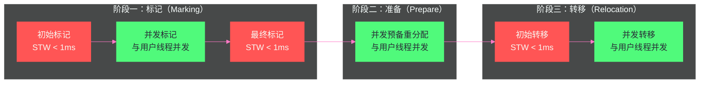

# 08 ZGC——亚毫秒停顿的着色指针与读屏障

**摘要：**

ZGC（Z Garbage Collector）是 JDK 11 引入（JDK 15 正式 GA）的新一代低延迟垃圾回收器，其设计目标极为激进：**无论堆大小（从几百 MB 到 16TB），STW 停顿时间始终控制在亚毫秒级（< 1ms，JDK 16 之后目标是 < 1ms，实测通常 < 0.5ms）**。这是 G1 停顿目标（几十~几百毫秒）的几个数量级的提升。ZGC 实现这一目标的核心技术是两个前所未有的创新：**着色指针（Colored Pointer）**——利用 64 位地址空间的高位比特存储对象元数据，使 GC 的状态信息"随指针走"；**读屏障（Load Barrier）**——在每次从堆中读取对象引用时插入检查逻辑，实现了并发对象转移而无需 STW。本文深入剖析 ZGC 的内存模型、并发标记到并发转移的完整流程、着色指针的四种视图、读屏障的工作机制，以及 JDK 21 分代 ZGC 的重大演进。

---

## 第 1 章 G1 的局限与 ZGC 的目标

### 1.1 G1 停顿时间的天花板

[[对象生命周期与GC/07 G1 收集器——Region 化内存与混合回收]] 中我们看到，G1 通过 Region 化和停顿预测模型，将典型的 GC 停顿从秒级降到了几十~几百毫秒。但 G1 的停顿时间存在一个工程天花板：

**G1 的复制阶段（Evacuation）必须是 STW 的**。G1 在 Young GC 和 Mixed GC 的复制阶段，所有对象转移（从旧 Region 复制到新 Region）都在 STW 期间完成，用户线程不能同时访问正在被移动的对象（会读到旧地址或中间状态）。

对于大堆（几十 GB 以上），即使并行复制速度很快，每次复制的存活对象总量也很大，停顿时间难以突破几十毫秒的下限。更严重的是，**G1 的停顿时间与堆大小正相关**——堆越大，单次 GC 要处理的 Region 越多，停顿越长。

### 1.2 ZGC 的革命性目标

ZGC 的目标是将 STW 停顿时间彻底与堆大小解耦：**无论堆有多大，停顿时间都是固定的亚毫秒级**。

实现这个目标，需要解决 G1 的根本问题：**对象转移（复制）必须从 STW 变为并发**。这就是 ZGC 最核心的技术挑战——如何在用户线程正在使用对象的同时，安全地将对象移动到新地址。

---

## 第 2 章 着色指针——GC 元数据嵌入指针

### 2.1 为什么要用指针的高位存储元数据

在传统的 GC（包括 G1）中，GC 的状态信息（对象是否已标记、是否已转移）存储在**对象头的 Mark Word** 中。这意味着：
- 读取对象的 GC 状态，需要先解引用（找到对象），再读取对象头
- 并发转移时，JVM 和用户线程都可能访问对象头，需要复杂的同步

ZGC 的思路是：**直接在指针（引用）本身中编码 GC 状态**，不需要访问对象头。这就是**着色指针（Colored Pointer）**。

### 2.2 着色指针的 64 位布局

在 64 位系统上，Linux x86-64 的用户进程地址空间实际只使用 48 位（低 48 位），高 16 位（bit 48~63）未被使用（通常是全 0 或全 1 的符号扩展）。

ZGC 将堆地址限制在低 44 位（最大 16TB），然后将余下的 4 位（bit 44~47）用于存储**GC 元数据**：

```
64位指针的布局（ZGC，JDK 15~20 非分代版本）：

Bit 63~48: 未使用（固定为 0）
Bit 47:    Finalizable 标记（对象是否只有虚引用/Finalizer 可达）
Bit 46:    Remapped 标记（对象是否已完成地址重映射）
Bit 45:    Marked1 标记（标记位 1，奇数 GC 周期使用）
Bit 44:    Marked0 标记（标记位 0，偶数 GC 周期使用）
Bit 43~0:  实际的堆内对象地址（44 位，最大 16TB）
```

这 4 个高位标记，就是"着色"的含义——同一个对象地址，根据高位标记的不同，在不同 GC 阶段有不同的"颜色"（语义）。

### 2.3 四种视图——多重映射的技巧

着色指针中的地址位（bit 43~0）是一个**相对于 ZGC 堆基址的偏移量**。ZGC 将堆内存映射为**多个虚拟地址视图**（通过操作系统的 `mmap` 匿名映射），每个视图对应一组标记位组合：

- **Remapped 视图**（bit 46 为 1）：对象已完成转移和重映射，指针指向最新地址
- **Marked0 视图**（bit 44 为 1）：GC 标记阶段的标记位（偶数周期）
- **Marked1 视图**（bit 45 为 1）：GC 标记阶段的标记位（奇数周期）

这三个视图实际上映射到**同一块物理内存**（三段不同虚拟地址 → 同一段物理页）。操作系统的虚拟内存机制允许这种多重映射（一块物理内存可以有多个虚拟地址别名），ZGC 正是利用了这一点。

```
物理内存（堆）：│ 对象 A │ 对象 B │ 对象 C │ ...

三种虚拟地址视图（均映射到相同的物理内存）：
Remapped:  │ addr + 0x400000000000 │ → 同一块物理内存
Marked0:   │ addr + 0x100000000000 │ → 同一块物理内存
Marked1:   │ addr + 0x200000000000 │ → 同一块物理内存
```

**多重映射的意义**：当 GC 需要将所有指针从 Marked0 视图切换到 Remapped 视图时，不需要遍历堆中的每个引用字段更新地址（那样代价极高）——只需要通过读屏障在指针被使用时**按需修正**，同时多个虚拟地址视图都指向同一物理内存，即使新旧地址同时存在也不会有内存一致性问题。

---

## 第 3 章 读屏障——并发转移的核心守卫

### 3.1 为什么是读屏障而不是写屏障

G1、CMS 使用**写屏障（Write Barrier）**——在引用字段被写入时拦截，维护 RSet/卡表。

ZGC 的核心是**读屏障（Load Barrier）**——在从堆中**读取**一个对象引用时拦截，检查指针的颜色（着色位），如果颜色"不对"则执行修正动作。

**为什么读而不是写？**

因为 ZGC 需要解决的是并发转移的一致性问题：当 GC 正在将对象 A 从旧地址复制到新地址时，用户线程可能同时读取 A 的指针（旧地址）。如果用户线程用旧地址访问 A，而 A 已经被 GC 移动到新地址，就会访问到无效内存。

**读屏障在用户线程读取指针时拦截**，检查这个指针是否需要修正（指向的对象是否已经被移动），如果需要则在当前线程的上下文中立即完成修正，再返回正确的新地址。这样用户线程拿到的永远是最新的、有效的指针。

### 3.2 读屏障的伪代码

```java
// 原始 Java 代码（读取一个字段）：
Object obj = someContainer.field;

// JIT 编译后插入读屏障（伪代码）：
Object raw = someContainer.field;  // 原始读取（可能是旧地址）

// 读屏障检查（每次从堆读取引用时都会执行）：
if (raw 的着色位 != 当前预期的颜色) {
    // 指针需要修正：对象可能已经被移动或未标记
    raw = loadBarrierSlowPath(raw);  // 慢速路径：完成标记/重映射
}
// raw 现在是正确的、最新的引用
Object obj = raw;
```

**快速路径（Fast Path）**：如果指针的颜色位已经是当前 GC 阶段预期的颜色（如当前在 Remapped 阶段，指针的 Remapped 位已置为 1），读屏障只需做一个位检查（极低开销），直接返回。这是最常见的路径。

**慢速路径（Slow Path）**：如果颜色不对（说明这个指针还"停留在旧 GC 阶段"），需要：
- **标记阶段**：将该对象标记为存活（更新标记位）
- **转移阶段**：如果对象已被 GC 移动，找到新地址并更新指针（重映射）；如果对象还未被移动，可能触发转移

慢速路径有一定开销，但只在指针需要修正时才触发，随 GC 进展慢速路径的触发概率逐渐降低（越来越多的指针完成修正后进入快速路径）。

### 3.3 读屏障 vs 写屏障的工程权衡

**读屏障的代价**：Java 程序中读操作远多于写操作（统计上，引用读/写比例通常 > 10:1），每次读都有屏障检查，总体开销比写屏障更大。ZGC 的读屏障使吞吐量略低于 G1（通常降低 5%~15%，取决于应用的引用读取密度）。

**读屏障的收益**：读屏障使 ZGC 可以安全地**并发转移对象**——GC 线程复制对象，用户线程通过读屏障自动修正旧指针，两者可以同时进行，不需要 STW。这是 ZGC 亚毫秒停顿的根本保障。

---

## 第 4 章 ZGC 的 GC 流程

### 4.1 ZGC 的完整 GC 周期

ZGC 的 GC 过程分为三个大阶段，每个阶段都以极短的 STW 开始和/或结束，中间大部分工作与用户线程并发：



**阶段一：标记（Marking）**

- **初始标记（Initial Mark）—— STW，< 1ms**：标记所有 GC Roots 直接关联的对象，将其指针着色为 Marked0 或 Marked1（交替使用，区分相邻两次 GC 周期）。
- **并发标记（Concurrent Mark）—— 并发**：从初始标记的对象出发，并发遍历整个对象图，通过读屏障将所有可达对象的指针更新为当前 Marked 颜色。
- **最终标记（Final Mark）—— STW，< 1ms**：处理并发标记期间遗漏的引用变化，完成标记。

**阶段二：并发预备重分配（Concurrent Prepare for Relocation）—— 并发**

分析哪些 Region 的垃圾最多，构建**重分配集（Relocation Set）**——需要被清空并转移的 Region 列表（类似 G1 的 CSet，但完全不需要 STW 来确定）。

**阶段三：转移（Relocation）**

- **初始转移（Initial Relocate）—— STW，< 1ms**：转移 GC Roots 直接引用的那部分对象（确保 GC Roots 指向的对象有确定的新地址）。
- **并发转移（Concurrent Relocate）—— 并发**：将重分配集中所有 Region 的存活对象复制到新 Region，同时通过读屏障修正用户线程持有的旧指针。
- **并发重映射（Concurrent Remap，下一个 GC 周期的并发标记中完成）**：修正堆中所有还指向旧地址的引用字段，将它们更新为新地址。ZGC 将重映射与下一次 GC 的并发标记合并，节省一次单独的全堆遍历。

### 4.2 并发转移的关键细节——转发表（Forwarding Table）

在并发转移阶段，GC 线程将对象从旧 Region 复制到新 Region。对于每个被移动的对象，GC 在**转发表（Forwarding Table）** 中记录 `旧地址 → 新地址` 的映射。

当用户线程通过读屏障发现指针颜色不对（处于旧的 Marked 颜色而不是 Remapped 颜色），读屏障的慢速路径会：
1. 查询转发表，找到对象的新地址
2. 将持有旧指针的引用字段原子地更新为新地址（CAS 更新，防止并发竞争）
3. 返回新地址

这样，每个旧指针在被读取时会被"顺手修正"，随着时间推移，所有旧指针都会被修正，最终可以安全地释放旧 Region 和转发表。

### 4.3 STW 停顿为什么能控制在亚毫秒

ZGC 的三次 STW 停顿（初始标记、最终标记、初始转移），工作量都极小：
- **初始标记**：只标记 GC Roots 的直接子对象（一层），不做深度扫描
- **最终标记**：处理遗漏的少量变动
- **初始转移**：只转移 GC Roots 的直接子对象

这些操作的工作量与 GC Roots 的数量成正比，而 GC Roots 的数量是有限的（线程栈、静态字段等），不随堆大小增长。因此，**ZGC 的 STW 时间与堆大小无关，几乎是常数**（只与 GC Roots 规模和 CPU 性能有关）。

---

## 第 5 章 ZGC 与 G1 的深层对比

### 5.1 写屏障 vs 读屏障的代价差异

G1 维护 RSet 需要写屏障（每次引用赋值触发），ZGC 的并发转移需要读屏障（每次引用读取触发）：

```
Java 程序中引用操作频率：
写操作（a.field = b）: 相对较少
读操作（x = a.field）: 非常频繁（通常是写的 10 倍以上）
```

读屏障的覆盖面更广，对吞吐量的影响更大（5%~15% 的额外开销，取决于应用特征）。G1 的写屏障开销通常在 1%~3%。

**但吞吐量的轻微下降，换来的是停顿时间从几百毫秒降到不足 1ms**——对于延迟敏感型应用，这个代价是完全值得的。

### 5.2 内存开销的对比

G1 的 RSet 需要每个 Region 维护"谁引用了我"的记录，在引用复杂的场景下可能消耗堆大小的 10%~20%。

ZGC 使用着色指针（开销极小）+ 转发表（只在转移期间临时存在）+ 读屏障（代码开销，不是内存开销），整体额外内存占用远低于 G1 的 RSet。

---

## 第 6 章 JDK 21 分代 ZGC——补上最后一块短板

### 6.1 非分代 ZGC 的问题

JDK 15~20 的 ZGC 是**非分代的**——没有新生代和老年代的区分，每次 GC 都要扫描整个堆。

非分代 ZGC 的问题在于：它违背了分代假说。在应用中，绝大多数对象是短命的，应该被快速、频繁地回收；但非分代 ZGC 每次 GC 都扫描包含长生命周期老对象的整个堆，做了大量不必要的工作。

结果是：ZGC 的吞吐量在某些场景下比 G1 低 20%~30%——虽然停顿极短，但单位时间能处理的请求数反而少了。

### 6.2 分代 ZGC（JDK 21 正式 GA）

**JDK 21 引入分代 ZGC**（`-XX:+ZGenerational`，JDK 21 默认仍为非分代，预期 JDK 23+ 成为默认），将 ZGC 改造为支持分代的版本：

- **新生代（Young Generation）**：包含短生命周期对象，高频率 Minor GC（几毫秒到几十毫秒完成，但停顿 < 1ms）
- **老年代（Old Generation）**：包含长生命周期对象，低频率 Major GC

**分代 ZGC 的好处**：
- 大多数垃圾在新生代就被快速回收，无需每次都扫描整个堆
- 吞吐量接近 G1（受益于分代假说），同时保持 ZGC 的亚毫秒停顿

```
分代 ZGC vs 非分代 ZGC vs G1（典型对比）：

              停顿时间     吞吐量
G1:           几十~几百ms  最高
非分代 ZGC:   < 1ms       中（比 G1 低 10%~30%）
分代 ZGC:     < 1ms       高（接近 G1，甚至超过）
```

这使分代 ZGC 成为近年来 Java GC 领域最重要的进展——**兼顾亚毫秒停顿和高吞吐量，不再需要在两者之间做妥协**。

### 6.3 启用分代 ZGC

```bash
# JDK 21，启用分代 ZGC
java -XX:+UseZGC -XX:+ZGenerational -Xmx4g MyApp

# JDK 23+ 预计分代 ZGC 将成为默认（无需 +ZGenerational 标志）
```

---

## 第 7 章 ZGC 的适用场景与选型指南

### 7.1 ZGC 最适合的场景

**延迟极度敏感的应用**：金融交易系统、实时推荐、游戏服务器——这类应用不能接受任何 GC 导致的请求延迟抖动，亚毫秒 GC 停顿是刚需。

**超大堆应用**：对于 32GB 以上的堆，G1 的 Mixed GC 停顿时间可能仍然较长（几百毫秒），而 ZGC 的停顿与堆大小无关，是大堆场景的最优选择。

**容器化部署（短生命周期实例）**：容器实例启动快、运行时间短，ZGC 的亚毫秒停顿确保了从启动到首次请求的快速就绪，且整个运行周期内不会有明显的 GC 停顿影响。

### 7.2 ZGC 不适合的场景

**极度追求吞吐量的批处理应用**（Hadoop/Spark 离线计算）：这类应用不在乎单次停顿时间，只关心总任务完成时间。ZGC 的读屏障开销会降低吞吐量，不如 Parallel GC 或 G1。

**JDK 8 环境**：ZGC 需要 JDK 11+，JDK 8 无法使用。

**CPU 资源极其紧张的环境**：ZGC 的并发 GC 线程和读屏障会持续消耗一定 CPU，在 CPU 受限的环境中（如 1~2 核容器）可能影响业务吞吐。

### 7.3 ZGC 关键参数

| 参数 | 含义 | 建议 |
| :--- | :--- | :--- |
| `-XX:+UseZGC` | 启用 ZGC | JDK 15+ |
| `-XX:+ZGenerational` | 启用分代 ZGC | JDK 21+，强烈推荐 |
| `-XX:SoftMaxHeapSize` | 软上限（ZGC 尽量不超过此值，允许临时超过）| 设为 `-Xmx` 的 80% 留出 GC 缓冲 |
| `-XX:ZCollectionInterval` | 强制 GC 间隔（秒，防止长时间无 GC）| 超长空闲期应用建议设置（如 60s）|
| `-XX:ZAllocationSpikeTolerance` | 分配尖峰容忍度 | 分配速率剧烈波动的应用可调高 |
| `-XX:ConcGCThreads` | 并发 GC 线程数 | 默认 CPU 核数 / 4，I/O 密集型应用可调高 |

---

## 第 8 章 总结

ZGC 是 Java GC 历史上最激进的技术跳跃。它的核心技术贡献：

**着色指针**：将 GC 元数据编码进指针的高位比特，使 GC 状态随指针传播，无需访问对象头即可获取 GC 信息，也是多重虚拟地址视图的前提。

**读屏障**：在每次引用读取时检查指针颜色，按需修正旧指针。读屏障使并发对象转移成为可能——GC 线程转移对象，用户线程通过读屏障自动修正指针，双方并发不冲突，彻底消除了"转移必须 STW"的限制。

**亚毫秒 STW**：三次极短的 STW（各 < 1ms），工作量与堆大小无关，只取决于 GC Roots 规模。

**分代 ZGC（JDK 21）**：补上了非分代 ZGC 吞吐量不足的短板，实现了亚毫秒延迟与高吞吐量的统一。

**代价**：读屏障带来 5%~15% 的额外吞吐量开销（非分代版），分代 ZGC 大幅缓解此问题。

ZGC 代表了 JVM 技术的当前最前沿，也是 Java 在延迟敏感场景与 Rust、C++ 竞争的重要底牌。

下一篇 [[对象生命周期与GC/09 Shenandoah——与 ZGC 殊途同归的并发压缩]] 将介绍另一条通向并发转移的技术路径——Shenandoah 的 Brooks Pointer 转发指针方案，以及它与 ZGC 在技术选择上的本质差异。

---

## 参考文献

1. Per Liden & Stefan Karlsson, "ZGC: A Scalable Low-Latency Garbage Collector", Proceedings of VMIL 2018
2. Per Liden, "ZGC What's new in JDK 16", Oracle Blog, 2021
3. 美团技术博客, "新一代垃圾回收器ZGC的探索与实践", 2020
4. 周志明, 《深入理解 Java 虚拟机（第三版）》, 第 3.8 章：低延迟垃圾收集器
5. JEP 439: Generational ZGC (JDK 21)
6. OpenJDK Wiki, "ZGC", wiki.openjdk.org/display/zgc
7. Aleksey Shipilev, "ZGC: The Next Generation Low-Latency GC", 2019

---

> [!note] 思考题
> 1. ZGC 使用'着色指针'（Colored Pointers）在 64 位指针中嵌入 GC 元数据（标记位、重映射位等）。这意味着 ZGC 不能使用压缩指针（CompressedOops）。不使用压缩指针会导致每个对象引用从 4 字节增加到 8 字节——在一个引用密集的应用（如大量小对象组成的树/图结构）中，内存开销增加多少？这是否抵消了 ZGC 低延迟的优势？
> 2. ZGC 的并发标记和并发转移依赖'读屏障'（Load Barrier）——每次从堆中读取引用时插入检查代码。读屏障的运行时开销通常在 2%-5%。在什么类型的应用中（读多写少 vs 写多读少），读屏障的开销会特别明显？为什么 G1 选择了'写屏障'而 ZGC 选择了'读屏障'？
> 3. ZGC 从 JDK 15 开始成为生产就绪。但在堆内存超过 TB 级别的场景下，ZGC 的并发标记阶段需要遍历整个对象图——标记耗时可能很长。如果标记阶段耗时超过对象的分配速率（即 GC 跟不上分配速度），会发生什么？ZGC 有类似 G1 的'Full GC 降级'机制吗？
