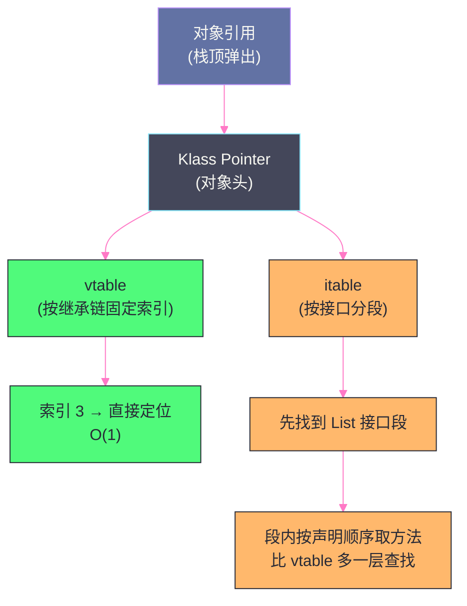
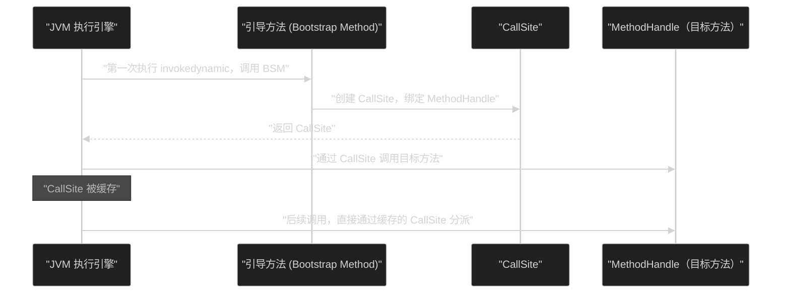

# 11 字节码指令集与执行引擎

> [!abstract] 摘要
> 字节码（Bytecode）是 Java 跨平台能力的实际载体——`.class` 文件中的字节码序列被 JVM 执行引擎解释或编译为本地机器码，程序员写的是 Java 语法，机器执行的是这套与硬件无关的中间语言。理解字节码有直接的工程价值：排查反编译产物时能快速定位逻辑问题、理解性能热点的底层操作代价、看穿 Lambda / 动态代理 / 方法引用等语法糖背后的真实执行路径。本文从 Class 文件结构切入，系统梳理字节码指令集的分类（加载存储、运算、类型转换、对象操作、控制转移、方法调用），重点剖析 JVM **基于栈的虚拟机模型**的设计取舍——为什么不像 Dalvik/ART 那样选择基于寄存器的模型，栈帧、操作数栈与局部变量表如何配合完成一次方法调用的完整生命周期；然后深入 JVM 多态机制真正的落地载体——**五条方法调用指令**（`invokestatic`、`invokespecial`、`invokevirtual`、`invokeinterface`、`invokedynamic`），逐一拆解虚方法表（vtable）、接口方法表（itable）与内联缓存（Inline Cache）的分派细节与性能差异；最后深入 `invokedynamic` 如何在 JDK 7 引入之后，借助 `CallSite`、`MethodHandle` 与 `LambdaMetafactory` 成为 Lambda 表达式、方法引用、`var` 等一系列 Java 特性的底层基石，并给出"Lambda 到底是不是匿名内部类"这个长期争议问题的确切答案。文末补充模板解释器的执行机制和字节码工程实践（反编译、字节码增强）作为收尾。

---

## 第 1 章 Class 文件的结构回顾

### 1.1 字节码在哪里

在 [[01 JVM 全局架构——从 .java 到机器码的完整旅程]] 中已经介绍了 Class 文件的整体结构。字节码序列存储在 Class 文件方法表（Methods）中每个方法的 **`Code` 属性**内：

```
方法 main() 的 Code 属性：
├── max_stack: 2       ← 操作数栈最大深度（编译期静态计算）
├── max_locals: 1      ← 局部变量表最大槽位数
├── code_length: 9     ← 字节码字节数
└── code[]:            ← 字节码序列
    [0] 0xB2 → getstatic  #9    // 获取静态字段 System.out
    [3] 0x12 → ldc       #7    // 加载字符串常量 "Hello, World!"
    [5] 0xB6 → invokevirtual #10 // 调用 println
    [8] 0xB1 → return           // 方法返回
```

每条字节码指令由**操作码（opcode，1 字节，0x00~0xFF）** 和可选的**操作数（operands）** 组成。JVM 规范定义了约 200 条有效指令（部分操作码被保留，实际指令约 205 个）。

**为什么操作码只用 1 个字节**：这不是随意的设计，而是一个明确的空间与速度权衡。1 字节意味着操作码空间最多 256 个，JVM 规范目前只用了不到 210 个，留有余量但足够紧凑——字节码文件体积直接影响类加载时的 I/O 和网络传输开销（Applet 时代这一点尤其关键）。如果操作码用 2 字节甚至 4 字节（类似很多字节码虚拟机的做法），指令密度会下降，解释器的取指（fetch）开销也会上升。代价是指令种类被迫压缩——同一个"加法"语义要按操作数类型拆成 `iadd`/`ladd`/`fadd`/`dadd` 四条指令，而不是一条能处理任意类型的通用 `add`。这是**指令集"窄而多" vs "宽而少"** 的经典取舍，JVM 选择了前者。

### 1.2 常量池——字节码可读性的关键

字节码本身高度抽象、高度"符号化"：`invokevirtual #10` 中的 `#10` 不是内存地址，也不是方法的直接指针，而是**常量池（Constant Pool）** 中第 10 项的索引。常量池是 Class 文件中一张巨大的资源表，字节码几乎所有涉及类名、字段名、方法名、方法签名、字符串/数字字面量的地方，都不会把这些信息直接编码进指令流，而是转成一个指向常量池的索引。

**为什么要绕一层常量池，而不是把符号直接写进字节码**：字节码指令要求操作数尽量短（很多操作数只占 1~2 字节），但类名、方法签名等信息长度不固定，动辄几十个字符。如果直接内联进指令流，指令会变得又长又不规整，解析开销大增。把这些可变长度信息统一抽到常量池，字节码里只保留固定宽度的索引，指令格式因此可以做到高度规整，解释器按操作码长度表就能确定下一条指令的起始位置，无需先解析当前指令的语义。

常量池中最常见的几类条目（用 `javap -v` 能看到 `tag` 字段）：

| 常量池 Tag | 含义 | 典型引用者 |
| :--- | :--- | :--- |
| `CONSTANT_Utf8` | 原始字符串（类名、方法名、描述符本体） | 几乎所有其他条目 |
| `CONSTANT_Class` | 类或接口的符号引用（指向一个 Utf8） | `new`、`checkcast`、`instanceof` |
| `CONSTANT_Fieldref` | 字段的符号引用（类 + 名字 + 描述符） | `getfield`/`putfield`/`getstatic`/`putstatic` |
| `CONSTANT_Methodref` | 类方法的符号引用 | `invokestatic`/`invokespecial`/`invokevirtual` |
| `CONSTANT_InterfaceMethodref` | 接口方法的符号引用 | `invokeinterface` |
| `CONSTANT_String` | 字符串常量（指向 Utf8） | `ldc` |
| `CONSTANT_NameAndType` | 名字 + 描述符对（被 Methodref/Fieldref 复用） | 间接引用 |
| `CONSTANT_MethodHandle` / `CONSTANT_MethodType` | JDK 7 引入，支撑 `invokedynamic` | 引导方法相关 |
| `CONSTANT_InvokeDynamic` | 动态调用点的描述信息 | `invokedynamic` |

**符号引用与直接引用**：常量池中记录的是**符号引用**（symbolic reference）——例如"`java/lang/System` 类的 `out` 字段，描述符 `Ljava/io/PrintStream;`"这样一段纯文本式的描述，此时还不知道这个字段在内存中的具体地址。JVM 在类加载的**解析（Resolution）** 阶段（属于连接的一部分，详见 [[类加载器/10 类加载机制——双亲委派模型与打破它的场景]]）把符号引用替换为**直接引用**——一个可以直接定位到目标内存位置的指针或偏移量。这个替换动作既可以在类加载时立即完成（静态解析，`invokestatic`/`invokespecial` 常走这条路），也可以推迟到第一次真正执行到该指令时才做（**懒解析/延迟解析**，`invokevirtual`/`invokeinterface`/`invokedynamic` 更依赖这种方式）——懒解析避免了"加载了一个类却因为其中一条极少执行到的指令引用了不存在的类而直接失败"的过度敏感问题，也是 Java 支持"运行时才报 `NoSuchMethodError`"这种延迟错误暴露行为的根源。

> [!info] 核心概念：常量池是符号系统，不是数据缓存
> 不要把常量池简单理解成"存字符串和数字的地方"。它更准确的定位是**类文件内部的符号表**——把所有需要跨方法、跨字段共享和引用的名字、类型、字面量集中存放一次，字节码指令通过索引间接引用，从而避免重复存储，也让符号解析这个"从名字找到实际内存位置"的过程有一个统一的入口。运行时，方法区中每个类还维护一份**运行时常量池**，是类文件常量池在内存中的运行时表示，解析后的直接引用就写回这里（参见 [[运行时数据区/02 运行时数据区——堆、栈、方法区的内存布局]] 第 5.4 节）。

### 1.3 方法表与 Code 属性

Class 文件的方法表（`methods[]`）为每个方法记录访问标志（`public`/`static`/`abstract` 等）、名字索引、描述符索引，以及一组属性表（`attributes[]`）。真正的字节码指令序列，藏在属性表中名为 **`Code`** 的属性里——这也解释了为什么 `abstract` 方法和接口的抽象方法在 Class 文件里"没有方法体"：它们的方法表项里根本不存在 `Code` 属性。

`Code` 属性除了字节码序列本身，还携带两个对执行引擎至关重要的元数据：

- **`max_stack`**：这个方法执行期间操作数栈可能达到的最大深度，由 `javac` 在编译期静态推导得出（并非运行时测量）。JVM 在为方法创建栈帧时，会按这个数值一次性分配好操作数栈空间，运行期不再检查栈是否溢出——这是一种"编译期证明、运行期免检"的性能优化思路。
- **`max_locals`**：局部变量表需要的槽位（slot）数量，同样编译期确定。`this`（非 `static` 方法）、参数、方法内声明的局部变量共享这张表，`long`/`double` 各占 2 个槽位，其余类型占 1 个槽位。

这两个数值是解释器和 JIT 编译器分配栈帧内存的直接依据，也是 `-verify` 阶段（[[类加载器/10 类加载机制——双亲委派模型与打破它的场景]] 中提到的字节码验证）用来校验字节码合法性的关键输入——验证器会静态模拟整个方法的执行路径，确认任意时刻的操作数栈深度不会超过 `max_stack`、不会出现类型不匹配的栈操作。

### 1.4 用 javap 反汇编字节码

`javap -c -verbose HelloWorld.class` 是查看字节码最常用的工具，`-v`（`-verbose`）会额外打印常量池全貌、`Code` 属性的 `max_stack`/`max_locals`、`LineNumberTable`（字节码偏移量到源码行号的映射，异常堆栈定位的基础）、`LocalVariableTable`（局部变量名与槽位的映射，`-g` 编译才会生成，生产环境常因体积和信息暴露考虑而关闭）。对于生产环境调试，配合 ASM、ByteBuddy、Arthas 的 `jad` 命令可以反编译运行中的类，`jad` 底层做的事情本质上也是拿到运行时的字节码后走一遍反编译流程。

---

## 第 2 章 基于栈的虚拟机模型

### 2.1 为什么 JVM 是基于栈的

JVM 执行引擎是**基于栈（Stack-based）的虚拟机**——字节码指令的操作数不通过寄存器传递，而是通过**操作数栈（Operand Stack）** 传递：指令从栈顶弹出操作数，计算结果压回栈顶。这是理解一切字节码执行行为的出发点：JVM 规范里几乎每一条运算、比较、类型转换、方法调用指令，描述的都是"从栈顶取出若干项，做完运算后再压回栈顶"这样一件事，指令本身几乎不携带操作数的"位置信息"（去哪个寄存器取），因为操作数的位置永远是隐式的、固定的——栈顶。

**不这样设计会怎样**：如果 JVM 采用寄存器模型，字节码指令就必须显式指定"从哪个寄存器取、结果写到哪个寄存器"，这意味着指令编码要为寄存器编号留出比特位，指令普遍变长；更麻烦的是，寄存器模型天然与目标硬件的寄存器数量绑定——x86-64 通用寄存器 16 个，ARM64 有 31 个通用寄存器，早期嵌入式芯片可能只有几个。如果字节码里直接写死"使用寄存器 v12"，这套字节码要在不同寄存器数量的机器上正确、高效地运行，虚拟机就必须做一层寄存器重映射，或者干脆限制字节码只能用最小公共寄存器数量——无论哪种方案都会削弱"一次编译，到处运行"这个 Java 最核心的卖点。

### 2.2 与基于寄存器模型的对比——以 Dalvik/ART 为参照

Android 的 Dalvik（后来的 ART）字节码格式是**基于寄存器**的典型代表，选择它不是偶然，而是移动端受限环境下的另一种取舍：Dalvik 字节码里每条指令直接携带若干个"虚拟寄存器"编号（这些寄存器数量在方法级别声明，不是物理寄存器，仍需要 ART 的即时编译器/AOT 编译器把它们映射到真实物理寄存器上），指令自身不需要额外的 `load`/`store` 指令去"倒运"操作数。

| 维度 | 基于栈（JVM `.class`）| 基于寄存器（Dalvik/ART `.dex`）|
| :--- | :--- | :--- |
| **指令数量** | 多（每条指令操作数隐式，需要显式 load/store 搬运）| 少（操作数直接在指令中指定虚拟寄存器编号）|
| **指令长度** | 短（操作码 1 字节，操作数少）| 相对长（需要编码源/目标寄存器编号）|
| **文件体积** | 每个类单独一个 `.class`，方法间常量池不共享 | 整个 App 共用一份常量池（`.dex` 的字符串/类型表全局共享），体积更小 |
| **可移植性** | 高（不依赖物理寄存器数量，纯符号化栈操作）| 相对低（虚拟寄存器数量仍需运行时再映射到真实寄存器）|
| **解释执行效率** | 略低（更多内存/栈访问，指令数更多）| 略高（更少的中间搬运指令，单条指令信息密度更高）|
| **实现复杂度** | 低（栈模型天然避免寄存器分配问题）| 高（需要寄存器分配、生命周期分析等编译技术）|

**为什么 Android 会反过来选择寄存器模型**：Dalvik 诞生的年代（2008 年前后）移动设备内存和 CPU 都极其有限，一个 App 里往往有大量小类、小方法，如果沿用 JVM 那种"每个类文件各自维护一份常量池"的模式，会在多个类之间产生大量重复的字符串和符号信息，浪费宝贵的存储和加载内存。Dalvik 把整个 App 的所有类打包进一个 `.dex` 文件，共享一份全局常量池，同时用寄存器模型减少纯粹为了"倒运数据"而存在的指令，用**更少的指令数**换取更小的文件体积和更快的解释速度——这是移动设备场景下对 I/O、内存双重敏感之后的工程选择，与 JVM 服务端/桌面场景优先跨平台可移植性的选择方向不同，没有绝对的优劣，只是针对的约束条件不同。

**JIT 编译后不再是纯栈模型**：解释器确实按照栈模型逐条执行字节码，但 JIT 编译器（C2）在把字节码编译为机器码时会进行**寄存器分配（Register Allocation）**——通过图着色等算法，把方法体内频繁读写的操作数分配到真实的物理寄存器，消除大量本可以避免的内存/栈访问，这是 JIT 编译后性能大幅提升的原因之一（详见 [[执行引擎/12 JIT 编译与逃逸分析——从解释执行到本地代码]]）。也就是说，"基于栈"只是字节码这门**中间语言**的设计选择，并不代表最终在 CPU 上执行时也是"基于栈"的——栈模型只是解释器忠实执行的语义，一旦交给 JIT，这层栈语义会被彻底编译消解掉，落地为真实的寄存器和内存访问指令。

> [!note] 设计哲学：字节码是给虚拟机看的，不是给 CPU 看的
> 栈模型 vs 寄存器模型的争论容易陷入"哪个更快"的误区。真正该问的问题是：这套字节码的**首要读者**是谁？如果字节码最终必须先经过解释器逐条执行（哪怑只是短暂的预热阶段），栈模型的简单性、可移植性和验证友好性（更容易做类型和栈深度的静态校验）价值更高；如果字节码总是先经过一次编译才落地执行（Dalvik 早期确实也有解释执行，但设计目标始终考虑到编译期优化空间），寄存器模型能减少的"纯搬运"指令收益更大。JVM 选择栈模型，本质上是把"如何快"这个问题留给了 JIT，把"如何portable、如何简单可靠"这个问题留给了字节码本身。

### 2.3 一个简单加法的完整执行过程

```java
int add(int a, int b) {
    return a + b;
}
```

对应的字节码（用 `javap -c` 查看）：

```
int add(int, int);
  Code:
     0: iload_1    // 将局部变量表 slot 1（参数 a）的值压入操作数栈
     1: iload_2    // 将局部变量表 slot 2（参数 b）的值压入操作数栈
     2: iadd       // 弹出栈顶两个 int，相加，结果压栈
     3: ireturn    // 弹出栈顶 int，作为方法返回值
```

逐步执行可视化：

```
初始状态（局部变量表：slot0=this, slot1=a=3, slot2=b=4）：
操作数栈：[]（空）

执行 iload_1：
操作数栈：[3]（a 的值）

执行 iload_2：
操作数栈：[3, 4]（a、b 的值）

执行 iadd：弹出 3 和 4，计算 3+4=7，压入
操作数栈：[7]

执行 ireturn：弹出 7，作为返回值
操作数栈：[]（方法结束，栈帧销毁）
```

### 2.4 栈帧——操作数栈与局部变量表的容器

上面的例子里，"操作数栈"和"局部变量表"看起来是两个独立的结构，但它们实际上是同一个更大结构——**栈帧（Stack Frame）** ——的两个组成部分。每一次方法调用，JVM 都会在当前线程的**虚拟机栈**（详见 [[运行时数据区/02 运行时数据区——堆、栈、方法区的内存布局]] 第 3 章）上新建一个栈帧，方法调用返回，这个栈帧就跟着出栈销毁。一个栈帧通常包含四类信息：

- **局部变量表（Local Variable Table）**：存放方法参数和方法体内声明的局部变量，槛位数量即前文的 `max_locals`。
- **操作数栈（Operand Stack）**：字节码指令的工作区，深度上限即 `max_stack`。
- **动态链接（Dynamic Linking）**：指向当前方法所在类在运行时常量池中的引用，为了支持方法调用过程中的符号引用解析（例如遇到 `invokevirtual` 需要回到常量池查找方法的符号信息）。
- **方法返回地址（Return Address）**：正常返回时是调用者的下一条指令地址，异常退出时（`athrow` 没有被内部 `catch`）没有这个信息，需要依赖异常表来回溯。

这四部分中，局部变量表和操作数栈是执行引擎逐条解释字节码时真正频繁读写的两块内存，二者的关系可以理解成"局部变量表是变量的家，操作数栈是搬运和加工变量的传送带"——`iload_1` 把局部变量表里 slot 1 的值搬到传送带上，`iadd` 在传送带上原地加工，`istore_1` 把加工完的结果再搬回局部变量表。这也解释了为什么 Java 字节码里 load/store 指令的出现频率极高：任何"读一个变量、算一算、存回一个变量"的操作，都要经过至少一次搬上传送带、一次搬下传送带的过程。

**一个稍复杂一点的例子**——包含字段访问和条件判断，帮助建立"多种指令共同工作"的直觉：

```java
int classify(int score) {
    if (score >= 60) {
        return 1;
    }
    return 0;
}
```

对应字节码：

```
int classify(int);
  Code:
     0: iload_1          // 加载参数 score 到操作数栈：[score]
     1: bipush   60       // 压入常量 60：[score, 60]
     3: if_icmplt 9       // 弹出 score, 60 比较，score < 60 则跳到 9：[]
     6: iconst_1          // 压入常量 1：[1]
     7: ireturn           // 返回 1
     8: (未使用，仅示意)
     9: iconst_0          // 压入常量 0：[0]
    10: ireturn           // 返回 0
```

注意 `if_icmplt` 这一条指令同时完成了"弹出两个操作数、比较、条件跳转"三件事——这正是栈模型的典型特征：控制流指令同样从操作数栈取数据，而不是像寄存器模型那样直接在指令里写"比较寄存器 A 和寄存器 B"。理解这一点后，再看 `tableswitch`/`lookupswitch`（3.5 节）或方法调用指令（第 4 章），会发现它们的操作数来源都遵循同一套"先入栈、再消费"的规律，这是贯穿整个指令集的统一心智模型。

---

## 第 3 章 字节码指令集分类

### 3.1 加载与存储指令

**加载指令（Load）**：将局部变量表中的值压入操作数栈：
- `iload`/`iload_<n>`：加载 `int` 型局部变量（`_<n>` 是 0~3 的简化版本，无需操作数，更短）
- `lload`/`lload_<n>`：加载 `long`
- `fload`/`fload_<n>`：加载 `float`
- `dload`/`dload_<n>`：加载 `double`
- `aload`/`aload_<n>`：加载对象引用（`a` 代表 reference）

**存储指令（Store）**：将操作数栈顶的值存入局部变量表：
- `istore`/`istore_<n>`、`lstore`、`fstore`、`dstore`、`astore`

**常量入栈指令**：
- `iconst_<i>`（i = -1 到 5）：将小整数常量直接压栈（无需访问常量池）
- `bipush <byte>`：将 -128~127 范围的整数压栈（1 字节操作数）
- `sipush <short>`：将 -32768~32767 范围整数压栈（2 字节操作数）
- `ldc <index>`：从常量池加载 int、float、String、Class 引用等（1 字节常量池索引）
- `ldc_w <index>`：2 字节索引版本的 ldc
- `ldc2_w <index>`：加载 long、double（占两个操作数栈槽）

### 3.2 运算指令

运算指令都是**栈顶操作**——从栈顶弹出操作数，计算后压回结果：

**整数运算**（`i` 前缀代表 `int`，`l` 代表 `long`）：
- `iadd`、`isub`、`imul`、`idiv`、`irem`（取余）、`ineg`（取负）
- `ishl`（左移）、`ishr`（算术右移）、`iushr`（逻辑右移）
- `iand`（位与）、`ior`（位或）、`ixor`（位异或）

**浮点运算**（`f` 前缀代表 `float`，`d` 代表 `double`）：
- `fadd`、`fsub`、`fmul`、`fdiv`、`frem`、`fneg`

**自增指令**（局部变量直接自增，不经过操作数栈）：
- `iinc <index> <const>`：将局部变量表 index 槽的值加上常量 const

`iinc` 是一条特殊指令，直接操作局部变量表（不需要先 load 到操作数栈），是 `i++` / `i--` 类操作的直接映射，非常高效。

### 3.3 类型转换指令

JVM 的类型转换分两类：

**宽化转换（Widening）**：小范围 → 大范围，不丢失精度，自动进行：
- `i2l`（int → long）、`i2f`（int → float）、`i2d`（int → double）
- `l2f`（long → float）、`l2d`（long → double）
- `f2d`（float → double）

**窄化转换（Narrowing）**：大范围 → 小范围，可能丢失精度，需要显式转型（`(int) longValue`）：
- `l2i`（long → int，截断高 32 位）
- `f2i`、`f2l`、`d2i`、`d2l`、`d2f`
- `i2b`（int → byte，截断到 8 位）、`i2c`（int → char，截断到 16 位无符号）、`i2s`（int → short）

### 3.4 对象操作指令

- `new <class_index>`：创建对象实例（仅分配内存，未执行 `<init>`）
- `newarray <type>`：创建基本类型数组
- `anewarray <class_index>`：创建引用类型数组
- `arraylength`：获取数组长度（栈顶是数组引用）
- `getfield <field_ref>`：读取实例字段
- `putfield <field_ref>`：写入实例字段
- `getstatic <field_ref>`：读取静态字段
- `putstatic <field_ref>`：写入静态字段
- `instanceof <class_ref>`：类型检查，结果（0 或 1）压栈
- `checkcast <class_ref>`：类型强制转换，失败抛 `ClassCastException`

### 3.5 控制转移指令

JVM 的条件分支指令：
- `ifeq`（== 0）、`ifne`（!= 0）、`iflt`（< 0）、`ifge`（>= 0）、`ifgt`（> 0）、`ifle`（<= 0）：将栈顶 int 与 0 比较
- `if_icmpeq`、`if_icmpne`、`if_icmplt`…：弹出栈顶两个 int 比较
- `if_acmpeq`、`if_acmpne`：比较两个对象引用是否相同（`==` 的实现）
- `ifnull`、`ifnonnull`：与 null 比较

`tableswitch` 和 `lookupswitch` 是 `switch` 语句的两种实现：
- **`tableswitch`**：case 值连续时使用，通过跳转表（索引数组）O(1) 查找，速度快
- **`lookupswitch`**：case 值不连续时使用，通过有序键值对列表二分查找，O(log n)

`javac` 会根据 `case` 常量的分布密度自动选择：如果 `case` 值跨度大但数量少（比如只有 3 个值分布在 0、100、10000），继续用 `tableswitch` 会生成一张巨大的跳转表，绝大多数槛位都是"跳到 default"的填充项，反而浪费空间，这时编译器会退化为 `lookupswitch`。这也是"字符串 switch"和"枚举 switch"底层实现的关键——字符串 `switch` 实际上编译成两轮 `switch`：第一轮基于 `hashCode()` 做 `lookupswitch` 找到候选分支，第二轮用 `equals()` 精确比较确认，因为字符串本身不能直接作为 `tableswitch`/`lookupswitch` 的可比较键。

### 3.6 指令分类小结

把前面五个小节的指令按"操作对象"重新归类，有助于建立一张整体地图，而不是记住孤立的指令名字：

| 指令类别 | 操作对象 | 典型指令 | 是否访问常量池 |
| :--- | :--- | :--- | :--- |
| 加载/存储 | 局部变量表 ↔ 操作数栈 | `iload`、`istore`、`aload`、`astore` | 否（`ldc` 除外） |
| 运算 | 操作数栈顶 | `iadd`、`fmul`、`ishl`、`iinc` | 否 |
| 类型转换 | 操作数栈顶 | `i2l`、`d2f`、`checkcast` | `checkcast`/`instanceof` 是 |
| 对象操作 | 堆对象/数组/字段 | `new`、`getfield`、`putstatic` | 是 |
| 控制转移 | 程序计数器（PC） | `ifeq`、`goto`、`tableswitch` | 否 |
| 方法调用 | 操作数栈 + 新栈帧 | `invokevirtual`、`invokedynamic` | 是 |
| 异常与同步 | 操作数栈/监视器 | `athrow`、`monitorenter`、`monitorexit` | `athrow` 涉及异常表 |

可以看到，**是否需要访问常量池**这一条线，把指令集大致切成了两组：加载存储、运算、控制转移这类"纯计算"指令基本不需要常量池（它们的操作数或者在指令自身、或者在局部变量表/操作数栈里），而对象操作和方法调用这类"涉及类型系统"的指令几乎都要通过常量池完成一次符号解析——这正好对应了 1.2 节里"常量池是符号系统"的论述：一旦指令的语义涉及"某个类""某个字段""某个方法"这些需要名字和类型信息的概念，就必然要绕道常量池。

### 3.7 异常与同步指令——athrow 与 monitorenter/monitorexit

抛异常在字节码层面只有一条指令：**`athrow`**——从操作数栈弹出一个异常对象引用，转移控制流到能够处理该异常的 `catch` 块，如果当前方法没有匹配的 `catch`，方法立即结束并把异常向上抛给调用者。这条指令本身不做任何"查找哪个 `catch` 块该接住这个异常"的逻辑——那部分逻辑存放在 `Code` 属性的另一个子结构里：**异常表（Exception Table）**，每一项记录`起始 PC、结束 PC、处理者 PC、捕获的异常类型`四元组。执行引擎在 `athrow` 执行后，会拿着当前的 PC 位置去异常表里线性查找第一个"当前 PC 落在 [起始 PC, 结束 PC) 区间内，且异常类型匹配（或是其父类）"的表项，找到就跳转到该表项记录的处理者 PC，找不到就沿调用栈继续向上层栈帧查找（对应 Java 语义里异常沿调用栈向上传播的行为）。

**`try-finally` 如何在没有专门指令的情况下保证 `finally` 一定执行**：JVM 字节码里没有 `finally` 对应的指令，`javac` 在编译期用**代码复制**的方式把 `finally` 块的字节码分别插入到三处：`try` 块正常结束的路径上、每一个 `catch` 块结束的路径上，以及一段专门处理"try/catch 内部抛出了未被捕获异常"的隐式异常处理器上（这个隐式处理器本身也在异常表中登记，捕获类型是 `any`，出现在所有显式 `catch` 表项之后）。也就是说，`finally` 块的字节码在编译产物里往往被复制了三份甚至更多，这是 Java 语言"承诺 `finally` 一定执行"的字节码级别落地方式——不依赖任何运行时的动态保证机制，而是编译期用几何级数的代码复制换来的确定性。这也解释了思考题 3 的答案：`monitorenter` 执行后、`monitorexit` 执行前发生异常，锁**会**被释放——因为编译器会为 `synchronized` 块生成一个隐式的异常处理器，专门捕获块内抛出的任意异常，在异常处理器里执行一次 `monitorexit` 释放锁之后再重新 `athrow` 把异常继续往外抛，这本质上和 `try-finally` 是同一种字节码生成策略，只是编译器自动完成，不需要程序员手写 `finally`。

**`monitorenter`/`monitorexit`——`synchronized` 的字节码实现**：`monitorenter` 弹出栈顶对象引用，将该对象关联的监视器（Monitor）的进入计数加 1（如果监视器空闲则获得锁，如果已被当前线程持有则重入计数继续加 1，如果被其他线程持有则阻塞）；`monitorexit` 弹出栈顶对象引用，将监视器的进入计数减 1，减到 0 时释放锁。一个 `synchronized` 方法体在字节码层面通常对应**一个** `monitorenter` 和**至少两个** `monitorexit`——一个在正常执行路径的末尾，另一个在前面提到的隐式异常处理器里，这正是为了保证"无论正常返回还是异常退出，锁都必须被释放"这一约束在字节码层面被两条独立路径分别兜底，而不是依赖单一路径。对于 `synchronized` 方法（而不是 `synchronized` 代码块），字节码里甚至不会出现显式的 `monitorenter`/`monitorexit`——方法的访问标志上会带有 `ACC_SYNCHRONIZED` 位，加锁解锁的职责下放给方法调用/返回的运行时机制去处理，而不是塞进方法体的字节码序列里。

---

## 第 4 章 五条方法调用指令——分派机制的核心

方法调用是 Java 面向对象特性（多态）的底层实现载体。如果 JVM 只提供一条通用的"调用方法"指令，`javac` 生成的字节码就必须在每次调用点都附带"这个调用是静态绑定还是动态绑定"这类元信息，解释器每次调用都要先判断走哪种分派逻辑，白白增加运行时开销。JVM 的做法是反过来——在**编译期**就把"这次调用应该用哪种分派策略"这个问题回答清楚，用五条语义不同的指令分别对应五种分派策略，解释器看到具体是哪条指令，直接执行对应的固定流程，不需要额外判断。这是"把工作尽量挪到编译期"这一 JVM 设计哲学的又一次体现，前文常量池的静态/懒解析选择、`max_stack`/`max_locals` 的编译期计算，本质上都是同一条思路的不同应用。

五条指令按照"目标方法是否需要在运行时依据对象的实际类型才能确定"，可以分成两组：`invokestatic`/`invokespecial` 属于**静态分派**（编译期即可确定目标），`invokevirtual`/`invokeinterface`/`invokedynamic` 属于**动态分派**（目标依赖运行时信息，需要额外的查找机制）。

### 4.1 invokestatic——静态方法，编译期确定

```java
Math.abs(-1);  // → invokestatic Math.abs:(I)I
```

**特点**：调用目标在**编译期完全确定**（符号引用直接解析为目标方法），不需要运行时分派。是五条指令中最快的（直接调用，无需虚方法表查找）。

调用 `static` 修饰的方法，以及非虚（not virtual）的场景（如直接调用某个工具类的静态方法）。`static` 方法从语言语义上就不属于任何具体实例——它不能被子类"覆写"（子类声明同名 `static` 方法只是**隐藏**，不是多态覆写），因此天然不需要运行时查找。

### 4.2 invokespecial——特殊方法，编译期确定

```java
new Object();           // → new + invokespecial <init>
super.method();         // → invokespecial 父类方法
private void foo() {}   // → invokespecial（私有方法不参与多态）
```

**特点**：调用**实例初始化方法（`<init>`）**、**私有方法**、**父类方法（super 调用）** ——这三类方法不参与多态，目标在编译期可以确定，无需虚分派。

三类看似不相关的方法被归到同一条指令下，背后是同一个共性：**它们都不允许被子类的重写逻辑"截获"**。构造方法本身没有继承概念；私有方法在子类里根本不可见，子类声明同名方法是完全独立的新方法而非覆写；`super.method()` 显式要求"跳过多态查找，直接找父类版本"。三者共同的诉求都是"编译器认识哪个类的方法，就精确调用那个类的方法，不要走运行时按实际类型查找的逻辑"，所以复用同一条指令、同一种编译期静态绑定。这也是很多人容易搞混的一个细节：`private` 方法在 Java 语言层面"不能被覆写"，字节码层面的直接体现就是它走 `invokespecial` 而非 `invokevirtual`。

### 4.3 invokevirtual——实例方法，运行时分派与 vtable 的构造时机

```java
obj.toString();  // → invokevirtual java/lang/Object.toString:()Ljava/lang/String;
```

**特点**：调用**实例方法（非私有，非 static）**。目标方法根据运行时对象的实际类型（而非声明类型）动态确定——这是 Java 多态的核心，语言层面"重写（Override）"的运行时体现。

**虚方法表（vtable）**：JVM 为每个类维护一个虚方法表，存储该类及其继承链上所有可覆盖方法的入口地址。这张表**不是每次调用时现算的**，而是在**类加载的链接（Linking）阶段**（[[类加载器/10 类加载机制——双亲委派模型与打破它的场景]]）就已经构造完成，随类的元数据一起放在方法区：JVM 先复制一份父类的 vtable 布局作为起点，再逐一检查子类自身声明的方法——如果方法签名与父类某个 vtable 项相同（即构成"覆写"），就把该项的入口地址替换为子类方法的地址；如果是子类新增的方法，就在 vtable 末尾追加一项。这样处理的结果是：**父类方法在 vtable 中的索引位置，在所有子类的 vtable 里都保持不变**——同名同签名的方法在整条继承链上永远落在同一个索引槽位。

`invokevirtual` 的执行过程正是利用了这个不变量：
1. 从栈顶弹出对象引用（`this`）
2. 通过对象头中的 Klass Pointer（详见 [[运行时数据区/03 对象的创建、内存布局与访问定位]] 第 2.3 节）找到该对象**实际类型**的类元数据
3. 用编译期已经确定好的、固定的 vtable 索引（不是方法名，索引在编译期就写进了指令的辅助信息里），在这个实际类型的 vtable 中做一次数组下标访问，O(1) 拿到方法入口地址
4. 调用目标方法

子类重写父类方法时，子类的 vtable 在对应位置替换为子类方法的地址，这就是运行时多态的底层实现——**多态查找被前置到了类加载阶段构造 vtable 的那一刻，运行时只需要一次数组索引，没有任何字符串比较或名字查找**，这是 `invokevirtual` 能做到"动态但依然快"的根本原因。

### 4.4 invokeinterface——接口方法，itable 与线性搜索

```java
List<String> list = new ArrayList<>();
list.add("foo");  // → invokeinterface java/util/List.add:(Ljava/lang/Object;)Z
```

**特点**：调用**接口方法**，目标也是运行时动态确定，但实现比 `invokevirtual` 更复杂——因为一个类可以实现多个接口，接口方法在 vtable 中没有固定的索引位置，必须通过接口方法表（itable）查找。

**为什么接口方法不能直接复用 vtable 索引机制**：vtable 索引不变量能成立，前提是"单继承"——一个类只有一条唯一的父类继承链，索引位置在这条链上是稀疏但确定的。接口则是多继承的——一个类可以同时实现 `List`、`Serializable`、`RandomAccess` 等任意多个接口，不同的类实现同一个接口时，接口方法在各自 vtable 中落在哪个位置完全可能不同（因为每个类自身声明的方法数量、继承路径都不一样），无法为接口方法分配一个"放之四海而皆准"的全局固定索引。HotSpot 的解决方案是给每个类额外维护一份**接口方法表（itable）**：itable 按"实现了哪些接口"分段，每一段对应一个接口，内部再按该接口方法声明顺序排列。`invokeinterface` 的执行需要先确定目标对象的类实现的是哪个接口的哪一段 itable（这一步在早期实现中是线性搜索该类实现的接口列表，找到匹配的接口段），再在该段内按方法在接口中的声明顺序取出入口地址。

**为什么 `invokeinterface` 比 `invokevirtual` 慢（理论上）**：`invokevirtual` 通过固定的 vtable 索引 O(1) 查找，`invokeinterface` 需要先定位接口段再定位方法，理论上多了一层查找。但 JIT 的**内联缓存（Inline Cache，IC）** 几乎消除了这个差距——绝大多数接口调用点在实际运行中只会看到一种具体实现类型（单态调用，monomorphic call site），JIT 记录下"这个调用点上次看到的类型和对应的目标方法地址"，下次执行时先比较类型是否一致，一致就直接跳过 itable 查找、甚至直接内联执行，速度与静态调用相当。

**内联缓存的三种状态**：这是 JIT 优化虚调用/接口调用性能的核心机制，值得单独展开：

| 状态 | 含义 | 处理方式 |
| :--- | :--- | :--- |
| **单态（Monomorphic）** | 该调用点历史上只见过一种接收者类型 | 直接缓存目标地址，仅需一次类型比较即可调用，甚至可以内联方法体 |
| **双态（Bimorphic）** | 见过恰好两种接收者类型 | 缓存两条记录，退化为两次比较+分支，仍可能内联（生成两段内联代码） |
| **超多态（Megamorphic）** | 见过三种以上接收者类型 | 内联缓存失效，退回到 vtable/itable 的常规查找路径，性能接近未优化的动态分派 |

工程上的直接启示：如果一个接口调用点在热点路径上被大量不同实现类反复调用（典型场景是通用的序列化框架、ORM 的类型转换器分发），调用点会退化为超多态，JIT 优化收益消失。这也是为什么一些高性能框架宁愿用 `switch`/类型标记位手工分派，也不愿意依赖多态方法调用——手工分派对 JIT 更"可预测"。

下图直观对比 `invokevirtual` 与 `invokeinterface` 的查找路径差异：vtable 是一条按继承链固定索引的连续数组，itable 则需要先按接口分段再在段内定位。



### 4.5 五条指令的横向对比

| 指令 | 绑定时机 | 目标是否可能变化 | 查找机制 | 典型场景 |
| :--- | :--- | :--- | :--- | :--- |
| `invokestatic` | 编译期静态绑定 | 否 | 直接引用，无查找 | 静态方法 |
| `invokespecial` | 编译期静态绑定 | 否 | 直接引用，无查找 | 构造方法、私有方法、`super` 调用 |
| `invokevirtual` | 运行期动态绑定 | 是（依赖实际类型） | vtable 索引，O(1) | 非私有实例方法 |
| `invokeinterface` | 运行期动态绑定 | 是（依赖实际类型） | itable 段内查找，理论上比 vtable 慢 | 接口方法 |
| `invokedynamic` | 首次执行时绑定，之后可重新绑定 | 是（由 BSM/CallSite 自定义逻辑决定） | 用户自定义（`MethodHandle` 链） | Lambda、方法引用、字符串拼接（JDK 9+ `StringConcatFactory`）、动态语言 |

### 4.6 重载与重写在字节码层面的真正区别

Java 语言里"重载（Overload）"和"重写（Override）"是初学阶段就要背下来的两个概念，但很少有资料从字节码角度说清楚它们本质上分别对应编译期和运行期的两套完全不同的机制：

**重载解析发生在编译期，属于静态分派**：`javac` 在编译 `obj.foo(1)` 这样一次调用时，会根据参数的**声明类型**（不是运行时实际类型）在所有名为 `foo` 的重载版本里选出最匹配的一个，选择的结果直接体现为字节码里 `invokevirtual`/`invokestatic` 指令携带的**方法描述符**——例如选中了 `foo(int)` 就生成 `invokevirtual Foo.foo:(I)V`，选中了 `foo(Object)` 就生成 `invokevirtual Foo.foo:(Ljava/lang/Object;)V`。这个描述符在编译完成那一刻就已经固化进字节码，运行时不会因为参数的实际值或实际类型而改变——这是"重载解析是静态的"这句话真正的字节码含义。

**重写覆盖发生在运行期，属于动态分派**：一旦方法描述符确定（重载解析结束），`invokevirtual` 指令本身并不知道也不关心运行时对象的实际类型是父类还是子类，它只是按 4.3 节描述的流程，用固定的 vtable 索引在**运行时对象的实际类型**对应的 vtable 里查表，找到的可能是父类原始方法，也可能是子类覆写后替换掉的方法——这才是"重写是动态的"这句话的真正落地位置。

理解这个区分之后，一些经典的"Java 面试题陷阱"就有了明确答案：父类引用指向子类对象时调用一个被子类重写的方法，走的是 `invokevirtual` + vtable 动态查找，结果是子类版本；但如果这个方法在子类里被"重载"成了参数类型不同的新方法（参数类型或数量变化），由于重载解析是按**声明类型**在编译期完成的，实际调用的方法描述符在编译父类引用调用点时就已经锁定为父类的方法签名，子类新增的重载版本根本不会被这次调用考虑，这也是很多"重载遇上多态"类陷阱题目容易出错的根本原因——把本该在编译期回答的问题误认为是运行期决定的。

### 4.7 invokedynamic——动态分派，运行时决定一切

`invokedynamic` 是 JDK 7 引入的第五条方法调用指令，也是最复杂、最强大的一条。它与前四条指令最本质的区别是：前四条指令的分派规则（静态绑定或按 vtable/itable 动态绑定）是**JVM 规范内置、不可定制**的，而 `invokedynamic` 把"如何确定调用目标"这件事完全开放给了应用层代码——它的出现从根本上改变了 JVM 对动态语言和 Lambda 的支持。

---

## 第 5 章 invokedynamic——Lambda 的真相

### 5.1 invokedynamic 之前的困境

JDK 7 之前，JVM 字节码中的每条方法调用指令，其目标在**类加载时就必须确定**（通过符号引用解析）。这对于动态语言（Groovy、Ruby、Python）是巨大的障碍——动态语言的方法分派发生在运行时，不能在编译期确定目标。

以 Groovy 为例，一个 `obj.foo()` 调用，`obj` 的类型在编译期未知，Groovy 的编译器只能生成一段使用反射（`java.lang.reflect.Method.invoke()`）的代码——反射调用的性能比直接调用慢 10~100 倍。

### 5.2 invokedynamic 的核心设计——引导方法

`invokedynamic` 的设计理念：**将方法调用目标的确定推迟到第一次执行时**，并允许用户代码（Java 程序员，或者更准确地说，语言编译器的作者）通过一个**引导方法（Bootstrap Method）** 来自定义"如何确定调用目标"的逻辑。这是 `invokedynamic` 与前四条指令最根本的区别——`invokevirtual` 的分派逻辑（查 vtable）是 JVM 规范写死的，任何 Java 代码都无法改变；而 `invokedynamic` 的分派逻辑完全是一段**普通的 Java 方法**，只要签名符合约定（接受 `MethodHandles.Lookup`、方法名、方法类型等参数，返回一个 `CallSite`），就可以塞进 BSM 里，让 JVM 在恰当的时机去调用它。

第一次执行 `invokedynamic` 指令时：
1. JVM 调用与该指令关联的**引导方法（Bootstrap Method，BSM）**——BSM 的引用信息本身也存放在常量池的 `CONSTANT_InvokeDynamic` 条目里，指向一个 `CONSTANT_MethodHandle`
2. BSM 返回一个 **`CallSite`** 对象，`CallSite` 持有一个 **`MethodHandle`**（方法句柄，代表最终的调用目标）
3. JVM 将 `CallSite` 绑定到该 `invokedynamic` 指令（缓存起来）——注意绑定的粒度是**指令实例**而不是方法或类，字节码里两处调用同一个 Lambda 语法但出现在不同调用点，会各自拥有独立的 `CallSite`
4. 后续每次执行该指令，直接通过 `CallSite` 中的 `MethodHandle` 调用目标，不再执行 BSM

这个"只在第一次调用时解析，之后固定"的机制被称为**调用点链接（Call Site Linkage）**，与前面提到的懒解析（1.2 节）是同一族思想的延伸，区别在于懒解析只是把符号引用换成直接引用，而 `invokedynamic` 的链接过程是可编程的，换来的直接引用甚至可以在运行中被替换。

`CallSite` 有三种具体实现，分别对应不同的"是否允许目标之后再变化"的语义：

| `CallSite` 类型 | 目标 `MethodHandle` 是否可变 | 典型使用场景 |
| :--- | :--- | :--- |
| `ConstantCallSite` | 不可变，一旦创建永久固定 | Lambda、方法引用（目标方法在编译期已知，运行时只是延迟生成实现类，之后不会再变） |
| `MutableCallSite` | 可变，可通过 `setTarget()` 重新绑定 | 动态类型语言（如 JRuby 中一个变量的方法调用目标可能随类型变化而改变） |
| `VolatileCallSite` | 可变，且保证多线程可见性（类似 `volatile` 语义） | 需要在并发环境下安全切换调用目标的场景 |

Lambda 和方法引用用的是最简单的 `ConstantCallSite`——这也印证了 Lambda 底层实现的"延迟绑定"其实只延迟了一次：第一次执行时把实现类生成好、`MethodHandle` 定下来，之后就固定不变，并不是"每次调用都重新判断走哪个实现"。



### 5.3 MethodHandle——轻量级的反射

**`MethodHandle`**（`java.lang.invoke.MethodHandle`）是 JDK 7 引入的类型安全、可内联的方法引用：

```java
// 通过 MethodHandles.Lookup 获取 MethodHandle
MethodHandles.Lookup lookup = MethodHandles.lookup();

// 获取 String.length() 方法的句柄
MethodHandle mh = lookup.findVirtual(String.class, "length",
    MethodType.methodType(int.class));

// 调用（比反射快很多，JIT 可以内联）
int len = (int) mh.invoke("hello");  // → 5
```

**MethodHandle vs 反射（java.lang.reflect.Method）**：

| 维度 | `MethodHandle` | `Method.invoke()` |
| :--- | :--- | :--- |
| **类型检查** | 编译期（`MethodType` 类型安全）| 运行期（参数类型错误抛 `IllegalArgumentException`）|
| **访问检查** | 获取时检查一次 | 每次调用都检查 |
| **JIT 内联** | 支持（可以被内联优化）| 不支持（反射调用无法内联）|
| **性能** | 接近直接调用 | 慢 10~100 倍 |
| **语义** | 更接近底层指令 | 更高层（绑定到 `Method` 对象）|

**`MethodHandle` 为什么能被 JIT 内联而反射不能**：`Method.invoke()` 是一条**通用**的反射入口，JVM 无法在编译期知道任何一次具体调用背后实际要执行的是哪个方法体——它本质上是"传入一个 `Method` 对象、一个数组形式的参数列表，运行时用汇编级别的调用约定拼出一次真正的方法调用"，这个过程涉及参数装箱、可变参数数组、访问权限检查等大量与"目标方法本身"无关的通用逻辑，JIT 很难对这样一段高度通用的代码做定向优化。`MethodHandle` 则完全不同：每一个 `MethodHandle` 实例在创建时就已经**精确绑定**到某个具体的目标方法/字段/构造器，其类型信息（`MethodType`）在获取时就完全确定，JIT 编译器可以把 `MethodHandle.invoke()` 这类调用做**多态内联缓存**式的识别和内联，效果上接近直接调用。此外，`MethodHandle` 支持**组合**——通过 `MethodHandles.filterArguments()`、`dropArguments()`、`insertArguments()`、`asType()` 等适配器方法可以把多个 `MethodHandle` 拼接成一条新的调用链（这也是为什么框架作者更愿意用它构建定制化的分派逻辑，而不是每次都手写反射代码）。

### 5.4 Lambda 的真相——不是匿名内部类

这是 Java 开发者中长期存在的误解：**Lambda 表达式是语法糖，等价于匿名内部类**。

在 JDK 8 引入 Lambda 的早期讨论中，确实存在"用匿名内部类实现 Lambda"的方案。但 Oracle 最终选择了基于 `invokedynamic` 的实现，原因是性能和灵活性：

**匿名内部类方案的缺陷**：
1. 每个 Lambda 表达式对应一个 `.class` 文件（类爆炸，增加类加载开销）
2. 匿名内部类创建实例需要堆分配（`new`），即使 Lambda 不捕获任何变量也需要创建对象
3. 一旦确定编译为匿名内部类，将来无法改变实现策略（缺乏灵活性）

**`invokedynamic` 方案的优势**：
1. 延迟绑定：Lambda 的实现策略在第一次执行时才确定，未来可以改变而不影响字节码
2. 不捕获任何变量的 Lambda 可以复用单一实例（无需每次 new）
3. JIT 可以将 Lambda 内联，消除函数对象的创建开销

**Lambda 的实际字节码**：

```java
// 源代码：
Runnable r = () -> System.out.println("hello");

// 编译后字节码（简化）：
invokedynamic #7, 0   // BSM = LambdaMetafactory.metafactory()
// 运行时，BSM 动态生成一个实现 Runnable 的类（通过 ASM 字节码生成）
// 并返回 CallSite，其 MethodHandle 指向这个动态生成的类的实例
```

Lambda 对应的 `invokedynamic` 指令的引导方法是 `java.lang.invoke.LambdaMetafactory.metafactory()`，它在运行时：
1. 通过 `MethodHandle`（指向 Lambda 体对应的私有静态方法，由 `javac` 生成）
2. 动态生成一个实现目标函数式接口（`Runnable`、`Function`、`Predicate` 等）的类
3. 创建这个类的实例并返回

**验证 Lambda 不是匿名内部类**：

```java
// 匿名内部类编译后生成单独的 .class 文件：HelloWorld$1.class
Runnable anon = new Runnable() {
    @Override public void run() { System.out.println("anon"); }
};

// Lambda 不生成单独的 .class 文件，字节码只有一条 invokedynamic
Runnable lambda = () -> System.out.println("lambda");

// 两者的 Class 名字完全不同：
System.out.println(anon.getClass().getName());    // HelloWorld$1
System.out.println(lambda.getClass().getName());   // HelloWorld$$Lambda$1/0x0000... (动态生成)
```

### 5.5 方法引用与序列化 Lambda——同一套机制的延伸

方法引用（`String::length`、`obj::getName`）在字节码层面走的是**完全相同**的路径——同样编译成一条 `invokedynamic`，同样以 `LambdaMetafactory` 作为引导方法，区别只在于 `javac` 传给 BSM 的那个 `MethodHandle` 参数指向的是已存在的方法（`String.length`），而不是 Lambda 体对应的、由编译器合成的私有方法。这也解释了一个常见疑惑：`list.forEach(System.out::println)` 和 `list.forEach(x -> System.out.println(x))` 性能几乎没有差别——它们本质上是同一种字节码结构，只是 `MethodHandle` 指向的目标不同。

需要序列化的 Lambda（实现 `Runnable, Serializable` 之类的交叉类型，或者显式转换后调用 `writeReplace`）会走 `LambdaMetafactory.altMetafactory()` 而不是普通的 `metafactory()`——`altMetafactory` 支持一次生成同时实现多个函数式接口/标记接口的类，并且会向生成类中额外注入 `writeReplace()` 方法，返回一个 `SerializedLambda` 代理对象，反序列化时再通过反射调回原始的 `$deserializeLambda$` 方法重建。这也是"不要在生产代码里滥用可序列化 Lambda"的一个技术原因：每一个可序列化 Lambda 表达式在类加载和反序列化时都要额外承担这一整套动态生成、反射调用的开销，比普通 Lambda 重得多。

### 5.6 三种 Lambda 实现方案的取舍全景

JSR 335（Lambda 表达式的 JSR 规范）在设计阶段实际上评估过不止两种方案，把它们放在一起看更能理解为什么最终选择了 `invokedynamic`：

| 实现方案 | 类文件数量 | 首次调用开销 | 后续调用开销 | 是否可未来演进 | 是否被采纳 |
| :--- | :--- | :--- | :--- | :--- | :--- |
| 匿名内部类（编译期直接生成） | 每个 Lambda 一个 `.class` | 低（类已在编译期生成） | 低，但每次执行都要 `new` 实例 | 否，字节码已固定 | 否 |
| 反射 + 动态代理 | 不生成额外类 | 高（反射调用开销大） | 高（反射调用无法内联） | 是 | 否 |
| `invokedynamic` + `LambdaMetafactory` | 运行时按需动态生成，不捕获变量时可只生成一次 | 略高（第一次要跑 BSM、生成类） | 低（`ConstantCallSite` 缓存，可被 JIT 内联） | 是（未来 JDK 版本可以更换 `LambdaMetafactory` 内部实现而不影响已编译的字节码） | 是 |

最后一列"是否可未来演进"是这次取舍中容易被忽视但实际上很关键的一点：一旦 Lambda 被编译成固定的匿名内部类字节码，字节码本身就固化了具体的实现策略，JDK 未来想要优化 Lambda 的生成方式（比如后续版本引入的"隐藏类"`Hidden Classes`，JDK 15+ 通过 `Lookup.defineHiddenClass` 生成 Lambda 实现类而不再依赖传统的类加载器注册，减少元空间占用和类卸载的复杂度），完全不需要重新编译使用了 Lambda 的旧代码——因为字节码里只有一条 `invokedynamic`，实际生成逻辑在 `LambdaMetafactory` 内部，随 JDK 版本升级而不断优化，这正是"延迟绑定"带来的长期收益。

> [!note] 设计哲学
> `invokedynamic` 是 JVM 的一个"元机制"（meta-mechanism）——它不是为某一个特定的语言特性设计的，而是提供了一个可扩展的分派框架，让语言设计者（Java、Groovy、JRuby 等）自己定义动态分派的语义。Lambda 是 Java 语言利用这个框架的第一个重量级应用，此后 `var` 的局部变量类型推断、`switch` 表达式的模式匹配（JDK 21）等特性也都依赖 `invokedynamic`。

---

## 第 6 章 解释器——字节码执行的第一道防线

### 6.1 朴素解释器的问题——为什么不直接用 switch

最直观的字节码解释器实现是一个大循环加一个大 `switch`：

```
while (true) {
    opcode = code[pc++];
    switch (opcode) {
        case IADD: ...; break;
        case ILOAD: ...; break;
        // ... 200 多个 case
    }
}
```

这种"取指-译码-执行"（fetch-decode-execute）循环逻辑清晰，但性能有一个致命短板：**每条指令都要先经过一次分支跳转的译码开销**，`switch` 在字节码数量多的情况下会被编译成一张跳转表，看起来是 O(1)，但每次都需要一次间接跳转（indirect branch），而间接跳转对 CPU 的分支预测非常不友好——分支目标在运行期才知道，且高度依赖上一条执行的指令是什么，预测命中率低会导致频繁的流水线冲刷（pipeline flush），这是纯 `switch` 解释器慢的根本原因，不是"逻辑复杂"，而是"CPU 层面的分支预测代价"。

### 6.2 模板解释器

HotSpot 的解释器并非上述"读一条字节码，跑一段 `switch` 分支逻辑"的纯软件实现，而是**模板解释器（Template Interpreter）**：

为每个字节码指令预先生成一段本地机器码（称为"模板"），解释执行时，JVM 只需要跳转到对应的模板代码并执行，而不是运行一段分支判断逻辑。这些模板代码之间通过**直接跳转（direct jump）** 相互串联——执行完当前指令的模板后，直接跳到下一条指令对应的模板入口，不再需要回到一个统一的分发中心去做 `switch` 判断。这种"指令直接派发到下一条指令"而不是"回到中心分发点"的技巧，通常被称为**直接线程化解释（Direct-Threaded Interpretation）**，能显著缓解上面提到的分支预测问题，是模板解释器比朴素 `switch` 解释器快的核心原因。

模板解释器在 JVM 启动时（`Interpreter::initialize()`）为所有约 205 个字节码指令生成机器码模板，存储在代码缓存（Code Cache）中的特殊区域，与 JIT 编译产物共享同一块内存区域的管理机制（但语义和生命周期不同——解释器模板是 JVM 启动时一次性生成，贯穿整个进程生命周期，不会像 JIT 编译产物那样被去优化后丢弃重编）。

### 6.3 解释器与分层编译的协作关系

解释器不只是"编译前的临时手段"，它在整个程序运行期间持续承担着一个关键的职责——**Profile 收集**：执行字节码的同时，解释器会顺手记录方法调用次数、循环回边次数、分支走向的分布、`invokevirtual`/`invokeinterface` 调用点实际遇到的接收者类型分布（用于第 4.4 节提到的内联缓存决策）等信息，这些数据是 JIT 编译器（尤其是 C2）做深度优化决策的直接依据——例如内联哪个虚方法、按哪个分支概率安排代码布局、对某个循环是否值得做向量化。这也是为什么 JVM 分层编译（详见 [[执行引擎/12 JIT 编译与逃逸分析——从解释执行到本地代码]]）里 C1 编译器还要分出"有限 Profile"和"完整 Profile"两个层次——即便字节码已经被编译成机器码，仍然可能需要保留一部分类似解释器的信息采集能力，为更高层次的 C2 编译提供依据。

### 6.4 解释器的作用范围

尽管 JIT 编译最终将热点方法编译为机器码，解释器依然不可或缺，原因不止"冷启动"这一点：

- **冷启动阶段**：程序刚启动时，所有方法都从解释执行开始，JIT 需要时间"预热"（收集到足够的调用次数/Profile 之后才会触发编译）
- **非热点代码**：大量只被调用一两次的方法，JIT 编译本身需要消耗 CPU 时间和 Code Cache 空间，对这类方法编译的开销超过收益，保持解释执行更合理——事实上一个典型的 Java 应用中，大部分方法终其生命周期都只会被解释执行，从未触发 JIT 编译门限
- **去优化（Deoptimization）**：JIT 编译基于某些运行时观察到的假设做激进优化（如"这个 `invokeinterface` 调用点目前只遇到过一种实现类，按单态内联缓存处理"，或者基于类层次分析 CHA 假设"这个方法目前没有被覆写，可以按 `invokestatic` 一样直接内联"），当假设被推翻（比如新的实现类被动态加载、新的子类覆写了该方法），JIT 编译产物直接失效，执行流程需要**回退到解释器**从对应的字节码位置重新执行，这个回退过程叫**栈上替换的逆过程**，本质上是把已编译帧的寄存器状态还原成解释器认识的操作数栈和局部变量表状态

> [!warning] 生产避坑：不要用 `-Xint` 强制纯解释执行来"排查性能问题"
> `-Xint` 参数强制 JVM 只用解释器执行，禁用所有 JIT 编译，有时被用来验证"是不是 JIT 编译导致的问题"。但纯解释执行的性能通常是正常运行模式（解释器+JIT 混合）的数十倍慢，用它做基准测试对比毫无意义，容易得出误导性结论。真正排查 JIT 相关问题应该用 `-XX:+PrintCompilation` 观察编译行为、`-XX:+PrintInlining` 观察内联决策，或者用 `-XX:CompileThreshold` 类的参数调整触发编译的门限，而不是彻底关掉编译器。

---

## 第 7 章 字节码工程实践——从排查到增强

字节码知识最终要服务于工程问题排查和框架能力扩展，脱离这层落地价值，前面的理论会显得空洞。这一章简要梳理几类真实场景。

### 7.1 排查场景——看穿"语法糖"背后的真实开销

生产环境里排查性能问题时，很多"看起来很轻的代码"背后隐藏着不轻的字节码开销，`javap -c` 是最快的验证手段：

- **自动拆装箱**：`Integer` 与 `int` 混用的代码，字节码里会插入 `invokestatic Integer.valueOf`/`intValue`，在紧密循环里反复拆装箱是常见的隐性性能问题，肉眼看 Java 源码完全看不出这层开销。
- **字符串拼接**：JDK 9 之前 `a + b` 编译成 `StringBuilder` 链式调用（`invokevirtual StringBuilder.append`），JDK 9 及以后（`-XX:+CompactStrings` 生效的同一时期）改为一条 `invokedynamic`，引导方法是 `java.lang.invoke.StringConcatFactory.makeConcatWithConstants`——这意味着字符串拼接的实现细节完全可以在不改变字节码结构的前提下随 JDK 版本升级演进，与 Lambda 是同一套"元机制"的另一处应用。
- **自动装箱造成的意外重载选择**：方法重载解析（哪个重载版本被调用）是编译期静态分派决定的（对应 4.2 节的"静态分派"概念），排查"为什么调用了非预期的重载版本"，字节码里 `invokestatic`/`invokevirtual` 之后紧跟的方法描述符（`(I)V` 还是 `(Ljava/lang/Integer;)V`）能直接给出答案，比反复读 Java 源码猜测更可靠。

### 7.2 增强场景——字节码是 AOP、Mock、序列化框架的地基

理解字节码指令集的价值不仅在于"读"，更在于理解一大批框架"写"字节码的原理：

- **动态代理与 AOP**：JDK 动态代理生成的代理类，本质上是运行时用 ASM 风格的字节码生成技术，为每个被代理的接口方法生成一段"参数打包 → `invokeinterface` 调用 `InvocationHandler.invoke` → 返回值拆包"的字节码。Spring AOP 底层依赖 CGLIB/ByteBuddy，对没有实现接口的类做代理时，用继承并覆写父类方法（生成子类，覆写方法体调用拦截器链），这要求父类方法不能是 `final`（否则无法被子类的 vtable 项替换，见 4.3 节），也不能是 `private`（`invokespecial` 调用不参与多态覆写，代理拦截不到）。
- **Mock 框架**：Mockito 底层同样依赖字节码生成技术，为被 mock 的类动态生成子类或修改类的方法体，使方法调用转发到 mock 的验证/打桩逻辑，其局限（无法 mock `final` 类/方法、无法 mock `static` 方法——除非借助 `invokestatic` 桩替换的更高级字节码改写手段）都能直接对应到本文对五条调用指令分派规则的分析。
- **序列化框架**：高性能序列化框架（Kryo、Protostuff 等）为了避免反射的性能损耗，常常在运行时用字节码生成技术为每个待序列化类生成专用的读写方法，直接用 `getfield`/`putfield` 访问字段，而不是走反射 API——这正是 5.3 节里"`MethodHandle`/字节码生成远快于反射"这条结论在具体框架里的应用实例。

> [!info] 核心概念：字节码工具链的分层
> ASM 是最底层、最贴近字节码指令本身的操作库，直接生成/修改 `visitMethodInsn` 这类底层调用；ByteBuddy 在 ASM 之上提供了更高层的 API（用类似拦截器的方式描述"给某个方法加上什么行为"，内部转译成 ASM 调用）；CGLIB 更老，功能上与 ByteBuddy 类似但已停止活跃维护。理解本文的指令集知识，是看懂这些工具生成/操作代码时在做什么的必要前提——例如 ByteBuddy 文档里提到的"method delegation"，落地到字节码层面就是插入一段 `invokestatic`/`invokevirtual` 把控制权转发给拦截器方法。

---

## 第 8 章 总结

字节码和执行引擎是 JVM 跨平台能力的实际承载者，本文的核心结论可以归纳为以下主线：

1. **常量池是 Class 文件的符号中心**。字节码指令为了保持定长、规整，几乎所有涉及类名、字段名、方法名、签名和字面量的信息都不直接内联进指令流，而是通过索引间接引用常量池；符号引用到直接引用的解析既可以在类加载时静态完成，也可以推迟到首次执行时懒解析，后者是 Java 支持运行时才暴露 `NoSuchMethodError` 等延迟错误的根源。

2. **`Code` 属性里的 `max_stack`/`max_locals` 是编译期证明、运行期免检的典型设计**。这两个值由 `javac` 静态推导，解释器和 JIT 据此一次性分配栈帧内存，字节码验证器据此静态模拟执行路径校验合法性。

3. **基于栈的执行模型是可移植性优先于极限性能的取舍**。JVM 选择操作数栈传递操作数而非寄存器，避免了字节码与具体硬件寄存器数量绑定的问题；Dalvik/ART 选择寄存器模型，是移动端对文件体积和解释速度的另一种取舍。两者没有绝对优劣，只是针对的约束条件不同——JVM 把"如何快"这个问题交给了 JIT，把"如何可移植"这个问题留给了字节码本身。

4. **栈帧是局部变量表、操作数栈、动态链接、返回地址的容器**，每次方法调用创建、返回时销毁。局部变量表是变量的"家"，操作数栈是搬运和加工变量的"传送带"，`load`/`store` 指令的高频出现正是这套搬运机制的直接体现。

5. **五条方法调用指令按分派时机分为两组**：`invokestatic`/`invokespecial` 编译期静态绑定，服务于不参与多态的构造方法、私有方法、`super` 调用和静态方法，无需运行时查找，最快；`invokevirtual`/`invokeinterface`/`invokedynamic` 运行期动态绑定，`invokevirtual` 依赖类加载阶段就构造好的 vtable，用固定索引做 O(1) 数组访问；`invokeinterface` 因为接口的多继承特性无法复用 vtable 索引不变量，需要额外的 itable 分段查找，理论上更慢，但 JIT 的内联缓存（单态/双态/超多态）几乎抹平了这个差距。

6. **`invokedynamic` 把分派逻辑的决定权完全交给了应用层**。引导方法（BSM）在首次执行时返回一个 `CallSite`，`CallSite` 持有的 `MethodHandle` 就是最终调用目标，之后的调用直接走缓存不再触发 BSM——这套"调用点链接"机制是 JVM 对动态语言和 Lambda 支持的统一基础设施。

7. **`MethodHandle` 是类型安全、可被 JIT 内联的轻量级反射**，因为每个实例在创建时就精确绑定到具体目标、类型信息完全确定，JIT 能对它做类似内联缓存的识别与内联，性能远优于通用反射 `Method.invoke()`。

8. **Lambda 表达式不是匿名内部类**，而是通过 `invokedynamic` + `LambdaMetafactory.metafactory()` 在首次执行时动态生成实现目标函数式接口的类。方法引用走的是完全相同的机制，区别只在 `MethodHandle` 指向的目标不同；可序列化 Lambda 额外经过 `altMetafactory` 生成 `SerializedLambda` 代理，开销明显更重。

9. **`invokedynamic` 方案相较匿名内部类的核心优势是"可未来演进"**。字节码里只保留一条 `invokedynamic`，具体生成策略封装在 `LambdaMetafactory` 内部，JDK 版本升级（如引入隐藏类 Hidden Classes）可以持续优化 Lambda 的底层实现，完全不需要重新编译存量代码。

10. **HotSpot 的解释器是模板解释器，不是朴素的 `switch` 分发**。为每条指令预生成本地机器码模板，模板间用直接跳转互相串联，规避了间接跳转对 CPU 分支预测不友好的问题；解释器在整个进程生命周期内持续承担 Profile 收集职责，为分层编译中更高编译层次的优化决策提供依据。

11. **解释器的存在不是"过渡阶段"，而是长期必需的一部分**：冷启动预热、非热点方法的编译收益倒挂、JIT 去优化后的执行回退，都依赖解释器兜底。

12. **字节码知识最终服务于排查和框架能力扩展**：自动拆装箱、字符串拼接的实现变迁、方法重载的静态分派结果，都能通过 `javap -c` 直接验证；动态代理、AOP、Mock 框架、高性能序列化框架的底层能力边界（能不能代理 `final` 方法、能不能 mock 静态方法），本质上都能追溯到本文对五条方法调用指令分派规则的分析。

下一篇 [[执行引擎/12 JIT 编译与逃逸分析——从解释执行到本地代码]] 将进入 JVM 性能的核心：JIT 编译器如何通过分层编译、内联、逃逸分析、循环展开等深度优化，将解释执行的字节码转化为媲美 C++ 的高性能本地代码——本文提到的内联缓存、vtable/itable 查找、Profile 收集，都是下一篇展开的直接前置知识。

> [!info] 专栏导航
> 本文是 [[00 专栏导览|Java JVM 专栏]] 的第 11 篇。上一篇 [[类加载器/10 类加载机制——双亲委派模型与打破它的场景]] 讨论了类如何被加载、连接、初始化；本文承接连接阶段中"解析"这一环节，深入方法体内部字节码的执行机制。字节码执行离不开 [[运行时数据区/02 运行时数据区——堆、栈、方法区的内存布局]] 中虚拟机栈的物理承载，也离不开 [[运行时数据区/03 对象的创建、内存布局与访问定位]] 中对象头 Klass Pointer 对 `invokevirtual` 分派的支撑。下一篇 [[执行引擎/12 JIT 编译与逃逸分析——从解释执行到本地代码]] 将说明解释执行之上的编译优化如何进一步压榨性能。

---

## 参考文献

1. Tim Lindholm et al., "The Java Virtual Machine Specification, Java SE 21 Edition", Chapter 6: The Java Virtual Machine Instruction Set
2. 周志明, 《深入理解 Java 虚拟机（第三版）》, 第 8 章：虚拟机字节码执行引擎
3. John Rose, "JSR 292: Supporting Dynamically Typed Languages on the JVM", 2007
4. Remi Forax, "LambdaMetafactory: How Lambdas Work", 2014, InfoQ
5. Aleksey Shipilev, "JVM Anatomy Quarks: Intrinsics", shipilev.net
6. OpenJDK Wiki, "Template Interpreter", wiki.openjdk.org
7. Brian Goetz, "State of the Lambda", OpenJDK Project Lambda, 2012-2013
8. Charles Nutter, "invokedynamic: Actually Useful?", JRuby 团队关于 JSR 292 的工程实践笔记

---

> [!note] 思考题
> 1. JVM 是基于'栈'的虚拟机（操作数栈），而非基于'寄存器'的虚拟机（如 Dalvik/ART）。基于栈的设计使得字节码更紧凑（指令不需要指定寄存器编号），但执行效率可能较低（更多的内存访问）。为什么 JVM 选择了栈架构？Android 从 Dalvik（寄存器架构）迁移到 ART 后，仍然使用寄存器架构——这对性能有什么影响？
> 2. `invokedynamic` 指令是 JDK 7 引入的，最初为了支持动态语言（如 JRuby）。但它在 JDK 8 中被用于 Lambda 表达式的实现——Lambda 不是生成匿名内部类，而是通过 `invokedynamic` 在运行时生成。这种实现方式相比直接生成匿名内部类，在性能和内存占用方面有什么优势？
> 3. 字节码中的 `synchronized` 块通过 `monitorenter` 和 `monitorexit` 指令实现。如果 `monitorenter` 执行后、`monitorexit` 执行前发生异常，锁会被释放吗？编译器是如何保证异常路径上的 `monitorexit` 一定会被执行的？
