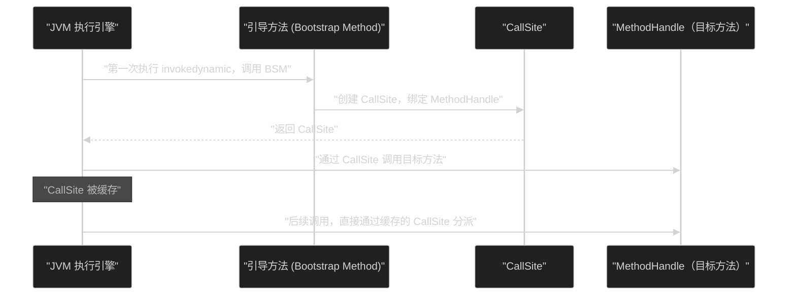

# 11 字节码指令集与执行引擎

**摘要：**

字节码（Bytecode）是 Java 跨平台的核心载体——`.class` 文件中的字节码序列被 JVM 执行引擎解释或编译为本地机器码。理解字节码有多重工程价值：排查反编译出来的字节码时能快速定位逻辑问题、理解性能热点的底层操作代价、理解 Lambda/动态代理等语法糖的真实执行路径。本文系统梳理 JVM 字节码指令集的分类（加载/存储、运算、类型转换、控制转移、方法调用）以及最关键的 **五条方法调用指令**（`invokevirtual`、`invokeinterface`、`invokespecial`、`invokestatic`、`invokedynamic`）的分派机制；深入剖析 JVM 执行引擎的核心——**基于栈的虚拟机模型**（对比基于寄存器的模型）；以及 `invokedynamic` 如何在 JDK 7 引入后成为 Lambda、`MethodHandle`、`var` 等众多 Java 特性的底层基础，揭开"Lambda 到底是不是匿名内部类"这个长期存在争议的问题的真实答案。

---

## 第 1 章 Class 文件的结构回顾

### 1.1 字节码在哪里

在 [[01 JVM 全局架构——从 .java 到机器码的完整旅程]] 中已经介绍了 Class 文件的整体结构。字节码序列存储在 Class 文件方法表（Methods）中每个方法的 **`Code` 属性**内：

```
方法 main() 的 Code 属性：
├── max_stack: 2       ← 操作数栈最大深度（编译期静态计算）
├── max_locals: 1      ← 局部变量表最大槽位数
├── code_length: 9     ← 字节码字节数
└── code[]:            ← 字节码序列
    [0] 0xB2 → getstatic  #9    // 获取静态字段 System.out
    [3] 0x12 → ldc       #7    // 加载字符串常量 "Hello, World!"
    [5] 0xB6 → invokevirtual #10 // 调用 println
    [8] 0xB1 → return           // 方法返回
```

每条字节码指令由**操作码（opcode，1 字节，0x00~0xFF）** 和可选的**操作数（operands）** 组成。JVM 规范定义了约 200 条有效指令（部分操作码被保留，实际指令约 205 个）。

### 1.2 用 javap 反汇编字节码

`javap -c -verbose HelloWorld.class` 是查看字节码最常用的工具。对于生产环境调试，配合 ASM、ByteBuddy、Arthas 的 `jad` 命令可以反编译运行中的类。

---

## 第 2 章 基于栈的虚拟机模型

### 2.1 为什么 JVM 是基于栈的

JVM 执行引擎是**基于栈（Stack-based）的虚拟机**——字节码指令的操作数不通过寄存器传递，而是通过**操作数栈（Operand Stack）** 传递：指令从栈顶弹出操作数，计算结果压回栈顶。

**与基于寄存器的虚拟机的对比**（如 Android 的 Dalvik/ART 使用寄存器模型）：

| 维度 | 基于栈（JVM）| 基于寄存器（Dalvik）|
| :--- | :--- | :--- |
| **指令数量** | 多（每条指令操作数隐式，需要显式 load/store）| 少（操作数直接在指令中指定寄存器）|
| **指令长度** | 短（操作码 1 字节，操作数少）| 长（需要指定源/目标寄存器）|
| **可移植性** | 高（不依赖物理寄存器数量）| 低（依赖架构的寄存器数量）|
| **执行效率** | 略低（更多内存操作）| 略高（更少内存访问）|
| **实现复杂度** | 低（不需要寄存器分配）| 高（需要寄存器分配算法）|

**为什么 Java 选择基于栈**：跨平台是 Java 的首要目标。基于寄存器的 VM 依赖特定的物理寄存器数量，不同架构寄存器数量不同（x86 通用寄存器 8 个，ARM64 有 31 个），设计一个跨所有架构的寄存器模型极为复杂。基于栈的模型天然与具体硬件无关，实现简单，可移植性强。

**JIT 编译后不再是纯栈模型**：解释器确实按照栈模型执行字节码，但 JIT 编译器（C2）会将字节码编译为机器码时进行**寄存器分配**——将频繁使用的操作数分配到物理寄存器，消除不必要的内存访问，这是 JIT 编译后性能大幅提升的原因之一。

### 2.2 一个简单加法的完整执行过程

```java
int add(int a, int b) {
    return a + b;
}
```

对应的字节码（用 `javap -c` 查看）：

```
int add(int, int);
  Code:
     0: iload_1    // 将局部变量表 slot 1（参数 a）的值压入操作数栈
     1: iload_2    // 将局部变量表 slot 2（参数 b）的值压入操作数栈
     2: iadd       // 弹出栈顶两个 int，相加，结果压栈
     3: ireturn    // 弹出栈顶 int，作为方法返回值
```

逐步执行可视化：

```
初始状态（局部变量表：slot0=this, slot1=a=3, slot2=b=4）：
操作数栈：[]（空）

执行 iload_1：
操作数栈：[3]（a 的值）

执行 iload_2：
操作数栈：[3, 4]（a、b 的值）

执行 iadd：弹出 3 和 4，计算 3+4=7，压入
操作数栈：[7]

执行 ireturn：弹出 7，作为返回值
操作数栈：[]（方法结束，栈帧销毁）
```

---

## 第 3 章 字节码指令集分类

### 3.1 加载与存储指令

**加载指令（Load）**：将局部变量表中的值压入操作数栈：
- `iload`/`iload_<n>`：加载 `int` 型局部变量（`_<n>` 是 0~3 的简化版本，无需操作数，更短）
- `lload`/`lload_<n>`：加载 `long`
- `fload`/`fload_<n>`：加载 `float`
- `dload`/`dload_<n>`：加载 `double`
- `aload`/`aload_<n>`：加载对象引用（`a` 代表 reference）

**存储指令（Store）**：将操作数栈顶的值存入局部变量表：
- `istore`/`istore_<n>`、`lstore`、`fstore`、`dstore`、`astore`

**常量入栈指令**：
- `iconst_<i>`（i = -1 到 5）：将小整数常量直接压栈（无需访问常量池）
- `bipush <byte>`：将 -128~127 范围的整数压栈（1 字节操作数）
- `sipush <short>`：将 -32768~32767 范围整数压栈（2 字节操作数）
- `ldc <index>`：从常量池加载 int、float、String、Class 引用等（1 字节常量池索引）
- `ldc_w <index>`：2 字节索引版本的 ldc
- `ldc2_w <index>`：加载 long、double（占两个操作数栈槽）

### 3.2 运算指令

运算指令都是**栈顶操作**——从栈顶弹出操作数，计算后压回结果：

**整数运算**（`i` 前缀代表 `int`，`l` 代表 `long`）：
- `iadd`、`isub`、`imul`、`idiv`、`irem`（取余）、`ineg`（取负）
- `ishl`（左移）、`ishr`（算术右移）、`iushr`（逻辑右移）
- `iand`（位与）、`ior`（位或）、`ixor`（位异或）

**浮点运算**（`f` 前缀代表 `float`，`d` 代表 `double`）：
- `fadd`、`fsub`、`fmul`、`fdiv`、`frem`、`fneg`

**自增指令**（局部变量直接自增，不经过操作数栈）：
- `iinc <index> <const>`：将局部变量表 index 槽的值加上常量 const

`iinc` 是一条特殊指令，直接操作局部变量表（不需要先 load 到操作数栈），是 `i++` / `i--` 类操作的直接映射，非常高效。

### 3.3 类型转换指令

JVM 的类型转换分两类：

**宽化转换（Widening）**：小范围 → 大范围，不丢失精度，自动进行：
- `i2l`（int → long）、`i2f`（int → float）、`i2d`（int → double）
- `l2f`（long → float）、`l2d`（long → double）
- `f2d`（float → double）

**窄化转换（Narrowing）**：大范围 → 小范围，可能丢失精度，需要显式转型（`(int) longValue`）：
- `l2i`（long → int，截断高 32 位）
- `f2i`、`f2l`、`d2i`、`d2l`、`d2f`
- `i2b`（int → byte，截断到 8 位）、`i2c`（int → char，截断到 16 位无符号）、`i2s`（int → short）

### 3.4 对象操作指令

- `new <class_index>`：创建对象实例（仅分配内存，未执行 `<init>`）
- `newarray <type>`：创建基本类型数组
- `anewarray <class_index>`：创建引用类型数组
- `arraylength`：获取数组长度（栈顶是数组引用）
- `getfield <field_ref>`：读取实例字段
- `putfield <field_ref>`：写入实例字段
- `getstatic <field_ref>`：读取静态字段
- `putstatic <field_ref>`：写入静态字段
- `instanceof <class_ref>`：类型检查，结果（0 或 1）压栈
- `checkcast <class_ref>`：类型强制转换，失败抛 `ClassCastException`

### 3.5 控制转移指令

JVM 的条件分支指令：
- `ifeq`（== 0）、`ifne`（!= 0）、`iflt`（< 0）、`ifge`（>= 0）、`ifgt`（> 0）、`ifle`（<= 0）：将栈顶 int 与 0 比较
- `if_icmpeq`、`if_icmpne`、`if_icmplt`…：弹出栈顶两个 int 比较
- `if_acmpeq`、`if_acmpne`：比较两个对象引用是否相同（`==` 的实现）
- `ifnull`、`ifnonnull`：与 null 比较

`tableswitch` 和 `lookupswitch` 是 `switch` 语句的两种实现：
- **`tableswitch`**：case 值连续时使用，通过跳转表（索引数组）O(1) 查找，速度快
- **`lookupswitch`**：case 值不连续时使用，通过有序键值对列表二分查找，O(log n)

---

## 第 4 章 五条方法调用指令——分派机制的核心

方法调用是 Java 面向对象特性（多态）的底层实现载体。JVM 提供五条方法调用指令，每条对应不同的分派规则：

### 4.1 invokestatic——静态方法，编译期确定

```java
Math.abs(-1);  // → invokestatic Math.abs:(I)I
```

**特点**：调用目标在**编译期完全确定**（符号引用直接解析为目标方法），不需要运行时分派。是五条指令中最快的（直接调用，无需虚方法表查找）。

调用 `static` 修饰的方法，以及非虚（not virtual）的场景（如直接调用某个工具类的静态方法）。

### 4.2 invokespecial——特殊方法，编译期确定

```java
new Object();           // → new + invokespecial <init>
super.method();         // → invokespecial 父类方法
private void foo() {}   // → invokespecial（私有方法不参与多态）
```

**特点**：调用**实例初始化方法（`<init>`）**、**私有方法**、**父类方法（super 调用）** ——这三类方法不参与多态，目标在编译期可以确定，无需虚分派。

### 4.3 invokevirtual——实例方法，运行时分派

```java
obj.toString();  // → invokevirtual java/lang/Object.toString:()Ljava/lang/String;
```

**特点**：调用**实例方法（非私有，非 static）**。目标方法根据运行时对象的实际类型（而非声明类型）动态确定——这是 Java 多态的核心。

**虚方法表（vtable）**：JVM 为每个类维护一个虚方法表，存储该类及其继承链上所有可覆盖方法的入口地址。`invokevirtual` 的执行过程：
1. 从栈顶弹出对象引用（`this`）
2. 通过对象头中的 Klass Pointer 找到类的元数据
3. 在虚方法表中，根据方法的 vtable 索引找到实际目标方法的入口地址
4. 调用目标方法

子类重写父类方法时，子类的 vtable 在对应位置替换为子类方法的地址，这就是运行时多态的底层实现。

### 4.4 invokeinterface——接口方法，运行时分派

```java
List<String> list = new ArrayList<>();
list.add("foo");  // → invokeinterface java/util/List.add:(Ljava/lang/Object;)Z
```

**特点**：调用**接口方法**，目标也是运行时动态确定，但实现比 `invokevirtual` 更复杂——因为一个类可以实现多个接口，接口方法在 vtable 中没有固定的索引位置，必须通过接口方法表（itable）查找。

**为什么 `invokeinterface` 比 `invokevirtual` 慢（理论上）**：`invokevirtual` 通过固定的 vtable 索引 O(1) 查找，`invokeinterface` 需要在 itable 中搜索对应接口的方法，理论上更慢。但 JIT 的内联缓存（Inline Cache）几乎消除了这个差距——大多数接口调用在实际运行中只有一种实现（单态调用），JIT 会将其内联优化，速度与静态调用相当。

### 4.5 invokedynamic——动态分派，运行时决定一切

`invokedynamic` 是 JDK 7 引入的第五条方法调用指令，也是最复杂、最强大的一条。它的出现从根本上改变了 JVM 对动态语言和 Lambda 的支持。

---

## 第 5 章 invokedynamic——Lambda 的真相

### 5.1 invokedynamic 之前的困境

JDK 7 之前，JVM 字节码中的每条方法调用指令，其目标在**类加载时就必须确定**（通过符号引用解析）。这对于动态语言（Groovy、Ruby、Python）是巨大的障碍——动态语言的方法分派发生在运行时，不能在编译期确定目标。

以 Groovy 为例，一个 `obj.foo()` 调用，`obj` 的类型在编译期未知，Groovy 的编译器只能生成一段使用反射（`java.lang.reflect.Method.invoke()`）的代码——反射调用的性能比直接调用慢 10~100 倍。

### 5.2 invokedynamic 的核心设计——引导方法

`invokedynamic` 的设计理念：**将方法调用目标的确定推迟到第一次执行时**，并允许用户代码（Java 程序员）通过一个**引导方法（Bootstrap Method）** 来自定义"如何确定调用目标"的逻辑。

第一次执行 `invokedynamic` 指令时：
1. JVM 调用与该指令关联的**引导方法（Bootstrap Method，BSM）**
2. BSM 返回一个 **`CallSite`** 对象，`CallSite` 持有一个 **`MethodHandle`**（方法句柄，代表最终的调用目标）
3. JVM 将 `CallSite` 绑定到该 `invokedynamic` 指令（缓存起来）
4. 后续每次执行该指令，直接通过 `CallSite` 中的 `MethodHandle` 调用目标，不再执行 BSM



### 5.3 MethodHandle——轻量级的反射

**`MethodHandle`**（`java.lang.invoke.MethodHandle`）是 JDK 7 引入的类型安全、可内联的方法引用：

```java
// 通过 MethodHandles.Lookup 获取 MethodHandle
MethodHandles.Lookup lookup = MethodHandles.lookup();

// 获取 String.length() 方法的句柄
MethodHandle mh = lookup.findVirtual(String.class, "length",
    MethodType.methodType(int.class));

// 调用（比反射快很多，JIT 可以内联）
int len = (int) mh.invoke("hello");  // → 5
```

**MethodHandle vs 反射（java.lang.reflect.Method）**：

| 维度 | `MethodHandle` | `Method.invoke()` |
| :--- | :--- | :--- |
| **类型检查** | 编译期（`MethodType` 类型安全）| 运行期（参数类型错误抛 `IllegalArgumentException`）|
| **访问检查** | 获取时检查一次 | 每次调用都检查 |
| **JIT 内联** | 支持（可以被内联优化）| 不支持（反射调用无法内联）|
| **性能** | 接近直接调用 | 慢 10~100 倍 |
| **语义** | 更接近底层指令 | 更高层（绑定到 `Method` 对象）|

### 5.4 Lambda 的真相——不是匿名内部类

这是 Java 开发者中长期存在的误解：**Lambda 表达式是语法糖，等价于匿名内部类**。

在 JDK 8 引入 Lambda 的早期讨论中，确实存在"用匿名内部类实现 Lambda"的方案。但 Oracle 最终选择了基于 `invokedynamic` 的实现，原因是性能和灵活性：

**匿名内部类方案的缺陷**：
1. 每个 Lambda 表达式对应一个 `.class` 文件（类爆炸，增加类加载开销）
2. 匿名内部类创建实例需要堆分配（`new`），即使 Lambda 不捕获任何变量也需要创建对象
3. 一旦确定编译为匿名内部类，将来无法改变实现策略（缺乏灵活性）

**`invokedynamic` 方案的优势**：
1. 延迟绑定：Lambda 的实现策略在第一次执行时才确定，未来可以改变而不影响字节码
2. 不捕获任何变量的 Lambda 可以复用单一实例（无需每次 new）
3. JIT 可以将 Lambda 内联，消除函数对象的创建开销

**Lambda 的实际字节码**：

```java
// 源代码：
Runnable r = () -> System.out.println("hello");

// 编译后字节码（简化）：
invokedynamic #7, 0   // BSM = LambdaMetafactory.metafactory()
// 运行时，BSM 动态生成一个实现 Runnable 的类（通过 ASM 字节码生成）
// 并返回 CallSite，其 MethodHandle 指向这个动态生成的类的实例
```

Lambda 对应的 `invokedynamic` 指令的引导方法是 `java.lang.invoke.LambdaMetafactory.metafactory()`，它在运行时：
1. 通过 `MethodHandle`（指向 Lambda 体对应的私有静态方法，由 `javac` 生成）
2. 动态生成一个实现目标函数式接口（`Runnable`、`Function`、`Predicate` 等）的类
3. 创建这个类的实例并返回

**验证 Lambda 不是匿名内部类**：

```java
// 匿名内部类编译后生成单独的 .class 文件：HelloWorld$1.class
Runnable anon = new Runnable() {
    @Override public void run() { System.out.println("anon"); }
};

// Lambda 不生成单独的 .class 文件，字节码只有一条 invokedynamic
Runnable lambda = () -> System.out.println("lambda");

// 两者的 Class 名字完全不同：
System.out.println(anon.getClass().getName());    // HelloWorld$1
System.out.println(lambda.getClass().getName());   // HelloWorld$$Lambda$1/0x0000... (动态生成)
```

> [!note] 设计哲学
> `invokedynamic` 是 JVM 的一个"元机制"（meta-mechanism）——它不是为某一个特定的语言特性设计的，而是提供了一个可扩展的分派框架，让语言设计者（Java、Groovy、JRuby 等）自己定义动态分派的语义。Lambda 是 Java 语言利用这个框架的第一个重量级应用，此后 `var` 的局部变量类型推断、`switch` 表达式的模式匹配（JDK 21）等特性也都依赖 `invokedynamic`。

---

## 第 6 章 解释器——字节码执行的第一道防线

### 6.1 模板解释器

HotSpot 的解释器并非"读一条字节码，执行一段 Java 代码逻辑"这样的纯软件实现，而是**模板解释器（Template Interpreter）**：

为每个字节码指令预先生成一段本地机器码（称为"模板"），解释执行时，JVM 只需要跳转到对应的模板代码并执行，而不是运行一段分支判断逻辑（`switch (opcode) { case iadd: ... }`）。这使解释执行的速度比朴素的软件解释器快很多。

模板解释器在 JVM 启动时（`Interpreter::initialize()`）为所有 205 个字节码指令生成机器码模板，存储在代码缓存（Code Cache）中的特殊区域。

### 6.2 解释器的作用范围

尽管 JIT 编译（[[执行引擎/12 JIT 编译与逃逸分析——从解释执行到本地代码]]）最终将热点方法编译为机器码，解释器依然不可或缺：

- **冷启动阶段**：程序刚启动时，所有方法都从解释执行开始，JIT 需要时间"预热"
- **非热点代码**：大量只被调用一两次的方法，JIT 编译的开销超过收益，保持解释执行更合理
- **去优化（Deoptimization）**：JIT 编译基于某些假设（如"某接口只有一个实现类"），当假设被推翻（新的实现类被加载），JIT 代码失效，需要回退到解释器重新执行

---

## 第 7 章 总结

字节码和执行引擎是 JVM 跨平台能力的实际承载者：

**Class 文件结构**：常量池是类文件的符号中心，`Code` 属性中的字节码序列是方法体的低级表示。

**基于栈的执行模型**：JVM 选择操作数栈传递操作数，而非寄存器——跨平台优先，性能交给 JIT 解决。`iload_<n>`、`istore_<n>` 是最高频的字节码，操作数栈是"CPU 寄存器在 JVM 层的抽象"。

**五条方法调用指令**：
- `invokestatic`/`invokespecial`：编译期确定目标，最快
- `invokevirtual`：vtable 索引 O(1) 分派，Java 多态的底层
- `invokeinterface`：itable 搜索，慢于 vtable 但被 JIT 内联缓存优化
- `invokedynamic`：引导方法 + CallSite + MethodHandle，运行时完全自定义分派

**invokedynamic 与 Lambda**：Lambda 不是匿名内部类，是通过 `invokedynamic` + `LambdaMetafactory` 在运行时动态生成的实现类。`invokedynamic` 是 JVM 的动态语言基础设施，延迟绑定使未来的实现优化成为可能。

**模板解释器**：不是简单的字节码 switch，而是为每条指令预生成的本地机器码模板，兼顾了可移植性和解释执行性能。

下一篇 [[执行引擎/12 JIT 编译与逃逸分析——从解释执行到本地代码]] 将进入 JVM 性能的核心：JIT 编译器如何通过分层编译、内联、逃逸分析、循环展开等深度优化，将解释执行的字节码转化为媲美 C++ 的高性能本地代码。

---

## 参考文献

1. Tim Lindholm et al., "The Java Virtual Machine Specification, Java SE 21 Edition", Chapter 6: The Java Virtual Machine Instruction Set
2. 周志明, 《深入理解 Java 虚拟机（第三版）》, 第 8 章：虚拟机字节码执行引擎
3. John Rose, "JSR 292: Supporting Dynamically Typed Languages on the JVM", 2007
4. Remi Forax, "LambdaMetafactory: How Lambdas Work", 2014, InfoQ
5. Aleksey Shipilev, "JVM Anatomy Quarks: Intrinsics", shipilev.net
6. OpenJDK Wiki, "Template Interpreter", wiki.openjdk.org

---

> [!note] 思考题
> 1. JVM 是基于'栈'的虚拟机（操作数栈），而非基于'寄存器'的虚拟机（如 Dalvik/ART）。基于栈的设计使得字节码更紧凑（指令不需要指定寄存器编号），但执行效率可能较低（更多的内存访问）。为什么 JVM 选择了栈架构？Android 从 Dalvik（寄存器架构）迁移到 ART 后，仍然使用寄存器架构——这对性能有什么影响？
> 2. `invokedynamic` 指令是 JDK 7 引入的，最初为了支持动态语言（如 JRuby）。但它在 JDK 8 中被用于 Lambda 表达式的实现——Lambda 不是生成匿名内部类，而是通过 `invokedynamic` 在运行时生成。这种实现方式相比直接生成匿名内部类，在性能和内存占用方面有什么优势？
> 3. 字节码中的 `synchronized` 块通过 `monitorenter` 和 `monitorexit` 指令实现。如果 `monitorenter` 执行后、`monitorexit` 执行前发生异常，锁会被释放吗？编译器是如何保证异常路径上的 `monitorexit` 一定会被执行的？
