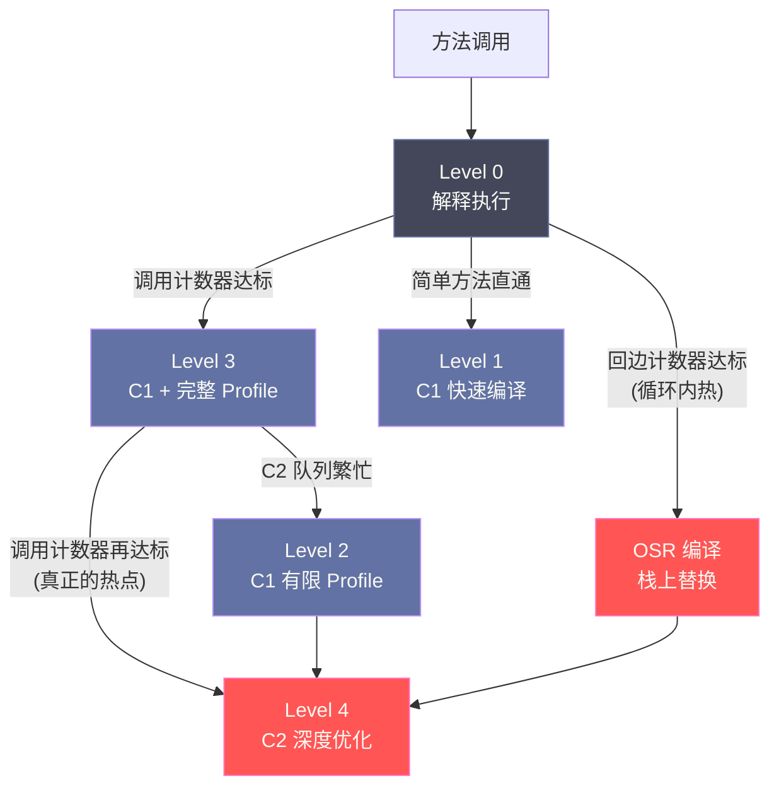

# 12 JIT 编译与逃逸分析——从解释执行到本地代码

> [!abstract] 摘要
> Java 程序的高性能，在很大程度上依赖于 JIT（Just-In-Time）编译器——它在运行时把热点字节码编译为本地机器码，使 Java 的执行效率逐渐逼近、甚至在部分场景超越静态编译语言。理解 JIT 是理解 Java 性能模型的关键一环。本文系统剖析 HotSpot 的**分层编译（Tiered Compilation）** 架构：解释器 → C1 客户端编译器（Level 1~3）→ C2 服务端编译器（Level 4）各层的职责、Profile 收集策略与切换条件；剖析 JIT 最重要的优化手段**方法内联（Method Inlining）** 及其与**内联缓存（Inline Cache）** 的协作机制（单态/双态/超多态调用如何影响虚方法分派性能）；深入 C2 最精彩的优化之一——**逃逸分析（Escape Analysis）**，讲清楚 `NoEscape`/`ArgEscape`/`GlobalEscape` 三种逃逸状态的判定原理，以及由此派生的**栈上分配、标量替换、锁消除**三大优化在字节码与机器码层面的具体效果。最后讨论**去优化（Deoptimization）** 的触发场景与代价、**代码缓存（Code Cache）** 的管理，以及 GraalVM Native Image 代表的 AOT 编译路线与 JIT 的根本权衡。核心认知：JIT 不是"魔法加速器"，它是一套基于运行时 Profile 数据做**投机优化（Speculative Optimization）**、并在假设失效时安全回退的工程体系——理解这套体系的运作边界，才能写出真正对 JIT 友好的 Java 代码。

---

## 第 1 章 解释执行的天花板与 JIT 的必然性

### 1.1 解释执行为什么慢

[[执行引擎/11 字节码指令集与执行引擎]] 介绍了 HotSpot 的模板解释器——每条字节码指令由一段预先生成的本地代码模板执行，比起最原始的"取指-译码-分派"循环式解释器（Switch-Threaded Interpreter），模板解释器已经是相当成熟的实现。但即使如此，与直接执行编译好的机器码相比，解释执行仍然存在几个本质性的性能鸿沟，这些鸿沟不是靠"优化模板"能填平的，而是解释执行这种执行模型本身决定的：

**字节码与机器码的语义粒度不匹配**。一条 Java 字节码（如 `iadd`）在语义上只是"两数相加"，但要在栈式虚拟机模型下执行它，模板代码必须先从操作数栈里弹出两个操作数（涉及内存读取、栈顶指针维护）、执行加法、再把结果压回操作数栈（涉及内存写入、栈顶指针再维护）。相比之下，一条本地机器码指令的加法可以直接在寄存器间完成，不存在这层"栈式模型"的额外开销。解释器为了保持字节码语义的通用性，必须为每一条指令重复这套"读栈-算-写栈"的框架流程，这是解释执行天生的税。

**无法跨指令做全局优化**。解释器是逐条执行字节码的执行引擎，它在任意时刻只"看得到"当前这一条指令，看不到整个方法体的控制流全貌。诸如常量折叠（`3 + 4` 在编译期直接算出 `7`）、公共子表达式消除、死代码消除、循环不变量外提这类优化，本质上都需要对一段连续代码做**全局的数据流分析**，解释器的执行模型不支持这种分析——它甚至不知道下一条指令执行完之后程序会走向哪个分支。

**无法利用现代 CPU 的高级特性**。现代 CPU 提供了 SIMD 向量化指令集（如 x86 的 AVX2/AVX-512）、多级流水线、乱序执行窗口、精细的分支预测器。要把这些硬件能力用起来，需要编译器在生成代码时做专门的指令调度、向量化改写、寄存器分配——这些都是需要"看到全貌再统一决策"的重量级分析，解释器逐条解释的模式完全无法承载。

这三点共同决定了：无论模板解释器怎么打磨，它的性能天花板远低于经过充分优化的本地机器码。这也是为什么几乎所有高性能语言运行时（JVM、CLR、V8、LuaJIT）最终都走向了"解释器 + JIT 编译器"的混合执行模型，而不是纯解释或纯编译。

### 1.2 JIT 的基本思想——热点代码才值得编译

如果解释执行这么慢，为什么不干脆把所有代码在加载时就一次性编译成机器码（像 C/C++ 那样做纯 AOT 编译）？答案在于**编译本身也有开销**，而且这个开销和收益并不对称。

Pareto 原则在代码执行分布中体现得极为明显：一个典型的 Java 应用中，往往只有 20% 左右的方法承担了 80% 以上的 CPU 时间（这些是循环体、被高频调用的工具方法、序列化/反序列化路径等），剩下大量的方法（初始化逻辑、异常处理分支、极少调用的配置解析代码）终其应用生命周期可能只执行几次甚至一次。如果对所有代码一视同仁地做深度编译，绝大多数编译工作都是浪费——耗费 CPU 和内存去优化一段只执行一次的代码，得到的收益趋近于零，而编译本身消耗的时间可能比这段代码解释执行的时间还长。

JIT（Just-In-Time Compilation）正是针对这个不对称性设计的策略，其运作分为三步：

1. **程序启动时，所有方法从解释执行开始**。这保证了启动速度——不需要等待任何编译过程，字节码加载完就能跑。
2. **JVM 在解释执行期间持续收集每个方法的执行 Profile**：调用次数、循环回边次数、分支的实际走向比例、调用点的实际类型分布等。这一步是解释器"顺便"做的，几乎不增加额外成本，却积累了极为宝贵的运行时信息。
3. **当某个方法的执行频次越过阈值（被判定为热点），JIT 编译器介入，将其编译为机器码**，后续对该方法的调用直接跳转到编译后的机器码执行，不再经过解释器。

这个模型真正的精妙之处，不仅在于"只编译值得编译的代码"这种朴素的性能账，还在于**解释执行期间积累的 Profile 数据，让 JIT 可以做出比传统 AOT 编译器更激进的优化假设**。AOT 编译器只能做静态分析——它不知道一个接口在实际运行中到底会被哪几个类实现，只能保守地生成支持所有可能实现的通用代码。而 JIT 编译器知道："这个调用点在过去 10 万次调用中，99.9% 的情况下调用的都是 `ArrayList` 的实现"，于是可以直接把这段代码内联并特化为针对 `ArrayList` 的版本，一旦真的出现例外情况再回退。这种基于运行时事实而非静态推断的优化，正是 Java 在特定负载下反而能超越静态编译语言的根本原因，也是本文第 3、4 章要重点展开的内容。

> [!info] 核心概念：JIT 是"用运行时信息换取更激进优化"的工程权衡
> AOT 编译器在编译期就要"锁死"所有优化决策，因此必须保守；JIT 编译器把决策推迟到运行时，用解释执行阶段积累的真实 Profile 数据做支撑，可以放心地做投机优化，并配套一套"假设错了就退回"的安全网（即第 6 章的去优化机制）。这个"观察 → 投机 → 验证 → 必要时回退"的闭环，才是 JIT 相比 AOT 真正的技术优势所在，而不是简单地"运行时编译比提前编译更快"。

---

## 第 2 章 分层编译——从冷启动到巅峰性能

### 2.1 JDK 8 之前：C1 和 C2 的二选一

HotSpot 内置了两个 JIT 编译器，它们的设计目标截然不同：

**C1 编译器（Client Compiler，客户端编译器）**：编译速度快，优化程度相对浅——主要做方法内联、简单的常量折叠、少量局部值编号，不做复杂的全局数据流分析。它的设计目标是桌面应用场景：用户启动一个 GUI 程序，不希望多等哪怕几百毫秒的"预热"时间，因此 C1 用较浅的优化换取极快的编译速度。对应历史上的 `-client` JVM 参数。

**C2 编译器（Server Compiler，服务端编译器）**：编译速度慢，但优化程度极深——全局值编号（Global Value Numbering）、循环变换（循环展开、循环不变量外提、循环强度削减）、逃逸分析、SIMD 向量化、精细的寄存器分配。它的设计目标是服务端长时间运行的应用：一个跑几天甚至几个月的后端服务，多花几百毫秒预热完全可以接受，换来的是长期运行下极致的吞吐量。对应历史上的 `-server` JVM 参数。

JDK 8 之前，用户必须在启动参数里二选一：选 `-client` 就永远只有 C1 级别的优化上限（哪怕这个方法被调用了几十亿次，也不会得到 C2 的深度优化）；选 `-server` 则意味着每个方法在被 C2 编译之前，都要经历一段相当长的"纯解释执行"预热期——对于短生命周期的批处理任务或者频繁重启的服务，这个预热成本相当可观。这是一个典型的"鱼与熊掌不可兼得"局面。

### 2.2 JDK 7+ 分层编译（Tiered Compilation）

**分层编译（`-XX:+TieredCompilation`，JDK 8 开始默认开启）** 的思路是：既然 C1 快、C2 深，为什么不把它们串成一条流水线，让代码按照热度逐级升级，而不是"要么只用 C1，要么只用 C2"？分层编译把方法的执行状态细分为五个层次（Level 0～4）：

| 层次 | 执行方式 | Profile 收集 | 说明 |
| :--- | :--- | :--- | :--- |
| **Level 0** | 解释执行 | 是（方法调用次数、循环回边次数、类型分布） | 冷代码，刚启动时所有代码在此层 |
| **Level 1** | C1 编译，无 Profile | 否 | 简单方法（如无分支的 getter/setter）的快速编译，判定不再需要收集 Profile，直接产出较优代码 |
| **Level 2** | C1 编译，有限 Profile | 部分（仅方法调用计数 + 回边计数） | C2 编译队列繁忙时的临时过渡层 |
| **Level 3** | C1 编译，完整 Profile | 是（完整类型分布、分支走向统计、调用点 Profile） | 最常用的 C1 层，作用是一边执行较优代码，一边持续为 C2 积累完整的 Profile |
| **Level 4** | C2 编译，深度优化 | 否（复用 Level 3 阶段积累的 Profile） | 最高优化层，只有真正的热点方法最终会到达这一层 |

五个层次不是简单的线性递进，JVM 的**分层编译策略（`AdvancedThresholdPolicy`，HotSpot 默认策略）** 会根据方法特征动态选择路径：

```
冷方法的典型路径（大多数业务方法）：
Level 0（解释，收集 Profile）→ Level 3（C1 + 完整 Profile，继续观察）→ Level 4（C2 深度优化，长期驻留）

极简单方法（方法体小、无复杂分支，如 getter/setter）：
Level 0 → Level 1（C1 快速编译，判定无需再收集 Profile，直接产出，省去 Level 3/4 的开销）

C2 编译线程繁忙、编译队列积压时的退路：
Level 0 → Level 2（C1 有限 Profile，先给一版能跑的编译代码顶上）→ 排队等待 → Level 4

极端情况下 C2 编译失败或方法特征不适合 C2（如异常处理密集）：
可能长期停留在 Level 3，不再升级
```

之所以要区分 Level 1 和 Level 3——都是 C1 编译，一个不收集 Profile 一个收集完整 Profile——本质是在**编译成本与信息价值之间做判断**：如果一个方法足够简单（字节码短、分支少、几乎不调用其他方法），JIT 判断即便升到 C2 也不会有显著的优化空间，那么不如在 Level 1 直接产出一份"够用"的代码，省下持续 Profile 采集的运行时开销（Profile 采集本身不是免费的，需要在编译代码里插入计数器和采样逻辑）。而对于逻辑复杂、值得投入 C2 深度优化的方法，则要经过 Level 3 阶段，先攒够类型分布、分支走向这些 C2 强烈依赖的信息，再一次性地把这些信息喂给 C2。

分层编译带来的实际效果是：应用的启动速度接近纯 C1 模式（大部分方法很快就能拿到 Level 1 或 Level 3 的编译代码，不需要长时间忍受纯解释执行），而峰值吞吐量接近纯 C2 模式（真正的热点方法最终都会升级到 Level 4）。这是一个"既要又要"的工程解法，是 JDK 8 之后 HotSpot 默认策略的直接原因。

> [!note] 设计哲学：分层编译是编译资源的分级投资策略
> 把 JIT 编译器想象成一个有限的"投资预算"（CPU 时间、编译线程数量），分层编译的本质是把这个预算按照代码的"预期回报"分级投入：简单方法投入最少（Level 1 一次到位），复杂但还未证实热度的方法投入中等（Level 3 边跑边看），已经被证实是长期热点的方法才投入最大（Level 4 深度优化）。这与很多分布式系统里"先用轻量方案覆盖大多数场景，再对少数关键路径做重投入"的设计思路是同构的。

### 2.3 编译线程与队列——分层编译的资源模型

分层编译并不是所有编译请求都能立刻被处理——C1 和 C2 各自维护独立的**编译线程池**和**编译队列**。JVM 默认根据 CPU 核心数分配编译线程数量，可以通过 `-XX:CICompilerCount=N` 显式指定编译线程总数（该数量会在 C1、C2 线程池间按一定比例分配，C2 线程通常更少，因为单次 C2 编译耗时更长）。

当热点判定触发某个方法需要编译，JVM 把这个编译请求放入对应编译器的队列，由空闲的编译线程异步取出执行——**编译过程本身与被编译方法的解释执行是并发进行的**，这也是为什么应用在"热身"阶段 CPU 使用率会显著升高：不仅业务线程在跑，编译线程也在后台满负荷工作。如果编译队列积压严重（编译线程数量不足，或者短时间内有大量方法同时达到热点阈值——常见于压测/秒杀这类瞬时高并发场景），方法可能长时间停留在较低的编译层次（Level 2/3）无法升级到 Level 4，这也是很多 Java 服务在"刚扛过流量洪峰后延迟才逐渐下降"现象背后的机制之一。

### 2.4 热点阈值——什么时候触发编译

JVM 通过两个计数器决定是否触发某个层次的编译：

**方法调用计数器（Invocation Counter）**：记录方法整体被调用的次数。分层编译下不同层次之间迁移的阈值不同，典型地，Level 3 → Level 4 的调用次数阈值（`-XX:Tier4InvocationThreshold`）在默认策略下约为 15000 次量级（具体数值随 JDK 版本和平台细节可能调整，读者应以 `-XX:+PrintFlagsFinal` 实际输出为准，不建议死记某个精确数字）。

**回边计数器（Back Edge Counter）**：记录方法内**循环回跳**的次数——每次循环体执行完毕、字节码指针跳回循环头时，该计数器加一。设计回边计数器的原因是要覆盖一类特殊场景：**方法本身只被调用一次，但方法内部有一个执行成千上万次的大循环**（典型例子是主线程里跑的一次性批量数据处理循环，或者一个长期运行的事件循环 `while(true){...}` 主体）。如果 JIT 只看方法调用计数器，这类方法的调用次数永远是 1，永远达不到热点阈值——但循环体内部实际消耗的 CPU 时间可能远超过绝大多数被频繁调用的小方法。回边计数器专门捕捉这种"循环内热"的情况。

**OSR（On-Stack Replacement，栈上替换）**：当一个方法的回边计数器达到阈值，JVM 不会等到方法自然返回之后再用编译版本执行下一次调用——那样太晚了，程序可能已经在这个循环里空耗了大量时间。JVM 会**直接在方法执行期间（循环运行到一半、方法尚未返回时）把当前正在执行的解释帧替换为编译版本继续执行**，这就是"栈上替换"——字面含义是在运行时把栈帧里正在跑的解释执行代码替换为编译执行代码。OSR 编译出的代码有一个特殊的入口点，专门用于从循环体中间的某个字节码位置"跳入"，这与普通方法编译的入口点（从方法开头进入）是不同的机制，编译器需要为 OSR 场景生成额外的入口逻辑，把当前解释器栈帧里的局部变量状态正确迁移到编译帧里。



---

## 第 3 章 方法内联——一切优化的基础

### 3.1 什么是方法内联

**方法内联（Method Inlining）** 是将被调用方法的函数体直接嵌入到调用处，消除方法调用本身的开销（保存/恢复寄存器、参数传递、栈帧创建/销毁、返回值传递、以及虚方法调用时的方法表查找）：

```java
// 内联前：
int result = add(a, b);

// 内联后（编译器将 add 方法体直接替换到调用处）：
int result = a + b;  // add 方法体被直接嵌入，方法调用消失了
```

内联消除了方法调用本身的开销，这一点很直观，但**更关键的价值在于**：内联之后，调用者和被调用者原本分属两个独立编译单元的代码，合并成了同一个更大的代码块，JIT 编译器随后可以对这个合并后的代码块施加**跨越原方法边界的全局优化**——常量传播可以从调用者一路传播进被调用者内部；如果被调用者内部有一段在当前调用上下文里永远不会执行的分支，死代码消除可以把它整段删掉；循环不变量外提可以把被调用者内部与循环无关的计算提到循环外，即便这段计算原本"藏"在另一个方法里。这些优化如果没有内联作为前提，编译器完全看不到，因为它们分处两个独立的方法体，编译器默认必须假设被调用方法有任意副作用。这正是"内联是一切优化的基础"这句话的真正含义——它不是说内联本身的收益有多大，而是说内联**打开了后续一切深度优化的视野边界**。

### 3.2 内联的条件与限制

HotSpot C2 决定是否内联一次调用，会综合考量以下因素（默认阈值随 JDK 版本存在微调，具体数值建议以 `-XX:+PrintFlagsFinal -version | grep Inline` 实际查询为准）：

**内联的有利条件**：
- **方法体足够小**：字节码大小不超过 `-XX:MaxInlineSize`（默认级别在 35 字节量级）的方法，只要满足基本调用条件就会被直接内联，不需要额外热度证明；
- **调用足够热**：对于体积略大、超过基础阈值但仍在合理范围内的方法，如果该调用点被证实足够热（超过 `-XX:MinInliningThreshold`，默认约 250 次调用量级），C2 会更积极地考虑内联，这是"热度换取内联资格"的机制；
- **调用层级受限**：内联是可以递归发生的（方法 A 内联方法 B，B 内部又内联了它调用的方法 C），但默认最多内联 `-XX:MaxInlineLevel`（默认约 9 层量级），防止递归方法或深层调用链引发"内联爆炸"——生成的机器码体积无限膨胀，反而挤爆代码缓存、拖累指令缓存命中率。

**不能内联或不会被积极内联的情况**：
- **虚方法调用存在超多态**：如果一个接口方法在实际运行中被 3 种及以上不同实现类调用（"超多态"，Megamorphic，见 3.3 节），JIT 无法确定应该内联哪一个实现，只能放弃内联，退化为普通的虚方法分派；
- **方法体过大**：超过 `-XX:MaxFreqInlineSize`（默认约 325 字节量级）的方法即便再热，也不参与常规的热点内联路径（C2 仍有一些例外机制，如强制内联标注 `@ForceInline`，多用于 JDK 核心库内部）；
- **native 方法**：本地方法的实现在 JVM 之外（JNI 调用的是外部动态库），JIT 无法拿到其字节码，天然无法内联，除非 JVM 为这个具体的 native 方法内置了专门的**内联替换实现（Intrinsic）**——例如 `System.arraycopy`、`Math.sqrt` 这类高频调用的 native 方法，HotSpot 直接为它们准备了手写的高度优化机器码模板，编译时直接替换调用，这本质上是一种"编译器认识的特例"，而不是常规内联流程。

> [!warning] 生产避坑：警惕"上帝方法"和过深的调用链
> 内联爆炸不是危险的假设——在实际生产事故排查中，一个体积巨大、内部逻辑复杂到超过 `MaxFreqInlineSize` 的"上帝方法"（God Method），即便调用极其频繁，也无法被内联进调用者，只能停留在方法调用层面，损失了本可以获得的跨方法优化空间。同理，过深的委托链（A 调 B 调 C 调 D……）如果层数逼近 `MaxInlineLevel`，链条末端的方法很可能无法被完全内联进最外层，导致优化效果打折。将高频路径上的方法尽量保持精简、避免不必要的多层委托封装，是让 JIT 内联充分发挥作用的一条务实经验。

### 3.3 内联缓存与虚方法调用的性能代价

要理解内联缓存为什么存在，需要先理解 Java 虚方法调用（`invokevirtual`、`invokeinterface`）在没有任何优化的情况下有多"慢"。

Java 是一个默认支持多态的语言，一次 `obj.doSomething()` 调用在字节码层面并不知道 `obj` 的运行时具体类型，必须在运行时通过**虚方法表（vtable，对应接口调用则是 itable）** 做一次查表：先取出 `obj` 的实际类的方法表，按方法在表中的固定偏移量取出对应实现的入口地址，再跳转过去执行。这个查表加跳转的过程，相比"直接调用一个已知地址的函数"，多了内存访问和一次间接跳转，而间接跳转对 CPU 分支预测器是不友好的（相比直接调用，间接调用的目标地址更难被 CPU 提前预测，容易造成流水线打断）。这个成本单次看起来很小，但对处于热点路径上、被调用几十亿次的方法而言，累积起来是相当可观的开销。这也是为什么静态编译语言里"能确定目标地址的直接调用"天然比 Java 的虚调用快——除非 JIT 主动做优化。

HotSpot 应对的方式是**内联缓存（Inline Cache）**结合前面提到的方法内联机制，这套机制的历史可以追溯到 Smalltalk 和 Self 语言的运行时优化研究，核心思路是：**大多数调用点在实际运行中并不像类型系统允许的那样"千变万化"，而是长期只调用同一个具体类型**。JIT 在解释执行阶段持续记录每个虚调用点的**类型分布 Profile（Call Site Type Profile）**，据此把调用点分为三种状态：

- **单态调用（Monomorphic）**：该调用点历史上只观察到一种具体类型（例如始终是 `ArrayList`）。C2 对此做**投机内联（Speculative Inlining）**——直接假设未来的调用目标也永远是这个类型，把这个类型对应实现的方法体直接内联进来，同时插入一段**类型保护检查（Guard）**，用来验证假设是否仍然成立：

```
// C2 针对单态调用生成的伪机器码示意：
if (receiver.class == ArrayList) {
    // 直接执行内联进来的 ArrayList.get() 代码（快速路径，无查表、无跳转）
    ... inlined code ...
} else {
    // 类型保护检查失败（假设被打破），退回正常的虚方法分派（慢速路径）
    call virtual get();
}
```

  这段代码本质上把"运行时才能确定的多态调用"转换成了"一次廉价的类型比较 + 一段已知目标的直接代码"，只要实际类型分布真的稳定，绝大多数执行会走进 if 分支，性能几乎等价于静态类型语言里的直接调用。

- **双态调用（Bimorphic）**：调用点历史上出现过恰好两种具体类型。JIT 会生成两段 if-else 分支，分别针对两种类型内联各自的实现，退化路径与单态情形类似，只是保护检查多了一层判断。这种情况在使用了少量策略实现（如按环境切换两种数据源实现）的代码中很常见，性能损失相对单态调用是轻微的。

- **超多态调用（Megamorphic，3 种及以上）**：类型分布过于分散，为每种类型都生成保护分支的收益已经小于维护这些分支本身的开销，JIT 直接放弃内联，退回到标准的虚方法表查表调用。这是性能最差的情形，但它对应的通常也是本身业务上就存在大量并行实现类型的场景（如通用的序列化框架内部对任意 `Object` 的分派）——这类代码本质上就不太可能被特化优化。

这种"投机内联 + 保护检查"的模式，使得 Java 里绝大多数在实践中只有一两种实际类型的多态调用，性能能够逼近静态语言里编译期确定目标的直接函数调用；而真正的超多态调用，则老老实实付出虚方法分派的固有成本。理解这一点后，一个常见的工程结论就自然浮现：**接口的实现类数量并不直接决定性能，真正决定性能的是某个具体调用点在运行时实际观察到的类型分布集中度**。同一个接口在系统里可能有 20 个实现类，但如果某个具体调用点始终只调用其中 1 个（比如某个特定 Feature Flag 关闭时永远走 A 实现），这个调用点依然可以被稳定地单态内联；反过来，即便接口只有 2 个实现类，如果某个调用点交替调用它们且没有明显偶数规律，也可能触发双态甚至退化。

> [!info] 核心概念：CHA（类层次分析）与内联缓存的分工
> 在内联缓存介入之前，C2 还有一层更基础的静态判断——**类层次分析（Class Hierarchy Analysis, CHA）**：如果编译时刻某个接口/父类在当前已加载的类里只有唯一一个实现/子类，编译器可以直接静态确定调用目标，不需要类型保护检查，也不需要内联缓存这套运行时机制（这被称为"去虚化"，Devirtualization）。但 CHA 的结论依赖"当前已加载的类集合"，一旦运行时动态加载了新的实现类打破了唯一性假设，之前基于 CHA 做的优化就必须撤销——这正是第 6 章"类加载导致去优化"场景的直接来源。内联缓存则是应对"运行时确实存在多个实现，但分布不均匀"这一更常见情形的补充手段，二者配合覆盖了虚方法调用优化的主要场景。

---

## 第 4 章 逃逸分析——最精彩的运行时优化

### 4.1 什么是逃逸分析，为什么需要它

在没有逃逸分析之前，JVM 对待所有 `new` 出来的对象一视同仁：不管这个对象的生命周期多短、使用范围多局部，都统一在堆上分配，交给 GC 管理其生命周期。这个"一刀切"的策略简单可靠，但代价是显而易见的——即便一个对象只在一个方法内部临时用一下，创建之后立刻就随着方法返回失去所有引用，它依然要走完整的堆分配流程（涉及内存分配、可能触发 GC 的年轻代扫描压力），并且在未来某次 GC 时被作为垂死对象扫描、标记、回收。如果 Java 程序中大量存在这种"其实完全不需要进堆"的短命对象（现实中确实大量存在，比如 for 循环内部临时创建的坐标点、字符串拼接过程中的中间 `StringBuilder`），堆分配和 GC 压力会被不必要地放大。

**逃逸分析（Escape Analysis）** 正是为了识别出这类对象而设计的编译期静态分析技术：分析一个对象的**引用是否有可能"逃逸"出它被创建时所在的方法或线程**。这里"逃逸"是一个精确的技术术语，指的是对象的引用被传播到了创建者无法完全掌控的范围之外——一旦逃逸，编译器就不能再假设只有当前这一处代码在访问这个对象，因此不能做任何激进优化；反之，如果编译器能够证明某个对象**绝对不会逃逸**，就可以对它施加三种颠覆性的优化：栈上分配、标量替换、锁消除。

### 4.2 逃逸分析的三种状态——NoEscape / ArgEscape / GlobalEscape

C2 的逃逸分析实现基于一种叫**连通图（Connection Graph）**的数据结构，把方法内所有对象的创建点、字段赋值、方法调用参数传递关系建模为图上的节点和边，然后沿着这个图做可达性传播分析，最终把每个被分析对象标记为以下三种状态之一：

**NoEscape（不逃逸）**：对象的引用完全被限制在当前方法内部，既没有作为返回值传出，也没有被赋值给任何堆上的字段（实例字段、静态字段），也没有被传递给任何编译器无法分析清楚的方法（如 native 方法，或者体积太大以至于没有被内联、编译器选择不深入分析的方法）。这是最理想的状态——对象的整个生命周期编译器都能"看透"，可以安全地施加栈上分配和标量替换。前文示例中的 `Point` 对象、`StringBuffer sb` 局部变量都属于这一类。

**ArgEscape（参数逃逸）**：对象的引用被当作参数传递给了另一个方法调用，但那个被调用方法本身经过分析后，确定不会让这个对象进一步逃逸（比如它只是被读取字段、或者被传给了另一个同样不逃逸的方法），也没有被这个方法保存到任何全局可达的位置。这种状态是介于"完全不逃逸"和"彻底逃逸"之间的中间态——如果调用链条上的每一环都能被分析清楚（通常需要内联把调用链条"拉直"成一段连续代码才能做到），编译器仍然可以对参数逃逸的对象做部分优化，但可优化的力度比 NoEscape 弱。

**GlobalEscape（全局逃逸，也称 ArgEscape 之外的"彻底逃逸"）**：对象的引用被作为方法返回值传出、被赋值给一个堆上可达的字段（实例字段或静态字段）、被存入一个逃逸的容器、或者被传递给了一个无法分析（如未内联的复杂方法、native 方法）的调用——任何一种情况发生，编译器都必须假设这个对象的引用今后可能被程序的任意位置访问到，甚至可能被其他线程持有。一旦判定为全局逃逸，三种优化手段全部作废，该对象必须走常规的堆分配路径。

```java
class Escapes {
    static Object cache; // 静态字段

    Object noEscape() {
        Point p = new Point(1, 2);       // p 只在方法内使用 -> NoEscape
        return p.x + p.y;                 // 返回的是基本类型，p 本身没有传出
    }

    Object argEscape(Helper h) {
        Point p = new Point(3, 4);
        h.touch(p);                       // p 作为参数传给 touch，若 touch 可分析且不留存 p -> ArgEscape
        return null;
    }

    Object globalEscape() {
        Point p = new Point(5, 6);
        cache = p;                         // p 被赋给静态字段 -> GlobalEscape，无法优化
        return p;                          // 或者直接作为返回值传出，同样是 GlobalEscape
    }
}
```

> [!warning] 生产避坑：逃逸分析是过程间分析，依赖内联的深度
> 逃逸分析要判断一个对象是否逃逸，很多时候必须"看透"这个对象被传递之后经过的每一个方法调用——而编译器能"看透"一个方法调用的前提，通常是这个调用已经被内联展开成同一段代码（否则编译器只能对未内联的方法调用做保守假设，默认其可能导致参数逃逸甚至全局逃逸）。这意味着**逃逸分析的效果高度依赖第 3 章讨论的内联能否顺利发生**：如果一个方法因为体积过大、或者调用点是超多态而无法内联，其内部创建、并传递出去的对象的真实逃逸状态就无法被准确判定，编译器只能保守处理，栈上分配和标量替换也就无法发生。这是本文反复强调"内联是一切优化的基础"的又一处直接证据——逃逸分析这么"精彩"的优化，地基依然是内联。

### 4.3 优化一：栈上分配（Stack Allocation）

正常情况下，`new` 出来的对象都在**堆**上分配，其生命周期结束依赖 GC 才能回收。如果逃逸分析确定某个对象是 `NoEscape`，理论上可以直接在**当前线程的调用栈上**为它分配空间：

```java
void processRequest() {
    // Point 对象仅在 processRequest() 内使用，判定为 NoEscape
    Point p = new Point(3, 4);
    double dist = Math.sqrt(p.x * p.x + p.y * p.y);
    // p 的整个生命周期都在本方法栈帧内结束
}
// processRequest() 返回时，栈帧被弹出销毁，p 随之自然消亡，全程未经过 GC！
```

栈上分配带来的收益是结构性的：方法返回时对象自动消失（跟随栈帧一起销毁），完全不需要 GC 扫描、标记、回收这个对象；栈内存的分配方式本身就是简单的栈指针移动（指针碰撞），几乎零开销，远快于堆分配需要考虑的线程本地分配缓冲区（TLAB，见 [[运行时数据区/03 对象的创建、内存布局与访问定位]]）指针碰撞之外的边界检查、以及可能触发的 GC 协调逻辑；此外，栈上的对象和其他局部变量物理上更接近，可能享受更好的 CPU 缓存局部性。

需要澄清的是，**严格意义上真正把整个对象作为一整块内存搬到栈帧里的"栈上分配"，在 HotSpot 的实际实现中并不常见**——HotSpot 采用的是效果等价但实现方式不同的**标量替换**（见下节）。之所以本文（以及大多数教材）仍然把"栈上分配"作为一个独立概念讲解，是因为它精确地描述了这类优化带来的**外部可观察效果**：对象随栈帧生灭、不进堆、不经过 GC，这个效果本身是理解逃逸分析价值的最直观入口，即便底层实现机制是标量替换。

### 4.4 优化二：标量替换（Scalar Replacement）——从字节码到机器码的具体效果

**标量（Scalar）** 指的是无法再被分解的基本数据类型（`int`、`long`、`double`、`boolean`、对象引用本身等），与之相对的是**聚合量（Aggregate）**——由多个标量字段组合而成的对象。**标量替换（Scalar Replacement of Aggregates，SRA）** 是逃逸分析最重要、也是 HotSpot 中实际承担"栈上分配"效果的具体机制：当一个对象被判定为 `NoEscape` 时，编译器把这个对象**拆解为它内部各个字段对应的若干个独立标量变量**，整个对象实例完全不再被创建：

```java
// 优化前的源码（对应的字节码里会有 new Point、invokespecial <init>、getfield 等指令）：
Point p = new Point(3, 4);
double dist = Math.sqrt(p.x * p.x + p.y * p.y);

// C2 在 IR（中间表示）层面完成标量替换之后，生成的机器码语义上等价于：
int p_x = 3;   // Point.x 字段被替换为一个独立的局部变量 p_x，可能直接分配在寄存器里
int p_y = 4;   // Point.y 字段被替换为一个独立的局部变量 p_y
double dist = Math.sqrt(p_x * p_x + p_y * p_y);
// 整个 Point 对象在生成的机器码里彻底消失：没有 new 对应的内存分配指令，
// 没有对象头（Mark Word + Klass Pointer），没有字段的间接内存访问，
// p_x、p_y 直接参与运算，很可能被寄存器分配器分配进 CPU 寄存器，
// 相比"访问堆上对象的字段"，寄存器访问快了一个数量级。
```

值得强调的是，这个变换发生在 C2 的**中间表示（Sea-of-Nodes IR）** 层面，而不是在源码或字节码文本层面——`javap` 反编译出来的字节码依然会显示 `new Point`、`getfield` 等指令，标量替换是 JIT 在把字节码转换为机器码过程中，于 IR 优化阶段完成的转换，对开发者和字节码分析工具都是"隐身"的，只有通过 `-XX:+PrintEliminateAllocations`（配合 `-XX:+UnlockDiagnosticVMOptions`）之类的诊断参数或者反汇编 C2 编译产物才能观测到。

标量替换带来的实践意义是深刻的：**在 JVM 中，大量创建短命的小对象（`Point`、局部临时的 `StringBuilder`、简单的包装类对象）不一定会带来显著的 GC 压力**——只要这些对象能够被证明不逃逸，标量替换会让它们根本不曾真正进入堆，自然也不会给年轻代分配和 GC 扫描增加负担。这是理解现代 JVM 性能特性时一个反直觉但重要的认知：函数式风格的代码里频繁构造小对象（如不可变值对象、Stream 管道中的中间 lambda 捕获对象），只要局部性好、逃逸范围小，其实际运行成本可能远低于"每次 new 都是一次堆分配"这个朴素心智模型所暗示的成本。

> [!warning] 生产避坑：标量替换默认开启但存在边界
> 标量替换默认由 `-XX:+DoEscapeAnalysis`（默认开启）和 `-XX:+EliminateAllocations`（默认开启）两个参数联合控制。它的作用边界值得留意：对象数组（尤其是长度在编译期不确定的数组）通常难以被标量替换（每个元素都要拆成独立变量，编译器需要确定数组长度是编译期常量或足够小才可行）；对象一旦被判定为 ArgEscape 或 GlobalEscape，标量替换直接失效；此外，逃逸分析和标量替换的分析成本本身随代码复杂度上升，过于庞大或包含大量分支的方法体可能触发编译器内部的分析放弃（bailout）。将短命对象的创建逻辑保持小巧、单态、可内联，是让标量替换真正发挥作用的关键工程实践，而不能把它当作对所有场景生效的免费保证。

### 4.5 优化三：锁消除（Lock Elision）

逃逸分析的第三个应用聚焦在同步语义上：如果一个被 `synchronized` 保护的对象经过分析确定为 `NoEscape`——**只有创建它的这一个线程能够访问到它，其他任何线程都不可能持有它的引用**——那么围绕这个对象的加锁/解锁操作就是纯粹多余的。加锁的目的是防止多线程竞争访问共享资源，如果编译器能证明竞争根本不可能发生（因为压根没有第二个线程能拿到这个对象的引用），锁操作本身就只剩下开销，没有任何保护价值：

```java
// 看起来有 synchronized（StringBuffer 内部方法都是同步的），实际上锁会被消除：
public String concatenate(String s1, String s2) {
    StringBuffer sb = new StringBuffer();  // sb 是局部变量，未被返回、未被赋给字段 -> NoEscape
    sb.append(s1);  // StringBuffer.append() 内部标记为 synchronized
    sb.append(s2);  // 这里对应的 monitorenter/monitorexit 会被消除！
    return sb.toString();
}
// JIT 分析发现：sb 的引用从未离开本方法，没有其他线程有任何途径拿到 sb 的引用，
// 因此 append() 内部的同步块对最终生成的机器码而言完全冗余，直接被删除。
```

锁消除背后有相当直接的现实价值：Java 历史上一些 API（`StringBuffer`、`Vector`、`Hashtable`）出于早期"默认线程安全"的设计考虑，在方法上加了不必要的同步，而现代 Java 编码规范建议改用非同步的 `StringBuilder`、`ArrayList`、`HashMap` 以避免这层开销。但现实中存在大量遗留代码依然在使用这些同步容器（有些是历史包袱，有些是团队编码规范尚未跟进），锁消除机制让这些代码在真正的单线程使用场景下，其性能损耗几乎可以忽略——JIT 相当于"悄悄替开发者做了这次 API 迁移"，但仅限于逃逸分析能确认安全的调用点，不能替代开发者主动选择合适的数据结构。

锁消除由 `-XX:+EliminateLocks`（默认开启，依赖逃逸分析结果）控制。需要澄清一个常见误解：锁消除**不会**处理确实存在跨线程共享风险的锁——如果对象被判定为 ArgEscape 或 GlobalEscape，哪怕实际运行中从未真正发生并发访问，JIT 也不会冒险移除锁，因为编译器无法从静态分析中得到"从未发生"这个保证，安全性优先于激进优化。

---

## 第 5 章 代码缓存（Code Cache）

### 5.1 代码缓存是什么

JIT 编译后的机器码需要存放在某个内存区域，供后续调用时直接跳转执行——这块区域就是**代码缓存（Code Cache）**，它是一块由 JVM 自行管理的堆外内存，不受 GC 直接管辖（GC 只回收 Java 对象堆内存，代码缓存的清理是编译器自身的职责，见 5.2 节和第 6 章"made zombie"的讨论）。

JDK 8 引入了**分段代码缓存（Segmented Code Cache）**，把原本单一的一块代码缓存区域拆分为三段，各自承担不同性质的内容，这样做的动机是让指令缓存的局部性更好（同类性质的代码物理上聚在一起，减少 CPU 指令缓存的抖动）：

- **Non-method Code**：存放 JVM 自身的内部代码，例如解释器本身的模板代码、各种运行时桩代码（stub），这部分代码从 JVM 启动就存在，且长期不变；
- **Profiled Code**：存放 Level 1~3（C1 编译且带 Profile 采集逻辑）的编译产物，这部分代码天然是"过渡态"的，将来大概率会被 C2 重新编译的版本取代，或者因为方法始终没有变得更热而长期停留在这一层；
- **Non-profiled Code**：存放 Level 4（C2 深度优化）的编译产物，这是最终会长期驻留、承担绝大部分实际执行时间的代码。

### 5.2 代码缓存满了会怎样，如何监控与调优

代码缓存的默认总容量在不同 JDK 版本和平台位数下有所差异（64 位服务端 JVM 常见的默认值处在 240MB 量级，具体以 `-XX:+PrintFlagsFinal -version | grep ReservedCodeCacheSize` 实测为准）。当代码缓存被完全填满时，JVM 会打印一条明确的警告：

```
CodeCache is full. Compiler has been disabled.
```

这不是一句无关紧要的日志——它意味着**JIT 编译器整体被禁用**：新的热点方法不再能得到编译，只能继续留在解释执行状态，而已经编译好并驻留在代码缓存中的方法仍会继续按编译版本执行（不受影响），但从这一刻起，应用整体的性能会经历一次明显的台阶式下降，因为所有"原本该被编译却还没轮到"以及"未来才会变热"的方法，永远失去了被优化的机会，直到进程重启。

代码缓存被耗尽在实践中并非罕见事件，几个典型诱因值得关注：应用里存在大量动态生成的类（典型场景包括大量使用 CGLIB/ByteBuddy 动态代理的框架、大量 Lambda 表达式在运行时生成的匿名类、动态脚本引擎频繁生成新类），这些动态类各自的方法一旦变热都会被单独编译，且这些方法很多时候是"用一次就丢"的，之前编译产生的机器码却未必能及时回收，长期运行下代码缓存占用会持续攀升。

监控与缓解手段：可以通过 `-XX:ReservedCodeCacheSize=512m` 显式扩大代码缓存总容量以缓解容量不足问题；通过 `-XX:+PrintCodeCache` 在 JVM 退出时打印代码缓存的使用统计，或者用 JConsole、VisualVM、`jcmd <pid> Compiler.codecache` 等工具在运行时实时观察各分段的占用比例；对于确认存在大量动态生成类的场景，除了扩容之外，还应该反思这些动态类生成逻辑本身是否可以做缓存复用（避免为语义相同的逻辑反复生成新类），从根源上减少代码缓存的压力，这类问题的处理与 [[JVM实战/13 JVM 内存问题实战——OOM、内存泄漏与堆外内存]] 中讨论元空间（Metaspace）泄漏的思路是相通的——都是"运行时动态生成的元数据类内容长期得不到回收"这一类问题的不同侧面。

---

## 第 6 章 去优化（Deoptimization）——投机优化的代价

### 6.1 什么是去优化

第 3、4 章讨论的方法内联特化、单态调用内联、逃逸分析驱动的栈上分配/标量替换/锁消除，本质上都属于**投机优化（Speculative Optimization）**——它们都建立在"基于历史 Profile 数据推断出的某个假设在未来会继续成立"这个前提上。这个前提并非绝对可靠，一旦在运行时被推翻，JVM 必须有能力**安全地撤销之前基于错误假设做出的全部优化，把执行状态正确地回退到解释执行**，这个安全回退机制就是**去优化（Deoptimization）**。

去优化不是一个可有可无的边缘特性，而是整套投机优化体系能够被信任、能够被激进地使用的**正确性基石**：如果没有可靠的去优化机制，JIT 就不敢做任何基于 Profile 的投机假设，因为一旦假设错误又无法回退，程序就会产生错误结果——去优化机制的存在，才让"先大胆假设，再验证兜底"这套模式在保证程序语义正确性的前提下变得可行。

### 6.2 常见触发去优化的场景

**类型分布变化打破单态/双态内联假设**：这是与第 3.3 节直接对应的场景——JIT 观察到某个调用点长期只调用 `ArrayList` 的实现，于是做了单态投机内联并插入类型保护检查；此后程序在运行时动态创建（或首次触发加载）了一个新的类，恰好实现了同一个接口并成为该调用点新的调用目标——下一次执行到这个调用点时，类型保护检查会失败，触发去优化。这也是为什么第 4.2 节反复强调逃逸分析和内联"依赖调用点类型分布的稳定性"，一旦这个稳定性被打破，投机优化必须整体回退。

**逃逸分析假设被打破**：这一场景与第 4 章的内容直接相关，值得单独展开。设想一个方法内创建的对象最初被分析为 `NoEscape`，因而被标量替换、跳过了堆分配——但如果这段编译产物之后由于某种此前分析阶段未能覆盖到的路径（例如反射调用能够绕过常规的字节码可达性分析、动态修改字段可见性、或者调用点后续因为多态而没有再被内联导致原来的内联假设失效），实际上这个"应该不逃逸"的对象在某次执行里被以编译器未曾预见的方式传递出去了——这种情况下 JVM 必须触发去优化：把已经被标量替换掉的若干个独立标量变量，在去优化的那一刻**重新"实体化"（Rematerialization）成一个真正的堆对象**，构造出一份对象头、把各个标量字段的当前值写回到这个新对象的对应字段里，然后让执行流程回退到解释执行，就好像这个对象从来没有被标量替换过一样。这个"实体化"过程正是标量替换必须留存足够信息（记录每个标量变量对应原对象的哪个字段）才能支撑的能力，也是这项优化实现复杂度较高的原因之一。

**类加载打破 CHA 假设**：JIT 基于类层次分析（CHA，见 3.3 节）判定某个方法调用在当前已加载的类集合下只有唯一实现，因而做了去虚化的直接调用；此后运行时通过类加载器动态加载了一个新的实现类（常见于插件化架构、字节码工具生成的动态代理、或者延迟加载的业务模块），CHA 赖以成立的"唯一实现"前提不再成立，需要去优化，详见 [[类加载器/10 类加载机制——双亲委派模型与打破它的场景]] 中对动态类加载机制的讨论。

**代码热替换**：Arthas、Java Instrumentation API（`ClassFileTransformer`）等工具在运行时替换了某个类的字节码定义，这个类此前已经编译好的机器码整体失效，必须去优化回退到解释执行，然后重新走一遍 Profile 采集和编译流程。这也是为什么线上使用 Arthas 类工具做诊断或热更新时，被替换的类往往会经历短暂的性能抖动。

**未命中的分支（Uncommon Trap）**：C2 在编译时会依据 Profile 数据判断某些分支"极不可能执行"（比如某个 `if` 分支历史上从未走过），对这类分支不生成完整的优化代码，而是插入一个特殊的陷阱指令（Uncommon Trap）——如果运行时这个"极不可能"的分支真的被走到了，直接触发去优化，把执行交还给解释器去正确处理这条冷门路径，避免为几乎不会发生的情况浪费编译资源和代码体积。

### 6.3 去优化的代价与可观测性

去优化触发之后会带来实打实的性能代价：**当前正在执行的这一帧需要从机器码执行状态切换为解释器执行状态**，这个"栈帧转换"本身需要 JVM 精确重建出解释器所期望的栈帧布局（局部变量表、操作数栈状态），是一次不轻的开销；**该方法接下来需要重新经历 Profile 采集和 JIT 编译的完整流程**，在重新达到热点阈值之前，这段时间方法的执行效率会明显低于去优化之前；如果一个方法反复经历"编译 → 假设被打破 → 去优化 → 重新编译"的循环（常见诱因是某个接口的实现类集合在运行时持续动态变化，导致类型分布始终不稳定），会造成 JIT 编译资源的持续浪费，CPU 占用异常升高却没有换来预期的性能提升，这是排查"CPU 使用率高但吞吐量上不去"这类问题时需要考虑的一个方向。

可以通过 `-XX:+PrintCompilation` 打印的编译日志观察去优化留下的痕迹，其中两个关键标记：

- **`made not entrant`**：标记该方法的这份编译产物**不再接受新的方法调用**（新的调用会走解释执行或者重新编译的版本），但此刻已经在执行中的、正处于这份编译代码内部的调用会被允许自然执行完成，不会被强行打断——这是为了保证正确性的同时避免过于粗暴地中断正在运行的调用；
- **`made zombie`**：标记该方法的这份编译产物**已经没有任何存活的调用**（所有此前正在执行的调用都已经跑完），此时这份编译代码占用的代码缓存空间可以被安全回收，这与 5.2 节代码缓存回收机制是直接对应的一环。

---

## 第 7 章 AOT 编译与 GraalVM Native Image

### 7.1 JIT 的启动代价

JIT 模型用"运行时观察 + 投机优化"换来了峰值性能的上限，但这个模型也有它固有的代价：JVM 启动时需要完成自身初始化、加载核心类库、并让绝大多数代码经历一段"纯解释执行、逐步升温"的预热过程，才能达到接近峰值的性能水平。因此：

- **启动慢**：完整的 JVM 初始化、类加载、JIT 预热流程走完，典型 Java 应用的启动时间通常处在数百毫秒到数秒量级；
- **内存占用大**：JVM 本身需要为解释器、编译器（C1/C2 各自的内部数据结构）、代码缓存等预留固定的内存开销，这部分开销与业务逻辑本身无关，是运行时基础设施必须付出的固定成本。

在 Serverless / FaaS 这类场景中，函数实例可能每隔几十秒甚至几秒就经历一次冷启动，JVM 固有的启动开销会直接、显著地转化为请求延迟和资源成本，这是传统 JIT 模型在这类新兴部署形态下的短板。

### 7.2 GraalVM Native Image——极致的 AOT 编译

**GraalVM Native Image** 采取了与 JIT 完全相反的路线：在**构建阶段**通过静态分析追踪应用从入口点开始可达的全部代码（包括 JVM 核心类库中被实际用到的部分），把整个应用（含其运行所需的最小 JVM 运行时组件）**一次性静态编译为单一的本地可执行文件**：

```bash
# 将 HelloWorld.jar 编译为本地可执行文件
native-image -jar hello-world.jar hello-world-native

# 生成的 hello-world-native 是一个自包含的本地二进制文件，运行时不再需要 JVM
./hello-world-native  # 启动时间：几毫秒量级！内存占用：几 MB 量级！
```

Native Image 带来的性能特征是极致的：**启动时间**通常在毫秒级（相比 JVM 应用常见的数百毫秒到数秒）；**内存占用**通常比等价的 JVM 应用低 5～10 倍；**产物形态**是单一自包含的二进制文件，不依赖外部安装的 JVM 环境，非常契合容器化部署对镜像体积和启动速度的诉求。

这些收益的代价同样是结构性的，值得逐条理解其根源：

**无法使用 JIT 的运行时投机优化能力**——Native Image 编译产物是纯粹的 AOT 产物，构建阶段没有任何运行时 Profile 数据可用（不存在"先解释执行收集信息再编译"这个阶段），因此不能像 JIT 那样基于真实调用类型分布做单态内联投机、也不能基于实际逃逸情况做运行时层面的自适应优化，只能依赖静态分析能够确定的保守优化。这直接导致 Native Image 应用的**峰值吞吐量通常低于经过充分预热的等价 JVM + JIT 应用**，是典型的"启动速度与峰值吞吐量"的权衡取舍，而不是某一方全面占优。

**反射限制**——Java 反射本质上允许在运行时才决定要访问哪个类、哪个方法，这与 AOT 编译"必须在构建期就确定所有可达代码"的前提是冲突的。Native Image 要求所有会被反射访问的类、方法、字段都必须提前通过配置文件明确声明（或者依赖 GraalVM 提供的追踪代理工具在构建期跑一遍典型场景来自动生成配置），大量依赖运行时反射机制的框架（历史上的 Spring 生态是典型代表，虽然 Spring 6/Spring Boot 3 之后针对 GraalVM 做了专门的 AOT 处理支持）需要额外的适配工作，不能拿一个普通的 JVM 应用直接零成本切换到 Native Image。

**不支持运行时动态类加载**——OSGi 模块化框架、传统意义上的热部署、以及未提前在构建期配置声明的动态代理，在 Native Image 下都无法工作，因为构建期的静态分析要求所有可能被加载的类在构建时就是已知的封闭集合，与 [[类加载器/10 类加载机制——双亲委派模型与打破它的场景]] 中讨论的运行时动态加载能力形成了直接冲突。

**构建耗时长**——为了达成前述的静态分析和优化，Native Image 的构建过程本身通常需要数分钟量级，相比普通 Java 应用的编译打包过程慢得多，这对 CI/CD 流水线的迭代速度是一个需要纳入考量的成本。

综合来看，Native Image 最适合的场景是那些启动速度和内存占用的重要性明显超过峰值吞吐量的场景：Serverless 函数、命令行工具、以 Quarkus / Micronaut 为代表的追求"云原生秒级弹性"的微服务框架。它不是要全面取代传统 JIT 模型，而是在一个特定的权衡维度上做出了不同的取舍。

### 7.3 JDK 21+ 的 Project Leyden——介于 JIT 和 AOT 之间的折中路线

Oracle 主导的 **Project Leyden** 探索的是一条不那么极端的中间道路：既不放弃 JIT 运行时优化的灵活性，也想缓解每次进程启动都要从零预热的成本，核心思路是**把 JIT 编译（以及类加载、初始化等）的中间结果缓存到磁盘，下次启动时直接加载复用，跳过重复的预热和初始化过程**。

这一方向在近几个 JDK 版本中已经有阶段性落地：**CDS（Class Data Sharing）** 及其增强版本 **AppCDS** 允许把类的元数据预先归档到磁盘，缩短类加载和验证的时间；JDK 23 引入的预览特性 **JEP 483（Ahead-of-Time Class Loading & Linking）** 进一步把类加载和链接阶段的产物一并归档复用。这些特性共同的目标是缩短应用启动到达到稳定性能状态所需的时间，同时**保留完整的运行时 JIT 优化能力**——这正是它与 Native Image "完全放弃 JIT"路线的本质区别。

对于关注 Java 平台未来演进方向的读者，Project Leyden 代表的这种"缓存启动期产物、保留运行期灵活性"的折中思路，值得持续关注——它试图同时缓解 JIT 模型的启动短板，又不像 Native Image 那样彻底牺牲运行时投机优化的能力，是 JVM 生态应对云原生场景挑战的一条务实路径。

---

## 第 8 章 总结

JIT 编译是 Java 性能故事里最核心、也最容易被简化误解的部分，它与其他主流语言运行时相比最大的技术差异点，正体现在下面这套层层递进的机制里：

**分层编译**用 Level 0（解释）→ Level 3（C1 + 完整 Profile）→ Level 4（C2 深度优化）的渐进路径，把有限的编译资源按方法的实际热度分级投入，兼顾了启动速度和峰值性能，OSR 栈上替换则解决了"单次调用但内含超长循环"这一类回边计数器要专门覆盖的场景。

**方法内联**表面上只是消除了一次调用开销，真正的价值是为跨方法边界的全局优化（常量传播、死代码消除、循环变换）打开了视野，是本文反复强调的"一切优化的基础"；内联缓存则用"投机内联 + 类型保护检查"的模式，让实践中类型分布集中的虚方法调用逼近静态语言直接调用的性能，超多态调用则老实退回虚方法表查表。

**逃逸分析三剑客**建立在 `NoEscape`/`ArgEscape`/`GlobalEscape` 三种逃逸状态的精确判定之上：不逃逸的对象通过标量替换彻底避开堆分配（效果等价于传说中的"栈上分配"），不存在真实竞争的 `synchronized` 锁通过锁消除被直接删除——这两项优化的共同前提，都是逃逸分析能够借助内联"看透"对象的整个生命周期。

**去优化**是整套投机优化体系敢于激进假设的正确性基石：类型分布变化、逃逸假设被打破、类加载打破 CHA 假设、代码热替换等场景触发后，JVM 能够安全地把已编译状态回退为解释执行，标量替换过的对象甚至能够被"实体化"还原为真实的堆对象，这套回退机制本身就是相当精密的工程实现。

**代码缓存**是 JIT 编译产物的存储空间，一旦耗尽会导致编译器整体禁用，是生产环境需要主动监控的一项容量指标，尤其在大量使用动态类生成技术的应用中。

**AOT（GraalVM Native Image）与 Project Leyden**代表了 JIT 模型之外的两条应对思路：前者彻底放弃运行时优化换取极致的启动速度和内存占用，适合 Serverless 和 CLI 场景；后者试图在保留 JIT 运行时优势的前提下缓解启动期成本，是更贴近传统 JVM 应用演进路径的折中方案。

理解这套机制之后，一个更实用的工程视角是：**不要把 JIT 当作一个无条件生效的黑盒加速器**。它的每一项优化都有明确的触发条件和作用边界——热度阈值、方法体大小限制、调用点类型分布的稳定性、逃逸分析能否借助内联看透对象生命周期。写出对 JIT 友好的代码，本质上是在配合这些边界条件：保持热点路径上的方法精简、避免不必要的超多态调用、让短命对象的创建和使用范围尽量局部化。这与理解 [[对象生命周期与GC/04 垃圾回收基础——可达性分析、安全点与安全区域]] 中 GC 的工作边界、以及 [[运行时数据区/02 运行时数据区——堆、栈、方法区的内存布局]] 中内存布局的设计意图，本质上是同一层次的能力要求——不是死记参数，而是理解 JVM 各个子系统各自在优化什么、又在什么条件下会放弃优化。

下一篇 [[JVM实战/13 JVM 内存问题实战——OOM、内存泄漏与堆外内存]] 将进入实战领域，系统讲解如何诊断和解决 JVM 内存问题——从各类 OOM 错误的根因，到堆外内存泄漏，到使用 MAT、jmap、jstack 等工具的实际操作流程；[[JVM实战/14 GC 调优实战——日志分析、参数调优与选型指南]] 则会进一步把本文与 GC 系列文章串联起来，讲解生产环境下的综合调优方法论。

---

## 参考文献

1. 周志明, 《深入理解 Java 虚拟机（第三版）》, 第 11 章：晚期（运行期）优化
2. Cliff Click & Michael Paleczny, "A Simple Graph-Based Intermediate Representation", ACM IR 1995（C2 编译器 Sea-of-Nodes IR 的核心数据结构）
3. Cliff Click, "The Escape Analysis Paper"（HotSpot 逃逸分析实现与 Connection Graph 相关技术报告）
4. Aleksandr Patschke, "JIT Compilation, Tiered Compilation, and Escape Analysis", Oracle Technology Network
5. Aleksey Shipilev, "JVM Anatomy Quarks: Inlining", shipilev.net
6. Aleksey Shipilev, "JVM Anatomy Quarks: Escaping Differences", shipilev.net
7. Urs Hölzle & David Ungar, "Optimizing Dynamically-Dispatched Calls with Run-Time Type Feedback", PLDI 1994（内联缓存与类型反馈的经典来源，源自 Self 语言的运行时优化研究）
8. Thomas Wuerthinger et al., "GraalVM: One VM to Rule Them All", Onward! 2013
9. JEP 295: Ahead-of-Time Compilation (JDK 9, experimental)
10. JEP 483: Ahead-of-Time Class Loading & Linking (JDK 23, preview, Project Leyden)
11. GraalVM Native Image Documentation, graalvm.org

---

> [!note] 思考题
> 1. HotSpot 的 JIT 编译器有两个：C1（Client Compiler，优化快但程度浅）和 C2（Server Compiler，优化慢但程度深）。分层编译（Tiered Compilation）让代码先由 C1 编译，热度足够高后再由 C2 重新编译。如果一个方法被 C2 编译后，其调用的另一个方法发生了去优化（Deoptimization），C2 编译的代码是否需要全部废弃？结合本文第 6 章对 `made not entrant` / `made zombie` 的讨论，思考去优化的影响范围到底是"整个编译单元"还是可以更精细。
> 2. 逃逸分析判断对象是否"逃逸"出方法或线程，把对象划分为 NoEscape/ArgEscape/GlobalEscape 三种状态。如果对象未逃逸，JIT 可以进行标量替换和锁消除。但逃逸分析本身有计算成本——对于只执行一两次的方法，花费时间做逃逸分析是否值得？结合第 2 章分层编译的热度阈值机制，JIT 是如何决定一个方法"值得"做逃逸分析的？
> 3. JIT 编译后的机器码存储在 Code Cache 中。如果 Code Cache 满了（默认约 240MB 量级），JIT 编译器会停止工作，所有新的热点方法回退到解释执行——性能会有明显的台阶式下降。你会如何在生产环境中持续监控 Code Cache 的使用量？在什么类型的应用中 Code Cache 最容易被耗尽（提示：结合第 5.2 节，考虑动态生成类、动态代理、Lambda 表达式大量使用的场景）？
> 4. 内联缓存把虚方法调用分为单态、双态、超多态三种状态，分别对应不同的优化力度。如果一个接口有 5 个实现类，但某个具体调用点在系统运行的绝大多数时间里只会调用其中 1 个实现（只在极少数配置切换的瞬间短暂调用另一个），这个调用点会被 JIT 判定为哪种状态？这种"长期单态、偶发切换"的模式，相比"稳定的双态"，对性能的实际影响有何不同？
