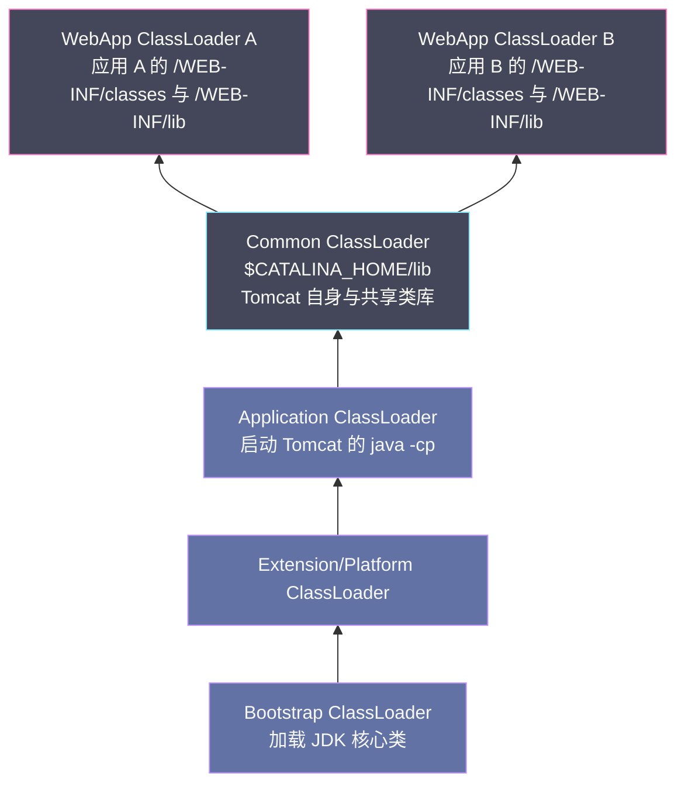
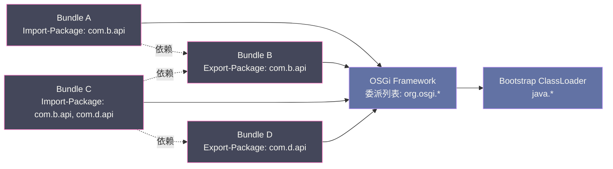

# 10 类加载机制——双亲委派模型与打破它的场景

**摘要：**

Java 程序运行时，`.class` 文件是如何从磁盘（或网络、数据库）进入 JVM 内存并变成可用类型的？这个过程由**类加载子系统**完成，分为加载、验证、准备、解析、初始化五个阶段。整个过程的组织方式——"哪个类加载器负责加载哪个类"——由**双亲委派模型（Parent Delegation Model）** 规范。双亲委派保证了 Java 核心 API 的唯一性和安全性：`java.lang.Object` 永远只能由 Bootstrap ClassLoader 加载，不能被自定义类冒充。然而，现实工程中存在多个场景**必须打破双亲委派**：SPI（Service Provider Interface）的服务发现、Tomcat 的多 Web 应用隔离、OSGi 的模块化、以及 JDK 9 引入的模块系统（JPMS）。理解为什么要打破、如何打破、打破之后的影响，是理解 Java 复杂框架（Spring、Tomcat、Dubbo）类加载行为的基础，也是解决 `ClassNotFoundException`、`NoClassDefFoundError`、类型不一致（同名类的不同 `Class` 对象）等诡异问题的关键。

---

## 第 1 章 类加载的五个阶段

### 1.1 从 .class 文件到可用类型

在 [[01 JVM 全局架构——从 .java 到机器码的完整旅程]] 中我们简要介绍了类加载的五个阶段。本章将每个阶段深入展开，理解其工作内容和关键细节。

**五个阶段的顺序**：

```
加载（Loading）→ 验证（Verification）→ 准备（Preparation）→ 解析（Resolution）→ 初始化（Initialization）
```

其中，验证、准备、解析三个阶段统称为**连接（Linking）**。加载和连接阶段在时间上可以交叉进行（加载开始后，字节流的部分内容可以边解析边验证），但五个阶段的开始顺序是固定的。

### 1.2 加载（Loading）

**加载阶段做三件事**：

1. 通过类的全限定名（如 `com.example.HelloWorld`）找到对应的二进制字节流（`.class` 文件、JAR 包内的条目、网络字节流、动态代理生成的字节码等）
2. 将字节流所代表的静态存储结构转化为方法区（元空间）的运行时数据结构
3. 在**堆**中创建一个代表这个类的 `java.lang.Class` 对象（作为方法区中类型数据的访问入口）

注意：JVM 规范对"通过什么方式获取字节流"**没有规定**——这是类加载器的自由度所在。标准实现从文件系统读取，但也可以从数据库、加密文件、远程服务器获取，甚至在运行时动态生成（Spring AOP、CGLib 动态代理、`java.lang.reflect.Proxy`）。

### 1.3 验证（Verification）

验证阶段是连接的第一步，**确保 `.class` 文件的字节流符合 JVM 规范，且不会危害 JVM 的安全**。

验证分为四个子阶段：

**文件格式验证**：检查魔数（`0xCAFEBABE`）、版本号、常量池中的常量类型是否合法等。这个阶段在字节流级别进行，还没有进入元空间。

**元数据验证**：对类的元数据做语义分析，例如：
- 是否有父类（除 `java.lang.Object` 外所有类都应有父类）
- 是否继承了 `final` 修饰的类（`final` 类不可继承）
- 非抽象类是否实现了接口中所有的抽象方法

**字节码验证**：这是最复杂的一步，通过数据流分析确保字节码指令序列不会危害 JVM：
- 操作数栈类型与字节码指令要求的类型兼容（如 `iadd` 要求操作数栈顶是两个 `int`）
- 跳转指令的目标地址合法（在方法体内，且指向有效的指令起始位置）
- 局部变量在使用前已赋值

JDK 6+ 引入 **StackMapTable** 属性，将控制流的类型状态记录在 `.class` 文件中，字节码验证时直接读取而无需从头推导，将验证速度从 O(n²) 降低到 O(n)。

**符号引用验证**：将常量池中的符号引用（字符串形式的类名、方法名）与实际存在的类型做对照验证：
- 符号引用中描述的类是否存在、是否可访问
- 字段、方法在目标类中是否存在、是否有访问权限

> [!note] 设计哲学：验证是可选优化
> 对于被反复验证过的可信代码，可以通过 `-Xverify:none`（JDK 13+ 弃用）或 `-noverify` 禁用验证，加快类加载速度（有一定启动加速效果）。但对于来自不受信任来源的字节码（如用户上传的插件），验证是安全的最后一道防线，不能省略。

### 1.4 准备（Preparation）

准备阶段为类的**静态变量（类变量）** 分配内存，并设置**初始零值**：

```java
public class Example {
    public static int value = 100;    // 准备阶段：value = 0（零值），不是 100！
    public static final int CONST = 200;  // 编译期常量：准备阶段直接设为 200
}
```

- `static int value = 100`：准备阶段值为 `0`，`100` 要等到初始化阶段执行 `<clinit>` 时才赋上
- `static final int CONST = 200`：**编译期常量**（字面量常量，值在编译时确定），在准备阶段就直接设为 `200`，不需要等到初始化

注意：准备阶段只分配**静态变量**（类级别，存储在方法区），实例变量的分配发生在**对象创建**（`new` 指令执行时，在堆中分配）。

### 1.5 解析（Resolution）

解析阶段将常量池中的**符号引用（Symbolic Reference）** 替换为**直接引用（Direct Reference）**：

- **符号引用**：一组描述目标的符号（字符串），如 `"java/lang/String"`、`"#5 Methodref java/io/PrintStream.println:(Ljava/lang/String;)V"`
- **直接引用**：指向目标的指针、偏移量或句柄，可以直接定位到内存中的目标

解析的目标包括：类/接口、字段、方法（类方法和接口方法）。

**解析可以延迟到使用时**（懒解析）：JVM 规范允许在第一次使用某个符号引用时才解析它，而不是在类加载完成时就全部解析。HotSpot 就是这样实现的——常量池中的引用一开始是符号引用，第一次被访问时才解析为直接引用。

### 1.6 初始化（Initialization）——执行用户代码

初始化阶段才是真正**执行 Java 代码**的开始。JVM 执行类的 `<clinit>()` 方法（由 `javac` 合并所有静态变量赋值语句和静态初始化块生成）：

```java
public class Example {
    static int a = 10;           // ① 静态变量赋值
    static {
        System.out.println("静态块 1：a = " + a);  // ② 静态块
        b = 20;                  // ③ 可以赋值（虽然声明在后面）
    }
    static int b;                // 声明在静态块后，但在准备阶段已分配
    static {
        System.out.println("静态块 2：b = " + b);  // ④ 静态块
    }
}
// <clinit> 按源码顺序执行：① → ② → ③ → ④
// 输出：静态块 1：a = 10
//       静态块 2：b = 20
```

**`<clinit>` 的特性**：
- 由 JVM 保证多线程安全：多个线程同时触发同一个类的初始化，只有一个线程执行 `<clinit>`，其他线程阻塞等待
- 如果父类的 `<clinit>` 未执行，JVM 先执行父类的 `<clinit>`
- 接口不需要先执行父接口的 `<clinit>`（接口的 `<clinit>` 只在接口中的常量被使用时才触发）
- 如果类没有静态变量赋值和静态块，`javac` 不会生成 `<clinit>` 方法

**触发初始化的六种时机**（主动引用，JVM 规范明确规定）：
1. `new` 指令创建类的实例
2. 读/写类的静态字段（非编译期常量）
3. 调用类的静态方法
4. 对类使用反射（`Class.forName("...")`）
5. 初始化子类时，其父类尚未初始化
6. JVM 启动时指定的主类（含 `main` 方法的类）

> [!warning] 生产避坑：`Class.forName` 的重载陷阱
> `Class.forName(String name)` 默认会触发初始化，而 `Class.forName(String name, boolean initialize, ClassLoader loader)` 把 `initialize` 参数显式暴露出来。JDBC 4.0 之前，驱动类必须写成 `Class.forName("com.mysql.jdbc.Driver")` 才能触发驱动向 `DriverManager` 注册自己（注册逻辑写在驱动类的静态块里）——这正是利用了"反射会触发初始化"这条规则。JDBC 4.0 之后引入了 SPI 自动发现机制（见第 4 章），这行代码理论上可以省略，但大量遗留代码仍然保留着它，成为一种"历史惯性"。

### 1.7 解析的时机：为什么符号引用可以"迟到"

解析阶段把符号引用换成直接引用，但 JVM 规范只要求这件事**最终**发生，没有要求它必须在初始化之前的固定时间点完成。HotSpot 的实现选择了**惰性解析（Lazy Resolution）**：常量池里的每一项一开始都是符号引用，只有在字节码指令第一次真正用到它时（比如第一次执行到某条 `invokevirtual` 或 `getstatic`），才触发解析并把结果缓存到常量池缓存（`ConstantPoolCache`）里，下一次执行同一条指令直接复用缓存的直接引用，不再重复走符号查找的路径。

这个设计带来一个容易被忽视的推论：**一个方法体内引用了不存在的类，只要这条指令永远不会被执行到，程序就不会报错**。

```java
public class LazyResolutionDemo {
    public static void mayNeverRun(boolean flag) {
        if (flag) {
            // NoSuchClass 在编译期通过（假设它在编译时存在，运行时被删除或替换）
            NoSuchClass obj = new NoSuchClass();
        }
        System.out.println("这一行永远能正常执行");
    }
}
// 只要调用 mayNeverRun(false)，NoSuchClass 相关的符号引用永远不会被解析
// NoClassDefFoundError 也就永远不会抛出——这正是"懒解析"的直接后果
```

这也是为什么框架代码里大量使用"能力探测"（capability probing）模式：先用 `try { Class.forName(...) } catch (ClassNotFoundException e) { ... }` 探测某个可选依赖是否存在，再决定走哪条分支——探测失败不会导致整个类加载失败，因为失败的解析被限制在触发它的那一条指令上，不会波及整个类。

### 1.8 反例：如果没有字节码验证会怎样

字节码验证经常被当作"可选的性能损耗"看待，但它解决的是一个具体到近乎"物理"的问题：**Java 语言层面的类型安全，是由 `javac` 静态检查保证的；但字节码本身是不受语言约束的**——任何人都可以手写或用 ASM/Javassist 之类的字节码操作库生成一个跳过了 `javac` 检查的 `.class` 文件。如果 JVM 在执行阶段才发现类型不匹配（比如把一个 `int` 当成对象引用解引用），后果不是抛异常，而是**直接破坏进程内存**——因为字节码解释器和 JIT 编译器都假设输入是类型安全的，不会对每条指令做运行时类型检查（那样性能开销无法接受）。

字节码验证把这类检查一次性地在类加载时做完，用一次性的静态分析成本换取执行期零开销的类型安全假设。这也解释了为什么验证阶段不能像"准备""解析"一样被无限期推迟——**验证必须在初始化之前，最迟在方法第一次被执行前完成**，否则整个"字节码类型安全"的地基就不存在了。`-Xverify:none`（已在 JDK 13 中移除）之所以危险，就是因为它移除了这道防线，把"信任字节码来源"的责任完全转嫁给了调用者。

---

## 第 2 章 类加载器——谁来做加载工作

### 2.1 类加载器的本质

**类加载器（ClassLoader）** 是实现"通过类的全限定名获取其字节码二进制流"这一动作的组件。

JVM 规范规定了类加载器的行为，但**不规定有哪些类加载器**——每个 JVM 实现可以有自己的类加载器体系。HotSpot JVM 提供三层内置类加载器：

**Bootstrap ClassLoader（启动类加载器）**：
- C++ 实现，是 JVM 的一部分，不是 Java 类（`String.class.getClassLoader()` 返回 `null`，因为它没有 Java 层面的对象）
- 加载 Java 的核心类库：`JAVA_HOME/lib/` 下的 `rt.jar`（JDK 8）或 JDK 9+ 的 `java.base` 模块
- 只加载**被 JVM 信任的**类（路径白名单，不能随意加进来）

**Extension/Platform ClassLoader（扩展/平台类加载器）**：
- JDK 8：`sun.misc.Launcher$ExtClassLoader`，加载 `JAVA_HOME/lib/ext/` 下的扩展类库
- JDK 9+：改名为 Platform ClassLoader，加载 Java SE 平台的非核心模块
- 父加载器：Bootstrap ClassLoader

**Application ClassLoader（应用程序类加载器）**：
- `sun.misc.Launcher$AppClassLoader`（JDK 8）
- 加载用户的 classpath（`-cp` / `-classpath`）上的类——也就是你写的应用代码
- 父加载器：Extension/Platform ClassLoader
- **通常是 Java 程序的默认类加载器**（`ClassLoader.getSystemClassLoader()` 返回它）

### 2.2 类的唯一性由类加载器决定

在 JVM 中，**判断两个类是否"相同"，不只看类的全限定名，还要看加载它的类加载器是否相同**：

```java
// 同一个 .class 文件，被两个不同的类加载器加载，得到的是两个不同的类！
ClassLoader cl1 = new URLClassLoader(new URL[]{classPath});
ClassLoader cl2 = new URLClassLoader(new URL[]{classPath});

Class<?> class1 = cl1.loadClass("com.example.Foo");
Class<?> class2 = cl2.loadClass("com.example.Foo");

System.out.println(class1 == class2);           // false！两个不同的 Class 对象
System.out.println(class1.equals(class2));       // false！
System.out.println(class1.getName().equals(class2.getName())); // true：名字相同

// 类型转换会失败！
Object obj1 = class1.newInstance();
class2.cast(obj1);  // ClassCastException！虽然名字相同，但是不同的"类型"
```

这个特性是理解 **Tomcat 的 Web 应用隔离**和 **OSGi 模块化**的基础：不同的 Web 应用使用不同的 ClassLoader，即使加载了相同名字的类（比如都依赖 `log4j`），它们也是相互隔离的不同类型。

> [!info] 核心概念：类的唯一标识是二元组
> JVM 中一个"类"的唯一标识不是简单的全限定名字符串，而是 `(ClassLoader, 全限定名)` 这个二元组。这个二元组构成了所谓的**类命名空间（Class Namespace）**——同一个类加载器加载的类共享一个命名空间，互不同名冲突；不同类加载器即使加载了字节码完全相同的 `.class` 文件，产出的也是命名空间里两个独立的 `Class` 对象。理解这一点，才能理解为什么"同一个 JAR 包被两个 WebApp 各自加载一次"是完全合法且必要的设计，而不是 bug。

### 2.3 类的可见性规则：父加载器看不见子加载器的类

双亲委派描述的是"请求"的传递方向（向上），但**类的可见性**是反过来的：**子加载器能够看到（引用、使用）父加载器加载的所有类，但父加载器看不到、也无法使用子加载器加载的类**。

这条规则不是额外发明出来的，而是委派方向的自然推论——因为父加载器从不会把加载请求转交给子加载器，它的视野里根本不会出现"子加载器加载的类"这个概念。这解释了两个常见现象：

- Bootstrap ClassLoader 加载的 `java.util.ArrayList` 可以被任何自定义类加载器加载的业务代码直接 `import` 使用（子可见父）
- Bootstrap ClassLoader 里的 `java.sql.DriverManager` 不能直接 `new com.mysql.cj.jdbc.Driver()`（父不可见子），这正是第 4 章 SPI 问题产生的根源——**父加载器需要使用只有子加载器才能看到的类**，是一种结构性矛盾，只能通过"迂回"手段（线程上下文类加载器）解决，不可能靠调整委派顺序本身解决。

### 2.4 自定义类加载器实战：从 `findClass` 到网络类加载器

编写自定义类加载器的标准姿势是**继承 `ClassLoader`，只覆盖 `findClass()`**，把字节流获取的逻辑写在这里，`loadClass()` 中的双亲委派骨架完全不动：

```java
// 一个从指定目录读取 .class 文件的自定义类加载器
public class FileSystemClassLoader extends ClassLoader {

    private final String classPath;

    public FileSystemClassLoader(String classPath, ClassLoader parent) {
        super(parent);              // 显式指定父加载器，不指定则默认是 Application ClassLoader
        this.classPath = classPath;
    }

    @Override
    protected Class<?> findClass(String name) throws ClassNotFoundException {
        byte[] classBytes = loadClassBytes(name);   // 从磁盘读取字节流，自由度在这里体现
        if (classBytes == null) {
            throw new ClassNotFoundException(name);
        }
        // defineClass 把字节流转换成 JVM 内部的 Class 结构，是加载阶段真正的落点
        // 第二、三个参数是偏移量和长度，第四个 ProtectionDomain 可用于安全策略控制
        return defineClass(name, classBytes, 0, classBytes.length);
    }

    private byte[] loadClassBytes(String name) {
        String fileName = classPath + "/" + name.replace('.', '/') + ".class";
        try (InputStream in = new FileInputStream(fileName);
             ByteArrayOutputStream out = new ByteArrayOutputStream()) {
            byte[] buf = new byte[4096];
            int n;
            while ((n = in.read(buf)) != -1) {
                out.write(buf, 0, n);
            }
            return out.toByteArray();
        } catch (IOException e) {
            return null;
        }
    }
}
```

`findClass()` 只负责"怎么拿到字节流、怎么变成 Class 对象"，至于"该不该由我来拿"这件事，完全交给父类 `loadClass()` 里已经写好的双亲委派逻辑判断。这也是为什么周志明在《深入理解 Java 虚拟机》里反复强调："不要覆盖 `loadClass()`，除非你真的想打破双亲委派"——`findClass()` 是 JDK 专门为扩展点留出来的"钩子方法"（Template Method 模式的典型应用，参见 [[Java/OOP设计模式/04 结构型模式（上）——代理、适配器与装饰器]] 中关于扩展点设计的讨论）。

把 `loadClassBytes` 换成从网络下载字节流、从数据库 BLOB 字段读取、或者对字节流先解密再返回，就分别对应了 Applet 的远程类加载器、规则引擎的热更新类加载器、商业软件的代码保护方案——加载阶段"字节流从哪里来"的自由度，就是这些机制存在的基础。

---

## 第 3 章 双亲委派模型——设计理念与实现

### 3.1 双亲委派的工作流程

**双亲委派模型（Parent Delegation Model）** 规定了类加载器的工作方式：**任何一个类加载器收到类加载请求时，首先将请求委派给父加载器，父加载器再委派给它的父加载器，一直到最顶层的 Bootstrap ClassLoader；只有当父加载器无法加载（找不到对应的类）时，子加载器才自己尝试加载**。

```
Bootstrap ClassLoader（顶层，C++ 实现，负责加载 java.*）
    ↑ 委派（向上）
Extension/Platform ClassLoader
    ↑ 委派（向上）
Application ClassLoader
    ↑ 委派（向上）
自定义 ClassLoader A
    ↑ 委派（向上）
自定义 ClassLoader B（收到加载请求）
```

流程：B 收到加载 `com.example.Foo` 的请求 → 委派给 A → A 委派给 Application → Application 委派给 Extension → Extension 委派给 Bootstrap → Bootstrap 找不到 → Extension 找不到 → Application 找不到 → A 找不到 → B 自己加载（在 classpath 或自定义路径找到）。

### 3.2 双亲委派的源码实现

双亲委派的核心逻辑在 `java.lang.ClassLoader.loadClass()` 方法中（JDK 8）：

```java
// java.lang.ClassLoader.loadClass() 的关键逻辑（简化）
protected Class<?> loadClass(String name, boolean resolve) throws ClassNotFoundException {
    synchronized (getClassLoadingLock(name)) {
        // 1. 首先检查该类是否已经被加载过（缓存）
        Class<?> c = findLoadedClass(name);
        
        if (c == null) {
            try {
                // 2. 父加载器不为 null，委派给父加载器
                if (parent != null) {
                    c = parent.loadClass(name, false);
                } else {
                    // 3. 父加载器为 null，说明父加载器是 Bootstrap ClassLoader
                    //    委派给 Bootstrap 加载
                    c = findBootstrapClassOrNull(name);
                }
            } catch (ClassNotFoundException e) {
                // 父加载器抛出 ClassNotFoundException，表示找不到，不是错误
                // 继续往下，让自己尝试
            }
            
            if (c == null) {
                // 4. 父加载器们都找不到，自己尝试加载
                c = findClass(name);  // 子类应该 override 这个方法，而不是 loadClass
            }
        }
        
        if (resolve) {
            resolveClass(c);
        }
        return c;
    }
}
```

**关键设计**：子类加载器应该覆盖（override）`findClass()`，而不是 `loadClass()`。`loadClass()` 中内置了双亲委派逻辑，如果覆盖 `loadClass()`，双亲委派就被破坏了。

### 3.3 双亲委派保护了什么

**防止核心类被篡改**：如果用户自定义了一个 `java.lang.Object` 类，在双亲委派下，加载请求会一直委派到 Bootstrap ClassLoader，Bootstrap 从 `rt.jar` 中找到官方的 `java.lang.Object` 并加载，用户的自定义版本永远不会被加载。Java 核心 API 的"纯洁性"得到了保障。

**保证同一个类在 JVM 中的唯一性**：任何类最终都由能加载它的最顶层加载器加载，不会出现同一个 `java.lang.String` 被不同加载器分别加载出两个不同 `Class` 对象的情况（在标准类库范围内）。

### 3.4 反例实验：如果没有双亲委派——自定义 `java.lang.String` 击穿沙箱

要理解双亲委派存在的价值，最直接的方式是做一个思想实验：假设一个自定义类加载器**不遵守**双亲委派，收到加载请求后先自己找，找不到才委派给父加载器（这正是后文 Tomcat WebApp ClassLoader 的策略，但用在 `java.lang.String` 这样的核心类上会发生什么）。

```java
// 在自己的 classpath 下放一个包名为 java.lang 的 String.class
package java.lang;

public class String {
    // 自定义实现：例如把所有字符串都记录到一个静态 Map 里，
    // 或者在 equals() 里插入后门逻辑，或者让 toString() 泄露内存地址
    public static void backdoor() {
        System.out.println("我不是官方的 java.lang.String！");
    }
}
```

如果类加载器不遵守双亲委派，直接自己加载这个"伪造"的 `String` 类，会造成两个层面的破坏：

1. **类型系统被绕过**：JVM 内部大量核心代码（数组拷贝、字符串常量池、`Object.toString()` 的默认实现等）都硬编码依赖官方 `java.lang.String` 的内存布局和语义。一旦换成任意可控的实现，攻击者可以在字符串处理逇过程中插入任意逻辑——从记录敏感信息到触发未定义行为，理论上可以绕过 Java 语言层面几乎所有的沙箱假设。
2. **`Object`、`ClassLoader` 自身也可能被污染**：如果连 `java.lang.Object` 都能被用户版本替换，整个类型继承体系的根基就不存在了，运行在这个 JVM 里的任何"安全策略"都失去意义。

**在真实 JVM 上，这个实验会直接失败**——而失败的原因分两层：

- 第一层是双亲委派本身：只要类加载器的 `loadClass()` 没有被重写（绝大多数自定义类加载器都不会重写它），加载 `java.lang.String` 的请求一定会一路委派到 Bootstrap ClassLoader，官方版本先被加载并缓存，用户版本永远没有机会执行。
- 第二层是即使故意重写 `loadClass()` 跳过双亲委派，直接调用 `defineClass()` 定义一个包名为 `java.*` 的类，HotSpot 会在 `defineClass` 内部做包名安全检查，直接抛出：

```text
java.lang.SecurityException: Prohibited package name: java.lang
```

这条检查与双亲委派机制是独立的两道防线（见 3.5 节），双亲委派解决的是"正常情况下优先用官方实现"的问题，包名检查解决的是"即使有人故意绕过双亲委派，也不能定义核心包下的类"的问题——两者共同构成了 JVM 对 `java.*` 命名空间的保护。

> [!warning] 生产避坑：不要迷信"双亲委派天然防止一切篡改"
> 双亲委派只能保证**在遵守它的类加载器体系下**核心类不会被覆盖。一个恶意或者写得很粗糙的自定义类加载器完全可以重写 `loadClass()`，跳过委派逻辑。真正兜底的防线是 `defineClass` 里的包名检查——这也是为什么"自定义业务代码不要使用 `java.*`、`javax.*` 作为包名前缀"不仅是编码规范问题，触碰这条线在运行期直接会被 JVM 拒绝。

### 3.5 双亲委派之外的第二道防线：`defineClass` 的包名保护

`ClassLoader.defineClass()` 是加载阶段真正把字节流转换成 `Class` 对象的方法（3.2 节 `findClass()` 的实现最终都会调用它）。在这个方法内部，HotSpot 会检查目标类的包名是否属于"受限包"（`java.*` 是最典型的例子，JDK 9+ 之后随着模块系统的引入，这层检查与模块的 `exports`/`opens` 声明进一步结合）：

- 如果发起 `defineClass` 调用的类加载器不是 Bootstrap/Platform ClassLoader，且目标类包名以 `java.` 开头，直接抛出 `SecurityException: Prohibited package name`
- 这层检查在 `defineClass` 层面进行，比双亲委派更底层，即使某个类加载器完全不遵守双亲委派规范，这道检查依然生效

这也是为什么"打破双亲委派"和"用自定义实现替换 `java.*` 核心类"是两件完全不同难度的事——前者在 SPI、Tomcat、OSGi 里都是常规操作，后者在标准 JVM 上几乎不可能做到（唯一的例外是通过 `-Xbootclasspath/p` 等启动参数把自定义类库排在 Bootstrap 路径最前面，这需要 JVM 启动权限，属于运维层面的信任委托，而不是运行期绕过安全检查）。

---

## 第 4 章 打破双亲委派的场景

双亲委派是一种"建议"而非"强制"——只要覆盖 `loadClass()` 方法，任何加载器都可以打破它。现实中有几个经典场景，必须打破双亲委派才能正常工作。理解这些场景的共性，比记住每个场景的具体细节更重要：它们几乎都源于同一个结构性矛盾——**"谁需要用这个类"和"谁能看见这个类"发生了错位**。

### 4.1 打破双亲委派的本质：委派方向与需求方向的错配

双亲委派假设了一个隐含前提：**越底层（越靠近 Bootstrap）的类加载器，加载的类越"基础"、越应该被优先信任**。这个前提在 Java 核心类库场景下是成立的——`java.lang.String` 显然应该由 Bootstrap 加载并被所有代码复用。但当出现下面任意一种情况时，这个前提就会失效：

- **接口在上层，实现在下层**：接口由 Bootstrap 加载（如 `java.sql.Driver`），但具体实现只能出现在 classpath 上（如 MySQL 驱动），委派链条无法从"定义接口的加载器"直接跳到"提供实现的加载器"（SPI/JNDI 场景）
- **同一个应用需要多份互相隔离的实现**：多个 Web 应用需要用不同版本的同一个类库，标准委派下同名类只能被加载一次，无法满足"隔离"这个需求（Tomcat 场景）
- **依赖关系是显式声明的图，而不是隐式的树**：模块化系统里，两个平级模块可能互相依赖对方导出的包，这种关系用树状的父子委派表达不出来，只能用网状委派表达（OSGi 场景）
- **旧版本必须被彻底遗忘**：热部署要求旧类被完全丢弃，但类加载器天然有缓存（`findLoadedClass`），只有换一个全新的类加载器才能让"旧版本已经不存在"这件事成立（热部署场景）

后面四节按照这四类矛盾逐一展开。

### 4.2 场景一：SPI 机制——父加载器调用子加载器加载

**问题背景**：Java 的 SPI（Service Provider Interface，服务提供者接口）机制允许第三方提供接口实现，典型例子是 JDBC。

`java.sql.Driver` 接口定义在 `rt.jar` 中，由 Bootstrap ClassLoader 加载。但 JDBC 驱动的实现（如 `com.mysql.cj.jdbc.Driver`）在用户的 classpath 上，需要由 Application ClassLoader 加载。

问题来了：`DriverManager`（在 `rt.jar` 中，由 Bootstrap ClassLoader 加载）需要通过 `ServiceLoader` 发现并加载 classpath 上的 JDBC 驱动实现。但 Bootstrap ClassLoader 只能加载 `rt.jar` 中的类，无法找到 MySQL Driver！

这就是"**父类加载器需要加载由子类加载器负责的类**"的矛盾——正面违反了双亲委派的方向。

**解决方案：线程上下文类加载器（Thread Context ClassLoader）**

JDK 1.2 引入了一个 workaround：`Thread` 类中有一个 `contextClassLoader` 字段，允许线程携带一个类加载器（通常是 Application ClassLoader）。当父类加载器（Bootstrap）需要加载子类加载器才能找到的类时，可以通过 `Thread.currentThread().getContextClassLoader()` 获取应用类加载器，委托给它加载：

```java
// JDK 中 ServiceLoader 的简化逻辑
public static <S> ServiceLoader<S> load(Class<S> service) {
    // 不用当前类的加载器（Bootstrap），改用线程上下文类加载器
    ClassLoader cl = Thread.currentThread().getContextClassLoader();
    return new ServiceLoader<>(service, cl);
}
```

这是一种"**逆向委派**"——由父加载器主动调用子加载器，双亲委派的单向性被打破。

> [!note] 设计哲学：线程上下文类加载器是一个"补丁"
> 线程上下文类加载器的设计被 Java 核心工程师 Joshua Bloch 描述为"一种破坏双亲委派优雅性的糟糕技巧"（ hack），但它是在不修改 ClassLoader 继承体系的前提下解决 SPI 问题的唯一实用方案。这是典型的"工程中不得不做的妥协"。

**`META-INF/services` 约定：SPI 的落地机制**

`ServiceLoader` 找到线程上下文类加载器之后，还需要知道"到底该加载哪个具体实现类"。这个信息不是硬编码在代码里的，而是通过一个文件系统约定传递的——服务提供者在自己的 JAR 包里放一个文件：

```text
META-INF/services/java.sql.Driver
```

文件内容是实现类的全限定名（一行一个）：

```text
com.mysql.cj.jdbc.Driver
```

`ServiceLoader.load(Driver.class)` 内部做的事情，本质上就是：用给定的类加载器（线程上下文类加载器）去查找 classpath 上所有 JAR 包里名为 `META-INF/services/java.sql.Driver` 的文件，逐行读取类名，再用同一个类加载器 `Class.forName()` 加载并实例化。这套机制后来被 Spring 的 `spring.factories`、Dubbo 的 SPI 扩展点机制原样借用（文件路径和格式不同，思路完全一致）——**"通过约定的资源文件把接口和实现解耦，运行时按需发现"**是 Java 生态里被反复复用的一个基础模式。

**JDBC 4.0 之后驱动的自动注册**：JDBC 3.0 及更早版本要求开发者手写 `Class.forName("com.mysql.jdbc.Driver")` 来触发驱动的静态初始化块（在静态块里调用 `DriverManager.registerDriver(...)`）。JDBC 4.0（Java 6）之后，只要驱动 JAR 包里有上述 `META-INF/services/java.sql.Driver` 文件，`DriverManager` 首次被使用时会自动通过 `ServiceLoader` 发现并加载所有驱动，`Class.forName` 这行代码理论上可以省略——但注意，这背后依赖的正是本节讨论的线程上下文类加载器机制，而不是标准双亲委派。

### 4.3 场景二：JNDI——另一个"父加载子"的例子

**JNDI（Java Naming and Directory Interface）** 是比 JDBC 更早遇到同类问题的模块，同时也是最早催生"线程上下文类加载器"这个 workaround 的场景（甚至比 JDBC 的 SPI 使用更早，JNDI 的 SPI 规范可以追溯到 JDK 1.3）。

JNDI 的核心 API（`javax.naming.InitialContext` 等）定义在核心类库里，由 Bootstrap/Platform ClassLoader 加载。但 JNDI 的**实现**——具体连接到哪种命名/目录服务（LDAP、RMI Registry、CORBA、DNS，或者应用服务器自己实现的命名服务）——是通过 SPI 提供的第三方 `InitialContextFactory` 实现类，同样躺在 classpath 上，同样只有 Application ClassLoader 能看到。

矛盾的结构和 JDBC 一模一样：**核心 API 需要反向加载只有子加载器才能看到的实现类**。JNDI 的解法同样是线程上下文类加载器——`InitialContext` 内部查找 `InitialContextFactory` 实现时，会调用 `Thread.currentThread().getContextClassLoader()` 而不是用自己（Bootstrap）的类加载器。

> [!note] 设计哲学：SPI 不是某个类库的专利，是一类问题的通用解法
> JDBC、JNDI、JAXP（XML 解析器工厂）、JCE（加密服务提供者）在 JDK 里分别独立地遇到了"核心 API 需要加载第三方实现"这个问题，最终都收敛到同一套解决方案——线程上下文类加载器 + `META-INF/services` 约定。JDK 6 之后把这套通用逻辑抽象成了标准的 `java.util.ServiceLoader` 类，后续新增的 SPI 场景（如 JSON-B、JAX-RS 的 Provider 机制）都直接复用它，不再各自发明轮子。这是"发现共性问题，抽象通用机制"的一个典型工程案例。

### 4.4 场景三：Tomcat——Web 应用的类隔离

**问题背景**：Tomcat 是一个多 Web 应用容器，可以同时运行多个 Web 应用（war 包）。每个 Web 应用可能：
- 依赖同一个类库的不同版本（A 应用用 `log4j 1.2`，B 应用用 `log4j 2.x`）
- 有同名的类（A 和 B 都有 `com.example.util.StringUtils`，但实现不同）

这两个需求要求**不同 Web 应用的类在 JVM 中必须是隔离的**——标准双亲委派下，同名类只能加载一次，无法满足隔离需求。

**Tomcat 的类加载器体系**（以 Tomcat 8/9 为例，早期版本 Common/Catalina/Shared 三层职责有细微差异，但核心思想一致）：



**`WebApp ClassLoader` 的特殊规则**（打破双亲委派）：

对于加载请求，`WebApp ClassLoader` **不是先委派给父加载器，而是先尝试自己加载**（在自己的 `/WEB-INF/classes/` 和 `/WEB-INF/lib/` 中查找）：
- 找到了：使用自己加载的版本（Web 应用私有类）
- 找不到：再委派给父加载器（Common ClassLoader）
- 父也找不到：才向上到 Bootstrap

例外：`java.*` 开头的核心类仍然委派给 Bootstrap（安全边界），Tomcat 自身类库（`org.apache.catalina.*` 等）委派给 Common ClassLoader，`javax.servlet.*` 这类 Servlet 规范接口也强制走委派（Servlet 规范要求容器和 Web 应用看到的是同一个接口类型，否则应用实现的 `Servlet` 接口和容器期望的 `Servlet` 接口会是"同名不同类"，导致 `ClassCastException`）。

这样，A 应用的 `/WEB-INF/lib/log4j-1.2.jar` 和 B 应用的 `/WEB-INF/lib/log4j-2.x.jar` 分别由各自的 `WebApp ClassLoader` 加载，相互隔离，互不干扰。下表总结了 Tomcat 类加载顺序反转带来的具体收益和代价：

| 维度 | 标准双亲委派 | Tomcat WebApp ClassLoader 的反转策略 |
|------|------------|-----------------------------------|
| 查找顺序 | 先问父亲，父亲找不到才自己找 | 先自己找，找不到才问父亲 |
| 隔离性 | 全局唯一，无法隔离同名类 | 每个 Web 应用可以有自己的类版本 |
| 安全性 | 天然防止核心类被篡改 | 需要额外维护"强制委派列表"（`java.*`、`javax.servlet.*`）弥补安全性损失 |
| 一致性 | 天然保证同名类只有一份 | 需要通过 Common ClassLoader 承载"必须共享"的类库来保证跨应用一致性 |

> [!warning] 生产避坑："同一个 JAR 出现在两个位置"引发的诡异 `ClassCastException`
> 如果把某个类库既放进 `$CATALINA_HOME/lib`（Common ClassLoader 加载）又放进某个 Web 应用的 `/WEB-INF/lib`（WebApp ClassLoader 加载），会出现同一个类被两个不同类加载器分别加载出两份 `Class` 对象的情况。当代码里出现 `instanceof` 判断或强制类型转换时，即使类名、包名完全相同，也会因为"类加载器不同→类型不同"而抛出 `ClassCastException`，报错信息还常常写着"看起来完全一样"的类名，非常容易让人误判为 JAR 版本冲突而排查错方向。正确的做法是明确一个类库到底应该被"所有应用共享"（放 Common）还是"每个应用独立一份"（放 WEB-INF/lib），二者不能同时存在。

### 4.5 场景四：OSGi——模块化的网状委派

**OSGi（Open Service Gateway Initiative）** 是 Java 世界最完整的模块化规范（Eclipse IDE 的基础），每个模块（Bundle）有独立的类加载器，Bundle 之间的类共享通过**显式声明的依赖关系**控制（`Import-Package` 和 `Export-Package`）。

OSGi 的类加载顺序**完全不是树状的双亲委派，而是一个网状结构**：



一次类加载请求进入某个 Bundle 后，实际检查顺序是：

1. 检查是否是 `java.*` 包（委派给 Bootstrap）
2. 检查是否在 OSGi Framework 的委派列表中（`org.osgi.*` 等）
3. 检查是否在本 Bundle 的 `Import-Package` 声明的包中（委派给提供该包的 Bundle 的类加载器）
4. 检查本 Bundle 自身的类路径（`Bundle-ClassPath`）

这是一个完全打破双亲委派树状结构的网状委派模型——任意两个 Bundle 之间理论上都可能存在依赖关系，委派方向由 `Import-Package`/`Export-Package` 的声明动态决定，而不是由类加载器在继承体系里的位置决定。OSGi 的强大之处在于可以在运行时动态安装/卸载 Bundle（热部署），因为每个 Bundle 有独立的类加载器，卸载 Bundle 时只需丢弃其类加载器即可触发类的卸载（GC 回收，详见第 6 章）。

这种精细的包级别可见性控制换来的代价是复杂度——`Import-Package`/`Export-Package` 的版本范围声明（如 `com.b.api;version="[1.0,2.0)"`）写错很容易导致 `Bundle` 无法解析（`Unresolved constraint`），这也是 OSGi 虽然设计精良但工程上手门槛偏高、后来逐渐被更轻量的 JPMS（第 5 章）和微服务架构分走了不少市场份额的原因之一。

### 4.6 场景五：热部署与动态类替换

**热部署**（在不重启 JVM 的情况下替换已加载的类的实现）需要打破双亲委派：因为同一个类加载器加载过的类会被缓存（`findLoadedClass` 的结果），不可能再次加载同名类的新版本。

热部署的实现原理：
1. **丢弃旧类加载器**：让旧的类加载器不再被引用，等待 GC 回收（此时旧加载器加载的所有类也会被卸载）
2. **创建新类加载器**：用新的类加载器加载新版本的类
3. **更新引用**：让应用的其他部分使用新类加载器加载的新类

Spring Boot DevTools 的热重启就是这个原理（实际上是重启应用上下文，重新创建类加载器，而不是替换单个类的字节码）。真正的字节码热替换（不重启任何东西，运行中的对象实例继续存活，只替换方法体实现）需要 Java Instrumentation API（`java.lang.instrument.Instrumentation.redefineClasses()`）+ JVM TI（JVM Tool Interface），更为复杂，且有严格限制——不能新增/删除字段和方法，只能替换方法体，这也是 IntelliJ IDEA 的"Debug 模式下热部署"背后使用的机制。

### 4.7 场景六：Spring Boot Fat JAR 的类加载

Spring Boot 可执行 JAR（Fat JAR）把所有依赖的第三方 JAR 都打包进自己内部的 `BOOT-INF/lib/` 目录，而不是解压铺平。标准的 `java -jar` 命令、标准的 `URLClassLoader` 都不认识"JAR 包里嵌套 JAR 包"这种结构——普通的 `Application ClassLoader` 无法直接从嵌套 JAR 里读取字节流。

Spring Boot 的解决方式是提供一个自定义类加载器 `LaunchedURLClassLoader`（由 `spring-boot-loader` 模块提供），它理解 `BOOT-INF/classes/` 和 `BOOT-INF/lib/*.jar` 这套内部约定，把 JAR 包内的嵌套 JAR 当作独立的类路径条目来解析。加载流程上，它仍然遵守标准的双亲委派规则（把请求先委派给父加载器），**没有反转委派顺序**——这里被"打破"的不是委派顺序，而是**字节流获取的方式**：常规类加载器假设字节流来自文件系统或普通 JAR 的顶层条目，Spring Boot 的类加载器把字节流获取逻辑扩展到了"JAR 包套 JAR 包"这种非常规结构。这说明打破双亲委派并不是唯一的"定制类加载行为"手段——加载阶段规范里唯一没有被规定死的环节（"字节流从哪来"）本身就是一个足够大的扩展点，很多场景根本不需要碰双亲委派本身。

### 4.8 六种场景一览

| 场景 | 打破的具体环节 | 核心手段 | 委派顺序是否反转 |
|------|--------------|---------|----------------|
| SPI（JDBC/JNDI） | 父加载器无法看到子加载器的类 | 线程上下文类加载器（逆向委派） | 否，仍是树状委派，只是"借用"了另一个加载器入口 |
| Tomcat | 同名类需要隔离而非唯一 | WebApp ClassLoader 先自己找 | 是，局部反转（保留强制委派名单兜底） |
| OSGi | 委派关系是图而非树 | Import-Package/Export-Package 网状委派 | 是，彻底从树状变为网状 |
| 热部署 | 类加载器自身的缓存无法失效 | 丢弃旧 ClassLoader，创建新的 | 否，委派顺序不变，靠"整体替换加载器"绕开缓存 |
| Spring Boot Fat JAR | 字节流获取方式不支持嵌套 JAR | 自定义 `findClass`/资源解析逻辑 | 否，委派顺序不变，只扩展了加载阶段的自由度 |

这张表格值得反复回味的一点是：**"打破双亲委派"并不是一个单一动作，而是至少三种不同性质的改动**——改变委派的方向（Tomcat、OSGi）、绕开委派链路直接借用另一个加载器（SPI 的线程上下文类加载器）、或者根本不涉及委派顺序，只是扩展了加载阶段获取字节流的自由度（Fat JAR）。遇到具体框架的类加载行为时，先分辨清楚它属于哪一种，往往比死记硬背某个框架的类加载器命名更有用。

---

## 第 5 章 JDK 9 模块系统（JPMS）——类加载的重大变革

### 5.1 模块化之前的问题

JDK 9 之前，整个 JDK 是一个单一的 `rt.jar`（几十 MB），应用即使只用了 `String` 和 `ArrayList`，也必须加载整个 JDK 核心库。这带来了两个问题：

- **启动缓慢**：Bootstrap ClassLoader 需要扫描整个 `rt.jar`（这部分内存布局细节参见 [[运行时数据区/02 运行时数据区——堆、栈、方法区的内存布局]] 中对方法区/元空间的讨论）
- **封装性差**：JDK 内部实现类（如 [[Java/并发编程/volatile与内置锁/05 CAS 与原子类——Unsafe、AtomicInteger 到 LongAdder 的演进|sun.misc.Unsafe]]）对用户代码可见，内部 API 被大量滥用，JDK 团队无法随意修改内部实现——这也是长期以来 Java 版本升级"看起来简单实际很痛"的根源之一：官方从未承诺过内部实现类的兼容性，但生态里大量框架已经深度依赖它们

### 5.2 模块系统的核心概念

**JDK 9 引入 JPMS（Java Platform Module System，Project Jigsaw）**，将 JDK 拆分为 80+ 个模块（`java.base`、`java.sql`、`java.xml` 等），每个模块精确声明：
- **`exports`**：对外公开哪些包
- **`requires`**：依赖哪些其他模块

```java
// module-info.java（模块描述文件）
module com.example.myapp {
    requires java.sql;              // 依赖 java.sql 模块
    requires java.logging;          // 依赖 java.logging 模块
    exports com.example.api;        // 对外公开 com.example.api 包
    // com.example.internal 包不导出，完全封装
}
```

### 5.3 JPMS 对类加载器体系的影响

**Extension ClassLoader → Platform ClassLoader**：
- JDK 9 中 Extension ClassLoader 改名为 Platform ClassLoader（`jdk.internal.loader.ClassLoaders$PlatformClassLoader`）
- 不再从 `ext/` 目录加载，改为负责加载 Java SE 平台的非 `java.base` 模块

**模块化后的加载器分工**：
- Bootstrap ClassLoader：负责 `java.base` 等核心模块（`java.*`, `javax.*`, `jdk.internal.*`）
- Platform ClassLoader：负责其他 Java SE 平台模块（`java.sql`, `java.xml` 等）
- Application ClassLoader：负责应用模块（`--module-path` 上的模块）

**模块系统强化了封装性**：JDK 内部包（`sun.misc.Unsafe`, `sun.nio.*` 等）默认不再对用户代码可见，强行访问会报 `InaccessibleObjectException`。需要在启动参数中显式允许：`--add-opens java.base/sun.misc=ALL-UNNAMED`（不推荐，是临时兼容方案）。

**类加载器实现层面的变化**：JDK 9 之后，HotSpot 的三个内置类加载器统一实现了新的 `jdk.internal.loader.BuiltinClassLoader` 基类（Bootstrap 在 Java 层面仍然没有对应对象，但从 `BootLoader` 门面类可以访问它管理的模块信息）。`BuiltinClassLoader` 内部维护了一张"包名 → 模块"的映射表（`Map<String, LoadedModule>`），加载某个类之前，先查这张表判断这个包属于哪个模块、这个模块是否 `exports` 了这个包给当前上下文——**模块可见性检查被插入到了传统双亲委派流程的前面**，双亲委派本身的委派方向没有变化，但"父加载器能不能看到某个类"这件事，从"只要在父加载器的类路径下就能看到"变成了"必须同时满足模块可见性声明"。这是理解 JDK 9+ 报出 `IllegalAccessException`/`InaccessibleObjectException` 时和传统 `ClassNotFoundException` 语义差异的关键——**前者是"看得见但不让用"，后者是"根本找不到"**。

**未命名模块（Unnamed Module）**：没有 `module-info.java` 的传统 classpath 应用，会被自动归入一个特殊的"未命名模块"。未命名模块可以读取所有其他模块（保证向后兼容，普通应用代码依然能正常 `import java.sql.*`），但它自己不导出任何包给别人（模块化程度较低的历史项目因此可以在 JPMS 环境下"能跑起来"，但不能被其它显式模块正常 `requires`）。这也是为什么 JDK 9 刚发布时大量老项目"直接换 JDK 版本就能跑"——只是因为它们默默落入了这个兼容层，而不是因为它们已经模块化。

### 5.4 模块化 SPI：`provides ... with` 与 `ServiceLoader` 的协同

JPMS 没有停留在"模块内部封装"这一层，还把第 4 章讨论的 SPI 机制显式纳入了模块声明语法，用 `uses` 和 `provides ... with` 关键字替代了隐式的 `META-INF/services` 文件（同时仍然兼容传统写法）：

```java
// 服务消费者模块：声明自己会使用某个服务接口
module com.example.consumer {
    uses com.example.spi.PaymentProvider;
}

// 服务提供者模块：声明自己为该接口提供了具体实现
module com.example.alipay {
    provides com.example.spi.PaymentProvider
        with com.example.alipay.AlipayProvider;
}
```

这样做的意义在于：模块系统在**编译期和模块解析阶段**就能校验"消费者声明了 `uses` 但没有任何模块 `provides` 对应实现"这类问题，而不必等到运行期 `ServiceLoader.load()` 返回空列表才发现配置错误。`ServiceLoader` 的查找逻辑本身不变，仍然依赖 4.2 节讨论的类加载器机制，只是发现服务实现的"元数据来源"从文件约定升级为了模块系统的一等语法。

### 5.5 `--add-opens`/`--add-exports`：强封装的过渡期妥协

JPMS 的强封装（Strong Encapsulation）把模块内部没有 `exports` 的包，从"编译期不可见"升级为了"反射也不可见"——这是 JDK 8 及更早版本做不到的：JDK 8 里 `private`/包级私有的类，反射配合 `setAccessible(true)` 总能强行访问。JDK 9 之后，只要目标包没有被目标模块 `opens`（比 `exports` 更宽松，允许反射访问但不允许编译期直接引用），反射调用会直接抛出 `InaccessibleObjectException`，`setAccessible(true)` 也无法绕过。

`--add-opens 模块名/包名=目标模块` 和 `--add-exports 模块名/包名=目标模块` 是官方提供的"手动开洞"手段，让运维/开发者在启动参数里显式声明"我知道这样不安全，但我需要临时打开这个访问"：

```bash
# 允许所有未命名模块（即传统 classpath 应用）反射访问 java.base 模块里的 sun.misc 包
--add-opens java.base/sun.misc=ALL-UNNAMED
```

大量依赖 `sun.misc.Unsafe`、`sun.nio.ch` 等内部 API 的老框架（早期版本的 Netty、部分 ORM 框架的字节码增强逻辑）在 JDK 9~17 的升级过程中，都需要通过一长串 `--add-opens` 参数才能正常启动——这本质上是**内部 API 的隐性契约被打破后的过渡期成本**，是模块系统"强封装"这一正确设计目标必然要经历的迁移阵痛，而不是模块系统设计上的缺陷。

### 5.6 JDK 8 与 JDK 9+ 类加载器体系对照

| 维度 | JDK 8 及更早 | JDK 9 及以后 |
|------|------------|-------------|
| 顶层类加载器 | Bootstrap ClassLoader（加载 `rt.jar`） | Bootstrap ClassLoader（加载 `java.base` 等核心模块） |
| 第二层 | Extension ClassLoader（加载 `lib/ext`） | Platform ClassLoader（加载非 `java.base` 的平台模块） |
| 第三层 | Application ClassLoader（加载 classpath） | Application ClassLoader（加载 classpath 和 `--module-path`） |
| 类可见性判定依据 | 只看类加载器的委派链路 | 委派链路 + 模块 `exports`/`opens` 声明双重校验 |
| 核心类库组织形式 | 单一 `rt.jar` | 拆分为 80+ 个模块，按需组合（`jlink` 可定制运行时） |
| 内部 API 访问 | 反射 + `setAccessible` 基本可绕过所有限制 | 未 `opens` 的包默认拒绝反射，需 `--add-opens` 显式放行 |
| SPI 声明方式 | 仅支持 `META-INF/services` 文件 | 支持 `uses`/`provides...with` 语法，兼容旧文件方式 |

---

## 第 6 章 类卸载——类的生命周期终点

### 6.1 类什么时候会被卸载

类加载进 JVM 后，并不是永久存在的。当满足以下所有条件时，类可以被 GC 卸载：

1. 该类的所有实例都已经被 GC 回收（堆中没有任何该类的对象）
2. 该类的 `Class` 对象不再被任何引用持有（无法通过反射等方式访问该类）
3. 加载该类的 **ClassLoader 对象已经被 GC 回收**（这是最关键的条件）

第三个条件解释了为什么 Bootstrap/Extension/Application 三层内置加载器加载的类**几乎永远不会被卸载**——这三个加载器对象始终被 JVM 持有强引用，永远不会被 GC 回收，因此它们加载的类也不会被卸载。

**自定义加载器加载的类可以被卸载**：当 Tomcat 热部署一个 Web 应用时，旧的 `WebApp ClassLoader` 失去所有引用后被 GC 回收，它加载的所有类随之卸载，元空间空间得以释放。这也是大量热部署/热重载场景中元空间增长的原因——如果旧的 ClassLoader 没有被正确释放（存在循环引用或 ClassLoader 泄漏），类就无法卸载，元空间持续增长直至 OOM。

### 6.2 类加载器泄漏

**类加载器泄漏**是 Java 应用中最隐蔽的内存问题之一：

```java
// 典型的类加载器泄漏：
// 应用类（由 WebApp ClassLoader 加载）注册到了全局单例（由 App ClassLoader 加载）中
// 导致 WebApp ClassLoader 被全局单例间接引用，无法被 GC
ThreadLocal<MyClass> tl = new ThreadLocal<>();  // MyClass 由 WebApp CL 加载
// 如果线程池的线程（由 App CL 管理）持有这个 ThreadLocal 值，
// ThreadLocalMap → MyClass 实例 → MyClass.class → WebApp ClassLoader
// → 整个 WebApp 的所有类都无法被卸载！
```

常见的类加载器泄漏模式：
- 由 Web 应用类加载器加载的类注册到了全局单例（如 `java.sql.DriverManager`）
- Web 应用的 `ThreadLocal` 变量在线程池线程中未被清除（参见 [[Java/并发编程/JUC工具/15 ThreadLocal 的实现原理与内存泄漏——线程封闭的正确姿势]]）
- log4j/logback 的 MDC 未清除

### 6.3 元空间回收的触发机制与 GC 协同

类的卸载不是一个独立的、随时可能发生的动作，而是**依附在 GC 的某次具体回收动作上**完成的——JVM 不会为了"顺手卸载几个不用的类"单独发起一次垃圾回收，类卸载检查只在 GC 本身已经在扫描堆和方法区（元空间）时"顺路"完成。

在 JDK 8 默认的 Parallel Scavenge + Parallel Old 组合下，类的卸载只发生在 **Full GC** 期间：Full GC 会连带对元空间做一次完整扫描，找出所有"加载它的 ClassLoader 已经不可达"的类，一并回收。这也是为什么频繁的元空间增长（比如误用 CGLib/动态代理导致大量一次性生成类，参见 [[Java/SpringCore/06 AOP实现原理——JDK动态代理与CGLIB]] 中关于动态代理生成类的讨论）在没有触发 Full GC 之前，看起来"越涨越高不回落"，很容易被误判为元空间泄漏。

G1 收集器（JDK 9+ 默认收集器）把类卸载也纳入了并发标记周期——G1 在 Concurrent Mark 阶段扫描 GC Roots 时，可以一并判断哪些类加载器不再可达，不需要等到 Full GC 才处理，元空间的回收比 JDK 8 时代更及时。历史上 CMS 收集器默认不做类卸载，需要显式打开 `-XX:+CMSClassUnloadingEnabled` 才会在并发标记周期内扫描类加载器的可达性——这是老版本项目（JDK 7/8 + CMS）常见的一个"隐藏参数"，忘记打开这个参数的老系统即使替换了大量类库版本，元空间也可能持续增长直至触发 `Metaspace OutOfMemoryError`。

> [!note] 设计哲学：类卸载天然是"懒惰"的
> 元空间不会像堆内存那样频繁地做小范围回收，这符合类加载/卸载本身的使用特征——绝大多数应用生命周期内加载的类是稳定的（启动阶段加载完，之后很少再变化），只有在类加载器本身会被频繁创建和丢弃的场景（热部署、动态代理生成大量匿名类、脚本引擎反复编译执行代码）才会体现出显著的元空间波动。JVM 团队选择把类卸载检查依附在既有的 GC 周期上，而不是单独设计一套回收机制，是"不为低频场景增加复杂度"的典型取舍。

### 6.4 排查工具与诊断手段

排查元空间增长、怀疑存在类加载器泄漏时，常用的诊断路径包括：

- **`-Xlog:class+load=info,class+unload=info`**（JDK 9+，JDK 8 对应 `-XX:+TraceClassLoading -XX:+TraceClassUnloading`）：打印每一次类加载/卸载的日志，观察是否存在同名类反复加载但从未卸载的模式
- **`jcmd <pid> GC.class_histogram`**：查看当前堆中各个类的实例数量，如果某个自定义类加载器加载的业务类实例数量持续增长且不回落，提示对应的类加载器很可能存在泄漏引用
- **`jcmd <pid> VM.classloader_stats`**（JDK 9+）：直接列出 JVM 中所有存活的类加载器实例、each 加载的类数量和占用的元空间大小，是定位"到底是哪个类加载器没有被回收"最直接的工具
- **堆 Dump + MAT（Eclipse Memory Analyzer）分析支配树**：从某个可疑的 `ClassLoader` 实例出发，用 MAT 的 "Path to GC Roots" 功能反向追踪是谁在持有它的引用——这是定位第 6.2 节里描述的"跨类加载器持有"问题最有效的手段，这部分工具链和排查思路与 [[JVM实战/13 JVM 内存问题实战——OOM、内存泄漏与堆外内存]] 中介绍的堆外内存/内存泄漏排查方法论一致，元空间泄漏本质上也是"该释放的引用没有释放"这一类问题的变体

---

## 第 7 章 总结

类加载机制是 JVM 实现 Java"一次编写、到处运行"的关键子系统之一：

**五个阶段**：加载（获取字节流）→ 验证（安全检查）→ 准备（分配内存，零值初始化静态变量）→ 解析（符号引用 → 直接引用，且可以懒到第一次使用时才发生）→ 初始化（执行 `<clinit>`，运行用户代码）。字节码验证不是可选的性能负担，而是"字节码类型安全"这条 JVM 执行期假设的地基；懒解析则解释了为什么代码里引用了不存在的类，只要那条指令永远不执行，程序依然能正常跑。

**类的唯一性**：JVM 判定两个类"是不是同一个类"，看的是 `(ClassLoader, 全限定名)` 这个二元组，而不只是名字。这条规则既是双亲委派存在的意义所在，也是 Tomcat/OSGi 能够实现隔离的技术基础。

**双亲委派模型**：加载请求先向上委派，保证 Java 核心类的唯一性和安全性。实现在 `ClassLoader.loadClass()` 中，子类应 override `findClass()` 而非 `loadClass()`。双亲委派之外还有第二道独立防线——`defineClass()` 内部的包名安全检查，即使有人故意重写 `loadClass()` 跳过委派，也无法定义 `java.*` 包下的类。

**打破双亲委派的六种场景**，本质上分三种性质：
- **反转委派方向**（Tomcat 的 WebApp ClassLoader、OSGi 的网状委派）：为了实现类的隔离或者表达非树状的依赖关系
- **借用另一个入口而不改变委派方向**（SPI/JNDI 的线程上下文类加载器）：解决"父加载器需要用到子加载器才能看到的类"这一结构性矛盾
- **不涉及委派顺序，只扩展加载阶段的自由度**（热部署丢弃旧 ClassLoader、Spring Boot Fat JAR 自定义字节流获取方式）

**JPMS（JDK 9+）**：模块系统重构了类加载器体系，把类的可见性从"只看委派链路"升级为"委派链路 + 模块 exports/opens 声明"双重校验，从根本上解决了 JDK 内部 API 的封装性问题，也把 SPI 声明纳入了 `uses`/`provides...with` 一等语法，但也带来了兼容性挑战（`--add-opens` 的泛滥是过渡期的代价）。

**类卸载**：只有自定义 ClassLoader 加载的类才可能被卸载，条件是 ClassLoader 对象被 GC 回收，且这个回收动作依附在 GC 本身的周期（G1 并发标记周期或 Full GC）上完成，不是独立触发的。ClassLoader 泄漏会导致元空间持续增长，是热部署场景最常见的内存问题，`jcmd VM.classloader_stats` 和 MAT 的 "Path to GC Roots" 是定位这类问题最直接的工具。

下一篇 [[执行引擎/11 字节码指令集与执行引擎]] 将进入执行引擎领域，剖析 JVM 基于栈的执行模型、Class 文件的字节码指令集，以及解释器如何将字节码翻译为 CPU 可执行的指令。

---

## 参考文献

1. Tim Lindholm et al., "The Java Virtual Machine Specification, Java SE 21 Edition", Chapter 5: Loading, Linking, and Initializing
2. 周志明, 《深入理解 Java 虚拟机（第三版）》, 第 7 章：虚拟机类加载机制
3. Joshua Bloch, "Effective Java", 3rd Edition, Item 79（关于线程上下文类加载器的评论）
4. OSGi Alliance, "OSGi Core Specification R7", osgi.org
5. JEP 261: Module System (JDK 9), openjdk.org
6. Mark Reinhold, "Project Jigsaw: Late for the train", 2017, InfoQ

---

> [!note] 思考题
> 1. 双亲委派模型要求子类加载器先委托父类加载器加载。但 JDBC 的 `DriverManager`（由 Bootstrap ClassLoader 加载）需要加载第三方驱动（由 Application ClassLoader 加载）——这打破了双亲委派。`Thread.currentThread().getContextClassLoader()` 是如何解决这个矛盾的？SPI 机制的本质是什么？
> 2. Tomcat 为每个 Web 应用创建独立的 `WebappClassLoader`，加载同一个 Servlet API 的不同版本。这意味着同一个 `com.example.UserService` 类在两个不同的 WebappClassLoader 中是两个不同的类——`instanceof` 会返回 `false`。这种'类隔离'是如何实现的？当两个 Web 应用需要共享一个单例对象时会遇到什么问题？
> 3. OSGi、Java 9 Module System 和 Spring Boot 的 Fat JAR 都涉及自定义类加载器。在热部署（Hot Swap）场景中，旧的类加载器需要被 GC 回收以释放 Metaspace。但如果旧类加载器加载的类的静态变量持有对其他对象的引用，这个类加载器能被回收吗？Metaspace 泄漏最常见的原因是什么？
