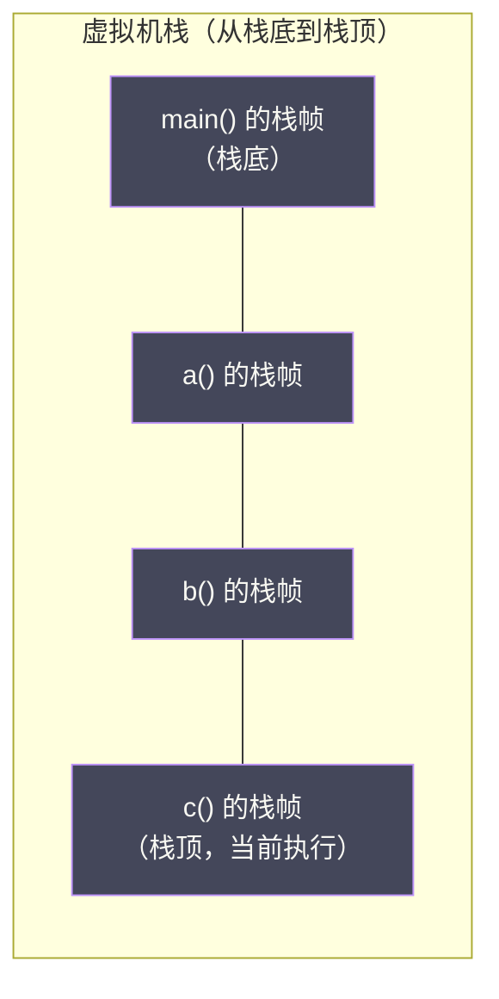
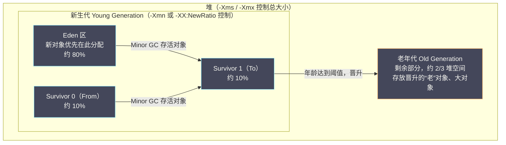
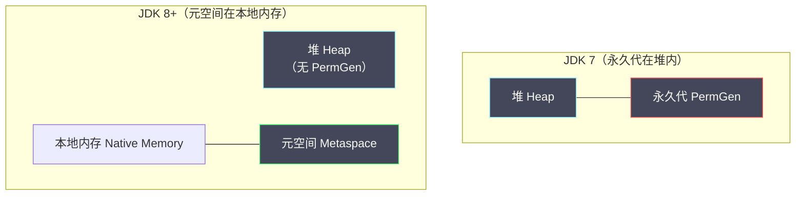

# 02 运行时数据区——堆、栈、方法区的内存布局

> [!abstract] 摘要
> JVM 规范定义了六块运行时数据区（Run-Time Data Areas），它们共同支撑 Java 程序的执行：**程序计数器**（当前指令地址）、**虚拟机栈**（方法调用帧）、**本地方法栈**（JNI 方法帧）、**堆**（对象实例的大本营）、**方法区**（类元数据仓库）以及**运行时常量池**（方法区的子集）。本文逐一剖析每块区域的存储内容、生命周期、溢出行为（`StackOverflowError`、`OutOfMemoryError`）及其在 JDK 演进中的变化——尤其是 JDK 8 将**永久代（PermGen）替换为元空间（Metaspace）**这一关键架构变革，以及直接内存（DirectBuffer）与堆外内存的关系。文章不仅讲解"是什么"，更着重讲清每种设计背后的权衡：为什么栈要私有、为什么堆要分代、为什么方法区要走出堆外，并结合 HotSpot 源码级机制、JDK 8/11/17/21 的参数演进、生产排障案例，把这张内存地图钉实。理解它，是分析 OOM 根因、调整 JVM 参数、做性能调优的地基。

---

## 第 1 章 为什么要划分内存区域

### 1.1 没有内存分区会怎样

设想一下，如果 JVM 把所有东西都放在同一块连续的内存里——方法的字节码、对象实例、局部变量、类的元数据、本地方法状态……会发生什么？

**GC 的效率会极低**：GC 需要扫描整块内存区分"存活"和"垃圾"，而不同类型的数据有完全不同的生命周期特征——局部变量随方法返回立刻消亡，对象实例可能存活很长时间，类元数据几乎伴随整个 JVM 生命周期。混在一起，任何 GC 算法都无法高效处理。这不是纯理论推演：早期一些脚本语言解释器（如非分代实现的引用计数式运行时）正是因为对"短生命周期临时对象"和"长生命周期常驻对象"一视同仁，才在高分配速率场景下暴露出明显的吞吐瓶颈——分代假说（Weak Generational Hypothesis）的提出正是对这一问题的回应，而分代假说要成立的前提，恰恰是内存先按生命周期特征分区。

**多线程隔离无从实现**：每个线程有自己的执行上下文（当前执行到哪一行、局部变量是什么值），这些数据天然是线程私有的。如果混在全局内存里，要么需要复杂的锁来隔离，要么完全无法保证安全性。试想局部变量表如果是全局共享的一张表，任何两个线程同时调用同一个方法，都需要对这张表做互斥访问——方法调用会退化成一个串行操作，这与"方法调用应该是零协调成本的本地操作"这一基本预期背道而驰。

**内存回收策略无法针对性优化**：字节码是只读的，对象是读写的，类元数据偶尔加载/卸载——对读写特征如此不同的数据使用同一套管理策略，必然在某些维度上浪费。

划分内存区域，本质上是一种**关注点分离（Separation of Concerns）**：让不同性质的数据在各自适合的管理机制下运转，GC 只需要关注堆，线程切换只需要保存/恢复程序计数器和栈的状态，类加载/卸载只影响方法区。这也是为什么 JVM 规范（*The Java Virtual Machine Specification*）用整整一章（Chapter 2, Run-Time Data Areas）单独定义这套模型——它是理解 JVM 一切运行时行为的坐标系。

### 1.2 线程私有 vs 线程共享

JVM 的六块内存区域按线程维度分为两类：

**线程私有区域**（每个线程拥有独立的一份，随线程创建而存在，随线程销毁而消失）：
- 程序计数器（PC Register）
- 虚拟机栈（JVM Stack）
- 本地方法栈（Native Method Stack）

**线程共享区域**（所有线程共享，JVM 启动时创建，JVM 退出时销毁）：
- 堆（Heap）
- 方法区（Method Area）→ HotSpot 实现：JDK 8 前为永久代，JDK 8+ 为元空间

这个分类直接决定了线程安全的范围：局部变量在虚拟机栈（线程私有），天然线程安全；对象实例在堆（线程共享），需要并发控制。这也解释了一个常见的初学者误区——"局部变量为什么不需要加锁，而实例字段/静态字段需要"：本质原因不是"局部变量比较小"，而是它们物理上位于不同的内存区域，一个天然隔离，一个天然共享。理解了这一点，再去看 [[Java 内存模型（JMM）——happens-before 与可见性保证]] 中关于可见性问题为什么只发生在共享变量上，会豁然开朗。

> [!info] 核心概念：JVM 规范 vs HotSpot 实现
> 必须区分两个层面：**JVM 规范**定义的是"必须存在哪些逻辑区域、它们的行为约束是什么"（例如"方法区可以固定大小也可以动态扩展，可以选择不实现垃圾收集"），而**HotSpot**（以及 OpenJ9、GraalVM 等其他实现）是把这些逻辑区域映射到具体数据结构和内存管理机制的**工程实现**。同一份规范，不同厂商的实现可以有显著差异——例如方法区在 HotSpot 里先是永久代后是元空间，但在 IBM OpenJ9 里从一开始就是完全不同的“Shared Class Cache”设计。本文以 HotSpot 为讨论主体，这也是目前生产环境中最主流的实现。

下表把 JVM 规范定义的区域与 HotSpot 具体落地做一次对照，建立全局坐标：

| 规范定义区域 | 线程属性 | HotSpot 实现载体 | 是否可能 OOM | 是否受 GC 管理 |
|---|---|---|---|---|
| 程序计数器 | 私有 | CPU 寄存器/线程私有变量 | 不会 | 不涉及 |
| 虚拟机栈 | 私有 | 每线程独立的连续内存段（`-Xss`） | 会（`StackOverflowError`/`OOM`） | 不涉及（无 GC，靠栈帧出栈自动释放） |
| 本地方法栈 | 私有 | HotSpot 中与虚拟机栈合并实现 | 会 | 不涉及 |
| 堆 | 共享 | 分代/分区堆（`-Xms`/`-Xmx`） | 会（`Java heap space`） | 是（核心 GC 对象） |
| 方法区 | 共享 | JDK 8 前：永久代；JDK 8+：元空间 | 会（`PermGen`/`Metaspace`） | 是（类卸载） |
| 运行时常量池 | 共享 | 方法区的子集（字符串常量池在堆） | 会 | 部分（字符串常量池随堆 GC） |

---

## 第 2 章 程序计数器——最小的区域，最重要的状态

### 2.1 程序计数器是什么

程序计数器（Program Counter Register，PC Register）是 JVM 规范中定义的最小内存区域，**每个线程拥有一个独立的程序计数器**。它记录当前线程正在执行的**字节码指令的地址**（更准确地说，是字节码指令在方法 `Code` 属性中的偏移量）。

执行引擎每取一条字节码指令、执行完后，就通过程序计数器找到下一条指令的位置。它是 JVM 实现线程切换后**能够恢复到正确执行位置**的关键：操作系统调度线程时会中断当前线程，下次恢复执行时，靠的就是程序计数器中保存的"断点位置"。

### 2.2 为什么是线程私有的

如果多个线程共享同一个程序计数器，一旦线程 A 和线程 B 同时运行，PC 就会相互覆盖，导致线程 A 切换回来后跳到线程 B 的执行位置——这是灾难性的错误。

因此 JVM 规范规定：**程序计数器必须是线程私有的**，每个线程在任意时刻都有一个独立的 PC，互不干扰。这与操作系统层面每个线程都有独立的寄存器上下文（Context）是同一个道理——JVM 只是在字节码这一抽象层再实现了一遍相同的机制。

### 2.3 执行本地方法时 PC 未定义

当线程执行的是 Java 方法时，PC 记录字节码指令地址。但当线程执行的是**本地（native）方法**时（通过 JNI 调用的 C/C++ 代码），PC 的值是 **undefined（未定义）**。

原因：本地方法的执行不经过 JVM 的字节码解释器，而是直接在操作系统层面执行本地代码，JVM 无法控制其执行流程，因此也无法维护一个有意义的"字节码指令地址"。当本地方法调用返回、线程重新进入 Java 代码执行时，PC 会被重新赋予一个有效值。

### 2.4 唯一不会 OOM 的区域

JVM 规范明确说明：程序计数器是唯一**不会导致 `OutOfMemoryError` 的运行时数据区域**。这很容易理解——PC 只需要存储一个整数（指令地址偏移量），其大小是固定的、极小的，不会随程序运行而无限增长。

### 2.5 PC 与安全点（Safepoint）的隐藏关联

PC 看似只是一个"记录位置"的簿记结构，但它在 GC 层面还承担着一个不太显眼却极其重要的角色：HotSpot 需要判断线程当前是否处于一个"安全的"字节码位置，才能安全地暂停线程做 GC 扫描——这就是**安全点（Safepoint）**机制。JIT 编译器在生成本地代码时，会在方法调用、循环回边等固定位置插入安全点检查；解释执行时，字节码分派循环本身天然可以在每条指令之间检查是否需要进入安全点。PC 记录的位置信息，正是判断线程能否在当前指令边界安全挂起的基础依据之一。这也是为什么"死循环里没有方法调用、没有安全点检查"的代码会导致 GC 迟迟无法启动（俗称"安全点未到达"问题）——想深入这一机制，可以参考 [[对象生命周期与GC/04 垃圾回收基础——可达性分析、安全点与安全区域]]，那篇文章专门剖析了安全点和安全区域的设计动机与实现细节。

---

## 第 3 章 虚拟机栈——方法调用的完整上下文

### 3.1 虚拟机栈的基本模型

**虚拟机栈（Java Virtual Machine Stack）** 描述的是 Java 方法执行的线程内存模型：**每个方法被调用时，JVM 为其创建一个栈帧（Stack Frame）并压入当前线程的虚拟机栈；方法返回时，栈帧从栈顶弹出**。

这个模型非常直观——调用链的深度与栈的深度完全对应：

```java
void a() {
    b();  // 调用 b 时，b 的栈帧压栈
}
void b() {
    c();  // 调用 c 时，c 的栈帧压栈
}
void c() {
    // c 返回时，c 的栈帧出栈
}
```



为什么方法调用天然对应"栈"这种数据结构，而不是队列或者树？因为方法调用满足严格的**嵌套（LIFO，后进先出）**特性：谁最后调用，谁最先返回；只有当前栈顶的方法执行完，才能返回到它的调用者。这一特性和栈这种数据结构的语义完全吻合，因此 JVM（以及几乎所有主流语言运行时，包括 C 的调用栈、Go 的 goroutine 栈）都选择用栈来实现方法调用的内存模型，而不是自己再造一套链表或树结构去手工维护调用关系。

### 3.2 栈帧的内部结构

每个栈帧包含四个部分：

**局部变量表（Local Variable Table）**：存储方法参数和方法内部定义的局部变量。它是一个以字（word，JVM 中通常 4 字节或 8 字节）为单位的数组。`int`、`float`、`reference`、`returnAddress` 类型各占 1 个 Slot，`long` 和 `double` 各占 2 个 Slot。

实例方法（非 `static` 方法）的 Slot 0 始终是 `this`——这就是为什么在实例方法里可以直接使用 `this`，它其实是一个藏在局部变量表第 0 位置的隐式参数。

```java
// 对于这个方法：
public int add(int a, int b) {
    int result = a + b;
    return result;
}

// 局部变量表（实例方法，Slot 0 是 this）：
// Slot 0: this（类型 reference）
// Slot 1: a  （类型 int）
// Slot 2: b  （类型 int）
// Slot 3: result（类型 int）
```

用 `javap -v` 反编译上面的方法，可以直接看到编译器为其生成的字节码序列和局部变量表大小声明：

```text
public int add(int, int);
  Code:
    stack=2, locals=4, args_size=3
       0: iload_1
       1: iload_2
       2: iadd
       3: istore_3
       4: iload_3
       5: ireturn
```

`locals=4` 精确对应上面标注的 4 个 Slot，`stack=2` 是操作数栈的最大深度——这两个数字都是 `javac` 在**编译期静态计算**出来的，不需要运行时动态扩展，这是 JVM 栈帧结构高效的重要原因之一：栈帧的大小在方法被调用之前就已经确定，分配栈帧只需要移动一个指针，不需要运行时探测、不需要动态数组扩容。

**操作数栈（Operand Stack）**：字节码指令的"计算草稿纸"。JVM 是一个**基于栈的虚拟机**，字节码指令通过操作数栈传递操作数和返回结果。例如，`a + b` 的计算过程：`iload_1`（将 Slot 1 的 a 压栈）→ `iload_2`（将 Slot 2 的 b 压栈）→ `iadd`（弹出两个整数，相加，结果压栈）→ `istore_3`（弹出栈顶，存入 Slot 3）。

操作数栈的最大深度在编译期由 `javac` 静态计算，存储在 `Code` 属性的 `max_stack` 字段中。这种"基于栈"的字节码设计（区别于 x86 那种"基于寄存器"的指令集）换来的是极佳的**可移植性**——字节码指令不需要关心目标 CPU 到底有多少个物理寄存器，全部通过操作数栈完成数据传递，字节码验证器（Bytecode Verifier）也因此更容易静态验证栈深度和类型是否匹配，不会出现越界访问。这是牺牲了一部分执行效率（相比直接使用寄存器）换来的安全性和可移植性，JIT 编译器在把字节码翻译为本地机器码时会做**寄存器分配（Register Allocation）**，把频繁访问的操作数映射到真实的 CPU 寄存器，弥补这部分损失，这也是解释执行远慢于编译执行的原因之一，具体可参考 [[执行引擎/12 JIT 编译与逃逸分析——从解释执行到本地代码]]。

**动态链接（Dynamic Linking）**：每个栈帧都持有一个指向当前方法所在类的**运行时常量池**的引用。方法在调用其他方法时，需要通过符号引用找到目标方法——而这个符号引用正是通过动态链接到运行时常量池中解析为直接引用的。`invokevirtual`、`invokeinterface` 这类指令在运行期还要结合对象的实际类型完成**方法分派（Dispatch）**，这是虚方法多态得以实现的字节码层基础，也是每次虚方法调用都比静态方法调用略慢一分的根本原因（多了一次虚方法表查找）。

**方法返回地址（Return Address）**：方法结束（正常返回或抛出异常）时，JVM 需要知道返回到调用者的哪个位置继续执行。正常返回时，返回地址是调用者中调用指令的下一条指令；异常退出时，通过异常表（Exception Table）查找对应的异常处理器，如果当前栈帧没有匹配的处理器，则该栈帧直接出栈，异常继续沿调用链向上传播——这正是**栈展开（Stack Unwinding）**的本质，`try/catch/finally` 的字节码实现完全依赖这套异常表机制，而不是像很多人以为的"每次进入 try 块都要额外付出运行时开销"，实际上没有异常抛出时，`try` 块本身几乎零额外成本。

> [!note] 设计哲学：为什么 JVM 不支持尾调用优化（TCO）
> 很多函数式语言（Scheme、Erlang、部分 Scala 场景）依赖尾调用优化——如果一个函数的最后一步是调用自身或另一个函数，编译器可以复用当前栈帧，不必再压一个新栈帧，从而让"尾递归"不消耗额外栈空间。JVM 字节码规范里没有专门的尾调用指令，`invokestatic`/`invokevirtual` 一律会压入新的栈帧。这不是技术上做不到，而是权衡：Java 的异常栈追踪（`getStackTrace()`）、安全管理器的调用者身份检查等机制都依赖"完整保留调用链"这一假设，一旦引入尾调用优化，栈帧被复用，异常堆栈会变得不完整或难以理解，这与 Java 强调的"可调试性"直接冲突。因此，在 JVM 上写递归深度不可控的算法，永远要考虑改写为迭代，而不能依赖编译器帮你做尾调用优化——这也是 Java 无法像 Erlang/Scheme 一样天然支持无限尾递归的根本原因。

### 3.3 StackOverflowError 的根因

虚拟机栈的大小是有限的（由 `-Xss` 参数控制，默认通常 512KB~1MB，具体默认值随操作系统、位数、JDK 版本略有差异）。当方法调用深度超过栈的容量时，JVM 抛出 **`StackOverflowError`**。

最典型的场景是无限递归：

```java
// 经典的无限递归：每次调用都压一个新栈帧，直到栈空间耗尽
public void infiniteRecursion() {
    infiniteRecursion();  // 没有递归终止条件
}
// 抛出：java.lang.StackOverflowError
```

深度递归的正常代码（如遍历深度很大的树、递归解析层级很深的 JSON/XML）也可能触发此错误。解决方案：
- 将递归改为迭代（手动维护栈，用堆内存代替栈内存，规避 `-Xss` 的硬限制）
- 增大 `-Xss`（如 `-Xss2m`，但会增加每个线程的内存占用，系统总线程数会减少）
- 减少每个栈帧的体量——例如减少方法内的局部变量数量、避免在递归路径上传递大对象引用链（虽然引用本身只占一个 Slot，但过多的局部变量会增加每一帧的固定开销）

> [!warning] 生产避坑：`-Xss` 影响的是每个线程的栈，不是全局总量
> `-Xss` 影响的是**每个线程**的栈大小，不是总大小。如果系统有 500 个线程，`-Xss2m` 意味着仅栈就消耗约 1GB。线程数多的应用，盲目增大 `-Xss` 可能导致系统内存耗尽，甚至在创建新线程时因无法为其保留足够的栈内存空间而直接抛出 `java.lang.OutOfMemoryError: unable to create new native thread`——这是一个经常被误诊的错误：看到"OutOfMemoryError"就以为是堆不够，实际上很多时候是操作系统层面已经没有足够的连续虚拟地址空间/物理内存为新线程分配栈，根因往往是线程数远超合理范围（例如线程池配置不当、每个请求都新建线程）。首先应该消除不必要的深递归和过度创建线程的问题，而不是靠增大栈空间或线程数上限掩盖问题。

### 3.4 栈溢出与线程数的相互制约：一道简单的算术题

栈内存的总占用可以简化为一个恒等式：`总栈内存 ≈ 线程数 × -Xss`。这意味着 `-Xss` 和最大线程数在系统总内存的约束下是相互制约的两个变量——这也是为什么在容器化环境（例如给了 2GB 内存限制的 Pod）里，一个应用如果同时配置了较大的 `-Xss`（比如 4MB）和较大的线程池（比如 500 个线程），仅线程栈就要预留 2GB，堆和元空间根本没有空间可用，容器会被 OOM Killer 直接杀掉，而 JVM 内部却可能连一次 `OutOfMemoryError` 日志都没打出来——因为 JVM 进程是被操作系统信号强制终止的，不是 JVM 自身检测到堆分配失败后主动抛出异常。排查这类问题时，`jstack` 拿到线程数、`-Xss` 乘一下，往往就能快速定位问题范围。

### 3.5 虚拟机栈与其他语言运行时的对比视角

把视野放开一点看，"线程栈是否可以动态增长"是不同语言运行时设计上一个显著的分歧点。HotSpot 的虚拟机栈是**创建时一次性分配、固定大小、不可增长**的（栈满即报错），这是一种简单但不够灵活的设计。相对地，Go 的 goroutine 栈初始只有几 KB，运行时会在检测到栈空间不足时自动分配一块更大的内存、把旧栈内容拷贝过去（可增长的分段栈/连续栈），因此 Go 可以轻松创建数十万个 goroutine 而不必为每个都预留几百 KB 到几 MB 的固定空间。JVM 之所以没有走这条路，本质原因是 Java 方法栈帧里包含大量指向堆对象的引用，一旦栈整体搬迁，所有指向栈内数据的指针都要更新，这在 HotSpot 现有的对象模型和 JIT 编译产物假设下改造成本极高；这也正是 [[并发编程/JUC工具/16 JDK 21 虚拟线程——Project Loom 的协程实现与平台线程的边界]] 里虚拟线程要解决的核心问题之一——虚拟线程通过在堆上维护可增长的"续体栈"（Continuation栈），绕开了传统平台线程栈"固定大小、创建成本高"的限制，让海量并发协程成为可能。

---

## 第 4 章 堆——所有对象的大本营

### 4.1 堆是 JVM 内存管理的核心

**Java 堆（Heap）** 是 JVM 内存中最大的一块，也是 GC 管理的核心区域。JVM 规范的规定非常简洁：**所有对象实例（`new` 出来的对象）以及数组，都在堆上分配**（逃逸分析支持下的标量替换是一种编译期优化，本质是让部分对象根本不进入堆，属于例外而非规则，参见 [[执行引擎/12 JIT 编译与逃逸分析——从解释执行到本地代码]]）。

堆在 JVM 启动时创建，通过 `-Xms`（初始大小）和 `-Xmx`（最大大小）控制。当堆中没有足够空间为新对象分配内存，且 GC 也无法回收足够空间时，抛出 `java.lang.OutOfMemoryError: Java heap space`。

### 4.2 堆的分代布局

现代 JVM 的堆并非一个简单的连续内存块，而是按**分代假说**划分为不同区域，不同回收器的划分方式略有差异：

**经典分代布局（Serial、Parallel、CMS、G1 均适用）**：



Eden : Survivor0 : Survivor1 默认比例为 8 : 1 : 1（由 `-XX:SurvivorRatio=8` 控制）。

**为什么要有两个 Survivor 区（From 和 To）？**

这是**复制算法**的要求。Minor GC 时，Eden 和 From Survivor 中存活的对象被复制到 To Survivor（To 是空的），复制后 Eden 和 From 全部清空。下次 GC 时，From 和 To 的角色对调。这样始终有一块 Survivor 是空的（作为复制目标），避免了内存碎片，但也意味着始终有约 10% 的新生代空间被"浪费"作为复制缓冲区。这个设计的深层动机在 [[对象生命周期与GC/05 垃圾回收算法——标记清除、复制、标记整理与分代假说]] 中有更系统的推导：复制算法用空间换时间，用"始终留一块空闲区"的代价，换来了"不需要维护空闲链表、分配效率极高（指针碰撞即可）"的收益，而这笔交易在新生代场景下之所以划算，恰恰是因为分代假说预测新生代里绝大多数对象都会在一次 GC 中死亡——需要复制的存活对象占比很低，复制成本可控。

**大对象直接进入老年代**：超过 `-XX:PretenureSizeThreshold`（Parallel GC 默认 0，即不限制；G1 通过 Humongous Region 处理）的大对象直接分配在老年代，避免在 Eden 和 Survivor 之间来回复制（大对象复制代价高）。

**年龄晋升机制**：对象在 Survivor 区中每经历一次 Minor GC 存活，年龄（Age）加 1。年龄达到 `-XX:MaxTenuringThreshold`（默认 15）时，对象晋升（Promotion）到老年代。HotSpot 还有一个动态判断机制——**动态年龄计算（Dynamic Age Determination）**：如果 Survivor 区中同年龄所有对象大小总和超过 Survivor 空间的一半，年龄大于或等于该年龄的对象就会直接晋升老年代，不必等到 15 岁，这是为了避免 Survivor 区因为存活对象过多而在下一次 GC 前就被撑满，属于一种自适应的"早晋升"保护机制。

**G1 的分区（Region）视角**：从 G1 开始，堆不再是"新生代一块连续内存、老年代一块连续内存"的物理划分，而是被切分为大小相等的若干 Region（默认 1MB~32MB 之间，`-XX:G1HeapRegionSize` 可调），每个 Region 在逻辑上被动态标记为 Eden、Survivor、Old 或 Humongous（专门存放大对象），新生代和老年代不再是固定比例的连续物理区域，而是若干 Region 的逻辑集合，这也是 G1 敢于宣称"停顿时间可预测"的基础——每次回收挑选哪些 Region 是可以按预算灵活调度的。ZGC 和 Shenandoah 更进一步，长期弱化甚至取消传统意义上的"分代"概念（ZGC 在较新版本中也引入了分代 ZGC，但设计动机与传统分代 GC 不同），这部分内容分别在 [[对象生命周期与GC/07 G1 收集器——Region 化内存与混合回收]]、[[对象生命周期与GC/08 ZGC——亚毫秒停顿的着色指针与读屏障]]、[[对象生命周期与GC/09 Shenandoah——与 ZGC 殊途同归的并发压缩]] 中展开，本文只在"堆是什么"这个层面给出概览，避免与后续专题重复。

### 4.3 堆内存的动态扩缩

JVM 堆的实际大小在 `-Xms` 到 `-Xmx` 之间动态调整：
- 当内存紧张时，JVM 向操作系统申请更多内存（扩容），最大不超过 `-Xmx`
- 当大量对象被 GC 回收后，JVM 会将多余的内存归还操作系统（缩容），最小不低于 `-Xms`

> [!note] 设计哲学
> 生产环境通常建议将 `-Xms` 和 `-Xmx` 设置为相同值（如 `-Xms4g -Xmx4g`），避免堆的动态扩缩带来的性能抖动——每次扩缩都涉及操作系统的内存申请/释放，会触发一次 Full GC（或者至少是一次代价不小的重新计算）。固定堆大小后，JVM 启动时就申请好所有内存，运行时不再变动。这一策略对 G1/CMS 等分代回收器尤为重要；但要注意，JDK 12 引入的 Shenandoah 与部分场景下的 G1（`-XX:-ShrinkHeapInSteps` 等参数配合）已经支持更平滑的堆自动收缩（Elastic Heap），容器化场景下适度允许堆收缩、把内存还给宿主机，反而有助于同机部署的其他服务的资源利用率——是否固定堆大小，本质上是"稳定性优先"还是"资源利用率优先"的取舍，不存在放之四海而皆准的答案。

### 4.4 TLAB——线程私有的分配缓冲区

在堆上分配对象，最简单的实现是**指针碰撞（Bump-the-Pointer）**：维护一个指针指向堆中空闲区域的起始位置，每次分配就将指针向后移动对象大小的距离。这个方案的前提是堆内存必须是规整的（没有碎片），这也是为什么指针碰撞只适用于 Eden 区这类使用复制算法、GC 后必然规整的区域，而不适用于用标记-清除算法管理、可能存在碎片的老年代（老年代分配走的是**空闲列表（Free List）**方式，需要维护一个记录哪些内存块可用的列表，分配时查找合适大小的块）。

但多线程并发分配时，指针碰撞这个指针的移动必须是线程安全的——如果 1000 个线程同时分配对象，每次都要对这个指针进行 CAS 操作，竞争会非常激烈，尤其是在高并发、高分配速率场景下（例如每个请求都会创建大量临时对象的 Web 服务），这个共享指针会成为一个隐形的全局热点，所有线程的分配路径都要挤过这一个 CAS 操作，吞吐会随线程数增加迅速见顶甚至下降。

解决方案是 **TLAB（Thread-Local Allocation Buffer，线程本地分配缓冲）**：

JVM 为每个线程在 Eden 区预先划分一小块私有区域（通常几十 KB 到几百 KB，具体大小由 JVM 根据历史分配速率自适应调整），线程在自己的 TLAB 中分配对象时，不需要任何锁或 CAS——因为只有这个线程会写这块区域，分配退化为一次纯粹的指针加法，没有任何跨线程同步开销。只有当 TLAB 用完、需要申请新 TLAB 时，才需要对 Eden 区的全局指针做一次 CAS（但这个频率远低于每次对象分配，通常是几十到几百次分配才触发一次）。


从 HotSpot 源码的角度看（`src/hotspot/share/gc/shared/tlab_allocation.hpp`、`memAllocator.cpp` 一带），对象分配的快速路径大致遵循这样的判断顺序：先尝试在当前线程的 TLAB 里做指针碰撞分配；如果 TLAB 剩余空间不足以容纳新对象，则判断是否值得为该线程重新申请一块新 TLAB（依据对象大小与 TLAB 剩余空间的比例，避免浪费太多剩余空间），如果值得就申请新 TLAB 并在新 TLAB 里分配；如果对象过大或不值得重新申请 TLAB，则退化为直接在共享 Eden 区做一次全局 CAS 分配；如果 Eden 区已经不足，则触发 Minor GC。这一整套"快路径优先、逐级降级"的设计思路，也是理解很多 JVM 内部分配决策（不止是 TLAB）的通用范式——尽力让高频路径无锁化、无竞争化，把同步开销压到低频的边界情况上。

通过 `-XX:+UseTLAB`（JDK 8+ 默认开启）启用 TLAB，`-XX:TLABSize` 设置每个 TLAB 的初始大小，`-XX:+ResizeTLAB`（默认开启）允许 JVM 根据实际分配情况自适应调整 TLAB 大小。

> [!warning] 生产避坑：TLAB 不是没有代价
> TLAB 提升了分配吞吐，但也带来一个容易被忽视的副作用——**内存碎片/浪费**。当一个线程的 TLAB 剩余空间不足以分配下一个对象，又没有达到"值得申请新 TLAB"的阈值时，剩余空间会被直接废弃（填充一个占位对象，或者简单标记为不可用），成为一种"内部碎片"。线程数越多、TLAB 越大，这种浪费的比例可能越高。这也是为什么在线程数极多的场景（比如老式的"每请求一线程"模型），适度调小 `-XX:TLABSize` 或依赖自适应调整（保持 `-XX:+ResizeTLAB` 默认开启）通常比手工强行调大更稳妥。

### 4.5 堆内存溢出的排查范式

`java.lang.OutOfMemoryError: Java heap space` 的常见根因可以粗略分为两类：真的需要更大的堆（业务数据量增长超过历史容量规划），或者存在对象无法被回收的**内存泄漏**（静态集合无限增长、缓存没有淘汰策略、监听器/回调注册后未反注册、`ThreadLocal` 未清理导致的间接持有等）。区分这两类问题的标准做法是抓取堆 Dump（`-XX:+HeapDumpOnOutOfMemoryError` 配合 `-XX:HeapDumpPath` 让 OOM 发生时自动落盘），再用 Eclipse MAT（Memory Analyzer Tool）之类的工具做"支配树（Dominator Tree）"分析——如果占用内存最大的对象是业务预期内的正常数据（比如确实缓存了海量用户会话且都在合理范围内），说明是容量规划问题；如果发现某个理论上应该早已失效的对象（比如已关闭的连接、已下线用户的会话）依然存在于 GC Roots 可达路径上，说明是内存泄漏，需要顺着支配树找到"是谁在持有它"的引用链。更完整的排障流程与常见泄漏模式（含 `ThreadLocal` 引发的经典案例）在 [[JVM实战/13 JVM 内存问题实战——OOM、内存泄漏与堆外内存]] 中有专门的实战剖析，这里不再展开重复。

---

## 第 5 章 方法区与元空间——类的元数据仓库

### 5.1 方法区存储什么

**方法区（Method Area）** 是 JVM 规范定义的一个逻辑概念——存储已被加载的**类型信息**，具体包括：

- **类的全限定名**（`com.example.HelloWorld`）
- **父类信息**（每个类都有对 `java.lang.Object` 的引用链）
- **接口列表**（该类实现了哪些接口）
- **字段描述符**（字段名、类型、访问标志）
- **方法描述符**（方法签名、返回类型、字节码、异常表）
- **运行时常量池**（符号引用、字面量常量）
- **JIT 编译后的代码缓存**（在 HotSpot 中，这部分实际上位于独立的 Code Cache 区域，而非严格意义上的方法区/元空间，本文单独列出以避免与常见误解混淆）

一句话：**方法区是类的"身份证"存放地**。每加载一个类，其元数据就会进入方法区，并在整个 JVM 生命周期内（或类被卸载之前）持续存在。方法区的这些元数据，本质上是 [[类加载器/10 类加载机制——双亲委派模型与打破它的场景]] 中"加载（Loading）"阶段的产物——类加载器读取 Class 文件字节流后，解析出的类型信息正是被安放到方法区里，方法区可以理解为类加载流程的"落脚点"。

在 HotSpot 具体实现中，这些元数据被组织为一族 `Klass` 及其子类（`InstanceKlass`、`ArrayKlass` 等 C++ 对象），每个 Java 类对应一个 `InstanceKlass` 实例，其中保存着方法表（vtable/itable，用于虚方法分派）、字段布局信息、常量池指针等——这也是为什么"类"本身在 JVM 内部也是一种"对象"（元对象），只是它存在于方法区而非堆，与 `java.lang.Class` 实例（存在于堆上，是给 Java 层反射 API 使用的镜像）是两个不同但相互关联的东西：`Class` 对象内部持有一个指向对应 `Klass` 结构的指针。

### 5.2 永久代（PermGen）：JDK 8 之前的实现

在 HotSpot JDK 8 之前，方法区被实现为**永久代（Permanent Generation，PermGen）**，它是**堆内的一块固定区域**，由 JVM 的 GC 统一管理。

相关 JVM 参数：
- `-XX:PermSize=64m`：永久代初始大小
- `-XX:MaxPermSize=256m`：永久代最大大小

永久代的问题：
- **大小难以预估**：应用加载的类越多，PermGen 需要越大；动态生成类（如 Spring AOP、CGLib 动态代理、JSP 编译）会持续增加 PermGen 占用
- **频繁 OOM**：`java.lang.OutOfMemoryError: PermGen space` 是当年 Java 企业应用最常见的错误之一，尤其在频繁重部署的 Tomcat 应用中（每次重部署旧类不能被卸载，PermGen 越来越满，这个现象俗称"类加载器泄漏"，本质是旧的 `WebAppClassLoader` 及其加载的全部类无法被 GC 回收，因为总有某个静态引用、未关闭的线程、JDBC 驱动的注册表等悬空引用指向旧类加载器）
- **GC 效率差**：永久代的 GC 触发条件苛刻，且回收效率低（大多数类元数据不能被回收，因为一个类是否可以被卸载，要求它的类加载器、`Class` 对象、所有实例都不可达，这个条件相当严格）
- **与堆共享空间带来的连带影响**：永久代紧张时的扩容/回收动作往往触发 Full GC，即便堆本身还有充裕空间，也会因为方法区不够而被拖累。

### 5.3 元空间（Metaspace）：JDK 8 的重大重构

JDK 8 彻底移除了永久代（[JEP 122: Remove the Permanent Generation](https://openjdk.org/jeps/122)），引入**元空间（Metaspace）**作为方法区的新实现，元空间有一个根本性的变化：**它不再是堆的一部分，而是存储在本地内存（Native Memory）中，由操作系统直接管理**。



**元空间的优势**：

1. **几乎无界限**：默认情况下，元空间的上限是系统可用内存（操作系统会按需分配），不再受 JVM 参数的人为限制。`java.lang.OutOfMemoryError: PermGen space` 这个错误从此消失。
2. **更高效的内存分配**：元空间使用本地内存分配器（类似 `malloc` 的机制，具体是 HotSpot 自己实现的 Chunk/Block 两级分配器），远比在堆中管理一个固定区域更灵活——不再受堆 GC 算法（复制/标记-整理）的约束。
3. **GC 解耦**：元空间的回收（类卸载）不再与堆 GC 强耦合，减少了 Full GC 的触发因素——但要注意，元空间达到阈值仍然会触发一次 Full GC 尝试卸载不再使用的类，只是不再像永久代那样与年轻代/老年代的 GC 策略绑定在一起。

**为什么移除永久代不是简单的"挪个位置"，而是一次重构**：把方法区从堆搬到本地内存，表面上看只是换了个存储位置，实质上是解耦了两套完全不同的资源管理哲学——堆的大小受 `-Xmx` 硬限制，且分代 GC 算法要求堆内数据具有相对可预测的移动/整理成本；而类元数据这类"数量不确定、但单个对象生命周期通常很长、几乎不需要移动"的数据，用堆的分代算法管理反而是一种错配。搬到本地内存后，类元数据的分配可以直接采用更贴近其访问特征的独立分配器，且不再因为方法区紧张而拖累整个堆的 GC 决策。这也印证了本文开篇提到的"关注点分离"原则——JDK 8 这次重构本质上是把之前"图省事合并管理"的方法区，重新拆分到了一个更契合它特性的管理域。

**元空间的控制参数**（JDK 8+）：
- `-XX:MetaspaceSize=64m`：元空间初始大小（同时也是触发第一次 GC 尝试类卸载的阈值）
- `-XX:MaxMetaspaceSize=256m`：元空间上限（不设置则无上限，存在"悄悄耗尽系统内存"的风险）
- `-XX:MinMetaspaceFreeRatio=40`：GC 后元空间最小空闲比例，低于此则扩容
- `-XX:MaxMetaspaceFreeRatio=70`：GC 后元空间最大空闲比例，高于此则缩容

> [!warning] 生产避坑：不设上限的元空间是定时炸弹
> 不设置 `-XX:MaxMetaspaceSize` 时，如果程序存在类加载泄漏（如某些字节码生成框架的 Bug 导致动态类不断被生成但无法卸载，典型场景包括 Groovy 脚本引擎反复编译、某些低质量的 ORM/序列化框架为每个类型都动态生成一个新类而不做缓存），元空间会不断增长直到耗尽物理内存，导致系统 OOM 或 JVM 崩溃，且没有明显的 JVM 级别错误提示——因为进程可能是被操作系统 OOM Killer 直接杀死的，日志里连一行 Java 堆栈都不会留下。**生产环境务必设置 `-XX:MaxMetaspaceSize` 上限，配合监控告警**，一旦元空间使用率异常增长，第一时间用 `jcmd <pid> VM.classloader_stats`（JDK 9+）或 `jcmd <pid> GC.class_stats` 排查是否存在类加载泄漏。

### 5.4 类的卸载条件与 CDS/AppCDS

类的卸载不是"没人用了就立刻回收"，而是有严格前提：该类的类加载器实例、该类对应的 `Class` 对象、该类的所有实例，三者都必须不可达（Unreachable）。这是很多"内存泄漏其实是类加载器泄漏"问题的根源——只要类加载器本身被某个静态字段、未销毁的线程、JDBC 驱动的全局注册表等意外持有，它加载的所有类（哪怕业务代码逻辑上早已不再使用）都无法被卸载，元空间占用只会单向增长。

为了缓解类加载和元空间管理的开销，HotSpot 从 JDK 5 就引入了 **CDS（Class Data Sharing，类数据共享）**：把一部分 JDK 核心类的元数据预先解析并序列化到一个共享归档文件（`classes.jsa`），多个 JVM 进程启动时可以直接内存映射（`mmap`）这个共享文件，避免重复解析和加载，缩短启动时间、降低多进程场景下的内存占用。JDK 10 引入 **AppCDS（Application Class Data Sharing）**，把这一能力扩展到应用自己的类，不再局限于 JDK 内置类；JDK 12 进一步简化了 AppCDS 的使用流程（`-Xshare:dump` 生成、`-XX:SharedArchiveFile` 指定归档文件）；JDK 19 引入的 **动态 CDS 归档（Dynamic CDS Archive，JEP 350）** 允许在应用退出时自动生成包含应用类的归档，进一步降低了使用门槛；这条技术演进线也是 GraalVM Native Image、Project Leyden 等"缩短 JVM 冷启动时间"探索方向的重要背景——CDS/AppCDS 本质上是把方法区的构建过程"提前"到了一个可以离线复用的产物里，属于典型的空间换时间。

### 5.5 运行时常量池

**运行时常量池（Runtime Constant Pool）** 是方法区的一部分，它是 Class 文件中常量池（Constant Pool Table）的运行时形式。

Class 文件的常量池存储的是**静态的符号引用**（字符串形式的类名、方法名），在类加载后，JVM 会将这些符号引用解析为**直接引用**（内存地址/偏移量），解析后的结果存入运行时常量池——这个"符号引用 → 直接引用"的转换过程，正是 [[类加载器/10 类加载机制——双亲委派模型与打破它的场景]] 中"链接（Linking）"阶段"解析（Resolution）"子步骤所做的事情，运行时常量池就是这个转换结果的存放地，前后两篇文章在这一点上是同一个机制的两个观察角度。

**字符串常量池（String Pool）** 是一个特殊的运行时常量池，用于存储字符串字面量的唯一副本，实现字符串**驻留（Interning）**：

```java
String a = "hello";         // 字面量，存入字符串常量池
String b = "hello";         // 从常量池取，与 a 是同一对象
String c = new String("hello"); // 在堆上新建，不是常量池中的对象

System.out.println(a == b);  // true：同一常量池引用
System.out.println(a == c);  // false：不同对象
System.out.println(a == c.intern()); // true：intern() 返回常量池中的引用
```

**字符串常量池的位置演进**：
- JDK 6：在永久代中
- JDK 7：**迁移到堆中**（这是 JDK 7 的重要变化，减少了 PermGen 的压力，字符串常量可以被 GC 回收，也让"手动调用 `intern()` 缓存高重复率字符串以省内存"这类优化手段变得更安全——放在永久代时空间有限，滥用 `intern()` 反而容易撑爆永久代；迁移到堆后，回收压力被转移到了空间更充裕、GC 更成熟的堆分代体系里）
- JDK 8+：继续在堆中（元空间只包含类元数据，字符串常量池依然在堆上）

### 5.6 JDK 8 / 11 / 17 / 21 方法区相关演进速览

方法区/元空间的机制在 JDK 8 定型之后，后续版本主要是围绕辅助能力（CDS 完善度、诊断工具）在持续优化，核心分配模型没有再发生量级的重构。下表汇总几条主线的演进脉络，供版本选型和排障时参考（部分默认值随发行版、操作系统不同存在差异，生产环境请以 `java -XX:+PrintFlagsFinal -version` 的实际输出为准，不要依赖记忆中的数字）：

| 特性 | JDK 8 | JDK 11 | JDK 17 | JDK 21 |
|---|---|---|---|---|
| 方法区实现 | 元空间（本地内存） | 元空间 | 元空间 | 元空间 |
| CDS | 仅内置类（`-Xshare`） | 支持，工具链更完善 | 支持，含更多默认归档内容 | 支持，`-XX:+AutoCreateSharedArchive`（JEP 350 之后进一步简化） |
| AppCDS | JDK 10 引入（不在 8 中） | 支持，需手工 dump | 支持，工具更成熟 | 支持，动态归档更普及 |
| 类卸载诊断 | 依赖 `jmap`/GC 日志 | `jcmd VM.classloader_stats` 更完善 | 持续增强 | 持续增强，结合 JFR 事件更丰富 |
| 默认 GC 与元空间联动 | Parallel GC 为默认 | G1 为默认 | G1 为默认 | G1 为默认（分代 ZGC 逐步成熟） |

> [!note] 设计哲学：为什么元空间之后没有再来一次"大搬家"
> 永久代到元空间是一次架构级的搬迁，是因为永久代的问题是结构性的——把生命周期特征完全不同的数据强行塞进堆 GC 体系。元空间把方法区放到了正确的管理域之后，剩下的问题（比如类加载泄漏导致的元空间膨胀）本质上是**使用问题**而不是**架构问题**——框架滥用动态类生成、类加载器没有被正确释放，这些是应用层或框架层的责任，不是靠再一次搬迁内存区域能解决的。这也是为什么后续版本的演进方向转向了 CDS/AppCDS 这类"减少重复工作、加速启动"的辅助能力，而不是再造一次方法区的存储模型。

---

## 第 6 章 本地方法栈——JNI 的专属区域

**本地方法栈（Native Method Stack）** 与虚拟机栈的作用类似，区别在于：虚拟机栈为 Java 方法的执行服务，本地方法栈为**本地（Native）方法**（用 C/C++ 实现的方法，通过 JNI 调用）的执行服务。

在 HotSpot VM 中，虚拟机栈和本地方法栈**合二为一**，没有单独实现一个本地方法栈——这是 JVM 规范特意留出的灵活性："本地方法栈的具体实现方式由虚拟机自行决定"，HotSpot 选择了最简单的方案：既然本地方法调用本质上也是在操作系统的调用栈上执行 C/C++ 代码，直接复用同一段线程栈内存即可，没必要再额外维护一块独立区域。

本地方法栈也可以抛出 `StackOverflowError`（本地方法调用链过深）和 `OutOfMemoryError`（本地方法栈无法扩展）。JNI 调用是 Java 与本地代码交互的边界，也是排查一些"诡异"崩溃（例如 `SIGSEGV` 导致的 `hs_err_pid*.log` 崩溃日志，而不是干净的 Java 异常）时首先要怀疑的对象——纯 Java 代码的错误会被 JVM 妥善捕获为异常，而本地代码里的野指针、缓冲区越界等问题，往往直接让整个进程崩溃，这也是为什么生产环境中引入带有 JNI 组件的第三方库（例如某些压缩库、图像处理库、老式数据库驱动）时要格外谨慎，出问题时 JVM 自身的诊断手段（`jstack`、堆 Dump）往往无能为力，需要借助操作系统级的 core dump 分析。

---

## 第 7 章 直接内存——堆外的隐形内存

### 7.1 直接内存不是 JVM 规范定义的区域

**直接内存（Direct Memory）** 不属于 JVM 规范定义的运行时数据区，而是 JVM 进程通过 `sun.misc.Unsafe` 或 NIO 的 `ByteBuffer.allocateDirect()` 在 **JVM 堆之外、操作系统内存中**直接分配的内存。

### 7.2 为什么 NIO 需要直接内存

传统的 Java IO（BIO）通过 JVM 堆上的 `byte[]` 缓冲区进行数据传输：

```text
网络/磁盘 → 内核缓冲区 → JVM 堆内 byte[] → Java 程序处理
                             ↑
                          需要一次额外的数据拷贝
```

这里存在一次**不必要的数据复制**：数据从内核缓冲区复制到 JVM 堆上的 Java 数组，才能被 Java 程序读取。而 GC 可能随时移动堆上的对象（压缩整理），所以 JVM 必须先将数据复制到一个 GC 无法移动的堆外内存，再供 JNI 读取，这又是一次复制——本质原因是操作系统的 DMA（直接内存访问）传输要求目标内存地址在传输期间必须固定不变，而堆内对象的地址会因为 GC 移动对象而随时变化，操作系统内核完全不知道 JVM 什么时候会挪动这块内存，因此不能把堆内地址直接交给内核做 DMA。

NIO 的直接内存（DirectByteBuffer）通过在 **JVM 堆外**分配缓冲区，让内核可以直接将数据放入这个缓冲区（因为堆外内存地址不会被 GC 移动，是一段稳定的本地内存），省去了额外的复制：

```text
网络/磁盘 → 直接内存（DirectByteBuffer）→ Java 程序处理（通过 ByteBuffer API）
                  ↑
           内核可以直接 DMA，无需额外复制
```

这是 Netty 大量使用 DirectByteBuffer 的核心原因——减少内存拷贝次数，降低 IO 延迟。这一机制在 [[Java NIO基础——Channel、Buffer、Selector三大组件]] 与 [[ByteBuf——引用计数、池化与零拷贝]] 中有更贴近 Netty 具体实现的展开，这里只从 JVM 内存区域的视角说明"为什么需要它、它在哪"。

### 7.3 直接内存的分配与回收机制

`DirectByteBuffer` 对象本身是一个很小的 Java 堆对象，它只持有一个指向堆外内存的地址（`long address`），真正的数据缓冲区在堆外。这带来一个容易被忽视的问题：**堆外内存的回收不受堆 GC 直接触发**——`DirectByteBuffer` 对象在堆上被回收（成为垃圾）后，JVM 需要额外的机制去释放它对应的那块堆外内存，否则堆外内存会持续增长而堆内存却显示"正常"。

在较早期的实现中，这个额外机制依赖 `sun.misc.Cleaner`（`PhantomReference` 的一个特化子类）：创建 `DirectByteBuffer` 时会同时注册一个 `Cleaner`，当该 `DirectByteBuffer` 对象在堆上被 GC 判定为不可达后，对应的 `Cleaner` 会被加入引用队列，由一个专门的清理线程调用 `free()` 释放堆外内存。这意味着**堆外内存的释放，间接依赖于堆内那个小对象被 GC 回收**——如果堆内存本身很充裕、迟迟不触发 GC，堆外内存的清理也会被相应拖延，这正是很多"堆内存看着挺健康，但物理内存/RSS 却持续飙升"问题的根源。JDK 9 之后，`java.lang.ref.Cleaner`（公开 API）逐步取代了内部的 `sun.misc.Cleaner`，机制原理相同，只是暴露了标准化的公共接口方便应用自己实现类似的资源清理模式。

Netty 等高性能框架为了绕开"依赖 GC 才能回收堆外内存"这一不确定性，普遍采用**引用计数（Reference Counting）+ 内存池（Pooled Allocator）**的方案，由业务代码显式调用 `release()` 主动归还内存，而不是被动等待 GC——这一权衡的具体设计在 [[Netty内存管理——jemalloc算法在Java中的实现]] 中有专门剖析。

### 7.4 直接内存的 OOM

直接内存不受 `-Xmx` 控制，它受 `-XX:MaxDirectMemorySize`（默认与 `-Xmx` 相同）限制。当直接内存超过此限制或系统物理内存不足时，抛出：

```text
java.lang.OutOfMemoryError: Direct buffer memory
```

直接内存 OOM 的特征：
- 堆内存使用率正常（Heap 不满，甚至可能 GC 后使用率很低）
- 系统物理内存（RSS）使用率高，与 JVM 进程通过 `jstat`/`jmap` 观察到的堆占用明显不匹配
- 通过 `-Xlog:gc` 或 `jcmd <pid> VM.native_memory`（需要先用 `-XX:NativeMemoryTracking=summary` 或 `detail` 开启 NMT）可以观察到 `Internal`/`Other` 类别内存显著增长

> [!warning] 生产避坑：容器内存限制下的直接内存
> 在容器化部署中，如果只按 `-Xmx` 估算容器内存需求（例如给容器分配了正好等于 `-Xmx` 的内存），完全没有为直接内存、元空间、线程栈、Code Cache 预留额外空间，即便 Java 堆本身运行良好，容器依然可能因为直接内存或其他堆外结构的累积占用被 cgroup OOM Killer 杀死——这是一类典型的"JVM 内部没有任何 OOM 日志，进程却突然消失"的疑难问题。稳妥的做法是容器内存至少给到 `-Xmx` 的 1.3~1.5 倍作为缓冲（具体系数因应用而异，需结合 NMT 实测数据），并显式设置 `-XX:MaxDirectMemorySize`、`-XX:MaxMetaspaceSize` 等上限参数，让每一块内存的边界都是明确的、可预算的，而不是留给操作系统兜底。这一类排障案例在 [[JVM实战/13 JVM 内存问题实战——OOM、内存泄漏与堆外内存]] 中有完整的实测复盘。

---

## 第 8 章 各区域的 OOM 类型与排查方向

| 内存区域 | OOM 类型 | 常见原因 | 排查工具 |
| :--- | :--- | :--- | :--- |
| **堆** | `Java heap space` | 对象泄漏（静态集合、缓存无限增长）、堆太小 | `jmap -heap`、MAT、堆 Dump 分析 |
| **元空间** | `Metaspace`（JDK 8+）| 类加载泄漏（动态生成类不断增加）| `jcmd VM.metaspace`、JFR ClassLoading 事件 |
| **虚拟机栈** | `StackOverflowError` | 无限递归、深递归 | 异常栈跟踪 |
| **虚拟机栈** | `OOM: unable to create new native thread` | 线程数过多（每个线程都占用栈内存） | `jstack`、OS `ps -ef` |
| **直接内存** | `Direct buffer memory` | NIO 缓冲区未及时释放 | `jcmd VM.native_memory`、NMT |
| **代码缓存** | `OOM: Code Cache is full` | JIT 编译缓存满（`-XX:ReservedCodeCacheSize` 太小）| JFR CompilerEvent |

面对一个陌生的 `OutOfMemoryError`，比记住上面这张表更重要的是养成固定的排查动作序列：第一步永远是看清 `OutOfMemoryError` **后面跟的那句提示文本**（`Java heap space`/`Metaspace`/`Direct buffer memory`/`unable to create new native thread`……），这句文本直接指明了是哪一块内存区域耗尽，避免不假思索地就往"堆内存不够"这一个方向排查；第二步是结合监控历史数据判断这是一次**渐进式增长**（更可能是泄漏）还是**瞬时脈冲**（更可能是流量突增或某次批处理任务超出预期）；第三步才是根据区域类型选用对应工具进入具体分析（堆 Dump、NMT、jstack 等）。这个"先分类、再定性、后深挖"的顺序，能显著减少排查初期的方向性错误。

---

## 第 9 章 关键 JVM 参数速查

| 参数 | 含义 | 默认值 | 建议 |
| :--- | :--- | :--- | :--- |
| `-Xms` | 堆初始大小 | 物理内存 1/64（受平台与发行版影响，仅供参考） | 与 `-Xmx` 设置相同，避免动态扩缩 |
| `-Xmx` | 堆最大大小 | 物理内存 1/4（受平台与发行版影响，仅供参考） | 一般设置为容器内存的 50%~75% |
| `-Xss` | 每个线程的栈大小 | 数百 KB 到 1MB 量级（平台相关，请以实测为准） | 深递归场景可调至 2m~4m，注意总线程数 |
| `-Xmn` | 新生代大小 | 约堆的 1/3（受 `-XX:NewRatio` 影响） | G1 时通常不需要手动设置 |
| `-XX:MetaspaceSize` | 元空间初始触发 GC 大小 | 因 JDK 版本与平台而异 | 容器化应用建议显式设置，减少启动阶段的多次扩容 |
| `-XX:MaxMetaspaceSize` | 元空间上限 | 默认无上限 | 生产必须设置，具体数值需结合应用类加载规模实测 |
| `-XX:MaxDirectMemorySize` | 直接内存上限 | 默认与 `-Xmx` 相近 | NIO/Netty 密集型应用需单独评估并显式设置 |
| `-XX:+HeapDumpOnOutOfMemoryError` | OOM 时自动生成堆 Dump | 默认关闭 | 生产环境强烈建议开启，配合 `-XX:HeapDumpPath` |
| `-XX:NativeMemoryTracking` | 开启本地内存跟踪（NMT） | 默认关闭 | 排查堆外内存问题时按需开启（`summary`/`detail`） |

> [!note] 设计哲学：参数默认值不是拿来死记的
> 上表中标注"受平台/发行版影响"的默认值，本意是提醒——JVM 的很多默认值会随操作系统位数、CPU 架构、具体发行版本（Oracle JDK/OpenJDK/Temurin/Corretto 等）产生细微差异，且这些默认值本身也会在不同大版本间调整。生产环境配置 JVM 参数前，正确的做法永远是用 `java -XX:+PrintFlagsFinal -version | grep <ParamName>` 在目标环境上实测当前默认值，而不是照抄网上某篇文章里记录的具体数字——这条原则本身，比任何一个具体的默认值都更值得记住。

---

## 第 10 章 总结

运行时数据区是理解 JVM 所有行为的基础地图：

**程序计数器**：线程私有，记录当前字节码位置，是线程切换恢复的关键，也是安全点判断的基础依据之一，唯一不会 OOM 的区域。

**虚拟机栈**：线程私有，每次方法调用创建栈帧（局部变量表 + 操作数栈 + 动态链接 + 返回地址），栈深度超限抛 `StackOverflowError`，`this` 引用藏在实例方法局部变量表的 Slot 0，栈大小与线程数在总内存约束下相互制约，且 JVM 不支持尾调用优化。

**堆**：线程共享，所有对象的大本营，分代布局（Eden → Survivor → 老年代），G1 之后进一步演化为 Region 化管理，TLAB 减少多线程分配竞争，OOM 是 `Java heap space`。

**方法区/元空间**：线程共享，存储类元数据和运行时常量池。JDK 8 的永久代→元空间重构是近年 JVM 最重要的架构变化之一，消除了 PermGen OOM，但需要设置 `-XX:MaxMetaspaceSize` 上限；类的卸载依赖类加载器整体不可达，CDS/AppCDS 则是围绕元空间构建效率的重要辅助机制。

**本地方法栈**：为 JNI 本地方法服务，HotSpot 中与虚拟机栈合并实现，是排查本地代码相关崩溃的关键区域。

**直接内存**：JVM 规范外的堆外内存，NIO/Netty 用来减少内存拷贝，回收依赖 `Cleaner`/`PhantomReference` 机制，容器化部署时需要独立监控和限制，避免"堆很健康、容器却被杀"的隐蔽问题。

把这六（七）块区域的边界、生命周期和溢出条件想清楚之后，再去看任何一份 `hs_err_pid*.log`、任何一次 GC 日志、任何一次容器 OOM Killer 记录，都能快速判断问题落在哪一块区域，这是后续所有 JVM 调优和排障工作的共同起点。下一篇 [[03 对象的创建、内存布局与访问定位]] 将在"堆"这块区域内深入一层，逐字节解析一个 Java 对象在内存中的精确布局——Mark Word 的位结构、Klass Pointer、实例数据与对齐填充——以及 `CompressedOops` 如何在 32GB 堆限制内将对象引用从 8 字节压缩到 4 字节。

---

## 参考文献

1. Tim Lindholm et al., "The Java Virtual Machine Specification, Java SE 21 Edition", Chapter 2: The Structure of the Java Virtual Machine
2. 周志明, 《深入理解 Java 虚拟机（第三版）》, 第 2 章：Java 内存区域与内存溢出异常
3. OpenJDK Wiki, "TLAB Allocation", wiki.openjdk.org
4. JEP 122: Remove the Permanent Generation (JDK 8), openjdk.org
5. Java SE 8 Release Notes: "Removal of PermGen", oracle.com
6. Aleksey Shipilev, "JVM Anatomy Quark #6: New Object Stages", shipilev.net
7. JEP 350: Dynamic CDS Archives, openjdk.org
8. OpenJDK Wiki, "Class Data Sharing", wiki.openjdk.org

---

> [!note] 思考题
> 1. JVM 的线程栈帧（Stack Frame）包含局部变量表、操作数栈、动态链接和方法返回地址。如果一个方法有 100 个 `int` 类型的局部变量，该栈帧的局部变量表大小是固定的还是可以动态增长？当线程栈空间不足时，JVM 抛出的是 `StackOverflowError` 还是 `OutOfMemoryError`？两者的触发条件有什么区别？
> 2. 方法区（Metaspace，JDK 8+）存储类元数据、常量池和 JIT 编译后的代码。Metaspace 使用的是本地内存（native memory）而非 Java 堆。如果不设置 `-XX:MaxMetaspaceSize`，在一个存在类加载泄漏（例如反复动态生成代理类却不卸载旧类加载器）的应用中，会观察到怎样的现象？这与堆内存泄漏导致的 `OutOfMemoryError: Java heap space` 在排查手段上有什么本质区别？
> 3. 虚拟机栈的大小由 `-Xss` 固定，而 Go 的 goroutine 栈可以动态增长。结合本文第 3.5 节的讨论，思考一下：如果要在 HotSpot 上实现类似 Go 的"可增长栈"，除了栈内容本身的搬迁拷贝之外，还有哪些既有机制（例如 JIT 编译产物中对栈帧结构的假设、GC 扫描栈的方式）会成为改造的主要阻力？这或许有助于理解为什么虚拟线程选择了"堆上续体栈"而不是"改造平台线程栈"这条路径。
