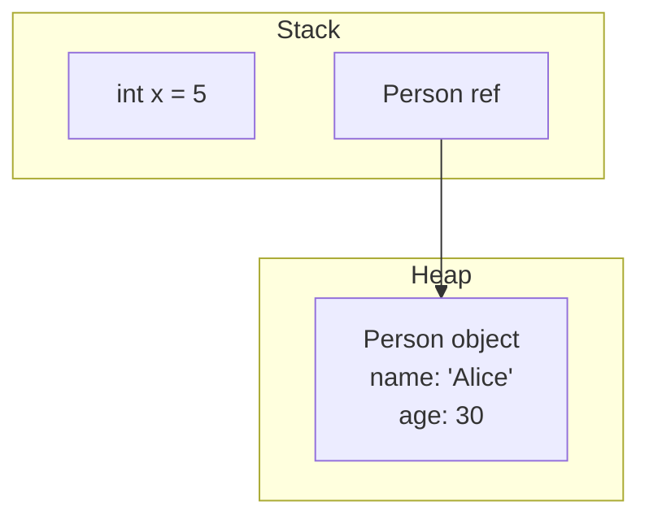

# 2.0 第2章：Java内存中的基本类型和对象

## 原始内容（第47-68页）

在第一章中，我们了解了基本类型、对象和引用之间的区别。我们学习了基本类型是Java语言自带的类型；换句话说，我们无需定义基本类型，直接使用即可。例如，`int x;` 定义（创建）了一个基本类型变量 `x`，其类型为基本类型 `int`。这意味着 `x` 只能存储整数，例如 -5、0、12 等。

我们还学习了对象是类的实例化，我们使用 `new` 关键字来创建对象的实例。例如，假设存在一个 `Person` 类，`new Person();` 实例化（创建）了一个 `Person` 类型的对象。该对象将存储在堆上。

我们看到引用使我们能够操作对象，并且引用有四种不同的类型：类、数组、接口和 null。当你创建对象时，你接收到的是对该对象的引用。例如，在代码 `Person p = new Person();` 中，引用是 `p`，其类型为 `Person`。引用是放在栈上还是堆上取决于上下文——稍后会详细讨论。

理解引用与对象之间的区别非常重要，这能大大简化面向对象编程（OOP）的核心概念，如继承和多态。这也有助于修复 `ClassCastException` 错误。了解Java的传值调用机制，特别是它与引用的关系，可以防止被称为**引用逃逸**的细微封装问题。

在本章中，我们将深入探讨以下主题：
- 理解栈和堆上的基本类型
- 在堆上存储对象
- 管理对象引用与安全性

## 技术要求
本章的代码可在GitHub上找到：  
<https://github.com/PacktPublishing/B18762_Java-Memory-Management>

---

## 理解栈和堆上的基本类型

Java提供了一组预定义的基本数据类型。基本数据类型总是小写，例如 `double`。将基本类型与其对应的包装类对比，包装类是API中的类，拥有方法（基本类型没有），并且包装类以大写字母开头，例如 `Double`。

基本数据类型可分为整型（整数）：`byte`、`short`、`int`、`long` 和 `char`，以及浮点型（小数）：`float`、`double` 和 `boolean`（真或假）。

基本类型可以存储在栈和堆上。当它们是方法的局部变量时（即方法的参数或在方法内部声明的变量），它们存储在栈上。当它们是类的成员（即实例变量）时，基本类型存储在堆上。实例变量在类作用域内声明，即在所有方法之外。因此，在方法内声明的基本类型变量位于栈上，而实例变量位于堆上（在对象内部）。

现在我们已经了解了基本类型的存储位置，接下来将注意力转向对象的存储。

---

## 在堆上存储对象

在本节中，我们将研究在堆上存储对象。要全面理解这一点，需要讨论引用与对象的比较。我们将考察它们的类型、存储位置以及关键的区别。最后通过一个示例代码及其关联的图表来结束本节。

### 引用

引用指向对象并使我们能够访问它们。如果我们访问对象实例成员，则使用引用。如果我们访问静态（类）成员，则使用类名。

引用可以存储在栈和堆上。如果引用是方法中的局部变量，则引用存储在栈上（在该方法帧的局部方法数组中）。如果引用是实例变量，则引用存储在堆上的对象内部。

与对象比较，我们可以拥有抽象类的引用，但不能拥有抽象类的对象。接口也是如此——我们可以拥有接口引用类型，但无法实例化接口；也就是说，不能创建接口类型的对象。两种情况如图2.1所示：

[图2.1 – 对象实例化错误]

在图2.1中，第10行和第13行声明的引用（分别为抽象类和接口引用）没有问题。然而，在第11行和第14行尝试创建这些类型的对象会导致错误。请随意尝试包含在ch2文件夹中的这段代码：<https://github.com/PacktPublishing/B18762_Java-Memory-Management/tree/main/ch2>。编译器错误的原因是你不能基于抽象类或接口创建对象。我们将在下一节解决这些错误。

现在我们已经讨论了引用，接下来考察对象。

### 对象

所有对象都存储在堆上。要理解对象，我们必须首先理解OOP中的一个基本构造：**类**。类类似于房屋的设计图。有了房屋设计图，你可以查看和讨论它，但不能开门、烧水等。这就是OOP中的类——它们展示了对象在内存中会是什么样子。当房屋建成后，你就可以开门、喝茶等。当对象创建后，你就拥有了类的一个内存表示。通过引用，我们可以使用点号语法访问实例成员。

让我们解决图2.1中的编译器问题，并展示点号语法的运行：

[图2.2 – 修复后的接口和抽象类引用]

在图2.2中，第11行和第15行编译无误，这表明必须是一个非抽象（具体）类，才能基于它实例化（创建）对象。第12行和第16行展示了点号语法。

现在让我们更详细地考察对象的创建。

### 如何创建对象

对象使用 `new` 关键字进行实例化（创建）。`new` 的目的是在堆上创建一个对象并返回其地址，我们将该地址存储在引用变量中。图2.2中的第11行有以下代码：

```java
h = new Person();
```

引用位于赋值运算符的左侧——我们正在初始化一个 `Human` 类型的引用 `h`。

将要实例化的对象位于赋值运算符的右侧——我们正在创建一个 `Person` 类型的对象，并执行默认的 `Person` 构造函数。由于代码中没有显式的 `Person` 构造函数，此默认构造函数由编译器合成。

现在我们已经了解了对象和引用，接下来扩展示例，并使用图表查看栈和堆的表示。

### 理解引用与对象之间的区别

为了对比栈和堆，我们对 `Person` 类和 `main()` 方法做了修改：

[图2.3 – 栈和堆代码]

图2.3详细展示了一个 `Person` 类，包含两个实例变量、一个接受两个参数的构造函数以及 `toString()` 实例方法。第二个类 `StackAndHeap` 是驱动类（包含 `main()` 方法）。在 `main()` 中，我们初始化了一个局部基本类型变量 `x`，并实例化了一个 `Person` 实例。

图2.4显示了第27行执行后的栈和堆表示：

[图2.4 – 图2.3代码的栈和堆表示]

参照图2.3，第一个执行的方法是 `main()`（第23行）。这导致一个 `main()` 的帧被压入栈中。局部变量 `args` 和 `x` 存储在此帧的局部变量数组中。在第25行，我们创建了一个 `Person` 实例，传入了字符串字面量 `"Joe Bloggs"` 和整数字面量 `23`。任何字符串字面量本身都是一个 `String` 对象，并存储在堆上。此外，由于它是一个字符串字面量，该 `String` 对象存储在堆上一个称为**字符串池**（也称为字符串常量池）的特殊区域中。

`Person` 对象内部的实例变量 `name` 位于堆上，是一个 `String` 类型；也就是说，它是一个引用变量，指向字符串池中的 `"Joe Bloggs"` 对象。`Person` 中的另一个实例变量 `age` 是一个基本类型，其值 `23` 直接存储在堆上的对象内部。然而，指向 `Person` 对象的引用 `joeBloggs` 存储在栈上 `main()` 方法的帧中。

在图2.3的第26行，我们输出了局部变量 `x`，将 `0` 输出到标准输出设备（通常是屏幕）。然后执行第27行，如图2.4所示。首先，来自 `PrintStream` 的 `println()` 方法（`out` 的类型是 `PrintStream`）导致一个帧被压入栈中。为简化图表，我们没有详细展开该栈帧。在 `println()` 完成执行之前，必须首先执行 `joeBloggs.toString()`。

由于现在已调用 `Person` 中的 `toString()` 方法，一个新的 `toString()` 帧被压入栈中，位于 `println()` 帧之上。接下来，`toString()` 使用字符串字面量和实例变量构建了一个局部 `String` 变量 `decoratedName`。

你可能知道，如果在 `+` 运算符的左侧或右侧有一个 `String` 实例，整个操作就变成字符串追加，最终得到一个 `String` 结果。

这些字符串字面量存储在字符串池中。最终的 `String` 结果是 `"My name is Joe Bloggs and I am 23 years old"`，它被赋给局部变量 `decoratedName`。该 `String` 从 `toString()` 返回给第27行调用它的 `println()` 语句。返回的 `String` 随后输出到屏幕。

关于在堆上存储对象的这一节到此结束。现在我们将关注可能导致代码中出现细微问题的领域。不过，既然我们已经将引用与对象分离开来，这些问题将更容易理解和解决。

---

## 管理对象引用与安全性

在本节中，我们将考察对象引用以及如果引用管理不当可能出现的细微安全问题。这个安全问题称为**引用逃逸**，我们将通过一个示例说明其发生的时间和方式。此外，我们还将修复示例中的问题，展示如何解决这个安全问题。

### 检查引用逃逸问题

在本节中，我们将讨论并提供Java传值参数传递机制的示例。一旦理解了传值调用，我们就能演示传递（或返回）引用时出现的问题。让我们从Java的传值调用机制开始。

#### 传值调用

Java在向方法传递参数和从方法返回结果时使用传值调用。简单来说，这意味着Java会复制一份内容。换句话说，当你向方法传递参数时，会创建该参数的一个副本；当你从方法返回结果时，会创建该结果的一个副本。为什么我们关心这个？因为你复制的内容——基本类型还是引用——可能会产生重大影响（尤其是对于可变类型，如 `StringBuilder` 和 `ArrayList`）。这正是我们想要深入探讨的内容。我们将使用一个示例程序和关联的图表来帮助理解。图2.5显示了示例代码：

[图2.5 – 传值调用代码示例]

图2.5详细展示了一个程序，其中有一个简单的 `Person` 类，包含两个属性：一个 `String` 类型的 `name` 和一个 `int`（基本类型）类型的 `age`。构造函数使我们能够初始化对象状态，并且我们为实例变量提供了访问器/修改器方法。

`CallByValue` 类是驱动类。在 `main()` 方法（第27行）中，声明并初始化了一个局部基本类型 `int` 变量 `age`，其值为 `20`。在第...

### 2.0 第2章：Java内存中的基本类型和对象

在`main()`方法的第28行，我们创建了一个`Person`类型的对象，传入字符串字面量`"John"`和基本类型变量`age`。基于这些参数，我们初始化了对象的状态。引用`john`是用于存储堆上`Person`对象引用的局部变量。图2.6展示了第28行执行完毕后的内存状态。为清晰起见，我们省略了`args`数组对象。

> [!figure] 图2.6 – 栈和堆的初始状态

如图2.6所示，`main()`方法的帧是栈上的当前帧。它包含两个局部变量：值为20的`int`基本类型`age`，以及指向堆上`Person`对象的`Person`引用`john`。`Person`对象已初始化其两个实例变量：基本类型变量`age`设为20，`name`字符串实例变量指向字符串池中的`"John"`字符串对象（因为`"John"`是字符串字面量，Java将其存储在那里）。

现在，我们执行图2.5中的第29行：`change(john, age);`。有趣的地方来了。我们调用`change()`方法，传入`john`引用和`age`基本类型。由于Java是按值传递（call-by-value），每个参数都会被复制一份。图2.7展示了刚进入`change()`方法、即将执行其第34行第一条指令时的栈和堆：

> [!figure] 图2.7 – 进入`change()`方法时的栈和堆

在上图中，可以看到一个`change()`方法的帧被压入栈中。由于Java是按值传递，两个参数都被复制到该方法中的局部变量，即`age`和`adult`。这里的区别至关重要，因此需要用子章节来讨论。

#### 复制基本类型

复制基本类型类似于影印一张纸。如果你把复印件递给别人，他们可以对那张纸做任何事——你仍然拥有原件。这正是本程序中将发生的情况：被调用的`change()`方法会修改基本类型变量`age`，但`main()`中的`age`副本将保持不变。

#### 复制引用

复制引用类似于复制一个电视遥控器。如果你把第二个/复制的遥控器递给别人，他们可以切换你正在观看的频道。这正是本程序中将发生的情况：被调用的`change()`方法会使用`adult`引用修改`Person`对象中的`name`实例变量，而`main()`中的`john`引用将看到那个变化。

回到图2.5的代码示例，图2.8展示了第34行和第35行执行完毕后、`change()`方法返回`main()`之前的栈和堆：

> [!figure] 图2.8 – `change()`方法即将退出时的栈和堆

如图所示，`change()`方法帧中的基本类型`age`已被改为90。此外，字符串池中为`"Michael"`创建了一个新的字符串字面量对象，`Person`对象中的`name`实例变量正指向它。这是因为字符串对象是不可变的（immutable）；也就是说，一旦初始化，就不能更改字符串对象的内容。注意，字符串池中的`"John"`字符串对象现在符合垃圾回收条件，因为没有引用指向它。

图2.9展示了`change()`方法执行完毕、控制权返回到`main()`方法后的栈和堆状态：

> [!figure] 图2.9 – `change()`方法执行完毕后的栈和堆

在图2.9中，`change()`方法的栈帧已被弹出。`main()`方法的帧再次成为当前帧。可以看到基本类型`age`未改变，仍然是20。引用也相同。然而，`change()`方法能够修改`john`所指向的实例变量。第30行`System.out.println(john.getName() + " " + age);`输出`Michael 20`，证明了发生的情况。

现在我们已经理解了Java的按值传递机制，接下来将通过一个示例讨论**逸出引用（escaping references）**。

#### 问题

OOP中的封装原则要求类的数据是私有的，只能通过其公共API供外部类访问。然而，在某些情况下，由于逸出引用的存在，这并不足以保护你的私有数据。图2.10是一个存在逸出引用问题的类的示例：

> [!figure] 图2.10 – 存在逸出引用的代码

上图包含一个`Person`类，其中有一个私有的实例变量——`StringBuilder`类型的`name`。`Person`构造函数根据传入的参数初始化该实例变量。该类还提供了一个公共的`getName()`访问器方法，使外部类能够检索该私有实例变量。

这里的驱动类是`EscapingReferences`。在`main()`的第16行，创建了一个包含字符串`"Dan"`的局部`StringBuilder`对象，`sb`是局部引用的名称。该引用被传入`Person`构造函数，以初始化`Person`对象中的`name`实例变量。图2.11展示了此时（即第17行执行完毕后）的栈和堆。为清晰起见，省略了字符串池。

> [!figure] 图2.11 – 传入时的逸出引用

此时，逸出引用问题开始显现。执行`Person`构造函数时，传入的是`sb`引用的副本，并将其存储在`name`实例变量中。现在，如图2.11所示，`name`实例变量和`main()`中的局部变量`sb`都指向同一个`StringBuilder`对象！

接着，当第18行`sb.append("Dan");`在`main()`中执行时，该对象被改为`"DanDan"`，无论是局部引用`sb`还是实例变量`name`都反映了这一变化。当我们在第19行输出实例变量时，输出的是`"DanDan"`，反映了更改。

因此，这是传入时的一个问题：将我们的实例变量初始化为传入的引用（的副本）。我们稍后将讨论如何修复它。然而，在传出时，我们也遇到了问题。图2.12演示了这个问题：

> [!figure] 图2.12 – 传出时的逸出引用

图2.12展示了第21行`StringBuilder sb2 = p.getName();`执行后的栈和堆。这里，我们又有一个局部引用（这次叫`sb2`），它指向堆上`Person`对象中`name`实例变量所指向的同一个对象。因此，当我们使用`sb2`引用向`StringBuilder`对象追加`"Dan"`，然后输出实例变量时，得到的是`"DanDanDan"`。

此时，很明显仅仅将数据设为私有是不够的。问题产生的原因是`StringBuilder`是可变的（mutable）类型，这意味着任何时候你都可以更改（原始）对象。与此对比的是`String`对象，它是不可变的（包装类型如`Double`、`Integer`、`Float`和`Character`也是如此）。

#### 不可变性

Java保护了字符串对象，因为对字符串对象的任何更改都会导致创建一个全新的对象（反映更改）。因此，请求更改的代码会看到请求的更改（只不过它是一个完全新的对象）。其他可能正在查看的原始字符串对象仍然未被触及。

现在我们已经讨论了逸出引用的问题，让我们看看如何解决它们。

#### 寻找解决方案

本质上，解决方案围绕一种称为**防御性拷贝（defensive copying）** 的实践。在这种情况下，我们不想存储任何可变对象的引用副本。同样，在访问器方法中返回对私有可变数据的引用时，我们也不想返回引用的副本给调用代码。

因此，我们既需要在传入时小心，也需要在传出时小心。解决方案是在两种场景下都完整地拷贝对象内容。这被称为**深拷贝（deep copy）**（而仅拷贝引用被称为**浅拷贝（shallow copy）**）。因此，在传入时，我们将对象内容拷贝到一个新对象中，并存储对新对象的引用。在传出时，我们再次拷贝内容，并返回对新对象的引用。这样我们在两种场景下都保护了代码。图2.13展示了修复图2.10代码的解决方案：

> [!figure] 图2.13 – 修复逸出引用的代码

第7行展示了传入时（构造函数中）创建拷贝对象。第10行展示了传出时（访问器方法中）创建拷贝对象。第19行和第23行都正确输出`"Dan"`。图2.14展示了程序即将退出时的栈和堆：

> [!figure] 图2.14 – 逸出引用修复后的栈和堆

为清晰起见，省略了字符串池。我们将`StringBuilder`对象编号为1到5。我们可以将对象与代码对应如下：

- 第16行创建对象1。
- 第17行调用第7行，创建对象2。`Person`实例变量`name`指向此对象。
- 第18行修改对象1，将其改为`"DanDan"`（注意，`name`实例变量所指的对象（即对象2）未受影响）。
- 第19行创建对象3。引用传回`main()`但未被存储。输出`"Dan"`，证明传入时的防御性拷贝生效。
- 第21行创建对象4。`main()`中的局部引用`sb2`指向它。
- 第22行将对象4改为`"DanDan"`（实例变量所指的对象保持不变）。
- 第23行创建对象5。输出`"Dan"`，证明传出时的防御性拷贝生效。

图2.14显示，`name`实例变量所指向的`StringBuilder`对象从未从`"Dan"`改变。这正是我们想要的效果。

本章到此结束。我们涵盖了很多内容，因此让我们回顾一下主要要点。

---

### 总结

在本章中，我们首先研究了基本类型在内存中的存储方式。基本类型是语言预定义的类型，可以存储在栈上（局部变量）和堆上（实例变量）。基本类型很容易识别，因为它们全部是小写字母。

相比之下，对象只存储在堆上。在讨论对象时，有必要区分引用和对象本身。我们发现，虽然引用可以是任何类型（接口、抽象类、类），但对象本身只能是具体的、实际的类，这意味着该类不能是抽象的。

谨慎管理对象引用。如果管理不当，可能会导致逸出引用。Java使用按值传递，这意味着传递或返回的参数会被复制一份。根据参数是基本类型还是引用，这可能会产生重大影响。如果它是对可变类型的引用的副本，那么调用代码可以更改你所谓的私有数据。这不是正确的封装。

我们检查了存在此问题的代码以及相关的栈和堆图。解决方案是使用防御性拷贝，即在传入和传出时都拷贝对象内容。这样，引用及其所指向的对象保持私有。最后，我们详细说明了代码解决方案及相关栈和堆图。

在下一章中，我们将更深入地研究堆——对象所在的內存区域。

# 2.0 第2章：Java内存中的基本类型和对象

图片上下文：
- [图片467，第50页]
- [图片470，第51页]
- [图片473，第53页]
- [图片475，第54页]
- [图片479，第57页]
- [图片481，第58页]
- [图片483，第59页]
- [图片485，第60页]
- [图片487，第61页]
- [图片489，第62页]
- [图片491，第63页]
- [图片493，第64页]
- [图片496，第66页]
- [图片498，第67页]

# 2.0 第2章：Java内存中的基本类型和对象

---
> [!INFO] 上下文说明  
> 本页内容为图片占位符及其分析描述，展示了Java中基本类型与对象在栈和堆上的存储方式。原始分析由视觉模型提取，此处保留全部信息。

<!-- image-analysis: 第50页，图片1 -->
图片内容无法识别，可能为Java基本类型与对象在内存中的存储示意图，基本类型直接存储值，对象通过引用指向堆中的实例。
<!-- /image-analysis -->

<!-- image-analysis: 第51页，图片1 -->
图片缺失或无法加载，无法分析其内容。
<!-- /image-analysis -->

<!-- image-analysis: 第53页，图片1 -->
图片展示了Java中基本类型和对象在内存中的存储方式：基本类型变量（如int x）直接存储在栈中，对象通过引用变量存储在栈中，实际对象数据存储在堆中。
<!-- /image-analysis -->

<!-- image-analysis: 第54页，图片1 -->
图片未加载，无法分析。
<!-- /image-analysis -->

<!-- image-analysis: 第57页，图片1 -->
图片展示了Java中基本类型（如int）和对象（如类实例）在内存中的存储方式对比。基本类型变量直接存储值，而对象变量存储指向堆内存中对象实例的引用。该图通常用于直观说明原始类型与引用类型的区别。
<!-- /image-analysis -->

<!-- image-analysis: 第58页，图片1 -->
根据上下文，该图片可能展示了Java中基本类型和对象在内存中的存储方式，通常包括栈（存储基本类型值和对象引用）与堆（存储对象实例）的示意图。
<!-- /image-analysis -->

<!-- image-analysis: 第59页，图片1 -->
图片内容缺失，无法分析。
<!-- /image-analysis -->

<!-- image-analysis: 第60页，图片1 -->
图片展示了Java中原始类型（如int）和对象在内存中的存储差异：原始类型变量直接存储值在栈中，而对象通过new创建并存储在堆中，栈中的引用变量指向堆中的对象。
<!-- /image-analysis -->

<!-- image-analysis: 第61页，图片1 -->

<!-- /image-analysis -->

<!-- image-analysis: 第62页，图片1 -->
图片可能展示了Java中基本类型（primitives）和对象（objects）在内存中的存储差异：基本类型变量直接存储值在栈内存中，而对象实例存储在堆内存中，通过栈上的引用变量访问。图中可能还对比了基本类型与引用类型的声明方式，例如 `int x;` 和 `new ClassName();`。
<!-- /image-analysis -->

<!-- image-analysis: 第63页，图片1 -->
该图片展示了 Java 中原始类型（primitives）与对象（objects）在内存中的区别：原始类型变量（如 int x）直接存储值在栈内存中；对象变量（如 String s）存储的是堆内存中对象的引用。图中通常用方框表示变量和对象，箭头表示引用关系。
<!-- /image-analysis -->

<!-- image-analysis: 第64页，图片1 -->
图片展示了Java中原始类型与对象在内存中的存储方式。左侧部分表示原始类型变量（如`int x`）直接存储值；右侧部分表示对象引用（如`Person p`）指向堆内存中的对象实例。图中可能使用箭头或方框示意栈与堆的区分。
<!-- /image-analysis -->

<!-- image-analysis: 第66页，图片1 -->
图片展示了原始类型和对象在内存中的存储方式对比：原始类型变量直接存储在栈内存中，而对象变量存储的是堆内存中对象的引用，对象本身存储在堆中。
<!-- /image-analysis -->

<!-- image-analysis: 第67页，图片1 -->
图片不可见，无法分析其内容。
<!-- /image-analysis -->