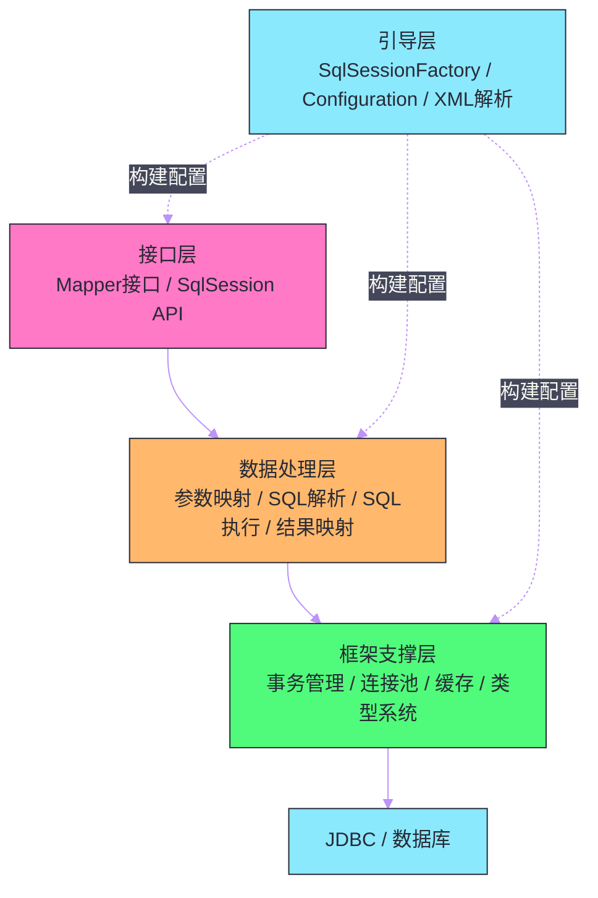
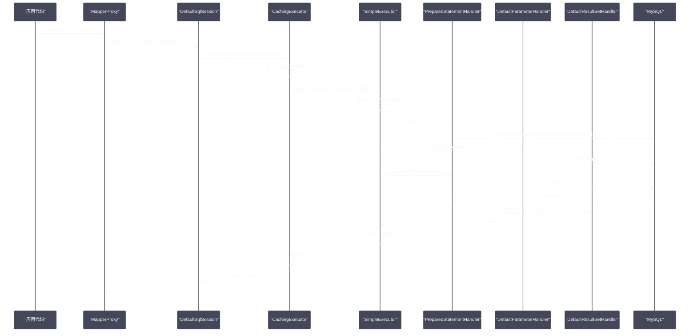

# Mybatis全局架构——从SQL到结果映射的完整链路

## 摘要

Mybatis 是 Java 生态中使用最广泛的半自动 ORM 框架。与 [[Hibernate]] 的"全自动"路线不同，Mybatis 的设计哲学是：**让开发者完全掌控 SQL，框架只负责参数绑定、结果映射和连接管理**。这种"半自动"定位，使得 Mybatis 在复杂查询、SQL 调优、存储过程调用等场景下比 Hibernate 更灵活、更可控。本文从 Mybatis 的整体架构出发，剖析其四层结构（接口层/数据处理层/框架支撑层/引导层）的职责边界，深入讲解 `Configuration` 全局配置对象的组成，并以一条 SQL 的完整执行链路（`Mapper` 接口调用 → `SqlSession` → `Executor` → `StatementHandler` → JDBC → 结果映射）为主线，将所有核心组件串联起来，建立对 Mybatis 工作原理的整体认知。

---

## 第 1 章 为什么需要 Mybatis：ORM 框架的演进

### 1.1 原生 JDBC 的七宗罪

理解 Mybatis 的价值，必须先理解它要解决的问题。在 Mybatis 出现之前，Java 程序员用原生 [[JDBC]] 操作数据库，这段代码几乎所有人都写过：

```java
Connection conn = null;
PreparedStatement ps = null;
ResultSet rs = null;
try {
    // 1. 注册驱动
    Class.forName("com.mysql.cj.jdbc.Driver");
    // 2. 获取连接（每次都创建新连接，性能极差）
    conn = DriverManager.getConnection(url, user, password);
    // 3. 创建 PreparedStatement
    ps = conn.prepareStatement(
        "SELECT id, name, email FROM users WHERE status = ? AND age > ?");
    // 4. 手动设置参数（参数与 SQL 分离，容易出错）
    ps.setString(1, "ACTIVE");
    ps.setInt(2, 18);
    // 5. 执行查询
    rs = ps.executeQuery();
    // 6. 手动遍历 ResultSet（每列都要手动提取）
    List<User> users = new ArrayList<>();
    while (rs.next()) {
        User user = new User();
        user.setId(rs.getLong("id"));
        user.setName(rs.getString("name"));
        user.setEmail(rs.getString("email"));
        users.add(user);
    }
    return users;
} catch (Exception e) {
    throw new RuntimeException(e);
} finally {
    // 7. 必须手动关闭资源（遗漏则连接泄漏）
    if (rs != null) try { rs.close(); } catch (Exception ignored) {}
    if (ps != null) try { ps.close(); } catch (Exception ignored) {}
    if (conn != null) try { conn.close(); } catch (Exception ignored) {}
}
```

这段代码暴露了原生 JDBC 的七个核心痛点：

1. **连接管理繁琐**：每次操作都需要手动获取和关闭连接，遗漏 `close()` 会导致连接泄漏，最终耗尽数据库连接池；
2. **SQL 与 Java 代码耦合**：SQL 硬编码在 Java 字符串中，无法利用 IDE 的 SQL 语法检查，维护困难；
3. **参数设置机械重复**：`ps.setString(1, ...)`、`ps.setInt(2, ...)` 需要手动维护参数位置与类型，一旦 SQL 中间插入新参数，后续所有索引都要修改；
4. **结果集映射冗长**：`rs.getLong("id")`、`rs.getString("name")` 这样的列提取代码与 Java 对象字段一一对应，新增字段就要修改映射代码；
5. **异常处理割裂**：`SQLException` 是受检异常，强迫调用方处理，业务代码被 try-catch 淹没；
6. **无连接池**：`DriverManager.getConnection()` 每次创建新的物理连接，数据库连接的建立开销（TCP 三次握手 + 认证）通常在 1-100ms，高并发时性能灾难；
7. **缺乏可重用性**：每个 DAO 方法都要重复上述全套流程，代码膨胀。

### 1.2 Mybatis 的核心定位：SQL 由人写，映射由框架做

Mybatis 的设计者（Clinton Begin）在 2002 年创建了 iBatis（Mybatis 的前身），核心思路是：

- **SQL 交给开发者**：开发者在 XML 或注解中编写原生 SQL，完全掌控查询语义，不受框架生成 SQL 的约束；
- **映射交给框架**：参数绑定（Java 对象 → JDBC 参数）和结果映射（JDBC ResultSet → Java 对象）由框架自动完成；
- **连接管理交给框架**：连接获取、释放、事务控制由框架统一管理。

这与 Hibernate 的"完全屏蔽 SQL，开发者只操作对象"形成了鲜明对比。两种路线的核心差异：

| 维度 | Mybatis（半自动） | Hibernate（全自动） |
| --- | --- | --- |
| SQL 控制权 | 完全由开发者掌控 | 由框架生成（HQL/Criteria） |
| 复杂查询 | 天然支持（直接写 SQL） | 需要 @NativeQuery 或 Criteria |
| 学习成本 | 低（SQL 技能复用） | 高（需掌握 HQL、级联、懒加载等概念） |
| 性能调优 | 简单（直接优化 SQL） | 复杂（需理解框架生成的 SQL） |
| 数据库迁移 | 困难（SQL 方言不同） | 相对容易（框架处理方言差异） |
| N+1 问题 | 需手动规避（JOIN 查询） | 有延迟加载，但容易不慎触发 |

对于互联网行业的典型场景（复杂业务 SQL、高频 DBA 介入调优、多表关联查询），Mybatis 的半自动路线更为实用。这也是为什么在国内 Mybatis 的使用率远高于 Hibernate。

---

## 第 2 章 Mybatis 的四层架构

### 2.1 整体架构鸟瞰

Mybatis 的内部实现可以分为四层，职责清晰：



**接口层**：暴露给应用程序的 API——`SqlSession` 接口（提供 `selectOne()`、`insert()`、`update()`、`delete()` 等方法）和 Mapper 接口（通过动态代理，让接口方法直接对应 SQL 操作）。这是开发者日常接触最多的层。

**数据处理层**：Mybatis 的核心，完成从 Java 方法调用到 JDBC 操作的全程处理：
- `ParameterHandler`：将方法参数绑定到 `PreparedStatement` 的占位符；
- `StatementHandler`：创建并执行 `Statement`/`PreparedStatement`/`CallableStatement`；
- `ResultSetHandler`：将 `ResultSet` 映射为 Java 对象列表；
- `BoundSql`：持有解析后的 SQL 和参数映射信息。

**框架支撑层**：提供横切关注点的基础设施：
- 事务管理（`Transaction` 接口，支持 JDBC 事务和托管事务）；
- 连接池（`DataSource`，内置 `PooledDataSource`，生产通常用 HikariCP）；
- 一级/二级缓存（`PerpetualCache`、`CachingExecutor`）；
- 类型系统（`TypeHandler` 注册表，负责 Java 类型与 JDBC 类型的互转）。

**引导层**：负责初始化 Mybatis——解析 `mybatis-config.xml` 和 Mapper XML，将所有配置信息汇聚到 `Configuration` 对象，最终通过 `SqlSessionFactoryBuilder` 构建 `SqlSessionFactory`。这层在应用启动时执行一次，运行期不再触及。

### 2.2 核心组件概览

在深入各层之前，先建立对核心组件的直觉认知：

| 组件 | 职责 | 生命周期 |
| --- | --- | --- |
| `SqlSessionFactory` | 创建 `SqlSession` 的工厂 | 应用级单例（伴随应用） |
| `SqlSession` | 执行 SQL 的会话，持有数据库连接 | 方法/请求级（用后即关） |
| `Executor` | SQL 执行引擎，控制缓存和语句处理 | 随 `SqlSession` 创建/销毁 |
| `StatementHandler` | 创建和执行 JDBC Statement | 单次 SQL 执行 |
| `ParameterHandler` | 参数绑定 | 单次 SQL 执行 |
| `ResultSetHandler` | 结果集处理 | 单次 SQL 执行 |
| `TypeHandler` | Java 类型 ↔ JDBC 类型转换 | 全局注册，单例 |
| `MappedStatement` | 封装一条 SQL 的完整定义 | 应用级（Configuration 持有） |
| `BoundSql` | 解析后的 SQL + 参数映射 | 单次 SQL 执行 |
| `Configuration` | 全局配置中心，持有所有元数据 | 应用级单例 |

---

## 第 3 章 Configuration：Mybatis 的"世界观"

### 3.1 Configuration 是什么

`org.apache.ibatis.session.Configuration` 是 Mybatis 的核心数据结构，所有配置信息、映射元数据、插件列表、类型处理器注册表……全部汇聚于此。可以把它理解为 Mybatis 框架的"中央数据库"——应用启动时一次性构建完成，运行期只读（线程安全）。

`Configuration` 的主要字段（核心部分）：

```java
public class Configuration {
    // 全局行为配置
    protected boolean cacheEnabled = true;          // 是否启用二级缓存
    protected boolean lazyLoadingEnabled = false;   // 是否启用延迟加载
    protected boolean aggressiveLazyLoading = false; // 触发任意方法是否加载所有延迟属性
    protected boolean useGeneratedKeys = false;     // 是否使用 JDBC 自动生成主键
    protected ExecutorType defaultExecutorType = ExecutorType.SIMPLE;
    
    // 注册表：存储所有已解析的 SQL 映射
    // key: namespace.statementId（如 com.example.UserMapper.selectById）
    protected final Map<String, MappedStatement> mappedStatements;
    
    // 注册表：存储所有二级缓存（namespace → Cache）
    protected final Map<String, Cache> caches;
    
    // 注册表：存储所有 ResultMap 定义
    protected final Map<String, ResultMap> resultMaps;
    
    // 注册表：TypeHandler（Java 类型 + JDBC 类型 → TypeHandler）
    protected final TypeHandlerRegistry typeHandlerRegistry;
    
    // 注册表：类型别名（alias → Class）
    protected final TypeAliasRegistry typeAliasRegistry;
    
    // 插件链（Interceptor 列表）
    protected final InterceptorChain interceptorChain;
    
    // 数据源和事务工厂
    protected Environment environment;
    
    // Mapper 接口与 XML 的映射关系
    protected final MapperRegistry mapperRegistry;
    
    // 反射工具（MetaObject 工厂，用于高效读写对象属性）
    protected ReflectorFactory reflectorFactory;
    
    // 对象工厂（负责创建结果对象实例）
    protected ObjectFactory objectFactory;
}
```

### 3.2 Configuration 的构建过程

`Configuration` 由 `XMLConfigBuilder` 解析 `mybatis-config.xml` 构建。一个典型的配置文件：

```xml
<?xml version="1.0" encoding="UTF-8" ?>
<!DOCTYPE configuration PUBLIC "-//mybatis.org//DTD Config 3.0//EN"
    "http://mybatis.org/dtd/mybatis-3-config.dtd">
<configuration>
    <!-- 全局行为配置 -->
    <settings>
        <setting name="cacheEnabled" value="true"/>
        <setting name="lazyLoadingEnabled" value="true"/>
        <setting name="mapUnderscoreToCamelCase" value="true"/>
        <setting name="defaultExecutorType" value="REUSE"/>
        <setting name="logImpl" value="SLF4J"/>
    </settings>
    
    <!-- 类型别名：简化 Mapper XML 中的类名引用 -->
    <typeAliases>
        <package name="com.example.domain"/>
    </typeAliases>
    
    <!-- 插件：按声明顺序包装为责任链 -->
    <plugins>
        <plugin interceptor="com.github.pagehelper.PageInterceptor">
            <property name="helperDialect" value="mysql"/>
        </plugin>
    </plugins>
    
    <!-- 数据源与事务环境 -->
    <environments default="development">
        <environment id="development">
            <transactionManager type="JDBC"/>
            <dataSource type="POOLED">
                <property name="driver" value="com.mysql.cj.jdbc.Driver"/>
                <property name="url" value="jdbc:mysql://localhost:3306/mydb"/>
                <property name="username" value="root"/>
                <property name="password" value="password"/>
            </dataSource>
        </environment>
    </environments>
    
    <!-- Mapper XML 扫描 -->
    <mappers>
        <package name="com.example.mapper"/>
    </mappers>
</configuration>
```

解析完成后，`SqlSessionFactoryBuilder.build(inputStream)` 将 `Configuration` 封装到 `DefaultSqlSessionFactory` 中：

```java
public SqlSessionFactory build(InputStream inputStream) {
    XMLConfigBuilder parser = new XMLConfigBuilder(inputStream);
    // parse() 内部会解析 XML，填充 Configuration 的所有字段
    Configuration config = parser.parse();
    return new DefaultSqlSessionFactory(config);
}
```

### 3.3 MappedStatement：一条 SQL 的完整描述

`MappedStatement` 是 `Configuration` 中最重要的存储单元，每一个 `<select>`、`<insert>`、`<update>`、`<delete>` 标签，或每一个 `@Select`、`@Insert` 注解，都被解析为一个 `MappedStatement` 对象：

```java
public final class MappedStatement {
    private String id;               // "com.example.UserMapper.selectById"
    private SqlCommandType sqlCommandType;  // SELECT / INSERT / UPDATE / DELETE
    private SqlSource sqlSource;     // 持有动态 SQL 的解析树（SqlNode 组合）
    private Class<?> resultType;     // 结果对象的 Java 类型
    private String resultMap;        // 引用的 ResultMap ID
    private ParameterMap parameterMap; // 参数映射定义
    private boolean useCache;        // 是否使用二级缓存
    private Cache cache;             // 关联的二级缓存
    private ResultSetType resultSetType;
    private StatementType statementType; // STATEMENT / PREPARED / CALLABLE
    private Integer fetchSize;
    private Integer timeout;
    private boolean flushCacheRequired; // 执行后是否清除缓存（INSERT/UPDATE/DELETE 默认 true）
    private KeyGenerator keyGenerator;  // 主键生成策略
    // ...
}
```

`MappedStatement` 的 ID 格式是 `namespace.statementId`，即 Mapper 接口全限定名 + 方法名（如 `com.example.mapper.UserMapper.selectById`）。当调用 `sqlSession.selectOne("com.example.mapper.UserMapper.selectById", 1L)` 时，Mybatis 就通过这个 ID 从 `Configuration.mappedStatements` 中找到对应的 `MappedStatement`。

---

## 第 4 章 一条 SQL 的完整执行链路

### 4.1 全链路时序图

以一次 `UserMapper.selectById(1L)` 调用为例，完整的执行链路如下：



### 4.2 第一步：Mapper 接口调用 → MapperProxy

当应用代码调用 `userMapper.selectById(1L)` 时，`userMapper` 并不是 `UserMapper` 接口的真实实现类，而是一个 JDK 动态代理对象（`MapperProxy`）。`MapperProxy` 的 `invoke()` 方法会：

1. 判断调用的方法是否是 `Object` 类的方法（`toString()`、`hashCode()` 等），如果是，直接调用；
2. 判断是否是接口的 `default` 方法，如果是，通过 `MethodHandle` 调用默认实现；
3. 其他情况（普通接口方法）：构建 `MapperMethod` 对象，调用其 `execute(sqlSession, args)` 方法，将接口调用转换为 `SqlSession` API 调用。

`MapperMethod` 在构建时会分析方法签名，确定：
- 对应的 SQL 语句 ID（`namespace + "." + methodName`）；
- SQL 类型（SELECT/INSERT/UPDATE/DELETE）；
- 返回值类型（单对象/列表/Map/void/Cursor 等）；
- 参数处理方式（`@Param` 注解、单参数、多参数、Map）。

### 4.3 第二步：SqlSession 分发

`DefaultSqlSession.selectOne()` 的实现非常简单——它只是委托给 `Executor`：

```java
public <T> T selectOne(String statement, Object parameter) {
    // selectList 返回 List，对于 selectOne 只取第一个元素
    List<T> list = this.selectList(statement, parameter);
    if (list.size() == 1) {
        return list.get(0);
    } else if (list.size() > 1) {
        throw new TooManyResultsException("Expected one result but found: " + list.size());
    }
    return null;
}

public <E> List<E> selectList(String statement, Object parameter, RowBounds rowBounds) {
    MappedStatement ms = configuration.getMappedStatement(statement);
    // 委托给 Executor 执行
    return executor.query(ms, wrapCollection(parameter), rowBounds, Executor.NO_RESULT_HANDLER);
}
```

### 4.4 第三步：Executor 层——缓存控制与语句委托

`Executor` 是 Mybatis 中承上启下的关键枢纽。Mybatis 有三种基础 Executor：

- **`SimpleExecutor`**（默认）：每次执行都创建新的 `Statement`，用完即关；
- **`ReuseExecutor`**：在同一 `SqlSession` 内，相同 SQL 的 `PreparedStatement` 会被复用（通过 Map 缓存已编译的 Statement）；
- **`BatchExecutor`**：将多个写操作合并为批量执行（`addBatch()`/`executeBatch()`），适用于批量插入/更新场景。

**`CachingExecutor`** 是一个**装饰器**，包装在上述任意一种基础 Executor 外层，负责二级缓存的查询和写入。这是[[装饰器模式]]在 Mybatis 中的经典应用。

当 `cacheEnabled=true`（默认）时，`Executor` 的实际类型是 `CachingExecutor`，它的查询逻辑：

```java
// CachingExecutor.query() 的核心逻辑
public <E> List<E> query(MappedStatement ms, Object parameterObject, 
                          RowBounds rowBounds, ResultHandler resultHandler) {
    BoundSql boundSql = ms.getBoundSql(parameterObject);
    // 生成缓存 key（包含 statementId + SQL + 参数值 + 分页偏移等）
    CacheKey key = createCacheKey(ms, parameterObject, rowBounds, boundSql);
    return query(ms, parameterObject, rowBounds, resultHandler, key, boundSql);
}

public <E> List<E> query(MappedStatement ms, Object parameterObject,
                          RowBounds rowBounds, ResultHandler resultHandler,
                          CacheKey key, BoundSql boundSql) {
    Cache cache = ms.getCache();  // 获取该 MappedStatement 配置的二级缓存
    if (cache != null) {
        flushCacheIfRequired(ms);  // 如果是写操作语句，先清缓存
        if (ms.isUseCache() && resultHandler == null) {
            // 尝试从二级缓存读取
            List<E> list = (List<E>) tcm.getObject(cache, key);
            if (list == null) {
                // 二级缓存未命中，去数据库查询
                list = delegate.query(ms, parameterObject, rowBounds, resultHandler, key, boundSql);
                // 写入二级缓存（注意：事务提交前写入的是 TransactionalCache 的暂存区）
                tcm.putObject(cache, key, list);
            }
            return list;
        }
    }
    // 没有配置二级缓存，直接委托给基础 Executor
    return delegate.query(ms, parameterObject, rowBounds, resultHandler, key, boundSql);
}
```

基础 `Executor`（如 `SimpleExecutor`）的查询逻辑：

```java
// BaseExecutor.query()（一级缓存查询）
public <E> List<E> query(MappedStatement ms, Object parameter, RowBounds rowBounds,
                          ResultHandler resultHandler, CacheKey key, BoundSql boundSql) {
    // 查询一级缓存（localCache：PerpetualCache，本质是 HashMap）
    List<E> list = resultHandler == null ? (List<E>) localCache.getObject(key) : null;
    if (list != null) {
        // 一级缓存命中（处理存储过程的 OUT 参数）
        handleLocallyCachedOutputParameters(ms, key, parameter, boundSql);
    } else {
        // 一级缓存未命中，查询数据库
        list = queryFromDatabase(ms, parameter, rowBounds, resultHandler, key, boundSql);
    }
    return list;
}
```

### 4.5 第四步：StatementHandler——JDBC 语句的创建与执行

`StatementHandler` 是 Mybatis 与 JDBC 直接交互的层。根据 `MappedStatement.statementType`，有三种实现：

- **`PreparedStatementHandler`**（默认，`#{}` 占位符）：使用 `PreparedStatement`，预编译 SQL，参数通过 `setXxx()` 绑定，防 SQL 注入；
- **`SimpleStatementHandler`**（`${}` 拼接）：使用 `Statement`，参数直接字符串替换，**有 SQL 注入风险**；
- **`CallableStatementHandler`**：使用 `CallableStatement`，处理存储过程调用。

`PreparedStatementHandler.prepare()` 的核心逻辑：

```java
public Statement prepare(Connection connection, Integer transactionTimeout) throws SQLException {
    // 从 BoundSql 获取解析后的 SQL（#{} 已替换为 ?）
    String sql = boundSql.getSql();
    
    // 根据主键生成策略决定 prepareStatement 的调用方式
    if (mappedStatement.getKeyGenerator() instanceof Jdbc3KeyGenerator) {
        // 需要返回自动生成的主键
        return connection.prepareStatement(sql, Statement.RETURN_GENERATED_KEYS);
    } else if (mappedStatement.getResultSetType() == ResultSetType.DEFAULT) {
        return connection.prepareStatement(sql);
    } else {
        return connection.prepareStatement(sql,
            mappedStatement.getResultSetType().getValue(),
            ResultSet.CONCUR_READ_ONLY);
    }
}
```

### 4.6 第五步：ParameterHandler——参数绑定

`DefaultParameterHandler.setParameters()` 负责将 Java 方法参数绑定到 `PreparedStatement` 的占位符：

```java
public void setParameters(PreparedStatement ps) {
    // 从 BoundSql 获取参数映射列表（每个 #{} 对应一个 ParameterMapping）
    List<ParameterMapping> parameterMappings = boundSql.getParameterMappings();
    
    for (int i = 0; i < parameterMappings.size(); i++) {
        ParameterMapping parameterMapping = parameterMappings.get(i);
        // 跳过 OUT 类型参数（存储过程输出参数，由 ResultSetHandler 处理）
        if (parameterMapping.getMode() != ParameterMode.OUT) {
            Object value;
            String propertyName = parameterMapping.getProperty();
            
            // 从参数对象中提取属性值（支持嵌套属性，如 "user.address.city"）
            if (boundSql.hasAdditionalParameter(propertyName)) {
                value = boundSql.getAdditionalParameter(propertyName);
            } else if (parameterObject == null) {
                value = null;
            } else if (typeHandlerRegistry.hasTypeHandler(parameterObject.getClass())) {
                // 参数本身就是基本类型（Long, String 等）
                value = parameterObject;
            } else {
                // 通过 MetaObject 反射提取对象属性值
                MetaObject metaObject = configuration.newMetaObject(parameterObject);
                value = metaObject.getValue(propertyName);
            }
            
            // 找到对应的 TypeHandler，调用 setParameter() 完成类型转换
            TypeHandler typeHandler = parameterMapping.getTypeHandler();
            JdbcType jdbcType = parameterMapping.getJdbcType();
            typeHandler.setParameter(ps, i + 1, value, jdbcType);
        }
    }
}
```

`TypeHandler` 是 Mybatis 类型系统的核心——它定义了 Java 类型与 JDBC 类型之间如何互转。对于 `Long` 类型，`LongTypeHandler.setParameter()` 最终调用 `ps.setLong(i, value)`；对于 `String`，则调用 `ps.setString(i, value)`……以此类推。

### 4.7 第六步：结果映射——ResultSetHandler

`DefaultResultSetHandler` 是 Mybatis 中代码量最多、逻辑最复杂的组件，负责将 JDBC `ResultSet` 转换为 Java 对象列表：

```java
public List<Object> handleResultSets(Statement stmt) throws SQLException {
    final List<Object> multipleResults = new ArrayList<>();
    int resultSetCount = 0;
    ResultSetWrapper rsw = getFirstResultSet(stmt);  // 包装第一个 ResultSet
    
    // 获取 MappedStatement 配置的 ResultMap 列表
    List<ResultMap> resultMaps = mappedStatement.getResultMaps();
    
    while (rsw != null && resultMaps.size() > resultSetCount) {
        ResultMap resultMap = resultMaps.get(resultSetCount);
        // 核心：将 ResultSet 行数据映射为 Java 对象
        handleResultSet(rsw, resultMap, multipleResults, null);
        rsw = getNextResultSet(stmt);  // 多结果集（存储过程）
        resultSetCount++;
    }
    
    return collapseSingleResultList(multipleResults);
}
```

对于每一行数据，`handleRowValues()` 会：
1. 创建结果对象实例（通过 `ObjectFactory.create(resultType)`）；
2. 遍历 `ResultMap` 中的每个 `<result>` 映射，从 `ResultSet` 中取出对应列的值；
3. 通过 `TypeHandler.getResult()` 完成 JDBC 类型 → Java 类型的转换；
4. 通过 `MetaObject.setValue()` 将值设置到结果对象的对应属性上。

---

## 第 5 章 Mybatis 初始化：从 XML 到 SqlSessionFactory

### 5.1 解析流程

Mybatis 的初始化分两个阶段：解析全局配置（`mybatis-config.xml`）和解析 Mapper XML（每个 `*Mapper.xml`）。

`XMLConfigBuilder.parse()` 按固定顺序解析全局配置文件的各个标签：

```
<properties> → <settings> → <typeAliases> → <typeHandlers>
→ <plugins> → <objectFactory> → <environments> → <mappers>
```

`<mappers>` 的解析会触发每个 Mapper XML 的解析。`XMLMapperBuilder` 负责解析 Mapper XML，其中最重要的是 `<select>/<insert>/<update>/<delete>` 标签的解析——每个标签被 `XMLStatementBuilder` 解析为一个 `MappedStatement`，注册到 `Configuration.mappedStatements` 中。

### 5.2 SqlSource：动态 SQL 的编译产物

`<select>` 标签内的 SQL 文本（可能包含 `<if>`、`<foreach>` 等动态标签）被解析为一个 `SqlSource`：

- **`StaticSqlSource`**：SQL 中没有任何动态部分（纯静态），解析时已经确定最终 SQL；
- **`RawSqlSource`**：SQL 中只有 `#{}` 占位符，没有动态标签，初始化时就可以确定 SQL 模板（性能比 `DynamicSqlSource` 好）；
- **`DynamicSqlSource`**：SQL 包含动态标签（`<if>`、`${}`、`<foreach>` 等），每次执行时需要根据参数动态构建最终 SQL。

`DynamicSqlSource` 持有一棵 `SqlNode` 树（`MixedSqlNode` 作为根节点，组合 `IfSqlNode`、`ForeachSqlNode`、`TextSqlNode` 等叶节点），每次执行时调用 `getBoundSql(parameterObject)` 遍历这棵树，根据参数值决定哪些节点生效，最终拼出完整 SQL。

---

## 第 6 章 Mybatis 的四大核心对象与插件拦截点

Mybatis 的插件机制（`@Intercepts`/`@Signature`）允许对以下四个核心对象的特定方法进行拦截：

| 可拦截对象 | 可拦截方法 | 典型用途 |
| --- | --- | --- |
| `Executor` | `query`、`update`、`commit`、`rollback` | 分页（改写 SQL），读写分离路由，SQL 审计 |
| `StatementHandler` | `prepare`、`parameterize`、`query`、`update` | SQL 改写（加表前缀），SQL 打印 |
| `ParameterHandler` | `setParameters` | 参数加密/解密 |
| `ResultSetHandler` | `handleResultSets` | 结果解密，字段脱敏 |

插件本质上是通过 JDK 动态代理，将这四个对象的实例包装为代理对象——调用目标方法前先执行插件的 `intercept()` 逻辑。多个插件形成责任链，外层插件先拦截，最内层才是真正的方法执行。

---

## 总结

Mybatis 的架构设计围绕一个核心目标：**在保持 SQL 控制权的前提下，最大限度地消除 JDBC 样板代码**。

- **四层架构**（接口层/数据处理层/框架支撑层/引导层）职责清晰，每层专注于自己的核心关注点；
- **`Configuration`** 是全局配置中心，存储所有 `MappedStatement`、`TypeHandler`、`ResultMap` 等元数据，应用启动时一次性构建；
- **执行链路**：`MapperProxy`（动态代理）→ `SqlSession`（门面）→ `CachingExecutor`（二级缓存装饰器）→ 基础 `Executor`（一级缓存 + 语句委托）→ `StatementHandler`（JDBC 语句）→ `ParameterHandler`（参数绑定）→ JDBC 执行 → `ResultSetHandler`（结果映射）；
- **四大核心对象**（`Executor`、`StatementHandler`、`ParameterHandler`、`ResultSetHandler`）是插件拦截的唯一入口，所有扩展（分页、审计、加解密）都通过包装这四个对象实现；
- **`TypeHandler`** 是 Mybatis 类型系统的基石，所有 Java ↔ JDBC 类型转换都通过它完成。

下一篇，我们深入 `SqlSession` 和 `Executor` 的实现细节，剖析三种 Executor 的差异与 `CachingExecutor` 的装饰器设计：[[02 SqlSession与Executor——命令执行的核心引擎]]。

---

> [!note] 参考资料
> - [Mybatis 官方文档](https://mybatis.org/mybatis-3/)
> - `org.apache.ibatis.session.Configuration` 源码
> - `org.apache.ibatis.executor.BaseExecutor` 源码
> - `org.apache.ibatis.executor.statement.PreparedStatementHandler` 源码
