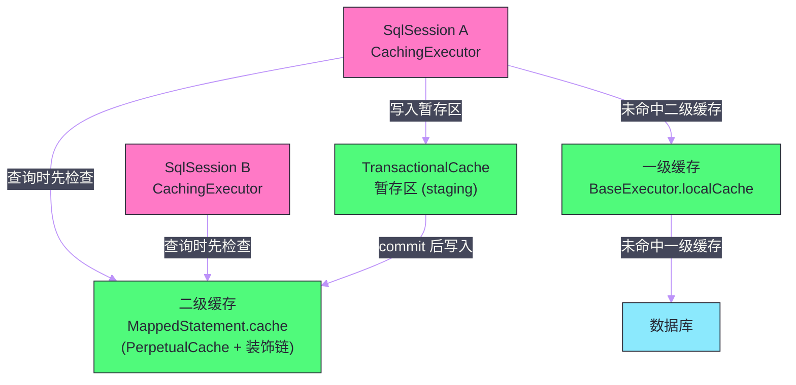
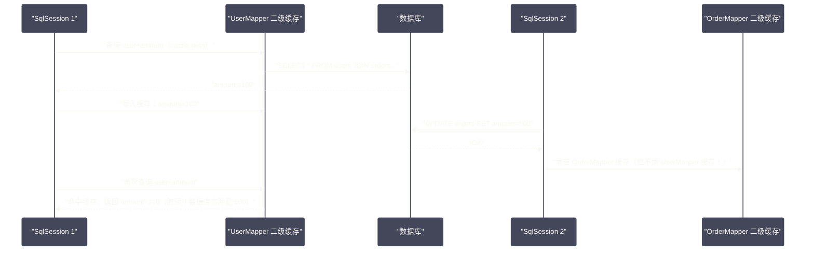

# 一级缓存与二级缓存——命中条件、失效场景与生产陷阱

## 摘要

Mybatis 内置了两级缓存体系：一级缓存（Local Cache，SqlSession 级别）和二级缓存（Second Level Cache，Mapper namespace 级别）。两者设计目标截然不同——一级缓存是"默认开启、不可关闭"的会话内优化，旨在防止同一 SqlSession 内的重复查询；二级缓存是"可选启用"的跨会话共享缓存，设计目标是在多个 SqlSession 之间共享查询结果，降低数据库压力。然而，二级缓存在分布式系统、多表关联查询等场景下存在严重的**脏读风险**，这是很多团队踩过的深坑。本文系统梳理两级缓存的命中条件、失效触发时机和底层实现，并重点剖析生产中必须掌握的陷阱：为什么 Spring 环境中一级缓存"看起来不工作"、为什么二级缓存容易产生脏数据、以及何时应该彻底禁用二级缓存。

---

## 第 1 章 为什么需要缓存：减少数据库往返

### 1.1 数据库查询的固定开销

每次 SQL 查询都会经历：
1. **获取连接**：从连接池取出（微秒级，但高并发时可能等待）；
2. **网络传输**：SQL 文本从应用服务器到数据库（内网 RTT 通常 0.1~1ms）；
3. **SQL 解析与优化**：数据库解析器解析 SQL，查询优化器生成执行计划（`PreparedStatement` 预编译后可跳过重复解析）；
4. **磁盘 I/O**：如果数据不在数据库 Buffer Pool 中，需要从磁盘读取；
5. **结果传输**：查询结果从数据库返回到应用服务器；
6. **结果集处理**：Mybatis 的 `ResultSetHandler` 将 `ResultSet` 映射为 Java 对象。

对于**热点数据**（短时间内被多次查询的相同数据），缓存可以消除步骤 2-6 的开销，极大地降低数据库压力。

### 1.2 两级缓存的定位差异

| 维度 | 一级缓存（Local Cache） | 二级缓存（Second Level Cache） |
| --- | --- | --- |
| 作用域 | SqlSession 内部 | Mapper namespace（跨 SqlSession） |
| 存储位置 | `BaseExecutor.localCache`（HashMap） | `MappedStatement.cache`（可插拔实现） |
| 默认状态 | 始终开启（不可禁用整体） | 需要显式配置 `<cache/>` 才启用 |
| 生命周期 | 随 SqlSession 创建/销毁 | 随 SqlSessionFactory 生命周期（应用级） |
| 线程安全 | 不需要（单 SqlSession 单线程） | 需要（多 SqlSession 并发访问） |
| 跨进程共享 | 不支持 | 可扩展（接入 Redis/Ehcache 等） |
| 脏读风险 | 低（SqlSession 内的一致视图） | 高（多 SqlSession 并发时可能读到过期数据）|

---

## 第 2 章 一级缓存：SqlSession 的内置优化

### 2.1 一级缓存的存储结构

一级缓存是 `BaseExecutor` 持有的一个 `PerpetualCache` 对象：

```java
public abstract class BaseExecutor implements Executor {
    // 一级缓存：本质是一个 HashMap<CacheKey, Object>
    protected PerpetualCache localCache;
    // 存储过程输出参数的缓存
    protected PerpetualCache localOutputParameterCache;
    
    protected BaseExecutor(Configuration configuration, Transaction transaction) {
        this.transaction = transaction;
        this.deferredLoads = new ConcurrentLinkedQueue<>();
        this.localCache = new PerpetualCache("LocalCache");
        this.localOutputParameterCache = new PerpetualCache("LocalOutputParameterCache");
        this.closed = false;
        this.configuration = configuration;
        this.wrapper = this;
    }
}
```

`PerpetualCache` 的实现极其简单——就是一个 `HashMap` 的包装：

```java
public class PerpetualCache implements Cache {
    private final String id;
    // 核心数据结构：HashMap，key 是 CacheKey，value 是查询结果（List<Object>）
    private final Map<Object, Object> cache = new HashMap<>();
    
    @Override
    public void putObject(Object key, Object value) {
        cache.put(key, value);
    }
    
    @Override
    public Object getObject(Object key) {
        return cache.get(key);
    }
    
    @Override
    public Object removeObject(Object key) {
        return cache.remove(key);
    }
    
    @Override
    public void clear() {
        cache.clear();
    }
    
    @Override
    public int getSize() {
        return cache.size();
    }
}
```

### 2.2 CacheKey 的构成：命中条件的精确定义

一级缓存的命中与否完全由 `CacheKey` 决定。`CacheKey` 是一个复合键，由以下因素共同构成（`BaseExecutor.createCacheKey()`）：

```java
public CacheKey createCacheKey(MappedStatement ms, Object parameterObject,
                                RowBounds rowBounds, BoundSql boundSql) {
    CacheKey cacheKey = new CacheKey();
    cacheKey.update(ms.getId());                  // 因素1：MappedStatement ID（如 UserMapper.selectById）
    cacheKey.update(rowBounds.getOffset());        // 因素2：分页偏移量
    cacheKey.update(rowBounds.getLimit());         // 因素3：分页大小
    cacheKey.update(boundSql.getSql());            // 因素4：最终 SQL 字符串（含 ? 占位符）
    
    // 因素5：所有参数值（逐一放入）
    List<ParameterMapping> parameterMappings = boundSql.getParameterMappings();
    TypeHandlerRegistry typeHandlerRegistry = ms.getConfiguration().getTypeHandlerRegistry();
    for (ParameterMapping parameterMapping : parameterMappings) {
        if (parameterMapping.getMode() != ParameterMode.OUT) {
            Object value;
            String propertyName = parameterMapping.getProperty();
            if (boundSql.hasAdditionalParameter(propertyName)) {
                value = boundSql.getAdditionalParameter(propertyName);
            } else if (parameterObject == null) {
                value = null;
            } else if (typeHandlerRegistry.hasTypeHandler(parameterObject.getClass())) {
                value = parameterObject;
            } else {
                MetaObject metaObject = configuration.newMetaObject(parameterObject);
                value = metaObject.getValue(propertyName);
            }
            cacheKey.update(value);
        }
    }
    
    // 因素6：数据库环境 ID（区分多数据源）
    if (configuration.getEnvironment() != null) {
        cacheKey.update(configuration.getEnvironment().getId());
    }
    return cacheKey;
}
```

**命中一级缓存的必要条件**（所有条件同时满足）：
1. 同一个 `SqlSession`（`Executor` 实例相同）；
2. 同一个 `MappedStatement`（相同的 statementId）；
3. 相同的 SQL 字符串（`boundSql.getSql()` 相同）；
4. 相同的参数值（所有 `#{}` 对应的值相同）；
5. 相同的分页参数（`RowBounds.offset` 和 `limit` 相同）；
6. 相同的数据库环境 ID。

任何一个因素不同，就是不同的缓存条目，不会命中缓存。

### 2.3 一级缓存的作用域配置

Mybatis 提供了 `localCacheScope` 配置项，控制一级缓存的粒度：

- **`SESSION`（默认）**：整个 SqlSession 共享一个一级缓存，同一 SqlSession 内相同的查询只执行一次；
- **`STATEMENT`**：每条语句执行完后立即清空一级缓存，相当于每次查询都走数据库。

```xml
<settings>
    <!-- 将一级缓存作用域缩小到语句级别（实际上等于禁用一级缓存） -->
    <setting name="localCacheScope" value="STATEMENT"/>
</settings>
```

`STATEMENT` 模式的使用场景：在某些对数据实时性要求极高的场景（如金融交易），希望每次查询都反映数据库最新状态，不接受任何缓存中间态。

### 2.4 一级缓存的四类失效场景

**场景一：执行写操作（INSERT/UPDATE/DELETE）**

```java
// BaseExecutor.update() 方法
public int update(MappedStatement ms, Object parameter) throws SQLException {
    ErrorContext.instance().resource(ms.getResource()).activity("executing an update")
        .object(ms.getId());
    if (closed) {
        throw new ExecutorException("Executor was closed.");
    }
    // 任何写操作都清空整个一级缓存！
    clearLocalCache();
    return doUpdate(ms, parameter);
}
```

这是最常触发的失效场景。写操作后一级缓存被全量清空，原因是 Mybatis 无法判断某次写操作影响了哪些缓存条目，保守清空是最安全的策略。

**场景二：手动调用 `session.clearCache()`**

```java
// 批量操作中间手动清理，防止内存溢出
for (int i = 0; i < list.size(); i++) {
    mapper.insert(list.get(i));
    if (i % 100 == 0) {
        session.flushStatements();
        session.clearCache();  // 手动清空一级缓存
    }
}
```

**场景三：SqlSession 关闭**

`close()` 会销毁 `Executor`，`localCache` 随之消亡。

**场景四：查询配置了 `flushCache=true`**

```xml
<!-- 强制该查询每次都清空缓存再执行 -->
<select id="selectRealtime" flushCache="true" resultType="Order">
    SELECT * FROM orders WHERE id = #{id}
</select>
```

### 2.5 一级缓存在 Spring 中"消失"的真相

这是最让开发者困惑的问题之一：在 Spring Boot 项目中，同一个 Service 方法里连续两次调用相同的 Mapper 查询，发现 SQL 执行了两次——一级缓存似乎没有生效。

根本原因：**`SqlSessionTemplate` 在非事务方法中，每次 Mapper 调用后都关闭 SqlSession**。

`SqlSessionTemplate` 内部的 `SqlSessionInterceptor` 代理逻辑：

```java
private class SqlSessionInterceptor implements InvocationHandler {
    @Override
    public Object invoke(Object proxy, Method method, Object[] args) throws Throwable {
        // 获取或创建 SqlSession
        SqlSession sqlSession = getSqlSession(
            SqlSessionTemplate.this.sqlSessionFactory,
            SqlSessionTemplate.this.executorType,
            SqlSessionTemplate.this.exceptionTranslator);
        try {
            Object result = method.invoke(sqlSession, args);
            // 关键判断：当前是否处于 Spring 管理的事务中？
            if (!isSqlSessionTransactional(sqlSession, SqlSessionTemplate.this.sqlSessionFactory)) {
                // 不在事务中：强制提交
                sqlSession.commit(true);
            }
            return result;
        } catch (Throwable t) {
            // ...
        } finally {
            if (sqlSession != null) {
                // 不在事务中：每次方法调用后关闭 SqlSession！
                // 一级缓存随 SqlSession 消亡
                closeSqlSession(sqlSession, SqlSessionTemplate.this.sqlSessionFactory);
            }
        }
    }
}
```

**结论**：在 Spring 无事务方法中，每次 Mapper 方法调用都经历"打开 SqlSession → 执行 SQL → 关闭 SqlSession"的完整生命周期，一级缓存无法在方法调用间持久。

**解决方案**：用 `@Transactional` 将需要利用一级缓存的逻辑包裹在同一事务中：

```java
@Service
public class UserService {
    @Autowired
    private UserMapper userMapper;
    
    // 无事务：每次查询都走数据库（一级缓存无效）
    public void ineffectiveCache() {
        User u1 = userMapper.selectById(1L);  // SELECT 1
        User u2 = userMapper.selectById(1L);  // SELECT 2（新 SqlSession，缓存失效）
    }
    
    // 有事务：共享 SqlSession，一级缓存生效
    @Transactional
    public void effectiveCache() {
        User u1 = userMapper.selectById(1L);  // SELECT 1
        User u2 = userMapper.selectById(1L);  // 命中一级缓存，不查数据库
        // u1 == u2（同一个对象引用！）
        System.out.println(u1 == u2);  // true
    }
}
```

> [!warning] 一级缓存的对象共享问题
> 一级缓存命中时返回的是缓存中存储的**同一个对象引用**（不是副本）。如果你修改了 `u1` 的属性，`u2` 的同名属性也会同步变化（因为 `u1 == u2`）。这在通常情况下不是问题，但在某些写时需要保存"修改前快照"的场景（如审计日志、乐观锁比对）中，需要手动深拷贝结果对象。

---

## 第 3 章 二级缓存：跨 SqlSession 的共享缓存

### 3.1 二级缓存的设计目标与架构

二级缓存的目标是：**在同一个 Mapper namespace 的多次查询（可跨 SqlSession）之间共享结果，减少数据库查询次数**。

二级缓存由 `CachingExecutor`（装饰器）+ `MappedStatement.cache` + `TransactionalCacheManager` 协作实现：



### 3.2 如何启用二级缓存

**步骤一**：全局启用（默认已启用，`cacheEnabled=true`）：

```xml
<settings>
    <setting name="cacheEnabled" value="true"/>
</settings>
```

**步骤二**：在 Mapper XML 中声明 `<cache/>` 标签：

```xml
<!-- UserMapper.xml -->
<mapper namespace="com.example.mapper.UserMapper">
    <!-- 启用二级缓存，使用默认配置 -->
    <cache/>
    
    <!-- 或者自定义配置 -->
    <cache
        eviction="LRU"           <!-- 淘汰策略：LRU（默认）/ FIFO / SOFT / WEAK -->
        flushInterval="60000"    <!-- 自动刷新间隔（毫秒），默认不自动刷新 -->
        size="512"               <!-- 缓存最大条目数，默认 1024 -->
        readOnly="false"         <!-- 是否只读（true=返回缓存对象引用；false=返回副本，更安全）-->
        blocking="false"/>       <!-- 是否阻塞（防止缓存穿透，同一 key 同时只有一个查询） -->
</mapper>
```

**步骤三**：结果对象必须实现 `Serializable` 接口（因为二级缓存可能序列化对象到磁盘或远程存储）：

```java
// 必须实现 Serializable
public class User implements Serializable {
    private static final long serialVersionUID = 1L;
    private Long id;
    private String name;
    // ...
}
```

### 3.3 二级缓存的查询与写入流程

`CachingExecutor.query()` 的详细逻辑：

```java
public <E> List<E> query(MappedStatement ms, Object parameterObject, RowBounds rowBounds,
                          ResultHandler resultHandler, CacheKey key, BoundSql boundSql) {
    Cache cache = ms.getCache();  // 获取该 namespace 的二级缓存实例（可能为 null）
    
    if (cache != null) {
        // 写操作语句（flushCache=true）：先清空二级缓存
        flushCacheIfRequired(ms);
        
        if (ms.isUseCache() && resultHandler == null) {
            ensureNoOutParams(ms, boundSql);
            
            // 尝试从 TransactionalCache 读取
            // （TransactionalCache 先查暂存区，再查真正的二级缓存）
            @SuppressWarnings("unchecked")
            List<E> list = (List<E>) tcm.getObject(cache, key);
            
            if (list == null) {
                // 二级缓存未命中：交给基础 Executor（会走一级缓存 + 数据库）
                list = delegate.query(ms, parameterObject, rowBounds, resultHandler, key, boundSql);
                // 将结果写入 TransactionalCache 暂存区
                // 注意：此时还没写入真正的二级缓存！
                tcm.putObject(cache, key, list);
            }
            return list;
        }
    }
    return delegate.query(ms, parameterObject, rowBounds, resultHandler, key, boundSql);
}

// commit 时：将暂存区数据写入真正的二级缓存
public void commit(boolean required) throws SQLException {
    delegate.commit(required);
    tcm.commit();  // 刷入二级缓存
}

// rollback 时：丢弃暂存区（不写入二级缓存）
public void rollback(boolean required) throws SQLException {
    try {
        delegate.rollback(required);
    } finally {
        if (required) {
            tcm.rollback();  // 丢弃暂存区
        }
    }
}
```

**为什么需要 TransactionalCache 暂存区？**

如上所述，防止事务回滚导致的缓存脏读：事务未提交时的查询结果不应立即放入二级缓存，否则其他 SqlSession 可能读到未提交的数据（如果事务随后回滚，这些数据就是脏数据）。

### 3.4 二级缓存的淘汰策略

Mybatis 内置 4 种淘汰策略，通过 `<cache eviction="..."/>` 配置，底层实现是用不同的 `Cache` 装饰器包装 `PerpetualCache`：

| 策略 | 实现类 | 说明 |
| --- | --- | --- |
| `LRU`（默认） | `LruCache` | 最近最少使用，用 LinkedHashMap 的 accessOrder 模式实现 |
| `FIFO` | `FifoCache` | 先进先出，用 Deque 记录插入顺序 |
| `SOFT` | `SoftCache` | 软引用，内存不足时 JVM 可回收缓存条目 |
| `WEAK` | `WeakCache` | 弱引用，GC 时即可回收，缓存命中率更低 |

装饰器链的完整结构（从外到内）：

```
SynchronizedCache（线程安全）
  └── LoggingCache（日志记录命中率）
        └── SerializedCache（序列化/反序列化，readOnly=false 时）
              └── ScheduledCache（定时刷新，flushInterval 配置）
                    └── LruCache / FifoCache（淘汰策略）
                          └── BlockingCache（防缓存穿透，blocking=true）
                                └── PerpetualCache（底层 HashMap）
```

---

## 第 4 章 二级缓存的脏读风险

### 4.1 单 namespace 内的写操作失效机制

在同一个 Mapper namespace 内，写操作（UPDATE/INSERT/DELETE）默认会清空该 namespace 的整个二级缓存：

```xml
<!-- 默认配置：写操作清空缓存 -->
<update id="updateUser" flushCache="true">  <!-- 默认为 true -->
    UPDATE users SET name = #{name} WHERE id = #{id}
</update>
```

这对于**只涉及单表的操作**是有效的：更新 users 表会清空 UserMapper 的二级缓存，下次查询必然走数据库。

### 4.2 多表关联查询的脏读场景

二级缓存最严重的问题发生在**多表关联查询**场景：

```
UserMapper.xml 中有一个查询关联了 orders 表：
SELECT u.*, o.amount FROM users u JOIN orders o ON u.id = o.user_id WHERE u.id = #{id}

这个查询结果缓存在 UserMapper 的二级缓存中。

现在，OrderMapper 执行了一个 UPDATE：
UPDATE orders SET amount = 500 WHERE id = 101

OrderMapper 的写操作只会清空 OrderMapper 的二级缓存，
而 UserMapper 的二级缓存中的旧数据（amount=100）依然存在！

下一次查询 UserMapper.selectUserWithAmount(userId=1) 时，
命中 UserMapper 的二级缓存，返回旧数据（amount=100），
但数据库中 amount 实际已经是 500——这就是脏读！
```

用时序图表示：



### 4.3 `<cache-ref>`：共享二级缓存的解决方案

Mybatis 提供 `<cache-ref>` 标签，让多个 namespace 共享同一个二级缓存：

```xml
<!-- OrderMapper.xml -->
<mapper namespace="com.example.mapper.OrderMapper">
    <!-- 引用 UserMapper 的缓存 -->
    <cache-ref namespace="com.example.mapper.UserMapper"/>
    
    <!-- OrderMapper 的写操作，会同时清空 UserMapper 的缓存 -->
    <update id="updateOrder">
        UPDATE orders SET amount = #{amount} WHERE id = #{id}
    </update>
</mapper>
```

但这个方案有很大局限性：
- 只能在两个关联 namespace 之间共享；
- 缓存粒度变粗（UserMapper 的任何写操作也会清空 OrderMapper 的缓存）；
- 在复杂多表关联场景下，需要将所有相关 namespace 的缓存都 `cache-ref` 在一起，最终退化为"全局清空"。

### 4.4 为什么生产中通常禁用 Mybatis 二级缓存

基于上述脏读风险，很多互联网公司的开发规范中明确**禁止使用 Mybatis 内置二级缓存**：

1. **脏读风险难以彻底消除**：多表关联查询普遍存在，要正确配置 `cache-ref` 需要深入了解所有表的关联关系，稍有疏漏就会脏读；
2. **分布式环境下无效**：内置二级缓存是进程级的（JVM 内存），在多实例部署时，实例 A 的写操作只会清空自己的缓存，实例 B/C 的缓存仍然是旧数据；
3. **更好的替代方案**：使用 [[Redis]] 等专业的分布式缓存，在 Service 层（而非 Mybatis 层）控制缓存粒度、过期时间和失效策略，逻辑更清晰，问题也更容易排查。

> [!info] 正确的缓存策略分层
> 生产中推荐的缓存架构：
> - **Mybatis 一级缓存**：保持默认开启（`SESSION` 模式），减少事务内的重复查询；
> - **Mybatis 二级缓存**：**关闭**（不配置 `<cache/>`），防止脏读；
> - **Redis/Memcached**：在 Service 层或单独的 Cache 层管理热点数据缓存，自行控制粒度和一致性策略；
> - **本地 JVM 缓存**（Caffeine/Guava Cache）：对于配置类、字典类等极少变更的数据，可以用 JVM 本地缓存，过期时间设置较长（分钟级）。

---

## 第 5 章 二级缓存的高级配置

### 5.1 整合第三方缓存：Ehcache

Mybatis 的 `Cache` 接口是插拔式的，可以用 Ehcache、Redis 等替换默认的 `PerpetualCache`。以 Ehcache 为例：

```xml
<!-- pom.xml 依赖 -->
<dependency>
    <groupId>org.mybatis.caches</groupId>
    <artifactId>mybatis-ehcache</artifactId>
    <version>1.2.3</version>
</dependency>
```

```xml
<!-- UserMapper.xml -->
<cache type="org.mybatis.caches.ehcache.EhcacheCache"/>
```

```xml
<!-- ehcache.xml -->
<ehcache>
    <defaultCache maxEntriesLocalHeap="1000"
                  eternal="false"
                  timeToIdleSeconds="120"
                  timeToLiveSeconds="120"
                  overflowToDisk="false"/>
    
    <cache name="com.example.mapper.UserMapper"
           maxEntriesLocalHeap="500"
           eternal="false"
           timeToLiveSeconds="300"/>
</ehcache>
```

### 5.2 `blocking=true`：防缓存穿透

当缓存未命中时，如果有大量并发请求同时发现缓存空缺（即"缓存穿透"），会同时打向数据库，造成数据库突发高压。`blocking=true` 通过 `BlockingCache` 解决此问题：

```java
public class BlockingCache implements Cache {
    private final Cache delegate;
    // key → ReentrantLock：每个缓存 key 对应一把锁
    private final ConcurrentHashMap<Object, ReentrantLock> locks;
    private long timeout;
    
    @Override
    public Object getObject(Object key) {
        acquireLock(key);  // 尝试获取该 key 的锁
        Object value = delegate.getObject(key);
        if (value != null) {
            releaseLock(key);  // 命中缓存：立即释放锁
        }
        // 未命中缓存：持有锁，让其他线程阻塞等待
        // 直到调用 putObject 时才释放锁
        return value;
    }
    
    @Override
    public void putObject(Object key, Object value) {
        try {
            delegate.putObject(key, value);
        } finally {
            releaseLock(key);  // 写入缓存后释放锁，唤醒阻塞的线程
        }
    }
}
```

**工作机制**：
1. 线程 A 查询缓存未命中，获取锁，去数据库查询；
2. 线程 B 查询同一 key，发现有锁，阻塞等待；
3. 线程 A 从数据库取到结果，写入缓存，释放锁；
4. 线程 B 获得锁，再次查询缓存，命中，释放锁，返回结果（不再去数据库）。

这确保了同一 key 在缓存空缺时只有一个线程去查数据库。

### 5.3 readOnly=true 的性能优化

`readOnly=true` 时，`SerializedCache` 装饰器被跳过，缓存命中时直接返回对象引用（不做序列化/反序列化），性能更高，但存在风险：

```java
// readOnly=false（默认，安全）：每次命中都反序列化，返回新对象
// 多个调用者得到的是不同的对象实例，互不影响
User u1 = userMapper.selectById(1L);  // 从缓存反序列化 → 新 User 对象
User u2 = userMapper.selectById(1L);  // 再次反序列化 → 另一个新 User 对象
u1.setName("modified");               // 不影响 u2 和缓存中的数据

// readOnly=true（高性能，危险）：返回缓存中的同一对象引用
User u1 = userMapper.selectById(1L);  // 直接返回缓存中的引用
User u2 = userMapper.selectById(1L);  // 同一个引用！
u1.setName("modified");               // u2.getName() 也变了！缓存数据也被污染！
```

**使用建议**：只有在**确信应用代码不会修改查询结果对象**（纯只读场景）时，才使用 `readOnly=true`。

---

## 第 6 章 生产调试：查看缓存命中率

Mybatis 的 `LoggingCache` 会记录缓存命中和未命中的次数：

```java
public class LoggingCache implements Cache {
    private final Log log;
    private final Cache delegate;
    protected int requests = 0;
    protected int hits = 0;
    
    @Override
    public Object getObject(Object key) {
        requests++;
        final Object value = delegate.getObject(key);
        if (value != null) {
            hits++;
        }
        if (log.isDebugEnabled()) {
            log.debug("Cache Hit Ratio [" + getId() + "]: " + getHitRatio());
        }
        return value;
    }
    
    private double getHitRatio() {
        return (double) hits / (double) requests;
    }
}
```

开启 DEBUG 级别日志后，可以看到类似输出：

```
DEBUG - Cache Hit Ratio [com.example.mapper.UserMapper]: 0.75
```

这表示该 Mapper 的二级缓存命中率为 75%。在优化缓存配置时（调整 `size`、`flushInterval`、`eviction` 等），可以通过这个指标来评估效果。

---

## 总结

Mybatis 的两级缓存设计体现了不同粒度的优化思路：

- **一级缓存**（LocalCache）是会话内的透明优化：默认开启，`PerpetualCache`（HashMap）实现，命中条件为 statementId + SQL + 参数 + 分页 + 环境 ID 完全一致；失效触发点为写操作、手动 `clearCache()`、SqlSession 关闭；在 Spring 无事务方法中因 SqlSession 生命周期缩短而"失效"，解决方案是使用 `@Transactional` 统一 SqlSession；

- **二级缓存**（Second Level Cache）是 namespace 级的可选缓存：需显式配置 `<cache/>`，通过 `CachingExecutor`（装饰器）+ `TransactionalCache`（事务性暂存区）实现；`TransactionalCache` 保证事务提交前不污染缓存；内置 4 种淘汰策略（LRU/FIFO/SOFT/WEAK），`blocking=true` 防穿透，`readOnly=false` 防对象污染；

- **核心风险**：二级缓存在多表关联查询场景下存在脏读——其他 namespace 的写操作不会清空本 namespace 的缓存，导致数据不一致；分布式部署时缓存仅在本进程有效，多实例间无法同步失效；

- **生产建议**：**禁用** Mybatis 二级缓存，改用 Redis 等外部缓存在 Service 层统一管理；保留一级缓存（默认行为），在 `@Transactional` 事务内享受会话级缓存优化。

下一篇，深入 Mybatis 插件机制——`Interceptor` 如何通过 JDK 动态代理包装四大核心对象，以及 PageHelper 等分页插件的实现原理：[[07 插件机制——Interceptor的责任链模式与分页插件原理]]。

---

> [!note] 参考资料
> - `org.apache.ibatis.cache.impl.PerpetualCache` 源码
> - `org.apache.ibatis.executor.CachingExecutor` 源码
> - `org.apache.ibatis.cache.TransactionalCacheManager` 源码
> - `org.apache.ibatis.cache.decorators.BlockingCache` 源码
> - [Mybatis 官方文档 - Caching](https://mybatis.org/mybatis-3/sqlmap-xml.html#cache)

---

> [!note] 思考题
> 1. MyBatis 的一级缓存默认开启且作用域为 SqlSession 级别。在 Spring 整合中，如果没有开启事务，每次 Mapper 调用都会创建新的 SqlSession——这意味着一级缓存实际上不生效。只有在 `@Transactional` 方法内，多次查询才能命中一级缓存。这个行为是否意味着'不开事务的读操作'永远无法利用一级缓存？
> 2. 二级缓存是 Mapper 级别的（多个 SqlSession 共享）。但二级缓存的失效粒度是整个 Namespace——当该 Namespace 下任何一个 UPDATE/INSERT/DELETE 执行后，整个 Namespace 的缓存全部清空。在一个'读多写少'但偶尔有写操作的场景中，二级缓存的命中率会如何？这种粗粒度失效策略是否使二级缓存在大多数生产场景中无用？
> 3. 在多表关联查询中，如果 Mapper A 查询了表 a 和表 b 的 JOIN 结果并缓存在 A 的二级缓存中，当 Mapper B 更新了表 b 的数据，A 的缓存不会失效——导致脏读。MyBatis 的 `<cache-ref>` 可以让多个 Mapper 共享缓存，但会进一步降低命中率。你认为 MyBatis 二级缓存的设计在多表场景下是否存在根本性的架构缺陷？
