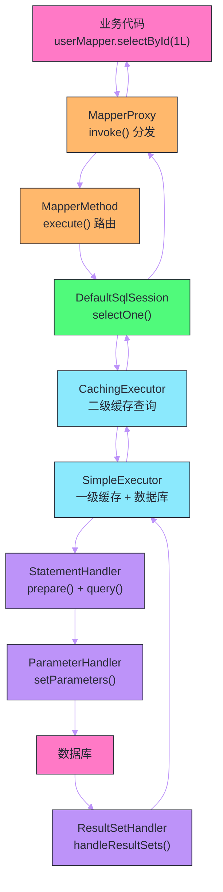

# Mapper接口的代理实现——MapperProxy与MapperMethod

## 摘要

Mybatis 最优雅的设计之一，是让开发者只需要定义一个 Java 接口，框架就能自动生成其实现——`userMapper.selectById(1L)` 背后没有任何手写的实现类，有的只是框架在运行时动态生成的代理对象。这个代理对象通过 JDK 动态代理实现，核心由 `MapperProxy`（代理处理器）和 `MapperMethod`（方法分析器）共同完成。本文深入剖析从 `getMapper(UserMapper.class)` 到接口方法被执行的全过程：`MapperRegistry` 如何管理 Mapper 接口的注册与实例化、`MapperProxy.invoke()` 如何分发方法调用、`MapperMethod` 如何分析方法签名并映射到正确的 `SqlSession` 操作，以及返回值类型推断（单对象/列表/Optional/游标/Map）的完整逻辑。

---

## 第 1 章 为什么 Mapper 接口不需要实现类

### 1.1 传统 DAO 模式的痛点

在 Mybatis 之前（包括 Mybatis 早期版本），数据访问层通常这样写：

```java
// 传统写法：SqlSession API 直接调用
public class UserDaoImpl implements UserDao {
    private SqlSessionFactory sqlSessionFactory;
    
    public User selectById(Long id) {
        try (SqlSession session = sqlSessionFactory.openSession()) {
            // 字符串 ID 容易拼错，无编译期检查
            return session.selectOne("com.example.UserMapper.selectById", id);
        }
    }
    
    public int insert(User user) {
        try (SqlSession session = sqlSessionFactory.openSession()) {
            int rows = session.insert("com.example.UserMapper.insert", user);
            session.commit();
            return rows;
        }
    }
    // 每个方法都要重复 openSession/close，极度冗余
}
```

这种写法的核心问题：
1. **字符串 ID 缺少编译期检查**：`"com.example.UserMapper.selectById"` 拼错了，编译不报错，只在运行时才炸；
2. **SqlSession 管理冗余**：每个方法都要 `openSession`/`close`，模板代码量大；
3. **无 IDE 支持**：字符串 ID 不支持 IDE 的"查找引用"、"重命名"等重构功能；
4. **接口与实现重复**：`UserDao` 接口定义了方法，`UserDaoImpl` 只是把字符串调用包了一层，没有任何业务逻辑，纯粹是噪声代码。

### 1.2 Mapper 接口代理的解决思路

Mybatis 的解决方案：**让 Mapper XML 中的 namespace 与 Java 接口全限定名绑定，接口方法名与 SQL 语句 ID 绑定，然后用 JDK 动态代理自动生成接口的实现**。

```xml
<!-- namespace 绑定到接口全限定名 -->
<mapper namespace="com.example.mapper.UserMapper">
    <!-- SQL ID 绑定到接口方法名 -->
    <select id="selectById" resultType="User">
        SELECT * FROM users WHERE id = #{id}
    </select>
</mapper>
```

```java
// 接口定义（无需实现类）
public interface UserMapper {
    User selectById(Long id);
    int insert(User user);
}

// 使用（代理对象在 Spring 容器中像普通 Bean 一样注入）
@Autowired
private UserMapper userMapper;  // 实际是 MapperProxy 代理对象

public User getUser(Long id) {
    return userMapper.selectById(id);  // 调用代理，最终执行 SQL
}
```

代理的实现让 IDE 完全支持接口方法的重构（重命名接口方法时，可以同步更新 XML 中的 ID），同时消除了 DAO 实现类的模板代码。

---

## 第 2 章 MapperRegistry：Mapper 接口的注册中心

### 2.1 注册机制

`MapperRegistry` 是 `Configuration` 的一个字段，负责管理所有 Mapper 接口的注册信息：

```java
public class MapperRegistry {
    private final Configuration config;
    // key: Mapper 接口的 Class 对象
    // value: MapperProxyFactory（用于创建 MapperProxy 实例）
    private final Map<Class<?>, MapperProxyFactory<?>> knownMappers = new HashMap<>();
    
    // 注册一个 Mapper 接口
    public <T> void addMapper(Class<T> type) {
        if (type.isInterface()) {
            if (hasMapper(type)) {
                // 防止重复注册（重复注册通常意味着配置错误）
                throw new BindingException("Type " + type + " is already known to the MapperRegistry.");
            }
            boolean loadCompleted = false;
            try {
                // 创建 MapperProxyFactory 并注册
                knownMappers.put(type, new MapperProxyFactory<>(type));
                // 解析该 Mapper 接口对应的注解（@Select、@Insert 等）
                // 或触发对应 XML 文件的解析（如果尚未解析）
                MapperAnnotationBuilder parser = new MapperAnnotationBuilder(config, type);
                parser.parse();
                loadCompleted = true;
            } finally {
                if (!loadCompleted) {
                    // 解析失败，从注册表中移除，防止留下半初始化状态
                    knownMappers.remove(type);
                }
            }
        }
    }
    
    // 获取 Mapper 代理实例
    public <T> T getMapper(Class<T> type, SqlSession sqlSession) {
        final MapperProxyFactory<T> mapperProxyFactory = (MapperProxyFactory<T>) knownMappers.get(type);
        if (mapperProxyFactory == null) {
            throw new BindingException("Type " + type + " is not known to the MapperRegistry.");
        }
        try {
            return mapperProxyFactory.newInstance(sqlSession);
        } catch (Exception e) {
            throw new BindingException("Error getting mapper instance...", e);
        }
    }
}
```

### 2.2 注册的触发时机

Mapper 接口的注册发生在 Mybatis 初始化阶段，有三种触发方式：

**方式一：`mybatis-config.xml` 中配置 `<mappers>`**

```xml
<!-- 按包扫描（推荐，最常用） -->
<mappers>
    <package name="com.example.mapper"/>
</mappers>

<!-- 或者逐个配置（适合少量 Mapper） -->
<mappers>
    <mapper resource="com/example/mapper/UserMapper.xml"/>
    <mapper class="com.example.mapper.OrderMapper"/>  <!-- 直接注册接口 -->
</mappers>
```

**方式二：Spring Boot + Mybatis-Spring-Boot-Starter 自动扫描**

通过 `@MapperScan` 注解或 application.yml 的 `mybatis.mapper-locations` 配置，由 `ClassPathMapperScanner` 自动扫描并注册。

**方式三：在 Mapper 接口上加 `@Mapper` 注解**

Spring Boot 的 `MybatisAutoConfiguration` 会自动扫描被 `@Mapper` 标注的接口。

---

## 第 3 章 MapperProxyFactory：代理工厂

`MapperProxyFactory` 是一个轻量级工厂，每个 Mapper 接口对应一个 `MapperProxyFactory` 实例：

```java
public class MapperProxyFactory<T> {
    private final Class<T> mapperInterface;  // 要代理的接口类型
    // 缓存已分析过的 MapperMethod（key: Method 对象，value: MapperMethodInvoker）
    // 避免每次方法调用都重新分析方法签名
    private final Map<Method, MapperMethodInvoker> methodCache = new ConcurrentHashMap<>();
    
    public MapperProxyFactory(Class<T> mapperInterface) {
        this.mapperInterface = mapperInterface;
    }
    
    // 创建 MapperProxy 实例（JDK 动态代理）
    public T newInstance(SqlSession sqlSession) {
        final MapperProxy<T> mapperProxy = new MapperProxy<>(sqlSession, mapperInterface, methodCache);
        return newInstance(mapperProxy);
    }
    
    protected T newInstance(MapperProxy<T> mapperProxy) {
        // 使用 JDK 动态代理：代理对象实现了 mapperInterface，InvocationHandler 是 mapperProxy
        return (T) Proxy.newProxyInstance(
            mapperInterface.getClassLoader(),
            new Class[]{mapperInterface},
            mapperProxy);
    }
}
```

`methodCache` 是关键性能优化点：`MapperMethod` 的构建需要通过反射分析方法签名、查找对应的 `MappedStatement` 等，开销不小。将已分析结果缓存在 `ConcurrentHashMap` 中，同一方法的后续调用直接复用，避免重复分析。

---

## 第 4 章 MapperProxy：代理处理器的核心逻辑

### 4.1 invoke() 方法的完整分发逻辑

`MapperProxy` 实现了 JDK 的 `InvocationHandler` 接口，是代理对象所有方法调用的入口：

```java
public class MapperProxy<T> implements InvocationHandler, Serializable {
    private static final long serialVersionUID = -4724728412955527868L;
    
    // 当前 SqlSession（每个请求/事务对应一个 SqlSession）
    private final SqlSession sqlSession;
    // 要代理的接口类型
    private final Class<T> mapperInterface;
    // 方法缓存：避免重复分析
    private final Map<Method, MapperMethodInvoker> methodCache;
    
    @Override
    public Object invoke(Object proxy, Method method, Object[] args) throws Throwable {
        try {
            // 分支一：Object 类的方法（toString/hashCode/equals 等）
            // 直接调用，不走 Mybatis 的 SQL 逻辑
            if (Object.class.equals(method.getDeclaringClass())) {
                return method.invoke(this, args);
            }
            
            // 分支二：接口的 default 方法（Java 8+）
            // 通过 MethodHandle 调用接口的默认实现
            // 分支三：普通接口抽象方法（绝大多数情况）
            // 查找或创建 MapperMethodInvoker，执行 SQL
            return cachedInvoker(method).invoke(proxy, method, args, sqlSession);
            
        } catch (Throwable t) {
            throw ExceptionUtil.unwrapThrowable(t);
        }
    }
    
    // 查找或创建缓存的 MapperMethodInvoker
    private MapperMethodInvoker cachedInvoker(Method method) throws Throwable {
        try {
            // computeIfAbsent：如果 methodCache 中没有，就创建并放入
            return MapUtil.computeIfAbsent(methodCache, method, m -> {
                if (m.isDefault()) {
                    // default 方法：使用 DefaultMethodInvoker 包装 MethodHandle
                    try {
                        // Java 8 与 Java 9+ 的 MethodHandle 获取方式不同
                        if (privateLookupInMethod == null) {
                            return new DefaultMethodInvoker(getMethodHandleJava8(method));
                        } else {
                            return new DefaultMethodInvoker(getMethodHandleJava9(method));
                        }
                    } catch (Exception e) {
                        throw new RuntimeException(e);
                    }
                } else {
                    // 普通抽象方法：创建 PlainMethodInvoker，包装 MapperMethod
                    return new PlainMethodInvoker(
                        new MapperMethod(mapperInterface, method, sqlSession.getConfiguration()));
                }
            });
        } catch (RuntimeException re) {
            Throwable cause = re.getCause();
            throw cause == null ? re : cause;
        }
    }
}
```

### 4.2 default 方法的特殊处理

Java 8 引入了接口的 `default` 方法，让接口可以提供默认实现。在 Mapper 接口中，`default` 方法有时被用于组合多个查询或添加通用逻辑：

```java
public interface UserMapper {
    User selectById(Long id);
    
    // default 方法：组合多个查询，提供更高层次的抽象
    default UserWithOrders selectWithOrders(Long id) {
        User user = selectById(id);
        List<Order> orders = selectOrdersByUserId(id);
        return new UserWithOrders(user, orders);
    }
    
    List<Order> selectOrdersByUserId(Long userId);
}
```

当调用 `userMapper.selectWithOrders(1L)` 时，`MapperProxy.invoke()` 检测到这是 `default` 方法，通过 `MethodHandle` 调用接口中的默认实现（而不是走 Mybatis 的 SQL 执行路径）。

`MethodHandle` 是 Java 7 引入的方法调用机制，可以理解为"类型安全的方法引用"，比反射更高效且类型安全。对于接口 `default` 方法，需要通过特殊方式获取 `MethodHandle`：

```java
// Java 9+ 的实现（推荐）
private MethodHandle getMethodHandleJava9(Method method) throws Exception {
    final Class<?> declaringClass = method.getDeclaringClass();
    return MethodHandles.lookup()
        .findSpecial(declaringClass, method.getName(),
            MethodType.methodType(method.getReturnType(), method.getParameterTypes()),
            declaringClass)
        .bindTo(proxy);
}
```

---

## 第 5 章 MapperMethod：方法签名分析与执行分发

### 5.1 MapperMethod 的职责

`MapperMethod` 是 Mapper 接口方法与 `SqlSession` 操作之间的桥梁，它在初始化时完成两件事：

1. **`SqlCommand`**：分析方法对应的 SQL 命令类型（SELECT/INSERT/UPDATE/DELETE/FLUSH）和 Statement ID；
2. **`MethodSignature`**：分析方法的参数列表和返回值类型，决定如何传参、如何处理返回值。

```java
public class MapperMethod {
    private final SqlCommand command;        // SQL 命令信息
    private final MethodSignature method;    // 方法签名信息
    
    public MapperMethod(Class<?> mapperInterface, Method method, Configuration config) {
        this.command = new SqlCommand(config, mapperInterface, method);
        this.method = new MethodSignature(config, mapperInterface, method);
    }
    
    // 执行：根据 SQL 类型分发到正确的 SqlSession 方法
    public Object execute(SqlSession sqlSession, Object[] args) {
        Object result;
        switch (command.getType()) {
            case INSERT: {
                // 处理参数，调用 sqlSession.insert()
                Object param = method.convertArgsToSqlCommandParam(args);
                result = rowCountResult(sqlSession.insert(command.getName(), param));
                break;
            }
            case UPDATE: {
                Object param = method.convertArgsToSqlCommandParam(args);
                result = rowCountResult(sqlSession.update(command.getName(), param));
                break;
            }
            case DELETE: {
                Object param = method.convertArgsToSqlCommandParam(args);
                result = rowCountResult(sqlSession.delete(command.getName(), param));
                break;
            }
            case SELECT:
                // SELECT 的处理最复杂：根据返回值类型选择不同的 SqlSession API
                if (method.returnsVoid() && method.hasResultHandler()) {
                    // 方法参数中有 ResultHandler：流式处理结果
                    executeWithResultHandler(sqlSession, args);
                    result = null;
                } else if (method.returnsMany()) {
                    // 返回 List 或数组
                    result = executeForMany(sqlSession, args);
                } else if (method.returnsMap()) {
                    // 返回 Map（方法上有 @MapKey 注解）
                    result = executeForMap(sqlSession, args);
                } else if (method.returnsCursor()) {
                    // 返回 Cursor（流式游标，不一次性加载到内存）
                    result = executeForCursor(sqlSession, args);
                } else {
                    // 返回单个对象（或 Optional）
                    Object param = method.convertArgsToSqlCommandParam(args);
                    result = sqlSession.selectOne(command.getName(), param);
                    if (method.returnsOptional()
                            && (result == null || !method.getReturnType().equals(result.getClass()))) {
                        result = Optional.ofNullable(result);
                    }
                }
                break;
            case FLUSH:
                // 刷新 BatchExecutor 的批次（批量模式专用）
                result = sqlSession.flushStatements();
                break;
            default:
                throw new BindingException("Unknown execution method for: " + command.getName());
        }
        
        // 如果方法声明返回类型是基本类型（int/boolean 等），但实际结果为 null，
        // 抛出异常（防止 NullPointerException 自动拆箱）
        if (result == null && method.getReturnType().isPrimitive()
                && !method.returnsVoid()) {
            throw new BindingException("Mapper method '" + command.getName()
                + " attempted to return null from a method with a primitive return type (" 
                + method.getReturnType() + ").");
        }
        return result;
    }
}
```

### 5.2 SqlCommand：绑定 SQL 语句

`SqlCommand` 在初始化时解析方法对应的 `MappedStatement`：

```java
public static class SqlCommand {
    private final String name;              // MappedStatement ID（如 "com.example.UserMapper.selectById"）
    private final SqlCommandType type;      // SELECT / INSERT / UPDATE / DELETE / FLUSH / UNKNOWN
    
    public SqlCommand(Configuration configuration, Class<?> mapperInterface, Method method) {
        final String methodName = method.getName();
        final Class<?> declaringClass = method.getDeclaringClass();
        
        // 查找 MappedStatement：先在声明类的 namespace 中查找，再在接口 namespace 中查找
        MappedStatement ms = resolveMappedStatement(mapperInterface, methodName, declaringClass, configuration);
        
        if (ms == null) {
            // 如果方法有 @Flush 注解（BatchExecutor 模式用于提交批次），SqlCommandType = FLUSH
            if (method.getAnnotation(Flush.class) != null) {
                name = null;
                type = SqlCommandType.FLUSH;
            } else {
                throw new BindingException("Invalid bound statement (not found): "
                    + mapperInterface.getName() + "." + methodName);
            }
        } else {
            name = ms.getId();
            type = ms.getSqlCommandType();
            if (type == SqlCommandType.UNKNOWN) {
                throw new BindingException("Unknown execution method for: " + name);
            }
        }
    }
    
    private MappedStatement resolveMappedStatement(Class<?> mapperInterface, String methodName,
                                                    Class<?> declaringClass, Configuration configuration) {
        // 构建 statementId：接口全限定名 + "." + 方法名
        String statementId = mapperInterface.getName() + "." + methodName;
        
        if (configuration.hasStatement(statementId)) {
            return configuration.getMappedStatement(statementId);
        } else if (mapperInterface.equals(declaringClass)) {
            return null;
        }
        
        // 如果当前接口没找到，去父接口中查找（支持接口继承）
        for (Class<?> superInterface : mapperInterface.getInterfaces()) {
            if (declaringClass.isAssignableFrom(superInterface)) {
                MappedStatement ms = resolveMappedStatement(superInterface, methodName,
                    declaringClass, configuration);
                if (ms != null) {
                    return ms;
                }
            }
        }
        return null;
    }
}
```

### 5.3 MethodSignature：返回值类型的推断逻辑

`MethodSignature` 分析方法的参数和返回值，是 Mybatis 自动处理各种返回类型的关键：

```java
public static class MethodSignature {
    private final boolean returnsMany;       // 返回 Collection 或数组？
    private final boolean returnsMap;        // 返回 Map（有 @MapKey 注解）？
    private final boolean returnsVoid;       // 返回 void？
    private final boolean returnsCursor;     // 返回 Cursor（流式游标）？
    private final boolean returnsOptional;   // 返回 Optional？
    private final Class<?> returnType;       // 方法返回类型
    private final String mapKey;             // @MapKey 注解指定的列名
    private final Integer resultHandlerIndex; // ResultHandler 参数的位置（如有）
    private final Integer rowBoundsIndex;    // RowBounds 参数的位置（如有）
    private final ParamNameResolver paramNameResolver; // 参数解析器
    
    public MethodSignature(Configuration configuration, Class<?> mapperInterface, Method method) {
        // 解析返回类型（处理泛型，如 List<User>，提取 User）
        Type resolvedReturnType = TypeParameterResolver.resolveReturnType(method, mapperInterface);
        if (resolvedReturnType instanceof Class<?>) {
            this.returnType = (Class<?>) resolvedReturnType;
        } else if (resolvedReturnType instanceof ParameterizedType) {
            // 泛型类型（如 List<User>）：取原始类型（List）
            this.returnType = (Class<?>) ((ParameterizedType) resolvedReturnType).getRawType();
        } else {
            this.returnType = method.getReturnType();
        }
        
        // 判断各种返回类型标志
        this.returnsVoid = void.class.equals(this.returnType);
        this.returnsMany = configuration.getObjectFactory().isCollection(this.returnType)
            || this.returnType.isArray();
        this.returnsCursor = Cursor.class.equals(this.returnType);
        this.returnsOptional = Optional.class.equals(this.returnType);
        
        // 处理 @MapKey 注解
        this.mapKey = getMapKey(method);
        this.returnsMap = this.mapKey != null;
        
        // 找到特殊参数的位置（RowBounds 和 ResultHandler 不作为 SQL 参数）
        this.rowBoundsIndex = getUniqueParamIndex(method, RowBounds.class);
        this.resultHandlerIndex = getUniqueParamIndex(method, ResultHandler.class);
        
        // 构建参数解析器
        this.paramNameResolver = new ParamNameResolver(configuration, method);
    }
    
    // 将方法参数数组转换为 SqlSession 能理解的参数对象
    public Object convertArgsToSqlCommandParam(Object[] args) {
        return paramNameResolver.getNamedParams(args);
    }
}
```

### 5.4 各返回类型的处理方式

**单对象返回**（`selectOne`）：

```java
// 方法签名：User selectById(Long id)
Object param = method.convertArgsToSqlCommandParam(args);
result = sqlSession.selectOne(command.getName(), param);
// selectOne 内部调用 selectList，如果 List.size() > 1 抛出 TooManyResultsException
```

**列表返回**（`selectList`）：

```java
// 方法签名：List<User> selectAll() 或 User[] selectAll()
private <E> Object executeForMany(SqlSession sqlSession, Object[] args) {
    List<E> result;
    Object param = method.convertArgsToSqlCommandParam(args);
    if (method.hasRowBounds()) {
        // 如果参数中有 RowBounds，传入内存分页参数
        RowBounds rowBounds = method.extractRowBounds(args);
        result = sqlSession.selectList(command.getName(), param, rowBounds);
    } else {
        result = sqlSession.selectList(command.getName(), param);
    }
    // 如果方法返回类型是数组，将 List 转为数组
    if (!method.getReturnType().isAssignableFrom(result.getClass())) {
        if (method.getReturnType().isArray()) {
            return convertToArray(result);
        } else {
            return convertToDeclaredCollection(sqlSession.getConfiguration(), result);
        }
    }
    return result;
}
```

**Map 返回**（`@MapKey` 注解）：

```java
// 方法签名：@MapKey("id") Map<Long, User> selectAllAsMap()
// 返回以 id 为 key，User 对象为 value 的 Map
private <K, V> Map<K, V> executeForMap(SqlSession sqlSession, Object[] args) {
    Map<K, V> result;
    Object param = method.convertArgsToSqlCommandParam(args);
    if (method.hasRowBounds()) {
        RowBounds rowBounds = method.extractRowBounds(args);
        // sqlSession.selectMap 内部调用 selectList，然后根据 mapKey 转换为 Map
        result = sqlSession.selectMap(command.getName(), param, method.getMapKey(), rowBounds);
    } else {
        result = sqlSession.selectMap(command.getName(), param, method.getMapKey());
    }
    return result;
}
```

**Optional 返回**（Java 8+）：

```java
// 方法签名：Optional<User> findById(Long id)
Object param = method.convertArgsToSqlCommandParam(args);
result = sqlSession.selectOne(command.getName(), param);
// 包装成 Optional（null 变为 Optional.empty()，非 null 变为 Optional.of(result)）
result = Optional.ofNullable(result);
```

**Cursor 返回**（流式游标，适合大结果集）：

```java
// 方法签名：Cursor<User> selectAllCursor()
// Cursor 实现了 Iterable，可以逐行处理，不一次性加载到内存
private <T> Cursor<T> executeForCursor(SqlSession sqlSession, Object[] args) {
    Cursor<T> result;
    Object param = method.convertArgsToSqlCommandParam(args);
    if (method.hasRowBounds()) {
        RowBounds rowBounds = method.extractRowBounds(args);
        result = sqlSession.selectCursor(command.getName(), param, rowBounds);
    } else {
        result = sqlSession.selectCursor(command.getName(), param);
    }
    return result;
}
```

**`ResultHandler` 参数**（流式回调处理）：

```java
// 方法签名：void selectAllWithHandler(ResultHandler<User> handler)
// 每查出一行，立即回调 handler.handleResult()，不积累到 List
private void executeWithResultHandler(SqlSession sqlSession, Object[] args) {
    MappedStatement ms = sqlSession.getConfiguration().getMappedStatement(command.getName());
    // 必须是 SELECT 且不是存储过程
    if (!StatementType.CALLABLE.equals(ms.getStatementType())
            && void.class.equals(ms.getResultMaps().get(0).getType())) {
        throw new BindingException("...");
    }
    Object param = method.convertArgsToSqlCommandParam(args);
    if (method.hasRowBounds()) {
        RowBounds rowBounds = method.extractRowBounds(args);
        sqlSession.select(command.getName(), param, rowBounds,
            (ResultHandler) args[method.getResultHandlerIndex()]);
    } else {
        sqlSession.select(command.getName(), param,
            (ResultHandler) args[method.getResultHandlerIndex()]);
    }
}
```

---

## 第 6 章 完整调用链路回顾

结合前几篇文章，现在可以串联 Mapper 接口调用的完整链路：



每个环节的职责：
1. **`MapperProxy.invoke()`**：拦截接口方法调用，查找或创建 `MapperMethodInvoker`；
2. **`MapperMethod.execute()`**：分析 SQL 类型和返回值类型，调用正确的 `SqlSession` API；
3. **`DefaultSqlSession`**：门面，参数封装，委托给 `Executor`；
4. **`CachingExecutor`**：二级缓存查询/写入（通过 `TransactionalCache` 暂存）；
5. **`SimpleExecutor`**：一级缓存查询/写入，调用 `StatementHandler`；
6. **`StatementHandler.prepare()`**：创建 `PreparedStatement`；
7. **`ParameterHandler.setParameters()`**：绑定参数；
8. **`StatementHandler.query()`**：执行 SQL；
9. **`ResultSetHandler`**：将 `ResultSet` 映射为 Java 对象。

---

## 第 7 章 Mapper 接口使用的进阶特性

### 7.1 接口继承

Mapper 接口支持继承，子接口会继承父接口的所有方法：

```java
// 通用 CRUD 基础接口
public interface BaseMapper<T, ID> {
    T selectById(ID id);
    List<T> selectAll();
    int insert(T entity);
    int updateById(T entity);
    int deleteById(ID id);
}

// 继承基础接口，添加业务特定方法
public interface UserMapper extends BaseMapper<User, Long> {
    // 继承了 5 个通用方法
    // 额外添加业务方法
    List<User> selectByStatus(@Param("status") String status);
    List<User> selectByDeptAndStatus(@Param("deptId") Long deptId, 
                                     @Param("status") String status);
}
```

父接口的 SQL 映射同样在 XML 中定义，namespace 使用子接口的全限定名，方法 ID 直接是父接口的方法名：

```xml
<!-- UserMapper.xml -->
<mapper namespace="com.example.mapper.UserMapper">
    <!-- 继承自 BaseMapper 的方法 -->
    <select id="selectById" resultType="User">
        SELECT * FROM users WHERE id = #{id}
    </select>
    <!-- ... -->
    
    <!-- UserMapper 自己的方法 -->
    <select id="selectByStatus" resultType="User">
        SELECT * FROM users WHERE status = #{status}
    </select>
</mapper>
```

`SqlCommand.resolveMappedStatement()` 会先在子接口的 namespace 中查找，找不到再递归向父接口查找，支持这种继承体系。

### 7.2 注解方式 vs XML 方式

Mybatis 支持两种方式定义 SQL：

```java
// 注解方式（简单 SQL 推荐，无需 XML）
public interface UserMapper {
    @Select("SELECT * FROM users WHERE id = #{id}")
    User selectById(Long id);
    
    @Insert("INSERT INTO users (name, email) VALUES (#{name}, #{email})")
    @Options(useGeneratedKeys = true, keyProperty = "id")  // 返回自动生成的主键
    int insert(User user);
    
    @Update("UPDATE users SET name = #{name}, email = #{email} WHERE id = #{id}")
    int update(User user);
    
    @Delete("DELETE FROM users WHERE id = #{id}")
    int delete(Long id);
    
    // 复杂 SQL 可用 @SelectProvider（通过 Java 代码动态生成 SQL）
    @SelectProvider(type = UserSqlProvider.class, method = "buildSearchSql")
    List<User> search(@Param("keyword") String keyword, @Param("status") String status);
}

// SQL 提供者（适合复杂动态 SQL，但不如 XML 直观）
public class UserSqlProvider {
    public String buildSearchSql(@Param("keyword") String keyword, @Param("status") String status) {
        return new SQL() {{
            SELECT("*");
            FROM("users");
            if (keyword != null && !keyword.isEmpty()) {
                WHERE("name LIKE CONCAT('%', #{keyword}, '%')");
            }
            if (status != null) {
                WHERE("status = #{status}");
            }
            ORDER_BY("created_at DESC");
        }}.toString();
    }
}
```

**注解 vs XML 的选择建议**：
- 简单 CRUD（单表、无动态条件）：注解方式更简洁；
- 复杂查询（多表 JOIN、多动态条件、嵌套 ResultMap）：XML 方式更易读、更易维护；
- 团队规范统一最重要：混用会增加认知负担，推荐全部 XML 或全部注解，勿混用。

---

## 总结

Mapper 接口代理机制是 Mybatis 最优雅的设计，它让开发者只需定义接口，框架自动完成"接口 → SQL 执行"的全部转换：

- **`MapperRegistry`** 维护"Mapper 接口 → `MapperProxyFactory`"的注册表，在初始化时扫描并注册所有 Mapper 接口；
- **`MapperProxyFactory.newInstance()`** 通过 JDK `Proxy.newProxyInstance()` 创建代理对象，InvocationHandler 是 `MapperProxy`；`methodCache` 缓存已分析的 `MapperMethodInvoker`，避免重复反射；
- **`MapperProxy.invoke()`** 区分三类方法：`Object` 方法（直接调用）、`default` 方法（MethodHandle 调用）、普通接口方法（走 `MapperMethod`）；
- **`MapperMethod.execute()`** 根据 `SqlCommand.type` 分发到 `SqlSession` 的 `insert`/`update`/`delete`/`select` 方法，根据 `MethodSignature` 的返回类型信息选择 `selectOne`/`selectList`/`selectMap`/`selectCursor` 等变体；
- **返回值类型推断**是 `MethodSignature` 的核心能力：通过 `returnsMany`/`returnsMap`/`returnsCursor`/`returnsOptional` 等标志位，让同一个 `execute()` 方法能处理所有返回类型变体；
- Mapper 接口支持继承（父接口方法通过递归查找 `MappedStatement`），支持注解方式定义 SQL。

下一篇，剖析 Mybatis 与 Spring 的整合机制——`SqlSessionTemplate` 如何保证线程安全、Mybatis 事务如何与 Spring 事务无缝对接：[[09 Mybatis-Spring整合原理——SqlSessionTemplate与事务管理]]。

---

> [!note] 参考资料
> - `org.apache.ibatis.binding.MapperProxy` 源码
> - `org.apache.ibatis.binding.MapperMethod` 源码
> - `org.apache.ibatis.binding.MapperProxyFactory` 源码
> - `org.apache.ibatis.binding.MapperRegistry` 源码

---

> [!note] 思考题
> 1. Mapper 接口没有实现类，MyBatis 通过 JDK 动态代理生成实现。`MapperProxy` 实现了 `InvocationHandler`，将方法调用转发为 SqlSession 的 select/insert/update/delete 操作。这意味着 Mapper 接口的方法只能返回 MyBatis 支持的类型——如果方法返回 `CompletableFuture<User>`（异步），MyBatis 能否处理？
> 2. `MapperMethod` 内部将 Mapper 方法的返回类型映射为具体的 SqlSession 操作：返回 `List` 调用 `selectList`，返回单个对象调用 `selectOne`，返回 `Map` 调用 `selectMap`。如果一个方法声明返回 `Optional<User>`，MyBatis 3.5+ 是如何支持的？底层是先调用 `selectOne` 再包装为 `Optional` 吗？
> 3. 在 Spring 中，`@MapperScan` 扫描 Mapper 接口并注册为 Spring Bean。底层使用 `MapperFactoryBean` 创建代理实例。如果两个不同的 Mapper 接口定义了相同签名的方法但对应不同的 SQL（不同的 XML Namespace），Spring 容器中会有冲突吗？
