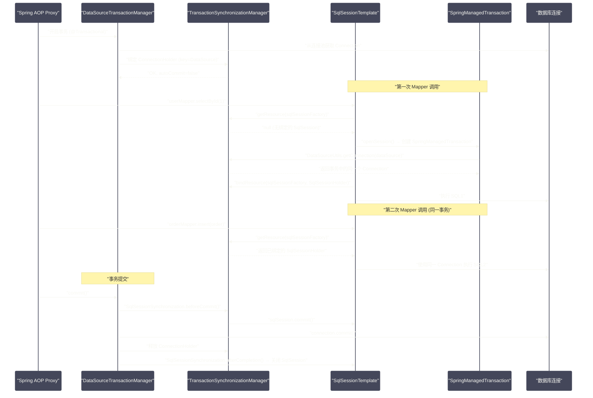

# Mybatis-Spring整合原理——SqlSessionTemplate与事务管理

## 摘要

在 Spring 应用中，我们从来不直接操作 `SqlSession`，而是将 `UserMapper` 等接口直接注入使用——这背后有一套精妙的整合机制：`mybatis-spring` 模块提供了 `SqlSessionTemplate`（线程安全的 SqlSession 代理）和 `MapperScannerConfigurer`（将 Mapper 接口注册为 Spring Bean），将 Mybatis 的生命周期管理与 Spring 的事务体系无缝融合。本文深入剖析三个核心问题：`SqlSessionTemplate` 如何做到线程安全（每次方法调用都可能在不同线程执行，但 SqlSession 非线程安全）、Mybatis 事务如何与 Spring 的 `@Transactional` 协同工作（共享同一个数据库连接）、以及 `MapperScannerConfigurer` 如何将 Mapper 接口扫描并注册为 Spring BeanDefinition。理解这层整合机制，是深入掌握 Spring Boot 项目中 Mybatis 行为的必要前提。

---

## 第 1 章 整合的核心挑战

### 1.1 SqlSession 的线程安全问题

`SqlSession` 的官方文档明确说明：**SqlSession 不是线程安全的，不能在多个线程间共享**。原因很简单——`SqlSession` 持有一个 `Connection`（或通过 `Transaction` 持有连接），连接是有状态的（游标位置、事务状态等），并发访问会导致数据混乱。

正确的用法是每个线程（或每个请求）独享一个 `SqlSession`，用完即关闭：

```java
// Mybatis 原生的正确用法：每次请求创建独立 SqlSession
try (SqlSession session = sqlSessionFactory.openSession()) {
    UserMapper mapper = session.getMapper(UserMapper.class);
    User user = mapper.selectById(1L);
}
```

但在 Spring 应用中，Mapper 接口通常被注入为单例 Bean（`@Autowired private UserMapper userMapper`），多个线程会共享同一个 `userMapper` 实例。如果 `userMapper` 内部直接持有一个 `SqlSession`，就会有线程安全问题。

### 1.2 Spring 事务的协调要求

Spring 的 `@Transactional` 事务管理要求：**在同一个事务中的所有数据库操作，必须使用同一个数据库 Connection**。这样，Spring 才能在事务结束时对同一个 Connection 执行 `commit` 或 `rollback`。

Mybatis 的 `SqlSession` 内部封装了 Connection（通过 `Transaction` 接口）。问题在于：如果每次 Mapper 方法调用都创建新的 `SqlSession`（新的 Connection），Spring 事务就无法把多个 Mapper 调用包含在同一个事务里——因为它们各自有独立的 Connection。

**解决思路**：当 Spring 事务开启时，必须让同一事务内的所有 Mapper 调用共享同一个 `SqlSession`（进而共享同一个 Connection）；事务结束时，由 Spring 负责 commit/rollback，而不是 Mybatis 自行管理。

这两个挑战共同决定了 `mybatis-spring` 的核心设计：**`SqlSessionTemplate` 作为线程安全的代理，在有事务时绑定 SqlSession 到当前事务，在无事务时创建临时 SqlSession 并用完即关**。

---

## 第 2 章 SqlSessionTemplate：线程安全的 SqlSession 代理

### 2.1 SqlSessionTemplate 的本质

`SqlSessionTemplate` 实现了 `SqlSession` 接口，可以作为 `SqlSession` 使用，但它本身不是真正的 `SqlSession` 实现——它是一个**线程安全的代理门面（Proxy Facade）**，将所有方法调用委托给 JDK 动态代理 `sqlSessionProxy`，由代理决定使用哪个实际的 `SqlSession` 实例。

```java
public class SqlSessionTemplate implements SqlSession, DisposableBean {
    private final SqlSessionFactory sqlSessionFactory;
    private final ExecutorType executorType;
    // 核心：JDK 动态代理，拦截所有 SqlSession 方法调用
    private final SqlSession sqlSessionProxy;
    private final PersistenceExceptionTranslator exceptionTranslator;
    
    public SqlSessionTemplate(SqlSessionFactory sqlSessionFactory, ExecutorType executorType,
                               PersistenceExceptionTranslator exceptionTranslator) {
        this.sqlSessionFactory = sqlSessionFactory;
        this.executorType = executorType;
        this.exceptionTranslator = exceptionTranslator;
        
        // 创建代理：实现 SqlSession 接口，InvocationHandler 是 SqlSessionInterceptor
        this.sqlSessionProxy = (SqlSession) newProxyInstance(
            SqlSessionFactory.class.getClassLoader(),
            new Class[]{SqlSession.class},
            new SqlSessionInterceptor());
    }
    
    // 所有 SqlSession 方法都委托给 sqlSessionProxy（代理）
    @Override
    public <T> T selectOne(String statement) {
        return this.sqlSessionProxy.selectOne(statement);
    }
    
    @Override
    public <T> T selectOne(String statement, Object parameter) {
        return this.sqlSessionProxy.selectOne(statement, parameter);
    }
    
    // ... 所有其他 SqlSession 方法同理
}
```

### 2.2 SqlSessionInterceptor：线程安全的秘密

`SqlSessionInterceptor` 是 `SqlSessionTemplate` 的内部类，也是整个整合机制最核心的部分：

```java
private class SqlSessionInterceptor implements InvocationHandler {
    @Override
    public Object invoke(Object proxy, Method method, Object[] args) throws Throwable {
        // 关键方法：获取或创建当前线程/事务的 SqlSession
        // 这里会检查 Spring 事务上下文，决定是复用事务中的 SqlSession，还是创建新的
        SqlSession sqlSession = getSqlSession(
            SqlSessionTemplate.this.sqlSessionFactory,
            SqlSessionTemplate.this.executorType,
            SqlSessionTemplate.this.exceptionTranslator);
        
        try {
            // 调用实际 SqlSession 的方法（真正执行 SQL）
            Object result = method.invoke(sqlSession, args);
            
            // 判断当前 SqlSession 是否绑定到 Spring 事务
            if (!isSqlSessionTransactional(sqlSession, SqlSessionTemplate.this.sqlSessionFactory)) {
                // 不在事务中：强制提交（对于查询操作等效于 autoCommit）
                // 注意：这里传 true 表示"强制"commit，即使没有写操作也 commit
                // 实际上对于只读操作，这个 commit 不会产生任何 JDBC commit
                sqlSession.commit(true);
            }
            return result;
            
        } catch (Throwable t) {
            // 异常处理：将 Mybatis 异常转换为 Spring DataAccessException
            Throwable unwrapped = unwrapThrowable(t);
            if (SqlSessionTemplate.this.exceptionTranslator != null
                && unwrapped instanceof PersistenceException) {
                // 释放连接（重要：避免连接泄漏）
                closeSqlSession(sqlSession, SqlSessionTemplate.this.sqlSessionFactory);
                sqlSession = null;  // 置 null 防止 finally 中再次关闭
                Throwable translated = SqlSessionTemplate.this.exceptionTranslator
                    .translateExceptionIfPossible((PersistenceException) unwrapped);
                if (translated != null) {
                    unwrapped = translated;  // 转换为 Spring 异常体系
                }
            }
            throw unwrapped;
        } finally {
            if (sqlSession != null) {
                // 关闭或归还 SqlSession
                // 如果 SqlSession 绑定到事务：不关闭，只减少引用计数
                // 如果 SqlSession 不在事务中：真正关闭（归还连接到连接池）
                closeSqlSession(sqlSession, SqlSessionTemplate.this.sqlSessionFactory);
            }
        }
    }
}
```

### 2.3 getSqlSession()：事务感知的 SqlSession 获取

`getSqlSession()` 是整合机制的心脏，实现了"有事务时共享 SqlSession，无事务时用后即弃"的逻辑：

```java
// SqlSessionUtils.getSqlSession()
public static SqlSession getSqlSession(SqlSessionFactory sessionFactory,
                                        ExecutorType executorType,
                                        PersistenceExceptionTranslator exceptionTranslator) {
    
    // 关键：从 Spring 事务同步管理器中获取当前线程绑定的 SqlSessionHolder
    // TransactionSynchronizationManager 是 Spring 事务机制的核心，
    // 它用 ThreadLocal 存储当前线程的事务资源（Connection、SqlSession 等）
    SqlSessionHolder holder = (SqlSessionHolder) TransactionSynchronizationManager
        .getResource(sessionFactory);
    
    SqlSession session = sessionHolder(executorType, holder);
    if (session != null) {
        // 情况一：当前线程已经有绑定到事务的 SqlSession
        // 直接复用，不创建新的
        return session;
    }
    
    // 情况二：当前线程没有事务中的 SqlSession，创建新的
    log.debug("Creating a new SqlSession");
    session = sessionFactory.openSession(executorType);
    
    // 尝试将新建的 SqlSession 注册到 Spring 事务同步体系
    registerSessionHolder(sessionFactory, executorType, exceptionTranslator, session);
    
    return session;
}

private static void registerSessionHolder(SqlSessionFactory sessionFactory,
                                           ExecutorType executorType,
                                           PersistenceExceptionTranslator exceptionTranslator,
                                           SqlSession session) {
    SqlSessionHolder holder;
    
    // 判断当前是否有激活的 Spring 事务（通过 TransactionSynchronizationManager 检查）
    if (TransactionSynchronizationManager.isSynchronizationActive()) {
        // 有事务！将新建的 SqlSession 绑定到当前事务
        Environment environment = sessionFactory.getConfiguration().getEnvironment();
        
        // 检查 Mybatis 使用的事务管理器类型
        if (environment.getTransactionFactory() instanceof SpringManagedTransactionFactory) {
            // 使用 Spring 管理的事务工厂（mybatis-spring 提供）
            log.debug("Registering transaction synchronization for SqlSession [" + session + "]");
            
            holder = new SqlSessionHolder(session, executorType, exceptionTranslator);
            // 将 SqlSession 绑定到 TransactionSynchronizationManager
            // key: sqlSessionFactory, value: SqlSessionHolder
            TransactionSynchronizationManager.bindResource(sessionFactory, holder);
            
            // 注册事务同步回调：当事务提交/回滚时，自动处理 SqlSession
            TransactionSynchronizationManager.registerSynchronization(
                new SqlSessionSynchronization(holder, sessionFactory));
            holder.setSynchronizedWithTransaction(true);
            holder.requested();  // 引用计数 +1
        } else {
            // 非 Spring 事务工厂（如原生 JdbcTransactionFactory）
            // 需要确保 Mybatis 和 Spring 使用同一个 Connection
            if (TransactionSynchronizationManager.getResource(environment.getDataSource()) == null) {
                log.debug("SqlSession [" + session + "] was not registered for synchronization "
                    + "because DataSource is not transactional");
            } else {
                throw new TransientDataAccessResourceException(
                    "SqlSessionFactory must be using a SpringManagedTransactionFactory ...");
            }
        }
    } else {
        // 没有事务：不注册，此 SqlSession 用完即弃
        log.debug("SqlSession [" + session + "] was not registered for synchronization "
            + "because synchronization is not active");
    }
}
```

---

## 第 3 章 Spring 事务与 Mybatis 的协作全流程

### 3.1 事务开启时的 Connection 绑定

当 Spring 的 `@Transactional` 注解触发事务开启时（通过 `PlatformTransactionManager`），会向 `TransactionSynchronizationManager` 的 `ThreadLocal` 资源中绑定一个 `ConnectionHolder`（持有从连接池获取的 `Connection`）。

`mybatis-spring` 提供的 `SpringManagedTransaction` 在 `getConnection()` 时，不是自己从连接池获取新连接，而是**从 `TransactionSynchronizationManager` 中获取 Spring 事务已绑定的连接**：

```java
public class SpringManagedTransaction implements Transaction {
    private final DataSource dataSource;
    private Connection connection;
    private boolean isConnectionTransactional;  // 连接是否由 Spring 事务管理
    private boolean autoCommit;
    
    @Override
    public Connection getConnection() throws SQLException {
        if (this.connection == null) {
            openConnection();
        }
        return this.connection;
    }
    
    private void openConnection() throws SQLException {
        // 关键：通过 DataSourceUtils.getConnection() 获取连接
        // 这个方法会先检查 TransactionSynchronizationManager 中是否有事务绑定的连接
        // 如果有，返回事务连接；如果没有，从连接池获取新连接
        this.connection = DataSourceUtils.getConnection(this.dataSource);
        
        this.autoCommit = this.connection.getAutoCommit();
        // 判断此连接是否由 Spring 事务管理（是否在 TransactionSynchronizationManager 中）
        this.isConnectionTransactional = DataSourceUtils.isConnectionTransactional(
            this.connection, this.dataSource);
        
        log.debug("JDBC Connection [" + this.connection + "] will"
            + (this.isConnectionTransactional ? " " : " not ") + "be managed by Spring");
    }
    
    @Override
    public void commit() throws SQLException {
        // 只有连接不受 Spring 事务管理时，才执行真正的 JDBC commit
        // 如果连接由 Spring 事务管理，commit 由 Spring 统一执行，这里不做任何事
        if (this.connection != null && !this.isConnectionTransactional && !this.autoCommit) {
            log.debug("Committing JDBC Connection [" + this.connection + "]");
            this.connection.commit();
        }
    }
    
    @Override
    public void rollback() throws SQLException {
        // 同上：只有连接不受 Spring 事务管理时，才执行真正的 JDBC rollback
        if (this.connection != null && !this.isConnectionTransactional && !this.autoCommit) {
            log.debug("Rolling back JDBC Connection [" + this.connection + "]");
            this.connection.rollback();
        }
    }
    
    @Override
    public void close() throws SQLException {
        // 通过 DataSourceUtils.releaseConnection() 归还连接
        // 如果连接由 Spring 事务管理，不真正关闭，而是等事务结束后统一释放
        DataSourceUtils.releaseConnection(this.connection, this.dataSource);
    }
}
```

### 3.2 完整的事务协作时序

以下时序展示了 `@Transactional` 方法中多个 Mapper 调用如何共享同一个 Connection：



### 3.3 SqlSessionSynchronization：事务生命周期回调

`SqlSessionSynchronization` 是注册到 `TransactionSynchronizationManager` 的回调，在事务各阶段触发对应的 SqlSession 操作：

```java
private static final class SqlSessionSynchronization extends TransactionSynchronizationAdapter {
    private final SqlSessionHolder holder;
    private final SqlSessionFactory sessionFactory;
    private boolean holderActive = true;
    
    // 事务提交之前：刷新批量操作
    @Override
    public void beforeCommit(boolean readOnly) {
        if (this.holder.isSynchronizedWithTransaction() && !readOnly) {
            log.debug("Transaction synchronization committing SqlSession [" 
                + this.holder.getSqlSession() + "]");
            // 对于 BatchExecutor：将积累的批量操作提交到数据库
            this.holder.getSqlSession().commit();
        }
    }
    
    // 事务暂停时（如 REQUIRES_NEW）：解除 SqlSession 与当前事务的绑定
    @Override
    public void suspend() {
        if (this.holderActive) {
            log.debug("Transaction synchronization suspending SqlSession [" 
                + this.holder.getSqlSession() + "]");
            TransactionSynchronizationManager.unbindResource(this.sessionFactory);
        }
    }
    
    // 事务恢复时（外层事务重新激活）：重新绑定
    @Override
    public void resume() {
        if (this.holderActive) {
            log.debug("Transaction synchronization resuming SqlSession [" 
                + this.holder.getSqlSession() + "]");
            TransactionSynchronizationManager.bindResource(this.sessionFactory, this.holder);
        }
    }
    
    // 事务完成后（无论 commit 还是 rollback）：关闭 SqlSession，归还连接
    @Override
    public void afterCompletion(int status) {
        if (this.holderActive) {
            // 从事务上下文中移除 SqlSessionHolder
            TransactionSynchronizationManager.unbindResourceIfPossible(this.sessionFactory);
            this.holderActive = false;
            log.debug("Transaction synchronization closing SqlSession [" 
                + this.holder.getSqlSession() + "]");
            this.holder.getSqlSession().close();
        }
        this.holder.reset();
    }
}
```

---

## 第 4 章 MapperScannerConfigurer：Mapper 接口变 Spring Bean

### 4.1 为什么需要 MapperScannerConfigurer

`SqlSessionTemplate` 解决了 SqlSession 的线程安全和事务协调问题，但还有一个问题：如何将 Mapper 接口注册为 Spring Bean，让它可以被 `@Autowired` 注入？

Mapper 接口不是普通类，不能直接用 `@Component` 注解，Spring 也不知道如何实例化它（接口没有构造函数）。`MapperScannerConfigurer` 的作用就是：**扫描指定包下的 Mapper 接口，将每个接口注册为 `MapperFactoryBean` 类型的 BeanDefinition，由 `MapperFactoryBean` 负责创建 Mapper 代理对象**。

### 4.2 扫描注册的完整流程

`MapperScannerConfigurer` 实现了 `BeanDefinitionRegistryPostProcessor`，在 Spring 容器启动的 `BeanDefinition` 注册阶段介入：

```java
public class MapperScannerConfigurer implements BeanDefinitionRegistryPostProcessor, ... {
    private String basePackage;  // 扫描包路径
    
    @Override
    public void postProcessBeanDefinitionRegistry(BeanDefinitionRegistry registry) {
        // 创建 ClassPathMapperScanner：继承自 Spring 的 ClassPathBeanDefinitionScanner
        ClassPathMapperScanner scanner = new ClassPathMapperScanner(registry);
        scanner.setAnnotationClass(this.annotationClass);  // 过滤注解（如 @Mapper）
        scanner.setMarkerInterface(this.markerInterface);  // 过滤标记接口
        scanner.setSqlSessionFactory(this.sqlSessionFactory);
        scanner.setSqlSessionTemplate(this.sqlSessionTemplate);
        scanner.registerFilters();
        
        // 扫描指定包，找到所有符合条件的接口
        scanner.scan(StringUtils.tokenizeToStringArray(this.basePackage,
            ConfigurableApplicationContext.CONFIG_LOCATION_DELIMITERS));
    }
}
```

`ClassPathMapperScanner` 重写了 `doScan()` 方法，在找到接口的 `BeanDefinition` 后，将 `beanClass` 修改为 `MapperFactoryBean`：

```java
public class ClassPathMapperScanner extends ClassPathBeanDefinitionScanner {
    @Override
    public Set<BeanDefinitionHolder> doScan(String... basePackages) {
        // 调用父类 doScan 扫描接口（正常情况下 Spring 不扫描接口，
        // 但 ClassPathMapperScanner 通过自定义 Filter 强制包含接口）
        Set<BeanDefinitionHolder> beanDefinitions = super.doScan(basePackages);
        
        if (beanDefinitions.isEmpty()) {
            log.warn("No MyBatis mapper was found in '" + Arrays.toString(basePackages) + "'...");
        } else {
            // 后处理每个 BeanDefinition：将 beanClass 改为 MapperFactoryBean
            processBeanDefinitions(beanDefinitions);
        }
        return beanDefinitions;
    }
    
    private void processBeanDefinitions(Set<BeanDefinitionHolder> beanDefinitions) {
        GenericBeanDefinition definition;
        for (BeanDefinitionHolder holder : beanDefinitions) {
            definition = (GenericBeanDefinition) holder.getBeanDefinition();
            String beanClassName = definition.getBeanClassName();
            
            // 关键修改：将原来的 Mapper 接口类型（如 UserMapper）
            // 改为 MapperFactoryBean，并将 UserMapper.class 作为构造函数参数传入
            definition.getConstructorArgumentValues()
                .addGenericArgumentValue(beanClassName);  // 传入原始接口类型
            definition.setBeanClass(this.mapperFactoryBeanClass);  // 改为 MapperFactoryBean
            
            // 设置 SqlSessionFactory 或 SqlSessionTemplate
            if (StringUtils.hasText(this.sqlSessionTemplateBeanName)) {
                definition.getPropertyValues().add("sqlSessionTemplate",
                    new RuntimeBeanReference(this.sqlSessionTemplateBeanName));
            } else if (StringUtils.hasText(this.sqlSessionFactoryBeanName)) {
                definition.getPropertyValues().add("sqlSessionFactory",
                    new RuntimeBeanReference(this.sqlSessionFactoryBeanName));
            }
            
            // 设置 autowireMode 为 BY_TYPE，便于自动注入 SqlSessionFactory/Template
            definition.setAutowireMode(AbstractBeanDefinition.AUTOWIRE_BY_TYPE);
        }
    }
}
```

### 4.3 MapperFactoryBean：Mapper 代理的 Spring 工厂

`MapperFactoryBean` 是 Spring 的 `FactoryBean` 实现，`getObject()` 返回 Mapper 的代理对象：

```java
public class MapperFactoryBean<T> extends SqlSessionDaoSupport implements FactoryBean<T> {
    private Class<T> mapperInterface;  // Mapper 接口类型（如 UserMapper.class）
    
    public MapperFactoryBean(Class<T> mapperInterface) {
        this.mapperInterface = mapperInterface;
    }
    
    // 在 Bean 初始化时（afterPropertiesSet），确保 Mapper 接口已注册到 Configuration
    @Override
    public void checkDaoConfig() {
        super.checkDaoConfig();
        
        notNull(this.mapperInterface, "Property 'mapperInterface' is required");
        
        Configuration configuration = getSqlSession().getConfiguration();
        // 如果 Configuration 中还没有注册此 Mapper 接口，立即注册
        if (this.addToConfig && !configuration.hasMapper(this.mapperInterface)) {
            try {
                configuration.addMapper(this.mapperInterface);
            } catch (Exception e) {
                logger.error("Error while adding the mapper '" + this.mapperInterface 
                    + "' to configuration.", e);
                throw new IllegalArgumentException(e);
            } finally {
                ErrorContext.instance().reset();
            }
        }
    }
    
    // Spring 调用 getObject() 时，返回 Mapper 的代理对象
    @Override
    public T getObject() throws Exception {
        // getSqlSession() 返回的是 SqlSessionTemplate（线程安全）
        return getSqlSession().getMapper(this.mapperInterface);
    }
    
    @Override
    public Class<T> getObjectType() {
        return this.mapperInterface;
    }
    
    @Override
    public boolean isSingleton() {
        // MapperFactoryBean 是单例的：每次注入都返回同一个代理对象
        // 线程安全性由 SqlSessionTemplate 保证
        return true;
    }
}
```

`getSqlSession()` 来自父类 `SqlSessionDaoSupport`，返回的是注入的 `SqlSessionTemplate`：

```java
public abstract class SqlSessionDaoSupport extends DaoSupport {
    private SqlSessionTemplate sqlSessionTemplate;
    
    // 可以注入 SqlSessionTemplate（直接）或 SqlSessionFactory（间接创建 SqlSessionTemplate）
    public void setSqlSessionFactory(SqlSessionFactory sqlSessionFactory) {
        if (!this.externalSqlSession) {
            this.sqlSessionTemplate = createSqlSessionTemplate(sqlSessionFactory);
        }
    }
    
    public void setSqlSessionTemplate(SqlSessionTemplate sqlSessionTemplate) {
        this.sqlSessionTemplate = sqlSessionTemplate;
        this.externalSqlSession = true;
    }
    
    // 返回 SqlSessionTemplate（所有 DAO 操作通过它执行）
    public SqlSession getSqlSession() {
        return this.sqlSessionTemplate;
    }
}
```

---

## 第 5 章 Spring Boot 自动配置：MybatisAutoConfiguration

在 Spring Boot 中，`mybatis-spring-boot-starter` 通过 `MybatisAutoConfiguration` 自动完成上述所有配置，无需手动 XML 配置：

```java
@org.springframework.context.annotation.Configuration
@ConditionalOnClass({SqlSessionFactory.class, SqlSessionFactoryBean.class})
@ConditionalOnSingleCandidate(DataSource.class)
@EnableConfigurationProperties(MybatisProperties.class)
@AutoConfigureAfter({DataSourceAutoConfiguration.class, MybatisLanguageDriverAutoConfiguration.class})
public class MybatisAutoConfiguration implements InitializingBean {
    private final MybatisProperties properties;
    private final Interceptor[] interceptors;
    private final TypeHandler[] typeHandlers;
    
    // 1. 自动创建 SqlSessionFactory Bean
    @Bean
    @ConditionalOnMissingBean
    public SqlSessionFactory sqlSessionFactory(DataSource dataSource) throws Exception {
        SqlSessionFactoryBean factory = new SqlSessionFactoryBean();
        factory.setDataSource(dataSource);
        
        // 从 application.yml 的 mybatis.* 配置中读取参数
        if (StringUtils.hasText(this.properties.getConfigLocation())) {
            factory.setConfigLocation(this.resourceLoader.getResource(
                this.properties.getConfigLocation()));
        }
        if (this.properties.getConfiguration() != null) {
            factory.setConfiguration(this.properties.getConfiguration());
        }
        if (!ObjectUtils.isEmpty(this.interceptors)) {
            factory.setPlugins(this.interceptors);  // 注册所有 Interceptor Bean
        }
        if (!ObjectUtils.isEmpty(this.typeHandlers)) {
            factory.setTypeHandlers(this.typeHandlers);  // 注册所有 TypeHandler Bean
        }
        if (StringUtils.hasLength(this.properties.getTypeHandlersPackage())) {
            factory.setTypeHandlersPackage(this.properties.getTypeHandlersPackage());
        }
        // 设置 Mapper XML 文件路径
        if (StringUtils.hasLength(this.properties.getMapperLocations())) {
            factory.setMapperLocations(this.resolveMapperLocations());
        }
        return factory.getObject();
    }
    
    // 2. 自动创建 SqlSessionTemplate Bean
    @Bean
    @ConditionalOnMissingBean
    public SqlSessionTemplate sqlSessionTemplate(SqlSessionFactory sqlSessionFactory) {
        ExecutorType executorType = this.properties.getExecutorType();
        if (executorType != null) {
            return new SqlSessionTemplate(sqlSessionFactory, executorType);
        } else {
            return new SqlSessionTemplate(sqlSessionFactory);
        }
    }
    
    // 3. 自动扫描 @Mapper 注解的接口并注册为 Bean
    @org.springframework.context.annotation.Configuration
    @Import(AutoConfiguredMapperScannerRegistrar.class)
    @ConditionalOnMissingBean({MapperFactoryBean.class, MapperScannerConfigurer.class})
    public static class MapperScannerRegistrarNotFoundConfiguration implements InitializingBean {
        @Override
        public void afterPropertiesSet() {
            log.debug("Not found configuration for registering mapper bean using "
                + "@MapperScan, MapperFactoryBean and MapperScannerConfigurer.");
        }
    }
}
```

---

## 第 6 章 生产中的关键细节

### 6.1 @MapperScan vs @Mapper

两种方式都能将 Mapper 接口注册为 Spring Bean，区别如下：

```java
// 方式一：@MapperScan（推荐，集中配置）
@SpringBootApplication
@MapperScan("com.example.mapper")  // 扫描指定包下所有接口
public class Application { ... }

// 方式二：在每个 Mapper 接口上加 @Mapper（分散配置）
@Mapper
public interface UserMapper {
    User selectById(Long id);
}
```

**推荐使用 `@MapperScan`**：
- 集中管理扫描路径，不需要在每个接口上添加注解；
- 如果接口在 `@MapperScan` 指定的包下，不加 `@Mapper` 也会被注册；
- 减少接口文件的注解噪声。

### 6.2 多数据源配置下的注意事项

多数据源场景需要为每个数据源分别配置 `SqlSessionFactory` 和 `SqlSessionTemplate`，并通过 `@MapperScan` 的 `sqlSessionTemplateRef` 或 `sqlSessionFactoryRef` 指定关联关系：

```java
// 主数据源（默认）
@Configuration
@MapperScan(
    basePackages = "com.example.mapper.primary",
    sqlSessionFactoryRef = "primarySqlSessionFactory"
)
public class PrimaryDataSourceConfig {
    @Bean
    @Primary
    public DataSource primaryDataSource() { ... }
    
    @Bean
    @Primary
    public SqlSessionFactory primarySqlSessionFactory(
            @Qualifier("primaryDataSource") DataSource dataSource) throws Exception {
        SqlSessionFactoryBean factory = new SqlSessionFactoryBean();
        factory.setDataSource(dataSource);
        factory.setMapperLocations(new PathMatchingResourcePatternResolver()
            .getResources("classpath:mapper/primary/*.xml"));
        return factory.getObject();
    }
}

// 从数据源
@Configuration
@MapperScan(
    basePackages = "com.example.mapper.secondary",
    sqlSessionFactoryRef = "secondarySqlSessionFactory"
)
public class SecondaryDataSourceConfig {
    @Bean
    public DataSource secondaryDataSource() { ... }
    
    @Bean
    public SqlSessionFactory secondarySqlSessionFactory(
            @Qualifier("secondaryDataSource") DataSource dataSource) throws Exception {
        // ...
    }
}
```

> [!warning] 多数据源的事务陷阱
> Spring 的 `@Transactional` 默认使用 `transactionManager` Bean（即 `DataSourceTransactionManager`）管理事务。在多数据源场景中，每个数据源需要独立的 `TransactionManager`，并在 `@Transactional` 注解中通过 `transactionManager` 属性显式指定：
>
> ```java
> // 错误：没有指定 transactionManager，会使用默认的（可能是主库的），
> // 导致对从库的操作不受事务保护
> @Transactional
> public void secondaryDbOperation() {
>     secondaryMapper.insert(entity);  // 不在预期的事务中！
> }
>
> // 正确：显式指定从库的 transactionManager
> @Transactional("secondaryTransactionManager")
> public void secondaryDbOperation() {
>     secondaryMapper.insert(entity);  // 正确使用从库事务
> }
> ```
>
> 跨数据源的分布式事务需要引入 [[Seata]] 或 [[XA 事务]] 等分布式事务解决方案，`@Transactional` 无法保证跨库的原子性。

### 6.3 SqlSessionTemplate 的 executorType 配置

`SqlSessionTemplate` 在创建时需要指定 `ExecutorType`，这决定了 Mybatis 使用哪种 `Executor`：

```java
// 默认：SIMPLE（每次执行创建新 Statement）
public SqlSessionTemplate(SqlSessionFactory sqlSessionFactory) {
    this(sqlSessionFactory, sqlSessionFactory.getConfiguration().getDefaultExecutorType());
}

// 批量模式：BATCH（积累 Statement，批量发送到数据库）
SqlSessionTemplate batchTemplate = new SqlSessionTemplate(
    sqlSessionFactory, ExecutorType.BATCH);
```

在 Spring Boot 中通过配置指定：

```yaml
mybatis:
  executor-type: batch  # simple | reuse | batch
```

**使用 BATCH 模式的注意事项**：`BatchExecutor` 不会立即执行写操作，而是积累到 `flushStatements()` 或 `commit()` 时才批量发送。在事务中，Mybatis 会在 `beforeCommit()` 时自动调用 `sqlSession.commit()` 触发 flush，但中间查询结果可能读不到尚未 flush 的写操作（同批次内的写读一致性问题）。

---

## 总结

`mybatis-spring` 的整合机制解决了两个根本性挑战：

- **线程安全**：`SqlSessionTemplate` 通过内部的 `SqlSessionInterceptor` 代理，在每次方法调用时动态决定使用哪个 `SqlSession`——有事务时复用事务中的 `SqlSession`，无事务时创建临时 `SqlSession` 用后即弃；`TransactionSynchronizationManager` 的 `ThreadLocal` 存储机制是实现线程隔离的底层基础；

- **事务协作**：`SpringManagedTransaction` 在 `getConnection()` 时通过 `DataSourceUtils.getConnection()` 获取 Spring 事务已绑定的 `Connection`，确保 Mybatis 与 Spring 事务共享同一物理连接；`SqlSessionSynchronization` 回调在事务提交前 flush BatchExecutor，在事务完成后关闭 SqlSession；

- **Bean 注册**：`MapperScannerConfigurer`（或 Spring Boot 的 `@MapperScan`）扫描 Mapper 接口，将其 BeanDefinition 改写为 `MapperFactoryBean` 类型；`MapperFactoryBean.getObject()` 返回通过 `SqlSessionTemplate` 创建的 Mapper 代理对象（`MapperProxy`），该代理是单例且线程安全；

- **关键设计决策**：整个整合体系的正确运行依赖于 Mybatis 使用 `SpringManagedTransactionFactory`（而非原生的 `JdbcTransactionFactory`），确保 `SpringManagedTransaction` 能感知并复用 Spring 事务的 `Connection`。

下一篇，我们收尾 Mybatis 专栏，探讨 Mybatis-Plus 的核心设计哲学与自动代码生成：[[10 Mybatis-Plus与代码生成——约定优于配置的实践]]。

---

> [!note] 参考资料
> - `org.mybatis.spring.SqlSessionTemplate` 源码
> - `org.mybatis.spring.SqlSessionUtils` 源码
> - `org.mybatis.spring.transaction.SpringManagedTransaction` 源码
> - `org.mybatis.spring.mapper.MapperScannerConfigurer` 源码
> - [mybatis-spring 官方文档](https://mybatis.org/spring/)

---

> [!note] 思考题
> 1. `SqlSessionTemplate` 是 Spring 整合 MyBatis 的核心类，它是线程安全的 SqlSession 代理。内部通过 `SqlSessionInterceptor`（InvocationHandler）在每次调用时从 `TransactionSynchronizationManager` 获取当前事务绑定的 SqlSession。如果当前没有事务，是创建新的 SqlSession 还是抛出异常？
> 2. Spring 的 `@Transactional` 与 MyBatis 的事务管理如何协作？如果 `@Transactional(propagation = REQUIRES_NEW)` 开启了一个新事务，MyBatis 会创建新的 SqlSession 还是复用外层事务的 SqlSession？新事务中的一级缓存与外层事务的一级缓存是隔离的吗？
> 3. 在 Spring Boot 中，`mybatis-spring-boot-starter` 自动配置了 `SqlSessionFactory`、`SqlSessionTemplate` 和 `DataSource`。如果项目需要连接两个数据库（如业务库和日志库），你需要如何配置多数据源？`@MapperScan` 如何区分哪些 Mapper 使用哪个数据源？
