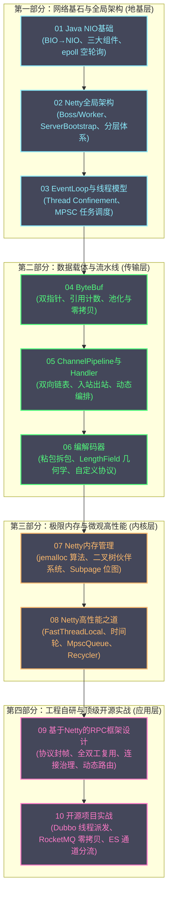

# Netty 网络编程 专栏导览

**摘要：**

Netty 是 Java 分布式计算生态中毫无争议的高性能网络通信基石，支撑着全球范围内从微服务 RPC 引擎（Apache Dubbo、gRPC-Java）、分布式流式消息中枢（Apache RocketMQ）到近实时海量检索分析平台（Elasticsearch）的核心通信管道。本专栏严格遵循周志明《凤凰架构》的技术写作哲学（长句凝练、论述五问、历史与物理硬件先行、权衡取舍并重）与仓库交付硬指标，对 Netty 的全技术栈展开了地毯式的深度重构。全专栏 10 篇技术正文均达到了 **单篇 12000-14500 CJK 中文字、500-1000 行** 的工业级交付标准，全景覆盖了从底层 Linux 操作系统 I/O 多路复用、主从 Reactor 反应堆拓扑、`ByteBuf` 堆外内存 jemalloc 分级算法、无锁并发工具库（`FastThreadLocal`、`HashedWheelTimer`、`MpscQueue`、`Recycler`），到自研工业级 RPC 框架与三大顶级开源项目实战的完整知识图谱。

---

## 专栏架构全景图

---

## 专栏完整目录与篇幅指标

全专栏 10 篇正文全部经过全量深度重构，总规模达 **6608 行 / 126662 中文字**，篇均约 12666 字。

| 序号 | 篇章链接 | 行数 | CJK字数 | 核心架构议题 |
| :---: | :--- | :---: | :---: | :--- |
| **01** | [[01 Java NIO基础——Channel、Buffer、Selector三大组件]] | 525 | 12065 | 从 BIO 到 NIO 的范式革命、C10K 瓶颈、Channel/Buffer/Selector 三大件、TCP 粘包拆包根因、Linux epoll 空轮询 Bug 与 Netty 破局 |
| **02** | [[02 Netty全局架构——从BossGroup到ChannelPipeline]] | 530 | 12000 | Multi-Reactor 主从多路复用模型、BossGroup 与 WorkerGroup 拓扑、ServerBootstrap 引导骨架、三层分层体系与 Channel 生命周期 |
| **03** | [[03 EventLoop与线程模型——Reactor模式的落地实现]] | 518 | 12019 | 严格线程封闭（Thread Confinement）、MPSC 任务队列驱动、Selector 轮询唤醒机制、ioRatio 动态时间分配、Future/Promise 异步原语与防阻塞隔离 |
| **04** | [[04 ByteBuf——引用计数、池化与零拷贝]] | 599 | 12008 | 双指针读写解耦、五大分类体系、引用计数与显式内存管理、CompositeByteBuf 逻辑合并、操作系统级零拷贝 FileRegion 与内存泄漏检测机制 |
| **05** | [[05 ChannelPipeline与ChannelHandler——责任链模式的精妙设计]] | 512 | 12005 | 双向链表拓扑、HeadContext 与 TailContext 哨兵职责、入站正向与出站反向传播流转、executionMask 性能优化、@Sharable 线程安全契约与动态 Pipeline |
| **06** | [[06 编解码器——LengthFieldBasedFrameDecoder与自定义协议]] | 1009 | 12026 | 流式传输粘包拆包本质、累积缓冲区设计、LengthFieldBasedFrameDecoder 六大参数空间几何推演与丢弃模式、Titan-RPC 自定义协议栈与 ReplayingDecoder 边界 |
| **07** | [[07 Netty内存管理——jemalloc算法在Java中的实现]] | 704 | 12018 | 堆外内存分配物理瓶颈、jemalloc 架构映射、PoolArena 竞技场隔离、PoolChunk 完全二叉树伙伴系统、PoolSubpage 64位位图切片、PoolThreadCache 无锁私有缓存 |
| **08** | [[08 Netty高性能之道——FastThreadLocal、HashedWheelTimer与无锁队列]] | 787 | 14557 | FastThreadLocal 数组直接物理寻址、HashedWheelTimer 时间轮算法与异步批处理取消、MpscQueue 128字节缓存行填充防伪共享与 lazySet 内存屏障、Recycler 对象池 |
| **09** | [[09 基于Netty的RPC框架设计——序列化、路由与连接管理]] | 755 | 12805 | LPC 到 RPC 的抽象泄漏、八大物理谬误、Titan-RPC 二进制协议、Protobuf/Hessian2/Kryo 序列化四维坐标系、RequestId + CompletableFuture 全双工复用、连接治理与动态路由 |
| **10** | [[10 Netty在开源项目中的应用——Dubbo、RocketMQ、Elasticsearch]] | 678 | 12629 | Apache Dubbo SPI 传输层与五大 Dispatcher 线程派发、RocketMQ RemotingCommand 四段式协议与 FileRegion 零拷贝、Elasticsearch 五大优先级专属连接通道与断路器内存防爆 |

---

## 推荐阅读路径

针对不同技术背景与工程目标的读者，推荐以下三种定制化阅读路径：

### 路径一：通关筑基路径（网络基石与数据通道）
> **目标**：建立对现代网络 I/O 驱动与 Netty 核心 API 的完整系统认知。  
> **推荐顺序**：[[01 Java NIO基础——Channel、Buffer、Selector三大组件]] → [[02 Netty全局架构——从BossGroup到ChannelPipeline]] → [[03 EventLoop与线程模型——Reactor模式的落地实现]] → [[05 ChannelPipeline与ChannelHandler——责任链模式的精妙设计]] → [[06 编解码器——LengthFieldBasedFrameDecoder与自定义协议]]

### 路径二：极限性能与底层内核路径（硬件亲和与内存管理）
> **目标**：透彻理解受托管语言在物理硬件极限边缘的优化艺术，攻坚堆外内存与高吞吐调优。  
> **推荐顺序**：[[04 ByteBuf——引用计数、池化与零拷贝]] → [[07 Netty内存管理——jemalloc算法在Java中的实现]] → [[08 Netty高性能之道——FastThreadLocal、HashedWheelTimer与无锁队列]]

### 路径三：分布式系统与开源架构实战路径（从自研到工业级大厂落地）
> **目标**：将网络底层通信能力转化为构建大规模分布式基础设施的架构掌控力。  
> **推荐顺序**：[[09 基于Netty的RPC框架设计——序列化、路由与连接管理]] → [[10 Netty在开源项目中的应用——Dubbo、RocketMQ、Elasticsearch]]

---

## 前置知识与关联专栏

阅读本专栏需要具备基础的 Java 语言经验与多线程并发认知。为了获得最透彻的穿透式理解，推荐结合以下专栏协同研读：

- [[Java/并发编程/00 专栏导览|Java 并发编程]]：深入理解 JUC 内存模型、CAS 原子操作、线程池调度与锁机制；
- [[Java/JVM/00 专栏导览|JVM 性能与内部机理]]：掌握堆内堆外内存划分、垃圾收集器（GC）工作原理与直接内存（DirectByteBuffer）；
- [[Linux/网络协议栈与IO/00 专栏导览|Linux 网络协议栈与IO]]：透彻理解操作系统内核套接字缓冲区、TCP 滑动窗口、拥塞控制与 epoll 多路复用实现；
- [[中间件/Dubbo/00 专栏导览|Apache Dubbo 深度解析]]：探索微服务治理控制面与 Netty 通信底座的深度协同；
- [[中间件/Elasticsearch/00 专栏导览|Elasticsearch 架构与实战]]：理解大规模分布式检索集群中的节点拓扑感知与网络状态机；
- [[中间件/Redis/Redis设计与实现/05 单线程模型与事件驱动架构|Redis 单线程模型与事件驱动架构]]：横向对比 C 语言 Reactor 实现与 Java Netty Reactor 的异同。
