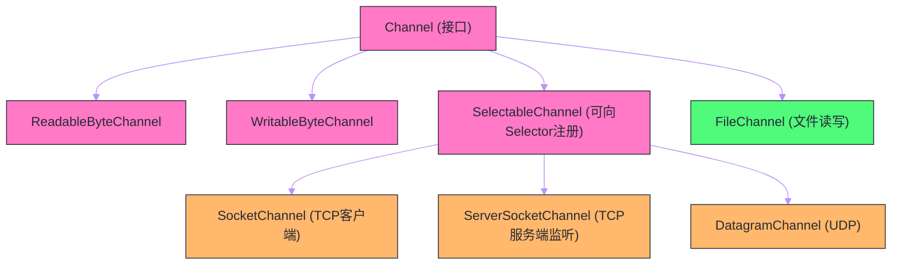

# Java NIO基础——Channel、Buffer、Selector三大组件

## 摘要

理解 Netty，必先理解 Java NIO——因为 Netty 的全部设计都建立在 NIO 的非阻塞 I/O 模型之上。Java NIO（New I/O，自 JDK 1.4 引入）提供了与传统 BIO（Blocking I/O）截然不同的编程范式：`Channel`（通道）取代了传统的 `Stream`，`Buffer`（缓冲区）取代了直接读写字节，`Selector`（选择器）实现了单线程监控多个 Channel 的多路复用能力。本文从 BIO 的根本性缺陷出发，剖析为什么 NIO 的出现是历史必然；然后深入讲解 `Channel`、`Buffer`、`Selector` 三大核心组件的设计原理与使用细节；最后用一个完整的 NIO 服务器示例串联所有组件，为理解 Netty 的底层机制打下坚实基础。

---

## 第 1 章 从 BIO 到 NIO：一次范式革命

### 1.1 BIO 模型的根本性缺陷

要理解 Java NIO 为什么要这样设计，必须先理解它要解决的问题——传统 BIO（Blocking I/O）在高并发场景下的根本性困境。

BIO 编程模型的核心是"一个连接 → 一个线程"。一个典型的 BIO 服务器长这样：

```java
ServerSocket serverSocket = new ServerSocket(8080);
while (true) {
    // accept() 会一直阻塞，直到有新连接进来
    Socket socket = serverSocket.accept();
    
    // 为每个连接创建一个新线程处理
    new Thread(() -> {
        try (InputStream in = socket.getInputStream();
             OutputStream out = socket.getOutputStream()) {
            byte[] buf = new byte[1024];
            int n;
            // read() 会一直阻塞，直到有数据可读
            while ((n = in.read(buf)) != -1) {
                // 处理数据，写回响应
                out.write(process(buf, n));
            }
        }
    }).start();
}
```

看起来简单直观，但背后隐藏着两个致命问题：

**问题一：`accept()` 和 `read()` 的阻塞**

`serverSocket.accept()` 调用后，当前线程会被操作系统挂起（置为 BLOCKED 状态），直到有新的客户端连接到来。`in.read()` 同样如此——线程会一直阻塞等待，直到网络数据到达内核缓冲区并被复制到用户态缓冲区。

这段等待时间，线程什么也做不了，CPU 资源被白白浪费。

**问题二：线程数量随连接数线性增长**

每个连接都需要一个专属线程。假设一台服务器同时维持 10000 个 HTTP 连接（这在现代 Web 应用中非常常见），就需要 10000 个线程。

Java 线程并非"廉价"资源：
- 默认栈大小 512KB～1MB，10000 个线程仅栈空间就要 5～10 GB 内存；
- 线程切换需要保存/恢复寄存器、切换内核栈，频繁的上下文切换会带来大量 CPU 开销；
- JVM 的线程调度开销随线程数增长而加剧。

这就是著名的 **C10K 问题**（如何用一台服务器同时维持 10000 个连接）。BIO 模型在这个问题面前几乎束手无策。

### 1.2 操作系统的解法：I/O 多路复用

操作系统早在 POSIX 标准中就提供了解决思路——I/O 多路复用（I/O Multiplexing）。核心思想是：**不让线程等待单个 I/O，而是让单个线程监控多个 I/O 事件，哪个就绪就处理哪个**。

Linux 提供了三种 I/O 多路复用系统调用：

| 系统调用 | 引入时间 | 最大监控数量 | 时间复杂度 | 特点 |
| --- | --- | --- | --- | --- |
| `select` | 1983, BSD | 1024（FD_SETSIZE） | O(n) | 位图传递，每次调用重置 |
| `poll` | POSIX | 无硬性限制 | O(n) | 链表传递，无上限但性能差 |
| `epoll` | 2002, Linux 2.6 | 受系统内存限制 | O(1) | 事件驱动，只返回就绪的 fd |

`epoll` 的出现彻底改变了高并发服务器的设计：它在内核中为每个 `epoll` 实例维护一颗红黑树（存储所有被监控的文件描述符）和一个就绪链表（存储发生事件的文件描述符）。内核通过回调机制将就绪的 fd 插入链表，`epoll_wait()` 调用只需从链表中取出就绪事件，无论监控多少个 fd，时间复杂度始终是 O(1)（相对于就绪事件数量，而非总 fd 数量）。

Java NIO 的 `Selector` 在 Linux 上就是对 `epoll` 的封装（Windows 上对应 IOCP，macOS 上对应 kqueue）。

### 1.3 NIO 的核心设计转变

BIO 和 NIO 代表了两种截然不同的编程哲学：

**BIO（流式 + 阻塞）**：把 I/O 想象成一根水管，数据流过来你就拿走，水管里没水你就干等。线程跟着 I/O 走，I/O 阻塞则线程阻塞。

**NIO（通道 + 缓冲区 + 非阻塞）**：把 I/O 想象成一条铁轨，数据通过 Channel 在 Buffer 里搬运，你可以不断地询问"货物到了吗"，而不是傻等在那里。Selector 负责统一调度，哪条铁轨有货物到达就处理哪条。

这一转变带来的根本性变化：
- 原来 1 个线程服务 1 个连接 → 现在 1 个线程可以服务 N 个连接；
- 原来线程大量时间在阻塞等待 → 现在线程只处理真正就绪的 I/O 事件；
- 线程数量从与连接数正相关 → 变为与 CPU 核数相关（通常是 CPU 核数的 1~2 倍）。

> [!info] NIO 不等于异步 I/O
> Java NIO 中的 N 是"Non-blocking"（非阻塞），而非"Asynchronous"（异步）。NIO 依然是同步的——你需要主动调用 `read()/write()` 来触发数据读写，只是这些调用不再阻塞线程。Java 7 引入的 `java.nio.channels.AsynchronousChannel` 才是真正的异步 I/O（由操作系统回调通知，对应 Linux 的 `io_uring` 或 Windows 的 IOCP）。Netty 也主要基于同步非阻塞 NIO 构建，而非异步 AIO。

---

## 第 2 章 Buffer：数据搬运的容器

### 2.1 为什么要引入 Buffer

传统 BIO 的 `InputStream.read()` 直接从流中读字节，数据"流过"之后就消失了——你无法回退，无法随机访问，也无法批量处理。

NIO 引入 `Buffer` 的原因：**网络 I/O 天然是批量操作的**。从内核缓冲区一次性读取一块数据，放入用户态的 `Buffer`，再从 `Buffer` 中按需解析，比每次只读一个字节要高效得多（减少系统调用次数，提高 CPU 缓存命中率）。

更重要的是，操作系统的 `read()` 系统调用本来就是"从内核缓冲区复制一块数据到用户提供的缓冲区"——NIO 的 `Buffer` 与操作系统的工作方式天然匹配。

### 2.2 Buffer 的核心属性

`Buffer` 是一个固定容量的内存块，有三个核心属性控制其状态：

```
capacity（容量）：Buffer 能存储的最大元素数量，创建后不变
position（位置）：下一个要读/写的元素位置，0 <= position <= limit
limit（限制）：不应该被读/写的第一个元素位置，0 <= limit <= capacity

关系：0 <= position <= limit <= capacity
```

这三个属性的变化规律是理解 Buffer 的核心：

**写模式**（刚创建或 `clear()` 之后）：
- `position = 0`，`limit = capacity`
- 每写一个元素，`position` +1
- 表示"从 0 开始写，最多写到 capacity"

**切换到读模式**（调用 `flip()` 之后）：
- `limit = position`（之前写了多少，限制就到哪里）
- `position = 0`（从头开始读）
- 表示"从 0 开始读，读到刚才写入的位置为止"

**重置**（调用 `clear()` 或 `compact()` 之后）：
- `clear()`：`position = 0`，`limit = capacity`，回到写模式（不清除数据，只重置指针）
- `compact()`：将未读数据移到 Buffer 头部，`position` 指向未读数据末尾，继续追加写

```java
// Buffer 使用的典型模式
ByteBuffer buffer = ByteBuffer.allocate(1024);

// 写数据（写模式）
buffer.put("Hello, NIO!".getBytes());

// flip()：切换到读模式
buffer.flip();
System.out.println("limit=" + buffer.limit() + ", position=" + buffer.position());
// 输出：limit=11, position=0

// 读数据
byte[] dst = new byte[buffer.limit()];
buffer.get(dst);
System.out.println(new String(dst));  // "Hello, NIO!"

// clear()：重置为写模式
buffer.clear();
```

> [!warning] 最常见的 Buffer 使用错误
> 忘记调用 `flip()` 就开始读！写完数据后，`position` 指向刚写入的末尾，此时如果直接 `get()`，会从末尾读起（读到 `capacity` 为止），读到的全是初始值（0 或空字符），而不是刚写入的数据。`flip()` 的作用就是把"写结束位置"变成"读限制位置"，把"读起始位置"重置为 0。

### 2.3 Buffer 的内存分配方式

NIO 提供了两种 `ByteBuffer` 分配方式：

**堆缓冲区（Heap Buffer）**：

```java
ByteBuffer heapBuf = ByteBuffer.allocate(1024);
```

分配在 JVM 堆上，受 GC 管理。优点是创建快、使用简单；缺点是做 I/O 操作时，JVM 必须将数据额外复制到 JVM 外的直接内存（因为 GC 可能移动堆对象，导致内存地址变化，而内核 DMA 操作需要固定内存地址）。

**直接缓冲区（Direct Buffer）**：

```java
ByteBuffer directBuf = ByteBuffer.allocateDirect(1024);
```

分配在 JVM 堆外（操作系统内存），不受 GC 管理。优点是做 I/O 操作时**少一次内核到用户态的内存复制**（数据可以直接在内核缓冲区和直接内存之间 DMA 传输，不需要经过 JVM 堆），从而实现**零拷贝**；缺点是分配和释放代价高（不受 GC 管理，依赖 `Cleaner` 机制延迟释放），不适合频繁创建销毁。

Netty 的 `ByteBuf` 对直接缓冲区做了池化管理，消除了每次分配的开销，同时保留了零拷贝的性能优势——这是 Netty 高性能的重要来源之一，我们在后续 ByteBuf 专篇中会深入讲解。

### 2.4 Buffer 的常用子类

`Buffer` 是抽象基类，NIO 为每种基本类型提供了对应实现：

| 类名 | 元素类型 | 每个元素字节数 | 典型用途 |
| --- | --- | --- | --- |
| `ByteBuffer` | byte | 1 | 网络 I/O 的核心，最常用 |
| `CharBuffer` | char | 2 | 字符数据读写（如文件内容） |
| `ShortBuffer` | short | 2 | 图像数据等 |
| `IntBuffer` | int | 4 | 整数序列 |
| `LongBuffer` | long | 8 | 大整数序列 |
| `FloatBuffer` | float | 4 | 浮点序列 |
| `DoubleBuffer` | double | 8 | 高精度浮点序列 |

`ByteBuffer` 是网络编程中最重要的，因为网络传输的基本单位是字节。`ByteBuffer` 额外提供了 `getInt()`、`getLong()` 等便捷方法，可以直接读取多字节的基本类型（按 `order()` 指定的字节序，默认大端序 Big-Endian）。

---

## 第 3 章 Channel：双向数据通道

### 3.1 Channel 与 Stream 的本质区别

Java BIO 以 `InputStream` 和 `OutputStream` 为核心，两者都是单向的——输入流只能读，输出流只能写。NIO 用 `Channel`（通道）取代了这一对，Channel 是**双向的**：既可以读，也可以写（当然，某些 Channel 可能只读或只写，但这是实现层面的限制，不是设计上的约束）。

更重要的是，Channel 的 I/O 操作是面向 `Buffer` 的：

```java
// BIO：直接读字节
int n = inputStream.read(byteArray);

// NIO：Channel 读数据到 Buffer
int n = channel.read(byteBuffer);  // 从 channel 读入 buffer
channel.write(byteBuffer);          // 将 buffer 数据写入 channel
```

这意味着：Channel 只负责"传输"，Buffer 负责"存储"，职责清晰，便于复用和优化。

### 3.2 主要 Channel 类型

NIO 提供了多种 Channel 实现，覆盖了不同的 I/O 场景：



**`SocketChannel`**：TCP 客户端 Channel，对应 BIO 的 `Socket`，用于建立 TCP 连接并进行数据收发；

**`ServerSocketChannel`**：TCP 服务端监听 Channel，对应 BIO 的 `ServerSocket`，用于监听端口、接受新连接（`accept()` 返回 `SocketChannel`）；

**`DatagramChannel`**：UDP Channel，既可以发送也可以接收 UDP 数据报；

**`FileChannel`**：文件 I/O Channel，**注意：`FileChannel` 不支持非阻塞模式**，因为文件 I/O 由操作系统内核以同步方式完成。`FileChannel` 最大的用途是 `transferTo()`/`transferFrom()` 实现零拷贝文件传输。

### 3.3 SocketChannel 的非阻塞模式

`SelectableChannel` 的子类（`SocketChannel`、`ServerSocketChannel`、`DatagramChannel`）都支持非阻塞模式，这是 NIO 的核心特性：

```java
// 创建并配置非阻塞 SocketChannel（客户端）
SocketChannel channel = SocketChannel.open();
channel.configureBlocking(false);  // 切换到非阻塞模式

// 非阻塞连接：立即返回，不等待连接完成
boolean connected = channel.connect(new InetSocketAddress("localhost", 8080));
if (!connected) {
    // 连接尚未完成（TCP 三次握手还在进行中）
    // 稍后通过 Selector 的 OP_CONNECT 事件得知连接完成
    while (!channel.finishConnect()) {
        // 可以做其他事情，而不是阻塞等待
        Thread.sleep(10);
    }
}

// 非阻塞读：立即返回，可能读了 0 个字节
ByteBuffer buffer = ByteBuffer.allocate(1024);
int bytesRead = channel.read(buffer);
// bytesRead = -1：连接已关闭
// bytesRead =  0：没有数据可读（非阻塞模式下正常现象）
// bytesRead > 0：成功读取了 bytesRead 个字节
```

非阻塞模式下，`read()`/`write()` 不再等待数据就绪，而是**立即返回当前可读/可写的数据量**（可能是 0）。这要求应用层对"读了 0 字节"的情况有正确处理——这正是 Selector 的用武之地，它告诉你"哪个 Channel 现在有数据可读"，让你只在有数据的时候才调用 `read()`，避免无效的空读。

### 3.4 FileChannel 的零拷贝能力

`FileChannel.transferTo()` 是 Java NIO 中零拷贝的直接体现，它将文件内容直接发送到另一个 Channel（通常是 `SocketChannel`），由操作系统内核完成数据传输，无需经过用户态：

```java
// 零拷贝：将文件内容发送给客户端（HTTP 文件下载的核心实现）
FileChannel fileChannel = new FileInputStream("large_file.zip").getChannel();
SocketChannel socketChannel = ...; // 客户端连接

// 底层调用 Linux 的 sendfile() 系统调用
// 数据从文件 → 内核缓冲区 → 网卡，全程不经过用户态
long transferred = fileChannel.transferTo(0, fileChannel.size(), socketChannel);
```

传统文件发送路径（4 次数据拷贝）：
```
磁盘 → [DMA] → 内核读缓冲区 → [CPU拷贝] → 用户态缓冲区 → [CPU拷贝] → 内核写缓冲区 → [DMA] → 网卡
```

`transferTo()` 零拷贝路径（2 次数据拷贝，仅 DMA）：
```
磁盘 → [DMA] → 内核读缓冲区 → [DMA] → 网卡
```

消除了两次 CPU 参与的内存拷贝，对于大文件传输（如视频流、文件下载），性能提升非常显著。

---

## 第 4 章 Selector：多路复用的核心

### 4.1 Selector 的设计动机

有了非阻塞的 Channel，我们仍然面临一个问题：如何知道"哪个 Channel 现在有事件发生"？

暴力做法是不断轮询每个 Channel：

```java
// 暴力轮询（错误示范）
List<SocketChannel> channels = ...;
while (true) {
    for (SocketChannel ch : channels) {
        ByteBuffer buf = ByteBuffer.allocate(1024);
        int n = ch.read(buf);  // 非阻塞，可能返回 0
        if (n > 0) {
            // 处理数据
        }
    }
}
```

这种方式的问题：
- **CPU 空转**：绝大多数情况下 Channel 没有数据，`read()` 都返回 0，但线程在不断地调用 `read()` 做无用功；
- **延迟高**：遍历所有 Channel 才能找到有数据的那个，时间复杂度 O(n)；
- **不可扩展**：Channel 数量越多，每轮轮询耗时越长，事件响应延迟越大。

`Selector` 就是解决这个问题的——它将"我在等什么事件"这个信息交给操作系统内核（通过 `epoll_ctl` 注册），然后阻塞在 `select()`（对应 `epoll_wait()`）。内核在事件就绪时唤醒线程，线程只处理就绪的 Channel，彻底消除了无效轮询。

### 4.2 Selector 的工作机制

Selector 的使用遵循固定流程：**注册 → 选择 → 处理**。

```java
// 第一步：创建 Selector
Selector selector = Selector.open();

// 第二步：将 Channel 注册到 Selector，并指定感兴趣的事件
ServerSocketChannel serverChannel = ServerSocketChannel.open();
serverChannel.bind(new InetSocketAddress(8080));
serverChannel.configureBlocking(false);  // 必须是非阻塞模式才能注册到 Selector

// 注册：监听 ACCEPT 事件（有新连接进来时触发）
SelectionKey serverKey = serverChannel.register(selector, SelectionKey.OP_ACCEPT);

// 第三步：事件循环（Event Loop）
while (true) {
    // select() 阻塞直到有事件就绪（或超时）
    // 返回值是就绪事件的数量
    int readyCount = selector.select();
    
    if (readyCount == 0) continue;
    
    // 获取就绪事件集合
    Set<SelectionKey> selectedKeys = selector.selectedKeys();
    Iterator<SelectionKey> iter = selectedKeys.iterator();
    
    while (iter.hasNext()) {
        SelectionKey key = iter.next();
        iter.remove();  // 必须手动移除，否则下次还会处理同一个 key
        
        if (key.isAcceptable()) {
            // ACCEPT 事件：有新连接
            ServerSocketChannel ssc = (ServerSocketChannel) key.channel();
            SocketChannel clientChannel = ssc.accept();
            clientChannel.configureBlocking(false);
            // 将新连接的 SocketChannel 注册到 Selector，监听 READ 事件
            clientChannel.register(selector, SelectionKey.OP_READ);
            
        } else if (key.isReadable()) {
            // READ 事件：Channel 有数据可读
            SocketChannel clientChannel = (SocketChannel) key.channel();
            ByteBuffer buffer = ByteBuffer.allocate(1024);
            int n = clientChannel.read(buffer);
            if (n == -1) {
                // 客户端关闭连接
                key.cancel();
                clientChannel.close();
            } else {
                buffer.flip();
                // 处理读到的数据
                handleData(buffer, clientChannel);
            }
        }
    }
}
```

### 4.3 四种 I/O 事件

`SelectionKey` 定义了四种 I/O 事件，通过位掩码（bitmask）组合：

| 事件常量 | 值 | 含义 | 适用 Channel |
| --- | --- | --- | --- |
| `OP_ACCEPT` | 16 | 有新连接可接受 | `ServerSocketChannel` |
| `OP_CONNECT` | 8 | 连接已建立完成 | `SocketChannel`（客户端） |
| `OP_READ` | 1 | Channel 有数据可读 | `SocketChannel`、`DatagramChannel` |
| `OP_WRITE` | 4 | Channel 可以写入数据 | `SocketChannel`、`DatagramChannel` |

注册时可以监听多个事件：

```java
// 同时监听读和写事件
channel.register(selector, SelectionKey.OP_READ | SelectionKey.OP_WRITE);
```

关于 `OP_WRITE` 的重要说明：**几乎任何时候 `OP_WRITE` 都是就绪的**（只要发送缓冲区有空间），因此不要一直注册 `OP_WRITE`，否则会导致 Selector 空转（`select()` 立即返回，触发大量 `OP_WRITE` 事件，但你没有数据要写）。正确的做法是：**只在有数据需要写但发送缓冲区满了时，才注册 `OP_WRITE`**；写完数据后，立即注销 `OP_WRITE`。Netty 对这个细节有完善的处理，这也是 Netty 相对于手写 NIO 代码的优越之处。

### 4.4 SelectionKey 的附件（Attachment）机制

每个 `SelectionKey` 可以附带一个 `Object` 类型的附件，用于在 Selector 回调时传递上下文信息：

```java
// 注册时附带附件（如连接状态上下文）
ConnectionContext ctx = new ConnectionContext(clientChannel);
clientChannel.register(selector, SelectionKey.OP_READ, ctx);  // 第三个参数是附件

// 处理事件时取回附件
SelectionKey key = ...;
ConnectionContext ctx = (ConnectionContext) key.attachment();
ctx.handleRead();
```

这个附件机制非常重要——它是 NIO 编程实现"状态机"的基础：每个连接的读写缓冲区、协议解析状态、业务数据等都可以存放在附件对象中，随着 `SelectionKey` 的生命周期一起管理。Netty 的 `Channel` 对象本质上就是一个高度封装的"附件 + 状态机"。

---

## 第 5 章 完整的 NIO 服务器示例

### 5.1 实现一个 Echo 服务器

将三大组件组合起来，实现一个完整的非阻塞 Echo 服务器（将客户端发送的内容原样返回）：

```java
public class NioEchoServer {
    private static final int PORT = 8080;
    private static final int BUFFER_SIZE = 1024;
    
    public static void main(String[] args) throws IOException {
        // 1. 创建 Selector 和 ServerSocketChannel
        Selector selector = Selector.open();
        ServerSocketChannel serverChannel = ServerSocketChannel.open();
        serverChannel.bind(new InetSocketAddress(PORT));
        serverChannel.configureBlocking(false);
        serverChannel.register(selector, SelectionKey.OP_ACCEPT);
        
        System.out.println("NIO Echo Server started on port " + PORT);
        
        // 2. 事件循环
        while (true) {
            // 阻塞直到有事件就绪
            selector.select();
            
            Iterator<SelectionKey> keyIterator = selector.selectedKeys().iterator();
            while (keyIterator.hasNext()) {
                SelectionKey key = keyIterator.next();
                keyIterator.remove();  // 关键：处理完必须手动移除
                
                try {
                    if (key.isAcceptable()) {
                        handleAccept(key, selector);
                    } else if (key.isReadable()) {
                        handleRead(key);
                    } else if (key.isWritable()) {
                        handleWrite(key);
                    }
                } catch (IOException e) {
                    // 连接异常：关闭 Channel，取消 Key
                    key.cancel();
                    key.channel().close();
                }
            }
        }
    }
    
    private static void handleAccept(SelectionKey key, Selector selector) throws IOException {
        ServerSocketChannel serverChannel = (ServerSocketChannel) key.channel();
        SocketChannel clientChannel = serverChannel.accept();
        
        if (clientChannel != null) {
            clientChannel.configureBlocking(false);
            // 为每个连接分配读缓冲区作为附件
            ByteBuffer readBuffer = ByteBuffer.allocate(BUFFER_SIZE);
            clientChannel.register(selector, SelectionKey.OP_READ, readBuffer);
            System.out.println("New connection: " + clientChannel.getRemoteAddress());
        }
    }
    
    private static void handleRead(SelectionKey key) throws IOException {
        SocketChannel clientChannel = (SocketChannel) key.channel();
        ByteBuffer readBuffer = (ByteBuffer) key.attachment();
        
        readBuffer.clear();
        int n = clientChannel.read(readBuffer);
        
        if (n == -1) {
            // 客户端关闭连接
            System.out.println("Connection closed: " + clientChannel.getRemoteAddress());
            key.cancel();
            clientChannel.close();
            return;
        }
        
        if (n > 0) {
            readBuffer.flip();
            // 准备写回的数据：复制一份 Buffer 作为写附件
            ByteBuffer writeBuffer = ByteBuffer.allocate(readBuffer.remaining());
            writeBuffer.put(readBuffer);
            writeBuffer.flip();
            
            // 注册 OP_WRITE 事件，等待发送缓冲区就绪后写入
            key.interestOps(SelectionKey.OP_WRITE);
            key.attach(writeBuffer);
        }
    }
    
    private static void handleWrite(SelectionKey key) throws IOException {
        SocketChannel clientChannel = (SocketChannel) key.channel();
        ByteBuffer writeBuffer = (ByteBuffer) key.attachment();
        
        clientChannel.write(writeBuffer);
        
        if (!writeBuffer.hasRemaining()) {
            // 数据写完了：切换回监听 READ，注销 WRITE（避免 CPU 空转）
            ByteBuffer newReadBuffer = ByteBuffer.allocate(BUFFER_SIZE);
            key.interestOps(SelectionKey.OP_READ);
            key.attach(newReadBuffer);
        }
        // 如果 writeBuffer 还有剩余（发送缓冲区满了），继续等待 OP_WRITE
    }
}
```

### 5.2 这段代码揭示的 NIO 痛点

上面的代码已经能工作，但仔细看会发现很多令人不舒服的地方：

**痛点一：粘包/拆包问题完全没处理**

TCP 是流协议，`read()` 一次可能读到半条消息，也可能读到两条消息粘在一起。上面的 Echo 服务器对此没有任何处理——对于 Echo 来说无所谓，但对于真实业务协议（如 HTTP、自定义二进制协议）就是严重问题。

**痛点二：每次连接都要分配新 Buffer**

`ByteBuffer.allocate(BUFFER_SIZE)` 为每个连接分配 1024 字节，连接多了内存占用不可控，且没有池化复用，频繁 GC 压力大。

**痛点三：事件处理都在同一线程**

所有的 `handleAccept`/`handleRead`/`handleWrite` 都在同一个线程中执行。如果某个 `handleRead` 中有耗时操作（如数据库查询），会阻塞整个 Selector 循环，影响所有连接的响应速度。

**痛点四：异常处理和连接管理粗糙**

连接的创建、关闭、超时、半关闭（客户端关了写但读还开着）等边界情况处理起来极其繁琐。

**痛点五：`OP_WRITE` 的管理容易出错**

如上节所述，`OP_WRITE` 的注册和注销时机需要小心处理，稍有不慎就会导致 CPU 空转（Selector 空转是 NIO 编程的常见 bug，Netty 的 `epoll_wait_bug` 检测机制就是为此专门设计的）。

这五个痛点，正是 Netty 的核心价值所在：Netty 的 `ByteBuf` 解决了 Buffer 管理问题，`ChannelPipeline` 解决了粘包/拆包和编解码问题，多 EventLoop 线程组解决了线程模型问题，`ChannelHandler` 的生命周期回调解决了连接状态管理问题。**Netty 是"用正确的方式实现 NIO 编程"的最佳实践集合**。

---

## 第 6 章 NIO 的 epoll 空轮询 Bug

### 6.1 什么是 epoll 空轮询 Bug

Java NIO 有一个著名的 JDK Bug（Bug ID: 6670302）：在某些 Linux 内核版本下，`Selector.select()` 可能在没有任何 I/O 事件的情况下立即返回（返回值为 0），导致 Event Loop 不断空转：

```java
while (true) {
    int n = selector.select();  // 预期阻塞，实际立即返回 0
    if (n == 0) continue;       // 没有事件，continue，再次 select()，再次立即返回……
    // CPU 占用率飙升到 100%
}
```

这个 Bug 的触发条件涉及 Linux 内核对 `epoll` 某些边缘情况的处理（如连接在 `epoll_wait` 期间被另一端 RST），是操作系统层面的问题，JDK 层面难以完全修复。

### 6.2 Netty 的解决方案

Netty 通过检测空轮询次数来规避这个 Bug：

```java
// Netty 的 NioEventLoop 中的检测逻辑（简化版）
long selectCnt = 0;         // select() 调用次数计数器
long lastSelectTimeNanos;   // 上次 select() 开始时间

while (true) {
    lastSelectTimeNanos = System.nanoTime();
    int selectedKeys = selector.select(timeoutMillis);
    selectCnt++;
    
    if (selectedKeys != 0 || ...) {
        // 有事件处理，正常情况，重置计数器
        selectCnt = 0;
        // 处理事件...
    } else if (System.nanoTime() - lastSelectTimeNanos < timeoutMillis * 0.5) {
        // select() 没有事件，但返回时间远早于超时时间
        // 说明发生了空轮询！
        if (selectCnt >= SELECTOR_AUTO_REBUILD_THRESHOLD /* 默认 512 */) {
            // 连续空轮询次数超过阈值：重建 Selector
            // 1. 创建新的 Selector
            // 2. 将旧 Selector 上所有 Channel 迁移到新 Selector
            // 3. 关闭旧 Selector
            rebuildSelector();
            selectCnt = 0;
        }
    }
}
```

通过重建 `Selector`（将所有注册的 Channel 迁移到新建的 `Selector` 上，关闭有 Bug 的旧 `Selector`），Netty 绕过了 JDK 的 Bug，保证了 Event Loop 的稳定运行。这是 Netty 比手写 NIO 代码更可靠的重要原因之一。

---

## 总结

Java NIO 的三大组件各司其职，共同构建了非阻塞 I/O 的完整体系：

- **`Buffer`** 是数据的容器，用三个属性（`capacity`/`position`/`limit`）精确控制读写位置；直接缓冲区（Direct Buffer）通过减少内存拷贝实现零拷贝；使用 `Buffer` 的核心规范是：写完调 `flip()` 再读，读完调 `clear()` 或 `compact()` 再写；

- **`Channel`** 是双向的数据通道，面向 Buffer 进行 I/O 操作；`SocketChannel`/`ServerSocketChannel` 支持非阻塞模式，在调用 `read()`/`write()` 时不再阻塞线程；`FileChannel.transferTo()` 通过 `sendfile()` 系统调用实现零拷贝文件传输；

- **`Selector`** 是多路复用的核心，通过操作系统的 `epoll`/`kqueue`/IOCP 实现单线程监控多个 Channel；注册 Channel 时指定感兴趣的事件（`OP_ACCEPT`/`OP_CONNECT`/`OP_READ`/`OP_WRITE`），`select()` 阻塞直到有事件就绪；`OP_WRITE` 需要按需注册/注销，避免 CPU 空转；

- NIO 编程的固有复杂性（粘包拆包、Buffer 管理、多线程调度、异常处理、epoll Bug 规避）正是 Netty 的核心价值所在——Netty 是高质量 NIO 编程实践的集大成者。

下一篇，我们正式进入 Netty 的世界，俯瞰它的全局架构：从 `BossGroup` 如何接受连接、`WorkerGroup` 如何处理 I/O，到 `ChannelPipeline` 如何组织业务逻辑的完整脉络：[[02 Netty全局架构——从BossGroup到ChannelPipeline]]。

---

> [!note] 参考资料
> - [Java NIO 官方文档](https://docs.oracle.com/javase/8/docs/api/java/nio/package-summary.html)
> - Ron Hitchens,《Java NIO》, O'Reilly, 2002
> - JDK Bug 6670302: NIO selector wakes up with 0 selected keys infinitely
> - Linux man 页：`epoll_create(2)`、`epoll_ctl(2)`、`epoll_wait(2)`、`sendfile(2)`

---

> [!note] 思考题
> 1. Java NIO 的 `Selector` 在 Linux 上底层使用 `epoll`，但在 macOS 上使用 `kqueue`。两者在事件通知模型上有什么差异（边缘触发 vs 水平触发）？Java NIO 的 `Selector` 封装了这些差异，但在某些极端场景（如 epoll 的空轮询 bug）下，平台差异会导致什么问题？Netty 是如何修复这个 bug 的？
> 2. `ByteBuffer` 的 `flip()` 方法将 Buffer 从写模式切换到读模式（`limit = position; position = 0`）。忘记调用 `flip()` 是 NIO 初学者最常见的错误。为什么 Java NIO 不设计一个自动管理读写模式的 Buffer？Netty 的 `ByteBuf` 用两个独立指针（`readerIndex` 和 `writerIndex`）解决了这个问题——这种设计的代价是什么？
> 3. NIO 的 `Channel` 是双向的（可同时读写），而 IO 的 `InputStream/OutputStream` 是单向的。在 Socket 通信中，双向 Channel 意味着同一个 Channel 的 read 和 write 可以在不同线程中并发执行吗？如果两个线程同时调用同一个 `SocketChannel` 的 `read()` 和 `write()`，会发生什么？
