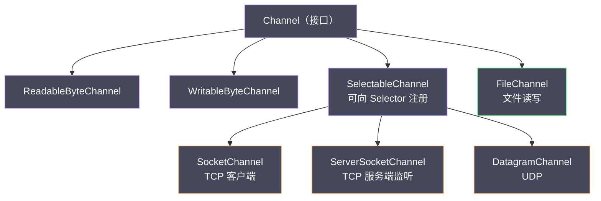

# Java NIO基础——Channel、Buffer、Selector三大组件

**摘要：**

2002 年，JDK 1.4 引入了 New I/O（NIO），这是 Java 平台自诞生以来对网络编程模型做出的最重要的一次修正。在 NIO 出现之前的七年里，Java 的网络编程一直被 BIO（Blocking I/O）模型所统治——一个连接对应一个线程，线程在等待数据时被操作系统挂起，什么也做不了。这套模型在连接数以百计的年代尚可应付，但当互联网的并发连接数从百级跨越到万级、十万级时，它的缺陷便暴露无遗。NIO 用三个核心组件回应了这场挑战：Channel 取代了单向的 Stream，Buffer 取代了直接读写字节的裸操作，Selector 则将"一个线程监控多个连接"的多路复用能力带入了 Java 平台。本文从 BIO 的根本性困境出发，追溯 I/O 多路复用在操作系统层面的演进脉络，逐一剖析 Channel、Buffer、Selector 三大组件的设计原理与使用细节，最后用一个完整的 NIO 服务器示例串联所有组件，并指出 NIO 编程固有的复杂性痛点——这些痛点正是 Netty 诞生的理由。

---

## 第 1 章 从 BIO 到 NIO：一次范式革命

### 1.1 BIO 模型的根本性困境

要理解 Java NIO 为什么这样设计，必须先理解它要解决的问题——传统 BIO（Blocking I/O）在高并发场景下的根本性困境。这不是一个理论上的缺陷，而是一个在 1999 年前后被整个互联网行业同时撞上的工程难题。

BIO 编程模型的核心可以用一句话概括：**一个连接对应一个线程**。一个典型的 BIO 服务器启动后，主线程在 `ServerSocket.accept()` 上阻塞等待，每来一个新连接就 `accept()` 返回一个 `Socket` 对象，然后为这个连接分配一个专属线程去处理读写。线程在 `InputStream.read()` 上阻塞等待数据到达，数据来了就处理，处理完继续等下一批。这套逻辑写起来简单直观，在连接数以十计的局域网应用中运行良好，但连接数一旦上去，问题便接踵而至。

```java
// BIO 服务器的典型写法：一个连接一个线程
ServerSocket serverSocket = new ServerSocket(8080);
while (true) {
    Socket socket = serverSocket.accept();  // 阻塞，直到有新连接
    new Thread(() -> {
        try (InputStream in = socket.getInputStream();
             OutputStream out = socket.getOutputStream()) {
            byte[] buf = new byte[1024];
            int n;
            while ((n = in.read(buf)) != -1) {  // 阻塞，直到有数据可读
                out.write(process(buf, n));
            }
        }
    }).start();
}
```

这段代码背后隐藏着两个致命问题。第一个是 `accept()` 和 `read()` 的阻塞特性——线程在调用这两个方法后会被操作系统挂起，置为 BLOCKED 状态，直到有新连接到来或网络数据到达内核缓冲区。这段等待时间里，线程什么也做不了，CPU 时间片被白白让出，但线程占用的内存资源一点也没少。对于短连接（HTTP/1.0 时代的一次请求一次连接），线程在 `read()` 上阻塞的时间还不算长；但对于长连接（即时通讯、推送、WebSocket），线程可能在一个连接上阻塞数分钟甚至数小时，这期间它占用的栈空间、线程局部存储、内核调度结构全部处于"占着茅坑不拉屎"的状态。

第二个问题更为根本：线程数量随连接数线性增长。假设一台服务器同时维持一万个 HTTP 长连接——这在现代 Web 应用中稀松平常——就需要一万个线程。Java 线程在主流操作系统上是内核线程的 1:1 映射（HotSpot JVM 的实现），每个线程默认栈大小在 512KB 到 1MB 之间，一万个线程仅栈空间就要 5 到 10 GB 内存，这还不算线程本身持有的 `ThreadLocal`、缓冲区、JVM 内部结构等开销。更关键的是，操作系统调度器的上下文切换开销随线程数增长而加剧——频繁的寄存器保存与恢复、内核栈切换、TLB 失效，这些隐形成本在连接数高时会把服务器的 CPU 消耗殆尽在"切换"而非"计算"上。当线程数达到上万的量级时，操作系统调度器本身就成了瓶颈，即使每个线程都在阻塞状态，内核依然需要维护它们的数据结构、定期检查它们的状态。

这就是业界所说的 **C10K 问题**（如何用一台服务器同时维持一万个连接），由 Dan Kegel 在 1999 年的一篇著名文章中正式提出。Kegel 在那篇文章里系统梳理了各种操作系统提供的高并发 I/O 方案，从线程模型到事件驱动，从 `select` 到 `epoll` 到 `SIGIO`，逐一分析优劣。他的结论是：BIO 模型在这个问题面前几乎束手无策——不是优化能解决的，而是模型本身的天花板。线程是操作系统里最重的并发原语之一，用它去对应一个可能空闲 99% 时间的网络连接，是资源使用的严重错配。

Java 社区在 C10K 问题的压力下尝试过多种过渡方案。一种思路是线程池化——用固定大小的线程池处理连接，避免线程数无限增长，但这只是把问题从"线程太多"变成了"连接排队"，当连接数远超线程池大小时，新连接要么被拒绝要么在队列中等待，并没有从根本上解决"一个线程被一个连接阻塞"的困境。另一种思路是 Java 1.3 引入的 `java.nio.channels.SPI`（Service Provider Interface），但那只是 SPI 层面的扩展点，并没有改变 BIO 的阻塞本质。真正的解决方案要等到 2002 年 JDK 1.4 的 NIO。

### 1.2 操作系统的解法：I/O 多路复用

操作系统早在 POSIX 标准中就提供了解决思路——I/O 多路复用（I/O Multiplexing）。核心思想说起来朴素：不让线程等待单个 I/O，而是让单个线程同时监控多个 I/O 事件，哪个就绪就处理哪个。但这个思想的落地，在操作系统层面经历了三次迭代，每一次都是对前一次瓶颈的回应。

1983 年，BSD UNIX 4.2 引入了 `select` 系统调用，这是 I/O 多路复用的第一个实现。`select` 用一个位图（bitmap）来表示需要监控的文件描述符集合，调用 `select()` 时将这个位图从用户态拷贝到内核态，内核遍历所有文件描述符检查就绪状态，返回就绪的集合。`select` 有两个硬伤：一是位图大小受 `FD_SETSIZE` 限制，默认只能监控 1024 个文件描述符——这个数字在今天看来小得可笑，但在 1980 年代的 UNIX 服务器上已经绰绰有余；二是每次调用都要把整个位图从用户态拷贝到内核态，返回后再从位图中逐位遍历找出就绪的 fd，时间复杂度 O(n)，连接数越多遍历越慢。更麻烦的是，`select` 调用返回后会修改传入的位图，下次调用前必须重新初始化——这个"调用即销毁"的语义让 `select` 在高并发场景下的开销雪上加霜。

POSIX 随后引入了 `poll`，用链表（`struct pollfd` 数组）替代位图取消了 1024 的数量限制，监控的 fd 数量只受系统内存约束。但 `poll` 依然是 O(n) 的遍历复杂度，每次调用依然需要把整个 `pollfd` 数组从用户态拷贝到内核态，内核遍历检查每个 fd 的就绪状态。`poll` 解决了 `select` 的数量限制问题，但没有解决性能问题——当连接数从一千增长到一万时，每次 `poll()` 调用的内核遍历开销线性增长，这在 C10K 场景下是不可接受的。

2002 年，Linux 2.6 内核引入了 `epoll`，彻底改变了高并发服务器的设计范式。`epoll` 的关键创新在于把"注册"和"等待"拆分为两个独立的系统调用，从而避免了 `select`/`poll` 每次调用都重新传递全部 fd 的开销。`epoll_create` 创建一个 epoll 实例，内核在内部维护一颗红黑树（Red-Black Tree）用于存储所有被监控的文件描述符；`epoll_ctl` 负责向这颗红黑树添加、修改或删除 fd 及其感兴趣的事件类型，红黑树的插入和删除都是 O(log n)；`epoll_wait` 负责等待就绪事件，内核通过回调机制将就绪的 fd 插入一个就绪链表（ready list），`epoll_wait()` 只需从链表中取出就绪事件即可。无论监控多少个 fd，`epoll_wait()` 的时间复杂度相对于就绪事件数量始终是 O(1)，而非总 fd 数量的 O(n)——这意味着即使你监控十万个 fd，只要每次只有一百个就绪，`epoll_wait()` 的开销就和监控一百个 fd 一样。

| 系统调用 | 引入时间 | 最大监控数量 | 时间复杂度 | 核心机制 |
| --- | --- | --- | --- | --- |
| `select` | 1983, BSD 4.2 | 1024（FD_SETSIZE） | O(n) | 位图传递，每次调用重置 |
| `poll` | POSIX | 无硬性限制 | O(n) | 链表传递，无上限但遍历慢 |
| `epoll` | 2002, Linux 2.6 | 受系统内存限制 | O(1) | 红黑树注册 + 就绪链表回调 |

`epoll` 还支持两种触发模式：水平触发（Level Triggered，LT）和边缘触发（Edge Triggered，ET）。水平触发是默认模式，只要 fd 上有未读数据，每次 `epoll_wait()` 都会报告就绪；边缘触发只在状态变化时通知一次，如果程序员没有读完所有数据，下次 `epoll_wait()` 不会再通知。边缘触发的性能更高（减少了内核通知次数），但编程复杂度也更高——必须用循环读到 `EAGAIN`（表示暂时没有更多数据）才能停止，否则会丢数据。Java NIO 的 `Selector` 在 Linux 上使用的是水平触发模式，这降低了编程复杂度但牺牲了一些性能。Netty 的 NIO 实现也沿用了水平触发，但 Netty 的 Epoll Transport（原生 epoll 实现）可以选择边缘触发——这是 Netty 提供原生 Transport 的动机之一。

`epoll` 的出现使得"单线程处理数万连接"从理论可能变为工程现实。Nginx、Redis、Netty 等高性能网络软件无一例外地建立在 `epoll`（或 macOS 上的 `kqueue`、Windows 上的 IOCP）之上。Java NIO 的 `Selector` 在 Linux 平台上正是对 `epoll` 的封装，在 macOS 上对应 `kqueue`，在 Windows 上对应 IOCP——这套封装屏蔽了平台差异，让 Java 程序员可以用统一的 API 编写跨平台的高并发网络应用。但封装也意味着抽象泄漏——Java NIO 的 `Selector` 无法暴露 `epoll` 的所有高级特性（如边缘触发、`EPOLLET` 标志），这也是 Netty 后来提供原生 epoll Transport 的原因之一。

### 1.3 NIO 的设计转变

BIO 和 NIO 代表了两种截然不同的编程哲学，理解这种转变比记住 API 更重要。

BIO 把 I/O 想象成一根水管——数据像水一样流过来，你拿桶接住，水管里没水你就站在那里等。线程跟着 I/O 走，I/O 阻塞则线程阻塞，这是 BIO 的本质。NIO 则把 I/O 想象成一条铁轨——货物通过 Channel 在 Buffer 之间搬运，你可以不断地询问"货物到了吗"，而不是傻等在那里，Selector 负责统一调度，哪条铁轨有货物到达就处理哪条。这个比喻并不完美——NIO 的 Channel 并不需要你主动"询问"，Selector 会告诉你哪条 Channel 有事件——但它抓住了两种模型的核心差异：BIO 是"等待驱动"的，线程在等待中度过大部分时间；NIO 是"事件驱动"的，线程只在有事件时才工作。

这一转变带来的根本性变化有三条。第一，原来一个线程服务一个连接，现在一个线程可以服务 N 个连接——线程数不再与连接数绑定，而是与 CPU 核数相关，通常是 CPU 核数的一到两倍。第二，原来线程大量时间在阻塞等待，现在线程只处理真正就绪的 I/O 事件——CPU 利用率从"大部分在等待"变为"大部分在计算"。第三，原来连接管理的复杂度分散在每个连接的线程中，现在集中在一个 Selector 的事件循环中——这既是优势（统一管理、便于优化）也是挑战（事件循环中的任何一个阻塞操作都会影响所有连接）。

> [!info] NIO 不等于异步 I/O
> Java NIO 中的 N 是"Non-blocking"（非阻塞），而非"Asynchronous"（异步）。NIO 依然是同步的——你需要主动调用 `read()`/`write()` 来触发数据读写，只是这些调用不再阻塞线程，有数据就读、没数据就立即返回 0。Java 7 引入的 `AsynchronousChannel` 才是真正的异步 I/O，由操作系统在完成后回调通知，对应 Linux 的 `io_uring` 或 Windows 的 IOCP。Netty 也主要基于同步非阻塞 NIO 构建，而非异步 AIO——这里面的取舍在后文 EventLoop 篇会详细讨论，简单来说，Linux 的 AIO 支持长期不够完善（`io_uring` 直到 2019 年才进入内核），而同步非阻塞配合 Reactor 模式已经足够高效，Netty 选择了一条更务实的路线。

---

## 第 2 章 Buffer：数据搬运的容器

### 2.1 为什么需要 Buffer

传统 BIO 的 `InputStream.read()` 直接从流中读字节，数据"流过"之后就消失了——你无法回退，无法随机访问，也无法批量处理。这种流式模型在处理文本文件时足够用，但在处理网络协议时显得力不从心：网络数据天然是按块到达的，一个 TCP 报文段携带的数据是一个整体，应用层往往需要反复读取这块数据来解析协议头、提取字段、校验完整性。如果用 BIO 的流式模型，每读一个字节就要调用一次 `read()`，系统调用和函数调用的开销叠加起来在高吞吐场景下不可忽视。

NIO 引入 `Buffer` 的第一个原因就在于此——网络 I/O 天然是批量操作。从内核缓冲区一次性读取一块数据放入用户态的 `Buffer`，再从 `Buffer` 中按需解析，比每次只读一个字节要高效得多，既减少了系统调用次数，又提高了 CPU 缓存命中率——一块连续内存中的数据在 CPU L1/L2 缓存中的访问速度比分散在流式调用链中的数据快一到两个数量级。第二个原因更为本质：操作系统的 `read()` 系统调用本来就是"从内核缓冲区复制一块数据到用户提供的缓冲区"，NIO 的 `Buffer` 与操作系统的工作方式天然匹配，而 BIO 的逐字节读取反而是在操作系统原语之上加了一层不必要的抽象——`InputStream` 内部其实也维护了一个缓冲区，但这个缓冲区对程序员不可见，无法控制其大小和行为。

### 2.2 三指针模型与状态切换

`Buffer` 是一个固定容量的内存块，用三个核心属性控制其内部状态：`capacity`（容量）是 Buffer 能存储的最大元素数量，创建后不可变；`position`（位置）是下一个要读或写的元素位置；`limit`（限制）是第一个不应该被读或写的元素位置。三者始终满足 `0 <= position <= limit <= capacity` 的关系。

这三个属性的变化规律是理解 Buffer 的核心，也是 NIO 初学者最容易出错的地方。Buffer 有两种工作模式——写模式和读模式——通过 `flip()` 方法在两者之间切换。刚创建或调用 `clear()` 之后，Buffer 处于写模式，`position` 为 0，`limit` 等于 `capacity`，表示从 0 开始写，最多写到 `capacity`。每写入一个元素，`position` 递增。当你写完一批数据想要读取时，调用 `flip()`，此时 `limit` 被设为当前 `position`（之前写了多少，限制就到哪里），`position` 归零，表示从 0 开始读，读到刚才写入的位置为止。读完之后调用 `clear()` 重置回写模式——注意 `clear()` 不清除数据，只重置指针，数据还在原来的位置，只是下次写入会从 0 开始覆盖。

```java
// Buffer 使用的典型模式：写 → flip → 读 → clear
ByteBuffer buffer = ByteBuffer.allocate(1024);

buffer.put("Hello, NIO!".getBytes());  // 写模式：position 前移
buffer.flip();                          // 切换到读模式：limit=position, position=0

byte[] dst = new byte[buffer.remaining()];
buffer.get(dst);                        // 读模式：position 前移
System.out.println(new String(dst));    // 输出 "Hello, NIO!"

buffer.clear();                         // 重置为写模式：position=0, limit=capacity
```

除了 `flip()` 和 `clear()`，Buffer 还提供了一个 `compact()` 方法用于"压缩"——将未读的数据移到 Buffer 头部，`position` 指向未读数据末尾，然后可以继续追加写入。`compact()` 在"读了一部分、还剩一部分、想继续写"的场景下很有用，譬如在实现协议解析器时，上一次读取的数据只解析了半条消息，剩余部分需要保留到与下次读取的数据拼接在一起。如果用 `clear()`，未读的半条消息就被"逻辑清除"了（虽然数据还在内存中，但 `position` 归零后下次写入会覆盖它）；用 `compact()` 则把未读数据移到头部，`position` 指向其后，新数据可以安全追加。

`rewind()` 是另一个常用方法，它把 `position` 归零但保持 `limit` 不变——和 `flip()` 的区别是 `rewind()` 不修改 `limit`。`rewind()` 用于"我想重新读一遍刚才读过的数据"的场景，譬如读完数据做了一次校验发现不通过，想重新读一遍重新处理。

> [!warning] 最常见的 Buffer 使用错误
> 忘记调用 `flip()` 就开始读。写完数据后，`position` 指向刚写入的末尾，此时如果直接调用 `get()`，会从末尾读起直到 `capacity`，读到的全是初始值而非刚写入的数据。`flip()` 的作用就是把"写结束位置"变成"读限制位置"，把"读起始位置"重置为零。这个设计之所以容易出错，根源在于同一个 `position` 指针在读写两种模式间复用，程序员必须手动管理模式切换——Netty 的 `ByteBuf` 用读写双指针彻底解决了这个问题，代价是每个 Buffer 多占几个字节的元数据空间。

### 2.3 堆内与堆外的权衡

NIO 提供了两种 `ByteBuffer` 分配方式，分别对应堆内（Heap Buffer）和堆外（Direct Buffer）两种内存位置，这二者的选择是 NIO 编程中第一个需要做工程权衡的地方，也是理解 Netty 内存管理的前置知识。

堆缓冲区通过 `ByteBuffer.allocate()` 分配，位于 JVM 堆内，受 GC 管理。它的优点是创建快（只是普通的 Java 对象分配）、使用简单、`OutOfMemoryError` 时能看到清晰的堆栈和堆 dump。但做网络 I/O 时有一个隐形成本：JVM 必须将堆内数据额外复制到堆外的直接内存中，再交给内核进行 DMA 传输。之所以要这么做，是因为 GC 可能随时移动堆对象——在 GC 的标记-压缩或复制阶段，对象在堆中的地址会发生变化，而内核的 DMA 操作要求内存地址在传输期间保持固定。如果 GC 移动对象和 DMA 传输同时发生，DMA 读到的数据就是错乱的。JVM 的做法是在调用 `read()`/`write()` 前将堆内 Buffer 的数据拷贝到一块临时分配的堆外内存中，再把这块堆外内存的地址传给内核——这次额外拷贝就是堆 Buffer 做 I/O 的代价。

直接缓冲区通过 `ByteBuffer.allocateDirect()` 分配，位于 JVM 堆外（操作系统的 native memory），不受 GC 管理。`DirectByteBuffer` 对象本身在堆内受 GC 管理，但其底层的内存块是通过 `Unsafe.allocateMemory()` 或 `malloc` 分配的堆外内存，只有在 `DirectByteBuffer` 对象被 GC 回收时，其关联的 `Cleaner` 才会通过 `Unsafe.freeMemory()` 释放堆外内存。做网络 I/O 时，直接缓冲区可以省掉那次额外的内存拷贝——数据直接在内核缓冲区和堆外内存之间 DMA 传输，这就是所谓的**零拷贝**（Zero Copy）在 Java 层面的体现。代价是分配和释放的代价高：堆外内存的分配需要系统调用（`malloc` 或 `mmap`），释放依赖 `Cleaner` 机制的延迟回收——`Cleaner` 是由 `ReferenceHandler` 线程在 GC 时异步执行的，你无法精确控制堆外内存何时被释放。频繁创建销毁直接缓冲区会导致堆外内存泄漏或碎片化，而 JVM 的 `-XX:MaxDirectMemorySize` 参数限制的是堆外内存总量的上限，一旦接近上限就会触发 GC 来回收 `DirectByteBuffer` 对象——如果回收不及时就会抛 `OutOfMemoryError: Direct buffer memory`。

| 维度 | Heap Buffer | Direct Buffer |
|------|-------------|---------------|
| 分配位置 | JVM 堆内 | JVM 堆外（操作系统 native memory） |
| GC 管理 | 受 GC 管理，随对象回收 | 不受 GC 管理，Cleaner 延迟释放 |
| I/O 拷贝次数 | 2 次（堆→堆外临时区→内核） | 1 次（堆外→内核，DMA 直传） |
| 分配速度 | 快（Java 对象分配） | 慢（系统调用 malloc/mmap） |
| 内存泄漏风险 | 低（GC 自动回收） | 高（Cleaner 延迟回收，需主动释放） |
| 适用场景 | 短生命周期、频繁创建销毁 | 长生命周期、大块 I/O、池化复用 |

这个权衡在 Netty 中得到了系统性的解决——Netty 的 `PooledByteBufAllocator` 对直接缓冲区做了池化管理，用 jemalloc 算法复用内存块，消除了频繁分配的开销，同时用引用计数精确控制释放时机，不再依赖 GC 的 `Cleaner` 延迟回收。这是 Netty 高性能的重要来源之一，笔者在后续 ByteBuf 专篇中会深入讲解。

### 2.4 Scatter 与 Gather

`ByteBuffer` 除了基本的 `read()`/`write()` 之外，还支持两个高级操作：Scatter（分散读）和 Gather（聚集写）。Scatter 读是指一次 `read()` 操作将数据从 Channel 分散读入多个 Buffer，Gather 写是指一次 `write()` 操作将多个 Buffer 的数据聚集写入 Channel。

```java
// Scatter：一个 Channel 的数据按顺序读入多个 Buffer
ByteBuffer header = ByteBuffer.allocate(128);
ByteBuffer body = ByteBuffer.allocate(1024);
long n = channel.read(new ByteBuffer[]{header, body});  // 先填满 header，再填 body

// Gather：多个 Buffer 的数据按顺序写入一个 Channel
header.flip();
body.flip();
long written = channel.write(new ByteBuffer[]{header, body});  // 先写 header，再写 body
```

Scatter/Gather 的价值在于减少数据拷贝——传统做法需要先把数据读入一个大 Buffer，再从中切分出 header 和 body 两个字段；Scatter 直接把 header 和 body 读入各自的 Buffer，省掉了切分拷贝。这在协议解析中很有用，譬如 HTTP 协议的 header 和 body 可以分别读入不同的 Buffer，header Buffer 交给协议解析器，body Buffer 交给业务处理器。Netty 的 `ByteBuf` 没有直接暴露 Scatter/Gather API，但 `CompositeByteBuf` 在逻辑层面实现了类似的效果——多个 `ByteBuf` 可以组合成一个逻辑上的连续 Buffer，无需物理拷贝。

### 2.5 视图与切片

`ByteBuffer` 支持创建视图（View Buffer）和切片（Slice），这两个操作在不复制数据的前提下提供了对 Buffer 局部内容的访问能力。

`slice()` 创建一个新 Buffer，其内容是原 Buffer 当前 `position` 到 `limit` 之间的区域。新 Buffer 的 `position` 为 0，`capacity` 和 `limit` 等于原 Buffer 中剩余数据的长度。关键在于，新 Buffer 和原 Buffer **共享同一块底层数据**——修改新 Buffer 的数据会同时影响原 Buffer，反之亦然。这在协议解析中很有用：你从网络读入一大块数据，切出一个 header 的 slice 交给协议解析器，再切出一个 body 的 slice 交给业务处理器，两个处理器操作的是同一块内存的不同区域，无需拷贝。

`duplicate()` 创建一个和原 Buffer 完全相同的视图——相同的 `position`、`limit`、`mark`，共享同一块底层数据。`duplicate()` 和 `slice()` 的区别在于 `duplicate()` 保留了原 Buffer 的指针状态，而 `slice()` 重置了指针。

`asReadOnlyBuffer()` 创建一个只读视图，任何 `put()` 操作都会抛出 `ReadOnlyBufferException`。这在需要把 Buffer 传递给不信任的代码时有用——譬如把一个共享的配置 Buffer 传给多个 Handler，用只读视图防止某个 Handler 意外修改了配置数据。

### 2.6 Buffer 的类型体系

`Buffer` 是抽象基类，NIO 为 Java 的每种基本类型都提供了对应实现：`ByteBuffer` 对应 byte，`CharBuffer` 对应 char，`ShortBuffer`、`IntBuffer`、`LongBuffer`、`FloatBuffer`、`DoubleBuffer` 分别对应各自的基本类型。网络编程中几乎只用到 `ByteBuffer`，因为网络传输的基本单位是字节，但 `ByteBuffer` 额外提供了 `getInt()`、`getLong()`、`putLong()` 等便捷方法，可以直接按指定字节序读写多字节的基本类型。字节序通过 `order()` 方法设置，默认是大端序（Big-Endian），这与网络字节序（Network Byte Order）一致——TCP/IP 协议规定网络传输使用大端序，所以 `ByteBuffer` 的默认值省去了程序员手动转换的麻烦。如果需要和小端序的系统交互（如 x86 架构的某些二进制协议），可以调用 `buffer.order(ByteOrder.LITTLE_ENDIAN)` 切换。

---

## 第 3 章 Channel：双向数据通道

### 3.1 Channel 与 Stream 的本质区别

Java BIO 以 `InputStream` 和 `OutputStream` 为核心，两者都是单向的——输入流只能读，输出流只能写，一个双向的 Socket 连接需要同时持有一个 `InputStream` 和一个 `OutputStream`。NIO 用 `Channel`（通道）取代了这一对，Channel 是**双向的**：同一个 Channel 既可以读也可以写，当然某些 Channel 实现可能只读或只写，但这是实现层面的限制，不是接口设计上的约束。

更重要的是，Channel 的 I/O 操作是面向 `Buffer` 的。BIO 的 `read()` 直接把数据读入一个 `byte[]`，数据读入后就和流脱钩了；NIO 的 `read()` 把数据读入一个 `Buffer`，`write()` 把 `Buffer` 中的数据写出，Channel 只负责"传输"，Buffer 负责"存储"，职责清晰，便于复用和优化。这个分离看似简单，却是 Netty 构建 Pipeline 处理链的基础——Handler 之间传递的正是 `ByteBuf`（Netty 版的 Buffer），而非裸的字节数组，每个 Handler 可以对 `ByteBuf` 进行读取、修改、替换，而无需关心数据从哪里来、到哪里去。

```java
// BIO：直接读字节到数组
int n = inputStream.read(byteArray);

// NIO：Channel 读数据到 Buffer，Channel 写数据从 Buffer
int n = channel.read(byteBuffer);   // 从 channel 读入 buffer
channel.write(byteBuffer);           // 将 buffer 数据写入 channel
```

### 3.2 主要 Channel 类型

NIO 提供了多种 Channel 实现，覆盖了网络 I/O 和文件 I/O 两大场景。理解它们的继承关系有助于判断哪些 Channel 支持非阻塞模式、哪些可以注册到 Selector。



`SocketChannel` 是 TCP 客户端 Channel，对应 BIO 的 `Socket`，用于建立 TCP 连接并进行数据收发。`ServerSocketChannel` 是 TCP 服务端监听 Channel，对应 BIO 的 `ServerSocket`，只负责监听端口和接受新连接——`accept()` 返回一个 `SocketChannel`，真正的数据读写由后者完成。`DatagramChannel` 是 UDP Channel，既可以发送也可以接收 UDP 数据报，UDP 是无连接协议，所以 `DatagramChannel` 不区分客户端和服务端，任何一方都可以用 `send()` 和 `receive()` 收发数据。

`FileChannel` 是文件 I/O Channel，有一个重要限制：**`FileChannel` 不支持非阻塞模式**，也不能注册到 Selector。原因是文件 I/O 由操作系统内核以同步方式完成——磁盘 I/O 的延迟是确定的（毫秒级），不像网络 I/O 那样可能无限期等待，所以非阻塞模式对文件 I/O 意义不大。Java 7 的 NIO.2 引入了 `AsynchronousFileChannel` 来填补异步文件 I/O 的空白，但那是另一套 API。`FileChannel` 最大的价值在于 `transferTo()` 和 `transferFrom()` 方法，它们底层调用 Linux 的 `sendfile()` 系统调用，实现了操作系统级别的零拷贝文件传输。

### 3.3 非阻塞模式与连接建立

`SelectableChannel` 的子类（`SocketChannel`、`ServerSocketChannel`、`DatagramChannel`）都支持非阻塞模式，这是 NIO 的核心特性。通过 `configureBlocking(false)` 切换到非阻塞模式后，`read()`/`write()` 不再等待数据就绪，而是立即返回当前可读或可写的数据量——可能是 0（没有数据），也可能是 -1（连接关闭），也可能是正整数（实际读写的字节数）。

非阻塞模式下的连接建立有一个特殊流程。在 BIO 中，`Socket.connect()` 会阻塞直到 TCP 三次握手完成；在 NIO 非阻塞模式下，`SocketChannel.connect()` 立即返回，如果返回 `false` 表示连接尚未完成——TCP 三次握手还在进行中，你需要后续通过 `finishConnect()` 轮询或通过 Selector 的 `OP_CONNECT` 事件得知连接完成。

```java
// 非阻塞 SocketChannel 的连接建立
SocketChannel channel = SocketChannel.open();
channel.configureBlocking(false);  // 必须在连接前切换到非阻塞模式

// 非阻塞连接：立即返回，不等待 TCP 三次握手完成
boolean connected = channel.connect(new InetSocketAddress("localhost", 8080));
if (!connected) {
    // 连接尚未完成，后续通过 Selector 的 OP_CONNECT 事件得知连接就绪
    while (!channel.finishConnect()) {
        // 此处可以做其他事情，而非阻塞等待
        Thread.sleep(10);
    }
}
```

非阻塞模式带来一个编程范式上的转变：应用层必须正确处理"读了 0 字节"的情况。在 BIO 中，`read()` 返回 0 几乎不会发生（要么阻塞等待到有数据，要么返回 -1 表示连接关闭）；在 NIO 中，`read()` 返回 0 是常态——它只是告诉你"现在没有数据可读，过会儿再来看看"。这正是 Selector 存在的意义：与其让线程不断轮询每个 Channel 调用 `read()` 碰运气，不如让 Selector 告诉你"哪个 Channel 现在有数据可读"，只在有数据的时候才调用 `read()`，避免无效的空读。

### 3.4 FileChannel 的零拷贝能力

`FileChannel.transferTo()` 是 Java NIO 中零拷贝的直接体现，它将文件内容直接发送到另一个 Channel（通常是 `SocketChannel`），由操作系统内核完成数据传输，全程不经过用户态。

```java
// 零拷贝文件传输：底层调用 Linux sendfile() 系统调用
FileChannel fileChannel = new FileInputStream("large_file.zip").getChannel();
SocketChannel socketChannel = ...;  // 客户端连接

// 数据路径：磁盘 → 内核读缓冲区 → 网卡，全程不经过用户态
long transferred = fileChannel.transferTo(0, fileChannel.size(), socketChannel);
```

传统文件发送路径需要四次数据拷贝：磁盘经 DMA 到内核读缓冲区，CPU 拷贝到用户态缓冲区，CPU 拷贝到内核写缓冲区（socket 缓冲区），DMA 到网卡。`transferTo()` 路径只需要两次 DMA 拷贝：磁盘到内核读缓冲区，内核读缓冲区到网卡——两次 CPU 参与的内存拷贝被完全消除。对于大文件传输场景（视频流、文件下载），这个优化带来的性能提升非常显著。Kafka 的零拷贝消息投递正是基于 `FileChannel.transferTo()` 实现的——Broker 把日志段文件中的消息直接通过 `transferTo()` 发送给消费者，全程不经过 JVM 堆，这也是 Kafka 高吞吐的关键技术之一。

`FileChannel` 还支持 `map()` 方法，它将文件映射到堆外内存（通过 `mmap` 系统调用），返回一个 `MappedByteBuffer`。映射后的 Buffer 读写操作直接作用于文件，无需额外的 `read()`/`write()` 系统调用——修改 Buffer 中的数据就等于修改文件内容，操作系统会在合适的时机将脏页刷回磁盘。`MappedByteBuffer` 适合处理大文件的随机读写（如数据库的索引文件），但有一个陷阱：`MappedByteBuffer` 的释放不受 GC 控制，`Cleaner` 的延迟回收可能导致文件句柄长时间不释放，在 Windows 上这会导致文件无法被删除。

---

## 第 4 章 Selector：多路复用的核心

### 4.1 设计动机

有了非阻塞的 Channel，仍然面临一个问题：如何知道"哪个 Channel 现在有事件发生"？最直觉的做法是不断轮询每个 Channel 调用 `read()`，但这种方式有三个弊端——CPU 空转（绝大多数 Channel 没有数据，`read()` 返回 0，线程却在不断做无用功）、延迟高（遍历所有 Channel 才能找到有数据的那个，时间复杂度 O(n)）、不可扩展（Channel 数量越多，每轮轮询耗时越长，事件响应延迟越大）。

`Selector` 就是解决这个问题的。它将"我在等什么事件"这个信息通过 `epoll_ctl` 注册给操作系统内核，然后阻塞在 `select()`（对应 `epoll_wait()`）。内核在事件就绪时唤醒线程，线程只处理就绪的 Channel，彻底消除了无效轮询。这就好比一栋大楼的前台——BIO 模型是给每个房间配一个服务员站在门口等客人敲门，NIO 轮询模型是一个服务员挨个房间问"有人吗"，Selector 模型是前台装了一个呼叫铃，哪个房间有事按铃，服务员只去有事的房间。三种模型的效率差异在房间数量多时一目了然：BIO 的服务员数量随房间数线性增长，轮询模型的服务员跑断腿，Selector 模型的服务员只在有事时才动。

### 4.2 工作机制

Selector 的使用遵循固定流程：**注册 → 选择 → 处理**，这三步构成一个事件循环（Event Loop）。

```java
// 第一步：创建 Selector 并注册 ServerSocketChannel
Selector selector = Selector.open();

ServerSocketChannel serverChannel = ServerSocketChannel.open();
serverChannel.bind(new InetSocketAddress(8080));
serverChannel.configureBlocking(false);  // 注册到 Selector 前必须切换到非阻塞模式
serverChannel.register(selector, SelectionKey.OP_ACCEPT);  // 监听 ACCEPT 事件

// 第二步：事件循环
while (true) {
    int readyCount = selector.select();  // 阻塞直到有事件就绪
    if (readyCount == 0) continue;

    Set<SelectionKey> selectedKeys = selector.selectedKeys();
    Iterator<SelectionKey> iter = selectedKeys.iterator();
    while (iter.hasNext()) {
        SelectionKey key = iter.next();
        iter.remove();  // 必须手动移除，否则下一轮还会处理同一个 key

        if (key.isAcceptable()) {
            // ACCEPT 事件：有新连接到达
            ServerSocketChannel ssc = (ServerSocketChannel) key.channel();
            SocketChannel clientChannel = ssc.accept();
            clientChannel.configureBlocking(false);
            clientChannel.register(selector, SelectionKey.OP_READ);  // 新连接监听 READ
        } else if (key.isReadable()) {
            // READ 事件：Channel 有数据可读
            SocketChannel clientChannel = (SocketChannel) key.channel();
            ByteBuffer buffer = ByteBuffer.allocate(1024);
            int n = clientChannel.read(buffer);
            if (n == -1) {
                key.cancel();
                clientChannel.close();  // 客户端关闭连接
            } else if (n > 0) {
                buffer.flip();
                handleData(buffer, clientChannel);
            }
        }
    }
}
```

这段代码有一个容易忽略的细节：`iter.remove()`。`selector.selectedKeys()` 返回的就绪事件集合是 Selector 内部维护的集合的引用，而非副本——如果你处理完一个事件不从集合中移除它，下一轮 `select()` 返回时这个事件还在集合里，你会重复处理同一个事件。这是 NIO 编程的常见 bug 之一，Netty 在内部通过自己的 `SelectedSelectionKeySet` 实现规避了这个问题——它用数组替代了 `Set`，避免了 `Iterator` 的开销和 `remove()` 的遗忘风险。

`select()` 有三个重载版本：无参的 `select()` 无限期阻塞直到有事件就绪；`select(long timeoutMillis)` 最多阻塞指定毫秒数；`selectNow()` 立即返回不阻塞。还有一个 `wakeup()` 方法可以从另一个线程唤醒正在阻塞的 `select()`——`wakeup()` 内部通过向 epoll 实例的管道写一个字节来触发就绪事件，使得 `select()` 立即返回。这个机制在需要从外部线程向 Selector 提交任务时非常关键，Netty 的 `EventLoop` 正是用 `wakeup()` 来实现跨线程任务提交的。

### 4.3 四种 I/O 事件

`SelectionKey` 定义了四种 I/O 事件，通过位掩码（bitmask）组合，注册时可以用 `|` 运算符同时监听多个事件。

| 事件常量 | 值 | 含义 | 适用 Channel |
| --- | --- | --- | --- |
| `OP_READ` | 1 | Channel 有数据可读 | `SocketChannel`、`DatagramChannel` |
| `OP_WRITE` | 4 | Channel 可以写入数据 | `SocketChannel`、`DatagramChannel` |
| `OP_CONNECT` | 8 | 连接已建立完成 | `SocketChannel`（客户端） |
| `OP_ACCEPT` | 16 | 有新连接可接受 | `ServerSocketChannel` |

关于 `OP_WRITE` 有一个重要的工程细节：**几乎任何时候 `OP_WRITE` 都是就绪的**，只要发送缓冲区有空间，`select()` 就会立即返回并报告 `OP_WRITE` 事件。这意味着如果你一直注册 `OP_WRITE`，Selector 就会不断被唤醒，CPU 占用率飙升——这和没注册 Selector 的轮询没有本质区别。正确的做法是：平时只注册 `OP_READ`，当有数据需要写但发送缓冲区满了（`write()` 返回 0）时，才注册 `OP_WRITE`；写完数据后立即注销 `OP_WRITE`，切回只监听 `OP_READ`。这个"按需注册"的模式是 NIO 编程的标准实践，Netty 在内部对 `OP_WRITE` 的注册和注销做了完善的封装——程序员只需调用 `channel.write()`，Netty 自动判断是否需要注册 `OP_WRITE` 以及何时注销。

### 4.4 SelectionKey 的状态与生命周期

`SelectionKey` 是 Channel 注册到 Selector 后返回的令牌对象，它维护着 Channel 与 Selector 之间的关联关系。`SelectionKey` 有四个核心状态：interest set（感兴趣的事件集合）、ready set（就绪的事件集合）、channel（关联的 Channel）、selector（关联的 Selector），以及一个可选的 attachment（附件）。

interest set 是注册时通过 `register(selector, SelectionKey.OP_READ)` 指定的事件集合，可以通过 `interestOps()` 查询和修改——譬如在处理完读事件后，你想改为监听写事件，就调用 `key.interestOps(SelectionKey.OP_WRITE)`。ready set 是 `select()` 返回时由 Selector 填写的就绪事件集合，通过 `isReadable()`、`isWritable()`、`isAcceptable()`、`isConnectable()` 四个便捷方法检查，也可以通过 `readyOps()` 获取原始的位掩码。

`SelectionKey` 的生命周期从 `register()` 开始，到 `cancel()` 结束。`cancel()` 不会立即从 Selector 中移除该 key——它只是把 key 标记为取消状态，实际的移除发生在下一次 `select()` 调用时。这个延迟移除的设计是为了避免在事件处理过程中修改 Selector 的内部数据结构导致 `ConcurrentModificationException`。`key.channel()` 返回关联的 Channel，`key.selector()` 返回关联的 Selector，`key.isValid()` 检查 key 是否仍然有效——Channel 关闭、Selector 关闭或 `cancel()` 被调用后，key 变为无效。

### 4.5 Attachment 机制与状态管理

每个 `SelectionKey` 可以附带一个 `Object` 类型的附件（Attachment），用于在事件处理时传递上下文信息。这个机制看似不起眼，却是 NIO 编程实现"连接状态机"的基础。

```java
// 注册时附带附件：每个连接携带自己的上下文
ConnectionContext ctx = new ConnectionContext(clientChannel);
clientChannel.register(selector, SelectionKey.OP_READ, ctx);

// 事件处理时取回附件
SelectionKey key = ...;
ConnectionContext ctx = (ConnectionContext) key.attachment();
ctx.handleRead();
```

每个连接的读写缓冲区、协议解析状态、业务数据都可以存放在附件对象中，随着 `SelectionKey` 的生命周期一起管理。当连接关闭、`key.cancel()` 被调用后，`SelectionKey` 对象失去引用，其附件对象也随之可以被 GC 回收。Netty 的 `Channel` 对象本质上就是一个高度封装的"附件 + 状态机"——它把连接的元数据、Pipeline、EventLoop 绑定、配置参数等全部封装在一个对象中，程序员不再需要手动管理 `SelectionKey` 的附件，也不需要手动 `cancel()` 和 `close()`。

---

## 第 5 章 NIO 编程的复杂性痛点

将三大组件组合起来，可以实现一个完整的工作服务器，但这个过程会暴露出 NIO 编程的固有复杂性——这些复杂性不是 API 设计不好导致的，而是非阻塞 I/O 模型本身带来的。理解这些痛点，才能理解 Netty 为什么存在。

### 5.1 一个可工作的 Echo 服务器

下面是一个完整的非阻塞 Echo 服务器（将客户端发送的内容原样返回），它串联了 Channel、Buffer、Selector 三大组件的全部用法：

```java
public class NioEchoServer {
    public static void main(String[] args) throws IOException {
        Selector selector = Selector.open();
        ServerSocketChannel serverChannel = ServerSocketChannel.open();
        serverChannel.bind(new InetSocketAddress(8080));
        serverChannel.configureBlocking(false);
        serverChannel.register(selector, SelectionKey.OP_ACCEPT);

        while (true) {
            selector.select();
            Iterator<SelectionKey> iter = selector.selectedKeys().iterator();
            while (iter.hasNext()) {
                SelectionKey key = iter.next();
                iter.remove();
                try {
                    if (key.isAcceptable()) handleAccept(key, selector);
                    else if (key.isReadable()) handleRead(key);
                    else if (key.isWritable()) handleWrite(key);
                } catch (IOException e) {
                    key.cancel();
                    key.channel().close();
                }
            }
        }
    }

    private static void handleAccept(SelectionKey key, Selector selector) throws IOException {
        SocketChannel client = ((ServerSocketChannel) key.channel()).accept();
        client.configureBlocking(false);
        client.register(selector, SelectionKey.OP_READ, ByteBuffer.allocate(1024));
    }

    private static void handleRead(SelectionKey key) throws IOException {
        SocketChannel client = (SocketChannel) key.channel();
        ByteBuffer readBuf = (ByteBuffer) key.attachment();
        readBuf.clear();
        int n = client.read(readBuf);
        if (n == -1) { key.cancel(); client.close(); return; }
        if (n > 0) {
            readBuf.flip();
            ByteBuffer writeBuf = ByteBuffer.allocate(readBuf.remaining());
            writeBuf.put(readBuf);
            writeBuf.flip();
            key.interestOps(SelectionKey.OP_WRITE);
            key.attach(writeBuf);
        }
    }

    private static void handleWrite(SelectionKey key) throws IOException {
        SocketChannel client = (SocketChannel) key.channel();
        ByteBuffer writeBuf = (ByteBuffer) key.attachment();
        client.write(writeBuf);
        if (!writeBuf.hasRemaining()) {
            key.interestOps(SelectionKey.OP_READ);
            key.attach(ByteBuffer.allocate(1024));  // 切回读模式
        }
    }
}
```

### 5.2 五个痛点

这段代码能工作，但仔细审视会发现很多令人不舒服的地方，每一个都是 Netty 存在的理由。

**痛点一：粘包与拆包完全没有处理。** TCP 是流协议，`read()` 一次可能读到半条消息，也可能读到两条消息粘在一起。Echo 服务器对此无所谓——原样返回即可——但真实业务协议（HTTP、自定义二进制协议）必须正确处理消息边界，这需要应用层自己维护一个累积缓冲区和解析状态机。这个问题的复杂度足以单独成篇：你需要处理"半条消息"（继续等更多数据）、"一条半消息"（先处理第一条，保留半条等下次拼接）、"消息长度字段本身不完整"（连长度字段都还没读全）等各种边界情况。Netty 用 `ByteToMessageDecoder` 体系给出了标准化的解决方案，内置了 `LengthFieldBasedFrameDecoder`、`LineBasedFrameDecoder` 等常用帧解码器。

**痛点二：每次连接都要分配新 Buffer。** `ByteBuffer.allocate(1024)` 为每个连接分配独立的缓冲区，连接多了内存占用不可控，且没有池化复用，频繁分配带来 GC 压力。更麻烦的是，Buffer 的大小不好定——太小则大消息需要多次读取，太大则小连接浪费内存。Netty 的 `PooledByteBufAllocator` 用 jemalloc 算法池化内存块，按需分配不同大小的 `ByteBuf`，解决了这个问题。

**痛点三：事件处理都在同一线程。** 所有的 `handleAccept`、`handleRead`、`handleWrite` 都在同一个线程中执行。如果某个 `handleRead` 中有耗时操作（数据库查询、远程调用），会阻塞整个 Selector 循环，影响所有连接的响应速度。把耗时操作丢到线程池里说起来简单，但跨线程传递 Buffer 的线程安全问题、异步回写时如何安全地注册 `OP_WRITE`、异步结果如何通知 EventLoop，这些都是非平凡的工程问题。Netty 的 `EventLoopGroup` 和 `DefaultEventExecutorGroup` 给出了系统性的答案。

**痛点四：异常处理和连接管理粗糙。** 连接的创建、关闭、超时、半关闭（客户端关了写但读还开着）等边界情况处理起来极其繁琐。`read()` 返回 -1 是正常关闭，`IOException` 是异常关闭，`SocketException: Connection reset` 是对端 RST——每种情况的处理路径不同，漏掉一种就是 bug。还有连接超时（连接建立后长时间没有数据）、空闲检测（需要心跳机制）、半关闭（对端调用了 `shutdownWrite()` 但 `read()` 还能返回数据）等场景，每一个都需要单独处理。Netty 的 `ChannelHandler` 生命周期回调（`channelActive`/`channelInactive`/`exceptionCaught`）和 `IdleStateHandler` 把这些边界情况封装成了清晰的事件。

**痛点五：`OP_WRITE` 的管理容易出错。** 如前所述，`OP_WRITE` 的注册和注销时机需要小心处理，稍有不慎就会导致 Selector 空转。NIO 编程中"Selector 空转导致 CPU 100%"是一个经典 bug，Netty 的空轮询检测机制就是为此专门设计的。

这五个痛点合在一起，构成了 Netty 的核心价值主张：Netty 不是 NIO 的薄封装，而是"用正确的方式实现 NIO 编程"的最佳实践集合。它把粘包拆包、Buffer 管理、线程模型、连接生命周期、空轮询规避等工程难题一一解决，让程序员专注于业务逻辑而非 I/O 底层细节。

---

## 第 6 章 epoll 空轮询 Bug

### 6.1 Bug 的表现

Java NIO 有一个著名的 JDK Bug（Bug ID: 6670302），在某些 Linux 内核版本下，`Selector.select()` 可能在没有任何 I/O 事件的情况下立即返回，返回值为 0，导致 Event Loop 不断空转：

```java
while (true) {
    int n = selector.select();  // 预期阻塞，实际立即返回 0
    if (n == 0) continue;       // 没有事件，继续 select()，再次立即返回……
    // CPU 占用率飙升到 100%
}
```

这个 Bug 的触发条件涉及 Linux 内核对 `epoll` 某些边缘情况的处理——譬如连接在 `epoll_wait` 期间被对端发送 RST 报文重置，内核的处理路径在某些版本中存在边界缺陷，导致 `epoll_wait` 错误地立即返回 0 而非阻塞等待。这是操作系统层面的问题，JDK 层面难以完全修复，从 JDK 6 到 JDK 11 都有报告，至今在某些内核版本上仍可复现。这个 Bug 的危害在于它是"沉默的"——服务器看起来在正常运行，连接也在处理，但 CPU 被空转的 Event Loop 吃满，实际吞吐量急剧下降。

### 6.2 Netty 的规避方案

Netty 没有等待 JDK 修复这个 Bug，而是在应用层通过检测空轮询次数来主动规避。核心思路是：如果 `select()` 在没有事件的情况下连续多次提前返回，且返回时间远早于设定的超时时间，就判定发生了空轮询 Bug，此时重建 Selector——创建一个新的 Selector，将旧 Selector 上所有注册的 Channel 迁移到新 Selector，关闭有 Bug 的旧 Selector。

```java
// Netty NioEventLoop 中的空轮询检测逻辑（简化版）
long selectCnt = 0;
long selectStartNanos;

while (true) {
    selectStartNanos = System.nanoTime();
    int readyKeys = selector.select(timeoutMillis);
    selectCnt++;

    if (readyKeys != 0) {
        selectCnt = 0;  // 有事件，正常情况，重置计数器
        // 处理就绪事件...
    } else if (System.nanoTime() - selectStartNanos < timeoutMillis * 0.5) {
        // select() 没有事件但提前返回，疑似空轮询
        if (selectCnt >= SELECTOR_AUTO_REBUILD_THRESHOLD) {  // 默认阈值 512
            rebuildSelector();  // 重建 Selector：迁移 Channel，关闭旧 Selector
            selectCnt = 0;
        }
    }
}
```

`rebuildSelector()` 的实现需要处理一个微妙的细节：`SelectionKey` 的兴趣事件集（interest set）和附件需要原封不动地迁移到新 Selector 上，迁移过程中不能丢失事件。Netty 在 `NioEventLoop.rebuildSelector()` 中逐一将旧 Selector 上所有 key 的 channel、interestOps、attachment 注册到新 Selector，然后关闭旧 Selector，整个过程对上层透明——Channel 和 Handler 完全感知不到 Selector 被换了。

这个规避方案是 Netty 比手写 NIO 代码更可靠的重要原因之一——它不是在 API 层面做得更好，而是在工程实践层面覆盖了 NIO 的已知缺陷。一个手写 NIO 服务器的程序员可能根本不知道这个 Bug 的存在，直到生产环境 CPU 莫名飙到 100% 才开始排查；而 Netty 用户对此完全无感，框架在内部默默处理了一切。这就是"框架"与"库"的区别——库提供工具让你自己组装，框架替你做决策并承担工程责任。

空轮询 Bug 的存在也说明了一个更深层的道理：操作系统的系统调用接口并非完美无缺的抽象层，Java 的跨平台封装也并非滴水不漏。当你在 NIO 之上构建生产级服务时，你面对的不仅是 API 的正确使用，还有平台缺陷的工程规避。Netty 的价值不仅在于"让 NIO 更好用"，更在于"让 NIO 更可靠"——它把无数个像空轮询 Bug 这样的平台缺陷和边界情况，封装成了程序员无需感知的内部细节。

---

## 总结

Java NIO 的三大组件各司其职，共同构建了非阻塞 I/O 的完整体系。`Buffer` 是数据的容器，用 `capacity`/`position`/`limit` 三指针精确控制读写位置，直接缓冲区通过减少内存拷贝实现零拷贝，但代价是分配和释放的高开销——使用 Buffer 的核心规范是"写完调 `flip()` 再读，读完调 `clear()` 或 `compact()` 再写"。`Channel` 是双向的数据通道，面向 Buffer 进行 I/O 操作，`SocketChannel` 和 `ServerSocketChannel` 支持非阻塞模式，`FileChannel.transferTo()` 通过 `sendfile()` 系统调用实现操作系统级零拷贝。`Selector` 是多路复用的核心，通过操作系统的 `epoll`/`kqueue`/IOCP 实现单线程监控多个 Channel，`OP_WRITE` 需要按需注册注销以避免 CPU 空转。

但 NIO 的三大组件只提供了"积木"，把积木搭成一座稳固的高并发服务器还需要处理粘包拆包、Buffer 池化、线程模型、连接生命周期、空轮询规避等一系列工程难题。这些难题的复杂度，正是 Netty 存在的理由——Netty 不是 NIO 的替代品，而是 NIO 的"正确使用方式"的工程化封装。理解了 NIO 的能力和痛点，才能理解 Netty 每一个设计决策背后的动机。架构不是发明出来的，是演进出来的——NIO 提供了非阻塞 I/O 的原语，Netty 在这些原语之上演进出了完整的网络编程框架，而理解这条演进路径，是掌握 Netty 的第一步。

下一篇，笔者将正式进入 Netty 的世界，俯瞰它的全局架构：从 `BossGroup` 如何接受连接、`WorkerGroup` 如何处理 I/O，到 `ChannelPipeline` 如何组织业务逻辑的完整脉络——[[02 Netty全局架构——从BossGroup到ChannelPipeline]]。

---

## 参考资料

1. Dan Kegel. *The C10K Problem*. 1999. <http://www.kegel.com/c10k.html>
2. Ron Hitchens. *Java NIO*. O'Reilly, 2002
3. JDK Bug 6670302: NIO selector wakes up with 0 selected keys infinitely. <https://bugs.openjdk.org/browse/JDK-6670302>
4. Linux man pages: `epoll_create(2)`, `epoll_ctl(2)`, `epoll_wait(2)`, `sendfile(2)`
5. Java SE Documentation: `java.nio` package summary. <https://docs.oracle.com/javase/8/docs/api/java/nio/package-summary.html>
6. Jonathan Corbet. *Epoll, the API that powers Linux's event loop*. LWN.net, 2002

---

> [!note] 思考题
> 1. Java NIO 的 `Selector` 在 Linux 上底层使用 `epoll`，在 macOS 上使用 `kqueue`。`epoll` 默认是水平触发（Level Triggered），`kqueue` 支持边缘触发（Edge Triggered）。Java NIO 的 `Selector` 封装了这些差异，但这种封装是否在某些极端场景下丢失了平台特性？譬如边缘触发要求"必须读到 `EAGAIN` 才能停止"，而水平触发"只要还有数据就持续通知"——Netty 在选择底层实现时是否考虑过这个差异？
> 2. `ByteBuffer` 的 `flip()` 方法将 Buffer 从写模式切换到读模式，忘记调用 `flip()` 是 NIO 初学者最常见的错误。为什么 Java NIO 不设计一个自动管理读写模式的 Buffer？Netty 的 `ByteBuf` 用 `readerIndex` 和 `writerIndex` 两个独立指针解决了这个问题——这种设计的代价是什么？如果代价只是多几个字节的元数据，为什么 JDK 自己不这样做？
> 3. NIO 的 `Channel` 是双向的，而 BIO 的 `InputStream`/`OutputStream` 是单向的。在 Socket 通信中，双向 Channel 意味着同一个 Channel 的 `read()` 和 `write()` 可以在不同线程中并发执行吗？如果两个线程同时调用同一个 `SocketChannel` 的 `read()` 和 `write()`，会发生什么？Netty 的 EventLoop 模型是如何避免这个问题的？
