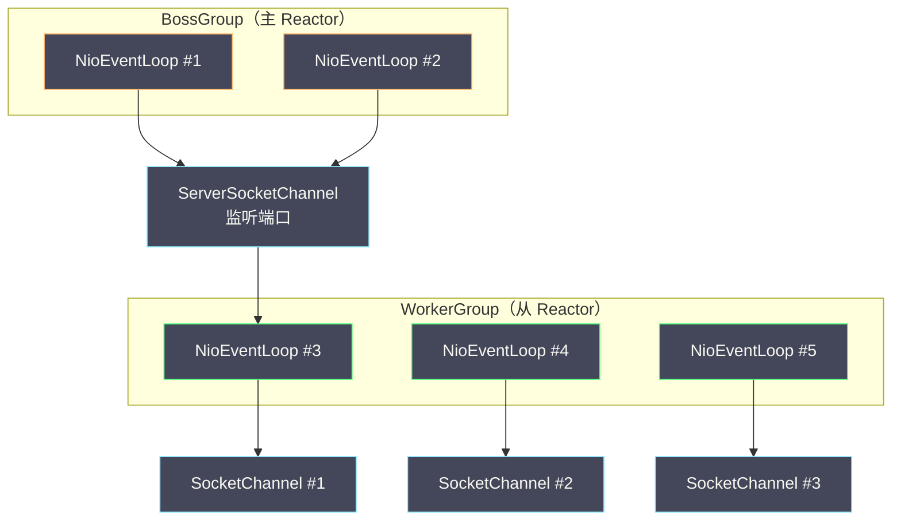
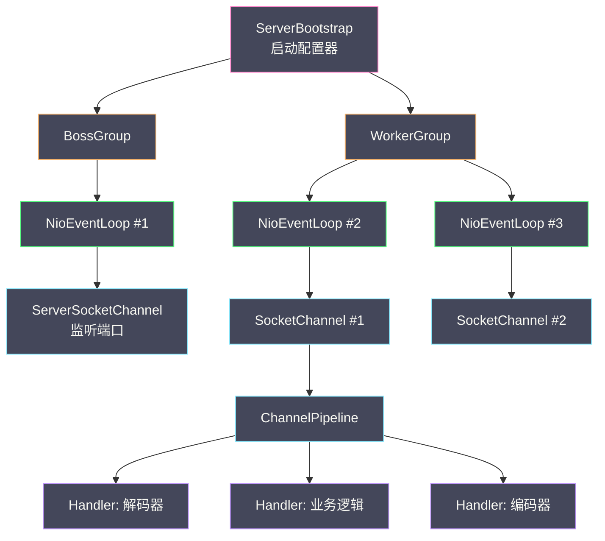
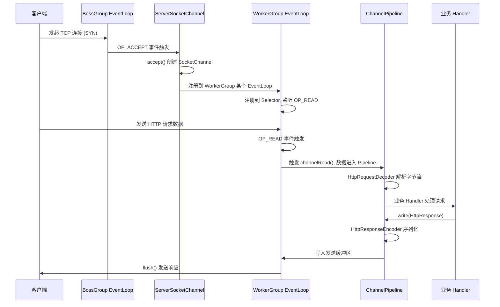
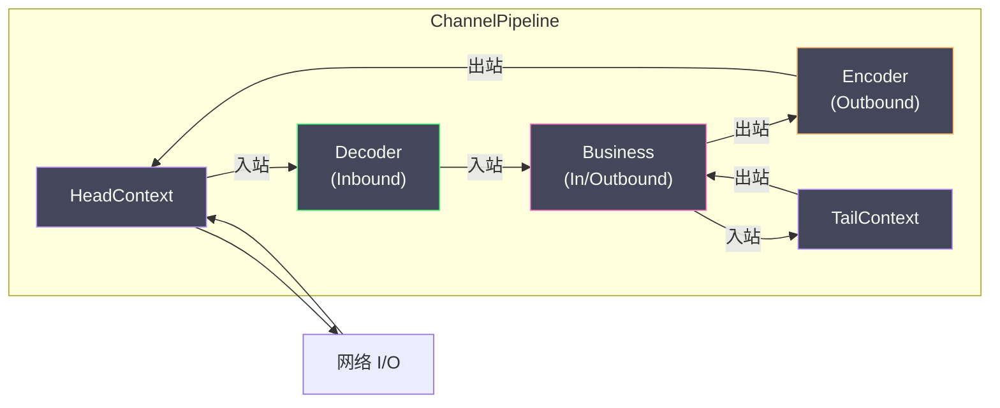

# Netty全局架构——从BossGroup到ChannelPipeline

**摘要：**

2008 年，韩国程序员 Trustin Lee 在 JBoss 工作期间发起了 Netty 项目，初衷是为自己的 HTTP 服务器和 RPC 框架提供一个可靠的网络层。彼时 Java NIO 已经问世六年，但直接用 NIO 编写生产级网络服务的工程师都知道，那是一段充满陷阱的旅程——空轮询 Bug、粘包拆包、OP_WRITE 管理、Buffer 生命周期，每一个都足以让一个看似正常的服务在生产环境中突然崩溃。Netty 的出现不是重新发明 NIO，而是把 NIO 的原语组装成一套"正确使用方式"的工程框架。本文以一个 Netty 服务器的启动和请求处理流程为主线，从 Reactor 模式的理论基石出发，系统讲解 `EventLoopGroup` 的主从 Reactor 架构、`ServerBootstrap` 的配置与启动过程、`NioEventLoop` 的内部循环机制、`Channel` 的生命周期抽象，以及 `ChannelPipeline` 的双向责任链设计，勾勒出 Netty 的完整架构全貌。理解这套全局架构，是深入 Netty 每一个组件实现细节的前提。

---

## 第 1 章 Netty 的诞生与价值

### 1.1 从 NIO 到 Netty

上一篇我们看到了 Java NIO 的三大组件——Channel、Buffer、Selector——以及它们如何解决了 BIO 的 C10K 困境。但 NIO 解决的是"能不能"的问题，不是"好不好用"的问题。一个手写 NIO 服务器的工程师需要同时处理：`Selector.select()` 在某些 Linux 内核下的空轮询 Bug、`OP_WRITE` 的按需注册与注销、TCP 粘包拆包的应用层处理、`ByteBuffer` 的 `flip()`/`clear()`/`compact()` 状态管理、连接关闭与异常处理的边界情况。这些问题中的任何一个处理不当，都会导致服务器在特定条件下出现 CPU 飙升、内存泄漏、连接泄漏或数据错乱。

Netty 的价值可以用一句话概括：**它是"正确实现 NIO 编程"的工程答案**。这个"正确实现"包含两个层面。第一个层面是正确性——Netty 通过精心设计的 API 和内部实现，把 NIO 编程中的已知陷阱一一填平：空轮询 Bug 有自动检测和 Selector 重建机制，粘包拆包有 `ByteToMessageDecoder` 体系，`OP_WRITE` 有自动注册注销逻辑，Buffer 生命周期有引用计数管理，连接异常有 `ChannelHandler` 生命周期回调。第二个层面是性能——Netty 的 `ByteBuf` 用读写双指针替代了 `ByteBuffer` 的单指针 `flip()` 模式，`PooledByteBufAllocator` 用 jemalloc 算法池化堆外内存消除了 GC 压力，`FastThreadLocal` 用数组索引替代了 `ThreadLocal` 的哈希探测，`EventLoop` 的单线程化设计消除了 Channel 操作的锁竞争。这两个层面合在一起，使得 Netty 既是"安全的 NIO"也是"快速的 NIO"。

Netty 在 Java 生态中的地位可以用"事实标准"来形容。Apache Dubbo 的 `NettyServer` 和 `NettyClient`、Apache RocketMQ 的 `RemotingServer`、gRPC-Java 的传输层、Elasticsearch 的 `Netty4Transport`、Spring WebFlux 的 Reactor Netty——这些主流中间件和框架的网络层无一例外地构建在 Netty 之上。一个 Java 后端工程师即使不直接使用 Netty，他用的中间件也几乎一定在间接使用 Netty。理解 Netty 的内部机制，既是掌握高性能网络编程的必经之路，也是深入理解上述中间件通信层设计的前置知识。

### 1.2 版本演进

理解 Netty 要先了解版本历史，因为网络上大量资料混用了不同版本的 API，容易引起混乱。Netty 3.x 是最早期的版本，入站和出站 Handler 接口分离，使用 `ChannelBuffer` 作为缓冲区抽象，目前已停止维护。Netty 4.x 是当前主流版本，Handler 统一为 `ChannelHandler` 接口，引入了 `ByteBuf` 替代 `ChannelBuffer`，重构了线程模型，引入了引用计数和内存池化——本专栏所有内容基于 Netty 4.x（当前最新稳定版 4.1.x）。Netty 5.x 曾经尝试引入 `ForkJoinPool` 替代 `EventLoop` 的线程模型，但因复杂度过高且收益不明确，在 2015 年被官方宣布放弃——这是一个值得玩味的决策，它说明 Netty 团队认为"简单且够用"比"先进但复杂"更重要，架构不是越新越好，而是越合适越好。

| 版本 | 状态 | 核心变化 |
|------|------|----------|
| Netty 3.x | 已停止维护 | 入站/出站 Handler 接口分离，`ChannelBuffer` |
| Netty 4.x | 当前主流 | Handler 统一为 `ChannelHandler`，引入 `ByteBuf`，重构线程模型 |
| Netty 5.x | 已放弃（2015） | 尝试引入 `ForkJoinPool`，因复杂度过高放弃 |

Netty 5.x 的放弃是一个值得深思的工程决策。Netty 团队在 2013 年开始开发 5.x 版本，试图用 `ForkJoinPool` 替代 `EventLoop` 的单线程模型，引入更灵活的线程调度。但经过两年的开发和测试，团队发现 5.x 的复杂度大幅增加而性能提升微乎其微——`ForkJoinPool` 的 work-stealing 调度在 Netty 的使用模式下并没有比固定线程的 `EventLoop` 更快，反而引入了更多的线程竞争点和调试困难。2015 年，Netty 团队正式宣布放弃 5.x，将全部精力集中在 4.x 的持续优化上。这个决策反映了一个重要的工程哲学：**简单且够用的方案，比先进但复杂的方案更有价值**。Netty 的 `EventLoop` 单线程模型虽然"不够先进"，但它在实践中被证明是高效且可靠的——复杂性不会消失只会转移，引入 `ForkJoinPool` 的复杂性转移到了调试和运维层面，而那正是最难以量化和控制的部分。

---

## 第 2 章 Reactor 模式：Netty 架构的理论基石

### 2.1 Reactor 模式的起源

在深入 Netty 的具体组件之前，必须先理解其架构背后的设计模式——Reactor 模式（Reactor Pattern）。Reactor 模式是处理并发 I/O 的经典设计模式，由 Douglas Schmidt 在 1995 年的论文《Reactor: An Object Behavioral Pattern for Demultiplexing and Dispatching Handles for Synchronous Events》中正式提出。Schmidt 是 ACE（Adaptive Communication Environment）框架的作者，ACE 是 1990 年代 C++ 网络编程领域最有影响力的框架之一，Reactor 模式正是 ACE 的核心架构。

Reactor 模式的核心思想是将 I/O 事件的"等待就绪"与"事件处理"分离——专门有一个组件（Reactor）负责监听事件并分发，具体的处理逻辑由注册的 Handler 完成。这个思想说起来简单，但它是对传统"一个连接一个线程"模型的根本性颠覆：传统模型中，线程既等待又处理，等待时线程被挂起；Reactor 模式中，等待由 Reactor 统一负责（通过 I/O 多路复用），处理由 Handler 分散负责，线程只在有事件时才被唤醒执行处理逻辑。

Reactor 模式由三个角色构成。Reactor（反应堆/事件分发器）持续监听 I/O 事件，将就绪事件分发给对应的 Handler；Acceptor（接受者）专门处理新连接事件，将新建的 Channel 注册到 Reactor；Handler（处理者）处理具体的 I/O 事件，包括读、写和业务逻辑。这个角色划分对应到 Netty 中：Reactor 对应 `NioEventLoop`（内部的 `Selector` 加事件循环），Acceptor 对应 `ServerBootstrap` 注册到 `BossGroup` 的 `ServerSocketChannel` Handler，Handler 对应 `ChannelPipeline` 中的各个 `ChannelHandler`。

Reactor 模式的精髓在于"事件驱动"——线程不再主动轮询 I/O 状态，而是被动等待事件通知，只在有事件时才被唤醒执行处理逻辑。这种模式把 CPU 时间从"等待"中解放出来，让线程始终在做有用的工作。从更宏观的视角看，Reactor 模式是"控制反转"（Inversion of Control）思想在 I/O 领域的体现——传统模型中，应用程序主动调用 `read()` 等待数据（"你来问我"）；Reactor 模式中，应用程序注册兴趣后被动等待事件通知（"我准备好了叫你"）。控制权从应用程序转移到了事件分发器，应用程序只需编写"事件来了做什么"的逻辑，而不需要关心"如何等待事件"。

### 2.2 三种 Reactor 线程模型

Reactor 模式根据线程配置不同，衍生出三种线程模型，理解这三种模型是理解 Netty `BossGroup`/`WorkerGroup` 设计的前提。

**单线程 Reactor 模型**是最简单的形态：一个线程既负责 `accept()` 新连接，又负责处理所有连接的 I/O 和业务逻辑。这个模型的优点是实现简单、无线程切换开销，缺点也显而易见——一旦某个 Handler 处理耗时，所有连接都被阻塞。它只适合低并发、简单业务的场景，Redis 6.0 之前就是单线程 Reactor 模型（Redis 的业务逻辑足够轻量，单线程反而避免了锁竞争）。Redis 的选择说明了一个道理：没有"落后"的模型，只有"不合适"的模型——如果你的业务逻辑足够轻量，单线程 Reactor 的简单性反而是优势。

**多线程 Reactor 模型**将 Acceptor 和 Handler 分离：一个专用线程负责 `accept()` 新连接，一个线程池负责处理已建立连接的 I/O 和业务逻辑。新连接建立后，Acceptor 线程将 `SocketChannel` 分配给线程池中的某个线程，该线程在自己的 `Selector` 上监听这个 Channel 的 I/O 事件并处理。这个模型解决了单线程模型的阻塞问题，但 Acceptor 线程仍然是单点——如果连接建立频率很高（每秒数万新连接），Acceptor 线程可能成为瓶颈。另一个问题是，多个线程各自维护一个 `Selector`，连接如何在多个 `Selector` 之间分配需要额外考虑——如果分配不均，某些线程可能过载而其他线程空闲。

**主从多线程 Reactor 模型**进一步将 Acceptor 线程池化：主 Reactor 有多个线程，专门处理 `accept()` 和 SSL 握手等连接建立阶段的工作；从 Reactor 有多个线程，处理已建立连接的 I/O；业务逻辑可以由独立的业务线程池处理，也可以直接在从 Reactor 线程中执行。这种模型适合极高并发场景，如大型 API 网关。Netty 的默认配置就是主从 Reactor 模型——`BossGroup` 对应主 Reactor，`WorkerGroup` 对应从 Reactor。

三种模型的演进路径本身就是"架构是演进出来的"这一命题的注脚。单线程模型最简单但天花板最低，多线程模型解决了阻塞问题但引入了线程分配的复杂性，主从模型进一步解决了 Acceptor 单点问题但增加了线程数管理的复杂度。每一步演进都在解决前一步的瓶颈，同时也引入了新的复杂度——这就是架构权衡的本质，有利有弊才需要决策，有取有舍才需要权衡。没有银弹，只有因地制宜地选择适合当前业务规模和特征的方案。



### 2.3 Reactor 与 Proactor 的分野

Reactor 模式有一个"兄弟"——Proactor 模式（Proactor Pattern），同样由 Douglas Schmidt 提出。两者的区别在于 I/O 操作的发起者不同：Reactor 是同步 I/O 模型，应用程序在事件就绪后自己调用 `read()`/`write()` 完成数据传输；Proactor 是异步 I/O 模型，应用程序发起 `read()`/`write()` 请求后立即返回，操作系统在数据传输完成后回调通知应用程序。

Reactor 模式对应 Linux 的 `epoll`（同步非阻塞），Proactor 模式对应 Windows 的 IOCP（异步 I/O）。Linux 长期以来没有完善的异步 I/O 支持——`aio_read`/`aio_write` 的实现一直被诟病，直到 2019 年 `io_uring` 进入 Linux 5.1 内核才有了真正高效的异步 I/O 方案。这就是 Netty 选择 Reactor 模式而非 Proactor 模式的根本原因——不是 Reactor 比 Proactor 更好，而是 Linux 平台上 Reactor 的基础设施更成熟。Netty 曾经有过 AIO 支持（`AioEventLoopGroup`），但在 Linux 上 AIO 的性能优势不明显且 API 复杂，在 Netty 5.x 被放弃后，AIO 支持也随之移除。

这个选择反映了一个重要的架构原则：**技术选型不是选"最好"的，而是选"最合适"的**。Proactor 在理论上比 Reactor 更高效（应用程序完全不参与 I/O 等待），但在 Linux 平台上 Reactor 的生态更成熟、调试更方便、性能已经足够好。Netty 选择了一条务实的路线，而非追求理论最优。实践标准取代规范标准——一个被大量生产环境验证过的方案，比一个理论上更先进但缺乏实践检验的方案更值得信赖。

### 2.4 Netty 对 Reactor 模式的落地

Netty 的主从 Reactor 落地方式有一个值得注意的细节：`BossGroup` 通常只需要 1 个线程，因为 `accept()` 操作本身非常轻量——它只是从内核的连接队列中取出一个已完成的连接，不涉及数据读写。`WorkerGroup` 的线程数默认是 CPU 核数的两倍，这个数字来自 NIO 的经验法则——I/O 等待时间通常占处理时间的一半左右，两倍线程数可以确保在部分线程等待 I/O 时，其余线程仍有足够的 CPU 时间处理事件。

但这个默认值不是银弹。如果你的业务是 CPU 密集型（如加解密、序列化），WorkerGroup 的线程数应该等于 CPU 核数——更多的线程只会增加上下文切换开销而不会提升吞吐量。如果你的业务是 I/O 密集型（如代理转发，Handler 只做简单的数据搬运），线程数可以适当增大。这就是"因地制宜"——没有放之四海皆准的线程数，只有根据业务特征做的权衡。

Netty 的 Reactor 落地还有一个设计细节值得注意：`BossGroup` 和 `WorkerGroup` 可以是同一个 `EventLoopGroup` 实例。在低并发场景下，你可以用同一个线程组既接受连接又处理 I/O，省去线程切换的开销。但在高并发场景下，分离 `BossGroup` 和 `WorkerGroup` 是更好的选择——`accept()` 和 I/O 处理互不干扰，且 `BossGroup` 可以独立扩展（如配置多个线程以应对极高的连接建立频率）。Netty 的 API 设计让这种切换只需改一行代码（`b.group(workerGroup)` vs `b.group(bossGroup, workerGroup)`），体现了框架对"因地制宜"的支持。

---

## 第 3 章 核心组件全景

### 3.1 组件层次关系

理解 Netty 的关键，是先在脑海中建立各组件之间的层次关系。下面这张图展示了一个 Netty 服务端从启动到处理请求的完整组件拓扑：



各组件的职责可以用一句话概括：`ServerBootstrap` 是服务端启动的"配置中心"，将所有组件组装起来并绑定端口；`BossGroup` 负责监听端口、接受新连接，通常只需 1 个线程；`WorkerGroup` 负责处理已建立连接的所有 I/O 操作，通常 CPU 核数乘 2 个线程；`NioEventLoop` 是一个真实的线程，内部有一个 `Selector`，负责处理分配给自己的 Channel 的所有事件；`Channel` 是对一个网络连接的抽象；`ChannelPipeline` 是每个 Channel 内置的 `ChannelHandler` 有序链表；`ChannelHandler` 是实际的业务逻辑处理单元。

### 3.2 一个请求的完整生命周期

以一个 HTTP 请求为例，串联所有组件的协作过程：



这个时序图揭示了 Netty 工作模式的核心特征：`BossGroup` 只做一件事——`accept()` 新连接；新连接被注册到 `WorkerGroup` 的某个 `EventLoop`，之后该连接的所有 I/O 事件都在这个 `EventLoop` 中处理；`EventLoop` 是单线程的，Channel 的所有操作都在同一线程执行，无需加锁；数据读取后进入 `ChannelPipeline`，依次经过各个 `ChannelHandler` 处理，最终到达业务逻辑。

这个流程中有几个值得深究的细节。第一，新连接从 `BossGroup` 移交给 `WorkerGroup` 的过程涉及一次 `Selector` 注册——`BossGroup` 的 `EventLoop` 在 `accept()` 得到新 `SocketChannel` 后，调用 `WorkerGroup` 的 `next()` 选出一个 `WorkerGroup` 的 `EventLoop`，然后把这个 `SocketChannel` 注册到该 `EventLoop` 的 `Selector` 上。这个注册操作是在 `WorkerGroup` 的 `EventLoop` 线程中执行的（通过任务队列提交），而非在 `BossGroup` 的 `EventLoop` 线程中直接执行——这保证了两个 `EventLoop` 之间的线程安全。第二，数据进入 Pipeline 后，`HttpRequestDecoder` 把字节流解析为 `HttpRequest` 对象，然后通过 `fireChannelRead` 传递给下一个 Handler。如果 `HttpRequestDecoder` 一次只收到了部分 HTTP 请求（如 header 还没读完），它会保留累积缓冲区等待更多数据，不会把半成品传给后续 Handler——这就是 Netty 对粘包拆包的标准处理方式。第三，业务 Handler 调用 `write(response)` 后，响应数据沿 Pipeline 反向传播，经过 `HttpResponseEncoder` 编码为字节流，最终由 `HeadContext` 调用 `unsafe.write()` 写入发送缓冲区。`flush()` 操作触发 `HeadContext` 的 `unsafe.flush()`，将发送缓冲区的数据真正写入网络。

---

## 第 4 章 Bootstrap：启动配置器

### 4.1 ServerBootstrap 的链式配置

`ServerBootstrap` 是 Netty 服务端的启动入口，采用链式 Builder 风格配置。一段典型的 Netty 服务端启动代码如下：

```java
NioEventLoopGroup bossGroup = new NioEventLoopGroup(1);    // 1 个线程接受连接
NioEventLoopGroup workerGroup = new NioEventLoopGroup();   // 默认 CPU核数×2 个线程

try {
    ServerBootstrap b = new ServerBootstrap();
    b.group(bossGroup, workerGroup)             // 设置主从 Reactor 线程组
     .channel(NioServerSocketChannel.class)     // 指定 Channel 实现类
     .option(ChannelOption.SO_BACKLOG, 128)     // 服务端 Channel 的 TCP 参数
     .childOption(ChannelOption.SO_KEEPALIVE, true)  // 客户端 Channel 的 TCP 参数
     .childOption(ChannelOption.TCP_NODELAY, true)   // 禁用 Nagle 算法
     .handler(new LoggingHandler(LogLevel.INFO))     // BossGroup 的 Handler
     .childHandler(new ChannelInitializer<SocketChannel>() {
         // 每个新连接建立时调用，为其初始化 Pipeline
         @Override
         protected void initChannel(SocketChannel ch) {
             ch.pipeline()
               .addLast(new HttpServerCodec())           // HTTP 编解码
               .addLast(new HttpObjectAggregator(65536)) // HTTP 消息聚合
               .addLast(new MyBusinessHandler());        // 业务逻辑
         }
     });

    ChannelFuture f = b.bind(8080).sync();  // 绑定端口，同步等待
    f.channel().closeFuture().sync();       // 等待服务器关闭
} finally {
    workerGroup.shutdownGracefully();
    bossGroup.shutdownGracefully();
}
```

这段代码虽然只有二十来行，但它配置了 Netty 服务端的全部核心要素：线程模型（`group`）、传输方式（`channel`）、TCP 参数（`option`/`childOption`）、处理链（`childHandler`）。`ServerBootstrap` 的链式 API 设计让这些配置一目了然，但每个配置项背后的含义都值得深究。

`handler()` 和 `childHandler()` 的区别是另一个容易混淆的点。`handler()` 配置的是 `BossGroup` 的 Channel（即 `ServerSocketChannel`）的 Handler，它处理的是 `accept` 事件和服务器自身的日志——通常只配一个 `LoggingHandler`。`childHandler()` 配置的是每个新建立的 `SocketChannel` 的 Handler，它处理的是实际的业务数据——通常配一个 `ChannelInitializer` 来初始化业务 Pipeline。这个区分和 `option()`/`childOption()` 的区分一样，都是 Netty 对"服务端监听 Channel"和"客户端连接 Channel"两种角色的映射。

### 4.2 option 与 childOption 的区别

`option()` 和 `childOption()` 是 `ServerBootstrap` 的两套配置接口，区别在于作用对象。`option()` 作用于 `ServerSocketChannel`（监听端口的 Channel），譬如 `SO_BACKLOG`（listen 队列大小）；`childOption()` 作用于每个新建立的 `SocketChannel`（客户端连接），譬如 `SO_KEEPALIVE`、`TCP_NODELAY`。这个区分是 Netty 对 TCP 连接两种角色的映射——服务端监听套接字和客户端连接套接字是不同类型的 socket，它们的可配置参数也不同。

`SO_BACKLOG` 是高并发服务必须关注的参数。它控制 TCP 的全连接队列（accept queue）大小——当客户端完成三次握手后，连接会进入这个队列等待 `accept()` 取走。如果队列满了，新完成握手的连接会被内核丢弃（或发送 RST），客户端表现为连接被拒绝。在高并发场景下（如秒杀、抢购），瞬间大量连接涌入，如果 `SO_BACKLOG` 太小，大量连接会被丢弃。生产环境通常设置为 1024 或更大，同时需要配合调整内核参数 `net.core.somaxconn`（内核允许的最大 backlog 值）和 `net.ipv4.tcp_max_syn_backlog`（SYN 队列大小），否则应用层设置的 `SO_BACKLOG` 会被内核截断到内核参数的上限。

| 选项 | 默认值 | 含义 |
|------|--------|------|
| `SO_BACKLOG` | 128 | TCP 全连接队列大小，高并发服务应增大到 1024+ |
| `SO_KEEPALIVE` | false | TCP 层 Keepalive，空闲连接存活探测 |
| `TCP_NODELAY` | false | 禁用 Nagle 算法，降低小包延迟 |
| `SO_RCVBUF` | 系统默认 | 接收缓冲区大小 |
| `SO_SNDBUF` | 系统默认 | 发送缓冲区大小 |
| `SO_REUSEADDR` | false | 允许端口重用（TIME_WAIT 状态下重新绑定） |

> [!info] TCP_NODELAY 与 RPC 延迟
> Nagle 算法（1984 年 John Nagle 提出）的设计初衷是减少网络上的小数据包数量：它规定在有未被确认的数据包时，新产生的小数据包不立即发送，而是等待更多数据一起发送或等到 ACK 到来。这个策略对批量传输有利，但对 RPC 调用非常有害——RPC 请求往往是一个小包（请求头加少量参数），Nagle 算法会让它等待几十毫秒再发送，显著增加延迟。因此 RPC 框架（Dubbo、gRPC 等）几乎无一例外地设置 `TCP_NODELAY=true`。这个参数的取舍是"吞吐量 vs 延迟"的经典权衡：禁用 Nagle 牺牲了少量吞吐量，换来了更低的单次请求延迟。

### 4.3 ChannelInitializer：延迟初始化

`ChannelInitializer` 是 Netty 的一个特殊 `ChannelHandler`，其核心设计是**延迟初始化**——每当有新连接建立时，Netty 才调用 `initChannel()` 方法为这个 `SocketChannel` 初始化 `ChannelPipeline`。`ChannelInitializer` 本身在 `initChannel()` 执行完后会自动从 Pipeline 中移除自己，它只是初始化工具，不参与后续数据处理。

这个延迟初始化的设计有两个好处。第一，Pipeline 的配置可以动态决定——虽然大多数情况下所有连接的 Pipeline 配置相同，但某些场景需要根据连接的来源（如不同的监听端口、不同的客户端 IP）配置不同的 Handler。第二，避免了在服务端启动时就为所有可能的连接创建 Pipeline 对象——连接是运行时才建立的，Pipeline 也应该在连接建立时才创建，这符合"按需分配"的工程原则。

`ChannelInitializer` 的自动移除机制值得深究。`initChannel()` 执行完后，`ChannelInitializer` 会调用 `pipeline.remove(this)` 把自己从 Pipeline 中移除。这个移除操作是必要的——`ChannelInitializer` 只负责初始化，不参与后续的数据处理，如果不移除，每个数据包都会经过它一次，既浪费性能又可能导致意外行为。自动移除的设计让程序员只需关注"初始化时做什么"，不需要记住"初始化后清理自己"，减少了出错的可能。

### 4.4 bind() 的内部过程

`ServerBootstrap.bind(port)` 看起来是一行代码，内部经历了一系列组件协作。首先，`bind()` 通过 `ReflectiveChannelFactory` 创建 `NioServerSocketChannel` 实例（`channel()` 方法指定的 Class 的反射实例化）。然后，`bind()` 将这个 Channel 注册到 `BossGroup` 的某个 `EventLoop` 上——注册过程通过 `EventLoopGroup.next()` 选出一个 `EventLoop`，再调用 `EventLoop.register(channel)` 将 Channel 的 `SelectionKey` 注册到该 `EventLoop` 的 `Selector` 上，监听 `OP_ACCEPT` 事件。最后，Channel 调用 `bind()` 方法绑定到指定端口，整个过程通过 `ChannelFuture` 返回异步结果。

`bind().sync()` 的 `sync()` 调用会阻塞当前线程直到绑定操作完成——如果绑定成功（端口可用），`sync()` 正常返回；如果绑定失败（端口被占用），`sync()` 抛出异常。这是 Netty 异步编程模型的典型用法：操作返回 `ChannelFuture` 表示异步结果，调用 `sync()` 等待完成，或调用 `addListener()` 注册回调在完成后异步处理。

`ServerBootstrap` 的配置链设计有一个值得注意的细节：`group()`、`channel()`、`option()`、`childHandler()` 等方法都返回 `this`（即 `ServerBootstrap` 自身），使得配置可以链式调用。这种 Builder 模式的优点是配置项一目了然且顺序灵活，缺点是配置项之间有隐含的依赖关系——譬如 `channel()` 必须在 `bind()` 之前调用，`childHandler()` 必须在 `group()` 之后调用——这些依赖关系在编译期不检查，运行时才报错。Netty 在 `bind()` 内部会做基本的配置完整性检查（譬如 `group` 和 `channelFactory` 不能为 null），但更细致的依赖关系需要程序员自己保证。

---

## 第 5 章 EventLoopGroup 与 EventLoop

### 5.1 EventLoopGroup 的职责

`EventLoopGroup` 是 `EventLoop` 的容器，本质是一个线程池。`NioEventLoopGroup` 在创建时初始化指定数量的 `NioEventLoop`，每个 `NioEventLoop` 对应一个真实的 Java 线程。`EventLoopGroup` 的核心能力是 Channel 到 `EventLoop` 的分配——当新连接建立时，`BossGroup` 通过 `next()` 方法从 `WorkerGroup` 中选出一个 `EventLoop`，将新 Channel 注册到这个 `EventLoop` 的 `Selector` 上。

Netty 默认使用轮询（Round-Robin）策略将 Channel 均匀分配到各个 `EventLoop`，确保负载均衡。轮询策略的优点是简单且公平，缺点是无法感知各个 `EventLoop` 的实际负载——如果某个 `EventLoop` 上的 Channel 恰好都很活跃，它可能过载，而其他 `EventLoop` 却空闲。Netty 没有提供更复杂的负载均衡策略（如最少连接数），因为在实践中轮询已经足够均匀，且 Channel 的活跃度在连接建立时无法预知。

`EventLoopGroup` 的创建过程也值得了解。`new NioEventLoopGroup()` 不带参数时，线程数默认为 `CPU 核数 * 2`，这个值通过 `MultithreadEventExecutorGroup` 的默认 `Executor` 计算得出。每个 `NioEventLoop` 在创建时会打开一个 `Selector`，并创建一个 `MpscQueue` 作为任务队列。`EventLoop` 的线程是懒启动的——第一次有任务提交或 Channel 注册时才真正启动线程，这避免了创建 `EventLoopGroup` 后不使用时的线程浪费。`EventLoopGroup` 内部用一个 `AtomicInteger` 作为轮询计数器，`next()` 方法通过 `AtomicInteger.getAndIncrement() % threadCount` 选出下一个 `EventLoop`，这个 CAS 操作保证了多线程下的线程安全。

### 5.2 NioEventLoop 的内部循环

`NioEventLoop` 是 Netty 最核心的类之一，它的 `run()` 方法是一个无限循环，包含三个阶段：`select()` 阻塞等待 I/O 事件，`processSelectedKeys()` 处理就绪的 I/O 事件，`runAllTasks()` 执行任务队列中积累的非 I/O 任务。这三个阶段周而复始，构成了 Netty 的"心跳"。

```java
// NioEventLoop.run() 的核心逻辑（简化版）
@Override
protected void run() {
    int selectCnt = 0;
    for (;;) {
        int strategy = selectStrategy.calculateStrategy(selectNowSupplier, hasTasks());
        if (strategy == SelectStrategy.SELECT) {
            // 没有待处理任务时，阻塞等待 I/O 事件
            strategy = select(nextScheduledTaskDeadlineNanos());
        }

        selectCnt++;
        final int ioRatio = this.ioRatio;  // 默认 50

        if (ioRatio == 100) {
            processSelectedKeys();   // 处理 I/O 事件
            ranTasks = runAllTasks(); // 处理所有任务
        } else if (strategy > 0) {
            final long ioStartTime = System.nanoTime();
            processSelectedKeys();
            final long ioTime = System.nanoTime() - ioStartTime;
            // 根据 I/O 耗时和 ioRatio 计算任务处理的时间预算
            ranTasks = runAllTasks(ioTime * (100 - ioRatio) / ioRatio);
        } else {
            ranTasks = runAllTasks(0);
        }

        // 空轮询检测
        if (ranTasks || strategy > 0) {
            selectCnt = 0;
        } else if (unexpectedSelectorWakeup(selectCnt)) {
            selectCnt = 0;  // 重建 Selector
        }
    }
}
```

这个循环的设计有一个精妙之处：`select()` 的阻塞行为受任务队列状态影响。如果任务队列中有待处理的任务，`EventLoop` 会用 `selectNow()`（非阻塞立即返回）而非 `select(timeout)`（阻塞等待），确保任务不会被 I/O 等待延迟。如果任务队列为空，才用 `select(timeout)` 阻塞等待 I/O 事件，`timeout` 取最近一个定时任务的到期时间——这样 `EventLoop` 既不会在无事件时空转，也不会错过定时任务的执行。

### 5.3 任务队列与跨线程提交

`NioEventLoop` 继承自 `SingleThreadEventExecutor`，内部维护一个任务队列（`taskQueue`，默认是 `MpscQueue`——多生产者单消费者无锁队列）和一个定时任务队列（`scheduledTaskQueue`）。当其他线程需要向 `EventLoop` 提交任务时（譬如业务线程池处理完后需要把结果写回 Channel），调用 `eventLoop.execute(task)` 将任务放入任务队列，如果 `EventLoop` 正在 `select()` 阻塞，则通过 `wakeup()` 唤醒它。

这个机制是 Netty 线程安全模型的核心：**Channel 的所有操作都在其绑定的 `EventLoop` 线程中执行**。如果调用方恰好在 `EventLoop` 线程中（`inEventLoop()` 返回 true），任务直接同步执行；如果调用方在其他线程中，任务被放入队列异步执行。这个判断逻辑在 Netty 的几乎所有方法中都有体现——譬如 `Channel.write()` 的实现会先检查 `inEventLoop()`，如果在 `EventLoop` 线程中就直接执行写操作，否则把写操作包装成任务放入队列。

`MpscQueue`（Multi-Producer Single-Consumer Queue）的选择也值得注意。多个业务线程可能同时向同一个 `EventLoop` 提交任务（多生产者），但只有 `EventLoop` 自己的消费线程从队列中取任务（单消费者）。`MpscQueue` 用 CAS 操作实现多生产者的无锁入队，用简单的数组索引实现单消费者的无锁出队，避免了 `LinkedBlockingQueue` 的锁竞争。这是 Netty 高性能的"最后一公里"之一，笔者在后续高性能篇中会详细剖析。

### 5.4 ChannelFuture：异步操作的结果

Netty 的所有 I/O 操作（`bind`、`connect`、`write`、`close` 等）都是异步的——方法调用返回时操作尚未完成，返回的 `ChannelFuture` 代表这个操作的"未来结果"。`ChannelFuture` 有两种使用方式：`sync()` 同步等待操作完成（阻塞当前线程直到操作完成或失败），`addListener()` 注册回调在操作完成后异步通知。

```java
// 方式一：sync() 同步等待
ChannelFuture bindFuture = b.bind(8080);
bindFuture.sync();  // 阻塞直到绑定完成，失败则抛异常

// 方式二：addListener() 异步回调
bindFuture.addListener(future -> {
    if (future.isSuccess()) {
        System.out.println("Bind succeeded");
    } else {
        future.cause().printStackTrace();
    }
});
```

`sync()` 的使用要小心——如果在 `EventLoop` 线程中调用 `sync()`，会导致死锁（`EventLoop` 线程被阻塞等待自己执行的操作完成，但操作需要 `EventLoop` 线程来执行）。Netty 在 `sync()` 内部检测了这种情况并抛出 `BlockingOperationException`，但最佳实践是避免在 `EventLoop` 线程中使用 `sync()`，改用 `addListener()`。

### 5.3 ioRatio：I/O 与任务的时间分配

`ioRatio` 是 `NioEventLoop` 的一个重要配置参数（默认 50），控制 I/O 操作与任务处理之间的 CPU 时间分配比例。`ioRatio = 50` 表示 I/O 处理时间与任务处理时间一比一；`ioRatio = 100` 表示不限制任务处理时间（先处理所有 I/O，再处理所有任务）；`ioRatio = 70` 表示 I/O 处理时间占 70%，任务处理时间占 30%。

这个参数的调优逻辑是：I/O 密集型应用（Handler 逻辑轻量，大部分时间在等网络数据）可以适当提高 `ioRatio`，让 `EventLoop` 花更多时间在 `select()` 上等待 I/O 事件；任务密集型应用（Handler 逻辑重，或有大量定时任务）可以降低 `ioRatio`，让 `EventLoop` 花更多时间处理任务。但要注意，`ioRatio` 只是一个参考比例，不是硬性限制——`runAllTasks(timeLimit)` 会在时间预算用完前尽量多执行任务，但如果某个任务本身就很耗时，它不会被中途打断。

### 5.5 优雅关闭

`EventLoopGroup.shutdownGracefully()` 是 Netty 优雅关闭的入口。它的行为是：停止接受新任务，等待正在执行的任务完成（有一个静默期，默认 2 秒），然后强制关闭。这个过程确保了正在处理的 I/O 事件和任务不会因为关闭而被截断——这对于生产环境的平滑发布至关重要。

优雅关闭的时序是：调用 `shutdownGracefully()` → `EventLoop` 停止 `select()` 循环 → 等待静默期内任务队列排空 → 关闭所有注册的 Channel → 关闭 `Selector` → 释放线程。如果在静默期内任务队列没有排空，`EventLoop` 会在超时后（默认 15 秒）强制关闭，避免无限等待。这个"静默期 + 超时"的双阶段设计，既给了正在处理的请求足够的时间完成，又避免了某个卡住的任务导致关闭过程无限拖延。

优雅关闭在生产环境中的重要性怎么强调都不为过。一个粗暴的 `kill -9` 会导致正在处理的请求被截断、正在写入的数据丢失、正在握手的连接被重置——这些问题在用户层面表现为"偶尔报错"或"数据不一致"，排查起来极其困难。优雅关闭确保了服务在退出前完成所有正在处理的工作，是生产级服务的基本要求。Netty 的 `shutdownGracefully()` 把这个复杂的过程封装成了一行代码，但理解它背后的时序和参数，才能在遇到关闭超时或关闭卡住时正确诊断问题。

---

## 第 6 章 Channel：连接的抽象

### 6.1 Netty Channel 与 JDK Channel 的关系

Netty 的 `Channel` 接口对 JDK `java.nio.channels.Channel` 进行了高度封装，增加了大量 Netty 特有的能力：关联的 `EventLoop`（所有操作在这个线程执行）、`ChannelPipeline`（Handler 链）、`ChannelConfig`（连接参数配置）、`Unsafe`（底层 I/O 操作的内部接口，不暴露给用户）、`write()`/`writeAndFlush()`（带缓冲区的发送接口）、`attr()`（自定义属性存储）。

Netty 的 `Channel` 提供了 `attr()` 方法，可以在 Channel 上附加任意的键值对属性，类似 NIO 的 `SelectionKey.attachment()`，但更强大——`AttributeKey` 是类型安全的泛型 key，避免了 `attachment()` 的强制类型转换：

```java
// 定义属性 Key（通常作为静态常量）
static final AttributeKey<UserSession> SESSION_KEY = AttributeKey.valueOf("session");

// 在 Handler 中设置属性（登录成功时存储会话）
ctx.channel().attr(SESSION_KEY).set(new UserSession(userId, token));

// 在另一个 Handler 中读取属性（用于鉴权）
UserSession session = ctx.channel().attr(SESSION_KEY).get();
if (session == null || !session.isValid()) {
    ctx.close();  // 未登录，关闭连接
}
```

这个机制让不同 `ChannelHandler` 之间能够共享同一个 Channel 上的状态信息，而无需全局变量或线程本地变量。由于 Channel 的所有操作都在同一个 `EventLoop` 线程中执行，`attr()` 的读写天然线程安全，无需任何额外同步措施。

### 6.2 Channel 的类型体系

Netty 提供了多种 Channel 实现，对应不同的传输方式。`NioServerSocketChannel` 和 `NioSocketChannel` 基于 Java NIO，是跨平台的默认选择。`EpollServerSocketChannel` 和 `EpollSocketChannel` 基于 Netty 的原生 epoll Transport，只在 Linux 上可用，但暴露了 epoll 的更多特性（如边缘触发、`EPOLLET` 标志），性能比 NIO 版本略高。`LocalServerChannel` 和 `LocalChannel` 用于进程内通信（不走网络，走 JVM 内部的"虚拟连接"），常用于测试。`OioServerSocketChannel` 和 `OioSocketChannel` 基于 BIO，已废弃，仅用于兼容旧代码。

| Channel 类型 | 传输方式 | 平台 | 特点 |
|--------------|----------|------|------|
| `NioServerSocketChannel` | Java NIO | 跨平台 | 默认选择，基于 `epoll`/`kqueue`/IOCP |
| `EpollServerSocketChannel` | 原生 epoll | Linux only | 支持边缘触发，性能略高 |
| `LocalServerChannel` | JVM 内部 | 跨平台 | 进程内通信，不走网络 |
| `OioServerSocketChannel` | BIO | 跨平台 | 已废弃 |

NIO Transport 和 Epoll Transport 的选择是 Netty 中一个典型的"跨平台 vs 平台特化"权衡。NIO Transport 通过 Java 的 `Selector` 抽象屏蔽了平台差异，一份代码在 Linux、macOS、Windows 上都能运行；Epoll Transport 直接调用 Linux 的 `epoll` 系统调用，跳过了 JDK 的 `Selector` 封装层，减少了对象创建和 GC 开销，还能使用 `epoll` 的边缘触发模式。在生产环境（通常部署在 Linux 上），Epoll Transport 是更优的选择；在开发环境（可能是 macOS），NIO Transport 更方便。Netty 通过统一的 `Channel` 接口让这两种 Transport 的使用方式完全一致，切换只需改一行代码。

`Unsafe` 是 Netty Channel 内部的一个接口，名字虽然叫"Unsafe"但并非 Java 的 `sun.misc.Unsafe`——它是 Netty 自己定义的内部接口，封装了底层的 I/O 操作（`read`、`write`、`bind`、`connect`、`close` 等）。`Unsafe` 的设计意图是"不暴露给用户的内部操作"——这些操作如果直接暴露给用户，很容易被误用导致 Channel 状态不一致（譬如在 Channel 未注册时调用 `unsafe.write()`）。Netty 通过 `channel.unsafe()` 访问 `Unsafe` 实例，但在公共 API 中不暴露这个接口，用户应该通过 `channel.write()` 等高层 API 操作 Channel，而非直接调用 `unsafe` 方法。

### 6.3 Channel 的生命周期

Netty `Channel` 有四个状态，对应 `ChannelHandler` 的四个生命周期回调：`REGISTERED`（Channel 注册到 EventLoop 的 Selector）、`ACTIVE`（TCP 连接建立成功）、`INACTIVE`（TCP 连接断开）、`UNREGISTERED`（Channel 从 EventLoop 注销）。

| Channel 状态 | 触发的 Handler 方法 | 说明 |
|--------------|---------------------|------|
| `REGISTERED` | `channelRegistered()` | Channel 注册到 EventLoop |
| `ACTIVE` | `channelActive()` | TCP 连接建立（三次握手完成） |
| `INACTIVE` | `channelInactive()` | TCP 连接断开 |
| `UNREGISTERED` | `channelUnregistered()` | Channel 从 EventLoop 注销 |

状态转换路径是线性的：创建 Channel → `channelRegistered()` → `channelActive()` → 正常数据收发 → `channelInactive()` → `channelUnregistered()`。在实际开发中，`channelActive()` 常用于在连接建立时发送欢迎消息或初始化连接状态，`channelInactive()` 常用于清理连接相关资源（如移除在线用户列表中的记录）。这个生命周期模型把连接的状态变化抽象为清晰的事件，让 Handler 可以在合适的时机做合适的处理，而不需要手动检查连接状态。

`exceptionCaught()` 是生命周期之外一个极其重要的回调。当 Pipeline 中任何 Handler 抛出异常时，异常会沿 Pipeline 向 tail 方向传播，直到某个 Handler 的 `exceptionCaught()` 处理了它（或到达 `TailContext` 打印错误日志）。如果你在 Handler 中不处理异常也不调用 `ctx.fireExceptionCaught()`，异常会被静默吞掉——这在生产环境中是危险的，因为连接可能已经处于不一致状态但没有任何日志记录。最佳实践是在 Pipeline 末尾添加一个专门的异常处理 Handler，统一处理所有未捕获的异常：记录日志、关闭连接、上报监控。

---

## 第 7 章 ChannelPipeline：责任链的实现

### 7.1 Pipeline 的本质

`ChannelPipeline` 是 Netty 中最精妙的设计之一，它是责任链（Chain of Responsibility）设计模式在网络编程中的极致应用。每个 `Channel` 创建时，Netty 自动为其创建一个 `ChannelPipeline`。Pipeline 本质上是一个双向链表，链表节点是 `ChannelHandlerContext`，每个节点包装了一个 `ChannelHandler`。

数据在 Pipeline 中的流动方向有两种：Inbound（入站）数据从网络到业务，方向是 head 到 tail；Outbound（出站）数据从业务到网络，方向是 tail 到 head。这个双向设计是 Pipeline 的核心——同一条链路同时承载了入站和出站两种数据流，入站走 InboundHandler 从 head 到 tail，出站走 OutboundHandler 从 tail 到 head，两种 Handler 在链路中可以交错排列，各自只处理自己关心的方向。



`HeadContext` 和 `TailContext` 是 Netty 在 Pipeline 两端自动插入的两个特殊节点。`HeadContext` 同时是 Inbound 和 Outbound Handler，负责最终的 I/O 操作（底层 `unsafe.read()`/`unsafe.write()`）——所有出站数据最终都经过 `HeadContext` 写入网络，所有入站数据的起点也是 `HeadContext` 从网络读取后触发传播。`TailContext` 是 Inbound Handler，当入站消息没有被任何 Handler 消费时，`TailContext` 会打印警告日志并释放消息（调用 `ReferenceCountUtil.release(msg)`），防止消息被静默丢弃——这对于引用计数的 `ByteBuf` 尤为重要，未释放的 `ByteBuf` 会导致内存泄漏。

Pipeline 的双向设计可以用一条流水线来比喻：入站是原料从一端进入，经过一道道工序（解码、校验、业务处理）变成成品；出站是成品从另一端进入，经过包装工序（编码、压缩）变成可运输的包裹。两种工序在同一条流水线上交错排列，各自只处理自己负责的步骤。这个比喻的局限在于，真实的 Pipeline 中入站和出站可以共享同一个 Handler（`ChannelDuplexHandler`），而流水线上的一个工位通常只做一件事——但核心的"有序处理、各司其职"的理念是一致的。

### 7.2 Handler 的分类

`ChannelHandler` 分为两种子接口。`ChannelInboundHandler`（入站处理器）处理入站事件，如数据读取、连接建立/断开、异常等，数据流向是网络到 Handler 到业务，常用方法包括 `channelActive`、`channelInactive`、`channelRead`、`channelReadComplete`、`exceptionCaught`。`ChannelOutboundHandler`（出站处理器）处理出站操作，如数据写出、连接建立、绑定端口等，数据流向是业务到 Handler 到网络，常用方法包括 `write`、`flush`、`connect`、`close`。`ChannelDuplexHandler` 同时实现 Inbound 和 Outbound 功能，适合需要处理双向数据的 Handler，如日志记录、监控指标收集。

Handler 的共享（Sharing）是另一个需要注意的设计点。默认情况下，每个连接的 Pipeline 中的 Handler 实例是独立的——`ChannelInitializer` 每次为新连接创建新的 Handler 实例。这是因为大多数 Handler 是有状态的（如解码器的累积缓冲区），不能被多个连接共享。但有些 Handler 是无状态的（如日志记录器、统计计数器），可以为所有连接共享同一个实例以减少对象创建。Netty 用 `@Sharable` 注解标记可共享的 Handler——被 `@Sharable` 标注的 Handler 可以被添加到多个 Channel 的 Pipeline 中，但程序员必须确保它的线程安全性（因为不同 Channel 的 EventLoop 可能是不同线程）。添加未标注 `@Sharable` 的 Handler 实例到多个 Pipeline 会被 Netty 检测并抛出异常，这是一个防止误用的保护机制。

`@Sharable` 的设计体现了 Netty 对"默认安全"的追求——默认情况下 Handler 不可共享（防止有状态 Handler 被误共享导致数据错乱），只有显式标注 `@Sharable` 才能共享（程序员必须意识到并承担线程安全的责任）。这种"默认严格、显式放宽"的设计哲学，比"默认宽松、需要手动加锁"的设计更不容易出错——人在匆忙中容易忘记加锁，但不容易忘记标注注解。

### 7.3 Pipeline 的动态修改

`ChannelPipeline` 支持在运行时动态修改 Handler 链——`addLast`、`addFirst`、`addBefore`、`addAfter`、`remove`、`replace` 等方法可以在任意时刻增删替换 Handler。这个能力在协议升级、动态拦截器、按需加载等场景下非常有用。譬如，一个 SSL/TLS 握手 Handler 在握手完成后可以把自己从 Pipeline 中移除，避免后续每个请求都经过 SSL 解密的额外开销；一个鉴权 Handler 在鉴权通过后可以移除自己，让后续请求直接到达业务 Handler。

Pipeline 的动态修改操作是线程安全的——如果调用方不在 `EventLoop` 线程中，操作会被包装成任务放入 `EventLoop` 的任务队列异步执行。这保证了 Pipeline 的链表结构不会被并发修改破坏，但也意味着动态修改不是即时生效的——如果在其他线程中调用 `pipeline.remove(handler)`，实际的移除要等到 `EventLoop` 处理到这个任务时才发生。

### 7.4 事件传播的规则

Pipeline 中事件传播的规则是 Netty 初学者最容易混淆的地方，也是 Pipeline 设计的精髓所在。核心规则有三条：`ctx.fireXxx()` 从当前 Handler 位置向后传播入站事件（找下一个 InboundHandler）；`ctx.write(msg)` 从当前 Handler 位置向前传播出站操作（找下一个 OutboundHandler，即更靠近 head 的）；`ctx.channel().write(msg)` 或 `ctx.pipeline().write(msg)` 从 tail 开始的出站操作，经过所有 OutboundHandler。

```java
// 方式一：从当前 Handler 向后传播入站事件
ctx.fireChannelRead(decodedMessage);  // → 下一个 InboundHandler

// 方式二：从当前 Handler 向前传播出站操作
ctx.write(msg);  // → 下一个 OutboundHandler（更靠近 head 的）

// 方式三：从 Pipeline 的 tail 开始传播出站操作
ctx.channel().write(msg);  // → 经过所有 OutboundHandler
```

方式二和方式三的区别在实际开发中经常踩坑：`ctx.write()` 从当前 Handler 位置开始向前找 OutboundHandler，不会经过比当前 Handler 更靠近 tail 的 OutboundHandler；`ctx.channel().write()` 从 tail 开始向前找，会经过所有 OutboundHandler。如果你的编码器在当前 Handler 的后面（更靠近 tail），`ctx.write()` 不会触发编码器，`ctx.channel().write()` 才会。

这个设计看似容易出错，实则有它的道理。`ctx.write()` 的语义是"我要把数据发出去，但只经过我前面的出站处理器"——这在某些场景下是有用的，譬如你的 Handler 已经完成了编码，不需要再经过后面的编码器。`ctx.channel().write()` 的语义是"我要把数据从 Pipeline 的起点发出去，经过所有出站处理器"——这是更常用的写法，确保数据经过完整的编码链路。理解了语义差异，就能在合适的场景选择合适的方法。

> [!warning] 忘记调用 ctx.fireChannelRead() 的后果
> 如果一个 InboundHandler 在 `channelRead()` 方法中没有调用 `ctx.fireChannelRead()`，消息就会在这个 Handler "截断"，后续的 Handler 收不到这条消息。这既是 Pipeline 的陷阱也是它的精髓——每个 Handler 可以选择性地"消费"消息（不往下传）或"转发"消息（继续往下传）。Netty 提供了 `SimpleChannelInboundHandler<T>` 帮助处理这个问题：它在 `channelRead()` 调用你的 `messageReceived()` 后自动释放消息（`ReferenceCountUtil.release(msg)`），同时默认不往下传递。如果消息是泛型类型 `T` 的实例则处理，否则直接往下传。

---

## 总结

Netty 的全局架构建立在主从 Reactor 线程模型之上，各组件各司其职，协同完成高性能网络通信。`ServerBootstrap` 是组装器，将 `BossGroup`、`WorkerGroup`、`Channel` 类型、`ChannelOption` 和 `ChannelHandler` 配置粘合起来，最终绑定端口启动服务。`BossGroup` 通常 1 个线程，专注于 `accept()` 新连接，新连接建立后立即移交给 `WorkerGroup`；`WorkerGroup` 通常 CPU 核数乘 2 个线程，负责已建立连接的所有 I/O 事件处理。`NioEventLoop` 是真实的执行线程，每个 `EventLoop` 绑定一个 `Selector`，通过 `select()` 等待事件，通过 `processSelectedKeys()` 处理事件，通过任务队列接受其他线程的任务提交——一个 Channel 的整个生命周期都绑定在同一个 `EventLoop`，这是 Netty 无锁化设计的基础。`ChannelPipeline` 是每个 Channel 内置的双向处理链，入站数据从 head 流向 tail，出站数据从 tail 流向 head。`ChannelHandler` 是业务逻辑的载体，分为 InboundHandler 和 OutboundHandler，通过 `ctx.fireXxx()` 传递入站事件，通过 `ctx.write()` 传递出站操作。

这套架构的精妙之处在于，它把"正确使用 NIO"这件事变成了一种声明式的工作——程序员只需在 `ChannelInitializer` 中配置 Handler 链，在 Handler 中编写业务逻辑，其余的一切（线程模型、事件分发、Buffer 管理、连接生命周期）都由框架处理。

回顾 Netty 的全局架构，可以发现几个贯穿始终的设计原则。第一是**单线程化**——Channel 的所有操作绑定在同一个 `EventLoop` 线程上，消除了锁竞争，这是 Netty 无锁化设计的基础。第二是**责任链**——Pipeline 把数据处理逻辑分解为独立的 Handler，每个 Handler 只关注自己的职责，通过 `fireXxx` 和 `write` 在链路中传递数据，这是 Netty 可组合性的基础。第三是**异步**——所有可能阻塞的操作都返回 `ChannelFuture`，调用方可以选择 `sync()` 同步等待或 `addListener()` 异步回调，这是 Netty 高并发能力的基础。第四是**抽象屏蔽**——`Channel` 接口屏蔽了 NIO 和原生 epoll 的差异，`EventLoop` 接口屏蔽了不同传输方式的差异，`ByteBuf` 接口屏蔽了堆内和堆外内存的差异，程序员面对的是统一的抽象，而非平台特定的细节。

架构不是发明出来的，是演进出来的——Netty 从 2008 年的简单网络封装，演进到今天 Dubbo、RocketMQ、Elasticsearch 共同依赖的基础设施，靠的不是某个天才的设计，而是对 NIO 每一个工程细节的持续打磨。从空轮询 Bug 的规避到内存池的引入，从 `ByteBuf` 的双指针设计到 `FastThreadLocal` 的数组索引优化，每一个改进都是对实际生产问题的回应。理解这套架构的全貌，是深入每一个组件实现细节的起点——后续篇章将逐一拆解 EventLoop 的线程模型、ByteBuf 的内存管理、Pipeline 的责任链机制、编解码器的粘包处理，最终完成从"理解架构"到"看懂源码"的跨越。

下一篇深入剖析 `EventLoop` 的线程模型——Netty 如何通过 `EventLoop` 实现完全无锁的并发模型，以及 `ioRatio`、任务队列、`ChannelFuture` 等关键设计的细节：[[03 EventLoop与线程模型——Reactor模式的落地实现]]。

---

## 参考资料

1. Norman Maurer, Marvin Allen Wolfthal. *Netty in Action*. Manning, 2016
2. Douglas Schmidt. *Reactor: An Object Behavioral Pattern for Demultiplexing and Dispatching Handles for Synchronous Events*. 1995
3. Trustin Lee. *Netty Project History*. <https://netty.io/wiki/>
4. `io.netty.channel.nio.NioEventLoop` 源码
5. `io.netty.bootstrap.ServerBootstrap` 源码
6. `io.netty.channel.DefaultChannelPipeline` 源码

---

> [!note] 思考题
> 1. Netty 的 Reactor 模式中，BossGroup 负责接受连接，WorkerGroup 负责处理 I/O 读写。BossGroup 通常只需要 1 个 EventLoop，但 WorkerGroup 默认使用 CPU 核数 × 2 个 EventLoop。如果你的业务是 CPU 密集型（如加解密），WorkerGroup 的线程数应该增大还是减小？为什么？如果业务是 I/O 密集型（如代理转发），线程数又该如何调整？
> 2. Netty 的 EventLoop 保证了一个 Channel 的所有 I/O 事件都由同一个线程处理——这消除了多线程竞争。但如果 ChannelHandler 中有一个耗时操作（如数据库查询），会阻塞 EventLoop 线程，影响该线程上所有 Channel 的处理。除了使用 `DefaultEventExecutorGroup` 将耗时操作卸载到业务线程池，还有哪些方案？每种方案的取舍是什么？
> 3. `ctx.write(msg)` 和 `ctx.channel().write(msg)` 的传播起点不同——前者从当前 Handler 位置向前找 OutboundHandler，后者从 Pipeline 的 tail 开始向前找。如果你在业务 Handler（位于 Pipeline 中间）中调用 `ctx.write(response)`，但编码器位于你的 Handler 之后（更靠近 tail），会发生什么？这种设计是有意为之还是 API 缺陷？
